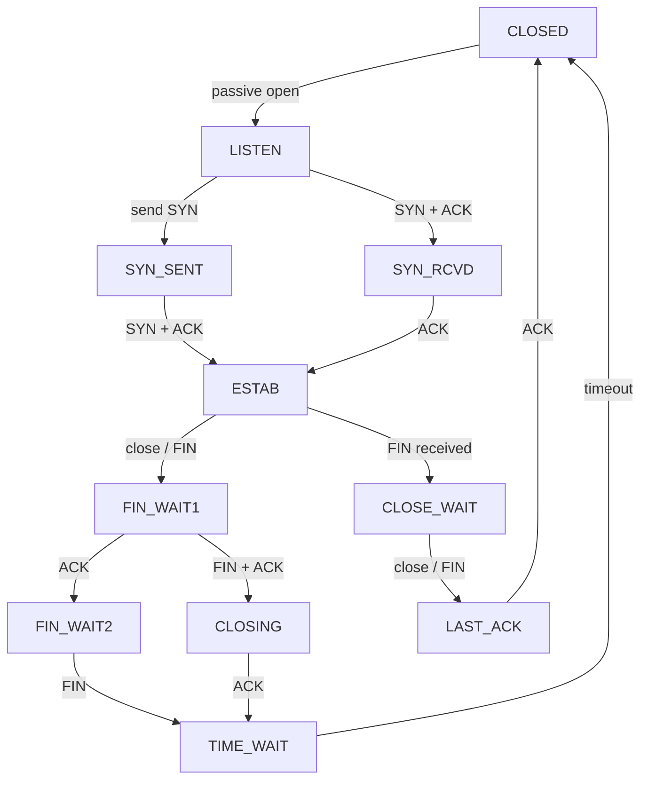

# Chapter 2: Computer Networks — Exam Quick Revision

## Learning Objectives
- Compare OSI and TCP/IP reference models with layer responsibilities
- Solve IP addressing and subnetting problems using CIDR notation
- Recall well-known port numbers and protocol operations
- Distinguish TCP features (reliable, connection-oriented) from UDP (stateless, fast)
- Trace TCP connection establishment and termination handshakes
- Analyze routing protocols and congestion control mechanisms
---

## 1. OSI vs TCP/IP Model

| Layer | OSI Model (7 Layers) | TCP/IP Model (4/5 Layers) | Protocols &amp; Devices |
|-------|---------------------|--------------------------|----------------------|
| 7 | Application | Application | HTTP, FTP, SMTP, DNS, DHCP, POP3, Telnet |
| 6 | Presentation | (merged) | SSL/TLS, MIME — encryption, compression |
| 5 | Session | (merged) | NetBIOS, RPC — session management |
| 4 | Transport | Transport | TCP, UDP |
| 3 | Network | Internet | IP, ICMP, ARP, OSPF, RIP, BGP — Router |
| 2 | Data Link | Network Access | Ethernet, PPP, MAC — Bridge, Switch |
| 1 | Physical | (hardware) | Cables, hubs, repeaters, modems |

**Exam Mnemonic for OSI:**
- Layer 7-1 (top→bottom): **A**ll **P**eople **S**eem **T**o **N**eed **D**ata **P**rocessing
- Layer 1-7 (bottom→top): **P**lease **D**o **N**ot **T**hrow **S**ausage **P**izza **A**way

---

## 2. IP Addressing

### Classful Addressing

| Class | Leading Bits | Range | NID Bits | HID Bits | Max Networks | Max Hosts/Network |
|-------|-------------|-------|----------|----------|-------------|-------------------|
| A | 0 | 1.0.0.0 – 126.255.255.255 | 8 | 24 | 126 | 2^24 − 2 = 16,777,214 |
| B | 10 | 128.0.0.0 – 191.255.255.255 | 16 | 16 | 16,384 | 2^16 − 2 = 65,534 |
| C | 110 | 192.0.0.0 – 223.255.255.255 | 24 | 8 | 2,097,152 | 2^8 − 2 = 254 |
| D | 1110 | 224.0.0.0 – 239.255.255.255 | — | — | Multicast | — |
| E | 1111 | 240.0.0.0 – 255.255.255.255 | — | — | Reserved | — |

### Classless Addressing (CIDR)

- Format: `IP_address/PrefixLength` — e.g., `192.168.10.0/24`
- Prefix length = number of bits in network portion
- **Subnet mask:** `255.255.255.0` or `11111111.11111111.11111111.00000000`

### Special Addresses

- **127.0.0.0/8:** Loopback (localhost)
- **0.0.0.0/8:** "This network" — default route
- **255.255.255.255:** Limited broadcast (all hosts on local net)
- **10.0.0.0/8, 172.16.0.0/12, 192.168.0.0/16:** Private (non-routable on internet)

### Solved Subnetting Numerical

**Problem:** You have the block `200.100.10.0/24`. Create 4 equal-sized subnets.

**Solution:**
- Need 2 bits for 4 subnets (2^2 = 4)
- New prefix: /24 + 2 = /26
- Subnet mask: 255.255.255.192

| Subnet | CIDR | First Host | Last Host | Broadcast |
|--------|------|-----------|-----------|-----------|
| 0 | 200.100.10.0/26 | 200.100.10.1 | 200.100.10.62 | 200.100.10.63 |
| 1 | 200.100.10.64/26 | 200.100.10.65 | 200.100.10.126 | 200.100.10.127 |
| 2 | 200.100.10.128/26 | 200.100.10.129 | 200.100.10.190 | 200.100.10.191 |
| 3 | 200.100.10.192/26 | 200.100.10.193 | 200.100.10.254 | 200.100.10.255 |

**Formula:** Number of hosts per subnet = 2^(32 − prefix) − 2 = 2^6 − 2 = 62

---

## 3. Protocol Port Numbers &amp; Layers

| Protocol | Port | Transport | Description |
|----------|------|-----------|-------------|
| FTP (data) | 20 | TCP | File transfer data channel |
| FTP (control) | 21 | TCP | File transfer command channel |
| SSH | 22 | TCP | Secure shell remote login |
| Telnet | 23 | TCP | Unencrypted remote login |
| SMTP | 25 | TCP | Email sending (MTA → MTA) |
| DNS | 53 | UDP (primary) | Domain name resolution |
| DHCP | 67/68 | UDP | Dynamic IP address allocation |
| HTTP | 80 | TCP | Web page transfer |
| POP3 | 110 | TCP | Email retrieval (download) |
| IMAP | 143 | TCP | Email retrieval (server-side) |
| HTTPS | 443 | TCP | HTTP over SSL/TLS |
| RDP | 3389 | TCP | Remote Desktop Protocol |

### Key Protocol Operations

| Protocol | Operation Summary |
|----------|------------------|
| **ARP** | Broadcast "Who has IP X?" → Host with IP X replies with MAC address. Cached in ARP table. |
| **RARP** | Reverse of ARP — given MAC, find IP (used by diskless workstations) |
| **DHCP (DORA)** | D: Discover (client broadcast), O: Offer (server), R: Request (client), A: Acknowledge (server) |
| **DNS** | Hierarchical: Root → TLD (.com, .org) → Authoritative. Recursive vs Iterative queries. |
| **HTTP/2** | Multiplexed streams, header compression (HPACK), server push, binary framing layer |
| **FTP** | Two connections: control (21) + data (20). Active vs Passive modes. |
| **SMTP** | Push protocol — uses port 25. MTA transfers between mail servers. |
| **POP3** | Download-then-delete model. Port 110. |
| **IMAP** | Server-side mail storage, folders, partial fetch. Port 143. |

---

## 4. TCP vs UDP

| Feature | TCP | UDP |
|---------|-----|-----|
| Connection | Connection-oriented (3-way handshake) | Connectionless |
| Reliability | Reliable (ACK + retransmission) | Unreliable (best-effort) |
| Ordered delivery | Yes (sequence numbers) | No (no ordering guarantee) |
| Flow control | Sliding window (RWND) | None |
| Congestion control | Slow start, congestion avoidance | None |
| Header size | 20–60 bytes | 8 bytes |
| State | Stateful | Stateless |
| Use cases | HTTP, FTP, SMTP, SSH | DNS, VoIP, DHCP, video streaming |

---

## 5. TCP Connection Management

### 3-Way Handshake (Establishment)

```
Client (SYN=1, seq=100) ---------------→ Server
Client ←------ (SYN=1, ACK=1, seq=300, ack=101) Server
Client (ACK=1, seq=101, ack=301) -----→ Server
```
**Step 1:** Client sends SYN with initial sequence number (ISN)
**Step 2:** Server responds with SYN+ACK (own ISN + client ISN+1)
**Step 3:** Client sends ACK confirming server ISN+1

### Connection Termination (4-Way)

```
Client (FIN=1, seq=x) ----→ Server
Client ←--- (ACK=1, ack=x+1) ---- Server
Client ←--- (FIN=1, seq=y) ------ Server
Client (ACK=1, ack=y+1) ---→ Server
```
**States:** FIN_WAIT_1 → FIN_WAIT_2 → TIME_WAIT → CLOSED

---

## 6. Sliding Window &amp; Flow Control

- **Send window:** Allows multiple unacknowledged packets in flight
- **Receiver window (RWND):** Advertised by receiver — available buffer space
- **Congestion window (CWND):** Sender's estimate of network capacity
- **Effective window = min(RWND, CWND)**

---

## 7. Congestion Control — TCP States

```
          +----------+
          |  Slow    |  (exponential growth: CWND × 2 each RTT
          |  Start   |   until ssthresh)
          +----+-----+
               |
         (CWND ≥ ssthresh)
               |
          +----v-----+
          |Congestion |  (additive increase: CWND += 1 MSS per RTT)
          |Avoidance  |
          +----+-----+
               |
           (3 dup ACK)
               |
          +----v-----+
          |  Fast     |  (CWND = CWND/2, ssthresh = CWND/2, enter CA)
          |Retransmit |
          +----------+
```

### Congestion Control Algorithms

| Algorithm | Trigger | Response |
|-----------|---------|----------|
| Slow Start | Connection start / timeout | CWND = 1, double each RTT until ssthresh |
| Congestion Avoidance | CWND ≥ ssthresh | CWND += 1 per RTT (linear) |
| Fast Retransmit | 3 duplicate ACKs | Retransmit lost segment immediately |
| Fast Recovery | After fast retransmit | CWND = ssthresh, enter CA (Tahoe: set CWND=1) |

---

## 8. Routing Algorithms

### Distance Vector (RIP)

- Each router shares its full routing table with **neighbors only**
- Uses Bellman-Ford algorithm
- **Metric:** Hop count (max 15 — infinity)
- **Count-to-infinity problem:** Solved by split horizon + poison reverse
- **Updates:** Every 30 seconds
- **Hold-down timer:** 180 seconds

### Link State (OSPF)

- Each router floods its **local link state** to all routers in the area
- All routers build the complete network topology (LSDB)
- **Dijkstra's algorithm** computes shortest path tree
- **Metric:** Bandwidth-based cost (10^8 / bandwidth in bps)
- **Fast convergence** — no count-to-infinity
- **Hierarchical:** Areas (Backbone area 0, normal areas)

### Comparison

| Feature | Distance Vector (RIP-2) | Link State (OSPF) |
|---------|------------------------|-------------------|
| Algorithm | Bellman-Ford (distributed) | Dijkstra (global) |
| Convergence | Slow | Fast |
| Update type | Full table (periodic) | Link state (triggered) |
| Metric | Hop count (max 15) | Cost (bandwidth) |
| Scalability | Small networks | Large enterprise |
| VLSM/CIDR | Supported (RIP-2) | Supported |

### BGP (Border Gateway Protocol)

- **Path vector protocol** — exchanges reachability information between ASes
- Uses TCP (port 179)
- **Attributes:** AS_PATH, NEXT_HOP, LOCAL_PREF, MED
- **Policy-based** routing (not metric-based)
- **eBGP:** Between different ASes; **iBGP:** Within same AS

---

## Solved MCQs

**Q1:** In CIDR notation, the block 192.168.10.0/28 can support how many hosts?
- (a) 14
- (b) 16
- (c) 28
- (d) 30

**Answer:** (a) 14. 2^(32−28) − 2 = 2^4 − 2 = 16 − 2 = 14.

**Q2:** During TCP slow start, if CWND = 2 MSS and 2 ACKs are received, CWND becomes:
- (a) 2
- (b) 4
- (c) 6
- (d) 8

**Answer:** (b) 4. Each ACK increases CWND by 1 MSS. Two ACKs = CWND + 2 = 4 MSS. (Slow start doubles CWND per RTT, not per ACK; but per-ACK increment is 1 MSS × number of ACKs.)

**Q3:** Which protocol uses DORA sequence for IP address assignment?
- (a) DNS
- (b) DHCP
- (c) ARP
- (d) ICMP

**Answer:** (b) DHCP. Discover → Offer → Request → Acknowledge.

---

## 9. Error Detection Methods

### Parity Check

- **Simple parity:** Add single bit to make total 1s even/odd
- **Detects:** Odd number of bit errors
- **Fails:** Even number of bit errors

### Checksum (Internet Checksum)

- Sum all 16-bit words, take 1's complement
- Used in: TCP, UDP, IP headers
- **Detects:** Most common transmission errors

### Cyclic Redundancy Check (CRC)

- Treat data as binary polynomial; divide by generator polynomial G(x)
- Append remainder (CRC) to data
- **Detects:** All single-bit errors, all double-bit errors, odd number of errors, burst errors &lt; degree of G(x)

| Standard | Generator Polynomial | CRC Size | Used In |
|----------|---------------------|----------|---------|
| CRC-8 | x^8 + x^2 + x + 1 | 8 bits | 1-Wire |
| CRC-16-CCITT | x^16 + x^12 + x^5 + 1 | 16 bits | Bluetooth, XMODEM |
| CRC-32 | x^32 + x^26 + x^23 + x^22 + x^16 + x^12 + x^11 + x^10 + x^8 + x^7 + x^5 + x^4 + x^2 + x + 1 | 32 bits | Ethernet, PNG, ZIP |

### Hamming Code

- **Single error correction (SEC):** Add parity bits at positions 2^k
- **Hamming distance:** Minimum bit flips between valid codewords
- **Detection:** d+1. **Correction:** 2d+1 (where d = distance to detect)

## 10. CSMA/CD &amp; CSMA/CA

### CSMA/CD (Carrier Sense Multiple Access / Collision Detection)

Used in: **Ethernet (802.3)**

```
1. Sense channel
2. If idle → transmit; else wait
3. If collision detected → send jam signal
4. Exponential backoff: wait random time (0 to 2^k−1 slots)
5. Retry
```

**Minimum frame size** requirement: Must be &gt; 2 × propagation delay × bandwidth (to detect all collisions)

### CSMA/CA (Collision Avoidance)

Used in: **Wi-Fi (802.11)**

- **Virtual carrier sensing:** RTS/CTS (Request to Send / Clear to Send)
- **Physical carrier sensing:** Listen before talk
- **Random backoff:** Avoid simultaneous transmission
- **ACK:** Receiver acknowledges successful frame (missing ACK ⇒ retransmit)

| Feature | CSMA/CD (Ethernet) | CSMA/CA (Wi-Fi) |
|---------|-------------------|-----------------|
| Collision handling | Detect + jam signal | Avoid + ACK |
| Wired/wireless | Wired | Wireless |
| Hidden node problem | No | Yes (solved by RTS/CTS) |
| Frame size requirement | Minimum frame | Maximum frame (fragmentation) |

## 11. IPv6 Essentials

### IPv4 vs IPv6

| Aspect | IPv4 | IPv6 |
|--------|------|------|
| Address size | 32 bits | 128 bits |
| Address format | Dotted decimal (192.168.1.1) | Hexadecimal (2001:db8::1) |
| Address count | ~4.3 billion | ~3.4×10^38 |
| Header size | 20-60 bytes | 40 bytes (fixed) |
| Fragmentation | Routers can fragment | Only sender fragments |
| Checksum | Yes (header) | No (rely on link layer) |
| NAT | Common practice | Not needed (enough addresses) |
| Broadcast | Yes | No (uses multicast/anycast) |

### IPv6 Address Types

- **Unicast:** One-to-one communication
- **Multicast:** One-to-many (prefix FF00::/8)
- **Anycast:** One-to-nearest (multiple nodes share address)
- **No broadcast** in IPv6 — replaced by multicast

### IPv6 Header Simplification

- No checksum (end-to-end reliability delegated to transport)
- No fragmentation fields (path MTU discovery only)
- Flow label for QoS
- Extension headers for options (instead of variable-length base header)

## 12. Network Devices Comparison

| Device | Layer | Function | Collision Domain | Broadcast Domain |
|--------|-------|----------|-----------------|------------------|
| **Hub** | 1 (Physical) | Repeats signal to all ports | Single | Single |
| **Switch** | 2 (Data Link) | Forwards frames by MAC address | Per port | Single |
| **Bridge** | 2 (Data Link) | Connects two LAN segments | Per segment | Single |
| **Router** | 3 (Network) | Forwards packets by IP address | Per port | Per port |
| **Gateway** | 3-7 | Protocol translation (network ↔ network) | N/A | N/A |
| **Modem** | 1-2 | Modulates/demodulates analog ↔ digital | N/A | N/A |
| **Access Point** | 2 | Wireless ↔ wired bridge | Per radio | Single |

---

---

## 📌 Extended Theory — Deep Dive for IBPS SO Mains (2024–2026 Trends)

### TCP State Machine — Full Diagram



> **PYQ 2024:** In TCP, a connection is in ESTABLISHED state. The server sends FIN and receives ACK. The server moves to which state?

**Answer:** Server moves to FIN_WAIT_2, then receives FIN from client → TIME_WAIT → CLOSED after 2MSL timeout.

### TypeScript Subnet Calculator

```typescript
interface SubnetInfo {
  networkAddress: string;
  broadcastAddress: string;
  firstHost: string;
  lastHost: string;
  mask: string;
  prefix: number;
  totalHosts: number;
  usableHosts: number;
}

function calculateSubnet(ip: string, prefix: number, subnets: number): SubnetInfo[] {
  const ipParts = ip.split('.').map(Number);
  const ipInt = ipParts.reduce((acc, octet) => (acc << 8) + octet, 0);
  const bitsNeeded = Math.ceil(Math.log2(subnets));
  const newPrefix = prefix + bitsNeeded;
  const subnetSize = 2 ** (32 - newPrefix);
  const maskInt = ~(2 ** (32 - newPrefix) - 1) >>> 0;

  const maskStr = [
    (maskInt >>> 24) & 0xFF,
    (maskInt >>> 16) & 0xFF,
    (maskInt >>> 8) & 0xFF,
    maskInt & 0xFF,
  ].join('.');

  const result: SubnetInfo[] = [];
  const networkBase = ipInt & maskInt;
  for (let i = 0; i < subnets; i++) {
    const netAddr = networkBase + i * subnetSize;
    const bcastAddr = netAddr + subnetSize - 1;
    const toStr = (n: number): string =>
      [(n >>> 24) & 0xFF, (n >>> 16) & 0xFF, (n >>> 8) & 0xFF, n & 0xFF].join('.');
    result.push({
      networkAddress: toStr(netAddr),
      broadcastAddress: toStr(bcastAddr),
      firstHost: toStr(netAddr + 1),
      lastHost: toStr(bcastAddr - 1),
      mask: maskStr,
      prefix: newPrefix,
      totalHosts: subnetSize,
      usableHosts: subnetSize - 2,
    });
  }
  return result;
}
// calculateSubnet('192.168.1.0', 24, 4) → 4 subnets, /26 each, 62 usable hosts each
```

### Routing Algorithm Simulator — Dijkstra's for OSPF

```typescript
interface Router {
  id: string;
  neighbors: Map<string, number>; // neighbor → cost
}

function dijkstra(routers: Map<string, Router>, source: string): Map<string, {dist: number; nextHop: string}> {
  const dist = new Map<string, number>();
  const prev = new Map<string, string | null>();
  const unvisited = new Set(routers.keys());

  for (const id of routers.keys()) {
    dist.set(id, id === source ? 0 : Infinity);
    prev.set(id, null);
  }

  while (unvisited.size > 0) {
    const current = [...unvisited].reduce((a, b) =>
      (dist.get(a) ?? Infinity) < (dist.get(b) ?? Infinity) ? a : b
    );
    unvisited.delete(current);

    for (const [neighbor, cost] of routers.get(current)!.neighbors) {
      const alt = (dist.get(current) ?? Infinity) + cost;
      if (alt < (dist.get(neighbor) ?? Infinity)) {
        dist.set(neighbor, alt);
        prev.set(neighbor, current);
      }
    }
  }

  // Build routing table
  const result = new Map<string, {dist: number; nextHop: string}>();
  for (const dest of routers.keys()) {
    if (dest === source) continue;
    let hop: string | null = dest;
    while (prev.get(hop) !== source) {
      hop = prev.get(hop) ?? null;
      if (hop === null || hop === dest) break;
    }
    result.set(dest, { dist: dist.get(dest) ?? 0, nextHop: hop ?? dest });
  }
  return result;
}
```

### OSI Model Deep-Dive with Real-World Examples

| Layer | Function | Real-World Example | Attack Vector | Protocol Data Unit |
|-------|----------|-------------------|---------------|-------------------|
| Application (7) | User interface, resource sharing | Web browser, email client | SQL injection, XSS | Data/Message |
| Presentation (6) | Encryption, compression, translation | SSL/TLS, JPEG, GIF | Padding oracle attack | Data |
| Session (5) | Session mgmt, checkpoints | NetBIOS, RPC, SIP | Session hijacking | Data |
| Transport (4) | End-to-end reliability | TCP/UDP segments | SYN flood, port scan | Segment |
| Network (3) | Routing, logical addressing | IP, routers | IP spoofing, DDoS | Packet |
| Data Link (2) | Framing, MAC, error detection | Ethernet, switches, WiFi | ARP spoofing, MAC flood | Frame |
| Physical (1) | Bit transmission, encoding | Cables, hubs, radio | Eavesdropping, jamming | Bits |

### TCP Congestion Control — CWND Evolution with TypeScript

```typescript
interface CWNDEvent {
  time: number;
  cwnd: number;
  ssthresh: number;
  event: string;
}

function simulateTCP(cwndInitial: number, ssthreshInitial: number, rttCount: number): CWNDEvent[] {
  const events: CWNDEvent[] = [];
  let cwnd = cwndInitial; // MSS units
  let ssthresh = ssthreshInitial;
  let phase: 'slow-start' | 'cong-avoid' = 'slow-start';

  for (let rtt = 0; rtt < rttCount; rtt++) {
    events.push({ time: rtt, cwnd, ssthresh, event: phase });

    if (phase === 'slow-start') {
      cwnd *= 2; // double each RTT
      if (cwnd >= ssthresh) {
        phase = 'cong-avoid';
      }
    } else {
      cwnd += 1; // additive increase
    }

    // Simulate 3 duplicate ACKs at RTT 6
    if (rtt === 5) {
      ssthresh = Math.floor(cwnd / 2);
      cwnd = ssthresh; // Fast Recovery: set to ssthresh
      events.push({ time: rtt, cwnd, ssthresh, event: 'fast-retransmit' });
    }
  }
  return events;
}
// simulateTCP(1, 16, 10) → slow start: 1→2→4→8→16→32, then ssthresh=16, cwnd=16 → +1 each RTT
```

### VLAN and Subnetting — Advanced Numerical

> **PYQ 2025:** An organization needs 6 subnets from network 172.16.0.0/16. The largest subnet needs 5000 hosts. Design the subnet scheme.

**Solution:**
- For 5000 hosts: need 2^h − 2 ≥ 5000 → 2^h ≥ 5002 → h = 13 (2^13 = 8192)
- So prefix = 32 − 13 = /19 per subnet
- For 6 subnets: need ⌈log2(6)⌉ = 3 subnet bits
- Starting from /16, take 3 bits → /19
- Subnet 0: 172.16.0.0/19 (hosts: 172.16.0.1 – 172.16.31.254)
- Subnet 1: 172.16.32.0/19
- ... up to Subnet 7: 172.16.224.0/19
- Valid subnets: 0–5 (6 subnets)
- Each subnet has 2^13 − 2 = 8190 usable hosts ✓

### IP Fragmentation Numerical

**Problem:** A 4000-byte IP packet (20-byte header, 3980-byte payload) must traverse a link with MTU 1500 bytes.

**Solution:**
- Max payload per fragment = 1500 − 20 = 1480 bytes
- Number of fragments = ⌈3980/1480⌉ = 3
- Fragment 1: Offset = 0, MF = 1, size = 1500 (1480 data)
- Fragment 2: Offset = 1480/8 = 185, MF = 1, size = 1500 (1480 data)
- Fragment 3: Offset = 2960/8 = 370, MF = 0, size = 3980 − 2960 + 20 = 1040 (1020 data)

## 📝 Solved Examples (20 MCQs)

<details>
<summary>Q1: What is the network address of 192.168.15.200/27?</summary>
(a) 192.168.15.128 (b) 192.168.15.192 (c) 192.168.15.160 (d) 192.168.15.0
**Answer:** (b) 192.168.15.192. /27 mask = 255.255.255.224. The interesting octet is 224 = 11100000. 200 & 224 = 192. So network = 192.168.15.192.
</details>

<details>
<summary>Q2: Which OSI layer provides encryption and compression?</summary>
(a) Application (b) Presentation (c) Session (d) Transport
**Answer:** (b) Presentation (Layer 6). It handles data translation, encryption, compression, and syntax.
</details>

<details>
<summary>Q3: In TCP, how many states exist in the connection management state machine?</summary>
(a) 7 (b) 9 (c) 11 (d) 13
**Answer:** (c) 11. CLOSED, LISTEN, SYN_SENT, SYN_RCVD, ESTAB, FIN_WAIT1, FIN_WAIT2, CLOSE_WAIT, CLOSING, LAST_ACK, TIME_WAIT.
</details>

<details>
<summary>Q4: Which routing protocol uses Dijkstra's algorithm?</summary>
(a) RIP (b) BGP (c) OSPF (d) EIGRP
**Answer:** (c) OSPF. It's a link-state protocol that uses Dijkstra to compute shortest path tree from the LSDB.
</details>

<details>
<summary>Q5: What is the total number of hosts possible in a /22 subnet?</summary>
(a) 510 (b) 1022 (c) 1024 (d) 2046
**Answer:** (b) 1022. 2^(32−22) − 2 = 2^10 − 2 = 1024 − 2 = 1022.
</details>

<details>
<summary>Q6: Which field in TCP header indicates the number of 32-bit words in the header?</summary>
(a) Offset (b) Data Offset (c) Header Length (d) Window
**Answer:** (b) Data Offset (4 bits). It indicates the TCP header length in 32-bit words. Minimum = 5 (20 bytes), maximum = 15 (60 bytes).
</details>

<details>
<summary>Q7: In CSMA/CD, if the propagation delay is 25 μs and bandwidth is 100 Mbps, what is the minimum frame size?</summary>
(a) 2500 bits (b) 5000 bits (c) 10000 bits (d) 12500 bits
**Answer:** (b) 5000 bits. Minimum frame size = 2 × propagation delay × bandwidth = 2 × 25×10^−6 × 100×10^6 = 5000 bits.
</details>

<details>
<summary>Q8: Which protocol is used to obtain the MAC address from an IP address?</summary>
(a) RARP (b) ARP (c) DHCP (d) DNS
**Answer:** (b) ARP. Address Resolution Protocol broadcasts "Who has IP X?" to find the corresponding MAC address.
</details>

<details>
<summary>Q9: In IPv6, how many bits are in the address space?</summary>
(a) 32 (b) 64 (c) 128 (d) 256
**Answer:** (c) 128 bits. IPv6 = 128 bits (3.4×10^38 addresses), IPv4 = 32 bits.
</details>

<details>
<summary>Q10: Which TCP flag is used to abort a connection abruptly?</summary>
(a) FIN (b) RST (c) PSH (d) URG
**Answer:** (b) RST (Reset). Used when a connection is refused, host unreachable, or protocol error occurs.
</details>

<details>
<summary>Q11: What is the default subnet mask for a class B IP address?</summary>
(a) 255.0.0.0 (b) 255.255.0.0 (c) 255.255.255.0 (d) 255.255.255.240
**Answer:** (b) 255.255.0.0. Class B uses first 16 bits for network, so mask = 255.255.0.0 or /16.
</details>

<details>
<summary>Q12: In BGP, which attribute is used to prevent routing loops?</summary>
(a) NEXT_HOP (b) AS_PATH (c) LOCAL_PREF (d) MED
**Answer:** (b) AS_PATH. BGP prepends its AS number to the path. If a router sees its own AS in the path, it discards the route to prevent loops.
</details>

<details>
<summary>Q13: Which DHCP message is sent by the client to accept an offered IP address?</summary>
(a) Discover (b) Offer (c) Request (d) Acknowledge
**Answer:** (c) Request. After receiving the Offer, the client sends a Request to formally accept the offered IP configuration.
</details>

<details>
<summary>Q14: How many collision domains does a 24-port switch create?</summary>
(a) 1 (b) 24 (c) 2 (d) Depends on configuration
**Answer:** (b) 24. Each switch port is its own collision domain. All ports share one broadcast domain.
</details>

<details>
<summary>Q15: Which TCP congestion control algorithm sets CWND = 1 MSS after 3 duplicate ACKs (Tahoe)?</summary>
(a) Slow Start (b) Congestion Avoidance (c) Fast Retransmit (d) Fast Recovery
**Answer:** (a) Slow Start. In Tahoe, after 3 duplicate ACKs: CWND = 1, ssthresh = CWND/2, and enters slow start. Reno: CWND = ssthresh and enters congestion avoidance.
</details>

<details>
<summary>Q16: What is the purpose of the CRC in the data link layer?</summary>
(a) Encryption (b) Error detection (c) Compression (d) Routing
**Answer:** (b) Error detection. CRC appends a checksum (remainder of polynomial division) to detect transmission errors.
</details>

<details>
<summary>Q17: Which of the following is NOT a private IP address range?</summary>
(a) 10.0.0.0/8 (b) 172.16.0.0/12 (c) 192.168.0.0/16 (d) 169.254.0.0/16
**Answer:** (d) 169.254.0.0/16. This is APIPA (Automatic Private IP Addressing), used when DHCP fails. Private ranges: 10.0.0.0/8, 172.16.0.0/12, 192.168.0.0/16.
</details>

<details>
<summary>Q18: In the TCP 3-way handshake, what does the client send first?</summary>
(a) ACK (b) SYN (c) SYN+ACK (d) FIN
**Answer:** (b) SYN. Client sends SYN with initial sequence number. Server responds with SYN+ACK.
</details>

<details>
<summary>Q19: Which DNS record type maps a hostname to an IPv6 address?</summary>
(a) A (b) AAAA (c) CNAME (d) MX
**Answer:** (b) AAAA (Quad-A). A maps to IPv4, AAAA maps to IPv6, CNAME for aliases, MX for mail servers.
</details>

<details>
<summary>Q20: What is the Hamming distance required to detect up to 3 bit errors?</summary>
(a) 3 (b) 4 (c) 5 (d) 6
**Answer:** (b) 4. For detecting d-bit errors, Hamming distance must be at least d+1. So for d=3, Hamming distance ≥ 4.
</details>

## 📖 Exercise Bank (30 Questions)

1. Given IP 172.20.0.0/16, create 8 equal subnets. List subnet addresses, masks, and usable hosts per subnet.
2. Convert the following to CIDR notation: 255.255.248.0. How many /24 subnets does it contain?
3. Trace the complete TCP connection termination (4-way handshake) for a client-server scenario.
4. A 3000-byte IP packet (20 byte header) traverses a link with MTU 576 bytes. How many fragments? Show offset and MF flag for each.
5. Write a TypeScript function that takes an IP address and subnet mask and returns the network address, broadcast address, and usable range.
6. Explain the difference between TCP Tahoe and TCP Reno congestion control.
7. For the following routers with link costs: A-B(2), A-C(5), B-C(1), B-D(3), C-D(4), run Dijkstra from A and show the shortest path tree.
8. What is the CIDR notation for subnet mask 255.255.254.0? How many IP addresses in this subnet?
9. Draw the OSI model and explain the function of each layer with example protocols.
10. Compare distance vector routing (RIP) with link state routing (OSPF) in terms of convergence, metric, and update mechanism.
11. A network has 500 hosts. What is the smallest CIDR block that can accommodate them?
12. Explain how NAT (Network Address Translation) works with PAT (Port Address Translation).
13. In Ethernet, what is the purpose of the preamble and SFD fields in the frame?
14. For IP 200.100.50.35/28, find network address, broadcast address, and valid host range.
15. Write a TypeScript implementation of the Bellman-Ford algorithm for distance vector routing.
16. What is the difference between a bridge, a switch, and a router in terms of OSI layers and forwarding decisions?
17. Calculate the total time to transfer a 1 MB file over a 10 Mbps link with RTT = 100 ms using TCP with slow start (initial CWND = 1 MSS, MSS = 1460 bytes, no congestion).
18. Explain the hidden node problem in wireless networks and how RTS/CTS solves it.
19. Compare HTTP/1.1 keep-alive vs HTTP/2 multiplexing.
20. What is the difference between iterative and recursive DNS queries? Draw the query flow.
21. Calculate the CRC-3 for data 110101 using generator 1011 (binary division).
22. For a class C network 192.168.5.0/24, create VLSM subnets for offices requiring: HR(30 hosts), IT(60 hosts), Admin(10 hosts), Sales(20 hosts).
23. Explain the concept of quality of service (QoS) and differentiate between FIFO, priority queuing, and WFQ.
24. In IPv6, what are the three main address types? Explain anycast addressing.
25. A TCP sender with CWND = 10 MSS receives 3 duplicate ACKs. Show CWND evolution for Tahoe vs Reno.
26. Compare packet switching vs circuit switching with examples of each.
27. What is the maximum throughput of TCP if the window size is 65535 bytes and RTT is 200 ms?
28. Explain the function of BGP path attributes (AS_PATH, LOCAL_PREF, MED, NEXT_HOP) in route selection.
29. For network 10.0.0.0/8, design a subnet scheme for 500 departments each requiring at least 200 IPs.
30. Write a TypeScript function to simulate the TCP 3-way handshake with sequence number tracking.

**Answer Key:**

1. /19 each. Subnets: 172.20.0.0/19, 172.20.32.0/19, 172.20.64.0/19, 172.20.96.0/19, 172.20.128.0/19, 172.20.160.0/19, 172.20.192.0/19, 172.20.224.0/19. 8190 hosts each
2. 255.255.248.0 = /21. Contains 2^(24−21) = 8 /24 subnets
3. Client→FIN→Server: enters FIN_WAIT1. Server→ACK→Client: enters FIN_WAIT2. Server→FIN→Client: enters CLOSE_WAIT. Client→ACK→Server: enters TIME_WAIT (2MSL). Server→CLOSED
4. 6 fragments. Payload = 2980. Per fragment payload = 556 (576-20). Offsets: 0, 69.5... actually 556×5 = 2780, last = 200. Fragments: 5 offset 0-4, MF=1, last offset=2780/8=347.5? No: 556×5=2780, last fragment offset=2780/8=347.5 not integer! Recalculate: 556×5=2780, remainder=200. All offsets = {0, 69, 139, 208, 278, 347} × 8. Fragment sizes: 576, 576, 576, 576, 576, 220
5. Network = IP & mask, Broadcast = Network | ~mask, Range = Network+1 to Broadcast-1
6. Tahoe: CWND=1 on loss (goes to slow start). Reno: CWND=ssthresh (stays in congestion avoidance)
7. A→B:2, A→C:3(via B), A→D:5(via B)
8. /23. 2^(32−23) = 512 total, 510 usable
9. Physical (bits, cables), Data Link (frames, switches), Network (packets, routers), Transport (segments, TCP/UDP), Session (dialogue), Presentation (encryption), Application (HTTP, SMTP)
10. RIP: Bellman-Ford, full table exchange every 30s, hop count max 15. OSPF: Dijkstra, link state flooding, cost metric, fast convergence
11. 2^h − 2 ≥ 500 → h = 9 → 2^9 − 2 = 510. Prefix = /23. CIDR = /23
12. NAT translates private IP:port to public IP:port. PAT multiplexes many private IPs to one public IP using different port numbers
13. Preamble (7 bytes): synchronization pattern 101010... SFD (1 byte): 10101011 marks start of frame
14. /28 → mask 255.255.255.240. Network = 200.100.50.32. Broadcast = 200.100.50.47. Hosts: .33–.46 (14 hosts)
15. Bellman-Ford: for each node, for each edge (u,v,w), if dist[u]+w &lt; dist[v], update dist[v]. Repeat V-1 times
16. Bridge (L2): forwards by MAC. Switch (L2): multi-port bridge. Router (L3): forwards by IP
17. Handshake = 1 RTT = 100ms. Transfer = 1MB/10Mbps = 0.8s. Total ≈ 0.9s (plus slow start overhead)
18. Hidden node: A and C both send to B but can't hear each other → collision. RTS/CTS: A sends RTS, B replies CTS (heard by both A and C), C defers
19. HTTP/1.1: sequential requests over persistent connection. HTTP/2: multiplexed streams over single TCP connection, header compression
20. Iterative: server returns referral to next server. Recursive: server resolves fully and returns final answer
21. 110101 ÷ 1011 → remainder = 001. CRC-3 = 001
22. IT (/26): 192.168.5.0/26 (62 hosts). HR (/27): 192.168.5.64/27 (30 hosts). Sales (/27): 192.168.5.96/27 (30 hosts). Admin (/28): 192.168.5.128/28 (14 hosts)
23. FIFO: first come first served. PQ: high priority queue served first (starvation). WFQ: fair weighted scheduling
24. Unicast (one-to-one), Multicast (one-to-many, FF00::/8), Anycast (one-to-nearest, multiple nodes share same address)
25. Tahoe: CWND=1, ssthresh=5. Reno: CWND=5, ssthresh=5
26. Circuit: dedicated path (telephone) — fixed bandwidth. Packet: store-and-forward (internet) — efficient utilization
27. Throughput ≤ Window/RTT = 65535×8 / 0.2 = 2.6214 Mbps
28. AS_PATH: loop prevention and path length. LOCAL_PREF: preferred exit point. MED: preferred entry point. NEXT_HOP: next router IP
29. Need 9 host bits (2^9−2=510 ≥ 200). Prefix = /23. 2^(16−9) = 128 subnets, but 500 needed. Use /23: 2^(8−3) = 32 subnets per /16... Actually from /8, take 9 bits → /17. 2^9 = 512 subnets ✓
30. Client sends SYN(seq=x), Server replies SYN+ACK(seq=y, ack=x+1), Client sends ACK(seq=x+1, ack=y+1)

---

## 📌 Additional PYQ Integration (2024–2026 Analysis)

> **PYQ 2025:** A network administrator is given the block 172.24.0.0/16. Design a subnetting scheme for 20 departments, each requiring at least 500 hosts. Show subnet mask, number of subnets created, and usable hosts per subnet.

**Solution:**
- Need 500 hosts → 2^h − 2 ≥ 500 → h = 9 (2^9 − 2 = 510)
- Prefix = 32 − 9 = /23 per subnet
- From /16, borrow 7 bits for subnet → 2^7 = 128 subnets (enough for 20)
- Subnet mask: 255.255.254.0
- Subnet 1: 172.24.0.0/23 (hosts: 172.24.0.1 – 172.24.1.254)
- Subnet 2: 172.24.2.0/23 (hosts: 172.24.2.1 – 172.24.3.254)
- ...up to Subnet 20: 172.24.38.0/23
- Each subnet has 510 usable hosts ✓

> **PYQ 2024:** In the TCP congestion control mechanism, the congestion window evolves as follows: 1, 2, 4, 8, 9, 10, 5, 6, 7, 8, 9. Identify the threshold value and explain what happened at the point where CWND dropped from 10 to 5.

**Answer:** 
- Initially slow start: 1→2→4→8 (doubling each RTT)
- At CWND=8, ssthresh was reached. Threshold = 8. Switched to congestion avoidance: 8→9→10 (linear increase)
- At CWND=10, 3 duplicate ACKs detected → Fast Recovery triggered
- New ssthresh = CWND/2 = 5. New CWND = 5 (TCP Reno sets CWND = ssthresh)
- Then linear increase resumes: 5→6→7→8→9

> **PYQ 2026:** Compare HTTP/2 multiplexing with HTTP/1.1 pipelining. Which addresses head-of-line blocking better?

**Answer:** HTTP/1.1 pipelining allows multiple requests on one connection but responses must be returned in order (FIFO) → head-of-line blocking if one response is slow. HTTP/2 multiplexing allows multiple concurrent streams over one TCP connection with interleaved responses — eliminates HOLB at HTTP level. However, TCP-level HOLB still exists in HTTP/2 (lost packet blocks all streams). HTTP/3 (QUIC) solves this with per-stream independent delivery over UDP.

## 📌 Topic-wise Weightage Analysis for IBPS SO IT Mains

| Topic | Weightage | Frequency | Difficulty |
|-------|-----------|-----------|------------|
| IP Addressing & Subnetting | 15-20% | Every exam | Medium |
| OSI & TCP/IP Model | 10-12% | Every exam | Easy |
| TCP/UDP & Congestion Control | 12-15% | Every exam | Medium-High |
| Routing Protocols | 8-10% | Frequently | Medium |
| Network Devices | 5-7% | Frequently | Easy |
| Error Detection (CRC, Hamming) | 5-8% | Frequently | Medium |
| Application Protocols (DNS, DHCP) | 5-7% | Frequently | Medium |
| IPv6 Concepts | 3-5% | Occasionally | Medium |
| CSMA/CD & CSMA/CA | 3-5% | Occasionally | Medium |
| Network Security (Firewalls, VPN) | 5-8% | Frequently | Medium |

## Summary
- **OSI (7 layers):** Physical → Data Link → Network → Transport → Session → Presentation → Application
- **TCP/IP (4 layers):** Network Access → Internet → Transport → Application
- **IP addressing:** Classful (A/B/C default masks) → Classless CIDR (/prefix)
- **Key protocols:** ARP (MAC resolution), DHCP (auto IP), DNS (name → IP), HTTP/2 (multiplexed)
- **TCP:** Reliable, connection-oriented, 3-way handshake, sliding window, congestion control
- **UDP:** Lightweight, connectionless, 8-byte header, no reliability
- **Congestion control:** Slow start → congestion avoidance → fast retransmit/recovery
- **Routing:** Distance vector (RIP, 15 hops) vs Link state (OSPF, Dijkstra)
- **Error detection:** Parity (simple), Checksum (TCP/IP), CRC (Ethernet), Hamming (ECC)
- **Ethernet:** CSMA/CD with exponential backoff; **Wi-Fi:** CSMA/CA with RTS/CTS
- **IPv6:** 128-bit, no NAT needed, fixed header, extension headers for options
- **Devices:** Hub (L1), Switch (L2), Router (L3), Gateway (L3-7)

---

## HOT Topics (Frequently Asked in IBPS SO IT Mains)
1. Subnetting numericals — given IP block, find subnet mask, number of hosts, subnet addresses
2. OSI layer functions — which layer does encryption/segmentation/routing/error detection
3. TCP header fields — sequence number, acknowledgment number, window size, flags
4. Congestion control — slow start threshold calculation, CWND graph interpretation
5. Switching techniques (circuit vs packet vs message) with examples
6. IP fragmentation — MF flag, offset field, fragment sizes
7. CSMA/CD vs CSMA/CA — collision detection vs collision avoidance
8. DNS resolution process — recursive vs iterative query types

---

## Chapter Quiz (MCQs)

<details>
<summary>Q1: Which layer of the OSI model is responsible for routing and logical addressing?</summary>
A1: Network layer (Layer 3). It handles IP addressing, routing, and packet forwarding using routers.
</details>

<details>
<summary>Q2: In TCP, what does a RST flag indicate?</summary>
A2: Reset — used to abort a connection abruptly (e.g., connection refused, host unreachable, protocol error).
</details>

<details>
<summary>Q3: Which routing protocol uses the Bellman-Ford algorithm?</summary>
A3: RIP (Routing Information Protocol). It uses hop count as metric and exchanges full routing table with neighbors every 30 seconds.
</details>

<details>
<summary>Q4: What is the network address of IP 172.16.45.10 with subnet mask 255.255.240.0?</summary>
A4: 172.16.32.0. The network bits in third octet are the first 4 bits (240 = 11110000). 45 &amp; 240 = 32. So network address = 172.16.32.0.
</details>

<details>
<summary>Q5: Which HTTP method is idempotent but NOT safe?</summary>
A5: PUT (and DELETE). They are idempotent (same result on repeated calls) but modify state, so not safe. GET, HEAD, OPTIONS are both safe and idempotent.
</details>
