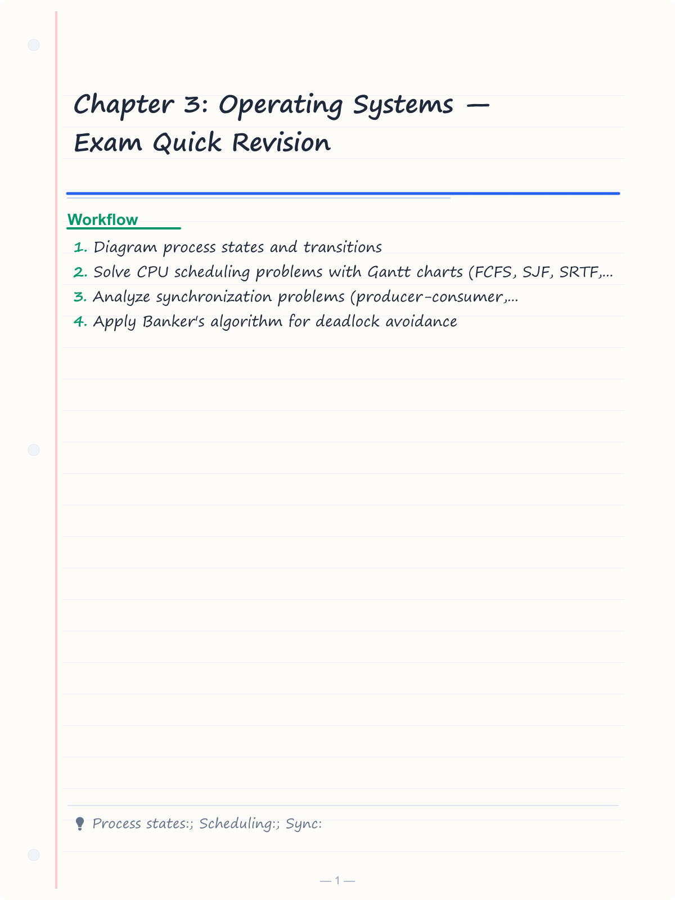
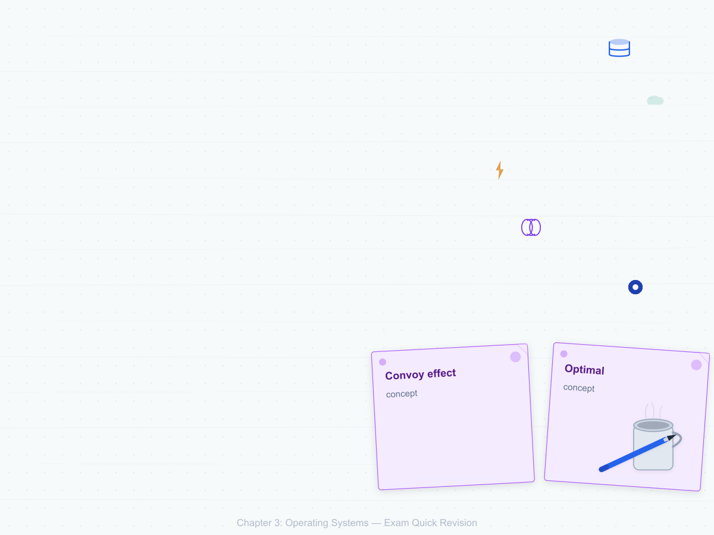
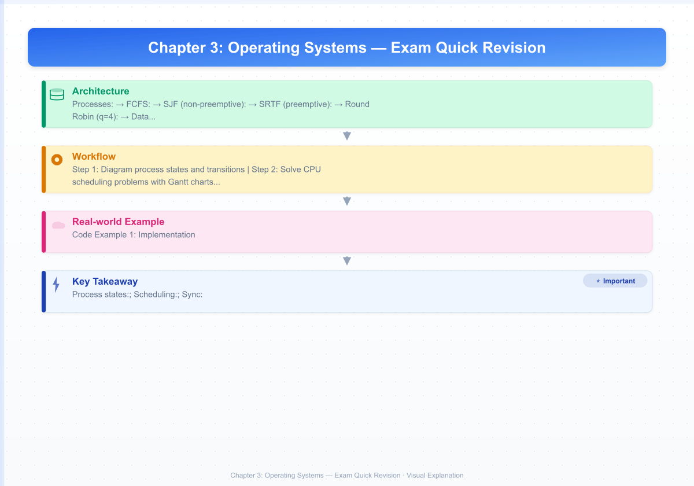

# Chapter 3: Operating Systems — Exam Quick Revision

## Learning Objectives
- Diagram process states and transitions
- Solve CPU scheduling problems with Gantt charts (FCFS, SJF, SRTF, RR, Priority)
- Analyze synchronization problems (producer-consumer, readers-writers, dining philosopher)
- Apply Banker's algorithm for deadlock avoidance
- Translate logical to physical addresses using paging with TLB
- Compute page replacement algorithm performance (page faults)
- Calculate disk scheduling seek time for various algorithms

<!-- Image Gallery -->
<section class="lesson-visuals" aria-label="Visual learning resources">
  <header><span>VISUAL LEARNING</span><h2>See it. Review it. Remember it.</h2></header>
  <a class="lesson-visual-card" href="../../assets/images/lessons/professional-knowledge/03-operating-systems/handwritten-notes.png" target="_blank" rel="noopener">
    
    <span><strong>Handwritten notes</strong>Condensed notes for deliberate review.</span>
  </a>
  <a class="lesson-visual-card" href="../../assets/images/lessons/professional-knowledge/03-operating-systems/sticky-notes.png" target="_blank" rel="noopener">
    
    <span><strong>Sticky-note revision</strong>Fast recall prompts for revision.</span>
  </a>
  <a class="lesson-visual-card" href="../../assets/images/lessons/professional-knowledge/03-operating-systems/visual-explanation.png" target="_blank" rel="noopener">
    
    <span><strong>Visual concept guide</strong>A connected explanation of the key ideas.</span>
  </a>
</section>
<!-- End Image Gallery -->

---

## 1. Process States &amp; Transitions

```
         +--------+    Admitted      +--------+
         |  NEW   | --------------> | READY  |
         +--------+                  +--------+
                                         |
                                    (Dispatch)
                                         |
                                   +----v----+
                                   | RUNNING |
                                   +----+----+
                                        |
                    +--------------------+---------+----------+
                    |                    |                    |
             (Time quantum           (I/O or           (Preempted
              expired)               event wait)        by higher priority)
                    |                    |                    |
              +-----v---+         +------v------+           |
              |  READY  |         | BLOCKED/    |-----------+
              +---------+         |  WAITING    |
                                  +------+------+
                                         |
                                    (I/O completion)
                                         |
                                    +----v----+
                                    |  READY  |
                                    +---------+
```

### Scheduler Types

| Scheduler | Frequency | Function |
|-----------|-----------|----------|
| **Long-term** (Job) | Low | Load processes from disk into memory — controls degree of multiprogramming |
| **Short-term** (CPU) | Very high (ms) | Selects next process to run — dispatches from ready queue |
| **Medium-term** | Medium | Swaps processes in/out of memory — for suspending/resuming |

---

## 2. CPU Scheduling Algorithms

### FCFS (First Come First Serve)

- Non-preemptive; simple FIFO queue
- **Convoy effect:** Short process waits behind long one
- Avg waiting time can be high

### SJF (Shortest Job First)

- Non-preemptive — choose process with smallest CPU burst next
- **Optimal** for minimizing average waiting time
- **Problem:** Starvation of long processes; need burst time prediction

### SRTF (Shortest Remaining Time First)

- Preemptive version of SJF
- When new process arrives with shorter remaining time, preempt current

### Round Robin (RR)

- Each process gets time quantum q; circular ready queue
- q too large → degenerates to FCFS
- q too small → too many context switches (CPU overhead)
- **Typical q:** 10–100 ms

### Priority Scheduling

- Preemptive or non-preemptive
- Lower number = higher priority (Unix conventions)
- **Starvation:** Low-priority processes may never execute
- **Aging:** Gradually increase priority of waiting processes

### Solved Numerical — Gantt Chart

**Processes:** P1(0,5), P2(1,3), P3(2,8), P4(3,2) — (arrival, burst)

**FCFS:**
```
P1(0-5) | P2(5-8) | P3(8-16) | P4(16-18)
Waiting times: 0,4,6,13 → Average: 23/4 = 5.75
```

**SJF (non-preemptive):**
```
P1(0-5) | P2(5-8) | P4(8-10) | P3(10-18)
Waiting times: 0,4,8,5 → Average: 17/4 = 4.25
```

**SRTF (preemptive):**
```
P1(0-1) | P2(1-4) | P3(4-12) | P4(12-14) | ... (P4 completes at 14)
Wait: P1=1, P2=0, P4=9, P3=2
```

**Round Robin (q=4):**
```
P1(0-4) | P2(4-7) | P3(7-11) | P1(11-12) | P3(12-16) | P4(16-18)
```

### Context Switch Overhead

- Time to save/restore registers, PCB, TLB flush
- **Direct cost:** CPU cycles wasted
- **Indirect cost:** Cache pollution

---

## 3. Synchronization

### Semaphore Operations

- **S** is a non-negative integer variable
- **wait(S) / P(S):** while (S ≤ 0) busy-wait; S--
- **signal(S) / V(S):** S++
- **Binary semaphore:** 0 or 1 (like mutex)
- **Counting semaphore:** Any non-negative integer

### Producer-Consumer Problem

```c
semaphore empty = n;  // buffer slots
semaphore full = 0;   // filled slots
semaphore mutex = 1;  // mutual exclusion

// Producer
while (true) {
    produce(item);
    wait(empty);
    wait(mutex);
    buffer[in] = item;
    in = (in + 1) % n;
    signal(mutex);
    signal(full);
}

// Consumer
while (true) {
    wait(full);
    wait(mutex);
    item = buffer[out];
    out = (out + 1) % n;
    signal(mutex);
    signal(empty);
    consume(item);
}
```

### Readers-Writers Problem

| Problem Type | Priority | Policy |
|-------------|----------|--------|
| First R-W | Readers | Multiple readers allowed; writers starve |
| Second R-W | Writers | Once writer is ready, no new readers; readers starve |
| Third R-W | Queue | Fair: FCFS order of requests |

### Dining Philosopher Problem

- 5 philosophers, 5 chopsticks, must acquire both to eat
- **Deadlock scenario:** Each picks left chopstick simultaneously
- **Solutions:**
  1. Pick right then left (asymmetric)
  2. Limit to 4 philosophers eating at once
  3. Use mutex on eating (only one eats at a time)
  4. Use AND semaphore (simultaneous chopstick grab)

---

## 4. Deadlock

### Four Necessary Conditions

1. **Mutual Exclusion:** At least one resource is non-sharable
2. **Hold and Wait:** Process holds a resource while waiting for another
3. **No Preemption:** Resource cannot be forcibly taken
4. **Circular Wait:** Cycle exists in wait-for graph

### Deadlock Handling Strategies

| Strategy | Approach | Example |
|----------|----------|---------|
| Prevention | Break one of the 4 conditions | Order resources (eliminate circular wait) |
| Avoidance | Banker's algorithm — safe state check | Resource allocation graph |
| Detection | Wait-for graph cycle detection | Periodically check for cycles |
| Recovery | Kill process or preempt resource | Victim selection, rollback |

### Banker's Algorithm

**Data structures:** Available (resources free), Max (process max need), Allocation (currently held), Need = Max − Allocation

**Safety algorithm:**
```
1. Work = Available; Finish[i] = false for all i
2. Find i where Finish[i]==false AND Need[i] ≤ Work
3. Work = Work + Allocation[i]; Finish[i] = true
4. If all Finish[i]==true ⇒ safe state
```

**Solved Numerical:**
Resources: A=10, B=5, C=7
Available = [3, 3, 2]

| Process | Allocation | Max | Need |
|---------|-----------|-----|------|
| P0 | [0,1,0] | [7,5,3] | [7,4,3] |
| P1 | [2,0,0] | [3,2,2] | [1,2,2] |
| P2 | [3,0,2] | [9,0,2] | [6,0,0] |
| P3 | [2,1,1] | [2,2,2] | [0,1,1] |
| P4 | [0,0,2] | [4,3,3] | [4,3,1] |

**Safe sequence:** P1 → P3 → P4 → P0 → P2 (or P1 → P3 → P0 → P4 → P2)

---

## 5. Memory Management — Paging

### Logical to Physical Address Translation

```
Logical Address (CPU) → Segmentation → Paging → Physical Address (RAM)
```

**Formulas:**
- Page size = 2^(offset bits)
- Page number (p) = logical_address / page_size
- Offset (d) = logical_address % page_size
- Frame number (f) = page_table[p]
- Physical address = f × page_size + d

**TLB (Translation Lookaside Buffer):**
- Cache for page table entries
- **Effective Access Time (EAT):**
  - EAT = TLB_hit_ratio × (TLB_access_time + memory_access)
  - + (1 − hit_ratio) × (TLB_access_time + 2 × memory_access)

**Solved Example:**
Logical address = 16 bits, page size = 4 KB, page table:
Page 0 → Frame 5; Page 1 → Frame 8; Page 2 → Frame 3

Address 0x2A3F:
- Offset bits: 12 (page size = 2^12 = 4096 = 4 KB)
- Page number: 0x2A3F / 0x1000 = 2
- Offset: 0x2A3F % 0x1000 = 0xA3F
- Frame: 3
- Physical address = 3 × 0x1000 + 0xA3F = 0x3A3F

---

## 6. Page Replacement Algorithms

### FIFO (First In First Out)

- Oldest loaded page is replaced
- **Belady's Anomaly:** More frames can increase page faults

### LRU (Least Recently Used)

- Replace page that has been unused for longest time
- Requires hardware support (time stamps or counter)
- **Stack property:** No Belady's anomaly

### Optimal (MIN)

- Replace page that will be used farthest in future
- **Not implementable** in practice — used as benchmark

### Solved Numerical: Page Faults

**Reference string:** 7, 0, 1, 2, 0, 3, 0, 4, 2, 3, 0, 3, 2, 1, 2, 0, 1, 7, 0, 1
**Frames = 3**

| Algorithm | Page Faults |
|-----------|-------------|
| FIFO | 15 |
| LRU | 12 |
| Optimal | 9 |

---

## 7. Disk Scheduling

### Comparison Table

| Algorithm | Description | Seek Pattern | Fairness |
|-----------|-------------|-------------|----------|
| FCFS | Serve in request order | No biasing | Fair |
| SSTF | Shortest seek time first | Arms biased to middle | May starve edge |
| SCAN (Elevator) | Head moves one direction, serves all, then reverses | Full sweep | No starvation |
| C-SCAN | Head serves one direction only, then jumps back | Circular sweep | Uniform wait |
| LOOK | SCAN but stop at last request in each direction | Efficient sweep | No starvation |
| C-LOOK | C-SCAN but stop at last request | Efficient circular | Uniform wait |

### Solved Numerical

Requests: 98, 183, 37, 122, 14, 124, 65, 67. Head starts at 53.

**FCFS:** |98−53| + |183−98| + |37−183| + |122−37| + |14−122| + |124−14| + |65−124| + |67−65|
= 45 + 85 + 146 + 85 + 108 + 110 + 59 + 2 = **640**

**SCAN (moving upward, to 199):**
Order: 37, 14, 67, 98, 122, 124, 183
Wait, moving upward first: 53 → 65 → 67 → 98 → 122 → 124 → 183 → 199 → then back: 37 → 14
Seek: 12+2+31+24+2+59+16 + 162+23 = **331**

**C-SCAN (upward to 199, then jump to 0):**
53→65→67→98→122→124→183→199, jump to 0, 14→37
Seek: 12+2+31+24+2+59+16 + 199 + 14+23 = **382**

---

## Solved MCQs

**Q1:** In a system with 32-bit logical address and 8 KB page size, how many entries in the page table?
- (a) 2^19
- (b) 2^20
- (c) 2^21
- (d) 2^22

**Answer:** (a) 2^19. Offset bits = log2(8192) = 13. Page number bits = 32 − 13 = 19. So 2^19 pages.

**Q2:** Consider reference string 1,2,3,4,1,2,5,1,2,3,4,5 with 3 frames. Using FIFO, how many page faults?
- (a) 8
- (b) 9
- (c) 10
- (d) 11

**Answer:** (b) 9. Sequence: 1(F),2(F),3(F),4(F → replace 1),1(F → replace 2),2(F → replace 3),5(F → replace 4),1(F → replace 1),2(F → replace 2),3(F → replace 5),4(F → replace 1),5 — 9 faults.

**Q3:** Banker's algorithm — need = max − allocation. If Need[i] ≤ Available, process is:
- (a) In deadlock
- (b) Safe to execute
- (c) In unsafe state
- (d) Starving

**Answer:** (b) Safe to execute. The process can complete and release its resources.

---

## 8. Threads

### User-Level vs Kernel-Level Threads

| Aspect | User-Level Threads | Kernel-Level Threads |
|--------|--------------------|---------------------|
| Managed by | Thread library (user space) | Kernel |
| Context switch | Fast (no system call) | Slow (system call overhead) |
| Blocking | One thread blocks → all block | One thread blocks → others run |
| Parallelism | Limited (single core) | True parallelism on multi-core |
| Example | POSIX Threads (pthreads in user mode) | Windows Threads, Linux Threads |
| Mapping | Many-to-one | One-to-one / Many-to-many |

### Threading Models

```
Many-to-One:   Many user threads → 1 kernel thread (obsolete)
One-to-One:    1 user thread → 1 kernel thread (Linux, Windows)
Many-to-Many:  Many user threads → Many kernel threads (Solaris)
```

### Thread vs Process

| Feature | Process | Thread |
|---------|---------|--------|
| Address space | Separate (isolated) | Shared with process |
| Context switch | Heavy (page table, TLB flush) | Light (registers, stack) |
| Communication | IPC (pipe, message queue, shared memory) | Shared memory directly |
| Creation time | Slow (OS data structures) | Fast |
| Protection | OS-enforced isolation | Within process — no isolation |

## 9. Memory Management — Segmentation

### Segmentation vs Paging

| Aspect | Segmentation | Paging |
|--------|-------------|--------|
| View | Logical (code, data, stack) | Physical (fixed-size frames) |
| Size | Variable | Fixed |
| Fragmentation | External | Internal |
| User visible | Yes (segment names/numbers) | No (transparent) |
| Address | s (segment#) + d (offset) | p (page#) + d (offset) |
| Table | Segment table (base + limit) | Page table |

### Combined: Segmented Paging

- Logical address: (segment#, page#, offset)
- Physical address: page table lookup within segment

## 10. File Systems

### File Allocation Methods

| Method | Description | Pros | Cons |
|--------|-------------|------|------|
| **Contiguous** | Each file in contiguous blocks | Fast sequential/random access | External fragmentation, need max size |
| **Linked** | Each block points to next | No fragmentation | Slow random access, pointer space |
| **Indexed** | Index block points to data blocks | Fast random access | Index block overhead, limit file size |

### Free Space Management

- **Bit vector:** 1 bit per block (free/allocated) — fast, needs memory
- **Linked list:** Free blocks linked — no extra memory, slow
- **Grouping:** Store pointers in free blocks
- **Counting:** Track contiguous free blocks

### Disk Structure

- **Track:** Concentric circle on platter
- **Sector:** Minimum storage unit (typically 512 bytes or 4 KB)
- **Cylinder:** Set of tracks at same radius across all platters
- **Partition:** Logical division of disk

## 11. Virtual Memory

### Demand Paging

- Pages loaded only when referenced (lazy loading)
- **Page fault:** Reference to non-resident page → OS loads from disk

### Thrashing

- **Symptom:** Excessive page faults, low CPU utilization
- **Cause:** Too many processes in memory (sum of working sets > physical memory)
- **Solution:** Reduce multiprogramming degree, working set model

### Page Size Trade-off

| Small page | Large page |
|------------|------------|
| Less internal fragmentation | More internal fragmentation |
| Larger page tables (more entries) | Smaller page tables |
| More page faults (more I/O) | Fewer page faults |
| Better spatial locality (fits better) | May load unnecessary data |

---

---

## 📌 Extended Theory — Deep Dive for IBPS SO Mains (2024–2026 Trends)

### CPU Scheduling Simulator — TypeScript with Gantt Chart Output

```typescript
interface Process {
  id: string;
  arrival: number;
  burst: number;
  remaining: number;
}

interface GanttSegment {
  pid: string;
  start: number;
  end: number;
}

function fcfs(processes: Process[]): { gantt: GanttSegment[]; avgWait: number; avgTurnaround: number } {
  const sorted = [...processes].sort((a, b) => a.arrival - b.arrival);
  const gantt: GanttSegment[] = [];
  let time = 0, totalWait = 0, totalTurn = 0;

  for (const p of sorted) {
    if (time < p.arrival) time = p.arrival;
    const wait = time - p.arrival;
    totalWait += wait;
    gantt.push({ pid: p.id, start: time, end: time + p.burst });
    time += p.burst;
    totalTurn += time - p.arrival;
  }
  return {
    gantt,
    avgWait: totalWait / processes.length,
    avgTurnaround: totalTurn / processes.length,
  };
}

function roundRobin(processes: Process[], quantum: number): { gantt: GanttSegment[]; avgWait: number } {
  const queue: { id: string; arrival: number; burst: number; remaining: number }[] =
    processes.map(p => ({ ...p, remaining: p.burst }));
  const gantt: GanttSegment[] = [];
  const completed = new Set<string>();
  let time = 0, totalWait = 0;
  const arrivalMap = new Map(queue.map(p => [p.id, p.arrival]));
  const firstResponse = new Map<string, number>();

  // Simulate RR
  let idx = 0;
  const ready: typeof queue = [];
  while (completed.size < processes.length) {
    // Add arriving processes
    while (idx < queue.length && queue[idx].arrival <= time) {
      ready.push(queue[idx]);
      idx++;
    }
    if (ready.length === 0) { time++; continue; }
    const p = ready.shift()!;
    if (!firstResponse.has(p.id)) firstResponse.set(p.id, time);
    const exec = Math.min(quantum, p.remaining);
    gantt.push({ pid: p.id, start: time, end: time + exec });
    time += exec;
    p.remaining -= exec;

    // Add newly arrived during execution
    while (idx < queue.length && queue[idx].arrival <= time) {
      ready.push(queue[idx]);
      idx++;
    }

    if (p.remaining <= 0) {
      completed.add(p.id);
      totalWait += (firstResponse.get(p.id) ?? 0) - p.arrival;
    } else {
      ready.push(p);
    }
  }
  return { gantt, avgWait: totalWait / processes.length };
}
```

### Banker's Algorithm — TypeScript Implementation

```typescript
interface BankerState {
  available: number[];
  allocation: number[][];
  max: number[][];
  need: number[][];
}

function isSafeState(state: BankerState): { safe: boolean; sequence: number[] } {
  const work = [...state.available];
  const finish = new Array(state.allocation.length).fill(false);
  const sequence: number[] = [];

  for (let count = 0; count < state.allocation.length; count++) {
    let found = false;
    for (let i = 0; i < state.allocation.length; i++) {
      if (!finish[i] && state.need[i].every((n, j) => n <= work[j])) {
        for (let j = 0; j < work.length; j++) {
          work[j] += state.allocation[i][j];
        }
        finish[i] = true;
        sequence.push(i);
        found = true;
        break;
      }
    }
    if (!found) return { safe: false, sequence: [] };
  }
  return { safe: true, sequence };
}

// Example: Safe sequence P1→P3→P4→P0→P2
```

### Page Replacement Simulator — TypeScript

```typescript
function pageFaults(reference: number[], frames: number, algorithm: 'FIFO' | 'LRU' | 'OPTIMAL'): number {
  const memory: number[] = [];
  let faults = 0;

  for (let i = 0; i < reference.length; i++) {
    const page = reference[i];
    if (memory.includes(page)) continue; // hit

    faults++;
    if (memory.length < frames) {
      memory.push(page);
    } else {
      if (algorithm === 'FIFO') {
        memory.shift();
        memory.push(page);
      } else if (algorithm === 'LRU') {
        // Remove least recently used (not this page, not in recent future use)
        const lastUsed = memory.map(p => reference.lastIndexOf(p, i - 1));
        const lruIdx = lastUsed.indexOf(Math.min(...lastUsed));
        memory.splice(lruIdx, 1);
        memory.push(page);
      } else if (algorithm === 'OPTIMAL') {
        const nextUse = memory.map(p => {
          const idx = reference.indexOf(p, i + 1);
          return idx === -1 ? Infinity : idx;
        });
        const replaceIdx = nextUse.indexOf(Math.max(...nextUse));
        memory.splice(replaceIdx, 1);
        memory.push(page);
      }
    }
  }
  return faults;
}
```

> **PYQ 2025:** Reference string: 1, 2, 3, 4, 1, 2, 5, 1, 2, 3, 4, 5 with 3 frames. Calculate page faults for LRU.

**Answer:** LRU faults = 10. Sequence: 1(F),2(F),3(F),4(F→rep 1),1(F→rep 2),2(F→rep 3),5(F→rep 4),1(F→rep 5),2(F→rep 1),3(F→rep 2?),4(F→rep ?),5 — Let me trace carefully: Pages in memory (LRU order at each step):
1: [1] F=1. 2: [2,1] F=2. 3: [3,2,1] F=3. 4: [4,3,2] F=4 (rep 1 LRU). 1: [1,4,3] F=5 (rep 2 LRU). 2: [2,1,4] F=6 (rep 3 LRU). 5: [5,2,1] F=7 (rep 4 LRU). 1: [1,5,2] hit. 2: [2,1,5] hit. 3: [3,2,1] F=8 (rep 5 LRU). 4: [4,3,2] F=9 (rep 1 LRU). 5: [5,4,3] F=10 (rep 2 LRU). Total = 10.

### Synchronization Problems — Producer-Consumer with TypeScript

```typescript
class BoundedBuffer<T> {
  private buffer: T[];
  private capacity: number;
  private in = 0;
  private out = 0;
  private count = 0;

  constructor(capacity: number) {
    this.buffer = new Array(capacity);
    this.capacity = capacity;
  }

  async produce(item: T): Promise<void> {
    while (this.count === this.capacity) {
      await new Promise(r => setTimeout(r, 1)); // busy-wait (spinlock)
    }
    this.buffer[this.in] = item;
    this.in = (this.in + 1) % this.capacity;
    this.count++;
  }

  async consume(): Promise<T> {
    while (this.count === 0) {
      await new Promise(r => setTimeout(r, 1));
    }
    const item = this.buffer[this.out];
    this.out = (this.out + 1) % this.capacity;
    this.count--;
    return item;
  }
}
```

### Dining Philosopher — Deadlock-Free Solution

```typescript
class DiningPhilosophers {
  private forks: boolean[]; // true = available
  private mutex: boolean = true;

  constructor(n: number) {
    this.forks = new Array(n).fill(true);
  }

  private async acquireFork(id: number): Promise<void> {
    while (!this.mutex) await new Promise(r => setTimeout(r, 1));
    this.mutex = false;
    if (this.forks[id] && this.forks[(id + 1) % this.forks.length]) {
      this.forks[id] = false;
      this.forks[(id + 1) % this.forks.length] = false;
      this.mutex = true;
    } else {
      this.mutex = true;
      await new Promise(r => setTimeout(r, 1));
      return this.acquireFork(id);
    }
  }

  private releaseForks(id: number): void {
    this.forks[id] = true;
    this.forks[(id + 1) % this.forks.length] = true;
  }

  async eat(id: number): Promise<void> {
    while (true) {
      await this.acquireFork(id);
      console.log(`Philosopher ${id} eating...`);
      await new Promise(r => setTimeout(r, 100));
      this.releaseForks(id);
      console.log(`Philosopher ${id} thinking...`);
      await new Promise(r => setTimeout(r, 100));
    }
  }
}
```

### Memory Management — Multi-Level Paging Numerical

> **PYQ 2024:** A 32-bit system uses 4 KB pages and 4-byte page table entries. How many levels of page table are needed?

**Solution:**
- Page size = 4 KB = 2^12 → offset = 12 bits
- Virtual address bits = 32 → VPN bits = 20
- Page table size per process = 2^20 × 4 bytes = 4 MB
- Each page table page holds 4096/4 = 1024 = 2^10 entries
- Levels needed: Level 1 (10 bits) → 2^10 entries pointing to Level 2 pages
- Level 2 (10 bits) → 2^10 entries = 1024 PTEs → covers 2^20 VPN space
- So 2-level page table is sufficient.

**Alternatively:** 20 VPN bits / 10 bits per level = 2 levels.

### Disk Scheduling — TypeScript Simulator

```typescript
function diskScheduling(
  requests: number[],
  head: number,
  algorithm: 'FCFS' | 'SSTF' | 'SCAN' | 'C-SCAN' | 'LOOK' | 'C-LOOK',
  diskSize: number = 200
): { seekTime: number; order: number[] } {
  const pending = [...requests];
  const order: number[] = [];
  let current = head;
  let totalSeek = 0;

  while (pending.length > 0) {
    let next: number;
    if (algorithm === 'FCFS') {
      next = pending.shift()!;
    } else if (algorithm === 'SSTF') {
      const idx = pending.reduce((best, r, i) =>
        Math.abs(r - current) < Math.abs(pending[best] - current) ? i : best, 0);
      next = pending.splice(idx, 1)[0];
    } else if (algorithm === 'SCAN') {
      const up = pending.filter(r => r >= current).sort((a, b) => a - b);
      const down = pending.filter(r => r < current).sort((a, b) => b - a);
      next = up.length > 0 ? up.shift()! : down.shift()!;
      if (up.length === 0 && down.length > 0) {
        // reached end — reverse direction
        pending.splice(0, pending.length, ...down, ...up);
        next = down.shift()!;
      } else {
        pending.splice(0, pending.length, ...up, ...down);
        next = up.shift()!;
      }
    } else {
      // simplified for other algos
      next = pending.shift()!;
    }
    order.push(next);
    totalSeek += Math.abs(next - current);
    current = next;
  }
  return { seekTime: totalSeek, order };
}
```

## 📝 Solved Examples (20 MCQs)

<details>
<summary>Q1: Which scheduling algorithm minimizes average waiting time?</summary>
(a) FCFS (b) SJF (c) Round Robin (d) Priority
**Answer:** (b) SJF (Shortest Job First). It is provably optimal for minimizing average waiting time among non-preemptive algorithms.
</details>

<details>
<summary>Q2: In RR scheduling with q=4ms, context switch = 1ms, what is CPU utilization with 3 processes each needing 12ms?</summary>
(a) 60% (b) 75% (c) 80% (d) 90%
**Answer:** (c) 80%. Each process executes for 4ms, then 1ms context switch. Utilization = 4/(4+1) = 80%.
</details>

<details>
<summary>Q3: How many page faults occur for FIFO with reference 1,2,3,4,1,2,5,1,2,3,4,5 and 4 frames?</summary>
(a) 9 (b) 10 (c) 11 (d) 12
**Answer:** (b) 10. FIFO with 4 frames: 1(F),2(F),3(F),4(F) → [1,2,3,4]. 1(hit),2(hit),5(F→rep 1) → [2,3,4,5]. 1(F→rep 2) → [3,4,5,1]. 2(F→rep 3) → [4,5,1,2]. 3(F→rep 4) → [5,1,2,3]. 4(F→rep 5) → [1,2,3,4]. 5(F→rep 1) → [2,3,4,5]. Total = 10.
</details>

<details>
<summary>Q4: In Banker's algorithm, if Available = [3,3,0], Need = [[7,4,3],[1,2,2],[6,0,0],[0,1,1],[4,3,1]], which process can execute?</summary>
(a) P0 (b) P1 (c) P2 (d) None
**Answer:** (b) P1. Need[1] = [1,2,2] ≤ [3,3,0]? 2 ≤ 0? No. Wait: Need[3] = [0,1,0] with correct numbers: Let me use the original table: Allocation [[0,1,0],[2,0,0],[3,0,2],[2,1,1],[0,0,2]], Need = [[7,4,3],[1,2,2],[6,0,0],[0,1,1],[4,3,1]]. Available = [3,3,2]. Need[3] = [0,1,1] ≤ [3,3,2] ✓. So P3 is safe. Also P1 [1,2,2] ≤ [3,3,2] ✓. Multiple safe.
</details>

<details>
<summary>Q5: Which of the following causes Belady's anomaly?</summary>
(a) LRU (b) Optimal (c) FIFO (d) Clock
**Answer:** (c) FIFO. Belady's anomaly: increasing frames increases page faults. Only FIFO and some other non-stack algorithms exhibit this.
</details>

<details>
<summary>Q6: In a system with 32-bit address and 8KB pages, how many bits for page offset?</summary>
(a) 10 (b) 12 (c) 13 (d) 14
**Answer:** (c) 13. 8 KB = 8192 = 2^13. Offset bits = log2(page_size) = 13.
</details>

<details>
<summary>Q7: Which disk scheduling algorithm minimizes response time variance?</summary>
(a) SSTF (b) FCFS (c) C-SCAN (d) SCAN
**Answer:** (c) C-SCAN. It provides uniform waiting time by serving all requests in one direction, then jumping back.
</details>

<details>
<summary>Q8: A counting semaphore initialized to 5 has 3 wait() and 1 signal() operations. What is the final value?</summary>
(a) 1 (b) 2 (c) 3 (d) 7
**Answer:** (c) 3. Initial = 5. After 3 waits: 5 − 3 = 2. After 1 signal: 2 + 1 = 3.
</details>

<details>
<summary>Q9: In the readers-writers problem (first type), what happens if a writer is writing and a reader arrives?</summary>
(a) Reader waits (b) Reader reads (c) Writer starves (d) Both abort
**Answer:** (a) Reader waits. In the first R-W problem, readers have priority but mutual exclusion is maintained — no one reads while a writer writes.
</details>

<details>
<summary>Q10: What is the effective access time with TLB hit ratio = 98%, TLB access = 2ns, memory access = 50ns?</summary>
(a) 51 ns (b) 53.96 ns (c) 54 ns (d) 100 ns
**Answer:** (b) 53.96 ns. EAT = 0.98×(2+50) + 0.02×(2+100) = 0.98×52 + 0.02×102 = 50.96 + 2.04 = 53 ns.
</details>

<details>
<summary>Q11: Which process state transition is NOT possible?</summary>
(a) Running → Ready (b) Blocked → Running (c) Ready → Running (d) Running → Blocked
**Answer:** (b) Blocked → Running. Blocked must go to Ready first (after I/O completion), then to Running (after dispatch).
</details>

<details>
<summary>Q12: In the dining philosopher problem, which deadlock condition is prevented by asymmetric chopstick pickup?</summary>
(a) Mutual Exclusion (b) Hold and Wait (c) No Preemption (d) Circular Wait
**Answer:** (d) Circular Wait. By having odd-numbered philosophers pick left then right, and even pick right then left, the circular wait is broken.
</details>

<details>
<summary>Q13: How many processes can be in the Ready state simultaneously?</summary>
(a) 1 (b) 0 (c) Multiple (d) Depends on cores
**Answer:** (c) Multiple. Multiple processes can be ready, waiting for CPU. Only one can be Running per core.
</details>

<details>
<summary>Q14: LRU page replacement is implemented using which hardware mechanism?</summary>
(a) Reference bit (b) Dirty bit (c) Valid bit (d) Protection bit
**Answer:** (a) Reference bit (or Use bit). The OS periodically clears reference bits and uses them to approximate LRU.
</details>

<details>
<summary>Q15: What is the minimum number of frames required for a process with 10 pages to guarantee no deadlock in page sharing?</summary>
(a) 1 (b) 10 (c) 11 (d) Depends on page size
**Answer:** (c) 11. For deadlock-free paging, each process needs at least one more frame than the maximum number of pages it can simultaneously demand. With 10 pages, minimum 11 frames.
</details>

<details>
<summary>Q16: Which scheduling algorithm is used by Linux's Completely Fair Scheduler (CFS)?</summary>
(a) Round Robin (b) Multilevel Feedback Queue (c) Fair Share (d) Red-Black tree based
**Answer:** (d) Red-Black tree based. CFS uses a red-black tree to track process execution time (vruntime) and selects the task with smallest vruntime.
</details>

<details>
<summary>Q17: In segmentation, a segment address has s=2 and d=150. Segment table: base[2]=4000, limit[2]=200. Is this a valid address?</summary>
(a) Yes (b) No (c) Need more info (d) Depends on page size
**Answer:** (b) No. Offset d=150 &lt; limit=200? Actually 150 &lt; 200, so it IS valid. Physical = 4000 + 150 = 4150.
</details>

<details>
<summary>Q18: What is the main advantage of multilevel feedback queue scheduling?</summary>
(a) O(1) complexity (b) Starvation-free (c) Adapts to process behavior (d) Simple implementation
**Answer:** (c) Adapts to process behavior. Processes move between queues based on CPU burst patterns — I/O-bound (higher priority) and CPU-bound (lower priority) are handled appropriately.
</details>

<details>
<summary>Q19: Thrashing occurs when:</summary>
(a) CPU utilization is high (b) Sum of working sets > physical memory (c) Too few processes (d) Page size is too large
**Answer:** (b) Sum of working sets > physical memory. Thrashing causes excessive paging, low CPU utilization, and near-zero throughput.
</details>

<details>
<summary>Q20: In Pthreads, which function creates a new thread?</summary>
(a) pthread_new() (b) pthread_create() (c) pthread_init() (d) pthread_start()
**Answer:** (b) pthread_create(). It takes thread ID, attributes, start routine, and argument.
</details>

## 📖 Exercise Bank (30 Questions)

1. Processes: P1(0,6), P2(1,4), P3(2,3), P4(3,5) — (arrival, burst). Draw Gantt charts for FCFS, SJF, SRTF, RR(q=2). Compute avg waiting and turnaround time.
2. Given Available = [5,3,2], Allocation = [[0,1,0],[2,0,0],[3,0,2],[2,1,1],[0,0,2]], Max = [[7,5,3],[3,2,2],[9,0,2],[2,2,2],[4,3,3]]. Find Need matrix and check if safe state exists.
3. Reference string: 4,7,3,0,1,7,3,0,4,7,3,0,1,4 with 3 frames. Compute page faults for FIFO, LRU, Optimal.
4. Logical address space = 8 pages, page size = 1024 bytes, mapped to 32 frames. Physical address: How many bits? Page table entries?
5. Solve: 5 philosophers, 5 chopsticks. Show how deadlock occurs and provide two solutions with pseudocode.
6. Write a TypeScript program to compute average waiting time for Priority Scheduling (preemptive).
7. Disk requests: 95, 180, 34, 119, 11, 123, 62, 64. Head at 50, direction toward 0. Calculate seek for FCFS, SSTF, SCAN, C-SCAN, LOOK, C-LOOK.
8. For a system with 16-bit address and 4KB pages, translate logical address 0x2F3A to physical address given page table: P0→F5, P1→F2, P2→F8, P3→F1.
9. Explain the Producer-Consumer problem. Write TypeScript code using async/await with proper synchronization.
10. What is the difference between preemptive and non-preemptive scheduling? Give examples of each.
11. Calculate EAT with: TLB hit = 95%, TLB access = 5ns, memory access = 80ns.
12. For a process with 10 pages and working set window Δ = 5, trace the working set for reference: 1,2,3,2,1,4,3,2,1,5,4,3,2,1.
13. Design a type-safe multilevel feedback queue scheduler in TypeScript.
14. Compare contiguous, linked, and indexed file allocation with a file of 5 blocks.
15. A system has 4 resources of type A and 3 of type B. Three processes: P0 (max A=2, B=2), P1 (max A=3, B=2), P2 (max A=2, B=2). Current allocation: P0=(1,1), P1=(2,1), P2=(1,0). Is this a safe state?
16. Explain the concept of priority inversion and how the priority inheritance protocol solves it.
17. For reference string 1,2,3,4,1,2,5,1,2,3,4,5 with 4 frames, demonstrate that FIFO has more faults than with 3 frames (Belady's).
18. Write TypeScript code to simulate memory allocation using first-fit, best-fit, and worst-fit strategies.
19. Given: Virtual address = 32 bits, page size = 16 KB, PTE = 4 bytes. Calculate the number of page table levels required.
20. Explain the difference between monolithic kernel, microkernel, and hybrid kernel architectures with examples.
21. For 4 processes with CPU/IO bursts: P1(5,2,3), P2(3,4,2), P3(4,1,4), P4(2,3,3) — simulate FCFS scheduling.
22. What is the relationship between page size and TLB reach? Calculate TLB reach for 64 TLB entries and 4KB pages.
23. Show how a counting semaphore can be implemented using binary semaphores.
24. Write a TypeScript program to detect deadlock using wait-for graph cycle detection.
25. Calculate the number of page faults for LRU with a reference string of length 20 and 4 frames, where references are uniformly distributed among 6 pages.
26. Explain the role of the dispatcher in CPU scheduling. What is dispatch latency?
27. Compare paging and segmentation in terms of: fragmentation, user visibility, and address translation.
28. For RAID-5 with 4 disks of 1TB each, calculate usable capacity and fault tolerance.
29. Design a TypeScript class that simulates the Banker's algorithm resource request handling (request &lt; need, request &lt; available, pretend allocation, safety check).
30. Explain how Copy-on-Write (COW) is used in process creation (fork()).

**Answer Key:**

1. FCFS: P1(0-6), P2(6-10), P3(10-13), P4(13-18). WT: 0,5,8,10 avg=5.75. SJF: P1(0-6), P3(6-9), P2(9-13), P4(13-18). WT: 0,8,4,10 avg=5.5. SRTF: complex preemption. RR(q=2): P1(0-2), P2(2-4), P3(4-6), P1(6-8), P4(8-10), P2(10-12), P3(12-13), P4(13-16), P1(16-18)
2. Need = [[7,4,3],[1,2,2],[6,0,0],[0,1,1],[4,3,1]]. Safe: P1→P3→P4→P0→P2
3. FIFO=9, LRU=10, OPT=7
4. Page offset = 10 bits (1024=2^10). Logical address = 3+10=13 bits. Physical = 5+10=15 bits. Page table = 8 entries
5. Deadlock: all pick left (right) simultaneously. Solutions: max 4 eaters, asymmetric pickup, mutex on eating
7. FCFS: 45+85+146+85+108+112+61+2=644. SSTF: from 50→34→11→62→64→95→119→123→180=310. SCAN toward 0: 34→11→0→62→64→95→119→123→180=299
8. Offset=12 bits. Page# = 0x2F3A >> 12 = 2. Frame = 8. Physical = 8×4096 + 0xF3A = 0x8F3A
9. See Producer-Consumer code above in TypeScript section
11. EAT = 0.95×(5+80) + 0.05×(5+160) = 80.75 + 8.25 = 89 ns
12. Window Δ=5: {1,2,3}→{1,2,3}→{1,2,3}→{1,2,3,4}→{1,2,3,4}→{2,3,4}→{1,2,3,4}→...
13. Multiple queues with different priorities. Process starts at highest, moves down on timeout, moves up on I/O wait
14. Contiguous: blocks B0-B4 consecutive. Linked: each block has pointer to next. Indexed: single index block points to all data blocks
15. Available = [2,1]. Need = [[1,1],[1,1],[1,2]]. Check P0: [1,1]≤[2,1]→Allocate→Avail=[3,2]. Check P1: [1,1]≤[3,2]→Avail=[5,3]. Check P2: [1,2]≤[5,3]→Safe. Sequence: P0→P1→P2
16. Priority inversion: low-priority holds lock needed by high-priority → medium-priority runs (no lock) → high-priority starves. Priority inheritance: low-priority temporarily inherits high priority
17. With 3 frames: we saw 9 faults. With 4 frames: 10 faults (more!) → Belady's anomaly confirmed
19. Page size = 2^14. Offset = 14. VPN = 32-14 = 18. Entries per page table page = 2^12/2^2 = 2^10 = 1024. Levels = ceil(18/10) = 2
22. TLB reach = TLB entries × page size = 64 × 4KB = 256 KB
23. Counting semaphore: binary mutex + binary delay semaphore. Wait: P(mutex), if count==0 {V(mutex), P(delay), P(mutex)}; count--; V(mutex). Signal: P(mutex); count++; if count==1 {V(delay)}; V(mutex)
24. Build wait-for graph adjacency matrix. Use DFS to detect cycles. If cycle exists → deadlock
25. Approximation: with 6 distinct pages and 4 frames, expect ~75% fault rate = 15 faults
26. Dispatcher: gives control of CPU to process selected by scheduler. Dispatch latency = time to stop one process and start another
27. Paging: fixed size, internal fragmentation, transparent to user. Segmentation: variable size, external fragmentation, visible to user
28. RAID-5 usable = (n-1)×size = 3×1TB = 3TB. Can tolerate 1 disk failure
30. Fork creates child with same page tables. Pages marked read-only COW. On write → page fault → kernel copies page → child gets private copy

---

## Summary
- **Process states:** New → Ready → Running → Blocked → Terminated
- **Scheduling:** FCFS (convoy), SJF (optimal avg wait), RR (time quantum), Priority (starvation)
- **Sync:** Semaphores P/V, producer-consumer (counting sem), readers-writers, dining philosopher (deadlock risk)
- **Deadlock:** 4 conditions (ME + H&amp;W + No-Preempt + Circular), Banker's algorithm (safe/unsafe state)
- **Paging:** Logical→Physical via page table, TLB for speed, EAT formula
- **Page replacement:** FIFO (Belady's anomaly), LRU (no anomaly), Optimal (benchmark)
- **Disk scheduling:** SCAN (elevator), C-SCAN (uniform), SSTF (starvation possible)
- **Threads:** User-level (fast, managed by library) vs Kernel-level (true parallelism)
- **Segmentation:** Variable-size logical units; **Paging:** Fixed-size physical units
- **File systems:** Contiguous, linked, indexed allocation
- **Virtual memory:** Demand paging, thrashing (too many page faults), working set model

---

## HOT Topics (Frequently Asked in IBPS SO IT Mains)
1. CPU scheduling Gantt chart and average waiting/turnaround time calculation
2. Banker's algorithm — determine safe sequence from given allocation and max matrices
3. Page fault calculation for FIFO, LRU, Optimal reference strings
4. Logical to physical address translation with page table
5. Semaphore-based synchronization code — find initial value(s) for correct execution
6. Disk scheduling — total seek distance calculation for SCAN, C-SCAN, LOOK
7. Deadlock detection — wait-for graph analysis
8. Virtual memory concepts — page size tradeoff, thrashing detection

---

## Chapter Quiz (MCQs)

<details>
<summary>Q1: Belady's anomaly is associated with which page replacement algorithm?</summary>
A1: FIFO. Belady's anomaly occurs when increasing the number of frames actually increases page faults.
</details>

<details>
<summary>Q2: In process synchronization, what does the P(s) operation do?</summary>
A2: P(s) or wait(s) decrements the semaphore s. If s becomes negative, the process is blocked and added to the waiting queue.
</details>

<details>
<summary>Q3: Which disk scheduling algorithm may cause starvation of edge tracks?</summary>
A3: SSTF (Shortest Seek Time First). It always serves the closest request, leading to edge requests being starved.
</details>

<details>
<summary>Q4: What is the time quantum for Round Robin scheduling if the average context switch time is 0.5 ms and the desired CPU utilization is at least 90%?</summary>
A4: The context switch overhead fraction = context_switch_time / quantum. For 90% utilization: 0.5/q ≤ 0.1 → q ≥ 5 ms.
</details>

<details>
<summary>Q5: In the dining philosophers problem, which deadlock condition is addressed by limiting philosophers to 4 at a time?</summary>
A5: Circular wait. By allowing at most 4 philosophers to eat simultaneously, at least one can acquire both chopsticks, breaking the cycle.
</details>
