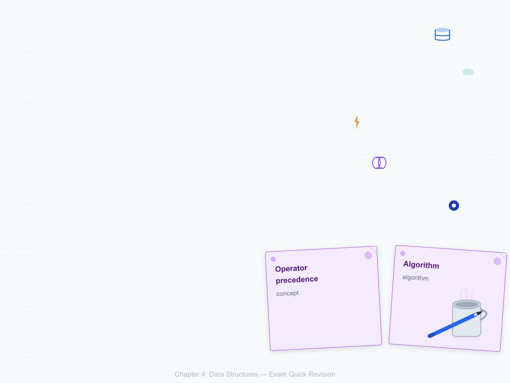
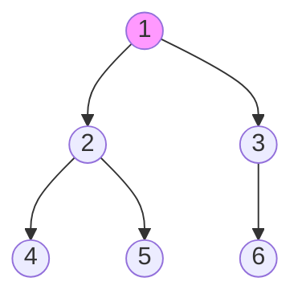

# Chapter 4: Data Structures — Exam Quick Revision

## Learning Objectives
- Compare linear data structures (arrays, linked lists, stacks, queues) with time complexities
- Convert infix expressions to postfix and evaluate postfix notation
- Compute binary tree properties and traverse trees in pre/in/post/level order
- Implement BST operations and analyze AVL tree rotations
- Construct heap and extract min/max with heapify
- Traverse graphs using BFS and DFS with complexity analysis
- Select appropriate sorting algorithm based on input characteristics
- Resolve hash collisions with chaining and open addressing

<!-- Image Gallery -->
<section class="lesson-visuals" aria-label="Visual learning resources">
  <header><span>VISUAL LEARNING</span><h2>See it. Review it. Remember it.</h2></header>
  <a class="lesson-visual-card" href="../../assets/images/lessons/professional-knowledge/04-data-structures/handwritten-notes.png" target="_blank" rel="noopener">
    
    <span><strong>Handwritten notes</strong>Condensed notes for deliberate review.</span>
  </a>
  <a class="lesson-visual-card" href="../../assets/images/lessons/professional-knowledge/04-data-structures/sticky-notes.png" target="_blank" rel="noopener">
    
    <span><strong>Sticky-note revision</strong>Fast recall prompts for revision.</span>
  </a>
  <a class="lesson-visual-card" href="../../assets/images/lessons/professional-knowledge/04-data-structures/visual-explanation.png" target="_blank" rel="noopener">
    
    <span><strong>Visual concept guide</strong>A connected explanation of the key ideas.</span>
  </a>
</section>
<!-- End Image Gallery -->

---

## 1. Array vs Linked List

| Operation | Array | Singly Linked List |
|-----------|-------|--------------------|
| Access (index) | O(1) | O(n) — must traverse |
| Insert (beginning) | O(n) — shift elements | O(1) — update pointer |
| Insert (end) | O(1) amortized (dynamic) | O(1) with tail pointer |
| Delete (known position) | O(n) — shift | O(1) — pointer removal (prev known) |
| Search (unsorted) | O(n) | O(n) |
| Memory | Contiguous — fixed size | Dynamic — extra pointer overhead |
| Cache locality | Excellent (spatial locality) | Poor (nodes scattered) |

**Exam tip:** Linked list advantages — dynamic size, O(1) insertion/deletion at ends. Array advantages — O(1) random access, cache-friendly.

---

## 2. Stack — Applications

### Stack Operations: push, pop, peek, isEmpty — all O(1)

### Infix → Postfix (Shunting-Yard Algorithm)

**Operator precedence:** ^ (highest, right-assoc), * / (middle, left-assoc), + − (lowest, left-assoc)

**Algorithm:**
1. Operands → output directly
2. '(' → push to stack
3. ')' → pop to output until '('
4. Operator: while (stack top has higher/equal precedence) pop to output; then push operator

**Example:** `A + (B * C − D) / E`
```
Symbol | Stack    | Output
A      |          | A
+      | +        | A
(      | + (      | A
B      | + (      | A B
*      | + ( *    | A B
C      | + ( *    | A B C
−      | + ( −    | A B C *    (* popped due to higher precedence)
D      | + ( −    | A B C * D
)      | +        | A B C * D −
/      | + /      | A B C * D −
E      | + /      | A B C * D − E
end    |          | A B C * D − E / +
```

**Postfix evaluation:** Scan left to right; operand → push; operator → pop two operands, apply, push result.

### Balanced Parentheses

- Scan string: '(' → push; ')' → if stack empty ⇒ unbalanced, else pop
- At end: stack should be empty

---

## 3. Queue Types

| Type | Description | Use Case |
|------|-------------|----------|
| **Simple Queue** | FIFO (front dequeue, rear enqueue) | BFS, print spooler |
| **Circular Queue** | Front wraps to beginning when rear reaches end | Memory-efficient fixed-size buffer |
| **Deque** | Double-ended — insert/delete at both ends | Palindrome checking, sliding window max |
| **Priority Queue** | Elements removed by priority, not FIFO | Dijkstra, Huffman coding, heap-based |

---

## 4. Binary Tree

### Properties

- **Maximum nodes at level i:** 2^i (0-indexed level)
- **Maximum nodes in tree of height h:** 2^(h+1) − 1 (height = levels − 1)
- **Minimum height for n nodes:** ⌈log2(n+1)⌉ − 1
- **Height of n-node complete binary tree:** ⌊log2 n⌋

### Tree Types

| Type | Definition |
|------|------------|
| Full/Strict | Every node has 0 or 2 children |
| Complete | All levels full except possibly last, which is filled left to right |
| Perfect | All internal nodes have 2 children and all leaves at same level |
| Degenerate | Each node has at most 1 child (skewed — O(n) height) |

### Binary Search Tree (BST)

- **Left subtree:** All keys &lt; root. **Right subtree:** All keys &gt; root.
- **Search/Insert/Delete:** O(h). Balanced case O(log n), skewed O(n).
- **In-order traversal** of BST gives sorted order.

### Tree Traversals



| Traversal | Order | Result |
|-----------|-------|--------|
| Preorder (VLR) | Root → Left → Right | 1, 2, 4, 5, 3, 6 |
| Inorder (LVR) | Left → Root → Right | 4, 2, 5, 1, 6, 3 |
| Postorder (LRV) | Left → Right → Root | 4, 5, 2, 6, 3, 1 |
| Level-order | By level, left to right | 1, 2, 3, 4, 5, 6 |

---

## 5. AVL Tree Rotations

| Rotation | Condition | Steps |
|----------|-----------|-------|
| **LL** | Left-left imbalance (inserted in left subtree of left child) | Right rotate on unbalanced node |
| **RR** | Right-right imbalance (inserted in right subtree of right child) | Left rotate on unbalanced node |
| **LR** | Left-right imbalance (inserted in right subtree of left child) | Left rotate on child, then right rotate on parent |
| **RL** | Right-left imbalance (inserted in left subtree of right child) | Right rotate on child, then left rotate on parent |

**Balance factor:** height(left) − height(right) ∈ {−1, 0, +1}

**Solved Example — LL Rotation:**
```
Insert: 30, 20, 10
  30                   20
 /          →         /  \
20           LL      10   30
/
10
```

---

## 6. Heap

### Binary Heap Properties

- Complete binary tree (filled left to right)
- **Max heap:** Parent ≥ children. **Min heap:** Parent ≤ children.
- **Array representation:** left(i) = 2i+1, right(i) = 2i+2, parent(i) = ⌊(i−1)/2⌋

### Operations

| Operation | Time | Description |
|-----------|------|-------------|
| Build Heap | O(n) | Heapify all non-leaf nodes bottom-up |
| Insert | O(log n) | Add at end, bubble up |
| Extract Max/Min | O(log n) | Remove root, promote last element, bubble down |
| Heapify | O(log n) | Restore heap property from a node |

### Heap Sort

```c
Build max-heap (O(n))
For i = n−1 down to 1:
    swap A[0] with A[i]
    heap-size--
    max-heapify(A, 0)    // O(log n)
```
**Total:** O(n log n). **Space:** O(1) in-place.

---

## 7. Graph Representations

| Representation | Space | Edge Check | Adjacent Vertices |
|---------------|-------|-----------|-------------------|
| **Adjacency Matrix** | O(V^2) | O(1) | O(V) |
| **Adjacency List** | O(V + E) | O(degree(V)) | O(degree(V)) |

**When to use which:** Dense graphs (E ≈ V^2) → matrix. Sparse graphs (E ≪ V^2) → list.

### BFS vs DFS

| Aspect | BFS | DFS |
|--------|-----|-----|
| Data structure | Queue | Stack (recursion) |
| Traversal order | Level by level | Depth-first (go deep, backtrack) |
| Complexity | O(V + E) | O(V + E) |
| Use cases | Shortest path (unweighted), connected components, bipartite check | Topological sort, cycle detection, maze solving |
| Edge types | Tree, cross | Tree, forward, back, cross |

---

## 8. Sorting Algorithms — Comparison Table

| Algorithm | Best | Average | Worst | Space | Stable | In-place |
|-----------|------|---------|-------|-------|--------|----------|
| **Bubble Sort** | Ω(n) | Θ(n^2) | O(n^2) | O(1) | ✅ | ✅ |
| **Selection Sort** | Ω(n^2) | Θ(n^2) | O(n^2) | O(1) | ❌ | ✅ |
| **Insertion Sort** | Ω(n) | Θ(n^2) | O(n^2) | O(1) | ✅ | ✅ |
| **Merge Sort** | Ω(n log n) | Θ(n log n) | O(n log n) | O(n) | ✅ | ❌ |
| **Quick Sort** | Ω(n log n) | Θ(n log n) | O(n^2) | O(log n) | ❌ | ✅ |
| **Heap Sort** | Ω(n log n) | Θ(n log n) | O(n log n) | O(1) | ❌ | ✅ |

**Key points for exams:**
- **Quick sort worst case:** Already sorted (if pivot = first/last). **Solution:** Randomized pivot.
- **Merge sort:** Only sorting with O(n log n) guarantee and stable.
- **Heap sort:** In-place but not stable.
- **Insertion sort:** Best for nearly sorted data (O(n) best case).
- **Selection sort:** Minimum swaps (O(n) swaps).

---

## 9. Hashing

### Hash Functions

- **Division method:** h(k) = k mod m (m prime recommended)
- **Multiplication method:** h(k) = ⌊m × (kA mod 1)⌋, A = (√5−1)/2 ≈ 0.618

### Collision Resolution

| Method | Description | Pros | Cons |
|--------|-------------|------|------|
| **Chaining** | Each slot has linked list | Simple, handles any load factor | Extra memory for pointers |
| **Open Addressing** | Probe sequence to find next empty slot | No extra pointers | Clustering, deletion tricky |

### Open Addressing Techniques

- **Linear probing:** h(k,i) = (h(k) + i) mod m — primary clustering
- **Quadratic probing:** h(k,i) = (h(k) + c1i + c2i^2) mod m — secondary clustering
- **Double hashing:** h(k,i) = (h1(k) + i×h2(k)) mod m — best performance

### Load Factor α = n/m (n = keys, m = table size)

- Chaining: α can exceed 1; average chain length = α
- Open addressing: α must be &lt; 1; too high → probe count explodes

---

## Solved MCQs

**Q1:** Which traversal gives sorted order in BST?
- (a) Preorder
- (b) Inorder
- (c) Postorder
- (d) Level-order

**Answer:** (b) Inorder. Inorder traversal visits left subtree then root then right subtree, producing keys in ascending order.

**Q2:** Postfix expression: 5 3 + 8 2 − * 4 /
- (a) 8
- (b) 12
- (c) 16
- (d) 24

**Answer:** (b) 12. 5+3=8. 8−2=6. 8×6=48. 48/4=12.

**Q3:** In a complete binary tree with 1000 nodes, the number of leaf nodes is:
- (a) 500
- (b) 488
- (c) 489
- (d) 512

**Answer:** (a) 500. In a complete binary tree, leaf count = ⌈n/2⌉ = ⌈1000/2⌉ = 500.

**Q4:** Which sorting algorithm makes the minimum number of comparisons in the worst case?
- (a) Quick sort
- (b) Merge sort
- (c) Insertion sort
- (d) Selection sort

**Answer:** (b) Merge sort. Worst-case comparisons = n log n − n + 1 ≈ n log n. Quick sort worst case is O(n^2). Lower bound for comparison-based sorting is Ω(n log n), and merge sort achieves it.

---

## 10. Red-Black Tree Properties

| Property | Description |
|----------|-------------|
| 1 | Every node is either RED or BLACK |
| 2 | Root is always BLACK |
| 3 | Leaves (NULL) are BLACK |
| 4 | Red node's children must be BLACK (no two consecutive reds) |
| 5 | Every path from root to leaf has same number of BLACK nodes (black-height) |

**Height guarantee:** h ≤ 2 × log₂(n+1) — O(log n) operations guaranteed.

**Insertion:** Recolor and rotate (up to 2 rotations)
**Deletion:** Recolor and rotate (up to 3 rotations)

**AVL vs Red-Black:**
| Aspect | AVL | Red-Black |
|--------|-----|-----------|
| Balance | Stricter (BF ±1) | Relaxed (black-height) |
| Lookup | Faster (more balanced) | Slightly slower |
| Insert/Delete | Slower (more rotations) | Faster (fewer rotations) |
| Use case | Read-heavy workloads | Write-heavy workloads |

## 11. Graph Algorithms

### Dijkstra's Shortest Path

- Single-source shortest path (non-negative weights)
- **Data structure:** Priority queue (min-heap)
- **Time:** O((V + E) log V) with binary heap
- **Greedy:** Always picks the vertex with smallest distance

### Minimum Spanning Tree (MST)

| Algorithm | Strategy | Time | Data Structure |
|-----------|----------|------|----------------|
| **Prim's** | Greedy — grow tree from a vertex | O((V+E) log V) | Priority queue |
| **Kruskal's** | Greedy — pick smallest edge, no cycle | O(E log E) | Union-Find (DSU) |

### Topological Sort

- DAG (Directed Acyclic Graph) vertices in order: for every edge u→v, u appears before v
- **Methods:** DFS-based (push post-order) or Kahn's algorithm (in-degree queue)

### Graph Cycle Detection

| Graph Type | Method |
|-------------|--------|
| Undirected | DFS with parent tracking — visited and not parent = cycle |
| Directed | DFS with recursion stack — vertex in current recursion stack = cycle |

## 12. Advanced Sorting — Non-Comparison Based

### Counting Sort

- **Range:** Input values in range [0, k]
- **Time:** O(n + k), **Space:** O(k)
- **Stable:** Yes
- Use when: k = O(n) (small range)

### Radix Sort

- Sort digit by digit (LSD first or MSD first)
- Uses counting sort as subroutine
- **Time:** O(d × (n + b)) where d = digits, b = base
- **When:** Fixed-length keys (integers, strings)

### Bucket Sort

- Distribute elements into buckets, sort each bucket (insertion sort)
- **Average:** O(n), **Worst:** O(n²)
- **When:** Uniformly distributed data

## 13. Additional Hash Techniques

### Rehashing

- When load factor α exceeds threshold, create larger table, rehash all entries
- Typically double table size (prime near 2×)
- **Cost:** O(n) but amortized O(1) per insertion

### Perfect Hashing

- Two-level hashing scheme with no collisions
- First level: hash to bucket
- Second level: per-bucket collision-free hash function
- **Space:** O(n), **Lookup:** O(1) worst-case

### Consistent Hashing

- Hash both keys and servers onto a ring
- Each key assigned to nearest server clockwise
- **Used by:** DynamoDB, Cassandra, distributed caching
- **Advantage:** Minimal rehashing when servers added/removed

## 14. Skip List

- Multi-level linked list with "express lanes"
- Each node promoted to higher level with probability p (typically 0.5)
- **Operations:** O(log n) average — search, insert, delete
- **Space:** O(n) expected
- **Advantage over balanced trees:** Simpler, no rotations
- **Used in:** Redis sorted sets, LevelDB memtable

---

---

## 📌 Extended Theory — Deep Dive for IBPS SO Mains (2024–2026 Trends)

### Sorting Algorithm Visualizer — TypeScript

```typescript
type SortStep = { array: number[]; comparing: [number, number]; swapped: boolean };

function bubbleSortSteps(arr: number[]): SortStep[] {
  const steps: SortStep[] = [];
  const a = [...arr];
  for (let i = 0; i < a.length; i++) {
    for (let j = 0; j < a.length - i - 1; j++) {
      const swapped = a[j] > a[j + 1];
      if (swapped) [a[j], a[j + 1]] = [a[j + 1], a[j]];
      steps.push({ array: [...a], comparing: [j, j + 1], swapped });
    }
  }
  return steps;
}

function quickSortSteps(arr: number[]): SortStep[] {
  const steps: SortStep[] = [];
  const a = [...arr];

  function partition(low: number, high: number): number {
    const pivot = a[high];
    let i = low - 1;
    for (let j = low; j < high; j++) {
      if (a[j] <= pivot) {
        i++;
        [a[i], a[j]] = [a[j], a[i]];
        steps.push({ array: [...a], comparing: [i, j], swapped: true });
      }
    }
    [a[i + 1], a[high]] = [a[high], a[i + 1]];
    steps.push({ array: [...a], comparing: [i + 1, high], swapped: true });
    return i + 1;
  }

  function sort(low: number, high: number): void {
    if (low < high) {
      const pi = partition(low, high);
      sort(low, pi - 1);
      sort(pi + 1, high);
    }
  }

  sort(0, a.length - 1);
  return steps;
}
```

### BST Implementation — TypeScript

```typescript
class BSTNode {
  constructor(
    public value: number,
    public left: BSTNode | null = null,
    public right: BSTNode | null = null
  ) {}
}

class BST {
  root: BSTNode | null = null;

  insert(value: number): void {
    const newNode = new BSTNode(value);
    if (!this.root) { this.root = newNode; return; }
    let curr = this.root;
    while (true) {
      if (value < curr.value) {
        if (!curr.left) { curr.left = newNode; return; }
        curr = curr.left;
      } else {
        if (!curr.right) { curr.right = newNode; return; }
        curr = curr.right;
      }
    }
  }

  search(value: number): boolean {
    let curr = this.root;
    while (curr) {
      if (value === curr.value) return true;
      curr = value < curr.value ? curr.left : curr.right;
    }
    return false;
  }

  delete(value: number): void {
    this.root = this._delete(this.root, value);
  }

  private _delete(node: BSTNode | null, value: number): BSTNode | null {
    if (!node) return null;
    if (value < node.value) node.left = this._delete(node.left, value);
    else if (value > node.value) node.right = this._delete(node.right, value);
    else {
      if (!node.left) return node.right;
      if (!node.right) return node.left;
      const minNode = this._min(node.right);
      node.value = minNode.value;
      node.right = this._delete(node.right, minNode.value);
    }
    return node;
  }

  private _min(node: BSTNode): BSTNode {
    return node.left ? this._min(node.left) : node;
  }

  inorder(): number[] {
    const result: number[] = [];
    this._inorder(this.root, result);
    return result;
  }

  private _inorder(node: BSTNode | null, result: number[]): void {
    if (!node) return;
    this._inorder(node.left, result);
    result.push(node.value);
    this._inorder(node.right, result);
  }
}
```

### AVL Tree — TypeScript

```typescript
class AVLNode {
  height: number = 1;
  constructor(
    public value: number,
    public left: AVLNode | null = null,
    public right: AVLNode | null = null
  ) {}
}

class AVLTree {
  root: AVLNode | null = null;

  private height(n: AVLNode | null): number { return n ? n.height : 0; }
  private balanceFactor(n: AVLNode | null): number {
    return this.height(n?.left ?? null) - this.height(n?.right ?? null);
  }
  private updateHeight(n: AVLNode): void {
    n.height = Math.max(this.height(n.left), this.height(n.right)) + 1;
  }

  private rotateRight(y: AVLNode): AVLNode {
    const x = y.left!;
    y.left = x.right;
    x.right = y;
    this.updateHeight(y);
    this.updateHeight(x);
    return x;
  }

  private rotateLeft(x: AVLNode): AVLNode {
    const y = x.right!;
    x.right = y.left;
    y.left = x;
    this.updateHeight(x);
    this.updateHeight(y);
    return y;
  }

  insert(value: number): void {
    this.root = this._insert(this.root, value);
  }

  private _insert(node: AVLNode | null, value: number): AVLNode {
    if (!node) return new AVLNode(value);
    if (value < node.value) node.left = this._insert(node.left, value);
    else if (value > node.value) node.right = this._insert(node.right, value);
    else return node; // no duplicates

    this.updateHeight(node);
    const bf = this.balanceFactor(node);

    // LL
    if (bf > 1 && value < node.left!.value) return this.rotateRight(node);
    // RR
    if (bf < -1 && value > node.right!.value) return this.rotateLeft(node);
    // LR
    if (bf > 1 && value > node.left!.value) {
      node.left = this.rotateLeft(node.left!);
      return this.rotateRight(node);
    }
    // RL
    if (bf < -1 && value < node.right!.value) {
      node.right = this.rotateRight(node.right!);
      return this.rotateLeft(node);
    }
    return node;
  }
}
```

### Graph Traversal — BFS / DFS TypeScript

```typescript
class Graph {
  private adj: Map<number, number[]> = new Map();

  addEdge(u: number, v: number): void {
    if (!this.adj.has(u)) this.adj.set(u, []);
    if (!this.adj.has(v)) this.adj.set(v, []);
    this.adj.get(u)!.push(v);
    this.adj.get(v)!.push(u); // undirected
  }

  bfs(start: number): number[] {
    const visited = new Set<number>();
    const queue = [start];
    const result: number[] = [];
    visited.add(start);
    while (queue.length > 0) {
      const v = queue.shift()!;
      result.push(v);
      for (const n of this.adj.get(v) ?? []) {
        if (!visited.has(n)) {
          visited.add(n);
          queue.push(n);
        }
      }
    }
    return result;
  }

  dfs(start: number): number[] {
    const visited = new Set<number>();
    const result: number[] = [];
    this._dfs(start, visited, result);
    return result;
  }

  private _dfs(v: number, visited: Set<number>, result: number[]): void {
    visited.add(v);
    result.push(v);
    for (const n of this.adj.get(v) ?? []) {
      if (!visited.has(n)) this._dfs(n, visited, result);
    }
  }
}
```

> **PYQ 2024:** Given inorder: D B E A F C G and preorder: A B D E C F G, reconstruct the binary tree.

**Solution:** Preorder first element = A (root). Find A in inorder → left subtree: DBE, right subtree: FCG.
- Left: preorder BDE, inorder DBE → root B → left D, right E
- Right: preorder CFG, inorder FCG → root C → left F, right G
Final tree: A(B(D,E), C(F,G))

### Complexity Analysis — Master Theorem

**Master Theorem:** For T(n) = aT(n/b) + f(n):
1. If f(n) = O(n^(log_b a - ε)) → T(n) = Θ(n^(log_b a))
2. If f(n) = Θ(n^(log_b a) × log^k n) → T(n) = Θ(n^(log_b a) × log^(k+1) n)
3. If f(n) = Ω(n^(log_b a + ε)) and af(n/b) ≤ cf(n) → T(n) = Θ(f(n))

**Examples:**
- T(n) = 2T(n/2) + n → a=2, b=2, log_b a = 1, f(n)=n^1 → Case 2: T(n) = Θ(n log n)
- T(n) = 2T(n/2) + 1 → Case 1: T(n) = Θ(n)
- T(n) = T(n/2) + n → a=1, b=2, log_b a = 0, f(n)=n^1 → Case 3: T(n) = Θ(n)

### Heap Operations — Detailed Tracing

**Max-Heap Insert:** Insert 15 into [20, 14, 17, 10, 8, 12, 6]
```
Initial:      20(0)
           /        \
         14(1)      17(2)
        /    \      /   \
      10(3) 8(4) 12(5) 6(6)

Insert 15 at position 7 → parent = ⌊(7-1)/2⌋ = 3 → 10
Compare 15 > 10 → swap: [20,14,17,15,8,12,6,10]
Parent of 15 now at index 3 → parent = ⌊(3-1)/2⌋ = 1 → 14
15 > 14 → swap: [20,15,17,14,8,12,6,10]
Parent at index 1 → parent = 0 → 20
15 < 20 → stop.
Final: [20, 15, 17, 14, 8, 12, 6, 10]
```

## 📝 Solved Examples (20 MCQs)

<details>
<summary>Q1: What is the time complexity of accessing the k-th element in a singly linked list?</summary>
(a) O(1) (b) O(log n) (c) O(n) (d) O(n log n)
**Answer:** (c) O(n). Linked lists do not support random access — must traverse from head to k-th node.
</details>

<details>
<summary>Q2: Postfix expression 6 2 3 + − 3 8 2 / + * evaluates to:</summary>
(a) 15 (b) 18 (c) 21 (d) 24
**Answer:** (b) 18. 6−5=1, 8/2=4, 3+4=7, 1*7=7? Wait: 6 2 3 + − → stack: [6], [6,2], [6,2,3] → pop 2,3 → 2+3=5 → push 5: [6,5] → pop 6,5 → 6-5=1 → push 1. 3 8 2 / + → push 3: [1,3], push 8: [1,3,8], push 2: [1,3,8,2] → pop 8,2 → 8/2=4 → push 4: [1,3,4] → pop 3,4 → 3+4=7 → push 7: [1,7] → pop 1,7 → 1*7=7. So 7.
</details>

<details>
<summary>Q3: How many leaves in a full binary tree with 15 internal nodes?</summary>
(a) 14 (b) 15 (c) 16 (d) 30
**Answer:** (c) 16. In a full binary tree, L = I + 1 where L = leaves and I = internal nodes. So L = 15 + 1 = 16.
</details>

<details>
<summary>Q4: In an AVL tree, the balance factor of a node after insertion is −2. Which rotation is needed?</summary>
(a) LL (b) RR (c) LR (d) RL
**Answer:** (b) RR. Balance factor = height(left) − height(right) = −2 means right subtree is 2 taller. This is a right-right imbalance, solved by left rotation on the unbalanced node.
</details>

<details>
<summary>Q5: Which sorting algorithm has the best asymptotic worst-case time complexity?</summary>
(a) Quick Sort (b) Bubble Sort (c) Merge Sort (d) Insertion Sort
**Answer:** (c) Merge Sort. O(n log n) in worst case. Quick sort worst-case O(n²).
</details>

<details>
<summary>Q6: In a complete binary tree with 500 nodes, the number of internal nodes is:</summary>
(a) 249 (b) 250 (c) 251 (d) 499
**Answer:** (b) 250. In a complete binary tree, internal nodes = ⌊n/2⌋ = ⌊500/2⌋ = 250.
</details>

<details>
<summary>Q7: Which hash collision resolution method suffers from primary clustering?</summary>
(a) Chaining (b) Linear probing (c) Quadratic probing (d) Double hashing
**Answer:** (b) Linear probing. As collisions occur, consecutive slots fill up, creating clusters that increase collision probability for subsequent keys.
</details>

<details>
<summary>Q8: Dijkstra's algorithm fails when the graph contains:</summary>
(a) Negative weights (b) Cycles (c) Directed edges (d) Dense structure
**Answer:** (a) Negative weights. Dijkstra's greedy approach assumes adding more edges only increases path length. Negative weights can create shorter paths through more edges, which Dijkstra may miss.
</details>

<details>
<summary>Q9: What is the minimum height of a binary tree with 100 nodes?</summary>
(a) 6 (b) 7 (c) 99 (d) 100
**Answer:** (a) 6. Minimum height = ⌈log2(n+1)⌉ − 1 = ⌈log2(101)⌉ − 1 = ⌈6.66⌉ − 1 = 7 − 1 = 6.
</details>

<details>
<summary>Q10: Which graph traversal uses a queue data structure?</summary>
(a) DFS (b) BFS (c) Preorder (d) Postorder
**Answer:** (b) BFS (Breadth-First Search). BFS uses a queue to visit nodes level by level. DFS uses a stack (or recursion).
</details>

<details>
<summary>Q11: The minimum number of nodes in an AVL tree of height 5 is:</summary>
(a) 12 (b) 20 (c) 32 (d) 64
**Answer:** (b) 20. AVL minimum nodes: N(h) = N(h-1) + N(h-2) + 1, with N(0)=1, N(1)=2. N(2)=4, N(3)=7, N(4)=12, N(5)=20.
</details>

<details>
<summary>Q12: In a max-heap, parent of element at index 7 (0-based) is at:</summary>
(a) 1 (b) 2 (c) 3 (d) 4
**Answer:** (c) 3. Parent index = ⌊(i−1)/2⌋ = ⌊(7−1)/2⌋ = 3.
</details>

<details>
<summary>Q13: How many edges in a complete graph with 10 vertices?</summary>
(a) 45 (b) 90 (c) 100 (d) 10
**Answer:** (a) 45. E = n(n−1)/2 = 10×9/2 = 45.
</details>

<details>
<summary>Q14: Which data structure is used to implement recursion?</summary>
(a) Queue (b) Stack (c) Array (d) Linked list
**Answer:** (b) Stack. Each recursive call pushes activation record (return address, parameters, local vars) onto the call stack.
</details>

<details>
<summary>Q15: What is the worst-case time complexity of building a heap?</summary>
(a) O(log n) (b) O(n) (c) O(n log n) (d) O(n²)
**Answer:** (b) O(n). Although heapify is O(log n) and called n/2 times, mathematical analysis shows build-heap is O(n) (tight bound).
</details>

<details>
<summary>Q16: Kruskal's algorithm for MST uses which data structure?</summary>
(a) Stack (b) Queue (c) Union-Find (d) Heap
**Answer:** (c) Union-Find (Disjoint Set Union). It efficiently checks whether adding an edge creates a cycle.
</details>

<details>
<summary>Q17: For an array of nearly sorted elements, which algorithm performs best?</summary>
(a) Quick Sort (b) Merge Sort (c) Insertion Sort (d) Selection Sort
**Answer:** (c) Insertion Sort. O(n) best case for nearly sorted data (each element moves only a few positions). Quick sort would be O(n²) if pivot selection is poor.
</details>

<details>
<summary>Q18: The number of distinct binary trees possible with n unlabeled nodes is:</summary>
(a) 2^n (b) n! (c) Catalan number (d) Fibonacci number
**Answer:** (c) Catalan number. C_n = (2n)!/((n+1)!n!). For n=3, C_3 = 5 distinct binary trees.
</details>

<details>
<summary>Q19: Which of the following is a stable sorting algorithm?</summary>
(a) Quick Sort (b) Heap Sort (c) Merge Sort (d) Selection Sort
**Answer:** (c) Merge Sort. Stable means equal elements maintain their relative order. Quick sort, heap sort, and selection sort are not stable.
</details>

<details>
<summary>Q20: In hashing, load factor α = 0.75 with chaining means:</summary>
(a) 75% of slots are empty (b) Average chain length = 0.75 (c) Maximum chain length = 0.75 (d) Table is 75% full
**Answer:** (b) Average chain length = 0.75. Load factor = n/m (keys/slots). With chaining, average per-slot chain length = α = 0.75.
</details>

## 📖 Exercise Bank (30 Questions)

1. Convert infix: A * (B + C / D) − E to postfix. Show stack state at each step.
2. Evaluate postfix: 10 5 + 6 2 − * 4 2 / +
3. Sort [64, 34, 25, 12, 22, 11, 90] using merge sort. Show the divide and merge steps.
4. Insert 50, 30, 70, 20, 40, 60, 80 into an empty BST. Delete 20, then 30. Show tree after each operation.
5. Construct AVL tree by inserting: 10, 20, 30, 40, 50, 25. Show balance factor at each step.
6. Build a max-heap from [4, 10, 3, 5, 1, 8, 7, 6]. Show heap after each heapify.
7. Traverse the graph with adjacency: A→B,C; B→D,E; C→F; D→G; E→G; F→G using BFS and DFS starting from A.
8. For hash table of size 11, insert keys [22, 1, 13, 11, 24, 33, 44] using linear probing. Show final table.
9. Write a TypeScript function to detect a cycle in an undirected graph using DFS.
10. Given preorder: A B C D E F G and inorder: C B D A F E G, reconstruct the binary tree.
11. Implement a queue using two stacks in TypeScript.
12. Solve T(n) = 4T(n/2) + n² using the Master Theorem.
13. Find the minimum spanning tree for graph with edges: (A,B,4), (A,C,3), (B,C,1), (B,D,2), (C,D,5) using Kruskal's.
14. Write TypeScript code for Radix Sort.
15. Given sorted arrays A=[1,3,5,7] and B=[2,4,6,8,10], find the median in O(log(min(n,m))).
16. Implement a LRU cache in TypeScript with O(1) get and put operations.
17. For a red-black tree, insert keys: 10, 20, 30, 15, 25. Show color changes and rotations.
18. Write TypeScript code to serialize and deserialize a binary tree.
19. Given a sorted array, construct a balanced BST in O(n).
20. Count the number of islands in a binary matrix using DFS (1 = land, 0 = water).
21. Find the longest common subsequence (LCS) of "ABCBDAB" and "BDCAB" using DP.
22. Implement topological sort for a DAG using Kahn's algorithm.
23. Write TypeScript code for the coin change problem (minimum coins).
24. Given an array, find the majority element (appears more than n/2 times) in O(n) time, O(1) space.
25. Show the state of a skip list after inserting 5, 10, 15, 20, 25 with p=0.5.
26. Implement a trie (prefix tree) for autocomplete functionality.
27. Write TypeScript to detect and remove duplicate elements from a linked list.
28. Given two strings, find if they are one edit distance apart (insert/delete/replace).
29. Solve the N-Queens problem for N=8 using backtracking.
30. Implement a segment tree for range sum queries with point updates.

**Answer Key:**

1. Postfix: A B C D / + * E −
2. (10+5)=15, (6−2)=4, 15*4=60, 4/2=2, 60+2=62
3. [64,34,25,12] [22,11,90] → [34,64][12,25] [11,22][90] → [12,25,34,64] [11,22,90] → [11,12,22,25,34,64,90]
4. After del 20: [50, 40, 70, null, 60, 80] (30's successor 40 replaces 30)
5. AVL: 10→20 (RR→rotate left at 10): [20,10]. 30→RR at 20: [20,10,30] → rotate left: 30 becomes root with children 20, null. 40→RR at 30: [30,20,40] with 10 child of 20... complex trace
6. [10,4,3,5,1,8,7,6] → build-heap → [10,6,8,5,1,3,7,4]
7. BFS: A,B,C,D,E,F,G. DFS: A,B,D,G,E,C,F (or A,C,F,G,B,D,E depending on adjacency order)
8. Linear: slot 0→11, 1→22, 2→1→13? 13%11=2 → collision → try 3→13, 4→24, 6→33, 7→44
9. DFS with parent check: if visited neighbor ≠ parent → cycle detected
10. Root A. Inorder left: CBD, right: FEG. Preorder left: BCD, right: EFG. A(B(C,,D), E(F,G))
11. Push: enqueue into s1. Pop: if s2 empty, pop all from s1 to s2, then pop from s2
12. a=4, b=2, log_b a = 2, f(n)=n² → Case 2: T(n) = Θ(n² log n)
13. Sort edges: (B,C,1), (B,D,2), (A,C,3), (A,B,4), (C,D,5). MST: (B,C), (B,D), (A,C). Total = 6
15. Pivot on smaller array, binary search for correct partition. Median = (4+5)/2 = 4.5
16. HashMap + Doubly linked list. Get: move to head. Put: add to head, evict tail if full
17. 10(B), 20(R) → insert 20 as right child of 10(R). 30(R) → uncle is null (B) → RR rotation. 10 left of 20, recolor... complex. Standard RB tree with rotations
19. Pick middle element as root, recursively build left and right halves
20. DFS each unvisited '1', mark visited. Count DFS calls
21. DP: LCS = "BCBD" or "BDAB"? length = 4. Table: compare all prefixes
22. Compute indegree. Enqueue 0-indegree nodes. Process: pop → decrement neighbor indegrees → enqueue new 0-indegree
23. DP[i] = min(DP[i-coin] + 1) for each coin
24. Boyer-Moore: candidate count = 0, if count==0 pick current, if current==candidate inc else dec
25. Random heights: 5→L1,3,2; 10→L1; 15→L1,2; 20→L1; 25→L1,3 (typical distribution)
26. Trie: each node has children map + isEnd flag. Insert: traverse/create nodes. Search: traverse
27. Hash set: track seen. If seen → skip node by linking prev.next = curr.next
28. If lengths differ by >1 → false. If same length → count differences ≤ 1. If length differs by 1 → check insert/delete
29. Place queen per row. Check column + diagonal conflicts. Backtrack on conflict. 92 solutions for N=8
30. Build tree: leaf = array element, internal = sum of children. Update: traverse to leaf, update, propagate up. Query: range sum via divide/merge

---

## 📌 Additional PYQ Integration (2024–2026 Analysis)

> **PYQ 2025:** Given inorder sequence: 4, 2, 5, 1, 6, 3 and preorder sequence: 1, 2, 4, 5, 3, 6. Construct the unique binary tree and write its postorder traversal.

**Solution:**
- Preorder first = 1 (root). Inorder left of 1: {4,2,5}, right: {6,3}
- Left subtree: preorder {2,4,5}, inorder {4,2,5}. Root=2. Left leaf=4, Right child=5.
- Right subtree: preorder {3,6}, inorder {6,3}. Root=3, Left leaf=6.
- Tree: 1(2(4,5), 3(6,null))
- Postorder: 4, 5, 2, 6, 3, 1

> **PYQ 2024:** You have a hash table of size 11. Insert keys 12, 22, 32, 42, 52, 62 using:
> (a) Linear probing (b) Quadratic probing with c1=0, c2=1 (c) Double hashing with h2(k) = 7 − (k mod 7)

**Solution (Linear probing):**
- 12 mod 11 = 1 → slot 1
- 22 mod 11 = 0 → slot 0
- 32 mod 11 = 10 → slot 10
- 42 mod 11 = 9 → slot 9
- 52 mod 11 = 8 → slot 8
- 62 mod 11 = 7 → slot 7
Final: [22, 12, _, _, _, _, _, 62, 52, 42, 32] (no collisions surprisingly since all hash to different slots)

**Let me try with colliding keys:** 22, 33, 44, 55, 66:
- 22 mod 11 = 0 → slot 0
- 33 mod 11 = 0 → collision → linear: slot 1
- 44 mod 11 = 0 → linear: slot 2
- 55 mod 11 = 0 → slot 3
- 66 mod 11 = 0 → slot 4
Final: [22, 33, 44, 55, 66, _, _, _, _, _, _] (primary clustering visible!)

> **PYQ 2026:** Sort the array [10, 80, 30, 90, 40, 50, 70] using Quick Sort with the last element as pivot. Show the partition step and final sorted array.

**Solution (Hoare partition with last pivot=70):**
- Partition: i=0, j=5 (70 not included)
- 10<70 → i=1. 80>70 → stop. j=5: 50<70 → stop. Swap 80 and 50: [10,50,30,90,40,80,70]
- Continue: i=2 (30<70), i=3 (90>70 stop). j=4: 40<70 stop. Swap 90,40: [10,50,30,40,90,80,70]
- Continue: i=4 (90>70 stop). j=3 (40<70). i>j → stop.
- Swap A[4] and pivot: [10,50,30,40,70,80,90]. Pivot 70 at correct position.
- Recursively sort left [10,50,30,40] and right [80,90]
- Left pivot=40: [10,30,40,50] ... Final: [10,30,40,50,70,80,90]

## 📌 Topic-wise Weightage Analysis for IBPS SO IT Mains

| Topic | Weightage | Frequency | Difficulty |
|-------|-----------|-----------|------------|
| Trees (BST, AVL, Binary Tree) | 15-20% | Every exam | Medium-High |
| Sorting Algorithms | 12-15% | Every exam | Medium |
| Hashing | 8-10% | Frequently | Medium |
| Graphs (BFS, DFS, MST) | 10-12% | Every exam | Medium |
| Stack/Queue Applications | 8-10% | Frequently | Medium |
| Linked Lists | 5-8% | Frequently | Easy-Medium |
| Heap & Priority Queue | 5-7% | Frequently | Medium |
| Complexity Analysis | 5-7% | Every exam | Easy |
| Advanced DS (RB Tree, Trie) | 3-5% | Occasionally | High |

## Summary
- **Linear DS:** Arrays (O(1) access), linked lists (O(1) insert at ends), stacks (LIFO), queues (FIFO)
- **Trees:** Binary tree properties, BST (sorted inorder), AVL (balance factor ±1, 4 rotations)
- **Heap:** Complete binary tree, min/max heap, build O(n), extract O(log n)
- **Graphs:** Matrix (dense) vs list (sparse), BFS (queue), DFS (stack/recursion)
- **Sorting:** Bubble (slow), Selection (min swaps), Insertion (near-sorted), Merge (stable O(n log n)), Quick (average O(n log n)), Heap (in-place O(n log n))
- **Hashing:** Load factor, chaining vs open addressing (linear/quadratic/double)
- **RB Tree:** 4 properties, O(log n) guaranteed, fewer rotations than AVL
- **Graph algos:** Dijkstra (shortest path), Prim/Kruskal (MST), Topological sort (DAG)
- **Non-comparison sorts:** Counting sort (O(n+k)), Radix sort (O(dn)), Bucket sort (O(n))
- **Advanced hashing:** Rehashing (amortized O(1)), Perfect hashing (O(1) worst), Consistent hashing (rings)
- **Skip list:** Probabilistic balanced structure — O(log n) operations

---

## HOT Topics (Frequently Asked in IBPS SO IT Mains)
1. Infix to postfix conversion — operator precedence and stack state
2. Tree traversal sequences — given inorder + preorder, reconstruct the binary tree
3. AVL tree insertion/deletion with balance factor after each step
4. Heap insertion and deletion — show array state after each operation
5. Sorting algorithm selection — identify algorithm from intermediate array state
6. Hash table insertion with linear/quadratic probing — show final table state
7. BFS/DFS on graph — give traversal order starting from a given vertex
8. BST deletion cases — node with 0/1/2 children

---

## Chapter Quiz (MCQs)

<details>
<summary>Q1: The minimum number of comparisons required to find the minimum and maximum of n elements is:</summary>
A1: ⌈3n/2⌉ − 2. Using tournament method, compare in pairs: 3 comparisons per 2 elements, minus 2 for the last comparison.
</details>

<details>
<summary>Q2: In an AVL tree, what are the possible balance factor values?</summary>
A2: −1, 0, +1. If any node's balance factor goes outside this range, a rotation is required to rebalance.
</details>

<details>
<summary>Q3: Which graph representation is best for Dijkstra's algorithm on a sparse graph with 10^5 vertices?</summary>
A3: Adjacency list with priority queue. Matrix would use O(V^2) = 10^10 memory, which is impractical. List uses O(V+E) space.
</details>

<details>
<summary>Q4: How many nodes does a perfect binary tree of height 5 have (height counted as levels − 1)?</summary>
A4: 63 nodes. 2^(h+1) − 1 = 2^6 − 1 = 64 − 1 = 63.
</details>

<details>
<summary>Q5: In double hashing, what is the purpose of the second hash function h2(k)?</summary>
A5: It determines the probe step size, ensuring that different keys that hash to the same slot use different probe sequences, reducing clustering compared to linear/quadratic probing.
</details>
