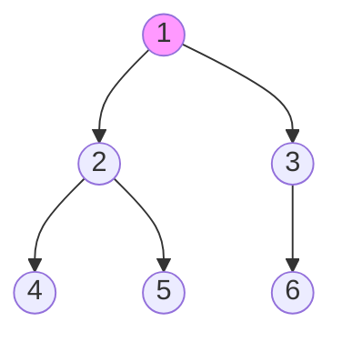

# Chapter 4: Data Structures — Exam Quick Revision

## Learning Objectives
- Compare linear data structures (arrays, linked lists, stacks, queues) with time complexities
- Convert infix expressions to postfix and evaluate postfix notation
- Compute binary tree properties and traverse trees in pre/in/post/level order
- Implement BST operations and analyze AVL tree rotations
- Construct heap and extract min/max with heapify
- Traverse graphs using BFS and DFS with complexity analysis
- Select appropriate sorting algorithm based on input characteristics
- Resolve hash collisions with chaining and open addressing

---

## 1. Array vs Linked List

| Operation | Array | Singly Linked List |
|-----------|-------|--------------------|
| Access (index) | O(1) | O(n) — must traverse |
| Insert (beginning) | O(n) — shift elements | O(1) — update pointer |
| Insert (end) | O(1) amortized (dynamic) | O(1) with tail pointer |
| Delete (known position) | O(n) — shift | O(1) — pointer removal (prev known) |
| Search (unsorted) | O(n) | O(n) |
| Memory | Contiguous — fixed size | Dynamic — extra pointer overhead |
| Cache locality | Excellent (spatial locality) | Poor (nodes scattered) |

**Exam tip:** Linked list advantages — dynamic size, O(1) insertion/deletion at ends. Array advantages — O(1) random access, cache-friendly.

---

## 2. Stack — Applications

### Stack Operations: push, pop, peek, isEmpty — all O(1)

### Infix → Postfix (Shunting-Yard Algorithm)

**Operator precedence:** ^ (highest, right-assoc), * / (middle, left-assoc), + − (lowest, left-assoc)

**Algorithm:**
1. Operands → output directly
2. '(' → push to stack
3. ')' → pop to output until '('
4. Operator: while (stack top has higher/equal precedence) pop to output; then push operator

**Example:** `A + (B * C − D) / E`
```
Symbol | Stack    | Output
A      |          | A
+      | +        | A
(      | + (      | A
B      | + (      | A B
*      | + ( *    | A B
C      | + ( *    | A B C
−      | + ( −    | A B C *    (* popped due to higher precedence)
D      | + ( −    | A B C * D
)      | +        | A B C * D −
/      | + /      | A B C * D −
E      | + /      | A B C * D − E
end    |          | A B C * D − E / +
```

**Postfix evaluation:** Scan left to right; operand → push; operator → pop two operands, apply, push result.

### Balanced Parentheses
- Scan string: '(' → push; ')' → if stack empty ⇒ unbalanced, else pop
- At end: stack should be empty

---

## 3. Queue Types

| Type | Description | Use Case |
|------|-------------|----------|
| **Simple Queue** | FIFO (front dequeue, rear enqueue) | BFS, print spooler |
| **Circular Queue** | Front wraps to beginning when rear reaches end | Memory-efficient fixed-size buffer |
| **Deque** | Double-ended — insert/delete at both ends | Palindrome checking, sliding window max |
| **Priority Queue** | Elements removed by priority, not FIFO | Dijkstra, Huffman coding, heap-based |

---

## 4. Binary Tree

### Properties
- **Maximum nodes at level i:** 2^i (0-indexed level)
- **Maximum nodes in tree of height h:** 2^(h+1) − 1 (height = levels − 1)
- **Minimum height for n nodes:** ⌈log2(n+1)⌉ − 1
- **Height of n-node complete binary tree:** ⌊log2 n⌋

### Tree Types
| Type | Definition |
|------|------------|
| Full/Strict | Every node has 0 or 2 children |
| Complete | All levels full except possibly last, which is filled left to right |
| Perfect | All internal nodes have 2 children and all leaves at same level |
| Degenerate | Each node has at most 1 child (skewed — O(n) height) |

### Binary Search Tree (BST)
- **Left subtree:** All keys &lt; root. **Right subtree:** All keys &gt; root.
- **Search/Insert/Delete:** O(h). Balanced case O(log n), skewed O(n).
- **In-order traversal** of BST gives sorted order.

### Tree Traversals



| Traversal | Order | Result |
|-----------|-------|--------|
| Preorder (VLR) | Root → Left → Right | 1, 2, 4, 5, 3, 6 |
| Inorder (LVR) | Left → Root → Right | 4, 2, 5, 1, 6, 3 |
| Postorder (LRV) | Left → Right → Root | 4, 5, 2, 6, 3, 1 |
| Level-order | By level, left to right | 1, 2, 3, 4, 5, 6 |

---

## 5. AVL Tree Rotations

| Rotation | Condition | Steps |
|----------|-----------|-------|
| **LL** | Left-left imbalance (inserted in left subtree of left child) | Right rotate on unbalanced node |
| **RR** | Right-right imbalance (inserted in right subtree of right child) | Left rotate on unbalanced node |
| **LR** | Left-right imbalance (inserted in right subtree of left child) | Left rotate on child, then right rotate on parent |
| **RL** | Right-left imbalance (inserted in left subtree of right child) | Right rotate on child, then left rotate on parent |

**Balance factor:** height(left) − height(right) ∈ {−1, 0, +1}

**Solved Example — LL Rotation:**
```
Insert: 30, 20, 10
  30                   20
 /          →         /  \
20           LL      10   30
/
10
```

---

## 6. Heap

### Binary Heap Properties
- Complete binary tree (filled left to right)
- **Max heap:** Parent ≥ children. **Min heap:** Parent ≤ children.
- **Array representation:** left(i) = 2i+1, right(i) = 2i+2, parent(i) = ⌊(i−1)/2⌋

### Operations
| Operation | Time | Description |
|-----------|------|-------------|
| Build Heap | O(n) | Heapify all non-leaf nodes bottom-up |
| Insert | O(log n) | Add at end, bubble up |
| Extract Max/Min | O(log n) | Remove root, promote last element, bubble down |
| Heapify | O(log n) | Restore heap property from a node |

### Heap Sort
```c
Build max-heap (O(n))
For i = n−1 down to 1:
    swap A[0] with A[i]
    heap-size--
    max-heapify(A, 0)    // O(log n)
```
**Total:** O(n log n). **Space:** O(1) in-place.

---

## 7. Graph Representations

| Representation | Space | Edge Check | Adjacent Vertices |
|---------------|-------|-----------|-------------------|
| **Adjacency Matrix** | O(V^2) | O(1) | O(V) |
| **Adjacency List** | O(V + E) | O(degree(V)) | O(degree(V)) |

**When to use which:** Dense graphs (E ≈ V^2) → matrix. Sparse graphs (E ≪ V^2) → list.

### BFS vs DFS

| Aspect | BFS | DFS |
|--------|-----|-----|
| Data structure | Queue | Stack (recursion) |
| Traversal order | Level by level | Depth-first (go deep, backtrack) |
| Complexity | O(V + E) | O(V + E) |
| Use cases | Shortest path (unweighted), connected components, bipartite check | Topological sort, cycle detection, maze solving |
| Edge types | Tree, cross | Tree, forward, back, cross |

---

## 8. Sorting Algorithms — Comparison Table

| Algorithm | Best | Average | Worst | Space | Stable | In-place |
|-----------|------|---------|-------|-------|--------|----------|
| **Bubble Sort** | Ω(n) | Θ(n^2) | O(n^2) | O(1) | ✅ | ✅ |
| **Selection Sort** | Ω(n^2) | Θ(n^2) | O(n^2) | O(1) | ❌ | ✅ |
| **Insertion Sort** | Ω(n) | Θ(n^2) | O(n^2) | O(1) | ✅ | ✅ |
| **Merge Sort** | Ω(n log n) | Θ(n log n) | O(n log n) | O(n) | ✅ | ❌ |
| **Quick Sort** | Ω(n log n) | Θ(n log n) | O(n^2) | O(log n) | ❌ | ✅ |
| **Heap Sort** | Ω(n log n) | Θ(n log n) | O(n log n) | O(1) | ❌ | ✅ |

**Key points for exams:**
- **Quick sort worst case:** Already sorted (if pivot = first/last). **Solution:** Randomized pivot.
- **Merge sort:** Only sorting with O(n log n) guarantee and stable.
- **Heap sort:** In-place but not stable.
- **Insertion sort:** Best for nearly sorted data (O(n) best case).
- **Selection sort:** Minimum swaps (O(n) swaps).

---

## 9. Hashing

### Hash Functions
- **Division method:** h(k) = k mod m (m prime recommended)
- **Multiplication method:** h(k) = ⌊m × (kA mod 1)⌋, A = (√5−1)/2 ≈ 0.618

### Collision Resolution
| Method | Description | Pros | Cons |
|--------|-------------|------|------|
| **Chaining** | Each slot has linked list | Simple, handles any load factor | Extra memory for pointers |
| **Open Addressing** | Probe sequence to find next empty slot | No extra pointers | Clustering, deletion tricky |

### Open Addressing Techniques
- **Linear probing:** h(k,i) = (h(k) + i) mod m — primary clustering
- **Quadratic probing:** h(k,i) = (h(k) + c1i + c2i^2) mod m — secondary clustering
- **Double hashing:** h(k,i) = (h1(k) + i×h2(k)) mod m — best performance

### Load Factor α = n/m (n = keys, m = table size)
- Chaining: α can exceed 1; average chain length = α
- Open addressing: α must be &lt; 1; too high → probe count explodes

---

## Solved MCQs

**Q1:** Which traversal gives sorted order in BST?
- (a) Preorder
- (b) Inorder
- (c) Postorder
- (d) Level-order

**Answer:** (b) Inorder. Inorder traversal visits left subtree then root then right subtree, producing keys in ascending order.

**Q2:** Postfix expression: 5 3 + 8 2 − * 4 /
- (a) 8
- (b) 12
- (c) 16
- (d) 24

**Answer:** (b) 12. 5+3=8. 8−2=6. 8×6=48. 48/4=12.

**Q3:** In a complete binary tree with 1000 nodes, the number of leaf nodes is:
- (a) 500
- (b) 488
- (c) 489
- (d) 512

**Answer:** (a) 500. In a complete binary tree, leaf count = ⌈n/2⌉ = ⌈1000/2⌉ = 500.

**Q4:** Which sorting algorithm makes the minimum number of comparisons in the worst case?
- (a) Quick sort
- (b) Merge sort
- (c) Insertion sort
- (d) Selection sort

**Answer:** (b) Merge sort. Worst-case comparisons = n log n − n + 1 ≈ n log n. Quick sort worst case is O(n^2). Lower bound for comparison-based sorting is Ω(n log n), and merge sort achieves it.

---

## 10. Red-Black Tree Properties

| Property | Description |
|----------|-------------|
| 1 | Every node is either RED or BLACK |
| 2 | Root is always BLACK |
| 3 | Leaves (NULL) are BLACK |
| 4 | Red node's children must be BLACK (no two consecutive reds) |
| 5 | Every path from root to leaf has same number of BLACK nodes (black-height) |

**Height guarantee:** h ≤ 2 × log₂(n+1) — O(log n) operations guaranteed.

**Insertion:** Recolor and rotate (up to 2 rotations)
**Deletion:** Recolor and rotate (up to 3 rotations)

**AVL vs Red-Black:**
| Aspect | AVL | Red-Black |
|--------|-----|-----------|
| Balance | Stricter (BF ±1) | Relaxed (black-height) |
| Lookup | Faster (more balanced) | Slightly slower |
| Insert/Delete | Slower (more rotations) | Faster (fewer rotations) |
| Use case | Read-heavy workloads | Write-heavy workloads |

## 11. Graph Algorithms

### Dijkstra's Shortest Path
- Single-source shortest path (non-negative weights)
- **Data structure:** Priority queue (min-heap)
- **Time:** O((V + E) log V) with binary heap
- **Greedy:** Always picks the vertex with smallest distance

### Minimum Spanning Tree (MST)

| Algorithm | Strategy | Time | Data Structure |
|-----------|----------|------|----------------|
| **Prim's** | Greedy — grow tree from a vertex | O((V+E) log V) | Priority queue |
| **Kruskal's** | Greedy — pick smallest edge, no cycle | O(E log E) | Union-Find (DSU) |

### Topological Sort
- DAG (Directed Acyclic Graph) vertices in order: for every edge u→v, u appears before v
- **Methods:** DFS-based (push post-order) or Kahn's algorithm (in-degree queue)

### Graph Cycle Detection
| Graph Type | Method |
|-------------|--------|
| Undirected | DFS with parent tracking — visited and not parent = cycle |
| Directed | DFS with recursion stack — vertex in current recursion stack = cycle |

## 12. Advanced Sorting — Non-Comparison Based

### Counting Sort
- **Range:** Input values in range [0, k]
- **Time:** O(n + k), **Space:** O(k)
- **Stable:** Yes
- Use when: k = O(n) (small range)

### Radix Sort
- Sort digit by digit (LSD first or MSD first)
- Uses counting sort as subroutine
- **Time:** O(d × (n + b)) where d = digits, b = base
- **When:** Fixed-length keys (integers, strings)

### Bucket Sort
- Distribute elements into buckets, sort each bucket (insertion sort)
- **Average:** O(n), **Worst:** O(n²)
- **When:** Uniformly distributed data

## 13. Additional Hash Techniques

### Rehashing
- When load factor α exceeds threshold, create larger table, rehash all entries
- Typically double table size (prime near 2×)
- **Cost:** O(n) but amortized O(1) per insertion

### Perfect Hashing
- Two-level hashing scheme with no collisions
- First level: hash to bucket
- Second level: per-bucket collision-free hash function
- **Space:** O(n), **Lookup:** O(1) worst-case

### Consistent Hashing
- Hash both keys and servers onto a ring
- Each key assigned to nearest server clockwise
- **Used by:** DynamoDB, Cassandra, distributed caching
- **Advantage:** Minimal rehashing when servers added/removed

## 14. Skip List

- Multi-level linked list with "express lanes"
- Each node promoted to higher level with probability p (typically 0.5)
- **Operations:** O(log n) average — search, insert, delete
- **Space:** O(n) expected
- **Advantage over balanced trees:** Simpler, no rotations
- **Used in:** Redis sorted sets, LevelDB memtable

---

## Summary
- **Linear DS:** Arrays (O(1) access), linked lists (O(1) insert at ends), stacks (LIFO), queues (FIFO)
- **Trees:** Binary tree properties, BST (sorted inorder), AVL (balance factor ±1, 4 rotations)
- **Heap:** Complete binary tree, min/max heap, build O(n), extract O(log n)
- **Graphs:** Matrix (dense) vs list (sparse), BFS (queue), DFS (stack/recursion)
- **Sorting:** Bubble (slow), Selection (min swaps), Insertion (near-sorted), Merge (stable O(n log n)), Quick (average O(n log n)), Heap (in-place O(n log n))
- **Hashing:** Load factor, chaining vs open addressing (linear/quadratic/double)
- **RB Tree:** 4 properties, O(log n) guaranteed, fewer rotations than AVL
- **Graph algos:** Dijkstra (shortest path), Prim/Kruskal (MST), Topological sort (DAG)
- **Non-comparison sorts:** Counting sort (O(n+k)), Radix sort (O(dn)), Bucket sort (O(n))
- **Advanced hashing:** Rehashing (amortized O(1)), Perfect hashing (O(1) worst), Consistent hashing (rings)
- **Skip list:** Probabilistic balanced structure — O(log n) operations

---

## HOT Topics (Frequently Asked in IBPS SO IT Mains)
1. Infix to postfix conversion — operator precedence and stack state
2. Tree traversal sequences — given inorder + preorder, reconstruct the binary tree
3. AVL tree insertion/deletion with balance factor after each step
4. Heap insertion and deletion — show array state after each operation
5. Sorting algorithm selection — identify algorithm from intermediate array state
6. Hash table insertion with linear/quadratic probing — show final table state
7. BFS/DFS on graph — give traversal order starting from a given vertex
8. BST deletion cases — node with 0/1/2 children

---

## Chapter Quiz (MCQs)

<details>
<summary>Q1: The minimum number of comparisons required to find the minimum and maximum of n elements is:</summary>
A1: ⌈3n/2⌉ − 2. Using tournament method, compare in pairs: 3 comparisons per 2 elements, minus 2 for the last comparison.
</details>

<details>
<summary>Q2: In an AVL tree, what are the possible balance factor values?</summary>
A2: −1, 0, +1. If any node's balance factor goes outside this range, a rotation is required to rebalance.
</details>

<details>
<summary>Q3: Which graph representation is best for Dijkstra's algorithm on a sparse graph with 10^5 vertices?</summary>
A3: Adjacency list with priority queue. Matrix would use O(V^2) = 10^10 memory, which is impractical. List uses O(V+E) space.
</details>

<details>
<summary>Q4: How many nodes does a perfect binary tree of height 5 have (height counted as levels − 1)?</summary>
A4: 63 nodes. 2^(h+1) − 1 = 2^6 − 1 = 64 − 1 = 63.
</details>

<details>
<summary>Q5: In double hashing, what is the purpose of the second hash function h2(k)?</summary>
A5: It determines the probe step size, ensuring that different keys that hash to the same slot use different probe sequences, reducing clustering compared to linear/quadratic probing.
</details>
