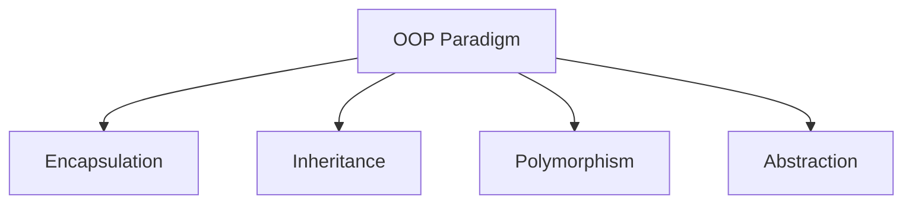
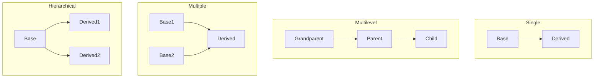

# Chapter 5: Object-Oriented Programming Concepts — Exam Quick Revision

## Learning Objectives
- Explain the four pillars of OOP with code examples
- Differentiate access specifiers and their scope across C++ and Java
- Classify inheritance types and identify ambiguous scenarios
- Contrast virtual functions, function overloading, and overriding
- Distinguish abstract classes from interfaces in Java
- Apply constructor rules and exception handling syntax
- Recognize static vs dynamic binding in inheritance hierarchies

---

## 1. OOP Pillars



### Encapsulation
Bundling data (variables) and methods (functions) within a class, restricting direct access to internal state.

**Why?** Data hiding — protect internal representation from external misuse.

```cpp
class BankAccount {
private:
    double balance;           // hidden from outside
public:
    void deposit(double amt) {
        if (amt > 0) balance += amt;
    }
    double getBalance() { return balance; }
};
```

### Abstraction
Showing only essential features, hiding implementation details.

**C++:** Abstract class with pure virtual function. **Java:** `abstract` class or `interface`.

```cpp
class Shape {                        // abstract class
public:
    virtual double area() = 0;       // pure virtual function
};

class Circle : public Shape {
    double r;
public:
    Circle(double r) : r(r) {}
    double area() override { return 3.14 * r * r; }
};
```

### Inheritance
Derived class acquires properties and behavior of base class — enables code reuse and hierarchical classification.

### Polymorphism
Same interface, different implementations — compile-time (overloading) and runtime (overriding via virtual functions).

---

## 2. Access Specifiers

| Specifier | C++ Meaning | Java Meaning |
|-----------|-------------|--------------|
| `private` | Class only (including friends) | Class only |
| `protected` | Class + derived classes | Class + derived classes + same package |
| `public` | Everyone | Everyone |
| *(default)* | `private` (class) / `public` (struct) | Package-private (no modifier) |

**Important:** In Java, `protected` also allows access within the same package, which is broader than C++.

**C++ friend function:** A non-member function that can access private members of a class.

```cpp
class A {
private:
    int secret;
    friend void showSecret(A& a);    // non-member function can access private
};
void showSecret(A& a) {
    cout << a.secret;                // allowed because of friend declaration
}
```

---

## 3. Inheritance Types



| Type | Description | C++ Support | Java Support |
|------|-------------|-------------|--------------|
| **Single** | One base, one derived | ✅ | ✅ |
| **Multilevel** | Chain: A → B → C | ✅ | ✅ |
| **Multiple** | Class inherits from ≥2 bases | ✅ | ❌ (use interfaces) |
| **Hierarchical** | One base, multiple derived | ✅ | ✅ |
| **Hybrid** | Mix of above (diamond problem) | ✅ (virtual inheritance) | ❌ |

### Diamond Problem (Multiple Inheritance)

```cpp
class A { public: void show() {} };
class B : public A {};
class C : public A {};
class D : public B, public C {};   // D has two copies of A

// Ambiguity: D d; d.show();  — which A::show?
// Solution: virtual inheritance
class B : virtual public A {};
class C : virtual public A {};
```

---

## 4. Virtual Functions &amp; vtable

### Virtual Function Mechanism
- Base class declares `virtual` function
- Derived class overrides it with `override` keyword (C++11)
- **vtable (virtual table):** Per-class array of function pointers
- **vptr:** Per-object pointer to the vtable

```cpp
class Base {
public:
    virtual void display() { cout << "Base\n"; }
};
class Derived : public Base {
public:
    void display() override { cout << "Derived\n"; }
};
// Base* ptr = new Derived();
// ptr->display();  // Calls Derived::display() — runtime polymorphism
```

### vtable Layout
```
Base object: [vptr → Base_vtable → Base::display()]
Derived object: [vptr → Derived_vtable → Derived::display()]
```

### Pure Virtual Function
```cpp
virtual void func() = 0;    // class becomes abstract, cannot instantiate
```

---

## 5. Function Overloading vs Overriding

| Aspect | Function Overloading | Function Overriding |
|--------|---------------------|---------------------|
| Scope | Same class | Base → Derived |
| Name | Same | Same |
| Parameters | Must differ (type/count) | Must match exactly |
| Return type | May differ | Must match (covariant allowed) |
| `virtual` | Not required | Required |
| Binding | Compile-time (static) | Runtime (dynamic) |
| Example | `int add(int,int)` vs `double add(double,double)` | `Base::draw()` vs `Derived::draw()` |

### Operator Overloading (C++)
```cpp
class Complex {
    int real, imag;
public:
    Complex operator+(const Complex& c) {
        return Complex(real + c.real, imag + c.imag);
    }
};
// Usage: c3 = c1 + c2;
```

**Cannot overload:** `::`, `.*`, `.`, `?:`, `sizeof`, `typeid`

---

## 6. Abstract Class vs Interface (Java)

| Aspect | Abstract Class | Interface |
|--------|---------------|-----------|
| Instantiation | Cannot instantiate | Cannot instantiate |
| Methods | Can have abstract + concrete | All methods abstract (Java 7); default/static (Java 8+) |
| Variables | Instance variables (any) | `public static final` constants only |
| Constructor | ✅ Yes | ❌ No |
| Multiple inheritance | ❌ One abstract class | ✅ Multiple interfaces |
| Keyword | `abstract class` | `interface` |

```java
// Abstract class
abstract class Vehicle {
    abstract void start();               // must be overridden
    void fuel() { System.out.println("Fueling"); }  // concrete
}

// Interface
interface Drawable {
    void draw();                         // implicitly public abstract
    default void display() {             // Java 8 default method
        System.out.println("Displaying");
    }
}
```

---

## 7. Exception Handling

### C++ Try-Catch
```cpp
try {
    if (age < 18) throw runtime_error("Underage");
} catch (const runtime_error& e) {
    cout << e.what();
} catch (...) {                          // catch-all
    cout << "Unknown exception";
}
```

### Java Try-Catch-Finally
```java
try {
    int result = 10 / 0;
} catch (ArithmeticException e) {
    System.out.println("Division by zero");
} finally {
    System.out.println("Always executed");  // cleanup code
}
```

**Throw vs Throws:**
- `throw` — actually throws an exception (inside method)
- `throws` — declares checked exceptions a method might throw (in method signature)

### Checked vs Unchecked (Java)
| Type | Checked Exception | Unchecked Exception (Runtime) |
|------|-------------------|-------------------------------|
| Must handle? | ✅ Must catch/declare | ❌ Optional |
| Examples | IOException, SQLException | NullPointerException, ArrayIndexOutOfBounds |

---

## 8. Keywords: this, super

| Keyword | C++ | Java |
|---------|-----|------|
| `this` | Pointer to current object (`this->x`) | Reference to current object (`this.x`) |
| `super` | Call parent via scope (`Base::func()`) | `super()` calls parent constructor; `super.method()` calls parent method |

### Constructor Chaining (Java)
```java
class Parent {
    Parent() { System.out.println("Parent"); }
}
class Child extends Parent {
    Child() {
        super();             // implicit first line — calls Parent()
        System.out.println("Child");
    }
}
```

---

## 9. Constructor Types

| Type | C++ Syntax | Java Syntax |
|------|------------|-------------|
| **Default** | `ClassName() {}` | `ClassName() {}` |
| **Parameterized** | `ClassName(int x) : data(x) {}` | `ClassName(int x) { this.x = x; }` |
| **Copy** | `ClassName(const ClassName& o) {}` | `ClassName(ClassName o) { /* copy */ }` |
| **Move (C++11)** | `ClassName(ClassName&& o) {}` | Not applicable |

### Constructor Details
- **Default constructor:** Provided by compiler if no constructor defined
- **Copy constructor (C++):** Used when passed by value, returned by value
- **Initializer list (C++):** `ClassName(int a, int b) : x(a), y(b) {}` — more efficient than assignment in body
- **Destructor (C++):** `~ClassName() {}` — called when object goes out of scope (no garbage collector)

---

## 10. Static vs Dynamic Binding

| Aspect | Static Binding (Early) | Dynamic Binding (Late) |
|--------|----------------------|----------------------|
| Time | Compile-time | Runtime |
| Mechanism | Function overloading, operator overloading | Virtual functions |
| Performance | Faster (no vtable lookup) | Slightly slower (vtable indirection) |
| Resolution | Based on reference type | Based on actual object type |
| Example | `print(int)` vs `print(double)` | `vehiclePtr->start()` calls `Car::start()` if pointing to Car |

---

## 11. Friend Function &amp; Class

```cpp
class A {
private:
    int x;
    friend class B;           // B can access all private members of A
    friend void show(A& a);   // non-member can access private members
};
```

**Friend function is NOT a member function** — has no `this` pointer, cannot be virtual.

---

## 12. Templates vs Generics

| Aspect | C++ Templates | Java Generics |
|--------|--------------|---------------|
| Mechanism | Compile-time code generation (templates) | Type erasure (compiler removes generic info) |
| Performance | No overhead — inline code | Some overhead — casting added |
| Type safety | Less (implicit conversions) | More (compile-time type checking) |
| Wildcards | Not needed (enable_if, SFINAE) | `? extends T`, `? super T` |
| Multiple type params | `template &lt;typename T, typename U&gt;` | `&lt;T, U&gt;` |
| Non-type params | `template &lt;int N&gt;` — allowed | Not allowed |

```cpp
// C++ Template
template &lt;typename T&gt;
T max(T a, T b) { return (a &gt; b) ? a : b; }
```

```java
// Java Generic
public static &lt;T extends Comparable&lt;T&gt;&gt; T max(T a, T b) {
    return (a.compareTo(b) &gt; 0) ? a : b;
}
```

---

## Solved MCQs

**Q1:** Which of the following cannot be declared virtual in C++?
- (a) Member function
- (b) Constructor
- (c) Destructor
- (d) All can be virtual

**Answer:** (b) Constructor. Constructors cannot be virtual. Destructors can be virtual (highly recommended for polymorphic base classes).

**Q2:** In Java, which keyword prevents a class from being inherited?
- (a) static
- (b) final
- (c) abstract
- (d) private

**Answer:** (b) final. A final class cannot be subclassed. A final method cannot be overridden.

**Q3:** Can a C++ friend function access private members of a class?
- (a) Yes
- (b) No
- (c) Only if it's a member of another class
- (d) Only in derived classes

**Answer:** (a) Yes. That's the purpose of the friend declaration — it grants non-member functions (or other classes) access to private members.

**Q4:** What does vptr (virtual pointer) point to?
- (a) The most-derived class
- (b) The vtable of the class
- (c) The base class
- (d) The heap

**Answer:** (b) The vtable of the class. Each object has a vptr pointing to its class's vtable.

**Q5:** Which of the following is NOT a feature of Java's `abstract` class?
- (a) Can have constructor
- (b) Can have instance variables
- (c) Supports multiple inheritance
- (d) Can have both abstract and concrete methods

**Answer:** (c) Supports multiple inheritance. Java does not support multiple inheritance for classes. The abstract keyword does not change this.

---

## Summary
- **Encapsulation:** Private data + public methods — data hiding
- **Inheritance:** Single, multilevel, multiple (C++), hierarchical — code reuse
- **Polymorphism:** Overloading (compile-time) + Overriding (runtime via virtual functions)
- **Abstraction:** Abstract classes (both abstract/concrete methods) vs Interfaces (pure contracts)
- **Access:** private &lt; protected &lt; public (C++ adds friend)
- **Virtual:** vtable per class, vptr per object — dynamic dispatch
- **Exception:** try/catch/finally (Java); throw, throws (checked vs unchecked)
- **this/super:** Implicit pointer/reference to current/parent object
- **Templates (C++):** Compile-time generation. **Generics (Java):** Type erasure.

---

## HOT Topics (Frequently Asked in IBPS SO IT Mains)
1. Virtual function mechanism — vtable and vptr layout
2. Diamond problem and virtual inheritance resolution (C++)
3. Method overloading vs overriding — identify from given code snippets
4. Abstract class vs interface — choose which to use for a given design scenario
5. Exception handling flow — which catch block executes, order of exceptions
6. Constructor initialization sequence in inheritance (base → derived)
7. Static vs dynamic binding — predict output of inheritance code
8. Function overloading ambiguity — type promotion and implicit conversions
9. Copy constructor vs assignment operator — when each is called
10. Garbage collection in Java vs destructor in C++

---

## Chapter Quiz (MCQs)

<details>
<summary>Q1: In C++, which of the following can be virtual?</summary>
A1: Member functions and destructors. Constructors cannot be virtual. Static member functions also cannot be virtual.
</details>

<details>
<summary>Q2: Java's interface methods are implicitly:</summary>
A2: public and abstract (Java 7 and before). From Java 8, they can also be default or static with concrete implementations.
</details>

<details>
<summary>Q3: What will happen if a class has a pure virtual function in C++?</summary>
A3: The class becomes abstract and cannot be instantiated. Derived classes must override the pure virtual function to become concrete.
</details>

<details>
<summary>Q4: Which OOP pillar is primarily achieved through private members and public getter/setter methods?</summary>
A4: Encapsulation. It hides internal state and provides controlled access through public interfaces, ensuring data integrity.
</details>

<details>
<summary>Q5: In Java, if a subclass constructor does not explicitly call super(), what happens?</summary>
A5: The compiler inserts `super()` (no-arg parent constructor) implicitly as the first statement. If the parent doesn't have a no-arg constructor, this causes a compile error.
</details>
