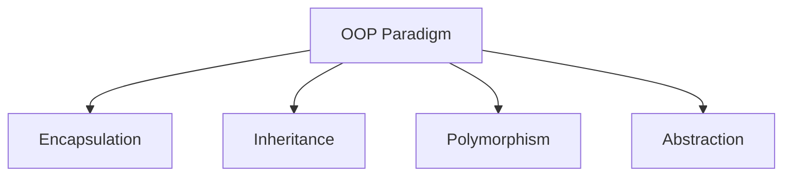
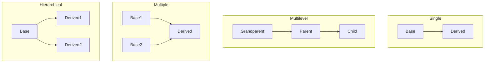

# Chapter 5: Object-Oriented Programming Concepts — Exam Quick Revision

## Learning Objectives
- Explain the four pillars of OOP with code examples
- Differentiate access specifiers and their scope across C++ and Java
- Classify inheritance types and identify ambiguous scenarios
- Contrast virtual functions, function overloading, and overriding
- Distinguish abstract classes from interfaces in Java
- Apply constructor rules and exception handling syntax
- Recognize static vs dynamic binding in inheritance hierarchies

<!-- Image Gallery -->
<section class="lesson-visuals" aria-label="Visual learning resources">
  <header><span>VISUAL LEARNING</span><h2>See it. Review it. Remember it.</h2></header>
  <a class="lesson-visual-card" href="../../../assets/images/lessons/professional-knowledge/05-oops-concepts/handwritten-notes.svg" target="_blank" rel="noopener">
    
    <span><strong>Handwritten notes</strong>Condensed notes for deliberate review.</span>
  </a>
  <a class="lesson-visual-card" href="../../../assets/images/lessons/professional-knowledge/05-oops-concepts/sticky-notes.svg" target="_blank" rel="noopener">
    
    <span><strong>Sticky-note revision</strong>Fast recall prompts for revision.</span>
  </a>
  <a class="lesson-visual-card" href="../../../assets/images/lessons/professional-knowledge/05-oops-concepts/visual-explanation.svg" target="_blank" rel="noopener">
    
    <span><strong>Visual concept guide</strong>A connected explanation of the key ideas.</span>
  </a>
</section>
<!-- End Image Gallery -->

---

## 1. OOP Pillars



### Encapsulation

Bundling data (variables) and methods (functions) within a class, restricting direct access to internal state.

**Why?** Data hiding — protect internal representation from external misuse.

```cpp
class BankAccount {
private:
    double balance;           // hidden from outside
public:
    void deposit(double amt) {
        if (amt > 0) balance += amt;
    }
    double getBalance() { return balance; }
};
```

### Abstraction

Showing only essential features, hiding implementation details.

**C++:** Abstract class with pure virtual function. **Java:** `abstract` class or `interface`.

```cpp
class Shape {                        // abstract class
public:
    virtual double area() = 0;       // pure virtual function
};

class Circle : public Shape {
    double r;
public:
    Circle(double r) : r(r) {}
    double area() override { return 3.14 * r * r; }
};
```

### Inheritance

Derived class acquires properties and behavior of base class — enables code reuse and hierarchical classification.

### Polymorphism

Same interface, different implementations — compile-time (overloading) and runtime (overriding via virtual functions).

---

## 2. Access Specifiers

| Specifier | C++ Meaning | Java Meaning |
|-----------|-------------|--------------|
| `private` | Class only (including friends) | Class only |
| `protected` | Class + derived classes | Class + derived classes + same package |
| `public` | Everyone | Everyone |
| *(default)* | `private` (class) / `public` (struct) | Package-private (no modifier) |

**Important:** In Java, `protected` also allows access within the same package, which is broader than C++.

**C++ friend function:** A non-member function that can access private members of a class.

```cpp
class A {
private:
    int secret;
    friend void showSecret(A& a);    // non-member function can access private
};
void showSecret(A& a) {
    cout << a.secret;                // allowed because of friend declaration
}
```

---

## 3. Inheritance Types



| Type | Description | C++ Support | Java Support |
|------|-------------|-------------|--------------|
| **Single** | One base, one derived | ✅ | ✅ |
| **Multilevel** | Chain: A → B → C | ✅ | ✅ |
| **Multiple** | Class inherits from ≥2 bases | ✅ | ❌ (use interfaces) |
| **Hierarchical** | One base, multiple derived | ✅ | ✅ |
| **Hybrid** | Mix of above (diamond problem) | ✅ (virtual inheritance) | ❌ |

### Diamond Problem (Multiple Inheritance)

```cpp
class A { public: void show() {} };
class B : public A {};
class C : public A {};
class D : public B, public C {};   // D has two copies of A

// Ambiguity: D d; d.show();  — which A::show?
// Solution: virtual inheritance
class B : virtual public A {};
class C : virtual public A {};
```

---

## 4. Virtual Functions &amp; vtable

### Virtual Function Mechanism

- Base class declares `virtual` function
- Derived class overrides it with `override` keyword (C++11)
- **vtable (virtual table):** Per-class array of function pointers
- **vptr:** Per-object pointer to the vtable

```cpp
class Base {
public:
    virtual void display() { cout << "Base\n"; }
};
class Derived : public Base {
public:
    void display() override { cout << "Derived\n"; }
};
// Base* ptr = new Derived();
// ptr->display();  // Calls Derived::display() — runtime polymorphism
```

### vtable Layout

```
Base object: [vptr → Base_vtable → Base::display()]
Derived object: [vptr → Derived_vtable → Derived::display()]
```

### Pure Virtual Function

```cpp
virtual void func() = 0;    // class becomes abstract, cannot instantiate
```

---

## 5. Function Overloading vs Overriding

| Aspect | Function Overloading | Function Overriding |
|--------|---------------------|---------------------|
| Scope | Same class | Base → Derived |
| Name | Same | Same |
| Parameters | Must differ (type/count) | Must match exactly |
| Return type | May differ | Must match (covariant allowed) |
| `virtual` | Not required | Required |
| Binding | Compile-time (static) | Runtime (dynamic) |
| Example | `int add(int,int)` vs `double add(double,double)` | `Base::draw()` vs `Derived::draw()` |

### Operator Overloading (C++)

```cpp
class Complex {
    int real, imag;
public:
    Complex operator+(const Complex& c) {
        return Complex(real + c.real, imag + c.imag);
    }
};
// Usage: c3 = c1 + c2;
```

**Cannot overload:** `::`, `.*`, `.`, `?:`, `sizeof`, `typeid`

---

## 6. Abstract Class vs Interface (Java)

| Aspect | Abstract Class | Interface |
|--------|---------------|-----------|
| Instantiation | Cannot instantiate | Cannot instantiate |
| Methods | Can have abstract + concrete | All methods abstract (Java 7); default/static (Java 8+) |
| Variables | Instance variables (any) | `public static final` constants only |
| Constructor | ✅ Yes | ❌ No |
| Multiple inheritance | ❌ One abstract class | ✅ Multiple interfaces |
| Keyword | `abstract class` | `interface` |

```java
// Abstract class
abstract class Vehicle {
    abstract void start();               // must be overridden
    void fuel() { System.out.println("Fueling"); }  // concrete
}

// Interface
interface Drawable {
    void draw();                         // implicitly public abstract
    default void display() {             // Java 8 default method
        System.out.println("Displaying");
    }
}
```

---

## 7. Exception Handling

### C++ Try-Catch

```cpp
try {
    if (age < 18) throw runtime_error("Underage");
} catch (const runtime_error& e) {
    cout << e.what();
} catch (...) {                          // catch-all
    cout << "Unknown exception";
}
```

### Java Try-Catch-Finally

```java
try {
    int result = 10 / 0;
} catch (ArithmeticException e) {
    System.out.println("Division by zero");
} finally {
    System.out.println("Always executed");  // cleanup code
}
```

**Throw vs Throws:**
- `throw` — actually throws an exception (inside method)
- `throws` — declares checked exceptions a method might throw (in method signature)

### Checked vs Unchecked (Java)

| Type | Checked Exception | Unchecked Exception (Runtime) |
|------|-------------------|-------------------------------|
| Must handle? | ✅ Must catch/declare | ❌ Optional |
| Examples | IOException, SQLException | NullPointerException, ArrayIndexOutOfBounds |

---

## 8. Keywords: this, super

| Keyword | C++ | Java |
|---------|-----|------|
| `this` | Pointer to current object (`this->x`) | Reference to current object (`this.x`) |
| `super` | Call parent via scope (`Base::func()`) | `super()` calls parent constructor; `super.method()` calls parent method |

### Constructor Chaining (Java)

```java
class Parent {
    Parent() { System.out.println("Parent"); }
}
class Child extends Parent {
    Child() {
        super();             // implicit first line — calls Parent()
        System.out.println("Child");
    }
}
```

---

## 9. Constructor Types

| Type | C++ Syntax | Java Syntax |
|------|------------|-------------|
| **Default** | `ClassName() {}` | `ClassName() {}` |
| **Parameterized** | `ClassName(int x) : data(x) {}` | `ClassName(int x) { this.x = x; }` |
| **Copy** | `ClassName(const ClassName& o) {}` | `ClassName(ClassName o) { /* copy */ }` |
| **Move (C++11)** | `ClassName(ClassName&& o) {}` | Not applicable |

### Constructor Details

- **Default constructor:** Provided by compiler if no constructor defined
- **Copy constructor (C++):** Used when passed by value, returned by value
- **Initializer list (C++):** `ClassName(int a, int b) : x(a), y(b) {}` — more efficient than assignment in body
- **Destructor (C++):** `~ClassName() {}` — called when object goes out of scope (no garbage collector)

---

## 10. Static vs Dynamic Binding

| Aspect | Static Binding (Early) | Dynamic Binding (Late) |
|--------|----------------------|----------------------|
| Time | Compile-time | Runtime |
| Mechanism | Function overloading, operator overloading | Virtual functions |
| Performance | Faster (no vtable lookup) | Slightly slower (vtable indirection) |
| Resolution | Based on reference type | Based on actual object type |
| Example | `print(int)` vs `print(double)` | `vehiclePtr->start()` calls `Car::start()` if pointing to Car |

---

## 11. Friend Function &amp; Class

```cpp
class A {
private:
    int x;
    friend class B;           // B can access all private members of A
    friend void show(A& a);   // non-member can access private members
};
```

**Friend function is NOT a member function** — has no `this` pointer, cannot be virtual.

---

## 12. Templates vs Generics

| Aspect | C++ Templates | Java Generics |
|--------|--------------|---------------|
| Mechanism | Compile-time code generation (templates) | Type erasure (compiler removes generic info) |
| Performance | No overhead — inline code | Some overhead — casting added |
| Type safety | Less (implicit conversions) | More (compile-time type checking) |
| Wildcards | Not needed (enable_if, SFINAE) | `? extends T`, `? super T` |
| Multiple type params | `template &lt;typename T, typename U&gt;` | `&lt;T, U&gt;` |
| Non-type params | `template &lt;int N&gt;` — allowed | Not allowed |

```cpp
// C++ Template
template &lt;typename T&gt;
T max(T a, T b) { return (a &gt; b) ? a : b; }
```

```java
// Java Generic
public static &lt;T extends Comparable&lt;T&gt;&gt; T max(T a, T b) {
    return (a.compareTo(b) &gt; 0) ? a : b;
}
```

---

## Solved MCQs

**Q1:** Which of the following cannot be declared virtual in C++?
- (a) Member function
- (b) Constructor
- (c) Destructor
- (d) All can be virtual

**Answer:** (b) Constructor. Constructors cannot be virtual. Destructors can be virtual (highly recommended for polymorphic base classes).

**Q2:** In Java, which keyword prevents a class from being inherited?
- (a) static
- (b) final
- (c) abstract
- (d) private

**Answer:** (b) final. A final class cannot be subclassed. A final method cannot be overridden.

**Q3:** Can a C++ friend function access private members of a class?
- (a) Yes
- (b) No
- (c) Only if it's a member of another class
- (d) Only in derived classes

**Answer:** (a) Yes. That's the purpose of the friend declaration — it grants non-member functions (or other classes) access to private members.

**Q4:** What does vptr (virtual pointer) point to?
- (a) The most-derived class
- (b) The vtable of the class
- (c) The base class
- (d) The heap

**Answer:** (b) The vtable of the class. Each object has a vptr pointing to its class's vtable.

**Q5:** Which of the following is NOT a feature of Java's `abstract` class?
- (a) Can have constructor
- (b) Can have instance variables
- (c) Supports multiple inheritance
- (d) Can have both abstract and concrete methods

**Answer:** (c) Supports multiple inheritance. Java does not support multiple inheritance for classes. The abstract keyword does not change this.

---

---

## 📌 Extended Theory — Deep Dive for IBPS SO Mains (2024–2026 Trends)

### Virtual Function Table (vtable) — Deep Explanation

```typescript
// TypeScript simulation of C++ vtable mechanism
interface VTableEntry {
  funcName: string;
  func: (...args: any[]) => any;
}

class VTable {
  entries: Map<string, VTableEntry> = new Map();

  addEntry(name: string, fn: (...args: any[]) => any): void {
    this.entries.set(name, { funcName: name, func: fn });
  }

  getFunction(name: string): ((...args: any[]) => any) | undefined {
    return this.entries.get(name)?.func;
  }
}

// Simulate runtime dispatch
class BaseClass {
  vtable: VTable;

  constructor() {
    this.vtable = new VTable();
    this.vtable.addEntry('display', () => 'Base::display');
  }

  display(): string {
    return this.vtable.getFunction('display')!();
  }
}

class DerivedClass extends BaseClass {
  constructor() {
    super();
    // Override vtable entry — this is runtime polymorphism
    this.vtable.addEntry('display', () => 'Derived::display');
  }
}

// Usage
const obj: BaseClass = new DerivedClass();
console.log(obj.display()); // "Derived::display" — dynamic dispatch
```

**Memory Layout of C++ Object with vtable:**
```
Base object:
┌──────────────────┐
│ vptr (8 bytes)   │ → points to Base_vtable
│ int member1      │    ┌──────────────────────┐
│ double member2   │    │ Base::display() addr  │
└──────────────────┘    │ type_info ptr         │
                        └──────────────────────┘

Derived object:
┌──────────────────┐
│ vptr (8 bytes)   │ → points to Derived_vtable
│ int member1      │    ┌──────────────────────┐
│ double member2   │    │ Derived::display()    │
│ int derivedOnly  │    │ (overrides base)      │
└──────────────────┘    │ type_info ptr         │
                        └──────────────────────┘
```

### Interface vs Abstract Class — In-Depth with Code

> **PYQ 2024:** Can a Java interface have a constructor? Explain abstract class vs interface for multiple inheritance.

**Java Interface (Java 8+):**
```typescript
// TypeScript simulation of Java-style interface vs abstract class
interface Drawable {
  draw(): void;
  // Java 8 default method
  display(): void; // actual default implementation below
}

// Interface with default method implementation (simulated)
interface Resizable {
  resize(factor: number): void;
  getSize(): number;
}

// Abstract class — can have state and constructor
abstract class Shape {
  protected color: string;

  constructor(color: string) {
    this.color = color;
  }

  abstract area(): number; // must be overridden

  getColor(): string { // concrete method
    return this.color;
  }
}

// Concrete class implements multiple interfaces + extends abstract class
class Circle extends Shape implements Drawable, Resizable {
  private radius: number;

  constructor(color: string, radius: number) {
    super(color);
    this.radius = radius;
  }

  area(): number {
    return Math.PI * this.radius ** 2;
  }

  draw(): void {
    console.log(`Drawing a ${this.color} circle`);
  }

  display(): void {
    console.log(`Circle: radius=${this.radius}`);
  }

  resize(factor: number): void {
    this.radius *= factor;
  }

  getSize(): number {
    return this.radius;
  }
}
```

### Encapsulation — Protection Against Invariant Violation

```typescript
class BankAccount {
  private _balance: number;
  private _minBalance: number;

  constructor(initial: number, minBalance: number) {
    this._balance = initial;
    this._minBalance = minBalance;
  }

  deposit(amount: number): void {
    if (amount <= 0) throw new Error('Invalid amount');
    this._balance += amount;
  }

  withdraw(amount: number): boolean {
    if (amount <= 0) throw new Error('Invalid amount');
    if (this._balance - amount < this._minBalance) return false;
    this._balance -= amount;
    return true;
  }

  get balance(): number { return this._balance; }
}
// Invariant: _balance >= _minBalance always holds
```

### Polymorphism — Compile-time vs Runtime in TypeScript

```typescript
// Compile-time polymorphism (overloading — TypeScript via union types)
function add(a: number, b: number): number;
function add(a: string, b: string): string;
function add(a: any, b: any): any {
  return a + b;
}
// Runtime polymorphism (overriding through inheritance)
class Animal {
  speak(): string { return 'Some sound'; }
}
class Dog extends Animal {
  speak(): string { return 'Woof!'; }
}
class Cat extends Animal {
  speak(): string { return 'Meow!'; }
}
function makeSound(animal: Animal): string {
  return animal.speak(); // dynamic dispatch via vtable
}
```

### Constructor Chaining in Inheritance

```typescript
class GrandParent {
  constructor() { console.log('GrandParent CTOR'); }
}
class Parent extends GrandParent {
  constructor() {
    super(); // implicit in JS/TS
    console.log('Parent CTOR');
  }
}
class Child extends Parent {
  constructor() {
    super();
    console.log('Child CTOR');
  }
}
// new Child() outputs:
// GrandParent CTOR → Parent CTOR → Child CTOR

// Destructor order (C++): ~Child → ~Parent → ~GrandParent
```

### Exception Handling — Java-style with TypeScript

```typescript
class InsufficientFundsError extends Error {
  constructor(public currentBalance: number, public requested: number) {
    super(`Insufficient funds: have ${currentBalance}, need ${requested}`);
    this.name = 'InsufficientFundsError';
  }
}

class AccountService {
  processWithdrawal(account: BankAccount, amount: number): string {
    try {
      if (amount > account.balance) {
        throw new InsufficientFundsError(account.balance, amount);
      }
      account.withdraw(amount);
      return 'Success';
    } catch (error) {
      if (error instanceof InsufficientFundsError) {
        return `Error: ${error.message}`;
      } else if (error instanceof TypeError) {
        return 'Type error occurred';
      } else {
        throw error; // rethrow unknown
      }
    } finally {
      console.log('Withdrawal attempt completed');
    }
  }
}
```

### Static vs Dynamic Binding — Detailed Analysis

> **PYQ 2025:** What is the output? `Base b = new Derived(); b.display();` where Base has `public void display() { System.out.println("Base"); }` and Derived overrides it.

**Answer:** "Derived" — dynamic binding. JVM checks actual object type (Derived) at runtime, not reference type (Base). This is because display() is a virtual method (all Java methods are virtual by default except static/final/private).

```typescript
// Static binding (compile-time)
class Calculator {
  multiply(a: number, b: number): number { return a * b; }
  multiply(a: number, b: number, c: number): number { return a * b * c; }
}
// Which multiply() is called is determined at compile time

// Dynamic binding (runtime)
class Notification {
  send(): string { return 'Sending generic notification'; }
}
class EmailNotification extends Notification {
  send(): string { return 'Sending email'; }
}
class SMSNotification extends Notification {
  send(): string { return 'Sending SMS'; }
}
function notify(notification: Notification): string {
  return notification.send(); // resolved at runtime
}
```

### Shallow vs Deep Copy

```typescript
class Address {
  constructor(public city: string, public zip: string) {}
  clone(): Address { return new Address(this.city, this.zip); }
}

class Employee {
  constructor(
    public name: string,
    public address: Address,
    public skills: string[]
  ) {}

  // Shallow copy — shares references
  shallowCopy(): Employee {
    return new Employee(this.name, this.address, this.skills);
  }

  // Deep copy — creates new instances
  deepCopy(): Employee {
    return new Employee(
      this.name,
      this.address.clone(),
      [...this.skills] // new array
    );
  }
}
```

## 📝 Solved Examples (20 MCQs)

<details>
<summary>Q1: Which keyword in Java prevents method overriding?</summary>
(a) static (b) final (c) abstract (d) private
**Answer:** (b) final. A final method cannot be overridden. Static methods are inherited but not overridden (they're hidden). Private methods are not inherited.
</details>

<details>
<summary>Q2: In C++, what is the size of an empty class?</summary>
(a) 0 bytes (b) 1 byte (c) 4 bytes (d) Compiler-dependent
**Answer:** (b) 1 byte. C++ standard requires that distinct objects have unique addresses, so even empty classes get 1 byte (char) for unique address.
</details>

<details>
<summary>Q3: Which of the following supports multiple inheritance?</summary>
(a) Java class (b) Java interface (c) C# class (d) Java abstract class
**Answer:** (b) Java interface. A Java class can implement multiple interfaces. Java/C# classes do not support multiple class inheritance.
</details>

<details>
<summary>Q4: What is the output? `class A { void show() { System.out.print("A"); } } class B extends A { void show() { System.out.print("B"); } } A obj = new B(); obj.show();`</summary>
(a) A (b) B (c) Compile error (d) Runtime error
**Answer:** (b) B. Java uses dynamic binding by default — calls the actual object's method (B), not the reference type's (A).
</details>

<details>
<summary>Q5: Which C++ feature enables runtime polymorphism?</summary>
(a) Function overloading (b) Virtual functions (c) Templates (d) Inline functions
**Answer:** (b) Virtual functions. Virtual functions enable dynamic dispatch through vtable, allowing the correct overridden method to be called based on actual object type.
</details>

<details>
<summary>Q6: In Java, a class declared with 'abstract' keyword:</summary>
(a) Can be instantiated (b) Cannot have constructors (c) May have non-abstract methods (d) Must have all abstract methods
**Answer:** (c) May have non-abstract methods. Abstract classes can have concrete methods. Only interfaces (pre-Java 8) required all methods to be abstract.
</details>

<details>
<summary>Q7: What is the diamond problem in inheritance?</summary>
(a) Multiple inheritance causing ambiguity (b) Circular inheritance (c) Deep inheritance hierarchy (d) Private inheritance
**Answer:** (a) Multiple inheritance causing ambiguity when two base classes define the same method. Resolved in C++ via virtual inheritance.
</details>

<details>
<summary>Q8: Which of the following CANNOT be overloaded in C++?</summary>
(a) Constructor (b) Destructor (c) Operator (d) Function
**Answer:** (b) Destructor. Destructors cannot be overloaded (no parameters). Constructors can be overloaded.
</details>

<details>
<summary>Q9: In Java, Garbage Collection is:</summary>
(a) Explicit (b) Automatic (c) Manual using free() (d) Not available
**Answer:** (b) Automatic. Java has automatic garbage collection via GC threads. C++ requires explicit destructors/delete.
</details>

<details>
<summary>Q10: What does the 'super' keyword in Java refer to?</summary>
(a) Current class (b) Parent class (c) Child class (d) Object class
**Answer:** (b) Parent class. super() calls parent constructor, super.method() calls parent's method.
</details>

<details>
<summary>Q11: Which access specifier allows access to derived classes but not to unrelated classes?</summary>
(a) public (b) private (c) protected (d) default
**Answer:** (c) protected. Accessible within the same package and by derived classes (in Java). In C++, accessible by derived classes only.
</details>

<details>
<summary>Q12: What is the output? `class Parent { Parent() { System.out.println("Parent"); } } class Child extends Parent { Child() { System.out.println("Child"); } } new Child();`</summary>
(a) Parent (b) Child (c) Parent Child (d) Child Parent
**Answer:** (c) Parent Child. Base constructor runs before derived constructor (constructor chaining).
</details>

<details>
<summary>Q13: Which C++ keyword prevents implicit type conversion for constructors?</summary>
(a) explicit (b) private (c) static (d) const
**Answer:** (a) explicit. The explicit keyword prevents the compiler from using the constructor for implicit conversions.
</details>

<details>
<summary>Q14: In Java, checked exceptions must be:</summary>
(a) Caught or declared (b) Ignored (c) Thrown (d) Logged
**Answer:** (a) Caught or declared. Checked exceptions (IOException, SQLException) must be caught in a try-catch or declared with throws.
</details>

<details>
<summary>Q15: A friend function in C++ has access to:</summary>
(a) Only public members (b) Private and public members (c) Only protected members (d) No members
**Answer:** (b) Private and public members. Friend functions/classes can access all members (including private) of the class that declared them as friends.
</details>

<details>
<summary>Q16: Which of the following is NOT an OOP principle?</summary>
(a) Encapsulation (b) Inheritance (c) Compilation (d) Polymorphism
**Answer:** (c) Compilation. The four pillars of OOP are Encapsulation, Inheritance, Polymorphism, and Abstraction.
</details>

<details>
<summary>Q17: In C++, when is a copy constructor called?</summary>
(a) Object declared (b) Object passed by value (c) Object assigned (d) Object destroyed
**Answer:** (b) Object passed by value. Copy constructor is called when: passed by value, returned by value, or explicitly constructed from another object.
</details>

<details>
<summary>Q18: Java interfaces can have:</summary>
(a) Instance variables (b) Constructors (c) Default methods (Java 8+) (d) Non-public methods
**Answer:** (c) Default methods (Java 8+). Interface variables are public static final. No constructors. Default and static methods allowed from Java 8.
</details>

<details>
<summary>Q19: What is virtual inheritance used for in C++?</summary>
(a) Runtime polymorphism (b) Solving diamond problem (c) Template specialization (d) Performance optimization
**Answer:** (b) Solving diamond problem. Virtual inheritance ensures only one copy of the base class exists in the inheritance hierarchy, resolving ambiguity.
</details>

<details>
<summary>Q20: If a class has no virtual functions, what is the size overhead per object compared to a struct with same members?</summary>
(a) 8 bytes (vptr) (b) 4 bytes (c) 0 bytes (d) Depends on compiler
**Answer:** (c) 0 bytes. No virtual functions → no vtable → no vptr → object has no overhead beyond member data.
</details>

## 📖 Exercise Bank (30 Questions)

1. Create a Java class `Vehicle` with private fields `speed` and `fuel`. Add getters, setters, and a method `move()`. Then create `Car` and `Bike` that override `move()`.
2. Implement a TypeScript class hierarchy: `Shape → (Circle, Rectangle, Triangle)` with abstract `area()` method. Calculate total area of array of shapes.
3. What is the output? `class A { void print() { System.out.println("A"); } } class B extends A { void print() { System.out.println("B"); } } A[] arr = {new A(), new B(), new A()}; for(A a: arr) a.print();`
4. Write a C++ program demonstrating virtual destructor necessity. Show what happens without virtual destructor when deleting derived through base pointer.
5. Explain the difference between method overloading and method overriding with 3 code examples each.
6. Design a ParkingLot system using OOP: multiple levels, spots, vehicle types, ticketing.
7. Implement Singleton pattern in Java (thread-safe) and TypeScript.
8. What is the purpose of the `finalize()` method in Java? How is it different from C++ destructor?
9. Write TypeScript code for a generic `Repository&lt;T&gt;` class with CRUD operations and in-memory storage.
10. Compare early binding (static) vs late binding (dynamic) — give 3 examples of each.
11. Implement the Factory Method design pattern for creating different types of Logger (FileLogger, ConsoleLogger, DatabaseLogger).
12. What is the difference between composition and aggregation? Provide TypeScript examples.
13. Write Java code demonstrating the use of `throws` and `throw` keywords with custom exception `InvalidAgeException`.
14. Create a TypeScript mixin that adds `Timestampable` functionality (createdAt, updatedAt) to any class.
15. Explain the concept of covariant return type in Java with an example.
16. Implement a thread-safe `Stack&lt;T&gt;` class in Java using synchronized methods.
17. What is the difference between `==` and `.equals()` in Java? How does it relate to shallow vs deep comparison?
18. Write TypeScript code demonstrating method decorators for logging method execution time.
19. Create an abstract class `Database` with abstract methods `connect()`, `query()`, `disconnect()`. Implement `MySQLDatabase` and `PostgreSQLDatabase`.
20. Explain the concept of Object Cloning in Java (Cloneable interface, shallow vs deep copy).
21. Write a C++ program demonstrating placement new and explicit destructor call.
22. Implement the Observer design pattern in TypeScript for a weather station (Subject notifies Display observers).
23. What is the purpose of the `transient` keyword in Java? Give an example.
24. Write TypeScript code for a generic `Pair&lt;T, U&gt;` class with `equals()` and `hashCode()`-style methods.
25. Compare C++ struct vs class — default access, inheritance, and POD types.
26. Implement the Strategy pattern for different payment methods (CreditCard, PayPal, Crypto).
27. Explain how Java's try-with-resources works with AutoCloseable interface.
28. Write TypeScript code demonstrating the use of `Symbol.species` for derived array types.
29. Create a class `ImmutablePerson` in Java (all fields final, no setters, defensive copying in getters).
30. Implement a decorator pattern for a `Coffee` class with condiments (Milk, Sugar, WhippedCream).

**Answer Key:**

2. Abstract class Shape { abstract area(): number }. Circle extends Shape implements area() = πr². Rectangle = w×h. Triangle = ½bh
3. Output: A B A
4. Without virtual destructor: derived destructor never called → resource leak. With virtual: both derived then base destructors called
5. Overloading: same name, different params (compile-time). Overriding: same signature, different class (runtime via virtual)
8. finalize() called by GC before collection (unpredictable). Destructor called deterministically when object goes out of scope (C++)
10. Static: function overloading, operator overloading, template instantiation. Dynamic: virtual functions, interface methods, delegate invocation
12. Composition (◆): part cannot exist without whole. Aggregation (◇): part can exist independently
13. `throw new InvalidAgeException("Age must be 18+")`. Method: `public void register(int age) throws InvalidAgeException`
15. Override can return subtype of parent method's return type: `class B extends A { B getInstance() { return new B(); } }` where A's method returns A
17. `==` compares references (heap address). `.equals()` compares content (overridable). String a = new String("x"); a == "x" is false; a.equals("x") is true
19. All three classes implement abstract methods. MySQLDatabase uses mysql:// protocol, PostgreSQL uses postgresql://
21. `char* buf = new char[sizeof(MyClass)]; MyClass* p = new(buf) MyClass(42); p->~MyClass(); delete[] buf;`
23. transient fields are skipped during serialization. Used for sensitive data (passwords) or derived/computed fields
24. `class Pair&lt;T, U&gt; { constructor(public first: T, public second: U) {} equals(other: Pair&lt;T,U&gt;): boolean { return this.first === other.first && this.second === other.second; } }`
25. Struct: default public (members and inheritance). Class: default private. POD = Plain Old Data (no virtual, no user-defined ctors/dtors, no access specifiers)
26. Strategy interface: `pay(amount: number): void`. Implementations: CreditCardStrategy, PayPalStrategy, CryptoStrategy. Context: `processPayment(strategy, amount)`
28. Symbol.species controls which constructor is used for derived array methods (map, filter, etc.)
29. All fields private final. Constructor deep-copies mutable fields. Getters return copies of mutable fields. No setters
30. Coffee interface: cost(), description(). MilkDecorator, SugarDecorator extend CoffeeDecorator that wraps Coffee

---

## 📌 Additional PYQ Integration (2024–2026 Analysis)

> **PYQ 2025:** What is the output of the following Java code?
> ```java
> class A { void show() { System.out.print("A"); } }
> class B extends A { void show() { System.out.print("B"); } }
> class C extends B { void show() { System.out.print("C"); } }
> public class Test {
>   public static void main(String[] args) {
>     A a = new C(); a.show();
>     B b = new B(); b.show();
>     A a2 = new B(); a2.show();
>   }
> }
> ```

**Answer:** C B B. Dynamic dispatch — method called based on actual runtime type, not reference type. `a` is actually C, `b` is B, `a2` is actually B.

> **PYQ 2024:** In C++, explain the output:
> ```cpp
> class Base {
> public:
>     virtual void f() { cout &lt;&lt; "Base "; }
> };
> class Derived : public Base {
> public:
>     void f() override { cout &lt;&lt; "Derived "; }
> };
> int main() {
>     Base* b = new Derived();
>     b->f();
>     delete b;
> }
> ```

**Answer:** "Derived " — virtual function dispatch via vtable. At runtime, `b` points to a Derived object whose vptr points to Derived's vtable where `f()` is overridden. Note: The destructor of Base should be virtual to avoid undefined behavior when deleting via base pointer.

> **PYQ 2026:** Which design principle is violated in the following code? Suggest a refactoring.
> ```java
> class Employee {
>     String type; // "developer", "manager", "intern"
>     double calculateBonus() {
>         if (type.equals("developer")) return salary * 0.1;
>         else if (type.equals("manager")) return salary * 0.2;
>         else if (type.equals("intern")) return salary * 0.05;
>         return 0;
>     }
> }
> ```

**Answer:** Open/Closed Principle (OCP) violation — class must be modified to add new employee types. **Fix:** Use polymorphism — create abstract `Employee` class with abstract `calculateBonus()`, and concrete subclasses `Developer`, `Manager`, `Intern`.

## 📌 Topic-wise Weightage Analysis for IBPS SO IT Mains

| Topic | Weightage | Frequency | Difficulty |
|-------|-----------|-----------|------------|
| OOP Pillars (4) | 12-15% | Every exam | Easy-Medium |
| Virtual Functions & vtable | 10-12% | Every exam | Medium-High |
| Inheritance & Diamond Problem | 10-12% | Frequently | Medium |
| Abstract Class vs Interface | 8-10% | Frequently | Medium |
| Exception Handling | 8-10% | Frequently | Medium |
| Access Specifiers | 5-7% | Frequently | Easy |
| Constructor Chaining | 5-8% | Frequently | Medium |
| Static vs Dynamic Binding | 5-7% | Frequently | Medium |
| Templates vs Generics | 3-5% | Occasionally | Medium |
| SOLID Principles | 5-8% | Occasionally | Medium |

## Summary
- **Encapsulation:** Private data + public methods — data hiding
- **Inheritance:** Single, multilevel, multiple (C++), hierarchical — code reuse
- **Polymorphism:** Overloading (compile-time) + Overriding (runtime via virtual functions)
- **Abstraction:** Abstract classes (both abstract/concrete methods) vs Interfaces (pure contracts)
- **Access:** private &lt; protected &lt; public (C++ adds friend)
- **Virtual:** vtable per class, vptr per object — dynamic dispatch
- **Exception:** try/catch/finally (Java); throw, throws (checked vs unchecked)
- **this/super:** Implicit pointer/reference to current/parent object
- **Templates (C++):** Compile-time generation. **Generics (Java):** Type erasure.

---

## HOT Topics (Frequently Asked in IBPS SO IT Mains)
1. Virtual function mechanism — vtable and vptr layout
2. Diamond problem and virtual inheritance resolution (C++)
3. Method overloading vs overriding — identify from given code snippets
4. Abstract class vs interface — choose which to use for a given design scenario
5. Exception handling flow — which catch block executes, order of exceptions
6. Constructor initialization sequence in inheritance (base → derived)
7. Static vs dynamic binding — predict output of inheritance code
8. Function overloading ambiguity — type promotion and implicit conversions
9. Copy constructor vs assignment operator — when each is called
10. Garbage collection in Java vs destructor in C++

---

## Chapter Quiz (MCQs)

<details>
<summary>Q1: In C++, which of the following can be virtual?</summary>
A1: Member functions and destructors. Constructors cannot be virtual. Static member functions also cannot be virtual.
</details>

<details>
<summary>Q2: Java's interface methods are implicitly:</summary>
A2: public and abstract (Java 7 and before). From Java 8, they can also be default or static with concrete implementations.
</details>

<details>
<summary>Q3: What will happen if a class has a pure virtual function in C++?</summary>
A3: The class becomes abstract and cannot be instantiated. Derived classes must override the pure virtual function to become concrete.
</details>

<details>
<summary>Q4: Which OOP pillar is primarily achieved through private members and public getter/setter methods?</summary>
A4: Encapsulation. It hides internal state and provides controlled access through public interfaces, ensuring data integrity.
</details>

<details>
<summary>Q5: In Java, if a subclass constructor does not explicitly call super(), what happens?</summary>
A5: The compiler inserts `super()` (no-arg parent constructor) implicitly as the first statement. If the parent doesn't have a no-arg constructor, this causes a compile error.
</details>
