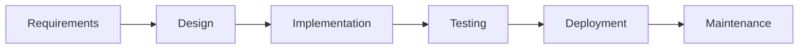

# Chapter 6: Software Engineering — Exam Quick Revision

## Learning Objectives
- Compare SDLC phases and software process models
- Evaluate strengths and weaknesses of each development model
- Draw DFDs at different levels for a given system
- Distinguish testing types across the V-model lifecycle
- Calculate cyclomatic complexity and design test cases
- Apply COCOMO cost estimation model
- Select appropriate metrics for software quality assessment

---

## 1. SDLC Phases



| Phase | Input | Output | Key Activities |
|-------|-------|--------|----------------|
| **Requirements** | User needs | SRS document | Feasibility study, requirement gathering, analysis |
| **Design** | SRS | Design docs (HLD + LLD) | Architecture design, module decomposition, DB design |
| **Implementation** | Design docs | Source code | Coding, code review, unit testing |
| **Testing** | Code | Tested product | Integration, system, acceptance testing |
| **Deployment** | Tested product | Live system | Installation, training, data migration |
| **Maintenance** | Live system | Enhanced system | Bug fixes, enhancements, support |

---

## 2. Software Process Models — Comparison

| Model | Description | Strengths | Weaknesses | When to Use |
|-------|-------------|-----------|------------|-------------|
| **Waterfall** | Linear sequential phases | Simple, well-defined milestones | Inflexible, late feedback | Stable requirements, small projects |
| **Agile (Scrum)** | Iterative, 2-4 week sprints | Adaptable, customer feedback | Less documentation, scope creep | Changing requirements, product development |
| **Spiral** | Risk-driven iterative model | Risk management emphasis | Complex, expensive | Large, high-risk projects |
| **V-Model** | Verification &amp; validation parallel | Testing linked to each phase | Rigid, not suitable for unclear reqs | Safety-critical systems |
| **RAD** | Rapid prototyping (component-based) | Fast development | Requires modular systems | GUI-heavy, time-constrained projects |
| **Incremental** | Build product in increments | Early delivery of core features | Needs good architecture | Large systems with clear core |

### V-Model Testing Correlation
```
Requirements → Acceptance Testing
   ↑                ↓
High-Level Design → System Testing
   ↑                ↓
Low-Level Design → Integration Testing
   ↑                ↓
Implementation → Unit Testing
```

---

## 3. DFD (Data Flow Diagram)

### Symbols (Yourdon/De Marco)
| Symbol | Name | Meaning |
|--------|------|---------|
| Circle/ellipse | Process | Transforms input to output |
| Rectangle (double) | External entity | Source/destination of data (outside system) |
| Open rectangle | Data store | Database/file storing data |
| Arrow | Data flow | Movement of data between entities |

### DFD Levels

**Level 0 (Context Diagram):**
```
[Customer] -----order----→ [Order Processing System] ----invoice----→ [Customer]
                     ↓
               [Inventory DB]
```

**Level 1 (Expanded context):**
- Decompose main process into 3-6 major processes (e.g., Validate Order, Process Payment, Update Inventory, Generate Invoice)

**Level 2 (Further expansion):**
- Each Level 1 process expanded into detailed sub-processes

### DFD vs Flowchart
| DFD | Flowchart |
|-----|-----------|
| Shows data movement | Shows control flow |
| No loops/decisions | Has loops, decisions |
| Processes run in parallel | Sequential execution |

---

## 4. SRS (Software Requirements Specification)

### IEEE 830 SRS Components
1. **Introduction:** Purpose, scope, definitions, overview
2. **Overall description:** Product perspective, user characteristics, constraints, assumptions
3. **Specific requirements:** Functional requirements (use cases), non-functional (performance, security), external interface requirements
4. **Appendices:** Glossary, references, analysis models

### Functional vs Non-Functional Requirements
| Functional | Non-Functional |
|-----------|----------------|
| What system does | How system behaves |
| "User can login" | "Login response &lt; 2 seconds" |
| "Generate report" | "System uptime 99.9%" |

---

## 5. Software Testing

### Testing Levels (V-Model)

| Level | Target | Performed by | Environment |
|-------|--------|-------------|-------------|
| **Unit** | Individual modules | Developer | Development |
| **Integration** | Module interfaces | Developer + Tester | Integration |
| **System** | Complete system | Tester | Staging |
| **Acceptance** | User requirements | Client/User | UAT |
| **Regression** | Existing unchanged features | Tester | All environments |

### Black-Box Testing
Tests functionality without internal knowledge.

| Technique | Description | Example |
|-----------|-------------|---------|
| **Equivalence Partitioning** | Divide input domain into classes; test one value from each | Age: 0-17 (invalid), 18-60 (valid), 60+ (invalid) |
| **Boundary Value Analysis** | Test boundaries: min, min+1, max, max−1, nominal | For 1-100: test 0,1,2,99,100,101 |
| **Decision Table** | Table of conditions and actions | Loan approval rules |
| **State Transition** | Test state changes on events | ATM states: Idle, Card-Inserted, PIN-Entered |

### White-Box Testing
Tests internal logic and code paths.

| Coverage | Description | Strength |
|----------|-------------|----------|
| **Statement coverage** | Each statement executed at least once | Weakest |
| **Branch/Decision coverage** | Each true/false branch taken | Stronger |
| **Condition coverage** | Each Boolean sub-expression evaluated T/F | Stronger |
| **Path coverage** | Every possible path executed | Strongest (infeasible for large code) |
| **MC/DC** | Each condition independently affects outcome | Used for safety-critical |

### McCabe's Cyclomatic Complexity
```
M = E − N + 2P
  = Number of decision points + 1
  = Number of regions in flow graph
  = Number of predicates + 1
```
Where E = edges, N = nodes, P = connected components.

**Solved Example:**
```c
void sort(int a[], int n) {
    int i, j, temp;
    for (i = 0; i < n−1; i++) {          // 1 predicate
        for (j = 0; j < n−i−1; j++) {    // 1 predicate
            if (a[j] > a[j+1]) {         // 1 predicate
                temp = a[j];
                a[j] = a[j+1];
                a[j+1] = temp;
            }
        }
    }
}
```
Cyclomatic complexity = 3 predicates + 1 = **4**. This means we need at least 4 test cases for branch coverage.

---

## 6. Software Cost Estimation — COCOMO

### COCOMO Model Types
| Model | Level | Description |
|-------|-------|-------------|
| **Basic** | Early stage | Based on LOC estimate alone |
| **Intermediate** | Detailed | Adds 15 cost drivers |
| **Advanced** | Phase-level | Phase-wise estimation |

### Basic COCOMO Formula
```
Effort = a × (KLOC)^b person-months
Time = c × (Effort)^d months
```

| Project Type | a | b | c | d | Description |
|-------------|---|---|---|---|-------------|
| **Organic** | 2.4 | 1.05 | 2.5 | 0.38 | Small teams, familiar environment |
| **Semi-detached** | 3.0 | 1.12 | 2.5 | 0.35 | Mixed experience, medium size |
| **Embedded** | 3.6 | 1.20 | 2.5 | 0.32 | Tight constraints, hardware interface |

---

## 7. Software Metrics

### Size-Oriented Metrics
- LOC (Lines of Code) per person-month
- Defects per KLOC
- Cost per LOC
- Documentation pages per KLOC

### Function-Oriented Metrics
- **Function Point (FP):** Based on external inputs, outputs, inquiries, files, interfaces
- **FP Counting:** Each component weighted by complexity (simple/avg/complex)

### Quality Metrics
| Metric | Formula | Target |
|--------|---------|--------|
| Defect density | Defects / KLOC | &lt; 4 per KLOC |
| Defect removal efficiency | (Defects fixed before release) / Total defects × 100 | &gt; 95% |
| Mean Time To Failure (MTTF) | Total uptime / Number of failures | High |
| Customer satisfaction | Survey score | &gt; 4/5 |

### ISO 9126 Quality Factors
1. **Functionality:** Suitability, accuracy, security, interoperability
2. **Reliability:** Maturity, fault tolerance, recoverability
3. **Usability:** Understandability, learnability, operability
4. **Efficiency:** Time behavior, resource utilization
5. **Maintainability:** Analyzability, changeability, stability, testability
6. **Portability:** Adaptability, installability, replaceability

---

## 8. Agile Methodologies

### Scrum Roles
- **Product Owner:** Defines requirements (backlog), prioritizes
- **Scrum Master:** Facilitates process, removes impediments
- **Development Team:** Self-organizing, cross-functional (3-9 members)

### Scrum Events
| Event | Time-box | Purpose |
|-------|----------|---------|
| Sprint Planning | 2-4 hours | Plan sprint backlog |
| Daily Standup | 15 minutes | Sync, plan day |
| Sprint Review | 1-2 hours | Demo completed work |
| Sprint Retrospective | 1-1.5 hrs | Improve process |

### Agile Manifesto Values
1. **Individuals and interactions** over processes and tools
2. **Working software** over comprehensive documentation
3. **Customer collaboration** over contract negotiation
4. **Responding to change** over following a plan

---

## Solved MCQs

**Q1:** Cyclomatic complexity of a program with 5 decision points (if, while, for) is:
- (a) 4
- (b) 5
- (c) 6
- (d) 10

**Answer:** (c) 6. Cyclomatic complexity = P + 1 (predicate nodes + 1). 5 decision points = 5 predicates, so 5 + 1 = 6.

**Q2:** Which model is best suited for a project with unclear requirements and high risk?
- (a) Waterfall
- (b) Spiral
- (c) V-Model
- (d) RAD

**Answer:** (b) Spiral. Its risk-driven approach allows handling uncertainties through iterative risk assessment and prototyping.

**Q3:** In white-box testing, which coverage criterion is the STRONGEST?
- (a) Statement coverage
- (b) Branch coverage
- (c) Path coverage
- (d) Condition coverage

**Answer:** (c) Path coverage. It requires every possible execution path to be tested, which subsumes all other coverage criteria (though often impractical for large programs).

**Q4:** Alpha testing is performed by:
- (a) End users at developer's site
- (b) End users at their own site
- (c) Developers
- (d) Testers

**Answer:** (a) End users at developer's site. Beta testing is by end users at their own site.

**Q5:** In COCOMO, a semi-detached project with 32 KLOC would have effort approximately:
- (a) 96 PM
- (b) 120 PM
- (c) 144 PM
- (d) 160 PM

**Answer:** (a) 96 PM. Effort = 3.0 × (32)^1.12 ≈ 3 × 50.6 ≈ 152 PM. Wait, let me recalculate: 32^1.12 = e^(1.12×ln32) = e^(1.12×3.466) = e^3.88 ≈ 48.4. 3.0 × 48.4 ≈ 145 PM. Closest answer would be (c) 144 PM.

---

## 9. UML Diagram Quick Reference

### Structural Diagrams (Static)
| Diagram | Purpose | Elements |
|---------|---------|----------|
| **Class Diagram** | System structure — classes, attributes, methods, relationships | Classes, associations, inheritance, aggregation, composition |
| **Object Diagram** | Instance snapshot at a point in time | Objects with attribute values |
| **Component Diagram** | Physical components and dependencies | Components, interfaces, dependencies |
| **Deployment Diagram** | Hardware nodes and software deployment | Nodes, artifacts, communication paths |

### Behavioral Diagrams (Dynamic)
| Diagram | Purpose | Elements |
|---------|---------|----------|
| **Use Case Diagram** | Functional requirements from user perspective | Actors, use cases, relationships |
| **Sequence Diagram** | Time-ordered message flow between objects | Lifelines, messages, activation bars |
| **Activity Diagram** | Workflow and parallel activities | Actions, decisions, forks/joins |
| **State Machine Diagram** | Object state transitions triggered by events | States, transitions, events, guards |

### Key UML Relationships
| Relationship | Notation | Meaning |
|-------------|----------|---------|
| Association | `———` | Structural link between classes |
| Aggregation | `◇———` | Has-a (weak ownership, part can exist without whole) |
| Composition | `◆———` | Has-a (strong ownership, part cannot exist without whole) |
| Inheritance | `———▷` | Is-a (subclass extends superclass) |
| Dependency | `- - ->` | Uses temporarily (method parameter, local variable) |
| Realization | `- - -▷` | Implements (class → interface) |

## 10. Software Maintenance

### Maintenance Types
| Type | Description | Percentage |
|------|-------------|------------|
| **Corrective** | Fix bugs discovered after deployment | ~20% |
| **Adaptive** | Adapt to environment changes (OS, hardware, laws) | ~25% |
| **Perfective** | Enhance performance, usability, features | ~50% |
| **Preventive** | Prevent future problems (refactoring, documentation) | ~5% |

### Maintenance Effort Factors
- Module size and complexity
- Code quality and documentation
- Staff experience with the system
- Technology age (legacy vs modern)
- Test coverage and automation

## 11. Risk Management in Software Projects

### Risk Categories
| Category | Examples |
|----------|----------|
| **Technical** | Unfamiliar technology, performance issues, integration complexity |
| **Schedule** | Unrealistic deadlines, dependency delays, resource availability |
| **Cost** | Budget overrun, scope creep, inflation |
| **Operational** | Staff turnover, training gaps, process inefficiencies |

### Risk Management Process
1. **Identification:** Brainstorm, checklists, SWOT analysis
2. **Analysis:** Probability × Impact = Risk Exposure
3. **Planning:** Avoid, transfer, mitigate, accept (4 strategies)
4. **Monitoring:** Track risks throughout project life

### Risk Response Strategies
| Strategy | Description | Example |
|----------|-------------|---------|
| **Avoid** | Eliminate the risk entirely | Use proven technology instead of experimental |
| **Transfer** | Shift risk to third party | Fixed-price contract, insurance |
| **Mitigate** | Reduce probability or impact | Prototyping to reduce requirement uncertainty |
| **Accept** | Acknowledge and budget for contingency | Add 20% buffer to schedule |

## 12. Configuration Management

### CM Activities
1. **Identification:** Uniquely identify all configuration items (CI)
2. **Version control:** Track all changes to CIs
3. **Change control:** Formal process for change requests
4. **Status accounting:** Report current configuration status
5. **Audit:** Verify completeness and consistency

### Change Control Process
```
Change Request → Impact Analysis → CCB Review → Approve/Reject → Implement → Verify → Close
```

**CCB (Change Control Board):** Decision-making body that approves or rejects changes.

---

## Summary
- **SDLC:** Requirements → Design → Code → Test → Deploy → Maintain
- **Models:** Waterfall (linear), Agile (iterative), Spiral (risk-driven), V-Model (V&amp;V parallel)
- **DFD:** Context (level 0) → Level 1 (major processes) → Level 2 (detailed)
- **Testing:** Black-box (equivalence, boundary value) vs White-box (statement/branch/path coverage)
- **Cyclomatic complexity:** Decision points + 1; guides number of test cases
- **COCOMO:** Effort = a(KLOC)^b; Organic/Semi-detached/Embedded
- **Metrics:** Size (LOC), Function (FP), Quality (defect density, MTTF)
- **UML:** Class (static structure), Sequence (message flow), Use Case (requirements), Activity (workflow)
- **Maintenance:** Corrective (20%), Adaptive (25%), Perfective (50%), Preventive (5%)
- **Risk:** Identify → Analyze → Plan (avoid/transfer/mitigate/accept) → Monitor
- **CM:** Identify, version control, change control, status accounting, audit

---

## HOT Topics (Frequently Asked in IBPS SO IT Mains)
1. Black-box vs white-box testing techniques — identify which technique is used from scenario
2. Cyclomatic complexity calculation from pseudo-code or flow graph
3. DFD level differences and Gane-Sarson vs Yourdon notation differences
4. COCOMO estimation — calculate effort and development time
5. Agile vs Waterfall — when to use each
6. Functional vs non-functional requirements — categorize given requirements
7. Test case design using equivalence partitioning and boundary value analysis
8. McCabe's complexity — basis path testing and independent paths
9. Software quality factors (ISO 9126) — categorize given attributes
10. Spiral model quadrant activities (determine objectives, risk analysis, develop, plan next)

---

## Chapter Quiz (MCQs)

<details>
<summary>Q1: Which testing technique divides input data into valid and invalid partitions?</summary>
A1: Equivalence partitioning. It reduces test cases by testing one representative value from each partition instead of all possible values.
</details>

<details>
<summary>Q2: What is the primary difference between alpha and beta testing?</summary>
A2: Alpha testing is performed at the developer's site with potential users. Beta testing is performed at the user's site (real-world environment) with actual users.
</details>

<details>
<summary>Q3: In the V-model, what testing corresponds to the high-level design phase?</summary>
A3: System testing. Each design level in V-model has a corresponding testing level — HLD → System Testing, LLD → Integration Testing.
</details>

<details>
<summary>Q4: A program has 10 edges and 8 nodes in its flow graph. What is its cyclomatic complexity?</summary>
A4: M = E − N + 2P = 10 − 8 + 2(1) = 4. The program needs at least 4 test cases for path coverage.
</details>

<details>
<summary>Q5: Which software process model uses the concept of 'sprints'?</summary>
A5: Agile (Scrum). Sprints are time-boxed iterations (typically 2-4 weeks) producing potentially shippable product increments.
</details>
