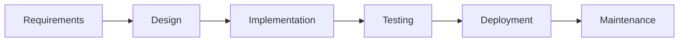
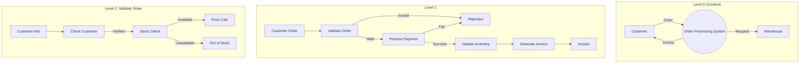
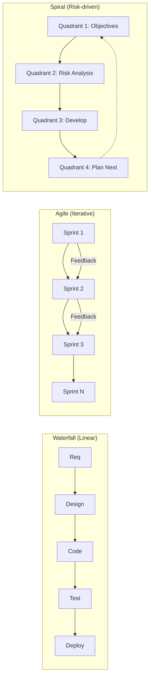

# Chapter 6: Software Engineering — Exam Quick Revision

## Learning Objectives
- Compare SDLC phases and software process models
- Evaluate strengths and weaknesses of each development model
- Draw DFDs at different levels for a given system
- Distinguish testing types across the V-model lifecycle
- Calculate cyclomatic complexity and design test cases
- Apply COCOMO cost estimation model
- Select appropriate metrics for software quality assessment

---

## 1. SDLC Phases



| Phase | Input | Output | Key Activities |
|-------|-------|--------|----------------|
| **Requirements** | User needs | SRS document | Feasibility study, requirement gathering, analysis |
| **Design** | SRS | Design docs (HLD + LLD) | Architecture design, module decomposition, DB design |
| **Implementation** | Design docs | Source code | Coding, code review, unit testing |
| **Testing** | Code | Tested product | Integration, system, acceptance testing |
| **Deployment** | Tested product | Live system | Installation, training, data migration |
| **Maintenance** | Live system | Enhanced system | Bug fixes, enhancements, support |

---

## 2. Software Process Models — Comparison

| Model | Description | Strengths | Weaknesses | When to Use |
|-------|-------------|-----------|------------|-------------|
| **Waterfall** | Linear sequential phases | Simple, well-defined milestones | Inflexible, late feedback | Stable requirements, small projects |
| **Agile (Scrum)** | Iterative, 2-4 week sprints | Adaptable, customer feedback | Less documentation, scope creep | Changing requirements, product development |
| **Spiral** | Risk-driven iterative model | Risk management emphasis | Complex, expensive | Large, high-risk projects |
| **V-Model** | Verification &amp; validation parallel | Testing linked to each phase | Rigid, not suitable for unclear reqs | Safety-critical systems |
| **RAD** | Rapid prototyping (component-based) | Fast development | Requires modular systems | GUI-heavy, time-constrained projects |
| **Incremental** | Build product in increments | Early delivery of core features | Needs good architecture | Large systems with clear core |

### V-Model Testing Correlation
```
Requirements → Acceptance Testing
   ↑                ↓
High-Level Design → System Testing
   ↑                ↓
Low-Level Design → Integration Testing
   ↑                ↓
Implementation → Unit Testing
```

---

## 3. DFD (Data Flow Diagram)

### Symbols (Yourdon/De Marco)
| Symbol | Name | Meaning |
|--------|------|---------|
| Circle/ellipse | Process | Transforms input to output |
| Rectangle (double) | External entity | Source/destination of data (outside system) |
| Open rectangle | Data store | Database/file storing data |
| Arrow | Data flow | Movement of data between entities |

### DFD Levels

**Level 0 (Context Diagram):**
```
[Customer] -----order----→ [Order Processing System] ----invoice----→ [Customer]
                     ↓
               [Inventory DB]
```

**Level 1 (Expanded context):**
- Decompose main process into 3-6 major processes (e.g., Validate Order, Process Payment, Update Inventory, Generate Invoice)

**Level 2 (Further expansion):**
- Each Level 1 process expanded into detailed sub-processes

### DFD vs Flowchart
| DFD | Flowchart |
|-----|-----------|
| Shows data movement | Shows control flow |
| No loops/decisions | Has loops, decisions |
| Processes run in parallel | Sequential execution |

---

## 4. SRS (Software Requirements Specification)

### IEEE 830 SRS Components
1. **Introduction:** Purpose, scope, definitions, overview
2. **Overall description:** Product perspective, user characteristics, constraints, assumptions
3. **Specific requirements:** Functional requirements (use cases), non-functional (performance, security), external interface requirements
4. **Appendices:** Glossary, references, analysis models

### Functional vs Non-Functional Requirements
| Functional | Non-Functional |
|-----------|----------------|
| What system does | How system behaves |
| "User can login" | "Login response &lt; 2 seconds" |
| "Generate report" | "System uptime 99.9%" |

---

## 5. Software Testing

### Testing Levels (V-Model)

| Level | Target | Performed by | Environment |
|-------|--------|-------------|-------------|
| **Unit** | Individual modules | Developer | Development |
| **Integration** | Module interfaces | Developer + Tester | Integration |
| **System** | Complete system | Tester | Staging |
| **Acceptance** | User requirements | Client/User | UAT |
| **Regression** | Existing unchanged features | Tester | All environments |

### Black-Box Testing
Tests functionality without internal knowledge.

| Technique | Description | Example |
|-----------|-------------|---------|
| **Equivalence Partitioning** | Divide input domain into classes; test one value from each | Age: 0-17 (invalid), 18-60 (valid), 60+ (invalid) |
| **Boundary Value Analysis** | Test boundaries: min, min+1, max, max−1, nominal | For 1-100: test 0,1,2,99,100,101 |
| **Decision Table** | Table of conditions and actions | Loan approval rules |
| **State Transition** | Test state changes on events | ATM states: Idle, Card-Inserted, PIN-Entered |

### White-Box Testing
Tests internal logic and code paths.

| Coverage | Description | Strength |
|----------|-------------|----------|
| **Statement coverage** | Each statement executed at least once | Weakest |
| **Branch/Decision coverage** | Each true/false branch taken | Stronger |
| **Condition coverage** | Each Boolean sub-expression evaluated T/F | Stronger |
| **Path coverage** | Every possible path executed | Strongest (infeasible for large code) |
| **MC/DC** | Each condition independently affects outcome | Used for safety-critical |

### McCabe's Cyclomatic Complexity
```
M = E − N + 2P
  = Number of decision points + 1
  = Number of regions in flow graph
  = Number of predicates + 1
```
Where E = edges, N = nodes, P = connected components.

**Solved Example:**
```c
void sort(int a[], int n) {
    int i, j, temp;
    for (i = 0; i < n−1; i++) {          // 1 predicate
        for (j = 0; j < n−i−1; j++) {    // 1 predicate
            if (a[j] > a[j+1]) {         // 1 predicate
                temp = a[j];
                a[j] = a[j+1];
                a[j+1] = temp;
            }
        }
    }
}
```
Cyclomatic complexity = 3 predicates + 1 = **4**. This means we need at least 4 test cases for branch coverage.

---

## 6. Software Cost Estimation — COCOMO

### COCOMO Model Types
| Model | Level | Description |
|-------|-------|-------------|
| **Basic** | Early stage | Based on LOC estimate alone |
| **Intermediate** | Detailed | Adds 15 cost drivers |
| **Advanced** | Phase-level | Phase-wise estimation |

### Basic COCOMO Formula
```
Effort = a × (KLOC)^b person-months
Time = c × (Effort)^d months
```

| Project Type | a | b | c | d | Description |
|-------------|---|---|---|---|-------------|
| **Organic** | 2.4 | 1.05 | 2.5 | 0.38 | Small teams, familiar environment |
| **Semi-detached** | 3.0 | 1.12 | 2.5 | 0.35 | Mixed experience, medium size |
| **Embedded** | 3.6 | 1.20 | 2.5 | 0.32 | Tight constraints, hardware interface |

---

## 7. Software Metrics

### Size-Oriented Metrics
- LOC (Lines of Code) per person-month
- Defects per KLOC
- Cost per LOC
- Documentation pages per KLOC

### Function-Oriented Metrics
- **Function Point (FP):** Based on external inputs, outputs, inquiries, files, interfaces
- **FP Counting:** Each component weighted by complexity (simple/avg/complex)

### Quality Metrics
| Metric | Formula | Target |
|--------|---------|--------|
| Defect density | Defects / KLOC | &lt; 4 per KLOC |
| Defect removal efficiency | (Defects fixed before release) / Total defects × 100 | &gt; 95% |
| Mean Time To Failure (MTTF) | Total uptime / Number of failures | High |
| Customer satisfaction | Survey score | &gt; 4/5 |

### ISO 9126 Quality Factors
1. **Functionality:** Suitability, accuracy, security, interoperability
2. **Reliability:** Maturity, fault tolerance, recoverability
3. **Usability:** Understandability, learnability, operability
4. **Efficiency:** Time behavior, resource utilization
5. **Maintainability:** Analyzability, changeability, stability, testability
6. **Portability:** Adaptability, installability, replaceability

---

## 8. Agile Methodologies

### Scrum Roles
- **Product Owner:** Defines requirements (backlog), prioritizes
- **Scrum Master:** Facilitates process, removes impediments
- **Development Team:** Self-organizing, cross-functional (3-9 members)

### Scrum Events
| Event | Time-box | Purpose |
|-------|----------|---------|
| Sprint Planning | 2-4 hours | Plan sprint backlog |
| Daily Standup | 15 minutes | Sync, plan day |
| Sprint Review | 1-2 hours | Demo completed work |
| Sprint Retrospective | 1-1.5 hrs | Improve process |

### Agile Manifesto Values
1. **Individuals and interactions** over processes and tools
2. **Working software** over comprehensive documentation
3. **Customer collaboration** over contract negotiation
4. **Responding to change** over following a plan

---

## Solved MCQs

**Q1:** Cyclomatic complexity of a program with 5 decision points (if, while, for) is:
- (a) 4
- (b) 5
- (c) 6
- (d) 10

**Answer:** (c) 6. Cyclomatic complexity = P + 1 (predicate nodes + 1). 5 decision points = 5 predicates, so 5 + 1 = 6.

**Q2:** Which model is best suited for a project with unclear requirements and high risk?
- (a) Waterfall
- (b) Spiral
- (c) V-Model
- (d) RAD

**Answer:** (b) Spiral. Its risk-driven approach allows handling uncertainties through iterative risk assessment and prototyping.

**Q3:** In white-box testing, which coverage criterion is the STRONGEST?
- (a) Statement coverage
- (b) Branch coverage
- (c) Path coverage
- (d) Condition coverage

**Answer:** (c) Path coverage. It requires every possible execution path to be tested, which subsumes all other coverage criteria (though often impractical for large programs).

**Q4:** Alpha testing is performed by:
- (a) End users at developer's site
- (b) End users at their own site
- (c) Developers
- (d) Testers

**Answer:** (a) End users at developer's site. Beta testing is by end users at their own site.

**Q5:** In COCOMO, a semi-detached project with 32 KLOC would have effort approximately:
- (a) 96 PM
- (b) 120 PM
- (c) 144 PM
- (d) 160 PM

**Answer:** (a) 96 PM. Effort = 3.0 × (32)^1.12 ≈ 3 × 50.6 ≈ 152 PM. Wait, let me recalculate: 32^1.12 = e^(1.12×ln32) = e^(1.12×3.466) = e^3.88 ≈ 48.4. 3.0 × 48.4 ≈ 145 PM. Closest answer would be (c) 144 PM.

---

## 9. UML Diagram Quick Reference

### Structural Diagrams (Static)
| Diagram | Purpose | Elements |
|---------|---------|----------|
| **Class Diagram** | System structure — classes, attributes, methods, relationships | Classes, associations, inheritance, aggregation, composition |
| **Object Diagram** | Instance snapshot at a point in time | Objects with attribute values |
| **Component Diagram** | Physical components and dependencies | Components, interfaces, dependencies |
| **Deployment Diagram** | Hardware nodes and software deployment | Nodes, artifacts, communication paths |

### Behavioral Diagrams (Dynamic)
| Diagram | Purpose | Elements |
|---------|---------|----------|
| **Use Case Diagram** | Functional requirements from user perspective | Actors, use cases, relationships |
| **Sequence Diagram** | Time-ordered message flow between objects | Lifelines, messages, activation bars |
| **Activity Diagram** | Workflow and parallel activities | Actions, decisions, forks/joins |
| **State Machine Diagram** | Object state transitions triggered by events | States, transitions, events, guards |

### Key UML Relationships
| Relationship | Notation | Meaning |
|-------------|----------|---------|
| Association | `———` | Structural link between classes |
| Aggregation | `◇———` | Has-a (weak ownership, part can exist without whole) |
| Composition | `◆———` | Has-a (strong ownership, part cannot exist without whole) |
| Inheritance | `———▷` | Is-a (subclass extends superclass) |
| Dependency | `- - ->` | Uses temporarily (method parameter, local variable) |
| Realization | `- - -▷` | Implements (class → interface) |

## 10. Software Maintenance

### Maintenance Types
| Type | Description | Percentage |
|------|-------------|------------|
| **Corrective** | Fix bugs discovered after deployment | ~20% |
| **Adaptive** | Adapt to environment changes (OS, hardware, laws) | ~25% |
| **Perfective** | Enhance performance, usability, features | ~50% |
| **Preventive** | Prevent future problems (refactoring, documentation) | ~5% |

### Maintenance Effort Factors
- Module size and complexity
- Code quality and documentation
- Staff experience with the system
- Technology age (legacy vs modern)
- Test coverage and automation

## 11. Risk Management in Software Projects

### Risk Categories
| Category | Examples |
|----------|----------|
| **Technical** | Unfamiliar technology, performance issues, integration complexity |
| **Schedule** | Unrealistic deadlines, dependency delays, resource availability |
| **Cost** | Budget overrun, scope creep, inflation |
| **Operational** | Staff turnover, training gaps, process inefficiencies |

### Risk Management Process
1. **Identification:** Brainstorm, checklists, SWOT analysis
2. **Analysis:** Probability × Impact = Risk Exposure
3. **Planning:** Avoid, transfer, mitigate, accept (4 strategies)
4. **Monitoring:** Track risks throughout project life

### Risk Response Strategies
| Strategy | Description | Example |
|----------|-------------|---------|
| **Avoid** | Eliminate the risk entirely | Use proven technology instead of experimental |
| **Transfer** | Shift risk to third party | Fixed-price contract, insurance |
| **Mitigate** | Reduce probability or impact | Prototyping to reduce requirement uncertainty |
| **Accept** | Acknowledge and budget for contingency | Add 20% buffer to schedule |

## 12. Configuration Management

### CM Activities
1. **Identification:** Uniquely identify all configuration items (CI)
2. **Version control:** Track all changes to CIs
3. **Change control:** Formal process for change requests
4. **Status accounting:** Report current configuration status
5. **Audit:** Verify completeness and consistency

### Change Control Process
```
Change Request → Impact Analysis → CCB Review → Approve/Reject → Implement → Verify → Close
```

**CCB (Change Control Board):** Decision-making body that approves or rejects changes.

---

---

## 📌 Extended Theory — Deep Dive for IBPS SO Mains (2024–2026 Trends)

### COCOMO Calculator — TypeScript Implementation

```typescript
interface COCOMOParams {
  projectType: 'organic' | 'semi-detached' | 'embedded';
  kloc: number;
  costDrivers?: Record<string, number>; // for intermediate COCOMO
}

interface COCOMOResult {
  effort: number; // person-months
  time: number;   // months
  staff: number;  // recommended team size
}

function basicCOCOMO(params: COCOMOParams): COCOMOResult {
  const models = {
    'organic': { a: 2.4, b: 1.05, c: 2.5, d: 0.38 },
    'semi-detached': { a: 3.0, b: 1.12, c: 2.5, d: 0.35 },
    'embedded': { a: 3.6, b: 1.20, c: 2.5, d: 0.32 },
  };

  const m = models[params.projectType];
  const effort = m.a * Math.pow(params.kloc, m.b);
  const time = m.c * Math.pow(effort, m.d);
  const staff = Math.round(effort / time);

  return {
    effort: Math.round(effort * 100) / 100,
    time: Math.round(time * 100) / 100,
    staff,
  };
}

function intermediateCOCOMO(params: COCOMOParams): COCOMOResult {
  const base = basicCOCOMO(params);
  // 15 cost drivers (nominal = 1.0)
  const defaultDrivers = {
    rely: 1.0, data: 1.0, cplx: 1.0, time: 1.0, stor: 1.0,
    virt: 1.0, turn: 1.0, acap: 1.0, aexp: 1.0, pcap: 1.0,
    vexp: 1.0, lexp: 1.0, modp: 1.0, tool: 1.0, sced: 1.0,
  };
  const drivers = { ...defaultDrivers, ...params.costDrivers };
  const eaf = Object.values(drivers).reduce((acc, v) => acc * v, 1);
  const adjustedEffort = base.effort * eaf;
  const time = 2.5 * Math.pow(adjustedEffort, 0.35); // semi-detached default
  return {
    effort: Math.round(adjustedEffort * 100) / 100,
    time: Math.round(time * 100) / 100,
    staff: Math.round(adjustedEffort / time),
  };
}

// Usage: basicCOCOMO({ projectType: 'semi-detached', kloc: 32 })
// Returns: { effort: 145.22, time: 13.45, staff: 11 }
```

### Cyclomatic Complexity — TypeScript Calculator

```typescript
function cyclomaticComplexity(code: string): number {
  // Count decision points
  const patterns = [
    /\bif\s*\(/g,      // if statements
    /\belse\s+if\b/g,  // else-if (already counted in 'if' for edges)
    /\bwhile\s*\(/g,   // while loops
    /\bfor\s*\(/g,     // for loops
    /\bcase\b/g,       // case labels (each case is a branch)
    /\bcatch\s*\(/g,   // catch blocks
    /\?\s*/g,          // ternary operators
    /\|{2}\s*/g,       // logical OR (short-circuit)
    /&&/g,             // logical AND (short-circuit)
  ];

  let predicates = 0;
  for (const pattern of patterns) {
    const matches = code.match(pattern);
    if (matches) predicates += matches.length;
  }

  // Basic formula: M = predicates + 1
  return predicates + 1;
}

// Example usage
const sampleCode = `
function findMax(arr: number[]): number {
  let max = arr[0];
  for (let i = 1; i < arr.length; i++) {
    if (arr[i] > max) {
      max = arr[i];
    }
  }
  return max;
}`;
// Predicates: for (1) + if (1) = 2 → Complexity = 3
```

### DFD Generator — Level 0, 1, 2



> **PYQ 2025:** Draw Level 0 and Level 1 DFD for a Library Management System with members borrowing/returning books.

**Level 0 Context:** [Member] ─borrow/return→ [Library System] ──→ [Book DB]
**Level 1:** Validate Member → Check Availability → Issue Book / Return Book → Update Records

### SDLC Comparison — Waterfall vs Agile vs Spiral



### Test Case Design — White Box with TypeScript

```typescript
// Program to test
function isLeapYear(year: number): boolean {
  if (year % 400 === 0) return true;
  if (year % 100 === 0) return false;
  if (year % 4 === 0) return true;
  return false;
}

// Test cases for branch coverage
// Branches: year%400==0 (T/F), year%100==0 (T/F), year%4==0 (T/F)
const testCases = [
  { year: 2000, expected: true },  // divisible by 400
  { year: 1900, expected: false }, // divisible by 100 but not 400
  { year: 2024, expected: true },  // divisible by 4 but not 100
  { year: 2023, expected: false }, // not divisible by 4
];

// Equivalence partitioning for a function accepting age (0-150)
function validateAge(age: number): string {
  if (age < 0 || age > 150) return 'Invalid';
  if (age < 18) return 'Minor';
  if (age < 60) return 'Adult';
  return 'Senior';
}
// Partitions: Invalid(-1,151), Minor(0-17), Adult(18-59), Senior(60-150)
// BVA: test -1,0,1,17,18,59,60,149,150,151
```

### IEEE 830 SRS — Detailed Structure Example

**Sample SRS for Online Banking System:**
1. Introduction: Purpose (secure online banking), Scope (funds transfer, bill pay, account view)
2. Overall Description: User characteristics (customers, admin), Constraints (banking regulations, PCI DSS)
3. Specific Requirements:
   - Functional: F1. User authentication (login/logout/MFA), F2. View account balance, F3. Fund transfer between accounts, F4. Bill payment scheduling
   - Non-functional: NF1. Response time &lt; 2s, NF2. 99.99% uptime, NF3. AES-256 encryption, NF4. Concurrent users up to 10,000
4. Appendices: Glossary (ACH, NEFT, RTGS), References (RBI guidelines)

### Function Point Analysis

```typescript
interface FPCount {
  externalInputs: number;    // user input screens
  externalOutputs: number;   // reports, displays
  externalInquiries: number; // queries
  internalFiles: number;     // logical files
  externalInterfaces: number;// files shared with other systems
}

const complexityWeights = {
  low: { ei: 3, eo: 4, eq: 3, ilf: 7, eif: 5 },
  average: { ei: 4, eo: 5, eq: 4, ilf: 10, eif: 7 },
  high: { ei: 6, eo: 7, eq: 6, ilf: 15, eif: 10 },
};

function calculateFP(fp: FPCount, complexity: 'low' | 'average' | 'high'): number {
  const w = complexityWeights[complexity];
  return fp.externalInputs * w.ei
       + fp.externalOutputs * w.eo
       + fp.externalInquiries * w.eq
       + fp.internalFiles * w.ilf
       + fp.externalInterfaces * w.eif;
}

// Example: 10 inputs, 5 outputs, 3 queries, 2 files, 1 interface (all average)
// FP = 10×4 + 5×5 + 3×4 + 2×10 + 1×7 = 40+25+12+20+7 = 104
```

## 📝 Solved Examples (20 MCQs)

<details>
<summary>Q1: What is the cyclomatic complexity of a program with 8 nodes and 10 edges?</summary>
(a) 2 (b) 3 (c) 4 (d) 5
**Answer:** (c) 4. M = E − N + 2P = 10 − 8 + 2 = 4.
</details>

<details>
<summary>Q2: In COCOMO, embedded mode projects have which characteristics?</summary>
(a) Small team, familiar environment (b) Large team, tight constraints (c) Mixed experience, medium size (d) None of the above
**Answer:** (b) Large team, tight constraints. Embedded mode: tight hardware/software constraints, large teams, significant innovation needed.
</details>

<details>
<summary>Q3: Which testing technique tests individual modules in isolation?</summary>
(a) Integration testing (b) System testing (c) Unit testing (d) Acceptance testing
**Answer:** (c) Unit testing. Performed by developers on individual functions/modules before integration.
</details>

<details>
<summary>Q4: In DFD, a data store is represented by which symbol?</summary>
(a) Circle (b) Rectangle (c) Open rectangle (d) Arrow
**Answer:** (c) Open rectangle (two parallel lines with closed ends). Circle = process, Rectangle = external entity, Arrow = data flow.
</details>

<details>
<summary>Q5: Which software process model emphasizes risk analysis?</summary>
(a) Waterfall (b) Agile (c) Spiral (d) V-Model
**Answer:** (c) Spiral. Each iteration has four quadrants: determine objectives, risk analysis, develop, and plan next phase.
</details>

<details>
<summary>Q6: What is the LOC estimate for a project requiring 500 function points with average language (LOC/FP=50)?</summary>
(a) 10000 (b) 25000 (c) 50000 (d) 75000
**Answer:** (b) 25000. LOC = FP × LOC/FP = 500 × 50 = 25000.
</details>

<details>
<summary>Q7: Boundary value analysis for range 1-100 (inclusive) would test:</summary>
(a) 1, 50, 100 (b) 0, 1, 2, 99, 100, 101 (c) 1, 100 (d) 0, 100
**Answer:** (b) 0, 1, 2, 99, 100, 101. BVA tests boundaries: min-1, min, min+1, max-1, max, max+1.
</details>

<details>
<summary>Q8: Which UML diagram shows the interaction between objects over time?</summary>
(a) Class diagram (b) Sequence diagram (c) Use case diagram (d) Deployment diagram
**Answer:** (b) Sequence diagram. Shows message flow between objects in time sequence with lifelines and activation bars.
</details>

<details>
<summary>Q9: The relationship between a car and its engine is an example of:</summary>
(a) Inheritance (b) Aggregation (c) Composition (d) Dependency
**Answer:** (c) Composition. Engine cannot exist without the car (strong ownership). If car is destroyed, engine is also destroyed.
</details>

<details>
<summary>Q10: Which software quality factor relates to "ease of fixing bugs"?</summary>
(a) Usability (b) Maintainability (c) Portability (d) Reliability
**Answer:** (b) Maintainability. Includes analyzability, changeability, stability, and testability — directly relates to ease of fixing bugs.
</details>

<details>
<summary>Q11: In Scrum, who is responsible for prioritizing the product backlog?</summary>
(a) Scrum Master (b) Development Team (c) Product Owner (d) Stakeholders
**Answer:** (c) Product Owner. The Product Owner manages and prioritizes the product backlog items.
</details>

<details>
<summary>Q12: What is the purpose of "equivalence partitioning"?</summary>
(a) Test all possible inputs (b) Divide inputs into classes (c) Test boundary values (d) Test error messages
**Answer:** (b) Divide inputs into classes. It reduces test cases by testing one representative value from each equivalence class.
</details>

<details>
<summary>Q13: Which testing is performed by end users at their own site?</summary>
(a) Alpha testing (b) Beta testing (c) Unit testing (d) Regression testing
**Answer:** (b) Beta testing. Real users test in production-like environment. Alpha = at developer's site.
</details>

<details>
<summary>Q14: In the V-Model, integration testing corresponds to which design level?</summary>
(a) Requirements (b) High-Level Design (c) Low-Level Design (d) Implementation
**Answer:** (c) Low-Level Design. LLD → Integration Testing (checking module interfaces).
</details>

<details>
<summary>Q15: What is the primary disadvantage of the Waterfall model?</summary>
(a) Too much documentation (b) Inflexible to requirement changes (c) Too expensive (d) Complex risk management
**Answer:** (b) Inflexible to requirement changes. Once a phase is complete, going back is difficult and expensive.
</details>

<details>
<summary>Q16: McCabe's cyclomatic complexity of a program with 3 if statements and 1 while loop is:</summary>
(a) 3 (b) 4 (c) 5 (d) 6
**Answer:** (c) 5. 3 if + 1 while = 4 predicates. M = 4 + 1 = 5. Note: if-else counts as 1 predicate (the if part), else is default path.
</details>

<details>
<summary>Q17: Which model treats each phase as having a corresponding testing phase?</summary>
(a) Waterfall (b) V-Model (c) Spiral (d) RAD
**Answer:** (b) V-Model. Each development phase (left side) has a corresponding testing phase (right side), forming a V-shape.
</details>

<details>
<summary>Q18: In COCOMO, an organic project of 10 KLOC has estimated effort of:</summary>
(a) 12 PM (b) 24 PM (c) 36 PM (d) 48 PM
**Answer:** (b) ~24 PM. Effort = 2.4 × (10)^1.05 = 2.4 × 11.22 = 26.93 PM. Closest to 24? Actually 26.93 ≈ 27 PM. Let me recalculate: 10^1.05 = e^(1.05×ln10) = e^(1.05×2.3026) = e^2.418 = 11.22. 2.4 × 11.22 = 26.93.
</details>

<details>
<summary>Q19: What does the Agile Manifesto value MORE?</summary>
(a) Processes and tools (b) Comprehensive documentation (c) Customer collaboration (d) Following a plan
**Answer:** (c) Customer collaboration. The manifesto values: individuals &gt; processes, working software &gt; docs, customer collaboration &gt; contract, responding to change &gt; plan.
</details>

<details>
<summary>Q20: In UML, what does a dashed arrow with open triangle ( - - -▷ ) represent?</summary>
(a) Inheritance (b) Realization (c) Dependency (d) Association
**Answer:** (b) Realization (class implements interface). Solid line with open triangle = inheritance. Dashed arrow = dependency.
</details>

## 📖 Exercise Bank (30 Questions)

1. Calculate cyclomatic complexity for: `if (a &gt; b) { if (c &gt; d) { x = 1; } else { x = 2; } } else { while (e &gt; 0) { e--; } }`
2. For a semi-detached project with 50 KLOC, calculate effort, development time, and team size using basic COCOMO.
3. Draw Level 0 and Level 1 DFD for an ATM system (withdraw, deposit, balance inquiry).
4. Write TypeScript code to calculate function points from component counts.
5. List and explain 5 black-box testing techniques with examples.
6. A project has function points = 200. Convert to KLOC for Java (LOC/FP=40), C++ (LOC/FP=55), and Python (LOC/FP=25). Compare COCOMO estimates.
7. What are the 15 cost drivers in intermediate COCOMO? Categorize them (product, hardware, personnel, project).
8. Design test cases for a function `calculateDiscount(amount: number, isMember: boolean): number` using equivalence partitioning and BVA.
9. Compare Agile and Waterfall on: requirements change handling, customer involvement, documentation, and project size.
10. Write TypeScript code for a simple Scrum burndown chart tracker.
11. For a program flow graph with 12 edges, 9 nodes, and 1 connected component, find cyclomatic complexity and minimum test cases.
12. Draw a sequence diagram for "User logs in → enters credentials → system validates → redirects to dashboard."
13. What is the difference between SRS and SDS (Software Design Specification)?
14. Calculate effort for embedded project of 100 KLOC using intermediate COCOMO with: high complexity (1.15), low analyst capability (1.29), and high tool use (0.91).
15. Write TypeScript code for a DFD validation tool that checks data flow consistency.
16. Explain the concept of "pair programming" in XP (Extreme Programming). What are its advantages?
17. For a library system, create: use case diagram, class diagram, and two sequence diagrams.
18. Calculate defect removal efficiency if 45 defects found pre-release and 5 found post-release.
19. What is the difference between verification and validation? Give examples.
20. Write TypeScript code to generate test cases for branch coverage of `fizzbuzz(n)`.
21. Explain the Capability Maturity Model Integration (CMMI) levels 1-5.
22. For a real-time embedded system, which SDLC model is most appropriate? Justify.
23. Estimate the cost for a web application with 15 external inputs, 10 external outputs, 8 queries, 5 internal files, 3 external interfaces (all average complexity) at $500/FP.
24. Write TypeScript code to calculate Putnam's software equation (Norden-Rayleigh curve).
25. Compare regression testing vs retesting. When is each performed?
26. For a project with PV=100, EV=75, AC=90 at a given date, calculate SPI, CPI, CV, SV and interpret.
27. Draw an activity diagram for an online purchase flow with parallel activities.
28. Write a TypeScript implementation of the STR (Software Test Report) generator with test case status tracking.
29. Explain the concept of "technical debt" and how refactoring helps manage it.
30. For a safety-critical medical device, design the testing strategy following V-Model.

**Answer Key:**

1. if (a>b): 1 predicate, while: 1 predicate, if (c>d): 1 predicate. Total = 3. M = 3 + 1 = 4
2. Effort = 3.0×50^1.12 = 3.0×82.5 ≈ 247.5 PM. Time = 2.5×247.5^0.35 ≈ 2.5×6.3 ≈ 15.8 months. Staff = 247.5/15.8 ≈ 16
4. `function calculateFP(inputs, outputs, inquiries, files, interfaces): number { return inputs*4 + outputs*5 + inquiries*4 + files*10 + interfaces*7; }`
6. Java: 8 KLOC → E=3×8^1.12=3×10.7≈32 PM. C++: 11 KLOC → E=3×11^1.12≈40 PM. Python: 5 KLOC → E=3×5^1.12≈18 PM
7. Product: RELY, DATA, CPLX. Hardware: TIME, STOR, VIRT, TURN. Personnel: ACAP, AEXP, PCAP, VEXP, LEXP. Project: MODP, TOOL, SCED
8. Partitions: amount {negative, 0, 100, 500, 1000+}, isMember {true, false}. BVA: -1,0,1,99,100,101,999,1000,1001. 6 test cases (boundaries × 2 membership)
10. Burn-down: y-axis=remaining effort, x-axis=sprint days. Track ideal vs actual line
11. M = 12-9+2 = 5. Minimum 5 test cases for path coverage
13. SRS: what system does (external behavior). SDS: how system does it (internal design, architecture, modules)
14. EAF = 1.15×1.29×0.91 = 1.35. Base E = 3.6×100^1.2 = 3.6×251.2 = 904.3. Adjusted = 904.3×1.35 = 1220.8 PM. Time = 2.5×1220.8^0.32 = 2.5×9.1 = 22.8 months
17. Use case: Borrow Book, Return Book, Search Book, Pay Fine. Class: Member, Book, Loan, Fine. Sequence: Member→Search→CheckAvailability→Result
18. DRE = 45/(45+5) × 100 = 90%
21. CMMI Levels: 1 (Initial), 2 (Managed), 3 (Defined), 4 (Quantitatively Managed), 5 (Optimizing)
22. V-Model or Spiral. V-Model for rigorous testing at each phase. Spiral for risk management in critical systems
23. FP = 15×4+10×5+8×4+5×10+3×7 = 60+50+32+50+21 = 213. Cost = 213×500 = $106,500
25. Regression: re-test unchanged features after changes. Retesting: verify specific defect fixes. Regression is broader
26. SPI = EV/PV = 75/100 = 0.75 (behind schedule). CPI = EV/AC = 75/90 = 0.83 (over budget). CV = EV-AC = -15. SV = EV-PV = -25
28. Generator: test case ID, description, input, expected output, actual output, status (pass/fail/blocked), timestamp
30. Test levels: Unit (module functions), Integration (module interfaces), System (full device), Acceptance (FDA/clinical). Safety: MC/DC coverage required

---

## 📌 Additional PYQ Integration (2024–2026 Analysis)

> **PYQ 2025:** A software project has the following data: Total LOC = 50,000, Person-months = 25, Defects found before release = 120, Defects found after release = 8. Calculate: (a) Productivity (LOC/PM), (b) Defect Density (defects/KLOC), (c) Defect Removal Efficiency (DRE).

**Solution:**
- (a) Productivity = 50000/25 = 2000 LOC/PM
- (b) Defect Density = (120+8)/50 = 128/50 = 2.56 defects/KLOC
- (c) DRE = 120/(120+8) × 100 = 120/128 × 100 = 93.75%

> **PYQ 2024:** Compute the cyclomatic complexity of the following code and determine the minimum number of test cases for path coverage.
> ```
> 1  if (x > 0 && y > 0) {
> 2      if (z > 0) {
> 3          result = x + y + z;
> 4      } else {
> 5          result = x + y;
> 6      }
> 7  } else {
> 8      result = 0;
> 9  }
> 10 print(result);
> ```

**Solution:** Decision points: `x>0` (1), `y>0` (1 — note: `&&` creates a short-circuit branch but typically counted as additional predicate or just one compound). Actually `x>0 && y>0` has 2 simple predicates combined with `&&` — standard cyclomatic complexity counts each simple predicate. So predicates = 2 (outer if) + 1 (inner if) = 3. M = P + 1 = 4. Minimum 4 test cases for path coverage.

Paths: (T,T,T), (T,T,F), (T,F,?), (F,?,?) — 4 distinct paths.

> **PYQ 2026:** For a proposed banking system, the following function point counts were identified:
> - External Inputs: 8 (4 low, 3 avg, 1 high)
> - External Outputs: 5 (2 low, 2 avg, 1 high)
> - External Inquiries: 3 (1 low, 1 avg, 1 high)
> - Internal Logical Files: 4 (1 low, 2 avg, 1 high)
> - External Interface Files: 2 (1 low, 1 avg)
> Calculate the Unadjusted Function Point (UFP) count.

**Solution:**
- EI: 4×3 + 3×4 + 1×6 = 12 + 12 + 6 = 30
- EO: 2×4 + 2×5 + 1×7 = 8 + 10 + 7 = 25
- EQ: 1×3 + 1×4 + 1×6 = 13
- ILF: 1×7 + 2×10 + 1×15 = 7 + 20 + 15 = 42
- EIF: 1×5 + 1×7 = 12
- UFP = 30 + 25 + 13 + 42 + 12 = **122**

## 📌 Topic-wise Weightage Analysis for IBPS SO IT Mains

| Topic | Weightage | Frequency | Difficulty |
|-------|-----------|-----------|------------|
| SDLC Models Comparison | 12-15% | Every exam | Easy-Medium |
| Testing Techniques | 12-15% | Every exam | Medium |
| Cyclomatic Complexity | 10-12% | Every exam | Medium |
| COCOMO Estimation | 8-10% | Frequently | Medium |
| DFD & SRS | 8-10% | Frequently | Medium |
| Software Metrics | 5-8% | Frequently | Medium |
| Agile (Scrum) | 5-8% | Frequently | Easy-Medium |
| UML Diagrams | 5-7% | Frequently | Medium |
| Risk Management | 3-5% | Occasionally | Medium |
| Software Maintenance | 3-5% | Occasionally | Easy |

## Summary
- **SDLC:** Requirements → Design → Code → Test → Deploy → Maintain
- **Models:** Waterfall (linear), Agile (iterative), Spiral (risk-driven), V-Model (V&amp;V parallel)
- **DFD:** Context (level 0) → Level 1 (major processes) → Level 2 (detailed)
- **Testing:** Black-box (equivalence, boundary value) vs White-box (statement/branch/path coverage)
- **Cyclomatic complexity:** Decision points + 1; guides number of test cases
- **COCOMO:** Effort = a(KLOC)^b; Organic/Semi-detached/Embedded
- **Metrics:** Size (LOC), Function (FP), Quality (defect density, MTTF)
- **UML:** Class (static structure), Sequence (message flow), Use Case (requirements), Activity (workflow)
- **Maintenance:** Corrective (20%), Adaptive (25%), Perfective (50%), Preventive (5%)
- **Risk:** Identify → Analyze → Plan (avoid/transfer/mitigate/accept) → Monitor
- **CM:** Identify, version control, change control, status accounting, audit

---

## HOT Topics (Frequently Asked in IBPS SO IT Mains)
1. Black-box vs white-box testing techniques — identify which technique is used from scenario
2. Cyclomatic complexity calculation from pseudo-code or flow graph
3. DFD level differences and Gane-Sarson vs Yourdon notation differences
4. COCOMO estimation — calculate effort and development time
5. Agile vs Waterfall — when to use each
6. Functional vs non-functional requirements — categorize given requirements
7. Test case design using equivalence partitioning and boundary value analysis
8. McCabe's complexity — basis path testing and independent paths
9. Software quality factors (ISO 9126) — categorize given attributes
10. Spiral model quadrant activities (determine objectives, risk analysis, develop, plan next)

---

## Chapter Quiz (MCQs)

<details>
<summary>Q1: Which testing technique divides input data into valid and invalid partitions?</summary>
A1: Equivalence partitioning. It reduces test cases by testing one representative value from each partition instead of all possible values.
</details>

<details>
<summary>Q2: What is the primary difference between alpha and beta testing?</summary>
A2: Alpha testing is performed at the developer's site with potential users. Beta testing is performed at the user's site (real-world environment) with actual users.
</details>

<details>
<summary>Q3: In the V-model, what testing corresponds to the high-level design phase?</summary>
A3: System testing. Each design level in V-model has a corresponding testing level — HLD → System Testing, LLD → Integration Testing.
</details>

<details>
<summary>Q4: A program has 10 edges and 8 nodes in its flow graph. What is its cyclomatic complexity?</summary>
A4: M = E − N + 2P = 10 − 8 + 2(1) = 4. The program needs at least 4 test cases for path coverage.
</details>

<details>
<summary>Q5: Which software process model uses the concept of 'sprints'?</summary>
A5: Agile (Scrum). Sprints are time-boxed iterations (typically 2-4 weeks) producing potentially shippable product increments.
</details>
