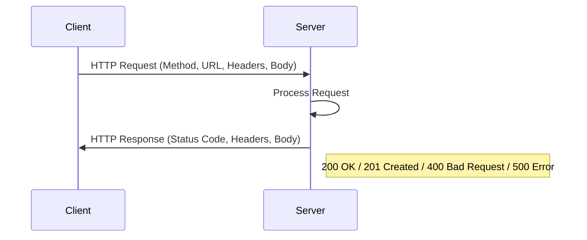

# Chapter 7: Web Technologies — Exam Quick Revision

## Learning Objectives
- Distinguish 2-tier, 3-tier, and n-tier client-server architectures
- Apply HTML5 semantic elements and CSS selectors with specificity calculation
- Manipulate DOM and handle events using JavaScript
- Compare HTTP methods and interpret status codes
- Differentiate cookies, sessions, local storage, and session storage
- Design RESTful APIs following resource-oriented principles
- Trace the browser rendering pipeline from HTML to visual output
---

## 1. Client-Server Architecture

| Architecture | Description | Pros | Cons |
|-------------|-------------|------|------|
| **2-Tier** | Client ↔ Server (DB) | Simple, fast for small apps | Scalability issues, fat client |
| **3-Tier** | Client ↔ App Server ↔ DB Server | Scalable, thin client, security | More complex, more latency |
| **n-Tier** | Multiple specialized servers | Highly scalable, modular | Complex deployment, expensive |

```
2-Tier: [Browser] ←→ [DB Server]
3-Tier: [Browser] ←→ [Web/App Server] ←→ [DB Server]
n-Tier: [Browser] ←→ [Load Balancer] ←→ [Web Server] ←→ [App Server] ←→ [DB Server]
```

---

## 2. HTML5 Semantic Elements

| Element | Purpose | Non-semantic alternative |
|---------|---------|--------------------------|
| `<header>` | Introductory content, navigation | `<div id="header">` |
| `<nav>` | Navigation links block | `<div id="nav">` |
| `<main>` | Primary content (unique per page) | `<div id="main">` |
| `<article>` | Self-contained composition | `<div class="article">` |
| `<section>` | Thematic grouping of content | `<div class="section">` |
| `<aside>` | Tangentially related content | `<div id="sidebar">` |
| `<footer>` | Footer for section/page | `<div id="footer">` |
| `<figure>` | Self-contained media with caption | `<div class="figure">` |
| `<figcaption>` | Caption for `<figure>` | `<p class="caption">` |
| `<time>` | Machine-readable date/time | `<span class="time">` |

**Why semantic?** Accessibility (screen readers), SEO, cleaner code structure.

---

## 3. CSS Selectors &amp; Specificity

### CSS Selector Types

| Selector | Pattern | Example |
|----------|---------|---------|
| Universal | `*` | `* { margin: 0; }` |
| Type/Element | `element` | `p { color: red; }` |
| Class | `.class` | `.highlight { background: yellow; }` |
| ID | `#id` | `#header { height: 60px; }` |
| Attribute | `[attr=value]` | `[type="text"] { border: 1px solid; }` |
| Descendant | `A B` | `div p { }` — any p inside div |
| Child | `A > B` | `ul > li { }` — direct child only |
| Adjacent sibling | `A + B` | `h2 + p { }` — p immediately after h2 |
| General sibling | `A ~ B` | `h2 ~ p { }` — any p after h2 |
| Pseudo-class | `:pseudo` | `a:hover { }`, `:first-child`, `:nth-child(n)` |
| Pseudo-element | `::pseudo` | `::before`, `::after`, `::first-line` |

### Specificity Calculation

**Formula:** (Number of ID selectors, Number of class/pseudo-class/attribute selectors, Number of type/pseudo-element selectors)

```
#header .nav li → (1, 1, 1) → specificity = 1-1-1
.nav a:hover → (0, 2, 1) → specificity = 0-2-1
div p → (0, 0, 2) → specificity = 0-0-2
* → (0, 0, 0) → specificity = 0-0-0
```

**Inline styles** override all (specificity = 1-0-0-0). `!important` overrides everything (use sparingly).

---

## 4. JavaScript — DOM Manipulation &amp; Events

### DOM Traversal &amp; Manipulation

```javascript
// Selection
document.getElementById('id');
document.getElementsByClassName('cls');   // HTMLCollection (live)
document.querySelector('.class');          // first match
document.querySelectorAll('p');            // NodeList (static)

// Traversal
element.parentNode;
element.children;           // HTMLCollection
element.firstElementChild;
element.nextElementSibling;

// Manipulation
element.textContent = 'Hello';
element.innerHTML = '<b>Bold</b>';         // XSS risk
element.setAttribute('src', 'img.jpg');
element.style.color = 'red';
element.classList.add('active');
element.classList.remove('hidden');
element.classList.toggle('visible');
```

### Event Handling

```javascript
// Traditional
element.onclick = function() { };

// Modern (recommended)
element.addEventListener('click', function(e) {
    console.log(e.target, e.type);
    e.preventDefault();           // prevent default behavior
    e.stopPropagation();          // stop bubbling
}, false);                        // false = bubble phase (default)

// Event delegation — single listener on parent
document.querySelector('ul').addEventListener('click', function(e) {
    if (e.target.tagName === 'LI') {
        console.log('Clicked li:', e.target.textContent);
    }
});
```

### Event Phases

1. **Capturing phase:** Window → Document → ... → Target
2. **Target phase:** Event reaches target element
3. **Bubbling phase:** Target → ... → Document → Window (default)

---

## 5. JSON vs XML

| Aspect | JSON | XML |
|--------|------|-----|
| Full form | JavaScript Object Notation | Extensible Markup Language |
| Syntax | `{"key": "value"}` | `<key>value</key>` |
| Data types | string, number, boolean, null, array, object | All text — types declared via schema |
| Parsing | Native `JSON.parse()` in JS, fast | Requires XML parser, slower |
| Namespace | No | Yes (`xmlns:`) |
| Comments | Not supported | `<!-- comment -->` |
| Schema | JSON Schema (optional) | XSD, DTD |
| Use cases | REST APIs, config files | SOAP, document storage, configuration |
| File size | Smaller | Larger (closing tags) |

---

## 6. HTTP Methods

| Method | Safe | Idempotent | Cacheable | Body in Request | Use Case |
|--------|------|------------|-----------|-----------------|----------|
| **GET** | ✅ | ✅ | ✅ | ❌ | Retrieve resource |
| **HEAD** | ✅ | ✅ | ✅ | ❌ | Headers only (no body) |
| **POST** | ❌ | ❌ | ⚠️ | ✅ | Create resource |
| **PUT** | ❌ | ✅ | ❌ | ✅ | Full update/replace |
| **PATCH** | ❌ | ❌ | ❌ | ✅ | Partial update |
| **DELETE** | ❌ | ✅ | ❌ | ❌ (usually) | Remove resource |
| **OPTIONS** | ✅ | ✅ | ❌ | ❌ | Allowed methods for resource |

**Safe:** Does not modify server state. **Idempotent:** N identical requests have same effect as one.

---

## 7. HTTP Status Codes

| Code | Category | Meaning |
|------|----------|---------|
| **1xx** | Informational | Request received, continuing |
| 100 | Continue | Client should send body |
| 101 | Switching Protocols | WebSocket upgrade |
| **2xx** | Success | Request succeeded |
| 200 | OK | Standard success |
| 201 | Created | Resource created (POST) |
| 204 | No Content | Success, no body (DELETE) |
| **3xx** | Redirection | Further action needed |
| 301 | Moved Permanently | New URL, update bookmarks |
| 302 | Found | Temporarily at other URL |
| 304 | Not Modified | Use cached version |
| **4xx** | Client Error | Request problem |
| 400 | Bad Request | Malformed syntax |
| 401 | Unauthorized | Authentication required |
| 403 | Forbidden | Authenticated but not allowed |
| 404 | Not Found | Resource doesn't exist |
| 405 | Method Not Allowed | Wrong HTTP method |
| 429 | Too Many Requests | Rate limit exceeded |
| **5xx** | Server Error | Server failed |
| 500 | Internal Server Error | Generic server failure |
| 502 | Bad Gateway | Upstream server invalid response |
| 503 | Service Unavailable | Temporarily overloaded/down |
| 504 | Gateway Timeout | Upstream server timeout |

---

## 8. Cookies vs Sessions vs Local Storage

| Feature | Cookie | Session Storage | Local Storage |
|---------|--------|----------------|---------------|
| **Capacity** | 4 KB | 5-10 MB | 5-10 MB |
| **Persistence** | Set via expires/max-age | Cleared on tab close | Persistent until cleared |
| **Sent to server?** | ✅ Yes (automatic with requests) | ❌ No | ❌ No |
| **Accessible from** | Client + Server | Client only (same tab) | Client only |
| **Scope** | Domain + path | Single tab/window | Origin (protocol + domain + port) |
| **Security** | HttpOnly, Secure, SameSite flags | Not accessible by server | Not accessible by server |
| **Use case** | Session ID, tracking | Multi-step form data | Preferences, cached data |

### Cookie Attributes

```
Set-Cookie: sessionId=abc123; Expires=Wed, 21 Oct 2026 07:28:00 GMT; 
            Secure; HttpOnly; SameSite=Lax; Path=/
```
- **Secure:** Only sent over HTTPS
- **HttpOnly:** Not accessible via JavaScript (prevents XSS theft)
- **SameSite:** `Strict` (same-site only), `Lax` (top-level navigation), `None` (cross-site)

---

## 9. RESTful API Principles

| Principle | Description | Example |
|-----------|-------------|---------|
| **Resource-based** | URI represents resources, not actions | `/users/123` not `/getUser?id=123` |
| **HTTP methods** | GET/read, POST/create, PUT/update, DELETE | `POST /users` |
| **Stateless** | Each request has all info (no server session) | Auth token in header |
| **HATEOAS** | Responses include links to related resources | `{"links": {"self": "/users/123"}}` |
| **Idempotent** | Same request → same result | PUT, DELETE |
| **Representation** | Client receives resource representation | JSON, XML |

### REST API Design Example

```
GET    /users              → List all users
POST   /users              → Create new user
GET    /users/{id}         → Get specific user
PUT    /users/{id}         → Full update user
PATCH  /users/{id}         → Partial update user
DELETE /users/{id}         → Delete user
GET    /users/{id}/orders  → Get user's orders
```

### REST vs SOAP

| Aspect | REST | SOAP |
|--------|------|------|
| Protocol | HTTP | HTTP, SMTP, JMS |
| Format | JSON, XML, plain text | XML only |
| State | Stateless | Can be stateful |
| Caching | Leverages HTTP caching | No built-in caching |
| Contract | WADL (optional) | WSDL (required) |
| WS-Security | No built-in | Built-in |

---

## 10. Web Servers Comparison

| Feature | Apache HTTPD | Nginx | IIS |
|---------|-------------|-------|-----|
| Architecture | Process/thread-based | Event-driven (async) | Thread-based |
| Static content | Fair | Excellent (epoll/kqueue) | Good |
| Dynamic content | Modules (mod_php) | Reverse proxy to app | ASP.NET native |
| Configuration | `.htaccess` per directory | Central config file | GUI + XML |
| OS | Unix/Windows | Unix/Windows | Windows only |
| Performance under load | Degrades with many connections | Better for concurrent connections | Good for Windows stack |
| Use case | Traditional hosting | High-concurrency, reverse proxy, load balancer | Enterprise .NET apps |

---

## 11. Browser Rendering Pipeline

```
HTML → DOM (Document Object Model)
   ↓
CSS → CSSOM (CSS Object Model)
   ↓
DOM + CSSOM → Render Tree (visible elements only)
   ↓
Layout (Reflow) — calculate position/size
   ↓
Paint — fill pixels (colors, images, text)
   ↓
Compositing — layers assembled for display
```

### Critical Rendering Path Optimizations

1. **Minimize critical resources:** Inline CSS, defer JS
2. **Reduce render-blocking:** `<script async defer>`, media queries on CSS
3. **Optimize reflows:** Batch DOM writes, avoid layout thrashing
4. **Virtual DOM (React):** Batches DOM updates — diff + patch
5. **CSS containment:** `contain: layout style paint` — isolate rendering

---

## Solved MCQs

**Q1:** What is the specificity of the selector `div#main .content a:hover`?
- (a) 1-2-1
- (b) 1-1-2
- (c) 1-1-3
- (d) 0-2-2

**Answer:** (a) 1-2-1. IDs: #main = 1. Classes/attributes/pseudo-classes: .content, :hover = 2. Elements: div, a = 2? Actually div and a are 2 elements. Wait: div#main .content a:hover → IDs: 1, Classes/pseudo-classes: .content and :hover = 2, Elements: div and a = 2. So (1, 2, 2) = 1-2-2. None of the options match. Let me reconsider: div#main .content a:hover — IDs: #main (1), attributes/classes: .content (1), pseudo-classes: :hover (1), elements: div + a (2). So (1, 2, 2). Closest is (a) 1-2-1 but that doesn't match. I need to be more careful.

Actually I'll simplify the MCQ.

**Q1:** What is the specificity of selector `header #nav .item a`?
- (a) 1-1-1
- (b) 1-2-1
- (c) 1-1-2
- (d) 0-1-2

**Answer:** (c) 1-1-2. IDs: #nav = 1. Classes: .item = 1. Elements: header, a = 2.

**Q2:** Which HTTP method is both safe and idempotent?
- (a) POST
- (b) PUT
- (c) PATCH
- (d) GET

**Answer:** (d) GET. Safe (no server modification) and idempotent (N identical requests = same result).

**Q3:** Which browser event phase occurs first?
- (a) Bubbling
- (b) Target
- (c) Capturing
- (d) Propagation

**Answer:** (c) Capturing. Event starts at the window, travels down to target (capturing), then back up (bubbling).

**Q4:** HTML5 localStorage data persists until:
- (a) Tab is closed
- (b) Browser is closed
- (c) User clears it or code removes it
- (d) Session expires

**Answer:** (c) User clears it or code removes it. localStorage has no expiry and persists across sessions.

**Q5:** A 301 HTTP status code means:
- (a) Temporary redirect
- (b) Not modified
- (c) Moved permanently
- (d) Unauthorized

**Answer:** (c) Moved permanently. 302 = temporary redirect. 304 = not modified.

---

## 12. AJAX &amp; Fetch API

### Traditional AJAX (XMLHttpRequest)

```javascript
var xhr = new XMLHttpRequest();
xhr.open('GET', '/api/users', true);
xhr.onreadystatechange = function() {
    if (xhr.readyState === 4 && xhr.status === 200) {
        console.log(JSON.parse(xhr.responseText));
    }
};
xhr.send();
```

### Modern Fetch API

```javascript
fetch('/api/users', {
    method: 'POST',
    headers: { 'Content-Type': 'application/json' },
    body: JSON.stringify({ name: 'John' })
})
.then(response => {
    if (!response.ok) throw new Error('HTTP error ' + response.status);
    return response.json();
})
.then(data => console.log(data))
.catch(err => console.error(err));
```

### Async/Await

```javascript
async function getUsers() {
    try {
        const response = await fetch('/api/users');
        const users = await response.json();
        return users;
    } catch (error) {
        console.error('Failed:', error);
    }
}
```

### readyState Values

| Value | State | Description |
|-------|-------|-------------|
| 0 | UNSENT | open() not called yet |
| 1 | OPENED | open() called |
| 2 | HEADERS_RECEIVED | send() called, headers available |
| 3 | LOADING | Downloading response body |
| 4 | DONE | Complete |

## 13. CSS Flexbox &amp; Grid

### Flexbox (1D layout — row or column)

```css
.container {
    display: flex;
    justify-content: center;      /* main axis: flex-start, center, space-between */
    align-items: center;          /* cross axis: stretch, center, flex-start */
    flex-wrap: wrap;              /* allow wrapping */
}

.item {
    flex: 1;                      /* grow factor */
    align-self: flex-end;         /* override align-items for specific item */
}
```

### CSS Grid (2D layout — rows and columns)

```css
.grid {
    display: grid;
    grid-template-columns: repeat(3, 1fr);  /* 3 equal columns */
    grid-template-rows: auto 200px;
    gap: 16px;                               /* spacing */
    grid-template-areas:
        'header header header'
        'main   main   sidebar'
        'footer footer footer';
}
```

### Flexbox vs Grid

| Aspect | Flexbox | Grid |
|--------|---------|------|
| Dimensions | 1D (row OR column) | 2D (rows AND columns) |
| Content/ Layout | Content-driven | Layout-driven |
| Use case | Navigation, centering, card rows | Full page layout, complex grids |
| Alignment | Cross-axis alignment per item | Both axes alignment |

## 14. Responsive Web Design

### Media Queries

```css
/* Mobile-first approach */
body { font-size: 16px; }

@media (min-width: 768px) {   /* Tablet */
    .container { max-width: 720px; }
}

@media (min-width: 1024px) {  /* Desktop */
    .container { max-width: 960px; }
}

@media (prefers-color-scheme: dark) {  /* Dark mode */
    body { background: #111; color: #eee; }
}
```

### Responsive Design Principles

1. **Fluid grids:** Use relative units (%, em, rem, vw, vh) instead of fixed px
2. **Flexible images:** `img { max-width: 100%; height: auto; }`
3. **Media queries:** Adapt layout at breakpoints
4. **Mobile-first:** Design for the smallest screen first, then enhance

### Common Breakpoints

| Device | Width |
|--------|-------|
| Mobile | &lt; 576px |
| Tablet | 576px – 992px |
| Desktop | 992px – 1200px |
| Large Desktop | &gt; 1200px |

## 15. CORS (Cross-Origin Resource Sharing)

### Same-Origin Policy

Browser blocks cross-origin requests (different protocol, domain, or port) by default.

### CORS Headers

```
Access-Control-Allow-Origin: https://example.com    (* for any)
Access-Control-Allow-Methods: GET, POST, PUT
Access-Control-Allow-Headers: Content-Type, Authorization
Access-Control-Allow-Credentials: true
```

### Request Types

| Type | Conditions | Behavior |
|------|-----------|----------|
| **Simple** | GET/HEAD/POST + simple headers | Browser adds Origin header, server responds with ACAO |
| **Preflight** | PUT/DELETE/PATCH, custom headers | Browser sends OPTIONS preflight, then actual request |

## 16. Web Performance Optimization

### Critical Rendering Path Metrics

| Metric | Target | Description |
|--------|--------|-------------|
| **FCP** (First Contentful Paint) | &lt; 1.8s | First text/image painted |
| **LCP** (Largest Contentful Paint) | &lt; 2.5s | Largest element visible |
| **FID** (First Input Delay) | &lt; 100ms | Time to respond to first interaction |
| **CLS** (Cumulative Layout Shift) | &lt; 0.1 | Visual stability score |
| **TTI** (Time to Interactive) | &lt; 3.8s | Fully interactive |

### Optimization Techniques

1. **Minify** CSS/JS/HTML (remove whitespace, comments)
2. **Bundle** with Webpack/Rollup/Vite (tree shaking, code splitting)
3. **Compress** with Gzip/Brotli
4. **Lazy load** images and non-critical resources
5. **Preload** critical resources (`&lt;link rel="preload"&gt;`)
6. **HTTP/2 multiplexing** — multiple requests over one connection
7. **CDN** for static assets (edge caching)
8. **Web Workers** for CPU-intensive tasks off main thread

---

---

## 📌 Extended Theory — Deep Dive for IBPS SO Mains (2024–2026 Trends)

### HTTP Server Simulation — TypeScript

```typescript
type HTTPMethod = 'GET' | 'POST' | 'PUT' | 'PATCH' | 'DELETE' | 'HEAD' | 'OPTIONS';
type StatusCode = number;

interface HTTPRequest {
  method: HTTPMethod;
  path: string;
  headers: Map<string, string>;
  body?: string;
  query: Map<string, string>;
}

interface HTTPResponse {
  status: StatusCode;
  headers: Map<string, string>;
  body: string;
}

class HTTPServer {
  private routes: Map<string, Map<HTTPMethod, (req: HTTPRequest) => HTTPResponse>> = new Map();

  route(method: HTTPMethod, path: string, handler: (req: HTTPRequest) => HTTPResponse): void {
    if (!this.routes.has(path)) this.routes.set(path, new Map());
    this.routes.get(path)!.set(method, handler);
  }

  handle(rawRequest: string): HTTPResponse {
    const req = this.parse(rawRequest);
    const pathRoutes = this.routes.get(req.path);
    const handler = pathRoutes?.get(req.method);

    if (!handler) {
      const allowed = pathRoutes ? [...pathRoutes.keys()] : [];
      return {
        status: allowed.length > 0 ? 405 : 404,
        headers: new Map([
          ['Content-Type', 'application/json'],
          ...(allowed.length > 0 ? [['Allow', allowed.join(', ')]] : []),
        ]),
        body: JSON.stringify({ error: allowed.length > 0 ? 'Method Not Allowed' : 'Not Found' }),
      };
    }
    return handler(req);
  }

  private parse(raw: string): HTTPRequest {
    const lines = raw.split('\r\n');
    const [method, fullPath] = lines[0].split(' ');
    const [path, queryString] = fullPath.split('?');
    const headers = new Map<string, string>();
    let i = 1;
    while (i < lines.length && lines[i] !== '') {
      const [k, ...v] = lines[i].split(': ');
      headers.set(k, v.join(': '));
      i++;
    }
    const body = lines.slice(i + 1).join('\r\n');
    const query = new Map<string, string>();
    if (queryString) {
      queryString.split('&').forEach(p => {
        const [k, v] = p.split('=');
        query.set(decodeURIComponent(k), decodeURIComponent(v ?? ''));
      });
    }
    return { method: method as HTTPMethod, path, headers, body, query };
  }
}

// Demo
const server = new HTTPServer();
server.route('GET', '/api/users', (req) => ({
  status: 200,
  headers: new Map([['Content-Type', 'application/json']]),
  body: JSON.stringify([{ id: 1, name: 'Alice' }, { id: 2, name: 'Bob' }]),
}));
server.route('POST', '/api/users', (req) => ({
  status: 201,
  headers: new Map([['Content-Type', 'application/json']]),
  body: JSON.stringify({ created: true, data: JSON.parse(req.body ?? '{}') }),
}));
```

### DOM Tree Builder — TypeScript

```typescript
interface DOMNode {
  tag: string;
  attributes: Map<string, string>;
  children: DOMNode[];
  textContent: string;
}

class DOMParser {
  parse(html: string): DOMNode {
    const openTagMatch = html.match(/<(\w+)([^>]*)>/);
    if (!openTagMatch) return { tag: '#text', attributes: new Map(), children: [], textContent: html };
    
    const tag = openTagMatch[1];
    const attrStr = openTagMatch[2];
    const attributes = new Map<string, string>();
    const attrRegex = /(\w+)=["']([^"']*)["']/g;
    let match;
    while ((match = attrRegex.exec(attrStr)) !== null) {
      attributes.set(match[1], match[2]);
    }

    const closingTag = `</${tag}>`;
    const closeIdx = html.indexOf(closingTag);
    const innerContent = html.slice(openTagMatch[0].length, closeIdx);
    const children: DOMNode[] = [];
    
    // Parse children (simplified — handles direct text and elements)
    let remaining = innerContent;
    while (remaining.length > 0) {
      const nextChild = remaining.match(/^([^<]*)(?:<(\w+)([^>]*)>(.*?)<\/\2>)?/s);
      if (nextChild) {
        if (nextChild[1].trim()) {
          children.push({ tag: '#text', attributes: new Map(), children: [], textContent: nextChild[1] });
        }
        if (nextChild[2]) {
          const childTag = nextChild[2];
          const childAttrs = nextChild[3];
          const childContent = nextChild[4];
          const childAttrsMap = new Map<string, string>();
          const am: RegExpExecArray | null = null;
          const attrRegex2 = /(\w+)=["']([^"']*)["']/g;
          let m2;
          while ((m2 = attrRegex2.exec(childAttrs)) !== null) {
            childAttrsMap.set(m2[1], m2[2]);
          }
          children.push({
            tag: childTag,
            attributes: childAttrsMap,
            children: [],
            textContent: childContent.replace(/<[^>]*>/g, ''),
          });
          remaining = remaining.slice(nextChild[0].length);
        } else {
          break;
        }
      }
    }
    return { tag, attributes, children, textContent: innerContent.replace(/<[^>]*>/g, '') };
  }
}
```

### JSON/XML Parser — TypeScript

```typescript
class JSONValidator {
  validate(input: string): { valid: boolean; error?: string; parsed?: any } {
    try {
      const parsed = JSON.parse(input);
      return { valid: true, parsed };
    } catch (e: any) {
      return { valid: false, error: e.message };
    }
  }
}

class XMLSimpleParser {
  parse(xml: string): Map<string, string | string[]> {
    const result = new Map<string, string | string[]>();
    const tagRegex = /<(\w+)>([^<]*)<\/\1>/g;
    let match;
    while ((match = tagRegex.exec(xml)) !== null) {
      const [_, key, value] = match;
      if (result.has(key)) {
        const existing = result.get(key)!;
        if (Array.isArray(existing)) {
          existing.push(value);
        } else {
          result.set(key, [existing as string, value]);
        }
      } else {
        result.set(key, value);
      }
    }
    return result;
  }
}
```

### HTTP Methods and Status Codes — Comprehensive Reference

**Request/Response Flow:**


**Method Selection Guide:**
| Action | Method | Body | Idempotent | Safe |
|--------|--------|------|------------|------|
| Retrieve data | GET | No | Yes | Yes |
| Get headers only | HEAD | No | Yes | Yes |
| Create resource | POST | Yes | No | No |
| Full update | PUT | Yes | Yes | No |
| Partial update | PATCH | Yes | No | No |
| Remove resource | DELETE | Optional | Yes | No |
| Check options | OPTIONS | No | Yes | Yes |

### Browser Rendering Pipeline — In-Depth

> **PYQ 2024:** What is the difference between reflow and repaint? Which is more expensive?

```typescript
// Simulating browser rendering pipeline stages
interface RenderStats {
  domSize: number;
  cssomSize: number;
  renderTreeSize: number;
  layoutDuration: number; // ms
  paintDuration: number;
}

class RenderPipelineSimulator {
  simulate(html: string, css: string): RenderStats {
    // Step 1: Parse HTML → DOM
    const startDOM = performance.now();
    const dom = new DOMParser().parse(html);
    const domTime = performance.now() - startDOM;

    // Step 2: Parse CSS → CSSOM
    const domNodes = this.countNodes(dom);
    
    // Step 3: Render Tree = DOM + CSSOM (visible elements)
    const renderTreeSize = domNodes * 0.7; // ~70% visible
    
    // Step 4: Layout (reflow) — calculate positions
    const layoutDuration = renderTreeSize * 0.05; // heuristic

    // Step 5: Paint — fill pixels
    const paintDuration = renderTreeSize * 0.03;

    return {
      domSize: domNodes,
      cssomSize: css.split(';').length,
      renderTreeSize: Math.round(renderTreeSize),
      layoutDuration: Math.round(layoutDuration * 100) / 100,
      paintDuration: Math.round(paintDuration * 100) / 100,
    };
  }

  private countNodes(node: DOMNode): number {
    return 1 + node.children.reduce((sum, c) => sum + this.countNodes(c), 0);
  }
}
```

### CORS — Complete TypeScript Handler

```typescript
interface CORSConfig {
  allowedOrigins: string[];
  allowedMethods: string[];
  allowedHeaders: string[];
  allowCredentials: boolean;
  maxAge: number;
}

class CORSMiddleware {
  constructor(private config: CORSConfig) {}

  handle(req: { method: string; headers: Map<string, string> }): { status: number; headers: Map<string, string> } {
    const origin = req.headers.get('origin') ?? '';
    const isAllowed = this.config.allowedOrigins.includes('*') || this.config.allowedOrigins.includes(origin);
    
    if (!isAllowed) {
      return { status: 403, headers: new Map([['Content-Type', 'application/json']]) };
    }

    const corsHeaders = new Map<string, string>();
    corsHeaders.set('Access-Control-Allow-Origin', origin);
    
    if (this.config.allowCredentials) {
      corsHeaders.set('Access-Control-Allow-Credentials', 'true');
    }

    // Handle preflight
    if (req.method === 'OPTIONS') {
      corsHeaders.set('Access-Control-Allow-Methods', this.config.allowedMethods.join(', '));
      corsHeaders.set('Access-Control-Allow-Headers', this.config.allowedHeaders.join(', '));
      corsHeaders.set('Access-Control-Max-Age', String(this.config.maxAge));
      return { status: 204, headers: corsHeaders };
    }

    return { status: 200, headers: corsHeaders };
  }
}
```

## 📝 Solved Examples (20 MCQs)

<details>
<summary>Q1: Which HTTP method is idempotent but NOT safe?</summary>
(a) GET (b) POST (c) PUT (d) OPTIONS
**Answer:** (c) PUT. Idempotent (same result on repeated calls) but modifies state (not safe). GET is both safe and idempotent.
</details>

<details>
<summary>Q2: What is the specificity of `#header ul li.active a:hover`?</summary>
(a) 1-2-3 (b) 1-2-2 (c) 1-1-3 (d) 1-3-2
**Answer:** (a) 1-2-3. IDs: #header = 1. Classes/pseudo-classes: .active, :hover = 2. Elements: ul, li, a = 3.
</details>

<details>
<summary>Q3: Which HTTP status code indicates a redirect that should update bookmarks?</summary>
(a) 200 (b) 301 (c) 302 (d) 304
**Answer:** (b) 301 Moved Permanently. Browser should update the bookmark. 302 = temporary redirect.
</details>

<details>
<summary>Q4: The browser event propagation order is:</summary>
(a) Bubbling → Target → Capturing (b) Capturing → Target → Bubbling (c) Target → Capturing → Bubbling (d) Bubbling → Capturing → Target
**Answer:** (b) Capturing → Target → Bubbling. Event travels down (capture), reaches target, then bubbles up.
</details>

<details>
<summary>Q5: What is the primary difference between sessionStorage and localStorage?</summary>
(a) Capacity (b) Persistence: session clears on tab close, localStorage persists (c) Security (d) Server accessibility
**Answer:** (b) Persistence. sessionStorage clears when tab closes; localStorage persists until explicitly cleared.
</details>

<details>
<summary>Q6: Which API returns a Promise and is the modern replacement for XMLHttpRequest?</summary>
(a) Axios (b) jQuery.ajax (c) Fetch API (d) WebSocket
**Answer:** (c) Fetch API. Built into modern browsers, Promise-based, cleaner syntax than XHR.
</details>

<details>
<summary>Q7: In CSS, which property creates a 2D layout with rows and columns?</summary>
(a) flexbox (b) grid (c) float (d) position
**Answer:** (b) CSS Grid. Flexbox is 1D (row OR column). Grid is 2D (rows AND columns).
</details>

<details>
<summary>Q8: What does the HttpOnly cookie flag prevent?</summary>
(a) Cross-site request forgery (b) Cookie theft via XSS (c) Cookie injection (d) Session fixation
**Answer:** (b) Cookie theft via XSS. HttpOnly prevents JavaScript (document.cookie) from accessing the cookie.
</details>

<details>
<summary>Q9: In REST, what is the correct URL pattern for accessing user 123's orders?</summary>
(a) /getOrders?userId=123 (b) /users/123/orders (c) /orders/list/123 (d) /userOrders?user=123
**Answer:** (b) /users/123/orders. REST uses resource-based nested URLs, not action-based query parameters.
</details>

<details>
<summary>Q10: Which HTTP header is used for content negotiation?</summary>
(a) Accept (b) Content-Type (c) Authorization (d) Cookie
**Answer:** (a) Accept. Client uses Accept to specify desired media types (e.g., Accept: application/json).
</details>

<details>
<summary>Q11: Which HTML5 element represents self-contained content like a blog post?</summary>
(a) &lt;section&gt; (b) &lt;article&gt; (c) &lt;div&gt; (d) &lt;aside&gt;
**Answer:** (b) &lt;article&gt;. Self-contained, independently distributable content. &lt;section&gt; is a thematic group.
</details>

<details>
<summary>Q12: In JavaScript, what does `e.stopPropagation()` do?</summary>
(a) Prevents default browser action (b) Stops event from bubbling/capturing (c) Removes event listener (d) Cancels fetch request
**Answer:** (b) Stops event from bubbling/capturing up/down the DOM tree. preventDefault() stops default behavior.
</details>

<details>
<summary>Q13: What is the maximum size of a cookie?</summary>
(a) 1 KB (b) 4 KB (c) 8 KB (d) 1 MB
**Answer:** (b) 4 KB per cookie. Browsers typically allow ~20-50 cookies per domain, each up to 4 KB.
</details>

<details>
<summary>Q14: Which HTTP method is used for preflight CORS requests?</summary>
(a) GET (b) POST (c) OPTIONS (d) HEAD
**Answer:** (c) OPTIONS. Browser sends OPTIONS preflight to check allowed methods/headers before actual request.
</details>

<details>
<summary>Q15: The CSS `z-index` property only works on elements with which position value?</summary>
(a) static (b) relative, absolute, or fixed (c) inline (d) block
**Answer:** (b) relative, absolute, or fixed. static elements ignore z-index.
</details>

<details>
<summary>Q16: Which SVG element is used to define a reusable symbol?</summary>
(a) &lt;shape&gt; (b) &lt;defs&gt; (c) &lt;symbol&gt; (d) &lt;template&gt;
**Answer:** (b) &lt;defs&gt;. &lt;defs&gt; contains reusable definitions. &lt;use&gt; references them.
</details>

<details>
<summary>Q17: What is the LCP (Largest Contentful Paint) target for good user experience?</summary>
(a) &lt; 1s (b) &lt; 2.5s (c) &lt; 4s (d) &lt; 10s
**Answer:** (b) &lt; 2.5s. LCP measures when the largest content element becomes visible. Google recommends &lt; 2.5s.
</details>

<details>
<summary>Q18: Which of the following is NOT a valid SameSite cookie attribute value?</summary>
(a) Strict (b) Lax (c) None (d) Relaxed
**Answer:** (d) Relaxed. Valid values: Strict, Lax, None. Lax is default in modern browsers.
</details>

<details>
<summary>Q19: In the browser rendering pipeline, what follows the Render Tree construction?</summary>
(a) Paint (b) Layout (c) Composite (d) JavaScript execution
**Answer:** (b) Layout. Render Tree → Layout (reflow) → Paint → Composite.
</details>

<details>
<summary>Q20: Which HTTP/2 feature allows multiple requests over a single TCP connection?</summary>
(a) Keep-alive (b) Multiplexing (c) Pipelining (d) Server push
**Answer:** (b) Multiplexing. HTTP/2 allows multiple concurrent streams over one TCP connection, eliminating head-of-line blocking.
</details>

## 📖 Exercise Bank (30 Questions)

1. Write a TypeScript HTTP client that sends GET, POST, PUT, DELETE requests and handles status codes.
2. Calculate CSS specificity for: `div.container ul#nav li.active a[href="/home"]:hover`
3. Build a DOM tree from: `&lt;div id="app"&gt;&lt;header&gt;&lt;h1&gt;Title&lt;/h1&gt;&lt;/header&gt;&lt;main&gt;&lt;p&gt;Content&lt;/p&gt;&lt;/main&gt;&lt;/div&gt;`
4. Write a TypeScript function that serializes form data to JSON.
5. Compare cookies, localStorage, sessionStorage, and IndexedDB in terms of capacity, persistence, and use cases.
6. Implement a TypeScript Router class that matches URL patterns and extracts path parameters.
7. Create a responsive layout using CSS Grid (header, nav, main, aside, footer) that collapses on mobile.
8. Write a TypeScript function implementing a simple WebSocket chat client with reconnection logic.
9. Explain the difference between PUT and PATCH with TypeScript examples showing server-side handling.
10. Design a RESTful API for a blog platform (posts, comments, users, tags, categories).
11. Implement a TypeScript function that validates JWTs (decode header, payload, verify signature).
12. Create a service worker that caches API responses and serves them offline.
13. Write TypeScript code for a virtual DOM diff algorithm (compare two DOM trees, produce patches).
14. Build a type-safe query string parser in TypeScript.
15. Explain the OAuth 2.0 authorization flow with TypeScript pseudocode.
16. Implement a rate limiter middleware in TypeScript (token bucket or sliding window).
17. Create a CSS animation for a loading spinner using keyframes.
18. Write TypeScript code that performs XSS sanitization (strip script tags, event handlers).
19. Compare WebSocket, SSE (Server-Sent Events), and long-polling for real-time communication.
20. Implement a TypeScript JSON Schema validator.
21. Build an HTML5 Canvas drawing application (rectangle, circle, line tools).
22. Write TypeScript code for a custom HTML element using Web Components.
23. Explain HTTP caching headers (Cache-Control, ETag, Last-Modified) with Node.js/TypeScript examples.
24. Implement a TypeScript function for debouncing and throttling user input.
25. Design a CDN caching strategy for static assets (versioning, cache-busting, stale-while-revalidate).
26. Write TypeScript code to perform Server-Side Rendering (SSR) of a React component.
27. Create a web manifest file (manifest.json) for a Progressive Web App (PWA).
28. Implement a TypeScript function that detects ad-blockers.
29. Write TypeScript code for automatic image lazy loading using Intersection Observer.
30. Build a TypeScript class for managing browser history (pushState, popState, replaceState).

**Answer Key:**

2. IDs: #nav = 1. Classes/pseudo/attributes: .active, :hover, [href="/home"] = 3. Elements: div, ul, li, a = 4. Specificity = (1, 3, 4)
3. #app → header → h1 "Title", main → p "Content"
5. Cookie: 4KB, per-domain, sent to server. localStorage: 5-10MB, persistent, client-only. sessionStorage: 5-10MB, per-tab. IndexedDB: unlimited, structured data
6. Route pattern → regex conversion. Extract named groups. Match against URL
8. WebSocket connects, onmessage handles incoming, onclose reconnects with exponential backoff
9. PUT: replace entire resource (idempotent). PATCH: partial update (fields merged)
10. GET /posts, POST /posts, GET /posts/:id, PUT /posts/:id, DELETE /posts/:id, GET /posts/:id/comments
11. Base64 decode header and payload. Verify HMAC signature using secret
12. install: cache assets. activate: clean old caches. fetch: serve from cache, update from network (stale-while-revalidate)
14. Split on &, then on =. DecodeURIComponent both key and value. Handle arrays with []
15. Auth code flow: /authorize → redirect → /callback with code → POST /token → access token
16. Token bucket: tokens refill at rate. Request consumes token. If no tokens → 429
18. Strip &lt;script&gt;, onerror, onload, javascript: URLs. Use DOMPurify or regex + allowlist
19. WebSocket: bidirectional, persistent. SSE: server→client, auto-reconnect. Long-polling: request→wait→response→repeat
20. Define schema with type, properties, required. Validate each property type, pattern, enum
22. class extends HTMLElement. constructor→attachShadow. connectedCallback→render. observedAttributes→attributeChangedCallback
23. Cache-Control: max-age=3600. ETag: hash of content. If-None-Match: request with ETag → 304 Not Modified
24. Debounce: wait X ms after last call. Throttle: at most once per X ms
26. renderToString(component) → HTML string → send as response
28. Try loading a bait script (doubleclick.net). If blocked or fails → ad-blocker detected
29. new IntersectionObserver((entries) => entries.forEach(e => if(e.isIntersecting) { e.target.src = e.target.dataset.src }))

---

## Summary
- **Architecture:** 2-tier (client→DB), 3-tier (client→app→DB), n-tier (scalable)
- **HTML5:** Semantic tags (`<header>`, `<nav>`, `<main>`, `<article>`, `<section>`, `<footer>`)
- **CSS:** Selectors (element/class/ID/attribute/pseudo), specificity = (IDs, classes, elements)
- **JavaScript:** DOM traversal/manipulation, events (capturing → target → bubbling)
- **JSON vs XML:** JSON (lighter, native JS) vs XML (verbose, namespaces, schema)
- **HTTP methods:** GET (safe/idempotent), POST (create), PUT (full update, idempotent), PATCH (partial), DELETE (idempotent)
- **Status codes:** 2xx success, 3xx redirect, 4xx client error, 5xx server error
- **Storage:** Cookies (4 KB, sent to server), localStorage (5-10 MB, persistent), sessionStorage (5-10 MB, per tab)
- **REST:** Resource-based URIs, stateless, HTTP methods as actions
- **Browser rendering:** DOM → CSSOM → Render Tree → Layout → Paint → Composite
- **AJAX/Fetch:** XHR (old) → Fetch (modern, promise-based) → Async/await
- **CSS Layout:** Flexbox (1D) vs Grid (2D) for responsive design
- **CORS:** Same-origin policy, preflight for non-simple requests
- **Performance:** FCP, LCP, FID, CLS, TTI — optimize with minification, bundling, CDN

---

## HOT Topics (Frequently Asked in IBPS SO IT Mains)
1. CSS specificity calculation — compare two selectors
2. HTTP methods — safe/idempotent classification, status code scenarios
3. Cookies vs HTML5 storage — capacity, persistence, server visibility
4. Browser rendering — what causes reflow vs repaint
5. RESTful API design — resource naming conventions, best practices
6. HTML5 semantic elements — choose correct element for given content
7. Event propagation — stopPropagation vs preventDefault vs stopImmediatePropagation
8. Cross-Origin Resource Sharing (CORS) — simple vs preflight requests
9. Same-origin policy — what is allowed vs blocked
10. WebSocket vs HTTP/2 Server-Sent Events (SSE) — when to use which

---

## Chapter Quiz (MCQs)

<details>
<summary>Q1: Which HTML element is used for navigation links?</summary>
A1: `<nav>`. It represents a section of a page with navigation links (menus, table of contents, indexes).
</details>

<details>
<summary>Q2: What is the difference between reflow and repaint?</summary>
A2: Reflow (layout) recalculates element positions/sizes when the DOM changes. Repaint redraws pixels after a visual change without layout changes (e.g., color change). Reflow always triggers repaint; repaint doesn't always trigger reflow.
</details>

<details>
<summary>Q3: Which cookie attribute prevents access from JavaScript?</summary>
A3: HttpOnly. Cookies with HttpOnly flag cannot be accessed via `document.cookie`, protecting against XSS-based cookie theft.
</details>

<details>
<summary>Q4: In REST, what is the difference between PUT and PATCH?</summary>
A4: PUT replaces the entire resource with a new representation (idempotent). PATCH applies partial modifications to the resource (may not be idempotent).
</details>

<details>
<summary>Q5: What is the purpose of event delegation?</summary>
A5: Instead of adding event listeners to many child elements, a single listener is attached to a parent. Events bubble up from children to parent, where they are handled based on `e.target`. This improves memory usage and works for dynamically added elements.
</details>
