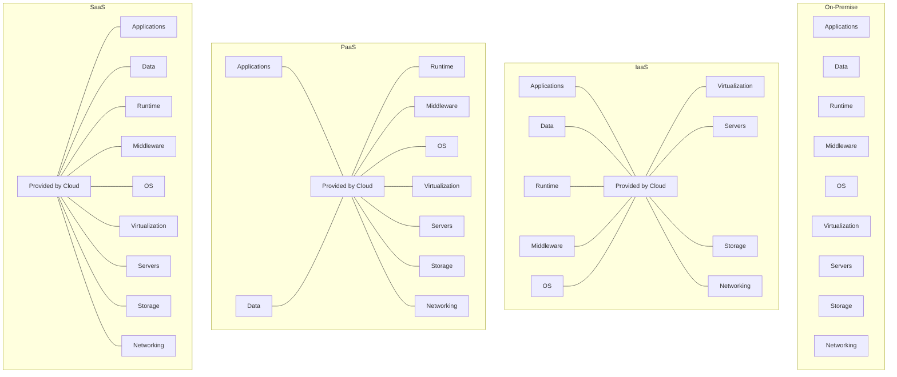

# Chapter 8: Cloud Computing — Exam Quick Revision

## Learning Objectives
- Differentiate IaaS, PaaS, SaaS with real-world provider examples
- Compare deployment models (public, private, hybrid, community)
- Classify virtualization types and hypervisor architectures
- Map AWS core services and their Azure equivalents
- Distinguish storage types (object, block, file) with use cases
- Explain elasticity, scalability, and the shared responsibility model
- Apply CAP theorem to cloud database selection

---

## 1. Cloud Service Models



| Aspect | IaaS | PaaS | SaaS |
|--------|------|------|------|
| **You manage** | Apps, data, runtime, middleware, OS | Apps, data | Nothing |
| **Provider manages** | Virtualization, servers, storage, networking | Runtime, middleware, OS, infra | Everything |
| **Analogy** | Rent a server | Rent a platform (like Heroku) | Rent software (like Gmail) |
| **Examples** | AWS EC2, Azure VM, GCE | AWS Elastic Beanstalk, Heroku, Google App Engine | Gmail, Office 365, Salesforce |
| **Use case** | Full control, custom infra | Dev/deploy without ops overhead | End-user productivity |
| **Scalability** | Manual/auto scaling instances | Auto-scaling built-in | Handled by provider |

### NIST Definition (5 Essential Characteristics)
1. **On-demand self-service** — provision resources without human interaction
2. **Broad network access** — accessible via standard protocols
3. **Resource pooling** — multi-tenant, location independent
4. **Rapid elasticity** — scale up/down quickly
5. **Measured service** — pay-per-use metering

---

## 2. Deployment Models

| Model | Description | Pros | Cons | Example |
|-------|-------------|------|------|---------|
| **Public Cloud** | Third-party provider, multi-tenant | Low cost, no maintenance | Less control, compliance | AWS, Azure, GCP |
| **Private Cloud** | Dedicated to one organization | Full control, security | High cost, maintenance | OpenStack, VMware |
| **Hybrid Cloud** | Public + Private with orchestration | Best of both: burst to public | Complexity, latency | AWS Outposts, Azure Arc |
| **Community Cloud** | Shared by several organizations | Shared cost, compliance | Limited provider options | Government cloud |

### Hybrid Cloud Use Case
- **Normal load:** Private cloud (sensitive data)
- **Peak load:** Burst to public cloud (encrypted data)
- **DR:** Public cloud as backup

---

## 3. Virtualization Types

| Type | Description | Example |
|------|-------------|---------|
| **Full Virtualization** | Guest OS unmodified; hypervisor emulates all hardware | VMware ESXi, KVM |
| **Paravirtualization** | Guest OS modified for hypercalls; better performance | Xen |
| **OS-Level (Containers)** | Shared kernel, isolated user spaces; lightweight | Docker, LXC |
| **Hardware-Assisted** | Uses CPU extensions (Intel VT-x, AMD-V) for VM operations | KVM, Hyper-V |

### Hypervisor Types

| Type | Architecture | Example | Latency |
|------|-------------|---------|---------|
| **Type 1 (Bare-metal)** | Runs directly on hardware | VMware ESXi, Hyper-V, KVM | Low |
| **Type 2 (Hosted)** | Runs on host OS | VirtualBox, VMware Workstation | Higher (OS overhead) |

```
Type 1: [Hardware] → [Hypervisor] → [VMs]
Type 2: [Hardware] → [Host OS] → [Hypervisor] → [VMs]
```

---

## 4. AWS Core Services

| Service Category | AWS Service | Description | Azure Equivalent |
|-----------------|-------------|-------------|------------------|
| **Compute** | EC2 | Virtual machines | Azure VMs |
| **Compute** | Lambda | Serverless functions | Azure Functions |
| **Compute** | ECS/EKS | Container orchestration | AKS (Azure Kubernetes) |
| **Compute** | Elastic Beanstalk | PaaS for web apps | App Service |
| **Storage** | S3 | Object storage (buckets) | Blob Storage |
| **Storage** | EBS | Block storage (volumes for EC2) | Disk Storage |
| **Storage** | EFS | File storage (shared NFS) | Azure Files |
| **Database** | RDS | Managed SQL databases | Azure SQL DB |
| **Database** | DynamoDB | NoSQL (key-value + document) | Cosmos DB |
| **Database** | ElastiCache | In-memory cache (Redis/Memcached) | Azure Cache for Redis |
| **Networking** | VPC | Virtual private cloud | Virtual Network (VNet) |
| **Networking** | Route 53 | DNS service | Azure DNS |
| **Networking** | CloudFront | CDN (content delivery) | Azure CDN |
| **Networking** | ELB | Load balancing | Azure Load Balancer |
| **Security** | IAM | Identity &amp; access management | Azure AD |
| **Security** | KMS | Key management | Key Vault |
| **Monitoring** | CloudWatch | Monitoring &amp; logging | Azure Monitor |

### AWS Regions &amp; Availability Zones
- **Region:** Geographic area (us-east-1, eu-west-1)
- **AZ:** One or more data centers within a region
- Multi-AZ deployment → high availability
- Cross-region replication → disaster recovery

---

## 5. Cloud Storage Types

| Type | Description | Access | Performance | Use Case |
|------|-------------|--------|-------------|----------|
| **Object Storage** | Flat namespace: bucket → key → data | HTTP (REST API) | Low latency for large objects | Media, backups, data lakes |
| **Block Storage** | Raw volumes: formatted with filesystem | Attached to VM (iSCSI) | High, low latency | DB storage, OS boot volumes |
| **File Storage** | Hierarchical, shared across VMs | NFS, SMB | Moderate | Shared configs, home dirs |

### S3 Storage Classes (AWS)
| Class | Durability | Availability | Min Duration | Retrieval Cost |
|-------|-----------|-------------|-------------|----------------|
| S3 Standard | 99.999999999% (11 9s) | 99.99% | None | Instant |
| S3 Intelligent-Tiering | 11 9s | 99.9% | None | Auto-tiering |
| S3 Standard-IA | 11 9s | 99.9% | 30 days | Per GB retrieval |
| S3 One Zone-IA | 11 9s | 99.5% | 30 days | Per GB retrieval |
| S3 Glacier | 11 9s | 99.99% | 90 days | Minutes to hours |
| S3 Glacier Deep Archive | 11 9s | 99.99% | 180 days | 12+ hours |

---

## 6. Elasticity vs Scalability

| Aspect | Elasticity | Scalability |
|--------|-----------|-------------|
| **Definition** | Auto scale up/down based on demand | Ability to handle increased load |
| **Trigger** | Automatic (metrics-based) | Manual or planned |
| **Direction** | Both scale up and scale down | Usually scale up |
| **Timeframe** | Short-term, dynamic | Long-term, planned |
| **Cloud-specific** | Yes (elastic = cloud native) | Also applies to on-prem |

### Scalability Types
- **Vertical scaling (Scale up):** Bigger instance (more CPU/RAM) — limited by hardware max
- **Horizontal scaling (Scale out):** More instances — theoretically unlimited

---

## 7. Cloud Security — Shared Responsibility Model

```
                    ┌─────────────────────────┐
                    │   CUSTOMER RESPONSIBILITY │
                    │  (Data, Applications,     │
                    │   Identity, OS patches)    │
├────────────────────┼─────────────────────────┤
                    │   PROVIDER RESPONSIBILITY  │
                    │  (Physical security, infra, │
                    │   hypervisor, network)      │
                    └────────────────────────────┘
```

**IaaS:** Customer secures OS, apps, data + network config
**PaaS:** Customer secures apps + data
**SaaS:** Customer secures data + user access

### Cloud Security Threats
1. **Data breaches** — unauthorized access to stored data
2. **Misconfiguration** — open S3 buckets, overly permissive IAM
3. **Insecure APIs** — weak authentication on cloud management APIs
4. **Account hijacking** — compromised credentials
5. **Insider threats** — malicious employees with access
6. **DDoS attacks** — resource exhaustion
7. **Shared technology vulnerabilities** — hypervisor escape

---

## 8. CAP Theorem (Brewer's Theorem)

In a distributed data store, at most **two** of these three can be guaranteed simultaneously:

| Property | Description |
|----------|-------------|
| **Consistency (C)** | Every read receives the most recent write (all nodes see same data) |
| **Availability (A)** | Every request receives a (non-error) response |
| **Partition Tolerance (P)** | System continues despite network partition between nodes |

### CAP Combinations

| System Type | C | A | P | Example |
|-------------|---|---|---|---------|
| **CP** | ✅ | ❌ | ✅ | HBase, MongoDB (with consistency preference) |
| **AP** | ❌ | ✅ | ✅ | DynamoDB, Cassandra, CouchDB |
| **CA** | ✅ | ✅ | ❌ | Relational DBs (single node — no partition) |

**Note:** In distributed systems, partitions are inevitable, so **P is mandatory**. You choose between CP and AP.

### NoSQL Database Types (by CAP)

| Type | CAP | Description | Examples |
|------|-----|-------------|----------|
| Key-Value | AP | Simple key → value | Redis, DynamoDB |
| Document | AP/CP | JSON-like documents | MongoDB, CouchDB |
| Column Family | AP | Wide-column stores | Cassandra, HBase |
| Graph | CP | Relationships as edges | Neo4j, Amazon Neptune |

---

## 9. Cloud Deployment Patterns

### Infrastructure as Code (IaC)
```yaml
# AWS CloudFormation / Terraform snippet
Resources:
  WebServer:
    Type: AWS::EC2::Instance
    Properties:
      InstanceType: t2.micro
      ImageId: ami-0c55b159cbfafe1f0
      SecurityGroups:
        - !Ref WebSecurityGroup
```

### Microservices on Cloud
- Each service deployed independently (containers/Lambda)
- Service discovery, API gateway, circuit breakers
- Benefits: independent scaling, deployment, technology diversity

### Serverless Architecture
- No server management — just code
- Event-driven: function triggered by HTTP, queue, DB change
- Cold start: first invocation latency (container initialization)
- **Cost:** Pay per invocation + duration (not idle time)

---

## Solved MCQs

**Q1:** Which cloud service model gives the user maximum control?
- (a) SaaS
- (b) PaaS
- (c) IaaS
- (d) FaaS

**Answer:** (c) IaaS. User manages OS, apps, data — provider manages only infra.

**Q2:** In CAP theorem, which two are typically chosen for distributed databases?
- (a) Consistency + Availability
- (b) Consistency + Partition Tolerance
- (c) Availability + Partition Tolerance
- (d) Availability + Partition Tolerance is impossible

**Answer:** (c) Availability + Partition Tolerance. Since partitions are inevitable in distributed systems (P is mandatory), you choose between CP and AP. Most NoSQL databases choose AP for high availability.

**Q3:** Which AWS service is used for object storage?
- (a) EBS
- (b) EFS
- (c) S3
- (d) RDS

**Answer:** (c) S3. EBS is block storage, EFS is file storage. S3 is object storage (buckets with keys).

**Q4:** What is the main advantage of Type 1 hypervisors over Type 2?
- (a) Lower cost
- (b) Better performance (no host OS overhead)
- (c) Better portability
- (d) More features

**Answer:** (b) Better performance (no host OS overhead). Type 1 runs directly on hardware, eliminating the host OS layer.

**Q5:** What does AWS Lambda's cold start refer to?
- (a) First invocation after idle period
- (b) Instance termination
- (c) Cache miss
- (d) Database connection timeout

**Answer:** (a) First invocation after idle period. Cold start occurs when Lambda needs to provision a new container (download code, initialize runtime), adding latency to the first request.

---

## 10. Kubernetes (Container Orchestration) Basics

### Core Concepts
| Concept | Description |
|---------|-------------|
| **Pod** | Smallest deployable unit — one or more containers sharing network/storage |
| **Service** | Stable network endpoint to access pods (load-balanced) |
| **Deployment** | Declarative pod management (replicas, rolling updates) |
| **ConfigMap / Secret** | Configuration and sensitive data injected into pods |
| **Node** | Worker machine (VM or physical) running pods |
| **Cluster** | Set of nodes managed by control plane |
| **Namespace** | Virtual cluster for isolation |

### Control Plane Components
```
kube-apiserver (API gateway) → etcd (cluster state)
       ↓
kube-scheduler (assigns pods to nodes)
       ↓
kube-controller-manager (maintains desired state)
       ↓
cloud-controller-manager (cloud provider integration)
```

### Pod Lifecycle
```
Pending → ContainerCreating → Running → Succeeded (or Failed)
```
- **RestartPolicy:** Always (default), OnFailure, Never

## 11. Cloud Cost Models

### Pricing Models Comparison
| Model | Commitment | Discount | Use Case |
|-------|-----------|----------|----------|
| **On-Demand** | None (pay per hour/second) | 0% | Variable workloads, testing |
| **Reserved (1yr/3yr)** | 1-3 year commitment | 30-70% | Stable, predictable workloads |
| **Spot/Preemptible** | None (can be reclaimed) | 60-90% | Batch processing, fault-tolerant |
| **Savings Plan** | $/hr commitment (flexible) | 30-60% | Mix of instance types |

### Cost Optimization Strategies
1. **Right-sizing:** Match instance type to workload requirements
2. **Auto-scaling:** Scale down during low demand
3. **Use Spot for non-critical workloads**
4. **Reserved instances for baseline capacity**
5. **Storage tiering:** Move infrequent data to colder storage (S3 Glacier)
6. **Delete unused resources:** Orphaned volumes, idle load balancers
7. **Use managed services:** Reduces operational overhead (RDS vs self-managed DB)

## 12. Multi-Cloud &amp; Disaster Recovery

### Multi-Cloud Strategies
| Strategy | Description | Pros |
|----------|-------------|------|
| **Active-Passive** | Primary cloud active, backup cloud idle | Cost-effective |
| **Active-Active** | Both clouds handle traffic concurrently | High availability |
| **Cloud-agnostic** | Abstraction layer (Terraform, Kubernetes) | No vendor lock-in |

### Disaster Recovery Metrics
| Metric | Description | Target |
|--------|-------------|--------|
| **RTO (Recovery Time Objective)** | Max acceptable downtime | Minutes to hours |
| **RPO (Recovery Point Objective)** | Max acceptable data loss | Seconds to minutes |

### DR Strategies (in order of cost/complexity)
1. **Backup &amp; Restore:** S3 backup → restore in new region (RPO: hours, RTO: days)
2. **Pilot Light:** Replicate critical data, spin up infra on failover (RPO: minutes)
3. **Warm Standby:** Reduced-capacity replica running (RPO: seconds)
4. **Multi-Site Active-Active:** Full capacity in both regions (RPO: near zero)

## 13. Serverless Frameworks &amp; Event-Driven Architecture

### AWS Lambda Triggers
| Trigger | Use Case |
|---------|----------|
| API Gateway | HTTP REST API |
| S3 Events | Image processing on upload |
| DynamoDB Streams | Real-time data change processing |
| SQS/SNS | Queue/notification processing |
| CloudWatch Events | Scheduled cron jobs |
| Cognito | User authentication workflows |

### Serverless Pros &amp; Cons
| Pros | Cons |
|------|------|
| No server management | Cold start latency (50ms-5s) |
| Auto-scale to zero | Timeout limit (15 min for Lambda) |
| Pay per invocation (idle = $0) | Debugging/monitoring harder |
| Built-in fault tolerance | Vendor lock-in |
| Quick deployment | Limited runtime environments |

### State Machine (AWS Step Functions)
```
[Order Received] → [Validate Payment] → [Check Inventory]
                     ↓ fail                    ↓ fail
                  [Send Error]              [Restock]
                     ↓                        ↓ ok
                  [End]                   [Ship Order] → [End]
```

---

## Summary
- **Service models:** IaaS (infra), PaaS (platform), SaaS (software)
- **Deployment:** Public (shared), Private (dedicated), Hybrid (best of both)
- **Virtualization:** Full (unmodified guest), Para (modified guest), OS-level (containers)
- **Hypervisors:** Type 1 (bare-metal, faster), Type 2 (hosted, portable)
- **AWS:** EC2 (compute), S3 (object), RDS (SQL), Lambda (serverless), VPC (network)
- **Storage:** Object (REST/HTTP), Block (VM attached), File (shared/NFS)
- **Elasticity:** Auto-scale; **Scalability:** Handle growth
- **Security:** Shared responsibility model — customer secures data, provider secures infra
- **CAP:** Consistency, Availability, Partition Tolerance — pick 2 (P mandatory in distributed)
- **Kubernetes:** Pods (smallest unit), Services (networking), Deployments (replica mgmt)
- **Cost:** On-demand (flexible), Reserved (cheap, committed), Spot (batch, cheap)
- **DR:** RTO (downtime), RPO (data loss) — Backup → Pilot Light → Warm Standby → Active-Active
- **Serverless:** Lambda triggers, cold start, pay-per-invocation, event-driven

---

## HOT Topics (Frequently Asked in IBPS SO IT Mains)
1. IaaS vs PaaS vs SaaS — which service model for given scenario
2. Public vs Private vs Hybrid cloud — advantages/disadvantages
3. CAP theorem application — which NoSQL DB for which requirement
4. AWS services — match service with its purpose
5. Virtualization vs containerization — performance, isolation, use cases
6. Shared responsibility model — who is responsible for what
7. Vertical vs horizontal scaling — when to use each
8. Cloud deployment models — differences in cost, security, control
9. Serverless vs containers — comparison of cold start, cost, statefulness
10. Elasticity vs scalability — real-world examples

---

## Chapter Quiz (MCQs)

<details>
<summary>Q1: Which of the following is NOT a characteristic of cloud computing as per NIST?</summary>
A1: "Fixed capacity" is not a characteristic. The five essential characteristics are: on-demand self-service, broad network access, resource pooling, rapid elasticity, and measured service.
</details>

<details>
<summary>Q2: In a hybrid cloud, sensitive data typically resides in which cloud?</summary>
A2: Private cloud. Hybrid cloud uses private cloud for sensitive/regulated data and public cloud for less sensitive data or for burst capacity during peak loads.
</details>

<details>
<summary>Q3: What is the difference between EBS and EFS in AWS?</summary>
A3: EBS is block-level storage (single EC2 attachment, high performance). EFS is file-level storage (multiple EC2s, NFS-based, scalable). EBS is like a hard drive; EFS is like a shared network drive.
</details>

<details>
<summary>Q4: Which cloud service model would a developer choose to deploy code without managing the underlying OS?</summary>
A4: PaaS (Platform as a Service) — e.g., AWS Elastic Beanstalk, Heroku, Google App Engine. The developer only manages code and data.
</details>

<details>
<summary>Q5: What does 'measured service' mean in cloud computing?</summary>
A5: Cloud resources are metered and billed based on usage (pay-per-use). This provides transparency for both provider and consumer, enabling optimization and cost control.
</details>
