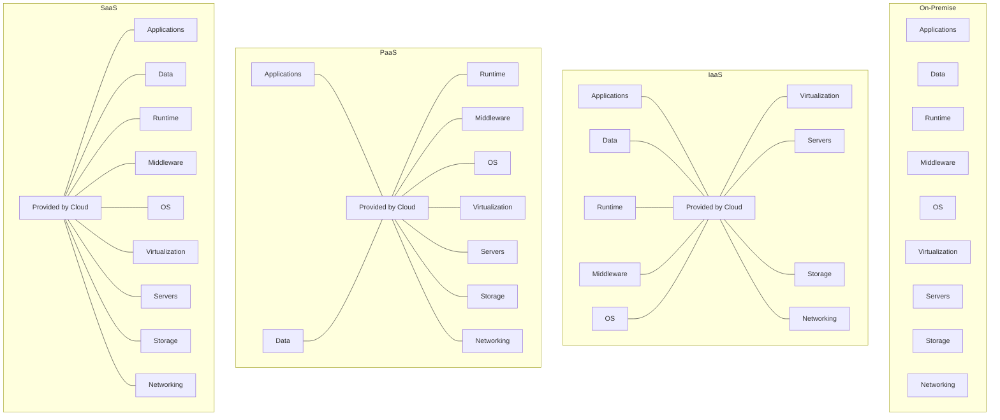
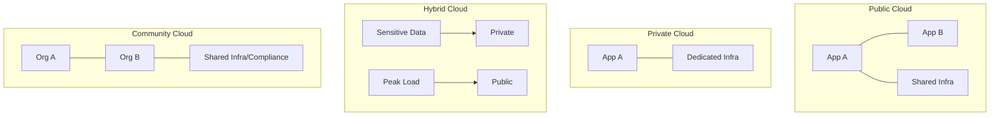

# Chapter 8: Cloud Computing — Exam Quick Revision

## Learning Objectives
- Differentiate IaaS, PaaS, SaaS with real-world provider examples
- Compare deployment models (public, private, hybrid, community)
- Classify virtualization types and hypervisor architectures
- Map AWS core services and their Azure equivalents
- Distinguish storage types (object, block, file) with use cases
- Explain elasticity, scalability, and the shared responsibility model
- Apply CAP theorem to cloud database selection

<!-- Image Gallery -->
<div style="display:flex;flex-wrap:wrap;gap:4px;margin:16px 0;padding:12px;background:#f8fafc;border-radius:8px;border:1px solid #e2e8f0;">
<a href="../../../assets/images/lessons/professional-knowledge/08-cloud-computing/hero.svg" target="_blank" rel="noopener">
  
</a>
<a href="../../../assets/images/lessons/professional-knowledge/08-cloud-computing/handwritten-notes.svg" target="_blank" rel="noopener">
  
</a>
<a href="../../../assets/images/lessons/professional-knowledge/08-cloud-computing/sticky-notes.svg" target="_blank" rel="noopener">
  
</a>
<a href="../../../assets/images/lessons/professional-knowledge/08-cloud-computing/visual-explanation.svg" target="_blank" rel="noopener">
  
</a>
<a href="../../../assets/images/lessons/professional-knowledge/08-cloud-computing/architecture.svg" target="_blank" rel="noopener">
  
</a>
<a href="../../../assets/images/lessons/professional-knowledge/08-cloud-computing/workflow.svg" target="_blank" rel="noopener">
  
</a>
<a href="../../../assets/images/lessons/professional-knowledge/08-cloud-computing/mindmap.svg" target="_blank" rel="noopener">
  
</a>
<a href="../../../assets/images/lessons/professional-knowledge/08-cloud-computing/comparison.svg" target="_blank" rel="noopener">
  
</a>
<a href="../../../assets/images/lessons/professional-knowledge/08-cloud-computing/cheatsheet.svg" target="_blank" rel="noopener">
  
</a>
<a href="../../../assets/images/lessons/professional-knowledge/08-cloud-computing/interview-quiz.svg" target="_blank" rel="noopener">
  
</a>
<a href="../../../assets/images/lessons/professional-knowledge/08-cloud-computing/social-card.svg" target="_blank" rel="noopener">
  
</a>
</div>
<!-- End Image Gallery -->

---

## 1. Cloud Service Models



| Aspect | IaaS | PaaS | SaaS |
|--------|------|------|------|
| **You manage** | Apps, data, runtime, middleware, OS | Apps, data | Nothing |
| **Provider manages** | Virtualization, servers, storage, networking | Runtime, middleware, OS, infra | Everything |
| **Analogy** | Rent a server | Rent a platform (like Heroku) | Rent software (like Gmail) |
| **Examples** | AWS EC2, Azure VM, GCE | AWS Elastic Beanstalk, Heroku, Google App Engine | Gmail, Office 365, Salesforce |
| **Use case** | Full control, custom infra | Dev/deploy without ops overhead | End-user productivity |
| **Scalability** | Manual/auto scaling instances | Auto-scaling built-in | Handled by provider |

### NIST Definition (5 Essential Characteristics)

1. **On-demand self-service** — provision resources without human interaction
2. **Broad network access** — accessible via standard protocols
3. **Resource pooling** — multi-tenant, location independent
4. **Rapid elasticity** — scale up/down quickly
5. **Measured service** — pay-per-use metering

---

## 2. Deployment Models

| Model | Description | Pros | Cons | Example |
|-------|-------------|------|------|---------|
| **Public Cloud** | Third-party provider, multi-tenant | Low cost, no maintenance | Less control, compliance | AWS, Azure, GCP |
| **Private Cloud** | Dedicated to one organization | Full control, security | High cost, maintenance | OpenStack, VMware |
| **Hybrid Cloud** | Public + Private with orchestration | Best of both: burst to public | Complexity, latency | AWS Outposts, Azure Arc |
| **Community Cloud** | Shared by several organizations | Shared cost, compliance | Limited provider options | Government cloud |

### Hybrid Cloud Use Case

- **Normal load:** Private cloud (sensitive data)
- **Peak load:** Burst to public cloud (encrypted data)
- **DR:** Public cloud as backup

---

## 3. Virtualization Types

| Type | Description | Example |
|------|-------------|---------|
| **Full Virtualization** | Guest OS unmodified; hypervisor emulates all hardware | VMware ESXi, KVM |
| **Paravirtualization** | Guest OS modified for hypercalls; better performance | Xen |
| **OS-Level (Containers)** | Shared kernel, isolated user spaces; lightweight | Docker, LXC |
| **Hardware-Assisted** | Uses CPU extensions (Intel VT-x, AMD-V) for VM operations | KVM, Hyper-V |

### Hypervisor Types

| Type | Architecture | Example | Latency |
|------|-------------|---------|---------|
| **Type 1 (Bare-metal)** | Runs directly on hardware | VMware ESXi, Hyper-V, KVM | Low |
| **Type 2 (Hosted)** | Runs on host OS | VirtualBox, VMware Workstation | Higher (OS overhead) |

```
Type 1: [Hardware] → [Hypervisor] → [VMs]
Type 2: [Hardware] → [Host OS] → [Hypervisor] → [VMs]
```

---

## 4. AWS Core Services

| Service Category | AWS Service | Description | Azure Equivalent |
|-----------------|-------------|-------------|------------------|
| **Compute** | EC2 | Virtual machines | Azure VMs |
| **Compute** | Lambda | Serverless functions | Azure Functions |
| **Compute** | ECS/EKS | Container orchestration | AKS (Azure Kubernetes) |
| **Compute** | Elastic Beanstalk | PaaS for web apps | App Service |
| **Storage** | S3 | Object storage (buckets) | Blob Storage |
| **Storage** | EBS | Block storage (volumes for EC2) | Disk Storage |
| **Storage** | EFS | File storage (shared NFS) | Azure Files |
| **Database** | RDS | Managed SQL databases | Azure SQL DB |
| **Database** | DynamoDB | NoSQL (key-value + document) | Cosmos DB |
| **Database** | ElastiCache | In-memory cache (Redis/Memcached) | Azure Cache for Redis |
| **Networking** | VPC | Virtual private cloud | Virtual Network (VNet) |
| **Networking** | Route 53 | DNS service | Azure DNS |
| **Networking** | CloudFront | CDN (content delivery) | Azure CDN |
| **Networking** | ELB | Load balancing | Azure Load Balancer |
| **Security** | IAM | Identity &amp; access management | Azure AD |
| **Security** | KMS | Key management | Key Vault |
| **Monitoring** | CloudWatch | Monitoring &amp; logging | Azure Monitor |

### AWS Regions &amp; Availability Zones

- **Region:** Geographic area (us-east-1, eu-west-1)
- **AZ:** One or more data centers within a region
- Multi-AZ deployment → high availability
- Cross-region replication → disaster recovery

---

## 5. Cloud Storage Types

| Type | Description | Access | Performance | Use Case |
|------|-------------|--------|-------------|----------|
| **Object Storage** | Flat namespace: bucket → key → data | HTTP (REST API) | Low latency for large objects | Media, backups, data lakes |
| **Block Storage** | Raw volumes: formatted with filesystem | Attached to VM (iSCSI) | High, low latency | DB storage, OS boot volumes |
| **File Storage** | Hierarchical, shared across VMs | NFS, SMB | Moderate | Shared configs, home dirs |

### S3 Storage Classes (AWS)

| Class | Durability | Availability | Min Duration | Retrieval Cost |
|-------|-----------|-------------|-------------|----------------|
| S3 Standard | 99.999999999% (11 9s) | 99.99% | None | Instant |
| S3 Intelligent-Tiering | 11 9s | 99.9% | None | Auto-tiering |
| S3 Standard-IA | 11 9s | 99.9% | 30 days | Per GB retrieval |
| S3 One Zone-IA | 11 9s | 99.5% | 30 days | Per GB retrieval |
| S3 Glacier | 11 9s | 99.99% | 90 days | Minutes to hours |
| S3 Glacier Deep Archive | 11 9s | 99.99% | 180 days | 12+ hours |

---

## 6. Elasticity vs Scalability

| Aspect | Elasticity | Scalability |
|--------|-----------|-------------|
| **Definition** | Auto scale up/down based on demand | Ability to handle increased load |
| **Trigger** | Automatic (metrics-based) | Manual or planned |
| **Direction** | Both scale up and scale down | Usually scale up |
| **Timeframe** | Short-term, dynamic | Long-term, planned |
| **Cloud-specific** | Yes (elastic = cloud native) | Also applies to on-prem |

### Scalability Types

- **Vertical scaling (Scale up):** Bigger instance (more CPU/RAM) — limited by hardware max
- **Horizontal scaling (Scale out):** More instances — theoretically unlimited

---

## 7. Cloud Security — Shared Responsibility Model

```
                    ┌─────────────────────────┐
                    │   CUSTOMER RESPONSIBILITY │
                    │  (Data, Applications,     │
                    │   Identity, OS patches)    │
├────────────────────┼─────────────────────────┤
                    │   PROVIDER RESPONSIBILITY  │
                    │  (Physical security, infra, │
                    │   hypervisor, network)      │
                    └────────────────────────────┘
```

**IaaS:** Customer secures OS, apps, data + network config
**PaaS:** Customer secures apps + data
**SaaS:** Customer secures data + user access

### Cloud Security Threats

1. **Data breaches** — unauthorized access to stored data
2. **Misconfiguration** — open S3 buckets, overly permissive IAM
3. **Insecure APIs** — weak authentication on cloud management APIs
4. **Account hijacking** — compromised credentials
5. **Insider threats** — malicious employees with access
6. **DDoS attacks** — resource exhaustion
7. **Shared technology vulnerabilities** — hypervisor escape

---

## 8. CAP Theorem (Brewer's Theorem)

In a distributed data store, at most **two** of these three can be guaranteed simultaneously:

| Property | Description |
|----------|-------------|
| **Consistency (C)** | Every read receives the most recent write (all nodes see same data) |
| **Availability (A)** | Every request receives a (non-error) response |
| **Partition Tolerance (P)** | System continues despite network partition between nodes |

### CAP Combinations

| System Type | C | A | P | Example |
|-------------|---|---|---|---------|
| **CP** | ✅ | ❌ | ✅ | HBase, MongoDB (with consistency preference) |
| **AP** | ❌ | ✅ | ✅ | DynamoDB, Cassandra, CouchDB |
| **CA** | ✅ | ✅ | ❌ | Relational DBs (single node — no partition) |

**Note:** In distributed systems, partitions are inevitable, so **P is mandatory**. You choose between CP and AP.

### NoSQL Database Types (by CAP)

| Type | CAP | Description | Examples |
|------|-----|-------------|----------|
| Key-Value | AP | Simple key → value | Redis, DynamoDB |
| Document | AP/CP | JSON-like documents | MongoDB, CouchDB |
| Column Family | AP | Wide-column stores | Cassandra, HBase |
| Graph | CP | Relationships as edges | Neo4j, Amazon Neptune |

---

## 9. Cloud Deployment Patterns

### Infrastructure as Code (IaC)

```yaml
# AWS CloudFormation / Terraform snippet
Resources:
  WebServer:
    Type: AWS::EC2::Instance
    Properties:
      InstanceType: t2.micro
      ImageId: ami-0c55b159cbfafe1f0
      SecurityGroups:
        - !Ref WebSecurityGroup
```

### Microservices on Cloud

- Each service deployed independently (containers/Lambda)
- Service discovery, API gateway, circuit breakers
- Benefits: independent scaling, deployment, technology diversity

### Serverless Architecture

- No server management — just code
- Event-driven: function triggered by HTTP, queue, DB change
- Cold start: first invocation latency (container initialization)
- **Cost:** Pay per invocation + duration (not idle time)

---

## Solved MCQs

**Q1:** Which cloud service model gives the user maximum control?
- (a) SaaS
- (b) PaaS
- (c) IaaS
- (d) FaaS

**Answer:** (c) IaaS. User manages OS, apps, data — provider manages only infra.

**Q2:** In CAP theorem, which two are typically chosen for distributed databases?
- (a) Consistency + Availability
- (b) Consistency + Partition Tolerance
- (c) Availability + Partition Tolerance
- (d) Availability + Partition Tolerance is impossible

**Answer:** (c) Availability + Partition Tolerance. Since partitions are inevitable in distributed systems (P is mandatory), you choose between CP and AP. Most NoSQL databases choose AP for high availability.

**Q3:** Which AWS service is used for object storage?
- (a) EBS
- (b) EFS
- (c) S3
- (d) RDS

**Answer:** (c) S3. EBS is block storage, EFS is file storage. S3 is object storage (buckets with keys).

**Q4:** What is the main advantage of Type 1 hypervisors over Type 2?
- (a) Lower cost
- (b) Better performance (no host OS overhead)
- (c) Better portability
- (d) More features

**Answer:** (b) Better performance (no host OS overhead). Type 1 runs directly on hardware, eliminating the host OS layer.

**Q5:** What does AWS Lambda's cold start refer to?
- (a) First invocation after idle period
- (b) Instance termination
- (c) Cache miss
- (d) Database connection timeout

**Answer:** (a) First invocation after idle period. Cold start occurs when Lambda needs to provision a new container (download code, initialize runtime), adding latency to the first request.

---

## 10. Kubernetes (Container Orchestration) Basics

### Core Concepts

| Concept | Description |
|---------|-------------|
| **Pod** | Smallest deployable unit — one or more containers sharing network/storage |
| **Service** | Stable network endpoint to access pods (load-balanced) |
| **Deployment** | Declarative pod management (replicas, rolling updates) |
| **ConfigMap / Secret** | Configuration and sensitive data injected into pods |
| **Node** | Worker machine (VM or physical) running pods |
| **Cluster** | Set of nodes managed by control plane |
| **Namespace** | Virtual cluster for isolation |

### Control Plane Components

```
kube-apiserver (API gateway) → etcd (cluster state)
       ↓
kube-scheduler (assigns pods to nodes)
       ↓
kube-controller-manager (maintains desired state)
       ↓
cloud-controller-manager (cloud provider integration)
```

### Pod Lifecycle

```
Pending → ContainerCreating → Running → Succeeded (or Failed)
```
- **RestartPolicy:** Always (default), OnFailure, Never

## 11. Cloud Cost Models

### Pricing Models Comparison

| Model | Commitment | Discount | Use Case |
|-------|-----------|----------|----------|
| **On-Demand** | None (pay per hour/second) | 0% | Variable workloads, testing |
| **Reserved (1yr/3yr)** | 1-3 year commitment | 30-70% | Stable, predictable workloads |
| **Spot/Preemptible** | None (can be reclaimed) | 60-90% | Batch processing, fault-tolerant |
| **Savings Plan** | $/hr commitment (flexible) | 30-60% | Mix of instance types |

### Cost Optimization Strategies

1. **Right-sizing:** Match instance type to workload requirements
2. **Auto-scaling:** Scale down during low demand
3. **Use Spot for non-critical workloads**
4. **Reserved instances for baseline capacity**
5. **Storage tiering:** Move infrequent data to colder storage (S3 Glacier)
6. **Delete unused resources:** Orphaned volumes, idle load balancers
7. **Use managed services:** Reduces operational overhead (RDS vs self-managed DB)

## 12. Multi-Cloud &amp; Disaster Recovery

### Multi-Cloud Strategies

| Strategy | Description | Pros |
|----------|-------------|------|
| **Active-Passive** | Primary cloud active, backup cloud idle | Cost-effective |
| **Active-Active** | Both clouds handle traffic concurrently | High availability |
| **Cloud-agnostic** | Abstraction layer (Terraform, Kubernetes) | No vendor lock-in |

### Disaster Recovery Metrics

| Metric | Description | Target |
|--------|-------------|--------|
| **RTO (Recovery Time Objective)** | Max acceptable downtime | Minutes to hours |
| **RPO (Recovery Point Objective)** | Max acceptable data loss | Seconds to minutes |

### DR Strategies (in order of cost/complexity)

1. **Backup &amp; Restore:** S3 backup → restore in new region (RPO: hours, RTO: days)
2. **Pilot Light:** Replicate critical data, spin up infra on failover (RPO: minutes)
3. **Warm Standby:** Reduced-capacity replica running (RPO: seconds)
4. **Multi-Site Active-Active:** Full capacity in both regions (RPO: near zero)

## 13. Serverless Frameworks &amp; Event-Driven Architecture

### AWS Lambda Triggers

| Trigger | Use Case |
|---------|----------|
| API Gateway | HTTP REST API |
| S3 Events | Image processing on upload |
| DynamoDB Streams | Real-time data change processing |
| SQS/SNS | Queue/notification processing |
| CloudWatch Events | Scheduled cron jobs |
| Cognito | User authentication workflows |

### Serverless Pros &amp; Cons

| Pros | Cons |
|------|------|
| No server management | Cold start latency (50ms-5s) |
| Auto-scale to zero | Timeout limit (15 min for Lambda) |
| Pay per invocation (idle = $0) | Debugging/monitoring harder |
| Built-in fault tolerance | Vendor lock-in |
| Quick deployment | Limited runtime environments |

### State Machine (AWS Step Functions)

```
[Order Received] → [Validate Payment] → [Check Inventory]
                     ↓ fail                    ↓ fail
                  [Send Error]              [Restock]
                     ↓                        ↓ ok
                  [End]                   [Ship Order] → [End]
```

---

---

## 📌 Extended Theory — Deep Dive for IBPS SO Mains (2024–2026 Trends)

### Cloud Cost Calculator — TypeScript

```typescript
interface InstanceType {
  name: string;
  vCPU: number;
  memoryGB: number;
  hourlyPrice: number;
}

interface CostEstimate {
  onDemand: number;
  reserved1yr: number;
  reserved3yr: number;
  spot: number;
}

class CloudCostCalculator {
  constructor(private instances: InstanceType[]) {}

  estimate(instanceName: string, hoursPerMonth: number, months: number): CostEstimate | null {
    const inst = this.instances.find(i => i.name === instanceName);
    if (!inst) return null;

    const totalHoursOnDemand = hoursPerMonth * months;
    const onDemand = inst.hourlyPrice * totalHoursOnDemand;

    // Reserved 1yr: ~60% discount (30% upfront + 70% monthly)
    const reserved1yr = inst.hourlyPrice * 0.4 * totalHoursOnDemand;
    // Reserved 3yr: ~70% discount
    const reserved3yr = inst.hourlyPrice * 0.3 * totalHoursOnDemand;
    // Spot: ~70% discount on average
    const spot = inst.hourlyPrice * 0.3 * totalHoursOnDemand;

    return {
      onDemand: Math.round(onDemand * 100) / 100,
      reserved1yr: Math.round(reserved1yr * 100) / 100,
      reserved3yr: Math.round(reserved3yr * 100) / 100,
      spot: Math.round(spot * 100) / 100,
    };
  }

  findCheapestInstance(requirements: { minCPU: number; minMemory: number }): InstanceType[] {
    return this.instances
      .filter(i => i.vCPU >= requirements.minCPU && i.memoryGB >= requirements.minMemory)
      .sort((a, b) => a.hourlyPrice - b.hourlyPrice);
  }
}

const awsPrices: InstanceType[] = [
  { name: 't3.micro', vCPU: 2, memoryGB: 1, hourlyPrice: 0.0104 },
  { name: 't3.small', vCPU: 2, memoryGB: 2, hourlyPrice: 0.0208 },
  { name: 't3.medium', vCPU: 2, memoryGB: 4, hourlyPrice: 0.0416 },
  { name: 'm5.large', vCPU: 2, memoryGB: 8, hourlyPrice: 0.096 },
  { name: 'c5.2xlarge', vCPU: 8, memoryGB: 16, hourlyPrice: 0.34 },
];

// Usage: new CloudCostCalculator(awsPrices).estimate('t3.medium', 730, 12)
// On-demand ≈ $364/yr vs Reserved ≈ $218/yr
```

### Deployment Model Comparison — Extended



> **PYQ 2024:** A bank needs to store sensitive financial data while being able to handle flash traffic spikes during sale events. Which deployment model is best?

**Answer:** Hybrid Cloud. Keep sensitive data on private cloud (compliance). Burst to public cloud during peak demand.

### Service Model Scenarios — Decision Matrix

| Scenario | Best Model | Why |
|----------|-----------|-----|
| Startup deploying web app without DevOps team | PaaS (Heroku, Elastic Beanstalk) | No OS/runtime management |
| Enterprise migrating legacy app with custom OS requirements | IaaS (EC2, Azure VM) | Full control over OS and middleware |
| Team of 5 building a CRM from scratch | SaaS (Salesforce) | No infrastructure, no custom development |
| Data science team needs GPU for ML training | IaaS (EC2 P3/P4 instances) | Bare-metal/VM with GPU passthrough |
| Bank running payment processing with strict compliance | Private Cloud / On-premise | Data sovereignty, audit requirements |
| Media company encoding videos on demand | FaaS (Lambda, Cloud Functions) | Event-driven, pay-per-execution |

### Hypervisor Scheduler — TypeScript

```typescript
interface VirtualMachine {
  id: string;
  vCPUs: number;
  memoryMB: number;
  priority: number; // 1 (highest) to 5
}

interface PhysicalHost {
  totalCPUs: number;
  totalMemoryMB: number;
  usedCPUs: number;
  usedMemoryMB: number;
}

class HypervisorScheduler {
  constructor(private hosts: PhysicalHost[]) {}

  allocateVM(vm: VirtualMachine): { hostIndex: number } | null {
    // Best-fit: find host with smallest remaining capacity that fits
    let bestFitIdx = -1;
    let bestFitRemaining = Infinity;

    for (let i = 0; i < this.hosts.length; i++) {
      const host = this.hosts[i];
      const availCPU = host.totalCPUs - host.usedCPUs;
      const availMem = host.totalMemoryMB - host.usedMemoryMB;

      if (availCPU >= vm.vCPUs && availMem >= vm.memoryMB) {
        const remainingCPU = availCPU - vm.vCPUs;
        const remainingMem = availMem - vm.memoryMB;
        const remaining = remainingCPU + remainingMem / 1024;
        if (remaining < bestFitRemaining) {
          bestFitRemaining = remaining;
          bestFitIdx = i;
        }
      }
    }

    if (bestFitIdx === -1) return null;

    this.hosts[bestFitIdx].usedCPUs += vm.vCPUs;
    this.hosts[bestFitIdx].usedMemoryMB += vm.memoryMB;
    return { hostIndex: bestFitIdx };
  }

  deallocateVM(vm: VirtualMachine, hostIndex: number): void {
    this.hosts[hostIndex].usedCPUs -= vm.vCPUs;
    this.hosts[hostIndex].usedMemoryMB -= vm.memoryMB;
  }
}
```

### AWS vs Azure vs GCP — Service Mapping

| Category | AWS | Azure | GCP |
|----------|-----|-------|-----|
| Virtual Machines | EC2 | Virtual Machines | Compute Engine |
| Serverless | Lambda | Functions | Cloud Functions |
| Containers | ECS/EKS | AKS | GKE |
| Object Storage | S3 | Blob Storage | Cloud Storage |
| Block Storage | EBS | Disk Storage | Persistent Disk |
| SQL Database | RDS | SQL Database | Cloud SQL |
| NoSQL | DynamoDB | Cosmos DB | Firestore/Bigtable |
| DNS | Route 53 | DNS | Cloud DNS |
| CDN | CloudFront | CDN | Cloud CDN |
| Load Balancer | ELB | Load Balancer | Cloud Load Balancing |
| Monitoring | CloudWatch | Monitor | Cloud Monitoring |
| IAM | IAM | Azure AD | Cloud IAM |
| VPC | VPC | VNet | VPC |
| AI/ML | SageMaker | Azure ML | Vertex AI |
| Big Data | EMR | HDInsight | Dataproc |

### Auto-Scaling with TypeScript

```typescript
interface ScalingMetrics {
  cpuUtilization: number; // 0-100
  memoryUtilization: number;
  requestCount: number; // per minute
}

class AutoScalingGroup {
  private instances: number;
  private minInstances: number;
  private maxInstances: number;
  private scaleUpThreshold: number;
  private scaleDownThreshold: number;

  constructor(config: {
    min: number; max: number;
    scaleUpThreshold?: number;
    scaleDownThreshold?: number;
  }) {
    this.instances = config.min;
    this.minInstances = config.min;
    this.maxInstances = config.max;
    this.scaleUpThreshold = config.scaleUpThreshold ?? 70;
    this.scaleDownThreshold = config.scaleDownThreshold ?? 30;
  }

  evaluate(metrics: ScalingMetrics): { action: string; instances: number } {
    const avgUtilization = (metrics.cpuUtilization + metrics.memoryUtilization) / 2;

    if (avgUtilization > this.scaleUpThreshold && this.instances < this.maxInstances) {
      this.instances++;
      return { action: 'SCALE_UP', instances: this.instances };
    }
    if (avgUtilization < this.scaleDownThreshold && this.instances > this.minInstances) {
      this.instances--;
      return { action: 'SCALE_DOWN', instances: this.instances };
    }
    return { action: 'NOOP', instances: this.instances };
  }
}
```

## 📝 Solved Examples (20 MCQs)

<details>
<summary>Q1: Which cloud service model provides the highest level of control?</summary>
(a) SaaS (b) PaaS (c) IaaS (d) FaaS
**Answer:** (c) IaaS. User manages OS, runtime, middleware, data, and applications. Provider manages virtualization, servers, storage, networking.
</details>

<details>
<summary>Q2: In CAP theorem, which property is sacrificed by AP systems during a network partition?</summary>
(a) Availability (b) Consistency (c) Partition Tolerance (d) Durability
**Answer:** (b) Consistency. AP systems (DynamoDB, Cassandra) continue to accept writes during partition, but different nodes may have different data.
</details>

<details>
<summary>Q3: Which AWS service is used for DNS resolution?</summary>
(a) CloudFront (b) Route 53 (c) ELB (d) VPC
**Answer:** (b) Route 53. It provides domain registration, DNS resolution, and health checking.
</details>

<details>
<summary>Q4: Type 1 hypervisor runs directly on:</summary>
(a) Host OS (b) Hardware (c) Guest OS (d) Virtual Machine
**Answer:** (b) Hardware. Type 1 (bare-metal) hypervisors run directly on physical hardware. Type 2 runs on top of a host OS.
</details>

<details>
<summary>Q5: What does the 'R' in RTO stand for?</summary>
(a) Recovery (b) Response (c) Return (d) Resource
**Answer:** (a) Recovery. RTO = Recovery Time Objective — maximum acceptable downtime after a disaster.
</details>

<details>
<summary>Q6: Which of the following is NOT a cloud deployment model?</summary>
(a) Public (b) Private (c) Virtual (d) Hybrid
**Answer:** (c) Virtual. Deployment models: Public, Private, Hybrid, Community.
</details>

<details>
<summary>Q7: Which AWS storage service provides block-level storage for EC2?</summary>
(a) S3 (b) EBS (c) EFS (d) Glacier
**Answer:** (b) EBS (Elastic Block Store). Attached to EC2 instances. S3 = object, EFS = file, Glacier = archival.
</details>

<details>
<summary>Q8: What is the primary benefit of serverless computing?</summary>
(a) No cold starts (b) No server management (c) Unlimited execution time (d) Lower latency
**Answer:** (b) No server management. Developers just upload code; cloud provider handles scaling, availability, and infrastructure.
</details>

<details>
<summary>Q9: Which NoSQL database type is DynamoDB?</summary>
(a) Document (b) Column Family (c) Key-Value (d) Graph
**Answer:** (c) Key-Value. DynamoDB is a key-value and document database. Cassandra = Column Family, MongoDB = Document, Neo4j = Graph.
</details>

<details>
<summary>Q10: In virtualization, what is the purpose of the hypervisor?</summary>
(a) Manage physical hardware (b) Create and run VMs (c) Compile code (d) Route network traffic
**Answer:** (b) Create and run VMs. The hypervisor (VMM) abstracts physical hardware and manages multiple virtual machines.
</details>

<details>
<summary>Q11: What is the difference between vertical and horizontal scaling?</summary>
(a) Vertical = more instances, Horizontal = bigger instance (b) Vertical = bigger instance, Horizontal = more instances (c) Both are same (d) Vertical = cloud, Horizontal = on-prem
**Answer:** (b) Vertical scaling (scale up) = add more CPU/RAM to existing instance. Horizontal scaling (scale out) = add more instances.
</details>

<details>
<summary>Q12: Which AWS service is equivalent to Azure Functions?</summary>
(a) EC2 (b) Lambda (c) ECS (d) S3
**Answer:** (b) Lambda. Both Lambda and Azure Functions are serverless compute services. EC2 = Azure VMs, ECS = AKS.
</details>

<details>
<summary>Q13: In the shared responsibility model, who is responsible for physical security?</summary>
(a) Customer (b) Cloud provider (c) Both (d) Third party
**Answer:** (b) Cloud provider. Provider secures physical infrastructure (data centers, hardware, networking). Customer secures data, applications, and access.
</details>

<details>
<summary>Q14: Which S3 storage class is designed for long-term archival with 12+ hour retrieval?</summary>
(a) S3 Standard (b) S3 Intelligent-Tiering (c) S3 Glacier (d) Glacier Deep Archive
**Answer:** (d) Glacier Deep Archive. Retrieval time: 12+ hours. Lowest cost storage at $0.001/GB/month.
</details>

<details>
<summary>Q15: What is the benefit of containers over virtual machines?</summary>
(a) Stronger isolation (b) Lighter weight (shared kernel) (c) Each container has own OS (d) Better for legacy apps
**Answer:** (b) Lighter weight. Containers share host OS kernel, start in seconds, use less memory than VMs (each VM has full OS).
</details>

<details>
<summary>Q16: In AWS, what does CloudFormation provide?</summary>
(a) Monitoring (b) Infrastructure as Code (c) DNS (d) CDN
**Answer:** (b) Infrastructure as Code (IaC). CloudFormation uses YAML/JSON templates to provision AWS resources declaratively.
</details>

<details>
<summary>Q17: Which cloud characteristic allows resources to be provisioned without human interaction?</summary>
(a) Measured service (b) On-demand self-service (c) Resource pooling (d) Rapid elasticity
**Answer:** (b) On-demand self-service. Users can provision computing capabilities automatically without requiring human interaction with service provider.
</details>

<details>
<summary>Q18: What is the purpose of an Availability Zone in AWS?</summary>
(a) Global DNS (b) Isolated data center within a region (c) CDN edge location (d) Database service
**Answer:** (b) Isolated data center within a region. Multi-AZ deployments provide high availability and fault tolerance.
</details>

<details>
<summary>Q19: In Kubernetes, what is the smallest deployable unit?</summary>
(a) Node (b) Pod (c) Service (d) Deployment
**Answer:** (b) Pod. A pod contains one or more containers with shared storage/network and is the basic scheduling unit.
</details>

<details>
<summary>Q20: What is cold start latency in serverless computing?</summary>
(a) Time to shut down a function (b) Delay when invoking a function after idle period (c) Database connection time (d) Network initialization
**Answer:** (b) Delay when invoking a function after idle period. Cold start involves provisioning a new container, loading code, and initializing runtime.
</details>

## 📖 Exercise Bank (30 Questions)

1. Compare IaaS, PaaS, and SaaS for: a hospital (HIPAA), a gaming startup, a data analytics platform.
2. Write a TypeScript function that determines the optimal cloud deployment model based on compliance, scalability, and cost requirements.
3. Calculate monthly cost: 10 EC2 t3.medium instances (hourly $0.0416) running 24/7 for 30 days. Compare on-demand vs 1-year reserved.
4. Design a VPC with public and private subnets across 2 AZs with NAT gateway.
5. Implement a TypeScript class simulating AWS S3 bucket policies (allow/deny by IP, user, resource).
6. Explain CAP theorem with 3 real-world database examples for each combination.
7. Write TypeScript code for a CloudWatch-style log aggregator with filtering and alerting.
8. Compare object storage (S3), block storage (EBS), and file storage (EFS) for: database storage, media streaming, shared config files.
9. Create a Kubernetes deployment YAML and explain each field.
10. Implement a TypeScript load balancer (round-robin, least-connections, weighted) for distributing requests.
11. Design a multi-cloud disaster recovery strategy with RTO &lt; 15 minutes and RPO &lt; 1 minute.
12. Write TypeScript code for a Lambda function that resizes images on S3 upload (trigger: S3 put event).
13. Compare AWS, Azure, and GCP pricing models (compute, storage, data transfer).
14. Implement a TypeScript Resource Manager that tracks cloud resource allocation and costs across teams.
15. Explain the difference between stateful and stateless applications in cloud deployment.
16. Write TypeScript code simulating a container orchestrator scheduler (bin-packing, spread, random).
17. Design a cloud migration strategy (6 R's: Rehost, Replatform, Refactor, Repurchase, Retire, Retain).
18. Implement a TypeScript cost optimization engine that suggests rightsizing based on utilization metrics.
19. Compare serverless vs containers for: cold start, scaling, cost, debugging, vendor lock-in.
20. Write TypeScript code for a cloud security group simulator (stateful firewall rules evaluation).
21. Explain the difference between RDS and DynamoDB in terms of data model, scaling, and use cases.
22. Implement a TypeScript IaC template parser (YAML → cloud resource definitions).
23. Design a cloud-native microservices architecture with API Gateway, service discovery, and circuit breakers.
24. Write TypeScript code simulating an auto-scaling policy based on SQS queue depth.
25. Compare cloud monitoring tools: CloudWatch vs Azure Monitor vs Google Cloud Operations.
26. Implement a TypeScript function that calculates S3 storage costs for different storage classes.
27. Explain the concepts of blue-green deployment and canary release in cloud environments.
28. Write TypeScript code for a cloud billing alert system (budget thresholds, SNS notifications).
29. Compare EBS volume types: gp3, io2, st1, sc1 — performance and use cases.
30. Implement a TypeScript class that simulates a cloud region availability matrix (service availability per region).

**Answer Key:**

3. On-demand: 10 × $0.0416 × 24 × 30 = $299.52/month. Reserved 1yr: ~60% → $179.71/month
5. Evaluate request principal, IP, resource ARN against policy statements. First explicit DENY wins, then ALLOW, default DENY
8. Database: block (EBS) for performance. Media streaming: object (S3) + CDN. Shared config: file (EFS)
10. Round-robin: cycle through instances. Least-connections: track active connections, pick lowest. Weighted: assign weights, distribute proportionally
11. Active-Active across two regions with global load balancer. Synchronous replication for RPO < 1min
14. Track resource tags per team. Calculate hourly cost × usage. Generate per-team billing report
16. Bin-packing: pack VMs to minimize hosts. Spread: distribute evenly. Random: simple but may overload
17. Rehost (lift & shift): fastest. Replatform: modify for cloud (managed DB). Refactor: redesign for cloud-native
19. Serverless: cold start 50ms-5s, auto-scale to zero, pay per call. Containers: no cold start, min instances, pay for runtime
20. Evaluate rules in order: if source/dest IP matches → allow/deny. Stateful: auto-allow return traffic
22. Parse YAML resources: each resource type maps to specific handler. Generate create/update/delete operations
24. If queue depth > threshold → scale up. If queue depth < threshold for N consecutive checks → scale down
27. Blue-green: two identical environments, switch traffic. Canary: route small % traffic to new version, gradual increase
28. Aggregate costs by service. Compare against budget. If threshold (80%, 100%) exceeded → SNS notification

---

## 📌 Additional PYQ Integration (2024–2026 Analysis)

> **PYQ 2025:** An e-commerce company experiences unpredictable traffic spikes during flash sales. Their current infrastructure runs on-premise with fixed capacity. During last year's Big Billion Day sale, the website was down for 4 hours. Recommend a cloud migration strategy with justification.

**Answer:** Migrate to a **Hybrid Cloud** architecture:
1. Move the web/application tier to **AWS EC2 Auto Scaling** with target tracking policies based on CPU/request count
2. Use **RDS with Multi-AZ** for the database tier (high availability)
3. Keep sensitive customer data (PCI DSS) on-premise or in a **private cloud** with encrypted VPN connection
4. Use **CloudFront CDN** for static assets to reduce origin load
5. Implement **Elastic Load Balancer** to distribute traffic across AZs
6. For extreme peaks, configure **predictive scaling** using historical traffic patterns

Benefits: Elasticity handles spikes, pay-per-use reduces costs, DR capabilities improve resilience.

> **PYQ 2024:** Compare the following cloud service models for a startup building a Node.js application with PostgreSQL:
> (a) Deploy on EC2 with self-managed DB
> (b) Deploy on Elastic Beanstalk with RDS
> (c) Deploy on serverless (Lambda + Aurora Serverless)

**Answer:** Option (b) Elastic Beanstalk + RDS is best for a startup:
- (a) EC2: Full control but high ops overhead (OS patching, DB admin, scaling)
- (b) EB + RDS: Managed platform, auto-scaling, automated backups, minimal ops — ideal when team &lt; 5 engineers
- (c) Lambda + Aurora Serverless: No servers, but cold start latency (~500ms-5s) may impact UX; connection pooling needed; 15-min timeout limit

> **PYQ 2026:** In the CAP theorem context, a globally distributed social media feed requires availability during network partitions. Which NoSQL database type and consistency model would you choose?

**Answer:** Choose an **AP system** (Availability + Partition Tolerance). Examples:
- **DynamoDB** (eventual consistency, key-value)
- **Cassandra** (tunable consistency, column-family)
- **CouchDB** (eventual consistency, document)

These systems accept writes during network partitions (high availability) and resolve conflicts via last-writer-wins or vector clocks. Users may see slightly stale data during partitions, but the feed remains responsive. Consistency is sacrificed for availability.

## 📌 Topic-wise Weightage Analysis for IBPS SO IT Mains

| Topic | Weightage | Frequency | Difficulty |
|-------|-----------|-----------|------------|
| Service Models (IaaS/PaaS/SaaS) | 15-20% | Every exam | Easy |
| Deployment Models | 10-12% | Every exam | Easy-Medium |
| AWS Services Mapping | 12-15% | Every exam | Medium |
| Virtualization & Hypervisors | 8-10% | Frequently | Medium |
| CAP Theorem & NoSQL | 10-12% | Frequently | Medium |
| Cloud Security (Shared Resp.) | 5-8% | Frequently | Medium |
| Storage Types (Object/Block/File) | 5-7% | Frequently | Easy |
| Serverless & Containers | 5-8% | Frequently | Medium |
| DR & Cost Optimization | 3-5% | Occasionally | Medium |
| Kubernetes Basics | 3-5% | Occasionally | Medium |

## Summary
- **Service models:** IaaS (infra), PaaS (platform), SaaS (software)
- **Deployment:** Public (shared), Private (dedicated), Hybrid (best of both)
- **Virtualization:** Full (unmodified guest), Para (modified guest), OS-level (containers)
- **Hypervisors:** Type 1 (bare-metal, faster), Type 2 (hosted, portable)
- **AWS:** EC2 (compute), S3 (object), RDS (SQL), Lambda (serverless), VPC (network)
- **Storage:** Object (REST/HTTP), Block (VM attached), File (shared/NFS)
- **Elasticity:** Auto-scale; **Scalability:** Handle growth
- **Security:** Shared responsibility model — customer secures data, provider secures infra
- **CAP:** Consistency, Availability, Partition Tolerance — pick 2 (P mandatory in distributed)
- **Kubernetes:** Pods (smallest unit), Services (networking), Deployments (replica mgmt)
- **Cost:** On-demand (flexible), Reserved (cheap, committed), Spot (batch, cheap)
- **DR:** RTO (downtime), RPO (data loss) — Backup → Pilot Light → Warm Standby → Active-Active
- **Serverless:** Lambda triggers, cold start, pay-per-invocation, event-driven

---

## HOT Topics (Frequently Asked in IBPS SO IT Mains)
1. IaaS vs PaaS vs SaaS — which service model for given scenario
2. Public vs Private vs Hybrid cloud — advantages/disadvantages
3. CAP theorem application — which NoSQL DB for which requirement
4. AWS services — match service with its purpose
5. Virtualization vs containerization — performance, isolation, use cases
6. Shared responsibility model — who is responsible for what
7. Vertical vs horizontal scaling — when to use each
8. Cloud deployment models — differences in cost, security, control
9. Serverless vs containers — comparison of cold start, cost, statefulness
10. Elasticity vs scalability — real-world examples

---

## Chapter Quiz (MCQs)

<details>
<summary>Q1: Which of the following is NOT a characteristic of cloud computing as per NIST?</summary>
A1: "Fixed capacity" is not a characteristic. The five essential characteristics are: on-demand self-service, broad network access, resource pooling, rapid elasticity, and measured service.
</details>

<details>
<summary>Q2: In a hybrid cloud, sensitive data typically resides in which cloud?</summary>
A2: Private cloud. Hybrid cloud uses private cloud for sensitive/regulated data and public cloud for less sensitive data or for burst capacity during peak loads.
</details>

<details>
<summary>Q3: What is the difference between EBS and EFS in AWS?</summary>
A3: EBS is block-level storage (single EC2 attachment, high performance). EFS is file-level storage (multiple EC2s, NFS-based, scalable). EBS is like a hard drive; EFS is like a shared network drive.
</details>

<details>
<summary>Q4: Which cloud service model would a developer choose to deploy code without managing the underlying OS?</summary>
A4: PaaS (Platform as a Service) — e.g., AWS Elastic Beanstalk, Heroku, Google App Engine. The developer only manages code and data.
</details>

<details>
<summary>Q5: What does 'measured service' mean in cloud computing?</summary>
A5: Cloud resources are metered and billed based on usage (pay-per-use). This provides transparency for both provider and consumer, enabling optimization and cost control.
</details>
