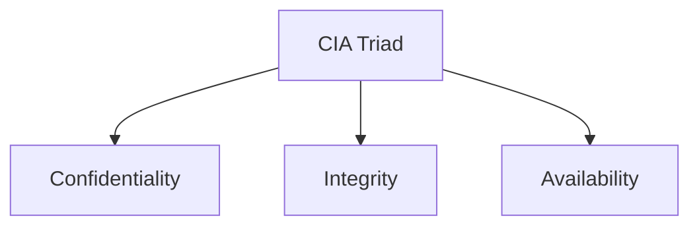

# Chapter 9: Information Security — Exam Quick Revision

## Learning Objectives
- Compare symmetric vs asymmetric encryption algorithms with key sizes and security levels
- Apply hash function properties (preimage resistance, collision resistance, avalanche effect)
- Trace the Digital Signature and SSL/TLS handshake processes
- Categorize firewall types and compare IDS vs IPS
- Identify common attack types and their mitigation strategies
- Apply the CIA triad and AAA framework to security scenarios
- Recall OWASP Top 10 (2021) vulnerabilities and biometric authentication types

---

## 1. Symmetric vs Asymmetric Cryptography

| Aspect | Symmetric | Asymmetric (Public Key) |
|--------|-----------|-------------------------|
| **Keys** | Single shared key | Public + Private key pair |
| **Key exchange** | Out-of-band (secure channel needed) | Public key can be shared openly |
| **Speed** | Fast (100-1000× faster) | Slow (computationally expensive) |
| **Key size** | 128-256 bits | 2048-4096 bits |
| **Use case** | Bulk data encryption | Key exchange, digital signatures |
| **Security level** | 128-bit AES ≈ 256-bit ECC | 2048-bit RSA ≈ 3072-bit RSA |

### Algorithm Details

| Algorithm | Type | Key Size | Block Size | Rounds | Status |
|-----------|------|----------|------------|--------|--------|
| **DES** | Symmetric (block) | 56 bits | 64 bits | 16 | ❌ Broken (brute-force in hours) |
| **3DES** | Symmetric (block) | 112/168 bits | 64 bits | 48 | ❌ Deprecated (slow, small block) |
| **AES** | Symmetric (block) | 128/192/256 bits | 128 bits | 10/12/14 | ✅ Secure (standard) |
| **Blowfish** | Symmetric (block) | 32-448 bits | 64 bits | 16 | ⚠️ Small block (64-bit) |
| **RSA** | Asymmetric | 1024-4096 bits | Variable | N/A | ⚠️ 1024 deprecated, 2048+ secure |
| **ECC** | Asymmetric | 160-521 bits | N/A | N/A | ✅ Equivalent security with smaller keys |
| **Diffie-Hellman** | Asymmetric (key exchange) | Variable | N/A | N/A | ✅ Secure (with proper parameters) |

### Key Size Equivalence
```
ECC-256 ≈ RSA-3072 ≈ AES-128 (security level)
ECC-384 ≈ RSA-7680 ≈ AES-192
ECC-521 ≈ RSA-15360 ≈ AES-256
```

---

## 2. Hash Functions

### Properties
1. **Preimage Resistance (One-way):** Given hash H, infeasible to find M such that hash(M) = H
2. **Second Preimage Resistance:** Given M1, infeasible to find M2 ≠ M1 with hash(M1) = hash(M2)
3. **Collision Resistance:** Infeasible to find any M1 ≠ M2 with hash(M1) = hash(M2)
4. **Avalanche Effect:** Small change in input → completely different hash output (~50% bits flip)
5. **Deterministic:** Same input always produces same output

### Hash Algorithm Comparison

| Algorithm | Output Size | Collision Status | Use Case |
|-----------|-------------|-----------------|----------|
| **MD5** | 128 bits | ❌ Broken (collisions in 2^18) | Checksums (non-security) |
| **SHA-1** | 160 bits | ❌ Broken (SHAttered, 2^63) | Deprecated |
| **SHA-256** | 256 bits | ✅ Secure | TLS, digital signatures, Bitcoin |
| **SHA-3** | Variable | ✅ Secure | Newest standard (Keccak) |
| **bcrypt/scrypt** | Variable | ✅ Secure | Password hashing (slow by design) |

---

## 3. Digital Signature Process

```
Sender Side:
1. Hash the message → digest
2. Encrypt digest with sender's PRIVATE key → signature
3. Send (message + signature) to receiver

Receiver Side:
1. Decrypt signature with sender's PUBLIC key → digest1
2. Hash received message → digest2
3. Compare digest1 == digest2 → if equal, signature verified
```

### Properties
- **Authentication:** Proves sender's identity (only sender has private key)
- **Integrity:** Any modification changes the hash
- **Non-repudiation:** Sender cannot deny signing

---

## 4. SSL/TLS Handshake

```
Client                                        Server
   |                                              |
   |--- ClientHello (TLS version, cipher suites) →|
   |← ServerHello (selected cipher, cert) -------|
   |← Certificate (server's public key) ---------|
   |← ServerHelloDone ---------------------------|
   |                                              |
   |--- ClientKeyExchange (pre-master secret) ---→|
   |    (encrypted with server's public key)       |
   |                                              |
   |--- ChangeCipherSpec ------------------------→|
   |--- Finished (encrypted) --------------------→|
   |← ChangeCipherSpec ---------------------------|
   |← Finished (encrypted) -----------------------|
   |                                              |
   |← Secure communication established ----------→|
```

### TLS 1.3 Improvements
- Reduced handshake: 1-RTT (normal), 0-RTT (resumed)
- Removed weak ciphers (RC4, 3DES, CBC mode)
- Forward secrecy mandatory (no static RSA key exchange)
- Fewer round trips → faster connection establishment

---

## 5. Firewall Types

| Type | Layer | How It Works | Pros | Cons |
|------|-------|-------------|------|------|
| **Packet Filter** | 3/4 | Inspects headers (IP, port, protocol) | Fast, simple | No application awareness |
| **Stateful** | 3/4 | Tracks connection state (SYN/ACK tracking) | Remembers sessions | Slightly slower than packet filter |
| **Application (Proxy)** | 7 | Inspects application payload | Deep inspection, content filtering | Slow, application-specific |
| **Next-Gen (NGFW)** | 3-7 | Combines stateful + IDS/IPS + app awareness | Comprehensive | Expensive, complex |
| **WAF** | 7 | Web-specific (HTTP/HTTPS analysis) | Protects against SQLi, XSS | Web traffic only |

### Firewall Rules Example
```
Rule 1: ALLOW tcp FROM 10.0.0.0/8 TO any PORT 443
Rule 2: DENY tcp FROM any TO 192.168.1.10 PORT 22
Rule 3: DENY all FROM any TO any
```

---

## 6. IDS vs IPS

| Aspect | IDS (Intrusion Detection System) | IPS (Intrusion Prevention System) |
|--------|--------------------------------|-----------------------------------|
| **Action** | Monitors and alerts | Detects and blocks in real-time |
| **Placement** | Out-of-band (passive) | Inline (active) |
| **Response** | Log, alert, notify | Block, drop, reset connection |
| **False positive impact** | Wasted analyst time | Legitimate traffic blocked |
| **Examples** | Snort (IDS mode), OSSEC | Snort (inline), Suricata, Palo Alto |

### Detection Methods
| Method | Description | Strength | Weakness |
|--------|-------------|----------|----------|
| **Signature-based** | Match known attack patterns | Low false positives | Misses zero-day attacks |
| **Anomaly-based** | Baseline + deviation detection | Detects novel attacks | High false positives |
| **Heuristic-based** | Rules and behavior analysis | Balances both | Complex to maintain |

---

## 7. Common Attack Types

| Attack | Description | Layer | Mitigation |
|--------|-------------|-------|------------|
| **DDoS** | Overwhelm server with traffic from multiple sources | Network/App | Rate limiting, CDN, scrubbers |
| **SQL Injection** | Malicious SQL in input fields | Application | Parameterized queries, ORM, WAF |
| **XSS (Cross-Site Scripting)** | Inject scripts into web pages | Application | Output encoding, CSP, HttpOnly cookies |
| **CSRF** | Forge user actions via authenticated session | Application | Anti-CSRF tokens, SameSite cookies |
| **Phishing** | Deceptive emails to steal credentials | Human | User awareness, MFA, email filters |
| **MITM (Man-in-the-Middle)** | Intercept communication between parties | Network | HTTPS, certificate pinning, VPN |
| **Ransomware** | Encrypt data for ransom | Multi-layer | Backups, patch management, email filtering |
| **Buffer Overflow** | Overflow memory buffer to execute code | Application/OS | ASLR, DEP, bounds checking |
| **DNS Spoofing/Cache Poisoning** | False DNS records redirect traffic | Network | DNSSEC |
| **Session Hijacking** | Steal session cookie/token | Application | HTTPS, secure cookies, session rotation |

### XSS Types
| Type | Description | Example |
|------|-------------|---------|
| **Stored (Persistent)** | Malicious script stored on server | Comment field with `<script>` |
| **Reflected (Non-persistent)** | Script in URL/request, reflected in response | Search query echoed back |
| **DOM-based** | Script in client-side JavaScript | URL fragment parsed by JS |

---

## 8. CIA Triad



| Property | Meaning | Threats | Controls |
|----------|---------|---------|----------|
| **Confidentiality** | Data accessible only to authorized parties | Eavesdropping, data breach | Encryption, access control, authentication |
| **Integrity** | Data unchanged by unauthorized parties | Tampering, SQL injection | Hashing, digital signatures, checksums |
| **Availability** | Data accessible when needed | DDoS, ransomware, hardware failure | Redundancy, backups, failover, CDN |

### Parkerian Hexad (Extended CIA + 3 more)
1. **Confidentiality** — privacy
2. **Integrity** — accuracy
3. **Availability** — accessibility
4. **Possession/Control** — who has the data
5. **Authenticity** — genuineness of origin
6. **Utility** — usefulness of data

---

## 9. AAA (Authentication, Authorization, Accounting)

| Component | Description | Example |
|-----------|-------------|---------|
| **Authentication** | Who are you? — verify identity | Password, biometric, MFA |
| **Authorization** | What can you do? — permissions | RBAC, ACL |
| **Accounting** | What did you do? — audit trail | Logs, monitoring |

### Authentication Factors
| Factor | Type | Examples |
|--------|------|----------|
| **Knowledge** (Something you know) | Type 1 | Password, PIN, security question |
| **Possession** (Something you have) | Type 2 | Smart card, token, OTP, phone |
| **Inherence** (Something you are) | Type 3 | Fingerprint, face, iris, voice |
| **Location** (Where you are) | Type 4 | GPS, IP geo-location |
| **Behavior** (What you do) | Type 5 | Typing pattern, gait, mouse movement |

### MFA (Multi-Factor Authentication)
Requires **two or more** factors from different categories (not just two passwords).

---

## 10. OWASP Top 10 (2021)

| Rank | Vulnerability | Description |
|------|---------------|-------------|
| A1 | **Broken Access Control** | Users can act outside intended permissions |
| A2 | **Cryptographic Failures** | Weak encryption, sensitive data exposure |
| A3 | **Injection** | SQL, NoSQL, OS, LDAP injection |
| A4 | **Insecure Design** | Missing threat modeling, security by design |
| A5 | **Security Misconfiguration** | Default passwords, verbose errors |
| A6 | **Vulnerable &amp; Outdated Components** | Unpatched libraries, known CVEs |
| A7 | **Identification &amp; Auth Failures** | Weak passwords, credential stuffing |
| A8 | **Software &amp; Data Integrity Failures** | CI/CD pipeline attacks, unsigned updates |
| A9 | **Security Logging &amp; Monitoring Failures** | Insufficient logging, missing alerts |
| A10 | **SSRF (Server-Side Request Forgery)** | Server makes requests to internal resources |

---

## 11. Biometric Authentication

| Type | Accuracy (FAR/FRR) | Cost | User Acceptance | Liveness Detection |
|------|--------------------|------|-----------------|-------------------|
| **Fingerprint** | Medium | Low | High | Increasing |
| **Face recognition** | Medium-High | Medium | High | Yes (3D, liveness) |
| **Iris scan** | Very high | High | Low (intrusive) | Hard to spoof |
| **Voice** | Low-Medium | Low | High | Basic |
| **Retina scan** | Very high | High | Very low | Hard to spoof |
| **Palm/finger vein** | High | High | Medium | Very hard |

### Biometric System Metrics
- **FAR (False Acceptance Rate):** Imposter accepted (Type II error)
- **FRR (False Rejection Rate):** Genuine user rejected (Type I error)
- **EER (Equal Error Rate):** Where FAR = FRR — lower is better

---

## Solved MCQs

**Q1:** Which algorithm uses a 128-bit block size and 128/192/256-bit keys?
- (a) DES
- (b) 3DES
- (c) AES
- (d) Blowfish

**Answer:** (c) AES. AES uses 128-bit blocks and supports 128, 192, or 256-bit keys with 10, 12, or 14 rounds respectively.

**Q2:** In an SSL/TLS handshake, what is the purpose of the ClientKeyExchange message?
- (a) Send the client's certificate
- (b) Send the pre-master secret encrypted with server's public key
- (c) Negotiate cipher suites
- (d) Verify the server

**Answer:** (b) Send the pre-master secret encrypted with server's public key. Both sides derive session keys from this shared secret.

**Q3:** Which attack involves injecting malicious scripts that execute in a user's browser?
- (a) SQL Injection
- (b) CSRF
- (c) XSS
- (d) DDoS

**Answer:** (c) XSS (Cross-Site Scripting). The attacker injects client-side scripts (usually JavaScript) into web pages viewed by other users.

**Q4:** What does non-repudiation mean in information security?
- (a) Data cannot be modified
- (b) Sender cannot deny sending the message
- (c) Data is encrypted
- (d) System is available

**Answer:** (b) Sender cannot deny sending the message. Digital signatures provide non-repudiation by binding the sender's identity to the message.

**Q5:** Which OWASP Top 10 (2021) vulnerability involves missing authentication checks allowing users to access unauthorized resources?
- (a) A1 — Broken Access Control
- (b) A3 — Injection
- (c) A7 — Identification and Auth Failures
- (d) A10 — SSRF

**Answer:** (a) A1 — Broken Access Control. This moved to the top spot in 2021, covering issues like privilege escalation, missing access controls, and path traversal.

---

## 12. VPN Protocols

| Protocol | Layer | Encryption | Port | Security | Pros | Cons |
|----------|-------|------------|------|----------|------|------|
| **IPsec** | 3 (Network) | AES, 3DES | UDP 500 (IKE), ESP | High | Strong encryption, tunnel + transport mode | Complex configuration |
| **SSL/TLS VPN** | 4-7 | AES, ChaCha20 | TCP 443 | High | No client needed, passes firewalls | Slower than IPsec |
| **OpenVPN** | 2/3 | AES-256-GCM | UDP 1194 | Very high | Open source, cross-platform, flexible | May be blocked by firewalls |
| **PPTP** | 2 | MPPE (128-bit) | TCP 1723 | ❌ Broken | Easy setup, widely supported | Deprecated, known weaknesses |
| **L2TP/IPsec** | 2 | AES with IPsec | UDP 1701 | High | Built into most OS | Double encapsulation overhead |

### IPsec Modes
| Mode | What is Encrypted | Use Case |
|------|-------------------|----------|
| **Transport** | Payload only (header remains) | End-to-end between hosts |
| **Tunnel** | Entire packet (new header added) | Site-to-site VPN |

### IPsec Protocols
- **AH (Authentication Header):** Integrity + authentication only (no encryption)
- **ESP (Encapsulating Security Payload):** Encryption + integrity + authentication
- **IKE (Internet Key Exchange):** Establishes security associations (SA)

## 13. Wireless Security Standards

| Standard | Encryption | Authentication | Status |
|----------|-----------|---------------|--------|
| **WEP** | RC4 (64/128-bit) | Shared key | ❌ Broken in minutes |
| **WPA** | TKIP (RC4-based) | PSK or 802.1X | ❌ Broken (Michael attack) |
| **WPA2** | AES-CCMP | PSK or 802.1X | ⚠️ KRACK attack (fixed) |
| **WPA3** | AES-GCMP-256 | SAE (Simultaneous Auth of Equals) | ✅ Secure |

### WPA2 vs WPA3
| Feature | WPA2 | WPA3 |
|---------|------|------|
| Encryption | AES-CCMP (128-bit) | AES-GCMP (256-bit) |
| Handshake | 4-way handshake (PSK vulnerable to dictionary attack) | SAE (Dragonfly) — resistant to offline dictionary attacks |
| Forward secrecy | No (passphrase compromise reveals past traffic) | Yes (unique session keys) |
| IoT support | No | Wi-Fi Easy Connect (QR code onboarding) |

## 14. Security Policies &amp; Governance

### Key Documents
| Document | Purpose | Key Elements |
|----------|---------|-------------|
| **Security Policy** | High-level management direction | Scope, objectives, roles, compliance |
| **BIA (Business Impact Analysis)** | Identify critical functions and impact of disruption | MTD, RTO, RPO, critical processes |
| **BCP (Business Continuity Plan)** | Maintain operations during disruption | Alternate locations, communication plan |
| **DRP (Disaster Recovery Plan)** | Restore IT systems after disaster | Recovery procedures, backup restoration |

### Security Controls Classification
| Category | Subtype | Examples |
|----------|---------|----------|
| **Physical** | Deterrent, Preventive | Guards, locks, fences, cameras |
| **Technical** | Preventive | Firewalls, encryption, access control |
| **Administrative** | Directive, Preventive | Policies, training, background checks |

### Control Functions
- **Preventive:** Stop attacks before they happen (firewall, encryption)
- **Detective:** Identify attacks in progress (IDS, audit logs)
- **Corrective:** Fix damage after attack (backup restore, patch)
- **Deterrent:** Discourage attackers (warning banners, cameras)
- **Recovery:** Restore after incident (DRP, BCP)

## 15. Penetration Testing

### Phases
1. **Reconnaissance:** Gather information (passive: Google, social media; active: DNS, port scanning)
2. **Scanning:** Identify live hosts, open ports, services (nmap, nessus)
3. **Vulnerability Assessment:** Identify and prioritize vulnerabilities
4. **Exploitation:** Attempt to exploit vulnerabilities (Metasploit, custom exploits)
5. **Post-Exploitation:** Maintain access, pivot, escalate privileges
6. **Reporting:** Document findings, risk ratings, remediation recommendations

### Black Box vs White Box vs Gray Box
| Type | Knowledge of Target | Realism | Cost |
|------|--------------------|---------|------|
| **Black Box** | None (external attacker) | High | High |
| **White Box** | Full (code, credentials, network maps) | Low | Medium |
| **Gray Box** | Partial (some credentials, architecture) | Medium | Medium |

## 16. Security Standards &amp; Frameworks

| Standard | Focus | Common in |
|----------|-------|-----------|
| **ISO 27001** | Information Security Management System (ISMS) | Enterprises, compliance |
| **NIST SP 800-53** | Security and privacy controls | US government agencies |
| **PCI DSS** | Payment card data security | E-commerce, banks |
| **HIPAA** | Healthcare data privacy (PHI) | Healthcare organizations |
| **GDPR** | Personal data protection (EU) | Any org handling EU citizen data |
| **COBIT** | IT governance and management | IT audit, governance |

---

## Summary
- **Symmetric (AES):** Single key, fast, 128-256 bits. **Asymmetric (RSA/ECC):** Key pair, slow, 2048+ bits
- **Hashing:** SHA-256 (secure), MD5/SHA-1 (broken). Properties: preimage resistance, collision resistance, avalanche effect
- **Digital signature:** Hash + encrypt with private key → verify with public key
- **TLS handshake:** ClientHello → ServerHello + Cert → KeyExchange → Finished
- **Firewalls:** Packet filter (L3/4) → Stateful → Proxy (L7) → NGFW
- **IDS:** Monitors/passive. **IPS:** Blocks/inline
- **Attacks:** DDoS (availability), SQLi/XSS (integrity/confidentiality), MITM (confidentiality)
- **CIA:** Confidentiality (encryption), Integrity (hashing), Availability (redundancy)
- **AAA:** Authentication (who), Authorization (what), Accounting (log)
- **OWASP Top 10 (2021):** Broken Access Control (#1), Crypto Failures (#2), Injection (#3)
- **Biometrics:** Fingerprint (common), iris (accurate), face (growing), voice (convenient)
- **VPN:** IPsec (site-to-site), SSL/TLS (client without client software), OpenVPN (open source)
- **Wireless:** WEP (broken) → WPA (broken) → WPA2 (KRACK) → WPA3 (SAE, secure)
- **Security policy:** BIA (impact analysis), BCP (continuity), DRP (disaster recovery)
- **Pentesting:** Recon → Scan → Exploit → Post-Exploit → Report
- **Standards:** ISO 27001 (ISMS), PCI DSS (card data), HIPAA (healthcare), GDPR (privacy)

---

## HOT Topics (Frequently Asked in IBPS SO IT Mains)
1. AES vs DES — key size, block size, rounds, security status
2. RSA vs ECC — key size equivalence, performance, security
3. SSL/TLS handshake — steps, what is exchanged at each stage
4. Firewall types — which type for which deployment scenario
5. IDS vs IPS — detection methods (signature vs anomaly)
6. XSS vs CSRF — differences, attack vectors, mitigation techniques
7. Hash function properties — preimage resistance vs collision resistance
8. OWASP Top 10 (2021) — recent changes (injection dropped from #1)
9. Digital signature — process and properties (authentication, integrity, non-repudiation)
10. MFA — factors (knowledge, possession, inherence) and implementation

---

## Chapter Quiz (MCQs)

<details>
<summary>Q1: What is the primary difference between SHA-256 and HMAC-SHA256?</summary>
A1: SHA-256 is a plain hash (no key). HMAC-SHA256 adds a secret key to the hashing process, providing message authentication (proves the sender has the key). HMAC is used in TLS, JWT, API authentication.
</details>

<details>
<summary>Q2: Which type of firewall maintains a connection state table?</summary>
A2: Stateful firewall. It tracks the state of active connections (SYN, SYN-ACK, ACK, FIN) and allows packets only if they match a known connection state.
</details>

<details>
<summary>Q3: In the context of CIA triad, encryption primarily provides:</summary>
A3: Confidentiality. Encryption transforms readable data into ciphertext that can only be decrypted with the correct key, protecting it from unauthorized access.
</details>

<details>
<summary>Q4: What is the Equal Error Rate (EER) in biometric systems?</summary>
A4: EER is the point where FAR (False Acceptance Rate) equals FRR (False Rejection Rate). Lower EER indicates better biometric system accuracy. It's used to compare different biometric systems.
</details>

<details>
<summary>Q5: Which OWASP Top 10 (2021) entry covers vulnerabilities in third-party libraries and components?</summary>
A5: A6 — Vulnerable and Outdated Components. This includes using libraries/frameworks with known CVEs, outdated software, and unpatched dependencies. Mitigation involves SBOM (Software Bill of Materials), regular updates, and vulnerability scanning.
</details>
