# Chapter 1: Introduction to Python

## Learning Objectives

By the end of this chapter, students will be able to:
- Summarise the history and design philosophy of Python
- Install Python and configure a development environment
- Execute Python code using the interactive REPL and script files
- Write syntactically correct Python with proper indentation and comments
- Create and manage virtual environments with venv and conda
- Install third-party packages using pip


## Chapter at a Glance

| Section | Topic | Key Concept |
|---------|-------|-------------|
|1.1|History of Python|Guido van Rossum, Python 2 vs 3, Zen of Python|
|1.2|Installing Python|Official distribution, Anaconda, Miniconda|
|1.3|REPL|Read-Eval-Print Loop, interactive experimentation|
|1.4|First Program|hello.py, print(), bytecode compilation|
|1.5|Indentation|Block structure, four spaces, PEP 8|
|1.6|Comments|Single-line, inline, docstrings|
|1.7|IDEs|PyCharm, VS Code, IDLE, Jupyter Lab|
|1.8|Virtual Environments|venv, conda, isolation patterns|
|1.9|pip|Package installation, requirements.txt|
|1.10|Running Scripts|-m flag, -c flag, -i flag|


## Chapter Roadmap

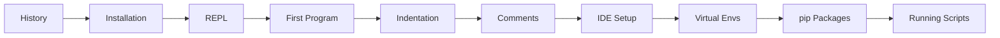
## 1.1 A Brief History of Python

> **One-Sentence Takeaway:** Python was created by Guido van Rossum in 1991; the Zen of Python drives its philosophy of readability and simplicity.
> **Pro Tip:** Run `import this` in a Python REPL to read the Zen of Python -- it is a fun way to internalise Pythonic thinking.


Python was conceived in the late 1980s by Guido van Rossum at Centrum Wiskunde & Informatica in the Netherlands as a successor to the ABC language. The first public release, Python 0.9.0, appeared in 1991 and already included exception handling, functions, and the core data types list, dict, and str.

Python 2.0 was released in 2000, introducing list comprehensions and garbage collection. Python 3.0 (2008) was a major, backward-incompatible revision that cleaned up language inconsistencies. Python 2 reached end-of-life on January 1, 2020. All modern development uses Python 3. The language is now maintained by the Python Software Foundation and follows PEP 8 (style guide) and PEP 572 (walrus operator) among hundreds of enhancement proposals.

The design philosophy is captured in The Zen of Python (PEP 20), which emphasises readability, simplicity, and explicitness over implicit behaviour.

### TypeScript Parallel

TypeScript (and JavaScript) share Python's multi-paradigm nature but with static typing and a C-family syntax:

```typescript
// TypeScript: compiled to JavaScript, static typing
const greeting: string = "Hello, World!";
console.log(greeting);

// TypeScript runs on Node.js or in the browser
// Equivalent of python --version:
// $ node --version
// $ tsc --version
```

While Python uses indentation for blocks, TypeScript uses curly braces `{}`. Both support REPL environments -- Python has `python`, TypeScript has `node` and `ts-node`.

### More on Python's Design Philosophy

<a href="../../assets/images/diagrams/python-programming/01-introduction/more-on-python-s-design-philosophy-handwritten.svg" target="_blank" rel="noopener">
  
</a>
<a href="../../assets/images/diagrams/python-programming/01-introduction/more-on-python-s-design-philosophy-diagram.svg" target="_blank" rel="noopener">
  
</a>
<a href="../../assets/images/diagrams/python-programming/01-introduction/more-on-python-s-design-philosophy-sticky.svg" target="_blank" rel="noopener">
  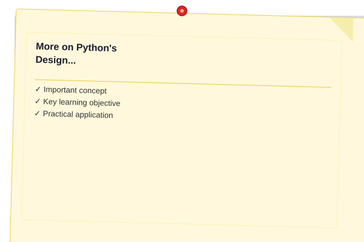
</a>


The Zen of Python (PEP 20) includes aphorisms that guide language design:

| Aphorism | Meaning |
|----------|---------|
| Beautiful is better than ugly | Readability matters; code is read more often than written |
| Explicit is better than implicit | Clear code beats magic; imports should be explicit |
| Simple is better than complex | Prefer simple solutions; avoid over-engineering |
| Flat is better than nested | Shallow hierarchies are easier to understand |
| There should be one obvious way to do it | Python values consistency over flexibility |

```python
# The Zen of Python in action
import this  # Displays all 19 aphorisms
```

### Python vs. Other Languages: Philosophy Comparison

<a href="../../assets/images/diagrams/python-programming/01-introduction/python-vs-other-languages-philosophy-comparison-handwritten.svg" target="_blank" rel="noopener">
  
</a>
<a href="../../assets/images/diagrams/python-programming/01-introduction/python-vs-other-languages-philosophy-comparison-diagram.svg" target="_blank" rel="noopener">
  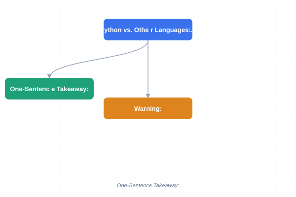
</a>
<a href="../../assets/images/diagrams/python-programming/01-introduction/python-vs-other-languages-philosophy-comparison-sticky.svg" target="_blank" rel="noopener">
  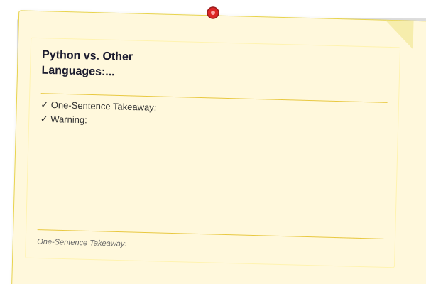
</a>


| Language | Philosophy | Typing | Block Syntax |
|----------|-----------|--------|--------------|
| Python | Readability, simplicity | Dynamic (optional hints) | Indentation |
| TypeScript | Reliability at scale | Static (fully typed) | Curly braces |
| Java | WORA (write once, run anywhere) | Static | Curly braces |
| Go | Simplicity, fast compilation | Static | Curly braces |
| Ruby | Developer happiness | Dynamic | `do`/`end` + indentation |

## 1.2 Installing Python

> **One-Sentence Takeaway:** Install Python from python.org or use Anaconda for data-science workflows.
> **Warning:** Always check "Add Python to PATH" during Windows installation -- it is the most common setup mistake for beginners.


### 1.2.1 Official Distribution

<a href="../../assets/images/diagrams/python-programming/01-introduction/1-2-1-official-distribution-handwritten.svg" target="_blank" rel="noopener">
  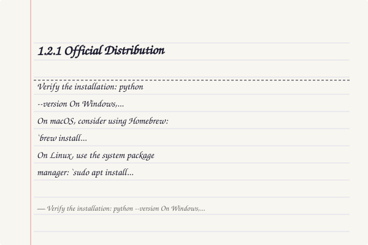
</a>
<a href="../../assets/images/diagrams/python-programming/01-introduction/1-2-1-official-distribution-diagram.svg" target="_blank" rel="noopener">
  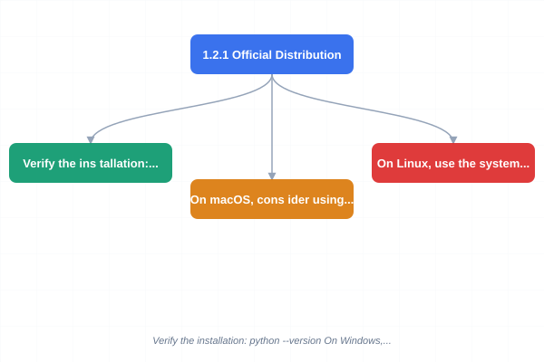
</a>
<a href="../../assets/images/diagrams/python-programming/01-introduction/1-2-1-official-distribution-sticky.svg" target="_blank" rel="noopener">
  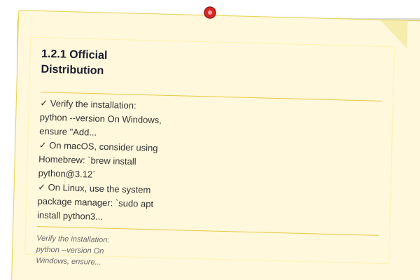
</a>


Download the latest installer from python.org. Verify the installation:

```bash
python --version
```

On Windows, ensure "Add Python to PATH" is checked during installation. On macOS, consider using Homebrew: `brew install python@3.12`. On Linux, use the system package manager: `sudo apt install python3 python3-pip`.

### 1.2.2 Alternative Distributions

<a href="../../assets/images/diagrams/python-programming/01-introduction/1-2-2-alternative-distributions-handwritten.svg" target="_blank" rel="noopener">
  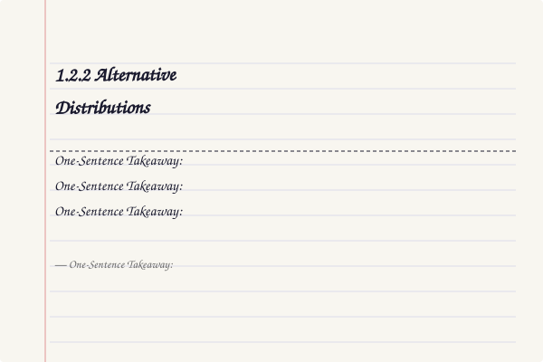
</a>
<a href="../../assets/images/diagrams/python-programming/01-introduction/1-2-2-alternative-distributions-diagram.svg" target="_blank" rel="noopener">
  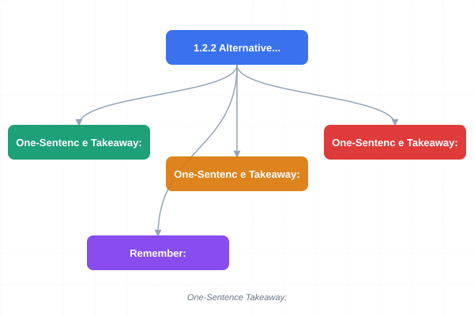
</a>
<a href="../../assets/images/diagrams/python-programming/01-introduction/1-2-2-alternative-distributions-sticky.svg" target="_blank" rel="noopener">
  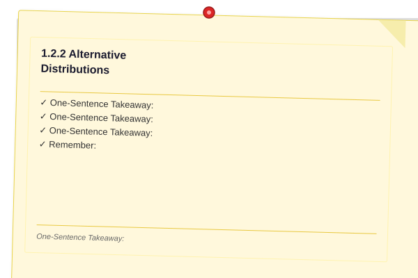
</a>


Anaconda and Miniconda bundle Python with data-science libraries and the conda package manager. These are popular in scientific computing but are heavier than the official distribution.

```bash
# Miniconda installation
# Download from docs.conda.io, then:
conda --version
```

## 1.3 The Python REPL

> **One-Sentence Takeaway:** The REPL provides instant feedback for learning and experimentation.


The Read-Eval-Print Loop (REPL) is an interactive environment for experimenting with Python. Start it by typing `python` (or `python3`) in a terminal:

```mermaid
flowchart LR
    A[Type python in terminal] --> B[REPL Starts]
    B --> C[Read: Parse Input]
    C --> D[Eval: Execute Expression]
    D --> E[Print: Display Result]
    E --> B
    B -.-> F[Type exit\(\)]
    F --> G[REPL Terminates]
```

Python REPL in action:

```python
Python 3.12.0 (main, Oct  2 2023, 12:22:05)
[Clang 15.0.0] on darwin
Type "help", "copyright", "credits" or "license" for more information.
>>> 2 + 2
4
>>> print("Hello, world!")
Hello, world!
>>> exit()
```

The REPL evaluates expressions immediately. Use `exit()` or Ctrl+D (Unix) / Ctrl+Z + Enter (Windows) to quit. The underscore `_` holds the last evaluated result in interactive mode.

```python
>>> 42 * 3
126
>>> _ * 2
252
```

## 1.4 First Program

> **One-Sentence Takeaway:** A .py file is compiled to bytecode and executed by the Python Virtual Machine.


Create a file named `hello.py`:

```python
# hello.py
print("Hello, world!")
```

Execute it:

```bash
python hello.py
```

The `print()` function outputs its argument to the terminal followed by a newline. Unlike many compiled languages, Python is interpreted: the source file is compiled to bytecode (.pyc files stored in `__pycache__/`) automatically, then executed by the Python Virtual Machine.

## 1.5 Indentation and Block Structure

> **One-Sentence Takeaway:** Consistent four-space indentation is mandatory to define blocks in Python.
> **Remember:** PEP 8 recommends four spaces per indentation level. Configure your editor to insert spaces when you press Tab to avoid TabError.


Python uses indentation (typically four spaces) to delimit blocks rather than curly braces or keywords. Consistent indentation is mandatory:

```python
x = 10
if x > 5:
    print("x is greater than 5")
    print("This is still inside the if block")
print("This is outside the if block")
```

Mixing tabs and spaces is an error (PEP 8 recommends spaces only). The standard indentation width is four spaces. Most editors can be configured to insert spaces when the Tab key is pressed.

```python
# This will cause IndentationError
if True:
    print("indented with one tab")
    print("indented with four spaces")
```

## 1.6 Comments

> **One-Sentence Takeaway:** Comments use # for single lines; triple-quoted strings serve as docstrings.


Comments explain code to human readers and are ignored by the interpreter:

```python
# This is a single-line comment

x = 5  # inline comment

"""
Multi-line string literals used as docstrings
(or simply multi-line comments when not assigned
to anything). These are parsed but not executed.
"""
```

Triple-quoted strings at the top of a module, class, or function become docstrings accessible via `help()`.

## 1.7 Integrated Development Environments

> **One-Sentence Takeaway:** VS Code with the Python extension is recommended for this course.


| IDE / Editor | Key Features |
|--------------|--------------|
| PyCharm | Full-featured, refactoring, debugging, Django support |
| VS Code | Lightweight, Python extension, Jupyter notebook integration |
| IDLE | Built-in, minimal, sufficient for learning |
| Jupyter Lab | Cell-based execution, great for data exploration |

VS Code with the Python extension (by Microsoft) is recommended for this course. Install it and configure the Python interpreter path:

```json
// .vscode/settings.json
{
    "python.defaultInterpreterPath": ".venv/bin/python",
    "editor.formatOnSave": true
}
```

## 1.8 Virtual Environments

> **One-Sentence Takeaway:** venv isolates project dependencies; conda adds non-Python package support.


Virtual environments isolate project dependencies so that different projects can use different package versions.

### 1.8.1 venv (Built-in)

<a href="../../assets/images/diagrams/python-programming/01-introduction/1-8-1-venv-built-in-handwritten.svg" target="_blank" rel="noopener">
  
</a>
<a href="../../assets/images/diagrams/python-programming/01-introduction/1-8-1-venv-built-in-diagram.svg" target="_blank" rel="noopener">
  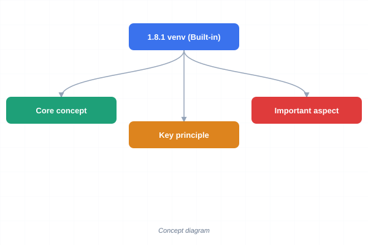
</a>
<a href="../../assets/images/diagrams/python-programming/01-introduction/1-8-1-venv-built-in-sticky.svg" target="_blank" rel="noopener">
  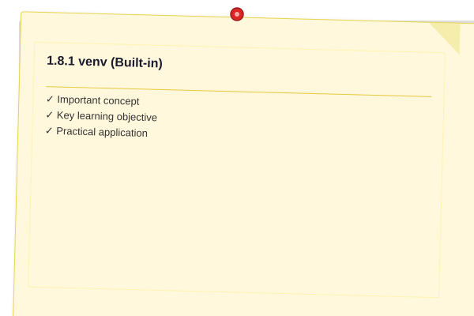
</a>


```bash
# Create a virtual environment
python -m venv .venv

# Activate (Unix/macOS)
source .venv/bin/activate

# Activate (Windows)
.venv\Scripts\activate

# Deactivate
deactivate
```

Once activated, `pip install` places packages inside `.venv/` rather than the global site-packages.

### 1.8.2 Conda Environments

<a href="../../assets/images/diagrams/python-programming/01-introduction/1-8-2-conda-environments-handwritten.svg" target="_blank" rel="noopener">
  
</a>
<a href="../../assets/images/diagrams/python-programming/01-introduction/1-8-2-conda-environments-diagram.svg" target="_blank" rel="noopener">
  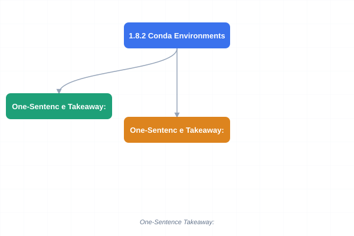
</a>
<a href="../../assets/images/diagrams/python-programming/01-introduction/1-8-2-conda-environments-sticky.svg" target="_blank" rel="noopener">
  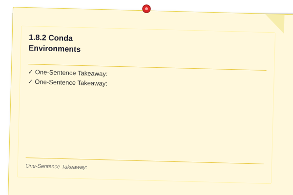
</a>


```bash
conda create --name myenv python=3.12
conda activate myenv
conda install numpy pandas
conda deactivate
```

Conda environments can mix Python and non-Python dependencies (e.g., CUDA, C libraries). They are heavier but more powerful for data-science workflows.

## 1.9 pip: The Package Installer

> **One-Sentence Takeaway:** pip installs from PyPI; requirements.txt pins exact versions.


pip installs packages from the Python Package Index (PyPI, pypi.org):

```bash
pip install requests        # latest version
pip install requests==2.31.0  # specific version
pip install "requests>=2.28"   # version constraint
pip list                     # show installed packages
pip freeze > requirements.txt  # export dependencies
pip install -r requirements.txt  # install from file
```

Common commands:

- `pip install --upgrade pip` -- upgrade pip itself
- `pip show <package>` -- package metadata
- `pip uninstall <package>` -- remove a package
- `pip cache purge` -- reclaim disk space

## 1.10 Running Python Scripts

> **One-Sentence Takeaway:** Python supports running modules with -m, inline code with -c, and post-execution REPL with -i.


Beyond `python script.py`, Python supports several invocation modes:

```bash
# Run module as script
python -m http.server 8000

# Execute a string
python -c "print(sum(range(10)))"

# Interactive mode after executing a script
python -i script.py
```

The `-m` flag runs a library module as a script. The `-c` flag executes the given string. The `-i` flag drops into the REPL after the script finishes, which is useful for debugging.


## Concept Comparison Table

| Concept | Python | Other Languages |
|---|---|---|
| Block delimiters | Indentation (4 spaces) | Curly braces {} (C/Java/JS) |
| Variable typing | Dynamic | Static |
| Package manager | pip + venv | npm (Node), cargo (Rust) |
| Execution model | Interpreted + bytecode | Compiled (C/Rust) or JIT (Java) |
| The REPL | Built-in `python` command | Separate tools (irb, node -i) |


## Quick Reference

```python
# Hello world
print("Hello, world!")

# Check version
import sys; print(sys.version)

# Create venv
python -m venv .venv

# Install package
pip install requests

# Run module
python -m http.server 8000
```


## Cross-Application Matrix

| Area | Application | Relevant Section |
|------|-------------|------------------|
|Web Development|Running Flask/Django apps|1.10|
|Data Science|Jupyter notebooks in conda envs|1.8.2|
|Automation|Script shebang and execution|1.4|
|DevOps|Requirements.txt for build reproducibility|1.9|


## TypeScript Equivalent: First Program

Since this course has TypeScript examples elsewhere, here is how the same concepts look in TypeScript:

```typescript
// Hello world equivalent
console.log("Hello, world!");

// Indentation in TypeScript (uses braces, not indentation)
const x: number = 10;
if (x > 5) {
  console.log("x is greater than 5"); // inside block
}
console.log("This is outside the if block");
```

### Python vs TypeScript: Ecosystem Comparison

<a href="../../assets/images/diagrams/python-programming/01-introduction/python-vs-typescript-ecosystem-comparison-handwritten.svg" target="_blank" rel="noopener">
  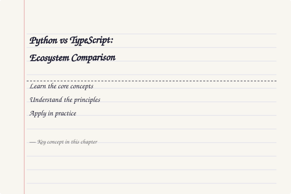
</a>
<a href="../../assets/images/diagrams/python-programming/01-introduction/python-vs-typescript-ecosystem-comparison-diagram.svg" target="_blank" rel="noopener">
  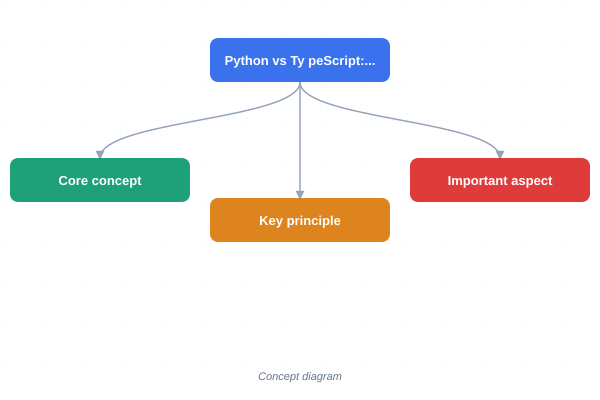
</a>
<a href="../../assets/images/diagrams/python-programming/01-introduction/python-vs-typescript-ecosystem-comparison-sticky.svg" target="_blank" rel="noopener">
  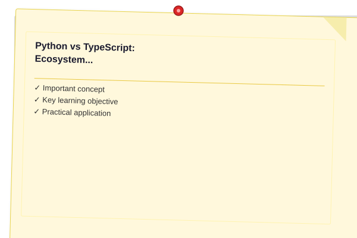
</a>


| Concept | Python | TypeScript |
|---------|--------|------------|
| Package manager | pip | npm / yarn / bun |
| Virtual env | venv / conda | node_modules (local) |
| REPL | `python` | `node`, `ts-node` |
| Style guide | PEP 8 | ESLint + Prettier |
| Type system | Optional (gradual via type hints) | Static (compiled) |
| Build step | None (interpreted) | tsc / esbuild / bun |
| Config file | pyproject.toml / setup.py | tsconfig.json |
| Module format | .py file | .ts file (compiled to .js) |
| Run script | `python script.py` | `bun run script.ts` |
| Package install | `pip install requests` | `bun add express` |

### Python Execution Model

<a href="../../assets/images/diagrams/python-programming/01-introduction/python-execution-model-handwritten.svg" target="_blank" rel="noopener">
  
</a>
<a href="../../assets/images/diagrams/python-programming/01-introduction/python-execution-model-diagram.svg" target="_blank" rel="noopener">
  
</a>
<a href="../../assets/images/diagrams/python-programming/01-introduction/python-execution-model-sticky.svg" target="_blank" rel="noopener">
  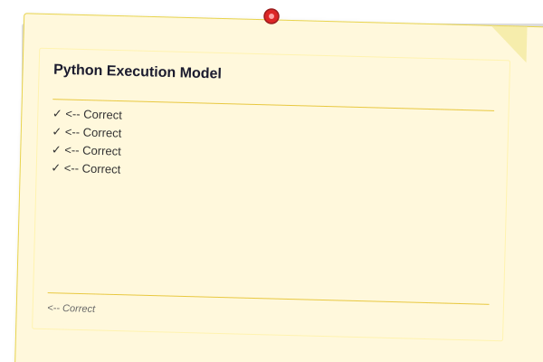
</a>


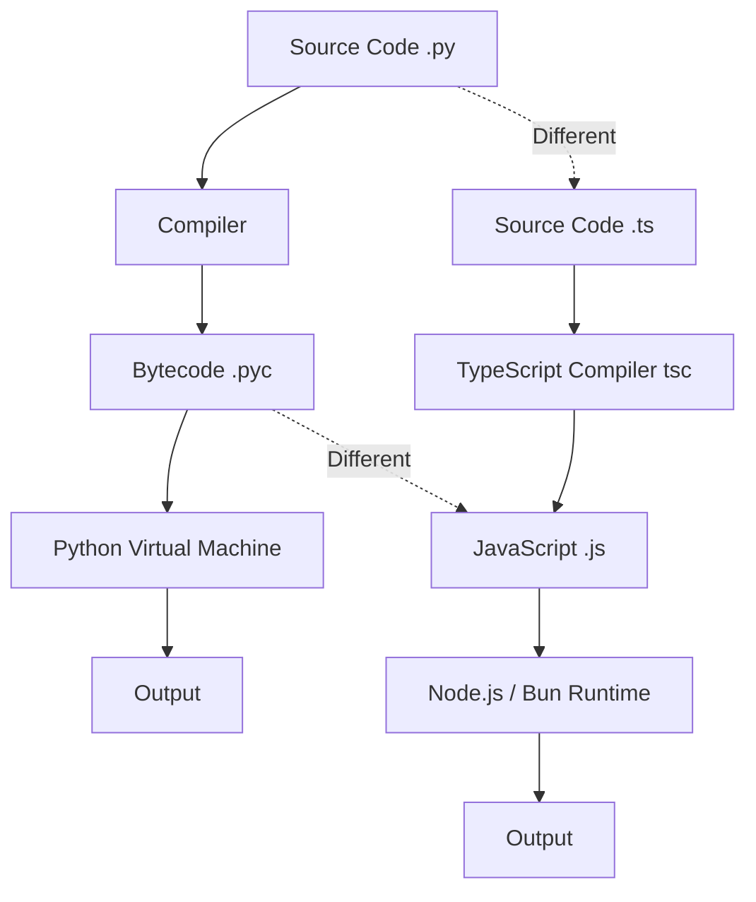

Python compiles source code to platform-independent bytecode (`.pyc` files in `__pycache__/`), which the Python Virtual Machine executes. TypeScript compiles to JavaScript, which then runs in a JS runtime (Node.js, Bun, or browser). Both use intermediate representations, but Python's VM is part of the runtime itself, while TypeScript targets an existing JS engine.

```typescript
// TypeScript: Running and packaging
// $ bun run hello.ts       (like python hello.py)
// $ bun add express        (like pip install requests)

// TypeScript REPL (like Python's python command)
// $ node
// > console.log("Hello")
// Hello
// > .exit
```

## Practical Takeaways

| Python Concept | Key Point | Common Mistake |
|----------------|-----------|----------------|
| REPL | `python` starts interactive shell | Forgetting `exit()` or Ctrl+D to quit |
| Indentation | 4 spaces, mandatory for blocks | Mixing tabs and spaces |
| Virtual Environments | `python -m venv .venv` isolates packages | Installing globally instead of in env |
| pip | `pip freeze > requirements.txt` to lock deps | Not pinning versions |
| Docstrings | `"""triple quotes"""` for documentation | Confusing with comments |
| Python vs TypeScript | Dynamic typing vs static | Python catches type errors at runtime |

## Chapter Quiz

**Q1.** What does the REPL acronym stand for?
- Read-Eval-Print-Loop **<-- Correct**
- Read-Execute-Parse-Loop
- Run-Evaluate-Parse-Load
- Recursive-Execution-Programming-Language

**Q2.** Which command creates a virtual environment named .venv?
- `python venv .venv`
- `python -m venv .venv` **<-- Correct**
- `pip venv .venv`
- `conda venv .venv`

**Q3.** What indentation width does PEP 8 recommend?
- 2 spaces
- 4 spaces **<-- Correct**
- 1 tab
- 8 spaces

**Q4.** Which file does pip use to export dependencies?
- package.json
- requirements.txt **<-- Correct**
- Pipfile
- pyproject.toml

**Q5.** What does `python -m http.server 8000` do?
- Installs http package
- Starts web server on port 8000 **<-- Correct**
- Downloads from port 8000
- Checks if port 8000 is open


### Python IDEs and Tools

<a href="../../assets/images/diagrams/python-programming/01-introduction/python-ides-and-tools-handwritten.svg" target="_blank" rel="noopener">
  
</a>
<a href="../../assets/images/diagrams/python-programming/01-introduction/python-ides-and-tools-diagram.svg" target="_blank" rel="noopener">
  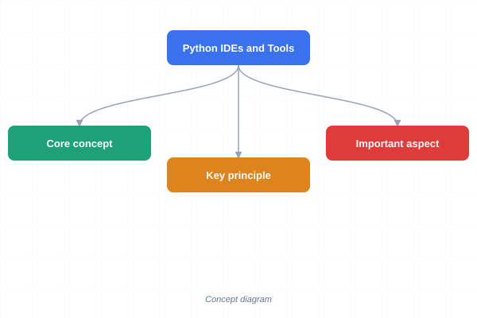
</a>
<a href="../../assets/images/diagrams/python-programming/01-introduction/python-ides-and-tools-sticky.svg" target="_blank" rel="noopener">
  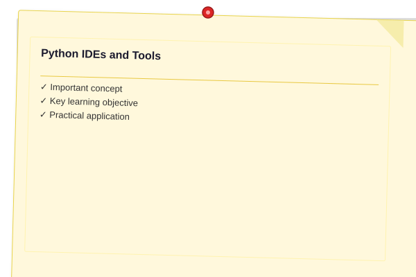
</a>


Choosing the right editor significantly impacts productivity:

| Tool | Type | Best For |
|------|------|----------|
| VS Code + Python extension | Editor | General Python development |
| PyCharm (Community/Professional) | Full IDE | Large projects, Django, data science |
| Jupyter Lab / Notebook | Interactive notebook | Data analysis, exploration, teaching |
| Thonny | Beginner IDE | Learning Python for the first time |
| IDLE | Built-in IDE | Quick tests, no installation needed |

```python
# Python's built-in debugger
import pdb

def buggy_function(x):
    result = []
    for i in range(x):
        pdb.set_trace()  # Execution pauses here for inspection
        result.append(i ** 2)
    return result
```

### Python Community and Resources

<a href="../../assets/images/diagrams/python-programming/01-introduction/python-community-and-resources-handwritten.svg" target="_blank" rel="noopener">
  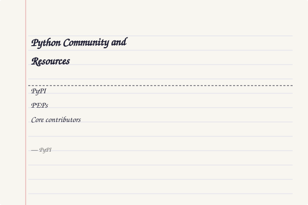
</a>
<a href="../../assets/images/diagrams/python-programming/01-introduction/python-community-and-resources-diagram.svg" target="_blank" rel="noopener">
  
</a>
<a href="../../assets/images/diagrams/python-programming/01-introduction/python-community-and-resources-sticky.svg" target="_blank" rel="noopener">
  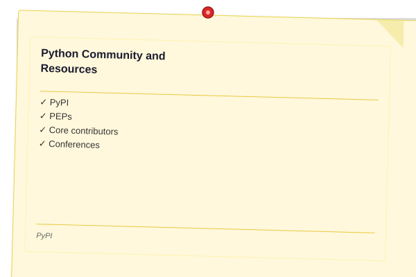
</a>


The Python ecosystem thrives on community contributions:

- **PyPI** (Python Package Index): Over 500,000 packages available via `pip install`
- **PSF** (Python Software Foundation): Non-profit that manages Python development
- **PEPs** (Python Enhancement Proposals): Design documents for language evolution
- **Core contributors**: Thousands of developers worldwide submit improvements
- **Conferences**: PyCon (global), EuroPython, PyData for data science

```python
# Find documentation for any module
import math
help(math)  # Displays full documentation

# List all attributes of a module
print([m for m in dir(math) if not m.startswith('_')])
# ['acos', 'acosh', 'asin', 'asinh', 'atan', ...]
```

### Python Version History

<a href="../../assets/images/diagrams/python-programming/01-introduction/python-version-history-handwritten.svg" target="_blank" rel="noopener">
  
</a>
<a href="../../assets/images/diagrams/python-programming/01-introduction/python-version-history-diagram.svg" target="_blank" rel="noopener">
  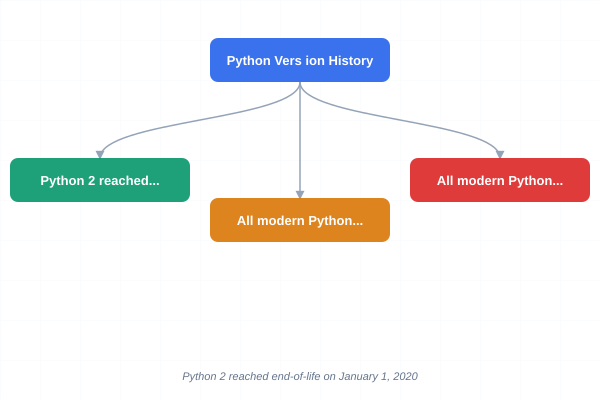
</a>
<a href="../../assets/images/diagrams/python-programming/01-introduction/python-version-history-sticky.svg" target="_blank" rel="noopener">
  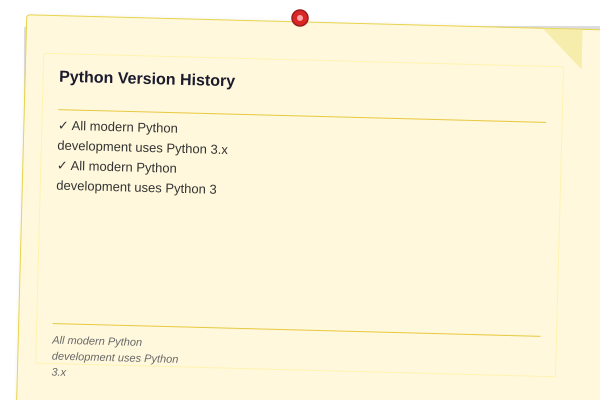
</a>


| Version | Release | Key Features |
|---------|---------|--------------|
| 2.7 | 2010 | Last of Python 2 line (EOL 2020) |
| 3.5 | 2015 | `async`/`await`, `typing`, `@` matrix mul |
| 3.6 | 2016 | f-strings, underscore in numeric literals |
| 3.7 | 2018 | `dataclasses`, `breakpoint()`, dict ordering |
| 3.8 | 2019 | Walrus operator `:=`, positional-only params |
| 3.9 | 2020 | `dict` merge `\|`, `str.removeprefix`, generic types |
| 3.10 | 2021 | Pattern matching `match/case`, `X \| Y` types |
| 3.11 | 2022 | Exception groups, `Self` type, faster runtime |
| 3.12 | 2023 | Type parameter syntax, `@override`, perf improvements |
| 3.13 | 2024 | Free-threaded CPython, JIT compiler, improved error messages |

Python 2 reached end-of-life on January 1, 2020. All modern Python development uses Python 3.x. The 3.10+ series introduced structural pattern matching (`match/case`), and 3.13 begins experimenting with a JIT compiler for performance improvements.

```bash
# Check Python version
python --version
# Python 3.13.1

# Check TypeScript version
tsc --version
# Version 5.7.0
```

```typescript
// TypeScript version info
const version: string = process.version;
console.log(`Node.js version: ${version}`);
// Node.js v22.0.0

// TypeScript: static typing example
function greet(name: string, age: number): string {
  return `Hello, ${name}! You are ${age} years old.`;
}
// Python equivalent: def greet(name, age): return f"Hello, {name}! ..."

// TypeScript: arrays and methods
const languages: string[] = ["Python", "TypeScript", "JavaScript"];
languages.push("Rust");
console.log(languages.length);  // 4

// TypeScript: BigInt for large integers (Python int is arbitrary precision)
const big: bigint = 2n ** 100n;
console.log(big.toString());

// TypeScript: module system
import { createServer } from "node:http";
const server = createServer((req, res) => {
  res.writeHead(200, { "Content-Type": "text/plain" });
  res.end("Hello from TypeScript!\n");
});
server.listen(3000);
```

### TypeScript Development Environment

```typescript
// package.json — project setup
{
  "name": "ts-project",
  "version": "1.0.0",
  "type": "module",
  "scripts": {
    "dev": "bun run --watch src/index.ts",
    "build": "tsc",
    "start": "node dist/index.js"
  },
  "devDependencies": {
    "typescript": "^5.7.0"
  }
}
```

```typescript
// tsconfig.json — TypeScript compiler configuration
{
  "compilerOptions": {
    "target": "ES2023",
    "module": "NodeNext",
    "moduleResolution": "NodeNext",
    "strict": true,
    "outDir": "./dist",
    "rootDir": "./src",
    "esModuleInterop": true,
    "forceConsistentCasingInFileNames": true,
    "skipLibCheck": true
  }
}
```

### Python → TypeScript Quick Reference

<a href="../../assets/images/diagrams/python-programming/01-introduction/python-typescript-quick-reference-handwritten.svg" target="_blank" rel="noopener">
  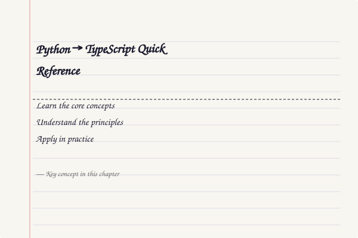
</a>
<a href="../../assets/images/diagrams/python-programming/01-introduction/python-typescript-quick-reference-diagram.svg" target="_blank" rel="noopener">
  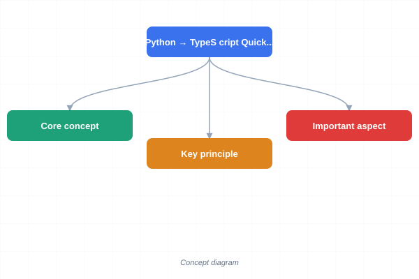
</a>
<a href="../../assets/images/diagrams/python-programming/01-introduction/python-typescript-quick-reference-sticky.svg" target="_blank" rel="noopener">
  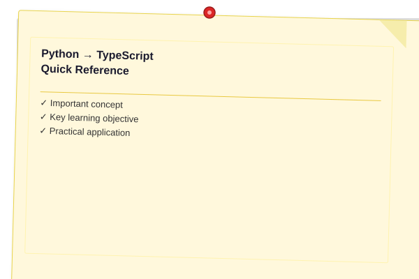
</a>


| Python Concept | TypeScript Equivalent | Key Difference |
|----------------|----------------------|----------------|
| `venv` / `conda` | `node_modules` / Bun workspaces | Python isolates interpreters; Node has global vs local packages |
| `pip install` | `npm install` / `bun add` | Same concept, different registries |
| `requirements.txt` | `package.json` | TS pins exact versions in lockfile |
| `python script.py` | `bun run script.ts` | TS compiles (or transpiles via Bun) before execution |
| REPL | `node` / `bun` shell | Both provide interactive read-eval-print loops |
| `PyPI` | `npm` registry | Both are public package registries |

### Python vs TypeScript: Hello World Comparison

<a href="../../assets/images/diagrams/python-programming/01-introduction/python-vs-typescript-hello-world-comparison-handwritten.svg" target="_blank" rel="noopener">
  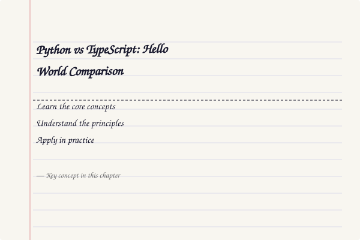
</a>
<a href="../../assets/images/diagrams/python-programming/01-introduction/python-vs-typescript-hello-world-comparison-diagram.svg" target="_blank" rel="noopener">
  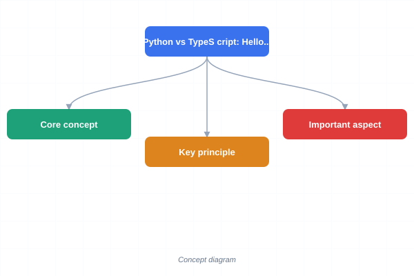
</a>
<a href="../../assets/images/diagrams/python-programming/01-introduction/python-vs-typescript-hello-world-comparison-sticky.svg" target="_blank" rel="noopener">
  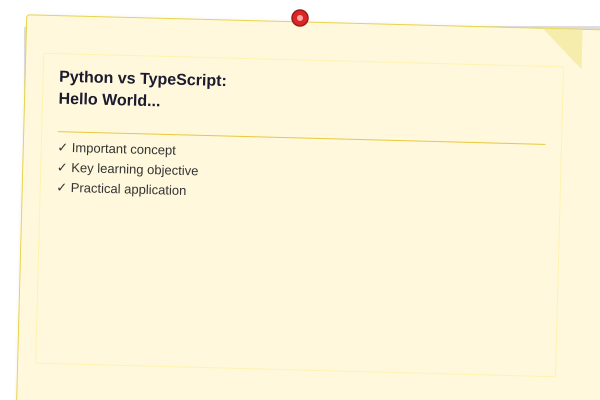
</a>


```typescript
// TypeScript Hello World with type safety
function hello(name: string): string {
  return `Hello, ${name}! Welcome to TypeScript.`;
}

// Python: def hello(name): return f"Hello, {name}! Welcome to Python."
console.log(hello("Developer"));

// TypeScript type checking catches errors at compile time
const greeting: string = hello("World");
// const age: number = greeting;  // TypeScript error: Type 'string' not assignable to 'number'
```

### Python vs TypeScript: Key Architectural Differences

<a href="../../assets/images/diagrams/python-programming/01-introduction/python-vs-typescript-key-architectural-differences-handwritten.svg" target="_blank" rel="noopener">
  
</a>
<a href="../../assets/images/diagrams/python-programming/01-introduction/python-vs-typescript-key-architectural-differences-diagram.svg" target="_blank" rel="noopener">
  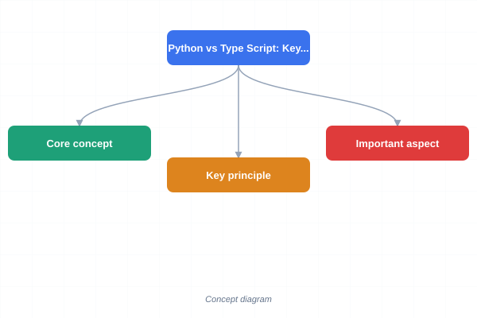
</a>
<a href="../../assets/images/diagrams/python-programming/01-introduction/python-vs-typescript-key-architectural-differences-sticky.svg" target="_blank" rel="noopener">
  
</a>


```typescript
// Execution model: Interpreted (Python) vs Compiled (TypeScript → JavaScript)
// Python: python script.py  (interpreted line by line)
// TypeScript: tsc → node dist/script.js  (compiled, then run)
// Bun: bun run script.ts  (transpiled and run JIT)

// Type safety: Dynamic (Python) vs Static (TypeScript)
// Python: x = 42; x = "hello"  (perfectly valid)
// TypeScript: let x: number = 42; x = "hello";  // Compile error

// Block structure: Indentation (Python) vs Braces (TypeScript)
// Python:
//   if True:
//       print("hello")
// TypeScript:
//   if (true) {
//     console.log("hello");
//   }

// TypeScript: Union types (not available in Python type hints)
type Result = { status: "success"; data: string } | { status: "error"; message: string };
function handleResult(r: Result): string {
  if (r.status === "success") return `Data: ${r.data}`;
  return `Error: ${r.message}`;
}
// Python: Union types via typing.Union but no discriminated union narrowing

// TypeScript: Generics (compile-time) vs Python generics (runtime hints)
function identity<T>(value: T): T { return value; }
const num = identity<number>(42);    // type: number
const str = identity<string>("hi");  // type: string

// TypeScript: Optional chaining (Python: no equivalent)
const user2: { address?: { city?: string } } = {};
const city2 = user2?.address?.city ?? "Unknown";
// Python: getattr(getattr(user, "address", None), "city", "Unknown") or try/except
```

### TypeScript Utilities

```typescript
// === Python vs TypeScript Syntax Equivalency Table ===
type SyntaxEntry = {
  python: string;
  typescript: string;
  notes: string;
};
const syntaxTable: SyntaxEntry[] = [
  { python: "print(x)", typescript: "console.log(x)", notes: "Console output" },
  { python: "def f(x):", typescript: "function f(x):", notes: "Function definition" },
  { python: "if x > 0:", typescript: "if (x > 0) {", notes: "Blocks use indentation vs braces" },
  { python: "x if cond else y", typescript: "cond ? x : y", notes: "Ternary order differs" },
  { python: "x is None", typescript: "x === null || x === undefined", notes: "None vs null/undefined" },
  { python: "len(lst)", typescript: "lst.length", notes: "Function vs property" },
  { python: "lst.append(x)", typescript: "lst.push(x)", notes: "Add to end" },
  { python: "not x", typescript: "!x", notes: "Logical negation" },
  { python: "x and y", typescript: "x && y", notes: "Logical AND" },
  { python: "x or y", typescript: "x || y", notes: "Logical OR" },
  { python: "range(n)", typescript: "[...Array(n).keys()]", notes: "Range generation" },
  { python: "for i, v in enumerate(lst):", typescript: "lst.forEach((v, i) => {})", notes: "Indexed iteration" },
  { python: "x in lst", typescript: "lst.includes(x)", notes: "Membership test" },
  { python: '"".join(lst)', typescript: "lst.join('')", notes: "Join strings" },
  { python: "import math", typescript: "import * as math from 'math'", notes: "Module import" },
  { python: "class A:", typescript: "class A {}", notes: "Class definition" },
  { python: "try/except", typescript: "try/catch", notes: "Exception handling" },
  { python: "with open(f) as fh:", typescript: "No direct equivalent", notes: "Context manager" },
];
function lookupSyntax(python: string): string {
  return syntaxTable.find((e) => e.python === python)?.typescript ?? "Not found";
}
console.log(lookupSyntax("print(x)"));

// === Environment Setup Checker ===
interface EnvRequirement {
  tool: string;
  command: string;
  required: boolean;
}
const envReqs: EnvRequirement[] = [
  { tool: "Python 3.10+", command: "python --version", required: true },
  { tool: "pip", command: "pip --version", required: true },
  { tool: "venv", command: "python -m venv --help", required: true },
  { tool: "Node.js 18+", command: "node --version", required: false },
  { tool: "TypeScript", command: "npx tsc --version", required: false },
];
function checkSetup(reqs: EnvRequirement[]): { ok: boolean; missing: string[] } {
  const missing = reqs.filter((r) => r.required).map((r) => r.tool);
  return { ok: missing.length === 0, missing };
}
console.log(checkSetup(envReqs));
```

## Summary

- Python is an interpreted, dynamically typed language emphasising readability.
- The REPL provides interactive experimentation.
- Indentation (four spaces) defines block structure.
- `venv` and `conda` provide environment isolation.
- `pip` manages third-party packages from PyPI.

## Exercises

### Review Questions

1. What does REPL stand for and what is its purpose?
2. Why does Python use indentation instead of braces?
3. What is the difference between `venv` and `conda`?
4. How do you check which packages are installed in the current environment?
5. What does `python -m http.server 8000` do?
6. How does Python's execution model differ from TypeScript's compilation model?
7. What is the purpose of the `__pycache__` directory?

### Application Problems

1. Install Python 3.10 or later. Create a virtual environment named `.venv` and activate it. Run `pip list` to show the baseline packages.
2. Write a script that prints your name, age, and favourite programming language. Execute it from the terminal.
3. Use the REPL to compute the factorial of 10 (hint: use `math.factorial` after importing `math`). Use the underscore variable to double the result.
4. Create a Python script that demonstrates three different comment styles (single-line, inline, and docstring). Run the script and use `help()` on a function to verify the docstring appears.
5. Write a TypeScript version of your Python script from problem 2. Compare the syntax differences -- how does TypeScript declare types? How does it print output?

### Challenge Problem

Write a script that creates a virtual environment, installs the `requests` and `pandas` packages, generates a `requirements.txt` file, then deactivates and removes the environment using `subprocess.run` or `os.system`. Verify each step with print statements.

### TypeScript Practical Applications

```typescript
// === Python ↔ TypeScript Syntax Equivalence Table ===
const equivTable = [
  { python: "print('hello')", ts: "console.log('hello')", note: "Console output" },
  { python: "len(list)", ts: "list.length", note: "Length property" },
  { python: "None", ts: "null", note: "Null value" },
  { python: "True / False", ts: "true / false", note: "Boolean literals" },
  { python: "def f(x):", ts: "function f(x: type): type", note: "Function definition with types" },
  { python: "if __name__ == '__main__':", ts: "if (require.main === module)", note: "Entry point" },
  { python: "str(42)", ts: "String(42)", note: "Convert to string" },
  { python: "# comment", ts: "// comment", note: "Single-line comment" },
  { python: "'''doc'''", ts: "/** doc */", note: "Documentation comment" },
  { python: "pass", ts: "{} // empty block", note: "No-op placeholder" },
  { python: "lambda x: x*2", ts: "(x: number) => x * 2", note: "Anonymous function" },
  { python: "range(5)", ts: "[...Array(5).keys()]", note: "Number range" },
  { python: "isinstance(x, int)", ts: "typeof x === 'number'", note: "Type check" },
  { python: "...", ts: "/* empty */", note: "Ellipsis / placeholder" },
  { python: "raise Exception()", ts: "throw new Error()", note: "Exception throwing" },
  { python: "try/except/finally", ts: "try/catch/finally", note: "Exception handling" },
  { python: "with open(f) as fh:", ts: "// Manual try/finally", note: "Resource management" },
  { python: "for x in iterable:", ts: "for (const x of iterable)", note: "Iteration" },
  { python: "a, b = b, a", ts: "[a, b] = [b, a]", note: "Swap via destructuring" },
  { python: "dict.keys()", ts: "Object.keys(dict)", note: "Key enumeration" },
  { python: "set.add(x)", ts: "set.add(x)", note: "Set insertion" },
  { python: "list.append(x)", ts: "array.push(x)", note: "List/array append" },
  { python: "list.pop()", ts: "array.pop()", note: "Pop last element" },
  { python: "sorted(list)", ts: "[...array].sort()", note: "Sorted copy" },
  { python: "reversed(list)", ts: "[...array].reverse()", note: "Reversed copy" },
  { python: "enumerate(list)", ts: "array.entries()", note: "Indexed iteration" },
  { python: "zip(a, b)", ts: "a.map((_, i) => [a[i], b[i]])", note: "Parallel iteration" },
  { python: "any(list)", ts: "array.some(Boolean)", note: "Any true" },
  { python: "all(list)", ts: "array.every(Boolean)", note: "All true" },
  { python: "sum(list)", ts: "array.reduce((a,b)=>a+b, 0)", note: "Summation" },
];
equivTable.forEach(e => console.log(`${e.python.padEnd(25)} → ${e.ts.padEnd(35)} # ${e.note}`));

// === Python Interop Pattern: Config Parser in Both ===
interface PythonConfig {
  version: string;
  dependencies: Record<string, string>;
  scripts: Record<string, string>;
}
function parsePythonCfg(raw: string): PythonConfig {
  const lines = raw.split("\n").filter(l => l.trim() && !l.startsWith("#"));
  const cfg: PythonConfig = { version: "", dependencies: {}, scripts: {} };
  let section = "";
  for (const line of lines) {
    if (line.startsWith("[")) { section = line.match(/\[(.+)\]/)![1]; continue; }
    const [k, ...v] = line.split("=").map(s => s.trim());
    const val = v.join("=");
    if (section === "metadata") cfg.version ??= val;
    else if (section === "dependencies") cfg.dependencies[k] = val;
    else if (section === "scripts") cfg.scripts[k] = val;
  }
  return cfg;
}
console.log(parsePythonCfg("[metadata]\nversion=1.0\n[dependencies]\nrequests=2.28\n[scripts]\ntest=pytest"));

// === Execution Time Benchmark ===
function bench(fn: () => void, label: string, iterations = 10000): number {
  const start = performance.now();
  for (let i = 0; i < iterations; i++) fn();
  return performance.now() - start;
}
const arr = Array.from({ length: 1000 }, (_, i) => i);
const listComp = bench(() => { const r: number[] = []; for (const x of arr) if (x % 2 === 0) r.push(x * 2); return r; }, "list comprehension");
const filterMap = bench(() => arr.filter(x => x % 2 === 0).map(x => x * 2), "filter+map");
console.log(`list comp: ${listComp.toFixed(2)}ms, filter+map: ${filterMap.toFixed(2)}ms`);
```

### TypeScript Data Structures & Algorithms Primer

```typescript
// === Stack (Python: list as stack) ===
class Stack<T> {
  private items: T[] = [];
  push(item: T): void { this.items.push(item); }
  pop(): T | undefined { return this.items.pop(); }
  peek(): T | undefined { return this.items[this.items.length - 1]; }
  get length(): number { return this.items.length; }
}
const stack = new Stack<number>();
stack.push(1); stack.push(2); stack.push(3);
console.log(stack.pop());  // 3
console.log(stack.peek()); // 2

// === Queue (Python: deque) ===
class Queue<T> {
  private items: T[] = [];
  enqueue(item: T): void { this.items.push(item); }
  dequeue(): T | undefined { return this.items.shift(); }
  get length(): number { return this.items.length; }
}

// === Linked List (Python: manual implementation) ===
class ListNode<T> { constructor(public value: T, public next: ListNode<T> | null = null) {} }
class LinkedList<T> {
  private head: ListNode<T> | null = null;
  append(value: T): void {
    if (!this.head) { this.head = new ListNode(value); return; }
    let current = this.head;
    while (current.next) current = current.next;
    current.next = new ListNode(value);
  }
  toArray(): T[] {
    const result: T[] = [];
    let current = this.head;
    while (current) { result.push(current.value); current = current.next; }
    return result;
  }
}

// === Binary Search Tree (Python: BST) ===
class BSTNode { constructor(public value: number, public left: BSTNode | null = null, public right: BSTNode | null = null) {} }
class BST {
  private root: BSTNode | null = null;
  insert(value: number): void {
    const newNode = new BSTNode(value);
    if (!this.root) { this.root = newNode; return; }
    let current = this.root;
    while (true) {
      if (value < current.value) {
        if (!current.left) { current.left = newNode; return; }
        current = current.left;
      } else {
        if (!current.right) { current.right = newNode; return; }
        current = current.right;
      }
    }
  }
  inOrder(): number[] {
    const result: number[] = [];
    function traverse(node: BSTNode | null): void {
      if (!node) return;
      traverse(node.left);
      result.push(node.value);
      traverse(node.right);
    }
    traverse(this.root);
    return result;
  }
  search(value: number): boolean {
    let current = this.root;
    while (current) {
      if (value === current.value) return true;
      current = value < current.value ? current.left : current.right;
    }
    return false;
  }
}

// === Graph (Python: adjacency list) ===
class Graph {
  private adj = new Map<string, string[]>();
  addVertex(v: string): void { if (!this.adj.has(v)) this.adj.set(v, []); }
  addEdge(v1: string, v2: string): void {
    this.adj.get(v1)?.push(v2);
    this.adj.get(v2)?.push(v1);
  }
  bfs(start: string): string[] {
    const visited = new Set<string>();
    const queue = [start];
    const result: string[] = [];
    while (queue.length > 0) {
      const v = queue.shift()!;
      if (visited.has(v)) continue;
      visited.add(v);
      result.push(v);
      for (const neighbor of this.adj.get(v) ?? []) {
        if (!visited.has(neighbor)) queue.push(neighbor);
      }
    }
    return result;
  }
  dfs(start: string): string[] {
    const visited = new Set<string>();
    const result: string[] = [];
    const dfs_rec = (v: string): void => {
      if (visited.has(v)) return;
      visited.add(v);
      result.push(v);
      for (const n of this.adj.get(v) ?? []) dfs_rec(n);
    };
    dfs_rec(start);
    return result;
  }
}

// === Hash Table (Python: dict) ===
class SimpleHashTable<K, V> {
  private buckets = new Map<number, [K, V][]>();
  private hash(key: K): number {
    const str = String(key);
    let hash = 0;
    for (let i = 0; i < str.length; i++) { hash = (hash << 5) - hash + str.charCodeAt(i); hash |= 0; }
    return Math.abs(hash);
  }
  set(key: K, value: V): void {
    const h = this.hash(key);
    if (!this.buckets.has(h)) this.buckets.set(h, []);
    const bucket = this.buckets.get(h)!;
    const existing = bucket.find(([k]) => k === key);
    if (existing) existing[1] = value;
    else bucket.push([key, value]);
  }
  get(key: K): V | undefined { return this.buckets.get(this.hash(key))?.find(([k]) => k === key)?.[1]; }
}

const bst = new BST();
[5, 3, 7, 2, 4, 6, 8].forEach(v => bst.insert(v));
console.log(bst.inOrder());  // [2, 3, 4, 5, 6, 7, 8]
console.log(bst.search(4));  // true
console.log(bst.search(9));  // false

const g = new Graph();
["A","B","C","D","E"].forEach(v => g.addVertex(v));
g.addEdge("A","B"); g.addEdge("A","C"); g.addEdge("B","D"); g.addEdge("C","E");
console.log(g.bfs("A")); // ["A","B","C","D","E"]
```

### TypeScript Challenge

Create both a Python script (`compare.py`) and a TypeScript script (`compare.ts`) that each:
1. Print the language name and version
2. Create a list/array of 5 items and print each with its index
3. Define a function that takes two numbers and returns their sum
4. Call the function with test values and print the result

Run both and note the differences in syntax, execution, and output.
