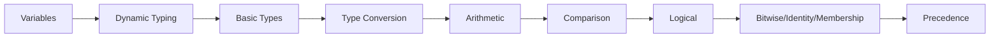

# Chapter 2: Variables, Types, and Operators


> **Previous:** [Introduction to Python](./01-introduction.md) | **Next:** [Control Flow](./03-control-flow.md)
## Learning Objectives

By the end of this chapter, students will be able to:
- Declare variables and understand dynamic typing
- Use all built-in atomic types correctly
- Convert between types explicitly
- Apply arithmetic, comparison, logical, assignment, bitwise, identity, and membership operators
- Predict operator precedence and associativity

<!-- Image Gallery -->
<section class="lesson-visuals" aria-label="Visual learning resources">
  <header><span>VISUAL LEARNING</span><h2>See it. Review it. Remember it.</h2></header>
  <a class="lesson-visual-card" href="../../../assets/images/lessons/python-programming/02-variables/handwritten-notes.svg" target="_blank" rel="noopener">
    
    <span><strong>Handwritten notes</strong>Condensed notes for deliberate review.</span>
  </a>
  <a class="lesson-visual-card" href="../../../assets/images/lessons/python-programming/02-variables/sticky-notes.svg" target="_blank" rel="noopener">
    
    <span><strong>Sticky-note revision</strong>Fast recall prompts for revision.</span>
  </a>
  <a class="lesson-visual-card" href="../../../assets/images/lessons/python-programming/02-variables/visual-explanation.svg" target="_blank" rel="noopener">
    
    <span><strong>Visual concept guide</strong>A connected explanation of the key ideas.</span>
  </a>
</section>
<!-- End Image Gallery -->


## Chapter at a Glance

| Section | Topic | Key Concept |
|---------|-------|-------------|
| 2.1 | Variables & Dynamic Typing | References, naming rules, assignment |
| 2.2 | Basic Types | int, float, str, bool, NoneType, complex |
| 2.3 | Type Conversion | Explicit conversion, implicit promotion |
| 2.4 | Operators | Arithmetic, comparison, logical, bitwise, identity, membership |
| 2.5 | Operator Precedence | PEMDAS-like hierarchy, parentheses |


## Chapter Roadmap



## 2.1 Variables and Dynamic Typing

> **One-Sentence Takeaway:** Python variables are references to objects, not typed containers -- the same name can hold different types.

A variable is a name that references an object in memory. Python variables are dynamically typed: the same name can refer to objects of different types over its lifetime.

```python
x = 42          # x is an int
print(type(x))  # <class 'int'>

x = "hello"     # x now references a str
print(type(x))  # <class 'str'>
```

Assignment creates a reference, not a copy. 
> **Pro Tip:** Variables are references, not containers. Two variables can point to the same object, and mutating through one affects the other.
Variables hold pointers to objects:

```python
a = [1, 2, 3]
b = a           # b references the same list
b.append(4)
print(a)        # [1, 2, 3, 4]
```

Variable names must begin with a letter or underscore, contain only alphanumeric characters and underscores, and are case-sensitive.

```python
valid = 1
_valid = 2
_ = 3          # conventional "throwaway" name
camelCase = 4  # unconventional in Python (PEP 8 prefers snake_case)
snake_case = 5 # preferred
```

### TypeScript Parallel: Static Typing

TypeScript uses static type annotations, so variables cannot change type once declared:

```typescript
// TypeScript: variables are type-checked at compile time
let x: number = 42;   // x can only hold numbers
// x = "hello";       // Error: Type 'string' is not assignable to type 'number'

// Inferred typing (TypeScript infers the type)
let y = "hello";      // inferred as string
// y = 42;            // Error: Type 'number' is not assignable to type 'string'

// Union types allow multiple types
let z: number | string = 42;
z = "hello";          // OK - z can be number or string
```

Python's dynamic typing offers flexibility but catches type errors only at runtime. TypeScript's static typing catches type mismatches during compilation, before the code ever runs.

```typescript
// Reference behavior is identical: both are references
const a: number[] = [1, 2, 3];
const b = a;           // b references the same array
b.push(4);
console.log(a);        // [1, 2, 3, 4]
```

```mermaid
flowchart TD
    subgraph Python[Dynamic Typing - Python]
        P1[Declare: x = 42] --> P2[Runtime: x is int]
        P2 --> P3[Reassign: x = \"hello\"]
        P3 --> P4[Runtime: x is str]
        P4 --> P5[x has no fixed type]
    end

    subgraph TS[Static Typing - TypeScript]
        T1[Declare: let x: number = 42] --> T2[Compile: type checked]
        T2 --> T3[Runtime: x is always number]
        T3 --> T4[Reassign: x = \"hello\"]
        T4 --> T5[Compile Error before running]
    end
```

## 2.2 Basic Types

> **One-Sentence Takeaway:** Python provides six atomic built-in types: int, float, str, bool, NoneType, and complex.

### 2.2.1 int


Integers have arbitrary precision:

```python
a = 42
b = 1_000_000       # underscores improve readability
c = 0xFF            # hexadecimal (255)
d = 0b1010          # binary (10)
e = 0o77            # octal (63)
f = 10 ** 100       # googol - huge integer
print(f)            # 100000000000000000000000000000000...
```

### TypeScript Parallel

```typescript
// TypeScript numbers: all are 64-bit IEEE 754 floats
let a: number = 42;
let b = 1_000_000;    // underscores for readability
let c = 0xFF;         // hexadecimal (255)
let d = 0b1010;       // binary (10)
let e = 0o77;         // octal (63)

// TypeScript does NOT have arbitrary precision numbers
// BigInt for large integers:
let f = 10n ** 100n;  // BigInt supports arbitrary precision
console.log(f.toString());

// Python's int can grow without limit
// TypeScript's number is capped at 2^53
```

Python's arbitrary-precision integers can grow to any size limited only by memory. TypeScript's `number` type is a 64-bit float (safe integer up to 2^53), with `BigInt` as an alternative for large integers.

### 2.2.2 float


Floating-point numbers are double-precision (64-bit IEEE 754):

```python
g = 3.14159
h = 1.5e-10         # scientific notation
i = float("inf")    # infinity
j = float("nan")    # Not a Number
print(0.1 + 0.2)    # 0.30000000000000004 (floating-point error)
```


> **Warning:** Never compare floats with ==. Use math.isclose(a, b) or round to a known precision.
Use `math.isclose()` for safe floating-point comparison:

```python
import math
print(math.isclose(0.1 + 0.2, 0.3))  # True
```

### TypeScript Parallel

```typescript
// TypeScript: same IEEE 754 doubles
let g: number = 3.14159;
let h = 1.5e-10;         // scientific notation
let i = Infinity;        // infinity
let j = NaN;             // Not a Number
console.log(0.1 + 0.2);  // 0.30000000000000004

// TypeScript: safe comparison
const epsilon = 0.000001;
const isClose = Math.abs((0.1 + 0.2) - 0.3) < epsilon;
console.log(isClose);     // true
```

### 2.2.3 str


Strings are immutable sequences of Unicode code points:

```python
name = "Alice"
greeting = 'Hello'          # single or double quotes
multi = """Line one
Line two"""
```

### TypeScript Parallel

```typescript
// TypeScript: strings are also immutable sequences
let name: string = "Alice";
let greeting = 'Hello';     // single or double quotes
let multi = `Line one
Line two`;                 // backticks for multi-line

// TypeScript has template literals (like f-strings):
let age = 30;
let message = `${name} is ${age} years old`;  // f-string equivalent
```

### 2.2.4 bool


Booleans are a subclass of int. `True == 1` and `False == 0`:

```python
is_valid = True
print(is_valid + 2)  # 3
```

Falsy values: `False`, `None`, `0`, `0.0`, `""`, `[]`, `{}`, `()`, `set()`. Everything else is truthy.

### TypeScript Parallel

```typescript
// TypeScript: booleans are NOT numbers
let isValid: boolean = true;
// console.log(isValid + 2);  // Error: Operator '+' cannot be applied

// Falsy values: false, null, undefined, 0, NaN, ""
// TypeScript has null AND undefined (Python has only None)
let val: any = null;
let notAssigned: undefined = undefined;
```

### 2.2.5 NoneType


`None` represents the absence of a value. It is Python's null:

```python
result = None
if result is None:
    print("No result yet")
```

### TypeScript Parallel

```typescript
// TypeScript: null and undefined
let result: null | undefined = null;
if (result === null) {
    console.log("No result yet");
}

// Python has only None
// TypeScript separates null (explicitly empty) from undefined (not yet assigned)
```

### 2.2.6 complex


Complex numbers with real and imaginary parts:

```python
c = 3 + 4j
print(c.real, c.imag)  # 3.0 4.0
print(abs(c))          # 5.0 (magnitude)
```

### TypeScript Parallel

```typescript
// TypeScript: no built-in complex type (must use library or custom class)
// Python has first-class complex numbers; TypeScript does not
```

### Type Comparison Summary


| Type | Python | TypeScript |
|------|--------|------------|
| Integer | `int` (arbitrary precision) | `number` (53-bit safe) or `bigint` |
| Float | `float` (double) | `number` (double) |
| String | `str` | `string` |
| Boolean | `bool` (subclass of int) | `boolean` |
| Null | `None` (one type) | `null`, `undefined` (two types) |
| Complex | `complex` (built-in) | No built-in |
| Infinity | `float("inf")` | `Infinity` |
| NaN | `float("nan")` | `NaN` |

## 2.3 Type Conversion

> **One-Sentence Takeaway:** Explicit conversion uses type constructors like int(); implicit conversion promotes int to float.

Explicit conversion uses the type name as a function:

```python
print(int(3.99))       # 3 (truncation)
print(float("3.14"))   # 3.14
print(str(42))         # "42"
print(bool(0))         # False
print(bool(""))        # False
print(bool("hello"))   # True
print(complex(1, 2))   # (1+2j)
```

Implicit conversion happens in mixed-type operations:

```python
result = 3 + 4.5       # 7.5 (int promoted to float)
```

Converting a string like `"hello"` to `int` raises `ValueError`:

```python
int("hello")  # ValueError: invalid literal for int() with base 10: 'hello'
```

### TypeScript Parallel

```typescript
// TypeScript: explicit conversion uses functions, not constructors
console.log(Math.floor(3.99));        // 3 (like int(3.99))
console.log(Number("3.14"));          // 3.14 (like float("3.14"))
console.log(String(42));              // "42" (like str(42))
console.log(Boolean(0));              // false (like bool(0))
console.log(Boolean("hello"));        // true (like bool("hello"))

// Implicit conversion: TypeScript does NOT auto-promote types
// let result = 3 + 4.5;   // Works (number)
// "3" + 4 = "34"          // String concatenation, NOT addition
// Python: ("3" + 4) => TypeError
// TypeScript: "3" + 4 => "34" (string concatenation wins)
```

## 2.4 Operators

> **One-Sentence Takeaway:** Python has seven operator categories: arithmetic, comparison, logical, assignment, bitwise, identity, membership.

### 2.4.1 Arithmetic Operators


```python
a, b = 10, 3
print(a + b)     # 13  addition
print(a - b)     # 7   subtraction
print(a * b)     # 30  multiplication
print(a / b)     # 3.333...  true division
print(a // b)    # 3   floor division
print(a % b)     # 1   modulus
print(a ** b)    # 1000  exponentiation
```

Floor division rounds toward negative infinity:

```python
print(-10 // 3)  # -4 (not -3)
print(10 // -3)  # -4
```

### TypeScript Parallel

```typescript
// TypeScript arithmetic
let a = 10, b = 3;
console.log(a + b);     // 13
console.log(a - b);     // 7
console.log(a * b);     // 30
console.log(a / b);     // 3.333...  true division
console.log(Math.floor(a / b));  // 3   floor division (manual)
console.log(a % b);     // 1   modulus
console.log(a ** b);    // 1000  exponentiation (ES2016+)

// NO separate // operator - use Math.floor instead
// Python: -10 // 3 = -4 (floor toward negative infinity)
// TypeScript: Math.floor(-10 / 3) = -4 (same result)

// TypeScript does NOT have Python's chained comparison
// Python: 3 < x < 7
// TypeScript: 3 < x && x < 7
```

### 2.4.2 Comparison Operators


```python
print(5 == 5)    # True   equal
print(5 != 4)    # True   not equal
print(5 > 3)     # True   greater than
print(5 < 3)     # False  less than
print(5 >= 5)    # True   greater or equal
print(5 <= 4)    # False  less or equal
```

Comparisons can be chained:

```python
x = 5
print(3 < x < 7)   # True  equivalent to (3 < x) and (x < 7)
print(3 < x > 10)  # False equivalent to (3 < x) and (x > 10)
```

### TypeScript Parallel

```typescript
// TypeScript: same comparison operators (no chaining)
console.log(5 === 5);   // true (strict equal - recommended)
console.log(5 == 5);    // true (loose equal - avoid)
console.log(5 !== 4);   // true (strict not equal)
console.log(5 > 3);     // true
console.log(5 < 3);     // false
console.log(5 >= 5);    // true
console.log(5 <= 4);    // false

// TypeScript uses === and !== instead of == and !=
// Python's == is strict by default; TypeScript needs === to avoid type coercion

// Chained comparison must use &&:
let x = 5;
console.log(3 < x && x < 7);  // true (Python: 3 < x < 7)
```

### 2.4.3 Logical Operators


```python
a, b = True, False
print(a and b)   # False
print(a or b)    # True
print(not a)     # False
```

`and` and `or` short-circuit -- they stop evaluating as soon as the result is determined:

```python
def expensive():
    print("called")
    return True

print(False and expensive())   # False (expensive() not called)
print(True or expensive())     # True  (expensive() not called)
```

`and` returns the first falsy operand or the last operand. `or` returns the first truthy operand or the last operand:

```python
print(0 and 42)   # 0
print(3 and 42)   # 42
print(0 or 42)    # 42
print(3 or 42)    # 3
```

### TypeScript Parallel

```typescript
// TypeScript: same logical operators (different keywords)
let a: boolean = true, b: boolean = false;
console.log(a && b);  // false
console.log(a || b);  // true
console.log(!a);      // false

// Short-circuit works identically
function expensive(): boolean {
    console.log("called");
    return true;
}
console.log(false && expensive());  // false (expensive() not called)
console.log(true || expensive());   // true  (expensive() not called)

// Truthy/falsy return values work the same:
console.log(0 && 42);   // 0
console.log(3 && 42);   // 42
console.log(0 || 42);   // 42
console.log(3 || 42);   // 3
```

### 2.4.4 Assignment Operators


```python
x = 10
x += 5    # x = x + 5
x -= 3    # x = x - 3
x *= 2    # x = x * 2
x /= 4    # x = x / 4
x //= 2   # x = x // 2
x %= 3    # x = x % 3
x **= 2   # x = x ** 2
x &= 7    # x = x & 7
x |= 3    # x = x | 3
x ^= 5    # x = x ^ 5
x <<= 1   # x = x << 1
x >>= 2   # x = x >> 2
```

The walrus operator `:=` (PEP 572, Python 3.8+) assigns and returns a value:

```python
if (n := len("hello")) > 4:
    print(f"Length {n} exceeds 4")
```

### TypeScript Parallel

```typescript
// TypeScript: same assignment operators
// Python and TypeScript share all arithmetic assignment operators
// TypeScript does NOT have a walrus operator equivalent
```

### 2.4.5 Bitwise Operators


```python
a, b = 0b1100, 0b1010       # 12, 10
print(bin(a & b))   # 0b1000 bitwise AND
print(bin(a | b))   # 0b1110 bitwise OR
print(bin(a ^ b))   # 0b0110 bitwise XOR
print(bin(~a))      # -0b1101 bitwise NOT (two's complement)
print(bin(a << 2))  # 0b110000 left shift
print(bin(a >> 2))  # 0b11 right shift
```

Bitwise operators are commonly used for flags and low-level protocols.

### TypeScript Parallel

```typescript
// TypeScript: identical bitwise operators
let a: number = 0b1100;  // 12
let b: number = 0b1010;  // 10
console.log((a & b).toString(2));   // 1000  AND
console.log((a | b).toString(2));   // 1110  OR
console.log((a ^ b).toString(2));   // 110   XOR
console.log((~a).toString(2));      // ...11110011 (32-bit)
console.log((a << 2).toString(2));  // 110000
console.log((a >> 2).toString(2));  // 11

// Python prints unsigned binary; TypeScript prints signed 32-bit
```

### 2.4.6 Identity Operators


`is` checks object identity (same memory address). `is not` is the negation:

```python
a = [1, 2, 3]
b = [1, 2, 3]
c = a

print(a == b)    # True  (same value)
print(a is b)    # False (different objects)
print(a is c)    # True  (same object)
```


> **Remember:** Always use `is` (not ==) for None checks -- it is faster and more idiomatic.
Use `is None` to check for `None`. Never use `== None`.

```python
x = None
print(x is None)     # True
print(x is not None)  # False
```

### TypeScript Parallel

```typescript
// TypeScript: === for value+type, Object.is() for identity
// No built-in identity operator like 'is'
// Use === for null/undefined checks
let x: any = null;
console.log(x === null);   // True

// For object identity comparison:
const a = [1, 2, 3];
const b = [1, 2, 3];
const c = a;
console.log(a === b);   // false (different objects)
console.log(a === c);   // true  (same object)
```

### 2.4.7 Membership Operators


`in` and `not in` test whether a value is in a container:

```python
print(3 in [1, 2, 3])       # True
print("e" in "hello")       # True
print("x" not in "hello")   # True
print(4 in {1, 2, 3})       # False
print("key" in {"key": 1})  # True (checks keys)
```

### TypeScript Parallel

```typescript
// TypeScript: includes() for arrays, includes() for strings, in for objects
console.log([1, 2, 3].includes(3));     // true  (Python: 3 in [1,2,3])
console.log("hello".includes("e"));     // true  (Python: "e" in "hello")
console.log(!("hello".includes("x")));  // true  (Python: "x" not in "hello")
console.log(!([1, 2, 3].includes(4)));  // true  (Python: 4 not in [1,2,3])
console.log("key" in { key: 1 });       // true  (Python: "key" in {"key": 1})
```

## 2.5 Operator Precedence

> **One-Sentence Takeaway:** Use parentheses to make precedence explicit -- not > and > or is the key ordering.

From highest to lowest precedence:

| Level | Operators |
|-------|-----------|
| 1 (highest) | `**` |
| 2 | `+x`, `-x`, `~x` (unary) |
| 3 | `*`, `/`, `//`, `%` |
| 4 | `+`, `-` |
| 5 | `<<`, `>>` |
| 6 | `&` |
| 7 | `^` |
| 8 | `|` |
| 9 | `==`, `!=`, `<`, `<=`, `>`, `>=`, `is`, `in` |
| 10 | `not` |
| 11 | `and` |
| 12 (lowest) | `or` |

When in doubt, use parentheses:

```python
result = (2 + 3) * 4   # 20, not 2 + 12 = 14
```

### TypeScript Parallel

TypeScript's operator precedence mirrors C-family languages and differs from Python:

```mermaid
flowchart LR
    subgraph Python[Python Precedence]
        direction LR
        PY[not > and > or]
    end
    subgraph TS[TypeScript Precedence]
        direction LR
        TY[! > && > ||]
    end

    PY --> Note[Same relative ordering]
    TY --> Note
```

## Concept Comparison Table

| Feature | Python | C/Java |
|---|---|---|
| Typing | Dynamic | Static |
| Declaration | Not required | Type + name required |
| Integer size | Arbitrary precision | Fixed (32/64 bit) |
| Float precision | Double-precision IEEE 754 | Same (IEEE 754) |
| Null value | `None` | null (Java), NULL (C) |


## Quick Reference

```python
# Variable assignment
x = 42
y = "hello"

# Type conversion
int("42")
float("3.14")
str(100)

# Common operators
x + y, x - y, x * y, x / y
x // y, x % y, x ** y
x == y, x != y
x and y, x or y, not x
x is y, x is not y
x in y, x not in y
```


## Cross-Application Matrix

| Area | Application | Relevant Section |
|------|-------------|------------------|
| Data Science | Float precision in calculations | 2.2.2 |
| Web APIs | Boolean flags in JSON | 2.2.4 |
| Systems | Bitwise flags for permissions | 2.4.5 |
| Security | is None in input validation | 2.4.6 |

## Practical Takeaways

| Concept | Key Point | Common Mistake |
|---------|-----------|----------------|
| Dynamic typing | Variables are references, not containers | Confusing reassignment with mutation |
| Float comparison | Use math.isclose() | Using == on floats |
| None check | Use `is None`, never `== None` | `x == None` |
| Boolean | bool is a subclass of int | Expecting True is not 1 in other langs |
| Short-circuit | and/or stop early | Side effects in second operand |
| Python vs TS | Dynamic vs static typing | Assuming TS allows type changes |

## Chapter Quiz

**Q1.** What is the output of type(42.0)?
- A) &lt;class int&gt;
- B) &lt;class float&gt; **<-- Correct**
- C) &lt;class double&gt;
- D) &lt;class number&gt;

**Q2.** Which operator checks object identity?
- A) ==
- B) =
- C) is **<-- Correct**
- D) equals()

**Q3.** What does bool([]) return?
- A) True
- B) False **<-- Correct**
- C) None
- D) TypeError

**Q4.** What is the result of `3 and 42` in Python?
- A) True
- B) False
- C) 3
- D) 42 **<-- Correct**

**Q5.** What does `0.1 + 0.2 == 0.3` evaluate to?
- A) True
- B) False **<-- Correct**
- C) TypeError
- D) 0.30000000000000004


```typescript
// Chapter 2: TypeScript Variable & Type Equivalents
// Python: x = 42; name = "Alice"; is_valid = True
const x: number = 42;
const name: string = "Alice";
const isValid: boolean = true;

// Python: dynamic typing lets variables change type
// TypeScript: static typing catches type mismatches at compile time
let value: number = 10;
// value = "hello";  // ❌ TypeScript error: Type 'string' not assignable to 'number'

// Python: type() vs TypeScript: typeof
console.log(typeof x);                 // "number"
console.log(typeof name);              // "string"

// Python: isinstance(x, int) → TypeScript: typeof / instanceof
console.log(typeof x === "number");    // true

// Python: None vs TypeScript: null / undefined
let maybe: string | null = null;      // union type with null
let unset: string | undefined;         // undefined by default

// Python: type hints (not enforced at runtime)
function add(a: number, b: number): number {
  return a + b;  // TypeScript enforces types at compile time
}

// Python: f-strings vs TypeScript: template literals
const age: number = 30;
console.log(`Name: ${name}, Age: ${age}`);
// Equivalent Python: print(f"Name: {name}, Age: {age}")

// Python: chained comparisons are not available in TypeScript
// Python: 1 < x < 10  →  TypeScript: x > 1 && x < 10
const checkRange = (x: number): boolean => x > 1 && x < 10;

// Python: walrus operator (:=) has no TypeScript equivalent
// Python: if (n := len(x)) > 0:  →  TypeScript: const n = x.length; if (n > 0)
```

### TypeScript Utilities

```typescript
// === Type Inference Helper ===
function inferType(v: unknown): string {
  if (v === null) return "null";
  if (v === undefined) return "undefined";
  if (typeof v === "number") return Number.isInteger(v) ? "integer" : "float";
  if (typeof v === "string") return "string";
  if (typeof v === "boolean") return "boolean";
  if (Array.isArray(v)) {
    const types = [...new Set(v.map((e) => typeof e))];
    return `${types.join(" | ")}[]`;
  }
  return typeof v;
}
console.log(inferType(42), inferType("hi"), inferType([1, "a"]));

// === Const / Let / Var Analyzer ===
type DeclKind = "const" | "let" | "var";
interface DeclInfo { kind: DeclKind; name: string; type: string; mut: boolean; scoped: boolean }
function analyzeDecl(kind: DeclKind, name: string, value: unknown, mut: boolean): DeclInfo {
  return { kind, name, type: inferType(value), mut, scoped: kind !== "var" };
}
console.log(analyzeDecl("const", "PI", 3.14, false));
console.log(analyzeDecl("let", "count", 0, true));

// === Union Type Builder ===
type StringOrNum = string | number;
function format(v: StringOrNum): string {
  if (typeof v === "string") return `str:${v.length}`;
  return `num:${v.toFixed(2)}`;
}
console.log(format("hello"), format(42));

// === Intersection Type vs Python Multiple Inheritance ===
interface Named { name: string }
interface Aged { age: number }
type Person = Named & Aged;
const p: Person = { name: "Alice", age: 30 };

// === Literal Union vs Python Enum ===
type Color = "red" | "green" | "blue";
function swatch(c: Color): string { return `Color: ${c}`; }

// === Readonly vs Frozen Dataclass ===
type Config = Readonly<{ host: string; port: number }>;
const cfg: Config = { host: "localhost", port: 8080 };

// === Pick / Omit Helpers ===
interface User { id: number; name: string; email: string; role: string }
type PublicUser = Pick<User, "id" | "name">;
type Sensitive = Omit<User, "email">;
const pub: PublicUser = { id: 1, name: "Alice" };
```

### TypeScript Type System Patterns

```typescript
// === Type Inference vs. Python Dynamic Typing ===
let inferred = 42;         // TypeScript infers number
let annotated: string = "hello"; // Explicit annotation
// Python: x = 42; x = "hello" (reassignment changes type)
// TypeScript: inferred = "world" // Error: Type 'string' not assignable to 'number'

// === Union Types (Python: Union[str, int]) ===
type ID = string | number;
function lookup(id: ID): string {
  if (typeof id === "string") return `User: ${id}`;
  return `User #${id}`;
}
console.log(lookup("abc")); // User: abc
console.log(lookup(42));    // User #42

// === Literal Types ===
type Status = "active" | "inactive" | "pending";
function setUserStatus(status: Status): void {
  console.log(`Status set to: ${status}`);
}
setUserStatus("active"); // OK
// setUserStatus("disabled"); // TypeScript error

// === Type Aliases (Python: TypeAlias) ===
type Point = { x: number; y: number };
type Color = "red" | "green" | "blue";
type ColoredPoint = Point & { color: Color };
const cp: ColoredPoint = { x: 10, y: 20, color: "red" };

// === Readonly (Python: Final from typing) ===
interface Config { readonly apiKey: string; readonly endpoint: string; }
const config: Config = { apiKey: "sk-123", endpoint: "https://api.example.com" };
// config.apiKey = "new-key"; // Error: Cannot assign to readonly

// === Optional Properties (Python: Optional) ===
interface UserProfile { name: string; age?: number; email?: string; }
function greet(user: UserProfile): string {
  const age = user.age ?? "unknown";
  return `${user.name} (${age})`;
}
console.log(greet({ name: "Alice", age: 30 }));
console.log(greet({ name: "Bob" }));

// === Type Assertions ===
const rawValue: unknown = "hello world";
const strLength = (rawValue as string).length;
console.log(strLength); // 11

// === Enums (Python: Enum) ===
enum Direction { Up = "UP", Down = "DOWN", Left = "LEFT", Right = "RIGHT" }
function move(d: Direction): string { return `Moving ${d}`; }
console.log(move(Direction.Up));

// === Generics (Python: TypeVar) ===
function first<T>(arr: T[]): T | undefined { return arr[0]; }
console.log(first([1, 2, 3])); // 1
console.log(first(["a", "b"])); // "a"

// === Keyof and Indexed Access ===
function getProp<T, K extends keyof T>(obj: T, key: K): T[K] { return obj[key]; }
const car = { make: "Tesla", model: "Model 3", year: 2024 };
console.log(getProp(car, "make")); // Tesla
// getProp(car, "color"); // TypeScript error

// === Mapped Types ===
type Readonly2<T> = { readonly [K in keyof T]: T[K] };
type Partial2<T> = { [K in keyof T]?: T[K] };
type Point2 = { x: number; y: number };
const readonlyPoint: Readonly2<Point2> = { x: 10, y: 20 };
// readonlyPoint.x = 5; // Error
```

### TypeScript Advanced Variable Types

```typescript
// === Mapped Types (Python: type transformation) ===
type Nullable<T> = { [K in keyof T]: T[K] | null };
type ReadonlyDeep<T> = {
  readonly [K in keyof T]: T[K] extends object ? ReadonlyDeep<T[K]> : T[K];
};
type PickByValue<T, V> = { [K in keyof T as T[K] extends V ? K : never]: T[K] };
type OmitByValue<T, V> = { [K in keyof T as T[K] extends V ? never : K]: T[K] };
type RequiredBy<T, K extends keyof T> = Omit<T, K> & { [P in K]-?: T[P] };

// === Template Literal Types (Python: f-strings at type level) ===
type EventName = `on${Capitalize<string>}`;
type CSSUnit = `${number}px` | `${number}rem` | `${number}em` | `${number}%`;
type HexColor = `#${string}`;
type HttpMethod = "GET" | "POST" | "PUT" | "DELETE" | "PATCH";
type ApiEndpoint = `/api/${string}`;

// === Conditional Types (Python: type narrowing) ===
type IsString<T> = T extends string ? "yes" : "no";
type ElementOf<T> = T extends (infer E)[] ? E : T;
type FunctionResult<T> = T extends (...args: any[]) => infer R ? R : never;

// === Variadic Tuple Types (Python: *args typed) ===
type Head<T extends unknown[]> = T extends [infer H, ...unknown[]] ? H : never;
type Tail<T extends unknown[]> = T extends [unknown, ...infer Rest] ? Rest : never;
type Last<T extends unknown[]> = T extends [...unknown[], infer L] ? L : never;
type Concat<A extends unknown[], B extends unknown[]> = [...A, ...B];

// === Union Distribution (Python: type switching) ===
type ToArray<T> = T extends unknown ? T[] : never;
type Stringify<T> = T extends string ? T : T extends number ? `${T}` : never;

// === Structural Type Testing ===
interface TypeTest { a: string; b: number; }
type ExtraKeys = { a: string; b: number; c: boolean };
type MissingKeys = { a: string };
type IsSubtype<S, T> = S extends T ? true : false;
type Test1 = IsSubtype<ExtraKeys, TypeTest>; // true (extra keys allowed)
type Test2 = IsSubtype<MissingKeys, TypeTest>; // false

// === Recursive Type (Python: self-referential) ===
type JSONValue = string | number | boolean | null | JSONValue[] | { [key: string]: JSONValue };
type DeepPartial<T> = { [K in keyof T]?: T[K] extends object ? DeepPartial<T[K]> : T[K] };
type DeepRequired<T> = { [K in keyof T]-?: T[K] extends object ? DeepRequired<T[K]> : T[K] };

// === Branded Types for Type Safety ===
type Branded<T, B> = T & { __brand: B };
type Email = Branded<string, "Email">;
type Phone = Branded<string, "Phone">;
function sendEmail(to: Email, body: string): void { console.log(`Email to ${String(to)}: ${body}`); }
function createEmail(s: string): Email { return s as Email; }
const email = createEmail("user@example.com");
sendEmail(email, "Hello"); // OK

// === Type-safe Builder Pattern ===
class ConfigBuilder {
  private config: Record<string, unknown> = {};
  set<T>(key: string, value: T): this & Record<typeof key, T> { (this.config as any)[key] = value; return this as any; }
  build(): Record<string, unknown> { return { ...this.config }; }
}
const builder = new ConfigBuilder();
const cfg = builder.set("host", "localhost").set("port", 8080).build();
```

## Summary

- Python is dynamically typed; variables are references to objects.
- Core types: `int`, `float`, `str`, `bool`, `NoneType`, `complex`.
- Explicit conversion uses type constructors; implicit conversion promotes int to float.
- Operators span arithmetic, comparison, logical, assignment, bitwise, identity, and membership.
- `and`/`or` short-circuit; `is` checks identity; `in` checks membership.
- Chained comparisons are a unique Python feature.
- The walrus operator `:=` assigns within expressions.
- TypeScript uses static typing with type annotations, catching errors at compile time.
- TypeScript separates null and undefined where Python only has None.

## Exercises

### Review Questions

1. What is the difference between `==` and `is`?
2. Why does `0.1 + 0.2` not equal `0.3` exactly?
3. What values are considered falsy in Python?
4. Explain short-circuit evaluation with an example.
5. What operator precedence rule causes `2 ** 3 ** 2` to compute 512 rather than 64?
6. How does Python's dynamic typing compare to TypeScript's static typing?
7. Why does TypeScript use `===` instead of `==`?

### Application Problems

1. Write a program that takes an integer input, then prints whether it is even or odd, positive or negative, and its absolute value.
2. Implement a BMI calculator: weight (kg) / height (m)^2. Use appropriate types and print a health category message.
3. Given `a = 0b1010` and `b = 0b1100`, write a program that prints the AND, OR, XOR, and left-shift results in binary.
4. Write a function that takes a string and returns whether it contains the letter "a". Use the `in` operator. Write the equivalent TypeScript version using `.includes()`.
5. Create a script that demonstrates the walrus operator by reading lines from a list and printing only those longer than 10 characters.

### Challenge Problem

Implement a simple simulated-annealing flag decoder: define a set of bit flags (READ=1, WRITE=2, EXECUTE=4, DELETE=8). Accept an integer permission mask and print which flags are set. Then accept a flag name and toggle it in the mask using bitwise XOR. Use the walrus operator in at least one expression.

### TypeScript Challenge

Rewrite the BMI calculator from Application Problem 2 in TypeScript. Add explicit type annotations for all variables. Compare the Python and TypeScript versions -- how does type safety help catch errors? Create a function signature with types for both the input parameters and return value.
