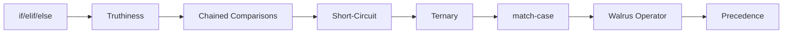

# Chapter 3: Control Flow


> **Previous:** [Variables, Types, and Operators](./02-variables.md) | **Next:** [Loops and Iteration](./04-loops.md)
## Learning Objectives

By the end of this chapter, students will be able to:
- Write branching logic using if, elif, and else
- Use the match-case statement for structural pattern matching
- Chain comparisons for concise range checks
- Understand short-circuit evaluation
- Apply the ternary conditional expression


## Chapter at a Glance

| Section | Topic | Key Concept |
|---------|-------|-------------|
| 3.1 | if Statement | Branching with if/elif/else |
| 3.2 | Truthiness | Truthy/falsy values in conditions |
| 3.3 | Chained Comparisons | 1 < x < 10 syntax |
| 3.4 | Short-Circuit | and/or lazy evaluation |
| 3.5 | Ternary Expression | x if cond else y |
| 3.6 | match-case | Structural pattern matching (3.10+) |
| 3.7 | Conditional Assignment | Walrus operator := |
| 3.8 | Boolean Precedence | not > and > or |


## Chapter Roadmap



## 3.1 The if Statement

> **One-Sentence Takeaway:** if/elif/else chains replace the switch statement found in other languages.

The `if` statement executes a block when a condition is truthy:

```python
temperature = 30
if temperature > 25:
    print("It is hot today")
```


> **Remember:** Every if can stand alone -- elif and else are optional. An if with no else simply does nothing when false.
Add an `else` clause for the complementary case:

```python
temperature = 10
if temperature > 25:
    print("It is hot today")
else:
    print("It is cool today")
```

Chain multiple conditions with `elif`:

```python
temperature = 15
if temperature > 35:
    print("Extreme heat")
elif temperature > 25:
    print("Warm")
elif temperature > 15:
    print("Mild")
elif temperature > 5:
    print("Cool")
else:
    print("Cold")
```

Unlike some languages, Python has no `switch` statement (prior to 3.10). The `elif` chain serves the same purpose, and the `match-case` statement provides a more powerful alternative in Python 3.10+.


> **Pro Tip:** Mixing tabs and spaces causes IndentationError. Configure your editor to convert tabs to spaces for Python files.
Indentation is the only delimiter -- there is no `endif` or closing brace. The colon after each condition is mandatory:

```python
if x:     # colon required
    ...   # indented block

# Correct:
if x > 0:
    pass
else:
    pass
```

### TypeScript Parallel

```typescript
// TypeScript: if/else if/else with curly braces
let temperature: number = 30;
if (temperature > 35) {
    console.log("Extreme heat");
} else if (temperature > 25) {
    console.log("Warm");
} else if (temperature > 15) {
    console.log("Mild");
} else if (temperature > 5) {
    console.log("Cool");
} else {
    console.log("Cold");
}

// TypeScript switch statement (Python's if/elif/else is closer to this)
switch (temperature) {
    case 0:
        console.log("Freezing");
        break;
    case 100:
        console.log("Boiling");
        break;
    default:
        console.log("Neither");
        break;
}
```

Python uses `elif`; TypeScript uses `else if`. Python has no `switch`-statement (until 3.10's match-case); TypeScript has a C-style `switch`.

```mermaid
flowchart TD
    subgraph Python[Python if/elif/else]
        A1[if condition] -->|True| B1[if block]
        A1 -->|False| C1[elif condition]
        C1 -->|True| D1[elif block]
        C1 -->|False| E1[elif ...]
        E1 -->|None True| F1[else block]
    end

    subgraph TS[TypeScript if/else if/else + switch]
        A2[if (condition)] -->|True| B2[if body]
        A2 -->|False| C2[else if]
        C2 -->|True| D2[else if body]
        C2 -->|False| E2[else => default]
        F2[switch (value)] --> G2[case matching]
        G2 --> H2[break / default]
    end
```

## 3.2 Truthiness and Condition Evaluation

> **One-Sentence Takeaway:** Any value works as a condition -- empty collections, zero, and None are falsy; everything else is truthy.

Conditions do not need to be boolean. Any expression can serve as a condition:

```python
name = input("Enter your name: ")
if name:                 # truthy if non-empty string
    print(f"Hello, {name}")
else:
    print("No name entered")
```

Common truthiness pitfalls:

```python
# Checking if a list is empty
items = []
if items:           # Pythonic -- no len(items) > 0
    print(items[0])
else:
    print("Empty")

# None check
result = None
if result is not None:   # correct
    print(result)

if result:               # wrong if result could be 0 or False
    print(result)
```

### TypeScript Parallel

```typescript
// TypeScript: same truthiness concept
let name: string = "";  // empty string
if (name) {             // false for empty string
    console.log(`Hello, ${name}`);
} else {
    console.log("No name entered");
}

// Falsy values: false, 0, NaN, "", null, undefined
// Python falsy: False, 0, 0.0, "", [], {}, (), set(), None

// TypeScript has extra falsy values: NaN, undefined
let notANumber: number = NaN;
if (notANumber) {
    // This block NEVER runs - NaN is falsy in TypeScript
}
```

| Language | Falsy Values |
|----------|-------------|
| Python | `False`, `None`, `0`, `0.0`, `""`, `[]`, `{}`, `()`, `set()` |
| TypeScript | `false`, `null`, `undefined`, `0`, `NaN`, `""` |
| Extra in TS | `undefined`, `NaN` |
| Extra in Python | `[]`, `{}`, `()`, `set()` (all empty containers) |

## 3.3 Chained Comparisons

> **One-Sentence Takeaway:** Python's `1 < x < 10` syntax is more readable and efficient than `1 < x and x < 10`.

Python supports chained comparisons naturally:

```python
x = 5
print(1 < x < 10)         # True  (1 < x and x < 10)
print(1 < x < 5)          # False (1 < x and x < 5)
print(5 == x > 3)         # True  (5 == x and x > 3)
print(10 > x > 2)         # True
```

Chained comparisons evaluate each operand only once and short-circuit:

```python
def get_value():
    print("get_value called")
    return 5

print(1 < get_value() < 10)  # get_value called once
```

This is more readable and efficient than the equivalent `1 < x and x < 10`.

### TypeScript Parallel

```typescript
// TypeScript: chained comparison NOT supported
// Must use && explicitly
let x: number = 5;
console.log(1 < x && x < 10);   // true  (Python: 1 < x < 10)
console.log(1 < x && x < 5);    // false (Python: 1 < x < 5)

// Python evaluates the middle operand ONCE
// TypeScript evaluates x TWICE -- not identical behavior
function getValue(): number {
    console.log("getValue called");
    return 5;
}
console.log(1 < getValue() && getValue() < 10);  // getValue called TWICE!
```

Python's chained comparison is a unique feature. TypeScript (and most C-family languages) require explicit `&&` and evaluate the middle operand twice.

## 3.4 Short-Circuit Evaluation

> **One-Sentence Takeaway:** and stops at the first falsy operand; or stops at the first truthy operand.

The logical operators `and` and `or` stop evaluating as soon as the result is determined:

```python
def divide(a, b):
    return b != 0 and a / b   # returns False if b is 0, else the quotient

print(divide(10, 2))   # 5.0
print(divide(10, 0))   # False (no ZeroDivisionError)
```

`or` can provide default values:

```python
name = input("Name: ") or "Guest"
print(f"Hello, {name}")
```

If the input is empty, `""` is falsy, so `or` returns `"Guest"`.

This pattern is less common since the walrus operator and `None`-aware idioms gained popularity, but it remains concise for simple defaults.

### TypeScript Parallel

```typescript
// TypeScript: same short-circuit behavior
function divide(a: number, b: number): number | boolean {
    return b !== 0 && a / b;   // returns false if b is 0
}

console.log(divide(10, 2));    // 5
console.log(divide(10, 0));    // false (no error)

// Default value (same pattern as Python)
const input = "";  // user input (empty)
const name = input || "Guest";
console.log(`Hello, ${name}`);  // Hello, Guest

// TypeScript also has nullish coalescing:
const displayName = input ?? "Guest";
// ?? only checks null/undefined, not empty string
```

## 3.5 Ternary Conditional Expression

> **One-Sentence Takeaway:** x if cond else y is an expression, not a statement, so it can be used inside other expressions.

Python's conditional expression (ternary operator) takes the form:

```python
value_if_true if condition else value_if_false
```

```python
age = 20
status = "Adult" if age >= 18 else "Minor"
print(status)   # Adult
```

Ternary expressions are expressions, not statements -- they can be used inside other expressions:

```python
print("Even" if 5 % 2 == 0 else "Odd")   # Odd

# Nesting (discouraged for readability)
result = "A" if score >= 90 else "B" if score >= 80 else "C" if score >= 70 else "F"
```


> **Warning:** Nested ternaries are hard to read. Limit to one level; use if-elif-else blocks for anything more complex.
Avoid deep nesting. For complex logic, use a full `if-elif-else` block.

### TypeScript Parallel

```typescript
// TypeScript: C-style ternary operator
let age: number = 20;
let status: string = age >= 18 ? "Adult" : "Minor";
console.log(status);   // Adult

// Python:    value_if_true if condition else value_if_false
// TypeScript: condition ? value_if_true : value_if_false

// Can be used in expressions:
console.log(5 % 2 === 0 ? "Even" : "Odd");   // Odd

// Nesting (also discouraged):
let score: number = 85;
let result: string = score >= 90 ? "A" : score >= 80 ? "B" : score >= 70 ? "C" : "F";
```

| Feature | Python | TypeScript |
|---------|--------|------------|
| Syntax | `x if cond else y` | `cond ? x : y` |
| Expression type | Expression (usable inline) | Expression (usable inline) |
| Readability | Reads naturally as English | Compact |

## 3.6 match-case (Structural Pattern Matching)

> **One-Sentence Takeaway:** match-case supports literals, captures, guards, sequences, mappings, and class patterns.

Introduced in Python 3.10, `match-case` provides powerful pattern matching inspired by Scala, Rust, and Haskell:

### 3.6.1 Literal Patterns

```python
def describe_status(code: int) -> str:
    match code:
        case 200:
            return "OK"
        case 404:
            return "Not Found"
        case 500:
            return "Internal Server Error"
        case _:              # wildcard (default)
            return "Unknown"

print(describe_status(404))  # Not Found
```

### 3.6.2 Capture and Guard Patterns

```python
def classify_point(point):
    match point:
        case (0, 0):
            return "Origin"
        case (0, y):
            return f"On Y axis at y={y}"
        case (x, 0):
            return f"On X axis at x={x}"
        case (x, y) if x == y:
            return f"On diagonal at ({x}, {y})"
        case (x, y):
            return f"At ({x}, {y})"
        case _:
            return "Not a 2D point"

print(classify_point((0, 5)))  # On Y axis at y=5
print(classify_point((3, 3)))  # On diagonal at (3, 3)
```

### 3.6.3 Sequence and Mapping Patterns

```python
def handle_command(command):
    match command.split():
        case ["quit"]:
            print("Exiting...")
        case ["look", direction]:
            print(f"Looking {direction}")
        case ["go", ("north" | "south" | "east" | "west") as dir]:
            print(f"Going {dir}")
        case ["take", *items]:
            print(f"Taking {items}")
        case _:
            print("Unknown command")

handle_command("go north")      # Going north
handle_command("take sword potion")  # Taking ['sword', 'potion']
```

### 3.6.4 Class Patterns

```python
from dataclasses import dataclass

@dataclass
class Person:
    name: str
    age: int

def greet(person):
    match person:
        case Person(name="Alice", age=a) if a > 30:
            print(f"Hi Alice, you're {a}")
        case Person(name=n, age=a) if a < 18:
            print(f"Hello {n}, young one")
        case Person(name=n):
            print(f"Hey {n}")
        case _:
            print("Not a person")

greet(Person("Alice", 35))   # Hi Alice, you're 35
greet(Person("Bob", 15))     # Hello Bob, young one
```

Match-case is exhaustive -- if no pattern matches and no wildcard `_` is provided, no exception is raised (the match simply does nothing). Use wildcards to avoid silent failures.

### TypeScript Parallel

```typescript
// TypeScript: switch statement is the closest equivalent
// (less powerful than Python's match-case)

function describeStatus(code: number): string {
    switch (code) {
        case 200: return "OK";
        case 404: return "Not Found";
        case 500: return "Internal Server Error";
        default:  return "Unknown";
    }
}

console.log(describeStatus(404));  // Not Found

// TypeScript does NOT have destructuring patterns in switch
// No guards in case clauses
// No sequence/mapping/class patterns
```

## 3.7 Conditional Expressions and Assignment

> **One-Sentence Takeaway:** The walrus operator := assigns and returns a value in a single expression.

The walrus operator `:=` can streamline conditional assignments:

```python
# Without walrus:
data = fetch_data()
if data is None:
    data = []

# With walrus:
if (data := fetch_data()) is None:
    data = []
```

```python
# In comprehensions
results = [y for x in range(10) if (y := x ** 2) > 20]
print(results)  # [25, 36, 49, 64, 81]
```

### TypeScript Parallel

```typescript
// TypeScript: NO walrus operator equivalent
// Must separate assignment from condition

function fetchData(): string[] | null {
    return null;
}

// TypeScript requires two statements:
let data = fetchData();
if (data === null) {
    data = [];
}

// No inline assignment in conditions
// Python: if (n := len(items)) > 0: ...
// TypeScript: const n = items.length; if (n > 0) { ... }
```

## 3.8 Boolean Operator Precedence in Conditions

> **One-Sentence Takeaway:** not has highest precedence, then and, then or -- parenthesise when mixing them.

Understanding precedence is critical for complex conditions:

```python
# Equivalent to (a and b) or c  -- and has higher precedence
if a and b or c:
    pass

# Explicit grouping
if (a and b) or c:
    pass

if a and (b or c):
    pass
```

When mixing `and` and `or`, parenthesise for clarity:

```python
valid = (age >= 18) and (has_id or is_vip)
```

### TypeScript Parallel

```typescript
// TypeScript: same precedence ordering: ! > && > ||
// Python: not > and > or
// TypeScript: ! > && > ||

let valid: boolean = (age >= 18) && (hasId || isVip);
```

## Concept Comparison Table

| Feature | Python | C/Java | JavaScript |
|---|---|---|---|
| Branching | if/elif/else | if/else if/else | if/else if/else |
| Switch | match-case (3.10+) | switch/case | switch/case |
| Ternary | x if cond else y | cond ? x : y | cond ? x : y |
| Logical | and, or, not | &&, ||, ! | &&, ||, ! |
| Chained compare | 1 < x < 10 | Not supported | Not supported |


## Quick Reference

```python
# if-elif-else
if condition:
    pass
elif other:
    pass
else:
    pass

# Ternary
value = x if condition else y

# match-case (3.10+)
match value:
    case 1: print("one")
    case _: print("other")

# Chained comparison
if 0 < x < 100:
    print("in range")

# Walrus
if (n := len(items)) > 0:
    print(f"Count: {n}")
```

## Practical Takeaways

| Concept | Key Point | Common Mistake |
|---------|-----------|----------------|
| if/elif/else | elif chains replace switch | Using `else if` instead of `elif` |
| Truthiness | Empty = falsy, non-empty = truthy | Using `if result:` when `result` could be valid zero |
| Chained comparison | `1 < x < 10` is Pythonic | Writing `if x > 10 and x < 20` instead of `10 < x < 20` |
| Ternary | `x if cond else y` | Putting complex logic in ternaries |
| match-case | Use `_` for default case | Forgetting wildcard causes silent fall-through |
| Python vs TS | Python has chained comparisons, walrus; TS has switch | Expecting same syntax across languages |

## Cross-Application Matrix

| Area | Application | Relevant Section |
|------|-------------|------------------|
| Data Validation | Input sanitisation with truthiness | 3.2 |
| API Dev | Status code matching with match-case | 3.6 |
| Game Dev | State machines with match-case | 3.6.2 |
| Scripting | Safe file checks with short-circuit | 3.4 |


## Chapter Quiz

**Q1.** Which of the following is falsy in Python?
- A) [0]
- B) "" **<-- Correct**
- C) "False"
- D) -1

**Q2.** What does print(3 < 5 > 2) output?
- A) False
- B) True **<-- Correct**
- C) SyntaxError
- D) (3 < 5) > 2

**Q3.** What is x after `x = "A" if False else "B"`?
- A) "A"
- B) "B" **<-- Correct**
- C) False
- D) None

**Q4.** In match-case, what does `_` represent?
- A) The default value
- B) The wildcard pattern **<-- Correct**
- C) A variable capture
- D) Syntax error

**Q5.** not True and False or True evaluates to:
- A) True **<-- Correct**
- B) False
- C) None
- D) SyntaxError


## Summary

- `if`/`elif`/`else` provides branching; `match-case` (3.10+) adds structural pattern matching.
- Chained comparisons like `1 < x < 10` are idiomatic.
- `and`/`or` short-circuit; ternary `x if cond else y` is an expression.
- Match-case supports literals, captures, guards, sequences, mappings, and class patterns.
- The walrus operator can simplify conditions.
- TypeScript uses C-style ternary `cond ? x : y` and does not have chained comparisons or the walrus operator.

## Exercises

### Review Questions

1. How does Python delimit blocks in control flow statements?
2. What is the difference between `elif` and a separate `if` inside an `else` block?
3. Why does `print(True and "hello" or "world")` produce `"hello"`?
4. What is the wildcard pattern in match-case and why is it useful?
5. How are chained comparisons more efficient than their expanded form?
6. How does Python's ternary syntax differ from TypeScript's?
7. Why does TypeScript not have chained comparisons?

### Application Problems

1. Write a program that reads a student's numeric score (0-100) and prints a letter grade (A: 90-100, B: 80-89, C: 70-79, D: 60-69, F: below 60) with a descriptive message.
2. Use match-case to implement a simple calculator that accepts "add 5 3", "sub 10 4", "mul 6 7", "div 15 3" strings and prints the result. Handle unknown operations and division by zero.
3. Write a program that reads three side lengths and classifies the triangle as equilateral, isosceles, scalene, or invalid (violates triangle inequality). Use chained comparisons.
4. Rewrite problem 1 in TypeScript. Use nested ternary operators for the grade logic. Compare readability with the Python version -- which do you prefer?
5. Write a function that validates a password: must be 8+ characters, contain at least one digit and one uppercase letter. Use short-circuit evaluation to only check the next condition if the previous one passes.

### Challenge Problem

Build a simple state machine for a traffic light. The states are GREEN, YELLOW, RED. Transitions: GREEN -> YELLOW (after 30 seconds), YELLOW -> RED (after 5 seconds), RED -> GREEN (after 25 seconds). Use match-case to implement the transition logic. Accept the current state and elapsed time as input, and output the next state. Include validation for invalid states or negative time.

### TypeScript Challenge

Write a TypeScript version of the match-case based calculator from Application Problem 2. TypeScript's switch statement cannot destructure strings, so use string splitting and if-else chains instead. Compare the implementation effort and readability of both solutions.
