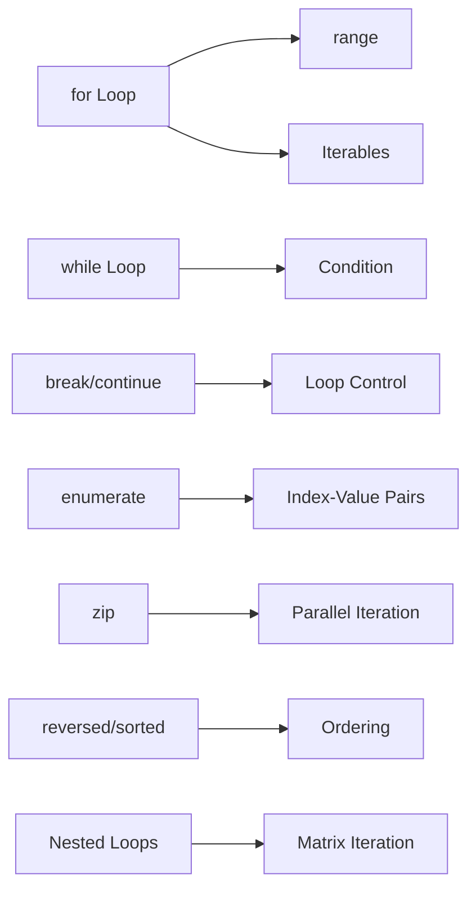
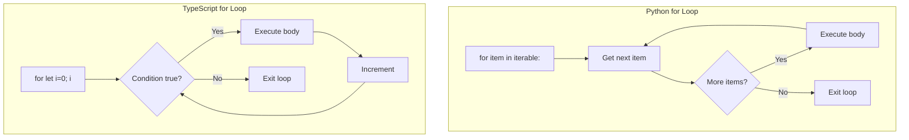

# Chapter 4: Loops and Iteration


> **Previous:** [Control Flow](./03-control-flow.md) | **Next:** [Strings](./05-strings.md)
## Learning Objectives

By the end of this chapter, students will be able to:
- Construct `for` loops over ranges and iterables
- Write `while` loops with proper termination conditions
- Control loop flow with `break`, `continue`, and `else` clauses
- Use `enumerate`, `zip`, `reversed`, and `sorted` for idiomatic iteration
- Choose the appropriate loop construct for a given problem

<!-- Image Gallery -->
<section class="lesson-visuals" aria-label="Visual learning resources">
  <header><span>VISUAL LEARNING</span><h2>See it. Review it. Remember it.</h2></header>
  <a class="lesson-visual-card" href="../../../assets/images/lessons/python-programming/04-loops/handwritten-notes.svg" target="_blank" rel="noopener">
    
    <span><strong>Handwritten notes</strong>Condensed notes for deliberate review.</span>
  </a>
  <a class="lesson-visual-card" href="../../../assets/images/lessons/python-programming/04-loops/sticky-notes.svg" target="_blank" rel="noopener">
    
    <span><strong>Sticky-note revision</strong>Fast recall prompts for revision.</span>
  </a>
  <a class="lesson-visual-card" href="../../../assets/images/lessons/python-programming/04-loops/visual-explanation.svg" target="_blank" rel="noopener">
    
    <span><strong>Visual concept guide</strong>A connected explanation of the key ideas.</span>
  </a>
</section>
<!-- End Image Gallery -->


## Chapter at a Glance

| Section | Topic | Key Concept |
|---------|-------|-------------|
| 4.1 | for Loop | Iterating over iterables, range() |
| 4.2 | while Loop | Condition-based repetition |
| 4.3 | break and continue | Loop control statements |
| 4.4 | else on Loops | Executes when no break occurred |
| 4.5 | enumerate() | Index-value pairs |
| 4.6 | zip() | Parallel iteration |
| 4.7 | reversed() | Reverse iteration |
| 4.8 | sorted() | Sorted iteration |
| 4.9 | Nested Loops | Multi-dimensional iteration |
| 4.10 | Loop Idioms | Safe removal, slices, chunking |


## Chapter Roadmap



## 4.1 The for Loop

> **One-Sentence Takeaway:** for iterates over any iterable; use range() for numeric sequences.

The `for` loop iterates over any iterable (sequences, iterators, generators):

```python
fruits = ["apple", "banana", "cherry"]
for fruit in fruits:
    print(fruit)
```

Output:
```
apple
banana
cherry
```

### 4.1.1 range()


The `range()` function generates arithmetic progressions:

```python
for i in range(5):           # 0, 1, 2, 3, 4
    print(i, end=" ")        # 0 1 2 3 4

print()

for i in range(2, 7):        # 2, 3, 4, 5, 6
    print(i, end=" ")        # 2 3 4 5 6

print()

for i in range(0, 10, 2):    # 0, 2, 4, 6, 8
    print(i, end=" ")        # 0 2 4 6 8

print()

for i in range(10, 0, -1):   # 10, 9, ..., 1
    print(i, end=" ")        # 10 9 8 7 6 5 4 3 2 1
```

`range()` is lazy -- it produces values on demand, not as a list. Cast to `list()` to see all values.

### 4.1.2 Iterating Over Sequences


```python
word = "hello"
for char in word:
    print(char.upper(), end=" ")  # H E L L O

print()

numbers = [10, 20, 30]
for value in numbers:
    print(value * 2, end=" ")     # 20 40 60
```


> **Warning:** Never modify a list while iterating over it -- iterate over items[:] (a copy) instead.
Modifying a list while iterating over it is dangerous:

```python
# BAD -- skips elements
numbers = [1, 2, 3, 4, 5]
for n in numbers:
    if n % 2 == 0:
        numbers.remove(n)
print(numbers)  # [1, 3, 5]  (works here by luck, fails in general)

# CORRECT -- iterate over a copy
numbers = [1, 2, 3, 4, 5]
for n in numbers[:]:
    if n % 2 == 0:
        numbers.remove(n)
print(numbers)  # [1, 3, 5]
```

### TypeScript Parallel

```typescript
// TypeScript: for-of loop (like Python's for-in)
const fruits: string[] = ["apple", "banana", "cherry"];
for (const fruit of fruits) {
    console.log(fruit);
}

// TypeScript: traditional for loop (like range)
for (let i = 0; i < 5; i++) {
    console.log(i);  // 0 1 2 3 4
}

// TypeScript: forEach method (functional style)
fruits.forEach((fruit) => console.log(fruit));

// TypeScript does NOT have range(); use for(let i=0; i<n; i++)
// Python's range(start, stop, step):
for (let i = 0; i < 10; i += 2) {
    console.log(i);  // 0 2 4 6 8
}
```



## 4.2 The while Loop

> **One-Sentence Takeaway:** while repeats until a condition is false -- ensure termination or use break.

The `while` loop repeats as long as a condition is truthy:

```python
count = 0
while count < 5:
    print(count, end=" ")
    count += 1
# 0 1 2 3 4
```

Ensure the condition eventually becomes falsy, or use `break`:

```python
# Infinite loop -- ensure termination
total = 0
while True:
    n = int(input("Enter a number (0 to quit): "))
    if n == 0:
        break
    total += n
print(f"Total: {total}")
```

### 4.2.1 When to Use while vs for


- Use `for` when the number of iterations is known or you are iterating over a collection.
- Use `while` when the loop depends on a condition that changes inside the body.

```python
# while is natural for convergence algorithms
x = 1.0
while abs(x ** 2 - 2) > 1e-10:
    x = (x + 2 / x) / 2   # Newton's method for sqrt(2)
print(f"sqrt(2) ~ {x}")
```

### TypeScript Parallel

```typescript
// TypeScript: while loop (identical to Python)
let count: number = 0;
while (count < 5) {
    console.log(count);  // 0 1 2 3 4
    count++;
}

// Infinite loop with break (identical)
let total: number = 0;
while (true) {
    // prompt doesn't work in Node.js without readline
    // But the pattern is identical
    break;
}

// Convergence algorithm (identical)
let x: number = 1.0;
while (Math.abs(x ** 2 - 2) > 1e-10) {
    x = (x + 2 / x) / 2;
}
console.log(`sqrt(2) ~ ${x}`);
```

The `while` loop is nearly identical between Python and TypeScript. The key difference is the loop syntax -- Python uses a colon and indentation, TypeScript uses parentheses and curly braces.

## 4.3 break and continue

> **One-Sentence Takeaway:** break exits the innermost loop; continue skips to the next iteration.

`break` terminates the loop immediately:

```python
for i in range(100):
    if i * i > 50:
        break
    print(i, i * i)
# Prints up to i=7 (7*7=49)
```

`continue` skips the rest of the current iteration and moves to the next:

```python
for i in range(10):
    if i % 2 == 0:
        continue
    print(i, end=" ")   # 1 3 5 7 9
```


> **Pro Tip:** To break out of nested loops, use a flag or wrap in a function and return. Python lacks labeled break.
`break` and `continue` apply only to the innermost loop:

```python
for i in range(3):
    for j in range(3):
        if j == 1:
            break       # breaks inner loop only
        print(f"({i},{j})", end=" ")
    print()
```

### TypeScript Parallel

```typescript
// TypeScript: break and continue (identical behavior)
for (let i = 0; i < 100; i++) {
    if (i * i > 50) break;
    console.log(i, i * i);
}

for (let i = 0; i < 10; i++) {
    if (i % 2 === 0) continue;
    console.log(i);   // 1 3 5 7 9
}

// TypeScript also has labeled break (Python does not)
outer: for (let i = 0; i < 3; i++) {
    inner: for (let j = 0; j < 3; j++) {
        if (j === 1) break outer;  // breaks BOTH loops!
        console.log(i, j);
    }
}
```

| Feature | Python | TypeScript |
|---------|--------|------------|
| break | Yes | Yes |
| continue | Yes | Yes |
| Labeled break | No | Yes (outer/inner labels) |
| Loop control | Same behavior | TypeScript has labeled break |

## 4.4 The else Clause on Loops

> **One-Sentence Takeaway:** The else block runs only if the loop completed without hitting break.


> **Remember:** The else clause is Python-unique. Use it for search loops where code runs only if no match was found.
The `else` clause executes when the loop terminates normally (without `break`):

```python
# Prime number check
n = 17
for i in range(2, int(n ** 0.5) + 1):
    if n % i == 0:
        print(f"{n} is divisible by {i}")
        break
else:
    print(f"{n} is prime")
```

The `else` clause also works with `while` loops:

```python
x = 256
while x > 1:
    if x % 2 != 0:
        print(f"{x} is not a power of two")
        break
    x //= 2
else:
    print("Input is a power of two")
```

### TypeScript Parallel

```typescript
// TypeScript: NO else clause on loops
// Must use a flag variable instead:
function isPrime(n: number): boolean {
    for (let i = 2; i <= Math.sqrt(n); i++) {
        if (n % i === 0) {
            return false;  // like break + else executed
        }
    }
    return true;  // like else clause
}

// Flag approach for the else clause:
function checkPowerOfTwo(x: number): boolean {
    while (x > 1) {
        if (x % 2 !== 0) {
            return false;  // break from success path
        }
        x = Math.floor(x / 2);
    }
    return true;  // no break occurred
}
```

Python's `else` on loops is unique. In TypeScript and most other languages, you use a flag variable or early return from a function to achieve the same effect.

## 4.5 enumerate()

> **One-Sentence Takeaway:** enumerate() yields (index, value) pairs -- avoid manual counter variables.

`enumerate()` yields pairs of (index, value) from an iterable:

```python
colors = ["red", "green", "blue"]
for i, color in enumerate(colors):
    print(f"{i}: {color}")
# 0: red
# 1: green
# 2: blue
```

Specify a custom start index:

```python
for i, color in enumerate(colors, start=1):
    print(f"{i}. {color}")
# 1. red
# 2. green
# 3. blue
```

### TypeScript Parallel

```typescript
// TypeScript: entries() on arrays
const colors: string[] = ["red", "green", "blue"];
for (const [i, color] of colors.entries()) {
    console.log(`${i}: ${color}`);
}

// Traditional for loop:
for (let i = 0; i < colors.length; i++) {
    console.log(`${i}: ${colors[i]}`);
}

// forEach with index:
colors.forEach((color, i) => {
    console.log(`${i}: ${color}`);
});
```

| Feature | Python | TypeScript |
|---------|--------|------------|
| Index-value pairs | `enumerate(iterable)` | `iterable.entries()` |
| Custom start | `enumerate(iterable, start=N)` | Manual (add offset) |
| Destructuring | `for i, val in enumerate(x):` | `for (const [i, val] of x.entries())` |

## 4.6 zip()

> **One-Sentence Takeaway:** zip() pairs elements from multiple iterables, stopping at the shortest one.

`zip()` aggregates multiple iterables element-wise:

```python
names = ["Alice", "Bob", "Charlie"]
scores = [85, 92, 78]
grades = ["A", "A", "B"]

for name, score, grade in zip(names, scores, grades):
    print(f"{name}: {score} ({grade})")
# Alice: 85 (A)
# Bob: 92 (A)
# Charlie: 78 (B)
```

`zip()` stops at the shortest iterable:

```python
a = [1, 2, 3, 4]
b = [10, 20, 30]
print(list(zip(a, b)))          # [(1, 10), (2, 20), (3, 30)]
```

Use `itertools.zip_longest()` for unequal lengths:

```python
from itertools import zip_longest
print(list(zip_longest(a, b, fillvalue=0)))
# [(1, 10), (2, 20), (3, 30), (4, 0)]
```

Unzipping uses the star operator:

```python
pairs = [(1, 10), (2, 20), (3, 30)]
first, second = zip(*pairs)
print(list(first))   # [1, 2, 3]
print(list(second))  # [10, 20, 30]
```

### TypeScript Parallel

```typescript
// TypeScript: NO built-in zip() in older versions
// Manual implementation or use lodash
function zip<T, U>(a: T[], b: U[]): [T, U][] {
    const len = Math.min(a.length, b.length);
    return Array.from({ length: len }, (_, i) => [a[i], b[i]]);
}

const names: string[] = ["Alice", "Bob", "Charlie"];
const scores: number[] = [85, 92, 78];
const zipped = zip(names, scores);
// [["Alice", 85], ["Bob", 92], ["Charlie", 78]]

// forEach with index (manual approach):
names.forEach((name, i) => {
    if (i < scores.length) {
        console.log(`${name}: ${scores[i]}`);
    }
});
```

## 4.7 reversed()

> **One-Sentence Takeaway:** reversed() returns a reverse iterator without copying the sequence.

`reversed()` returns a reverse iterator over a sequence:

```python
for c in reversed("hello"):
    print(c, end="")   # olleh
print()

for n in reversed([1, 2, 3]):
    print(n, end=" ")  # 3 2 1
```

### TypeScript Parallel

```typescript
// TypeScript: reverse() on arrays (mutates) or manual loop
// Option 1: reverse() - but this MUTATES the array
const nums: number[] = [1, 2, 3];
const reversed = [...nums].reverse();  // copy first to avoid mutation
console.log(reversed);  // [3, 2, 1]

// Option 2: manual reverse iteration
for (let i = nums.length - 1; i >= 0; i--) {
    console.log(nums[i]);  // 3 2 1
}

// Strings can be reversed:
const str: string = "hello";
console.log(str.split("").reverse().join(""));  // "olleh"
```

## 4.8 sorted()

> **One-Sentence Takeaway:** sorted() returns a new sorted list; the original iterable is unchanged.

`sorted()` returns a new sorted list from an iterable:

```python
nums = [3, 1, 4, 1, 5, 9, 2]
for n in sorted(nums):
    print(n, end=" ")      # 1 1 2 3 4 5 9
print()

for n in sorted(nums, reverse=True):
    print(n, end=" ")      # 9 5 4 3 2 1 1
print()

# Custom key
words = ["banana", "apple", "cherry", "date"]
for w in sorted(words, key=len):
    print(w, end=" ")      # date apple banana cherry
```

`sorted()` returns a new list; the original iterable is unchanged.

### TypeScript Parallel

```typescript
// TypeScript: toSorted() - non-mutating (ES2023+)
const nums: number[] = [3, 1, 4, 1, 5, 9, 2];
const sorted = nums.toSorted((a, b) => a - b);
console.log(sorted);  // [1, 1, 2, 3, 4, 5, 9]

// Custom key (sort by length)
const words: string[] = ["banana", "apple", "cherry", "date"];
words.sort((a, b) => a.length - b.length);
// Note: sort() MUTATES the array in TypeScript!
console.log(words);  // ["date", "apple", "banana", "cherry"]
```

### Loop Utilities Comparison


| Function | Python | TypeScript |
|----------|--------|------------|
| Numeric range | `range(start, stop, step)` | `for (let i=0; i<n; i++)` |
| Index-value | `enumerate(iter)` | `iter.entries()` |
| Parallel iteration | `zip(a, b)` | Manual or library |
| Reverse | `reversed(seq)` | `[...arr].reverse()` |
| Sorted | `sorted(iter, key=func)` | `arr.toSorted(compare)` |

## 4.9 Nested Loops

> **One-Sentence Takeaway:** Nested loops multiply complexity -- use comprehensions for matrix operations.

```python
for i in range(3):
    for j in range(3):
        print(f"({i},{j})", end=" ")
    print()
# (0,0) (0,1) (0,2)
# (1,0) (1,1) (1,2)
# (2,0) (2,1) (2,2)
```

Nested loops multiply iterations -- O(n*m) complexity. For matrix operations:

```python
matrix = [[1, 2, 3], [4, 5, 6], [7, 8, 9]]
transpose = [[row[i] for row in matrix] for i in range(3)]
print(transpose)  # [[1, 4, 7], [2, 5, 8], [3, 6, 9]]
```

### TypeScript Parallel

```typescript
// TypeScript: nested loops (identical structure)
for (let i = 0; i < 3; i++) {
    for (let j = 0; j < 3; j++) {
        console.log(`(${i},${j})`);
    }
}

// Matrix transpose (identical logic)
const matrix: number[][] = [[1, 2, 3], [4, 5, 6], [7, 8, 9]];
const transpose: number[][] = matrix[0].map((_, i) =>
    matrix.map(row => row[i])
);
console.log(transpose);  // [[1, 4, 7], [2, 5, 8], [3, 6, 9]]
```

## 4.10 Loop Idioms

> **One-Sentence Takeaway:** Iterate over a copy when modifying a collection during iteration.

### Looping Over a Copy


```python
# Safe removal during iteration
items = [1, 2, 3, 4, 5]
for item in items[:]:  # iterate over a shallow copy
    if item % 2 == 0:
        items.remove(item)
```

### Looping Over Slices


```python
data = [10, 20, 30, 40, 50]
for chunk in [data[i:i+2] for i in range(0, len(data), 2)]:
    print(chunk)
# [10, 20]
# [30, 40]
# [50]
```

### Tracking Index Without enumerate


```python
i = 0
for fruit in fruits:
    print(i, fruit)
    i += 1
```

Prefer `enumerate()`.

### TypeScript Parallel

```typescript
// TypeScript: filter instead of remove during iteration
const items: number[] = [1, 2, 3, 4, 5];
const filtered = items.filter(x => x % 2 !== 0);  // [1, 3, 5]

// Chunking:
const data: number[] = [10, 20, 30, 40, 50];
const chunks: number[][] = [];
for (let i = 0; i < data.length; i += 2) {
    chunks.push(data.slice(i, i + 2));
}
console.log(chunks);  // [[10, 20], [30, 40], [50]]
```

## Practical Takeaways

| Concept | Key Point | Common Mistake |
|---------|-----------|----------------|
| for vs while | for iterates collections; while runs until condition | Using while when for is more natural |
| range() | Lazy, use list() to materialise | Forgetting range stops before stop value |
| Modify during iteration | Iterate over a copy | Removing items from list during for loop |
| else clause | Runs only if no break | Confusing else with "always" |
| enumerate | Avoid manual counters | Writing `i = 0; i += 1` |
| Python vs TS | TS has labeled break; Python has else; both have for-of | Expecting TS range() helper |

## Concept Comparison Table

| Feature | for Loop | while Loop |
|---|---|---|
| Use case | Known iterations / iterable | Condition-dependent |
| Termination | End of iterable | Condition becomes false |
| Risk | None (finite iterable) | Infinite loop risk |
| Else clause | Yes | Yes |
| Common | for x in items: | while condition: |


## Quick Reference

```python
# for loop
for i in range(5):
    print(i)

# while loop
while x > 0:
    x -= 1

# break/continue/else
for n in numbers:
    if n < 0: break
else:
    print("All non-negative")

# enumerate
for i, val in enumerate(items):
    print(i, val)

# zip
for a, b in zip(list1, list2):
    print(a, b)

# reversed / sorted
for x in reversed(seq): pass
for x in sorted(seq, key=len): pass
```


## Cross-Application Matrix

| Area | Application | Relevant Section |
|------|-------------|------------------|
| Data Processing | Batch iteration with zip | 4.6 |
| File Parsing | Reading lines until EOF | 4.2 |
| Algorithms | Newton's method convergence | 4.2.1 |
| Game Dev | Game loop with break | 4.3 |


## Chapter Quiz

**Q1.** When does a loop's else clause execute?
- A) Always
- B) Only if break was called
- C) Only if no break was called **<-- Correct**
- D) Never

**Q2.** What does zip(['a', 'b'], [1, 2, 3]) return?
- A) [('a',1), ('b',2), (None,3)]
- B) [('a',1), ('b',2)] **<-- Correct**
- C) Error
- D) [['a',1], ['b',2]]

**Q3.** What is enumerate(['a','b','c'], start=1)?
- A) [(0,'a'),(1,'b'),(2,'c')]
- B) [(1,'a'),(2,'b'),(3,'c')] **<-- Correct**
- C) [1,2,3]
- D) {'a':1,'b':2,'c':3}

**Q4.** Which loop is best for Newton's method?
- A) for loop
- B) while loop **<-- Correct**
- C) List comprehension
- D) enumerate()

**Q5.** What is wrong with `for n in nums: nums.remove(n)`?
- A) Nothing
- B) It skips elements **<-- Correct**
- C) It crashes
- D) It reverses the list


```typescript
// Chapter 4: TypeScript Loop Equivalents
// Python: for x in iterable
const items: string[] = ["apple", "banana", "cherry"];
for (const item of items) {
  console.log(item);
}

// Python: for i in range(5)
for (let i = 0; i < 5; i++) {
  console.log(i);  // 0, 1, 2, 3, 4
}

// Python: enumerate() → TypeScript: entries()
for (const [index, value] of items.entries()) {
  console.log(`${index}: ${value}`);
}

// Python: zip() → TypeScript: manual or utility
const names: string[] = ["Alice", "Bob", "Charlie"];
const scores: number[] = [92, 85, 78];
for (let i = 0; i < names.length && i < scores.length; i++) {
  console.log(`${names[i]}: ${scores[i]}`);
}
// Python equivalent: for name, score in zip(names, scores):

// Python: while loop
let n: number = 10;
while (n > 0) {
  console.log(n);
  n--;
}

// Python: break / continue work identically
for (const item of items) {
  if (item === "banana") continue;
  if (item === "cherry") break;
  console.log(item);  // "apple" only
}

// Python: for/else (no TypeScript equivalent)
// TypeScript workaround with a flag:
let found = false;
for (const name of names) {
  if (name === "Alice") { found = true; break; }
}
if (!found) console.log("Not found");
// Python: for name in names: ... else: print("Not found")

// Python: reversed() → TypeScript: reverse() or manual loop
for (let i = items.length - 1; i >= 0; i--) {
  console.log(items[i]);  // cherry, banana, apple
}
```

### TypeScript Utilities

```typescript
// === Loop Performance Benchmark ===
function benchmarkLoop(name: string, fn: () => void, iterations = 100000): { name: string; ms: number; ops: number } {
  const start = performance.now();
  for (let i = 0; i < iterations; i++) fn();
  const ms = performance.now() - start;
  return { name, ms: Math.round(ms * 100) / 100, ops: Math.round(iterations / (ms / 1000)) };
}
const arr = Array.from({ length: 1000 }, (_, i) => i);
const forLoop = () => { let s = 0; for (let i = 0; i < arr.length; i++) s += arr[i]; };
const forOfLoop = () => { let s = 0; for (const x of arr) s += x; };
const forEachLoop = () => { let s = 0; arr.forEach((x) => { s += x; }); };
console.log(benchmarkLoop("for", forLoop));
console.log(benchmarkLoop("for-of", forOfLoop));
console.log(benchmarkLoop("forEach", forEachLoop));

// === Infinite Loop Detector ===
function detectInfinite(condition: string, body: string, maxIter = 1000): string {
  return `let _guard = 0;\nwhile (${condition}) {\n  if (_guard++ > ${maxIter}) throw new Error("Infinite loop detected");\n${body}\n}`;
}
console.log(detectInfinite("true", "console.log('running')"));

// === Range Function (Python-like) ===
function range(start: number, end?: number, step = 1): number[] {
  if (end === undefined) { end = start; start = 0; }
  const result: number[] = [];
  for (let i = start; i < end; i += step) result.push(i);
  return result;
}
console.log(range(5));        // [0, 1, 2, 3, 4]
console.log(range(2, 8, 2));  // [2, 4, 6]

// === Zip Function (Python-like) ===
function zip<T, U>(a: T[], b: U[]): [T, U][] {
  return a.slice(0, Math.min(a.length, b.length)).map((v, i) => [v, b[i]]);
}
console.log(zip(["a", "b", "c"], [1, 2])); // [["a", 1], ["b", 2]]

// === Enumerate in TS ===
function enumerate<T>(arr: T[]): [number, T][] {
  return arr.map((v, i) => [i, v]);
}
console.log(enumerate(["x", "y", "z"])); // [[0, "x"], [1, "y"], [2, "z"]]
```

### TypeScript Loop & Iteration Patterns

```typescript
// === For-of (Python: for x in iterable) ===
const items = [10, 20, 30, 40, 50];
for (const item of items) console.log(item);

// === For-in (Python: for key in dict) vs Object.keys ===
const dict = { a: 1, b: 2, c: 3 };
for (const key in dict) console.log(key, dict[key]);
// Better: Object.entries
for (const [key, value] of Object.entries(dict)) console.log(key, value);

// === Array methods (Python: for with enumerate) ===
items.forEach((item, index) => console.log(`[${index}] = ${item}`));
const doubled = items.map(x => x * 2);
const evens = items.filter(x => x % 2 === 0);
const sum = items.reduce((acc, x) => acc + x, 0);
const firstEven = items.find(x => x % 2 === 0);
const allPositive = items.every(x => x > 0);
const someOver30 = items.some(x => x > 30);

// === Generator equivalents with Iterator ===
class RangeIterator implements Iterable<number> {
  constructor(private start: number, private end: number, private step = 1) {}
  *[Symbol.iterator](): Generator<number> {
    for (let i = this.start; i < this.end; i += this.step) yield i;
  }
}
for (const n of new RangeIterator(0, 10, 2)) console.log(n); // 0, 2, 4, 6, 8

// === Infinite sequence ===
function* fibonacci(): Generator<number> {
  let a = 0, b = 1;
  while (true) { yield a; [a, b] = [b, a + b]; }
}
const fib = fibonacci();
for (let i = 0; i < 10; i++) console.log(fib.next().value);

// === Enumerate (Python: enumerate) ===
function enumerate2<T>(arr: T[]): [number, T][] {
  return arr.map((v, i) => [i, v]);
}
for (const [idx, val] of enumerate2(["a", "b", "c"])) console.log(idx, val);

// === Zip (Python: zip) ===
function zip2<T, U>(a: T[], b: U[]): [T, U][] {
  return a.slice(0, Math.min(a.length, b.length)).map((v, i) => [v, b[i]]);
}
for (const [n, l] of zip2([1, 2, 3], ["a", "b", "c"])) console.log(n, l);

// === While loop ===
let i = 0;
while (i < 5) { console.log(i++); }

// === Do-while (no Python equivalent) ===
let j = 0;
do { console.log(j++); } while (j < 5);

// === Nested loops with labels ===
outer: for (let r = 0; r < 3; r++) {
  for (let c = 0; c < 3; c++) {
    if (r === 1 && c === 1) break outer;
    console.log(`[${r},${c}]`);
  }
}

// === Loop performance ===
const big = Array.from({ length: 1000000 }, (_, i) => i);
console.time("for");
let sum2 = 0;
for (let i = 0; i < big.length; i++) sum2 += big[i];
console.timeEnd("for");

console.time("for-of");
let sum3 = 0;
for (const v of big) sum3 += v;
console.timeEnd("for-of");

console.time("forEach");
let sum4 = 0;
big.forEach(v => sum4 += v);
console.timeEnd("forEach");
```

## Summary

- `for` loops iterate over iterables; `while` loops run until a condition is falsy.
- `break` exits; `continue` skips to next iteration.
- `else` on loops runs only if no `break` occurred.
- `enumerate()` yields index-value pairs; `zip()` merges iterables.
- `reversed()` and `sorted()` return iterators and sorted lists respectively.
- Avoid modifying a collection while iterating over it.
- TypeScript has labeled break; Python has else clauses on loops. Both have for-of iteration.
- TypeScript lacks range() and zip() natively, requiring manual for loops or utility functions.

## Exercises

### Review Questions

1. What is the difference between `for` and `while` loops?
2. When does a loop's `else` clause execute?
3. What does `zip(['a', 'b', 'c'], [1, 2])` return?
4. Why is modifying a list during iteration problematic?
5. How does `enumerate` differ from manually incrementing a counter?
6. How does TypeScript's labeled break differ from Python's loop control?
7. What is the TypeScript equivalent of Python's `range(5)`?

### Application Problems

1. Write a program that prints the multiplication table (1-12) using nested loops, formatted in aligned columns.
2. Implement the Collatz conjecture: for a given starting integer n, repeatedly compute n/2 if even, 3n+1 if odd, counting how many steps to reach 1. Use a while loop and print each step.
3. Given two lists of student names and scores, use `zip` and `enumerate` to print a ranked leaderboard sorted by score descending.
4. Write a Python function that finds the first duplicate in a list. Use the `for`/`else` pattern instead of a flag variable. Return the duplicate value or None.
5. Write a script that reads integers from the user until they enter 0, then prints the sum, average, minimum, and maximum. Use a while loop with break.

### Challenge Problem

Implement a simple text-based inventory management system. Start with an inventory of items (dict mapping names to quantities). Repeatedly prompt the user for commands: "add X N", "remove X N", "list", or "quit". Use a while loop with break. Handle invalid items, insufficient quantity, and non-numeric counts gracefully. Use membership operators (`in`) to validate items before modification.

### TypeScript Challenge

Implement the Collatz conjecture from Application Problem 2 in TypeScript. Add a performance comparison -- time how long it takes Python vs TypeScript to compute the Collatz sequence for n = 1,000,000. Which is faster and why?
