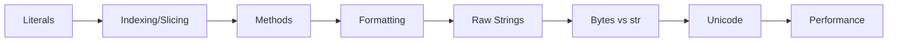

# Chapter 5: Strings


> **Previous:** [Loops and Iteration](./04-loops.md) | **Next:** [Lists](./06-lists.md)
## Learning Objectives

By the end of this chapter, students will be able to:
- Create strings using all literal forms
- Index and slice strings to extract substrings
- Use the extensive set of string methods
- Write formatted output with f-strings, format specifiers, and str.format()
- Distinguish raw strings, byte strings, and Unicode strings
- Process text data efficiently


## Chapter at a Glance

| Section | Topic | Key Concept |
|---------|-------|-------------|
| 5.1 | String Literals | Quotes, escape sequences, raw strings |
| 5.2 | Indexing and Slicing | start:stop:step, negative indices |
| 5.3 | String Methods | Search, case, split, join, replace |
| 5.4 | Formatting | f-strings, format specs, .format() |
| 5.5 | Raw Strings | r"" disables escaping |
| 5.6 | Bytes and str | encode()/decode() |
| 5.7 | Unicode | Normalization, code points |
| 5.8 | Performance | join() over += |


## Chapter Roadmap



## 5.1 String Literals

> **One-Sentence Takeaway:** Strings can use single, double, or triple quotes; escape sequences start with backslash.

Python offers several ways to write string literals:

```python
single = 'Hello'
double = "Hello"
triple = """Multi-line
string literal"""
triple_single = '''Also multi-line'''

# Adjacent literals are concatenated
joined = "Hello" " " "World"
print(joined)  # Hello World
```


> **Pro Tip:** Triple-quoted strings also preserve indentation. Use inspect.cleandoc() to clean up indented docstrings.
Triple-quoted strings preserve line breaks and are commonly used for docstrings:

```python
def example():
    """This is a docstring explaining the function."""
    pass
```

Escape sequences begin with a backslash:

```python
escaped = 'It\'s a "nice" day\nNew line\tTab'
raw = r'It\'s a "nice" day\nNew line\tTab'
print(escaped)
print(raw)
```

Output:
```
It's a "nice" day
New line	Tab
It\'s a "nice" day\nNew line\tTab
```

Common escape sequences: `\n` (newline), `\t` (tab), `\\` (backslash), `\'` (single quote), `\"` (double quote), `\0` (null), `\xHH` (hex byte), `\uHHHH` (Unicode BMP), `\UHHHHHHHH` (Unicode full).

### TypeScript Parallel

```typescript
// TypeScript: single, double, backtick quotes
const single: string = 'Hello';
const double: string = "Hello";
const template: string = `Multi-line
string literal`;

// TypeScript template literals (backtick) support interpolation:
const name: string = "Alice";
const greeting: string = `Hello, ${name}!`;  // f-string equivalent

// Same escape sequences:
const escaped: string = 'It\'s a "nice" day\nNew line\tTab';
console.log(escaped);
```

TypeScript uses backtick (`` ` ``) for template literals, which are similar to f-strings. Python uses `f""` or `f''` prefixed strings.

## 5.2 Indexing and Slicing

> **One-Sentence Takeaway:** Slice syntax is s[start:stop:step] -- all components are optional and indices clamp automatically.

Strings are sequences of Unicode code points and support indexing:

```python
s = "Python"
#  P  y  t  h  o  n
#  0  1  2  3  4  5
# -6 -5 -4 -3 -2 -1

print(s[0])    # P
print(s[-1])   # n
print(s[2:5])  # tho  (start:end, exclusive of end)
print(s[:3])   # Pyt  (from beginning)
print(s[3:])   # hon  (to end)
print(s[::2])  # Pto  (step)
print(s[::-1]) # nohtyP  (reverse)
```


> **Remember:** s[::-1] reverses any sequence -- one of Python's most elegant idioms.
Slice semantics: `s[start:stop:step]`. All components are optional. Indices are clamped to the sequence bounds -- no `IndexError` for out-of-range slices:

```python
print(s[0:100])  # Python
print(s[100:])   # "" (empty)
```

### TypeScript Parallel

```typescript
// TypeScript: strings also support indexing and slicing
const s: string = "Python";

console.log(s[0]);       // P  (indexing)
console.log(s.at(-1));   // n  (Python-style negative index - ES2022+)
console.log(s.slice(2, 5));  // tho  (end-exclusive, like Python)
console.log(s.slice(0, 3));  // Pyt  (from beginning)
console.log(s.slice(3));     // hon  (to end)

// Python: s[::2] -> step/stride
// TypeScript: no direct step equivalent
// Manual approach:
const stepped = s.split("").filter((_, i) => i % 2 === 0).join("");
console.log(stepped);  // Pto

// Python: s[::-1] reverse
// TypeScript:
console.log(s.split("").reverse().join(""));  // nohtyP
```

| Feature | Python | TypeScript |
|---------|--------|------------|
| Index | `s[i]` | `s[i]` or `s.at(i)` |
| Negative index | Yes (`s[-1]`) | `s.at(-1)` (ES2022) |
| Slice | `s[start:stop:step]` | `s.slice(start, stop)` |
| Step/stride | Yes (`s[::2]`) | Manual filter |
| Reverse | `s[::-1]` | `s.split("").reverse().join("")` |
| Out-of-range | Clamped (no error) | Clamped (no error) |

## 5.3 String Methods

> **One-Sentence Takeaway:** Strings are immutable -- every method returns a new string without modifying the original.

Strings are immutable -- all methods return a new string.

### 5.3.1 Searching and Counting


```python
text = "hello world, hello universe"

print(text.count("hello"))      # 2
print(text.find("world"))       # 6  (first index, or -1)
print(text.index("world"))      # 6  (first index, or ValueError)
print(text.rfind("hello"))      # 13 (last index)
print(text.startswith("hello")) # True
print(text.endswith("verse"))   # True
```

### TypeScript Parallel

```typescript
// TypeScript: similar search methods
const text: string = "hello world, hello universe";

// Python: text.count("hello") -> 2
const count = (text.match(/hello/g) || []).length;
console.log(count);  // 2

// Python: text.find("world") -> 6
console.log(text.indexOf("world"));    // 6  (or -1, like find)
console.log(text.includes("world"));   // true  (boolean check)
console.log(text.startsWith("hello")); // true
console.log(text.endsWith("verse"));   // true
```

### 5.3.2 Case Manipulation


```python
s = "Hello World"
print(s.upper())          # HELLO WORLD
print(s.lower())          # hello world
print(s.title())          # Hello World
print(s.capitalize())     # Hello world
print(s.swapcase())       # hELLO wORLD
print(s.casefold())       # hello world (aggressive lower for caseless matching)
```

`casefold()` is more aggressive than `lower()` for Unicode caseless comparison:

```python
print("ß".lower())    # ß
print("ß".casefold()) # ss
```

### TypeScript Parallel

```typescript
// TypeScript: case methods (identical naming)
const s: string = "Hello World";
console.log(s.toUpperCase());      // HELLO WORLD
console.log(s.toLowerCase());      // hello world
console.log(s.replace(/\b\w/g, c => c.toUpperCase()));  // title case (manual)

// TypeScript does NOT have casefold() or swapcase()
// Unicode normalization:
console.log("ß".toLowerCase());    // ß
console.log("ß".toLocaleLowerCase("de"));  // ß (no automatic decomposition)
```

### 5.3.3 Stripping and Padding


```python
s = "  hello  \n"
print(s.strip())        # "hello"
print(s.lstrip())       # "hello  \n"
print(s.rstrip())       # "  hello"

print("###hello###".strip("#"))    # hello
print("42".zfill(5))               # 00042
print("hi".center(11))             # "    hi     "
print("hi".ljust(10, "-"))         # "hi--------"
print("hi".rjust(10, "-"))         # "--------hi"
```

### TypeScript Parallel

```typescript
// TypeScript: trim methods
const s: string = "  hello  \n";
console.log(s.trim());          // "hello"  (strip)
console.log(s.trimStart());     // "hello  \n"  (lstrip)
console.log(s.trimEnd());       // "  hello"  (rstrip)

// Padding
console.log("42".padStart(5, "0"));    // "00042"  (zfill)
console.log("hi".padStart(11));        // "         hi"  (rjust)
console.log("hi".padEnd(10, "-"));     // "hi--------"  (ljust)

// No direct center equivalent:
function center(str: string, width: number): string {
    const padding = Math.max(0, width - str.length);
    const left = Math.floor(padding / 2);
    const right = padding - left;
    return " ".repeat(left) + str + " ".repeat(right);
}
```

### 5.3.4 Splitting and Joining


```python
csv = "a,b,c,d"
print(csv.split(","))             # ['a', 'b', 'c', 'd']
print(csv.split(",", 2))          # ['a', 'b', 'c,d']

lines = "one\ntwo\nthree"
print(lines.splitlines())         # ['one', 'two', 'three']

data = "a b  c   d"
print(data.split())               # ['a', 'b', 'c', 'd'] (any whitespace)

parts = ["Python", "is", "fun"]
print(" ".join(parts))            # "Python is fun"
print(", ".join(parts))           # "Python, is, fun"
```

### TypeScript Parallel

```typescript
// TypeScript: split and join (identical concept)
const csv: string = "a,b,c,d";
console.log(csv.split(","));              // ['a', 'b', 'c', 'd']
console.log(csv.split(",", 2));           // ['a', 'b']

const parts: string[] = ["Python", "is", "fun"];
console.log(parts.join(" "));             // "Python is fun"  (inverse of split)
console.log(parts.join(", "));            // "Python, is, fun"
```

### 5.3.5 Replacement


```python
s = "hello world"
print(s.replace("hello", "goodbye"))  # goodbye world
print(s.replace("l", "L"))            # heLLo worLd
print(s.replace("l", "L", 2))         # heLLo world (max 2 replacements)

# Translation table
table = str.maketrans("aeiou", "AEIOU")
print("hello world".translate(table))  # hEllO wOrld
```

### TypeScript Parallel

```typescript
// TypeScript: replace with strings or regex
let s: string = "hello world";
console.log(s.replace("hello", "goodbye"));   // goodbye world (first match)
console.log(s.replace(/l/g, "L"));            // heLLo worLd (all: /g flag)
console.log(s.replace(/l/g, "L").replace(/l/, "L"));
// Note: replace() replaces first match only (use /g for all)
```

### 5.3.6 Character Classification


```python
print("hello".isalpha())       # True
print("123".isdigit())         # True
print("abc123".isalnum())      # True
print("   ".isspace())         # True
print("Hello".istitle())       # True
print("42".isdecimal())        # True
print("42".isnumeric())        # True (also handles "⅕")
print("hello".isidentifier())  # True
print("True".isidentifier())   # True
print("2fast".isidentifier())  # False (starts with digit)
```

### TypeScript Parallel

```typescript
// TypeScript: regex-based character classification
console.log(/^[a-zA-Z]+$/.test("hello"));      // isalpha
console.log(/^\d+$/.test("123"));               // isdigit
console.log(/^[a-zA-Z0-9]+$/.test("abc123"));   // isalnum
console.log(/^\s+$/.test("   "));               // isspace

// Python has more built-in methods; TypeScript uses regex
```

### 5.3.7 Prefix and Suffix


```python
url = "https://python.org"
print(url.removeprefix("https://"))  # python.org
print(url.removesuffix(".org"))      # https://python
```

### TypeScript Parallel

```typescript
// TypeScript: same concept (node >= 18 or similar)
const url: string = "https://python.org";
// No direct removeprefix/removesuffix prior to ES2024:
console.log(url.replace(/^https:\/\//, ""));   // python.org
console.log(url.replace(/\.org$/, ""));         // https://python
```

## 5.4 String Formatting

> **One-Sentence Takeaway:** f-strings with format specifiers are the recommended formatting approach in modern Python.

### 5.4.1 f-strings (Python 3.6+)


f-strings embed expressions inside `{}`:

```python
name = "Alice"
age = 30
print(f"{name} is {age} years old")   # Alice is 30 years old
print(f"{name!r}")                     # 'Alice'  (repr)
print(f"{2 * 21}")                     # 42
```

### 5.4.2 Format Specifiers


```python
pi = 3.1415926535
print(f"{pi:.2f}")            # 3.14
print(f"{pi:.4f}")            # 3.1416
print(f"{pi:10.2f}")          # "      3.14"  (width 10)
print(f"{pi:010.2f}")         # "0000003.14"

n = 42
print(f"{n:b}")               # 101010 (binary)
print(f"{n:o}")               # 52 (octal)
print(f"{n:x}")               # 2a (hex)

pct = 0.125
print(f"{pct:.1%}")           # 12.5%

big = 1234567
print(f"{big:,}")             # 1,234,567
```

Alignment:

```python
print(f"{'left':<10}|")       # "left      |"
print(f"{'center':^10}|")     # "  center  |"
print(f"{'right':>10}|")      # "     right|"
```

### TypeScript Parallel

```typescript
// TypeScript: template literals with similar formatting
const name: string = "Alice";
const age: number = 30;
console.log(`${name} is ${age} years old`);  // Alice is 30

// TypeScript does NOT have built-in format specifiers
// Number formatting:
const pi: number = 3.1415926535;
console.log(pi.toFixed(2));            // "3.14"  (like f"{pi:.2f}")
console.log(pi.toPrecision(4));        // "3.142"
console.log(pi.toString().padStart(10));  // "  3.14159"  (width)

// Binary, octal, hex:
const n: number = 42;
console.log(n.toString(2));    // "101010"  (binary)
console.log(n.toString(8));    // "52"  (octal)
console.log(n.toString(16));   // "2a"  (hex)

// Percentage:
const pct: number = 0.125;
console.log(`${(pct * 100).toFixed(1)}%`);  // "12.5%"

// Thousands separator:
const big: number = 1234567;
console.log(big.toLocaleString());  // "1,234,567"
```

### 5.4.3 str.format()


```python
template = "{} x {} = {}"
print(template.format(3, 4, 12))

template = "{name} is {age}"
print(template.format(name="Bob", age=25))

point = (3, 4)
print("({0[0]}, {0[1]})".format(point))
```

### 5.4.4 %-formatting (Legacy)


```python
print("%s is %d years old" % ("Charlie", 35))
```

Avoid `%`-formatting in new code -- use f-strings or `.format()`.

## 5.5 Raw Strings

> **One-Sentence Takeaway:** Raw strings treat backslashes as literal characters -- essential for regex and Windows paths.

Raw strings treat backslashes as literal characters. Prefix with `r` or `R`:

```python
normal = "C:\newfolder\text.txt"    # \n is newline, \t is tab
raw = r"C:\newfolder\text.txt"      # C:\newfolder\text.txt

# Useful for regex patterns
import re
pattern = r"\d+\.\d+"  # matches decimal numbers
```

### TypeScript Parallel

```typescript
// TypeScript: no raw strings, but regex literals handle this
// TypeScript regex: /pattern/flags (backslash = literal in regex)
const pattern: RegExp = /\d+\.\d+/;  // matches decimal numbers

// For string escapes, TypeScript has the same backslash rules
// Windows paths use double backslash:
const path: string = "C:\\newfolder\\text.txt";
```

## 5.6 Bytes and str

> **One-Sentence Takeaway:** str is Unicode text; bytes is binary data -- convert with .encode()/.decode().

```python
b = b"hello"
print(type(b))         # <class 'bytes'>
print(b[0])            # 104  (int, not str)

s = "café"
encoded = s.encode("utf-8")
print(encoded)         # b'caf\xc3\xa9'
decoded = encoded.decode("utf-8")
print(decoded)         # café
```

Wrong encoding causes `UnicodeDecodeError`:

```python
try:
    b"caf\xe9".decode("ascii")
except UnicodeDecodeError as e:
    print(e)
```

### TypeScript Parallel

```typescript
// TypeScript: TextEncoder/TextDecoder for encode/decode
const s: string = "café";
const encoded = new TextEncoder().encode(s);
console.log(encoded);  // Uint8Array [99, 97, 102, 195, 169]

const decoded = new TextDecoder().decode(encoded);
console.log(decoded);  // "café"

// TypeScript uses Uint8Array, not a separate bytes type
```

## 5.7 Unicode Support

> **One-Sentence Takeaway:** Python 3 strings are Unicode; use unicodedata.normalize() for robust comparison.

```python
print("\u00e9")             # é
print("\U0001F600")         # 😀
print(len("\U0001F600"))    # 1 (one code point)

from unicodedata import normalize
s1 = "caf\u00e9"            # composed: café
s2 = "cafe\u0301"           # decomposed: cafe + combining accent
print(s1 == s2)             # False
print(normalize("NFC", s1) == normalize("NFC", s2))  # True
```

### TypeScript Parallel

```typescript
// TypeScript: same Unicode support
console.log("\u00e9");              // é
console.log("\u{1F600}");           // 😀

// Normalization:
const s1: string = "caf\u00e9";          // composed
const s2: string = "cafe\u0301";         // decomposed
console.log(s1 === s2);                  // false
console.log(s1.normalize("NFC") === s2.normalize("NFC"));  // true
```

## 5.8 Performance Considerations

> **One-Sentence Takeaway:** Use "".join(parts) instead of repeated += for building strings -- it is O(n) instead of O(n^2).

```python
# SLOW
s = ""
for i in range(10000):
    s += str(i)

# FAST
parts = []
for i in range(10000):
    parts.append(str(i))
s = "".join(parts)
```

### TypeScript Parallel

```typescript
// TypeScript: Same performance concerns
// SLOW:
let s: string = "";
for (let i = 0; i < 10000; i++) {
    s += String(i);
}

// FAST - using array join:
const parts: string[] = [];
for (let i = 0; i < 10000; i++) {
    parts.push(String(i));
}
s = parts.join("");

// TypeScript alternative: array + join (identical pattern)
```

## Practical Takeaways

| Concept | Key Point | Common Mistake |
|---------|-----------|----------------|
| Slicing | `s[start:stop:step]` | Confusing stop (exclusive) with inclusive |
| Immutability | Methods return new strings | Assuming replace() modifies original |
| f-strings | Use `f"{var}"` for formatting | Using `%`-formatting in new code |
| join() | `"".join(list)` is O(n) | Using `+=` in loops is O(n^2) |
| Raw strings | `r"\n"` is literal backslash-n | Forgetting raw strings don't end with backslash |
| Python vs TS | TS has template literals but no format specs | Expecting `${var:.2f}` to work |

## Concept Comparison Table

| Feature | f-strings | str.format() | %-formatting |
|---|---|---|---|
| Syntax | f"{var}" | "{}".format(var) | "%s" % var |
| Readability | Best | Good | Poor |
| Expression support | Yes | Limited | No |
| Python version | 3.6+ | 2.6+ | All |
| Recommendation | Preferred | Legacy support | Avoid |


## Quick Reference

```python
# String methods
s.upper(), s.lower(), s.strip()
s.split(), " ".join(list)
s.find(sub), s.replace(old, new)
s.startswith(p), s.endswith(s)

# f-strings
name = "Alice"
f"{name} is {age}"
f"{pi:.2f}"          # 3.14
f"{n:08b}"           # binary

# Raw strings
path = r"C:\Users\name"

# Encoding
s.encode("utf-8")
b.decode("utf-8")
```


## Cross-Application Matrix

| Area | Application | Relevant Section |
|------|-------------|------------------|
| Web Dev | Template rendering with f-strings | 5.4 |
| Data Science | CSV parsing with split/join | 5.3.4 |
| Security | Input sanitisation with strip | 5.3.3 |
| Regex | Raw strings for patterns | 5.5 |


## Chapter Quiz

**Q1.** What does "hello"[::-1] return?
- A) "hello"
- B) "olleh" **<-- Correct**
- C) "hlo"
- D) TypeError

**Q2.** Best method for building large string from parts?
- A) + concatenation
- B) "".join(parts) **<-- Correct**
- C) str.concat()
- D) Template strings

**Q3.** What does f"{3.14159:.2f}" produce?
- A) 3.14 **<-- Correct**
- B) 3.14159
- C) 3.142
- D) 3

**Q4.** Difference between str and bytes?
- A) str is text, bytes is binary **<-- Correct**
- B) bytes is faster
- C) str holds numbers
- D) No difference

**Q5.** Which escape is newline?
- A) \t
- B) \n **<-- Correct**
- C) \r
- D) \0


```typescript
// Chapter 5: TypeScript String Equivalents
// Python: str concatenation
const greeting: string = "Hello";
const name: string = "World";
console.log(greeting + ", " + name + "!");  // "Hello, World!"

// Python: f-strings → TypeScript: template literals
const age: number = 30;
console.log(`Name: ${name}, Age: ${age}`);
// Python equivalent: print(f"Name: {name}, Age: {age}")

// Python: str.split() → TypeScript: .split()
const sentence: string = "Hello World Python";
const words: string[] = sentence.split(" ");
console.log(words);  // ["Hello", "World", "Python"]

// Python: str.join() → TypeScript: .join()
console.log(words.join(", "));  // "Hello, World, Python"
// Python: ", ".join(words)

// Python: str.strip() → TypeScript: .trim()
const padded: string = "  hello  ";
console.log(padded.trim());  // "hello"

// Python: str.upper() / str.lower()
console.log("Hello".toUpperCase());  // "HELLO"
console.log("Hello".toLowerCase());  // "hello"

// Python: str.replace() → TypeScript: .replaceAll()
const text: string = "cat and dog and cat";
console.log(text.replaceAll("cat", "bird"));  // "bird and dog and bird"
// Note: Python uses .replace() (all occurrences by default)

// Python: slicing (s[1:4]) → TypeScript: .slice()
const s: string = "hello";
console.log(s.slice(1, 4));   // "ell"  (Python: s[1:4])
console.log(s.slice(-3));     // "llo"  (Python: s[-3:])
console.log(s.slice(0, -1));  // "hell" (Python: s[:-1])

// Python: len(s) → TypeScript: .length
console.log(s.length);  // 5

// Python: str.find() → TypeScript: .indexOf()
console.log("hello".indexOf("l"));  // 2

// Python: str.startswith() / str.endswith()
console.log("hello".startsWith("he"));  // true
console.log("hello".endsWith("lo"));    // true
```

### More TypeScript String Patterns


```typescript
// Python: regex sub → TypeScript: replace with RegExp
const phone = "Call me at 555-123-4567";
const masked = phone.replace(/\d{4}$/, "XXXX");
console.log(masked);  // "Call me at 555-123-XXXX"

// Python: str.partition → TypeScript: split with limit
const email = "user@example.com";
const [local, domain] = email.split("@");
console.log(local, domain);  // "user" "example.com"

// Python: str.zfill → TypeScript: padStart
console.log("42".padStart(5, "0"));  // "00042"
// Python: "42".zfill(5)

// Python: str.center → TypeScript: padStart + padEnd
function center(s: string, width: number, fill: string = " "): string {
  const left = Math.floor((width - s.length) / 2);
  const right = width - s.length - left;
  return fill.repeat(left) + s + fill.repeat(right);
}
console.log(center("hello", 11, "-"));  // "---hello---"

// Python: str.translate → TypeScript: replace with callback
const leet = { a: "4", e: "3", l: "1", o: "0" };
const translated = "hello world".replace(
  /[aelo]/g,
  (c) => leet[c as keyof typeof leet]
);
console.log(translated);  // "h3ll0 w0rld"

// Python: textwrap.wrap → TypeScript: manual wrapping
function wrap(text: string, width: number): string[] {
  const words = text.split(" ");
  const lines: string[] = [];
  let current = "";
  for (const word of words) {
    if ((current + " " + word).trim().length > width) {
      lines.push(current.trim());
      current = word;
    } else {
      current += " " + word;
    }
  }
  if (current.trim()) lines.push(current.trim());
  return lines;
}
console.log(wrap("This is a long sentence that needs wrapping", 20));

// Python: str.format_map → TypeScript: template function
function template(str: string, data: Record<string, string>): string {
  return str.replace(/\{\{(\w+)\}\}/g, (_, key) => data[key] ?? `{{${key}}}`);
}
console.log(template("Hello {{name}}, you are {{age}}", { name: "Bob", age: "25" }));
```

### TypeScript Utilities

```typescript
// === Template Evaluator (Python f-string style) ===
function fmt(template: string, vars: Record<string, string | number>): string {
  return template.replace(/\{(\w+)\}/g, (_, k) => String(vars[k] ?? `{${k}}`));
}
console.log(fmt("Hello {name}, you are {age}", { name: "Bob", age: 25 }));

// === String Builder (performance comparison) ===
class StringBuilder {
  private parts: string[] = [];
  append(s: string): this { this.parts.push(s); return this; }
  build(sep = ""): string { return this.parts.join(sep); }
  clear(): void { this.parts = []; }
}
const sb = new StringBuilder();
sb.append("Hello").append("World").append("!");
console.log(sb.build(" "));

// === Unicode Normalizer ===
type UnicodeForm = "NFC" | "NFD" | "NFKC" | "NFKD";
function normalizeUnicode(s: string, form: UnicodeForm = "NFC"): string {
  return s.normalize(form);
}
const composed = "\u00E9";    // é (precomposed)
const decomposed = "\u0065\u0301"; // e + combining acute
console.log(normalizeUnicode(decomposed) === composed); // true (NFC)

// === Case Converter ===
function toSnakeCase(s: string): string {
  return s.replace(/([A-Z])/g, "_$1").toLowerCase().replace(/^_/, "");
}
function toCamelCase(s: string): string {
  return s.replace(/_([a-z])/g, (_, c) => c.toUpperCase());
}
console.log(toSnakeCase("helloWorld"));   // hello_world
console.log(toCamelCase("hello_world"));  // helloWorld

// === Regex Builder ===
class RegexBuilder {
  private parts: string[] = [];
  literal(s: string): this { this.parts.push(s.replace(/[.*+?^${}()|[\]\\]/g, "\\$&")); return this; }
  digit(): this { this.parts.push("\\d"); return this; }
  word(): this { this.parts.push("\\w+"); return this; }
  optional(): this { this.parts.push("?"); return this; }
  build(): RegExp { return new RegExp(this.parts.join("")); }
}
const rx = new RegexBuilder().literal("id:").digit().digit().build();
console.log(rx.test("id:42")); // true

// === Slug Generator ===
function slugify(s: string): string {
  return s.toLowerCase().replace(/[^a-z0-9]+/g, "-").replace(/^-|-$/g, "");
}
console.log(slugify("Hello World! How Are You?")); // hello-world-how-are-you
```

### TypeScript String Patterns

```typescript
// === Template Literals (Python: f-strings) ===
const name = "Alice", age = 30, city = "Paris";
console.log(`${name} is ${age} years old from ${city}`);
const greeting = `Hello, ${name}! You are ${age > 18 ? "an adult" : "a minor"}.`;
console.log(greeting);

// === String Methods Comparison ===
const str = "  Hello, World!  ";
console.log({
  trim: str.trim(),                         // Python: .strip()
  trimStart: str.trimStart(),               // Python: .lstrip()
  trimEnd: str.trimEnd(),                   // Python: .rstrip()
  upper: str.toUpperCase(),                 // Python: .upper()
  lower: str.toLowerCase(),                 // Python: .lower()
  replace: str.replace("World", "TypeScript"), // Python: .replace()
  replaceAll: "aabbcc".replaceAll("a", "x"),   // Python: .replace() with all
  includes: str.includes("World"),           // Python: "World" in str
  startsWith: str.startsWith("  Hello"),    // Python: .startswith()
  endsWith: str.endsWith("!  "),            // Python: .endswith()
});

// === Split, Join, Slice ===
const csv = "apple,banana,cherry,date";
const parts = csv.split(",");
console.log(parts);                        // ["apple", "banana", "cherry", "date"]
console.log(parts.join(" | "));            // "apple | banana | cherry | date"
console.log(str.slice(2, 7));              // "Hello"
console.log(str.substring(2, 7));           // "Hello"
console.log(str.slice(-6, -1));            // "World"

// === Regex (Python: re module) ===
const emailRegex = /^[a-zA-Z0-9._%+-]+@[a-zA-Z0-9.-]+\.[a-zA-Z]{2,}$/;
console.log(emailRegex.test("user@example.com")); // true
const text = "Contact: alice@x.com or bob@y.org";
const emails = text.match(/[a-zA-Z0-9._%+-]+@[a-zA-Z0-9.-]+\.[a-zA-Z]{2,}/g);
console.log(emails); // ["alice@x.com", "bob@y.org"]

// === Pad and Repeat ===
console.log("42".padStart(5, "0"));        // "00042" (Python: zfill)
console.log("42".padEnd(5, "0"));          // "42000"
console.log("ha ".repeat(3).trim());        // "ha ha ha" (Python: *)

// === Character Access ===
console.log("Hello"[0]);                    // "H" (Python: "Hello"[0])
console.log("Hello".charCodeAt(0));         // 72 (Python: ord("H"))
console.log(String.fromCharCode(72));        // "H" (Python: chr(72))

// === Multiline Strings ===
const multiline = `
  Line 1
  Line 2
  Line 3
`.trim();
console.log(multiline);

// === Tagged Template Literals ===
function highlight(strings: TemplateStringsArray, ...values: unknown[]): string {
  return strings.reduce((result, str, i) =>
    result + str + (i < values.length ? `**${values[i]}**` : ""), "");
}
const highlighted = highlight`User ${name} is ${age} years old`;
console.log(highlighted); // "User **Alice** is **30** years old"

// === String Builder ===
class StringBuilder {
  private parts: string[] = [];
  append(s: string): this { this.parts.push(s); return this; }
  appendLine(s = ""): this { this.parts.push(s + "\n"); return this; }
  toString(): string { return this.parts.join(""); }
}
const sb = new StringBuilder().appendLine("Header").appendLine("Body").appendLine("Footer");
console.log(sb.toString());
```

## Summary

- Strings are immutable sequences of Unicode code points.
- Indexing starts at 0; slicing uses `start:stop:step`.
- Rich method set: searching, case manipulation, splitting, joining, stripping, replacing.
- f-strings with format specifiers are the recommended formatting approach.
- Raw strings (`r""`) disable backslash escaping.
- `bytes` is for binary data; `str` is for text.
- Python 3 strings are Unicode; use `encode()`/`decode()` to convert.
- TypeScript template literals use backticks with `${}` interpolation.
- TypeScript has no format specifiers for binary/hex/percentage -- use `toFixed()`, `toString(16)`, etc.

## Exercises

### Review Questions

1. Why are strings immutable and what does that imply for methods?
2. What does `s[::-1]` do and why does it work?
3. Compare f-strings, `str.format()`, and `%`-formatting. Which is preferred in modern Python?
4. What is the difference between `bytes` and `str`?
5. How does `casefold()` differ from `lower()`?
6. How do TypeScript template literals compare to Python f-strings?
7. Why is `"".join(parts)` faster than `s += part` in a loop?

### Application Problems

1. Write a program that reads a sentence and prints the word count, character count (excluding spaces), and the average word length.
2. Implement a simple password strength checker: evaluates length, presence of uppercase, lowercase, digits, and special characters. Print a strength rating.
3. Write a function `pluralize(n, singular, plural)` that returns either the singular or plural form based on `n`: e.g., `pluralize(1, "apple", "apples")` returns `"1 apple"`, `pluralize(3, "apple", "apples")` returns `"3 apples"`. Use an f-string.
4. Write a function `reverse_words(sentence)` that reverses the order of words in a sentence (not the characters). Test with "Hello World Python" -> "Python World Hello".
5. Convert a given snake_case string to camelCase. Example: "hello_world" -> "helloWorld".

### Challenge Problem

Build a simple template engine. Accept a template string with `{{name}}` and `{{age}}` style placeholders and a dictionary of replacements. Replace all placeholders. Then extend it to support loops: mark sections with `...{{item}}...` and repeat them. Test with a template for generating HTML list items.

### TypeScript Challenge

Rewrite the `pluralize` function from Application Problem 3 in TypeScript. Implement a more general `formatCount(n, singular, plural)` that handles edge cases (0, 1, 1000+). Then extend it to a localization function that accepts a dictionary of word forms for different counts (e.g., Russian has singular, few, many forms).
