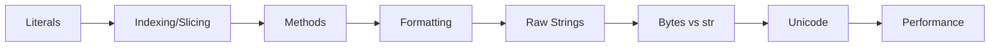

# Chapter 5: Strings


> **Previous:** [Loops and Iteration](./04-loops.md) | **Next:** [Lists](./06-lists.md)
## Learning Objectives

By the end of this chapter, students will be able to:
- Create strings using all literal forms
- Index and slice strings to extract substrings
- Use the extensive set of string methods
- Write formatted output with f-strings, format specifiers, and str.format()
- Distinguish raw strings, byte strings, and Unicode strings
- Process text data efficiently


## Chapter at a Glance

| Section | Topic | Key Concept |
|---------|-------|-------------|
| 5.1 | String Literals | Quotes, escape sequences, raw strings |
| 5.2 | Indexing and Slicing | start:stop:step, negative indices |
| 5.3 | String Methods | Search, case, split, join, replace |
| 5.4 | Formatting | f-strings, format specs, .format() |
| 5.5 | Raw Strings | r"" disables escaping |
| 5.6 | Bytes and str | encode()/decode() |
| 5.7 | Unicode | Normalization, code points |
| 5.8 | Performance | join() over += |


## Chapter Roadmap



## 5.1 String Literals

> **One-Sentence Takeaway:** Strings can use single, double, or triple quotes; escape sequences start with backslash.

Python offers several ways to write string literals:

```python
single = 'Hello'
double = "Hello"
triple = """Multi-line
string literal"""
triple_single = '''Also multi-line'''

# Adjacent literals are concatenated
joined = "Hello" " " "World"
print(joined)  # Hello World
```


> **Pro Tip:** Triple-quoted strings also preserve indentation. Use inspect.cleandoc() to clean up indented docstrings.
Triple-quoted strings preserve line breaks and are commonly used for docstrings:

```python
def example():
    """This is a docstring explaining the function."""
    pass
```

Escape sequences begin with a backslash:

```python
escaped = 'It\'s a "nice" day\nNew line\tTab'
raw = r'It\'s a "nice" day\nNew line\tTab'  # note: r'' still escapes the backslash for \'
print(escaped)
print(raw)
```

Output:
```
It's a "nice" day
New line	Tab
It\'s a "nice" day\nNew line\tTab
```

Common escape sequences: `\n` (newline), `\t` (tab), `\\` (backslash), `\'` (single quote), `\"` (double quote), `\0` (null), `\xHH` (hex byte), `\uHHHH` (Unicode BMP), `\UHHHHHHHH` (Unicode full).

## 5.2 Indexing and Slicing

> **One-Sentence Takeaway:** Slice syntax is s[start:stop:step] -- all components are optional and indices clamp automatically.

Strings are sequences of Unicode code points and support indexing:

```python
s = "Python"
#  P  y  t  h  o  n
#  0  1  2  3  4  5
# -6 -5 -4 -3 -2 -1

print(s[0])    # P
print(s[-1])   # n
print(s[2:5])  # tho  (start:end, exclusive of end)
print(s[:3])   # Pyt  (from beginning)
print(s[3:])   # hon  (to end)
print(s[::2])  # Pto  (step)
print(s[::-1]) # nohtyP  (reverse)
```


> **Remember:** s[::-1] reverses any sequence -- one of Python's most elegant idioms.
Slice semantics: `s[start:stop:step]`. All components are optional. Indices are clamped to the sequence bounds — no `IndexError` for out-of-range slices:

```python
print(s[0:100])  # Python
print(s[100:])   # "" (empty)
```

## 5.3 String Methods

> **One-Sentence Takeaway:** Strings are immutable -- every method returns a new string without modifying the original.

Strings are immutable — all methods return a new string.

### 5.3.1 Searching and Counting

```python
text = "hello world, hello universe"

print(text.count("hello"))      # 2
print(text.find("world"))       # 6  (first index, or -1)
print(text.index("world"))      # 6  (first index, or ValueError)
print(text.rfind("hello"))      # 13 (last index)
print(text.startswith("hello")) # True
print(text.endswith("verse"))   # True
```

### 5.3.2 Case Manipulation

```python
s = "Hello World"
print(s.upper())          # HELLO WORLD
print(s.lower())          # hello world
print(s.title())          # Hello World
print(s.capitalize())     # Hello world
print(s.swapcase())       # hELLO wORLD
print(s.casefold())       # hello world (aggressive lower for caseless matching)
```

`casefold()` is more aggressive than `lower()` for Unicode caseless comparison:

```python
print("ß".lower())    # ß
print("ß".casefold()) # ss
```

### 5.3.3 Stripping and Padding

```python
s = "  hello  \n"
print(s.strip())        # "hello"
print(s.lstrip())       # "hello  \n"
print(s.rstrip())       # "  hello"

print("###hello###".strip("#"))    # hello
print("42".zfill(5))               # 00042
print("hi".center(11))             # "    hi     "
print("hi".ljust(10, "-"))         # "hi--------"
print("hi".rjust(10, "-"))         # "--------hi"
```

### 5.3.4 Splitting and Joining

```python
csv = "a,b,c,d"
print(csv.split(","))             # ['a', 'b', 'c', 'd']
print(csv.split(",", 2))          # ['a', 'b', 'c,d']

lines = "one\ntwo\nthree"
print(lines.splitlines())         # ['one', 'two', 'three']

data = "a b  c   d"
print(data.split())               # ['a', 'b', 'c', 'd'] (any whitespace)

parts = ["Python", "is", "fun"]
print(" ".join(parts))            # "Python is fun"
print(", ".join(parts))           # "Python, is, fun"
```

### 5.3.5 Replacement

```python
s = "hello world"
print(s.replace("hello", "goodbye"))  # goodbye world
print(s.replace("l", "L"))            # heLLo worLd
print(s.replace("l", "L", 2))         # heLLo world (max 2 replacements)

# Translation table
table = str.maketrans("aeiou", "AEIOU")
print("hello world".translate(table))  # hEllO wOrld
```

### 5.3.6 Character Classification

```python
print("hello".isalpha())       # True
print("123".isdigit())         # True
print("abc123".isalnum())      # True
print("   ".isspace())         # True
print("Hello".istitle())       # True
print("42".isdecimal())        # True
print("42".isnumeric())        # True (also handles "â…¦")
print("hello".isidentifier())  # True
print("True".isidentifier())   # True
print("2fast".isidentifier())  # False (starts with digit)
```

### 5.3.7 Prefix and Suffix

```python
url = "https://python.org"
print(url.removeprefix("https://"))  # python.org
print(url.removesuffix(".org"))      # https://python
```

## 5.4 String Formatting

> **One-Sentence Takeaway:** f-strings with format specifiers are the recommended formatting approach in modern Python.

### 5.4.1 f-strings (Python 3.6+)

f-strings embed expressions inside `{}`:

```python
name = "Alice"
age = 30
print(f"{name} is {age} years old")   # Alice is 30 years old
print(f"{name!r}")                     # 'Alice'  (repr)
print(f"{2 * 21}")                     # 42
```

### 5.4.2 Format Specifiers

```python
pi = 3.1415926535
print(f"{pi:.2f}")            # 3.14
print(f"{pi:.4f}")            # 3.1416
print(f"{pi:10.2f}")          # "      3.14"  (width 10)
print(f"{pi:010.2f}")         # "0000003.14"

n = 42
print(f"{n:b}")               # 101010 (binary)
print(f"{n:o}")               # 52 (octal)
print(f"{n:x}")               # 2a (hex)
print(f"{n:X}")               # 2A (hex uppercase)
print(f"{n:d}")               # 42 (decimal)

pct = 0.125
print(f"{pct:.1%}")           # 12.5%

big = 1234567
print(f"{big:,}")             # 1,234,567
print(f"{big:_}")             # 1_234_567
```

Alignment:

```python
print(f"{'left':<10}|")       # "left      |"
print(f"{'center':^10}|")     # "  center  |"
print(f"{'right':>10}|")      # "     right|"
```

### 5.4.3 str.format()

The older `str.format()` method remains useful for dynamic format strings:

```python
template = "{} × {} = {}"
print(template.format(3, 4, 12))    # 3 × 4 = 12

template = "{name} is {age}"
print(template.format(name="Bob", age=25))  # Bob is 25

# Access attributes and items
point = (3, 4)
print("({0[0]}, {0[1]})".format(point))  # (3, 4)

# Format specifiers in format()
print("{:.2f}".format(pi))  # 3.14
```

### 5.4.4 %-formatting (Legacy)

The `%` operator is the oldest formatting method, still seen in legacy code:

```python
print("%s is %d years old" % ("Charlie", 35))  # Charlie is 35 years old
print("PI = %.3f" % 3.14159)                   # PI = 3.142
```

Avoid `%`-formatting in new code — use f-strings or `.format()`.

## 5.5 Raw Strings

> **One-Sentence Takeaway:** Raw strings treat backslashes as literal characters -- essential for regex and Windows paths.

Raw strings treat backslashes as literal characters. Prefix with `r` or `R`:

```python
normal = "C:\newfolder\text.txt"    # \n is newline, \t is tab
raw = r"C:\newfolder\text.txt"      # C:\newfolder\text.txt

# Useful for regex patterns
import re
pattern = r"\d+\.\d+"  # matches decimal numbers
```

## 5.6 Bytes and str

> **One-Sentence Takeaway:** str is Unicode text; bytes is binary data -- convert with .encode()/.decode().

`bytes` objects represent binary data. `str` objects represent Unicode text.

```python
b = b"hello"
print(type(b))         # <class 'bytes'>
print(b[0])            # 104  (int, not str)

# Encoding/decoding
s = "café"
encoded = s.encode("utf-8")
print(encoded)         # b'caf\xc3\xa9'
decoded = encoded.decode("utf-8")
print(decoded)         # café
```

Common encodings: `utf-8`, `latin-1`, `ascii`, `utf-16`. Wrong encoding causes `UnicodeDecodeError`:

```python
try:
    b"caf\xe9".decode("ascii")
except UnicodeDecodeError as e:
    print(e)  # 'ascii' codec can't decode byte 0xe9
```

## 5.7 Unicode Support

> **One-Sentence Takeaway:** Python 3 strings are Unicode; use unicodedata.normalize() for robust comparison.

Python 3 strings are Unicode. Characters outside the Basic Multilingual Plane (BMP) use surrogate pairs encoded as two code units:

```python
print("\u00e9")             # é
print("\U0001F600")         # 😀
print(len("\U0001F600"))    # 1 (one code point)

# Normalization
from unicodedata import normalize
s1 = "caf\u00e9"            # composed: café
s2 = "cafe\u0301"           # decomposed: cafe + combining accent
print(s1 == s2)             # False
print(normalize("NFC", s1) == normalize("NFC", s2))  # True
```

## 5.8 Performance Considerations

> **One-Sentence Takeaway:** Use "".join(parts) instead of repeated += for building strings -- it is O(n) instead of O(n^2).


> **Warning:** Building strings with += in a loop is O(n^2) -- use "".join() for O(n) performance.
String concatenation with `+` in a loop creates many intermediate strings — O(n²) time:

```python
# SLOW
s = ""
for i in range(10000):
    s += str(i)

# FAST
parts = []
for i in range(10000):
    parts.append(str(i))
s = "".join(parts)
```

For large text processing, `join()` is the preferred approach.


## Concept Comparison Table

| Feature | f-strings | str.format() | %-formatting |
|---|---|---|---|
| Syntax | f"{var}" | "{}".format(var | "%s" % var |
| Readability | Best | Good | Poor |
| Expression support | Yes | Limited | No |
| Python version | 3.6+ | 2.6+ | All |
| Recommendation | Preferred | Legacy support | Avoid |


## Quick Reference

```python
# String methods
s.upper(), s.lower(), s.strip()
s.split(), " ".join(list)
s.find(sub), s.replace(old, new)
s.startswith(p), s.endswith(s)

# f-strings
name = "Alice"
f"{name} is {age}"
f"{pi:.2f}"          # 3.14
f"{n:08b}"           # binary

# Raw strings
path = r"C:\Users\name"

# Encoding
s.encode("utf-8")
b.decode("utf-8")
```


## Cross-Application Matrix

| Area | Application | Relevant Section |
|------|-------------|------------------|
| Web Dev | Template rendering with f-strings | 5.4 |
| Data Science | CSV parsing with split/join | 5.3.4 |
| Security | Input sanitisation with strip | 5.3.3 |
| Regex | Raw strings for patterns | 5.5 |


## Chapter Quiz

**Q1.** What does "hello"[::-1] return?
- A) "hello"
- B) "olleh" **<-- Correct**
- C) "hlo"
- D) TypeError

**Q2.** Best method for building large string from parts?
- A) + concatenation
- B) "".join(parts) **<-- Correct**
- C) str.concat()
- D) Template strings

**Q3.** What does f"{3.14159:.2f}" produce?
- A) 3.14 **<-- Correct**
- B) 3.14159
- C) 3.142
- D) 3

**Q4.** Difference between str and bytes?
- A) str is text, bytes is binary **<-- Correct**
- B) bytes is faster
- C) str holds numbers
- D) No difference

**Q5.** Which escape is newline?
- A) \t
- B) \n **<-- Correct**
- C) \r
- D) \0


## Summary

- Strings are immutable sequences of Unicode code points.
- Indexing starts at 0; slicing uses `start:stop:step`.
- Rich method set: searching, case manipulation, splitting, joining, stripping, replacing.
- f-strings with format specifiers are the recommended formatting approach.
- Raw strings (`r""`) disable backslash escaping.
- `bytes` is for binary data; `str` is for text.
- Python 3 strings are Unicode; use `encode()`/`decode()` to convert.

## Exercises

### Review Questions

1. Why are strings immutable and what does that imply for methods?
2. What does `s[::-1]` do and why does it work?
3. Compare f-strings, `str.format()`, and `%`-formatting. Which is preferred in modern Python?
4. What is the difference between `bytes` and `str`?
5. How does `casefold()` differ from `lower()`?

### Application Problems

1. Write a program that reads a sentence and prints the word count, character count (excluding spaces), and the average word length.
2. Implement a simple password strength checker: evaluates length, presence of uppercase, lowercase, digits, and special characters. Print a strength rating.
3. Write a function `pluralize(n, singular, plural)` that returns either the singular or plural form based on `n`: e.g., `pluralize(1, "apple", "apples")` returns `"1 apple"`, `pluralize(3, "apple", "apples")` returns `"3 apples"`. Use an f-string.

### Challenge Problem

Build a simple template engine. Accept a template string with `{{name}}` and `{{age}}` style placeholders and a dictionary of replacements. Replace all placeholders. Then extend it to support loops: mark sections with `...{{item}}...` and repeat them. Test with a template for generating HTML list items.
