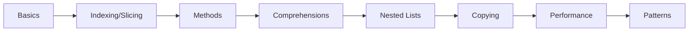

# Chapter 6: Lists


> **Previous:** [Strings](./05-strings.md) | **Next:** [Tuples and Sets](./07-tuples-sets.md)
## Learning Objectives

By the end of this chapter, students will be able to:
- Create and manipulate lists using all available methods
- Index, slice, and traverse lists idiomatically
- Use list comprehensions to create lists declaratively
- Work with nested lists and multidimensional structures
- Distinguish shallow and deep copying and select the appropriate copy strategy


## Chapter at a Glance

| Section | Topic | Key Concept |
|---------|-------|-------------|
| 6.1 | List Basics | Ordered, mutable, heterogeneous |
| 6.2 | Indexing and Slicing | Slice assignment, insertion, shrinking |
| 6.3 | List Methods | append, extend, remove, pop, sort |
| 6.4 | List Comprehensions | Declarative list construction |
| 6.5 | Nested Lists | Matrix representation, transpose |
| 6.6 | Shallow vs Deep Copy | copy() vs deepcopy() |
| 6.7 | Performance | O(1) append, O(n) insert(0) |
| 6.8 | Common Patterns | Find all indices, dedup, partition |


## Chapter Roadmap



## 6.1 List Basics

> **One-Sentence Takeaway:** Lists are ordered, mutable collections that can hold mixed types.

A list is an ordered, mutable collection of objects. Lists can contain mixed types and are resizable:

```python
empty = []
numbers = [1, 2, 3, 4, 5]
mixed = [1, "hello", 3.14, True, None]
nested = [[1, 2], [3, 4], [5, 6]]

print(type(empty))          # <class 'list'>
print(len(numbers))         # 5
```

Lists are created with square brackets or the `list()` constructor:

```python
from_range = list(range(5))       # [0, 1, 2, 3, 4]
from_string = list("hello")       # ['h', 'e', 'l', 'l', 'o']
from_tuple = list((1, 2, 3))      # [1, 2, 3]
```

## 6.2 Indexing and Slicing

> **One-Sentence Takeaway:** Slice assignment can replace, shrink, or insert elements of different lengths.

Indexing follows the same semantics as strings:

```python
a = [10, 20, 30, 40, 50]
print(a[0])      # 10
print(a[-1])     # 50
print(a[1:4])    # [20, 30, 40]
print(a[:3])     # [10, 20, 30]
print(a[::2])    # [10, 30, 50]
print(a[::-1])   # [50, 40, 30, 20, 10]
```

Assignment to a slice replaces that portion:

```python
a[1:3] = [25, 35]
print(a)            # [10, 25, 35, 40, 50]

a[1:3] = [100]     # shrinking
print(a)            # [10, 100, 40, 50]

a[1:1] = [20, 30]  # inserting
print(a)            # [10, 20, 30, 100, 40, 50]
```

## 6.3 List Methods

> **One-Sentence Takeaway:** append() is O(1); insert(0) is O(n) -- use deque for fast left-side operations.

### 6.3.1 Adding Elements

```python
items = [1, 2, 3]
items.append(4)            # [1, 2, 3, 4]
items.extend([5, 6])       # [1, 2, 3, 4, 5, 6]
items.insert(0, 0)         # [0, 1, 2, 3, 4, 5, 6]
items.insert(3, 2.5)       # [0, 1, 2, 2.5, 3, 4, 5, 6]
print(items)
```

`append()` adds one element in O(1) amortised time. `extend()` adds all elements from an iterable. 
> **Pro Tip:** Use collections.deque for O(1) left-side operations if you frequently insert at the beginning.
`insert()` is O(n) because elements must shift.

### 6.3.2 Removing Elements

```python
items = [10, 20, 30, 20, 40]
items.remove(20)           # removes first occurrence: [10, 30, 20, 40]
popped = items.pop()       # removes and returns last: 40, items = [10, 30, 20]
popped_first = items.pop(0)  # removes and returns index 0: 10, items = [30, 20]
items.clear()              # []
print(items)
```

`remove()` raises `ValueError` if the element is not found. `pop(i)` raises `IndexError` if `i` is out of range.

### 6.3.3 Searching and Counting

```python
a = [1, 2, 3, 2, 4, 2, 5]
print(a.index(2))          # 1 (first index)
print(a.index(2, 2))       # 3 (start search at index 2)
print(a.count(2))          # 3
print(2 in a)              # True
```

### 6.3.4 Sorting and Reversing

```python
nums = [3, 1, 4, 1, 5, 9, 2]
nums.sort()                # in-place sort: [1, 1, 2, 3, 4, 5, 9]
nums.sort(reverse=True)    # [9, 5, 4, 3, 2, 1, 1]
nums.reverse()             # in-place reversal: [1, 1, 2, 3, 4, 5, 9]

words = ["banana", "apple", "cherry", "date"]
words.sort(key=len)        # ['date', 'apple', 'banana', 'cherry']
words.sort(key=lambda w: w[-1])  # sort by last character
print(words)

# sorted() returns a new list
original = [3, 1, 2]
sorted_copy = sorted(original)
print(original, sorted_copy)  # [3, 1, 2] [1, 2, 3]
```

### 6.3.5 Copying

```python
a = [1, 2, 3]
b = a.copy()               # shallow copy (equivalent to a[:])
b.append(4)
print(a)  # [1, 2, 3]  (unchanged)
print(b)  # [1, 2, 3, 4]
```

## 6.4 List Comprehensions

> **One-Sentence Takeaway:** List comprehensions are faster and more readable than manual for+append loops.

List comprehensions provide a concise syntax for creating lists:

```python
# Basic
squares = [x ** 2 for x in range(10)]
print(squares)  # [0, 1, 4, 9, 16, 25, 36, 49, 64, 81]

# With condition
evens = [x for x in range(20) if x % 2 == 0]
print(evens)    # [0, 2, 4, 6, 8, 10, 12, 14, 16, 18]

# Nested loops
pairs = [(x, y) for x in range(3) for y in range(3)]
print(pairs)
# [(0,0), (0,1), (0,2), (1,0), (1,1), (1,2), (2,0), (2,1), (2,2)]

# Conditional expression (ternary inside comprehension)
labels = ["even" if x % 2 == 0 else "odd" for x in range(5)]
print(labels)  # ['even', 'odd', 'even', 'odd', 'even']

# Flatten a matrix
matrix = [[1, 2, 3], [4, 5, 6], [7, 8, 9]]
flat = [elem for row in matrix for elem in row]
print(flat)  # [1, 2, 3, 4, 5, 6, 7, 8, 9]
```

The equivalent expanded form:

```python
result = []
for x in range(10):
    if x % 2 == 0:
        result.append(x ** 2)
```


> **Remember:** List comprehensions replace map() and filter() in most cases -- they are more Pythonic.
List comprehensions are generally more readable and faster than manual `for` loops with `append()`.

## 6.5 Nested Lists and Matrices

> **One-Sentence Takeaway:** Use [[0]*3 for _ in range(3)] not [[0]*3]*3 to avoid shared row references.

```python
# 3x3 matrix
matrix = [
    [1, 2, 3],
    [4, 5, 6],
    [7, 8, 9]
]

# Accessing elements
print(matrix[1][2])   # 6

# Row-wise iteration
for row in matrix:
    print(row)

# Transpose
transpose = [[row[i] for row in matrix] for i in range(3)]
print(transpose)  # [[1, 4, 7], [2, 5, 8], [3, 6, 9]]
```


> **Warning:** [[0]*3]*3 creates three references to the same inner list -- mutating one affects all rows.
Creating nested lists requires care:

```python
# WRONG — creates 3 references to the same inner list
bad = [[0] * 3] * 3
bad[0][0] = 1
print(bad)  # [[1, 0, 0], [1, 0, 0], [1, 0, 0]]

# CORRECT — creates 3 independent lists
good = [[0] * 3 for _ in range(3)]
good[0][0] = 1
print(good)  # [[1, 0, 0], [0, 0, 0], [0, 0, 0]]
```

## 6.6 Shallow vs Deep Copy

> **One-Sentence Takeaway:** Shallow copies share nested objects; copy.deepcopy() creates fully independent copies.

A shallow copy creates a new list but the elements are the same objects:

```python
original = [[1, 2], [3, 4]]
shallow = original.copy()
shallow[0][0] = 99
print(original[0][0])  # 99  (shared inner list)

shallow.append([5, 6])  # does not affect original
print(len(original))    # 2
```

A deep copy creates independent copies of all nested objects:

```python
import copy
original = [[1, 2], [3, 4]]
deep = copy.deepcopy(original)
deep[0][0] = 99
print(original[0][0])   # 1  (independent)
```

`copy.copy()` performs a shallow copy. `copy.deepcopy()` handles arbitrarily nested structures, including circular references.

## 6.7 List Operations and Performance

> **One-Sentence Takeaway:** Indexing and append are O(1); insert/remove at beginning are O(n).

| Operation | Complexity |
|-----------|-----------|
| Index/assignment | O(1) |
| Append | O(1) amortised |
| Pop (last) | O(1) |
| Pop (first) | O(n) |
| Insert/remove (middle) | O(n) |
| Search (`in`) | O(n) |
| Slice | O(k) for k elements |
| Sort | O(n log n) |

For frequent insertions at the beginning, consider `collections.deque`.

## 6.8 Common Patterns

> **One-Sentence Takeaway:** Combine enumerate() with comprehensions for index-based operations.

```python
# Find all indices of a value
def find_all(lst, value):
    return [i for i, v in enumerate(lst) if v == value]

print(find_all([1, 2, 3, 2, 4, 2], 2))  # [1, 3, 5]

# Remove duplicates while preserving order
def unique(seq):
    seen = set()
    return [x for x in seq if not (x in seen or seen.add(x))]

print(unique([3, 1, 2, 1, 3, 4, 2]))  # [3, 1, 2, 4]

# Partition list by condition
values = [1, 2, 3, 4, 5, 6]
evens = [x for x in values if x % 2 == 0]
odds = [x for x in values if x % 2 == 1]
```


## Concept Comparison Table

| Operation | List | Tuple | deque |
|---|---|---|---|
| Mutability | Mutable | Immutable | Mutable |
| Indexing | O(1) | O(1) | O(1) |
| Append right | O(1) amort | N/A | O(1) |
| Append left | O(n) | N/A | O(1) |
| Pop right | O(1) | N/A | O(1) |
| Pop left | O(n) | N/A | O(1) |


## Quick Reference

```python
# Create
empty = []
nums = [1, 2, 3]
from_range = list(range(5))

# Methods
items.append(x)
items.extend(iterable)
items.insert(i, x)
items.remove(x)
items.pop()
items.sort()
items.reverse()
items.copy()

# Comprehensions
[x**2 for x in range(10)]
[x for x in items if x > 0]

# Copy
shallow = items.copy()
deep = copy.deepcopy(items)
```


## Cross-Application Matrix

| Area | Application | Relevant Section |
|------|-------------|------------------|
| Algorithms | Matrix ops with nested lists | 6.5 |
| Data Processing | Filter with comprehensions | 6.4 |
| Game Dev | Board as 2D lists | 6.5 |
| Web Scraping | Storing parsed results | 6.3 |


## Chapter Quiz

**Q1.** Time complexity of list.insert(0, x)?
- A) O(1)
- B) O(log n)
- C) O(n) **<-- Correct**
- D) O(n^2)

**Q2.** What does `[[0]*3 for _ in range(3)]` create?
- A) Shared rows
- B) Independent rows **<-- Correct**
- C) Flat list
- D) Syntax error

**Q3.** Which method removes and returns last element?
- A) remove()
- B) pop() **<-- Correct**
- C) delete()
- D) clear()

**Q4.** Output of `[x*2 for x in range(5) if x%2==0]`?
- A) [0,4,8,12,16]
- B) [2,6,10,14,18]
- C) [0,4,8] **<-- Correct**
- D) [0,2,4,6,8]

**Q5.** Which import for deepcopy()?
- A) import deepcopy
- B) import copy **<-- Correct**
- C) from sys import deepcopy
- D) import collections


## Summary

- Lists are ordered, mutable, and heterogeneous.
- Indexing, slicing, and slice assignment are flexible.
- Methods: `append()`, `extend()`, `insert()`, `remove()`, `pop()`, `sort()`, `reverse()`, `copy()`.
- List comprehensions are preferred over manual `for`+`append` loops.
- Nested lists require careful creation to avoid shared references.
- `copy.deepcopy()` creates fully independent copies of nested structures.

## Exercises

### Review Questions

1. What is the difference between `append()` and `extend()`?
2. Why does `[[0] * 3] * 3` produce a matrix where changing one row affects all rows?
3. When should you use `sorted(x)` vs `x.sort()`?
4. What is the time complexity of `list.insert(0, x)` and why?
5. How does a shallow copy differ from a deep copy?

### Application Problems

1. Write a function `rotate(lst, k)` that rotates a list to the right by `k` positions using slicing: `rotate([1, 2, 3, 4, 5], 2)` → `[4, 5, 1, 2, 3]`.
2. Use a list comprehension to generate the first 20 Fibonacci numbers. Then filter to keep only odd numbers.
3. Write a Tic-Tac-Toe board as a 3×3 list of strings. Write functions to print the board, check if a player has won, and check if the board is full.

### Challenge Problem

Implement a sparse matrix as a list of lists, but optimise it using a dictionary mapping `(row, col)` indices to values (default 0). Support addition of two sparse matrices. Use `copy.deepcopy` to ensure operations do not mutate operands. Compare memory usage for a 1000×1000 matrix with 100 non-zero entries against a full 1000×1000 list-of-lists representation.
