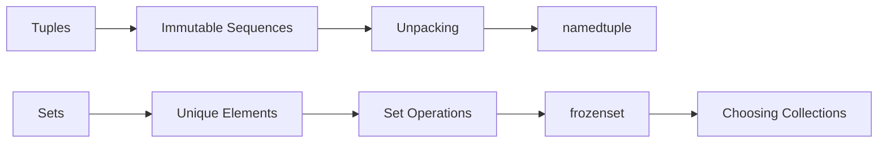
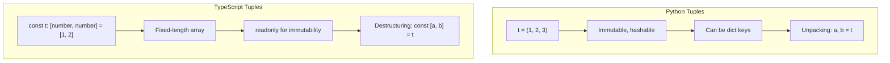

# Chapter 7: Tuples and Sets


> **Previous:** [Lists](./06-lists.md) | **Next:** [Dictionaries](./08-dictionaries.md)
## Learning Objectives

By the end of this chapter, students will be able to:
- Create and use tuples for immutable sequences
- Unpack tuples into variables with the star operator
- Use `namedtuple` for lightweight data objects
- Perform set operations including union, intersection, difference, and symmetric difference
- Choose between sets, frozensets, and other collections based on requirements
- Write set comprehensions

<!-- Image Gallery -->
<section class="lesson-visuals" aria-label="Visual learning resources">
  <header><span>VISUAL LEARNING</span><h2>See it. Review it. Remember it.</h2></header>
  <a class="lesson-visual-card" href="../../../assets/images/lessons/python-programming/07-tuples-sets/.png" target="_blank" rel="noopener">
    
    <span><strong>Handwritten notes</strong>Condensed notes for deliberate review.</span>
  </a>
  <a class="lesson-visual-card" href="../../../assets/images/lessons/python-programming/07-tuples-sets/.png" target="_blank" rel="noopener">
    
    <span><strong>Sticky-note revision</strong>Fast recall prompts for revision.</span>
  </a>
  <a class="lesson-visual-card" href="../../../assets/images/lessons/python-programming/07-tuples-sets/.png" target="_blank" rel="noopener">
    
    <span><strong>Visual concept guide</strong>A connected explanation of the key ideas.</span>
  </a>
</section>
<!-- End Image Gallery -->


## Chapter at a Glance

| Section | Topic | Key Concept |
|---------|-------|-------------|
| 7.1 | Tuples | Immutable ordered sequences |
| 7.2 | Unpacking | Star operator, extended unpacking |
| 7.3 | namedtuple | Lightweight data objects |
| 7.4 | Sets | Unordered unique elements |
| 7.5 | frozenset | Immutable hashable sets |
| 7.6 | Choosing | List vs tuple vs set vs frozenset |
| 7.7 | Patterns | Deduplication, common elements |


## Chapter Roadmap



## 7.1 Tuples

> **One-Sentence Takeaway:** Tuples are immutable sequences created with commas -- use them for fixed data and dict keys.
> **Pro Tip:** Use tuples as dictionary keys -- they are hashable. Lists cannot be dict keys.

A tuple is an ordered, immutable sequence of objects. Tuples are created with parentheses or just commas:

```python
empty = ()
single = (42,)          # trailing comma required for single-element tuple
coordinates = (3, 4)
without_parens = 3, 4   # tuple packing
print(type(without_parens))  # <class 'tuple'>
```

### 7.1.1 Tuple Operations


Tuples support indexing, slicing, concatenation, and repetition:

```python
t = (0, 1, 2, 3, 4, 5)
print(t[0])      # 0
print(t[-1])     # 5
print(t[2:4])    # (2, 3)
print(t[::-1])   # (5, 4, 3, 2, 1, 0)
print(t + (6,))  # (0, 1, 2, 3, 4, 5, 6)
print(t * 2)     # (0, 1, 2, 3, 4, 5, 0, 1, 2, 3, 4, 5)
print(3 in t)    # True
print(len(t))    # 6
```

Tuples are immutable -- attempting to modify one raises `TypeError`:

```python
t[0] = 10  # TypeError: 'tuple' object does not support item assignment
```

### 7.1.2 Why Use Tuples?


Tuples are used where immutability matters:
- Dictionary keys (lists cannot be keys)
- Return values from functions
- Representing fixed collections like coordinates, RGB values, database records

```python
def min_max(lst):
    return min(lst), max(lst)  # returns a tuple

result = min_max([3, 1, 4, 1, 5, 9])
print(result)   # (1, 9)
print(type(result))  # <class 'tuple'>
```

### TypeScript Parallel

```typescript
// TypeScript: tuples are typed arrays with fixed lengths
// Declared with [type, type, ...] syntax:
const point: [number, number] = [3, 4];
console.log(point[0]);  // 3
console.log(point[1]);  // 4

// TypeScript tuples are NOT immutable by default
// Use readonly for immutability:
const readonlyPoint: readonly [number, number] = [3, 4];
// readonlyPoint[0] = 10;  // Error

// Destructuring (like Python unpacking):
const [x, y] = point;
console.log(x, y);  // 3 4

// Named tuple type for readability:
type Point = readonly [number, number];
function minMax(lst: number[]): [number, number] {
    return [Math.min(...lst), Math.max(...lst)];
}
const result = minMax([3, 1, 4, 1, 5, 9]);
console.log(result);  // [1, 9]
```



## 7.2 Tuple Unpacking

> **One-Sentence Takeaway:** Extended unpacking with * captures remaining elements into a list.

Unpacking assigns tuple elements to variables in one statement:

```python
point = (10, 20)
x, y = point
print(x, y)     # 10 20

# Swapping values
a, b = 1, 2
a, b = b, a
print(a, b)     # 2 1

# Extended unpacking with *
first, *middle, last = [1, 2, 3, 4, 5]
print(first)    # 1
print(middle)   # [2, 3, 4]
print(last)     # 5
```

The star operator collects remaining elements. Only one starred expression is allowed:

```python
head, *tail = range(5)
print(head)  # 0
print(tail)  # [1, 2, 3, 4]

*_, last = [10, 20, 30, 40, 50]
print(last)  # 50
```

### TypeScript Parallel

```typescript
// TypeScript: destructuring (same concept, different syntax)
const point: [number, number] = [10, 20];
const [x, y] = point;
console.log(x, y);  // 10 20

// Swapping (requires temp or array)
let a = 1, b = 2;
[a, b] = [b, a];   // same swap technique in TS!
console.log(a, b);  // 2 1

// Rest/spread for extended unpacking (ES2018+):
const [first, ...middle] = [1, 2, 3, 4, 5];
console.log(first);   // 1
console.log(middle);  // [2, 3, 4]

// The rest element must be at the end (no *middle in middle)
const [, , ...rest] = [10, 20, 30, 40, 50];
console.log(rest);  // [30, 40, 50]
```

| Feature | Python | TypeScript |
|---------|--------|------------|
| Basic unpacking | `x, y = (1, 2)` | `const [x, y] = [1, 2]` |
| Swap | `a, b = b, a` | `[a, b] = [b, a]` |
| Rest | `first, *rest = lst` | `const [first, ...rest] = lst` |
| Ignore | `*_, last = lst` | `const [_, , last] = lst` |
| Nested unpacking | `(a, (b, c)) = pair` | `const [a, [b, c]] = pair` |

## 7.3 namedtuple

> **One-Sentence Takeaway:** namedtuple creates tuple subclasses with named fields -- more readable than bare tuples.

`namedtuple` creates tuple subclasses with named fields:

```python
from collections import namedtuple

Point = namedtuple("Point", ["x", "y"])
p = Point(3, 4)
print(p.x, p.y)   # 3 4
print(p[0], p[1])  # 3 4 (still works as tuple)
x, y = p           # unpacking works
print(p)           # Point(x=3, y=4)
```

Named fields improve code readability compared to bare tuples:

```python
# With namedtuple -- self-documenting
Employee = namedtuple("Employee", ["name", "age", "department", "salary"])
emp = Employee("Alice", 30, "Engineering", 95000)
print(emp.department)  # Engineering
```

```python
print(p._asdict())   # {'x': 3, 'y': 4}
p2 = p._replace(x=5)  # returns new namedtuple
print(p2)            # Point(x=5, y=4)
print(p._fields)     # ('x', 'y')
```

### TypeScript Parallel

```typescript
// TypeScript: interfaces/classes for the namedtuple equivalent
interface Point {
    readonly x: number;
    readonly y: number;
}

// Simple object literal (most common):
const p: Point = { x: 3, y: 4 };
console.log(p.x, p.y);  // 3 4

// Interface with methods:
interface Employee {
    readonly name: string;
    readonly age: number;
    readonly department: string;
    readonly salary: number;
}

const emp: Employee = {
    name: "Alice",
    age: 30,
    department: "Engineering",
    salary: 95000
};
console.log(emp.department);  // Engineering

// Python's namedtuple is between a tuple and a class
// TypeScript has explicit interfaces/classes instead
```

## 7.4 Sets

> **One-Sentence Takeaway:** Sets provide O(1) membership testing and powerful algebra: union, intersection, difference.

> **Warning:** Sets are unordered -- never rely on element position. Use dict.fromkeys() if order matters.
A set is an unordered collection of unique, hashable elements:

```python
empty = set()      # not {} (that's an empty dict)
numbers = {1, 2, 3, 4, 5}
mixed = {1, "hello", (1, 2)}  # tuples are hashable
```

### 7.4.1 Creating Sets


```python
from_list = set([1, 2, 3, 2, 1])   # {1, 2, 3} -- duplicates removed
from_string = set("hello")          # {'h', 'e', 'l', 'o'} -- unordered
from_generator = set(x ** 2 for x in range(5))
```

### 7.4.2 Set Methods


```python
s = {1, 2, 3, 4, 5}
s.add(6)             # {1, 2, 3, 4, 5, 6}
s.discard(3)         # {1, 2, 4, 5, 6} -- no error if missing
s.remove(2)          # {1, 4, 5, 6}     -- KeyError if missing
popped = s.pop()     # removes and returns an arbitrary element
s.clear()            # set()

print(len({1, 2, 3}))           # 3
print(2 in {1, 2, 3})           # True (O(1) on average)
```

### 7.4.3 Set Operations


```python
a = {1, 2, 3, 4, 5}
b = {4, 5, 6, 7, 8}

print(a | b)   # Union:        {1, 2, 3, 4, 5, 6, 7, 8}
print(a & b)   # Intersection: {4, 5}
print(a - b)   # Difference:   {1, 2, 3}
print(a ^ b)   # Symmetric diff: {1, 2, 3, 6, 7, 8}

# Comparison
print({1, 2} <= {1, 2, 3})    # subset: True
print({1, 2, 3} >= {1, 2})    # superset: True
print({1, 2}.isdisjoint({3}))  # True (no common elements)
```

### 7.4.4 Set Comprehensions


```python
squares = {x ** 2 for x in range(10)}
even_squares = {x ** 2 for x in range(20) if x % 2 == 0}
```

### TypeScript Parallel

```typescript
// TypeScript: Set class (ES2015+)
const empty = new Set<number>();
const numbers = new Set([1, 2, 3, 4, 5]);

// Methods:
numbers.add(6);              // add
numbers.delete(3);           // discard (returns boolean - no error if missing)
// numbers.delete(3);        // remove equivalent
// No direct pop equivalent - get first value with next()
numbers.clear();

// Membership testing:
console.log(numbers.has(2));  // true (like Python's `in`)
console.log(numbers.size);    // 3  (like Python's len())

// Set operations (no built-in -- manual):
const a = new Set([1, 2, 3, 4, 5]);
const b = new Set([4, 5, 6, 7, 8]);

// Union:
const union = new Set([...a, ...b]);
console.log(union);  // {1, 2, 3, 4, 5, 6, 7, 8}

// Intersection:
const intersection = new Set([...a].filter(x => b.has(x)));
console.log(intersection);  // {4, 5}

// Difference:
const difference = new Set([...a].filter(x => !b.has(x)));
console.log(difference);  // {1, 2, 3}

// Symmetric difference:
const symDiff = new Set([...a].filter(x => !b.has(x))
    .concat([...b].filter(x => !a.has(x))));
console.log(symDiff);  // {1, 2, 3, 6, 7, 8}

// Comparison:
console.log([1, 2].every(x => a.has(x)));  // subset check
```

| Operation | Python | TypeScript |
|-----------|--------|------------|
| Create | `{1, 2, 3}` | `new Set([1, 2, 3])` |
| Add | `s.add(x)` | `s.add(x)` |
| Remove | `s.discard(x)` / `s.remove(x)` | `s.delete(x)` |
| Check | `x in s` | `s.has(x)` |
| Size | `len(s)` | `s.size` |
| Union | `a \| b` | `new Set([...a, ...b])` |
| Intersection | `a & b` | `new Set([...a].filter(x => b.has(x)))` |
| Difference | `a - b` | `new Set([...a].filter(x => !b.has(x)))` |

## 7.5 frozenset

> **One-Sentence Takeaway:** frozenset is an immutable, hashable set that can serve as dictionary keys.

```python
fs = frozenset([1, 2, 3, 3, 2])
print(fs)         # frozenset({1, 2, 3})
print(fs | frozenset([3, 4]))  # frozenset({1, 2, 3, 4})

d = {frozenset({1, 2}): "value"}
```

### TypeScript Parallel

```typescript
// TypeScript: no direct frozenset equivalent
// Use ReadonlySet<number> for a read-only view:
const fs: ReadonlySet<number> = new Set([1, 2, 3]);
// fs.add(4);  // Error: Property 'add' does not exist on type 'ReadonlySet'
```

## 7.6 Choosing Between Data Structures

| Property | List | Tuple | Set | frozenset |
|----------|------|-------|-----|-----------|
| Ordered | Yes | Yes | No | No |
| Mutable | Yes | No | Yes | No |
| Duplicates | Yes | Yes | No | No |
| Hashable | No | Yes | No | Yes |
| Indexing | Yes | Yes | No | No |
| Search | O(n) | O(n) | O(1) avg | O(1) avg |

## 7.7 Practical Patterns

> **One-Sentence Takeaway:** Use dict.fromkeys(seq) for ordered deduplication or set() when order does not matter.

### 7.7.1 Removing Duplicates


```python
items = [3, 1, 2, 1, 3, 4, 2]
unique_items = list(set(items))
print(unique_items)  # [1, 2, 3, 4] (but order lost)

# Preserve order (Python 3.7+)
unique_ordered = list(dict.fromkeys(items))
print(unique_ordered)  # [3, 1, 2, 4]
```

### 7.7.2 Finding Common Elements


```python
def common_elements(lst1, lst2):
    return list(set(lst1) & set(lst2))

print(common_elements([1, 2, 3, 4], [3, 4, 5, 6]))  # [3, 4]
```

### TypeScript Parallel

```typescript
// Deduplicate with Set:
const items: number[] = [3, 1, 2, 1, 3, 4, 2];
const uniqueItems = [...new Set(items)];
console.log(uniqueItems);  // [3, 1, 2, 4]

// Preserve order (Set iteration is insertion-order in JS):
console.log(uniqueItems);  // [3, 1, 2, 4] (order maintained)

// Common elements:
function commonElements<T>(lst1: T[], lst2: T[]): T[] {
    const set2 = new Set(lst2);
    return [...new Set(lst1)].filter(x => set2.has(x));
}
console.log(commonElements([1, 2, 3, 4], [3, 4, 5, 6]));  // [3, 4]
```

## Practical Takeaways

| Concept | Key Point | Common Mistake |
|---------|-----------|----------------|
| Tuples | Immutable, hashable, for fixed data | Using `(42)` instead of `(42,)` for single-element tuple |
| Unpacking | `*` captures into list | Forgetting only one starred expression allowed |
| namedtuple | Named fields + tuple compatibility | Using bare tuples when namedtuple clarifies intent |
| Sets | O(1) membership, deduplication, algebra | Creating `{}` instead of `set()` for empty set |
| frozenset | Hashable immutable set | Using mutable set as dict key |
| Python vs TS | TS has tuples (arrays) and Set class, no frozenset | Expecting Python's `\|` operator syntax in TS |

## Concept Comparison Table

| Property | List | Tuple | Set | frozenset |
|---|---|---|---|---|
| Ordered | Yes | Yes | No | No |
| Mutable | Yes | No | Yes | No |
| Duplicates | Yes | Yes | No | No |
| Hashable | No | Yes | No | Yes |
| Search | O(n) | O(n) | O(1) | O(1) |


## Quick Reference

```python
# Tuple
t = (1, 2, 3)
x, y, z = t
first, *rest = t

# namedtuple
from collections import namedtuple
Point = namedtuple("Point", ["x", "y"])
p = Point(3, 4)
print(p.x, p.y)

# Set
s = {1, 2, 3}
s.add(4)
s.discard(1)

# Set operations
a | b  # union
a & b  # intersection
a - b  # difference
a ^ b  # symmetric diff

# frozenset
fs = frozenset([1, 2, 3])
```


## Cross-Application Matrix

| Area | Application | Relevant Section |
|------|-------------|------------------|
| Data Cleaning | Deduplication with sets | 7.7.1 |
| Graph Algorithms | Adjacency with sets | 7.4 |
| Configuration | Named fields with namedtuple | 7.3 |
| API | Return multiple values as tuple | 7.1 |


## Chapter Quiz

**Q1.** How to create a single-element tuple?
- A) (42)
- B) (42,) **<-- Correct**
- C) tuple(42)
- D) [42]

**Q2.** What membership test time does a set offer?
- A) O(n)
- B) O(log n)
- C) O(1) average **<-- Correct**
- D) O(n^2)

**Q3.** What does `a - b` do with two sets?
- A) Union
- B) Intersection
- C) Difference **<-- Correct**
- D) Symmetric diff

**Q4.** Which can be a dictionary key?
- A) List
- B) Set
- C) Tuple **<-- Correct**
- D) Dictionary

**Q5.** Difference between s.discard(x) and s.remove(x)?
- A) discard raises if missing
- B) remove raises if missing **<-- Correct**
- C) Same thing
- D) discard works on lists


```typescript
// Chapter 7: TypeScript Tuple & Set Equivalents
// Python: tuple literal → TypeScript: readonly array
const point: readonly [number, number] = [3, 4];
console.log(point[0], point[1]);  // 3 4

// Python: tuple unpacking → TypeScript: destructuring
const [x, y] = point;
console.log(x, y);  // 3 4

// Python: namedtuple → TypeScript: class or interface
interface Student {
  name: string;
  id: number;
  grades: number[];
}
const alice: Student = { name: "Alice", id: 1, grades: [90, 85, 92] };
// Python equivalent: Student = namedtuple("Student", ["name", "id", "grades"])

// Python: rest unpacking (first, *rest = items) → TypeScript: rest
const items: number[] = [1, 2, 3, 4, 5];
const [first, ...rest] = items;
console.log(first);  // 1
console.log(rest);   // [2, 3, 4, 5]

// Python: set literal → TypeScript: Set
const setA: Set<number> = new Set([1, 2, 3, 4]);
const setB: Set<number> = new Set([3, 4, 5, 6]);

// Python: membership (x in s) → TypeScript: .has()
console.log(setA.has(2));  // true  (Python: 2 in setA)

// Python: set operations must be implemented manually
// union: A | B
const union = new Set([...setA, ...setB]);
console.log(union);  // Set {1, 2, 3, 4, 5, 6}

// intersection: A & B
const intersection = new Set([...setA].filter((x) => setB.has(x)));
console.log(intersection);  // Set {3, 4}

// difference: A - B
const difference = new Set([...setA].filter((x) => !setB.has(x)));
console.log(difference);  // Set {1, 2}

// symmetric difference: A ^ B
const symmetricDiff = new Set(
  [...setA].filter((x) => !setB.has(x)).concat(
    [...setB].filter((x) => !setA.has(x))
  )
);

// Python: frozenset → TypeScript: no direct equivalent
// Use ReadonlySet<T> type or wrap in a frozen object
const frozen: ReadonlySet<number> = new Set([1, 2, 3]);
// frozen.add(4);  // TypeScript prevents mutation at compile time
```

### TypeScript Advanced Set & Tuple Patterns

```typescript
// Python: Jaccard similarity → TypeScript implementation
function jaccardSimilarity<T>(a: Set<T>, b: Set<T>): number {
  const intersection = new Set([...a].filter((x) => b.has(x)));
  const union = new Set([...a, ...b]);
  return intersection.size / union.size;
}
const set1 = new Set([1, 2, 3, 4]);
const set2 = new Set([3, 4, 5, 6]);
console.log(jaccardSimilarity(set1, set2));  // 0.333...

// Python: frozenset as dict key → TypeScript: Map with tuple keys
const cache = new Map<string, number>();
const makeKey = (...args: unknown[]): string => JSON.stringify(args);
cache.set(makeKey(1, 2, 3), 42);
console.log(cache.get(makeKey(1, 2, 3)));  // 42

// Python: namedtuple for data → TypeScript: readonly tuple
type Color = readonly [number, number, number, number];  // RGBA
const red: Color = [255, 0, 0, 255];
// red[0] = 0;  // TypeScript error: Cannot assign to readonly

// Python: set comprehension → TypeScript: Set from array methods
const squares = new Set([1, 2, 3, 4, 5].map((x) => x * x));
console.log(squares);  // Set {1, 4, 9, 16, 25}

// Python: tuple as record → TypeScript: discriminated union
type Status = ["success", string] | ["error", Error];
function handleResult(result: Status): void {
  if (result[0] === "success") {
    console.log(`OK: ${result[1]}`);  // TypeScript narrows the type
  } else {
    console.error(`FAIL: ${result[1].message}`);
  }
}

// Python: multiple return as tuple → TypeScript: destructured return
function minMax(values: number[]): [number, number] {
  let min = Infinity, max = -Infinity;
  for (const v of values) { if (v < min) min = v; if (v > max) max = v; }
  return [min, max];
}
const [min, max] = minMax([3, 1, 4, 1, 5]);
console.log(min, max);  // 1, 5
```

### TypeScript Collection Operations

```typescript
// Python: set as membership filter → TypeScript: Set.has
function removeDuplicates<T>(items: T[]): T[] {
  return [...new Set(items)];
}
console.log(removeDuplicates([1, 2, 2, 3, 3, 3]));  // [1, 2, 3]

// Python: set operations on strings → TypeScript: Set from string
const vowels = new Set("aeiou".split(""));
const word = "typescript";
const foundVowels = word.split("").filter((c) => vowels.has(c));
console.log(foundVowels);  // ["e", "i"]

// Python: tuple as dict key → TypeScript: Map with composite key
const distances = new Map<string, number>();
const coordKey = (x: number, y: number): string => `${x},${y}`;
distances.set(coordKey(0, 0), 0);
distances.set(coordKey(0, 1), 1);
console.log(distances.get(coordKey(0, 1)));  // 1

// Python: collections.Counter from set difference
function commonElements<T>(a: T[], b: T[]): T[] {
  const setB = new Set(b);
  return a.filter((x) => setB.has(x));
}

// Python: tuple swap → TypeScript: destructuring swap
let x2 = 10, y2 = 20;
[x2, y2] = [y2, x2];  // swap (same as Python)

// Python: sorted(set) → TypeScript: sort with Set
function uniqueSorted(items: number[]): number[] {
  return [...new Set(items)].sort((a, b) => a - b);
}
console.log(uniqueSorted([4, 2, 4, 1, 3, 2]));  // [1, 2, 3, 4]

// Python: tuple return unpacking in function call
function polarToCartesian(r: number, theta: number): [number, number] {
  return [r * Math.cos(theta), r * Math.sin(theta)];
}
// Use spread to pass tuple as multiple arguments
function distance(x: number, y: number): number {
  return Math.sqrt(x ** 2 + y ** 2);
}
const [x3, y3] = polarToCartesian(1, Math.PI / 4);
console.log(x3, y3);  // 0.707..., 0.707...

// Python: chain set comparisons → TypeScript: Set subset check
function isSubset<T>(subset: Set<T>, superset: Set<T>): boolean {
  return [...subset].every((x) => superset.has(x));
}
```

### TypeScript Utilities

```typescript
// === Set Theory Operations ===
class SetOps<T> {
  static union<T>(a: Set<T>, b: Set<T>): Set<T> { return new Set([...a, ...b]); }
  static intersection<T>(a: Set<T>, b: Set<T>): Set<T> { return new Set([...a].filter((x) => b.has(x))); }
  static difference<T>(a: Set<T>, b: Set<T>): Set<T> { return new Set([...a].filter((x) => !b.has(x))); }
  static symmetricDifference<T>(a: Set<T>, b: Set<T>): Set<T> {
    return SetOps.difference(SetOps.union(a, b), SetOps.intersection(a, b));
  }
  static isSubset<T>(a: Set<T>, b: Set<T>): boolean { return [...a].every((x) => b.has(x)); }
  static isSuperset<T>(a: Set<T>, b: Set<T>): boolean { return SetOps.isSubset(b, a); }
  static jaccard<T>(a: Set<T>, b: Set<T>): number {
    const inter = SetOps.intersection(a, b).size;
    const union = SetOps.union(a, b).size;
    return union === 0 ? 0 : inter / union;
  }
}
const s1 = new Set([1, 2, 3, 4]);
const s2 = new Set([3, 4, 5, 6]);
console.log([...SetOps.union(s1, s2)]);           // [1,2,3,4,5,6]
console.log([...SetOps.intersection(s1, s2)]);    // [3,4]
console.log([...SetOps.difference(s1, s2)]);      // [1,2]
console.log(SetOps.jaccard(s1, s2));              // 0.333...

// === Tuple Destructuring Helper ===
function swap<T, U>(pair: readonly [T, U]): [U, T] {
  return [pair[1], pair[0]];
}
function splitHead<T>(list: T[]): [T, T[]] {
  const [head, ...rest] = list;
  return [head, rest];
}
console.log(swap([1, "hello"] as const));  // ["hello", 1]
console.log(splitHead([1, 2, 3, 4]));      // [1, [2, 3, 4]]

// === Readonly Checker ===
type DeepReadonly<T> = {
  readonly [P in keyof T]: T[P] extends object ? DeepReadonly<T[P]> : T[P];
};
interface Point { x: number; y: number; }
type ImmutablePoint = DeepReadonly<Point>;
const p: ImmutablePoint = { x: 10, y: 20 };
// p.x = 5; // Error: readonly

// === Named Tuple (Python namedtuple equivalent) ===
class NamedTuple {
  static create<T extends Record<string, unknown>>(schema: T, values: Partial<T>): T & { _fields: string[] } {
    const fields = Object.keys(schema);
    const instance = { ...schema, ...values, _fields: fields };
    return instance as T & { _fields: string[] };
  }
}
const Student = NamedTuple.create({ name: "", id: 0, gpa: 0.0 }, { name: "Alice", id: 101, gpa: 3.8 });
console.log(Student.name, Student.id, Student.gpa);
```

### TypeScript Advanced Collection Patterns

```typescript
// === Python-style Tuple Implementation ===
class PyTuple<T> {
  private readonly items: readonly T[];
  constructor(...items: T[]) { this.items = Object.freeze([...items]); }
  get length(): number { return this.items.length; }
  at(index: number): T {
    if (index < 0) index = this.items.length + index;
    if (index < 0 || index >= this.items.length) throw new Error("Index out of range");
    return this.items[index];
  }
  slice(start?: number, end?: number): PyTuple<T> { return new PyTuple(...this.items.slice(start, end)); }
  concat<U>(other: PyTuple<U>): PyTuple<T | U> { return new PyTuple(...this.items, ...other.items); }
  includes(item: T): boolean { return this.items.includes(item); }
  indexOf(item: T): number { return this.items.indexOf(item); }
  count(item: T): number { return this.items.filter(i => i === item).length; }
  [Symbol.iterator](): Iterator<T> { return this.items[Symbol.iterator](); }
}
const t = new PyTuple(1, "hello", true);
console.log(t.at(0), t.at(-1));

// === Python-style Set Operations ===
function setUnion<T>(a: Set<T>, b: Set<T>): Set<T> { return new Set([...a, ...b]); }
function setIntersection<T>(a: Set<T>, b: Set<T>): Set<T> { return new Set([...a].filter(x => b.has(x))); }
function setDifference<T>(a: Set<T>, b: Set<T>): Set<T> { return new Set([...a].filter(x => !b.has(x))); }
function setSymmetricDiff<T>(a: Set<T>, b: Set<T>): Set<T> {
  return new Set([...a].filter(x => !b.has(x)).concat([...b].filter(x => !a.has(x))));
}
function setIsSubset<T>(a: Set<T>, b: Set<T>): boolean { return [...a].every(x => b.has(x)); }
function isDisjoint<T>(a: Set<T>, b: Set<T>): boolean { return ![...a].some(x => b.has(x)); }

const A = new Set([1, 2, 3, 4]);
const B = new Set([3, 4, 5, 6]);
console.log([...setUnion(A, B)]);
console.log([...setIntersection(A, B)]);

// === FrozenSet Equivalent ===
class FrozenSet<T> {
  private readonly items: Set<T>;
  constructor(items: Iterable<T>) { this.items = new Set(items); }
  has(value: T): boolean { return this.items.has(value); }
  get size(): number { return this.items.size; }
  union(other: FrozenSet<T>): FrozenSet<T> { return new FrozenSet(setUnion(this.items, other.items)); }
  intersection(other: FrozenSet<T>): FrozenSet<T> { return new FrozenSet(setIntersection(this.items, other.items)); }
  [Symbol.iterator](): Iterator<T> { return this.items[Symbol.iterator](); }
}

// === DefaultSet ===
class DefaultSet<K, V> {
  private map = new Map<K, Set<V>>();
  add(key: K, value: V): void {
    if (!this.map.has(key)) this.map.set(key, new Set());
    this.map.get(key)!.add(value);
  }
  has(key: K, value: V): boolean { return this.map.get(key)?.has(value) ?? false; }
}

// === Performance Benchmark ===
function benchSetVsArray(size = 10000): Record<string, number> {
  const arr = Array.from({ length: size }, (_, i) => i);
  const set = new Set(arr);
  const searchItems = [0, size / 2, size - 1, -1];
  const t1 = performance.now();
  for (const item of searchItems) arr.includes(item);
  const arrTime = performance.now() - t1;
  const t2 = performance.now();
  for (const item of searchItems) set.has(item);
  const setTime = performance.now() - t2;
  return { arraySearchMs: +arrTime.toFixed(3), setSearchMs: +setTime.toFixed(3), ratio: +(arrTime / setTime).toFixed(1) };
}
console.log(benchSetVsArray());
```

### TypeScript Advanced Collection Patterns

```typescript
// === Multiset (Python: collections.Counter) ===
class Counter2<T> {
  private counts = new Map<T, number>();
  add(item: T): void { this.counts.set(item, (this.counts.get(item) ?? 0) + 1); }
  remove(item: T): boolean {
    const c = this.counts.get(item);
    if (!c) return false;
    if (c === 1) this.counts.delete(item); else this.counts.set(item, c - 1);
    return true;
  }
  get(item: T): number { return this.counts.get(item) ?? 0; }
  entries(): [T, number][] { return [...this.counts.entries()]; }
  mostCommon(n?: number): [T, number][] {
    const sorted = [...this.counts.entries()].sort((a, b) => b[1] - a[1]);
    return n ? sorted.slice(0, n) : sorted;
  }
  total(): number { return [...this.counts.values()].reduce((a, b) => a + b, 0); }
}

// === Ordered Set (Python: ordered-set) ===
class OrderedSet<T> {
  private items = new Map<T, number>();
  private order: T[] = [];
  add(value: T): void {
    if (!this.items.has(value)) { this.items.set(value, this.order.length); this.order.push(value); }
  }
  has(value: T): boolean { return this.items.has(value); }
  delete(value: T): void {
    const idx = this.items.get(value);
    if (idx !== undefined) { this.order.splice(idx, 1); this.items.delete(value); }
  }
  values(): T[] { return [...this.order]; }
  intersection(other: OrderedSet<T>): OrderedSet<T> {
    const r = new OrderedSet<T>();
    for (const v of this.order) if (other.has(v)) r.add(v);
    return r;
  }
}

// === Trie (prefix tree) ===
class Trie {
  private children = new Map<string, Trie>();
  private isEnd = false;
  insert(word: string): void {
    let node: Trie = this;
    for (const ch of word) {
      if (!node.children.has(ch)) node.children.set(ch, new Trie());
      node = node.children.get(ch)!;
    }
    node.isEnd = true;
  }
  search(word: string): boolean {
    let node: Trie = this;
    for (const ch of word) { if (!node.children.has(ch)) return false; node = node.children.get(ch)!; }
    return node.isEnd;
  }
  startsWith(prefix: string): string[] {
    let node: Trie = this;
    for (const ch of prefix) { if (!node.children.has(ch)) return []; node = node.children.get(ch)!; }
    const results: string[] = [];
    const dfs = (n: Trie, path: string) => {
      if (n.isEnd) results.push(path);
      for (const [ch, child] of n.children) dfs(child, path + ch);
    };
    dfs(node, prefix);
    return results;
  }
}

// === LRU Set (bounded) ===
class BoundedSet<T> {
  private items = new Set<T>();
  constructor(private maxSize: number) {}
  add(value: T): void {
    if (this.items.size >= this.maxSize) this.items.delete(this.items.values().next().value);
    this.items.add(value);
  }
  has(value: T): boolean { return this.items.has(value); }
}

const ctr = new Counter2<string>();
ctr.add("a"); ctr.add("b"); ctr.add("a"); ctr.add("a"); ctr.add("b");
console.log(ctr.mostCommon()); // [["a", 3], ["b", 2]]

const trie = new Trie();
trie.insert("hello"); trie.insert("help"); trie.insert("world");
console.log(trie.startsWith("hel")); // ["hello", "help"]
console.log(trie.search("help"));   // true
console.log(trie.search("he"));     // false
```

## Summary

- Tuples are immutable sequences; sorted by stability and hashability.
- Tuple unpacking with `*` provides flexible destructuring.
- `namedtuple` creates lightweight, readable data containers.
- Sets provide O(1) membership testing and powerful set algebra.
- Use `frozenset` when an immutable, hashable set is needed.
- Set comprehension syntax mirrors list comprehension.
- TypeScript has tuples (readonly arrays) and Set class; no namedtuple or frozenset equivalents.
- TypeScript requires manual implementation of set operations like union and intersection.

## Exercises

### Review Questions

1. Why does `(42)` not create a tuple? How do you fix it?
2. What is the time complexity of membership testing (`in`) for a list vs a set?
3. What is a practical use case for `frozenset`?
4. How does `namedtuple` differ from regular tuples?
5. What is the difference between `s.discard(x)` and `s.remove(x)`?
6. How does TypeScript model tuples differently from Python?
7. What TypeScript type acts like Python's frozenset?

### Application Problems

1. Write a function `unique_elements_preserving_order(seq)` that returns a list of unique elements in the order they first appear. Use a set for tracking seen elements.
2. Given two lists of email addresses, find the intersection (people in both lists), the symmetric difference (people in exactly one list), and list each clearly.
3. Create a `namedtuple` called `Student` with fields `name`, `id`, and `grades` (a list). Create a list of students. Compute the average grade for each student and print a report sorted by average descending.
4. Write a function `jaccard_similarity(set1, set2)` that computes the Jaccard index: `|A & B| / |A | B|`. Test with two sets and ensure it handles empty sets correctly.
5. Use tuple unpacking to implement a function `split_list(lst)` that returns `(first_half, second_half)` for any list, splitting at the midpoint.

### Challenge Problem

Implement a simple spell checker. Load a dictionary of English words into a set. Accept a sentence and flag any word not in the dictionary. For each misspelled word, suggest corrections by generating candidate words that differ by one edit (insertion, deletion, substitution). Use set operations to find which candidates are in the dictionary. Test with sample sentences containing deliberate misspellings.

### TypeScript Challenge

Rewrite the `jaccard_similarity` function in TypeScript. Implement union, intersection, and difference as separate helper functions that operate on TypeScript `Set<T>`. Then compare TypeScript's Set performance vs Python's set for 10,000-element operations.

### Practical Takeaways


| Python Concept | TypeScript Equivalent | Key Difference |
|----------------|----------------------|----------------|
| `tuple` | `readonly [T, U]` | TS tuples are typed; Python tuples are not |
| `namedtuple` | Define a class or interface | TS has no structural equivalent |
| `set` | `Set<T>` | Similar API (`add`, `has`, `delete`) |
| `frozenset` | Manual `ReadonlySet<T>` | No built-in frozen set in TS |
| `set` operations | Manual loops or 3rd-party library | TS has no built-in `union`/`intersection` |
| Tuple unpacking | Destructuring `[a, b] = tuple` | Same concept, different syntax |
| Multiple return | Return a tuple and unpack | Same pattern |
