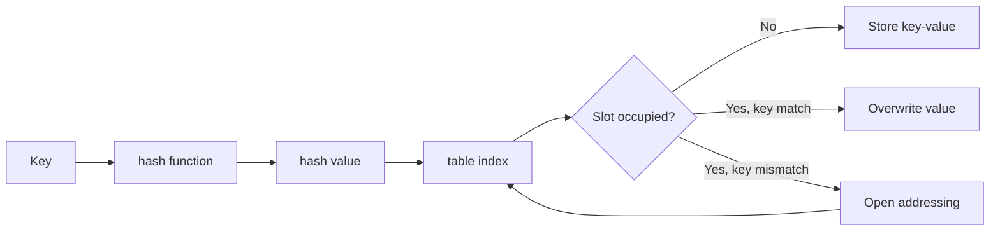

# Chapter 8: Dictionaries


> **Previous:** [Tuples and Sets](./07-tuples-sets.md) | **Next:** [Functions](./09-functions.md)
## Learning Objectives

By the end of this chapter, students will be able to:
- Create and manipulate dictionaries using multiple construction techniques
- Use dictionary comprehensions to build dicts declaratively
- Apply specialised dict types: defaultdict, Counter, OrderedDict
- Work with dict views for efficient iteration
- Merge dictionaries using the `|` operator
- Convert between dictionaries and JSON


## Chapter at a Glance

| Section | Topic | Key Concept |
|---------|-------|-------------|
|8.1 Dictionary Basics||Learn multiple ways to construct dictionaries and the hashable-key constraint.|
|8.2 Basic Operations||Master get/set/delete ops: `[]`, `.get()`, `.update()`, `.pop()`, `del`.|
|8.3 Iteration||Dict views (`.keys()`, `.values()`, `.items()`) are dynamic and support set operations.|
|8.4 Dictionary Comprehensions||`defaultdict` auto-creates missing entries; `Counter` tallies hashable objects.|
|8.5 defaultdict||The `|` operator merges dicts concisely; `json.dumps`/`json.loads` bridge dicts and JSON.|
|8.6 Counter||undefined|
|8.7 OrderedDict||undefined|
|8.8 Dict Views||undefined|
|8.9 Merging Dictionaries||undefined|
|8.10 JSON Conversion||undefined|
|8.11 Memory and Performance||undefined|


## Chapter Roadmap

```mermaid
flowchart LR
    S0[Dictionary Basics]
    S1[Basic Operations]
    S2[Iteration]
    S3[Dictionary Comprehensions]
    S4[defaultdict]
    S5[Counter]
    S6[OrderedDict]
    S7[Dict Views]
    S8[Merging Dictionaries]
    S9[JSON Conversion]
    S10[Memory and Performance]
    S0 --> S1
    S1 --> S2
    S2 --> S3
    S3 --> S4
    S4 --> S5
    S5 --> S6
    S6 --> S7
    S7 --> S8
    S8 --> S9
    S9 --> S10
```


## 8.1 Dictionary Basics

> **One-Sentence Takeaway:** Learn multiple ways to construct dictionaries and the hashable-key constraint.


A dictionary maps keys to values. Keys must be hashable (immutable types). Dictionaries maintain insertion order (Python 3.7+):

```python
empty = {}
ages = {"Alice": 30, "Bob": 25, "Charlie": 35}

# dict() constructor
kwargs = dict(name="Alice", age=30)          # keyword args
pairs = dict([("a", 1), ("b", 2)])           # iterable of pairs
zipped = dict(zip(["x", "y"], [10, 20]))     # from two sequences
print(kwargs)   # {'name': 'Alice', 'age': 30}
print(zipped)   # {'x': 10, 'y': 20}
```

## 8.2 Basic Operations

> **One-Sentence Takeaway:** Master get/set/delete ops: `[]`, `.get()`, `.update()`, `.pop()`, `del`.


```python
d = {"a": 1, "b": 2, "c": 3}

# Access
print(d["a"])            # 1 — raises KeyError if missing
print(d.get("x", 0))     # 0 — safe access with default
print(d.get("a"))        # 1

# Modification
d["d"] = 4               # add or update
d.update({"e": 5, "f": 6})  # bulk update
print(d)

# Deletion
del d["f"]               # raises KeyError if missing
popped = d.pop("e")      # returns value, raises KeyError if missing
d.pop("x", None)         # safe pop with default
last = d.popitem()       # removes and returns (key, value) in LIFO order

# Membership
print("a" in d)          # True — checks keys only
print(1 in d)            # False

# Length
print(len(d))            # 3
```

## 8.3 Iteration

> **One-Sentence Takeaway:** Dict views (`.keys()`, `.values()`, `.items()`) are dynamic and support set operations.


```python
d = {"name": "Alice", "age": 30, "city": "NYC"}

for key in d:                         # keys (default)
    print(key, end=" ")               # name age city
print()

for key in d.keys():                  # explicit keys
    print(key, end=" ")
print()

for value in d.values():              # values
    print(value, end=" ")             # Alice 30 NYC
print()

for key, value in d.items():          # key-value pairs
    print(f"{key}={value}", end=" ")  # name=Alice age=30 city=NYC
print()
```

## 8.4 Dictionary Comprehensions

> **One-Sentence Takeaway:** `defaultdict` auto-creates missing entries; `Counter` tallies hashable objects.


```python
squares = {x: x ** 2 for x in range(10)}
print(squares)
# {0: 0, 1: 1, 2: 4, 3: 9, 4: 16, 5: 25, 6: 36, 7: 49, 8: 64, 9: 81}

# With condition
even_squares = {x: x ** 2 for x in range(10) if x % 2 == 0}
print(even_squares)   # {0: 0, 2: 4, 4: 16, 6: 36, 8: 64}

# Swapping keys and values
original = {"a": 1, "b": 2, "c": 3}
inverted = {v: k for k, v in original.items()}
print(inverted)        # {1: 'a', 2: 'b', 3: 'c'}

# Transforming values
prices = {"apple": 0.5, "banana": 0.75, "cherry": 1.5}
with_tax = {item: price * 1.2 for item, price in prices.items()}
print(with_tax)
# {'apple': 0.6, 'banana': 0.9, 'cherry': 1.8}
```

## 8.5 defaultdict

> **One-Sentence Takeaway:** The `|` operator merges dicts concisely; `json.dumps`/`json.loads` bridge dicts and JSON.


`defaultdict` provides default values for missing keys:

```python
from collections import defaultdict

# List factory — group items
words = ["apple", "banana", "apricot", "blueberry", "cherry"]
by_first = defaultdict(list)
for word in words:
    by_first[word[0]].append(word)
print(dict(by_first))
# {'a': ['apple', 'apricot'], 'b': ['banana', 'blueberry'], 'c': ['cherry']}

# Int factory — counting
counter = defaultdict(int)
for c in "hello world":
    counter[c] += 1
print(dict(counter))
# {'h': 1, 'e': 1, 'l': 3, 'o': 2, ' ': 1, 'w': 1, 'r': 1, 'd': 1}

# Set factory — collecting unique values
adjacency = defaultdict(set)
edges = [(1, 2), (1, 3), (2, 3), (2, 4)]
for a, b in edges:
    adjacency[a].add(b)
    adjacency[b].add(a)
print({k: list(v) for k, v in adjacency.items()})
# {1: [2, 3], 2: [1, 3, 4], 3: [1, 2], 4: [2]}
```

## 8.6 Counter

> **One-Sentence Takeaway:** undefined


`Counter` counts hashable objects:

```python
from collections import Counter

# Basic counting
cnt = Counter("mississippi")
print(cnt)   # Counter({'i': 4, 's': 4, 'p': 2, 'm': 1})

# Most common
print(cnt.most_common(2))   # [('i', 4), ('s', 4)]

# Counter operations
c1 = Counter(a=3, b=1, c=2)
c2 = Counter(a=1, b=2, d=3)

print(c1 + c2)              # Counter({'a': 4, 'b': 3, 'd': 3, 'c': 2})
print(c1 - c2)              # Counter({'a': 2, 'c': 2})  (no negatives)
print(c1 & c2)              # Counter({'a': 1, 'b': 1})    intersection (min)
print(c1 | c2)              # Counter({'a': 3, 'd': 3, 'c': 2, 'b': 2})  union (max)

# Elements
print(list(c1.elements()))  # ['a', 'a', 'a', 'b', 'c', 'c']

# Access with default
print(cnt["z"])             # 0 (no KeyError)
```

## 8.7 OrderedDict

> **One-Sentence Takeaway:** undefined


`OrderedDict` maintains insertion order (redundant in Python 3.7+ for regular dicts) but provides extra methods:

```python
from collections import OrderedDict

od = OrderedDict()
od["z"] = 1
od["a"] = 2
od["m"] = 3
print(od)  # OrderedDict([('z', 1), ('a', 2), ('m', 3)])

# Move to end/beginning
od.move_to_end("z")                    # move 'z' to end
print(od)  # OrderedDict([('a', 2), ('m', 3), ('z', 1)])
od.move_to_end("z", last=False)        # move to beginning
print(od)  # OrderedDict([('z', 1), ('a', 2), ('m', 3)])

# Pop item from either end
print(od.popitem(last=True))   # ('m', 3)   LIFO
print(od.popitem(last=False))  # ('z', 1)   FIFO
```

## 8.8 Dict Views

> **One-Sentence Takeaway:** undefined


Methods `.keys()`, `.values()`, `.items()` return dynamic views that reflect dict changes:

```python
d = {"a": 1, "b": 2}
keys = d.keys()
values = d.values()

print(list(keys))     # ['a', 'b']
d["c"] = 3
print(list(keys))     # ['a', 'b', 'c']  (view updated automatically)

# Set-like operations on keys
other = {"b": 20, "c": 30, "d": 40}
print(d.keys() & other.keys())    # {'b', 'c'}   intersection
print(d.keys() - other.keys())    # {'a'}         difference
print(d.keys() | other.keys())    # {'a', 'b', 'c', 'd'}  union
```

## 8.9 Merging Dictionaries

> **One-Sentence Takeaway:** undefined


Python 3.9+ provides the `|` operator for merging:

```python
d1 = {"a": 1, "b": 2}
d2 = {"b": 3, "c": 4}

merged = d1 | d2          # right side wins conflicts
print(merged)             # {'a': 1, 'b': 3, 'c': 4}

d1 |= d2                  # in-place merge (modifies d1)
print(d1)                 # {'a': 1, 'b': 3, 'c': 4}

# Older approaches (still useful for compatibility)
copy_merge = {**d1, **d2}
print(copy_merge)

merge_with_update = d1.copy()
merge_with_update.update(d2)
```

## 8.10 JSON Conversion

> **One-Sentence Takeaway:** undefined


```python
import json

data = {
    "name": "Alice",
    "age": 30,
    "pets": ["cat", "dog"],
    "address": {"city": "NYC", "zip": 10001},
    "is_student": False
}

# Python dict -> JSON string
json_str = json.dumps(data, indent=2)
print(json_str)
# {
#   "name": "Alice",
#   "age": 30,
#   ...
# }

# JSON string -> Python dict
parsed = json.loads(json_str)
print(parsed["name"])       # Alice

# File I/O
with open("data.json", "w") as f:
    json.dump(data, f, indent=2)

with open("data.json", "r") as f:
    loaded = json.load(f)
```

JSON keys must be strings. Python dict keys are automatically converted:

```python
d = {1: "one", True: "true"}
print(json.dumps(d))   # {"1": "true"}  — True is a subclass of int
```

## 8.11 Memory and Performance

> **One-Sentence Takeaway:** undefined


- Dictionaries use hash tables: O(1) average for get, set, delete, membership.
- Keys must be hashable (immutable). Lists, dicts, and sets cannot be keys.
- The hash table grows when it reaches about two-thirds capacity; resizing is amortised O(1).
- For small dicts, the overhead of the hash table may exceed the data itself.


## Concept Comparison Table

| Aspect | dict | defaultdict | Counter |
|---|---|---|---|
| Default missing key | KeyError | Factory function | 0 |
| Use case | General mapping | Grouping / auto-init | Counting hashable objects |
| Ordering | Insertion order (3.7+) | Insertion order | Insertion order |
| Extra features | Views, | merge | Always has a default | most_common, arithmetic |


## Quick Reference

```python
d = {"a": 1, "b": 2}
d.get("x", 0)      # 0
d.keys() & {"b":3}.keys()  # {"b"}
from collections import defaultdict, Counter
Counter("mississippi").most_common(2)
```

## Cross-Application Matrix

| Area | Application | Relevant Section |
|------|-------------|------------------|
|Web Dev|JSON API response parsing|8.10|
|Data Science|Word frequency with Counter|8.6|
|DevOps|Config file as nested dict|8.1|
|Automation|Grouping log entries by date|8.5|


## Chapter Quiz

**Q1.** What type can be used as a dict key?
- lists
- dicts
- tuples **<-- Correct**
- sets

**Q2.** Which method safely accesses a key with a default?
- d[key]
- d.get(key) **<-- Correct**
- d.fetch(key)
- d.pop(key)

**Q3.** What does Counter.most_common(2) return?
- 2 most common values
- 2 most common keys
- 2 most common (key,count) pairs **<-- Correct**
- first 2 items

**Q4.** What is the time complexity of dict lookup?
- O(1) average **<-- Correct**
- O(n)
- O(log n)
- O(n^2)

**Q5.** Which operator merges two dicts in Python 3.9+?
- +
- | **<-- Correct**
- &
- merge()


## TypeScript Parallel

TypeScript uses `Map<K, V>` for general dictionary semantics and `Record<K, V>` (plain objects) for string-keyed mappings:

```typescript
// TypeScript Map (ordered, any key type)
const scores: Map<string, number> = new Map([
  ["Alice", 95],
  ["Bob", 87],
  ["Charlie", 92]
]);
scores.set("Diana", 88);
console.log(scores.get("Alice"));  // 95
console.log(scores.has("Eve"));    // false

// Iteration equivalent to dict.items()
for (const [name, score] of scores) {
  console.log(`${name}: ${score}`);
}

// TypeScript Record (string keys via plain object)
type Inventory = Record<string, number>;
const stock: Inventory = {
  apples: 5,
  bananas: 3
};
stock["cherries"] = 10;

// Default value pattern (Python dict.get equivalent)
function getScore(map: Map<string, number>, key: string): number {
  return map.get(key) ?? 0;  // nullish coalescing
}

// Map iteration methods
scores.keys();     // like dict.keys()
scores.values();   // like dict.values()
scores.entries();  // like dict.items()

// Object.keys/values/entries for Record types
const names = Object.keys(stock);     // ["apples", "bananas", "cherries"]
const counts = Object.values(stock);  // [5, 3, 10]
```

### Key Differences

| Feature | Python dict | TypeScript Map | TypeScript Record |
|---------|-------------|----------------|-------------------|
| Key types | Any immutable | Any type | string (or number) |
| Ordered | Yes (3.7+) | Yes | Insertion (own props) |
| Literal | `{k: v}` | `new Map()` | `{k: v}` |
| Length | `len(d)` | `map.size` | `Object.keys(r).length` |
| Missing key | `d.get(k)` or raise | `.get(k)` or `undefined` | `r.k ?? default` |
| Delete | `del d[k]` | `.delete(k)` | `delete r.k` |
| Clear | `d.clear()` | `.clear()` | reassign or loop delete |

### Dict Performance and Internals



Python dictionaries use a hash table with open addressing. Keys are hashed, and the hash determines the slot. On collision, Python probes the next available slot. Load factor (ratio of filled slots) triggers resizing at ~2/3 capacity to maintain O(1) average lookup.

```python
# Memory usage comparison
import sys

d = dict(zip(range(1000), range(1000)))
print(f"Dict size: {sys.getsizeof(d)} bytes")  # ~41KB for 1000 items

# Key distribution matters
# Strings, tuples of strings, and integers are most efficient
# Custom objects need good __hash__ implementation
```

### Real-World Dict Patterns

```python
# Caching / memoization
cache: dict[str, int] = {}

def expensive_compute(n: int) -> int:
    key = str(n)
    if key not in cache:
        cache[key] = sum(i * i for i in range(n))
    return cache[key]

# Configuration with nested dicts
config = {
    "database": {
        "host": "localhost",
        "port": 5432,
        "credentials": {
            "user": "admin",
            "password": "${DB_PASSWORD}"  # placeholder pattern
        }
    },
    "logging": {
        "level": "INFO",
        "file": "/var/log/app.log"
    }
}

# Graph represented as adjacency dict
graph: dict[str, list[str]] = {
    "A": ["B", "C"],
    "B": ["A", "D", "E"],
    "C": ["A", "F"],
    "D": ["B"],
    "E": ["B", "F"],
    "F": ["C", "E"]
}

# BFS traversal
from collections import deque
def bfs(graph: dict, start: str) -> list[str]:
    visited = set()
    queue = deque([start])
    result = []
    while queue:
        node = queue.popleft()
        if node not in visited:
            visited.add(node)
            result.append(node)
            queue.extend(neighbor for neighbor in graph[node]
                        if neighbor not in visited)
    return result

print(bfs(graph, "A"))  # ['A', 'B', 'C', 'D', 'E', 'F']
```

### Dict vs Other Data Structures

| Need | Data Structure | Example |
|------|---------------|---------|
| Key-value mapping | `dict` | `{"name": "Alice", "age": 30}` |
| Ordered key-value | `OrderedDict` | Maintains explicit order (rarely needed since 3.7+) |
| Default values | `defaultdict` | `dd["missing"]` returns a default |
| Counting | `Counter` | `Counter("abracadabra")` |
| Multiple keys same value | `dict` of lists | `defaultdict(list)` |
| Bi-directional map | Two dicts or `bidict` | Lookup by key or value |
| LRU cache | `functools.lru_cache` | Cache with max size |

```python
# LRU cache using dict (manual implementation)
class LRUCache:
    def __init__(self, capacity: int):
        self.capacity = capacity
        self.cache: dict = {}
        self.order: list = []

    def get(self, key):
        if key in self.cache:
            self.order.remove(key)
            self.order.append(key)
            return self.cache[key]
        return -1

    def put(self, key, value):
        if key in self.cache:
            self.order.remove(key)
        elif len(self.cache) >= self.capacity:
            oldest = self.order.pop(0)
            del self.cache[oldest]
        self.cache[key] = value
        self.order.append(key)
```

## Summary

- Dictionaries map hashable keys to values; insertion order is preserved (3.7+).
- Safe access with `.get()`; bulk update with `.update()`.
- Dict comprehensions provide declarative construction.
- `defaultdict` handles missing keys; `Counter` counts hashable objects.
- Views are dynamic and support set-like operations.
- `|` operator merges dicts (3.9+).
- `json.dumps()`/`json.loads()` convert between dicts and JSON.

## Exercises

### Review Questions

1. Why must dictionary keys be hashable?
2. How does `d.get(k)` differ from `d[k]`?
3. What is the time complexity of membership testing in a dict?
4. How do `defaultdict` and `Counter` differ?
5. What does the `|` operator do when applied to two dicts?

### Application Problems

1. Write a program that reads a text file, counts word frequencies, and prints the 10 most common words. Use `Counter` and `most_common`.
2. Use a `defaultdict` to invert a dictionary: `{"a": 1, "b": 2, "c": 1}` becomes `{1: ['a', 'c'], 2: ['b']}`.
3. Write a function `deep_merge(d1, d2)` that recursively merges two dictionaries. For nested dict values, recurse; for non-dict values, prefer the second dict's value.

### Challenge Problem

Build a simple in-memory key-value store with transaction support. Implement `begin()`, `commit()`, and `rollback()` methods. During a transaction, all writes go to a staging dict. `commit()` flattens staging into the main store and `rollback()` discards it. Support nested transactions (stack of staging dicts). Use `copy.deepcopy` to snapshot values for rollback safety.
