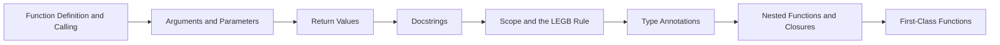

# Chapter 9: Functions


> **Previous:** [Dictionaries](./08-dictionaries.md) | **Next:** [Lambda and Functional Programming](./10-lambda.md)
## Learning Objectives

By the end of this chapter, students will be able to:
- Define and call functions with various parameter types
- Use positional, keyword, default, `*args`, and `**kwargs` parameters
- Understand and apply the LEGB scope resolution rule
- Write docstrings and type annotations
- Create nested functions and closures
- Predict the behaviour of mutable default arguments


## Chapter at a Glance

| Section | Topic | Key Concept |
|---------|-------|-------------|
|9.1 Function Definition and Calling||Functions are defined with `def`; calling a function creates a local scope.|
|9.2 Arguments and Parameters||Use `*args` for variable positional args, `**kwargs` for keyword args, and `None` for mutable defaults.|
|9.3 Return Values||LEGB rule: Local → Enclosing → Global → Built-in resolves variable names.|
|9.4 Docstrings||Closures capture enclosing variables by reference — watch out for late-binding in loops.|
|9.5 Scope and the LEGB Rule||Type annotations document expected types; mypy checks them statically.|
|9.6 Type Annotations||undefined|
|9.7 Nested Functions and Closures||undefined|
|9.8 First-Class Functions||undefined|


## Chapter Roadmap


## 9.1 Function Definition and Calling

> **One-Sentence Takeaway:** Functions are defined with `def`; calling a function creates a local scope.


Functions are defined with `def` and called with parentheses:

```python
def greet(name):
    """Return a greeting string."""
    return f"Hello, {name}!"

print(greet("Alice"))  # Hello, Alice!
```

Functions without an explicit `return` return `None`:

```python
def say_hello(name):
    print(f"Hello, {name}!")

result = say_hello("Bob")   # Hello, Bob!
print(result)                # None
```

## 9.2 Arguments and Parameters

> **One-Sentence Takeaway:** Use `*args` for variable positional args, `**kwargs` for keyword args, and `None` for mutable defaults.
> **Warning:** Mutable default arguments are evaluated once at definition time — use `None` and create a new object each call.


### 9.2.1 Positional Arguments

Arguments are matched to parameters by position:

```python
def add(a, b, c):
    return a + b + c

print(add(1, 2, 3))  # 6
```

### 9.2.2 Keyword Arguments

Arguments can be specified by parameter name:

```python
print(add(b=2, a=1, c=3))  # 6
print(add(1, c=3, b=2))    # 6  (positional before keyword)
```

Positional arguments must precede keyword arguments:

```python
add(a=1, 2, 3)   # SyntaxError: positional argument follows keyword argument
```

### 9.2.3 Default Parameter Values

```python
def power(base, exponent=2):
    return base ** exponent

print(power(5))       # 25  (default exponent)
print(power(5, 3))    # 125
```

Default arguments are evaluated once at definition time, not at call time:

```python
def append_to(element, target=[]):
    target.append(element)
    return target

print(append_to(1))   # [1]
print(append_to(2))   # [1, 2]  — the default list is shared!

# CORRECT pattern
def append_to(element, target=None):
    if target is None:
        target = []
    target.append(element)
    return target

print(append_to(1))   # [1]
print(append_to(2))   # [2]
```

### 9.2.4 *args — Variable Positional Arguments

`*args` captures extra positional arguments as a tuple:

```python
def sum_all(*numbers):
    print(type(numbers))  # <class 'tuple'>
    return sum(numbers)

print(sum_all(1, 2, 3, 4, 5))  # 15

def log(level, *messages):
    for msg in messages:
        print(f"[{level}] {msg}")

log("INFO", "Starting", "Processing", "Done")
# [INFO] Starting
# [INFO] Processing
# [INFO] Done
```

### 9.2.5 **kwargs — Variable Keyword Arguments

`**kwargs` captures extra keyword arguments as a dictionary:

```python
def create_profile(name, **details):
    print(f"Name: {name}")
    for key, value in details.items():
        print(f"  {key}: {value}")

create_profile("Alice", age=30, city="NYC", occupation="Engineer")
# Name: Alice
#   age: 30
#   city: NYC
#   occupation: Engineer
```

### 9.2.6 Argument Unpacking

`*` unpacks iterables; `**` unpacks dictionaries:

```python
def point(x, y, z):
    return f"({x}, {y}, {z})"

coords = [10, 20, 30]
print(point(*coords))   # (10, 20, 30)

params = {"x": 5, "y": 15, "z": 25}
print(point(**params))  # (5, 15, 25)

# Combined
values = [1, 2]
print(point(*values, z=3))  # (1, 2, 3)
```

### 9.2.7 Parameter Ordering

The complete parameter order is:

```python
def func(pos1, pos2, /, pos_or_kwd, *, kwd1, kwd2):
    pass
```

- `/` separates positional-only (left) from positional-or-keyword (right).
- `*` separates positional-or-keyword (left) from keyword-only (right).

```python
def divide(a, b, /):
    """a and b are positional-only."""
    return a / b

print(divide(10, 3))   # 3.333...
# divide(a=10, b=3)     # TypeError

def greet(*, name, greeting="Hello"):
    """name and greeting are keyword-only."""
    return f"{greeting}, {name}!"

print(greet(name="Alice"))  # Hello, Alice!
# greet("Alice")              # TypeError

def process(a, b, /, c, d, *, e, f):
    return a + b + c + d + e + f

print(process(1, 2, 3, 4, e=5, f=6))  # 21
```

## 9.3 Return Values

> **One-Sentence Takeaway:** LEGB rule: Local → Enclosing → Global → Built-in resolves variable names.


Functions can return multiple values as a tuple:

```python
def stats(numbers):
    return min(numbers), max(numbers), sum(numbers) / len(numbers)

minimum, maximum, average = stats([1, 2, 3, 4, 5])
print(minimum, maximum, average)  # 1 5 3.0
```

Type annotation for return value (`->`):

```python
def factorial(n: int) -> int:
    if n <= 1:
        return 1
    return n * factorial(n - 1)
```

## 9.4 Docstrings

> **One-Sentence Takeaway:** Closures capture enclosing variables by reference — watch out for late-binding in loops.


Docstrings document the function's purpose, parameters, and return value:

```python
def fibonacci(n: int) -> int:
    """Return the nth Fibonacci number.
    
    Args:
        n: A non-negative integer.
        
    Returns:
        The nth Fibonacci number where F(0)=0, F(1)=1.
        
    Raises:
        ValueError: If n is negative.
    """
    if n < 0:
        raise ValueError("n must be non-negative")
    if n <= 1:
        return n
    a, b = 0, 1
    for _ in range(2, n + 1):
        a, b = b, a + b
    return b

help(fibonacci)  # prints the docstring
```

## 9.5 Scope and the LEGB Rule

> **One-Sentence Takeaway:** Type annotations document expected types; mypy checks them statically.


Python resolves variable names following the LEGB order:

1. **L**ocal — function scope
2. **E**nclosing — outer function scope (for nested functions)
3. **G**lobal — module level
4. **B**uilt-in — Python's built-in namespace

```python
x = "global"         # G

def outer():
    x = "enclosing"  # E
    
    def inner():
        x = "local"  # L
        print(x)
    
    inner()
    print(x)

outer()
print(x)
# local
# enclosing
# global
```

The `global` and `nonlocal` keywords modify variables in outer scopes:

```python
counter = 0

def increment():
    global counter
    counter += 1

increment()
print(counter)  # 1

def make_counter():
    count = 0
    
    def increment():
        nonlocal count
        count += 1
        return count
    
    return increment

c = make_counter()
print(c())  # 1
print(c())  # 2
```

Without `nonlocal`, assignment in `inner` creates a new local variable rather than modifying the enclosing scope's variable.

## 9.6 Type Annotations

> **One-Sentence Takeaway:** undefined
> **Remember:** Type annotations are not enforced at runtime — use mypy or pyright for static type checking.


Type hints document expected types (not enforced at runtime):

```python
def process(name: str, age: int = 0, *, verbose: bool = False) -> str:
    if verbose:
        print(f"Processing {name}, age {age}")
    return f"Hello, {name}"

# Union types
from typing import Union, Optional, List, Dict, Tuple, Any

def parse(value: Union[int, str]) -> Optional[int]:
    if isinstance(value, int):
        return value
    if value.isdigit():
        return int(value)
    return None

# Python 3.10+ syntax
def parse_310(value: int | str) -> int | None:
    if isinstance(value, int):
        return value
    if value.isdigit():
        return int(value)
    return None

# Collections
def total(values: list[int]) -> int:
    return sum(values)

def lookup(data: dict[str, int]) -> tuple[str, int] | None:
    for k, v in data.items():
        if v > 10:
            return k, v
    return None
```

Type checking is performed by external tools like `mypy` or `pyright`, not by the Python interpreter.

## 9.7 Nested Functions and Closures

> **One-Sentence Takeaway:** undefined


A closure is a function that captures variables from its enclosing scope:

```python
def make_multiplier(factor: float):
    """Return a function that multiplies its argument by factor."""
    def multiplier(x: float) -> float:
        return x * factor
    return multiplier

double = make_multiplier(2)
triple = make_multiplier(3)

print(double(5))    # 10
print(triple(5))    # 15
print(double(3.5))  # 7.0
```

Closures capture variables, not values. Late binding:

```python
def make_functions():
    funcs = []
    for i in range(5):
        funcs.append(lambda: i)  # captures i by reference
    return funcs

for f in make_functions():
    print(f(), end=" ")   # 4 4 4 4 4  — all see i=4

# Fix: capture the current value
def make_functions_fixed():
    funcs = []
    for i in range(5):
        funcs.append(lambda i=i: i)  # default arg captures value
    return funcs

for f in make_functions_fixed():
    print(f(), end=" ")   # 0 1 2 3 4
```

## 9.8 First-Class Functions

> **One-Sentence Takeaway:** undefined


Functions are first-class objects — they can be assigned, passed, and returned:

```python
def square(x):
    return x ** 2

f = square         # assign
print(f(5))        # call via reference: 25

def apply(func, value):
    return func(value)

print(apply(square, 4))  # 16

def get_operation(op):
    if op == "square":
        return square
    elif op == "cube":
        return lambda x: x ** 3
    
g = get_operation("cube")
print(g(3))  # 27
```


## Concept Comparison Table

| Concept | def | lambda |
|---|---|---|
| Name | Required | Anonymous |
| Statements | Multiple allowed | Single expression only |
| When to use | Complex/reusable logic | Simple one-off operations |
| Return | Explicit or None | Expression result |


## Quick Reference

```python
def greet(name):
    return f"Hello, {name}"

def log(level, *messages, **opts):
    for m in messages:
        print(f"[{level}] {m}")

# LEGB demo
x = "global"
def outer():
    x = "enclosing"
```

## Cross-Application Matrix

| Area | Application | Relevant Section |
|------|-------------|------------------|
|Web Dev|Route handler functions in FastAPI|9.1|
|Data Science|Custom aggregation functions|9.3|
|DevOps|Config loading with *args/**kwargs|9.2|
|Automation|Closure-based retry wrappers|9.7|


## Chapter Quiz

**Q1.** What is the LEGB order of scope resolution?
- Local, Enclosing, Global, Built-in **<-- Correct**
- Local, Global, Enclosing, Built-in
- Built-in, Global, Enclosing, Local
- Global, Local, Enclosing, Built-in

**Q2.** What does `*args` capture?
- keyword-only args
- positional args as tuple **<-- Correct**
- default args
- nothing

**Q3.** Why avoid mutable default arguments?
- they are slow
- they are evaluated once and shared **<-- Correct**
- they raise SyntaxError
- they cannot be type-annotated

**Q4.** What does `nonlocal` do?
- creates a global variable
- modifies enclosing scope variable **<-- Correct**
- creates a local variable
- deletes a variable

**Q5.** What is a closure?
- a function with type annotations
- a function capturing enclosing variables **<-- Correct**
- a lambda expression
- a class method


## Summary

- Parameters: positional, keyword, default, `*args`, `**kwargs`, positional-only (`/`), keyword-only (`*`).
- Default arguments are evaluated once — use `None` for mutable defaults.
- LEGB scope: Local, Enclosing, Global, Built-in.
- `global` and `nonlocal` modify variables in outer scopes.
- Docstrings and annotations document the function contract.
- Closures capture enclosing variables by reference.

## Exercises

### Review Questions

1. What problem arises with mutable default arguments and how do you fix it?
2. How does the LEGB rule resolve variable names?
3. What is the difference between `*args` and `**kwargs`?
4. When would you use positional-only (`/`) parameters?
5. How do closures capture variables and what is the late-binding issue?

### Application Problems

1. Write a function `create_calculator(operation)` that returns a function performing addition, subtraction, multiplication, or division based on the `operation` string. Use closures.
2. Write a recursive `factorial(n)` function with type annotations, a docstring, and error handling for negative inputs.
3. Implement a function `timer(f)` that accepts another function and returns a new function with the same behaviour. For now, just return a wrapper that prints "called" before each invocation (we will generalise this in Chapter 15).

### Challenge Problem

Build a simple function registry and pipeline system. Define a decorator `@register(name)` that stores functions in a global registry dict. Then implement `pipeline(data, *stage_names)` that applies the registered functions in sequence, passing the output of each as the input to the next. Support error handling at each stage. Use `**kwargs` to pass configuration to individual stages.
