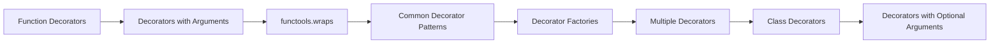

# Chapter 15: Decorators


> **Previous:** [Magic Methods](./14-magic-methods.md) | **Next:** [Generators and itertools](./16-generators.md)
## Learning Objectives

By the end of this chapter, students will be able to:
- Write function decorators that wrap and modify behaviour
- Use `functools.wraps` to preserve metadata
- Implement common decorator patterns: timer, debug, cache, retry
- Create class decorators
- Build parameterised decorators (decorator factories)
- Stack multiple decorators


## Chapter at a Glance

| Section | Topic | Key Concept |
|---------|-------|-------------|
|15.1 Function Decorators||A decorator wraps a function to extend behaviour without modifying its source.|
|15.2 Decorators with Arguments||The wrapper must accept `*args, **kwargs` and forward them to the wrapped function.|
|15.3 functools.wraps||Always use `@functools.wraps` to preserve `__name__`, `__doc__`, and other metadata.|
|15.4 Common Decorator Patterns||Decorator factories take arguments and return the actual decorator.|
|15.5 Decorator Factories||Multiple decorators stack bottom-up: `@a @b` applies `a(b(func))`.|
|15.6 Multiple Decorators||undefined|
|15.7 Class Decorators||undefined|
|15.8 Decorators with Optional Arguments||undefined|


## Chapter Roadmap


## 15.1 Function Decorators

> **One-Sentence Takeaway:** A decorator wraps a function to extend behaviour without modifying its source.


A decorator is a function that takes another function and extends its behaviour without modifying it:

```python
def simple_decorator(func):
    def wrapper():
        print("Before function call")
        func()
        print("After function call")
    return wrapper

@simple_decorator
def say_hello():
    print("Hello!")

say_hello()
# Before function call
# Hello!
# After function call
```

The `@decorator` syntax is equivalent to:

```python
def say_hello():
    print("Hello!")

say_hello = simple_decorator(say_hello)
```

## 15.2 Decorators with Arguments

> **One-Sentence Takeaway:** The wrapper must accept `*args, **kwargs` and forward them to the wrapped function.


When the wrapped function takes arguments, the wrapper must accept and forward them:

```python
def logger(func):
    def wrapper(*args, **kwargs):
        print(f"Calling {func.__name__} with args={args}, kwargs={kwargs}")
        result = func(*args, **kwargs)
        print(f"{func.__name__} returned {result!r}")
        return result
    return wrapper

@logger
def add(a: int, b: int) -> int:
    return a + b

@logger
def greet(name: str, greeting: str = "Hello") -> str:
    return f"{greeting}, {name}!"

print(add(3, 4))
# Calling add with args=(3, 4), kwargs={}
# add returned 7
# 7

print(greet("Alice", greeting="Hi"))
# Calling greet with args=('Alice',), kwargs={'greeting': 'Hi'}
# greet returned 'Hi, Alice!'
# Hi, Alice!
```

## 15.3 functools.wraps

> **One-Sentence Takeaway:** Always use `@functools.wraps` to preserve `__name__`, `__doc__`, and other metadata.


`@wraps` preserves the original function's metadata (`__name__`, `__doc__`, `__module__`, etc.):

```python
from functools import wraps

def logger(func):
    @wraps(func)  # copies func.__name__, __doc__, etc. to wrapper
    def wrapper(*args, **kwargs):
        print(f"Calling {func.__name__}")
        return func(*args, **kwargs)
    return wrapper

@logger
def add(a: int, b: int) -> int:
    """Add two numbers."""
    return a + b

print(add.__name__)  # 'add' (without @wraps, this would be 'wrapper')
print(add.__doc__)   # 'Add two numbers.' (would be None without @wraps)
```

Always use `@wraps` when writing decorators.

## 15.4 Common Decorator Patterns

> **One-Sentence Takeaway:** Decorator factories take arguments and return the actual decorator.


### 15.4.1 Timer


```python
import time
from functools import wraps

def timer(func):
    @wraps(func)
    def wrapper(*args, **kwargs):
        start = time.perf_counter()
        result = func(*args, **kwargs)
        elapsed = time.perf_counter() - start
        print(f"{func.__name__} took {elapsed:.4f}s")
        return result
    return wrapper

@timer
def slow_function():
    time.sleep(0.5)
    return "Done"

slow_function()  # slow_function took 0.5012s
```

### 15.4.2 Debug


```python
def debug(func):
    @wraps(func)
    def wrapper(*args, **kwargs):
        args_repr = [repr(a) for a in args]
        kwargs_repr = [f"{k}={v!r}" for k, v in kwargs.items()]
        signature = ", ".join(args_repr + kwargs_repr)
        print(f"DEBUG: {func.__name__}({signature})")
        result = func(*args, **kwargs)
        print(f"DEBUG: {func.__name__} = {result!r}")
        return result
    return wrapper

@debug
def multiply(a: int, b: int) -> int:
    return a * b

multiply(3, 4)
# DEBUG: multiply(3, 4)
# DEBUG: multiply = 12
```

### 15.4.3 Cache (Memoization)


```python
def cache(func):
    memo = {}
    @wraps(func)
    def wrapper(*args):
        if args not in memo:
            memo[args] = func(*args)
        return memo[args]
    return wrapper

@cache
def fibonacci(n: int) -> int:
    if n < 2:
        return n
    return fibonacci(n - 1) + fibonacci(n - 2)

# Without cache: exponential time. With cache: O(n).
print(fibonacci(100))  # 354224848179261915075
```

Python 3.9+ includes `functools.cache`:

```python
from functools import cache

@cache
def fibonacci(n: int) -> int:
    if n < 2:
        return n
    return fibonacci(n - 1) + fibonacci(n - 2)
```

### 15.4.4 Retry


```python
import time
from functools import wraps

def retry(max_attempts: int = 3, delay: float = 1.0):
    def decorator(func):
        @wraps(func)
        def wrapper(*args, **kwargs):
            for attempt in range(1, max_attempts + 1):
                try:
                    return func(*args, **kwargs)
                except Exception as e:
                    if attempt == max_attempts:
                        raise
                    print(f"Attempt {attempt} failed: {e}. Retrying in {delay}s...")
                    time.sleep(delay)
            return None  # unreachable
        return wrapper
    return decorator

@retry(max_attempts=3, delay=0.5)
def unstable_network_call(url: str) -> str:
    import random
    if random.random() < 0.7:
        raise ConnectionError("Timeout")
    return f"Response from {url}"

print(unstable_network_call("http://example.com"))
```

## 15.5 Decorator Factories

> **One-Sentence Takeaway:** Multiple decorators stack bottom-up: `@a @b` applies `a(b(func))`.


A decorator factory takes arguments and returns a decorator:

```python
def repeat(n: int):
    """Decorator factory: repeat the function n times."""
    def decorator(func):
        @wraps(func)
        def wrapper(*args, **kwargs):
            results = []
            for _ in range(n):
                results.append(func(*args, **kwargs))
            return results
        return wrapper
    return decorator

@repeat(3)
def get_time() -> str:
    import time
    return time.strftime("%H:%M:%S")

print(get_time())  # ['14:30:01', '14:30:01', '14:30:01']
```

The syntax `@repeat(3)` breaks down as:

```python
get_time = repeat(3)(get_time)
# first:  repeat(3) returns the decorator
# second: decorator(get_time) returns the wrapper
```

## 15.6 Multiple Decorators

> **One-Sentence Takeaway:** undefined


Decorators stack bottom-up (the one closest to the function applies first):

```python
@timer
@debug
def compute(x: int) -> int:
    return x ** 2

compute(5)
# Equivalent to: compute = timer(debug(compute))
```

Trace:

1. `debug(compute)` creates a wrapper
2. `timer(wrapper)` wraps the debug wrapper
3. Calling `compute(5)` first enters the timer, which calls the debug wrapper, which calls the original function

Order matters:

```python
@debug
@timer
def compute(x: int) -> int:
    return x ** 2
```

This differs because `timer` wraps first, then `debug` wraps the timed version.

## 15.7 Class Decorators

> **One-Sentence Takeaway:** undefined


Decorators can also modify classes:

```python
def add_repr(cls):
    """Add a __repr__ method to a class."""
    def __repr__(self) -> str:
        items = ", ".join(f"{k}={v!r}" for k, v in self.__dict__.items())
        return f"{cls.__name__}({items})"
    cls.__repr__ = __repr__
    return cls

@add_repr
class Person:
    def __init__(self, name: str, age: int):
        self.name = name
        self.age = age

p = Person("Alice", 30)
print(p)  # Person(name='Alice', age=30)
```

### 15.7.1 Singleton Decorator


```python
def singleton(cls):
    instances = {}
    @wraps(cls)
    def get_instance(*args, **kwargs):
        if cls not in instances:
            instances[cls] = cls(*args, **kwargs)
        return instances[cls]
    return get_instance

@singleton
class Database:
    def __init__(self):
        print("Database instance created")

db1 = Database()  # Database instance created
db2 = Database()  # no output → reuses instance
print(db1 is db2)  # True
```

## 15.8 Decorators with Optional Arguments

> **One-Sentence Takeaway:** undefined


Support both `@decorator` and `@decorator(args)` syntax:

```python
from functools import wraps

def log(func=None, *, prefix: str = "LOG"):
    if func is None:
        # Called as @log(prefix="...")
        return lambda f: log(f, prefix=prefix)
    
    @wraps(func)
    def wrapper(*args, **kwargs):
        print(f"{prefix}: {func.__name__} called")
        return func(*args, **kwargs)
    return wrapper

@log
def simple(): pass

@log(prefix="INFO")
def detailed(): pass
```


## Concept Comparison Table

| Pattern | Purpose | Key Detail |
|---|---|---|
| @timer | Measure execution time | Uses time.perf_counter |
| @debug | Log calls and returns | Prints args/kwargs/result |
| @cache | Memoize results | Dict keyed on args |
| @retry | Retry on failure | Backoff between attempts |


## Quick Reference

```python
from functools import wraps

def timer(func):
    @wraps(func)
    def wrapper(*args, **kwargs):
        import time
        start = time.perf_counter()
        result = func(*args, **kwargs)
        print(f"{func.__name__}: {time.perf_counter()-start:.3f}s")
        return result
    return wrapper
```

## Cross-Application Matrix

| Area | Application | Relevant Section |
|------|-------------|------------------|
|Web Dev|Route decorators in Flask/FastAPI|15.1|
|Data Science|Cache expensive computations|15.4|
|DevOps|Retry decorator for API calls|15.4|
|Automation|Logging decorator for task pipelines|15.4|


## Chapter Quiz

**Q1.** What is a decorator in Python?
- a class that inherits from another
- a function that wraps another function **<-- Correct**
- a lambda expression
- a type annotation

**Q2.** Why use @functools.wraps?
- to add metadata
- to preserve __name__ and __doc__ **<-- Correct**
- to improve performance
- to enable recursion

**Q3.** How do multiple decorators stack?
- top-down
- bottom-up **<-- Correct**
- in order of definition
- randomly

**Q4.** What does a decorator factory return?
- a wrapped function
- a decorator **<-- Correct**
- a class
- a lambda

**Q5.** What does @timer decorator typically measure?
- memory usage
- execution time **<-- Correct**
- CPU usage
- network latency


## TypeScript Parallel

TypeScript has its own decorator proposal (TC39 stage 3) with a different syntax:

```typescript
// TypeScript decorator (TS 5.x native decorators)
function logged<T extends (...args: any[]) => any>(
  target: T,
  context: ClassMethodDecoratorContext
): T {
  function replacement(this: any, ...args: any[]) {
    console.log(`Calling ${String(context.name)} with`, args);
    const result = target.call(this, ...args);
    console.log(`Result:`, result);
    return result;
  }
  return replacement as T;
}

class Calculator {
  @logged
  add(a: number, b: number): number {
    return a + b;
  }

  @logged
  multiply(a: number, b: number): number {
    return a * b;
  }
}

// Timing decorator
function timed<T extends (...args: any[]) => any>(
  target: T,
  context: ClassMethodDecoratorContext
): T {
  function replacement(this: any, ...args: any[]) {
    const start = performance.now();
    const result = target.call(this, ...args);
    const elapsed = performance.now() - start;
    console.log(`${String(context.name)} took ${elapsed.toFixed(2)}ms`);
    return result;
  }
  return replacement as T;
}

// Higher-order function (more common TS pattern, no decorator needed)
function memoize<T extends (...args: any[]) => any>(fn: T): T {
  const cache = new Map<string, any>();
  return function (this: any, ...args: any[]) {
    const key = JSON.stringify(args);
    if (cache.has(key)) return cache.get(key);
    const result = fn.call(this, ...args);
    cache.set(key, result);
    return result;
  } as T;
}

const fib = memoize(function (n: number): number {
  if (n <= 1) return n;
  return fib(n - 1) + fib(n - 2);
});
console.log(fib(40));  // computed quickly with memoization

// Property decorator for read-only
function readOnly(target: any, key: string): void {
  Object.defineProperty(target, key, { writable: false });
}
```

### Python vs TypeScript Decorators


| Concept | Python | TypeScript |
|---------|--------|------------|
| Syntax | `@decorator` | `@decorator` |
| Targets | Functions + classes | Methods + properties (TS-native) |
| Arguments | Factory wrapper pattern | `context` parameter |
| Composition | `@a @b` bottom-up | Same |
| Common use | `@lru_cache`, `@property` | Logging, timing, validation |
| Status | Core feature | Stage 3 (native in TS 5.x) |

### When to Use Decorators vs Wrappers


```python
# Option 1: Decorator (applied at definition time)
@timer
def compute(): ...

# Option 2: Explicit wrapper (applied at call time)
compute = timer(compute)

# Option 3: Context manager (applied at execution time)
with timing("compute"):
    compute()

# Rule of thumb:
# - Use decorators when the behavior should apply to ALL calls
# - Use context managers when timing varies per invocation
# - Use explicit wrappers when you need conditional application
```
```typescript
// Chapter 15: TypeScript Decorator & Higher-Order Function Equivalents
// Python: decorators wrap functions → TypeScript: higher-order functions

// Simple function wrapper (like a decorator without @ syntax)
function timer<Args extends unknown[], Return>(
  fn: (...args: Args) => Return
): (...args: Args) => Return {
  return (...args: Args): Return => {
    const start = performance.now();
    const result = fn(...args);
    const elapsed = performance.now() - start;
    console.log(`${fn.name} took ${elapsed.toFixed(2)}ms`);
    return result;
  };
}

const slowSum = (a: number, b: number): number => {
  for (let i = 0; i < 1e7; i++);  // simulate work
  return a + b;
};

const timedSum = timer(slowSum);
console.log(timedSum(3, 4));  // logs timing, returns 7

// Python: @lru_cache → TypeScript: memoization wrapper
function memoize<Args extends unknown[], Return>(
  fn: (...args: Args) => Return
): (...args: Args) => Return {
  const cache = new Map<string, Return>();
  return (...args: Args): Return => {
    const key = JSON.stringify(args);
    if (cache.has(key)) return cache.get(key)!;
    const result = fn(...args);
    cache.set(key, result);
    return result;
  };
}

const fib = memoize((n: number): number => {
  if (n <= 1) return n;
  return fib(n - 1) + fib(n - 2);
});
console.log(fib(40));  // 102334155 (fast due to memoization)

// TypeScript native decorators (Stage 3, TS 5.x)
function Logged(target: any, propertyKey: string, descriptor: PropertyDescriptor) {
  const original = descriptor.value;
  descriptor.value = function (...args: any[]) {
    console.log(`Calling ${propertyKey} with`, args);
    return original.apply(this, args);
  };
}
```

### TypeScript Higher-Order Function Patterns

```typescript
// Python: retry decorator → TypeScript: retry wrapper
async function retry<T>(
  fn: () => Promise<T>,
  maxAttempts: number = 3,
  delayMs: number = 1000
): Promise<T> {
  for (let attempt = 1; attempt <= maxAttempts; attempt++) {
    try {
      return await fn();
    } catch (error) {
      if (attempt === maxAttempts) throw error;
      console.warn(`Attempt ${attempt} failed, retrying...`);
      await new Promise((r) => setTimeout(r, delayMs));
    }
  }
  throw new Error("Unreachable");
}

// Python: @validate_args → TypeScript: runtime type check wrapper
function validateTypes(fn: Function, paramTypes: string[]): Function {
  return (...args: unknown[]) => {
    for (let i = 0; i < args.length; i++) {
      const actual = typeof args[i];
      const expected = paramTypes[i];
      if (actual !== expected) {
        throw new TypeError(`Argument ${i}: expected ${expected}, got ${actual}`);
      }
    }
    return fn(...args);
  };
}
const safeAdd = validateTypes((a: number, b: number) => a + b, ["number", "number"]);
console.log(safeAdd(2, 3));  // 5
// safeAdd(2, "3");  // TypeError

// Python: @deprecated → TypeScript: deprecation wrapper
function deprecated(message: string) {
  return (_target: any, propertyKey: string, descriptor: PropertyDescriptor) => {
    const original = descriptor.value;
    descriptor.value = function (...args: unknown[]) {
      console.warn(`Deprecated: ${propertyKey} — ${message}`);
      return original.apply(this, args);
    };
  };
}

// Python: @singleton → TypeScript: Singleton pattern
class Singleton {
  private static instance: Singleton;
  private constructor() {}
  static getInstance(): Singleton {
    if (!Singleton.instance) {
      Singleton.instance = new Singleton();
    }
    return Singleton.instance;
  }
}
```

### TypeScript Utilities

```typescript
// === Decorator Factory ===
type Decorator<T extends (...args: any[]) => any> = (fn: T, context?: ClassMethodDecoratorContext) => T | void;
function createDecorator<T extends (...args: any[]) => any>(before?: () => void, after?: () => void): Decorator<T> {
  return ((fn: T, _context?: ClassMethodDecoratorContext) => {
    return function (this: any, ...args: Parameters<T>): ReturnType<T> {
      before?.();
      const result = fn.apply(this, args);
      after?.();
      return result;
    } as T;
  }) as Decorator<T>;
}
const logCall = createDecorator(() => console.log("Before"), () => console.log("After"));
class Service {
  static process(n: number): number { return n * 2; }
}
console.log(Service.process(5));

// === Memoize with TTL ===
function memoizeWithTTL<T>(fn: (...args: unknown[]) => T, ttlMs: number): (...args: unknown[]) => T {
  const cache = new Map<string, { value: T; expiry: number }>();
  return (...args: unknown[]): T => {
    const key = JSON.stringify(args);
    const entry = cache.get(key);
    if (entry && Date.now() < entry.expiry) return entry.value;
    const result = fn(...args);
    cache.set(key, { value: result, expiry: Date.now() + ttlMs });
    return result;
  };
}
let callCount = 0;
const expensiveFn = (n: number) => { callCount++; return n * n; };
const memoized = memoizeWithTTL(expensiveFn, 5000);
console.log(memoized(5), memoized(5), callCount); // 25, 25, 1

// === Retry with Backoff ===
async function retryWithBackoff<T>(
  fn: () => Promise<T>,
  maxRetries = 3,
  baseDelay = 1000
): Promise<T> {
  for (let attempt = 0; attempt <= maxRetries; attempt++) {
    try { return await fn(); }
    catch (err) {
      if (attempt === maxRetries) throw err;
      const delay = baseDelay * Math.pow(2, attempt) + Math.random() * 100;
      await new Promise((r) => setTimeout(r, delay));
    }
  }
  throw new Error("Unreachable");
}
// await retryWithBackoff(() => fetch("https://api.example.com/data"));

// === Method Decorator for Timing ===
function timed<T>(target: any, propertyKey: string, descriptor: TypedPropertyDescriptor<(...args: any[]) => T>) {
  const original = descriptor.value!;
  descriptor.value = function (...args: any[]) {
    const start = performance.now();
    const result = original.apply(this, args);
    console.log(`${propertyKey} took ${performance.now() - start}ms`);
    return result;
  };
}

// === Property Decorator for Validation ===
function validate(min: number, max: number) {
  return function (target: any, propertyKey: string) {
    let value: number;
    Object.defineProperty(target, propertyKey, {
      get: () => value,
      set: (v: number) => { if (v < min || v > max) throw new Error(`Out of range [${min}, ${max}]`); value = v; },
    });
  };
}
class Temp {
  @validate(-273, 1000)
  celsius = 0;
}
const t = new Temp();
// t.celsius = -300; // throws
```

### TypeScript Decorator & HOF Patterns

```typescript
// === Python-style decorator via higher-order function ===
function logCalls<T extends (...args: unknown[]) => unknown>(fn: T): T {
  return ((...args: Parameters<T>) => {
    console.log(`Called ${fn.name}(${args.map(a => JSON.stringify(a)).join(", ")})`);
    const result = fn(...args);
    console.log(`Returned ${JSON.stringify(result)}`);
    return result;
  }) as T;
}
const add = logCalls((a: number, b: number) => a + b);
console.log(add(3, 4)); // Logs: Called (3, 4) → 7

// === Timing decorator ===
function timed<T extends (...args: unknown[]) => unknown>(fn: T): T {
  return ((...args: Parameters<T>) => {
    const start = performance.now();
    const result = fn(...args);
    const elapsed = performance.now() - start;
    console.log(`${fn.name} took ${elapsed.toFixed(2)}ms`);
    return result;
  }) as T;
}
const expensive = timed((n: number) => {
  let sum = 0;
  for (let i = 0; i < n; i++) sum += i;
  return sum;
});
console.log(expensive(1000000));

// === Retry decorator ===
function retry<T extends (...args: unknown[]) => unknown>(maxAttempts: number, delayMs = 0): (fn: T) => T {
  return (fn: T) => ((...args: Parameters<T>) => {
    let lastError: unknown;
    for (let attempt = 1; attempt <= maxAttempts; attempt++) {
      try {
        return fn(...args);
      } catch (err) {
        lastError = err;
        console.log(`Attempt ${attempt}/${maxAttempts} failed: ${err}`);
        if (attempt < maxAttempts && delayMs > 0) {
          // wait
        }
      }
    }
    throw lastError;
  }) as T;
}

// === Memoization decorator ===
function memoize2<T extends (...args: unknown[]) => unknown>(fn: T): T {
  const cache = new Map<string, unknown>();
  return ((...args: Parameters<T>) => {
    const key = JSON.stringify(args);
    if (cache.has(key)) {
      console.log(`[cache hit] ${key}`);
      return cache.get(key);
    }
    const result = fn(...args);
    cache.set(key, result);
    return result;
  }) as T;
}
const fib = memoize2((n: number): number => {
  if (n < 2) return n;
  return fib(n - 1) + fib(n - 2);
});
console.log(fib(40)); // Fast

// === Validation decorator ===
function validate<T extends (...args: unknown[]) => unknown>(schema: Record<string, string>): (fn: T) => T {
  return (fn: T) => ((...args: Parameters<T>) => {
    args.forEach((arg, i) => {
      const expected = schema[`arg${i}`];
      if (expected && typeof arg !== expected) {
        throw new TypeError(`Argument ${i}: expected ${expected}, got ${typeof arg}`);
      }
    });
    return fn(...args);
  }) as T;
}

// === Rate limiting decorator ===
function rateLimit<T extends (...args: unknown[]) => unknown>(maxCalls: number, periodMs: number): (fn: T) => T {
  const calls: number[] = [];
  return ((...args: Parameters<T>) => {
    const now = Date.now();
    while (calls.length > 0 && calls[0] < now - periodMs) calls.shift();
    if (calls.length >= maxCalls) throw new Error("Rate limit exceeded");
    calls.push(now);
    return fn(...args);
  }) as T;
}

// === Python @wraps equivalent ===
function wraps<T extends (...args: unknown[]) => unknown>(original: T, wrapper: T): T {
  Object.defineProperties(wrapper, {
    name: { value: original.name, configurable: true },
    length: { value: original.length, configurable: true },
  });
  return wrapper;
}
const original = (a: number, b: number) => a + b;
const wrapped = wraps(original, ((...args: unknown[]) => {
  console.log("wrapper");
  return original(...args as [number, number]);
}) as typeof original);
console.log(wrapped.name); // original
```

### TypeScript Advanced Decorator Patterns

```typescript
// === Async Decorator with Retry ===
function asyncRetry(maxRetries = 3, delay = 500) {
  return (_target: any, _key: string, descriptor: PropertyDescriptor) => {
    const original = descriptor.value;
    descriptor.value = async function (...args: unknown[]) {
      for (let i = 0; i < maxRetries; i++) {
        try { return await original.apply(this, args); } catch (e) {
          if (i === maxRetries - 1) throw e;
          await new Promise(r => setTimeout(r, delay * Math.pow(2, i)));
        }
      }
    };
    return descriptor;
  };
}

// === Deprecation Decorator ===
function deprecated(message?: string) {
  return (target: any, key: string, descriptor: PropertyDescriptor) => {
    const original = descriptor.value;
    descriptor.value = function (...args: unknown[]) {
      console.warn(`Deprecated: ${key}${message ? ` - ${message}` : ""}`);
      return original.apply(this, args);
    };
    return descriptor;
  };
}

// === Rate Limit Decorator ===
function rateLimit(maxCalls: number, windowMs: number) {
  let calls: number[] = [];
  return (_target: any, _key: string, descriptor: PropertyDescriptor) => {
    const original = descriptor.value;
    descriptor.value = function (...args: unknown[]) {
      const now = Date.now();
      calls = calls.filter(t => now - t < windowMs);
      if (calls.length >= maxCalls) throw new Error("Rate limit exceeded");
      calls.push(now);
      return original.apply(this, args);
    };
    return descriptor;
  };
}

// === Memoize Decorator ===
function memoize(target: any, key: string, descriptor: PropertyDescriptor) {
  const original = descriptor.value;
  const cache = new Map<string, unknown>();
  descriptor.value = function (...args: unknown[]) {
    const key2 = JSON.stringify(args);
    if (!cache.has(key2)) cache.set(key2, original.apply(this, args));
    return cache.get(key2);
  };
  return descriptor;
}

// === Debounce Decorator ===
function debounceDecorator(delay: number) {
  let timeouts: ReturnType<typeof setTimeout>[] = [];
  return (_target: any, _key: string, descriptor: PropertyDescriptor) => {
    const original = descriptor.value;
    descriptor.value = function (...args: unknown[]) {
      for (const t of timeouts) clearTimeout(t);
      timeouts.push(setTimeout(() => {
        original.apply(this, args);
        timeouts = [];
      }, delay));
    };
    return descriptor;
  };
}

// === Validation Decorator ===
function validate(...validators: Array<(value: unknown) => boolean | string>) {
  return (_target: any, _key: string, descriptor: PropertyDescriptor) => {
    const original = descriptor.value;
    descriptor.value = function (...args: unknown[]) {
      for (let i = 0; i < Math.min(validators.length, args.length); i++) {
        const result = validators[i](args[i]);
        if (typeof result === "string") throw new Error(result);
        if (!result) throw new Error(`Argument ${i} failed validation`);
      }
      return original.apply(this, args);
    };
    return descriptor;
  };
}

class DecoratedService {
  @memoize
  fibonacci(n: number): number {
    return n <= 1 ? n : this.fibonacci(n - 1) + this.fibonacci(n - 2);
  }
  
  @deprecated("Use newMethod instead")
  oldMethod(): string { return "old result"; }
}

const svc = new DecoratedService();
console.log(svc.fibonacci(40)); // 102334155 (fast due to memoize)
```

## Summary

- Decorators wrap functions to extend behaviour.
- Always use `@functools.wraps` to preserve metadata.
- Patterns: timer, debug, cache, retry.
- Decorator factories take arguments and return decorators.
- Multiple decorators stack bottom-up (closest to function first).
- Class decorators modify or replace classes.
- Use `None`-default pattern for optional decorator arguments.

## Exercises

### Review Questions

1. What does `@wraps` do and why is it important?
2. How do multiple decorators compose? Which is applied first?
3. What is the difference between a decorator and a decorator factory?
4. How does a singleton class decorator work?
5. When would you use a class decorator vs inheritance?

### Application Problems

1. Write a `@memoize` decorator with a configurable `max_size` parameter that limits the cache size using an LRU eviction strategy.
2. Implement a `@validate_args` decorator that checks type annotations at runtime and raises `TypeError` if arguments don't match.
3. Write a `@deprecated(since="1.0", removal="2.0")` decorator that prints a warning (with `warnings.warn`) when the decorated function is called.

### Challenge Problem

Build a `@rate_limit(calls, period)` decorator that limits a function to `calls` invocations per `period` seconds. Use a lock or queue to handle concurrency in a thread-safe way. If the limit is exceeded, the caller should wait until a slot becomes available. Provide a test that verifies rate limiting behaviour with multiple concurrent callers.
