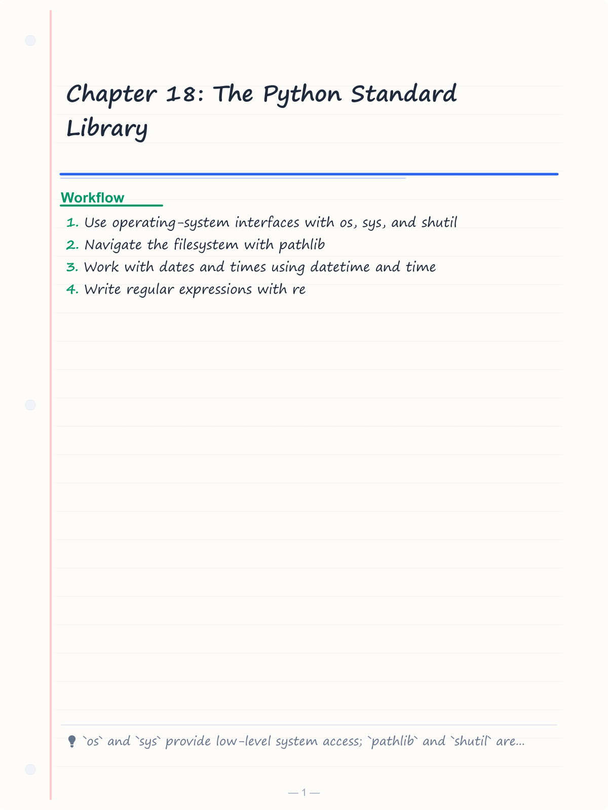
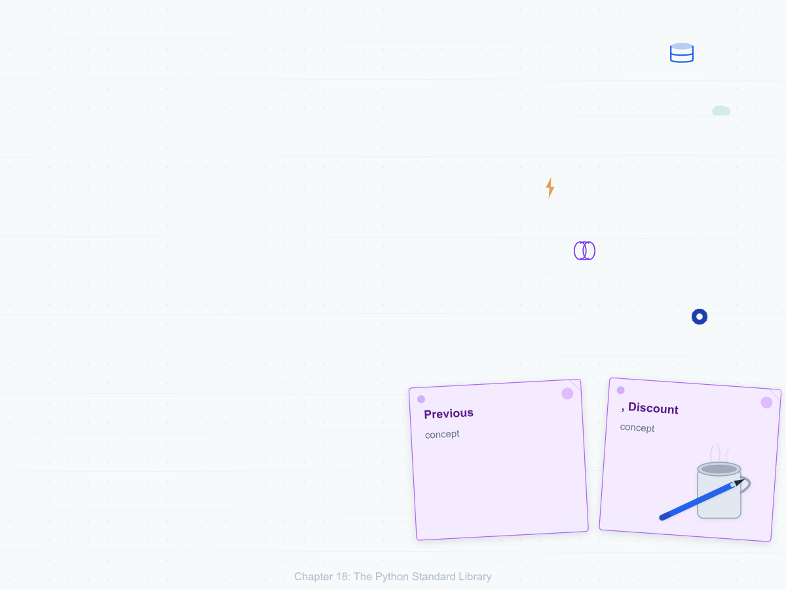
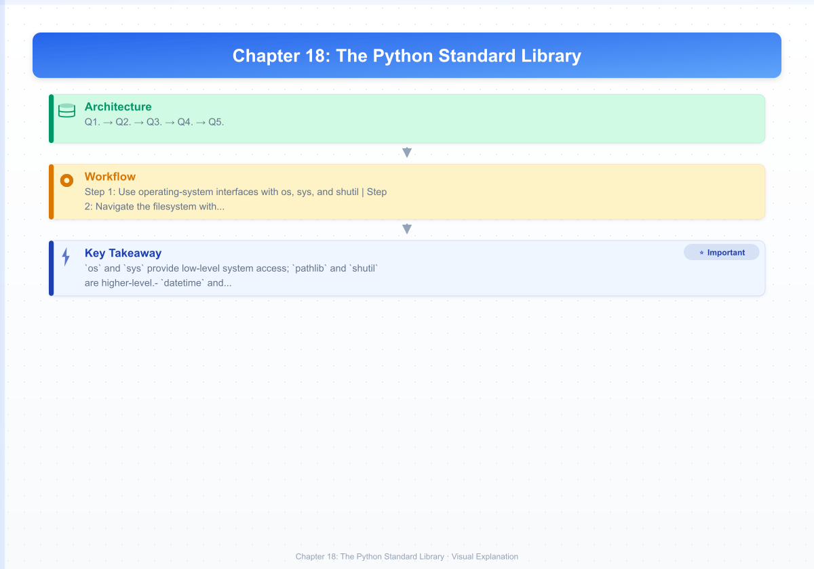

# Chapter 18: The Python Standard Library


> **Previous:** [Exceptions and File I/O](./17-exceptions-files.md) | **Next:** [APIs and Testing](./19-apis-testing.md)
## Learning Objectives

By the end of this chapter, students will be able to:
- Use operating-system interfaces with os, sys, and shutil
- Navigate the filesystem with pathlib
- Work with dates and times using datetime and time
- Write regular expressions with re
- Process structured data with json and csv
- Use collections, itertools, and functools effectively
- Apply math, random, and statistics modules
- Add type safety with typing
- Write command-line interfaces with argparse
- Implement logging in applications

<!-- Image Gallery -->
<section class="lesson-visuals" aria-label="Visual learning resources">
  <header><span>VISUAL LEARNING</span><h2>See it. Review it. Remember it.</h2></header>
  <a class="lesson-visual-card" href="../../assets/images/lessons/python-programming/18-stdlib/handwritten-notes.png" target="_blank" rel="noopener">
    
    <span><strong>Handwritten notes</strong>Condensed notes for deliberate review.</span>
  </a>
  <a class="lesson-visual-card" href="../../assets/images/lessons/python-programming/18-stdlib/sticky-notes.png" target="_blank" rel="noopener">
    
    <span><strong>Sticky-note revision</strong>Fast recall prompts for revision.</span>
  </a>
  <a class="lesson-visual-card" href="../../assets/images/lessons/python-programming/18-stdlib/visual-explanation.png" target="_blank" rel="noopener">
    
    <span><strong>Visual concept guide</strong>A connected explanation of the key ideas.</span>
  </a>
</section>
<!-- End Image Gallery -->


## Chapter at a Glance

| Section | Topic | Key Concept |
|---------|-------|-------------|
|18.1 os — Operating System Interface||`pathlib` provides modern object-oriented filesystem paths, replacing most `os.path` use.|
|18.2 sys — System-Specific Parameters||`datetime` handles dates and times; `time` offers low-level time access and `perf_counter`.|
|18.3 pathlib — Object-Oriented Filesystem||`re` provides regex matching; compile patterns with `re.compile()` for repeated use.|
|18.4 shutil — High-Level File Operations||`collections` extends built-in types with `deque`, `ChainMap`, `defaultdict`, and `Counter`.|
|18.5 datetime — Dates and Times||`argparse` builds CLI interfaces; `logging` provides structured, configurable logging.|
|18.6 time — Low-Level Time Access||undefined|
|18.7 re — Regular Expressions||undefined|
|18.8 json and csv||undefined|
|18.9 collections||undefined|
|18.10 itertools||undefined|
|18.11 functools||undefined|
|18.12 math, random, statistics||undefined|
|18.13 typing||undefined|
|18.14 argparse — Command-Line Arguments||undefined|
|18.15 logging||undefined|


## Chapter Roadmap


## 18.1 os → Operating System Interface

```python
import os

# Current working directory
print(os.getcwd())

# Listing directory
entries = os.listdir(".")
print(entries[:5])

# Environment variables
print(os.environ.get("HOME"))
print(os.environ.get("PATH")[:50])

# Path operations (legacy → prefer pathlib)
print(os.path.join("dir", "subdir", "file.txt"))
print(os.path.expanduser("~/documents"))
print(os.path.exists("test.txt"))
print(os.path.isfile("test.txt"))
print(os.path.isdir("test.txt"))
print(os.path.getsize("test.txt"))

# Process management
pid = os.getpid()
print(f"Current PID: {pid}")

# Executing shell commands
os.system("echo Hello from os")  # simple, non-capturing

# Walking directories
for root, dirs, files in os.walk("."):
    for file in files:
        if file.endswith(".py"):
            print(os.path.join(root, file))
```

## 18.2 sys → System-Specific Parameters

```python
import sys

# Command-line arguments
print(f"Script: {sys.argv[0]}")
print(f"Arguments: {sys.argv[1:]}")

# Python version
print(f"Python {sys.version}")
print(f"Version info: {sys.version_info}")

# Module search path
for path in sys.path:
    print(path)

# Standard streams
sys.stdout.write("Using stdout directly\n")
# sys.stderr.write("Error message\n")

# Exit
sys.exit(0)  # 0 = success, non-zero = error
```

## 18.3 pathlib → Object-Oriented Filesystem

Already covered in depth in Chapter 17 → here is a quick reference:

```python
from pathlib import Path

p = Path("data/input.txt")
content = p.read_text()
p.write_text(content)
for child in Path(".").iterdir():
    print(child.name)
for py_file in Path(".").rglob("*.py"):
    pass
```

## 18.4 shutil → High-Level File Operations

```python
import shutil

# Copy files
shutil.copy("source.txt", "dest.txt")
shutil.copy2("source.txt", "dest.txt")  # preserves metadata

# Copy directory tree
shutil.copytree("src_dir", "backup_dir")

# Move/rename
shutil.move("old.txt", "new.txt")

# Remove directory tree
shutil.rmtree("temp_dir")

# Disk usage
usage = shutil.disk_usage("/")
print(f"Total: {usage.total // (1024**3)} GB")
print(f"Free: {usage.free // (1024**3)} GB")

# Archive creation
shutil.make_archive("backup", "zip", "my_project")
shutil.unpack_archive("backup.zip", "extracted")
```

## 18.5 datetime → Dates and Times

```python
from datetime import datetime, date, time, timedelta, timezone

# Current date and time
now = datetime.now()
today = date.today()

print(f"Now: {now}")
print(f"Today: {today}")
print(f"Year: {now.year}, Month: {now.month}, Day: {now.day}")
print(f"Hour: {now.hour}, Minute: {now.minute}, Second: {now.second}")

# Creating dates
d = date(2025, 3, 15)
dt = datetime(2025, 3, 15, 14, 30, 0)
print(dt)  # 2025-03-15 14:30:00

# Formatting
print(dt.strftime("%Y-%m-%d %H:%M:%S"))   # 2025-03-15 14:30:00
print(dt.strftime("%A, %B %d, %Y"))        # Saturday, March 15, 2025

# Parsing
parsed = datetime.strptime("2025-03-15", "%Y-%m-%d")
print(parsed)  # 2025-03-15 00:00:00

# Time deltas
tomorrow = today + timedelta(days=1)
yesterday = today - timedelta(days=1)
next_week = today + timedelta(weeks=1)

print(tomorrow - yesterday)  # 2 days, 0:00:00

# Timezone awareness
utc_now = datetime.now(timezone.utc)
print(utc_now)
```

## 18.6 time → Low-Level Time Access

```python
import time

# Timestamps
print(time.time())       # seconds since epoch
print(time.ctime())      # human-readable string

# Sleeping
print("Waiting...")
time.sleep(0.5)
print("Done!")

# Performance timer (for benchmarking)
start = time.perf_counter()
sum(x ** 2 for x in range(1_000_000))
elapsed = time.perf_counter() - start
print(f"Took {elapsed:.4f}s")
```

## 18.7 re → Regular Expressions

```python
import re

# Pattern matching
pattern = r"\d+\.\d+"  # decimal numbers
text = "Price: 29.99, Discount: 5.50, Code: ABC123"

match = re.search(pattern, text)
if match:
    print(match.group())  # 29.99

# Find all matches
prices = re.findall(pattern, text)
print(prices)  # ['29.99', '5.50']

# Find all with groups
pattern = r"(\w+): (\d+\.\d+)"
matches = re.findall(pattern, text)
print(matches)  # [('Price', '29.99'), ('Discount', '5.50')]

# Substitution
result = re.sub(r"\d+\.\d+", "***", text)
print(result)  # Price: ***, Discount: ***, Code: ABC123

# Splitting
parts = re.split(r"[,:] ", text)
print(parts)  # ['Price', '29.99', 'Discount', '5.50', 'Code', 'ABC123']

# Compilation (for reuse)
email_pattern = re.compile(r"[a-zA-Z0-9._%+-]+@[a-zA-Z0-9.-]+\.[a-zA-Z]{2,}")
text2 = "Contact: alice@example.com or bob@test.org"
emails = email_pattern.findall(text2)
print(emails)  # ['alice@example.com', 'bob@test.org']
```

### 18.7.1 Common Patterns


```python
# Email
r"[a-zA-Z0-9._%+-]+@[a-zA-Z0-9.-]+\.[a-zA-Z]{2,}"

# URL
r"https?://[^\s/$.?#].[^\s]*"

# IP address
r"\b\d{1,3}\.\d{1,3}\.\d{1,3}\.\d{1,3}\b"

# Phone (US)
r"\b\d{3}[-.]?\d{3}[-.]?\d{4}\b"

# Date (YYYY-MM-DD)
r"\b\d{4}-\d{2}-\d{2}\b"

# HTML tags
r"<[^>]+>"
```

## 18.8 json and csv

> **One-Sentence Takeaway:** undefined


Already covered in Chapter 17 → quick reference:

```python
import json
import csv

# JSON
data = json.loads('{"key": "value"}')
json_str = json.dumps(data, indent=2)

with open("data.json") as f:
    data = json.load(f)

# CSV
with open("data.csv", newline="") as f:
    for row in csv.DictReader(f):
        print(row)
```

## 18.9 collections

> **One-Sentence Takeaway:** undefined


```python
from collections import defaultdict, Counter, OrderedDict, deque, ChainMap

# defaultdict → already covered
d = defaultdict(list)
d["key"].append(1)

# Counter → already covered
c = Counter("mississippi")
print(c.most_common(2))  # [('i', 4), ('s', 4)]

# deque → double-ended queue
queue = deque([1, 2, 3])
queue.append(4)          # [1, 2, 3, 4]
queue.appendleft(0)      # [0, 1, 2, 3, 4]
queue.pop()              # 4
queue.popleft()          # 0
print(queue)             # [1, 2, 3]

# ChainMap → combine multiple dictionaries
defaults = {"theme": "light", "font": "Arial"}
user_settings = {"theme": "dark"}
settings = ChainMap(user_settings, defaults)
print(settings["theme"])  # dark
print(settings["font"])   # Arial
```

## 18.10 itertools

> **One-Sentence Takeaway:** undefined


Already covered in Chapter 16 → quick reference:

```python
from itertools import count, cycle, permutations, combinations, product, chain, groupby
```

## 18.11 functools

> **One-Sentence Takeaway:** undefined


```python
from functools import partial, reduce, lru_cache, singledispatch

# partial → already covered
def multiply(a, b): return a * b
double = partial(multiply, 2)

# lru_cache → least recently used cache
@lru_cache(maxsize=128)
def expensive(n: int) -> int:
    return n ** n

# singledispatch → function overloading by type
@singledispatch
def format_item(item):
    return str(item)

@format_item.register
def _(item: int) -> str:
    return f"int({item})"

@format_item.register
def _(item: list) -> str:
    return f"list({len(item)} items)"

print(format_item(42))       # int(42)
print(format_item([1, 2]))   # list(2 items)
print(format_item("hello"))  # hello (default)
```

## 18.12 math, random, statistics

> **One-Sentence Takeaway:** undefined


```python
import math
import random
import statistics

# math
print(math.pi)           # 3.14159...
print(math.sqrt(16))     # 4.0
print(math.floor(3.7))   # 3
print(math.ceil(3.2))    # 4
print(math.sin(math.pi / 2))  # 1.0
print(math.gcd(12, 18))  # 6
print(math.comb(5, 2))   # 10 (combinations count)
print(math.factorial(5)) # 120
print(math.log(100, 10)) # 2.0
print(math.isfinite(float("inf")))  # False

# random
print(random.randint(1, 6))     # random dice roll
print(random.choice(["a", "b", "c"]))  # random pick
print(random.sample(range(100), 5))    # 5 unique samples
items = [1, 2, 3, 4, 5]
random.shuffle(items)
print(items)
random.seed(42)  # reproducible sequence

# statistics
data = [2, 3, 5, 7, 11, 13]
print(statistics.mean(data))      # 6.833...
print(statistics.median(data))    # 6.0
print(statistics.stdev(data))     # 4.400...
```

## 18.13 typing

> **One-Sentence Takeaway:** undefined


```python
from typing import List, Dict, Tuple, Optional, Union, Any, Callable, TypeVar, Generic

# Basic annotations
def process(items: list[int]) -> dict[str, int]:
    return {str(i): i for i in items}

# Optional
def find_user(user_id: int) -> Optional[str]:
    db = {1: "Alice", 2: "Bob"}
    return db.get(user_id)  # Optional[str] → str or None

# Union (or | in 3.10+)
def parse(value: Union[int, str]) -> int | str:
    if isinstance(value, int):
        return value * 2
    return value.upper()

# Callable
def apply(func: Callable[[int], int], value: int) -> int:
    return func(value)

# TypeVar and Generics
T = TypeVar("T")

def first(items: list[T]) -> T | None:
    return items[0] if items else None

print(first([1, 2, 3]))  # 1
```

## 18.14 argparse → Command-Line Arguments

```python
import argparse

parser = argparse.ArgumentParser(
    description="Process input files with optional verbose output.",
)
parser.add_argument("input", help="Input file path")
parser.add_argument("output", help="Output file path")
parser.add_argument("-v", "--verbose", action="store_true", help="Enable verbose output")
parser.add_argument("--count", type=int, default=1, help="Number of times to process")
parser.add_argument("--mode", choices=["fast", "accurate"], default="fast")

args = parser.parse_args()

if args.verbose:
    print(f"Processing {args.input} -> {args.output} ({args.count} times, {args.mode} mode)")
```

Usage:

```bash
python script.py input.txt output.txt -v --count 5 --mode accurate
```

## 18.15 logging

> **One-Sentence Takeaway:** undefined


```python
import logging

# Configuration
logging.basicConfig(
    level=logging.INFO,
    format="%(asctime)s - %(name)s - %(levelname)s - %(message)s",
)

logger = logging.getLogger(__name__)

# Logging levels (increasing severity)
logger.debug("Detailed debugging information")
logger.info("General operational information")
logger.warning("Something unexpected but not critical")
logger.error("A more serious problem")
logger.critical("Program may be unable to continue")

# Exception logging
try:
    1 / 0
except ZeroDivisionError:
    logger.exception("Division failed")  # includes traceback

# File logging
fh = logging.FileHandler("app.log")
fh.setLevel(logging.DEBUG)
logger.addHandler(fh)
```


## Concept Comparison Table

| Module | Domain | Key Use Case |
|---|---|---|
| pathlib | Filesystem | Cross-platform path manipulation |
| datetime | Time | Date arithmetic, formatting |
| re | Text | Pattern matching, substitution |
| collections | Data structures | deque, Counter, defaultdict |
| argparse | CLI | Building command-line interfaces |


## Quick Reference

```python
from pathlib import Path
p = Path("data/file.txt")
print(p.exists(), p.suffix)

import re
pattern = re.compile(r"\d{3}-\d{4}")
match = pattern.search("Call 555-1234")

import logging
logging.basicConfig(level=logging.INFO)
```

## Cross-Application Matrix

| Area | Application | Relevant Section |
|------|-------------|------------------|
|Data Science|datetime for time-series indexing|18.5|
|Web Dev|re for URL pattern matching|18.7|
|DevOps|argparse for CLI tools|18.14|
|Automation|logging for pipeline audit trails|18.15|


## Chapter Quiz

**Q1.** What is the advantage of pathlib over os.path?
- faster execution
- object-oriented API **<-- Correct**
- smaller memory
- more functions

**Q2.** What does re.compile do?
- executes regex
- compiles regex for reuse **<-- Correct**
- compresses strings
- compiles Python code

**Q3.** What does collections.deque provide?
- dictionary with defaults
- double-ended queue **<-- Correct**
- ordered dictionary
- counting tool

**Q4.** What is argparse used for?
- argument parsing for CLI **<-- Correct**
- regular expressions
- file I/O
- logging

**Q5.** What does logging.basicConfig configure?
- log level and format **<-- Correct**
- log file only
- log level only
- log handlers

```typescript
// Chapter 18: TypeScript Standard Library Equivalents
// Python: os.getcwd() → Node: process.cwd()
import * as fs from "node:fs";
import * as path from "node:path";
import * as os from "node:os";

console.log(process.cwd());   // Equivalent: os.getcwd()

// Python: os.listdir() / pathlib.iterdir() → Node: fs.readdirSync()
const files: string[] = fs.readdirSync(".");
console.log(files);

// Python: pathlib.Path.stat() → Node: fs.statSync()
const stats = fs.statSync(".");
console.log(stats.size, stats.mtime);

// Python: datetime → TypeScript: Date
const now: Date = new Date();
console.log(now.toISOString());  // Equivalent: datetime.now().isoformat()

// Python: re module → TypeScript: RegExp
const pattern: RegExp = /hello/i;
console.log(pattern.test("Hello World"));  // true

// Python: collections.deque → TypeScript: Array (shift/unshift/push/pop)
const queue: number[] = [];
queue.push(1); queue.push(2);
console.log(queue.shift());  // 1  (like deque.popleft())

// Python: functools.lru_cache → TypeScript: Map-based memoization
function memoize<A, B>(fn: (arg: A) => B): (arg: A) => B {
  const cache = new Map<A, B>();
  return (arg: A): B => {
    if (cache.has(arg)) return cache.get(arg)!;
    const result = fn(arg);
    cache.set(arg, result);
    return result;
  };
}

// Python: math module → TypeScript: Math global
console.log(Math.sqrt(16));      // Equivalent: math.sqrt(16)
console.log(Math.PI);            // Equivalent: math.pi
console.log(Math.random());      // Equivalent: random.random()

// Python: argparse → TypeScript: process.argv or yargs/commander
const args = process.argv.slice(2);
console.log("CLI args:", args);

// Python: logging → TypeScript: console or pino/winston
console.error("Error message");  // Equivalent: logging.error()
console.warn("Warning");
```

### TypeScript Standard Library: More Equivalents

```typescript
// Python: os.environ → TypeScript: process.env
const homeDir: string | undefined = process.env.HOME;
const nodeEnv: string = process.env.NODE_ENV ?? "development";

// Python: sys.argv → TypeScript: process.argv
const scriptName: string = process.argv[1] ?? "";
const cliArgs: string[] = process.argv.slice(2);
console.log(`Script: ${scriptName}, Args: ${cliArgs}`);

// Python: shutil.copy → TypeScript: fs.cpSync
fs.cpSync("source.txt", "dest.txt", { recursive: false });

// Python: glob.glob → TypeScript: fs.globSync (Node 22+)
// or: const globbed = fs.readdirSync(".").filter(f => f.endsWith(".ts"));

// Python: datetime.timedelta → TypeScript: milliseconds
const oneHour = 60 * 60 * 1000;  // hours * minutes * seconds * ms
const future = new Date(Date.now() + oneHour);

// Python: re.search / re.match → TypeScript: RegExp
const emailRegex = /^[\w.-]+@[\w.-]+\.\w+$/;
console.log(emailRegex.test("alice@example.com"));  // true

// Python: json.dumps / json.loads → TypeScript: JSON.stringify / JSON.parse
const data = { name: "Alice", scores: [90, 85] };
const json = JSON.stringify(data, null, 2);
const parsed = JSON.parse(json);

// Python: statistics.mean / stdev → TypeScript: manual
function mean(arr: number[]): number {
  return arr.reduce((a, b) => a + b, 0) / arr.length;
}
function stdev(arr: number[]): number {
  const m = mean(arr);
  return Math.sqrt(arr.reduce((sum, v) => sum + (v - m) ** 2, 0) / arr.length);
}
console.log(mean([1, 2, 3, 4, 5]), stdev([1, 2, 3, 4, 5]));

// Python: random.choice → TypeScript: random index
const choice = (arr: unknown[]) => arr[Math.floor(Math.random() * arr.length)];
```

### TypeScript Utilities

```typescript
// === Date Formatter (Python strftime equivalent) ===
function formatDate(date: Date, fmt: string): string {
  const map: Record<string, string> = {
    YYYY: String(date.getFullYear()),
    YY: String(date.getFullYear()).slice(-2),
    MM: String(date.getMonth() + 1).padStart(2, "0"),
    M: String(date.getMonth() + 1),
    DD: String(date.getDate()).padStart(2, "0"),
    D: String(date.getDate()),
    HH: String(date.getHours()).padStart(2, "0"),
    mm: String(date.getMinutes()).padStart(2, "0"),
    ss: String(date.getSeconds()).padStart(2, "0"),
  };
  return Object.entries(map).reduce((s, [k, v]) => s.replace(k, () => v), fmt);
}
console.log(formatDate(new Date(), "YYYY-MM-DD HH:mm")); // 2026-06-25 14:30

// === Path Utility (Python pathlib equivalent) ===
class PathUtil {
  static join(...parts: string[]): string {
    return parts.join("/").replace(/\/+/g, "/").replace(/\/$/, "") || "/";
  }
  static dirname(p: string): string { return p.includes("/") ? p.split("/").slice(0, -1).join("/") || "/" : "."; }
  static basename(p: string): string { return p.split("/").pop() ?? p; }
  static extname(p: string): string { const i = p.lastIndexOf("."); return i >= 0 ? p.slice(i) : ""; }
  static resolve(...parts: string[]): string { return PathUtil.join(...parts); }
}
console.log(PathUtil.join("/a", "b", "c"));  // /a/b/c
console.log(PathUtil.basename("/a/b/file.txt")); // file.txt
console.log(PathUtil.extname("/a/b/file.txt")); // .txt

// === RegExp Builder (Python re.compile equivalent) ===
class RegexPattern {
  private source = "";
  static start(): RegexPattern { const p = new RegexPattern(); p.source = "^"; return p; }
  digits(n?: number): this { this.source += "\\d" + (n ? `{${n}}` : "+"); return this; }
  letters(n?: number): this { this.source += "[a-zA-Z]" + (n ? `{${n}}` : "+"); return this; }
  literal(s: string): this { this.source += s.replace(/[.*+?^${}()|[\]\\]/g, "\\$&"); return this; }
  optional(): this { this.source += "?"; return this; }
  end(): this { this.source += "$"; return this; }
  build(): RegExp { return new RegExp(this.source); }
}
const emailRx = RegexPattern.start().letters().literal("@").letters().literal(".").letters(2).end().build();
console.log(emailRx.test("user@example.com")); // true

// === URL Parser ===
function parseUrl(url: string): Record<string, string> {
  try {
    const u = new URL(url);
    return { protocol: u.protocol, host: u.hostname, port: u.port || "80", path: u.pathname, query: u.search, hash: u.hash };
  } catch { return { error: "Invalid URL" }; }
}
console.log(parseUrl("https://api.example.com:443/users?id=5#section"));
```

### TypeScript System Programming Patterns

```typescript
// === Process Management (Python: os, subprocess) ===
import { spawn, execSync } from "child_process";
function runCommand(cmd: string, args: string[]): Promise<string> {
  return new Promise((resolve, reject) => {
    const child = spawn(cmd, args);
    let output = "";
    child.stdout.on("data", (data: Buffer) => { output += data.toString(); });
    child.stderr.on("data", (data: Buffer) => { output += data.toString(); });
    child.on("close", (code: number) => {
      code === 0 ? resolve(output) : reject(new Error(`Exit code ${code}: ${output}`));
    });
  });
}

// === File System Watcher (Python: watchdog) ===
import { watch, FSWatcher } from "fs";
class FileWatcher {
  private watchers = new Map<string, FSWatcher>();
  watchFile(path: string, callback: (event: string, filename: string) => void): void {
    const watcher = watch(path, (event, filename) => {
      if (filename) callback(event, filename.toString());
    });
    this.watchers.set(path, watcher);
  }
  unwatch(path: string): void {
    this.watchers.get(path)?.close();
    this.watchers.delete(path);
  }
  unwatchAll(): void {
    for (const watcher of this.watchers.values()) watcher.close();
    this.watchers.clear();
  }
}

// === INI Config Parser (Python: configparser) ===
function parseIni(raw: string): Record<string, Record<string, string>> {
  const result: Record<string, Record<string, string>> = {};
  let currentSection = "DEFAULT";
  result[currentSection] = {};
  for (const line of raw.split("\n")) {
    const trimmed = line.trim();
    if (!trimmed || trimmed.startsWith("#") || trimmed.startsWith(";")) continue;
    const sectionMatch = trimmed.match(/^\[(.+)\]$/);
    if (sectionMatch) { currentSection = sectionMatch[1]; result[currentSection] = {}; continue; }
    const eqIdx = trimmed.indexOf("=");
    if (eqIdx > 0) {
      const key = trimmed.slice(0, eqIdx).trim();
      const value = trimmed.slice(eqIdx + 1).trim();
      result[currentSection][key] = value;
    }
  }
  return result;
}

// === Logging System (Python: logging) ===
enum LogLevel { DEBUG = 0, INFO = 1, WARN = 2, ERROR = 3 }
class Logger {
  private loggers = new Map<string, LogLevel>();
  private handlers: ((level: LogLevel, name: string, msg: string) => void)[] = [];
  
  setLevel(name: string, level: LogLevel): void { this.loggers.set(name, level); }
  
  addHandler(handler: (level: LogLevel, name: string, msg: string) => void): void {
    this.handlers.push(handler);
  }
  
  log(level: LogLevel, name: string, msg: string): void {
    const minLevel = this.loggers.get(name) ?? LogLevel.INFO;
    if (level >= minLevel) {
      for (const handler of this.handlers) handler(level, name, msg);
    }
  }
  
  info(name: string, msg: string): void { this.log(LogLevel.INFO, name, msg); }
  error(name: string, msg: string): void { this.log(LogLevel.ERROR, name, msg); }
  warn(name: string, msg: string): void { this.log(LogLevel.WARN, name, msg); }
  debug(name: string, msg: string): void { this.log(LogLevel.DEBUG, name, msg); }
}

// === Temporary File Manager (Python: tempfile) ===
import { mkdtempSync, writeFileSync, rmSync } from "fs";
import { tmpdir } from "os";
import { join } from "path";
class TempDir {
  private path: string;
  constructor(prefix = "tmp") {
    this.path = mkdtempSync(join(tmpdir(), prefix));
  }
  write(name: string, content: string): string {
    const fullPath = join(this.path, name);
    writeFileSync(fullPath, content, "utf-8");
    return fullPath;
  }
  getPath(): string { return this.path; }
  cleanup(): void { rmSync(this.path, { recursive: true, force: true }); }
}

const config = parseIni("[database]\nhost=localhost\nport=5432\nuser=admin");
console.log(config); // { DEFAULT: {}, database: { host: "localhost", ... } }

const tmp = new TempDir("py-stdlib-");
tmp.write("test.txt", "hello");
console.log(tmp.getPath());
tmp.cleanup();
```

### TypeScript Standard Library Patterns

```typescript
// === Python stdlib equivalents in TypeScript ===
import { resolve, basename, dirname, extname, join, normalize, relative } from "path";
import { existsSync, readFileSync, writeFileSync, readdirSync, mkdirSync, statSync, copyFileSync, unlinkSync } from "fs";
import { createHash, randomBytes, createHmac } from "crypto";
import { format } from "util";
import { EventEmitter } from "events";

// === Python: os.path operations ===
function pathOps() {
  const p = "/home/user/projects/src/main.py";
  console.log({
    basename: basename(p),
    dirname: dirname(p),
    ext: extname(p),
    stem: basename(p).replace(extname(p), ""),
    absolute: resolve("."),
  });
}

// === Python: shutil operations ===
function fileOps() {
  const src = "data.txt", dst = "backup/data.txt";
  if (!existsSync(dirname(dst))) mkdirSync(dirname(dst), { recursive: true });
  copyFileSync(src, dst);
  const stats = statSync(src);
  console.log({ size: stats.size, created: stats.birthtime, modified: stats.mtime });
}

// === Python: json operations ===
function jsonOps() {
  const data = { name: "Alice", scores: [95, 87, 92], meta: { created: new Date().toISOString() } };
  writeFileSync("data.json", JSON.stringify(data, null, 2), "utf-8");
  const parsed = JSON.parse(readFileSync("data.json", "utf-8"));
  console.log("JSON roundtrip:", JSON.stringify(parsed) === JSON.stringify(data));
}

// === Python: csv module ===
function csvOps() {
  const csvData = "name,age,city\nAlice,30,New York\nBob,25,London";
  const lines = csvData.trim().split("\n");
  const headers = lines[0].split(",");
  const rows = lines.slice(1).map(l => {
    const vals = l.split(",");
    return headers.reduce((obj, h, i) => ({ ...obj, [h]: vals[i] }), {} as Record<string, string>);
  });
  console.log(rows);
}

// === Python: hashlib ===
function hashOps() {
  const data = "hello world";
  console.log({
    md5: createHash("md5").update(data).digest("hex"),
    sha256: createHash("sha256").update(data).digest("hex"),
    randomHex: randomBytes(16).toString("hex"),
  });
}

// === Python: datetime ===
function dateOps() {
  const now = new Date();
  const yesterday = new Date(now);
  yesterday.setDate(yesterday.getDate() - 1);
  console.log({ now: now.toISOString(), yesterday: yesterday.toISOString() });
}

// === Python: collections.Counter ===
function counter<T>(items: T[]): Map<T, number> {
  const counts = new Map<T, number>();
  for (const item of items) counts.set(item, (counts.get(item) ?? 0) + 1);
  return counts;
}

console.log("=== Python stdlib × TypeScript equivalents ===");
pathOps(); fileOps(); jsonOps(); csvOps(); hashOps(); dateOps();
console.log(counter(["a","b","a","c","b","a"]));
```

## Summary

- `os` and `sys` provide low-level system access; `pathlib` and `shutil` are higher-level.
- `datetime` and `time` handle dates, times, and performance measurement.
- `re` provides powerful text pattern matching.
- `collections` extends built-in types; `itertools` provides iteration tools.
- `functools` offers higher-order functions and caching.
- `math`, `random`, `statistics` cover numerical operations.
- `typing` enables static type checking.
- `argparse` builds CLI interfaces; `logging` provides structured logging.

## Exercises

### Review Questions

1. What is the advantage of `pathlib` over `os.path`?
2. Why would you use `re.compile` instead of directly using `re.search`?
3. What is the difference between `logging.info` and `logging.debug`?
4. How does `functools.singledispatch` achieve function overloading?
5. When would you use `argparse` over manually parsing `sys.argv`?

### Application Problems

1. Write a program that walks a directory tree, finds all files larger than 1 MB, groups them by extension using `collections.Counter`, and prints a report sorted by count descending. Use `pathlib` for paths.
2. Implement a log parser that reads an Apache-style access log, extracts IP addresses using regex, counts requests per hour, and identifies the top 10 IP addresses. Use `collections.Counter` and `datetime`.
3. Write a CLI tool using `argparse` that accepts a directory path, a file pattern (glob), and an output format (csv/json). It should scan the directory for matching files and output their metadata (name, size, modified time) in the chosen format.

### Challenge Problem

Build a simple HTTP request logger and inspector using `http.server` and `logging`. Create a custom HTTP handler that logs every request's method, path, headers, and response status. Parse query parameters with `urllib.parse` and log them separately. Support a `--port` and `--log-level` argument via argparse. Route `/stats` to return a JSON summary of recent requests (count by method, count by status code). Use `statistics` for response time metrics.
