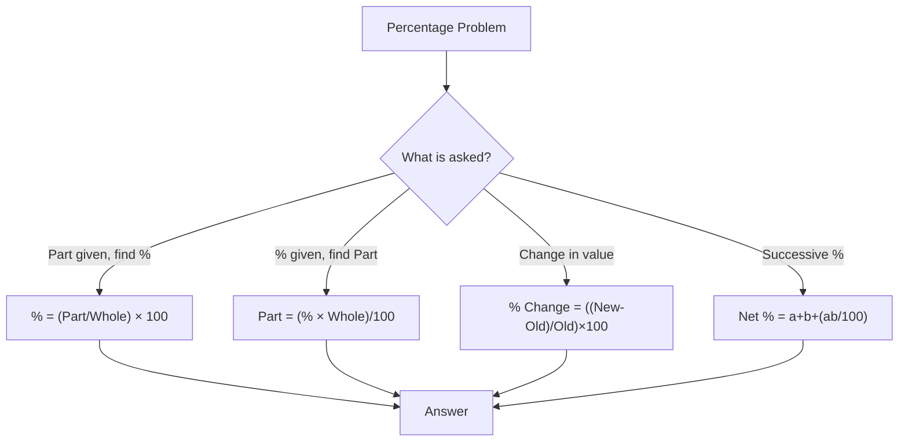
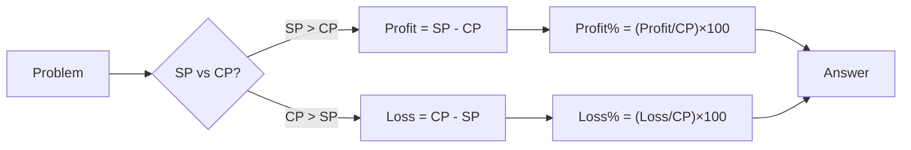
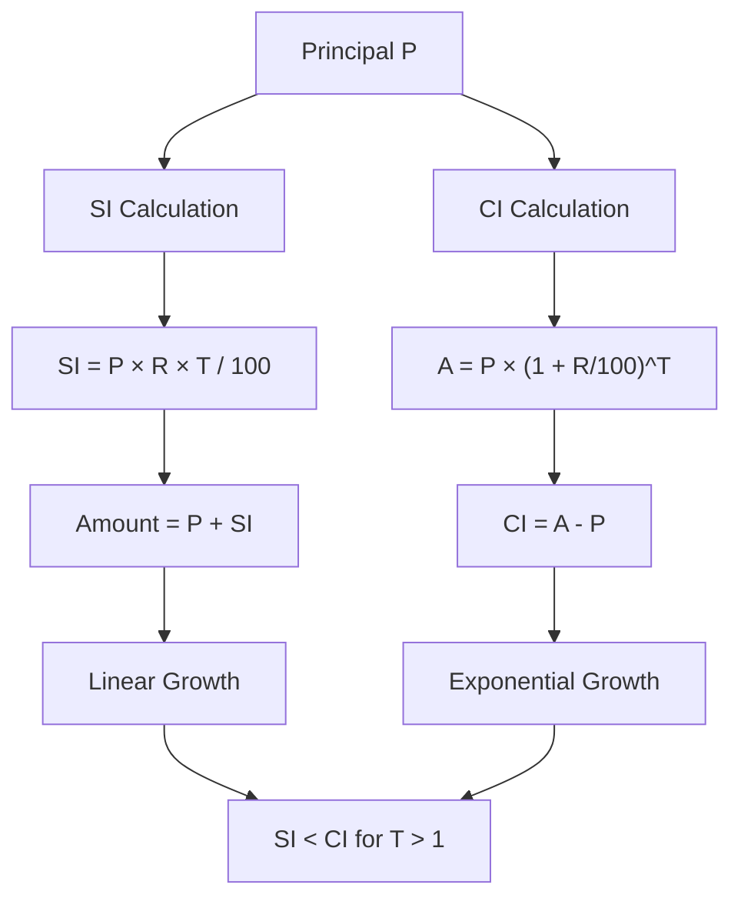
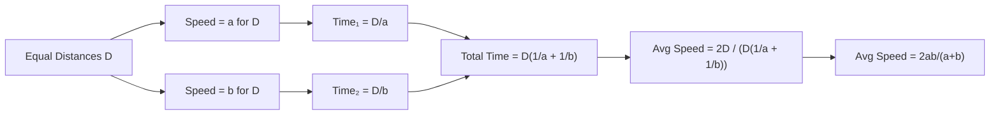

# Chapter 1: Arithmetic Foundation — Percentage, Profit & Loss, Simple/Compound Interest, Ratio & Proportion, Averages

## Learning Objectives

By the end of this chapter, you will be able to:
- Calculate percentages and apply percentage change concepts in exam problems
- Solve profit & loss problems involving cost price, selling price, discounts, and marked price
- Differentiate between simple interest and compound interest and compute both
- Apply ratio & proportion rules to solve partnership and distribution problems
- Compute averages including weighted averages and average speed
- Use shortcut techniques to solve IBPS SO-level arithmetic problems in under 60 seconds

## Theory

### 1. Percentage

A percentage is a fraction whose denominator is 100. The symbol `%` means per hundred.

**Basic Formula:**

```
Percentage = (Part / Whole) × 100
```

**Percentage Change:**

```
Percentage Change = ((Final Value - Initial Value) / Initial Value) × 100
```

**Successive Percentage Change:**

If a value increases by `a%` and then by `b%`, the net change is:

```
Net % Change = a + b + (a × b) / 100
```

For two successive discounts of `a%` and `b%`:

```
Net Discount = a + b - (a × b) / 100
```

**Important Fraction-to-Percentage Conversions:**

| Fraction | Percentage |
|----------|------------|
| 1/2 | 50% |
| 1/3 | 33.33% |
| 1/4 | 25% |
| 1/5 | 20% |
| 1/6 | 16.67% |
| 1/7 | 14.28% |
| 1/8 | 12.5% |
| 1/9 | 11.11% |
| 1/10 | 10% |
| 1/11 | 9.09% |
| 1/12 | 8.33% |

**IBPS SO Tip:** Memorising these fraction-to-percentage conversions saves 10–15 seconds per question.

### 2. Profit & Loss

**Key Terms:**
- **Cost Price (CP):** The price at which an item is purchased
- **Selling Price (SP):** The price at which an item is sold
- **Marked Price (MP):** The printed/listed price before discount
- **Profit:** SP - CP (when SP &gt; CP)
- **Loss:** CP - SP (when CP &gt; SP)

**Formulas:**

```
Profit % = (Profit / CP) × 100
Loss % = (Loss / CP) × 100
SP = CP × (1 + Profit%/100)
SP = CP × (1 - Loss%/100)
CP = SP / (1 + Profit%/100)
CP = SP / (1 - Loss%/100)
```

**Discount:**

```
Discount = MP - SP
Discount % = (Discount / MP) × 100
SP = MP × (1 - Discount%/100)
```

**Two Successive Discounts:**

If two discounts `d1%` and `d2%` are applied:

```
Net Discount % = d1 + d2 - (d1 × d2) / 100
```

**False Weight / Dishonest Dealer:**

If a dealer sells at cost price but uses a false weight:

```
Profit % = [(True Weight - False Weight) / False Weight] × 100
```

### 3. Simple Interest (SI)

**Formula:**

```
SI = (P × R × T) / 100
Amount (A) = P + SI = P × (1 + RT/100)
```

Where:
- `P` = Principal (initial amount)
- `R` = Rate of interest per annum (in %)
- `T` = Time period (in years)

**Key Variations:**

If the rate is `R%` per annum for `T` years, and interest is calculated monthly:

```
SI (monthly) = (P × R × T) / 1200
```

### 4. Compound Interest (CI)

**Formula:**

```
A = P × (1 + R/100)^T
CI = A - P = P × [(1 + R/100)^T - 1]
```

**Half-Yearly Compounding:**

```
A = P × (1 + R/200)^(2T)
```

**Quarterly Compounding:**

```
A = P × (1 + R/400)^(4T)
```

**Difference between CI and SI for 2 years:**

```
CI - SI = P × (R/100)^2
```

**Difference between CI and SI for 3 years:**

```
CI - SI = P × (R/100)^2 × (3 + R/100)
```

### 5. Ratio & Proportion

**Ratio:** A comparison of two quantities by division. `a : b = a/b`

**Proportion:** When two ratios are equal. `a : b = c : d` => `ad = bc`

**Componendo and Dividendo:**

If `a/b = c/d`, then `(a+b)/(a-b) = (c+d)/(c-d)`

**Direct Proportion:** If `x ∝ y`, then `x = ky` (k is constant)

**Inverse Proportion:** If `x ∝ 1/y`, then `xy = k`

**Partnership:**

- **Simple Partnership:** Profit/loss shared in the ratio of investments
- **Compound Partnership:** Profit/loss shared in the ratio of (investment × time)

### 6. Averages

**Basic Formula:**

```
Average = Sum of all observations / Number of observations
```

**Weighted Average:**

When different items have different weights:

```
Weighted Average = (w1 × x1 + w2 × x2 + ...) / (w1 + w2 + ...)
```

**Average Speed:**

```
Average Speed = Total Distance / Total Time
```

For two equal distances at speeds `a` and `b`:

```
Average Speed = 2ab / (a + b)
```

**Combined Average:**

If group A has `n1` items with average `a1` and group B has `n2` items with average `a2`:

```
Combined Average = (n1 × a1 + n2 × a2) / (n1 + n2)
```

## Mermaid Diagram: Percentage Problem-Solving Flowchart



## Mermaid Diagram: Profit & Loss Decision Tree



## Examples

### Example 1: Percentage (IBPS SO Level)

**Question:** In an examination, 65% of the candidates passed in Mathematics, 55% passed in English, and 35% passed in both subjects. If 2500 candidates appeared, how many failed in both subjects?

**Solution:**

Let total candidates = 100%.
Passed in Mathematics = 65%
Passed in English = 55%
Passed in both = 35%
Passed in at least one = 65 + 55 - 35 = 85%
Failed in both = 100 - 85 = 15%

Number of candidates who failed in both = 15% of 2500
= (15/100) × 2500
= 375

Therefore, 375 candidates failed in both subjects.

### Example 2: Profit & Loss

**Question:** A shopkeeper marks an article 30% above the cost price and gives a discount of 10% to a customer. What is his profit percentage?

**Solution:**

Let CP = ₹100
MP = 100 + 30% of 100 = ₹130
Discount = 10% of MP = 10% of 130 = ₹13
SP = MP - Discount = 130 - 13 = ₹117
Profit = SP - CP = 117 - 100 = ₹17
Profit % = (17/100) × 100 = 17%

**Shortcut:** Net profit % = a + b + (ab/100) where a = +30%, b = -10%
Net % = 30 - 10 + (30 × (-10))/100 = 20 - 3 = 17%

### Example 3: Simple Interest

**Question:** A sum of money at simple interest amounts to ₹12,000 in 3 years and to ₹13,800 in 5 years. Find the principal and the rate of interest.

**Solution:**

Amount in 5 years = ₹13,800
Amount in 3 years = ₹12,000
Interest for 2 years = 13,800 - 12,000 = ₹1,800
Interest for 1 year = ₹900
Interest for 3 years = ₹2,700

Principal = Amount - Interest = 12,000 - 2,700 = ₹9,300

Rate = (SI × 100) / (P × T) = (2700 × 100) / (9300 × 3)
= 270000 / 27900
= 9.68% per annum

### Example 4: Compound Interest

**Question:** Find the compound interest on ₹20,000 for 2 years at 10% per annum compounded annually.

**Solution:**

P = ₹20,000, R = 10%, T = 2 years

A = P × (1 + R/100)^T
= 20000 × (1 + 10/100)^2
= 20000 × (11/10)^2
= 20000 × 121/100
= ₹24,200

CI = A - P = 24200 - 20000 = ₹4,200

### Example 5: Ratio & Proportion

**Question:** A sum of money is divided among A, B, C in the ratio 2:3:5. If B gets ₹1,200 more than A, find the total amount and the share of each.

**Solution:**

Let the shares be 2x, 3x, and 5x.
Difference between B and A = 3x - 2x = x = ₹1,200
So, x = ₹1,200

A's share = 2 × 1200 = ₹2,400
B's share = 3 × 1200 = ₹3,600
C's share = 5 × 1200 = ₹6,000

Total amount = 2400 + 3600 + 6000 = ₹12,000

### Example 6: Averages

**Question:** The average of 30 numbers is 45. If two numbers 56 and 44 are removed, what is the new average?

**Solution:**

Sum of 30 numbers = 30 × 45 = 1,350
Sum of removed numbers = 56 + 44 = 100
Sum of remaining 28 numbers = 1350 - 100 = 1,250
New average = 1250 / 28 = 44.64

### Example 7: Successive Percentage (Exam Style)

**Question:** The population of a town increased by 10% in the first year, 15% in the second year, and decreased by 20% in the third year. If the initial population was 1,00,000, what is the population after 3 years?

**Solution:**

Method 1 (Step-by-step):
After Year 1: 100000 × (1 + 10/100) = 100000 × 1.1 = 110000
After Year 2: 110000 × (1 + 15/100) = 110000 × 1.15 = 126500
After Year 3: 126500 × (1 - 20/100) = 126500 × 0.8 = 101200

Method 2 (Net factor):
Net factor = 1.1 × 1.15 × 0.8 = 1.012
Population = 100000 × 1.012 = 101200

### Example 8: Dishonest Dealer

**Question:** A shopkeeper sells rice at the cost price but uses a weight of 900g instead of 1kg. Find his profit percentage.

**Solution:**

True weight = 1000g, False weight = 900g
Profit % = [(1000 - 900) / 900] × 100
= (100/900) × 100
= 11.11%

### Example 9: Weighted Average

**Question:** In a class, there are 40 boys with an average weight of 55 kg and 30 girls with an average weight of 48 kg. Find the average weight of the class.

**Solution:**

Combined average = (40 × 55 + 30 × 48) / (40 + 30)
= (2200 + 1440) / 70
= 3640 / 70
= 52 kg

### Example 10: CI Difference Trick

**Question:** The difference between compound interest and simple interest on a sum of money for 2 years at 5% per annum is ₹25. Find the sum.

**Solution:**

Using the formula: CI - SI = P × (R/100)^2
25 = P × (5/100)^2
25 = P × (1/20)^2
25 = P × (1/400)
P = 25 × 400 = ₹10,000

## Shortcut Methods

### Shortcut 1: Percentage to Fraction

Convert difficult percentages to fractions for faster computation:
- `33.33% = 1/3`, `66.66% = 2/3`, `16.67% = 1/6`
- `14.28% = 1/7`, `12.5% = 1/8`, `11.11% = 1/9`

### Shortcut 2: Profit/Loss by Multiplying Factors

Instead of calculating step by step, multiply by a combined factor:
- For a 20% profit: multiply CP by `1.2` to get SP
- For a 15% loss: multiply CP by `0.85` to get SP
- For a 10% discount: multiply MP by `0.9` to get SP

### Shortcut 3: SI and CI for 2 Years

For SI at R% for 2 years:
`SI = 2PR/100`

For CI at R% for 2 years:
`CI = 2PR/100 + P(R/100)^2`

The extra amount in CI over SI is `P(R/100)^2`

### Shortcut 4: Ratio Quick Division

To divide a number N in ratio a:b:c, first find:
`Sum = a + b + c`
Then each share = `N × (respective part) / Sum`

### Shortcut 5: Average Correction

When replacing one value with another:
`New Average = Old Average + (New Value - Old Value) / Total Items`

## Mermaid Diagram: SI vs CI Comparison Over 3 Years



## Mermaid Diagram: Average Speed for Equal Distances



## Summary

- **Percentage** is the most fundamental topic — almost every other topic uses percentage concepts
- **Profit & Loss** revolves around CP, SP, MP, and the relationships between them through discounts
- **Simple Interest** grows linearly while **Compound Interest** grows exponentially; CI will always be greater than SI for T &gt; 1 year at the same rate
- **Ratio & Proportion** is the backbone for partnership problems, ages, and mixtures
- **Averages** can be manipulated by adding, removing, or replacing items — the sum is always the key
- Successive percentage changes are not additive; use the formula `a + b + ab/100`
- For IBPS SO, mastering fraction-to-percentage conversion tables can save significant time
- The difference between CI and SI for 2 years gives a direct way to find the principal when the difference is known

## Practical Takeaways

| Topic | Key Formula to Remember | Common Exam Trap |
|-------|------------------------|------------------|
| Percentage | Successive % = a + b + ab/100 | Forgetting sign (loss = negative) |
| Profit & Loss | SP = CP × (1 ± P%/100) | Applying discount on CP instead of MP |
| Simple Interest | SI = PRT/100 | Using months instead of years |
| Compound Interest | A = P(1+R/100)^T | Forgetting to subtract P from A |
| Ratio & Proportion | a:b = c:d => ad = bc | Not simplifying ratios first |
| Averages | Avg = Sum/Count | Using wrong count after removal |

## Chapter Quiz

### Question 1

If the price of a commodity is increased by 20% and then decreased by 20%, the net change in price is:

<details>
<summary>Answer</summary>
Net % = 20 + (-20) + (20 × (-20))/100 = 0 - 4 = -4%
Net decrease of 4%.
</details>

### Question 2

A sum of money doubles itself in 8 years at simple interest. The rate of interest per annum is:

<details>
<summary>Answer</summary>
Let P = 100, A = 200, SI = 100
R = (100 × 100) / (100 × 8) = 12.5%
</details>

### Question 3

Three numbers are in the ratio 2:3:5 and their sum is 400. The largest number is:

<details>
<summary>Answer</summary>
Sum of ratios = 2 + 3 + 5 = 10
Largest number = (5/10) × 400 = 200
</details>

### Question 4

The average of 10 numbers is 35. If each number is multiplied by 3, the new average is:

<details>
<summary>Answer</summary>
If each number is multiplied by a constant k, the average also gets multiplied by k.
New average = 35 × 3 = 105
</details>

### Question 5

The compound interest on ₹8,000 at 10% per annum for 2 years is:

<details>
<summary>Answer</summary>
A = 8000 × (1.1)^2 = 8000 × 1.21 = ₹9,680
CI = 9680 - 8000 = ₹1,680
</details>

## Exercises

### Exercise 1 (Beginner)

A man spends 75% of his income. If his income increases by 20% and his savings increase by 60%, find the percentage increase in his expenditure.

### Exercise 2 (Beginner)

A shopkeeper sells an article at ₹1,200 and makes a profit of 20%. Find the cost price.

### Exercise 3 (Intermediate)

A sum of ₹5,000 is invested at 8% per annum compound interest. Find the amount after 3 years.

### Exercise 4 (Intermediate)

The ratio of the ages of A and B is 3:5. After 8 years, the ratio will be 5:7. Find their present ages.

### Exercise 5 (Advanced)

The average of 25 observations is 35. The average of first 13 observations is 32 and the average of last 13 observations is 38. Find the 13th observation.

### Exercise 6 (Advanced)

A dishonest dealer professes to sell his goods at cost price but uses a weight of 800g for 1kg. Find his profit percentage.

### Exercise 7 (IBPS SO Level)

If the difference between CI and SI on a sum of money for 2 years at 5% per annum is ₹61.50, find the sum.

### Exercise 8 (IBPS SO Level)

Population of a town increases at 5% per annum. If the present population is 1,85,220, what was the population 2 years ago?

### Exercise 9 (Mixed)

A and B invest ₹30,000 and ₹45,000 in a business. After 6 months, B withdraws his entire investment. At the end of 2 years, the total profit is ₹84,000. Find B's share.

### Exercise 10 (Mixed)

In an exam, 80% of candidates passed in Science, 70% passed in Maths, and 15% failed in both. If 450 candidates passed in both subjects, find the total number of candidates.

---

**Answer Key (Exercises):**
1. 10% increase
2. ₹1,000
3. ₹6,298.56
4. A=12 years, B=20 years
5. 13th observation = 13
6. 25%
7. ₹24,600
8. 1,68,000
9. B's share = ₹36,000
10. 1000 candidates
