# Chapter 1: Arithmetic Foundation — Percentage, Profit & Loss, Simple/Compound Interest, Ratio & Proportion, Averages

## Learning Objectives

By the end of this chapter, you will be able to:
- Calculate percentages and apply percentage change concepts in exam problems
- Solve profit & loss problems involving cost price, selling price, discounts, and marked price
- Differentiate between simple interest and compound interest and compute both
- Apply ratio & proportion rules to solve partnership and distribution problems
- Compute averages including weighted averages and average speed
- Use shortcut techniques to solve IBPS SO-level arithmetic problems in under 60 seconds

<!-- Image Gallery -->
<section class="lesson-visuals" aria-label="Visual learning resources">
  <header><span>VISUAL LEARNING</span><h2>See it. Review it. Remember it.</h2></header>
  <a class="lesson-visual-card" href="../../assets/images/lessons/quantitative-aptitude/01-arithmetic-foundation/handwritten-notes.png" target="_blank" rel="noopener">
    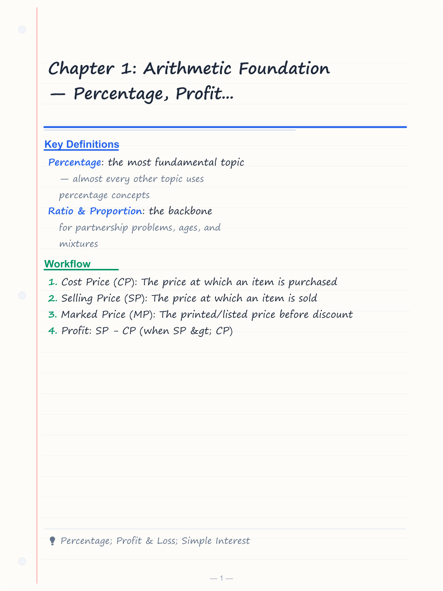
    <span><strong>Handwritten notes</strong>Condensed notes for deliberate review.</span>
  </a>
  <a class="lesson-visual-card" href="../../assets/images/lessons/quantitative-aptitude/01-arithmetic-foundation/sticky-notes.png" target="_blank" rel="noopener">
    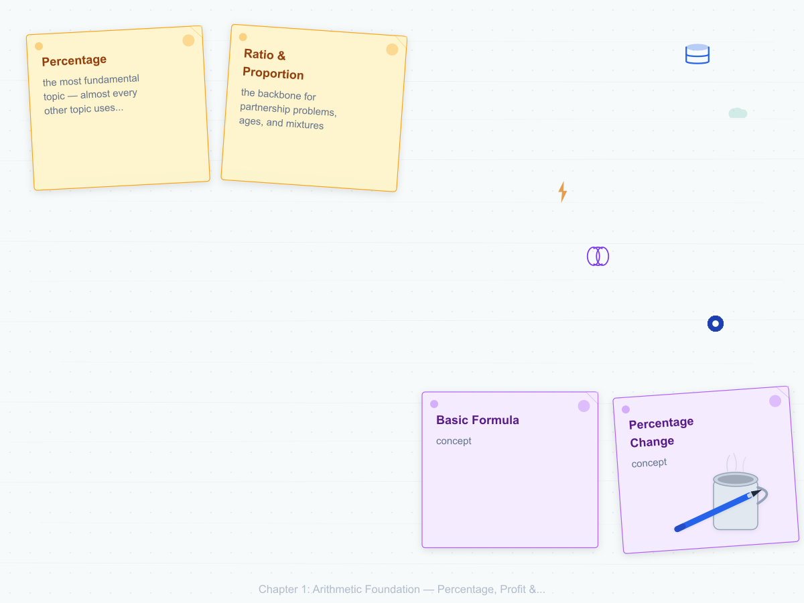
    <span><strong>Sticky-note revision</strong>Fast recall prompts for revision.</span>
  </a>
  <a class="lesson-visual-card" href="../../assets/images/lessons/quantitative-aptitude/01-arithmetic-foundation/visual-explanation.png" target="_blank" rel="noopener">
    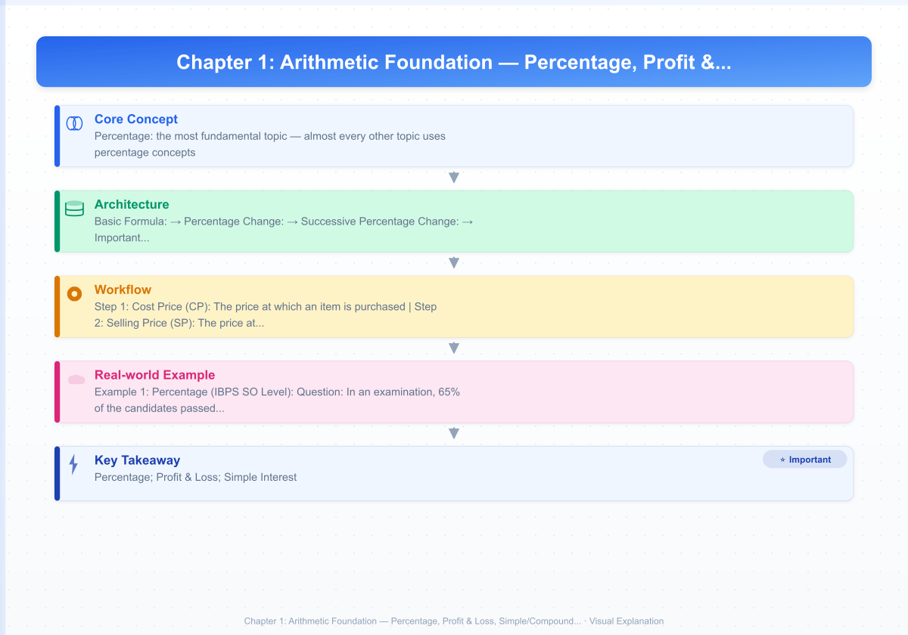
    <span><strong>Visual concept guide</strong>A connected explanation of the key ideas.</span>
  </a>
</section>
<!-- End Image Gallery -->

## Theory

### 1. Percentage

A percentage is a fraction whose denominator is 100. The symbol `%` means per hundred.

**Basic Formula:**

```
Percentage = (Part / Whole) × 100
```

**Percentage Change:**

```
Percentage Change = ((Final Value - Initial Value) / Initial Value) × 100
```

**Successive Percentage Change:**

If a value increases by `a%` and then by `b%`, the net change is:

```
Net % Change = a + b + (a × b) / 100
```

For two successive discounts of `a%` and `b%`:

```
Net Discount = a + b - (a × b) / 100
```

**Important Fraction-to-Percentage Conversions:**

| Fraction | Percentage |
|----------|------------|
| 1/2 | 50% |
| 1/3 | 33.33% |
| 1/4 | 25% |
| 1/5 | 20% |
| 1/6 | 16.67% |
| 1/7 | 14.28% |
| 1/8 | 12.5% |
| 1/9 | 11.11% |
| 1/10 | 10% |
| 1/11 | 9.09% |
| 1/12 | 8.33% |

**IBPS SO Tip:** Memorising these fraction-to-percentage conversions saves 10–15 seconds per question.

### 2. Profit & Loss

**Key Terms:**
- **Cost Price (CP):** The price at which an item is purchased
- **Selling Price (SP):** The price at which an item is sold
- **Marked Price (MP):** The printed/listed price before discount
- **Profit:** SP - CP (when SP &gt; CP)
- **Loss:** CP - SP (when CP &gt; SP)

**Formulas:**

```
Profit % = (Profit / CP) × 100
Loss % = (Loss / CP) × 100
SP = CP × (1 + Profit%/100)
SP = CP × (1 - Loss%/100)
CP = SP / (1 + Profit%/100)
CP = SP / (1 - Loss%/100)
```

**Discount:**

```
Discount = MP - SP
Discount % = (Discount / MP) × 100
SP = MP × (1 - Discount%/100)
```

**Two Successive Discounts:**

If two discounts `d1%` and `d2%` are applied:

```
Net Discount % = d1 + d2 - (d1 × d2) / 100
```

**False Weight / Dishonest Dealer:**

If a dealer sells at cost price but uses a false weight:

```
Profit % = [(True Weight - False Weight) / False Weight] × 100
```

### 3. Simple Interest (SI)

**Formula:**

```
SI = (P × R × T) / 100
Amount (A) = P + SI = P × (1 + RT/100)
```

Where:
- `P` = Principal (initial amount)
- `R` = Rate of interest per annum (in %)
- `T` = Time period (in years)

**Key Variations:**

If the rate is `R%` per annum for `T` years, and interest is calculated monthly:

```
SI (monthly) = (P × R × T) / 1200
```

### 4. Compound Interest (CI)

**Formula:**

```
A = P × (1 + R/100)^T
CI = A - P = P × [(1 + R/100)^T - 1]
```

**Half-Yearly Compounding:**

```
A = P × (1 + R/200)^(2T)
```

**Quarterly Compounding:**

```
A = P × (1 + R/400)^(4T)
```

**Difference between CI and SI for 2 years:**

```
CI - SI = P × (R/100)^2
```

**Difference between CI and SI for 3 years:**

```
CI - SI = P × (R/100)^2 × (3 + R/100)
```

### 5. Ratio & Proportion

**Ratio:** A comparison of two quantities by division. `a : b = a/b`

**Proportion:** When two ratios are equal. `a : b = c : d` => `ad = bc`

**Componendo and Dividendo:**

If `a/b = c/d`, then `(a+b)/(a-b) = (c+d)/(c-d)`

**Direct Proportion:** If `x ∝ y`, then `x = ky` (k is constant)

**Inverse Proportion:** If `x ∝ 1/y`, then `xy = k`

**Partnership:**

- **Simple Partnership:** Profit/loss shared in the ratio of investments
- **Compound Partnership:** Profit/loss shared in the ratio of (investment × time)

### 6. Averages

**Basic Formula:**

```
Average = Sum of all observations / Number of observations
```

**Weighted Average:**

When different items have different weights:

```
Weighted Average = (w1 × x1 + w2 × x2 + ...) / (w1 + w2 + ...)
```

**Average Speed:**

```
Average Speed = Total Distance / Total Time
```

For two equal distances at speeds `a` and `b`:

```
Average Speed = 2ab / (a + b)
```

**Combined Average:**

If group A has `n1` items with average `a1` and group B has `n2` items with average `a2`:

```
Combined Average = (n1 × a1 + n2 × a2) / (n1 + n2)
```

## Mermaid Diagram: Percentage Problem-Solving Flowchart

```mermaid
flowchart TD
    A["Percentage Problem"] --> B{"What is asked?"}
    B -->|"Part given, find %"| C["% = (Part/Whole) × 100"]
    B -->|"% given, find Part"| D["Part = (% × Whole)/100"]
    B -->|"Change in value"| E["% Change = ((New-Old)/Old)×100"]
    B -->|"Successive %"| F["Net % = a+b+(ab/100)"]
    C --> G["Answer"]
    D --> G
    E --> G
    F --> G
```

## Mermaid Diagram: Profit & Loss Decision Tree

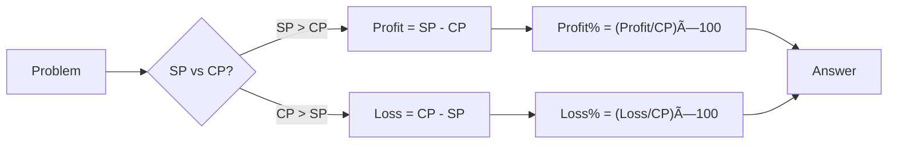

## Examples

### Example 1: Percentage (IBPS SO Level)

**Question:** In an examination, 65% of the candidates passed in Mathematics, 55% passed in English, and 35% passed in both subjects. If 2500 candidates appeared, how many failed in both subjects?

**Solution:**

Let total candidates = 100%.
Passed in Mathematics = 65%
Passed in English = 55%
Passed in both = 35%
Passed in at least one = 65 + 55 - 35 = 85%
Failed in both = 100 - 85 = 15%

Number of candidates who failed in both = 15% of 2500
= (15/100) × 2500
= 375

Therefore, 375 candidates failed in both subjects.

### Example 2: Profit & Loss

**Question:** A shopkeeper marks an article 30% above the cost price and gives a discount of 10% to a customer. What is his profit percentage?

**Solution:**

Let CP = ₹100
MP = 100 + 30% of 100 = ₹130
Discount = 10% of MP = 10% of 130 = ₹13
SP = MP - Discount = 130 - 13 = ₹117
Profit = SP - CP = 117 - 100 = ₹17
Profit % = (17/100) × 100 = 17%

**Shortcut:** Net profit % = a + b + (ab/100) where a = +30%, b = -10%
Net % = 30 - 10 + (30 × (-10))/100 = 20 - 3 = 17%

### Example 3: Simple Interest

**Question:** A sum of money at simple interest amounts to ₹12,000 in 3 years and to ₹13,800 in 5 years. Find the principal and the rate of interest.

**Solution:**

Amount in 5 years = ₹13,800
Amount in 3 years = ₹12,000
Interest for 2 years = 13,800 - 12,000 = ₹1,800
Interest for 1 year = ₹900
Interest for 3 years = ₹2,700

Principal = Amount - Interest = 12,000 - 2,700 = ₹9,300

Rate = (SI × 100) / (P × T) = (2700 × 100) / (9300 × 3)
= 270000 / 27900
= 9.68% per annum

### Example 4: Compound Interest

**Question:** Find the compound interest on ₹20,000 for 2 years at 10% per annum compounded annually.

**Solution:**

P = ₹20,000, R = 10%, T = 2 years

A = P × (1 + R/100)^T
= 20000 × (1 + 10/100)^2
= 20000 × (11/10)^2
= 20000 × 121/100
= ₹24,200

CI = A - P = 24200 - 20000 = ₹4,200

### Example 5: Ratio & Proportion

**Question:** A sum of money is divided among A, B, C in the ratio 2:3:5. If B gets ₹1,200 more than A, find the total amount and the share of each.

**Solution:**

Let the shares be 2x, 3x, and 5x.
Difference between B and A = 3x - 2x = x = ₹1,200
So, x = ₹1,200

A's share = 2 × 1200 = ₹2,400
B's share = 3 × 1200 = ₹3,600
C's share = 5 × 1200 = ₹6,000

Total amount = 2400 + 3600 + 6000 = ₹12,000

### Example 6: Averages

**Question:** The average of 30 numbers is 45. If two numbers 56 and 44 are removed, what is the new average?

**Solution:**

Sum of 30 numbers = 30 × 45 = 1,350
Sum of removed numbers = 56 + 44 = 100
Sum of remaining 28 numbers = 1350 - 100 = 1,250
New average = 1250 / 28 = 44.64

### Example 7: Successive Percentage (Exam Style)

**Question:** The population of a town increased by 10% in the first year, 15% in the second year, and decreased by 20% in the third year. If the initial population was 1,00,000, what is the population after 3 years?

**Solution:**

Method 1 (Step-by-step):
After Year 1: 100000 × (1 + 10/100) = 100000 × 1.1 = 110000
After Year 2: 110000 × (1 + 15/100) = 110000 × 1.15 = 126500
After Year 3: 126500 × (1 - 20/100) = 126500 × 0.8 = 101200

Method 2 (Net factor):
Net factor = 1.1 × 1.15 × 0.8 = 1.012
Population = 100000 × 1.012 = 101200

### Example 8: Dishonest Dealer

**Question:** A shopkeeper sells rice at the cost price but uses a weight of 900g instead of 1kg. Find his profit percentage.

**Solution:**

True weight = 1000g, False weight = 900g
Profit % = [(1000 - 900) / 900] × 100
= (100/900) × 100
= 11.11%

### Example 9: Weighted Average

**Question:** In a class, there are 40 boys with an average weight of 55 kg and 30 girls with an average weight of 48 kg. Find the average weight of the class.

**Solution:**

Combined average = (40 × 55 + 30 × 48) / (40 + 30)
= (2200 + 1440) / 70
= 3640 / 70
= 52 kg

### Example 10: CI Difference Trick

**Question:** The difference between compound interest and simple interest on a sum of money for 2 years at 5% per annum is ₹25. Find the sum.

**Solution:**

Using the formula: CI - SI = P × (R/100)^2
25 = P × (5/100)^2
25 = P × (1/20)^2
25 = P × (1/400)
P = 25 × 400 = ₹10,000

## Shortcut Methods

### Shortcut 1: Percentage to Fraction

Convert difficult percentages to fractions for faster computation:
- `33.33% = 1/3`, `66.66% = 2/3`, `16.67% = 1/6`
- `14.28% = 1/7`, `12.5% = 1/8`, `11.11% = 1/9`

### Shortcut 2: Profit/Loss by Multiplying Factors

Instead of calculating step by step, multiply by a combined factor:
- For a 20% profit: multiply CP by `1.2` to get SP
- For a 15% loss: multiply CP by `0.85` to get SP
- For a 10% discount: multiply MP by `0.9` to get SP

### Shortcut 3: SI and CI for 2 Years

For SI at R% for 2 years:
`SI = 2PR/100`

For CI at R% for 2 years:
`CI = 2PR/100 + P(R/100)^2`

The extra amount in CI over SI is `P(R/100)^2`

### Shortcut 4: Ratio Quick Division

To divide a number N in ratio a:b:c, first find:
`Sum = a + b + c`
Then each share = `N × (respective part) / Sum`

### Shortcut 5: Average Correction

When replacing one value with another:
`New Average = Old Average + (New Value - Old Value) / Total Items`

## Mermaid Diagram: SI vs CI Comparison Over 3 Years

```mermaid
flowchart TD
    A["Principal P"] --> B["SI Calculation"]
    A --> C["CI Calculation"]
    B --> D["SI = P × R × T / 100"]
    C --> E["A = P × (1 + R/100)^T"]
    D --> F["Amount = P + SI"]
    E --> G["CI = A - P"]
    F --> H["Linear Growth"]
    G --> I["Exponential Growth"]
    H --> J["SI < CI for T > 1"]
    I --> J
```

## Mermaid Diagram: Average Speed for Equal Distances

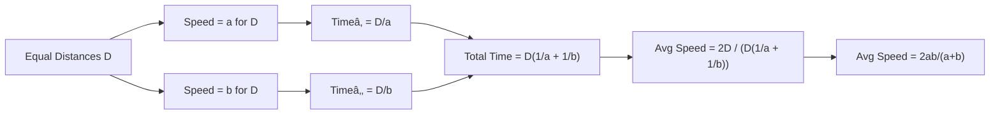

## Mermaid Diagram: Combined Average Concept

```mermaid
flowchart TD
    A["Group 1: n₁ items, avg a₁"] --> C["Sum₁ = n₁ × a₁"]
    B["Group 2: n₂ items, avg a₂"] --> D["Sum₂ = n₂ × a₂"]
    C --> E["Combined Avg = (Sum₁ + Sum₂)/(n₁ + n₂)"]
    D --> E
    E --> F["Weighted Average Formula"]
```

## Mermaid Diagram: SI vs CI — Year-by-Year Breakdown

```mermaid
flowchart TD
    subgraph "Year 1"
        A1["SI₁ = PR/100"]
        B1["CI₁ = PR/100"]
    end
    subgraph "Year 2"
        A2["SIâ‚‚ = PR/100"]
        B2["CIâ‚‚ = P(1+R/100)R/100"]
    end
    subgraph "Year 3"
        A3["SI₃ = PR/100"]
        B3["CI₃ = P(1+R/100)²R/100"]
    end
    A1 --> A2 --> A3
    B1 --> B2 --> B3
    A2 --> D["SI is constant each year"]
    B2 --> E["CI grows each year"]
    D --> F["CI − SI = P(R/100)² for 2yr"]
    E --> F
```

## Formula Reference Table

| Topic | Formula | Variables |
|-------|---------|-----------|
| Percentage | Part = (% × Whole)/100 | %, Whole |
| % Change | ((N₂−N₁)/N₁) × 100 | N₁=old, N₂=new |
| Successive % | a + b + ab/100 | a,b = successive % |
| Profit % | (SP−CP)/CP × 100 | SP, CP |
| Discount % | (MP−SP)/MP × 100 | MP, SP |
| SI | PRT/100 | P, R, T |
| CI Amount | P(1+R/100)^T | P, R, T |
| CI−SI (2yr) | P(R/100)² | P, R |
| Ratio Division | (Part/Sum) × Total | Part, Sum, Total |
| Average | Sum/Count | Sum, Count |
| Weighted Avg | Σ(wᵢxᵢ)/Σwᵢ | weights, values |
| Avg Speed (2 equal dist) | 2ab/(a+b) | speeds a,b |
| Combined Avg | (n₁a₁+n₂a₂)/(n₁+n₂) | n=count, a=average |

## TypeScript Implementation: Arithmetic Formula Calculator

```typescript
// arithmetic-calculator.ts — Formula calculators for Chapter 1

class PercentageCalculator {
  static partOfWhole(part: number, whole: number): number {
    return (part / whole) * 100;
  }

  static percentageChange(initial: number, final: number): number {
    return ((final - initial) / initial) * 100;
  }

  static successiveChange(a: number, b: number): number {
    return a + b + (a * b) / 100;
  }

  static findOriginalAfterChange(
    finalValue: number,
    changes: number[]
  ): number {
    let factor = 1;
    for (const c of changes) {
      factor *= 1 + c / 100;
    }
    return finalValue / factor;
  }
}

class ProfitLossCalculator {
  static profitPercent(cp: number, sp: number): number {
    return ((sp - cp) / cp) * 100;
  }

  static lossPercent(cp: number, sp: number): number {
    return ((cp - sp) / cp) * 100;
  }

  static spFromProfit(cp: number, profitPercent: number): number {
    return cp * (1 + profitPercent / 100);
  }

  static spFromLoss(cp: number, lossPercent: number): number {
    return cp * (1 - lossPercent / 100);
  }

  static cpFromProfit(sp: number, profitPercent: number): number {
    return sp / (1 + profitPercent / 100);
  }

  static netDiscount(d1: number, d2: number): number {
    return d1 + d2 - (d1 * d2) / 100;
  }

  static dishonestProfit(trueWeight: number, falseWeight: number): number {
    return ((trueWeight - falseWeight) / falseWeight) * 100;
  }
}

class InterestCalculator {
  static simpleInterest(P: number, R: number, T: number): number {
    return (P * R * T) / 100;
  }

  static compoundInterest(P: number, R: number, T: number): number {
    return P * Math.pow(1 + R / 100, T) - P;
  }

  static compoundAmount(P: number, R: number, T: number): number {
    return P * Math.pow(1 + R / 100, T);
  }

  static ciHalfYearly(P: number, R: number, T: number): number {
    return P * Math.pow(1 + R / 200, 2 * T) - P;
  }

  static ciQuarterly(P: number, R: number, T: number): number {
    return P * Math.pow(1 + R / 400, 4 * T) - P;
  }

  static ciMinusSiFor2Years(P: number, R: number): number {
    return P * Math.pow(R / 100, 2);
  }

  static ciMinusSiFor3Years(P: number, R: number): number {
    return P * Math.pow(R / 100, 2) * (3 + R / 100);
  }

  static principalFromCiSiDiff(diff: number, R: number, T: 2 | 3): number {
    if (T === 2) return diff / Math.pow(R / 100, 2);
    return diff / (Math.pow(R / 100, 2) * (3 + R / 100));
  }
}

class RatioCalculator {
  static divideAmount(total: number, ratios: number[]): number[] {
    const sum = ratios.reduce((a, b) => a + b, 0);
    return ratios.map((r) => (r / sum) * total);
  }

  static partnershipProfit(
    investments: { amount: number; months: number }[],
    totalProfit: number
  ): number[] {
    const weighted = investments.map((i) => i.amount * i.months);
    const sum = weighted.reduce((a, b) => a + b, 0);
    return weighted.map((w) => (w / sum) * totalProfit);
  }
}

class AverageCalculator {
  static average(values: number[]): number {
    return values.reduce((a, b) => a + b, 0) / values.length;
  }

  static weightedAverage(
    values: number[],
    weights: number[]
  ): number {
    const totalWeight = weights.reduce((a, b) => a + b, 0);
    const sum = values.reduce((s, v, i) => s + v * weights[i], 0);
    return sum / totalWeight;
  }

  static averageSpeedEqualDistances(a: number, b: number): number {
    return (2 * a * b) / (a + b);
  }

  static combinedAverage(
    n1: number,
    a1: number,
    n2: number,
    a2: number
  ): number {
    return (n1 * a1 + n2 * a2) / (n1 + n2);
  }

  static newAverageAfterReplacement(
    oldAvg: number,
    n: number,
    oldValue: number,
    newValue: number
  ): number {
    return oldAvg + (newValue - oldValue) / n;
  }
}

// Example usage
const P = 10000;
const R = 5;
const T = 2;
console.log(`CI on ₹${P} at ${R}% for ${T}y: ₹${InterestCalculator.compoundInterest(P, R, T)}`);
console.log(`SI vs CI diff: ₹${InterestCalculator.ciMinusSiFor2Years(P, R)}`);

const cp = 500;
const sp = 600;
console.log(`Profit %: ${ProfitLossCalculator.profitPercent(cp, sp)}%`);

const scores = [85, 90, 75, 80];
console.log(`Average: ${AverageCalculator.average(scores)}`);

// Detect if a dealer is dishonest
const profit = ProfitLossCalculator.dishonestProfit(1000, 900);
console.log(`Dishonest dealer profit: ${profit.toFixed(2)}%`);
```

## 📝 Solved Examples (20 MCQs)

### Set 1: Percentage (Questions 1–5)

**Question 1:** In an election between two candidates, one candidate got 55% of the total valid votes. 15% of the total votes were invalid. If the total votes polled were 80,000, what was the number of valid votes the winning candidate received?

<details>
<summary>Answer & Solution</summary>
**Formula:** Percentage = (Part / Whole) × 100

Invalid votes = 15% of 80,000 = 12,000
Valid votes = 80,000 - 12,000 = 68,000
Winning candidate = 55% of 68,000 = (55/100) × 68,000 = 37,400

**Answer:** 37,400
</details>

**Question 2:** A's salary is 20% less than B's. By what percentage is B's salary more than A's?

<details>
<summary>Answer & Solution</summary>
**Formula:** If A is r% less than B, then B is [r/(100−r)] × 100% more than A.

Let B = 100, then A = 80
Required % = [(100 − 80) / 80] × 100 = (20/80) × 100 = 25%

**Answer:** 25%
</details>

**Question 3:** The price of a commodity increased by 15% and then decreased by 10%. Find the net percentage change.

<details>
<summary>Answer & Solution</summary>
**Formula:** Successive % change = a + b + ab/100

Net % = 15 + (−10) + (15 × (−10))/100 = 5 − 1.5 = 3.5%

**Answer:** 3.5% increase
</details>

**Question 4:** In an examination, 45% of students failed in Maths, 35% failed in English, and 20% failed in both. If 600 students appeared, how many passed in both subjects?

<details>
<summary>Answer & Solution</summary>
**Formula:** n(A∪B) = n(A) + n(B) − n(A∩B); Passed in both = Total − Failed in at least one

Failed in at least one = 45 + 35 − 20 = 60%
Passed in both = 100 − 60 = 40%
Number = 40% of 600 = 240

**Answer:** 240
</details>

**Question 5:** If the price of petrol increases by 25%, by what percentage should a person reduce consumption so that expenditure remains unchanged?

<details>
<summary>Answer & Solution</summary>
**Formula:** Reduction % = [r/(100+r)] × 100

Reduction % = [25/(100+25)] × 100 = (25/125) × 100 = 20%

**Answer:** 20%
</details>

### Set 2: Profit & Loss (Questions 6–10)

**Question 6:** A shopkeeper sells an article at ₹1,200, making a profit of 20%. Find the cost price.

<details>
<summary>Answer & Solution</summary>
**Formula:** CP = SP / (1 + Profit%/100)

CP = 1200 / (1 + 20/100) = 1200 / 1.2 = ₹1,000

**Answer:** ₹1,000
</details>

**Question 7:** A trader marks an article 40% above the cost price and gives a discount of 15%. Find the profit percentage.

<details>
<summary>Answer & Solution</summary>
**Formula:** Net % = a + b + ab/100, where a = markup%, b = −discount%

Net % = 40 + (−15) + (40 × (−15))/100 = 25 − 6 = 19%

**Answer:** 19%
</details>

**Question 8:** A dishonest dealer sells goods at cost price but uses a weight of 960g instead of 1kg. Find his profit percentage.

<details>
<summary>Answer & Solution</summary>
**Formula:** Profit % = [(True Weight − False Weight) / False Weight] × 100

Profit % = [(1000 − 960) / 960] × 100 = (40/960) × 100 = 4.17%

**Answer:** 4.17%
</details>

**Question 9:** A shopkeeper allows a discount of 10% on the marked price and still gains 20%. Find the marked price if the cost price is ₹500.

<details>
<summary>Answer & Solution</summary>
**Formula:** MP = SP / (1 − Discount%/100), SP = CP × (1 + Profit%/100)

SP = 500 × 1.2 = ₹600
MP = 600 / 0.9 = ₹666.67

**Answer:** ₹666.67
</details>

**Question 10:** By selling 33 articles, a person gains the selling price of 11 articles. Find the profit percentage.

<details>
<summary>Answer & Solution</summary>
**Formula:** Profit % = [Profit / CP] × 100

Let SP of 1 article = ₹1
SP of 33 articles = ₹33
Profit = SP of 11 articles = ₹11
CP of 33 articles = 33 − 11 = ₹22
Profit % = (11/22) × 100 = 50%

**Answer:** 50%
</details>

### Set 3: Simple & Compound Interest (Questions 11–15)

**Question 11:** A sum of money doubles itself in 10 years at simple interest. Find the rate of interest.

<details>
<summary>Answer & Solution</summary>
**Formula:** R = (SI × 100) / (P × T)

Let P = 100, A = 200, SI = 100
R = (100 × 100) / (100 × 10) = 10%

**Answer:** 10% per annum
</details>

**Question 12:** Find the compound interest on ₹15,000 for 2 years at 8% per annum compounded annually.

<details>
<summary>Answer & Solution</summary>
**Formula:** CI = P[(1 + R/100)^T − 1]

A = 15000 × (1.08)^2 = 15000 × 1.1664 = ₹17,496
CI = 17496 − 15000 = ₹2,496

**Answer:** ₹2,496
</details>

**Question 13:** The difference between CI and SI on a sum for 2 years at 10% per annum is ₹100. Find the sum.

<details>
<summary>Answer & Solution</summary>
**Formula:** CI − SI = P × (R/100)^2

100 = P × (10/100)^2 = P × 0.01
P = 100 / 0.01 = ₹10,000

**Answer:** ₹10,000
</details>

**Question 14:** At what rate per annum will ₹5,000 amount to ₹6,050 in 2 years compounded annually?

<details>
<summary>Answer & Solution</summary>
**Formula:** A = P(1 + R/100)^T

6050 = 5000(1 + R/100)^2
(1 + R/100)^2 = 6050/5000 = 1.21
1 + R/100 = √1.21 = 1.1
R/100 = 0.1, R = 10%

**Answer:** 10% per annum
</details>

**Question 15:** Find the amount if ₹20,000 is invested at 12% per annum compounded half-yearly for 1.5 years.

<details>
<summary>Answer & Solution</summary>
**Formula (half-yearly):** A = P(1 + R/200)^(2T)

A = 20000 × (1 + 12/200)^(2 × 1.5)
= 20000 × (1.06)^3
= 20000 × 1.191016
= ₹23,820.32

**Answer:** ₹23,820.32
</details>

### Set 4: Ratio & Proportion (Questions 16–18)

**Question 16:** If A : B = 4 : 5 and B : C = 6 : 7, find A : B : C.

<details>
<summary>Answer & Solution</summary>
**Formula:** Multiply the ratios to get a common B value.

Make B equal: A:B = 4:5 = 24:30; B:C = 6:7 = 30:35
A:B:C = 24:30:35

**Answer:** 24 : 30 : 35
</details>

**Question 17:** A sum of ₹84,000 is divided among A, B, C in the ratio 3:5:7. Find the share of each.

<details>
<summary>Answer & Solution</summary>
**Formula:** Share = (Individual Ratio / Sum of Ratios) × Total

Sum = 3 + 5 + 7 = 15
A = (3/15) × 84000 = ₹16,800
B = (5/15) × 84000 = ₹28,000
C = (7/15) × 84000 = ₹39,200

**Answer:** A = ₹16,800, B = ₹28,000, C = ₹39,200
</details>

**Question 18:** If x : y = 3 : 2, find the value of (3x + 2y) : (5x − 3y).

<details>
<summary>Answer & Solution</summary>
**Formula:** Substitute x = 3k, y = 2k.

x = 3k, y = 2k
(3x + 2y) : (5x − 3y) = (9k + 4k) : (15k − 6k) = 13k : 9k = 13 : 9

**Answer:** 13 : 9
</details>

### Set 5: Averages (Questions 19–20)

**Question 19:** The average age of 30 students is 15 years. If the teacher's age is included, the average becomes 16 years. Find the teacher's age.

<details>
<summary>Answer & Solution</summary>
**Formula:** New value = New Avg × New Count − Old Sum

Sum of 30 students = 30 × 15 = 450
Sum including teacher = 31 × 16 = 496
Teacher's age = 496 − 450 = 46 years

**Answer:** 46 years
</details>

**Question 20:** The average of 5 consecutive numbers is 37. Find the largest number.

<details>
<summary>Answer & Solution</summary>
**Formula:** For consecutive numbers, the middle number equals the average.

Let numbers be x, x+1, x+2, x+3, x+4
Average = (5x + 10)/5 = x + 2 = 37
x = 35
Numbers: 35, 36, 37, 38, 39
Largest = 39

**Answer:** 39
</details>

## 📖 Exercise Bank (30 Questions)

**1.** A man spends 60% of his income and saves the rest. If his income increases by 25% and his expenditure increases by 15%, find the percentage increase in his savings.

**2.** In a mixture of 80 litres, the ratio of milk to water is 3:1. How much water should be added to make the ratio 1:2?

**3.** The population of a town increases by 8% annually. If the present population is 1,45,800, what was it 2 years ago?

**4.** A shopkeeper marks his goods 25% above CP and gives a 12% discount. Find his profit percentage.

**5.** A sum of ₹8,000 is lent at 12% per annum simple interest. Find the amount after 3 years.

**6.** Find the compound interest on ₹12,000 for 3 years at 5% per annum compounded annually.

**7.** The ratio of present ages of A and B is 5:7. After 6 years, the ratio becomes 7:9. Find the present age of B.

**8.** The average weight of 8 persons increases by 2.5 kg when a new person replaces one weighing 65 kg. Find the weight of the new person.

**9.** If 15% of A = 20% of B, find A:B.

**10.** A vendor sells 20 articles for the same price at which he bought 25 articles. Find his profit percentage.

**11.** A sum doubles itself in 8 years at SI. In how many years will it triple itself?

**12.** Find the compound interest on ₹24,000 for 1.5 years at 10% per annum compounded half-yearly.

**13.** Three numbers are in the ratio 2:5:7. If their sum is 420, find the smallest number.

**14.** The average of 15 numbers is 40. If two numbers 36 and 52 are removed, find the new average.

**15.** A tradesman marks his goods at 30% above cost and allows a 10% discount for cash. What profit does he make?

**16.** In an exam, 72% of candidates passed in English, 64% in Maths, and 28% failed in both. If 300 candidates passed in both, find the total number.

**17.** Vessels A and B contain mixtures of milk and water in ratios 4:1 and 3:2 respectively. In what ratio should they be mixed to get a mixture with milk and water in ratio 13:7?

**18.** A sum of ₹6,200 is divided among A, B, C such that A:B = 2:3 and B:C = 4:5. Find C's share.

**19.** The average of 25 results is 18. The average of the first 12 is 15 and the average of the last 12 is 20. Find the 13th result.

**20.** A dealer sells an article at a loss of 8% for ₹460. At what price should he sell it to gain 12%?

**21.** The difference between CI and SI for 3 years at 10% per annum is ₹155. Find the principal.

**22.** If 5 men or 7 women can do a work in 28 days, in how many days will 7 men and 5 women complete it?

**23.** A:b = 3:4, B:c = 8:9, C:d = 12:13. Find A:d.

**24.** The average monthly expenditure of a family is ₹4,200 for first 4 months, ₹4,800 for next 5 months, and ₹5,600 for last 3 months. Find the average monthly expenditure.

**25.** A sum of money becomes ₹7,200 in 4 years and ₹8,640 in 7 years at SI. Find the principal and rate.

**26.** If the selling price of 12 articles equals the cost price of 15 articles, find the profit percentage.

**27.** In a town, 65% of the population are adults. Among adults, 40% are women. If the total population is 1,20,000, find the number of adult men.

**28.** A merchant mixes two varieties of tea costing ₹120/kg and ₹150/kg in ratio 3:5. Find the cost per kg of the mixture.

**29.** The average of 11 numbers is 42. If the average of the first 6 is 38 and the average of the last 6 is 45, find the 6th number.

**30.** By giving a 10% discount on the marked price, a shopkeeper still makes a 20% profit. If the cost price is ₹450, find the marked price.

**Answer Key:**

1. 45% increase
2. 100 litres
3. 1,25,000
4. 10%
5. ₹10,880
6. ₹13,891.50
7. 21 years
8. 85 kg
9. 4:3
10. 25%
11. 16 years
12. ₹27,783 (approx)
13. 60
14. 39.23
15. 17%
16. 600
17. 2:3
18. ₹3,000
19. 12
20. ₹560
21. ₹5,000
22. 10 days
23. 8:13
24. ₹4,750
25. P=₹4,800, R=12.5%
26. 25%
27. 46,800
28. ₹138.75/kg
29. 36
30. ₹600

## Mermaid Diagram: Interest Rate Comparison Over Time

```mermaid
flowchart TD
    A["Principal ₹P"] --> B["Simple Interest: P × R × T / 100"]
    A --> C["Compound Interest: P × (1 + R/100)^T − P"]
    B --> D["Linear Growth"]
    C --> E["Exponential Growth"]
    D --> F["Difference = P(R/100)^T (approx)"]
    E --> F
    F --> G["CI > SI for T > 1"]
    G --> H["CI − SI increases with T and R"]
```

## Mermaid Diagram: Percentage Problem Flow — Election Type

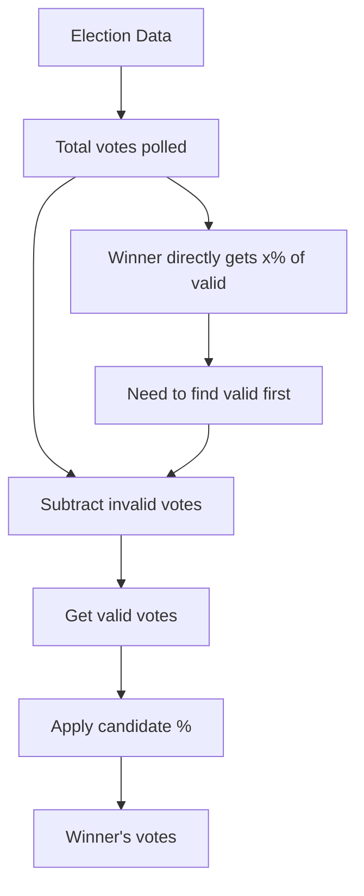

## Mermaid Diagram: Discount Chain

```mermaid
flowchart LR
    A["CP"] --> B["Markup = CP × (1 + m%)"]
    B --> C["MP = Marked Price"]
    C --> D["Discount = MP × d%"]
    D --> E["SP = MP − Discount"]
    E --> F["Profit = SP − CP"]
    F --> G["Profit % = (Profit/CP)×100"]
```

## Mermaid Diagram: Profit & Loss — Multi-Article Problems

```mermaid
flowchart TD
    A["Buy m articles at ₹c each"] --> B["Total CP = m × c"]
    A --> C["Sell n articles at ₹s each"]
    C --> D["Total SP = n × s"]
    B --> E["Profit = SP − CP"]
    D --> E
    E --> F{"SP > CP?"}
    F -->|"Yes"| G["Profit % = (Profit/CP)×100"]
    F -->|"No"| H["Loss % = (Loss/CP)×100"]
```

## Mermaid Diagram: Ratio & Proportion — Partnership Problem Flow

```mermaid
flowchart TD
    A["Partnership Problem"] --> B{"Simple or Compound?"}
    B -->|"Same investment period"| C["Profit ratio = Investment ratio"]
    B -->|"Different periods"| D["Profit ratio = I₁T₁ : I₂T₂ : I₃T₃"]
    C --> E["Simplify ratio"]
    D --> E
    E --> F["Each share = (Part/Sum) × Total Profit"]
```

## Derivations of Key Formulas

### Derivation of Successive Percentage Change

If a value V increases by a%, the new value = V(1 + a/100).
If this new value further increases by b%, the final value = V(1 + a/100)(1 + b/100).

Net change = [(1 + a/100)(1 + b/100) − 1] × 100
= [1 + a/100 + b/100 + ab/10000 − 1] × 100
= a + b + ab/100

### Derivation of CI − SI for 2 Years

SI for 2 years at R% on P = 2PR/100
CI for 2 years = P(1 + R/100)² − P = P[1 + 2R/100 + R²/10000 − 1] = 2PR/100 + P(R/100)²
CI − SI = [2PR/100 + P(R/100)²] − [2PR/100] = P(R/100)²

### Derivation of Average Speed for Equal Distances

Let distance = D each way, speeds = a and b.
Time₁ = D/a, Time₂ = D/b
Total distance = 2D, Total time = D/a + D/b = D(a+b)/(ab)
Average speed = 2D / [D(a+b)/(ab)] = 2ab/(a+b)

### Derivation of Dishonest Dealer Profit

True weight = T, False weight = F (F &lt; T)
Dealer buys T quantity but sells only F quantity (keeping T−F as extra).
Since he sells at CP, CP of T = SP of F
For the quantity F, he gets the price of T.
Profit on F = (T − F) value
Profit % on CP of F = [(T − F)/F] × 100

## Summary

- **Percentage** is the most fundamental topic — almost every other topic uses percentage concepts
- **Profit & Loss** revolves around CP, SP, MP, and the relationships between them through discounts
- **Simple Interest** grows linearly while **Compound Interest** grows exponentially; CI will always be greater than SI for T &gt; 1 year at the same rate
- **Ratio & Proportion** is the backbone for partnership problems, ages, and mixtures
- **Averages** can be manipulated by adding, removing, or replacing items — the sum is always the key
- Successive percentage changes are not additive; use the formula `a + b + ab/100`
- For IBPS SO, mastering fraction-to-percentage conversion tables can save significant time
- The difference between CI and SI for 2 years gives a direct way to find the principal when the difference is known

## Practical Takeaways

| Topic | Key Formula to Remember | Common Exam Trap |
|-------|------------------------|------------------|
| Percentage | Successive % = a + b + ab/100 | Forgetting sign (loss = negative) |
| Profit & Loss | SP = CP × (1 ± P%/100) | Applying discount on CP instead of MP |
| Simple Interest | SI = PRT/100 | Using months instead of years |
| Compound Interest | A = P(1+R/100)^T | Forgetting to subtract P from A |
| Ratio & Proportion | a:b = c:d => ad = bc | Not simplifying ratios first |
| Averages | Avg = Sum/Count | Using wrong count after removal |

## Chapter Quiz

### Question 1

If the price of a commodity is increased by 20% and then decreased by 20%, the net change in price is:

<details>
<summary>Answer</summary>
Net % = 20 + (-20) + (20 × (-20))/100 = 0 - 4 = -4%
Net decrease of 4%.
</details>

### Question 2

A sum of money doubles itself in 8 years at simple interest. The rate of interest per annum is:

<details>
<summary>Answer</summary>
Let P = 100, A = 200, SI = 100
R = (100 × 100) / (100 × 8) = 12.5%
</details>

### Question 3

Three numbers are in the ratio 2:3:5 and their sum is 400. The largest number is:

<details>
<summary>Answer</summary>
Sum of ratios = 2 + 3 + 5 = 10
Largest number = (5/10) × 400 = 200
</details>

### Question 4

The average of 10 numbers is 35. If each number is multiplied by 3, the new average is:

<details>
<summary>Answer</summary>
If each number is multiplied by a constant k, the average also gets multiplied by k.
New average = 35 × 3 = 105
</details>

### Question 5

The compound interest on ₹8,000 at 10% per annum for 2 years is:

<details>
<summary>Answer</summary>
A = 8000 × (1.1)^2 = 8000 × 1.21 = ₹9,680
CI = 9680 - 8000 = ₹1,680
</details>

## Exercises

### Exercise 1 (Beginner)

A man spends 75% of his income. If his income increases by 20% and his savings increase by 60%, find the percentage increase in his expenditure.

### Exercise 2 (Beginner)

A shopkeeper sells an article at ₹1,200 and makes a profit of 20%. Find the cost price.

### Exercise 3 (Intermediate)

A sum of ₹5,000 is invested at 8% per annum compound interest. Find the amount after 3 years.

### Exercise 4 (Intermediate)

The ratio of the ages of A and B is 3:5. After 8 years, the ratio will be 5:7. Find their present ages.

### Exercise 5 (Advanced)

The average of 25 observations is 35. The average of first 13 observations is 32 and the average of last 13 observations is 38. Find the 13th observation.

### Exercise 6 (Advanced)

A dishonest dealer professes to sell his goods at cost price but uses a weight of 800g for 1kg. Find his profit percentage.

### Exercise 7 (IBPS SO Level)

If the difference between CI and SI on a sum of money for 2 years at 5% per annum is ₹61.50, find the sum.

### Exercise 8 (IBPS SO Level)

Population of a town increases at 5% per annum. If the present population is 1,85,220, what was the population 2 years ago?

### Exercise 9 (Mixed)

A and B invest ₹30,000 and ₹45,000 in a business. After 6 months, B withdraws his entire investment. At the end of 2 years, the total profit is ₹84,000. Find B's share.

### Exercise 10 (Mixed)

In an exam, 80% of candidates passed in Science, 70% passed in Maths, and 15% failed in both. If 450 candidates passed in both subjects, find the total number of candidates.

---

**Answer Key (Exercises):**
1. 10% increase
2. ₹1,000
3. ₹6,298.56
4. A=12 years, B=20 years
5. 13th observation = 13
6. 25%
7. ₹24,600
8. 1,68,000
9. B's share = ₹36,000
10. 1000 candidates
