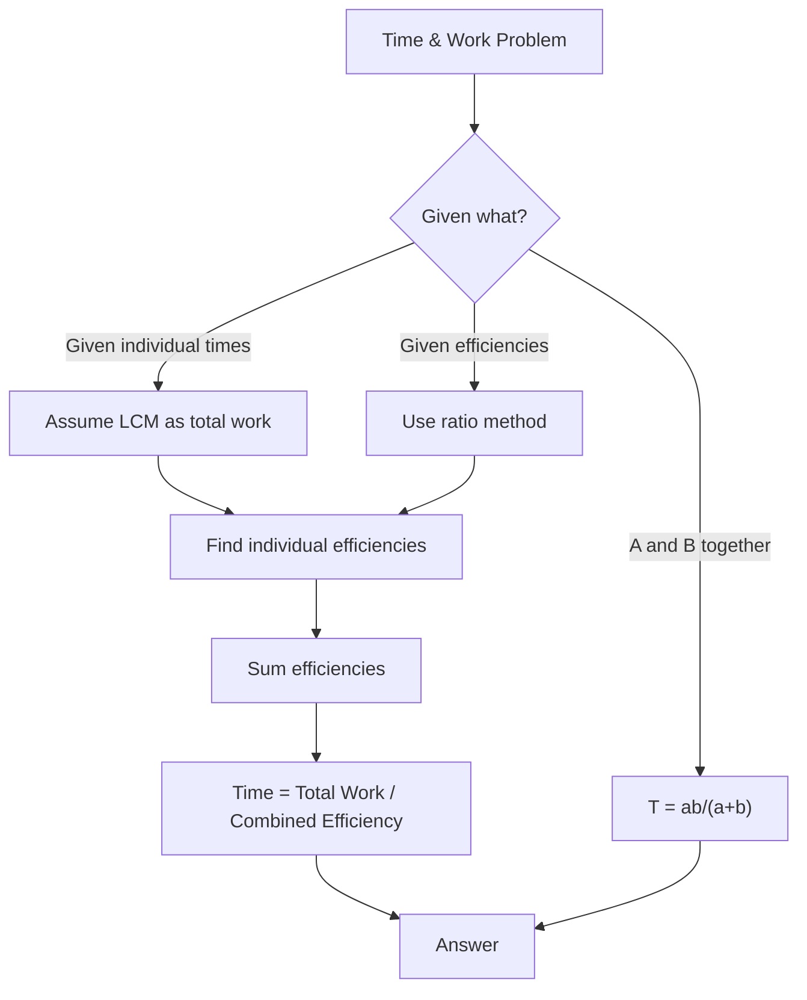
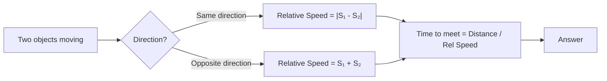
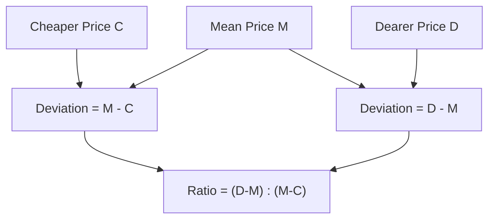
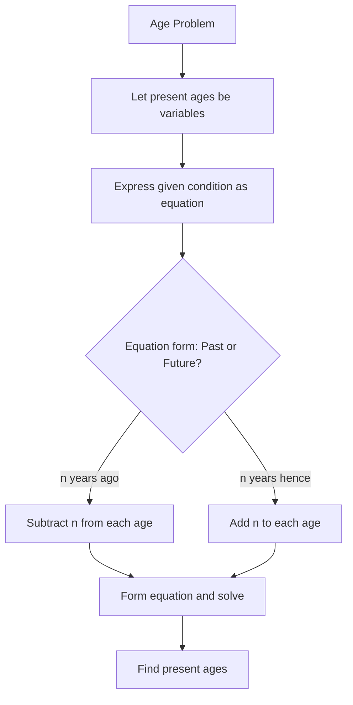
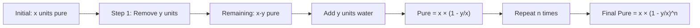

# Chapter 2: Advanced Arithmetic — Time & Work, Time-Speed-Distance, Mixtures & Alligations, Partnership, Ages

## Learning Objectives

By the end of this chapter, you will be able to:
- Solve time & work problems using efficiency and LCM approaches
- Calculate time, speed, and distance including relative speed and train problems
- Apply the alligation rule to solve mixture and concentration problems
- Distribute profit based on investment and time in partnership problems
- Solve age-related problems using linear equation techniques
- Use shortcut formulas to solve IBPS SO-level problems efficiently

## Theory

### 1. Time & Work

**Basic Formula:**

If a person can do a piece of work in `n` days, then the person's 1 day's work = `1/n`

**Combined Work:**

If A can do work in `a` days and B can do it in `b` days:
- Work done by A and B together in 1 day = `1/a + 1/b`
- Time taken by A and B together = `1 / (1/a + 1/b) = ab / (a + b)`

**Work & Wages:**

Wages are distributed in the ratio of work done or in the ratio of efficiencies, provided the number of days worked is the same.

**Efficiency:**

Efficiency is inversely proportional to time taken.
- If A is twice as efficient as B, A takes half the time B takes.

**Formula using LCM Method:**

```
Total Work = LCM of individual times
Individual Efficiency = Total Work / Individual Time
Combined Efficiency = Sum of individual efficiencies
Time = Total Work / Combined Efficiency
```

**Pipe & Cistern (Extension):**

- Inlet pipe fills a tank; Outlet pipe empties a tank
- If an inlet pipe fills in `m` hours, its work per hour = `1/m`
- If an outlet pipe empties in `n` hours, its work per hour = `-1/n`
- Combined work per hour = `1/m - 1/n` (if fill) or `1/m + 1/n` (if both outlets)

### 2. Time, Speed & Distance

**Basic Formula:**

```
Speed = Distance / Time
Distance = Speed × Time
Time = Distance / Speed
```

**Unit Conversions:**
- km/h to m/s: multiply by `5/18`
- m/s to km/h: multiply by `18/5`

**Average Speed:**

For a journey with two equal distances:
```
Average Speed = 2ab / (a + b)
```

For a journey with two equal time intervals:
```
Average Speed = (a + b) / 2
```

**Relative Speed:**

- When two objects move in **same direction**: Relative Speed = |S₁ - S₂|
- When two objects move in **opposite direction**: Relative Speed = S₁ + S₂

**Train Problems:**

- Time to cross a pole/standing man = Length of Train / Speed
- Time to cross a platform = (Length of Train + Length of Platform) / Speed
- Time to cross another train = (Sum of Lengths) / (Relative Speed)

**Boats & Streams:**

- Speed of boat in still water = `b`
- Speed of stream = `s`
- Downstream speed = `b + s`
- Upstream speed = `b - s`
- Speed of boat = `(Downstream + Upstream) / 2`
- Speed of stream = `(Downstream - Upstream) / 2`

### 3. Mixtures & Alligations

**Alligation Rule:**

When two ingredients at different prices are mixed, the ratio of their quantities is:

```
Quantity of Cheaper / Quantity of Dearer = (Price of Dearer - Mean Price) / (Mean Price - Price of Cheaper)
```

In terms of deviations:

```
Required Ratio = (Mean - Cheaper) / (Dearer - Mean)
```

**Mean Price formula:**

```
Mean Price = (C₁Q₁ + C₂Q₂) / (Q₁ + Q₂)
```

**Replacement Formula:**

If a container contains `x` units of pure substance, and `y` units are replaced with water `n` times:

```
Quantity of Pure after n replacements = x × (1 - y/x)^n
```

**Important Rule for Mixtures:**

When mixing two liquids A and B, if we mix `a%` and `b%` concentrations to get `c%` concentration:

```
Ratio of A to B = (c - b) / (a - c)
```

### 4. Partnership

**Simple Partnership:**

When investments are made for the same time period:
Profit is shared in the ratio of investments.

**Compound Partnership:**

When investments are made for different time periods:
Profit is shared in the ratio of `(Investment × Time)`.

**Working Partner vs Sleeping Partner:**

A working partner may receive a salary/commission before the remaining profit is distributed.

**Formula:**

If A invests `₹x` for `m` months and B invests `₹y` for `n` months:

```
A's Profit : B's Profit = x × m : y × n
```

### 5. Problems on Ages

**Basic Approach:**

Age problems are best solved using linear equations with a single variable.

**Key Pointers:**
- Represent present ages as variables
- Use "n years ago" or "n years hence" to form equations
- Ratios of ages change over time, but the difference between ages remains constant

**Important Fact:**

The difference between any two persons' ages is always constant over time. This is the most useful fact for solving age problems quickly.

## Mermaid Diagram: Time & Work Problem-Solving Flow



## Mermaid Diagram: Relative Speed Scenarios



## Mermaid Diagram: Alligation Rule Visualisation



## Examples

### Example 1: Time & Work

**Question:** A can do a piece of work in 12 days. B can do the same work in 18 days. A and B work together for 4 days, then A leaves. How many more days will B take to finish the remaining work?

**Solution:**

A's 1 day work = 1/12
B's 1 day work = 1/18
(A + B)'s 1 day work = 1/12 + 1/18 = (3 + 2)/36 = 5/36

Work done in 4 days = 4 × 5/36 = 20/36 = 5/9
Remaining work = 1 - 5/9 = 4/9

Time taken by B to complete remaining work = (4/9) / (1/18)
= (4/9) × 18
= 8 days

**LCM Method:**
Total Work = LCM(12, 18) = 36 units
A's efficiency = 36/12 = 3 units/day
B's efficiency = 36/18 = 2 units/day
Combined efficiency = 5 units/day
Work done in 4 days = 5 × 4 = 20 units
Remaining = 36 - 20 = 16 units
Time for B = 16/2 = 8 days

### Example 2: Time-Speed-Distance

**Question:** A train 250 metres long passes a pole in 20 seconds. Find the speed of the train in km/h.

**Solution:**

Speed = Distance / Time = 250 / 20 = 12.5 m/s
Convert to km/h: 12.5 × 18/5 = 12.5 × 3.6 = 45 km/h

### Example 3: Relative Speed (Train crossing)

**Question:** Two trains of lengths 200 m and 300 m are running on parallel tracks at 60 km/h and 40 km/h in opposite directions. How long will they take to cross each other?

**Solution:**

Relative speed = 60 + 40 = 100 km/h
Convert to m/s: 100 × 5/18 = 500/18 = 250/9 m/s
Total length = 200 + 300 = 500 m
Time = 500 / (250/9) = 500 × 9/250 = 18 seconds

### Example 4: Mixture & Alligation

**Question:** In what ratio should rice costing ₹40/kg and ₹55/kg be mixed to get a mixture worth ₹48/kg?

**Solution:**

Using alligation rule:

| Type | Price | Deviation from Mean |
|------|-------|---------------------|
| Cheaper | 40 | 48 - 40 = 8 |
| Mean | 48 | |
| Dearer | 55 | 55 - 48 = 7 |

Ratio = Dearer Deviation : Cheaper Deviation = 7 : 8

So, they should be mixed in the ratio 7:8 (cheaper:dearer) or 8:7 (dearer:cheaper as per formula).

### Example 5: Partnership

**Question:** A starts a business with ₹60,000. After 4 months, B joins with ₹80,000. After 2 more months, C joins with ₹1,00,000. At the end of 2 years, the total profit is ₹1,50,000. Find each person's share.

**Solution:**

Time periods (in months):
A: 24 months
B: 20 months (joined after 4 months)
C: 18 months (joined after 6 months)

Ratio of investments × time:
A : B : C = (60000 × 24) : (80000 × 20) : (100000 × 18)
= 1440000 : 1600000 : 1800000
= 144 : 160 : 180
= 36 : 40 : 45

Sum of ratios = 36 + 40 + 45 = 121

A's share = (36/121) × 150000 = ₹44,628
B's share = (40/121) × 150000 = ₹49,587
C's share = (45/121) × 150000 = ₹55,785

### Example 6: Problem on Ages

**Question:** The age of a father is three times the age of his son. 5 years ago, the father's age was 4 times the son's age. Find their present ages.

**Solution:**

Let son's present age = x
Father's present age = 3x

5 years ago:
Son's age = x - 5
Father's age = 3x - 5

Given: 3x - 5 = 4(x - 5)
3x - 5 = 4x - 20
3x - 4x = -20 + 5
-x = -15
x = 15

Son's present age = 15 years
Father's present age = 45 years

### Example 7: Pipe & Cistern

**Question:** Pipe A can fill a tank in 6 hours, Pipe B can fill it in 8 hours, and Pipe C can empty it in 12 hours. If all pipes are opened together, how long will it take to fill the tank?

**Solution:**

A's work in 1 hour = 1/6
B's work in 1 hour = 1/8
C's work in 1 hour = -1/12

Combined work in 1 hour = 1/6 + 1/8 - 1/12
= (4 + 3 - 2)/24
= 5/24

Time taken = 24/5 = 4.8 hours = 4 hours 48 minutes

### Example 8: Average Speed (Equal Distances)

**Question:** A man travels from city A to city B at 40 km/h and returns at 60 km/h. Find his average speed.

**Solution:**

Average Speed = 2ab / (a + b)
= (2 × 40 × 60) / (40 + 60)
= 4800 / 100
= 48 km/h

### Example 9: Boats & Streams

**Question:** A boat can travel 15 km upstream in 3 hours and 24 km downstream in 2 hours. Find the speed of the boat in still water and the speed of the stream.

**Solution:**

Upstream speed = 15/3 = 5 km/h
Downstream speed = 24/2 = 12 km/h

Speed of boat in still water = (12 + 5)/2 = 17/2 = 8.5 km/h
Speed of stream = (12 - 5)/2 = 7/2 = 3.5 km/h

### Example 10: Replacement in Mixtures

**Question:** From a container containing 40 litres of pure milk, 8 litres are drawn and replaced with water. This process is repeated 3 times. Find the quantity of milk remaining.

**Solution:**

Quantity remaining = x × (1 - y/x)^n
= 40 × (1 - 8/40)^3
= 40 × (1 - 1/5)^3
= 40 × (4/5)^3
= 40 × 64/125
= 2560/125
= 20.48 litres

## Shortcut Methods

### Shortcut 1: LCM Method for Time & Work

Always use LCM of individual times as the total work. This avoids fractions and speeds up calculations.

### Shortcut 2: Time & Work Combined Formula

If A takes `a` days and B takes `b` days, together they take `ab/(a+b)` days.
For three persons: `abc/(ab+bc+ca)`

### Shortcut 3: Distance Problems

For two trains/persons starting at the same time:
- Time to meet = Distance / Relative Speed
- Distance covered by each = Speed × Time

### Shortcut 4: Alligation Shortcut

For mixing two items to get a mean value:
```
Required Ratio = (Dearer Value - Mean Value) : (Mean Value - Cheaper Value)
```

Always subtract the smaller from the larger.

### Shortcut 5: Ages Constant Difference

The difference between ages never changes. This is the single most powerful fact for age problems.

### Shortcut 6: Partnership Quick Ratio

For compound partnership, simply multiply investment by time and simplify the ratio.

### Shortcut 7: Replacement Formula

Use the formula directly. For IBPS SO, this is a direct formula application question.

### Shortcut 8: Average Speed

For equal distances: `2ab/(a+b)` — this is faster than the full calculation.

### Shortcut 9: Boats & Streams

Speed of boat = (Downstream + Upstream)/2
Speed of stream = (Downstream - Upstream)/2

### Shortcut 10: Pipe Efficiency

For pipes filling a tank in different times, use LCM method with negative efficiency for emptying pipes.

## Mermaid Diagram: Age Problem-Solving Strategy



## Mermaid Diagram: Mixture Replacement Process



## Summary

- **Time & Work** is best solved using the LCM method — convert to units of work per day
- **Time-Speed-Distance** requires careful attention to units (m/s vs km/h) and relative speed concepts
- **Mixtures & Alligations** follows a deviation-based approach; the alligation rule is the core tool
- **Partnership** problems involve profit sharing in the ratio of investment × time
- **Ages** are solved using the constant difference property — the age gap between two people never changes
- Boats & streams problems are a subset of TSD with upstream/downstream speed formulas
- Pipe & cistern problems are identical to time & work but with the concept of emptying (negative work)
- Replacement problems have a direct formula that can be applied in one step

## Practical Takeaways

| Topic | Key Formula | Common Mistake |
|-------|-------------|----------------|
| Time & Work | LCM method for total work | Not converting to 1 day's work |
| TSD | Speed = Distance/Time | Forgetting unit conversion (5/18) |
| Relative Speed | Same: |S₁-S₂|, Opposite: S₁+S₂ | Adding speeds when they should subtract |
| Alligation | Ratio = (D-M):(M-C) | Reversing the ratio |
| Partnership | Ratio = I₁T₁ : I₂T₂ | Using only investment, ignoring time |
| Ages | Difference is constant | Forgetting to add/subtract years correctly |
| Boats & Streams | b = (D+U)/2, s = (D-U)/2 | Confusing upstream and downstream |
| Replacement | x(1-y/x)^n | Not raising to power n |

## Chapter Quiz

### Question 1

A can do a work in 10 days and B can do the same work in 15 days. How many days will they take together?

<details>
<summary>Answer</summary>
Time = (10 × 15) / (10 + 15) = 150/25 = 6 days
</details>

### Question 2

A train 300 m long passes a platform 700 m long in 50 seconds. Find the speed of the train in km/h.

<details>
<summary>Answer</summary>
Total distance = 300 + 700 = 1000 m
Speed = 1000/50 = 20 m/s = 20 × 18/5 = 72 km/h
</details>

### Question 3

In what ratio must water be mixed with milk costing ₹60 per litre to obtain a mixture worth ₹50 per litre?

<details>
<summary>Answer</summary>
Using alligation:
Water cost = ₹0, Milk cost = ₹60
Mean = ₹50
Ratio = (60-50):(50-0) = 10:50 = 1:5
Water:Milk = 1:5
</details>

### Question 4

A and B invest ₹50,000 and ₹75,000 in a business. A is a working partner and gets 20% of the profit as salary. The remaining profit is shared in the ratio of their investments. If total profit is ₹60,000, find A's total share.

<details>
<summary>Answer</summary>
A's salary = 20% of 60000 = ₹12,000
Remaining profit = ₹48,000
Investment ratio = 50000:75000 = 2:3
A's share of remaining = (2/5) × 48000 = ₹19,200
A's total = 12000 + 19200 = ₹31,200
</details>

### Question 5

The ratio of the ages of A and B is 3:2. Six years hence, the ratio will be 4:3. Find the present age of B.

<details>
<summary>Answer</summary>
Let A = 3x, B = 2x.
Six years hence: (3x+6)/(2x+6) = 4/3
3(3x+6) = 4(2x+6)
9x+18 = 8x+24
x = 6
B's present age = 2×6 = 12 years
</details>

## Exercises

### Exercise 1 (Beginner)

A can do a work in 8 days, B can do it in 12 days. They work together for 3 days and then A leaves. How many more days will B take to finish the work?

### Exercise 2 (Beginner)

A train 180 m long crosses a pole in 12 seconds. Find the speed of the train in km/h.

### Exercise 3 (Beginner)

A man rows downstream 18 km in 2 hours and upstream 12 km in 3 hours. Find the speed of the stream.

### Exercise 4 (Intermediate)

A starts a business with ₹40,000. After 6 months, B joins with ₹60,000. At the end of 2 years, the profit is ₹1,32,000. Find the share of each.

### Exercise 5 (Intermediate)

The present age of a father is 3 times that of his son. After 10 years, the father's age will be twice the son's age. Find their present ages.

### Exercise 6 (Intermediate)

A tank can be filled by pipe A in 4 hours and by pipe B in 6 hours. An outlet pipe C empties the tank in 8 hours. If all three pipes are opened together, how long will it take to fill the tank?

### Exercise 7 (Advanced)

In what ratio should coffee costing ₹250/kg and ₹350/kg be mixed so that the mixture sold at ₹324/kg yields a profit of 20%?

### Exercise 8 (Advanced)

A man travels 60 km at 30 km/h and the next 60 km at 20 km/h. Find his average speed.

### Exercise 9 (IBPS SO Level)

From a vessel containing 75 litres of pure milk, 15 litres are drawn and replaced with water. This process is repeated twice. Find the quantity of milk remaining.

### Exercise 10 (IBPS SO Level)

A train passes two persons walking at 3 km/h and 5 km/h in the same direction in 10 seconds and 12 seconds respectively. Find the length and speed of the train.

---

**Answer Key (Exercises):**
1. 7.5 days
2. 54 km/h
3. 1.5 km/h
4. A = ₹60,000, B = ₹72,000
5. Son = 10 years, Father = 30 years
6. 24/7 = 3.43 hours ≈ 3 hours 26 minutes
7. 5:3
8. 24 km/h
9. 48 litres
10. Length = 50 m, Speed = 25 m/s = 90 km/h
