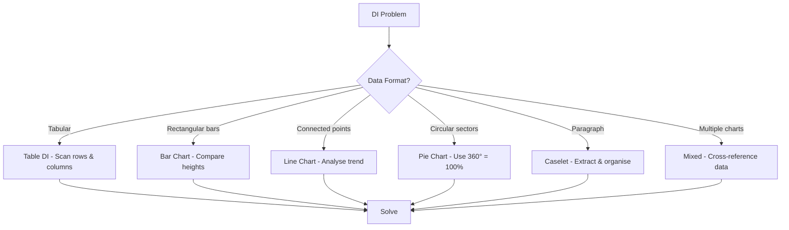
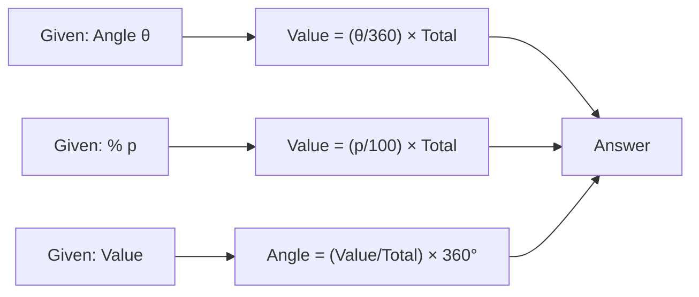
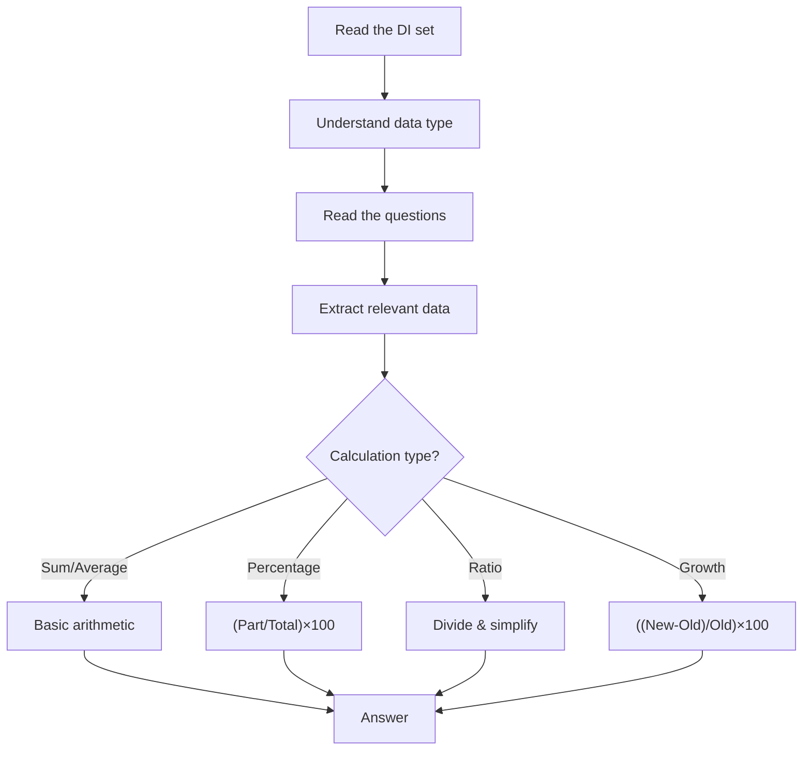
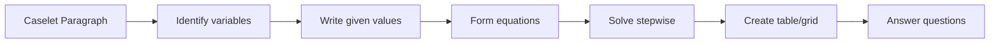

# Chapter 3: Data Interpretation — Table DI, Bar/Line Charts, Pie Charts, Caselets, Mixed Graphs

## Learning Objectives

By the end of this chapter, you will be able to:
- Interpret data from tables, bar charts, line charts, and pie charts accurately
- Solve percentage-based and ratio-based DI questions efficiently
- Analyse caselet-based DI where data is presented in paragraph form
- Handle mixed graphs combining two or more chart types
- Calculate growth rates, ratios, averages, and percentages from given data
- Apply shortcut techniques for DI to save time in IBPS SO exams

## Theory

### Introduction to Data Interpretation

Data Interpretation (DI) is a major component of IBPS SO Quantitative Aptitude. In IBPS SO Prelims, 5–10 questions come from DI. The data is presented in various forms:

1. **Table DI** — Data arranged in rows and columns
2. **Bar Chart** — Data represented as rectangular bars
3. **Line Chart** — Data points connected by lines (usually trends over time)
4. **Pie Chart** — Data represented as sectors of a circle
5. **Caselet DI** — Data presented in paragraph form
6. **Mixed Graphs** — Combination of two or more chart types

### 1. Table DI

A table presents data in a structured format with rows and columns. Questions typically involve:
- Finding specific values from the table
- Calculating sums, averages, percentages, and ratios
- Comparing values between rows or columns

**Key Skills:**
- Quick scanning of relevant data
- Row-column coordination
- Approximation where exact calculation is not needed

### 2. Bar Chart

Bars can be vertical or horizontal, single or grouped (stacked or clustered).

**Types:**
- **Simple Bar Chart:** One variable, multiple categories
- **Grouped Bar Chart:** Multiple variables, multiple categories
- **Stacked Bar Chart:** Components of a total shown as segments of bars

**Common Questions:**
- Difference between highest and lowest bars
- Percentage of one bar relative to another
- Ratio of two bars
- Average of all bars

### 3. Line Chart

Line charts typically show trends over time.

**Key Calculations:**
- **Absolute Increase:** Difference between two points
- **Percentage Increase:** `((Final - Initial) / Initial) × 100`
- **Average Value:** Sum of all values ÷ number of points
- **Trend Analysis:** Identifying the steepest rise or fall

### 4. Pie Chart

A pie chart (360°) shows the composition of a whole.

**Key Conversion:**
```
Value of a sector = (Angle / 360) × Total
Angle of a sector = (Value / Total) × 360°
```

Percentages can be directly converted to angles:
```
1% = 3.6°
```

**Common Questions:**
- Difference between two sectors
- Ratio of two sectors
- Percentage of one sector relative to another
- Finding total when one sector's value is given

### 5. Caselet DI

Data is given in paragraph form without structured tables. You need to:
- Extract data points carefully
- Organise the data mentally or on rough paper
- Form equations where necessary

**Strategy:**
- Read the caselet carefully at least twice
- Underline/circle key numbers and variables
- Draw a table or diagram to organise the data
- Solve step by step

### 6. Mixed Graphs

Two or more types of charts used together (e.g., bar chart + line chart, or pie chart + table).

**Strategy:**
- Understand the relationship between the two charts
- Usually one chart provides absolute data and the other provides percentage/ratio data
- Cross-reference data between charts

## Mermaid Diagram: DI Chart Selection Flowchart



## Mermaid Diagram: Pie Chart to Value Conversion



## Examples

### Example 1: Table DI

**Question:**

The table below shows the marks obtained by 5 students in 4 subjects. Maximum marks per subject = 100.

| Student | Maths | Physics | Chemistry | English |
|---------|-------|---------|-----------|---------|
| A | 85 | 90 | 75 | 80 |
| B | 78 | 82 | 88 | 72 |
| C | 92 | 80 | 70 | 85 |
| D | 88 | 75 | 82 | 78 |
| E | 70 | 85 | 78 | 90 |

**(a)** Find the overall average marks of all students.

**Solution:**
Total marks of all students = (85+90+75+80) + (78+82+88+72) + (92+80+70+85) + (88+75+82+78) + (70+85+78+90)
= 330 + 320 + 327 + 323 + 323
= 1623

Total students = 5
Average = 1623 / 5 = 324.6 marks per student

**(b)** What is the ratio of marks obtained by C in Maths to marks obtained by D in Physics?

**Solution:**
C's Maths = 92
D's Physics = 75
Ratio = 92 : 75

**(c)** Who scored the highest total marks?

**Solution:**
A = 330, B = 320, C = 327, D = 323, E = 323
Highest = A with 330 marks

### Example 2: Bar Chart

**Question:**

The bar chart below shows the number of computers sold by a company in 6 months.

| Month | Jan | Feb | Mar | Apr | May | Jun |
|-------|-----|-----|-----|-----|-----|-----|
| Sales | 120 | 150 | 110 | 180 | 200 | 160 |

**(a)** What is the total sales in the first quarter (Jan-Mar)?

**Solution:**
Total = 120 + 150 + 110 = 380 computers

**(b)** What is the percentage increase from March to May?

**Solution:**
March = 110, May = 200
Increase = 200 - 110 = 90
% Increase = (90/110) × 100 = 81.82%

**(c)** What is the average monthly sales?

**Solution:**
Total = 120 + 150 + 110 + 180 + 200 + 160 = 920
Average = 920 / 6 = 153.33 computers

### Example 3: Line Chart

**Question:**

The line chart below shows the profit (in ₹ lakhs) of a company over 5 years.

| Year | 2020 | 2021 | 2022 | 2023 | 2024 |
|------|------|------|------|------|------|
| Profit | 25 | 35 | 30 | 45 | 50 |

**(a)** In which year was the highest profit growth rate?

**Solution:**
2020-21: (35-25)/25 × 100 = 40%
2021-22: (30-35)/35 × 100 = -14.29%
2022-23: (45-30)/30 × 100 = 50%
2023-24: (50-45)/45 × 100 = 11.11%

Highest growth rate = 2022-23 at 50%

**(b)** Find the average profit over the 5 years.

**Solution:**
Average = (25 + 35 + 30 + 45 + 50) / 5 = 185/5 = ₹37 lakhs

**(c)** What is the ratio of profit in 2020 to profit in 2024?

**Solution:**
Ratio = 25 : 50 = 1 : 2

### Example 4: Pie Chart

**Question:**

A family's monthly expenditure of ₹60,000 is distributed as shown in the pie chart angles:

| Category | Angle |
|----------|-------|
| Food | 120° |
| Rent | 90° |
| Education | 60° |
| Transport | 45° |
| Savings | 30° |
| Others | 15° |

**(a)** How much is spent on Food?

**Solution:**
Food expenditure = (120/360) × 60000 = (1/3) × 60000 = ₹20,000

**(b)** How much more is spent on Rent than on Transport?

**Solution:**
Rent = (90/360) × 60000 = (1/4) × 60000 = ₹15,000
Transport = (45/360) × 60000 = (1/8) × 60000 = ₹7,500
Difference = 15000 - 7500 = ₹7,500

**(c)** What percentage of total expenditure goes to Education and Savings together?

**Solution:**
Education = 60°, Savings = 30°
Combined angle = 90°
Percentage = (90/360) × 100 = 25%

### Example 5: Caselet DI

**Question:**

In a company, there are three departments: HR, IT, and Finance. The total number of employees is 240. The number of employees in IT is 40% of the total. The number of employees in HR is 20 less than the number in IT. The remaining employees are in Finance.

**(a)** Find the number of employees in each department.

**Solution:**
Total = 240
IT = 40% of 240 = 96
HR = 96 - 20 = 76
Finance = 240 - (96 + 76) = 240 - 172 = 68

**(b)** What percentage of total employees are in Finance?

**Solution:**
% Finance = (68/240) × 100 = 28.33%

**(c)** The ratio of male to female in IT is 5:3. Find the number of males in IT.

**Solution:**
Total IT = 96
Male : Female = 5 : 3
Males in IT = (5/8) × 96 = 60

### Example 6: Mixed Graph

**Question:**

A bar chart shows the production (in units) of a company for 4 years, and a line graph shows the percentage of units sold.

| Year | Production (units) | % Sold |
|------|-------------------|--------|
| 2021 | 1000 | 80 |
| 2022 | 1200 | 75 |
| 2023 | 1500 | 85 |
| 2024 | 1800 | 90 |

**(a)** How many units were sold in each year?

**Solution:**
2021: 80% of 1000 = 800 units
2022: 75% of 1200 = 900 units
2023: 85% of 1500 = 1275 units
2024: 90% of 1800 = 1620 units

**(b)** In which year were the maximum units sold?

**Solution:**
Maximum sold = 2024 with 1620 units

**(c)** What is the total unsold stock over the 4 years?

**Solution:**
Unsold = Production - Sold
2021: 1000 - 800 = 200
2022: 1200 - 900 = 300
2023: 1500 - 1275 = 225
2024: 1800 - 1620 = 180
Total unsold = 200 + 300 + 225 + 180 = 905 units

### Example 7: Table DI with Percentage

**Question:**

The table shows the scores (out of 200) of 5 students in 3 subjects.

| Student | Subject 1 | Subject 2 | Subject 3 |
|---------|-----------|-----------|-----------|
| P | 160 | 140 | 180 |
| Q | 150 | 170 | 130 |
| R | 175 | 145 | 155 |
| S | 140 | 160 | 170 |
| T | 155 | 150 | 145 |

**(a)** What percentage of total marks did P score across all subjects?

**Solution:**
P's total = 160 + 140 + 180 = 480
Max possible = 3 × 200 = 600
% = (480/600) × 100 = 80%

**(b)** Who scored the highest aggregate percentage?

**Solution:**
P: 480/600 = 80%
Q: 450/600 = 75%
R: 475/600 = 79.17%
S: 470/600 = 78.33%
T: 450/600 = 75%
Highest = P at 80%

### Example 8: Pie Chart with Multiple Sectors

**Question:**

The pie chart shows the distribution of ₹3,60,000 among 6 investment options.

| Option | Percentage |
|--------|------------|
| Stocks | 30% |
| Bonds | 20% |
| Gold | 15% |
| Real Estate | 20% |
| Mutual Funds | 10% |
| Cash | 5% |

**(a)** Find the amount invested in each option.

**Solution:**
Stocks: 30% of 360000 = ₹1,08,000
Bonds: 20% of 360000 = ₹72,000
Gold: 15% of 360000 = ₹54,000
Real Estate: 20% of 360000 = ₹72,000
Mutual Funds: 10% of 360000 = ₹36,000
Cash: 5% of 360000 = ₹18,000

**(b)** What is the angle of the Gold sector?

**Solution:**
Angle = 15% of 360° = 15 × 3.6 = 54°

### Example 9: Line Chart with Growth Rate

**Question:**

The revenue (in ₹crores) of a startup over 6 years is:

| Year | 2019 | 2020 | 2021 | 2022 | 2023 | 2024 |
|------|------|------|------|------|------|------|
| Revenue | 10 | 15 | 22 | 35 | 50 | 72 |

**(a)** Calculate the CAGR from 2019 to 2024.

**Solution:**
CAGR = [(Final/Initial)^(1/5) - 1] × 100
= [(72/10)^(1/5) - 1] × 100
= [7.2^(0.2) - 1] × 100
= [1.484 - 1] × 100
= 48.4% approximately

**(b)** In which year was the highest year-on-year growth rate?

**Solution:**
2019-20: (15-10)/10 × 100 = 50%
2020-21: (22-15)/15 × 100 = 46.7%
2021-22: (35-22)/22 × 100 = 59.1%
2022-23: (50-35)/35 × 100 = 42.9%
2023-24: (72-50)/50 × 100 = 44%
Highest = 2021-22 at 59.1%

### Example 10: Caselet with Ratios

**Question:**

Three friends A, B, and C invested in a business. A invested ₹20,000 for 8 months, B invested ₹30,000 for 6 months, and C invested ₹40,000 for 4 months. The total profit was ₹60,000.

**(a)** Find the ratio of their investments (considering time).

**Solution:**
A : B : C = (20000 × 8) : (30000 × 6) : (40000 × 4)
= 160000 : 180000 : 160000
= 16 : 18 : 16
= 8 : 9 : 8

**(b)** Find each partner's share.

**Solution:**
Sum of ratios = 8 + 9 + 8 = 25
A's share = (8/25) × 60000 = ₹19,200
B's share = (9/25) × 60000 = ₹21,600
C's share = (8/25) × 60000 = ₹19,200

## Shortcut Methods

### Shortcut 1: Approximation in DI

For IBPS SO, many DI questions need only approximate answers. Round numbers to the nearest 5 or 10 for faster calculation.

### Shortcut 2: Pie Chart Angle to Value

Remember: `1% = 3.6°`. To find value: `(Angle × Total) / 360`. To find percentage: `Angle / 3.6`.

### Shortcut 3: Bar Chart Comparisons

For ratio questions, cancel common factors between the two values before division.

### Shortcut 4: Growth Rate Comparison

When comparing growth rates year on year, a visual inspection of the steepness of a line chart gives an approximate answer.

### Shortcut 5: Weighted Average in DI

When different groups have different sizes, use weighted average. This is common in caselet DI.

### Shortcut 6: Data Extraction Order

For table DI, always look at the question first, then scan the table for specific data. Do not read the entire table unnecessarily.

### Shortcut 7: Percentage Calculations

For quick percentage calculations:
- 10% = divide by 10
- 5% = half of 10%
- 1% = divide by 100
- 25% = divide by 4

### Shortcut 8: Ratio Simplification

Always simplify ratios to the smallest integers before using them in calculations.

### Shortcut 9: Sum of All Sectors in Pie Chart

Always verify that the total percentage is 100% or total angle is 360°. This catches data errors.

### Shortcut 10: Multiple Charts

When two charts are used together, identify which chart gives absolute values and which gives percentages. Usually one chart provides the base and the other provides the rate.

## Mermaid Diagram: DI Problem-Solving Strategy



## Mermaid Diagram: Caselet DI Data Organisation



## Summary

- **Data Interpretation** is the most scoring section in IBPS SO Prelims if you practice speed and accuracy
- **Table DI** requires quick scanning and careful row/column coordination
- **Bar Charts** are best suited for comparing magnitudes across categories
- **Line Charts** show trends and growth patterns over time
- **Pie Charts** show composition of a whole; remember 360° = 100%
- **Caselet DI** tests your ability to extract and organise unstructured data
- **Mixed Graphs** test the ability to cross-reference two data sources
- Approximation is a key skill — not every question needs exact calculation
- Always verify totals in pie charts (should sum to 360° or 100%)
- Practice identifying which data is relevant and which is not — many DI sets have redundant information

## Practical Takeaways

| DI Type | Key Formula/Concept | Common Mistake |
|---------|---------------------|----------------|
| Table | Row/Column totals | Reading wrong row/column |
| Bar Chart | Compare heights directly | Misreading scale on axis |
| Line Chart | % Growth = ((N₂-N₁)/N₁)×100 | Using absolute change instead of % |
| Pie Chart | Value = (Angle/360)×Total | Using wrong base total |
| Caselet | Organise data in table | Missing implicit data |
| Mixed Graph | Cross-reference carefully | Using one chart for another's data |

## Chapter Quiz

### Question 1

In a pie chart, sector A has an angle of 72°. What percentage of total does it represent?

<details>
<summary>Answer</summary>
% = (72/360) × 100 = 20%
</details>

### Question 2

In a table DI, if the average of 5 rows is 50 and a sixth row with value 80 is added, what is the new average?

<details>
<summary>Answer</summary>
Sum of 5 = 5 × 50 = 250
New sum = 250 + 80 = 330
New average = 330/6 = 55
</details>

### Question 3

In a line chart, the values are 40, 55, 70, 85, 100. What is the percentage increase from the first point to the last?

<details>
<summary>Answer</summary>
% Increase = (100-40)/40 × 100 = 150%
</details>

### Question 4

A bar chart shows values: 40, 60, 80, 50, 70. The ratio of the highest to the lowest value is:

<details>
<summary>Answer</summary>
Highest = 80, Lowest = 40
Ratio = 80:40 = 2:1
</details>

### Question 5

In a caselet, if total is 500 and A is 30%, B is 25%, C is the rest, what is C's value?

<details>
<summary>Answer</summary>
A = 30% of 500 = 150
B = 25% of 500 = 125
C = 500 - 150 - 125 = 225
</details>

## Exercises

### Exercise 1 (Beginner — Table)

| Item | Cost Price (₹) | Selling Price (₹) |
|------|---------------|-------------------|
| Watch | 500 | 600 |
| Ring | 800 | 960 |
| Chain | 1200 | 1380 |
| Bangle | 400 | 460 |

Find: (a) Profit on each item, (b) Total profit, (c) Item with highest profit percentage.

### Exercise 2 (Beginner — Bar Chart)

Sales (in units): Q1 = 150, Q2 = 200, Q3 = 180, Q4 = 250.
(a) Total annual sales (b) Average quarterly sales (c) % increase from Q1 to Q4.

### Exercise 3 (Intermediate — Pie Chart)

A budget of ₹5,00,000 is allocated as: Infrastructure 40%, R&D 25%, Marketing 20%, HR 10%, Admin 5%.
(a) Find amount for each head
(b) Find angle for Infrastructure
(c) How much more is Infrastructure than Marketing?

### Exercise 4 (Intermediate — Line Chart)

Revenue (₹crores): 2019=80, 2020=100, 2021=130, 2022=160, 2023=200.
(a) Highest growth year (b) CAGR from 2019 to 2023 (c) Average revenue.

### Exercise 5 (Advanced — Caselet)

In a school, there are 800 students. 40% are girls. 60% of boys and 50% of girls passed the annual exam. Find: (a) Number of boys (b) Number of students who passed (c) Overall pass percentage.

### Exercise 6 (Advanced — Mixed Graph)

A bar chart shows production (units): 2020=5000, 2021=6000, 2022=7500, 2023=9000.
A line chart shows % defective: 2020=5%, 2021=4%, 2022=6%, 2023=3%.
Find: (a) Number of defective units each year (b) Total defective units (c) Year with most defectives.

### Exercise 7 (IBPS SO Level — Table with %)

| City | Total Population | Literate % | Male % of Literates |
|------|-----------------|------------|---------------------|
| X | 20000 | 75 | 55 |
| Y | 25000 | 80 | 50 |
| Z | 18000 | 65 | 60 |

Find: (a) Literate population of each city (b) Literate females in Y (c) Total literate males across all cities.

### Exercise 8 (IBPS SO Level — Caselet with Ratios)

Total employees in a company = 900. Ratio of male to female = 5:4. In the IT department, 40% of males and 30% of females work. The rest work in other departments. Find: (a) Number of males and females (b) IT department size (c) % of employees in IT.

### Exercise 9 (Mixed — Charts Combination)

The bar chart shows exports (₹crores) for 4 years: 150, 220, 280, 350.
The line chart shows imports as a % of exports: 80%, 75%, 70%, 65%.
(a) Calculate imports for each year
(b) Find trade surplus (Export - Import) for each year
(c) Year with highest trade surplus.

### Exercise 10 (Advanced — Comprehensive DI)

The table has data for 5 companies:

| Company | Revenue (₹cr) | Profit (₹cr) | Employees |
|---------|--------------|--------------|-----------|
| A | 500 | 80 | 1000 |
| B | 750 | 120 | 1500 |
| C | 600 | 90 | 1200 |
| D | 900 | 150 | 2000 |
| E | 400 | 60 | 800 |

(a) Which company has the highest profit per employee?
(b) Which company has the highest profit margin %?
(c) Average revenue per employee for all companies.

---

**Answer Key (Exercises):**
1. (a) ₹100, ₹160, ₹180, ₹60 (b) ₹500 (c) Ring at 20%
2. (a) 780 (b) 195 (c) 66.67%
3. (a) Infra=₹2L, R&D=₹1.25L, Mktg=₹1L, HR=₹50K, Admin=₹25K (b) 144° (c) ₹1L
4. (a) 2022-23 (25%) (b) ~25.7% (c) ₹134 cr
5. (a) 480 (b) 468 (c) 58.5%
6. (a) 250, 240, 450, 270 (b) 1210 (c) 2022
7. (a) 15000, 20000, 11700 (b) 10000 (c) 27235
8. (a) M=500, F=400 (b) 320 (c) 35.56%
9. (a) 120, 165, 196, 227.5 (b) 30, 55, 84, 122.5 (c) 2023
10. (a) D (₹7500/employee) (b) D (16.67%) (c) ₹6.15L/employee
