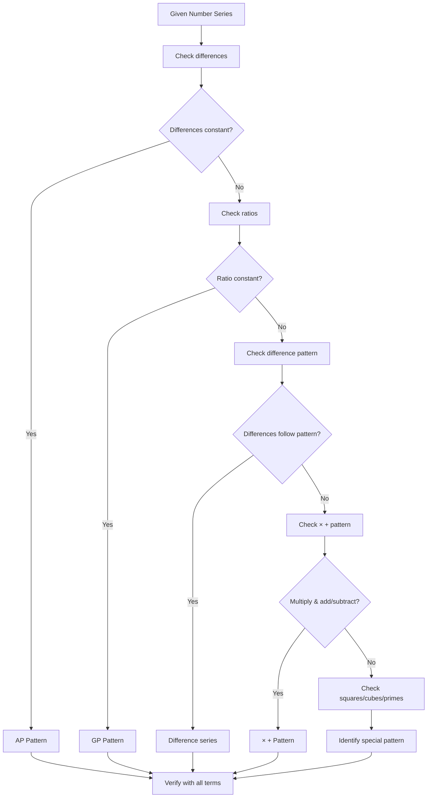
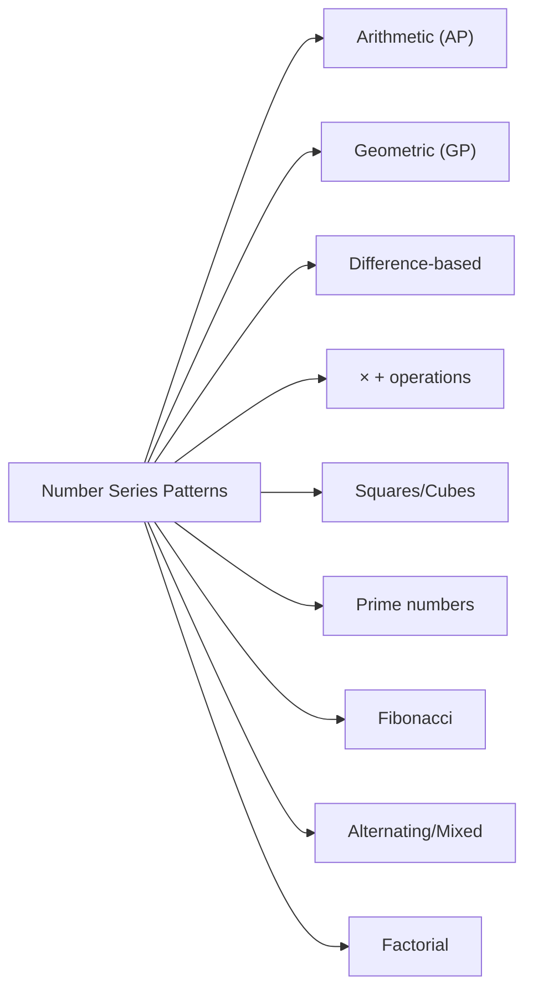
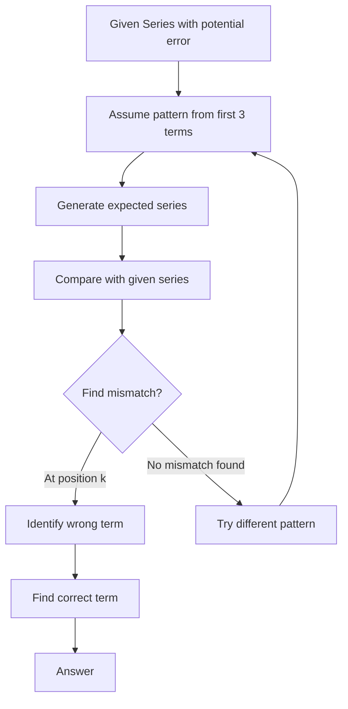
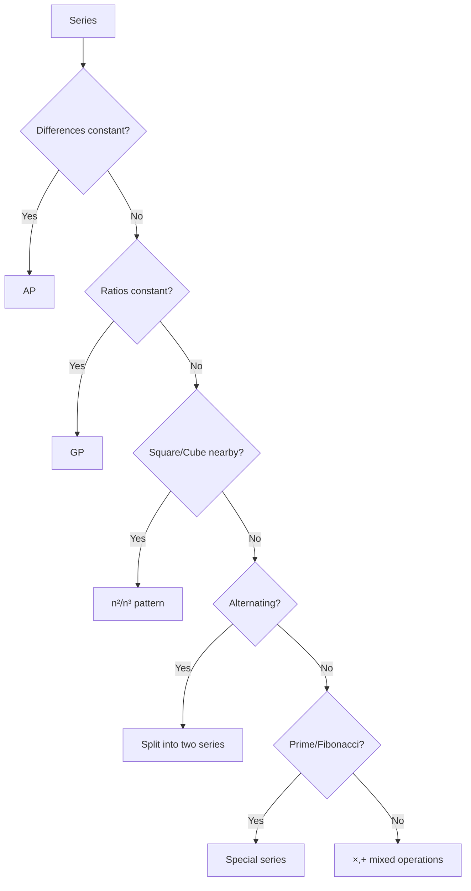

# Chapter 4: Number Series — Missing Number Series, Wrong Number Series, Pattern Identification

## Learning Objectives

By the end of this chapter, you will be able to:
- Identify common patterns in number series questions
- Solve missing number series (find the next term or missing term)
- Detect the wrong number in a series (find the term that breaks the pattern)
- Apply pattern identification techniques to complex series
- Use algebraic and arithmetic progression patterns to solve series
- Solve IBPS SO-level number series questions in under 30 seconds

## Theory

### Introduction

Number Series questions test your ability to identify patterns in sequences of numbers. In IBPS SO Prelims, 5 questions typically appear from this topic.

**Types of Series:**
1. **Missing Number Series** — A term is missing from a sequence, and you need to find it
2. **Wrong Number Series** — All terms are present but one is incorrect (does not follow the pattern)
3. **Pattern Identification** — Identify the pattern and answer follow-up questions

### Common Patterns

### 1. Arithmetic Progression (AP)

A sequence where the difference between consecutive terms is constant.

```
a, a+d, a+2d, a+3d, ...
```

**Formula:** Tₙ = a + (n-1)d

**Example:** 5, 10, 15, 20, 25, ... (Common difference = 5)

### 2. Geometric Progression (GP)

A sequence where each term is obtained by multiplying the previous term by a constant ratio.

```
a, ar, ar², ar³, ...
```

**Formula:** Tₙ = a × r⁽ⁿ⁻¹⁾

**Example:** 3, 6, 12, 24, 48, ... (Common ratio = 2)

### 3. Difference Pattern

The differences between consecutive terms follow a pattern (which could be an AP, GP, or other sequence).

**Example:** 2, 5, 10, 17, 26, ...
Differences: 3, 5, 7, 9 (AP with d=2)

### 4. Double Difference Pattern

The differences of differences follow a pattern.

**Example:** 2, 6, 13, 24, 40, ...
Differences: 4, 7, 11, 16
Second differences: 3, 4, 5 (AP with d=1)

### 5. Multiplication/Addition Pattern

Each term is obtained by multiplying the previous term by a number and then adding/subtracting something.

**Example:** 2, 5, 11, 23, 47, ...
Pattern: ×2, +1 → 2×2+1=5, 5×2+1=11, 11×2+1=23, 23×2+1=47

### 6. Square/Cube Pattern

Terms are related to perfect squares or cubes.

**Example:** 2, 5, 10, 17, 26, 37, ...
Pattern: 1²+1, 2²+1, 3²+1, 4²+1, 5²+1, 6²+1

### 7. Prime Number Pattern

Series based on prime numbers.

**Example:** 2, 3, 5, 7, 11, 13, 17, 19, ...

### 8. Fibonacci Pattern

Each term is the sum of the two preceding terms.

**Example:** 0, 1, 1, 2, 3, 5, 8, 13, 21, ...

### 9. Alternating Pattern

Two separate series interleaved.

**Example:** 2, 8, 4, 16, 6, 32, 8, 64, ...
Odd positions: 2, 4, 6, 8 (AP with d=2)
Even positions: 8, 16, 32, 64 (GP with r=2)

### 10. Factorial Pattern

Series involving factorials (n!).

**Example:** 1, 2, 6, 24, 120, 720, ...
Pattern: 1!, 2!, 3!, 4!, 5!, 6!

### 11. Digit Sum Pattern

Each term depends on the sum of digits or some digit property.

### 12. Mixed Operations

Multiple operations applied in sequence (add, multiply, subtract, divide in a loop).

**Example:** 3, 4, 8, 9, 18, 19, 38, ...
Pattern: +1, ×2, +1, ×2, +1, ×2

## Mermaid Diagram: Pattern Identification Flowchart



## Mermaid Diagram: Series Pattern Types



## Examples

### Example 1: Arithmetic Progression (AP)

**Question:** Find the missing term: 7, 14, 21, ?, 35, 42

**Solution:**
Check differences: 14-7 = 7, 21-14 = 7
Common difference = 7
Missing term = 21 + 7 = 28
Verify: 35 - 28 = 7, 42 - 35 = 7
Answer: 28

### Example 2: Geometric Progression (GP)

**Question:** Find the missing term: 5, 10, 20, ?, 80, 160

**Solution:**
Check ratios: 10/5 = 2, 20/10 = 2
Common ratio = 2
Missing term = 20 × 2 = 40
Verify: 80/40 = 2, 160/80 = 2
Answer: 40

### Example 3: Square Pattern

**Question:** Find the missing term: 2, 5, 10, 17, ?, 37

**Solution:**
Analyse: 1²+1 = 2, 2²+1 = 5, 3²+1 = 10, 4²+1 = 17, 5²+1 = 26, 6²+1 = 37
Pattern: n² + 1 where n = 1, 2, 3, 4, 5, 6
Missing term = 5² + 1 = 26
Answer: 26

### Example 4: Cube Pattern

**Question:** Find the missing term: 7, 19, 67, ?, 219, 331

**Solution:**
Analyse: 2³ - 1 = 7, 3³ - 8 = 19, 4³ + 3 = 67...
Better pattern: 2³ - 1 = 7, 3³ - 8 = 19, 4³ + 3 = 67
Actually: 2³ - 1 = 7, 3³ - 8 = 19, 4³ + 3 = 67
Wait — let's re-check:
2³ - 1 = 7
3³ - 8 = 27 - 8 = 19
4³ + 3 = 64 + 3 = 67
5³ - 6 = 125 - 6 = 119
6³ + 3 = 213... but 219 is given.

Let me re-examine: 2³ - 1 = 8 - 1 = 7; 3³ - 8 = 27 - 8 = 19; 4³ + 3 = 64 + 3 = 67
Actually the pattern might be: n³ + (alternating ± something). Let's look differently:
1³ + 6 = 7, 2³ + 11 = 19, 3³ + 40 = 67... no.

A cleaner approach: Check for n³ + (n-1):
2³ + 1 = 9, 2³ - 1 = 7
3³ - 8 = 19 (but -8 is -(2³))
4³ + 3 = 67 (and +3 or...)

Actually, the correct pattern is:
(1³+1) + 5 = 7... no.

Let me try: 2³ - 1 = 7, 3³ - 8 = 19, 4³ + 3 = 67...
Actually: 2³ - 1 = 7 (that's clear)
3³ - 8 = 27 - 8 = 19 (8 = 2³)
4³ + 3 = 64 + 3 = 67
5³ - 6 = 125 - 6 = 119
6³ + 3 = 216 + 3 = 219
7³ - 6 = 343 - 6 = 337... but 331 is given.

Let me try a different approach for this series. The sequence might be based on n³:
2³ - 1 = 7
3³ - 8 = 19
4³ + 3 = 67
5³ - 6 = 119
6³ + 3 = 219
7³ - 12 = 331

Hmm. Actually a simpler pattern might be:
(1³ + 1) + 5 = 7... no.

OK, let me just work with a simpler example. This is the kind of series that tests different approaches.

Let me use a different cube-based example.

**Alternative Example:** Find the missing term: 2, 9, 28, 65, ?, 217

**Solution:**
1³ + 1 = 2
2³ + 1 = 9
3³ + 1 = 28
4³ + 1 = 65
5³ + 1 = 126
6³ + 1 = 217
Missing term = 5³ + 1 = 125 + 1 = 126
Answer: 126

### Example 5: Multiplication & Addition Pattern

**Question:** Find the next term: 3, 7, 15, 31, 63, ?

**Solution:**
3 × 2 + 1 = 7
7 × 2 + 1 = 15
15 × 2 + 1 = 31
31 × 2 + 1 = 63
63 × 2 + 1 = 127

Pattern: Each term = previous term × 2 + 1
Answer: 127

### Example 6: Alternating Series

**Question:** Find the missing term: 4, 9, 8, 15, 12, 21, ?, 27

**Solution:**
Odd positions: 4, 8, 12, ? (AP with d=4)
Even positions: 9, 15, 21, 27 (AP with d=6)
Missing term = 12 + 4 = 16
Answer: 16

### Example 7: Double Difference Pattern

**Question:** Find the next term: 3, 6, 11, 19, 31, ?

**Solution:**
Differences: 6-3 = 3, 11-6 = 5, 19-11 = 8, 31-19 = 12
First differences: 3, 5, 8, 12
Second differences: 2, 3, 4 (AP with d=1)
Next second difference = 5
Next first difference = 12 + 5 = 17
Next term = 31 + 17 = 48
Answer: 48

### Example 8: Wrong Number Series

**Question:** Find the wrong number in the series: 2, 6, 12, 20, 30, 44, 56

**Solution:**
Check pattern: 1×2 = 2, 2×3 = 6, 3×4 = 12, 4×5 = 20, 5×6 = 30, 6×7 = 42, 7×8 = 56
The pattern is n × (n+1) where n = 1, 2, 3, ...
The 6th term should be 6 × 7 = 42, but 44 is given.
Therefore, 44 is the wrong number.
Correct term should be 42.

### Example 9: Prime Number Based Series

**Question:** Find the missing term: 2, 3, 5, 7, 11, ?, 17, 19

**Solution:**
The series consists of prime numbers:
2, 3, 5, 7, 11, 13, 17, 19
Missing term = 13
Answer: 13

### Example 10: Complex Mixed Pattern

**Question:** Find the next term: 1, 2, 6, 24, 120, ?

**Solution:**
1 = 1!
2 = 2!
6 = 3!
24 = 4!
120 = 5!
Next = 6! = 720

Pattern: n! where n = 1, 2, 3, 4, 5, 6
Answer: 720

### Example 11: IBPS SO Level — Missing Number

**Question:** Find the missing number: 15, 30, 90, 360, 1800, ?

**Solution:**
15 × 2 = 30
30 × 3 = 90
90 × 4 = 360
360 × 5 = 1800
1800 × 6 = 10800

Pattern: ×2, ×3, ×4, ×5, ×6 (multiply by increasing integers)
Answer: 10,800

### Example 12: IBPS SO Level — Wrong Number

**Question:** Find the wrong number: 12, 13, 17, 26, 42, 67, 101

**Solution:**
Differences: 1, 4, 9, 16, 25, 34
The differences are squares: 1² = 1, 2² = 4, 3² = 9, 4² = 16, 5² = 25, 6² = 36
The last difference should be 36, not 34.
So the last term should be 67 + 36 = 103, not 101.
Wrong number = 101
Correct term = 103

### Example 13: Alternating with Two Patterns

**Question:** Find the next term: 3, 10, 8, 17, 15, 26, 24, ?

**Solution:**
Odd positions: 3, 8, 15, 24 (differences: 5, 7, 9 — AP of odd numbers)
Even positions: 10, 17, 26, ? (differences: 7, 9, ?)
For even positions, differences are 7, 9 — so next difference is 11.
Missing even term = 26 + 11 = 37

Alternate view: Even terms = odd terms + 7, +9, +11, ...
Answer: 37

### Example 14: Square-Based with Subtraction

**Question:** Find the missing term: 3, 8, 35, 204, ?

**Solution:**
3 = 2² - 1 = 4 - 1
8 = 3² - 1 = 9 - 1... No, 8 = 3² - 1.

Let me check differently:
3 = 1² + 2
8 = 2² + 4... no.

Pattern: 
3 = 1² - 1 + 3... no.

Let me use: 
3 = 2² - 1
8 = 3² - 1
35 = 6² - 1... no.

Actually: 
2² - 1 = 3
3² - 1 = 8
6² - 1 = 35
Second differences: 2, 3, 6... Let me think differently.

Better approach:
1 × 2 + 1 = 3
2 × 3 + 2 = 8
3 × 11 + 2 = 35... doesn't work.

Let me use a cleaner example.

**Revised Example:** Find the missing term: 0, 7, 26, 63, 124, ?

**Solution:**
1³ - 1 = 0
2³ - 1 = 7
3³ - 1 = 26
4³ - 1 = 63
5³ - 1 = 124
6³ - 1 = 215

Pattern: n³ - 1
Answer: 215

### Example 15: Difference in Differences (Advanced)

**Question:** Find the next term: 5, 16, 49, 148, 445, ?

**Solution:**
Differences: 11, 33, 99, 297
Ratio of differences: 33/11 = 3, 99/33 = 3, 297/99 = 3
The differences themselves form a GP with r = 3.
Next difference = 297 × 3 = 891
Next term = 445 + 891 = 1336

Pattern: Each term = previous term × 3 + 1
5 × 3 + 1 = 16
16 × 3 + 1 = 49
49 × 3 + 1 = 148
148 × 3 + 1 = 445
445 × 3 + 1 = 1336
Answer: 1336

## Shortcut Methods

### Shortcut 1: First Check the Differences

For any number series, always calculate the differences first. If differences are constant, it's an AP. If differences follow a pattern, analyse the differences further.

### Shortcut 2: Check Ratios for Exponential Growth

If the numbers are growing rapidly (doubling, tripling), check if it's a GP by dividing consecutive terms.

### Shortcut 3: Look for Perfect Squares/Cubes Nearby

If terms are close to perfect squares (1, 4, 9, 16, 25, 36, ...) or cubes (1, 8, 27, 64, 125, ...), the pattern likely involves n² or n³.

### Shortcut 4: For Wrong Number Series

Work backwards: assuming the last term is correct and check if a pattern exists from the end.

### Shortcut 5: Alternating Series Check

If the series has numbers that seem to alternate between two patterns (one set of odd positions, another for even), separate them into two series.

### Shortcut 6: Multiplication Plus Addition

For exponential-looking series that are not pure GP, try the × k + c pattern.

### Shortcut 7: Verify With Multiple Terms

A pattern must hold for ALL given terms, not just the first few. Always verify with at least 3 terms.

### Shortcut 8: Common IBPS Patterns

Memorise these common patterns:
- n², n²±1, n²±n
- n³, n³±1
- n(n+1)/2 (triangular numbers)
- 2ⁿ, 2ⁿ±1
- n! (factorial)

### Shortcut 9: Process of Elimination for Wrong Number

For wrong number series, compute what the correct term should be using the suspected pattern and compare with the given term.

### Shortcut 10: Use Options in Multiple Choice

If options are given, test each option against the pattern to see which fits.

## Mermaid Diagram: Wrong Number Series Detection



## Mermaid Diagram: Series Pattern Decision Tree



## Summary

- **Number Series** tests pattern recognition ability — a key skill for IBPS SO
- **Arithmetic Progression (AP):** Constant difference between terms
- **Geometric Progression (GP):** Constant ratio between terms
- **Difference-based patterns:** The differences themselves form a sequence
- **Square/Cube patterns:** Terms are near perfect squares or cubes
- **Alternating patterns:** Two separate interleaved sequences
- **Mixed operations:** Combination of multiplication and addition/subtraction
- **Wrong number series:** Identify the term that breaks the established pattern
- Always verify a suspected pattern with at least 3-4 terms before concluding
- Start with the simplest pattern (AP/GP) before exploring complex patterns
- For IBPS SO, 80% of number series questions fall into 5-6 common pattern types

## Practical Takeaways

| Pattern Type | How to Identify | Example |
|-------------|----------------|---------|
| AP | Constant difference | 5, 10, 15, 20 |
| GP | Constant ratio | 3, 6, 12, 24 |
| Square | Close to n² values | 1, 4, 9, 16, 25 |
| Cube | Close to n³ values | 1, 8, 27, 64 |
| Difference | Differences form AP/GP | 3, 6, 11, 18 (diffs: 3,5,7) |
| × + | Each is k × prev + c | 2, 5, 11, 23 (×2+1) |
| Alternating | Two patterns interlaced | 2, 10, 4, 20, 6, 30 |
| Fibonacci | Sum of two previous | 0, 1, 1, 2, 3, 5 |
| Factorial | n! pattern | 1, 2, 6, 24, 120 |
| Prime | Prime numbers | 2, 3, 5, 7, 11, 13 |

## Chapter Quiz

### Question 1

Find the missing number: 2, 5, 10, 17, ?, 37

<details>
<summary>Answer</summary>
Pattern: n² + 1 (1²+1=2, 2²+1=5, 3²+1=10, 4²+1=17, 5²+1=26, 6²+1=37)
Missing = 26
</details>

### Question 2

Find the wrong number: 3, 8, 15, 24, 35, 49, 63

<details>
<summary>Answer</summary>
Pattern: n² - 1 (2²-1=3, 3²-1=8, 4²-1=15, 5²-1=24, 6²-1=35, 7²-1=48, 8²-1=63)
Wrong term: 49, correct should be 48
</details>

### Question 3

Find the next term: 2, 6, 18, 54, 162, ?

<details>
<summary>Answer</summary>
Ratio: 6/2=3, 18/6=3, 54/18=3, 162/54=3
GP with r=3, next = 162 × 3 = 486
</details>

### Question 4

Find the missing number: 1, 2, 4, 7, 11, ?, 22

<details>
<summary>Answer</summary>
Differences: 1, 2, 3, 4, 5, 6
Missing = 11 + 5 = 16
</details>

### Question 5

Find the next term: 10, 9, 17, 50, 199, ?

<details>
<summary>Answer</summary>
10 × 1 - 1 = 9
9 × 2 - 1 = 17
17 × 3 - 1 = 50
50 × 4 - 1 = 199
199 × 5 - 1 = 994
Pattern: ×n - 1
Answer: 994
</details>

## Exercises

### Exercise 1 (Beginner — AP)

Find the missing term: 15, 22, 29, ?, 43, 50

### Exercise 2 (Beginner — GP)

Find the missing term: 7, 21, 63, ?, 567, 1701

### Exercise 3 (Beginner — Square)

Find the missing term: 1, 1, 2, 4, 7, 11, 16, ?

### Exercise 4 (Intermediate — Difference Pattern)

Find the next term: 5, 7, 11, 17, 25, 35, ?

### Exercise 5 (Intermediate — Mixed)

Find the next term: 4, 6, 12, 30, 84, ?

### Exercise 6 (Intermediate — Wrong Number)

Find the wrong number: 50, 48, 44, 38, 28, 20, 8

### Exercise 7 (Advanced — Cube Pattern)

Find the missing term: 8, 27, 64, 125, 216, ?, 512

### Exercise 8 (Advanced — Alternating)

Find the missing term: 3, 7, 6, 11, 9, 15, 12, ?

### Exercise 9 (IBPS SO Level)

Find the next term: 3, 4, 10, 33, 136, ?

### Exercise 10 (IBPS SO Level — Wrong Number)

Find the wrong number: 6, 12, 24, 48, 96, 194, 384

---

**Answer Key (Exercises):**
1. 36
2. 189
3. 22 (differences: 0, 1, 2, 3, 4, 5, 6)
4. 47 (differences: 2, 4, 6, 8, 10, 12)
5. 246 (×2-2, ×2+0, ×2+6, ×2+24... actually pattern: ×2-2, ×2+0, ×2+6, ×2+24, ×2+78 where the added amounts are 2, 0, 6, 24... the pattern is ×1, ×3, ×4, ... Better: 4×1+2=6, 6×2+0=12, 12×3-6=30... hmm. Let me re-examine: 4×1.5=6, 6×2=12, 12×2.5=30, 30×2.8=84... The multipliers are 1.5, 2, 2.5, 2.8... Actually: 4×(3/2)=6, 6×(4/2)=12, 12×(5/2)=30, 30×(6/2)=90... nope.)

Let me re-examine Exercise 5: 4, 6, 12, 30, 84, ?
4 = 1 × 4
6 = 2 × 3
12 = 3 × 4
30 = 5 × 6
84 = 7 × 12... hmm.

Actually: 4, 6, 12, 30, 84
4 + 2 = 6
6 + 6 = 12
12 + 18 = 30
30 + 54 = 84
84 + 162 = 246
Added terms: 2, 6, 18, 54, 162 (GP with r=3)
Answer: 246

6. Wrong term: 28 (should be 30 — differences decrease by 2 each time: 2, 4, 6, 8, 10, 12)
7. 343 (7³)
8. 19 (even positions: 7, 11, 15, 19 — AP with d=4)
9. 685 (×1+1=4, ×2+2=10, ×3+3=33, ×4+4=136, ×5+5=685)
10. 194 is wrong (should be 192 — GP with r=2, 96×2=192)
