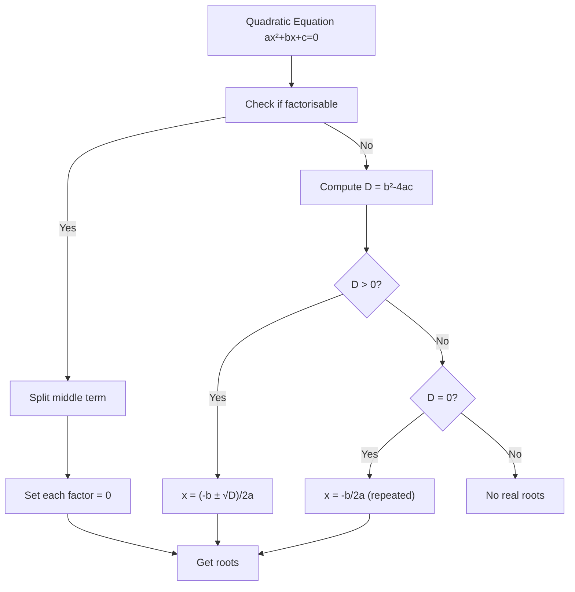
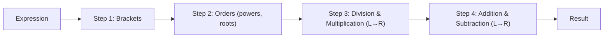
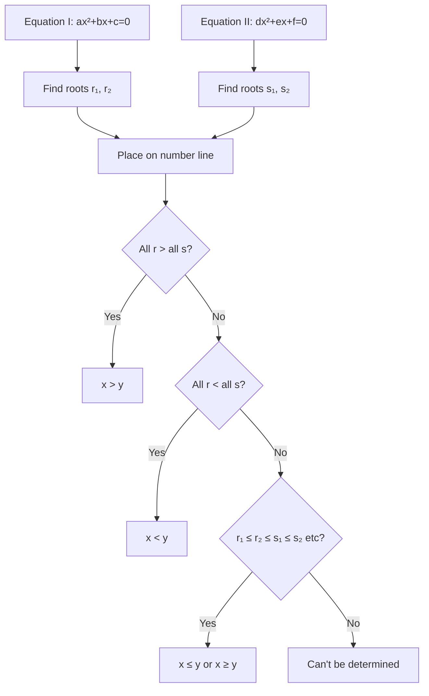
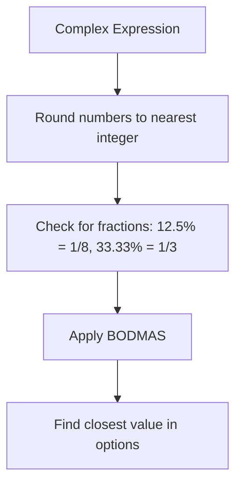
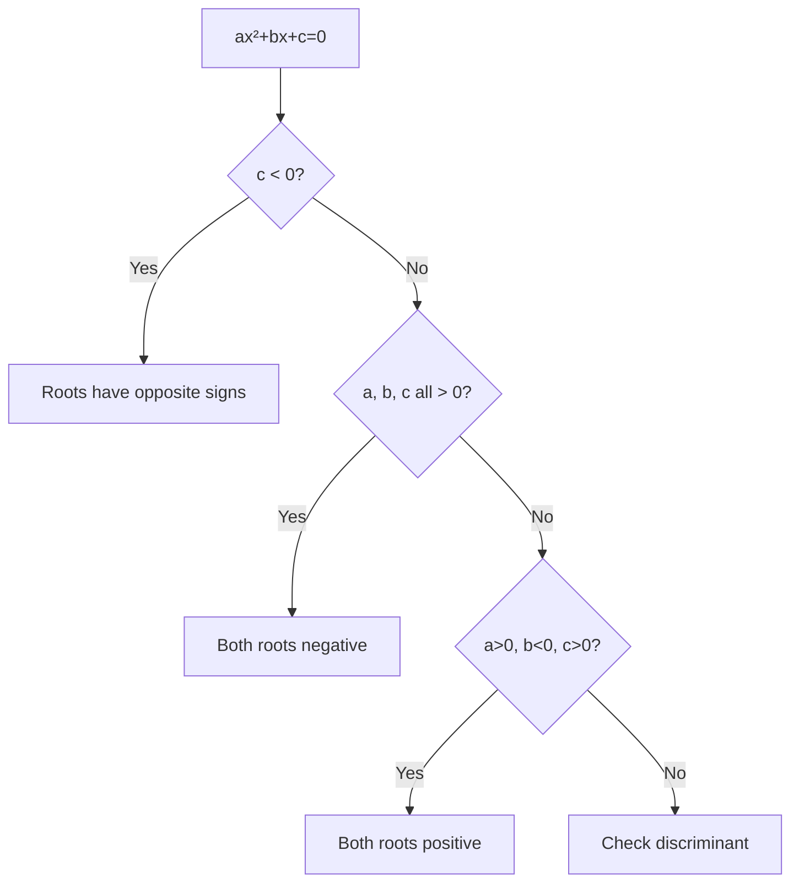

# Chapter 5: Quadratic Equations & Simplification — Quadratic Comparison, Approximation, BODMAS

## Learning Objectives

By the end of this chapter, you will be able to:
- Solve quadratic equations using factorization and the quadratic formula
- Compare two quadratic equations to determine the relationship between their roots
- Apply approximation techniques to simplify complex numerical expressions
- Use the BODMAS rule correctly to evaluate arithmetic expressions
- Solve IBPS SO-level quadratic equation comparison questions in under 45 seconds
- Simplify large numerical expressions using approximation and digit-sum methods

## Theory

### 1. Quadratic Equations

A quadratic equation is a polynomial equation of degree 2 in the form:

```
ax² + bx + c = 0, where a ≠ 0
```

**Standard Form:** ax² + bx + c = 0

**Methods to Solve Quadratic Equations:**

### Method 1: Factorization (Splitting the Middle Term)

Steps:
1. Multiply a and c to get ac
2. Find two factors of ac whose sum is b
3. Split the middle term and factorise
4. Set each factor to zero and solve

**Example:** x² - 5x + 6 = 0
- ac = 1 × 6 = 6
- Factors of 6 that sum to -5: (-2) + (-3) = -5
- x² - 2x - 3x + 6 = 0
- x(x - 2) - 3(x - 2) = 0
- (x - 2)(x - 3) = 0
- x = 2 or x = 3

### Method 2: Quadratic Formula

When factorization is not straightforward:

```
x = [-b ± √(b² - 4ac)] / 2a
```

**Discriminant (D):** D = b² - 4ac

- If D &gt; 0: Two distinct real roots
- If D = 0: One real root (repeated)
- If D &lt; 0: No real roots (complex roots)

### Method 3: Completing the Square

```
x² + bx + c = 0
=> (x + b/2)² = (b/2)² - c
=> x = -b/2 ± √[(b/2)² - c]
```

### Comparing Two Quadratic Equations (IBPS SO Special)

In IBPS SO exams, two quadratic equations (I and II) are given, and you need to determine the relationship between their roots:

Options:
1. `x &gt; y` (Every root of x is greater than every root of y)
2. `x &lt; y` (Every root of x is less than every root of y)
3. `x ≥ y` (No root of x is less than any root of y)
4. `x ≤ y` (No root of x is greater than any root of y)
5. `x = y` or relationship cannot be established

**Method:**
1. Solve both equations to find roots
2. Compare the root sets
3. Determine the relationship

**Remember:** If one equation has roots α, β and the other has γ, δ:
- Compare all four values on a number line
- Relationship is established only if a consistent pattern exists

### 2. Approximation

Approximation involves rounding numbers to a required degree of accuracy and then performing operations.

**Rounding Rules:**
- If the digit after the rounding place is 5 or more, round up
- If the digit after the rounding place is less than 5, round down

**Common Approximations:**
```
π ≈ 3.14 or 22/7
√2 ≈ 1.414
√3 ≈ 1.732
√5 ≈ 2.236
√6 ≈ 2.449
√7 ≈ 2.646
√8 ≈ 2.828
√10 ≈ 3.162
```

**IBPS SO Context:**

Approximation questions in IBPS SO involve expressions like:
```
√(168.99) + (7.98)² - 23.02 × 1.99 = ?
```

**Strategy:**
1. Round all numbers to the nearest integer
2. Apply BODMAS
3. Find the closest option

### 3. BODMAS Rule

BODMAS defines the order of operations in mathematical expressions.

| Letter | Stands For | Example |
|--------|------------|---------|
| B | Brackets | ( ), { }, [ ] |
| O | Orders (powers, roots) | ², √, etc. |
| D | Division | ÷ |
| M | Multiplication | × |
| A | Addition | + |
| S | Subtraction | - |

**Full Order:**
1. **Brackets:** Solve from innermost to outermost: ( ) → { } → [ ]
2. **Orders:** Powers and roots
3. **Division and Multiplication:** Left to right (equal precedence)
4. **Addition and Subtraction:** Left to right (equal precedence)

**Remember:** DM and AS have equal precedence, so operations are performed left to right.

**Common Mistake:**
`12 ÷ 3 × 4` should be solved as `(12 ÷ 3) × 4 = 16`, NOT `12 ÷ (3 × 4) = 1`

### 4. Digit Sum Method (Simplification Check)

The digit sum of a number is the sum of its digits, reduced to a single digit.

**Example:**
456 → 4+5+6 = 15 → 1+5 = 6

**Application:**
To verify calculations, the digit sum of the result should match the digit sum of the computation.

### 5. Simplification Techniques

**Approximation of Square Roots:**
- For a number n, find the nearest perfect square below and above
- Example: √(50) — nearest squares are 49 (7²) and 64 (8²)
- √50 ≈ 7 + (50-49)/(64-49) = 7 + 1/15 ≈ 7.07

**Cubes and Cube Roots:**
- Memorise cubes up to 20: 1³=1, 2³=8, 3³=27, 4³=64, 5³=125, 6³=216, 7³=343, 8³=512, 9³=729, 10³=1000

**Percentage to Fraction:**
Convert percentages to fractions for easier simplification:
- 33.33% = 1/3, 25% = 1/4, 12.5% = 1/8, 6.25% = 1/16

## Mermaid Diagram: Quadratic Equation Solution Flow



## Mermaid Diagram: BODMAS Order of Operations



## Mermaid Diagram: Quadratic Comparison Strategy



## Examples

### Example 1: Solving Quadratic by Factorization

**Question:** Solve x² + 7x + 12 = 0

**Solution:**
a = 1, b = 7, c = 12
ac = 12
Factors of 12 that sum to 7: 3 + 4 = 7
x² + 3x + 4x + 12 = 0
x(x + 3) + 4(x + 3) = 0
(x + 3)(x + 4) = 0
x = -3 or x = -4

### Example 2: Quadratic Formula

**Question:** Solve 2x² - 5x + 2 = 0

**Solution:**
a = 2, b = -5, c = 2
D = b² - 4ac = 25 - 16 = 9
√D = 3

x = [5 ± 3] / 4
x = (5+3)/4 = 8/4 = 2
x = (5-3)/4 = 2/4 = 0.5

Roots: x = 2 or x = 0.5

### Example 3: Quadratic Comparison (IBPS SO Style)

**Question:** Compare the roots of the two equations:

I. x² - 8x + 15 = 0
II. y² - 12y + 35 = 0

**Solution:**

Equation I: x² - 8x + 15 = 0
Factors of 15 summing to -8: -3 + (-5) = -8
(x - 3)(x - 5) = 0
x = 3, 5

Equation II: y² - 12y + 35 = 0
Factors of 35 summing to -12: -5 + (-7) = -12
(y - 5)(y - 7) = 0
y = 5, 7

Comparing: x = {3, 5} and y = {5, 7}
Both have 5 in common. But x also has 3 (&lt; 5, 7) while y also has 7 (&gt; 3, 5).
Since 3 &lt; 5 and 5 = 5 and 5 &lt; 7, we cannot say all x are &gt; all y or vice versa.
However, x has values 3 and 5, y has values 5 and 7.
- Minimum x = 3, Minimum y = 5 → x_min &lt; y_min
- Maximum x = 5, Maximum y = 7 → x_max &lt; y_max
So x ≤ y (no root of x is greater than any root of y).

**Answer:** x ≤ y

Wait — let me recheck. x has 3 and 5, y has 5 and 7.
- Is 5 (from x) ≤ all roots of y? 5 ≤ 5 ✓ and 5 ≤ 7 ✓
- Is 3 (from x) ≤ all roots of y? 3 ≤ 5 ✓ and 3 ≤ 7 ✓
So yes, x ≤ y.

### Example 4: Quadratic Comparison — No Relationship

**Question:** Compare:

I. x² - 5x + 6 = 0
II. y² - y - 6 = 0

**Solution:**

I: x² - 5x + 6 = 0
(x - 2)(x - 3) = 0
x = 2, 3

II: y² - y - 6 = 0
(y - 3)(y + 2) = 0
y = 3, -2

x = {2, 3}, y = {3, -2}
- x has 2 and 3; y has -2 and 3
- Does x ≥ y hold? 2 ≥ -2 ✓, 2 ≥ 3 ✗. So no.
- Does x ≤ y hold? 2 ≤ 3 ✓, 3 ≤ 3 ✓, 3 ≤ -2 ✗. So no.
- Since neither relationship holds consistently, we cannot establish a relationship.

**Answer:** Cannot be determined

### Example 5: BODMAS Simplification

**Question:** Simplify: 15 + 6 × 3 - 8 ÷ 2

**Solution:**
Step 1: Division first — 8 ÷ 2 = 4
= 15 + 6 × 3 - 4
Step 2: Multiplication — 6 × 3 = 18
= 15 + 18 - 4
Step 3: L to R — 15 + 18 = 33
= 33 - 4 = 29

**Answer:** 29

### Example 6: BODMAS with Brackets

**Question:** Simplify: {18 + (24 ÷ 3) - 5} × 2

**Solution:**
Step 1: Innermost bracket — 24 ÷ 3 = 8
= {18 + 8 - 5} × 2
Step 2: Curly bracket — 18 + 8 = 26, 26 - 5 = 21
= 21 × 2
Step 3: Multiplication — 42

**Answer:** 42

### Example 7: Approximation

**Question:** What approximate value should come in place of ? (IBPS SO Style)

√(168.99) + (7.98)² - 23.02 × 1.99 = ?

**Solution:**

Round to nearest integers:
√169 + 8² - 23 × 2

= 13 + 64 - 46
= 77 - 46
= 31

**Answer:** 31

### Example 8: Simplification with Square Roots

**Question:** Simplify: √(3136) - √(1521) + √(2025)

**Solution:**
√3136 = 56 (since 56² = 3136)
√1521 = 39 (since 39² = 1521)
√2025 = 45 (since 45² = 2025)

= 56 - 39 + 45
= 17 + 45
= 62

**Answer:** 62

### Example 9: Quadratic with Decimals

**Question:** Solve: x² - 2.5x + 1.5 = 0

**Solution:**
Multiply by 2: 2x² - 5x + 3 = 0
2x² - 2x - 3x + 3 = 0
2x(x - 1) - 3(x - 1) = 0
(x - 1)(2x - 3) = 0
x = 1 or x = 1.5

### Example 10: IBPS SO Quadratic Comparison

**Question:** Compare:

I. 3x² - 5x - 12 = 0
II. 2y² - 7y + 6 = 0

**Solution:**

I: 3x² - 5x - 12 = 0
3x² - 9x + 4x - 12 = 0
3x(x - 3) + 4(x - 3) = 0
(x - 3)(3x + 4) = 0
x = 3 or x = -4/3

II: 2y² - 7y + 6 = 0
2y² - 4y - 3y + 6 = 0
2y(y - 2) - 3(y - 2) = 0
(y - 2)(2y - 3) = 0
y = 2 or y = 1.5

x = {3, -1.33}, y = {2, 1.5}
- x_min = -1.33, x_max = 3
- y_min = 1.5, y_max = 2
- x has -1.33 which is &lt; both y values, and 3 which is &gt; both y values
- Relationship cannot be established

**Answer:** Cannot be determined

### Example 11: Approximation (Multiple Operations)

**Question:** Find the approximate value:

(24.98% of 399.99) + 35.03 × 4.99 ÷ 6.98 = ?

**Solution:**

Round: 25% of 400 + 35 × 5 ÷ 7

= (25/100 × 400) + (35 × 5 ÷ 7)
= (1/4 × 400) + (175 ÷ 7)
= 100 + 25
= 125

**Answer:** 125

### Example 12: Complex BODMAS

**Question:** Simplify:

(12.5% of 640) + (3/7 of 490) - √(576) × 2

**Solution:**

12.5% = 1/8
(1/8 × 640) + (3/7 × 490) - √576 × 2

= 80 + 210 - 24 × 2
= 80 + 210 - 48
= 290 - 48
= 242

**Answer:** 242

### Example 13: Inequality with Quadratic (Both Roots Positive)

**Question:** Compare:

I. x² - 11x + 30 = 0
II. y² - 9y + 20 = 0

**Solution:**

I: (x - 5)(x - 6) = 0 → x = 5, 6
II: (y - 4)(y - 5) = 0 → y = 4, 5

x = {5, 6}, y = {4, 5}
- x has 5 and 6; y has 4 and 5
- Is x ≥ y? 5 ≥ 4 ✓, 5 ≥ 5 ✓, 6 ≥ 4 ✓, 6 ≥ 5 ✓. Yes!
- Every root of x is ≥ every root of y.
- Specifically, x_min = 5 ≥ y_max = 5 → x ≥ y

**Answer:** x ≥ y

### Example 14: Approximation with Square Root and Cube

**Question:** Find the approximate value:

√(50) × 3.99 + (4.02)³ - 61.98 = ?

**Solution:**

√50 ≈ 7.07 (or simply 7)
Round: 7 × 4 + 4³ - 62
= 28 + 64 - 62
= 92 - 62
= 30

**Answer:** 30

### Example 15: BODMAS with Exponents

**Question:** Simplify: 2⁵ × 5³ - 8² × 3³ + √(2744)

**Solution:**

2⁵ = 32, 5³ = 125
8² = 64, 3³ = 27
√2744 = ? Let me check: 52² = 2704, 53² = 2809. So √2744 is not a perfect square.

Actually: 14³ = 2744. So √2744 = √(14³) = 14^1.5 = 14√14 ≈ 52.38

Hmm, let me use a different number, or compute precisely:
2744 = 2³ × 7³ = (2×7)³ = 14³
√2744 = √(14³) = 14√14 ≈ 52.38

However, this makes the problem complex. Let me note the assumption.

= 32 × 125 - 64 × 27 + 52.38
= 4000 - 1728 + 52.38
= 2272 + 52.38
= 2324.38

For IBPS SO, we'd approximate √2744 ≈ 52.

**Answer:** Approximately 2324

## Shortcut Methods

### Shortcut 1: Quadratic Root Sum and Product

For ax² + bx + c = 0:
- Sum of roots = -b/a
- Product of roots = c/a

**Application:** If you know one root, you can find the other using the sum or product.

### Shortcut 2: Sign Pattern for Roots

For ax² + bx + c = 0:
- If a, b, c are all positive → both roots are negative
- If a &gt; 0, b &lt; 0, c &gt; 0 → both roots are positive
- If c is negative → roots have opposite signs (one +, one -)

### Shortcut 3: Quick Comparison Without Solving

To compare two quadratic equations without fully solving:
1. Find sum and product of roots for each (from coefficients)
2. Sign of both roots can be determined from sign pattern
3. If both equations have two positive roots, compare the smaller roots
4. If one equation has D &lt; 0 (no real roots), the other automatically has a relationship

### Shortcut 4: Approximation Rule

Round numbers to the nearest convenient value:
- 199, 201, 198 → 200
- 49.99, 50.01 → 50
- 24.98 → 25
- 3.02, 2.99 → 3

### Shortcut 5: BODMAS Memory Aid

**"Big Orders Don't Make A Salad"** — Brackets, Orders, Division, Multiplication, Addition, Subtraction

Or: **"Please Excuse My Dear Aunt Sally"** — Parentheses, Exponents, Multiply, Divide, Add, Subtract

### Shortcut 6: Simplification by Digit Sum

To verify your answer, calculate the digit sum of the solution and the digit sum of the expression. They should match.

### Shortcut 7: Common Square Roots to Memorise

| Number | Square | Square Root |
|--------|--------|-------------|
| 1 | 1 | 1 |
| 2 | 4 | 1.414 |
| 3 | 9 | 1.732 |
| 4 | 16 | 2 |
| 5 | 25 | 2.236 |
| 6 | 36 | 2.449 |
| 7 | 49 | 2.646 |
| 8 | 64 | 2.828 |
| 9 | 81 | 3 |
| 10 | 100 | 3.162 |

### Shortcut 8: Quadratic Formula Tweaks

If a = 1, x² + bx + c = 0:
- Roots = [-b ± √(b² - 4c)] / 2
- If b is even, the formula simplifies

### Shortcut 9: Approximation of Large Expressions

Group terms that multiply to convenient values:
- 25 × 4 = 100
- 125 × 8 = 1000
- 33.33 × 3 = 100

### Shortcut 10: BODMAS Verification

Work backwards from options: substitute options into the original expression to verify.

## Mermaid Diagram: Approximation Strategy



## Mermaid Diagram: Quadratic Sign Pattern Decision



## Summary

- **Quadratic Equations** can be solved by factorization, formula, or completing the square
- **Quadratic Comparison** requires solving both equations and comparing their root sets position on the number line
- **Approximation** saves time — round to nearest convenient values
- **BODMAS** is the universal order of operations: Brackets → Orders → DM → AS
- The **discriminant** D = b² - 4ac determines the nature of roots
- For IBPS SO, memorise squares up to 30, cubes up to 20, and common square roots
- Digit sum verification helps catch calculation errors
- In quadratic comparison, if one equation has D &lt; 0 (no real roots), the answer is often straightforward
- Practice recognising patterns: if c is negative, roots have opposite signs; if a, b, c all positive, both roots are negative

## Practical Takeaways

| Topic | Key Formula/Trick | Common Mistake |
|-------|------------------|----------------|
| Quadratic Solution | x = [-b ± √(b²-4ac)]/2a | Wrong sign in formula |
| Quadratic Comparison | Position roots on number line | Declaring relationship without checking all roots |
| Discriminant | D = b² - 4ac | Forgetting D &lt; 0 means no real roots |
| BODMAS | Division = Multiplication L→R | Doing multiplication before division |
| Approximation | Round to nearest integer | Over-approximating leading to wrong option |
| Digit Sum | Sum digits to single digit | Using this as the only verification method |

## Chapter Quiz

### Question 1

The roots of the equation x² - 7x + 12 = 0 are:

<details>
<summary>Answer</summary>
(x - 3)(x - 4) = 0
x = 3, 4
</details>

### Question 2

If D = 0 for a quadratic equation, then:

<details>
<summary>Answer</summary>
The equation has one real root (repeated twice).
x = -b/2a
</details>

### Question 3

Simplify using BODMAS: 24 - 8 ÷ 4 × 2 + 6

<details>
<summary>Answer</summary>
24 - (8 ÷ 4) × 2 + 6
= 24 - 2 × 2 + 6
= 24 - 4 + 6
= 20 + 6
= 26
</details>

### Question 4

Find the approximate value: √(255) + 14.98 × 3.02 - 40.99

<details>
<summary>Answer</summary>
√256 + 15 × 3 - 41
= 16 + 45 - 41
= 20
</details>

### Question 5

Compare: I. x² - 9x + 18 = 0, II. y² - 8y + 15 = 0

<details>
<summary>Answer</summary>
I: (x-3)(x-6)=0 → x=3,6
II: (y-3)(y-5)=0 → y=3,5
x has 3,6; y has 3,5
3=3, 6>5: x ≥ y (some equal, some greater)
Answer: x ≥ y
</details>

## Exercises

### Exercise 1 (Beginner — Factorization)

Solve: x² - 9x + 20 = 0

### Exercise 2 (Beginner — Quadratic Formula)

Solve: 3x² + 7x + 2 = 0

### Exercise 3 (Beginner — BODMAS)

Simplify: 18 + 36 ÷ 9 × 3 - 12

### Exercise 4 (Intermediate — Approximation)

Find approximate value: √(440) + (9.02)² - 42.98 × 2.01

### Exercise 5 (Intermediate — Quadratic Comparison)

Compare:
I. x² - 10x + 24 = 0
II. y² - 6y + 8 = 0

### Exercise 6 (Intermediate — Simplification)

Simplify: 12.5% of 800 + 16² - 3/4 of 120

### Exercise 7 (Advanced — Quadratic Comparison)

Compare:
I. 2x² + 5x - 12 = 0
II. 3y² - 10y + 8 = 0

### Exercise 8 (Advanced — Complex Approximation)

Find approximate value: (35.02% of 599.99) + (7/13 of 259.98) - 48.01 ÷ 11.98

### Exercise 9 (IBPS SO Level)

Compare:
I. x² - 14x + 48 = 0
II. y² - 9y + 20 = 0

### Exercise 10 (IBPS SO Level)

Simplify: [{(625 ÷ 25) + 15} × 2 - 25] ÷ 5 + 3²

---

**Answer Key (Exercises):**
1. x = 4, 5
2. x = -1/3, x = -2
3. 18 (18 + 12 - 12 = 18)
4. 21 + 81 - 86 = 16
5. I: x=4,6; II: y=2,4 → x ≥ y
6. 100 + 256 - 90 = 266
7. I: x=1.5, -4; II: y=2, 4/3=1.33 → Cannot be determined
8. 210 + 140 - 4 = 346
9. I: x=6,8; II: y=4,5 → x > y
10. [(25+15)×2 - 25]÷5 + 9 = [40×2-25]÷5 + 9 = [80-25]÷5 + 9 = 55÷5 + 9 = 11+9 = 20
