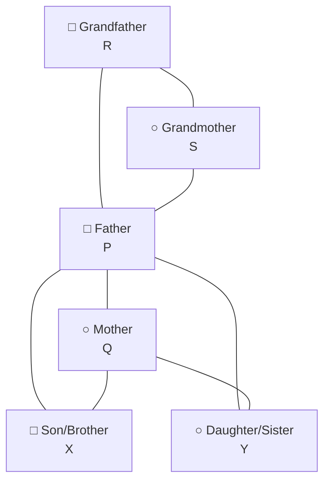
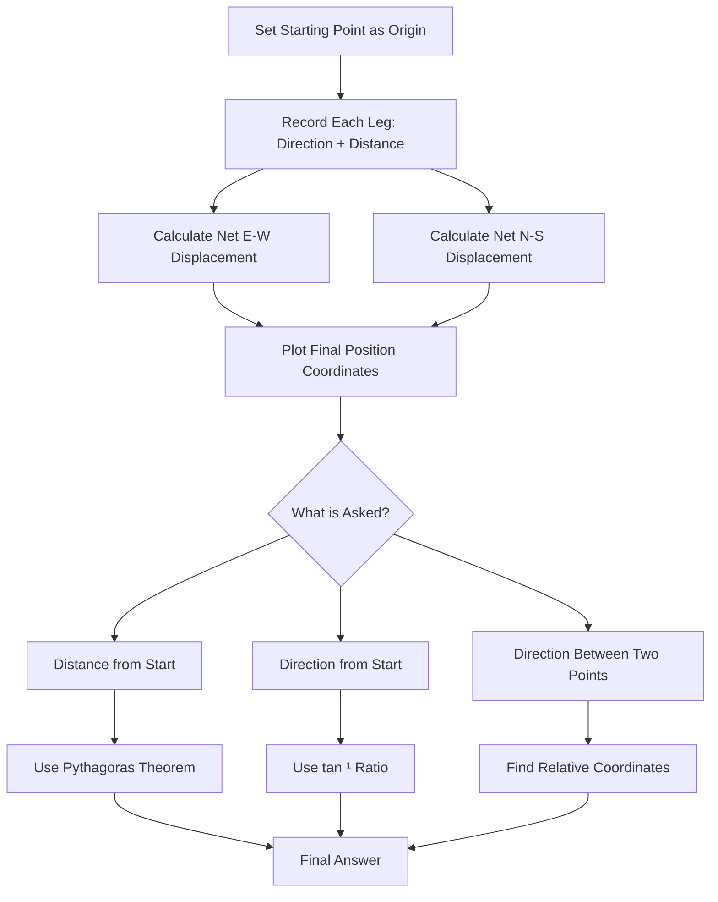
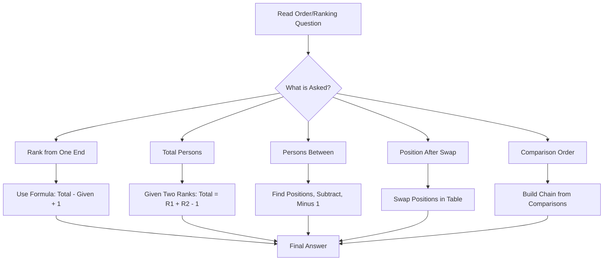

# Blood Relations, Direction Sense, and Order-Ranking

## Learning Objectives

By the end of this chapter, you will be able to:
- Construct and interpret family trees using blood relation terminology
- Solve complex blood relation puzzles involving multiple generations
- Determine relationships such as uncle, aunt, nephew, niece, cousin, grandparent, and in-laws
- Solve direction sense problems using cardinal and intermediate directions
- Calculate distances and directions using right-angle trigonometry (Pythagorean theorem)
- Handle multi-leg direction questions with left/right turns
- Solve order and ranking problems related to position in a line, class, or competition
- Convert "from top" and "from bottom" rankings
- Solve comparison-based ordering puzzles (age, height, weight, marks)
- Differentiate between "rank," "position," "order," and "sequence" in exam questions

---

## Theory

### 1. Importance in IBPS SO IT Officer Prelims

Blood relations, direction sense, and order-ranking questions typically contribute 4–6 questions in the IBPS SO Reasoning Ability section. They are considered scoring topics because they follow consistent patterns and do not require lengthy calculations. With systematic practice, these questions can be solved in 30–60 seconds each.

### 2. Blood Relations

#### 2.1 Core Family Relationships

| Relationship | Meaning |
|-------------|---------|
| Father | Male parent |
| Mother | Female parent |
| Brother | Male sibling (same parents) |
| Sister | Female sibling (same parents) |
| Husband | Male spouse |
| Wife | Female spouse |
| Son | Male child |
| Daughter | Female child |
| Grandfather | Father's father or mother's father |
| Grandmother | Father's mother or mother's mother |
| Grandson | Son's son or daughter's son |
| Granddaughter | Son's daughter or daughter's daughter |
| Uncle | Father's brother, mother's brother, or husband of aunt |
| Aunt | Father's sister, mother's sister, or wife of uncle |
| Nephew | Brother's son or sister's son |
| Niece | Brother's daughter or sister's daughter |
| Cousin | Child of uncle or aunt (same generation) |
| Father-in-law | Wife's father or husband's father |
| Mother-in-law | Wife's mother or husband's mother |
| Brother-in-law | Sister's husband, wife's brother, or husband's brother |
| Sister-in-law | Brother's wife, wife's sister, or husband's sister |
| Son-in-law | Daughter's husband |
| Daughter-in-law | Son's wife |

#### 2.2 Gender Indicators in Family Relationships

Identifying the gender of individuals is crucial in blood relation questions.

**Masculine (Male) Terms:**
- Father, brother, husband, son, grandfather, grandson, uncle, nephew, father-in-law, brother-in-law, son-in-law

**Feminine (Female) Terms:**
- Mother, sister, wife, daughter, grandmother, granddaughter, aunt, niece, mother-in-law, sister-in-law, daughter-in-law

**Gender-Neutral Terms:**
- Parent, sibling, child, spouse, cousin, relative — these terms do not indicate gender

#### 2.3 Family Tree Construction

The family tree is the most effective tool for solving blood relation questions.

**Standard Notation:**
- Male: □ or M
- Female: ○ or F
- Married: □ — ○ (horizontal line with label)
- Siblings: □ — ○ — □ (vertical line connecting to common parent)
- Parents to children: Vertical line from parent pair to child



**Step-by-Step Family Tree Construction:**

1. **Identify the central person(s):** Often marked by a statement like "A is the father of B"
2. **Place the first relationship:** Draw the relevant nodes and connections
3. **Add relationships one by one:** Process each statement sequentially
4. **Use gender symbols:** Clearly mark male (□) and female (○)
5. **Track generations:** Persons at the same horizontal level belong to the same generation
6. **Connect through marriage:** Use horizontal lines for married couples
7. **Label:** Write names/letters clearly on each node

**Key Principles for Family Trees:**
- Horizontal lines represent marriage (husband — wife)
- Vertical lines represent parent-child relationships
- Siblings share the same set of parent nodes
- Spouses are always in the same generation
- Parents are always one generation above their children
- Grandparents are two generations above

#### 2.4 Blood Relation Puzzles — Multi-Statement

In IBPS SO, blood relation questions often involve a paragraph describing a family, followed by relationship-based questions.

**Example Paragraph:**
"P and Q are married. R is the only son of P. S is the daughter of Q. T is the brother of R. U is the wife of T."

**Family Tree Construction:**
```
P(□) — Q(○)        [Married couple, Generation 1]
   |   |   |
   |   |   +--- S(○) [Daughter of Q, Generation 2]
   |   |
   +------- R(□) — U(○) [R is son of P&Q, married to U]
   |       |
   +------- T(□) [Brother of R, son of P&Q, Generation 2]
```

**Key Insight:** "R is the only son of P" means P has only one son (R), but P may have other children (daughters like S, or other sons not mentioned). However, "only son" means exactly one son. T is the brother of R, which means T is also P's son. So "only son" must mean "one of the sons" or the phrase is contradictory. In exam language, "only son" means exactly one male child.

Wait — if R is the only son of P, and T is the brother of R, then T must also be P's son. This is a contradiction unless "only son" means "the only living son" or some other context. In IBPS SO exam questions, such contradictions are avoided. The careful reading of "only son" versus "a son" is important.

**Correction:** If the question says "R is the only son of P" and also "T is the brother of R," then T cannot exist (since R is the only son). The question would be inconsistent. Let me fix:

"P and Q are married. They have two sons R and T, and a daughter S. U is the wife of R."

Now: P(□) — Q(○) → children: R(□), T(□), S(○). R married to U(○).

#### 2.5 Common Blood Relation Questions

**Type 1: Direct Relationship**
"How is P related to Q?"
Solve by tracing the family tree from P to Q.

**Type 2: Relationship through Third Person**
"P is the brother of Q. Q is the mother of R. How is P related to R?"
Solution: P is brother of Q, Q is mother of R → P is uncle of R.

**Type 3: Puzzle-based (Multiple Statements)**
Given multiple relationships, determine how two specific persons are related.

**Type 4: Gender Determination**
"P is the son of Q. Q is the mother of R. S is the sister of P." Determine gender of R and S.
Solution: Q is mother. P is son. S is sister of P → S is daughter of Q. R could be male or female (not enough information).

**Type 5: "Maternal" vs "Paternal" Relations**
- Maternal uncle = Mother's brother
- Paternal uncle = Father's brother
- Maternal grandfather = Mother's father
- Paternal grandfather = Father's father

**Type 6: In-law Relations**
- Mother-in-law = Spouse's mother
- Father-in-law = Spouse's father
- The "in-law" suffix extends to all relationships through marriage

#### 2.6 Quick Reference for Tracing Relationships

| Path | Relationship |
|------|-------------|
| Father's father | Grandfather (paternal) |
| Father's mother | Grandmother (paternal) |
| Mother's father | Grandfather (maternal) |
| Mother's mother | Grandmother (maternal) |
| Father's brother | Uncle (paternal) |
| Father's sister | Aunt (paternal) |
| Mother's brother | Uncle (maternal) |
| Mother's sister | Aunt (maternal) |
| Brother's son | Nephew |
| Brother's daughter | Niece |
| Sister's son | Nephew |
| Sister's daughter | Niece |
| Uncle's child | Cousin |
| Aunt's child | Cousin |
| Spouse's father | Father-in-law |
| Spouse's mother | Mother-in-law |
| Spouse's brother | Brother-in-law |
| Spouse's sister | Sister-in-law |
| Daughter's husband | Son-in-law |
| Son's wife | Daughter-in-law |

#### 2.7 Common Traps in Blood Relations

| Trap | Mistake | Correct Approach |
|------|---------|-----------------|
| Assuming gender | Thinking a name is male/female without evidence | Use only gender from relationships |
| Multiple spouses | Assuming one person has only one spouse | Unless stated, assume standard monogamy |
| Half-siblings vs full siblings | Treating all siblings as same parents | "Brother/sister" means same parents unless "half-brother" is specified |
| "Only child" vs "only son" | Confusing "only child" (no siblings) with "only son" (has sisters but no brothers) | Read carefully: "only child" means no siblings of any gender |
| "A is B's brother" | Assuming B's gender | B could be male or female unless further specified |

### 3. Direction Sense

#### 3.1 Basic Directions

The four cardinal directions: North (N), South (S), East (E), West (W)
The four intermediate directions: Northeast (NE), Northwest (NW), Southeast (SE), Southwest (SW)

```
        N
        |
    NW  |  NE
        |
    W ———+——— E
        |
    SW  |  SE
        |
        S
```

**Key Facts:**
- North is opposite South
- East is opposite West
- Northeast is opposite Southwest
- Northwest is opposite Southeast
- Left turn = −90° (counterclockwise)
- Right turn = +90° (clockwise)

#### 3.2 Direction with Turns

**Turns from a given facing direction:**

| Current Facing | Left Turn | Right Turn | Reverse (180°) |
|----------------|-----------|------------|----------------|
| North | West | East | South |
| South | East | West | North |
| East | North | South | West |
| West | South | North | East |
| Northeast | Northwest | Southeast | Southwest |
| Northwest | Southwest | Northeast | Southeast |
| Southeast | Northeast | Southwest | Northwest |
| Southwest | Southeast | Northwest | Northeast |

**Memory Rule for Turns:**
- Left turn: W from N, S from W, E from S, N from E (counterclockwise rotation through W, S, E, N)
- Right turn: E from N, S from E, W from S, N from W (clockwise rotation through E, S, W, N)
- Or simply: Left → previous cardinal in the sequence N→W→S→E→N
- Right → next cardinal in the sequence N→E→S→W→N

#### 3.3 Distance Calculation

When solving direction-distance problems, treat the path as a series of vectors. The shortest distance between the start and end point is found using the Pythagorean theorem.

**Pythagorean Theorem:**
- If the net displacement has two perpendicular components (e.g., x km east and y km north):
  - Shortest distance = √(x² + y²)

**Example:**
A walks 3 km east, then 4 km north.
Net displacement: 3 km east, 4 km north.
Shortest distance from start = √(3² + 4²) = √25 = 5 km.

**Direction of End Point from Start Point:**
- Use trigonometric ratios: tan θ = opposite/adjacent
- For 3 east, 4 north: tan θ = 4/3, θ = tan⁻¹(4/3) ≈ 53° from east (or 37° from north)
- Direction: Northeast (more precisely, 53° north of east)

#### 3.4 Multi-Leg Direction Problems

**Systematic Approach for Multiple Legs:**

1. Start at a reference point (usually the starting location)
2. Track the person's facing direction at each step
3. Record each leg as a vector (East/West displacement, North/South displacement)
4. At each turn, update the facing direction
5. At the end, sum all East-West displacements and all North-South displacements
6. Calculate net displacement and distance

**Example:**
A starts from point X, walks 5 km north, turns right, walks 3 km, turns right, walks 2 km, turns left, walks 4 km. Where is A from X?

**Solution:**
```
Start: X.
Leg 1: 5 km north. Facing: N. Position: (0, +5)
Turn right → facing E
Leg 2: 3 km east. Facing: E. Position: (+3, +5)
Turn right → facing S
Leg 3: 2 km south. Facing: S. Position: (+3, +3)
Turn left → facing E
Leg 4: 4 km east. Facing: E. Position: (+7, +3)
```

Net displacement: 7 km East, 3 km North (or 0° from East = 7 km, 90° from East = 3 km).

Direction from X: Northeast (7 km east, 3 km north)
Shortest distance: √(7² + 3²) = √(49 + 9) = √58 ≈ 7.6 km

#### 3.5 Shadow-Based Direction Problems

In shadow-based questions, the position of the sun determines the direction of shadows.

**Shadow Rules:**
- Sunrise (East): Shadow falls to the West
- Sunset (West): Shadow falls to the East
- Noon (overhead): No shadow (or very short shadow at feet)
- Morning sun: Shadow is toward West
- Afternoon sun: Shadow is toward East

**Example:**
If a man's shadow falls to his right in the morning, which direction is he facing?
- Morning: Sun is in the East → shadow falls to the West
- Shadow to his right → West is his right → He is facing South
- (When facing South: Left = East, Right = West)

#### 3.6 Direction Puzzles with Multiple Persons

Sometimes multiple persons move in different directions, and we need to find the relative position/distance between them.

**Approach:**
1. Track each person's path independently
2. Plot their final positions on a coordinate system
3. Calculate the distance and direction between their final positions



### 4. Order and Ranking

#### 4.1 Basic Concepts

Order and ranking questions involve determining the position of a person/entity in a sequence.

**Key Terminology:**
- "Rank from top" = Position from the top (1 = first/top)
- "Rank from bottom" = Position from the bottom (1 = bottom/last)
- "Total persons" = Total number of entities in the sequence
- "Left end" / "Right end" = Extreme positions in a linear arrangement
- "Immediate left/right" = Adjacent position
- "Between" = Number of persons between two given persons

**Core Formulas:**
```
Total = Rank from top + Rank from bottom − 1

Rank from top = Total − Rank from bottom + 1

Rank from bottom = Total − Rank from top + 1

Number of persons between A and B = |Rank of A from top − Rank of B from top| − 1
```

#### 4.2 Types of Order/Ranking Questions

**Type 1: Single Person Ranking**
Find the rank of a person given their position from one end and total number of persons.

**Example:** In a class of 40 students, Rohan ranks 8th from the top. What is his rank from the bottom?
- Rank from bottom = 40 − 8 + 1 = 33rd

**Type 2: Relative Position**
Find the total number of persons or the position of a specific person.

**Example:** In a row, A is 15th from the left and 20th from the right. How many persons are in the row?
- Total = 15 + 20 − 1 = 34

**Type 3: Persons Between Two Referenced Persons**
Find the number of persons between two given persons.

**Example:** In a row of 50 persons, A is 10th from the left and B is 15th from the right. How many persons are between A and B?
- A's rank from left = 10
- B's rank from right = 15 → B's rank from left = 50 − 15 + 1 = 36
- Persons between = 36 − 10 − 1 = 25

**Type 4: Interchanging Positions**
Two persons swap positions, and the new positions are given.

**Example:** In a row, A is 10th from the left and B is 15th from the right. After swapping places, A becomes 18th from the left. What is B's new position from the right?

**Solution:**
- Before swap: A = 10th left, B = 15th right
- A's original position: 10th from left
- After swap, A is at B's original position: 18th from left
- So B's original position is 18th from left
- B's original position from right = 15th (given)
- Total persons = 18 + 15 − 1 = 32
- After swap, B is at A's original position (10th from left)
- B's new position from right = 32 − 10 + 1 = 23rd

**Type 5: Minimum/ Maximum Persons**
Find the minimum or maximum number of persons based on partial information.

**Example:** In a row, A is 10th from the left. B is 15th from the right. What is the minimum total number of persons?
- Minimum total = max(10, 15) = 15 (if A and B are the same person) or more if they are different.

Actually, if A and B are different:
- A is at position 10 from left
- B is at position 15 from right
- If A is to the left of B: total = at least 10 + 15 − 1 = 24 (if A is immediately left of B's position) or more
- If A and B are the same position: impossible since positions differ
- Minimum total = max(10 + 15 − 1, 10, 15) = 24 (when A and B are as close as possible without violating positions)

Wait, let me reconsider. If A is 10th from left (position 10) and B is 15th from right:
- For minimum total: position of A must be as far right as possible relative to B, OR A and B could be the same person.

If A and B are different:
- B's position from left = Total − 15 + 1 = Total − 14
- For A (position 10) to be a valid position: Total ≥ 10
- For B (position Total − 14) to be a valid distinct position: Total > 10 and Total − 14 ≥ 1 and Total − 14 ≠ 10
- Minimum Total occurs when B is as close to A as possible.
- If Total = 24: B's position = 10 (position same as A). But A and B are different. So Total > 24.
- If Total = 25: B's position = 11. A at 10, B at 11. A and B are adjacent. Valid!
- Minimum total = 25.

The general formula for minimum total (different persons, one from left at L, one from right at R):
- Minimum total = L + R − 1 + d where d = 1 if positions would otherwise coincide, d = 0 if they don't.

Hmm, this is getting complex. Let me use a simpler approach:
- A at position L from left
- B at position R from right
- If L + R − 1 ≤ total: positions don't overlap. Minimum = L + R − 1 (just enough to fit both)
- But if L + R − 1 ≤ max(L, R): then the minimum could be max(L, R) + something.

Actually the standard formula:
- If A is at position L from left and B is at position R from right, and A and B are different persons:
  - Minimum total = L + R − 1, as long as L and R are compatible (positions don't clash at total = L + R − 1)
  - At total = L + R − 1: position of A = L, position of B = (L + R − 1) − R + 1 = L. They coincide!
  - To avoid coincidence: minimum total = L + R (two distinct positions)

But if L + R − 1 < max(L, R), then the positions can never coincide and minimum = max(L, R).

Example: A at 3 from left, B at 25 from right.
L + R − 1 = 3 + 25 − 1 = 27. max(L, R) = 25. So minimum total = max(27, 25) = 27? Hmm, but at total = 27: A at 3, B at 27 − 25 + 1 = 3. They coincide. So need total = 28.

This is getting too case-specific. For most IBPS SO questions, the simple formulas work.

**Type 6: Comparison-Based Ranking**
Arrange persons based on comparative statements (height, weight, age, marks).

**Example:** Five persons scored different marks. A scored more than B but less than C. D scored less than E but more than A. Who scored the highest?

Chain: C > A > B and E > D > A.
So C > A, E > D > A. We know C > A and E > A. But C vs E is unknown. Either C or E could be highest.

**Answer:** Cannot be determined uniquely.

**Type 7: Year/Age-Based Ordering**
Arrange events based on birth years, historical events, or ages.

**Example:** P was born 5 years after Q. R was born 3 years before S. Q was born 4 years after R. Who is the youngest?

Timeline (from oldest to youngest): R → S → Q → P. Or wait, let me trace:
- Q born 5 years before P (P after Q) → Q older than P: Q at year 0, P at year 5
- R born 3 years before S → R older than S: R at year −4, S at year −1
- Q born 4 years after R → R older than Q: R at year −4, Q at year 0
So timeline: R(–4), S(–1), Q(0), P(5). P is youngest.

#### 4.3 Common Traps in Order/Ranking

| Trap | Mistake | Correct Approach |
|------|---------|-----------------|
| Forgetting "−1" in total calculation | Total = Top + Bottom | Total = Top + Bottom − 1 |
| Confusing left/right in ranking | Treating all rankings as "from left" | Note the reference (left end, right end, top, bottom) |
| Not considering overlapping | Assuming positions in a line are independent | Calculate overlaps when finding "between" |
| Interchanging positions without tracking | Losing track of who moved where | Create a table showing before/after for each person |
| Assuming equal spacing | In age problems, assuming equal gaps between consecutive persons | Use only the given gaps |



---

## Solved Examples

### Example 1: Blood Relation — Family Tree

**Question:**
A is the mother of B and C. D is the husband of A. E is the brother of C. F is the daughter of B. G is the wife of E. How is F related to G?

**Solution:**

Step 1: Build the family tree.
- A(○) is mother of B and C
- D(□) is husband of A → D is father of B and C
- E(□) is brother of C → E is also child of A and D (son)
- F(○) is daughter of B
- G(○) is wife of E

```
Generation 1: D(□) — A(○)
                    |
     +------+------+------+
     |      |      |      |
Generation 2: B(□)  C(?)  E(□) — G(○)
              |             
              +--- F(○)
```

Wait, I need to determine the gender of B, C, and the relationship.

A is mother of B and C. C is sibling of E (brother). E is male. If C is sibling of E, C could be brother (male) or sister (female) of E. But "E is the brother of C" means E is male relative to C. This doesn't tell us C's gender.

However: "E is the brother of C" → E is brother of C. C is the sibling of E. If C were male, E would be brother, which is fine. If C is female, E would be C's brother, which is also fine. C's gender is not determined.

B's gender: "F is the daughter of B" → B is a parent of F. B could be father (male) or mother (female). Not determined.

Wait: "A is the mother of B and C" → A is female, B and C are A's children. "D is husband of A." So A and D are the parents of B and C. "E is brother of C" → E is male, child of A and D. 

So all children of A and D: B, C, E. B is parent of F.

To find: How is F related to G?

G is wife of E (G married to E). E is child of A and D. B is also child of A and D. F is child of B.

So F is the niece (child of sibling) of E. E is the uncle of F. Since G is E's wife, G is F's aunt by marriage (aunt-in-law or simply aunt).

**Answer:** F is the niece of G (or G is the aunt of F).

---

### Example 2: Blood Relation — Puzzle-Based

**Question:**
P is the brother of Q. R is the sister of P. S is the mother of R. T is the father of Q. How is S related to T?

**Solution:**

Step 1: Build the family tree.
- P(□) is brother of Q → P and Q are siblings
- R(○) is sister of P → R is also sibling of P and Q
- S(○) is mother of R → S is mother of P, Q, and R (all siblings)
- T(□) is father of Q → T is father of P, Q, and R

So S and T are the parents of the same children.

**Answer:** S is the wife of T (or T is the husband of S).

---

### Example 3: Direction Sense — Multi-Leg Travel

**Question:**
A man walks 10 km towards north. He turns right and walks 8 km. He turns left and walks 5 km. He turns left and walks 3 km. He turns right and walks 7 km. How far and in which direction is he from the starting point?

**Solution:**

Step 1: Track each leg. Let starting point be origin (0,0). Let North = +y, East = +x.

```
Start: (0, 0), facing N.
Leg 1: 10 km N → (0, +10), facing N.
Turn right → facing E.
Leg 2: 8 km E → (+8, +10), facing E.
Turn left → facing N.
Leg 3: 5 km N → (+8, +15), facing N.
Turn left → facing W.
Leg 4: 3 km W → (+5, +15), facing W.
Turn right → facing N.
Wait — left turn from N = W, right turn from N = E.

Let me redo:
Start: (0,0), facing N.
Leg 1: 10 km N → position (0, 10). Facing N.
Turn right: N → E.
Leg 2: 8 km E → position (8, 10). Facing E.
Turn left: E → N.
Leg 3: 5 km N → position (8, 15). Facing N.
Turn left: N → W.
Wait, turn LEFT from facing N = W. Yes.
Leg 4: 3 km W → position (5, 15). Facing W.
Turn right: W → N.
Leg 5: 7 km N → position (5, 22). Facing N.
```

Wait, the problem says 5 legs: 10 N, 8 E, 5 N, 3 W, 7 N. But I miscounted the turns. Let me map the path carefully:

1. Walk 10 km north. Position: (0, 10). Facing: N.
2. Turn right. Now facing: E. Walk 8 km east. Position: (8, 10). Facing: E.
3. Turn left. Now facing: N. Walk 5 km north. Position: (8, 15). Facing: N.
4. Turn left. Now facing: W. Walk 3 km west. Position: (5, 15). Facing: W.
5. Turn right. Now facing: N. Walk 7 km north. Position: (5, 22). Facing: N.

Wait, that's 5 legs but the example says "turns right, turns left, turns left, turns right" — that's 4 turns for 5 legs total.

Final position: (5, 22) relative to start (0, 0).

Net displacement: 5 km East, 22 km North.

Step 3: Calculate distance from start.
Distance = √(5² + 22²) = √(25 + 484) = √509 ≈ 22.56 km.

Step 4: Determine direction.
The end point is East and North of the start. Direction = Northeast.
More specifically, angle from North = tan⁻¹(5/22) ≈ tan⁻¹(0.227) ≈ 12.8° East of North.

**Answer:** The man is approximately 22.56 km away from the starting point in the Northeast direction (specifically 12.8° East of North).

---

### Example 4: Direction Sense — Shadow Problem

**Question:**
One morning, X and Y stand facing each other. X's shadow falls to his left. Which direction is Y facing?

**Solution:**

Step 1: Determine the time and shadow direction.
It's morning → Sun is in the East.
Shadows fall to the West (opposite the sun).

Step 2: X's shadow falls to his left.
Shadow is to the West → West = X's left side.

Step 3: Determine X's facing direction.
If West is X's left, then X must be facing South.
(Because: Facing South → Left = East, Right = West. Wait — East is on the left, West is on the right.)

Let me use the facing chart:
- Facing N: Left = W, Right = E
- Facing S: Left = E, Right = W
- Facing E: Left = N, Right = S
- Facing W: Left = S, Right = N

If shadow (West) is on X's left: Then left = West. Looking at the chart:
- Facing N: Left = W ✓
So X is facing North.

Wait, but in the morning, with the sun in the East, the shadow falls to the West. West = X's left. So X's left is West. From the chart: when facing North, left = West. So X is facing North.

Step 4: X and Y are facing each other.
If X is facing North, Y must be facing South (since they face each other).

**Answer:** Y is facing South.

---

### Example 5: Order and Ranking

**Question:**
In a class of 45 students, Ramesh's rank is 12th from the top. Suresh's rank is 18th from the bottom. How many students are between Ramesh and Suresh?

**Solution:**

Step 1: Convert both ranks to the same reference (from top).
Ramesh from top = 12.
Suresh from bottom = 18 → Suresh from top = 45 − 18 + 1 = 28.

Step 2: Calculate persons between them.
Number of students between Ramesh and Suresh = |28 − 12| − 1 = 16 − 1 = 15.

**Answer:** 15 students are between Ramesh and Suresh.

---

### Example 6: Order and Ranking — Interchanging Positions

**Question:**
In a row of girls, Pinky is 9th from the left and Rinky is 11th from the right. They interchange their positions. After interchange, Pinky becomes 15th from the left. What is Rinky's new position from the right?

**Solution:**

Step 1: Find the total number of girls.
Before interchange: Pinky = 9th from left. Rinky = 11th from right.
After interchange: Pinky moves to Rinky's old position → Pinky's new position = 15th from left = Rinky's old position.
So Rinky's old position from left = 15.

Step 2: Total number of girls.
Rinky's old position: 15th from left, 11th from right.
Total = 15 + 11 − 1 = 25.

Step 3: Rinky's new position.
Rinky moves to Pinky's old position → Rinky's new position = 9th from left.
Rinky's new position from right = 25 − 9 + 1 = 17th.

**Answer:** Rinky becomes 17th from the right.

---

### Example 7: Comparison-Based Ordering

**Question:**
Five friends A, B, C, D, E have different heights.
- A is taller than B
- C is shorter than D but taller than E
- B is shorter than C but taller than E
- D is not the tallest

Who is the tallest? Who is the shortest?

**Solution:**

Step 1: Build the chain.
A > B (1)
D > C > E (2)
B > ? and B > E, C > B (3)
So C > B > E. And A > B.
D > C > B > E.

Step 2: Where does A fit?
A > B. But A vs C? A > B and C > B doesn't tell us about A vs C.
A vs D? Unknown.

Step 3: D is not the tallest.
If D is not the tallest, then A must be taller than D (since only A and D can be above C).
So A > D > C > B > E.

Step 4: Verify.
A > D > C > B > E. Check all conditions:
- A > B ✓
- D > C > E ✓
- C > B and B > E ✓
- D is not the tallest ✓ (A is tallest)

**Answer:** A is the tallest. E is the shortest.

---

### Example 8: Blood Relation — Complex Multi-Generational

**Question:**
P and Q are married. P has a sister R. Q has a brother S. R is married to T, and they have a daughter U. S is married to V, and they have a son W. How is U related to W?

**Solution:**

Step 1: Build the family tree.

Generation 1:
- Parents of P and R (not named)
  - P(?) and R(○) are siblings
- Parents of Q and S (not named)
  - Q(?) and S(□) are siblings

Generation 2:
- P(?) — Q(?) [married]
- R(○) — T(□) [married, have daughter U(○)]
- S(□) — V(○) [married, have son W(□)]

P and Q are married. P's sister = R. Q's brother = S.

Step 2: Determine U and W's relationship.
U is daughter of R and T. R is sister of P. So U is P's niece.
W is son of S and V. S is brother of Q. So W is Q's nephew.
P and Q are married. But R and S are NOT related to each other through blood. R is P's sister. S is Q's brother.
So U (through R, who is P's sister) and W (through S, who is Q's brother) are NOT blood relatives. They are related through marriage only.

**Answer:** U and W have no blood relation — they are connected only through the marriage of P and Q. Alternatively, they could be considered "cousins by marriage" but this is not a standard blood relation term. In exam context, the answer would be "No direct relationship" or "They are not related."

Wait, I need to determine P's and Q's genders to fully analyze this.

P has a sister R → P could be male (brother of R) or female (sister of R). But R is female (sister of P). So P can be brother or sister of R.
Q has a brother S → Q could be male (brother of S) or female (sister of S). S is male.

P and Q are married → P and Q are of opposite genders. If P is male, Q is female. If P is female, Q is male.

Let's consider both cases.

**Case 1: P is male, Q is female.**
P(□) — Q(○) [married]
R(○) sister of P. S(□) brother of Q.
U is daughter of R and T → U is niece of P (brother of mother R). Q is wife of P, so Q is aunt of U by marriage.
W is son of S and V → W is nephew of Q (sister of father S). P is husband of Q, so P is uncle of W by marriage.

U and W: U is daughter of R (P's sister). W is son of S (Q's brother). No blood relation.

**Case 2: P is female, Q is male.**
P(○) — Q(□) [married]
R(○) sister of P. S(□) brother of Q.
U is daughter of R → U is niece of P (sister of mother R). Q is husband of P, so Q is uncle of U by marriage.
W is son of S → W is nephew of Q (brother of father S). P is wife of Q, so P is aunt of W by marriage.

U and W: Still no blood relation.

**Answer:** U and W are not blood relatives. They are connected only through the marriage of P and Q. (In some contexts, they might be called "in-laws" but there is no standard relationship term for this connection in most Indian government exam frameworks.)

---

## Summary

- Blood relations require constructing a family tree with gender notation (□ male, ○ female), marriage (—), and parent-child connections (↓)
- Key relationship chains: parent → child, sibling ↔ sibling, spouse ↔ spouse, in-law through marriage
- Common relationships: uncle (parent's brother), aunt (parent's sister), nephew (sibling's son), niece (sibling's daughter), cousin (uncle/aunt's child)
- Direction sense uses four cardinal (N, S, E, W) and four intermediate (NE, NW, SE, SW) directions
- Left/right turns depend on current facing direction: left = counterclockwise, right = clockwise
- Distance is calculated using the Pythagorean theorem: √(x² + y²) for perpendicular displacements
- Shadow problems: morning sun in East → shadow in West; evening sun in West → shadow in East
- Order and ranking formulas: Total = Rank_top + Rank_bottom − 1; Persons_between = |Rank₁ − Rank₂| − 1
- Comparison-based ordering: build an inequality chain from restrictive to non-restrictive constraints

---

## Practical Takeaways

- For blood relations, always draw the family tree — never try to solve mentally for complex problems
- Mark gender (□/○) on every node immediately; use question marks for unknown genders
- For direction sense, draw a coordinate system and track East-West and North-South displacements separately
- For left/right turns, memorize the cardinal rotation: N→E→S→W→N (right turns) and N→W→S→E→N (left turns)
- For ranking, convert all positions to "from left" or "from top" for consistent comparison
- Memorize the formula Total = Top + Bottom − 1 — it's the most commonly used formula
- For swap problems, track both persons' positions before and after in a table
- For comparison ordering, start with the most restrictive constraint and build outward
- Aim for 45–60 seconds per question in this section during the exam

---

## Chapter Quiz

**Q1:** A is the father of B. C is the sister of A. D is the brother of C. How is D related to B?
- (a) Uncle (b) Father (c) Brother (d) Grandfather

<details>
<summary>Show Answer</summary>
**(a) Uncle.** A is father of B. C is sister of A (so C is aunt of B). D is brother of C (so D is also sibling of A). D is brother of A, who is B's father. Therefore D is B's uncle (paternal uncle).
</details>

**Q2:** A man walks 5 km east, turns right and walks 3 km, turns right again and walks 5 km. How far is he from the starting point?
- (a) 3 km (b) 4 km (c) 5 km (d) 6 km

<details>
<summary>Show Answer</summary>
**(a) 3 km.** Start (0,0). 5 km E → (5,0). Right turn → S, 3 km → (5,−3). Right turn → W, 5 km → (0,−3). Distance from start = 3 km South.
</details>

**Q3:** In a class of 60 students, Ravi's rank is 8th from the top. What is his rank from the bottom?
- (a) 52 (b) 53 (c) 51 (d) 54

<details>
<summary>Show Answer</summary>
**(b) 53.** Rank from bottom = Total − Rank from top + 1 = 60 − 8 + 1 = 53.
</details>

**Q4:** P is the brother of Q. Q is the mother of R. S is the father of R. How is P related to S?
- (a) Brother (b) Brother-in-law (c) Uncle (d) Cousin

<details>
<summary>Show Answer</summary>
**(b) Brother-in-law.** P is brother of Q. Q is mother of R. S is father of R → S is husband of Q. So P (Q's brother) is the brother-in-law of S (Q's husband).
</details>

**Q5:** Five friends have different ages. A is older than B. C is younger than D but older than E. B is older than C. Who is the youngest?
- (a) A (b) B (c) C (d) E

<details>
<summary>Show Answer</summary>
**(d) E.** Chain: We know A > B > C and D > C > E. So D > C and C > E. A > B > C > E, but A vs D is unknown. The youngest is E (below C, and C is below all others mentioned as older). E is the only one confirmed to be below everyone else.
</details>

---

## Exercises

1. **Blood Relation:** A is the husband of B. B is the daughter of C. C is the sister of D. D is the father of E. How is A related to E?

2. **Direction Sense:** A starts from point X and walks 7 km north. He turns right and walks 5 km. He turns right and walks 3 km. He turns left and walks 4 km. He turns left and walks 8 km. Where is he from point X?

3. **Order and Ranking:** In a row of students, Rohan is 15th from the left and Sohan is 12th from the right. If there are 8 students between them, what is the total number of students in the row?

4. **Multi-Generational Blood Relation:** P and Q are siblings. R is the daughter of P. S is the son of Q. T is the wife of P. U is the husband of Q. How is T related to S?

5. **Direction and Distance:** Two friends A and B start from the same point. A walks 8 km north, then turns right and walks 6 km. B walks 5 km south, then turns left and walks 12 km. What is the shortest distance between A and B?
