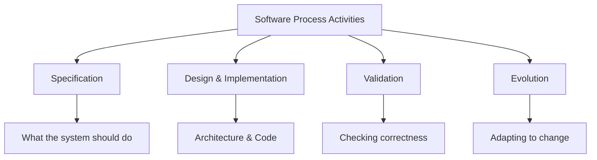
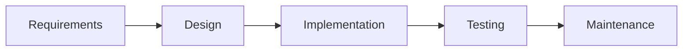
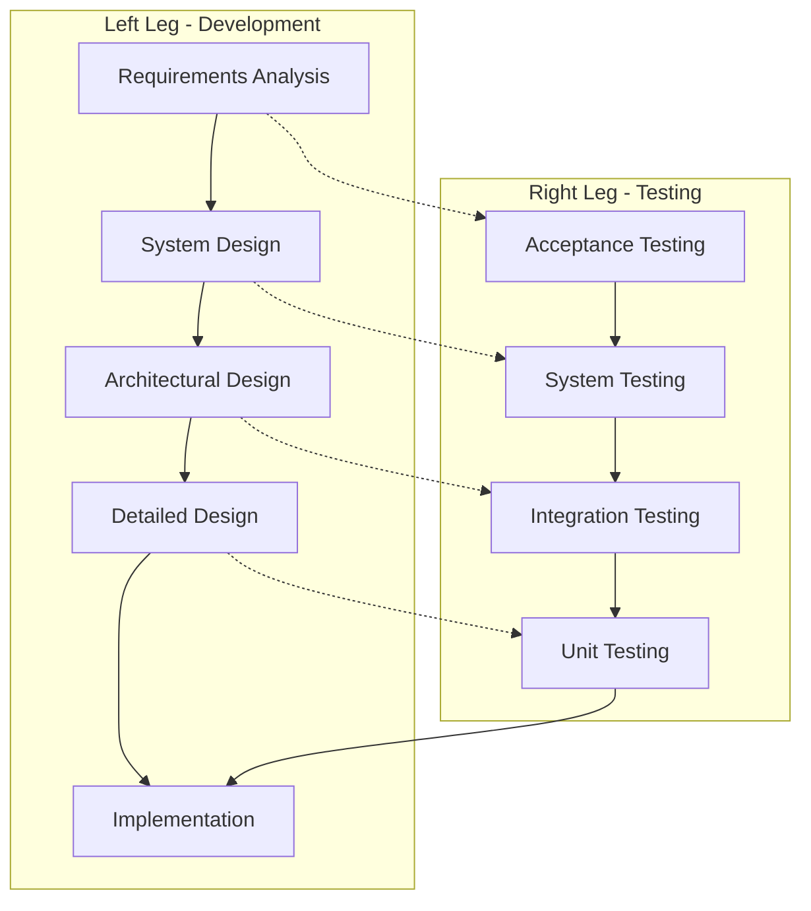
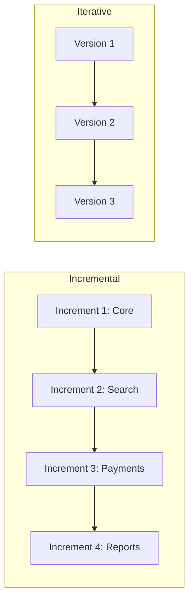
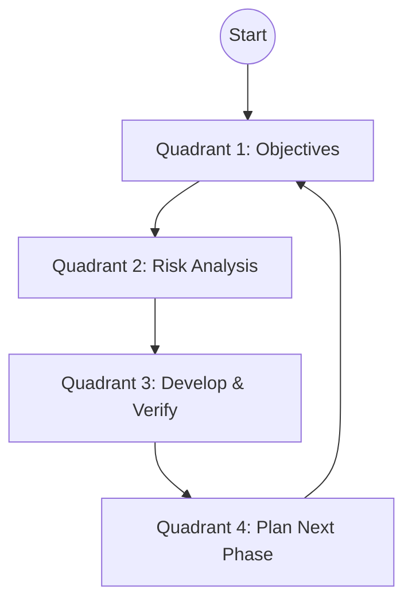
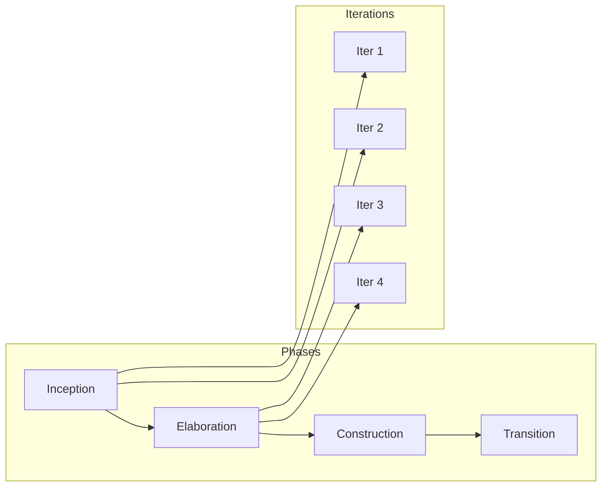
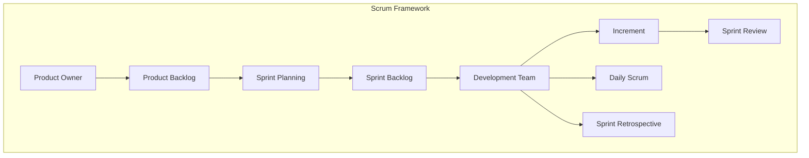
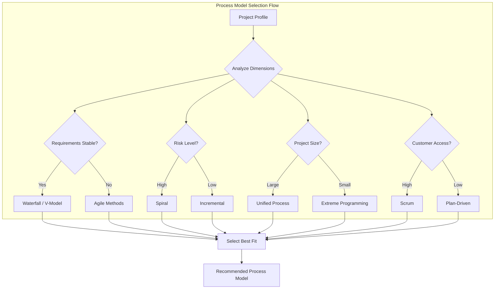

# Software Process Models

## Learning Objectives

After completing this chapter, the student will be able to:
- Differentiate between a software process and a process model
- Describe the activities common to all software processes
- Explain the Waterfall model and identify its limitations
- Contrast the V-model with the Waterfall approach
- Describe incremental and iterative development
- Explain the risk-driven nature of the Spiral model
- Describe the four phases of the Unified Process
- Articulate the principles of the Agile Manifesto
- Explain the practices of Extreme Programming
- Describe the Scrum framework including roles, events, and artefacts
- Compare process models to select an appropriate approach for a given project context
- Implement a process state machine in TypeScript

## Theory

### The Software Process

A software process is a structured set of activities required to develop a software system. These activities typically include:

- **Specification** — defining what the system should do
- **Design and implementation** — defining the system architecture and writing code
- **Validation** — checking that the system does what the customer requires
- **Evolution** — modifying the system in response to changing needs

A **software process model** is an abstract representation of a process that describes how these activities are organised and enacted. Process models range from highly structured, plan-driven approaches to flexible, iterative approaches. The choice of process model depends on project characteristics including size, complexity, requirements stability, team expertise, and organisational culture.



### The Waterfall Model

The Waterfall model, first described by Royce in 1970, presents software development as a sequence of phases: requirements definition, system and software design, implementation and unit testing, integration and system testing, and operation and maintenance. Each phase must be completed before the next begins, with formal documents produced at each stage.



**Advantages:**
- Simplicity and clarity of milestones
- Enforces discipline through documented deliverables
- Works well when requirements are well understood and unlikely to change
- Clear phase gates for management control

**Disadvantages:**
- No mechanism for iteration or feedback between phases
- Working software is not produced until late in the process
- Cannot accommodate changing requirements
- Assumes all requirements can be specified completely at the outset

**When to use:** Projects with stable requirements, simple systems, small teams, or when regulatory documentation requirements are stringent.

### The V-Model

The V-model is an extension of the Waterfall model that emphasises the relationship between development phases and testing phases. The left leg of the V represents the decomposition of requirements into design specifications, while the right leg represents the integration and testing activities that verify each level of specification.



The V-model is particularly prevalent in safety-critical and regulated domains where traceability from requirements to tests is mandatory. Standards such as IEC 61508 (functional safety) and DO-178C (avionics) effectively mandate the V-model approach.

### Incremental and Iterative Development

**Incremental development** delivers the system in small, usable increments. Each increment adds a subset of the required functionality. Customers receive working software early and can provide feedback that influences subsequent increments.

**Iterative development** revisits the same components repeatedly, refining them with each pass. Unlike incremental development, which adds new features, iterative development improves existing features.



Many modern processes combine both approaches: the system is built incrementally, and each increment is developed iteratively.

### The Spiral Model

The Spiral model, proposed by Boehm in 1988, is a **risk-driven** process model that combines elements of prototyping and the Waterfall model. The process is represented as a spiral, each loop representing one phase of development.



Each loop has four quadrants:
1. **Determining objectives, alternatives, and constraints**
2. **Evaluating alternatives and resolving risks** — prototyping and simulation
3. **Developing and verifying the product** — design, code, test
4. **Planning the next phase** — review and commitment

**Risk analysis** is the distinguishing feature. Major risks are identified and analysed in each loop. Risk-driven prototyping resolves high-risk issues before committing to full-scale development.

**When to use:** Large, complex systems where risk management is critical. The model relies on skilled risk assessment and may be impractical for small projects.

### The Unified Process

The Unified Process is an iterative and incremental framework developed by Jacobson, Booch, and Rumbaugh. It organises development into four phases:



- **Inception:** Project vision, business case, scope definition
- **Elaboration:** System architecture, major risks mitigated, detailed plan
- **Construction:** Bulk of implementation through a series of iterations
- **Transition:** Deployment to user community, beta testing, training

Each phase consists of iterations, and each iteration encompasses activities from multiple disciplines: requirements, analysis, design, implementation, and testing. The Rational Unified Process (RUP) is a commercial elaboration with detailed guidance.

### The Agile Manifesto

In 2001, seventeen software practitioners published the Agile Manifesto with four values:

1. **Individuals and interactions** over processes and tools
2. **Working software** over comprehensive documentation
3. **Customer collaboration** over contract negotiation
4. **Responding to change** over following a plan

The accompanying **twelve principles** emphasise:
- Customer satisfaction through early and continuous delivery
- Welcoming changing requirements (even late in development)
- Frequent delivery of working software (every 2 weeks to 2 months)
- Business people and developers working together daily
- Motivated individuals with trust and support
- Face-to-face conversation as the most efficient communication
- Working software as the primary measure of progress
- Sustainable development pace
- Technical excellence and good design
- Simplicity — maximising work not done
- Self-organising teams produce the best architectures
- Regular reflection and adjustment

### Extreme Programming

Extreme Programming (XP), developed by Beck, is an agile methodology that takes programming practices to extreme levels:

| Practice | Extreme Version |
|----------|----------------|
| Code reviews | Continuous pair programming |
| Testing | Tests written before code (TDD) |
| Design | Continuous refactoring |
| Integration | Continuous integration |

**Five values:** Communication, Simplicity, Feedback, Courage, Respect

**Primary practices:**
- Planning game
- Small releases
- System metaphor
- Simple design
- Test-driven development
- Refactoring
- Pair programming
- Collective code ownership
- Continuous integration
- 40-hour work week
- On-site customer
- Coding standards

### Scrum

Scrum is an agile framework for managing complex projects founded on transparency, inspection, and adaptation.



**Three Roles:**
- **Product Owner:** Maximises value, manages Product Backlog, single point of accountability
- **Development Team:** Self-organising, cross-functional, 3-9 members
- **Scrum Master:** Ensures Scrum is understood and enacted, removes impediments

**Five Events:**
- **Sprint:** Time-boxed (1-4 weeks), produces usable increment
- **Sprint Planning:** Select backlog items, define Sprint Goal
- **Daily Scrum:** 15-minute synchronisation, plan next 24 hours
- **Sprint Review:** Inspect increment, adapt backlog
- **Sprint Retrospective:** Inspect team process, plan improvements

**Three Artefacts:**
- **Product Backlog:** Ordered list of everything needed
- **Sprint Backlog:** Selected items + delivery plan
- **Increment:** Sum of all completed backlog items (potentially releasable)

### Process Model Selection Matrix

| Criterion | Waterfall | V-Model | Incremental | Spiral | Unified Process | Scrum | XP |
|-----------|-----------|---------|-------------|--------|-----------------|-------|-----|
| Requirements clarity | High | High | Low | Variable | Medium | Low | Low |
| Project size | Small | Med-Large | Med-Large | Large | Large | Small-Med | Small |
| Risk level | Low | Low | Low-Med | High | Medium | Low-Med | Low-Med |
| Customer involvement | Low | Low | Medium | Medium | Medium | High | High |
| Documentation need | High | High | Medium | High | High | Low | Low |
| Team skill required | Low | Medium | Medium | High | High | Medium | High |
| Regulatory suit. | Medium | High | Low | Medium | Medium | Low | Low |

## Examples

### Example 1: TypeScript Process State Machine

```typescript
type ProcessPhase = 'requirements' | 'design' | 'implementation' | 'testing' | 'deployment' | 'maintenance';
type ProcessModel = 'waterfall' | 'vmodel' | 'incremental' | 'spiral' | 'unified' | 'scrum' | 'xp';

interface ProcessTransition {
  from: ProcessPhase;
  to: ProcessPhase;
  condition: string;
}

class ProcessModelEngine {
  private currentPhase: ProcessPhase;
  private readonly model: ProcessModel;
  private readonly transitions: ProcessTransition[];

  constructor(model: ProcessModel) {
    this.model = model;
    this.currentPhase = 'requirements';
    this.transitions = this.defineTransitions();
  }

  private defineTransitions(): ProcessTransition[] {
    switch (this.model) {
      case 'waterfall':
        return [
          { from: 'requirements', to: 'design', condition: 'SRS approved' },
          { from: 'design', to: 'implementation', condition: 'Design document approved' },
          { from: 'implementation', to: 'testing', condition: 'Code complete' },
          { from: 'testing', to: 'deployment', condition: 'All tests pass' },
          { from: 'deployment', to: 'maintenance', condition: 'System deployed' },
        ];
      case 'scrum':
        return [
          { from: 'requirements', to: 'implementation', condition: 'Sprint planned' },
          { from: 'implementation', to: 'testing', condition: 'Increment complete' },
          { from: 'testing', to: 'deployment', condition: 'Sprint review approved' },
          { from: 'deployment', to: 'requirements', condition: 'Next Sprint starts' },
        ];
      default:
        return [];
    }
  }

  public canTransitionTo(nextPhase: ProcessPhase): boolean {
    return this.transitions.some(
      (t) => t.from === this.currentPhase && t.to === nextPhase
    );
  }

  public transitionTo(nextPhase: ProcessPhase, condition: string): boolean {
    const transition = this.transitions.find(
      (t) => t.from === this.currentPhase && t.to === nextPhase
    );
    if (!transition) {
      throw new Error(`No transition from ${this.currentPhase} to ${nextPhase}`);
    }
    if (condition !== transition.condition) {
      throw new Error(`Condition not met: expected "${transition.condition}", got "${condition}"`);
    }
    this.currentPhase = nextPhase;
    return true;
  }

  public getCurrentPhase(): ProcessPhase {
    return this.currentPhase;
  }
}

// Usage
const waterfall = new ProcessModelEngine('waterfall');
console.log(waterfall.canTransitionTo('design')); // true
waterfall.transitionTo('design', 'SRS approved');
console.log(waterfall.getCurrentPhase()); // 'design'
```

### Example 2: Agile Estimation Calculator

```typescript
interface SprintMetrics {
  plannedPoints: number;
  completedPoints: number;
  sprintNumber: number;
}

class VelocityTracker {
  private sprints: SprintMetrics[] = [];

  public recordSprint(metrics: SprintMetrics): void {
    this.sprints.push(metrics);
  }

  public getAverageVelocity(): number {
    if (this.sprints.length === 0) return 0;
    const total = this.sprints.reduce((sum, s) => sum + s.completedPoints, 0);
    return total / this.sprints.length;
  }

  public predictSprintsRequired(remainingPoints: number): number {
    const velocity = this.getAverageVelocity();
    if (velocity === 0) return Infinity;
    return Math.ceil(remainingPoints / velocity);
  }

  public getVelocityTrend(): number[] {
    return this.sprints.map((s) => s.completedPoints);
  }
}

// Usage
const tracker = new VelocityTracker();
tracker.recordSprint({ plannedPoints: 30, completedPoints: 28, sprintNumber: 1 });
tracker.recordSprint({ plannedPoints: 30, completedPoints: 32, sprintNumber: 2 });
tracker.recordSprint({ plannedPoints: 30, completedPoints: 27, sprintNumber: 3 });
console.log(tracker.predictSprintsRequired(100)); // ~4 sprints
```

### Case Study: Waterfall in Government Systems

A government agency contracted the development of a tax processing system. The requirements were specified in a 500-page document and were not expected to change. The Waterfall model was chosen because the fixed-price contract required firm specifications, and the regulatory environment demanded extensive documentation. The project completed on schedule but revealed significant usability problems during acceptance testing.

### Case Study: Spiral Model in Aerospace

An aerospace company developing flight control software adopted the Spiral model. Each spiral loop addressed specific technical risks, including sensor fusion accuracy, real-time performance guarantees, and fault tolerance. The project delivered a high-quality system but required experienced risk managers.

### Case Study: Scrum at a Fintech Startup

A fintech startup developing a mobile payments app adopted Scrum with 2-week Sprints. The Product Owner maintained a prioritised backlog. The team of 6 developers achieved a velocity of 35 story points per Sprint. After 8 Sprints, they released a minimum viable product with core payment functionality.

## Risk Analysis Per Model

| Model | Primary Risk | Mitigation Strategy |
|-------|-------------|---------------------|
| Waterfall | Requirements volatility | Fixed-price contracts, freeze deadlines |
| V-Model | Missing traceability | Automated traceability tools |
| Incremental | Integration complexity | Continuous integration |
| Spiral | Inadequate risk assessment | Experienced risk managers |
| Unified Process | Process overhead | Tool support, tailoring |
| Scrum | Scope creep | Time-boxed Sprints, velocity tracking |
| XP | Pair programming fatigue | Rotate pairs, limit pair time |

## Process Model Selection Simulator

```typescript
type ProjectProfile = {
  requirementsClarity: 'high' | 'medium' | 'low';
  projectSize: 'small' | 'medium' | 'large';
  riskLevel: 'low' | 'medium' | 'high';
  customerInvolvement: 'low' | 'medium' | 'high';
  documentationNeed: 'low' | 'medium' | 'high';
  teamSkill: 'low' | 'medium' | 'high';
  regulatorySuitability: 'low' | 'medium' | 'high';
  teamSize: number;
  timelineMonths: number;
  budgetMillions: number;
};

type ModelScore = { model: string; score: number; strengths: string[]; risks: string[] };

class ProcessModelSelector {
  private readonly weights = {
    requirementsClarity: 0.2,
    projectSize: 0.1,
    riskLevel: 0.15,
    customerInvolvement: 0.1,
    documentationNeed: 0.1,
    teamSkill: 0.1,
    regulatorySuitability: 0.15,
    timelineUrgency: 0.1,
  };

  public recommend(project: ProjectProfile): ModelScore[] {
    const candidates = [
      this.evaluateWaterfall(project),
      this.evaluateVModel(project),
      this.evaluateIncremental(project),
      this.evaluateSpiral(project),
      this.evaluateUnified(project),
      this.evaluateScrum(project),
      this.evaluateXP(project),
    ];
    return candidates.sort((a, b) => b.score - a.score);
  }

  private scoreValue(value: string): number {
    const map: Record<string, number> = { high: 3, medium: 2, low: 1 };
    return map[value] ?? 1;
  }

  private evaluateWaterfall(p: ProjectProfile): ModelScore {
    const clarityScore = this.scoreValue(p.requirementsClarity) === 3 ? 3 : 1;
    const docScore = this.scoreValue(p.documentationNeed) === 3 ? 3 : 1;
    const riskScore = this.scoreValue(p.riskLevel) <= 2 ? 3 : 1;
    const total = clarityScore * 3 + docScore * 2 + riskScore * 2;
    return {
      model: 'Waterfall',
      score: total,
      strengths: ['Clear milestones', 'Strong documentation', 'Predictable timeline'],
      risks: ['No iteration', 'Late working software', 'Cannot accommodate changes'],
    };
  }

  private evaluateVModel(p: ProjectProfile): ModelScore {
    const regScore = this.scoreValue(p.regulatorySuitability) === 3 ? 3 : 1;
    const clarityScore = this.scoreValue(p.requirementsClarity) >= 2 ? 3 : 1;
    const total = regScore * 4 + clarityScore * 3 + (p.teamSize > 20 ? 2 : 1);
    return {
      model: 'V-Model',
      score: total,
      strengths: ['Full traceability', 'Test-design linkage', 'Regulatory compliance'],
      risks: ['Heavy documentation', 'Slow to change', 'Expensive overhead'],
    };
  }

  private evaluateIncremental(p: ProjectProfile): ModelScore {
    const changeScore = this.scoreValue(p.requirementsClarity) <= 2 ? 3 : 1;
    const sizeScore = p.projectSize === 'large' ? 3 : 1;
    const total = changeScore * 3 + sizeScore * 2 + this.scoreValue(p.customerInvolvement);
    return {
      model: 'Incremental',
      score: total,
      strengths: ['Early value delivery', 'Flexible scope', 'User feedback'],
      risks: ['Integration complexity', 'Refactoring needed', 'Architecture drift'],
    };
  }

  private evaluateSpiral(p: ProjectProfile): ModelScore {
    const riskScore = this.scoreValue(p.riskLevel) === 3 ? 3 : 1;
    const skillScore = this.scoreValue(p.teamSkill) === 3 ? 3 : 1;
    const sizeScore = p.projectSize === 'large' ? 3 : 1;
    const total = riskScore * 4 + skillScore * 3 + sizeScore * 2;
    return {
      model: 'Spiral',
      score: total,
      strengths: ['Risk mitigation', 'Handles complexity', 'Adaptive planning'],
      risks: ['Requires expert risk managers', 'Expensive', 'Hard to sell to clients'],
    };
  }

  private evaluateUnified(p: ProjectProfile): ModelScore {
    const sizeScore = p.projectSize === 'large' ? 3 : 1;
    const skillScore = this.scoreValue(p.teamSkill) >= 2 ? 3 : 1;
    const total = sizeScore * 3 + skillScore * 3 + this.scoreValue(p.documentationNeed) * 2;
    return {
      model: 'Unified Process',
      score: total,
      strengths: ['Architecture focus', 'Iterative', 'Risk mitigation'],
      risks: ['Process overhead', 'Complex tooling', 'Steep learning curve'],
    };
  }

  private evaluateScrum(p: ProjectProfile): ModelScore {
    const customerScore = this.scoreValue(p.customerInvolvement) === 3 ? 3 : 1;
    const changeScore = this.scoreValue(p.requirementsClarity) <= 2 ? 3 : 1;
    const sizeScore = p.projectSize !== 'large' ? 3 : 1;
    const total = customerScore * 3 + changeScore * 3 + sizeScore * 2;
    return {
      model: 'Scrum',
      score: total,
      strengths: ['Adapts to change', 'Customer collaboration', 'Fast feedback'],
      risks: ['Scope creep', 'Requires committed PO', 'Less documentation'],
    };
  }

  private evaluateXP(p: ProjectProfile): ModelScore {
    const changeScore = this.scoreValue(p.requirementsClarity) <= 2 ? 3 : 1;
    const skillScore = this.scoreValue(p.teamSkill) === 3 ? 3 : 1;
    const total = changeScore * 3 + skillScore * 3 + (p.teamSize <= 10 ? 2 : 0);
    return {
      model: 'XP',
      score: total,
      strengths: ['Technical excellence', 'Continuous testing', 'Collective ownership'],
      risks: ['Pair programming fatigue', 'Requires discipline', 'Scales poorly'],
    };
  }
}

function simulateProcessSelection(): void {
  const selector = new ProcessModelSelector();
  const startupProject: ProjectProfile = {
    requirementsClarity: 'low',
    projectSize: 'small',
    riskLevel: 'medium',
    customerInvolvement: 'high',
    documentationNeed: 'low',
    teamSkill: 'medium',
    regulatorySuitability: 'low',
    teamSize: 6,
    timelineMonths: 6,
    budgetMillions: 0.5,
  };
  const results = selector.recommend(startupProject);
  console.log('=== Process Model Recommendation for Startup ===');
  for (const r of results) {
    console.log(`${r.model}: ${r.score} pts`);
    console.log(`  Strengths: ${r.strengths.join(', ')}`);
    console.log(`  Risks: ${r.risks.join(', ')}`);
  }
}
```



### TypeScript: SDLC Model Selector

```typescript
interface ProjectProfile {
  requirementsStability: "stable" | "volatile" | "emerging";
  riskLevel: "low" | "medium" | "high";
  teamSize: "small" | "medium" | "large";
  customerInvolvement: "low" | "medium" | "high";
  deliveryCadence: "single" | "incremental" | "continuous";
}

interface ProcessModel {
  name: string;
  suitability: number;
  description: string;
}

function recommendModel(profile: ProjectProfile): ProcessModel[] {
  const scores: ProcessModel[] = [
    { name: "Waterfall", suitability: 0, description: "Linear sequential phases" },
    { name: "V-Model", suitability: 0, description: "Verification & validation focus" },
    { name: "Incremental", suitability: 0, description: "Build in increments" },
    { name: "Spiral", suitability: 0, description: "Risk-driven iterations" },
    { name: "RUP", suitability: 0, description: "Architecture-centric iterative" },
    { name: "Scrum", suitability: 0, description: "Sprint-based agile" },
    { name: "XP", suitability: 0, description: "Engineering-practice agile" },
    { name: "Kanban", suitability: 0, description: "Flow-based delivery" },
  ];
  if (profile.requirementsStability === "stable") scores[0].suitability += 3;
  if (profile.requirementsStability === "volatile") { scores[4].suitability += 3; scores[5].suitability += 2; }
  if (profile.requirementsStability === "emerging") { scores[2].suitability += 3; scores[6].suitability += 2; }
  if (profile.riskLevel === "high") scores[3].suitability += 3;
  if (profile.customerInvolvement === "high") { scores[5].suitability += 2; scores[6].suitability += 2; }
  if (profile.deliveryCadence === "continuous") { scores[7].suitability += 3; scores[5].suitability += 1; }
  return scores.sort((a, b) => b.suitability - a.suitability);
}

const project: ProjectProfile = {
  requirementsStability: "volatile",
  riskLevel: "medium",
  teamSize: "small",
  customerInvolvement: "high",
  deliveryCadence: "incremental",
};
console.log(recommendModel(project).slice(0, 3));

// === Process Type Comparator ===
interface ProcessDimension {
  dimension: string;
  waterfall: string;
  agile: string;
  spiral: string;
}
const processComparison: ProcessDimension[] = [
  { dimension: "Requirements", waterfall: "Fixed upfront", agile: "Evolving backlog", spiral: "Risk-refined" },
  { dimension: "Delivery", waterfall: "Single release", agile: "Frequent increments", spiral: "Prototype cycles" },
  { dimension: "Customer", waterfall: "At milestones", agile: "Continuous", spiral: "Risk review points" },
  { dimension: "Team size", waterfall: "Large possible", agile: "Small preferred", spiral: "Medium" },
  { dimension: "Risk mgmt", waterfall: "Implicit", agile: "Via adaptation", spiral: "Explicit driver" },
  { dimension: "Documentation", waterfall: "Heavy", agile: "Minimal", spiral: "Risk-based" },
];
function compareProcesses(a: string, b: string): string[] {
  return processComparison
    .filter((d) => (d as any)[a] !== (d as any)[b])
    .map((d) => `${d.dimension}: ${(d as any)[a]} vs ${(d as any)[b]}`);
}
console.log(compareProcesses("waterfall", "agile"));

// === Methodology Quizzer ===
const quiz = [
  { q: "Which model introduces explicit risk management?", a: "Spiral" },
  { q: "Which model has verification on one leg and validation on the other?", a: "V-Model" },
  { q: "Which methodology uses sprints of fixed duration?", a: "Scrum" },
  { q: "Which model delivers working software in repeated cycles?", a: "Incremental" },
  { q: "Which model separates create, evaluate, and anchor phases?", a: "Spiral" },
];
function checkAnswer(question: string, answer: string): boolean {
  const entry = quiz.find((q) => q.q === question);
  return entry?.a.toLowerCase() === answer.toLowerCase();
}
console.log(checkAnswer("Which model introduces explicit risk management?", "Spiral")); // true
```

### TypeScript: Process Model Simulator

```typescript
// === Process Model Phase Simulator ===
interface Phase { name: string; duration: number; predecessors: string[]; completed: boolean; }
class ProcessSimulator {
  private phases: Phase[] = [];
  private time = 0;
  addPhase(name: string, duration: number, predecessors: string[] = []): void {
    this.phases.push({ name, duration, predecessors, completed: false });
  }
  getEarliestStart(name: string): number {
    const phase = this.phases.find(p => p.name === name);
    if (!phase || phase.predecessors.length === 0) return 0;
    return Math.max(...phase.predecessors.map(p => {
      const pred = this.phases.find(ph => ph.name === p);
      return pred ? pred.duration : 0;
    }));
  }
  getCriticalPath(): string[] {
    const dp = new Map<string, { duration: number; path: string[] }>();
    const topo: string[] = [];
    const visited = new Set<string>();
    const dfs = (name: string): void => {
      if (visited.has(name)) return;
      visited.add(name);
      const phase = this.phases.find(p => p.name === name);
      if (phase) for (const pred of phase.predecessors) dfs(pred);
      topo.push(name);
    };
    for (const p of this.phases) dfs(p.name);
    for (const name of topo) {
      const phase = this.phases.find(p => p.name === name)!;
      let maxPred = 0;
      let bestPath: string[] = [];
      for (const pred of phase.predecessors) {
        const prev = dp.get(pred);
        if (prev && prev.duration > maxPred) { maxPred = prev.duration; bestPath = prev.path; }
      }
      dp.set(name, { duration: maxPred + phase.duration, path: [...bestPath, name] });
    }
    return [...dp.values()].reduce((a, b) => a.duration > b.duration ? a : b).path;
  }
  simulate(): { totalTime: number; criticalPath: string[]; phaseSchedule: { name: string; start: number; end: number }[] } {
    const criticalPath = this.getCriticalPath();
    const phaseSchedule = this.phases.map(p => {
      const start = this.getEarliestStart(p.name);
      return { name: p.name, start, end: start + p.duration };
    });
    return { totalTime: Math.max(...phaseSchedule.map(p => p.end)), criticalPath, phaseSchedule };
  }
}
const waterfall = new ProcessSimulator();
waterfall.addPhase("Requirements", 10);
waterfall.addPhase("Design", 15, ["Requirements"]);
waterfall.addPhase("Implementation", 30, ["Design"]);
waterfall.addPhase("Testing", 15, ["Implementation"]);
waterfall.addPhase("Deployment", 5, ["Testing"]);
watershed.simulate();
console.log("Critical path:", waterfallEntry.getCriticalPath());
// The simulator shows Waterfall's serial nature: critical path = all phases
```

## Summary

Software process models provide structure and guidance for development activities. No single model is appropriate for all projects. The Waterfall model offers simplicity but lacks flexibility. The V-model emphasises verification and traceability. Incremental and iterative approaches deliver early value and accommodate change. The Spiral model incorporates explicit risk management. The Unified Process provides an iterative, architecture-centric framework. Agile methods (Scrum, XP) prioritise people, working software, and responsiveness to change. The selection of a process model should be based on project characteristics including requirements stability, risk profile, team size, and organisational context.

## Practical Takeaways

1. **No single model fits all projects** — evaluate requirements stability, risk profile, and team size before choosing
2. **Hybrid models are common** — many teams blend plan-driven and agile elements (e.g., Waterfall requirements + Scrum development)
3. **Risk-driven selection** — high-risk projects need more iterative feedback loops
4. **Regulatory constraints matter** — safety-critical domains often mandate V-model or strict documentation
5. **Start agile, add ceremony as needed** — begin with Scrum/XP, introduce formal documentation only where justified
6. **Process is a tool, not a goal** — any model must be adapted to context, not followed blindly

## Chapter Quiz

**Q1: Which process model is characterised by formal phase gates and no iteration between phases?**
- A) Spiral Model
- B) Waterfall Model
- C) Unified Process
- D) Scrum

**Answer: B** — The Waterfall model requires each phase to complete before the next begins, with no mechanism for iteration.

**Q2: What is the distinguishing feature of the Spiral model?**
- A) Fixed-length iterations
- B) Explicit risk analysis in each loop
- C) Pair programming
- D) Use case-driven development

**Answer: B** — Risk analysis is the defining characteristic of the Spiral model, with each loop identifying and resolving major risks.

**Q3: In Scrum, who is responsible for maximising the value of the product?**
- A) Scrum Master
- B) Development Team
- C) Product Owner
- D) Project Manager

**Answer: C** — The Product Owner is accountable for maximising product value through backlog management and prioritisation.

**Q4: Which of the following is NOT a value of Extreme Programming?**
- A) Communication
- B) Documentation
- C) Simplicity
- D) Courage

**Answer: B** — XP values communication, simplicity, feedback, courage, and respect. Comprehensive documentation is de-emphasised.

**Q5: The V-model is particularly well-suited for:**
- A) Startups with rapidly changing requirements
- B) Safety-critical systems requiring full traceability
- C) Small experimental projects
- D) Open-source community projects

**Answer: B** — The V-model's explicit links between development and testing phases make it ideal for regulated domains.

## Exercises

### Review Questions

1. What are the four fundamental activities common to all software processes?
2. Under what circumstances is the Waterfall model appropriate?
3. How does the V-model enforce traceability between requirements and tests?
4. Distinguish between incremental and iterative development.
5. What is the role of risk analysis in the Spiral model?
6. Name the four phases of the Unified Process and describe the purpose of each.
7. List the four values of the Agile Manifesto.
8. What are the five values of Extreme Programming?
9. Describe the three roles defined by Scrum.
10. What is the purpose of the Sprint Retrospective?

### Application Problems

1. A startup is developing a mobile application for social event discovery. Requirements are expected to evolve rapidly. Recommend a process model and justify your choice. Write a TypeScript class that models the process lifecycle for your chosen model.

2. A defence contractor must develop software for an avionics system satisfying strict regulatory standards. Compare the suitability of the V-model and Scrum. Extend the `ProcessModelEngine` class to support the V-model.

3. Construct a process model selection matrix for a hospital management system with 500,000 lines of estimated code, moderate requirements stability, and a distributed development team.

4. Implement a Scrum Sprint simulation in TypeScript that tracks a Product Backlog, Sprint planning, daily progress, and Sprint review.

### Challenge Problem

A large financial institution plans to replace its core banking system over a three-year period. The system must interface with dozens of existing subsystems, comply with multiple regulatory frameworks, and support a gradual migration from legacy systems. Propose a hybrid process model that combines elements from the Spiral model, the Unified Process, and agile practices. Justify each element with specific reference to the project characteristics. Describe how you would manage the tensions between plan-driven and agile elements. Implement a TypeScript hybrid process engine that supports configurable phase transitions with risk gates.

