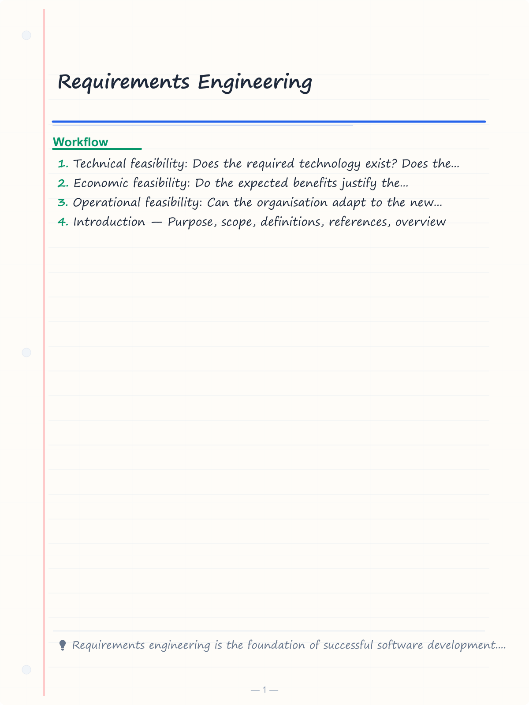
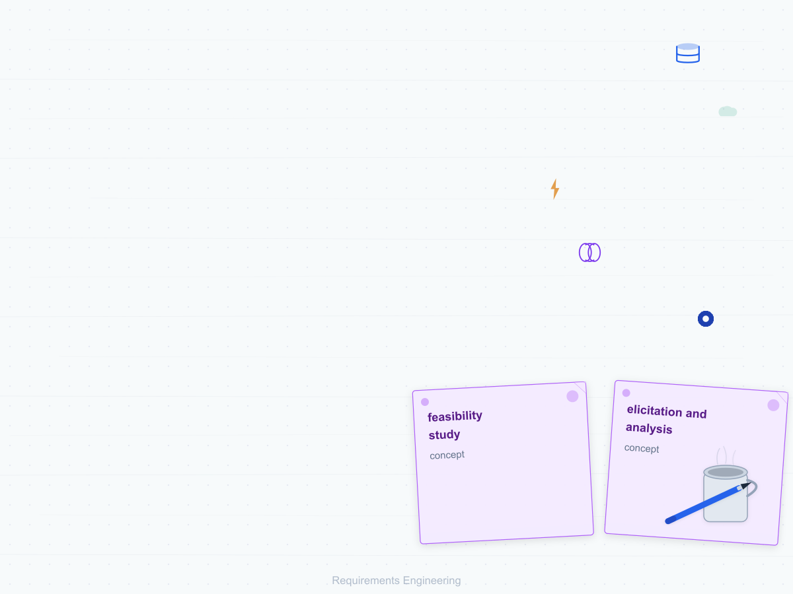
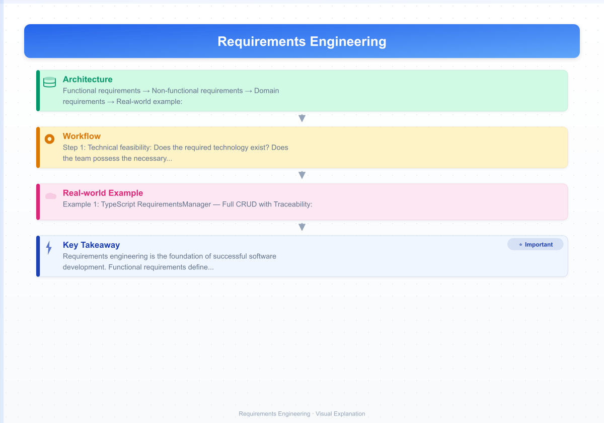
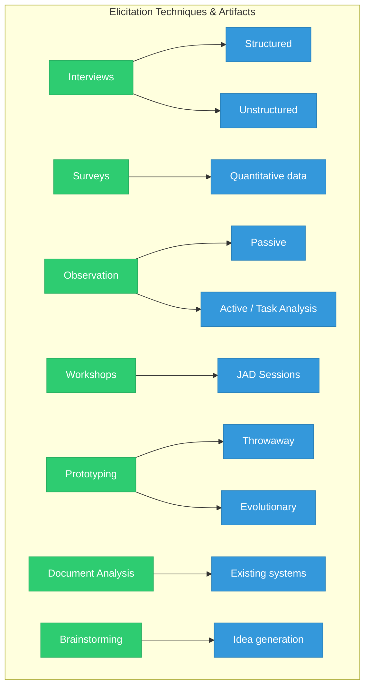
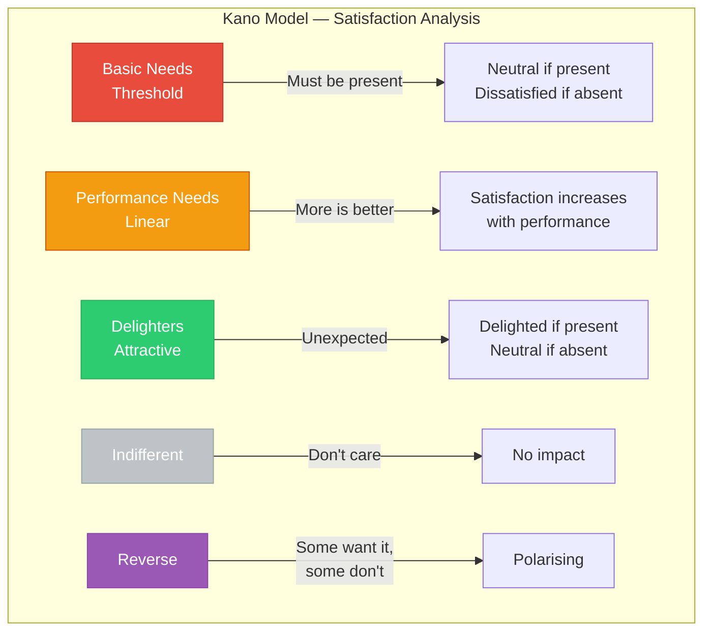
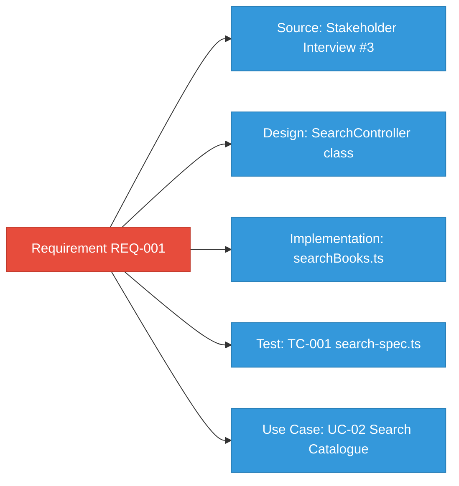
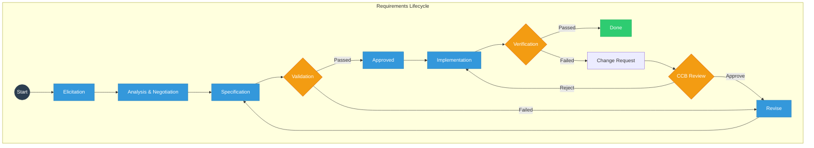
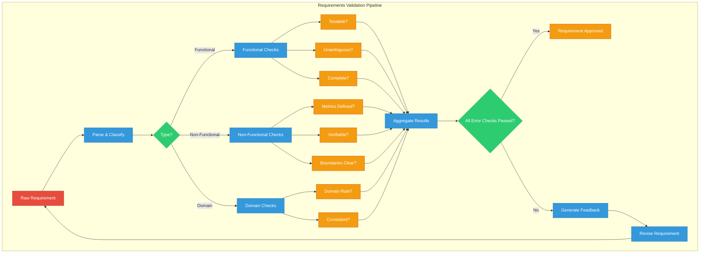

# Requirements Engineering

## Learning Objectives

> ✅ After completing this chapter, the student will be able to:
> - Classify requirements as functional, non-functional, and domain requirements
> - Apply FURPS+ classification to organise requirements comprehensively
> - Conduct a feasibility study for a proposed software system across technical, economic, and operational dimensions
> - Select and apply appropriate elicitation techniques based on project context
> - Specify requirements using IEEE 830 format, user stories with INVEST criteria, and use cases
> - Apply MoSCoW prioritisation and the Kano model to manage stakeholder expectations
> - Perform requirements validation through reviews, prototyping, and automated checks
> - Manage requirements through traceability, versioning, and change control processes
> - Implement a full RequirementsManager with CRUD, traceability, and prioritisation in TypeScript
> - Build automated validation pipelines that check SMART criteria, consistency, and completeness
> - Generate use cases from user stories and manage requirements evolution

<!-- Image Gallery -->
<section class="lesson-visuals" aria-label="Visual learning resources">
  <header><span>VISUAL LEARNING</span><h2>See it. Review it. Remember it.</h2></header>
  <a class="lesson-visual-card" href="../../assets/images/lessons/software-engineering/02-requirements/handwritten-notes.png" target="_blank" rel="noopener">
    
    <span><strong>Handwritten notes</strong>Condensed notes for deliberate review.</span>
  </a>
  <a class="lesson-visual-card" href="../../assets/images/lessons/software-engineering/02-requirements/sticky-notes.png" target="_blank" rel="noopener">
    
    <span><strong>Sticky-note revision</strong>Fast recall prompts for revision.</span>
  </a>
  <a class="lesson-visual-card" href="../../assets/images/lessons/software-engineering/02-requirements/visual-explanation.png" target="_blank" rel="noopener">
    
    <span><strong>Visual concept guide</strong>A connected explanation of the key ideas.</span>
  </a>
</section>
<!-- End Image Gallery -->

## Theory

### The Requirements Engineering Process

Requirements engineering is the branch of software engineering concerned with the real-world goals for, functions of, and constraints on a software system. It encompasses the set of activities from problem understanding through to the production of a validated specification.


The requirements engineering process comprises four high-level activities: **feasibility study**, **elicitation and analysis**, **specification**, and **validation**. These activities are interleaved, iterative, and must be revisited as understanding evolves. Industry data suggests that 40-60% of software defects originate in the requirements phase, making investment in this phase one of the highest-ROI activities in software engineering.

### Types of Requirements

Requirements are classified into three categories:

**Functional requirements** describe the services the system should provide, how it should react to particular inputs, and how it should behave in specific situations. Example: *"The system shall allow registered borrowers to search the catalogue by author, title, or subject."*

**Non-functional requirements** are constraints on the services or functions offered by the system. They encompass quality attributes such as performance, security, availability, usability, and maintainability. These are often more critical than functional requirements — a system that fails to meet a non-functional requirement may be unacceptable even if all functions work correctly. For example, an e-commerce site that loads in 10 seconds will lose customers regardless of its feature set.

**Domain requirements** reflect the characteristics of the application domain. They may be functional or non-functional and are derived from the domain context. Example: *"Interest must be calculated on a daily basis using the compound interest formula."*

### FURPS+ Classification

FURPS+ is a comprehensive taxonomy for classifying requirements originally developed by Hewlett-Packard:

| Category | Subcategories | Example |
|----------|---------------|---------|
| **F**unctionality | Features, capabilities, security | "System shall support OAuth2 authentication with PKCE flow" |
| **U**sability | Human factors, aesthetics, documentation, training | "95% of users shall complete checkout in under 3 minutes on first use" |
| **R**eliability | Availability, accuracy, recoverability, fault tolerance | "System uptime shall be 99.9% (8.76 hours downtime/year max)" |
| **P**erformance | Response time, throughput, resource usage, scalability | "Search results returned within 2 seconds at 90th percentile under 1,000 concurrent users" |
| **S**upportability | Testability, maintainability, configurability, extensibility | "System shall support hot-deploy of configuration changes without restart" |
| **+** | Design constraints, interface, physical, legal, security | "Must run on Linux x86_64; comply with GDPR Article 17 right to erasure" |

FURPS+ is valuable because it forces teams to explicitly consider all quality dimensions, not just functionality. A system that meets all functional requirements but fails on usability or performance is still a failed system.

### Feasibility Study

A feasibility study assesses whether a proposed software project is viable across three dimensions:

1. **Technical feasibility:** Does the required technology exist? Does the team possess the necessary skills? Can the system integrate with existing infrastructure?
2. **Economic feasibility:** Do the expected benefits justify the investment? Common techniques include cost-benefit analysis (CBA), return on investment (ROI), net present value (NPV), and payback period.
3. **Operational feasibility:** Can the organisation adapt to the new system? Will users accept it? Does management support the change?

The output is a feasibility report recommending whether to proceed, with risk assessment and alternative recommendations.

**Real-world example:** A hospital evaluating an AI-based diagnostic tool must assess technical feasibility (is the training data available?), economic feasibility (will fewer misdiagnoses save more than the system costs?), and operational feasibility (will doctors trust and use the AI suggestions?).

### Requirements Elicitation

Elicitation is the process of discovering requirements from stakeholders. Multiple techniques exist, each with strengths:



| Technique | Strengths | Limitations | Best For |
|-----------|-----------|-------------|----------|
| **Interviews** | Build rapport, explore tacit knowledge | Time-consuming, may miss unarticulated needs | Complex domains, key stakeholders |
| **Surveys** | Large sample, quantitative data | Limited depth, low response rates | Validating assumptions at scale |
| **Observation** | Discover implicit requirements | Hawthorne effect, time-intensive | Understanding actual workflows |
| **Workshops/JAD** | Rapid consensus, conflict resolution | Requires facilitation skill, dominant personalities | Aligning diverse stakeholder groups |
| **Prototyping** | Clarify vague requirements | Users may fixate on prototype UI | UI-heavy or innovative systems |
| **Document analysis** | Inexpensive, historical insight | Documentation may be outdated | Legacy system replacement |

### The INVEST Criteria for User Stories

Good user stories follow the **INVEST** principle:

| Criterion | Meaning | Anti-pattern |
|-----------|---------|--------------|
| **I**ndependent | Story can be developed independently | Story depends on 3 other stories |
| **N**egotiable | Details can be discussed and refined | Story specifies exact UI pixels |
| **V**aluable | Delivers clear value to stakeholder | "Update database schema" (tech-only) |
| **E**stimable | Team can estimate effort | "Build an AI" (too vague) |
| **S**mall | Fits within a single sprint | "Build the entire payment system" |
| **T**estable | Acceptance criteria can be verified | "Make it user-friendly" |

User stories are a lightweight specification format used in agile methods:

```
Template: As a [role], I want [goal] so that [benefit].
```

Example with acceptance criteria using **Gherkin** syntax:

```gherkin
Feature: Book Search
  As a library patron
  I want to search for books by title, author, or subject
  So that I can find materials relevant to my research

  Scenario: Search by exact title
    Given I am on the library search page
    When I search for "Software Engineering"
    Then I should see results with the exact title "Software Engineering"
    And the results should display title, author, publication year, and availability

  Scenario: Search with partial match
    Given I am on the library search page
    When I search for "Engineer"
    Then I should see results containing "Engineer" in the title
    And results should be returned within 3 seconds
```

### Requirements Specification Formats

#### IEEE 830 SRS Format

1. **Introduction** — Purpose, scope, definitions, references, overview
2. **General Description** — Product perspective, user characteristics, constraints, assumptions, dependencies
3. **Specific Requirements** — Functional requirements (by mode/feature), external interface requirements, performance requirements, design constraints, software system attributes (security, reliability, maintainability, portability)
4. **Appendices** — Glossary, models, issues list

#### Use Cases

Use cases describe interactions between actors and the system:

| Element | Description |
|---------|-------------|
| **Use Case Name** | Verb + Noun (e.g., "Borrow Book") |
| **Primary Actor** | Who initiates the interaction |
| **Preconditions** | What must be true before execution |
| **Main Success Scenario** | Normal flow of events |
| **Alternative Flows** | Variations and error paths |
| **Postconditions** | What must be true after execution |

### MoSCoW Prioritisation

MoSCoW is a prioritisation technique that categorises requirements:

| Category | Meaning | Allocation | Example |
|----------|---------|------------|---------|
| **M**ust have | Critical for launch | ~60% of effort | User authentication |
| **S**hould have | Important but not critical | ~20% of effort | Email notifications |
| **C**ould have | Nice to have | ~20% of effort | Dark mode theme |
| **W**on't have | Explicitly excluded this time | 0% | iOS app (web only first) |

MoSCoW is typically applied at the release level, not for the entire project. Requirements can move between categories across releases as priorities shift.

### The Kano Model

The Kano model, developed by Noriaki Kano, categorises requirements by their effect on customer satisfaction:



- **Basic Needs (Threshold):** Expected features — their absence causes dissatisfaction. Example: brakes on a car.
- **Performance Needs:** Features where better performance increases satisfaction. Example: battery life on a phone.
- **Delighters (Attractive):** Unexpected features that delight customers. Example: free charging cable in the box.
- **Indifferent:** Features that neither delight nor frustrate.
- **Reverse:** Features that some users want and others actively dislike.

The key insight: over time, delighters become performance needs, and performance needs become basic needs. Yesterday's competitive advantage is today's table stakes.

### Requirements Validation

Validation ensures the specified requirements accurately reflect stakeholder needs:

| Technique | Description | When to Use |
|-----------|-------------|-------------|
| **Requirements reviews** | Stakeholders inspect the specification for defects | After every major revision |
| **Prototyping** | Users interact with a mock-up to confirm understanding | When requirements are vague |
| **Test-case generation** | Writing tests against requirements exposes inconsistencies | Before implementation |
| **Checklists** | Standard question sets to catch common defects | Throughout the process |
| **Formal inspection** | Structured, metrics-driven review with defined roles | For critical/regulated systems |

Common defects detected:
- **Omission:** Necessary requirement is missing
- **Inconsistency:** Requirements contradict each other
- **Ambiguity:** Requirement can be interpreted multiple ways
- **Duplication:** Same requirement appears multiple times
- **Infeasibility:** Requirement cannot be implemented within constraints
- **Over-specification:** Requirement unnecessarily constrains the design

### SMART Requirements

A well-formed requirement should be **SMART**:

| Criterion | Meaning | Example |
|-----------|---------|---------|
| **S**pecific | Clear, precise, unambiguous | "The system shall..." not "It should..." |
| **M**easurable | Can be verified quantitatively | "Within 2 seconds" not "Quickly" |
| **A**chievable | Realistic within constraints | Feasible with available technology |
| **R**elevant | Aligned with business goals | Supports a stakeholder need |
| **T**ime-bound | Has a timeframe or deadline | "By release 2.0" |

### Requirements Traceability Matrix

A Requirements Traceability Matrix (RTM) links requirements to their sources, design artefacts, implementation, and tests:



### Requirements Management

Requirements management encompasses maintaining the specification as the system evolves:

- **Traceability:** Links requirements to sources, design, code, and tests
- **Prioritisation:** MoSCoW, Kano model, AHP for relative importance
- **Change control:** CCB reviews proposed changes, assesses impact on cost/schedule
- **Baselining:** Freezing requirements at specific milestones
- **Versioning:** Tracking changes across requirement revisions

### Requirements Engineering Workflow



## Examples

### Example 1: TypeScript RequirementsManager — Full CRUD with Traceability

```typescript
type RequirementType = 'functional' | 'non-functional' | 'domain';
type Priority = 'MUST' | 'SHOULD' | 'COULD' | 'WONT';
type KanoCategory = 'basic' | 'performance' | 'excitement' | 'indifferent' | 'reverse';
type Status = 'proposed' | 'approved' | 'implemented' | 'verified' | 'rejected';

interface Requirement {
  id: string;
  title: string;
  description: string;
  type: RequirementType;
  priority: Priority;
  kanoCategory: KanoCategory;
  status: Status;
  source: string;
  owner: string;
  createdAt: Date;
  updatedAt: Date;
  version: number;
  traceabilityLinks: TraceabilityLink[];
  acceptanceCriteria: string[];
}

interface TraceabilityLink {
  targetId: string;
  targetType: 'design' | 'implementation' | 'test' | 'source' | 'useCase';
  description: string;
}

interface ChangeLogEntry {
  reqId: string;
  version: number;
  action: string;
  detail: string;
  timestamp: Date;
  user: string;
}

class RequirementsManager {
  private requirements: Map<string, Requirement> = new Map();
  private changeLog: ChangeLogEntry[] = [];
  private nextId = 1;

  public addRequirement(
    req: Omit<Requirement, 'id' | 'createdAt' | 'updatedAt' | 'version'>,
    user: string = 'system'
  ): Requirement {
    const id = `REQ-${String(this.nextId++).padStart(4, '0')}`;
    const requirement: Requirement = {
      ...req,
      id,
      createdAt: new Date(),
      updatedAt: new Date(),
      version: 1,
      traceabilityLinks: req.traceabilityLinks ?? [],
      acceptanceCriteria: req.acceptanceCriteria ?? [],
    };
    this.requirements.set(id, requirement);
    this.logChange(id, 'CREATED', `Requirement created: ${req.title}`, user);
    return requirement;
  }

  public getRequirement(id: string): Requirement | undefined {
    return this.requirements.get(id);
  }

  public updateRequirement(
    id: string,
    updates: Partial<Pick<Requirement, 'description' | 'priority' | 'status' | 'acceptanceCriteria' | 'kanoCategory'>>,
    user: string = 'system'
  ): Requirement {
    const req = this.requirements.get(id);
    if (!req) throw new Error(`Requirement ${id} not found`);
    const updated: Requirement = {
      ...req,
      ...updates,
      updatedAt: new Date(),
      version: req.version + 1,
    };
    this.requirements.set(id, updated);
    this.logChange(id, 'UPDATED', JSON.stringify(updates), user);
    return updated;
  }

  public addTraceabilityLink(
    reqId: string,
    targetId: string,
    targetType: TraceabilityLink['targetType'],
    description: string
  ): void {
    const req = this.requirements.get(reqId);
    if (!req) throw new Error(`Requirement ${reqId} not found`);
    req.traceabilityLinks.push({ targetId, targetType, description });
    req.updatedAt = new Date();
  }

  public getRequirementsByType(type: RequirementType): Requirement[] {
    return Array.from(this.requirements.values()).filter((r) => r.type === type);
  }

  public getRequirementsByPriority(priority: Priority): Requirement[] {
    return Array.from(this.requirements.values()).filter((r) => r.priority === priority);
  }

  public getRequirementsByStatus(status: Status): Requirement[] {
    return Array.from(this.requirements.values()).filter((r) => r.status === status);
  }

  public getRequirementsByKano(category: KanoCategory): Requirement[] {
    return Array.from(this.requirements.values()).filter((r) => r.kanoCategory === category);
  }

  public impactAnalysis(changedRequirementId: string): {
    requirement: Requirement | undefined;
    affectedDesign: string[];
    affectedImplementation: string[];
    affectedTests: string[];
    affectedUseCases: string[];
  } {
    const req = this.requirements.get(changedRequirementId);
    if (!req) return { requirement: undefined, affectedDesign: [], affectedImplementation: [], affectedTests: [], affectedUseCases: [] };
    return {
      requirement: req,
      affectedDesign: req.traceabilityLinks.filter((l) => l.targetType === 'design').map((l) => l.targetId),
      affectedImplementation: req.traceabilityLinks.filter((l) => l.targetType === 'implementation').map((l) => l.targetId),
      affectedTests: req.traceabilityLinks.filter((l) => l.targetType === 'test').map((l) => l.targetId),
      affectedUseCases: req.traceabilityLinks.filter((l) => l.targetType === 'useCase').map((l) => l.targetId),
    };
  }

  public generateTraceabilityReport(): Map<string, string[]> {
    const report = new Map<string, string[]>();
    for (const req of this.requirements.values()) {
      const targets = req.traceabilityLinks.map(l => `${l.targetType}:${l.targetId}`);
      report.set(req.id, targets);
    }
    return report;
  }

  public getChangeHistory(reqId: string): ChangeLogEntry[] {
    return this.changeLog.filter(e => e.reqId === reqId).sort((a, b) => b.timestamp.getTime() - a.timestamp.getTime());
  }

  private logChange(reqId: string, action: string, detail: string, user: string): void {
    const req = this.requirements.get(reqId);
    this.changeLog.push({ reqId, version: req?.version ?? 1, action, detail, timestamp: new Date(), user });
  }

  public getChangeLog(): ChangeLogEntry[] {
    return [...this.changeLog];
  }

  public moscowAnalysis(): { must: Requirement[]; should: Requirement[]; could: Requirement[]; wont: Requirement[] } {
    return {
      must: this.getRequirementsByPriority('MUST'),
      should: this.getRequirementsByPriority('SHOULD'),
      could: this.getRequirementsByPriority('COULD'),
      wont: this.getRequirementsByPriority('WONT'),
    };
  }

  public getStatistics(): { total: number; byType: Record<string, number>; byStatus: Record<string, number>; byPriority: Record<string, number> } {
    const all = Array.from(this.requirements.values());
    const byType: Record<string, number> = {};
    const byStatus: Record<string, number> = {};
    const byPriority: Record<string, number> = {};
    for (const r of all) {
      byType[r.type] = (byType[r.type] ?? 0) + 1;
      byStatus[r.status] = (byStatus[r.status] ?? 0) + 1;
      byPriority[r.priority] = (byPriority[r.priority] ?? 0) + 1;
    }
    return { total: all.length, byType, byStatus, byPriority };
  }
}

// Usage
const rm = new RequirementsManager();
const req1 = rm.addRequirement({
  title: 'Book Search',
  description: 'Users can search the catalogue by title, author, or subject',
  type: 'functional',
  priority: 'MUST',
  kanoCategory: 'basic',
  status: 'approved',
  source: 'Stakeholder interview #3 with library director',
  owner: 'Alice',
  acceptanceCriteria: [
    'Search returns results within 3 seconds at 90th percentile',
    'Results display title, author, year, and availability',
    'Supports partial matching and wildcards',
  ],
});

rm.addTraceabilityLink(req1.id, 'DES-001', 'design', 'SearchController class in web module');
rm.addTraceabilityLink(req1.id, 'TC-001', 'test', 'Search functionality E2E tests');
rm.addTraceabilityLink(req1.id, 'IMP-001', 'implementation', 'searchBooks.ts service');
console.log(rm.impactAnalysis(req1.id));
console.log(rm.getStatistics());
```

### Example 2: UseCaseGenerator — from User Stories

```typescript
interface UserStory {
  role: string;
  goal: string;
  benefit: string;
  acceptanceCriteria: string[];
  priority: 'MUST' | 'SHOULD' | 'COULD' | 'WONT';
  storyPoints?: number;
}

interface UseCaseStep {
  stepNumber: number;
  actor: string;
  action: string;
}

interface AlternativeFlow {
  identifier: string;
  condition: string;
  steps: UseCaseStep[];
}

interface GeneratedUseCase {
  name: string;
  primaryActor: string;
  preconditions: string[];
  mainSuccessScenario: UseCaseStep[];
  alternativeFlows: AlternativeFlow[];
  postconditions: string[];
  sourceStory: UserStory;
}

class UseCaseGenerator {
  public generateFromStory(story: UserStory): GeneratedUseCase {
    const name = this.storyToUseCaseName(story);
    const steps: UseCaseStep[] = [
      { stepNumber: 1, actor: story.role, action: `Initiates ${story.goal} from the UI` },
      { stepNumber: 2, actor: 'System', action: `Validates input for ${story.goal}` },
      { stepNumber: 3, actor: 'System', action: `Processes ${story.goal} request` },
      { stepNumber: 4, actor: 'System', action: `Returns result: ${story.benefit}` },
      { stepNumber: 5, actor: story.role, action: 'Receives confirmation' },
    ];

    const alternatives: AlternativeFlow[] = story.acceptanceCriteria
      .filter((_, i) => i % 2 === 1)
      .slice(0, 3)
      .map((criterion, i) => ({
        identifier: `A${i + 1}: Validation failure`,
        condition: `When ${criterion.toLowerCase()}`,
        steps: [
          { stepNumber: 1, actor: 'System', action: `Detects constraint violation` },
          { stepNumber: 2, actor: 'System', action: 'Displays error message with details' },
          { stepNumber: 3, actor: story.role, action: 'Corrects input and retries' },
        ],
      }));

    return {
      name,
      primaryActor: story.role,
      preconditions: [
        `${story.role} is authenticated and authorised`,
        `System is available and operational`,
      ],
      mainSuccessScenario: steps,
      alternativeFlows: alternatives,
      postconditions: [
        `${story.benefit} is achieved`,
        `Audit log entry is created`,
      ],
      sourceStory: story,
    };
  }

  private storyToUseCaseName(story: UserStory): string {
    const goal = story.goal
      .replace(/\b(?:to|a|the|for)\b/gi, '')
      .trim();
    return goal.charAt(0).toUpperCase() + goal.slice(1);
  }

  public generateFromStories(stories: UserStory[]): GeneratedUseCase[] {
    return stories.map(s => this.generateFromStory(s));
  }

  public formatUseCase(uc: GeneratedUseCase): string {
    const lines = [
      `Use Case: ${uc.name}`,
      `Primary Actor: ${uc.primaryActor}`,
      '',
      'Preconditions:',
      ...uc.preconditions.map(p => `  - ${p}`),
      '',
      'Main Success Scenario:',
      ...uc.mainSuccessScenario.map(s => `  ${s.stepNumber}. ${s.actor}: ${s.action}`),
      '',
      'Alternative Flows:',
      ...uc.alternativeFlows.flatMap(a => [
        `  ${a.identifier}:`,
        `    Condition: ${a.condition}`,
        ...a.steps.map(s => `    ${s.stepNumber}. ${s.actor}: ${s.action}`),
      ]),
      '',
      'Postconditions:',
      ...uc.postconditions.map(p => `  - ${p}`),
    ];
    return lines.join('\n');
  }
}

// Usage
const generator = new UseCaseGenerator();
const story: UserStory = {
  role: 'student',
  goal: 'register for a course',
  benefit: 'enrol in the selected class',
  acceptanceCriteria: [
    'Student has prerequisite courses completed',
    'Course has available seats',
    'Registration is within the add/drop period',
    'Confirmation email is sent',
  ],
  priority: 'MUST',
  storyPoints: 5,
};
const useCase = generator.generateFromStory(story);
console.log(generator.formatUseCase(useCase));
```

### Example 3: RequirementsValidator — SMART, Consistency, FURPS+

```typescript
interface RequirementSpec {
  id: string;
  text: string;
  type: 'functional' | 'non-functional' | 'domain';
  source: string;
  priority: 'MUST' | 'SHOULD' | 'COULD' | 'WONT';
}

interface ValidationResult {
  requirementId: string;
  passed: boolean;
  checks: ValidationCheck[];
  suggestion?: string;
  smartScore: number; // 0-100
}

interface ValidationCheck {
  rule: string;
  passed: boolean;
  message: string;
  severity: 'error' | 'warning' | 'info';
}

class RequirementsValidator {
  private readonly patterns = {
    testableKeywords: /\b(shall|must|will|should)\b/i,
    vagueTerms: /\b(user[- ]friendly|easy|intuitive|robust|flexible|fast|efficient|reliable|simple|modern|state[- ]of[- ]the[- ]art|seamless|smooth)\b/i,
    measurableMetrics: /\b(seconds|milliseconds|percent|concurrent|requests|transactions|uptime|availability|nines|tps|kb|mb|gb|ms|rps)\b/i,
    ambiguousQuantifiers: /\b(some|many|several|often|sometimes|usually|most|various|numerous|adequate|appropriate|sufficient)\b/i,
    absoluteTerms: /\b(always|never|all|every|none|must not|shall not)\b/i,
    actorTerms: /\b(the system|user|admin|customer|operator|manager|patron|student|client|server)\b/i,
    actionTerms: /\b(shall|must|will|should|can|may|shall not|must not)\b/i,
  };

  public validate(requirement: RequirementSpec): ValidationResult {
    const checks: ValidationCheck[] = [
      this.checkTestable(requirement),
      this.checkVagueTerms(requirement),
      this.checkMeasurable(requirement),
      this.checkAmbiguous(requirement),
      this.checkUniqueness(requirement),
      this.checkWellFormed(requirement),
      this.checkAbsoluteTerms(requirement),
      this.checkConsistency(requirement),
    ];
    const passed = checks.every((c) => c.severity !== 'error' || c.passed);
    const smartScore = this.calculateSMARTScore(checks);
    return {
      requirementId: requirement.id,
      passed,
      checks,
      suggestion: passed ? undefined : this.generateSuggestion(requirement, checks),
      smartScore,
    };
  }

  public validateAll(requirements: RequirementSpec[]): {
    results: ValidationResult[];
    overallPassRate: number;
    averageSmartScore: number;
    summary: string;
  } {
    const results = requirements.map(r => this.validate(r));
    const passed = results.filter(r => r.passed).length;
    const overallPassRate = (passed / results.length) * 100;
    const averageSmartScore = results.reduce((s, r) => s + r.smartScore, 0) / results.length;
    return {
      results,
      overallPassRate: Math.round(overallPassRate * 10) / 10,
      averageSmartScore: Math.round(averageSmartScore * 10) / 10,
      summary: `${passed}/${results.length} passed (${overallPassRate}%), avg SMART score: ${averageSmartScore}`,
    };
  }

  private checkTestable(req: RequirementSpec): ValidationCheck {
    const hasKeyword = this.patterns.testableKeywords.test(req.text);
    return {
      rule: 'testable-statement',
      passed: hasKeyword,
      severity: 'error',
      message: hasKeyword ? 'Contains verifiable keyword' : 'Missing "shall" or "must" — requirement may not be testable',
    };
  }

  private checkVagueTerms(req: RequirementSpec): ValidationCheck {
    const matches = req.text.match(this.patterns.vagueTerms);
    return {
      rule: 'no-vague-terms',
      passed: !matches,
      severity: 'error',
      message: matches ? `Contains vague term(s): "${matches.join(', ')}" — replace with specific criteria` : 'No vague terms',
    };
  }

  private checkMeasurable(req: RequirementSpec): ValidationCheck {
    const hasMetric = this.patterns.measurableMetrics.test(req.text);
    return {
      rule: 'measurable-metric',
      passed: hasMetric || req.type !== 'non-functional',
      severity: 'warning',
      message: hasMetric ? 'Contains measurable metric' : 'NFR should include measurable metric (seconds, percent, etc.)',
    };
  }

  private checkAmbiguous(req: RequirementSpec): ValidationCheck {
    const matches = req.text.match(this.patterns.ambiguousQuantifiers);
    return {
      rule: 'no-ambiguous-quantifiers',
      passed: !matches,
      severity: 'warning',
      message: matches ? `Ambiguous quantifier(s): "${matches.join(', ')}" — use exact numbers` : 'No ambiguous quantifiers',
    };
  }

  private checkUniqueness(req: RequirementSpec): ValidationCheck {
    const idFormat = /^(REQ|FR|NFR|DR|US)-\d+$/i.test(req.id);
    return {
      rule: 'unique-identifier',
      passed: idFormat,
      severity: 'info',
      message: idFormat ? 'Valid ID format' : 'ID should match pattern: REQ-001, FR-001, NFR-001, US-001',
    };
  }

  private checkWellFormed(req: RequirementSpec): ValidationCheck {
    const hasActor = this.patterns.actorTerms.test(req.text);
    const hasAction = this.patterns.actionTerms.test(req.text);
    const bothPresent = hasActor && hasAction;
    return {
      rule: 'well-formed-structure',
      passed: bothPresent,
      severity: 'error',
      message: !hasActor ? 'Missing actor' : !hasAction ? 'Missing action verb' : 'Well-formed',
    };
  }

  private checkAbsoluteTerms(req: RequirementSpec): ValidationCheck {
    const matches = req.text.match(this.patterns.absoluteTerms);
    return {
      rule: 'no-absolute-terms',
      passed: !matches,
      severity: 'warning',
      message: matches ? `Absolute term(s): "${matches.join(', ')}" — consider softening` : 'No absolute terms',
    };
  }

  private checkConsistency(req: RequirementSpec): ValidationCheck {
    const hasShall = /\bshall\b/i.test(req.text);
    const hasShould = /\bshould\b/i.test(req.text);
    return {
      rule: 'consistent-keyword',
      passed: !(hasShall && hasShould),
      severity: 'warning',
      message: hasShall && hasShould ? 'Mixed "shall" and "should" — be consistent' : 'Consistent keyword usage',
    };
  }

  private calculateSMARTScore(checks: ValidationCheck[]): number {
    let score = 100;
    for (const check of checks) {
      if (!check.passed) {
        score -= check.severity === 'error' ? 20 : check.severity === 'warning' ? 10 : 5;
      }
    }
    return Math.max(0, score);
  }

  private generateSuggestion(req: RequirementSpec, failedChecks: ValidationCheck[]): string {
    return failedChecks.filter((c) => !c.passed).map((c) => c.message).join('; ');
  }

  public classifyByFurps(text: string): string {
    const keywords: Record<string, string[]> = {
      functionality: ['search', 'calculate', 'process', 'generate', 'register', 'submit', 'authenticate', 'authorize'],
      usability: ['help', 'documentation', 'training', 'guide', 'interface', 'layout', 'responsive'],
      reliability: ['available', 'failover', 'recover', 'backup', 'uptime', 'fault', 'redundancy', 'restore'],
      performance: ['speed', 'response', 'throughput', 'latency', 'concurrent', 'second', 'millisecond', 'scalable'],
      supportability: ['maintain', 'test', 'deploy', 'configure', 'monitor', 'log', 'debug', 'instrument'],
    };
    const lower = text.toLowerCase();
    for (const [category, terms] of Object.entries(keywords)) {
      if (terms.some(t => lower.includes(t))) return category;
    }
    return 'uncategorised';
  }
}

// Usage
const validator = new RequirementsValidator();
const results = validator.validateAll([
  { id: 'FR-001', text: 'The system shall process 1,000 transactions per second with 99.9% uptime', type: 'non-functional', source: 'Stakeholder #5', priority: 'MUST' },
  { id: 'FR-002', text: 'The UI should be user-friendly and intuitive for all users', type: 'functional', source: 'Stakeholder #2', priority: 'SHOULD' },
  { id: 'FR-003', text: 'The system shall support user registration with email verification', type: 'functional', source: 'Stakeholder #1', priority: 'MUST' },
  { id: 'FR-004', text: 'Response time shall be under 200ms for 95% of API requests', type: 'non-functional', source: 'Stakeholder #3', priority: 'MUST' },
]);
console.log(results.summary);
results.results.forEach(r => console.log(`${r.requirementId}: ${r.passed ? 'PASS' : 'FAIL'} (SMART: ${r.smartScore})`));
console.log('FURPS+:', validator.classifyByFurps('The system shall process 1000 requests per second'));
```

### Example 4: Requirements Quality Analyzer with Consistency Checks

```typescript
interface Requirement {
  id: string;
  text: string;
  priority: "MUST" | "SHOULD" | "COULD" | "WONT";
}

interface QualityReport {
  id: string;
  issues: string[];
  score: number;
  grade: 'A' | 'B' | 'C' | 'D' | 'F';
}

class RequirementQualityAnalyzer {
  public analyze(req: Requirement): QualityReport {
    const issues: string[] = [];
    let score = 100;
    if (req.text.length < 15) { issues.push("Too short (< 15 chars)"); score -= 20; }
    if (/(and\/or|etc|e\.g\.|i\.e\.)/i.test(req.text)) { issues.push("Contains ambiguous connectors"); score -= 10; }
    if (/fast|quick|easy|user-friendly|robust|efficient|simple|modern/i.test(req.text)) { issues.push("Subjective terms"); score -= 15; }
    if (/\bshould\b/i.test(req.text) && !/\bshall\b/i.test(req.text)) { issues.push("Weak language — use 'shall'"); score -= 10; }
    if (!/^[A-Z]/.test(req.text.trim())) { issues.push("Should start with capital letter"); score -= 5; }
    if (!/[.?!;]$/.test(req.text.trim())) { issues.push("Missing terminal punctuation"); score -= 5; }
    if (/\b(always|never|all|every|none)\b/i.test(req.text)) { issues.push("Contains absolute terms"); score -= 10; }
    if (!/\d+/.test(req.text) && req.priority === "MUST") { issues.push("MUST priority lacks measurable criteria"); score -= 15; }
    if (/\b(support|handle|manage|deal with)\b/i.test(req.text)) { issues.push("Vague verb — specify exact behaviour"); score -= 10; }
    const grade = score >= 90 ? 'A' : score >= 75 ? 'B' : score >= 60 ? 'C' : score >= 40 ? 'D' : 'F';
    return { id: req.id, issues, score: Math.max(0, score), grade };
  }

  public analyzeSet(reqs: Requirement[]): {
    averageScore: number;
    totalIssues: number;
    gradeDistribution: Record<string, number>;
    summary: string;
  } {
    const reports = reqs.map(r => this.analyze(r));
    const avg = reports.reduce((s, r) => s + r.score, 0) / reports.length;
    const totalIssues = reports.reduce((s, r) => s + r.issues.length, 0);
    const gradeDistribution: Record<string, number> = {};
    for (const r of reports) {
      gradeDistribution[r.grade] = (gradeDistribution[r.grade] ?? 0) + 1;
    }
    const grade = avg >= 90 ? 'Excellent' : avg >= 75 ? 'Good' : avg >= 60 ? 'Needs Improvement' : 'Poor';
    return {
      averageScore: Math.round(avg * 10) / 10,
      totalIssues,
      gradeDistribution,
      summary: `${reqs.length} requirements: ${grade} (${Math.round(avg)}%) with ${totalIssues} issues`,
    };
  }

  public findInconsistencies(reqs: Requirement[]): { pairs: [string, string][]; reason: string }[] {
    const inconsistencies: { pairs: [string, string][]; reason: string }[] = [];
    for (let i = 0; i < reqs.length; i++) {
      for (let j = i + 1; j < reqs.length; j++) {
        if (this.contradict(reqs[i], reqs[j])) {
          inconsistencies.push({ pairs: [[reqs[i].id, reqs[j].id]], reason: 'Potential contradiction detected' });
        }
      }
    }
    return inconsistencies;
  }

  private contradict(a: Requirement, b: Requirement): boolean {
    const aText = a.text.toLowerCase();
    const bText = b.text.toLowerCase();
    if (aText.includes('uptime') && bText.includes('uptime')) {
      const aVal = aText.match(/(\d+\.?\d*)%/);
      const bVal = bText.match(/(\d+\.?\d*)%/);
      if (aVal && bVal && parseFloat(aVal[1]) !== parseFloat(bVal[1])) return true;
    }
    return false;
  }
}

const analyzer = new RequirementQualityAnalyzer();
const reqs: Requirement[] = [
  { id: "REQ-001", text: "The system shall process 1000 transactions per second.", priority: "MUST" },
  { id: "REQ-002", text: "The UI should be user-friendly and fast.", priority: "SHOULD" },
  { id: "REQ-003", text: "The system shall support 10,000 concurrent users with < 200ms latency.", priority: "MUST" },
  { id: "REQ-004", text: "The system shall always be available 100% of the time.", priority: "MUST" },
];
reqs.forEach(r => console.log(analyzer.analyze(r)));
console.log(analyzer.analyzeSet(reqs));
console.log(analyzer.findInconsistencies(reqs));
```

### Case Study: SRS for a Library Management System

A university library commissioned a new management system. The requirements team conducted interviews with librarians, library patrons, and IT staff. They distributed surveys to 500 library users and observed the circulation desk during peak hours. The resulting SRS included 73 functional requirements organised by subsystem, 18 non-functional requirements covering performance and security, and domain requirements specifying the Library of Congress classification system. A requirements traceability matrix linked every requirement to its source and test cases. The project was delivered on time with 94% of requirements fully met — the remaining 6% were deferred to a second release after MoSCoW re-prioritisation.

### Case Study: Requirements Failure — The Denver Airport Baggage System

The Denver International Airport automated baggage handling system (1995) is a classic requirements failure. The system was specified to handle 1,000 bags per hour across 20 airlines with 99.9% reliability. Requirements were incomplete: the system was designed for standard bags only, but oversized items (skis, golf bags) were not addressed. The integration of 400+ individual robots required complex coordination that was underestimated. After $560M in overruns (300% over budget) and 16 months delay, the airport opened with a manual backup system. The key lesson: non-functional requirements (integration complexity, fault tolerance, edge case handling) are as critical as functional requirements.

### Agile Requirements vs Traditional Requirements

| Aspect | Traditional (IEEE 830) | Agile (User Stories) |
|--------|----------------------|---------------------|
| Timing | All requirements defined upfront | Just-in-time refinement |
| Detail | Comprehensive, detailed | Lightweight, elaborated during sprint |
| Format | Formal document sections | As a/I want/So that + acceptance criteria |
| Change management | Change requests through CCB | Backlog re-prioritisation each sprint |
| Traceability | Full RTM required | Traceability via story mapping |
| Stakeholder involvement | At specification sign-off | Continuous via product owner |
| Verification | Against SRS at end | Acceptance tests per story |
| Best for | Fixed-price contracts, regulated domains | Uncertain requirements, rapid delivery |

Modern teams often blend both: an initial requirements catalogue (lightweight SRS) for budgeting and contracting, then user stories for execution.

### Goal-Oriented Requirements Engineering (GORE)

Goal-Oriented Requirements Engineering approaches — such as KAOS and i* — focus on identifying and modelling stakeholder **goals** rather than just functional requirements. Goals drive the requirements process by providing rationale for why requirements exist:

- **Goal types:** Functional goals (what the system should do) and soft goals (quality attributes that cannot be precisely measured)
- **Goal refinement:** High-level goals are AND/OR decomposed into sub-goals until they become operationalisable requirements
- **Conflict detection:** Goals from different stakeholders may conflict (e.g., "fast response" vs "low cost") — GORE makes these conflicts explicit

Example — Library System:
- **High-level goal:** Improve patron access to library resources
  - **Sub-goal (AND):** Allow 24/7 digital access → requirement: web catalogue
  - **Sub-goal (AND):** Reduce checkout wait times → requirement: self-service kiosks
  - **Alternative (OR):** Implement RFID tagging OR barcode scanning
  - **Soft goal:** Easy to use → evaluated through usability testing

### Real-World Example: Requirements Failure — The London Ambulance Service

The London Ambulance Service Computer-Aided Despatch (LAS CAD) system failure (1992) is a textbook requirements engineering disaster. The system was intended to automate ambulance despatch across Greater London. Key requirements failures included:
- **Incomplete elicitation:** Despatchers' complex workflow was not fully understood (they used paper maps, local knowledge, and informal radio communication that were not documented)
- **Missing non-functional requirements:** The system needed to handle 2,000+ calls per day with 3-second response time — this was specified but never verified under load
- **Domain requirements missed:** Ambulance crews needed to make decisions based on contextual knowledge (traffic, weather, crew experience) that the system couldn't model
- **No fallback mode:** When the system failed (which it did 36 times in 2 days), there was no graceful degradation to manual operation

**Result:** The system was withdrawn after 2 days of operation. Estimated cost: £1.5M (1992). Lives were potentially put at risk. The key lesson: requirements engineering for safety-critical systems must include exhaustive domain analysis, rigorous non-functional specification, and explicit failure mode modelling.

### Case Study: Requirements Elicitation for a Healthcare App

A health-tech startup developing a medication adherence app used a multi-method elicitation approach:
1. **Contextual inquiry** — observed 15 patients managing medications at home
2. **Diary studies** — 30 patients logged medication-taking behaviour for 2 weeks
3. **Co-design workshops** — patients, pharmacists, and doctors designed the core workflow together
4. **Paper prototyping** — tested navigation flows before writing code

This revealed critical requirements missed by initial stakeholder interviews: patients wanted flexible reminder schedules (not just fixed times), caregivers needed visibility into missed doses, and pharmacists needed integration with existing dispensing systems. The app achieved 87% adherence rate vs 50% industry average.

### Requirements Validation Pipeline



## Summary

Requirements engineering is the foundation of successful software development. Functional requirements define what the system must do; non-functional constraints how it does it; and domain requirements capture the context and rules of the application domain. FURPS+ provides a comprehensive classification that ensures all quality dimensions are explicitly considered. Feasibility studies across technical, economic, and operational dimensions determine project viability before significant investment.

Elicitation techniques must be selected based on project context — interviews for deep understanding, surveys for broad validation, observation for implicit knowledge, workshops for consensus, and prototyping for vague requirements. Good user stories follow the INVEST criteria and are testable through Gherkin acceptance scenarios. The MoSCoW prioritisation framework and Kano model help separate essential features from nice-to-haves and understand how features impact customer satisfaction.

Requirements validation through automated tools (SMART checks, consistency verification, FURPS+ classification) catches defects early when they are cheapest to fix. Traceability matrices link requirements to design, code, tests, and use cases, enabling impact analysis when changes occur. Change control processes with formal review boards ensure that requirements evolution is managed rather than chaotic. The most successful projects invest heavily in the requirements phase, recognising that a 1% improvement in requirements quality can yield 10x returns in reduced rework downstream.

## Practical Takeaways

1. **Invest in elicitation upfront** — the cost of fixing a requirements error after deployment is 100x the cost during elicitation
2. **Use multiple elicitation techniques** — interviews alone miss what stakeholders don't think to mention; combine with observation and prototyping
3. **Write testable, SMART requirements** — every requirement should be verifiable; "user-friendly" is not testable, but "95th percentile task completion under 3 minutes" is
4. **Maintain traceability from day one** — when a requirement changes, you must immediately know which design, code, tests, and use cases are affected
5. **Expect and plan for change** — requirements will evolve; implement change control processes, versioning, and a CCB
6. **Distinguish wants from needs** — MoSCoW and Kano help separate essential from nice-to-have and understand satisfaction impact
7. **Automate validation** — use quality analyzers to catch vague terms, missing metrics, and inconsistencies before stakeholder reviews
8. **Validate early, validate often** — prototype, review, and write tests against requirements before implementation begins

## Chapter Quiz

| Question | Answer | Explanation |
|----------|--------|-------------|
| Q1 | B | Performance (1,000 transactions per second) is a non-functional requirement — a quality attribute. |
| Q2 | C | In MoSCoW, 'W' stands for "Won't have this time" — explicitly excluded from current scope. |
| Q3 | B | Observation reveals what users actually do, which differs from what they say in interviews. |
| Q4 | B | The RTM links requirements to design, code, and tests, enabling impact analysis when changes occur. |
| Q5 | C | Basic needs (threshold attributes) must be present; their absence causes dissatisfaction but presence doesn't delight. |

**Q1: Which of the following is a non-functional requirement?**
- A) "The system shall allow users to search by author"
- B) "The system shall process 1,000 transactions per second"
- C) "The system shall send email notifications"
- D) "The system shall support user registration"

**Q2: In MoSCoW prioritisation, what does the 'W' stand for?**
- A) Will do later
- B) Wishful thinking
- C) Won't have this time
- D) Waiting

**Q3: Which elicitation technique is most effective for discovering implicit requirements?**
- A) Surveys
- B) Observation
- C) Document analysis
- D) Interviews

**Q4: What is the primary purpose of a requirements traceability matrix?**
- A) To estimate project cost
- B) To enable impact analysis when requirements change
- C) To prioritise requirements
- D) To validate requirements with stakeholders

**Q5: In the Kano model, features that cause dissatisfaction when absent but do not increase satisfaction when present are called:**
- A) Delighters
- B) Performance needs
- C) Basic needs
- D) Indifferent features

## Exercises

### Exercise 1: Requirements Classification with FURPS+
<details>
<summary>Click for solution</summary>

Classify each of the following requirements using FURPS+:
1. "The system shall support 10,000 concurrent users with response time under 200ms"
2. "The help system shall include context-sensitive tooltips for every form field"
3. "The system shall recover from database failure within 30 seconds with zero data loss"
4. "The system shall support hot-deploy of configuration changes without restart"
5. "The system shall comply with GDPR data erasure requirements"

**Solution:**
1. Performance — measurable metric (concurrent users, response time)
2. Usability — human factors, documentation, tooltips
3. Reliability — recoverability, fault tolerance, data integrity
4. Supportability — maintainability, configurability, hot-deploy
5. FURPS+ (legal/regulatory constraint) — compliance with external regulations
</details>

### Exercise 2: User Story Writing with INVEST
<details>
<summary>Click for solution</summary>

Write 5 user stories for an online food delivery system that satisfy the INVEST criteria. Include Gherkin acceptance criteria for at least 2 stories.

**Solution:**

**Story 1 (Browse Restaurant Menu):**
```
As a hungry customer
I want to browse restaurant menus by cuisine type
So that I can find food I'm in the mood for

Scenario: Filter by cuisine
  Given I am on the restaurant search page
  When I select "Italian" cuisine filter
  Then I should see only Italian restaurants
  And each result shows restaurant name, rating, and delivery time
```

**Story 2 (Place Order):**
```
As a hungry customer
I want to place an order from a selected restaurant
So that food is delivered to my address

Scenario: Successful order placement
  Given I have items in my cart
  When I proceed to checkout
  Then I should see order summary with itemised prices
  And I should select payment method
  And I should receive order confirmation with estimated delivery time
```

**Story 3:** As a restaurant owner, I want to update my menu items and prices in real-time so that customers always see current information.

**Story 4:** As a delivery driver, I want to see a list of nearby orders so that I can choose deliveries efficiently.

**Story 5:** As an admin, I want to view sales reports by restaurant, cuisine, and time period so that I can make business decisions.
</details>

### Exercise 3: MoSCoW and Kano Analysis
<details>
<summary>Click for solution</summary>

For a ride-sharing app, classify these features using both MoSCoW and Kano:
1. Real-time GPS tracking of driver location
2. In-app chat with driver
3. Ability to schedule rides 7 days in advance
4. Dark mode theme
5. Integration with airline loyalty programmes

**Solution:**
| Feature | MoSCoW | Kano | Rationale |
|---------|--------|------|-----------|
| GPS tracking | MUST | Basic | Expected by all users; absence causes anger |
| In-app chat | SHOULD | Performance | Useful but not critical; better chat = higher satisfaction |
| Schedule rides | COULD | Performance | Important for business users but not core |
| Dark mode | COULD | Excitement | Unexpected but delightful when present |
| Airline integration | WONT | Indifferent | Niche feature for current release |
</details>

### Exercise 4: Requirements Traceability Matrix
<details>
<summary>Click for solution</summary>

You have 5 requirements REQ-001 to REQ-005. Create a traceability matrix linking each to source, design component, test case, and implementation file. Then perform an impact analysis for a change to REQ-003.

**Solution:**

| Req ID | Source | Design | Test | Implementation |
|--------|--------|--------|------|----------------|
| REQ-001 | Interview #3 | AuthController | TC-AUTH-001 | auth.service.ts |
| REQ-002 | Survey Q12 | SearchController | TC-SEARCH-001 | search.service.ts |
| REQ-003 | Workshop JAD-2 | PaymentController | TC-PAY-001, TC-PAY-002 | payment.service.ts |
| REQ-004 | Observation | NotificationSvc | TC-NOTIF-001 | notification.ts |
| REQ-005 | Document analysis | ReportGenerator | TC-REPORT-001 | reports.ts |

**Impact analysis for REQ-003 change:**
- Affected design: PaymentController
- Affected tests: TC-PAY-001, TC-PAY-002
- Affected implementation: payment.service.ts
- Impact: High (payment processing is critical path)
</details>

### Exercise 5: Requirements Change Management System
<details>
<summary>Click for solution</summary>

Extend the RequirementsManager TypeScript class to support:
1. Versioned requirements with complete change history
2. A Change Control Board (CCB) approval workflow
3. Automated impact assessment when a requirement changes

**Solution:**

```typescript
interface CCBEntry {
  changeRequestId: string;
  requirementId: string;
  proposedChange: string;
  reason: string;
  impactAssessment: string;
  status: 'submitted' | 'assessing' | 'approved' | 'rejected';
  submittedBy: string;
  submittedDate: Date;
  reviewedBy?: string;
  reviewDate?: Date;
  comments?: string;
}

class ChangeControlledManager extends RequirementsManager {
  private ccbLog: CCBEntry[] = [];

  public submitChangeRequest(
    reqId: string,
    proposedChange: string,
    reason: string,
    impactAssessment: string,
    user: string
  ): CCBEntry {
    const req = this.getRequirement(reqId);
    if (!req) throw new Error(`Requirement ${reqId} not found`);
    const entry: CCBEntry = {
      changeRequestId: `CR-${this.ccbLog.length + 1}`,
      requirementId: reqId,
      proposedChange,
      reason,
      impactAssessment,
      status: 'submitted',
      submittedBy: user,
      submittedDate: new Date(),
    };
    this.ccbLog.push(entry);
    return entry;
  }

  public reviewChangeRequest(crId: string, approved: boolean, reviewer: string, comments?: string): CCBEntry {
    const entry = this.ccbLog.find(e => e.changeRequestId === crId);
    if (!entry) throw new Error(`Change request ${crId} not found`);
    entry.status = approved ? 'approved' : 'rejected';
    entry.reviewedBy = reviewer;
    entry.reviewDate = new Date();
    entry.comments = comments;
    return entry;
  }

  public getCCBPending(): CCBEntry[] {
    return this.ccbLog.filter(e => e.status === 'submitted' || e.status === 'assessing');
  }

  public getCCBHistory(): CCBEntry[] {
    return [...this.ccbLog];
  }

  public getRequirementEvolution(reqId: string): { requirement: Requirement | undefined; history: ChangeLogEntry[] } {
    return {
      requirement: this.getRequirement(reqId),
      history: this.getChangeHistory(reqId),
    };
  }
}
```
</details>
