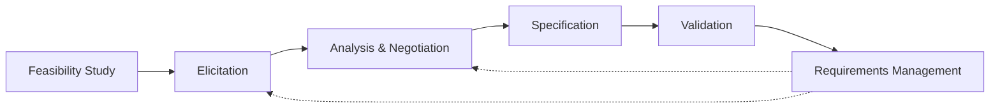
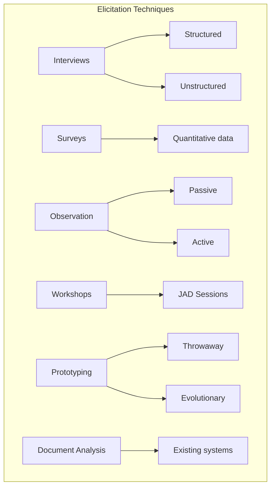
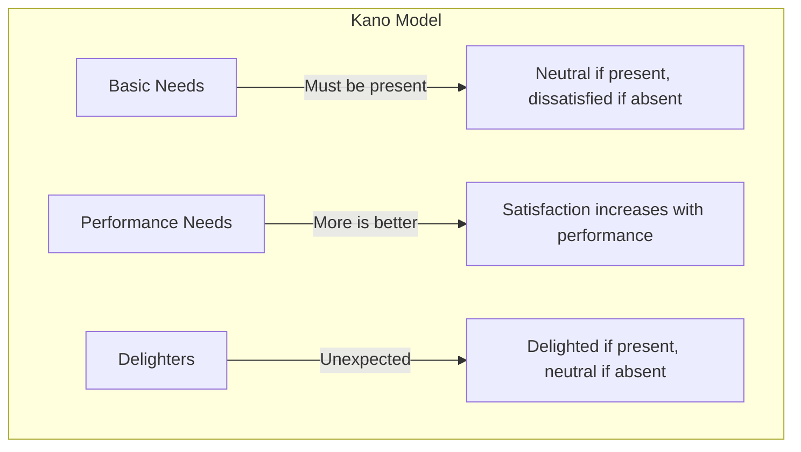
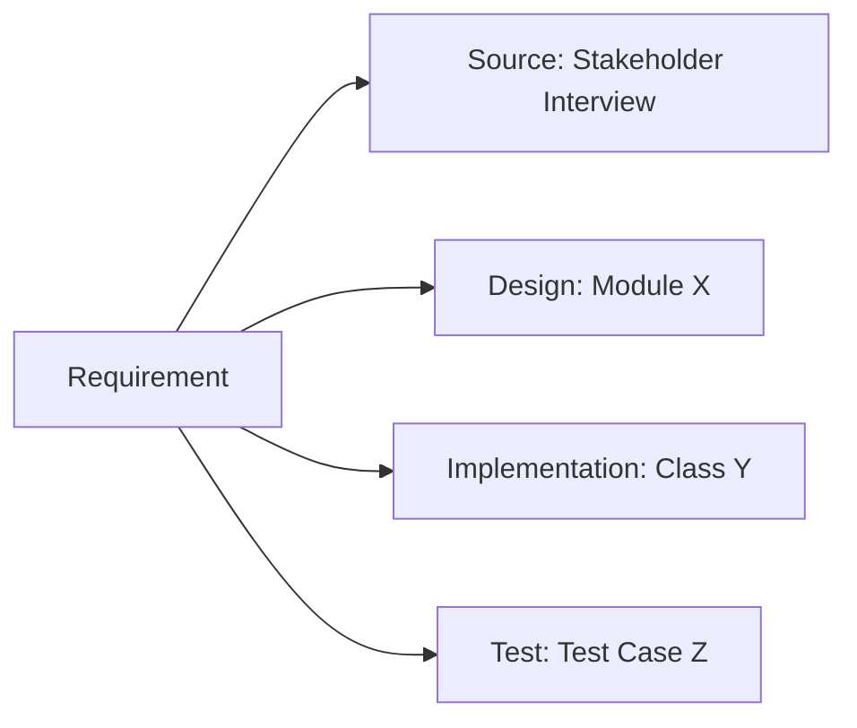

# Requirements Engineering

## Learning Objectives

After completing this chapter, the student will be able to:
- Classify requirements as functional, non-functional, and domain requirements
- Apply FURPS+ classification to organise requirements
- Conduct a feasibility study for a proposed software system
- Select and apply appropriate elicitation techniques
- Specify requirements using IEEE 830 format, user stories, and use cases
- Apply MoSCoW prioritisation and the Kano model
- Perform requirements validation through reviews and prototyping
- Manage requirements through traceability and change control
- Implement a RequirementsManager in TypeScript

## Theory

### The Requirements Engineering Process

Requirements engineering is the branch of software engineering concerned with the real-world goals for, functions of, and constraints on a software system. It encompasses the set of activities from problem understanding through to the production of a validated specification.



The requirements engineering process comprises four high-level activities: **feasibility study**, **elicitation and analysis**, **specification**, and **validation**. These activities are interleaved, iterative, and must be revisited as understanding evolves.

### Types of Requirements

Requirements are classified into three categories:

**Functional requirements** describe the services the system should provide, how it should react to particular inputs, and how it should behave in specific situations. Example: *"The system shall allow registered borrowers to search the catalogue by author, title, or subject."*

**Non-functional requirements** are constraints on the services or functions offered by the system. They encompass quality attributes such as performance, security, availability, usability, and maintainability. These are often more critical than functional requirements — a system that fails to meet a non-functional requirement may be unacceptable even if all functions work correctly.

**Domain requirements** reflect the characteristics of the application domain. They may be functional or non-functional and are derived from the domain context. Example: *"Interest must be calculated on a daily basis using the compound interest formula."*

### FURPS+ Classification

FURPS+ is a comprehensive taxonomy for classifying requirements:

| Category | Subcategories | Example |
|----------|---------------|---------|
| **F**unctionality | Features, capabilities, security | "System shall support OAuth2 authentication" |
| **U**sability | Human factors, aesthetics, documentation | "95% of users shall complete checkout in under 3 minutes" |
| **R**eliability | Availability, accuracy, recoverability | "System uptime shall be 99.9%" |
| **P**erformance | Response time, throughput, resource usage | "Search results returned within 2 seconds" |
| **S**upportability | Testability, maintainability, configurability | "System shall support hot-deploy of configuration changes" |
| **+** | Design constraints, interface, physical | "Must run on Linux x86_64" |

### Feasibility Study

A feasibility study assesses whether a proposed software project is viable across three dimensions:

1. **Technical feasibility:** Does the required technology exist? Does the team possess the necessary skills?
2. **Economic feasibility:** Do the expected benefits justify the investment? (Cost-benefit analysis, ROI calculation)
3. **Operational feasibility:** Can the organisation adapt to the new system? Will users accept it?

The output is a feasibility report recommending whether to proceed.

### Requirements Elicitation

Elicitation is the process of discovering requirements from stakeholders. Multiple techniques exist, each with strengths:



| Technique | Strengths | Limitations |
|-----------|-----------|-------------|
| **Interviews** | Build rapport, explore tacit knowledge | Time-consuming, may miss unarticulated needs |
| **Surveys** | Large sample, quantitative | Limited depth, cannot explore unexpected topics |
| **Observation** | Discover implicit requirements | Hawthorne effect, time-intensive |
| **Workshops/JAD** | Rapid consensus, conflict resolution | Requires facilitation skill |
| **Prototyping** | Clarify vague requirements | Users may fixate on prototype |
| **Document analysis** | Inexpensive, historical insight | Documentation may be outdated |

### Requirements Specification

The requirements specification documents the agreed requirements. Three primary formats exist:

#### IEEE 830 SRS Format

1. **Introduction** — Purpose, scope, definitions, references, overview
2. **General Description** — Product perspective, user characteristics, constraints, assumptions, dependencies
3. **Specific Requirements** — Functional requirements (by mode/feature), external interface requirements, performance requirements, design constraints, software system attributes (security, reliability, maintainability, portability)
4. **Appendices** — Glossary, models, issues list

#### User Stories

User stories are a lightweight specification format used in agile methods:

```
Template: As a [role], I want [goal] so that [benefit].
```

Example with acceptance criteria using **Gherkin** syntax:

```gherkin
Feature: Book Search
  As a library patron
  I want to search for books by title, author, or subject
  So that I can find materials relevant to my research

  Scenario: Search by exact title
    Given I am on the library search page
    When I search for "Software Engineering"
    Then I should see results with the exact title "Software Engineering"
    And the results should display title, author, publication year, and availability

  Scenario: Search with partial match
    Given I am on the library search page
    When I search for "Engineer"
    Then I should see results containing "Engineer" in the title
    And results should be returned within 3 seconds
```

#### Use Cases

Use cases describe interactions between actors and the system:

| Element | Description |
|---------|-------------|
| **Use Case Name** | Verb + Noun (e.g., "Borrow Book") |
| **Primary Actor** | Who initiates the interaction |
| **Preconditions** | What must be true before execution |
| **Main Success Scenario** | Normal flow of events |
| **Alternative Flows** | Variations and error paths |
| **Postconditions** | What must be true after execution |

### MoSCoW Prioritisation

MoSCoW is a prioritisation technique that categorises requirements:

| Category | Meaning | Allocation |
|----------|---------|------------|
| **M**ust have | Critical for launch | ~60% of effort |
| **S**hould have | Important but not critical | ~20% of effort |
| **C**ould have | Nice to have | ~20% of effort |
| **W**on't have | Explicitly excluded this time | 0% |

### The Kano Model

The Kano model categorises requirements by their effect on customer satisfaction:



- **Basic Needs (Threshold):** Expected features — their absence causes dissatisfaction
- **Performance Needs:** Features where better performance increases satisfaction
- **Delighters (Attractive):** Unexpected features that delight customers

### Requirements Validation

Validation ensures the specified requirements accurately reflect stakeholder needs:

| Technique | Description |
|-----------|-------------|
| **Requirements reviews** | Stakeholders inspect the specification for defects |
| **Prototyping** | Users interact with a mock-up to confirm understanding |
| **Test-case generation** | Writing tests against requirements exposes inconsistencies |
| **Checklists** | Standard question sets to catch common defects |

Common defects detected:
- **Omission:** Necessary requirement is missing
- **Inconsistency:** Requirements contradict each other
- **Ambiguity:** Requirement can be interpreted multiple ways
- **Duplication:** Same requirement appears multiple times
- **Infeasibility:** Requirement cannot be implemented within constraints

### Requirements Traceability Matrix

A Requirements Traceability Matrix (RTM) links requirements to their sources, design artefacts, implementation, and tests:



### Requirements Management

Requirements management encompasses maintaining the specification as the system evolves:

- **Traceability:** Links requirements to sources, design, code, and tests
- **Prioritisation:** MoSCoW, Kano model, AHP for relative importance
- **Change control:** CCB reviews proposed changes, assesses impact on cost/schedule
- **Baselining:** Freezing requirements at specific milestones

## Practical Takeaways

1. **Invest in elicitation upfront** — the cost of fixing a requirements error after deployment is 100x the cost of fixing it during elicitation
2. **Use multiple elicitation techniques** — interviews alone miss what stakeholders don't think to mention
3. **Write testable requirements** — every requirement should be verifiable; "user-friendly" is not testable
4. **Maintain traceability** — when a requirement changes, you must know which design, code, and tests are affected
5. **Expect change** — requirements will evolve; plan for it with change control processes
6. **Distinguish wants from needs** — MoSCoW and Kano help separate essential from nice-to-have

## Examples

### Example 1: TypeScript RequirementsManager

```typescript
type RequirementType = 'functional' | 'non-functional' | 'domain';
type Priority = 'MUST' | 'SHOULD' | 'COULD' | 'WONT';
type Status = 'proposed' | 'approved' | 'implemented' | 'verified' | 'rejected';

interface Requirement {
  id: string;
  title: string;
  description: string;
  type: RequirementType;
  priority: Priority;
  status: Status;
  source: string;
  owner: string;
  createdAt: Date;
  traceabilityLinks: TraceabilityLink[];
  acceptanceCriteria: string[];
}

interface TraceabilityLink {
  targetId: string;
  targetType: 'design' | 'implementation' | 'test' | 'source';
  description: string;
}

class RequirementsManager {
  private requirements: Map<string, Requirement> = new Map();
  private changeLog: ChangeLogEntry[] = [];

  public addRequirement(req: Omit<Requirement, 'id' | 'createdAt'>): Requirement {
    const id = `REQ-${this.requirements.size + 1}`;
    const requirement: Requirement = {
      ...req,
      id,
      createdAt: new Date(),
      traceabilityLinks: [],
    };
    this.requirements.set(id, requirement);
    this.logChange(id, 'CREATED', `Requirement created: ${req.title}`);
    return requirement;
  }

  public getRequirement(id: string): Requirement | undefined {
    return this.requirements.get(id);
  }

  public updateRequirement(
    id: string,
    updates: Partial<Pick<Requirement, 'description' | 'priority' | 'status' | 'acceptanceCriteria'>>
  ): Requirement {
    const req = this.requirements.get(id);
    if (!req) throw new Error(`Requirement ${id} not found`);
    const updated = { ...req, ...updates };
    this.requirements.set(id, updated);
    this.logChange(id, 'UPDATED', JSON.stringify(updates));
    return updated;
  }

  public approveRequirement(id: string): void {
    this.updateRequirement(id, { status: 'approved' });
  }

  public addTraceabilityLink(
    reqId: string,
    targetId: string,
    targetType: TraceabilityLink['targetType'],
    description: string
  ): void {
    const req = this.requirements.get(reqId);
    if (!req) throw new Error(`Requirement ${reqId} not found`);
    req.traceabilityLinks.push({ targetId, targetType, description });
    this.logChange(reqId, 'TRACE_ADDED', `Linked to ${targetType}: ${targetId}`);
  }

  public getRequirementsByType(type: RequirementType): Requirement[] {
    return Array.from(this.requirements.values()).filter((r) => r.type === type);
  }

  public getRequirementsByPriority(priority: Priority): Requirement[] {
    return Array.from(this.requirements.values()).filter((r) => r.priority === priority);
  }

  public generateTraceabilityReport(targetId: string): Requirement[] {
    return Array.from(this.requirements.values()).filter((r) =>
      r.traceabilityLinks.some((l) => l.targetId === targetId)
    );
  }

  public impactAnalysis(changedRequirementId: string): {
    requirement: Requirement;
    affectedDesign: string[];
    affectedTests: string[];
  } {
    const req = this.requirements.get(changedRequirementId);
    if (!req) throw new Error(`Requirement ${changedRequirementId} not found`);
    return {
      requirement: req,
      affectedDesign: req.traceabilityLinks
        .filter((l) => l.targetType === 'design')
        .map((l) => l.targetId),
      affectedTests: req.traceabilityLinks
        .filter((l) => l.targetType === 'test')
        .map((l) => l.targetId),
    };
  }

  private logChange(reqId: string, action: string, detail: string): void {
    this.changeLog.push({
      reqId,
      action,
      detail,
      timestamp: new Date(),
    });
  }

  public getChangeLog(): ChangeLogEntry[] {
    return [...this.changeLog];
  }
}

interface ChangeLogEntry {
  reqId: string;
  action: string;
  detail: string;
  timestamp: Date;
}

// Usage
const rm = new RequirementsManager();
const req1 = rm.addRequirement({
  title: 'Book Search',
  description: 'Users can search the catalogue by title, author, or subject',
  type: 'functional',
  priority: 'MUST',
  status: 'approved',
  source: 'Stakeholder interview #3',
  owner: 'Alice',
  acceptanceCriteria: [
    'Search returns results within 3 seconds',
    'Results display title, author, year, and availability',
    'Supports partial matching and wildcards',
  ],
});

rm.addTraceabilityLink(req1.id, 'DES-001', 'design', 'SearchController class');
rm.addTraceabilityLink(req1.id, 'TC-001', 'test', 'Search functionality tests');
console.log(rm.impactAnalysis(req1.id));
```

### Example 2: TypeScript UseCaseSpecification

```typescript
interface UseCaseStep {
  stepNumber: number;
  actor: string;
  action: string;
}

interface AlternativeFlow {
  identifier: string;
  condition: string;
  steps: UseCaseStep[];
}

class UseCase {
  constructor(
    public readonly name: string,
    public readonly primaryActor: string,
    public readonly preconditions: string[],
    public readonly mainSuccessScenario: UseCaseStep[],
    public readonly alternativeFlows: AlternativeFlow[],
    public readonly postconditions: string[]
  ) {}

  public validate(data: Record<string, unknown>): ValidationResult {
    const errors: string[] = [];
    for (const precondition of this.preconditions) {
      if (!data[precondition]) {
        errors.push(`Precondition not met: ${precondition}`);
      }
    }
    return {
      valid: errors.length === 0,
      errors,
    };
  }
}

interface ValidationResult {
  valid: boolean;
  errors: string[];
}

// Example
const borrowBookCase = new UseCase(
  'Borrow Book',
  'Library Patron',
  ['Patron is registered', 'Patron has fewer than max loans'],
  [
    { stepNumber: 1, actor: 'Patron', action: 'Presents books and library card' },
    { stepNumber: 2, actor: 'Librarian', action: 'Scans library card' },
    { stepNumber: 3, actor: 'System', action: 'Verifies patron eligibility' },
    { stepNumber: 4, actor: 'System', action: 'Records each book against account' },
    { stepNumber: 5, actor: 'System', action: 'Prints due-date receipt' },
    { stepNumber: 6, actor: 'System', action: 'Updates book status to "on loan"' },
  ],
  [
    {
      identifier: 'A1: Patron ineligible',
      condition: 'Patron has overdue books or exceeded loan limit',
      steps: [
        { stepNumber: 1, actor: 'System', action: 'Displays ineligibility message' },
        { stepNumber: 2, actor: 'System', action: 'Suggests returning overdue books' },
      ],
    },
    {
      identifier: 'A2: Book already reserved',
      condition: 'Another patron has reserved the book',
      steps: [
        { stepNumber: 1, actor: 'System', action: 'Displays reservation conflict' },
        { stepNumber: 2, actor: 'Librarian', action: 'Overrides if hold period expired' },
      ],
    },
  ],
  ['Book status is "on loan"', 'Patron record reflects new loan', 'Due date receipt is printed']
);
```

### Case Study: SRS for a Library Management System

A university library commissioned a new management system. The requirements team conducted interviews with librarians, library patrons, and IT staff. They distributed surveys to 500 library users and observed the circulation desk during peak hours. The resulting SRS included 73 functional requirements organised by subsystem, 18 non-functional requirements covering performance and security, and domain requirements specifying the Library of Congress classification system. A requirements traceability matrix linked every requirement to its source and test cases.

## Chapter Quiz

**Q1: Which of the following is a non-functional requirement?**
- A) "The system shall allow users to search by author"
- B) "The system shall process 1,000 transactions per second"
- C) "The system shall send email notifications"
- D) "The system shall support user registration"

**Answer: B** — Performance is a non-functional requirement (a quality attribute).

**Q2: In MoSCoW prioritisation, what does the 'W' stand for?**
- A) Will do later
- B) Wishful thinking
- C) Won't have this time
- D) Waiting

**Answer: C** — "Won't have" — explicitly excluded from the current scope.

**Q3: Which elicitation technique is most effective for discovering implicit requirements?**
- A) Surveys
- B) Observation
- C) Document analysis
- D) Interviews

**Answer: B** — Observation reveals what users actually do, which may differ from what they say they do.

**Q4: What is the primary purpose of a requirements traceability matrix?**
- A) To estimate project cost
- B) To enable impact analysis when requirements change
- C) To prioritise requirements
- D) To validate requirements with stakeholders

**Answer: B** — The RTM links requirements to design, code, and tests, enabling impact analysis.

**Q5: In the Kano model, features that cause dissatisfaction when absent but do not increase satisfaction when present are called:**
- A) Delighters
- B) Performance needs
- C) Basic needs
- D) Indifferent features

**Answer: C** — Basic needs (threshold attributes) must be present but do not delight when available.

## Summary

Requirements engineering is the foundation of successful software development. Functional requirements define what the system must do; non-functional constraints how it does it; and domain requirements capture the context. FURPS+ provides a comprehensive classification. Feasibility studies determine project viability. Elicitation techniques must be selected based on project context. Specifications take different forms — IEEE 830 documents, user stories with Gherkin acceptance criteria, or use cases. MoSCoW and the Kano model support prioritisation. Validation ensures correctness. Management through traceability, prioritisation, and change control maintains the specification's integrity as the system evolves.

## Exercises

### Review Questions

1. Distinguish between functional and non-functional requirements with examples.
2. What is the purpose of a feasibility study, and what three dimensions does it assess?
3. Compare the strengths and limitations of interviews versus observation as elicitation techniques.
4. What are the components of a well-formed user story with Gherkin acceptance criteria?
5. Describe the structure of a use case specification.
6. Explain the FURPS+ classification categories.
7. How does the Kano model categorise requirements?
8. List five types of defects that requirements validation can detect.
9. What is a requirements traceability matrix, and how is it used in impact analysis?
10. Explain the MoSCoW prioritisation technique.

### Application Problems

1. Write ten user stories for an online food delivery system. Include Gherkin acceptance criteria for three of the stories.
2. Develop a use case specification for the "Cancel Order" functionality of an e-commerce system. Include a main success scenario and at least two alternative flows.
3. You are the requirements engineer for a hospital patient management system. Propose an elicitation strategy that engages doctors, nurses, administrators, and patients. Justify your choice of techniques.
4. Extend the `RequirementsManager` TypeScript class to support versioning of requirements, showing the history of changes for each requirement.

### Challenge Problem

A government agency is developing a benefits eligibility system that replaces a thirty-year-old mainframe application. The existing system has no documentation, and the original developers have retired. The new system must comply with recently enacted legislation that changes eligibility rules. Design a requirements engineering approach for this context. Address how you will recover knowledge of the current system, handle the legislative changes, and manage conflicting interests. Propose a specification format and a requirements management strategy. Implement a TypeScript class that manages the versioned evolution of requirements through this process.
