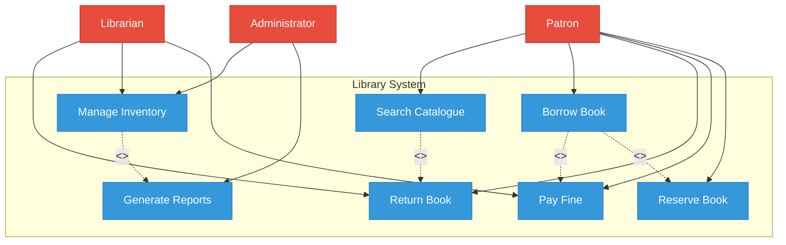
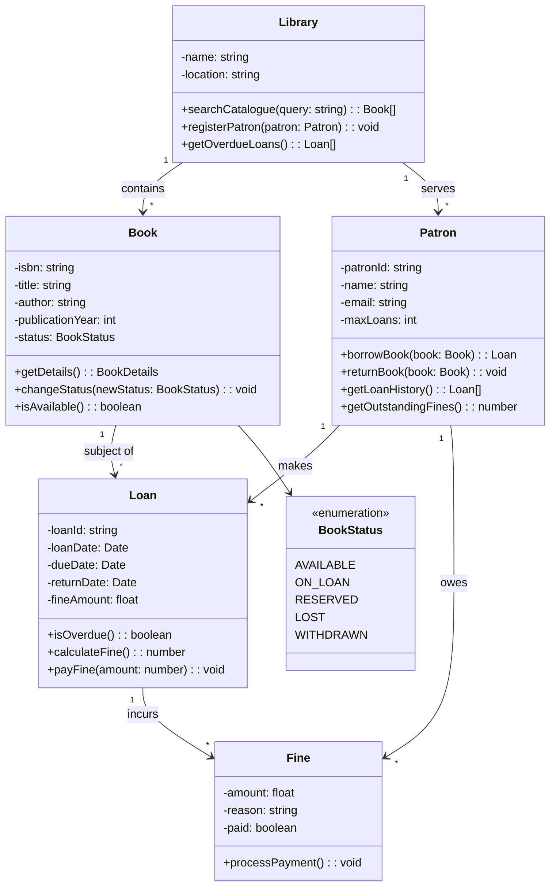
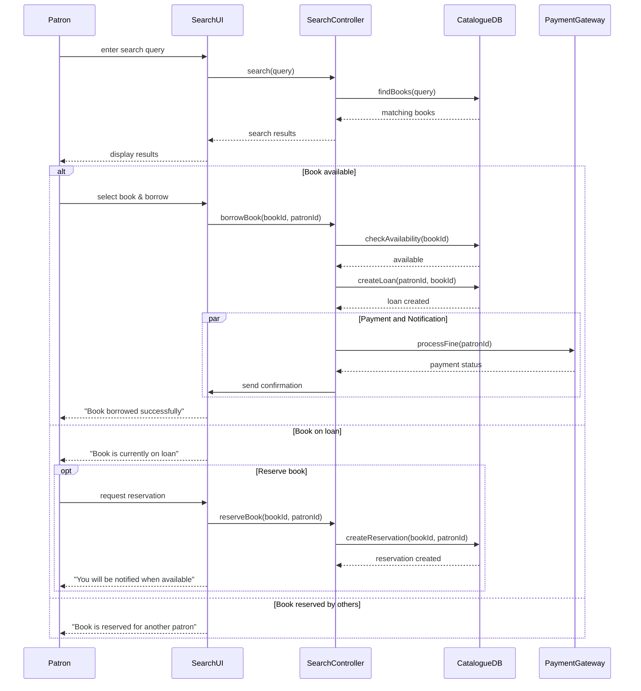
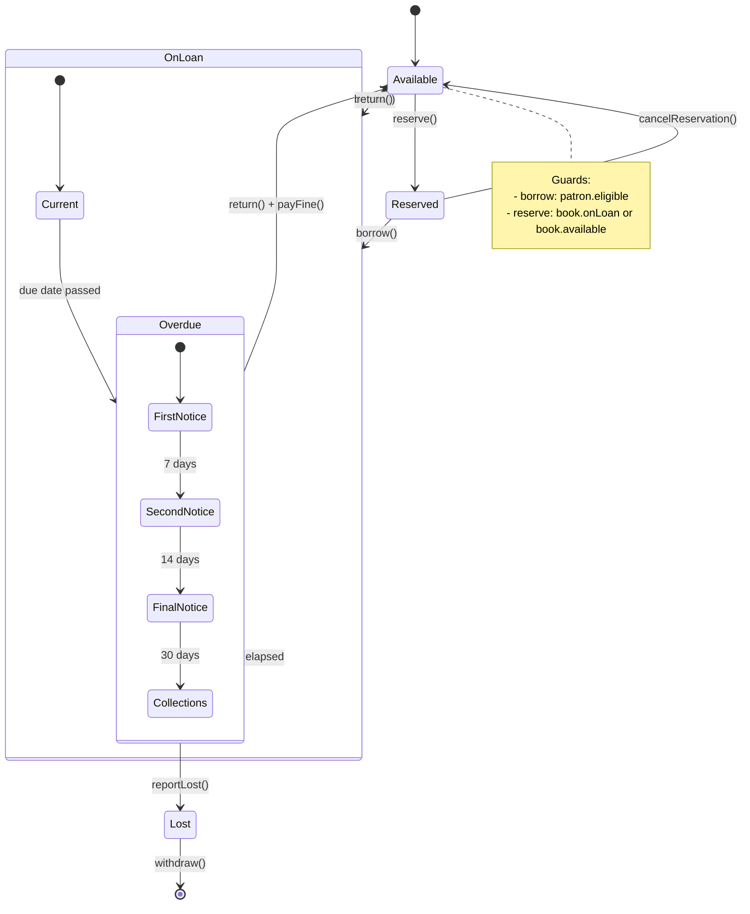
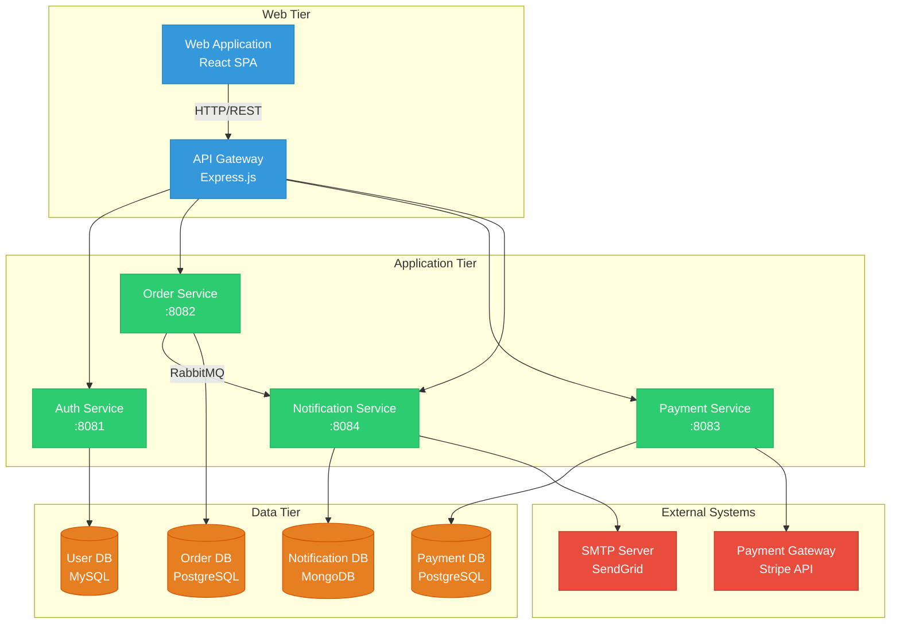
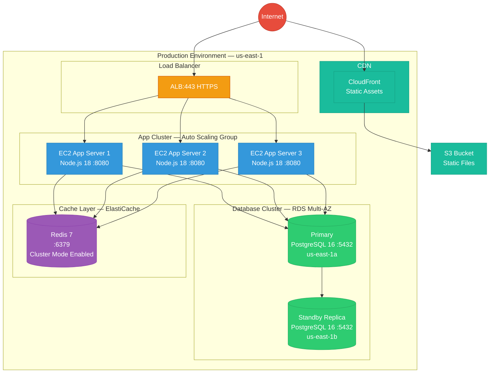
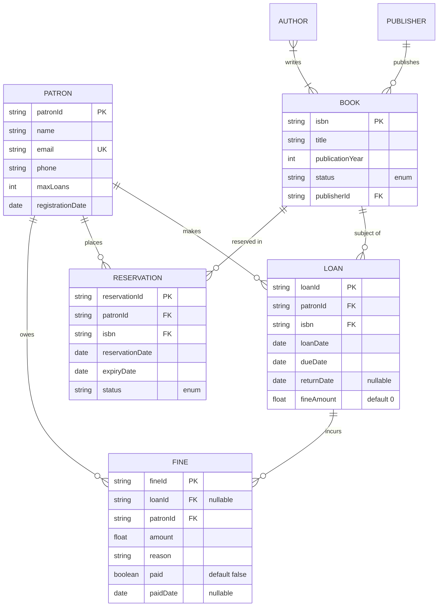
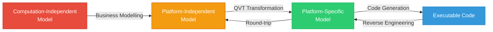

# System Modelling

## Learning Objectives

> ✅ After completing this chapter, the student will be able to:
> - Explain the purpose of system modelling from multiple perspectives
> - Construct UML use case, class, sequence, activity, and state machine diagrams
> - Describe component, deployment, package, and object diagrams
> - Develop data flow diagrams and entity-relationship diagrams
> - Apply design patterns in the context of system modelling
> - Explain model-driven engineering and its benefits
> - Write constraints using the Object Constraint Language
> - Map UML models to TypeScript type definitions and verify consistency
> - Implement a class diagram generator from TypeScript source
> - Build a sequence diagram renderer from trace logs
> - Develop a state machine engine with guards, actions, and nested states

<!-- Image Gallery -->
<div style="display:flex;flex-wrap:wrap;gap:4px;margin:16px 0;padding:12px;background:#f8fafc;border-radius:8px;border:1px solid #e2e8f0;">
<a href="../../../assets/images/lessons/software-engineering/03-system-modeling/hero.svg" target="_blank" rel="noopener">
  
</a>
<a href="../../../assets/images/lessons/software-engineering/03-system-modeling/handwritten-notes.svg" target="_blank" rel="noopener">
  
</a>
<a href="../../../assets/images/lessons/software-engineering/03-system-modeling/sticky-notes.svg" target="_blank" rel="noopener">
  
</a>
<a href="../../../assets/images/lessons/software-engineering/03-system-modeling/visual-explanation.svg" target="_blank" rel="noopener">
  
</a>
<a href="../../../assets/images/lessons/software-engineering/03-system-modeling/architecture.svg" target="_blank" rel="noopener">
  
</a>
<a href="../../../assets/images/lessons/software-engineering/03-system-modeling/workflow.svg" target="_blank" rel="noopener">
  
</a>
<a href="../../../assets/images/lessons/software-engineering/03-system-modeling/mindmap.svg" target="_blank" rel="noopener">
  
</a>
<a href="../../../assets/images/lessons/software-engineering/03-system-modeling/comparison.svg" target="_blank" rel="noopener">
  
</a>
<a href="../../../assets/images/lessons/software-engineering/03-system-modeling/cheatsheet.svg" target="_blank" rel="noopener">
  
</a>
<a href="../../../assets/images/lessons/software-engineering/03-system-modeling/interview-quiz.svg" target="_blank" rel="noopener">
  
</a>
<a href="../../../assets/images/lessons/software-engineering/03-system-modeling/social-card.svg" target="_blank" rel="noopener">
  
</a>
</div>
<!-- End Image Gallery -->

## Theory

### The Purpose of System Modelling

System modelling is the process of developing abstract representations of a system from different perspectives. Each model emphasises certain aspects while suppressing others, enabling stakeholders to understand, analyse, and communicate about the system.

Models serve several purposes:
- **Communication:** Facilitate discussion between stakeholders and developers
- **Input to design:** Provide input to the design process
- **Documentation:** Document design decisions for future reference
- **Code generation:** Generate implementation artefacts automatically

A software system can be modelled from three complementary perspectives:
- **External perspective:** Models the system's context and environment
- **Interaction perspective:** Models interactions between the system and its environment
- **Structural perspective:** Models the organisation of the system and its data

```mermaid
graph TD
    subgraph "Modelling Perspectives"
        EXT[External Perspective] --> CTX[Context & Environment<br/>Use Case Diagrams]
        INT[Interaction Perspective] --> SEQ[Sequences & Messages<br/>Sequence, Communication]
        STR[Structural Perspective] --> CLS[Classes & Data<br/>Class, Object, ER Diagrams]
    end
    subgraph "UML 2.x Diagram Types"
        UML[UML 2.x<br/>13 Diagram Types] --> STR2[Structure Diagrams]
        UML --> BEH[Behaviour Diagrams]
        STR2 --> CLS2[Class Diagram]
        STR2 --> CMP[Component Diagram]
        STR2 --> DEP[Deployment Diagram]
        STR2 --> OBJ[Object Diagram]
        STR2 --> PKG[Package Diagram]
        STR2 --> COMP[Composite Structure]
        BEH --> UC[Use Case Diagram]
        BEH --> SEQ2[Sequence Diagram]
        BEH --> ACT[Activity Diagram]
        BEH --> SM[State Machine Diagram]
        BEH --> COMM[Communication Diagram]
        BEH --> INT[Interaction Overview]
        BEH --> TIM[Timing Diagram]
    end

    classDef pers fill:#3498db,stroke:#2980b9,color:#fff
    classDef uml fill:#2ecc71,stroke:#27ae60,color:#fff
    classDef struct fill:#f39c12,stroke:#d35400,color:#fff
    classDef behav fill:#e74c3c,stroke:#c0392b,color:#fff
    class EXT,INT,STR pers
    class UML uml
    class CLS2,CMP,DEP,OBJ,PKG,COMP struct
    class UC,SEQ2,ACT,SM,COMM,INT,TIM behav
```



### The Unified Modeling Language

The Unified Modeling Language (UML) is a general-purpose visual modelling language standardised by the Object Management Group (OMG). UML provides thirteen diagram types in two categories: **structure diagrams** (static structure) and **behaviour diagrams** (dynamic behaviour).

UML is extensible through:
- **Stereotypes:** Extend UML vocabulary (`<<entity>>`, `<<controller>>`, `<<service>>`, `<<repository>>`)
- **Tagged values:** Extend properties of model elements (`{version=1.0, author=Alice}`)
- **Constraints:** Add rules expressed in natural language or OCL

### Use Case Diagrams

Use case diagrams show interactions between actors and the system. An **actor** is a role played by a user or another system. A **use case** represents a complete unit of functionality.



| Relationship | Notation | Description |
|-------------|----------|-------------|
| **Association** | Solid line | Actor participates in use case |
| **Include** | Dashed arrow `<<include>>` | One use case always includes another |
| **Extend** | Dashed arrow `<<extend>>` | One use case optionally extends another |
| **Generalisation** | Hollow triangle arrow | Child use case inherits from parent |

### Class Diagrams

Class diagrams describe the static structure of a system by showing classes, attributes, operations, and relationships. They are the most widely used UML diagram type.



**Relationships:**

| Type | Notation | Meaning |
|------|----------|---------|
| **Association** | Solid line | Structural connection between instances |
| **Aggregation** | Hollow diamond | Whole-part (part exists independently of whole) |
| **Composition** | Filled diamond | Whole-part (part cannot exist without whole) |
| **Inheritance** | Hollow triangle | Subclass inherits from superclass |
| **Dependency** | Dashed arrow | Change to one may affect the other |
| **Realisation** | Dashed triangle | Class implements interface |

**Multiplicity:**

| Notation | Meaning |
|----------|---------|
| `1` | Exactly one |
| `0..1` | Zero or one |
| `*` | Zero or more |
| `1..*` | One or more |
| `0..5` | Zero to five |
| `m..n` | m to n inclusive |

### Sequence Diagrams

Sequence diagrams model interactions between objects over time, showing messages exchanged in chronological order. They are essential for understanding communication patterns and protocol design.



**Combined Fragments:**

| Operator | Meaning |
|----------|---------|
| `alt` | Alternative scenarios (if/else) |
| `opt` | Optional scenario (if without else) |
| `loop` | Repetition (while/for) |
| `par` | Parallel execution |
| `ref` | Reference to another diagram |
| `break` | Break condition, terminates enclosing fragment |
| `critical` | Critical region (must be atomic) |
| `ignore` | Ignore certain message types |
| `consider` | Only consider certain message types |
| `assert` | Assertion — must be true |
| `neg` | Negative — invalid interaction |

### Activity Diagrams

Activity diagrams model the flow of control from one activity to another, supporting sequential, concurrent, and conditional behaviour. They are ideal for modelling business processes and workflows.

```mermaid
graph TD
    START((Start)) --> A[Receive Order]
    A --> B{Validate Order}
    B -->|Valid| C[Check Inventory]
    B -->|Invalid| D[Reject Order]
    D --> END((End))
    C --> E{In Stock?}
    E -->|Yes| F[Process Payment]
    E -->|No| G[Order from Supplier]
    G --> H[Wait for Delivery]
    H --> C
    F --> I[Pack Order]
    I --> J[Ship Order]
    J --> K[Send Confirmation]
    K --> L[Update Inventory]
    L --> END

    classDef start fill:#2c3e50,stroke:#2c3e50,color:#fff
    classDef act fill:#3498db,stroke:#2980b9,color:#fff
    classDef decision fill:#f39c12,stroke:#d35400,color:#fff
    classDef end fill:#e74c3c,stroke:#c0392b,color:#fff
    class START start
    class A,C,F,G,H,I,J,K,L act
    class B,E decision
    class D,END end
```

**Activity Elements:**

| Element | Notation | Description |
|---------|----------|-------------|
| **Initial node** | Filled circle | Start of activity |
| **Activity** | Rounded rectangle | Action to perform |
| **Decision** | Diamond | Conditional branch |
| **Fork** | Thick bar | Split into concurrent flows |
| **Join** | Thick bar | Synchronise concurrent flows |
| **Final node** | Bullseye | End of activity |
| **Swimlane** | Partition | Responsibilities by actor |

### State Machine Diagrams

State machine diagrams model the behaviour of an object as it responds to events over its lifetime. They are particularly important for modelling systems with complex state-dependent behaviour.



| Element | Description |
|---------|-------------|
| **Initial state** | Starting point (filled circle) |
| **State** | Condition during which object waits or performs activity |
| **Transition** | Movement between states triggered by events |
| **Guard condition** | Boolean condition that must be true for transition |
| **Composite state** | Nested states within a state |
| **Concurrent region** | Independent sub-states within a composite state |
| **Entry/Exit actions** | Actions executed on entering/exiting a state |

### Component Diagrams

Component diagrams show the organisation and dependencies among software components. A **component** is a modular, deployable, and replaceable part that encapsulates implementation and exposes interfaces.



- **Provided interfaces:** Services offered by component (lollipop notation)
- **Required interfaces:** Services needed from environment (socket notation)

### Deployment Diagrams

Deployment diagrams show the physical deployment of software components on hardware nodes. They are essential for understanding the production architecture, network topology, and scalability.



### Data Flow Diagrams

Data flow diagrams (DFDs) model the flow of data through a system. They are hierarchically organised from context level (Level 0) through increasingly detailed levels.

**DFD Elements:**

| Symbol | Name | Description |
|--------|------|-------------|
| Circle/rounded rectangle | Process | Transforms data |
| Arrow | Data flow | Data in motion |
| Double line | Data store | Data at rest |
| Rectangle | External entity | Source/destination outside system |

### Entity-Relationship Diagrams

Entity-relationship (ER) diagrams model the data perspective, showing entity types, attributes, and relationships.



### Design Patterns in Modelling Context

Design patterns can be represented in UML to document recurring architectural solutions:

- **Singleton:** A class with a static `getInstance()` operation and a private constructor
- **Observer:** A subject class with `attach()`, `detach()`, and `notify()` operations; observer interface with `update()`
- **Strategy:** A context class delegating to a strategy interface with concrete implementations
- **Factory:** A creator class with a factory method returning product objects
- **Adapter:** A class that adapts a target interface to an adaptee

### Object Constraint Language

OCL is a formal language for expressing constraints on UML models. It is declarative with no side effects.

**OCL Expression Types:**

| Type | Example |
|------|---------|
| **Invariant** | `context Account inv: self.balance >= 0` |
| **Precondition** | `context Account::withdraw(a: Integer) pre: self.balance >= a` |
| **Postcondition** | `context Account::withdraw(a: Integer) post: self.balance = self@pre.balance - a` |
| **Query** | `context Library::getOverdueLoans(): Set(Loan) body: self.loans->select(l | l.isOverdue())` |

**OCL Collection Operations:**

```typescript
// OCL: context Library inv: self.books->forAll(b | b.status <> BookStatus::LOST)
// OCL: context Patron inv: self.loans->select(l | l.isOverdue())->size() <= 3
// OCL: context Library::getAvailableBooks(): Set(Book) 
//      body: self.books->select(b | b.status = BookStatus::AVAILABLE)
// OCL: context Patron inv: self.fines->select(f | f.paid = false)->sum(f.amount) <= 50
```

### Model-Driven Engineering

Model-driven engineering (MDE) elevates models from documentation to primary development artefacts. The Model-Driven Architecture (MDA) standard defines three levels:

- **CIM (Computation-Independent Model):** Domain model, business requirements
- **PIM (Platform-Independent Model):** Describes system independently of implementation platform (UML)
- **PSM (Platform-Specific Model):** Incorporates platform-specific details (e.g., J2EE, .NET)



## Examples

### Example 1: ClassDiagramGenerator — from TypeScript Source

```typescript
interface ClassInfo {
  name: string;
  properties: { name: string; type: string; visibility: 'public' | 'private' | 'protected'; static: boolean }[];
  methods: { name: string; params: string; returnType: string; visibility: 'public' | 'private' | 'protected'; static: boolean }[];
  extends?: string;
  implements?: string[];
  isEnum?: boolean;
  enumValues?: string[];
}

class ClassDiagramGenerator {
  private classes: ClassInfo[] = [];

  public addClass(info: ClassInfo): void {
    this.classes.push(info);
  }

  public addEnum(name: string, values: string[]): void {
    this.classes.push({
      name,
      properties: [],
      methods: [],
      isEnum: true,
      enumValues: values,
    });
  }

  public generateUMLMermaid(): string {
    const lines: string[] = ['```mermaid', 'classDiagram'];
    for (const cls of this.classes) {
      if (cls.isEnum) {
        lines.push(`    class ${cls.name} {`);
        lines.push('        <<enumeration>>');
        for (const val of cls.enumValues ?? []) {
          lines.push(`        ${val}`);
        }
        lines.push('    }');
      } else {
        lines.push(`    class ${cls.name} {`);
        for (const prop of cls.properties) {
          const vis = prop.visibility === 'private' ? '-' : prop.visibility === 'protected' ? '#' : '+';
          lines.push(`        ${vis}${prop.name}: ${prop.type}${prop.static ? ' {static}' : ''}`);
        }
        for (const method of cls.methods) {
          const vis = method.visibility === 'private' ? '-' : method.visibility === 'protected' ? '#' : '+';
          lines.push(`        ${vis}${method.name}(${method.params}) ${method.returnType}${method.static ? ' {static}' : ''}`);
        }
        lines.push('    }');
        if (cls.extends) {
          lines.push(`    ${cls.name} --|> ${cls.extends}`);
        }
        if (cls.implements) {
          for (const iface of cls.implements) {
            lines.push(`    ${cls.name} ..|> ${iface}`);
          }
        }
      }
    }
    lines.push('```');
    return lines.join('\n');
  }

  public generateTypeScriptCode(): string {
    const lines: string[] = [];
    for (const cls of this.classes) {
      if (cls.isEnum) {
        lines.push(`enum ${cls.name} {`);
        for (const val of cls.enumValues ?? []) {
          lines.push(`  ${val} = '${val}',`);
        }
        lines.push('}');
      } else {
        const ext = cls.extends ? ` extends ${cls.extends}` : '';
        const impl = cls.implements && cls.implements.length > 0 ? ` implements ${cls.implements.join(', ')}` : '';
        lines.push(`class ${cls.name}${ext}${impl} {`);
        for (const prop of cls.properties) {
          const acc = prop.visibility === 'private' ? 'private' : prop.visibility === 'protected' ? 'protected' : 'public';
          lines.push(`  ${acc}${prop.static ? ' static' : ''} ${prop.name}: ${prop.type};`);
        }
        for (const method of cls.methods) {
          const acc = method.visibility === 'private' ? 'private' : method.visibility === 'protected' ? 'protected' : 'public';
          lines.push(`  ${acc}${method.static ? ' static' : ''} ${method.name}(${method.params}): ${method.returnType} {}`);
        }
        lines.push('}');
      }
      lines.push('');
    }
    return lines.join('\n');
  }

  public static analyzeFromCode(code: string): ClassInfo[] {
    const classes: ClassInfo[] = [];
    const classRegex = /class\s+(\w+)(?:\s+extends\s+(\w+))?(?:\s+implements\s+([\w,\s]+))?\s*\{/g;
    const propRegex = /(private|protected|public)\s+(static\s+)?(\w+)\s*:\s*(\w+)/g;
    const methodRegex = /(private|protected|public)\s+(static\s+)?(\w+)\s*\(([^)]*)\)\s*:\s*(\w+)/g;

    let match;
    while ((match = classRegex.exec(code)) !== null) {
      const cls: ClassInfo = {
        name: match[1],
        properties: [],
        methods: [],
        extends: match[2] || undefined,
        implements: match[3] ? match[3].split(',').map(s => s.trim()) : undefined,
      };

      const classBodyStart = match.index + match[0].length;
      const classBodyEnd = this.findMatchingBrace(code, classBodyStart);
      const body = code.substring(classBodyStart, classBodyEnd);

      let propMatch;
      while ((propMatch = propRegex.exec(body)) !== null) {
        cls.properties.push({
          name: propMatch[3],
          type: propMatch[4],
          visibility: propMatch[1] as 'public' | 'private' | 'protected',
          static: propMatch[2]?.includes('static') ?? false,
        });
      }

      let methodMatch;
      while ((methodMatch = methodRegex.exec(body)) !== null) {
        cls.methods.push({
          name: methodMatch[3],
          params: methodMatch[4],
          returnType: methodMatch[5],
          visibility: methodMatch[1] as 'public' | 'private' | 'protected',
          static: methodMatch[2]?.includes('static') ?? false,
        });
      }

      classes.push(cls);
    }
    return classes;
  }

  private static findMatchingBrace(code: string, start: number): number {
    let depth = 1;
    let i = start;
    while (depth > 0 && i < code.length) {
      if (code[i] === '{') depth++;
      else if (code[i] === '}') depth--;
      i++;
    }
    return i;
  }
}

// Usage
const gen = new ClassDiagramGenerator();
gen.addClass({
  name: 'Book',
  properties: [
    { name: 'isbn', type: 'string', visibility: 'private', static: false },
    { name: 'title', type: 'string', visibility: 'private', static: false },
    { name: 'status', type: 'BookStatus', visibility: 'private', static: false },
  ],
  methods: [
    { name: 'getDetails', params: '', returnType: 'BookDetails', visibility: 'public', static: false },
    { name: 'changeStatus', params: 'newStatus: BookStatus', returnType: 'void', visibility: 'public', static: false },
  ],
});
gen.addEnum('BookStatus', ['AVAILABLE', 'ON_LOAN', 'RESERVED', 'LOST', 'WITHDRAWN']);
console.log(gen.generateUMLMermaid());
```

### Example 2: SequenceDiagramRenderer — from Trace Logs

```typescript
interface TraceEvent {
  timestamp: number;
  from: string;
  to: string;
  message: string;
  type: 'sync_call' | 'async_call' | 'return' | 'create' | 'destroy' | 'self';
  duration?: number; // ms
  nested?: TraceEvent[];
}

class SequenceDiagramRenderer {
  private events: TraceEvent[] = [];
  private participants: Set<string> = new Set();

  public addEvent(event: TraceEvent): void {
    this.events.push(event);
    this.participants.add(event.from);
    this.participants.add(event.to);
  }

  public renderMermaid(): string {
    const lines: string[] = ['```mermaid', 'sequenceDiagram'];
    for (const p of this.participants) {
      lines.push(`    participant ${this.escapeId(p)} as ${p}`);
    }
    for (const event of this.events) {
      lines.push(...this.renderEvent(event, 1));
    }
    lines.push('```');
    return lines.join('\n');
  }

  private renderEvent(event: TraceEvent, indent: number): string[] {
    const pad = '    '.repeat(indent);
    const lines: string[] = [];
    const from = this.escapeId(event.from);
    const to = this.escapeId(event.to);

    switch (event.type) {
      case 'sync_call':
        lines.push(`${pad}${from}->>${to}: ${event.message}`);
        break;
      case 'async_call':
        lines.push(`${pad}${from}-->>${to}: ${event.message}`);
        break;
      case 'return':
        lines.push(`${pad}${to}-->>${from}: ${event.message}`);
        break;
      case 'create':
        lines.push(`${pad}create participant ${to}`);
        lines.push(`${pad}${from}->>${to}: ${event.message}`);
        break;
      case 'self':
        lines.push(`${pad}${from}->>${from}: ${event.message}`);
        break;
    }
    if (event.nested && event.nested.length > 0) {
      for (const nested of event.nested) {
        lines.push(...this.renderEvent(nested, indent + 1));
      }
    }
    return lines;
  }

  private escapeId(id: string): string {
    return id.replace(/\s+/g, '_').replace(/[^a-zA-Z0-9_]/g, '');
  }

  public generatePlantUML(): string {
    const lines: string[] = ['@startuml'];
    for (const p of this.participants) {
      lines.push(`  participant "${p}" as ${this.escapeId(p)}`);
    }
    for (const event of this.events) {
      this.renderPlantUMLEvent(event, lines);
    }
    lines.push('@enduml');
    return lines.join('\n');
  }

  private renderPlantUMLEvent(event: TraceEvent, lines: string[]): void {
    const from = this.escapeId(event.from);
    const to = this.escapeId(event.to);
    switch (event.type) {
      case 'sync_call':
        lines.push(`  ${from} -> ${to} + : ${event.message}`);
        if (event.duration !== undefined) {
          lines.push(`  note right: ${event.duration}ms`);
        }
        break;
      case 'return':
        lines.push(`  ${to} --> ${from} - : ${event.message}`);
        break;
      case 'async_call':
        lines.push(`  ${from} ->> ${to} : ${event.message}`);
        break;
      case 'self':
        lines.push(`  ${from} -> ${from} : ${event.message}`);
        break;
    }
  }

  public getTimeline(): { event: TraceEvent; cumulativeTime: number }[] {
    const sorted = [...this.events].sort((a, b) => a.timestamp - b.timestamp);
    let cumTime = 0;
    return sorted.map(event => {
      cumTime += event.duration ?? 0;
      return { event, cumulativeTime: cumTime };
    });
  }
}

// Usage
const renderer = new SequenceDiagramRenderer();
renderer.addEvent({ timestamp: 0, from: 'Client', to: 'Controller', message: 'POST /login', type: 'sync_call', duration: 5 });
renderer.addEvent({ timestamp: 5, from: 'Controller', to: 'AuthService', message: 'authenticate(credentials)', type: 'sync_call', duration: 50 });
renderer.addEvent({ timestamp: 55, from: 'AuthService', to: 'Database', message: 'SELECT user WHERE email=?', type: 'sync_call', duration: 20 });
renderer.addEvent({ timestamp: 75, from: 'Database', to: 'AuthService', message: 'user record', type: 'return' });
renderer.addEvent({ timestamp: 80, from: 'AuthService', to: 'Controller', message: 'JWT token', type: 'return' });
renderer.addEvent({ timestamp: 85, from: 'Controller', to: 'Client', message: '200 OK + token', type: 'return' });
console.log(renderer.renderMermaid());
console.log(renderer.getTimeline());
```

### Example 3: StateMachineEngine — with Guards, Actions, Nested States

```typescript
type State = string;
type Event = string;

interface Guard {
  name: string;
  condition: (context: Record<string, unknown>) => boolean;
}

interface Action {
  name: string;
  execute: (context: Record<string, unknown>) => void;
}

interface StateTransition {
  from: State;
  to: State;
  event: Event;
  guard?: string;
  actions?: string[];
}

interface NestedStateMachine {
  parentState: State;
  initialState: State;
  states: State[];
  transitions: StateTransition[];
}

class StateMachineEngine {
  private currentState: State;
  private readonly transitions: StateTransition[];
  private readonly guards: Map<string, Guard>;
  private readonly actions: Map<string, Action>;
  private readonly nested: Map<State, NestedStateMachine>;
  private context: Record<string, unknown>;
  private readonly history: { from: State; to: State; event: Event; timestamp: Date }[];

  constructor(
    initialState: State,
    transitions: StateTransition[],
    options?: {
      guards?: Guard[];
      actions?: Action[];
      nested?: NestedStateMachine[];
      initialContext?: Record<string, unknown>;
    }
  ) {
    this.currentState = initialState;
    this.transitions = transitions;
    this.guards = new Map(options?.guards?.map(g => [g.name, g]) ?? []);
    this.actions = new Map(options?.actions?.map(a => [a.name, a]) ?? []);
    this.nested = new Map(options?.nested?.map(n => [n.parentState, n]) ?? []);
    this.context = options?.initialContext ?? {};
    this.history = [];
  }

  public send(event: Event): boolean {
    const candidates = this.transitions.filter(
      (t) => t.from === this.currentState && t.event === event
    );
    if (candidates.length === 0) {
      throw new Error(`No transition from '${this.currentState}' on '${event}'`);
    }
    for (const transition of candidates) {
      if (transition.guard) {
        const guard = this.guards.get(transition.guard);
        if (!guard || !guard.condition(this.context)) continue;
      }
      const prevState = this.currentState;
      this.currentState = transition.to;
      if (transition.actions) {
        for (const actionName of transition.actions) {
          const action = this.actions.get(actionName);
          if (action) action.execute(this.context);
        }
      }
      this.history.push({ from: prevState, to: transition.to, event, timestamp: new Date() });
      return true;
    }
    throw new Error(`Guard conditions not met for any transition from '${this.currentState}' on '${event}'`);
  }

  public getState(): State {
    return this.currentState;
  }

  public setContext(key: string, value: unknown): void {
    this.context[key] = value;
  }

  public getContext(key: string): unknown {
    return this.context[key];
  }

  public getHistory(): { from: State; to: State; event: Event; timestamp: Date }[] {
    return [...this.history];
  }

  public can(event: Event): boolean {
    const candidates = this.transitions.filter(
      (t) => t.from === this.currentState && t.event === event
    );
    for (const t of candidates) {
      if (!t.guard) return true;
      const guard = this.guards.get(t.guard);
      if (guard?.condition(this.context)) return true;
    }
    return false;
  }

  public getValidEvents(): Event[] {
    return this.transitions
      .filter(t => t.from === this.currentState)
      .map(t => t.event)
      .filter((v, i, a) => a.indexOf(v) === i);
  }

  public isInNestedState(parentState: State, nestedState: State): boolean {
    const nestedSM = this.nested.get(parentState);
    if (!nestedSM) return false;
    if (this.currentState === parentState) {
      return nestedSM.initialState === nestedState;
    }
    return this.currentState === `${parentState}.${nestedState}`;
  }

  public dotFormat(): string {
    const lines: string[] = ['digraph StateMachine {'];
    const stateSet = new Set<State>();
    for (const t of this.transitions) {
      stateSet.add(t.from);
      stateSet.add(t.to);
    }
    for (const state of stateSet) {
      const isCurrent = state === this.currentState;
      lines.push(`  "${state}" [${isCurrent ? 'style=filled,fillcolor=lightyellow,' : ''}shape=box];`);
    }
    for (const t of this.transitions) {
      const label = [t.event, t.guard ? `[${t.guard}]` : '', t.actions ? `/${t.actions.join(',')}` : ''].filter(Boolean).join(' ');
      lines.push(`  "${t.from}" -> "${t.to}" [label="${label}"];`);
    }
    lines.push('}');
    return lines.join('\n');
  }
}

// Usage - Book state machine with guards
const sm = new StateMachineEngine('available', [
  { from: 'available', to: 'onLoan', event: 'borrow', guard: 'patronEligible', actions: ['recordLoan'] },
  { from: 'available', to: 'reserved', event: 'reserve', actions: ['notifyPatron'] },
  { from: 'onLoan', to: 'overdue', event: 'daysPass', guard: 'isOverdue', actions: ['chargeFine'] },
  { from: 'onLoan', to: 'available', event: 'return', actions: ['clearLoan'] },
  { from: 'overdue', to: 'available', event: 'return', guard: 'finePaid', actions: ['clearLoan', 'clearFines'] },
  { from: 'overdue', to: 'lost', event: 'reportLost', actions: ['markLost', 'chargeReplacement'] },
  { from: 'reserved', to: 'onLoan', event: 'borrow', guard: 'patronEligible', actions: ['recordLoan'] },
  { from: 'reserved', to: 'available', event: 'cancelReservation', actions: ['notifyNextPatron'] },
], {
  guards: [
    { name: 'patronEligible', condition: (ctx) => (ctx.maxLoans as number) > 0 },
    { name: 'isOverdue', condition: (ctx) => (ctx.daysSinceDue as number) > 0 },
    { name: 'finePaid', condition: (ctx) => (ctx.outstandingFine as number) === 0 },
  ],
  actions: [
    { name: 'recordLoan', execute: (ctx) => { ctx.activeLoans = (ctx.activeLoans as number ?? 0) + 1; } },
    { name: 'clearLoan', execute: (ctx) => { ctx.activeLoans = (ctx.activeLoans as number ?? 1) - 1; } },
    { name: 'chargeFine', execute: (ctx) => { ctx.outstandingFine = (ctx.outstandingFine as number ?? 0) + 1; } },
    { name: 'clearFines', execute: (ctx) => { ctx.outstandingFine = 0; } },
    { name: 'notifyPatron', execute: () => { console.log('Notification sent'); } },
    { name: 'notifyNextPatron', execute: () => { console.log('Next in queue notified'); } },
    { name: 'markLost', execute: (ctx) => { ctx.status = 'lost'; } },
    { name: 'chargeReplacement', execute: (ctx) => { ctx.replacementFee = 50; } },
  ],
  initialContext: { maxLoans: 3, activeLoans: 0, outstandingFine: 0 },
});

console.log(sm.getState()); // available
console.log(sm.can('borrow')); // true
sm.send('borrow');
console.log(sm.getState()); // onLoan
console.log(sm.getValidEvents()); // ['daysPass', 'return', 'reportLost']
```

### Example 4: Model Consistency Checker

```typescript
interface UMLClass {
  name: string;
  attributes: string[];
  methods: string[];
  associations: string[];
}

interface SequenceStep {
  from: string;
  to: string;
  message: string;
}

interface StateDefinition {
  states: string[];
  transitions: { from: string; to: string; event: string }[];
}

class ModelConsistencyChecker {
  private errors: string[] = [];
  private warnings: string[] = [];

  public checkClassStructure(cls: UMLClass): void {
    if (!cls.name) this.errors.push('Class must have a name');
    if (cls.attributes.length === 0) this.warnings.push(`Class '${cls.name}' has no attributes`);
    if (cls.methods.length === 0) this.warnings.push(`Class '${cls.name}' has no methods`);
  }

  public checkSequenceConsistency(classes: UMLClass[], steps: SequenceStep[]): void {
    const classNames = new Set(classes.map(c => c.name));
    for (const step of steps) {
      if (!classNames.has(step.from)) {
        this.errors.push(`Sequence '${step.message}': sender '${step.from}' not found in class model`);
      }
      if (!classNames.has(step.to)) {
        this.errors.push(`Sequence '${step.message}': receiver '${step.to}' not found in class model`);
      }
    }
  }

  public checkStateCompleteness(sm: StateDefinition): void {
    if (sm.states.length < 2) this.errors.push('State machine must have at least 2 states');
    for (const state of sm.states) {
      const hasIncoming = sm.transitions.some(t => t.to === state);
      const hasOutgoing = sm.transitions.some(t => t.from === state);
      if (!hasIncoming && state !== sm.states[0]) {
        this.warnings.push(`State '${state}' has no incoming transitions (unreachable)`);
      }
      if (!hasOutgoing && state !== sm.states[sm.states.length - 1]) {
        this.warnings.push(`State '${state}' has no outgoing transitions (dead end)`);
      }
    }
    for (const t of sm.transitions) {
      if (!sm.states.includes(t.from)) this.errors.push(`Transition '${t.event}' references unknown source '${t.from}'`);
      if (!sm.states.includes(t.to)) this.errors.push(`Transition '${t.event}' references unknown target '${t.to}'`);
    }
  }

  public checkNamesConsistent(className: string, sequenceParticipants: string[]): void {
    if (!sequenceParticipants.includes(className)) {
      this.warnings.push(`Class '${className}' never appears in sequence diagrams`);
    }
  }

  public getReport(): { errors: string[]; warnings: string[]; valid: boolean; summary: string } {
    const valid = this.errors.length === 0;
    const summary = valid
      ? `✅ Model consistent: ${this.warnings.length} warnings`
      : `❌ Model inconsistent: ${this.errors.length} errors, ${this.warnings.length} warnings`;
    return { errors: this.errors, warnings: this.warnings, valid, summary };
  }
}

// Usage
const checker = new ModelConsistencyChecker();
checker.checkClassStructure({ name: 'User', attributes: ['id', 'name'], methods: ['login()'], associations: ['Account'] });
checker.checkSequenceConsistency(
  [{ name: 'User', attributes: [], methods: [], associations: [] }],
  [{ from: 'User', to: 'AuthService', message: 'login()' }]
);
checker.checkStateCompleteness({
  states: ['active', 'inactive', 'banned'],
  transitions: [
    { from: 'active', to: 'inactive', event: 'deactivate' },
    { from: 'inactive', to: 'active', event: 'activate' },
    { from: 'active', to: 'banned', event: 'ban' },
  ],
});
console.log(checker.getReport());
```

### Example 5: UML-to-TypeScript Converter with Design Pattern Detection

```typescript
interface UMLAttribute {
  name: string;
  type: string;
  visibility: '+' | '-' | '#';
  isStatic: boolean;
}

interface UMLMethod {
  name: string;
  params: { name: string; type: string }[];
  returnType: string;
  visibility: '+' | '-' | '#';
  isStatic: boolean;
}

interface UMLRelationship {
  type: 'association' | 'aggregation' | 'composition' | 'inheritance' | 'dependency' | 'realization';
  target: string;
  multiplicitySource?: string;
  multiplicityTarget?: string;
}

interface UMLClassDefinition {
  name: string;
  attributes: UMLAttribute[];
  methods: UMLMethod[];
  relationships: UMLRelationship[];
  stereotype?: string;
}

class UMLToTypeScriptConverter {
  public convert(cls: UMLClassDefinition): string {
    const lines: string[] = [];
    const stereotype = cls.stereotype;

    if (stereotype === 'interface' || stereotype === 'protocol') {
      lines.push(`interface ${cls.name} {`);
      for (const attr of cls.attributes) {
        lines.push(`  ${attr.name}: ${attr.type};`);
      }
      for (const method of cls.methods) {
        lines.push(`  ${method.name}(${method.params.map(p => `${p.name}: ${p.type}`).join(', ')}): ${method.returnType};`);
      }
      lines.push('}');
      return lines.join('\n');
    }

    if (stereotype === 'enum') {
      lines.push(`enum ${cls.name} {`);
      for (const attr of cls.attributes) {
        lines.push(`  ${attr.name} = '${attr.name}',`);
      }
      lines.push('}');
      return lines.join('\n');
    }

    const extendsClause = cls.relationships
      .filter(r => r.type === 'inheritance')
      .map(r => r.target);
    const implementsClause = cls.relationships
      .filter(r => r.type === 'realization')
      .map(r => r.target);

    const ext = extendsClause.length > 0 ? ` extends ${extendsClause[0]}` : '';
    const impl = implementsClause.length > 0 ? ` implements ${implementsClause.join(', ')}` : '';
    lines.push(`class ${cls.name}${ext}${impl} {`);

    for (const attr of cls.attributes) {
      const access = attr.visibility === '-' ? 'private' : attr.visibility === '#' ? 'protected' : 'public';
      const staticKw = attr.isStatic ? ' static' : '';
      lines.push(`  ${access}${staticKw} ${attr.name}: ${attr.type};`);
    }

    const paramAttrs = cls.attributes.filter(a => a.visibility === '-');
    if (paramAttrs.length > 0) {
      lines.push('');
      lines.push(`  constructor(${paramAttrs.map(a => `private ${a.name}: ${a.type}`).join(', ')}) {}`);
    }

    for (const method of cls.methods) {
      const access = method.visibility === '-' ? 'private' : method.visibility === '#' ? 'protected' : 'public';
      const staticKw = method.isStatic ? ' static' : '';
      const params = method.params.map(p => `${p.name}: ${p.type}`).join(', ');
      lines.push(`  ${access}${staticKw} ${method.name}(${params}): ${method.returnType} {`);
      lines.push('    // TODO: implement');
      lines.push('  }');
    }

    lines.push('}');
    return lines.join('\n');
  }

  public detectDesignPattern(classes: UMLClassDefinition[]): string[] {
    const patterns: string[] = [];
    for (const cls of classes) {
      // Singleton: private constructor, static getInstance
      const hasPrivateConstructor = cls.attributes.some(a => a.name === 'instance' && a.isStatic);
      const hasGetInstance = cls.methods.some(m => m.name === 'getInstance' && m.isStatic);
      if (hasPrivateConstructor && hasGetInstance) patterns.push(`${cls.name}: Singleton`);

      // Factory: has create method returning product type
      const hasFactoryMethod = cls.methods.some(m => m.name.startsWith('create') || m.name === 'factory');
      if (hasFactoryMethod) patterns.push(`${cls.name}: Factory Method`);

      // Observer: has attach/detach/notify
      const hasAttach = cls.methods.some(m => m.name === 'attach');
      const hasDetach = cls.methods.some(m => m.name === 'detach');
      const hasNotify = cls.methods.some(m => m.name === 'notify');
      if (hasAttach && hasDetach && hasNotify) patterns.push(`${cls.name}: Observer`);
    }
    return patterns;
  }
}

// Usage
const converter = new UMLToTypeScriptConverter();
const userClass: UMLClassDefinition = {
  name: 'User',
  attributes: [
    { name: 'id', type: 'string', visibility: '-', isStatic: false },
    { name: 'email', type: 'string', visibility: '+', isStatic: false },
    { name: 'instance', type: 'User', visibility: '-', isStatic: true },
  ],
  methods: [
    { name: 'getInstance', params: [], returnType: 'User', visibility: '+', isStatic: true },
    { name: 'login', params: [{ name: 'password', type: 'string' }], returnType: 'boolean', visibility: '+', isStatic: false },
  ],
  relationships: [{ type: 'inheritance', target: 'BaseUser' }],
};
console.log(converter.convert(userClass));
const patterns = converter.detectDesignPattern([userClass]);
console.log('Detected patterns:', patterns);
```

## Summary

System modelling provides multiple complementary perspectives on a software system, each highlighting different aspects while suppressing others. UML remains the standard modelling language with thirteen diagram types divided into structure and behaviour diagrams. Use case diagrams establish system boundaries and identify actors and their goals. Class diagrams define the static structure with classes, relationships, and multiplicities. Sequence diagrams detail interactions over time with combined fragments for alternatives, options, loops, and parallel execution. Activity diagrams model control flow including concurrent execution and swimlanes. State machine diagrams capture lifecycle behaviour with guards, actions, events, and nested states.

Deployment and component diagrams bridge the gap between logical design and physical infrastructure. Data flow diagrams and ER diagrams remain valuable for data-oriented modelling. OCL adds formal precision to UML models through invariants, preconditions, and postconditions. Model-driven engineering transforms models from documentation artefacts into primary development artefacts through platform-independent and platform-specific modelling. In modern practice, tools that generate TypeScript from UML models — and vice versa — help maintain consistency between design and implementation. Consistency checking across diagram types ensures that classes referenced in sequence diagrams exist in class diagrams and that state machines have reachable states and complete transitions.

## Practical Takeaways

1. **Model what matters** — not every detail needs a model; focus on complex, critical, or frequently misunderstood aspects
2. **Keep diagrams consistent** — the same class, actor, or state should appear identically across all diagrams
3. **Use the right diagram for the audience** — use case diagrams for stakeholders, class diagrams for developers, deployment diagrams for operations
4. **Don't over-model** — excessive detail makes diagrams hard to read; use multiple levels of abstraction and zoom in on complexity
5. **Models should be living documents** — update them as the code evolves, or they quickly become misleading and ignored
6. **Combine UML with code generation** — generate skeleton code from class diagrams and reverse-engineer diagrams from code to maintain consistency
7. **Use consistency checkers** — automate validation that sequence diagram participants exist in class models and state transitions reference valid states
8. **Consider the model-driven engineering pipeline** — for large systems, invest in model transformations (PIM → PSM → Code) to automate tedious translation work

## Chapter Quiz

| Question | Answer | Explanation |
|----------|--------|-------------|
| Q1 | B | Activity diagrams model control flow across actors using swimlanes and decision nodes. |
| Q2 | B | `<<include>>` means the base use case always incorporates the included use case's behaviour. |
| Q3 | A | In composition (filled diamond), the part's lifecycle depends on the whole; the part cannot exist independently. |
| Q4 | B | Model checking faces the state explosion problem — the number of states grows exponentially with system components. |
| Q5 | A | A Platform-Independent Model (PIM) describes the system without platform-specific implementation details. |

**Q1: Which UML diagram is best suited for showing the flow of control across multiple actors?**
- A) Class diagram
- B) Activity diagram
- C) Component diagram
- D) Deployment diagram

**Q2: What does the UML relationship `<<include>>` mean in a use case diagram?**
- A) One use case optionally extends another
- B) One use case always includes the behaviour of another
- C) One actor specialises another
- D) A use case inherits from an actor

**Q3: In a class diagram, composition (filled diamond) differs from aggregation (hollow diamond) because:**
- A) Composition implies the part cannot exist without the whole
- B) Composition implies shared ownership
- C) Aggregation implies the part cannot exist without the whole
- D) There is no difference

**Q4: What is the primary challenge of model checking in formal verification?**
- A) It requires a formal specification language
- B) The state explosion problem
- C) It cannot handle concurrent systems
- D) It requires manual proof construction

**Q5: What is the purpose of a PIM in Model-Driven Architecture?**
- A) To describe the system independently of the implementation platform
- B) To specify deployment topology
- C) To define database schemas
- D) To generate test cases

## Exercises

### Exercise 1: Use Case Diagram for an E-Commerce System
<details>
<summary>Click for solution</summary>

Draw a use case diagram for an e-commerce platform with the following actors: Customer, Admin, Payment Gateway, Shipping Provider. Include at least 10 use cases with include/extend relationships.

**Solution — Use Cases:**
- Customer: Browse Products, Search Products, Add to Cart, Checkout, View Order History, Track Order, Write Review
- Admin: Manage Products, Process Refunds, Generate Reports
- Include: Checkout → Process Payment, Checkout → Update Inventory
- Extend: Browse Products → Write Review, Track Order → Contact Support
</details>

### Exercise 2: Full UML Model for a Library System
<details>
<summary>Click for solution</summary>

Develop a class diagram, sequence diagram, and state machine diagram for a library book borrowing system. The class diagram should include Book, Patron, Loan, Fine, and Reservation classes. The sequence diagram should show the borrow book flow. The state machine should model the lifecycle of a book.

**Solution — Class Diagram Key Elements:**
- Book: isbn, title, author, status (enum), publicationYear
- Patron: patronId, name, email, maxLoans
- Loan: loanId, loanDate, dueDate, returnDate, fineAmount
- Fine: fineId, amount, reason, paid
- Reservation: reservationId, reservationDate, expiryDate, status
- Relationships: Patron 1→* Loan, Book 1→* Loan, Loan 1→* Fine, Patron 1→* Reservation, Book 1→* Reservation

**State Machine for Book:**
- Available → borrow() → OnLoan → return() → Available
- Available → reserve() → Reserved → borrow() → OnLoan
- Available → reserve() → Reserved → cancelReservation() → Available
- OnLoan → daysPass() → Overdue → return() + payFine() → Available
- Overdue → reportLost() → Lost → withdraw() → [*]
</details>

### Exercise 3: Model Consistency Checking
<details>
<summary>Click for solution</summary>

Given the following models, identify all inconsistencies between them:

**Class Model:** { User, AuthService, Database }
**Sequence Steps:**
1. User → AuthService: login()
2. AuthService → UserDB: query()
3. UserDB → AuthService: results()
4. AuthService → User: token

**Solution — Inconsistencies Found:**
1. Step 2: 'UserDB' is not in the class model (only 'Database' exists)
2. Step 3: 'UserDB' returned to 'AuthService' — class mismatch
3. Step 4: 'User' should be 'User' — no issue here
4. The class 'Database' exists but never appears in any interaction

**Correction options:**
- Rename 'Database' to 'UserDB' in the class model
- Or change sequence steps to reference 'Database' instead of 'UserDB'
</details>

### Exercise 4: State Machine with Nested States
<details>
<summary>Click for solution</summary>

Design a state machine for an e-commerce order with these states: Pending, Confirmed, Processing, Shipped, Delivered, Cancelled, Refunded. Use nested states for the Processing state (Picking, Packing, QualityCheck). Implement the state machine in TypeScript with guards for cancellation (only before Shipped).

**Solution:**

```typescript
const orderSM = new StateMachineEngine('pending', [
  { from: 'pending', to: 'confirmed', event: 'confirm' },
  { from: 'confirmed', to: 'processing', event: 'startProcessing' },
  { from: 'processing.Picking', to: 'processing.Packing', event: 'pickComplete' },
  { from: 'processing.Packing', to: 'processing.QualityCheck', event: 'packComplete' },
  { from: 'processing.QualityCheck', to: 'shipped', event: 'qualityPass', guard: 'qualityOk' },
  { from: 'processing.QualityCheck', to: 'processing.Picking', event: 'qualityFail', actions: ['logQualityIssue'] },
  { from: 'shipped', to: 'delivered', event: 'confirmDelivery' },
  { from: 'pending', to: 'cancelled', event: 'cancel' },
  { from: 'confirmed', to: 'cancelled', event: 'cancel' },
  { from: 'processing', to: 'cancelled', event: 'cancel' },
  { from: 'cancelled', to: 'refunded', event: 'processRefund', actions: ['initiateRefund'] },
], {
  guards: [
    { name: 'qualityOk', condition: (ctx) => (ctx.qualityScore as number) >= 80 },
  ],
  actions: [
    { name: 'logQualityIssue', execute: (ctx) => { ctx.issues = (ctx.issues as number ?? 0) + 1; } },
    { name: 'initiateRefund', execute: (ctx) => { ctx.refundStatus = 'processing'; } },
  ],
  nested: [{
    parentState: 'processing',
    initialState: 'Picking',
    states: ['Picking', 'Packing', 'QualityCheck'],
    transitions: [
      { from: 'Picking', to: 'Packing', event: 'pickComplete' },
      { from: 'Packing', to: 'QualityCheck', event: 'packComplete' },
      { from: 'QualityCheck', to: 'Picking', event: 'qualityFail' },
    ],
  }],
});
```
</details>

### Exercise 5: Complete TypeScript Model Implementation
<details>
<summary>Click for solution</summary>

A hospital information system needs to model Patients, Doctors, Appointments, and Medical Records. Create:
1. A UML class diagram showing relationships and multiplicities
2. TypeScript implementations of all classes
3. A sequence diagram for the "Book Appointment" use case
4. A state machine for the lifecycle of an Appointment (Available, Booked, Confirmed, InProgress, Completed, Cancelled, NoShow)

**Solution — TypeScript Implementation:**

```typescript
enum Gender { MALE = 'MALE', FEMALE = 'FEMALE', OTHER = 'OTHER' }
enum AppointmentStatus { AVAILABLE = 'AVAILABLE', BOOKED = 'BOOKED', CONFIRMED = 'CONFIRMED', IN_PROGRESS = 'IN_PROGRESS', COMPLETED = 'COMPLETED', CANCELLED = 'CANCELLED', NO_SHOW = 'NO_SHOW' }

class Patient {
  constructor(
    public readonly patientId: string,
    public name: string,
    public dateOfBirth: Date,
    public gender: Gender,
    public contactNumber: string,
    public medicalRecords: MedicalRecord[] = [],
    public appointments: Appointment[] = []
  ) {}
}

class Doctor {
  constructor(
    public readonly doctorId: string,
    public name: string,
    public specialization: string,
    public availability: { dayOfWeek: number; startTime: string; endTime: string }[],
    public appointments: Appointment[] = []
  ) {}
}

class Appointment {
  constructor(
    public readonly appointmentId: string,
    public patient: Patient,
    public doctor: Doctor,
    public dateTime: Date,
    public status: AppointmentStatus,
    public notes?: string
  ) {}
}

class MedicalRecord {
  constructor(
    public readonly recordId: string,
    public patient: Patient,
    public doctor: Doctor,
    public date: Date,
    public diagnosis: string,
    public prescription: string[],
    public notes: string
  ) {}
}

class HospitalSystem {
  private appointmentSM: StateMachineEngine;

  constructor() {
    this.appointmentSM = new StateMachineEngine('available', [
      { from: 'available', to: 'booked', event: 'book' },
      { from: 'booked', to: 'confirmed', event: 'confirm', guard: 'patientVerified' },
      { from: 'booked', to: 'cancelled', event: 'cancel' },
      { from: 'confirmed', to: 'inProgress', event: 'start' },
      { from: 'inProgress', to: 'completed', event: 'complete' },
      { from: 'inProgress', to: 'noShow', event: 'miss', guard: 'timeElapsed' },
      { from: 'confirmed', to: 'cancelled', event: 'cancel' },
    ], {
      guards: [
        { name: 'patientVerified', condition: (ctx) => Boolean(ctx.patientRecord) },
        { name: 'timeElapsed', condition: (ctx) => (ctx.minutesPast as number) > 15 },
      ],
      actions: [
        { name: 'notifyPatient', execute: () => console.log('Notification sent') },
      ],
      initialContext: { patientRecord: true, minutesPast: 0 },
    });
  }
}
```
</details>
