# System Modelling

## Learning Objectives

After completing this chapter, the student will be able to:
- Explain the purpose of system modelling in software engineering
- Construct UML use case, class, sequence, activity, and state machine diagrams
- Describe component and deployment diagrams
- Develop data flow diagrams and entity-relationship diagrams
- Explain model-driven engineering and its benefits
- Write constraints using the Object Constraint Language
- Map UML models to TypeScript type definitions

## Theory

### The Purpose of System Modelling

System modelling is the process of developing abstract representations of a system from different perspectives. Each model emphasises certain aspects while suppressing others, enabling stakeholders to understand, analyse, and communicate about the system.

Models serve several purposes:
- **Communication:** Facilitate discussion between stakeholders and developers
- **Input to design:** Provide input to the design process
- **Documentation:** Document design decisions for future reference
- **Code generation:** Generate implementation artefacts automatically

A software system can be modelled from three complementary perspectives:
- **External perspective:** Models the system's context and environment
- **Interaction perspective:** Models interactions between the system and its environment
- **Structural perspective:** Models the organisation of the system and its data

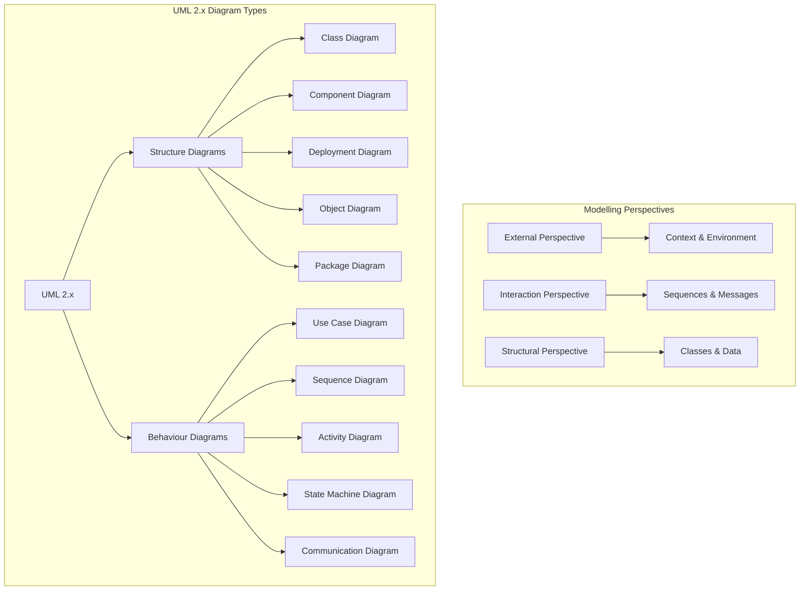

### The Unified Modeling Language

The Unified Modeling Language (UML) is a general-purpose visual modelling language standardised by the Object Management Group (OMG). UML provides thirteen diagram types in two categories: **structure diagrams** (static structure) and **behaviour diagrams** (dynamic behaviour).

UML is extensible through:
- **Stereotypes:** Extend UML vocabulary (`<<entity>>`, `<<controller>>`, `<<service>>`)
- **Tagged values:** Extend properties of model elements (`{version=1.0}`)
- **Constraints:** Add rules expressed in natural language or OCL

### Use Case Diagrams

Use case diagrams show interactions between actors and the system. An **actor** is a role played by a user or another system. A **use case** represents a complete unit of functionality.

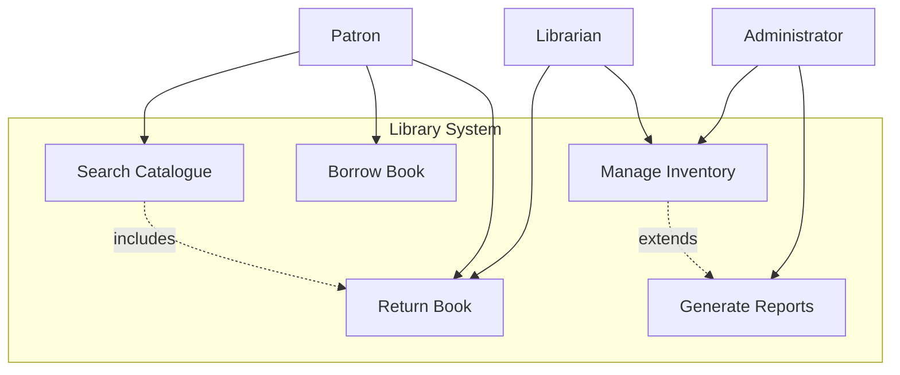

| Relationship | Notation | Description |
|-------------|----------|-------------|
| **Association** | Solid line | Actor participates in use case |
| **Include** | Dashed arrow `<<include>>` | One use case always includes another |
| **Extend** | Dashed arrow `<<extend>>` | One use case optionally extends another |
| **Generalisation** | Hollow triangle arrow | Child use case inherits from parent |

### Class Diagrams

Class diagrams describe the static structure of a system by showing classes, attributes, operations, and relationships.

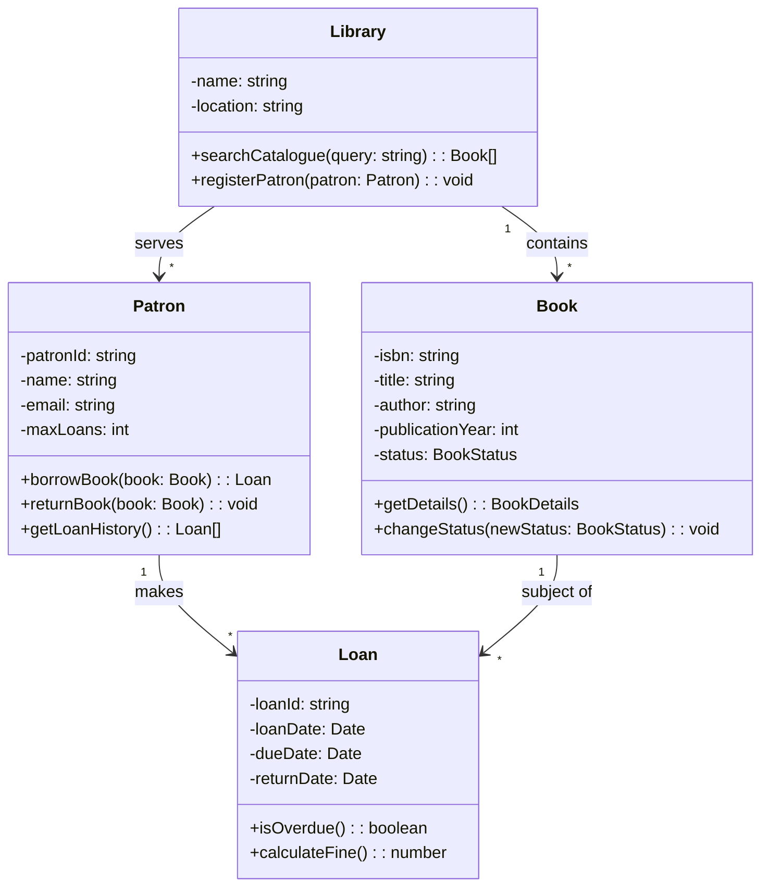

**Relationships:**

| Type | Notation | Meaning |
|------|----------|---------|
| **Association** | Solid line | Structural connection |
| **Aggregation** | Hollow diamond | Whole-part (part exists independently) |
| **Composition** | Filled diamond | Whole-part (part cannot exist independently) |
| **Inheritance** | Hollow triangle | Subclass inherits from superclass |
| **Dependency** | Dashed arrow | Change to one may affect the other |

**Multiplicity:**

| Notation | Meaning |
|----------|---------|
| `1` | Exactly one |
| `0..1` | Zero or one |
| `*` | Zero or more |
| `1..*` | One or more |
| `0..5` | Zero to five |

### Sequence Diagrams

Sequence diagrams model interactions between objects over time, showing messages exchanged in chronological order.

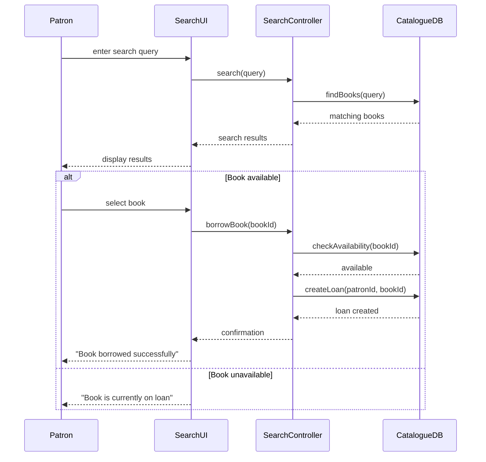

**Combined Fragments:**

| Operator | Meaning |
|----------|---------|
| `alt` | Alternative scenarios |
| `opt` | Optional scenario |
| `loop` | Repetition |
| `par` | Parallel execution |
| `ref` | Reference to another diagram |

### Activity Diagrams

Activity diagrams model the flow of control from one activity to another, supporting sequential, concurrent, and conditional behaviour.

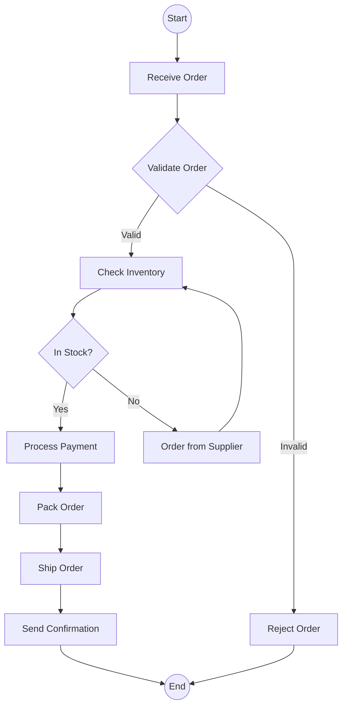

**Activity Elements:**

| Element | Notation | Description |
|---------|----------|-------------|
| **Initial node** | Filled circle | Start of activity |
| **Activity** | Rounded rectangle | Action to perform |
| **Decision** | Diamond | Conditional branch |
| **Fork** | Thick bar | Split into concurrent flows |
| **Join** | Thick bar | Synchronise concurrent flows |
| **Final node** | Bullseye | End of activity |
| **Swimlane** | Partition | Responsibilities by actor |

### State Machine Diagrams

State machine diagrams model the behaviour of an object as it responds to events over its lifetime.

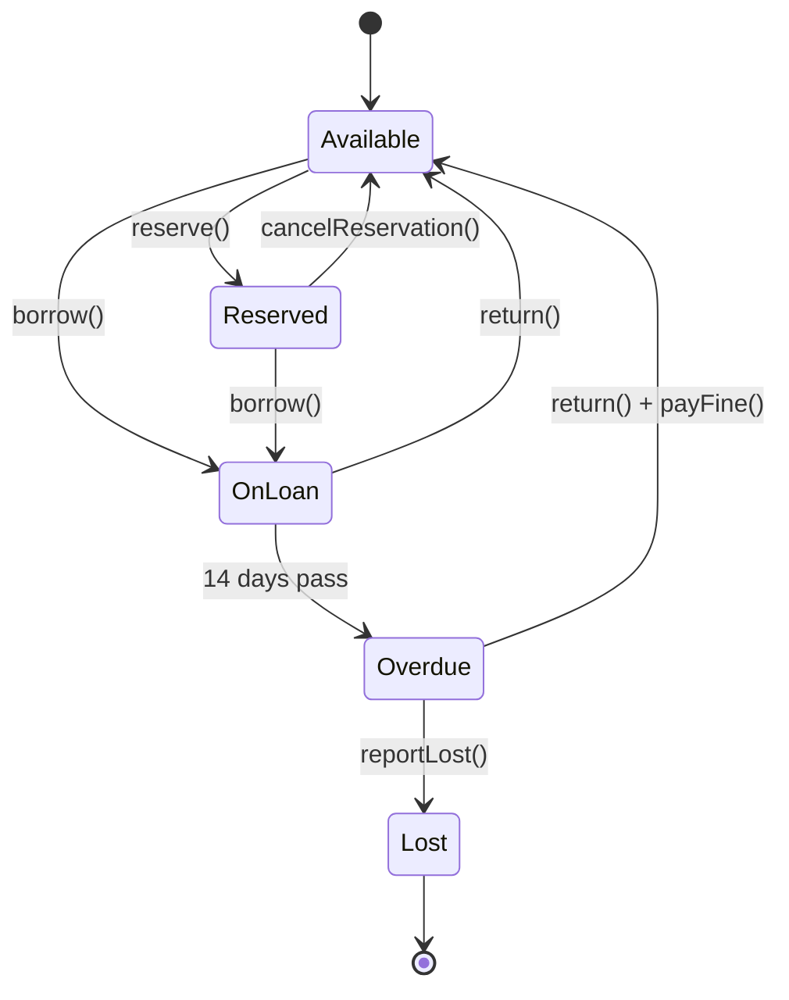

| Element | Description |
|---------|-------------|
| **Initial state** | Starting point (filled circle) |
| **State** | Condition during which object waits or performs activity |
| **Transition** | Movement between states triggered by events |
| **Guard condition** | Boolean condition that must be true for transition |
| **Composite state** | Nested states within a state |
| **Concurrent region** | Independent sub-states within a composite state |

### Component Diagrams

Component diagrams show the organisation and dependencies among software components. A **component** is a modular, deployable, and replaceable part that encapsulates implementation and exposes interfaces.

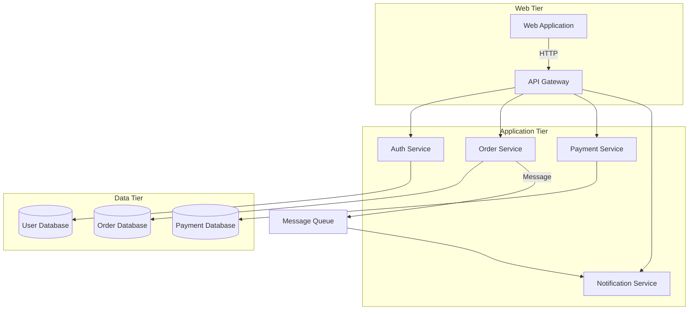

- **Provided interfaces:** Services offered by component (lollipop notation)
- **Required interfaces:** Services needed from environment (socket notation)

### Deployment Diagrams

Deployment diagrams show the physical deployment of software components on hardware nodes.

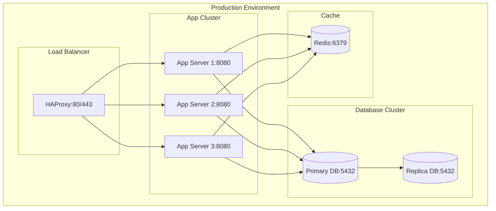

### Data Flow Diagrams

Data flow diagrams (DFDs) model the flow of data through a system. They are hierarchically organised:

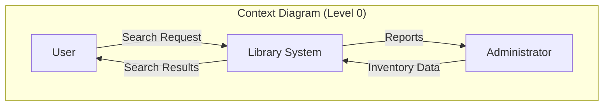

**DFD Elements:**

| Symbol | Name | Description |
|--------|------|-------------|
| Circle/rounded rectangle | Process | Transforms data |
| Arrow | Data flow | Data in motion |
| Double line | Data store | Data at rest |
| Rectangle | External entity | Source/destination outside system |

### Entity-Relationship Diagrams

Entity-relationship (ER) diagrams model the data perspective, showing entity types, attributes, and relationships.

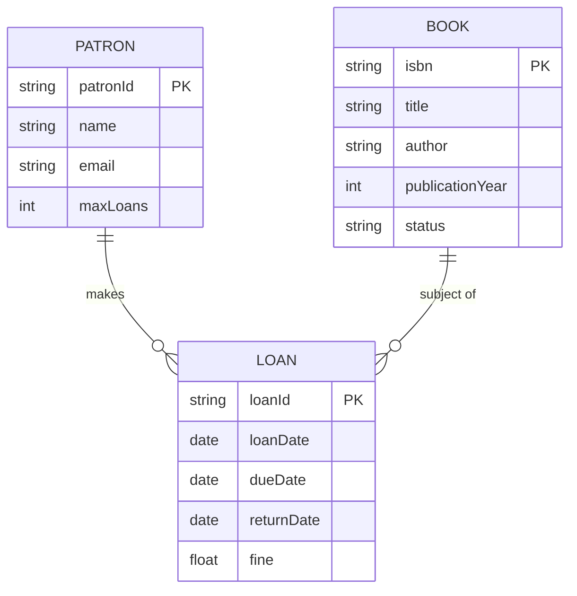

### Object Constraint Language

OCL is a formal language for expressing constraints on UML models. It is declarative with no side effects.

**OCL Expression Types:**

| Type | Example |
|------|---------|
| **Invariant** | `context Account inv: self.balance >= 0` |
| **Precondition** | `context Account::withdraw(a: Integer) pre: self.balance >= a` |
| **Postcondition** | `context Account::withdraw(a: Integer) post: self.balance = self@pre.balance - a` |
| **Query** | `context Library::getOverdueLoans(): Set(Loan) body: self.loans->select(l \| l.isOverdue())` |

**OCL Collection Operations:**

```typescript
// OCL: context Library inv: self.books->forAll(b | b.status <> BookStatus::LOST)
// OCL: context Patron inv: self.loans->select(l | l.isOverdue())->size() <= 3
// OCL: context Library::getAvailableBooks(): Set(Book) 
//      body: self.books->select(b | b.status = BookStatus::AVAILABLE)
```

### Model-Driven Engineering

Model-driven engineering (MDE) elevates models from documentation to primary development artefacts:

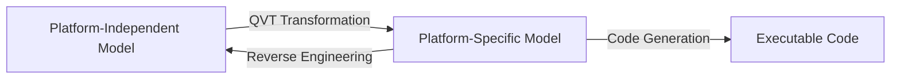

- **PIM (Platform-Independent Model):** Describes system independently of implementation platform
- **PSM (Platform-Specific Model):** Incorporates platform-specific details
- **QVT (Query/View/Transformation):** Standard for model transformations

## Practical Takeaways

1. **Model what matters** — not every detail needs a model; focus on complex or critical aspects
2. **Keep diagrams consistent** — the same class should appear identically across all diagrams
3. **Use the right diagram for the audience** — use case diagrams for stakeholders, class diagrams for developers
4. **Don't over-model** — excessive detail makes diagrams hard to read; use multiple levels of abstraction
5. **Models should be living documents** — update them as the code evolves, or they become misleading
6. **Combine UML with code** — generate skeleton code from class diagrams to ensure consistency

## Examples

### Example 1: Mapping UML to TypeScript

```typescript
// UML Class: Book
// - isbn: string
// - title: string
// - status: BookStatus
// + getDetails(): BookDetails
// + changeStatus(newStatus: BookStatus): void
enum BookStatus {
  AVAILABLE = 'AVAILABLE',
  ON_LOAN = 'ON_LOAN',
  RESERVED = 'RESERVED',
  LOST = 'LOST',
  WITHDRAWN = 'WITHDRAWN',
}

class Book {
  constructor(
    private readonly isbn: string,
    private readonly title: string,
    private readonly author: string,
    private readonly publicationYear: number,
    private status: BookStatus
  ) {}

  public getDetails(): BookDetails {
    return {
      isbn: this.isbn,
      title: this.title,
      author: this.author,
      year: this.publicationYear,
      status: this.status,
    };
  }

  public changeStatus(newStatus: BookStatus): void {
    const validTransitions: Record<BookStatus, BookStatus[]> = {
      [BookStatus.AVAILABLE]: [BookStatus.ON_LOAN, BookStatus.RESERVED, BookStatus.WITHDRAWN],
      [BookStatus.ON_LOAN]: [BookStatus.AVAILABLE, BookStatus.LOST],
      [BookStatus.RESERVED]: [BookStatus.ON_LOAN, BookStatus.AVAILABLE],
      [BookStatus.LOST]: [BookStatus.WITHDRAWN],
      [BookStatus.WITHDRAWN]: [],
    };
    if (!validTransitions[this.status].includes(newStatus)) {
      throw new Error(`Cannot transition from ${this.status} to ${newStatus}`);
    }
    this.status = newStatus;
  }
}

interface BookDetails {
  isbn: string;
  title: string;
  author: string;
  year: number;
  status: BookStatus;
}

// UML Sequence: Borrow Book
class CatalogueDB {
  private books: Map<string, Book> = new Map();

  public findBooks(query: string): BookDetails[] {
    return Array.from(this.books.values())
      .filter((b) => b.getDetails().title.includes(query))
      .map((b) => b.getDetails());
  }

  public checkAvailability(isbn: string): boolean {
    const book = this.books.get(isbn);
    return book !== undefined && book.getDetails().status === BookStatus.AVAILABLE;
  }

  public createLoan(patronId: string, isbn: string): string {
    const book = this.books.get(isbn);
    if (!book || book.getDetails().status !== BookStatus.AVAILABLE) {
      throw new Error('Book not available');
    }
    book.changeStatus(BookStatus.ON_LOAN);
    return `LOAN-${patronId}-${isbn}-${Date.now()}`;
  }
}

class SearchController {
  constructor(private readonly catalogue: CatalogueDB) {}

  public search(query: string): BookDetails[] {
    return this.catalogue.findBooks(query);
  }

  public borrowBook(patronId: string, isbn: string): string {
    if (!this.catalogue.checkAvailability(isbn)) {
      throw new Error('Book not available for borrowing');
    }
    return this.catalogue.createLoan(patronId, isbn);
  }
}
```

### Example 2: TypeScript State Machine from UML State Diagram

```typescript
type State = 'available' | 'onLoan' | 'overdue' | 'reserved' | 'lost' | 'withdrawn';
type Event = 'borrow' | 'return' | 'reserve' | 'cancelReservation' | 'reportLost' | 'daysPass' | 'withdraw';

interface Transition {
  from: State;
  to: State;
  event: Event;
  guard?: () => boolean;
  action?: () => void;
}

class BookStateMachine {
  private currentState: State;
  private readonly transitions: Transition[];

  constructor() {
    this.currentState = 'available';
    this.transitions = [
      { from: 'available', to: 'onLoan', event: 'borrow' },
      { from: 'available', to: 'reserved', event: 'reserve' },
      { from: 'onLoan', to: 'overdue', event: 'daysPass', guard: () => true },
      { from: 'onLoan', to: 'available', event: 'return' },
      { from: 'overdue', to: 'available', event: 'return' },
      { from: 'overdue', to: 'lost', event: 'reportLost' },
      { from: 'reserved', to: 'onLoan', event: 'borrow' },
      { from: 'reserved', to: 'available', event: 'cancelReservation' },
      { from: 'lost', to: 'withdrawn', event: 'withdraw' },
    ];
  }

  public send(event: Event): boolean {
    const transition = this.transitions.find(
      (t) => t.from === this.currentState && t.event === event
    );
    if (!transition) {
      throw new Error(
        `No transition from state '${this.currentState}' on event '${event}'`
      );
    }
    if (transition.guard && !transition.guard()) {
      throw new Error('Guard condition not met');
    }
    this.currentState = transition.to;
    if (transition.action) transition.action();
    return true;
  }

  public getState(): State {
    return this.currentState;
  }
}
```

### Example 3: OCL Constraints in TypeScript

```typescript
// OCL: context Account inv: self.balance >= 0
// TypeScript equivalent using a library-like approach:

interface OCLConstraint<T> {
  evaluate(target: T): boolean;
  message: string;
}

class Account {
  constructor(
    public readonly id: string,
    public readonly owner: string,
    public balance: number,
    public readonly minimumBalance: number = 0
  ) {}

  public withdraw(amount: number): void {
    if (this.balance - amount < this.minimumBalance) {
      throw new Error('Insufficient funds');
    }
    this.balance -= amount;
  }

  public deposit(amount: number): void {
    this.balance += amount;
  }
}

class OCLValidator {
  private constraints: OCLConstraint<unknown>[] = [];

  public addConstraint<T>(constraint: OCLConstraint<T>): void {
    this.constraints.push(constraint as OCLConstraint<unknown>);
  }

  public validate<T>(target: T): { valid: boolean; violations: string[] } {
    const violations: string[] = [];
    for (const constraint of this.constraints) {
      if (!constraint.evaluate(target)) {
        violations.push(constraint.message);
      }
    }
    return { valid: violations.length === 0, violations };
  }
}

// OCL: context Account inv: self.balance >= 0
const accountValidator = new OCLValidator();
accountValidator.addConstraint<Account>({
  evaluate: (a) => a.balance >= 0,
  message: 'Account balance must be non-negative',
});

// OCL: context Account::withdraw(a: Integer) pre: self.balance >= a
accountValidator.addConstraint<Account>({
  evaluate: (a) => a.balance >= 0,
  message: 'Precondition: sufficient balance',
});
```

## Chapter Quiz

**Q1: Which UML diagram is best suited for showing the flow of control across multiple actors?**
- A) Class diagram
- B) Activity diagram
- C) Component diagram
- D) Deployment diagram

**Answer: B** — Activity diagrams model control flow across actors using swimlanes.

**Q2: What does the UML relationship `<<include>>` mean in a use case diagram?**
- A) One use case optionally extends another
- B) One use case always includes the behaviour of another
- C) One actor specialises another
- D) A use case inherits from an actor

**Answer: B** — Include means the base use case always incorporates the included use case's behaviour.

**Q3: In a class diagram, composition (filled diamond) differs from aggregation (hollow diamond) because:**
- A) Composition implies the part cannot exist without the whole
- B) Composition implies shared ownership
- C) Aggregation implies the part cannot exist without the whole
- D) There is no difference

**Answer: A** — In composition, the part's lifecycle depends on the whole.

**Q4: What is the primary challenge of model checking in formal verification?**
- A) It requires a formal specification language
- B) The state explosion problem
- C) It cannot handle concurrent systems
- D) It requires manual proof construction

**Answer: B** — The number of states grows exponentially with system components.

**Q5: What is the purpose of a PIM in Model-Driven Architecture?**
- A) To describe the system independently of the implementation platform
- B) To specify deployment topology
- C) To define database schemas
- D) To generate test cases

**Answer: A** — A Platform-Independent Model describes the system without platform-specific details.

## Summary

System modelling provides multiple perspectives on a software system. UML is the standard modelling language, offering thirteen diagram types for structural and behavioural modelling. Use case diagrams establish system boundaries and functionality. Class diagrams define static structure. Sequence diagrams detail interactions over time. Activity diagrams model control flow. State machine diagrams capture lifecycle behaviour. Component and deployment diagrams show physical organisation. DFDs and ER diagrams remain valuable for data-oriented modelling. OCL adds formal precision to UML models. Model-driven engineering transforms models from documentation into primary development artefacts.

## Exercises

### Review Questions

1. What are the three perspectives from which a system can be modelled?
2. List the structure diagrams and behaviour diagrams defined by UML.
3. What is the difference between include and extend relationships in use case diagrams?
4. How does a sequence diagram convey the timing of interactions?
5. What is the purpose of a fork node in an activity diagram?
6. Distinguish between aggregation and composition in class diagrams.
7. What is the difference between a provided interface and a required interface?
8. How does SysML extend UML for systems engineering?
9. What is the distinction between a PIM and a PSM in MDA?
10. What does an OCL invariant specify?

### Application Problems

1. Draw a use case diagram for a university library system. Identify at least four actors and twelve use cases.
2. Develop a class diagram for an online course registration system. Include Student, Course, Instructor, Registration, and Department with appropriate attributes, operations, and relationships.
3. Construct a sequence diagram for the "Place Order" use case of an e-commerce system showing interactions between customer, cart, inventory system, and payment gateway.
4. Implement the full class diagram from problem 2 in TypeScript with type definitions, methods, and appropriate relationships.

### Challenge Problem

You are the chief architect for a hospital information system that must integrate patient records, appointment scheduling, billing, laboratory results, and pharmacy management. Develop a modelling strategy that addresses all five subsystems. Specify which UML diagram types you would use for each subsystem and in what order you would develop them. Explain how you would ensure consistency across the models. Implement a TypeScript model consistency checker that verifies cross-diagram references (e.g., a class appearing in a class diagram must match its usage in sequence diagrams).
