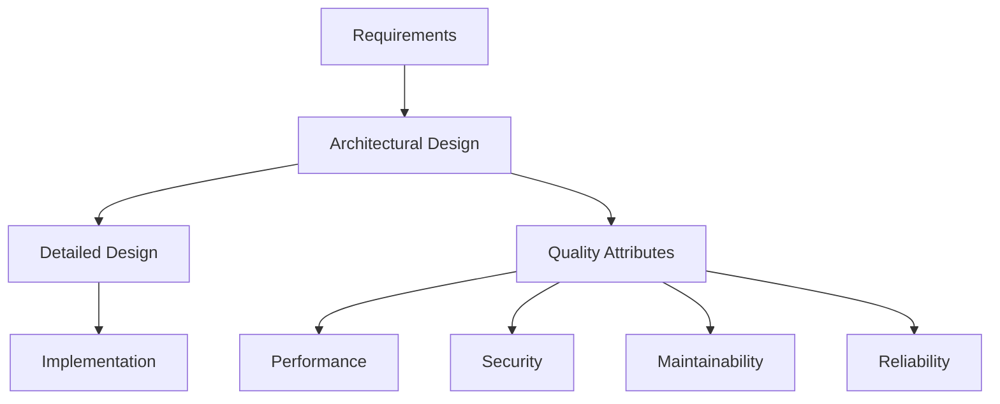
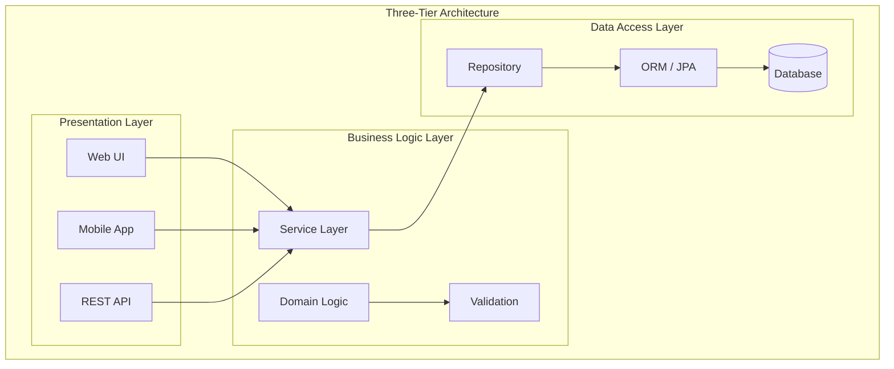
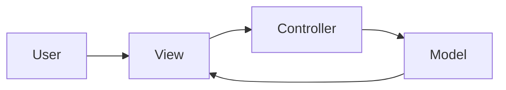
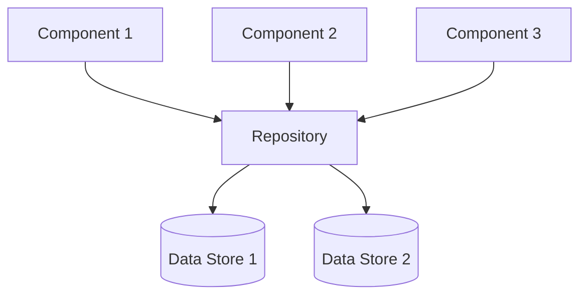
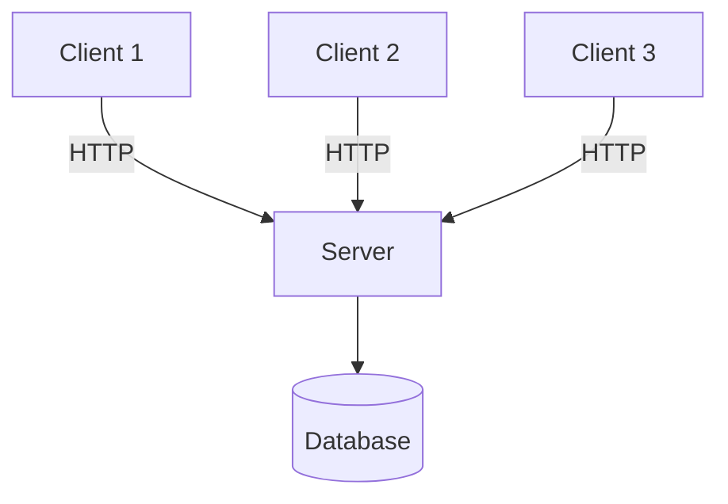
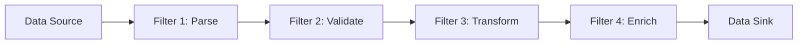
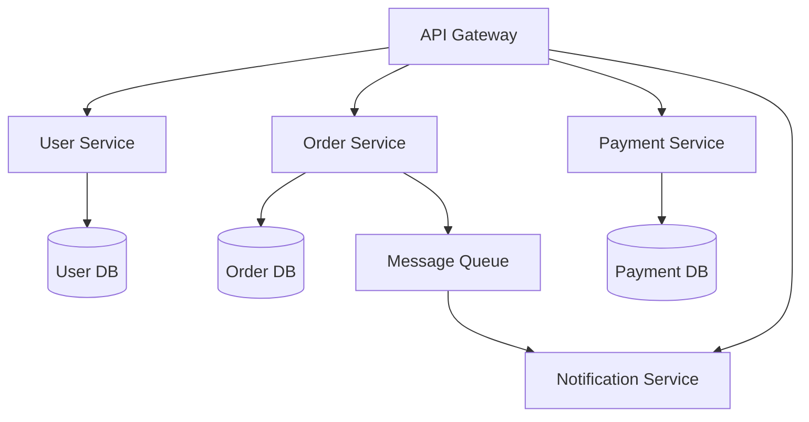
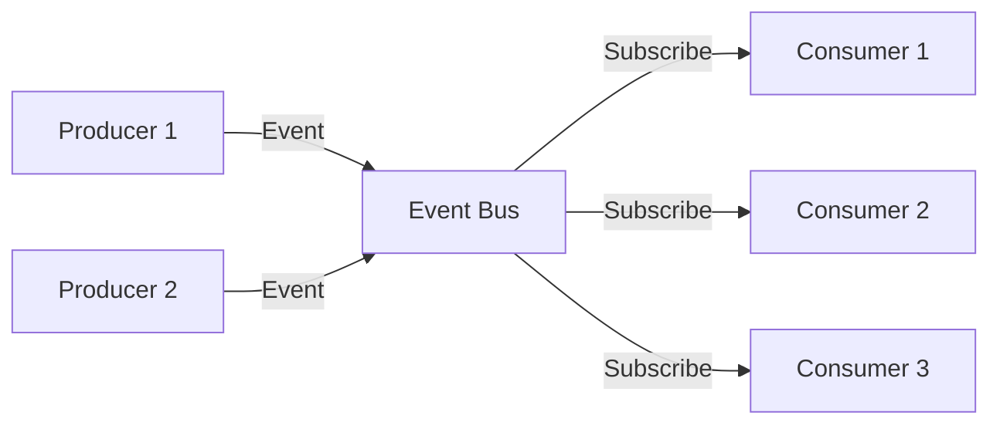
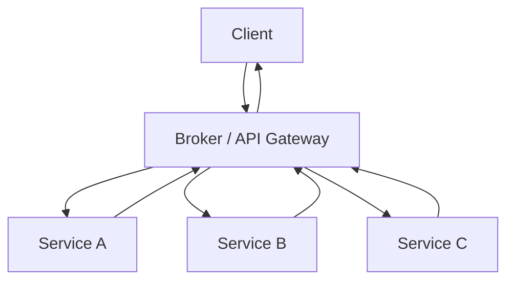

# Architectural Design

## Learning Objectives

After completing this chapter, the student will be able to:
- Explain the role of architectural design in software engineering
- Identify the key decisions made during architectural design
- Describe and compare the layered, MVC, repository, client-server, pipe-and-filter, microservices, event-driven, and broker patterns
- Apply quality attribute scenarios to evaluate architectures
- Document architectural decisions using ADRs
- Implement layered and MVC architectures in TypeScript

## Theory

### The Role of Architectural Design

Architectural design is the process of defining the overall structure of a software system. It identifies the major components, their responsibilities, and the relationships between them. Architectural design is the first stage of the design process and serves as the bridge between requirements and detailed design.

The architecture of a system influences every subsequent development activity. It determines the system's ability to meet **quality attributes** including performance, security, maintainability, and reliability. Architectural decisions are the most consequential decisions in software development because they are the most difficult to change.



### Architectural Decisions

Architectural decisions include:
- Selection of architectural patterns
- Partitioning of functionality into components
- Assignment of responsibilities to components
- Specification of communication protocols
- Choice of data storage strategy
- Adoption of technology platforms

**Architecture Decision Records (ADRs)** capture each decision with its context, alternatives, rationale, and consequences:

```typescript
interface ArchitectureDecisionRecord {
  id: string;
  title: string;
  status: 'proposed' | 'accepted' | 'deprecated' | 'superseded';
  context: string;
  alternatives: string[];
  decision: string;
  consequences: string[];
  date: Date;
}
```

### Quality Attribute Scenarios

Quality attribute scenarios provide a structured way to specify and evaluate quality requirements:

| Element | Description | Example |
|---------|-------------|---------|
| **Stimulus** | Event that triggers a response | "1,000 concurrent users send requests" |
| **Source** | Origin of the stimulus | "Users through web browsers" |
| **Environment** | System state | "Normal operations" |
| **Response** | Observable behaviour | "Requests processed within 2 seconds" |
| **Response measure** | How the response is quantified | "95th percentile response time &lt; 2s" |
| **Artifact** | What is being measured | "The web application tier" |

### The Layered Architecture Pattern

The layered architecture organises the system into horizontal layers, where each layer provides services to the layer above and consumes services from the layer below.



**Benefits:**
- Separation of concerns — each layer has a clear responsibility
- Encapsulation — changes within a layer do not affect other layers if interfaces remain stable
- Testability — each layer can be tested independently
- Reusability — layers can be reused across applications

**Costs:**
- Performance overhead from passing through multiple layers
- Layers may become tightly coupled if dependencies are not managed
- **Layering** can introduce cascading changes when interfaces change
- Extra code for facade/wrapper classes

**When to use:** Enterprise applications, information systems, systems with multiple presentation channels.

### The Model-View-Controller Pattern

MVC separates an interactive application into three components:



| Component | Responsibility |
|-----------|----------------|
| **Model** | Application data, business rules, state management |
| **View** | Rendering the model into a user interface |
| **Controller** | Interpreting user input, updating model or view |

**Variations:**
- **MVP (Model-View-Presenter):** View is passive, Presenter handles all UI logic
- **MVVM (Model-View-ViewModel):** ViewModel exposes data binding, used in WPF/Angular
- **MVC in web frameworks:** Rails, Spring MVC, ASP.NET MVC, Express.js

### The Repository Pattern

The repository pattern centralises data storage and management. All components access data through a central repository.



**Benefits:**
- Simple communication model — all components share the same data
- Data consistency — centralised update management
- Suitable for data-centric systems (information systems, compilers)

**Costs:**
- Repository becomes a performance bottleneck
- Single point of failure
- Components become coupled to the repository structure

### The Client-Server Pattern

The client-server pattern distributes the system into **servers** that provide services and **clients** that request them.



**Variations:**
- **Two-tier:** Client directly accesses database
- **Three-tier:** Application server mediates between client and database
- **Multi-tier (n-tier):** Additional intermediate layers for specific concerns

### The Pipe-and-Filter Pattern

The pipe-and-filter pattern processes data through a sequence of processing steps. **Filters** transform data; **pipes** convey data between filters.



**Benefits:**
- Filters are independent, reusable, and composable
- Supports incremental processing and parallel execution
- Easy to add, remove, or reorder filters

**Costs:**
- Overhead of data transformation between filters
- Difficulty maintaining state across the pipeline
- Error handling can be complex

**When to use:** Batch processing systems, compilers, ETL pipelines, data transformation.

### Microservices Architecture

Microservices decomposes a system into small, independently deployable services, each running in its own process and communicating through lightweight mechanisms.



**Benefits:**
- Independent deployability
- Technology diversity (polyglot persistence)
- Team alignment with Conway's law
- Resilience through fault isolation

**Costs:**
- Distributed system complexity
- Network latency
- Data consistency challenges (eventual consistency)
- Service discovery and orchestration
- Operational overhead

**When to use:** Large, complex systems with multiple development teams.

### The Event-Driven Pattern

The event-driven pattern organises components around the production and consumption of events.



**Benefits:**
- Highly decoupled — producers and consumers don't know each other
- Highly scalable — consumers can be added independently
- Real-time responsiveness

**Costs:**
- Event schema evolution
- Event ordering and delivery guarantees
- Debugging distributed event flows
- Eventual consistency

### The Broker Pattern

The broker pattern decouples clients from servers by introducing an intermediary — the **broker** — that routes requests.



**Modern incarnations:** API gateways, service meshes (Istio, Linkerd), message brokers (Kafka, RabbitMQ).

### Architecture Pattern Comparison

| Pattern | Coupling | Scalability | Complexity | Performance | Testability | Best For |
|---------|----------|-------------|------------|-------------|-------------|----------|
| Layered | Medium | Vertical | Low | Medium | High | Enterprise apps |
| MVC | Low | Vertical | Low | Medium | High | Interactive apps |
| Repository | High | Vertical | Low | Low | Medium | Data-centric |
| Client-Server | Medium | Horizontal | Medium | High | Medium | Distributed apps |
| Pipe-Filter | Low | Horizontal | Medium | High | High | Data processing |
| Microservices | Low | Horizontal | High | Medium | High | Large systems |
| Event-Driven | Very low | Horizontal | High | Medium | Medium | Reactive systems |
| Broker | Low | Horizontal | Medium | Low | Medium | Service integration |

### Application Architecture Types

**Transaction Processing Systems:**
- Three-tier structure: presentation, transaction processing, database
- Must guarantee ACID properties
- Examples: banking, airline reservations, e-commerce

**Information Systems:**
- Repository pattern with shared database
- Layered architecture with MVC presentation
- Data-intensive: entry, query, reporting, analysis

**Language Processing Systems:**
- Pipe-and-filter structure: lexical → syntax → semantic → code generation → optimisation
- Each phase transforms the program representation

## Examples

### Example 1: Layered Architecture in TypeScript

```typescript
// === Presentation Layer ===
interface OrderRequest {
  customerId: string;
  items: { productId: string; quantity: number }[];
}

interface OrderResponse {
  orderId: string;
  totalAmount: number;
  status: string;
}

class OrderController {
  constructor(private readonly orderService: OrderService) {}

  public async createOrder(request: OrderRequest): Promise<OrderResponse> {
    try {
      const order = await this.orderService.placeOrder(
        request.customerId,
        request.items
      );
      return {
        orderId: order.id,
        totalAmount: order.totalAmount,
        status: order.status,
      };
    } catch (error) {
      throw new Error(`Failed to create order: ${(error as Error).message}`);
    }
  }

  public async getOrder(orderId: string): Promise<OrderResponse | null> {
    const order = await this.orderService.getOrder(orderId);
    return order
      ? { orderId: order.id, totalAmount: order.totalAmount, status: order.status }
      : null;
  }
}

// === Business Logic Layer ===
interface Order {
  id: string;
  customerId: string;
  items: OrderItem[];
  totalAmount: number;
  status: 'pending' | 'confirmed' | 'shipped' | 'delivered' | 'cancelled';
  createdAt: Date;
}

interface OrderItem {
  productId: string;
  productName: string;
  quantity: number;
  unitPrice: number;
}

class OrderService {
  constructor(
    private readonly orderRepository: OrderRepository,
    private readonly inventoryService: InventoryService,
    private readonly pricingService: PricingService
  ) {}

  public async placeOrder(customerId: string, items: { productId: string; quantity: number }[]): Promise<Order> {
    // Validate inventory
    for (const item of items) {
      const available = await this.inventoryService.checkAvailability(item.productId, item.quantity);
      if (!available) {
        throw new Error(`Insufficient stock for product ${item.productId}`);
      }
    }

    // Calculate pricing
    const orderItems: OrderItem[] = [];
    let totalAmount = 0;
    for (const item of items) {
      const price = await this.pricingService.getPrice(item.productId);
      const orderItem: OrderItem = {
        productId: item.productId,
        productName: item.productId, // Would be resolved from product service
        quantity: item.quantity,
        unitPrice: price,
      };
      orderItems.push(orderItem);
      totalAmount += price * item.quantity;
    }

    // Create order
    const order: Order = {
      id: `ORD-${Date.now()}`,
      customerId,
      items: orderItems,
      totalAmount,
      status: 'pending',
      createdAt: new Date(),
    };

    return this.orderRepository.save(order);
  }

  public async getOrder(orderId: string): Promise<Order | null> {
    return this.orderRepository.findById(orderId);
  }
}

// === Data Access Layer ===
interface OrderRepository {
  save(order: Order): Promise<Order>;
  findById(orderId: string): Promise<Order | null>;
  findByCustomerId(customerId: string): Promise<Order[]>;
}

class PostgresOrderRepository implements OrderRepository {
  public async save(order: Order): Promise<Order> {
    // Implementation would use database client
    console.log(`Saving order ${order.id}`);
    return order;
  }

  public async findById(orderId: string): Promise<Order | null> {
    console.log(`Finding order ${orderId}`);
    return null;
  }

  public async findByCustomerId(customerId: string): Promise<Order[]> {
    console.log(`Finding orders for customer ${customerId}`);
    return [];
  }
}

// === Cross-cutting services ===
class InventoryService {
  public async checkAvailability(productId: string, quantity: number): Promise<boolean> {
    // Would call inventory microservice
    return true;
  }
}

class PricingService {
  public async getPrice(productId: string): Promise<number> {
    // Would call pricing service
    return 29.99;
  }
}
```

### Example 2: MVC Architecture in TypeScript

```typescript
// === Model ===
interface UserModelData {
  id: string;
  username: string;
  email: string;
  createdAt: Date;
}

class UserModel {
  private users: Map<string, UserModelData> = new Map();
  private observers: ((users: UserModelData[]) => void)[] = [];

  public addUser(user: UserModelData): void {
    this.users.set(user.id, user);
    this.notifyObservers();
  }

  public getUser(id: string): UserModelData | undefined {
    return this.users.get(id);
  }

  public getAllUsers(): UserModelData[] {
    return Array.from(this.users.values());
  }

  public subscribe(observer: (users: UserModelData[]) => void): void {
    this.observers.push(observer);
  }

  private notifyObservers(): void {
    const users = this.getAllUsers();
    this.observers.forEach((obs) => obs(users));
  }
}

// === View ===
interface UserView {
  displayUsers(users: UserModelData[]): void;
  displayError(message: string): void;
  getUserInput(): { username: string; email: string };
}

class ConsoleUserView implements UserView {
  public displayUsers(users: UserModelData[]): void {
    console.log('\n=== User List ===');
    users.forEach((u) => {
      console.log(`${u.id}: ${u.username} (${u.email})`);
    });
    console.log('================\n');
  }

  public displayError(message: string): void {
    console.error(`Error: ${message}`);
  }

  public getUserInput(): { username: string; email: string } {
    return { username: 'new_user', email: 'user@example.com' };
  }
}

// === Controller ===
class UserController {
  constructor(
    private readonly model: UserModel,
    private readonly view: UserView
  ) {
    this.model.subscribe((users) => this.view.displayUsers(users));
  }

  public createUser(username: string, email: string): void {
    if (!username || !email) {
      this.view.displayError('Username and email are required');
      return;
    }
    if (!email.includes('@')) {
      this.view.displayError('Invalid email format');
      return;
    }
    const user: UserModelData = {
      id: `USR-${Date.now()}`,
      username,
      email,
      createdAt: new Date(),
    };
    this.model.addUser(user);
  }

  public listUsers(): void {
    const users = this.model.getAllUsers();
    this.view.displayUsers(users);
  }
}

// Usage
const model = new UserModel();
const view = new ConsoleUserView();
const controller = new UserController(model, view);
controller.createUser('alice', 'alice@example.com');
controller.createUser('bob', 'bob@example.com');
controller.listUsers();
```

### Example 3: ADR in TypeScript

```typescript
class ADRManager {
  private decisions: ArchitectureDecisionRecord[] = [];

  public recordDecision(
    title: string,
    context: string,
    alternatives: string[],
    decision: string,
    consequences: string[]
  ): ArchitectureDecisionRecord {
    const adr: ArchitectureDecisionRecord = {
      id: `ADR-${this.decisions.length + 1}`,
      title,
      status: 'proposed',
      context,
      alternatives,
      decision,
      consequences,
      date: new Date(),
    };
    this.decisions.push(adr);
    return adr;
  }

  public acceptDecision(id: string): void {
    const adr = this.decisions.find((d) => d.id === id);
    if (adr) adr.status = 'accepted';
  }

  public getDecisionsByStatus(status: string): ArchitectureDecisionRecord[] {
    return this.decisions.filter((d) => d.status === status);
  }

  public generateReport(): string {
    return this.decisions
      .map(
        (d) =>
          `# ${d.id}: ${d.title}\n` +
          `Status: ${d.status}\n` +
          `Context: ${d.context}\n` +
          `Decision: ${d.decision}\n` +
          `Consequences: ${d.consequences.join(', ')}\n`
      )
      .join('\n---\n');
  }
}
```

## Summary

Architectural design defines the high-level structure of a software system. Major patterns include layered architecture for separation of concerns, MVC for interactive systems, repository for data-centric systems, client-server for distributed systems, pipe-and-filter for data processing, microservices for independent deployability, event-driven for reactive systems, and broker for distribution transparency. Each pattern has specific benefits and costs — selection should be guided by quality attribute requirements documented through scenarios. Application architectures vary by domain: transaction processing emphasises ACID guarantees, information systems focus on data management, and language processing systems follow a pipe-and-filter structure. Architectural decisions should be documented with ADRs.

## Practical Takeaways

1. **Start simple, evolve when needed** — a well-structured monolith beats premature microservices
2. **Let quality attributes drive architecture** — performance, security, and maintainability requirements should determine pattern selection
3. **Document architectural decisions** — ADRs save future teams from repeating mistakes
4. **Design for change** — identify what's likely to change and isolate it behind interfaces
5. **Monoliths are not anti-patterns** — many successful systems never need microservices
6. **Test the architecture early** — performance and scalability should be validated with prototypes

## Chapter Quiz

**Q1: Which architectural pattern is most appropriate for an interactive system that must support multiple views of the same data?**
- A) Layered
- B) MVC
- C) Repository
- D) Pipe-and-Filter

**Answer: B** — MVC supports multiple views (Views) of the same data (Model).

**Q2: What is the primary disadvantage of the repository pattern?**
- A) Low cohesion
- B) The repository becomes a performance bottleneck
- C) Difficult to add new components
- D) Limited reuse

**Answer: B** — The central repository can become a bottleneck and single point of failure.

**Q3: In a layered architecture, what is the main risk of not enforcing strict layer isolation?**
- A) Increased testability
- B) Higher performance
- C) Tight coupling between layers
- D) Better scalability

**Answer: C** — Without strict interfaces, layers become tightly coupled and changes ripple.

**Q4: What does an Architecture Decision Record (ADR) typically NOT contain?**
- A) The context of the decision
- B) Alternatives considered
- C) The full implementation code
- D) Consequences of the decision

**Answer: C** — ADRs document decisions, not implementation code.

**Q5: Which deployment strategy provides the fastest rollback capability?**
- A) Rolling deployment
- B) Blue-green deployment
- C) Canary deployment
- D) Recreate deployment

**Answer: B** — Blue-green allows instant rollback by switching traffic back to the previous environment.

### TypeScript: Architecture Analysis Tools

```typescript
// === Architecture Style Comparator ===
interface ArchStyle {
  name: string;
  coupling: "low" | "medium" | "high";
  cohesion: "low" | "medium" | "high";
  scalability: "low" | "medium" | "high";
  deployability: "low" | "medium" | "high";
  complexity: "low" | "medium" | "high";
  latency: "low" | "medium" | "high";
}
const archStyles: ArchStyle[] = [
  { name: "Layered", coupling: "low", cohesion: "medium", scalability: "medium", deployability: "low", complexity: "low", latency: "low" },
  { name: "Microservices", coupling: "low", cohesion: "high", scalability: "high", deployability: "high", complexity: "high", latency: "high" },
  { name: "Event-Driven", coupling: "low", cohesion: "high", scalability: "high", deployability: "medium", complexity: "high", latency: "medium" },
  { name: "Pipe-and-Filter", coupling: "low", cohesion: "high", scalability: "medium", deployability: "medium", complexity: "medium", latency: "medium" },
  { name: "Client-Server", coupling: "high", cohesion: "low", scalability: "medium", deployability: "medium", complexity: "low", latency: "low" },
  { name: "Monolithic", coupling: "high", cohesion: "high", scalability: "low", deployability: "low", complexity: "low", latency: "low" },
];

function compareStyles(a: string, b: string): Record<string, { a: string; b: string }> {
  const sa = archStyles.find((s) => s.name === a);
  const sb = archStyles.find((s) => s.name === b);
  if (!sa || !sb) return {};
  const result: Record<string, { a: string; b: string }> = {};
  for (const key of ["coupling", "cohesion", "scalability", "deployability", "complexity", "latency"] as (keyof ArchStyle)[]) {
    if (key === "name") continue;
    if (sa[key] !== sb[key]) result[key] = { a: sa[key], b: sb[key] };
  }
  return result;
}
console.log(compareStyles("Monolithic", "Microservices"));

// === Quality Attribute Scorer ===
interface QAScenario {
  attribute: "performance" | "availability" | "security" | "maintainability" | "usability" | "scalability";
  metric: string;
  target: number;
  actual: number;
}
function scoreAttributes(scenarios: QAScenario[]): { ok: number; failing: QAScenario[] } {
  const failing = scenarios.filter((s) => s.actual < s.target);
  return { ok: scenarios.length - failing.length, failing };
}
const qaScenarios: QAScenario[] = [
  { attribute: "performance", metric: "Response time (ms)", target: 200, actual: 150 },
  { attribute: "availability", metric: "Uptime (%)", target: 99.9, actual: 99.5 },
  { attribute: "security", metric: "Auth bypass", target: 0, actual: 0 },
];
console.log(scoreAttributes(qaScenarios));

// === Trade-off Analyzer ===
interface Decision {
  option: string;
  pros: string[];
  cons: string[];
  cost: number;
}
function analyzeTradeoff(decisions: Decision[]): string[] {
  return decisions.map((d) => {
    const score = d.pros.length * 2 - d.cons.length - d.cost / 1000;
    return `${d.option}: score=${score > 0 ? "+" : ""}${score.toFixed(1)} (${d.pros.length} pros, ${d.cons.length} cons, cost=$${d.cost})`;
  });
}
const archDecisions: Decision[] = [
  { option: "Microservices", pros: ["Independent deploy", "Team autonomy", "Tech diversity"], cons: ["Network complexity", "Data consistency", "DevOps burden"], cost: 50000 },
  { option: "Monolith", pros: ["Simple dev", "Single deploy", "Strong consistency"], cons: ["Scaling limits", "Team coupling", "Tech lock-in"], cost: 10000 },
];
console.log(analyzeTradeoff(archDecisions));

// === ADR Generator ===
interface ADR {
  title: string;
  context: string;
  decision: string;
  alternatives: string[];
  consequences: string[];
}
function formatADR(adr: ADR): string {
  return [
    `# ADR: ${adr.title}`,
    `## Context\n${adr.context}`,
    `## Decision\n${adr.decision}`,
    `## Alternatives Considered\n${adr.alternatives.map((a) => `- ${a}`).join("\n")}`,
    `## Consequences\n${adr.consequences.map((c) => `- ${c}`).join("\n")}`,
  ].join("\n\n");
}
console.log(formatADR({
  title: "Use PostgreSQL for primary data store",
  context: "Need ACID-compliant relational storage with JSONB support",
  decision: "Adopt PostgreSQL 16",
  alternatives: ["MySQL 8", "MongoDB 7"],
  consequences: ["Strong data integrity", "JSONB for flexible schemas", "Higher operational cost vs MySQL"],
}));
```

### TypeScript: Architecture Evaluation Tools

```typescript
// === Architecture Style Evaluator ===
interface QualityAttribute { name: string; weight: number; }
interface ArchitectureStyle { name: string; scores: Record<string, number>; }

function evaluateArchitecture(styles: ArchitectureStyle[], attributes: QualityAttribute[]): { name: string; total: number }[] {
  return styles.map(style => {
    const total = attributes.reduce((sum, attr) => sum + (style.scores[attr.name] ?? 0) * attr.weight, 0);
    return { name: style.name, total: Math.round(total * 10) / 10 };
  }).sort((a, b) => b.total - a.total);
}

// === Architectural Decision Record ===
interface ADR { id: string; title: string; status: "Proposed" | "Accepted" | "Deprecated" | "Superseded"; context: string; decision: string; consequences: string[]; }
function createADR(title: string, context: string, decision: string, consequences: string[]): ADR {
  return { id: `ADR-${Date.now()}`, title, status: "Proposed", context, decision, consequences };
}
function supersedeADR(adr: ADR, newADR: ADR): void { adr.status = "Superseded"; }

// === Module Dependency Analyzer ===
interface Module { name: string; dependsOn: string[]; }
function detectCycles(modules: Module[]): string[][] {
  const cycles: string[][] = [];
  const visited = new Set<string>();
  const inStack = new Set<string>();
  const dfs = (name: string, path: string[]) => {
    if (inStack.has(name)) {
      const cycleStart = path.indexOf(name);
      cycles.push(path.slice(cycleStart));
      return;
    }
    if (visited.has(name)) return;
    visited.add(name);
    inStack.add(name);
    const mod = modules.find(m => m.name === name);
    if (mod) for (const dep of mod.dependsOn) dfs(dep, [...path, dep]);
    inStack.delete(name);
  };
  for (const mod of modules) dfs(mod.name, [mod.name]);
  return cycles;
}

function computeLayeredArchitecture(modules: Module[]): Map<string, number> {
  const layers = new Map<string, number>();
  const visited = new Set<string>();
  function assign(name: string): number {
    if (layers.has(name)) return layers.get(name)!;
    if (visited.has(name)) return 0;
    visited.add(name);
    const mod = modules.find(m => m.name === name);
    if (!mod || mod.dependsOn.length === 0) { layers.set(name, 0); return 0; }
    const maxLayer = Math.max(...mod.dependsOn.map(assign)) + 1;
    layers.set(name, maxLayer);
    return maxLayer;
  }
  for (const mod of modules) assign(mod.name);
  return layers;
}

const mods: Module[] = [
  { name: "UI", dependsOn: ["Service"] },
  { name: "Service", dependsOn: ["DataAccess"] },
  { name: "DataAccess", dependsOn: ["Database"] },
  { name: "Database", dependsOn: [] },
];
console.log(computeLayeredArchitecture(mods)); // UI:2, Service:1, DataAccess:0, Database:0
```

## Exercises

### Review Questions

1. Why are architectural decisions considered the most consequential decisions in software development?
2. What is an architecture decision record, and what information does it capture?
3. Describe the three tiers of a three-tier layered architecture.
4. What are the roles of the Model, View, and Controller in MVC?
5. When is the repository pattern an appropriate architectural choice?
6. List three advantages and three challenges of microservices architecture.
7. How does the event-driven pattern achieve loose coupling?
8. What is the role of the broker in the broker pattern?
9. What are the five components of a quality attribute scenario?

### Application Problems

1. Propose an architecture for an online banking system. Identify the patterns you would use and justify each choice. Implement the key components in TypeScript.

2. Compare a microservices approach to a layered approach for a medium-sized e-commerce platform with ten developers. Include considerations for deployment, scalability, and team organisation.

3. Construct ADRs for three different architectural decisions in a hospital management system. Include context, alternatives considered, decision, and consequences.

4. Implement a complete MVC architecture in TypeScript for a simple task management application with the ability to create, list, and mark tasks as complete.

### Challenge Problem

A global logistics company is building a real-time shipment tracking platform. The system must track millions of shipments across multiple carriers, process GPS location updates at thousands of events per second, provide REST APIs for customer-facing applications, and guarantee 99.99% availability. Design an architectural solution addressing these requirements. Specify the architectural patterns, component decomposition, data consistency approach, scalability strategy, and fault tolerance mechanisms. Implement a TypeScript simulation demonstrating the architecture's event processing pipeline with configurable throughput and latency.

