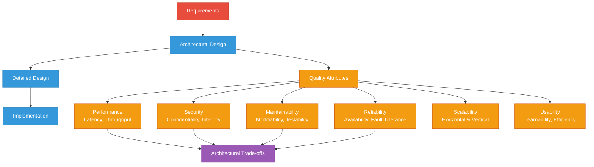
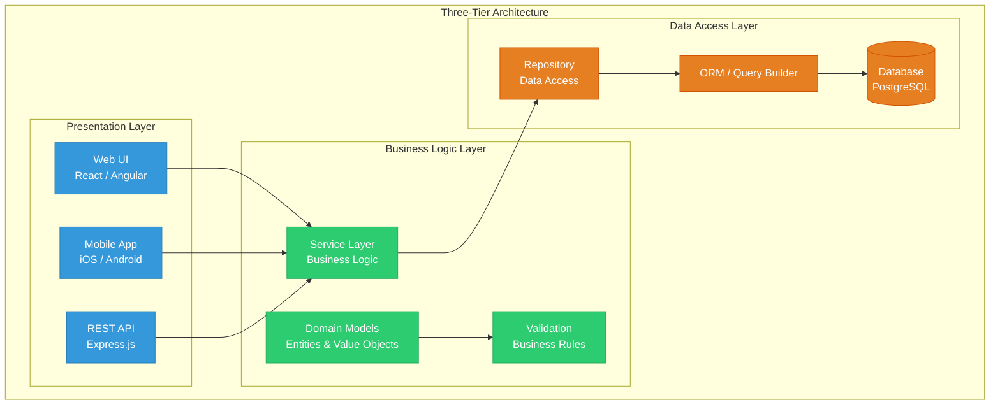
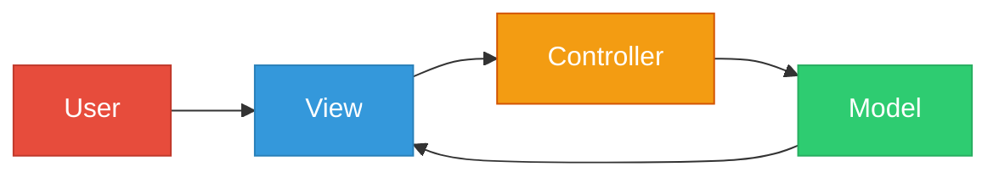
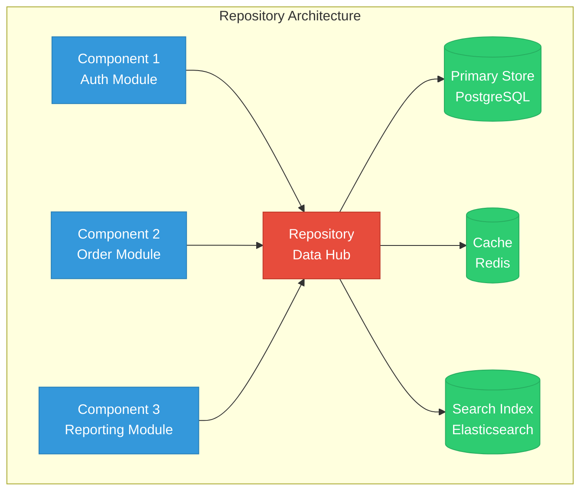
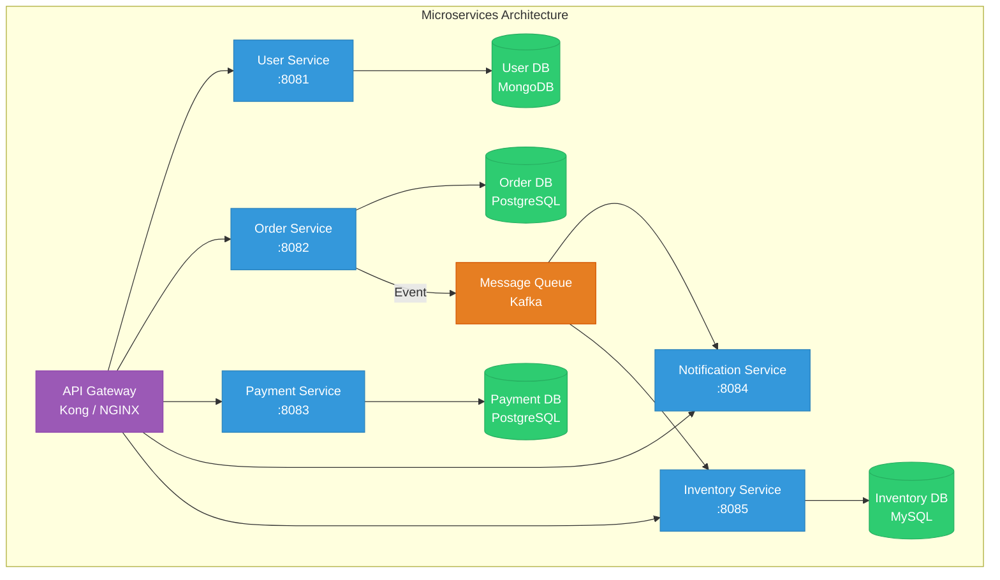
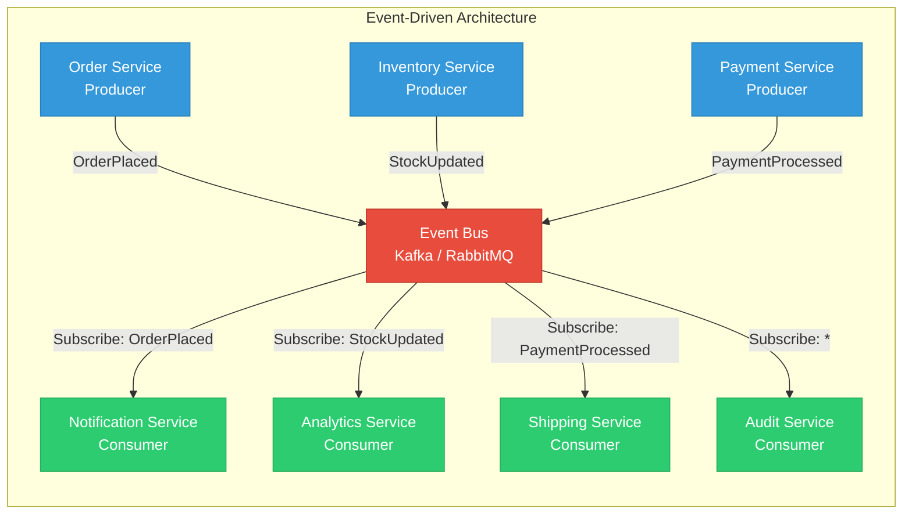
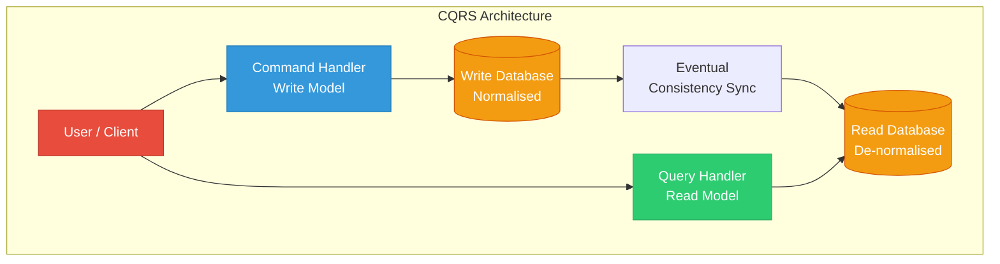
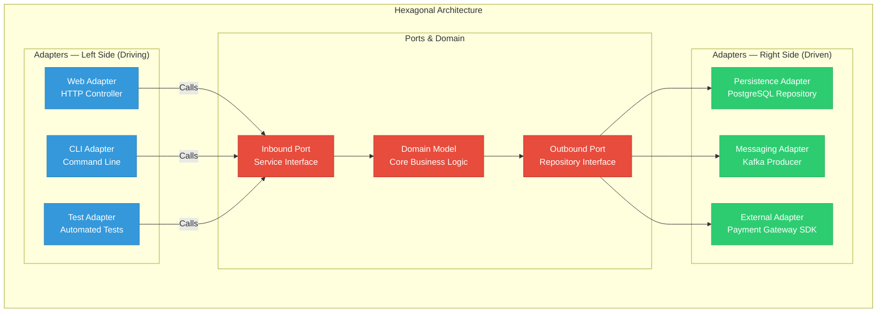
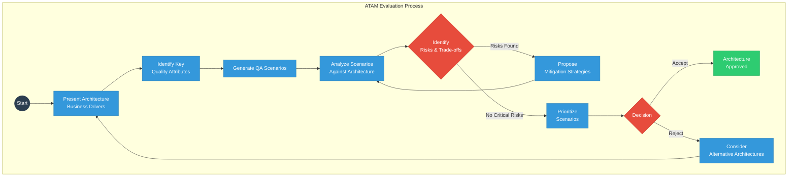

# Architectural Design

## Learning Objectives

> ✅ After completing this chapter, the student will be able to:
> - Explain the role of architectural design in software engineering and its impact on quality attributes
> - Identify the key decisions made during architectural design
> - Describe and compare layered, MVC, repository, client-server, pipe-and-filter, microservices, event-driven, CQRS, hexagonal, and broker patterns
> - Apply quality attribute scenarios to evaluate architectures quantitatively
> - Document architectural decisions using ADRs with full context, alternatives, and consequences
> - Evaluate architectures using SAAM/ATAM-inspired scoring frameworks
> - Select appropriate architectural patterns based on quality attribute requirements
> - Implement layered, MVC, and hexagonal architectures in TypeScript
> - Build an ArchitectureDecisionRecord manager with full lifecycle support

<!-- Image Gallery -->
<section class="lesson-visuals" aria-label="Visual learning resources">
  <header><span>VISUAL LEARNING</span><h2>See it. Review it. Remember it.</h2></header>
  <a class="lesson-visual-card" href="../../../assets/images/lessons/software-engineering/04-architectural-design/handwritten-notes.svg" target="_blank" rel="noopener">
    
    <span><strong>Handwritten notes</strong>Condensed notes for deliberate review.</span>
  </a>
  <a class="lesson-visual-card" href="../../../assets/images/lessons/software-engineering/04-architectural-design/sticky-notes.svg" target="_blank" rel="noopener">
    
    <span><strong>Sticky-note revision</strong>Fast recall prompts for revision.</span>
  </a>
  <a class="lesson-visual-card" href="../../../assets/images/lessons/software-engineering/04-architectural-design/visual-explanation.svg" target="_blank" rel="noopener">
    
    <span><strong>Visual concept guide</strong>A connected explanation of the key ideas.</span>
  </a>
</section>
<!-- End Image Gallery -->

## Theory

### The Role of Architectural Design

Architectural design is the process of defining the overall structure of a software system. It identifies the major components, their responsibilities, and the relationships between them. Architectural design is the first stage of the design process and serves as the bridge between requirements and detailed design.

The architecture of a system influences every subsequent development activity. It determines the system's ability to meet **quality attributes** including performance, security, maintainability, and reliability. Architectural decisions are the most consequential decisions in software development because they are the most difficult to change — a poor architectural decision can haunt a project for years.



### Architectural Decisions

Architectural decisions include:
- Selection of architectural patterns
- Partitioning of functionality into components
- Assignment of responsibilities to components
- Specification of communication protocols
- Choice of data storage strategy
- Adoption of technology platforms

**Architecture Decision Records (ADRs)** capture each decision with its context, alternatives, rationale, and consequences. The lightweight ADR format (by Michael Nygard) has become an industry standard:

```typescript
interface ArchitectureDecisionRecord {
  id: string;
  title: string;
  status: 'proposed' | 'accepted' | 'deprecated' | 'superseded';
  context: string;
  alternatives: string[];
  decision: string;
  rationale: string;
  consequences: string[];
  date: Date;
  supersedes?: string;
}
```

### Quality Attribute Scenarios

Quality attribute scenarios provide a structured way to specify and evaluate quality requirements. Each scenario has six parts:

| Element | Description | Example |
|---------|-------------|---------|
| **Stimulus** | Event that triggers a response | "1,000 concurrent users send HTTP requests" |
| **Source** | Origin of the stimulus | "Users through web browsers globally" |
| **Environment** | System state during response | "Normal operations, peak business hours" |
| **Response** | Observable behaviour produced | "Requests processed, responses returned" |
| **Response measure** | How the response is quantified | "95th percentile response time < 2 seconds" |
| **Artifact** | System component being measured | "The web application tier, CPU at < 70%" |

**Example scenarios:**

| Attribute | Scenario |
|-----------|----------|
| **Availability** | When a database node fails (stimulus), the system (artifact) in production (environment) continues serving reads from replicas (response) within 5 seconds with zero data loss (measure). |
| **Modifiability** | When a developer changes the pricing algorithm (stimulus), the system (artifact) at design time (environment) can be modified in under 4 hours by one developer (response) with no regression in test coverage (measure). |
| **Performance** | When 10,000 concurrent users submit orders (stimulus), the system (artifact) under peak load (environment) processes all orders within 30 seconds (response) at 99th percentile latency under 500ms (measure). |
| **Security** | When an attacker attempts SQL injection (stimulus), the system (artifact) in production (environment) rejects the input, logs the attempt (response) with zero successful injections per million attempts (measure). |

### Architecture Pattern Categories

Architectural patterns can be categorised by their primary concern:

| Category | Concern | Example Patterns |
|----------|---------|-----------------|
| **Structure** | How components are organised | Layered, Hexagonal, Onion |
| **Distribution** | How components communicate across boundaries | Client-Server, Microservices, Broker |
| **Interaction** | How components interact | Event-Driven, Publish-Subscribe, CQRS |
| **Data** | How data is managed | Repository, CQRS, Event Sourcing |

### The Layered Architecture Pattern

The layered architecture organises the system into horizontal layers, where each layer provides services to the layer above and consumes services from the layer below.



**Benefits:**
- Separation of concerns — each layer has a clear responsibility
- Encapsulation — changes within a layer do not affect other layers if interfaces remain stable
- Testability — each layer can be tested independently (mock the layer below)
- Reusability — layers can be reused across applications

**Costs:**
- Performance overhead from passing through multiple layers
- Layers may become tightly coupled if dependencies are not managed
- Cascading changes when interfaces change
- Extra code for facade/wrapper classes

**When to use:** Enterprise applications, information systems, systems with multiple presentation channels.

### The Model-View-Controller Pattern

MVC separates an interactive application into three components. It is one of the most widely used patterns in web and desktop applications.



| Component | Responsibility |
|-----------|----------------|
| **Model** | Application data, business rules, state management, persistence |
| **View** | Rendering the model into a user interface, observing model changes |
| **Controller** | Interpreting user input, updating model or view, routing |

**Variations:**
- **MVP (Model-View-Presenter):** View is passive, Presenter handles all UI logic
- **MVVM (Model-View-ViewModel):** ViewModel exposes data binding, used in WPF, Angular
- **MVC in web frameworks:** Rails, Spring MVC, ASP.NET MVC, Express.js, Laravel

### The Repository Pattern

The repository pattern centralises data storage and management. All components access data through a central repository, providing a clean separation between domain logic and data access.



**Benefits:**
- Simple communication model — all components share the same data
- Data consistency — centralised update management ensures integrity
- Suitable for data-centric systems (information systems, compilers, IDEs)

**Costs:**
- Repository becomes a performance bottleneck under high concurrency
- Single point of failure without replication
- Components become coupled to the repository structure

### The Client-Server Pattern

The client-server pattern distributes the system into **servers** that provide services and **clients** that request them.

**Variations:**
- **Two-tier:** Client directly accesses database (fat client)
- **Three-tier:** Application server mediates between client and database
- **Multi-tier (n-tier):** Additional intermediate layers for specific concerns (caching, messaging, authentication)

### The Pipe-and-Filter Pattern

The pipe-and-filter pattern processes data through a sequence of processing steps. **Filters** transform data; **pipes** convey data between filters.

**Benefits:** Filters are independent, reusable, composable; supports incremental processing and parallel execution.
**Costs:** Overhead of data transformation between filters; difficulty maintaining state across the pipeline.
**When to use:** Batch processing, compilers, ETL pipelines, data transformation pipelines.

### Microservices Architecture

Microservices decomposes a system into small, independently deployable services, each running in its own process and communicating through lightweight mechanisms (typically HTTP/REST or messaging).



**Benefits:**
- Independent deployability — each service can be deployed without coordinating with others
- Technology diversity (polyglot persistence) — each service can use the best technology for its domain
- Team alignment with Conway's law — service boundaries match team boundaries
- Resilience through fault isolation — one service failure doesn't cascade

**Costs:**
- Distributed system complexity — network latency, partial failures, distributed tracing
- Data consistency challenges — eventual consistency requires careful design
- Service discovery and orchestration overhead
- Operational burden — monitoring, logging, deployment automation for many services

**When to use:** Large, complex systems with multiple independent development teams.

### The Event-Driven Pattern

The event-driven pattern organises components around the production and consumption of events. Producers emit events without knowing which consumers will process them; consumers subscribe to events of interest.



**Benefits:**
- Highly decoupled — producers and consumers don't know each other
- Highly scalable — consumers can be added independently
- Real-time responsiveness — events processed as they occur

**Costs:**
- Event schema evolution requires careful versioning
- Event ordering and delivery guarantees are challenging
- Debugging distributed event flows is difficult
- Eventual consistency must be acceptable

### CQRS (Command Query Responsibility Segregation)

CQRS separates read and write operations into different models. Commands change state; queries return data. This allows optimising each model independently.



**When to use:** Systems where read and write workloads differ significantly (e.g., high-write transaction systems with complex querying). Not recommended for simple CRUD applications where the overhead is not justified.

### Hexagonal Architecture (Ports and Adapters)

The hexagonal architecture, by Alistair Cockburn, places the domain model at the centre with ports and adapters connecting it to the outside world. This creates a clean separation between business logic and infrastructure concerns.



### The Broker Pattern

The broker pattern decouples clients from servers by introducing an intermediary — the **broker** — that routes requests, handles load balancing, and provides location transparency.

**Modern incarnations:** API gateways (Kong, AWS API Gateway), service meshes (Istio, Linkerd), message brokers (Kafka, RabbitMQ), RPC frameworks (gRPC).

### Architecture Pattern Comparison

| Pattern | Coupling | Scalability | Complexity | Performance | Testability | Best For |
|---------|----------|-------------|------------|-------------|-------------|----------|
| Layered | Medium | Vertical | Low | Medium | High | Enterprise apps |
| MVC | Low | Vertical | Low | Medium | High | Interactive apps |
| Repository | High | Vertical | Low | Low | Medium | Data-centric systems |
| Client-Server | Medium | Horizontal | Medium | High | Medium | Distributed apps |
| Pipe-Filter | Low | Horizontal | Medium | High | High | Data processing |
| Microservices | Low | Horizontal | High | Medium | High | Large multi-team systems |
| Event-Driven | Very low | Horizontal | High | Medium | Medium | Reactive/async systems |
| Broker | Low | Horizontal | Medium | Low | Medium | Service integration |
| CQRS | Medium | Horizontal | High | High | Medium | High-write/read-asymmetric |
| Hexagonal | Low | Vertical | Medium | Medium | Very high | Domain-driven systems |

### Quality Attribute Evaluation Framework (ATAM-inspired)

The Architecture Trade-off Analysis Method (ATAM) evaluates architectures against quality attribute scenarios:



## Examples

### Example 1: Layered Architecture in TypeScript

```typescript
// === Presentation Layer ===
interface OrderRequest {
  customerId: string;
  items: { productId: string; quantity: number }[];
  shippingAddress: string;
}

interface OrderResponse {
  orderId: string;
  totalAmount: number;
  status: string;
  estimatedDelivery: Date;
}

class OrderController {
  constructor(private readonly orderService: OrderService) {}

  public async createOrder(request: OrderRequest): Promise<OrderResponse> {
    try {
      const order = await this.orderService.placeOrder(
        request.customerId,
        request.items,
        request.shippingAddress
      );
      return {
        orderId: order.id,
        totalAmount: order.totalAmount,
        status: order.status,
        estimatedDelivery: order.estimatedDelivery,
      };
    } catch (error) {
      throw new Error(`Failed to create order: ${(error as Error).message}`);
    }
  }

  public async getOrder(orderId: string): Promise<OrderResponse | null> {
    const order = await this.orderService.getOrder(orderId);
    return order
      ? { orderId: order.id, totalAmount: order.totalAmount, status: order.status, estimatedDelivery: order.estimatedDelivery }
      : null;
  }

  public async cancelOrder(orderId: string): Promise<void> {
    await this.orderService.cancelOrder(orderId);
  }
}

// === Business Logic Layer ===
interface Order {
  id: string;
  customerId: string;
  items: OrderItem[];
  totalAmount: number;
  status: 'pending' | 'confirmed' | 'shipped' | 'delivered' | 'cancelled';
  shippingAddress: string;
  estimatedDelivery: Date;
  createdAt: Date;
}

interface OrderItem {
  productId: string;
  productName: string;
  quantity: number;
  unitPrice: number;
  subtotal: number;
}

class OrderService {
  constructor(
    private readonly orderRepository: OrderRepository,
    private readonly inventoryService: InventoryService,
    private readonly pricingService: PricingService,
    private readonly shippingService: ShippingService
  ) {}

  public async placeOrder(
    customerId: string,
    items: { productId: string; quantity: number }[],
    shippingAddress: string
  ): Promise<Order> {
    // Validate inventory for all items
    for (const item of items) {
      const available = await this.inventoryService.checkAvailability(item.productId, item.quantity);
      if (!available) {
        throw new Error(`Insufficient stock for product ${item.productId}`);
      }
    }

    // Calculate pricing with potential volume discounts
    const orderItems: OrderItem[] = [];
    let totalAmount = 0;
    for (const item of items) {
      const price = await this.pricingService.getPrice(item.productId);
      const discount = await this.pricingService.getVolumeDiscount(item.productId, item.quantity);
      const effectivePrice = price * (1 - discount);
      const subtotal = effectivePrice * item.quantity;
      orderItems.push({
        productId: item.productId,
        productName: item.productId, // would resolve from product service
        quantity: item.quantity,
        unitPrice: effectivePrice,
        subtotal,
      });
      totalAmount += subtotal;
    }

    // Calculate shipping
    const estimatedDelivery = await this.shippingService.estimateDelivery(customerId, shippingAddress);

    // Create order domain object
    const order: Order = {
      id: `ORD-${Date.now()}-${Math.random().toString(36).substr(2, 5)}`,
      customerId,
      items: orderItems,
      totalAmount,
      status: 'pending',
      shippingAddress,
      estimatedDelivery,
      createdAt: new Date(),
    };

    // Reserve inventory
    for (const item of items) {
      await this.inventoryService.reserveStock(item.productId, item.quantity, order.id);
    }

    return this.orderRepository.save(order);
  }

  public async getOrder(orderId: string): Promise<Order | null> {
    return this.orderRepository.findById(orderId);
  }

  public async cancelOrder(orderId: string): Promise<void> {
    const order = await this.orderRepository.findById(orderId);
    if (!order) throw new Error(`Order ${orderId} not found`);
    if (order.status === 'shipped' || order.status === 'delivered') {
      throw new Error('Cannot cancel shipped or delivered orders');
    }
    order.status = 'cancelled';
    await this.orderRepository.update(order);
    for (const item of order.items) {
      await this.inventoryService.releaseStock(item.productId, item.quantity, order.id);
    }
  }
}

// === Data Access Layer ===
interface OrderRepository {
  save(order: Order): Promise<Order>;
  findById(orderId: string): Promise<Order | null>;
  findByCustomerId(customerId: string): Promise<Order[]>;
  update(order: Order): Promise<Order>;
  delete(orderId: string): Promise<void>;
}

class PostgresOrderRepository implements OrderRepository {
  public async save(order: Order): Promise<Order> {
    // Implementation would use PostgreSQL client
    console.log(`[Postgres] Saving order ${order.id}`);
    return order;
  }

  public async findById(orderId: string): Promise<Order | null> {
    console.log(`[Postgres] Finding order ${orderId}`);
    return null;
  }

  public async findByCustomerId(customerId: string): Promise<Order[]> {
    console.log(`[Postgres] Finding orders for customer ${customerId}`);
    return [];
  }

  public async update(order: Order): Promise<Order> {
    console.log(`[Postgres] Updating order ${order.id}`);
    return order;
  }

  public async delete(orderId: string): Promise<void> {
    console.log(`[Postgres] Deleting order ${orderId}`);
  }
}

// === Cross-cutting infrastructure services ===
class InventoryService {
  private stockCache: Map<string, number> = new Map();

  public async checkAvailability(productId: string, quantity: number): Promise<boolean> {
    const available = this.stockCache.get(productId) ?? 100;
    return available >= quantity;
  }

  public async reserveStock(productId: string, quantity: number, orderId: string): Promise<void> {
    const current = this.stockCache.get(productId) ?? 100;
    this.stockCache.set(productId, current - quantity);
    console.log(`[Inventory] Reserved ${quantity} of ${productId} for order ${orderId}`);
  }

  public async releaseStock(productId: string, quantity: number, orderId: string): Promise<void> {
    const current = this.stockCache.get(productId) ?? 100;
    this.stockCache.set(productId, current + quantity);
    console.log(`[Inventory] Released ${quantity} of ${productId} from order ${orderId}`);
  }
}

class PricingService {
  public async getPrice(productId: string): Promise<number> {
    return 29.99;
  }

  public async getVolumeDiscount(productId: string, quantity: number): Promise<number> {
    if (quantity >= 100) return 0.15;
    if (quantity >= 10) return 0.05;
    return 0;
  }
}

class ShippingService {
  public async estimateDelivery(customerId: string, address: string): Promise<Date> {
    const days = 3 + Math.floor(Math.random() * 5);
    const eta = new Date();
    eta.setDate(eta.getDate() + days);
    return eta;
  }
}

// Usage
const orderRepo = new PostgresOrderRepository();
const invSvc = new InventoryService();
const priceSvc = new PricingService();
const shipSvc = new ShippingService();
const orderSvc = new OrderService(orderRepo, invSvc, priceSvc, shipSvc);
const controller = new OrderController(orderSvc);
controller.createOrder({
  customerId: 'CUST-001',
  items: [{ productId: 'PROD-001', quantity: 2 }],
  shippingAddress: '123 Main St, City',
}).then(r => console.log('Order created:', r));
```

### Example 2: Hexagonal Architecture in TypeScript

```typescript
// === Domain (Core) Layer — No external dependencies ===

interface OrderRepository {
  save(order: Order): Promise<void>;
  findById(id: string): Promise<Order | null>;
}

interface PaymentGateway {
  charge(amount: number, currency: string, source: string): Promise<PaymentResult>;
}

interface NotificationService {
  sendOrderConfirmation(email: string, orderId: string): Promise<void>;
}

class Order {
  constructor(
    public readonly id: string,
    public readonly customerEmail: string,
    public readonly items: { productId: string; quantity: number; price: number }[],
    public readonly total: number,
    public status: 'pending' | 'confirmed' | 'cancelled' = 'pending'
  ) {}

  public confirm(): void {
    if (this.status !== 'pending') throw new Error('Order must be pending to confirm');
    this.status = 'confirmed';
  }
}

class PlaceOrderService {
  constructor(
    private readonly orders: OrderRepository,
    private readonly payments: PaymentGateway,
    private readonly notifications: NotificationService
  ) {}

  public async execute(command: { customerEmail: string; items: { productId: string; quantity: number; unitPrice: number }[] }): Promise<Order> {
    const total = command.items.reduce((sum, i) => sum + i.unitPrice * i.quantity, 0);
    const order = new Order(
      `ORD-${Date.now()}`,
      command.customerEmail,
      command.items.map(i => ({ productId: i.productId, quantity: i.quantity, price: i.unitPrice })),
      total
    );
    await this.orders.save(order);
    const payment = await this.payments.charge(total, 'USD', 'card_123');
    if (payment.success) {
      order.confirm();
      await this.orders.save(order);
      await this.notifications.sendOrderConfirmation(command.customerEmail, order.id);
    }
    return order;
  }
}

// === Driving Adapters (Inbound) ===

class HttpOrderController {
  constructor(private readonly placeOrderService: PlaceOrderService) {}

  public async handlePost(req: { body: { customerEmail: string; items: { productId: string; quantity: number; unitPrice: number }[] } }): Promise<{ status: number; body: any }> {
    try {
      const order = await this.placeOrderService.execute(req.body);
      return { status: 201, body: { orderId: order.id, total: order.total, status: order.status } };
    } catch (e) {
      return { status: 400, body: { error: (e as Error).message } };
    }
  }
}

class CliOrderController {
  constructor(private readonly placeOrderService: PlaceOrderService) {}

  public async run(args: string[]): Promise<void> {
    const [customerEmail, productId, quantityStr, priceStr] = args;
    const order = await this.placeOrderService.execute({
      customerEmail,
      items: [{ productId, quantity: parseInt(quantityStr), unitPrice: parseFloat(priceStr) }],
    });
    console.log(`Order ${order.id} placed: $${order.total}`);
  }
}

// === Driven Adapters (Outbound) ===

class PostgresOrderRepositoryAdapter implements OrderRepository {
  public async save(order: Order): Promise<void> {
    // PostgreSQL implementation
    console.log(`[PG] Saved order ${order.id} with status ${order.status}`);
  }

  public async findById(id: string): Promise<Order | null> {
    console.log(`[PG] Finding order ${id}`);
    return null;
  }
}

class StripePaymentGatewayAdapter implements PaymentGateway {
  public async charge(amount: number, currency: string, source: string): Promise<PaymentResult> {
    console.log(`[Stripe] Charging ${amount} ${currency} from ${source}`);
    return { success: true, transactionId: `txn_${Date.now()}` };
  }
}

interface PaymentResult {
  success: boolean;
  transactionId?: string;
}

class SendGridNotificationAdapter implements NotificationService {
  public async sendOrderConfirmation(email: string, orderId: string): Promise<void> {
    console.log(`[SendGrid] Sending confirmation for ${orderId} to ${email}`);
  }
}

// === Composition Root ===
const orderRepo = new PostgresOrderRepositoryAdapter();
const paymentGateway = new StripePaymentGatewayAdapter();
const notifier = new SendGridNotificationAdapter();
const placeOrderService = new PlaceOrderService(orderRepo, paymentGateway, notifier);
const httpController = new HttpOrderController(placeOrderService);
```

### Example 3: ArchitectureDecisionRecord Manager

```typescript
interface ADR {
  id: string;
  title: string;
  status: 'proposed' | 'accepted' | 'deprecated' | 'superseded';
  context: string;
  alternatives: string[];
  decision: string;
  rationale: string;
  consequences: string[];
  date: Date;
  supersedes?: string;
  tags?: string[];
}

class ADRManager {
  private decisions: Map<string, ADR> = new Map();
  private nextId = 1;

  public createADR(
    title: string,
    context: string,
    alternatives: string[],
    decision: string,
    rationale: string,
    consequences: string[],
    options?: { supersedes?: string; tags?: string[] }
  ): ADR {
    const id = `ADR-${String(this.nextId++).padStart(4, '0')}`;
    const adr: ADR = {
      id,
      title,
      status: 'proposed',
      context,
      alternatives,
      decision,
      rationale,
      consequences,
      date: new Date(),
      supersedes: options?.supersedes,
      tags: options?.tags,
    };
    this.decisions.set(id, adr);
    return adr;
  }

  public acceptDecision(id: string): ADR {
    const adr = this.getOrThrow(id);
    adr.status = 'accepted';
    return adr;
  }

  public deprecateDecision(id: string): ADR {
    const adr = this.getOrThrow(id);
    adr.status = 'deprecated';
    return adr;
  }

  public supersedeDecision(id: string, replacementTitle: string, context: string, alternatives: string[], decision: string, rationale: string, consequences: string[]): ADR {
    const oldAdr = this.getOrThrow(id);
    oldAdr.status = 'superseded';
    return this.createADR(replacementTitle, context, alternatives, decision, rationale, consequences, { supersedes: id, tags: oldAdr.tags });
  }

  public getDecision(id: string): ADR | undefined {
    return this.decisions.get(id);
  }

  public getDecisionsByStatus(status: ADR['status']): ADR[] {
    return Array.from(this.decisions.values()).filter(d => d.status === status);
  }

  public getDecisionsByTag(tag: string): ADR[] {
    return Array.from(this.decisions.values()).filter(d => d.tags?.includes(tag));
  }

  public getDecisionHistory(title: string): ADR[] {
    const all = Array.from(this.decisions.values());
    const related = all.filter(d => d.title.toLowerCase().includes(title.toLowerCase()) || d.supersedes);
    // Sort by date to trace evolution
    return related.sort((a, b) => a.date.getTime() - b.date.getTime());
  }

  public generateReport(): string {
    return Array.from(this.decisions.values())
      .map(d => [
        `# ${d.id}: ${d.title}`,
        `Status: ${d.status}`,
        `Date: ${d.date.toISOString().split('T')[0]}`,
        `Tags: ${d.tags?.join(', ') ?? 'none'}`,
        '',
        `## Context`,
        d.context,
        '',
        `## Decision`,
        d.decision,
        '',
        `## Rationale`,
        d.rationale,
        '',
        `## Consequences`,
        ...d.consequences.map(c => `- ${c}`),
        '',
        `## Alternatives Considered`,
        ...d.alternatives.map(a => `- ${a}`),
        d.supersedes ? `\n*Supersedes: ${d.supersedes}*` : '',
      ].join('\n'))
      .join('\n\n---\n\n');
  }

  public generateMarkdownFile(): string {
    const lines: string[] = ['# Architecture Decision Records', ''];
    for (const [status, label] of [['accepted', 'Accepted'], ['proposed', 'Proposed'], ['superseded', 'Superseded'], ['deprecated', 'Deprecated']] as [ADR['status'], string][]) {
      const entries = this.getDecisionsByStatus(status);
      if (entries.length > 0) {
        lines.push(`## ${label} Decisions`, '');
        for (const e of entries) {
          lines.push(`- [${e.id}] ${e.title} (${e.date.toISOString().split('T')[0]})`);
        }
        lines.push('');
      }
    }
    return lines.join('\n');
  }

  private getOrThrow(id: string): ADR {
    const adr = this.decisions.get(id);
    if (!adr) throw new Error(`ADR ${id} not found`);
    return adr;
  }
}

// Usage
const adrManager = new ADRManager();
const adr1 = adrManager.createADR(
  'Use PostgreSQL for Primary Data Store',
  'The system requires ACID-compliant relational storage with JSONB support for flexible schemas. The team has existing PostgreSQL expertise.',
  ['MySQL 8 (strong replication, less JSON support)', 'MongoDB 7 (NoSQL, eventual consistency, no ACID cross-document)', 'Amazon Aurora (PostgreSQL-compatible, managed)'],
  'Adopt PostgreSQL 16 with read replicas for scalability',
  'PostgreSQL provides ACID compliance, JSONB for flexible schemas, excellent replication, and the team has 3 years of experience. Aurora was too expensive for the budget.',
  ['Strong ACID guarantees for financial transactions', 'JSONB enables flexible schema evolution', 'PostgreSQL ecosystem maturity', 'Read replicas add operational complexity', 'Requires connection pooling for high concurrency'],
  { tags: ['database', 'infrastructure'] }
);
adrManager.acceptDecision(adr1.id);

const adr2 = adrManager.createADR(
  'Adopt Microservices Architecture',
  'The system has 6 independent bounded contexts (Auth, Orders, Payments, Inventory, Notifications, Analytics) each maintained by separate teams.',
  ['Monolith (simpler but limits team autonomy)', 'Modular Monolith (compromise but same deploy unit)', 'Service-Based Architecture (fewer, larger services)'],
  'Decompose into microservices with API Gateway pattern',
  'Each bounded context maps naturally to a microservice. Teams own their full stack. Independent deployability enables faster release cycles.',
  [
    'Team autonomy increases velocity',
    'Independent deployability per service',
    'Network latency adds ~5ms per inter-service call',
    'Requires investment in DevOps, monitoring, and distributed tracing',
    'Eventual consistency between bounded contexts',
  ],
  { tags: ['architecture', 'decomposition'] }
);
adrManager.acceptDecision(adr2.id);

// Supersede the database decision
const adr3 = adrManager.supersedeDecision(adr1.id,
  'Use CockroachDB for Globally Distributed Data Store',
  'The system now requires multi-region deployment with active-active replication. PostgreSQL read replicas cannot provide the needed RPO/RTO.',
  ['PostgreSQL + Logical Replication (complex failover)', 'Google Spanner (expensive, vendor lock-in)', 'YugabyteDB (similar to CockroachDB)'],
  'Adopt CockroachDB 24.1 with region-level partitioning',
  'CockroachDB provides PostgreSQL wire-protocol compatibility, automatic sharding, and multi-region ACID transactions.',
  ['Global active-active replication', 'SQL-compatible (low migration cost)', 'Higher per-node cost than PostgreSQL', 'Operational complexity of distributed database', 'Team needs training on CockroachDB specifics'],
  { supersedes: adr1.id, tags: ['database', 'infrastructure', 'global'] }
);
adrManager.acceptDecision(adr3.id);
console.log(adrManager.generateReport());
console.log(adrManager.getDecisionHistory('PostgreSQL'));
```

### Example 4: QualityAttributeScenario Builder

```typescript
type QualityAttribute = 'availability' | 'modifiability' | 'performance' | 'security' | 'testability' | 'usability' | 'scalability' | 'deployability';

interface ScenarioComponent {
  stimulus: string;
  source: string;
  environment: string;
  artifact: string;
  response: string;
  responseMeasure: string;
}

interface QualityScenario {
  id: string;
  attribute: QualityAttribute;
  description: string;
  components: ScenarioComponent;
  priority: 'critical' | 'important' | 'nice-to-have';
  targetValue: number;
  actualValue?: number;
}

class QualityAttributeScenarioBuilder {
  private scenarios: QualityScenario[] = [];

  public addScenario(scenario: QualityScenario): void {
    this.scenarios.push(scenario);
  }

  public evaluate(measuredValues: Map<string, number>): {
    met: QualityScenario[];
    unmet: QualityScenario[];
    score: number;
  } {
    const met: QualityScenario[] = [];
    const unmet: QualityScenario[] = [];
    for (const scenario of this.scenarios) {
      const measured = measuredValues.get(scenario.id);
      scenario.actualValue = measured;
      if (measured !== undefined && measured >= scenario.targetValue) {
        met.push(scenario);
      } else {
        unmet.push(scenario);
      }
    }
    const score = (met.length / this.scenarios.length) * 100;
    return { met, unmet, score: Math.round(score * 10) / 10 };
  }

  public getScenariosByAttribute(attribute: QualityAttribute): QualityScenario[] {
    return this.scenarios.filter(s => s.attribute === attribute);
  }

  public getScenariosByPriority(priority: QualityScenario['priority']): QualityScenario[] {
    return this.scenarios.filter(s => s.priority === priority);
  }

  public generateScenarioReport(): string {
    return this.scenarios.map(s => {
      const status = s.actualValue !== undefined
        ? (s.actualValue >= s.targetValue ? '✅ MET' : '❌ UNMET')
        : '⏳ NOT EVALUATED';
      return [
        `## ${s.id}: ${s.attribute} — ${status}`,
        `Priority: ${s.priority}`,
        `Description: ${s.description}`,
        '',
        `| Component | Value |`,
        `|-----------|-------|`,
        `| **Stimulus** | ${s.components.stimulus} |`,
        `| **Source** | ${s.components.source} |`,
        `| **Environment** | ${s.components.environment} |`,
        `| **Artifact** | ${s.components.artifact} |`,
        `| **Response** | ${s.components.response} |`,
        `| **Measure** | ${s.components.responseMeasure} |`,
        '',
        `Target: ${s.targetValue} | Actual: ${s.actualValue ?? 'N/A'}`,
      ].join('\n');
    }).join('\n\n---\n\n');
  }
}

// Usage
const qaBuilder = new QualityAttributeScenarioBuilder();
qaBuilder.addScenario({
  id: 'PERF-001',
  attribute: 'performance',
  description: 'API response time under load',
  priority: 'critical',
  targetValue: 200, // ms
  components: {
    stimulus: '1,000 concurrent users send HTTP requests',
    source: 'Users through web browsers globally',
    environment: 'Peak business hours, normal operations',
    artifact: 'Web API tier',
    response: 'Requests are processed and responses returned',
    responseMeasure: '95th percentile response time < 200ms',
  },
});
qaBuilder.addScenario({
  id: 'AVAIL-001',
  attribute: 'availability',
  description: 'System uptime during business hours',
  priority: 'critical',
  targetValue: 99.99,
  components: {
    stimulus: 'Database node failure',
    source: 'Infrastructure fault',
    environment: 'Production, business hours',
    artifact: 'Database cluster',
    response: 'Read replicas serve traffic within 5 seconds, writes queue',
    responseMeasure: '99.99% uptime (52 minutes downtime/year max)',
  },
});
qaBuilder.addScenario({
  id: 'MOD-001',
  attribute: 'modifiability',
  description: 'Pricing algorithm change',
  priority: 'important',
  targetValue: 240, // minutes
  components: {
    stimulus: 'Developer changes pricing algorithm for volume discounts',
    source: 'Development team',
    environment: 'Development environment, design time',
    artifact: 'Pricing Service module',
    response: 'Change is implemented, tested, and deployed',
    responseMeasure: 'Change takes < 4 hours (240 minutes) including testing',
  },
});

// Simulate evaluation
const measured = new Map<string, number>([
  ['PERF-001', 150],
  ['AVAIL-001', 99.95],
  ['MOD-001', 180],
]);
const evaluation = qaBuilder.evaluate(measured);
console.log(`Overall score: ${evaluation.score}%`);
console.log(`Met: ${evaluation.met.length}, Unmet: ${evaluation.unmet.length}`);
console.log(evaluation.unmet.map(s => `${s.id} (${s.attribute}): target ${s.targetValue}, actual ${s.actualValue}`));
```

### Example 5: ArchitectureEvaluator — SAAM/ATAM-Inspired

```typescript
interface WeightedAttribute {
  name: string;
  weight: number; // 0-1, sum of weights should be 1
}

interface ArchitectureOption {
  name: string;
  scores: Record<string, number>; // attribute name -> score (1-10)
  pros: string[];
  cons: string[];
  implementationCost: number; // relative cost 1-100
  operationalCost: number; // relative cost 1-100
}

interface EvaluationResult {
  optionName: string;
  weightedScore: number;
  costAdjustedScore: number;
  pros: string[];
  cons: string[];
}

class ArchitectureEvaluator {
  constructor(private readonly attributes: WeightedAttribute[]) {
    const totalWeight = attributes.reduce((s, a) => s + a.weight, 0);
    if (Math.abs(totalWeight - 1.0) > 0.01) {
      throw new Error('Attribute weights must sum to 1.0');
    }
  }

  public evaluate(options: ArchitectureOption[]): EvaluationResult[] {
    return options.map(opt => {
      let weightedScore = 0;
      for (const attr of this.attributes) {
        const score = opt.scores[attr.name] ?? 0;
        weightedScore += score * attr.weight;
      }
      const totalCost = opt.implementationCost + opt.operationalCost;
      const costAdjustedScore = weightedScore - (totalCost / 200); // normalize cost penalty
      return {
        optionName: opt.name,
        weightedScore: Math.round(weightedScore * 10) / 10,
        costAdjustedScore: Math.round(costAdjustedScore * 10) / 10,
        pros: opt.pros,
        cons: opt.cons,
      };
    }).sort((a, b) => b.costAdjustedScore - a.costAdjustedScore);
  }

  public sensitivityAnalysis(options: ArchitectureOption[], attributeName: string, variation: number): { option: string; baseScore: number; variedScore: number; sensitivity: number }[] {
    const base = this.evaluate(options);
    const attr = this.attributes.find(a => a.name === attributeName);
    if (!attr) throw new Error(`Attribute ${attributeName} not found`);
    const originalWeight = attr.weight;
    attr.weight = Math.max(0, Math.min(1, originalWeight + variation));
    const adjusted = this.evaluate(options);
    attr.weight = originalWeight; // restore

    return base.map((b, i) => ({
      option: b.optionName,
      baseScore: b.costAdjustedScore,
      variedScore: adjusted[i].costAdjustedScore,
      sensitivity: Math.round((adjusted[i].costAdjustedScore - b.costAdjustedScore) * 100) / 100,
    }));
  }

  public generateTradeoffReport(options: ArchitectureOption[]): string {
    const results = this.evaluate(options);
    const lines: string[] = ['# Architecture Evaluation Report', ''];
    lines.push('## Ranked Results', '');
    results.forEach((r, i) => {
      lines.push(`### ${i + 1}. ${r.optionName}`);
      lines.push(`- Weighted Score: ${r.weightedScore}`);
      lines.push(`- Cost-Adjusted Score: ${r.costAdjustedScore}`);
      lines.push(`- Pros: ${r.pros.join(', ')}`);
      lines.push(`- Cons: ${r.cons.join(', ')}`);
      lines.push('');
    });
    lines.push('## Key Trade-offs', '');
    for (let i = 0; i < options.length; i++) {
      for (let j = i + 1; j < options.length; j++) {
        const diff: string[] = [];
        for (const attr of this.attributes) {
          const s1 = options[i].scores[attr.name] ?? 0;
          const s2 = options[j].scores[attr.name] ?? 0;
          if (s1 !== s2) {
            diff.push(`${attr.name}: ${options[i].name}=${s1}, ${options[j].name}=${s2}`);
          }
        }
        if (diff.length > 0) {
          lines.push(`- ${options[i].name} vs ${options[j].name}: ${diff.join('; ')}`);
        }
      }
    }
    return lines.join('\n');
  }
}

// Usage
const evaluator = new ArchitectureEvaluator([
  { name: 'performance', weight: 0.25 },
  { name: 'scalability', weight: 0.20 },
  { name: 'modifiability', weight: 0.20 },
  { name: 'deployability', weight: 0.15 },
  { name: 'simplicity', weight: 0.10 },
  { name: 'cost', weight: 0.10 },
]);

const options: ArchitectureOption[] = [
  {
    name: 'Microservices',
    scores: { performance: 6, scalability: 10, modifiability: 9, deployability: 10, simplicity: 4, cost: 4 },
    pros: ['Independent deployability', 'Team autonomy', 'Polyglot technology', 'Fault isolation'],
    cons: ['Network complexity', 'Data consistency challenges', 'DevOps overhead', 'Distributed tracing'],
    implementationCost: 80,
    operationalCost: 70,
  },
  {
    name: 'Layered Monolith',
    scores: { performance: 9, scalability: 5, modifiability: 6, deployability: 4, simplicity: 9, cost: 9 },
    pros: ['Simple development', 'Strong consistency', 'Single deploy unit', 'Low latency'],
    cons: ['Scaling limits', 'Team coupling', 'Tech lock-in', 'Deploy coordination'],
    implementationCost: 30,
    operationalCost: 25,
  },
  {
    name: 'Modular Monolith',
    scores: { performance: 8, scalability: 6, modifiability: 8, deployability: 5, simplicity: 8, cost: 8 },
    pros: ['Domain isolation', 'Strong consistency', 'Reasonable performance', 'Simpler than microservices'],
    cons: ['Single deploy unit', 'Team coordination for deploys', 'Module boundary discipline', 'Scaling as a unit'],
    implementationCost: 45,
    operationalCost: 35,
  },
  {
    name: 'Event-Driven + Microservices',
    scores: { performance: 7, scalability: 10, modifiability: 10, deployability: 9, simplicity: 3, cost: 3 },
    pros: ['Maximum decoupling', 'Excellent scalability', 'Real-time processing', 'Flexible evolution'],
    cons: ['Eventual consistency', 'Debugging complexity', 'Event schema management', 'Infrastructure cost'],
    implementationCost: 95,
    operationalCost: 85,
  },
];

console.log(evaluator.generateTradeoffReport(options));
const sensitivity = evaluator.sensitivityAnalysis(options, 'scalability', 0.1);
console.log('Sensitivity Analysis (scalability +0.1):', sensitivity);
```

## Summary

Architectural design is the most consequential phase of software development because architectural decisions are the most difficult and expensive to reverse. The choice of architectural pattern — whether layered, MVC, microservices, event-driven, CQRS, hexagonal, or broker — fundamentally shapes the system's quality attributes including performance, scalability, modifiability, security, and deployability. Each pattern represents a set of trade-offs: layered architecture offers simplicity and testability at the cost of performance, microservices provide independent deployability and team autonomy at the cost of distributed system complexity, and event-driven patterns maximise decoupling at the cost of debugging and consistency guarantees.

Quality attribute scenarios provide a structured, measurable way to specify and evaluate architectural decisions. Rather than vague goals like "the system should be fast," a well-formed scenario identifies the stimulus, source, environment, artifact, response, and response measure — for example "under 1,000 concurrent requests (stimulus) in production (environment), the API (artifact) responds within 200ms at 95th percentile (measure)." Architecture Decision Records (ADRs) capture the rationale behind architectural choices, preserving institutional knowledge for future teams. The ATAM evaluation framework enables systematic comparison of architecture alternatives against weighted quality attribute priorities, revealing trade-offs and risks before implementation begins.

## Practical Takeaways

1. **Start simple, evolve when needed** — a well-structured layered monolith beats premature microservices every time
2. **Let quality attributes drive architecture** — performance, security, maintainability, and scalability requirements should determine pattern selection, not trends
3. **Document architectural decisions with ADRs** — they save future teams from repeating mistakes and preserve the reasoning behind choices
4. **Design for change** — identify what's most likely to change (business rules, third-party integrations, data sources) and isolate it behind interfaces
5. **Monoliths are not anti-patterns** — many highly successful systems (Stack Overflow, Shopify, GitHub in early years) started as monoliths and never needed microservices
6. **Test the architecture early** — performance, scalability, and fault tolerance should be validated with prototypes and load tests before committing
7. **Use ATAM for critical decisions** — when choosing between fundamentally different architectures (e.g., monolith vs microservices), conduct a structured trade-off analysis
8. **Hexagonal architecture for domain complexity** — when the system has complex business logic, ports-and-adapters decouples the domain from infrastructure, enabling testability and flexibility

## Chapter Quiz

| Question | Answer | Explanation |
|----------|--------|-------------|
| Q1 | B | MVC supports multiple views (Views) of the same data (Model), making it ideal for interactive systems. |
| Q2 | B | The repository becomes a bottleneck because all data access flows through a single point. |
| Q3 | C | Without strict interface enforcement, layers bypass each other and become tightly coupled. |
| Q4 | C | ADRs document decisions, context, and rationale — not implementation code. |
| Q5 | B | Blue-green deployment maintains two identical environments; switching traffic back is instant. |

**Q1: Which architectural pattern is most appropriate for an interactive system that must support multiple views of the same data?**
- A) Layered
- B) MVC
- C) Repository
- D) Pipe-and-Filter

**Q2: What is the primary disadvantage of the repository pattern?**
- A) Low cohesion
- B) The repository becomes a performance bottleneck
- C) Difficult to add new components
- D) Limited reuse

**Q3: In a layered architecture, what is the main risk of not enforcing strict layer isolation?**
- A) Increased testability
- B) Higher performance
- C) Tight coupling between layers
- D) Better scalability

**Q4: What does an Architecture Decision Record (ADR) typically NOT contain?**
- A) The context of the decision
- B) Alternatives considered
- C) The full implementation code
- D) Consequences of the decision

**Q5: Which deployment strategy provides the fastest rollback capability?**
- A) Rolling deployment
- B) Blue-green deployment
- C) Canary deployment
- D) Recreate deployment

## Exercises

### Exercise 1: Architecture Pattern Selection for an Online Banking System
<details>
<summary>Click for solution</summary>

Propose an architecture for an online banking system with these constraints:
- Must support web and mobile interfaces
- Requires strong consistency for transactions (ACID)
- Must have 99.99% availability
- Must support 10,000 concurrent users
- Must comply with financial regulations (audit trail, encryption)
- Multiple development teams (5 teams, 30 developers)

**Recommended Architecture:**
- **Primary pattern:** Modular monolith with hexagonal architecture around the core domain (transactions, accounts)
- **Auth + Notifications:** Separate microservices (auth service, notification service)
- **Database:** PostgreSQL with read replicas and connection pooling
- **API Gateway:** Kong or AWS API Gateway for authentication, rate limiting, and routing
- **Event-driven** for non-critical flows (email notifications, report generation)

**Rationale:** Strong consistency is critical for banking. A monolith with well-defined module boundaries gives ACID guarantees while still enabling team autonomy. Microservices for auth and notifications isolate cross-cutting concerns.
</details>

### Exercise 2: ADRs for a Hospital Management System
<details>
<summary>Click for solution</summary>

Construct three ADRs for architectural decisions in a hospital management system:
1. Database selection
2. Communication protocol between patient records and billing
3. Frontend framework choice

**Solution:**

**ADR-001: Database Selection**
- Context: Need ACID compliance for patient records, audit trails, and billing. Must support complex relational queries.
- Alternatives: PostgreSQL, Oracle, MySQL, MongoDB
- Decision: PostgreSQL 16
- Rationale: ACID compliant, strong community, JSONB for flexible medical data schemas, lower cost than Oracle
- Consequences: Requires connection pooling, DBA expertise

**ADR-002: Communication Protocol**
- Context: Patient Records service must notify Billing service when a procedure is performed
- Alternatives: Synchronous REST, asynchronous message queue, shared database
- Decision: RabbitMQ message queue with event-driven integration
- Rationale: Decouples services, handles burst traffic, provides delivery guarantees
- Consequences: Eventual consistency between services, requires message schema management

**ADR-003: Frontend Framework**
- Context: Web application used by doctors, nurses, and administrators on desktop
- Alternatives: React, Angular, Vue.js, server-rendered templates
- Decision: React with TypeScript
- Rationale: Strong typing, large ecosystem, reusable component library, team expertise
- Consequences: SPA complexity, SEO considerations for public pages
</details>

### Exercise 3: Quality Attribute Scenarios
<details>
<summary>Click for solution</summary>

Write complete quality attribute scenarios for an e-commerce platform:

1. **Performance:** During Black Friday sale (20x normal traffic), the checkout system processes 10,000 orders per minute with 99th percentile latency under 3 seconds.

2. **Availability:** When a primary database node fails, the system automatically fails over to a replica within 10 seconds with zero data loss and no visible impact to users.

3. **Modifiability:** A product manager requests a new discount type (e.g., "Buy 2 Get 1 Free"). A single developer should be able to implement, test, and deploy this within 2 working days without modifying any other part of the system.

4. **Security:** When an attacker attempts SQL injection via the search endpoint, the system rejects the request, logs the attempt with IP and timestamp, and alerts the security team within 1 minute.

5. **Scalability:** When traffic increases from 1,000 to 10,000 concurrent users, auto-scaling adds EC2 instances within 3 minutes to maintain response time targets.
</details>

### Exercise 4: Architecture Evaluation
<details>
<summary>Click for solution</summary>

Compare microservices vs modular monolith for a medium-sized e-commerce platform with 10 developers. Weigh these attributes: performance (0.3), development speed (0.25), scalability (0.2), operational complexity (0.15), team autonomy (0.1). Calculate weighted scores for both.

**Solution:**

| Attribute | Weight | Microservices | Modular Monolith |
|-----------|--------|---------------|------------------|
| Performance | 0.30 | 6 (1.80) | 9 (2.70) |
| Development speed | 0.25 | 7 (1.75) | 8 (2.00) |
| Scalability | 0.20 | 9 (1.80) | 5 (1.00) |
| Operational complexity | 0.15 | 4 (0.60) | 8 (1.20) |
| Team autonomy | 0.10 | 9 (0.90) | 5 (0.50) |
| **Weighted Score** | **1.00** | **6.85** | **7.40** |

For a 10-person team, the modular monolith scores higher due to lower operational complexity and better performance. Microservices would be considered if the team grows beyond 25 developers or if independent deployability becomes critical.
</details>

### Exercise 5: Hexagonal Architecture Implementation
<details>
<summary>Click for solution</summary>

Implement a complete hexagonal architecture for a notification system in TypeScript. The system should:
- Send notifications via Email, SMS, and Push
- Support different notification providers (SendGrid, Twilio, Firebase)
- Allow adding new channels without modifying core business logic
- Include proper port definitions, domain models, and adapters

**Solution:**

```typescript
// === Domain ===
interface Notification {
  id: string;
  recipient: string;
  type: 'email' | 'sms' | 'push';
  title: string;
  body: string;
  status: 'pending' | 'sent' | 'failed';
  sentAt?: Date;
}

interface NotificationPort {
  send(notification: Notification): Promise<boolean>;
}

interface NotificationRepositoryPort {
  save(notification: Notification): Promise<void>;
  findById(id: string): Promise<Notification | null>;
}

class SendNotificationUseCase {
  constructor(
    private readonly emailProvider: NotificationPort,
    private readonly smsProvider: NotificationPort,
    private readonly pushProvider: NotificationPort,
    private readonly repository: NotificationRepositoryPort
  ) {}

  public async execute(command: { recipient: string; type: Notification['type']; title: string; body: string }): Promise<Notification> {
    const notification: Notification = {
      id: `NOTIF-${Date.now()}`,
      recipient: command.recipient,
      type: command.type,
      title: command.title,
      body: command.body,
      status: 'pending',
    };
    await this.repository.save(notification);
    const provider = this.getProvider(command.type);
    const sent = await provider.send(notification);
    notification.status = sent ? 'sent' : 'failed';
    if (sent) notification.sentAt = new Date();
    await this.repository.save(notification);
    return notification;
  }

  private getProvider(type: Notification['type']): NotificationPort {
    switch (type) {
      case 'email': return this.emailProvider;
      case 'sms': return this.smsProvider;
      case 'push': return this.pushProvider;
    }
  }
}

// === Driven Adapters ===
class SendGridAdapter implements NotificationPort {
  async send(notification: Notification): Promise<boolean> {
    console.log(`[SendGrid] Sending email to ${notification.recipient}: ${notification.title}`);
    return true;
  }
}
class TwilioAdapter implements NotificationPort {
  async send(notification: Notification): Promise<boolean> {
    console.log(`[Twilio] Sending SMS to ${notification.recipient}: ${notification.body}`);
    return true;
  }
}
class FirebaseAdapter implements NotificationPort {
  async send(notification: Notification): Promise<boolean> {
    console.log(`[Firebase] Sending push to ${notification.recipient}: ${notification.title}`);
    return true;
  }
}
class InMemoryNotificationRepo implements NotificationRepositoryPort {
  private store = new Map<string, Notification>();
  async save(n: Notification): Promise<void> { this.store.set(n.id, n); }
  async findById(id: string): Promise<Notification | null> { return this.store.get(id) ?? null; }
}

// === Composition ===
const notifUseCase = new SendNotificationUseCase(
  new SendGridAdapter(),
  new TwilioAdapter(),
  new FirebaseAdapter(),
  new InMemoryNotificationRepo()
);
notifUseCase.execute({ recipient: 'alice@example.com', type: 'email', title: 'Welcome!', body: 'Thanks for joining' });
```
</details>
