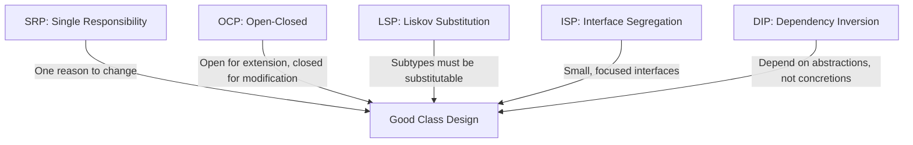
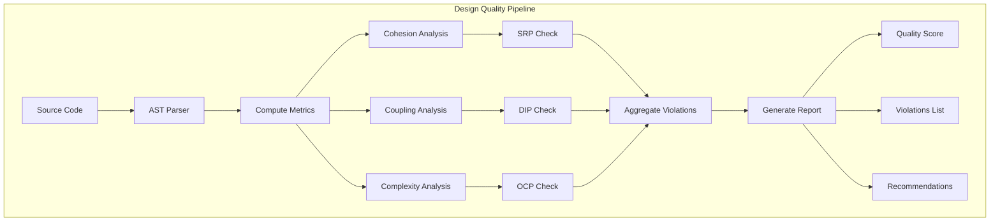

# Design and Implementation

## Learning Objectives

After completing this chapter, the student will be able to:
- Apply the SOLID principles of object-oriented design
- Explain the DRY, KISS, and YAGNI principles
- Distinguish between coupling and cohesion and describe their relationship to design quality
- Implement GoF design patterns (Singleton, Factory, Observer, Strategy, Adapter, Decorator) in TypeScript
- Apply design by contract principles
- Conduct a design review
- Map design to code effectively

## Theory

### Design Principles

Design principles are established guidelines that, when followed, produce designs that are maintainable, understandable, and adaptable. They represent distilled experience about what characterises good software design.

### The SOLID Principles

The SOLID principles, articulated by Robert C. Martin, are five principles of object-oriented class design:



#### Single Responsibility Principle (SRP)

A class should have only one reason to change. Each class should be responsible for a single part of the functionality. When a class has multiple responsibilities, changes to one responsibility may affect the other.

**Violation:**
```typescript
class Order {
  // Multiple responsibilities:
  calculateTotal(): number { /* ... */ }
  saveToDatabase(): void { /* ... */ }
  sendEmailConfirmation(): void { /* ... */ }
  generateInvoicePDF(): void { /* ... */ }
}
```

**Refactored:**
```typescript
class OrderCalculator {
  calculateTotal(order: Order): number { /* ... */ }
}
class OrderRepository {
  save(order: Order): void { /* ... */ }
}
class EmailService {
  sendConfirmation(order: Order): void { /* ... */ }
}
class InvoiceGenerator {
  generatePDF(order: Order): Buffer { /* ... */ }
}
```

#### Open-Closed Principle (OCP)

Classes should be open for extension but closed for modification. The behaviour should be extendable without modifying the class itself.

**Violation:**
```typescript
class DiscountCalculator {
  calculate(amount: number, customerType: string): number {
    if (customerType === 'regular') return amount * 0.9;
    if (customerType === 'premium') return amount * 0.8;
    if (customerType === 'vip') return amount * 0.7;
    return amount;
  }
}
```

**Refactored:**
```typescript
interface DiscountStrategy {
  apply(amount: number): number;
}
class RegularDiscount implements DiscountStrategy {
  apply(amount: number): number { return amount * 0.9; }
}
class PremiumDiscount implements DiscountStrategy {
  apply(amount: number): number { return amount * 0.8; }
}
class VipDiscount implements DiscountStrategy {
  apply(amount: number): number { return amount * 0.7; }
}
class DiscountCalculator {
  constructor(private strategy: DiscountStrategy) {}
  calculate(amount: number): number {
    return this.strategy.apply(amount);
  }
}
```

#### Liskov Substitution Principle (LSP)

Objects of a superclass should be replaceable with objects of a subclass without affecting correctness.

**Violation:**
```typescript
class Rectangle {
  constructor(protected width: number, protected height: number) {}
  setWidth(w: number): void { this.width = w; }
  setHeight(h: number): void { this.height = h; }
  getArea(): number { return this.width * this.height; }
}
class Square extends Rectangle {
  setWidth(w: number): void {
    this.width = w;
    this.height = w; // Violates LSP — changes height unexpectedly
  }
}
```

**Refactored:** Use a common interface instead of inheritance:
```typescript
interface Shape {
  getArea(): number;
}
class Rectangle implements Shape {
  constructor(private width: number, private height: number) {}
  getArea(): number { return this.width * this.height; }
}
class Square implements Shape {
  constructor(private side: number) {}
  getArea(): number { return this.side * this.side; }
}
```

#### Dependency Inversion Principle (DIP)

High-level modules should not depend on low-level modules; both should depend on abstractions.

**Violation:**
```typescript
class UserService {
  private repository = new PostgresUserRepository(); // Direct dependency
}
```

**Refactored:**
```typescript
class UserService {
  constructor(private repository: UserRepository) {} // Abstraction
}
interface UserRepository {
  findById(id: string): User | null;
  save(user: User): void;
}
```

### DRY, KISS, and YAGNI

| Principle | Meaning | Application |
|-----------|---------|-------------|
| **DRY** (Don't Repeat Yourself) | Every piece of knowledge has a single representation | Extract duplication into shared methods/modules |
| **KISS** (Keep It Simple, Stupid) | Simplicity over complexity | Avoid unnecessary abstractions and cleverness |
| **YAGNI** (You Ain't Gonna Need It) | Don't add functionality until needed | Resist anticipating future requirements |

### Coupling and Cohesion

**Coupling** measures the degree of interdependence between modules. Low coupling is desirable.

| Coupling Type | Description | Rating |
|---------------|-------------|--------|
| Content | Module modifies internal data of another | Worst |
| Common | Modules share global data | Bad |
| External | Modules share external format/protocol | Bad |
| Control | One module passes control flags to another | Moderate |
| Stamp | Modules share composite data (only part used) | Moderate |
| Data | Modules share data through parameters | Good |
| Message | Modules communicate through explicit messages | Best |

**Cohesion** measures the degree to which elements within a module belong together. High cohesion is desirable.

| Cohesion Type | Description | Rating |
|---------------|-------------|--------|
| Coincidental | Elements arbitrarily grouped | Worst |
| Logical | Elements perform related functions, selected externally | Bad |
| Temporal | Elements grouped by timing | Bad |
| Procedural | Elements follow a sequence | Moderate |
| Communicational | Elements operate on same data | Moderate |
| Sequential | Output of one is input to next | Good |
| Functional | All elements contribute to a single function | Best |

### Design by Contract

Design by contract, articulated by Meyer, specifies that classes have:
- **Preconditions:** Conditions that must be true before a method executes
- **Postconditions:** Conditions that must be true after a method executes
- **Invariants:** Conditions that must always be true for the class

```typescript
class BankAccount {
  private balance: number;

  constructor(initialBalance: number) {
    // Invariant: balance must never be negative
    if (initialBalance < 0) {
      throw new Error('Initial balance cannot be negative');
    }
    this.balance = initialBalance;
  }

  public withdraw(amount: number): void {
    // Precondition: amount must be positive
    if (amount <= 0) {
      throw new Error('Withdrawal amount must be positive');
    }
    // Precondition: sufficient balance
    if (amount > this.balance) {
      throw new Error('Insufficient funds');
    }
    const previousBalance = this.balance;
    this.balance -= amount;
    // Postcondition: balance decreased by exactly amount
    if (this.balance !== previousBalance - amount) {
      throw new Error('Postcondition violation');
    }
  }
}
```

### Refactoring Catalog

| Refactoring | Description | When to Apply |
|-------------|-------------|---------------|
| **Extract Method** | Move code from long method into new method | Method too long or does multiple things |
| **Rename Variable/Method** | Improve naming clarity | Name doesn't convey intent |
| **Move Class/Method** | Relocate to more appropriate location | Class in wrong package, method in wrong class |
| **Replace Conditional with Polymorphism** | Replace switch/if-else with polymorphic dispatch | Complex conditionals based on type |
| **Extract Class** | Split class with multiple responsibilities | SRP violation |
| **Introduce Parameter Object** | Replace multiple parameters with object | Long parameter lists |
| **Replace Magic Number with Constant** | Named constant for literal values | Magic numbers in code |
| **Pull Up / Push Down** | Move methods between super/subclass | Inheritance hierarchy needs adjustment |

### Design Patterns (GoF)

Design patterns are reusable solutions to common problems in software design.

### Singleton Pattern

Ensures a class has only one instance and provides a global point of access.

```typescript
class DatabaseConnection {
  private static instance: DatabaseConnection;
  private constructor() {
    // Private constructor prevents external instantiation
  }
  public static getInstance(): DatabaseConnection {
    if (!DatabaseConnection.instance) {
      DatabaseConnection.instance = new DatabaseConnection();
    }
    return DatabaseConnection.instance;
  }
  public query(sql: string): unknown[] {
    console.log(`Executing: ${sql}`);
    return [];
  }
}
```

### Factory Pattern

Provides an interface for creating objects without specifying their concrete classes.

```typescript
interface Logger {
  log(message: string): void;
}
class ConsoleLogger implements Logger {
  log(message: string): void { console.log(message); }
}
class FileLogger implements Logger {
  log(message: string): void { /* write to file */ }
}
class DatabaseLogger implements Logger {
  log(message: string): void { /* write to database */ }
}

class LoggerFactory {
  public static createLogger(type: 'console' | 'file' | 'database'): Logger {
    switch (type) {
      case 'console': return new ConsoleLogger();
      case 'file': return new FileLogger();
      case 'database': return new DatabaseLogger();
      default: throw new Error('Unknown logger type');
    }
  }
}
```

### Observer Pattern

Defines a one-to-many dependency where state changes in one object notify all dependents.

```typescript
interface Observer<T> {
  update(data: T): void;
}

class Observable<T> {
  private observers: Observer<T>[] = [];

  public subscribe(observer: Observer<T>): void {
    this.observers.push(observer);
  }

  public unsubscribe(observer: Observer<T>): void {
    this.observers = this.observers.filter((o) => o !== observer);
  }

  public notify(data: T): void {
    this.observers.forEach((o) => o.update(data));
  }
}

// Concrete example
interface StockData {
  symbol: string;
  price: number;
  change: number;
}

class StockMarket extends Observable<StockData> {
  public updateStockPrice(symbol: string, price: number, change: number): void {
    this.notify({ symbol, price, change });
  }
}

class TradingBot implements Observer<StockData> {
  constructor(private readonly name: string) {}
  public update(data: StockData): void {
    console.log(`${this.name} received: ${data.symbol} at $${data.price}`);
    if (data.change > 0.05) {
      console.log(`  -> BUY signal for ${data.symbol}`);
    }
  }
}

// Usage
const market = new StockMarket();
const bot1 = new TradingBot('ArbitrageBot');
const bot2 = new TradingBot('TrendBot');
market.subscribe(bot1);
market.subscribe(bot2);
market.updateStockPrice('AAPL', 175.50, 0.03);
market.updateStockPrice('TSLA', 245.00, -0.02);
```

### Strategy Pattern

Defines a family of algorithms, encapsulates each, and makes them interchangeable.

```typescript
interface PaymentStrategy {
  pay(amount: number): { success: boolean; transactionId: string };
}

class CreditCardPayment implements PaymentStrategy {
  constructor(private cardNumber: string, private cvv: string) {}
  pay(amount: number) {
    console.log(`Paid $${amount} via credit card ${this.cardNumber.slice(-4)}`);
    return { success: true, transactionId: `CC-${Date.now()}` };
  }
}

class PayPalPayment implements PaymentStrategy {
  constructor(private email: string) {}
  pay(amount: number) {
    console.log(`Paid $${amount} via PayPal (${this.email})`);
    return { success: true, transactionId: `PP-${Date.now()}` };
  }
}

class CryptoPayment implements PaymentStrategy {
  constructor(private walletAddress: string) {}
  pay(amount: number) {
    console.log(`Paid $${amount} equivalent in crypto to ${this.walletAddress}`);
    return { success: true, transactionId: `CR-${Date.now()}` };
  }
}

class Checkout {
  constructor(private strategy: PaymentStrategy) {}
  public setStrategy(strategy: PaymentStrategy): void {
    this.strategy = strategy;
  }
  public executePayment(amount: number): { success: boolean; transactionId: string } {
    return this.strategy.pay(amount);
  }
}
```

### Adapter Pattern

Allows incompatible interfaces to work together.

```typescript
// Existing interface (legacy)
interface LegacyEmailSender {
  sendMail(to: string, subject: string, body: string): boolean;
}

// New interface
interface ModernNotificationService {
  sendNotification(recipient: string, title: string, content: string): Promise<boolean>;
}

// Adapter
class EmailAdapter implements ModernNotificationService {
  constructor(private legacySender: LegacyEmailSender) {}

  public async sendNotification(recipient: string, title: string, content: string): Promise<boolean> {
    return this.legacySender.sendMail(recipient, title, content);
  }
}
```

### Decorator Pattern

Attaches additional responsibilities to an object dynamically.

```typescript
interface Coffee {
  getCost(): number;
  getDescription(): string;
}

class SimpleCoffee implements Coffee {
  getCost(): number { return 5.0; }
  getDescription(): string { return 'Simple coffee'; }
}

abstract class CoffeeDecorator implements Coffee {
  constructor(protected coffee: Coffee) {}
  abstract getCost(): number;
  abstract getDescription(): string;
}

class MilkDecorator extends CoffeeDecorator {
  getCost(): number { return this.coffee.getCost() + 1.5; }
  getDescription(): string { return `${this.coffee.getDescription()}, milk`; }
}

class SugarDecorator extends CoffeeDecorator {
  getCost(): number { return this.coffee.getCost() + 0.5; }
  getDescription(): string { return `${this.coffee.getDescription()}, sugar`; }
}

class WhippedCreamDecorator extends CoffeeDecorator {
  getCost(): number { return this.coffee.getCost() + 2.0; }
  getDescription(): string { return `${this.coffee.getDescription()}, whipped cream`; }
}

// Usage
let coffee: Coffee = new SimpleCoffee();
coffee = new MilkDecorator(coffee);
coffee = new SugarDecorator(coffee);
coffee = new WhippedCreamDecorator(coffee);
console.log(`${coffee.getDescription()} costs $${coffee.getCost()}`);
// "Simple coffee, milk, sugar, whipped cream costs $9.0"
```

## Examples

## SOLID Principle Compliance Checker

```typescript
type ViolationSeverity = 'critical' | 'major' | 'minor';
type SolidPrinciple = 'SRP' | 'OCP' | 'LSP' | 'ISP' | 'DIP';

interface Violation {
  principle: SolidPrinciple;
  className: string;
  severity: ViolationSeverity;
  description: string;
  recommendation: string;
}

interface ClassDescriptor {
  name: string;
  methods: string[];
  fields: string[];
  dependencies: string[];
  interfaces: string[];
  superClass?: string;
  linesOfCode: number;
}

class SolidComplianceChecker {
  public checkAll(classes: ClassDescriptor[]): Violation[] {
    return [
      ...this.checkSRP(classes),
      ...this.checkOCP(classes),
      ...this.checkLSP(classes),
      ...this.checkISP(classes),
      ...this.checkDIP(classes),
    ];
  }

  private checkSRP(classes: ClassDescriptor[]): Violation[] {
    const violations: Violation[] = [];
    for (const cls of classes) {
      const responsibilityGroups = this.identifyResponsibilities(cls);
      if (responsibilityGroups.size > 4) {
        violations.push({
          principle: 'SRP',
          className: cls.name,
          severity: 'critical',
          description: `Class has ${responsibilityGroups.size} distinct responsibilities: ${Array.from(responsibilityGroups).join(', ')}`,
          recommendation: `Split ${cls.name} into ${responsibilityGroups.size} separate classes, each with one responsibility`,
        });
      } else if (responsibilityGroups.size >= 3) {
        violations.push({
          principle: 'SRP',
          className: cls.name,
          severity: 'major',
          description: `Class may have multiple responsibilities: ${Array.from(responsibilityGroups).join(', ')}`,
          recommendation: 'Consider extracting related methods into separate classes',
        });
      }
    }
    return violations;
  }

  private identifyResponsibilities(cls: ClassDescriptor): Set<string> {
    const responsibilities = new Set<string>();
    const patterns: [RegExp, string][] = [
      [/(save|persist|store|update|delete|insert|remove)/i, 'Data Persistence'],
      [/(validate|check|verify|ensure)/i, 'Validation'],
      [/(send|notify|email|push|publish)/i, 'Notification'],
      [/(render|display|format|show|present|export|generate)/i, 'Presentation'],
      [/(calculate|compute|process|aggregate|transform)/i, 'Business Logic'],
      [/(log|audit|trace|monitor)/i, 'Logging / Monitoring'],
      [/(parse|deserialize|serialize|convert|map)/i, 'Data Transformation'],
      [/(auth|login|logout|authorize|authenticate)/i, 'Authentication'],
      [/(config|configure|settings)/i, 'Configuration'],
      [/(connect|disconnect|query|execute|fetch)/i, 'Data Access'],
    ];
    for (const method of cls.methods) {
      for (const [pattern, resp] of patterns) {
        if (pattern.test(method)) {
          responsibilities.add(resp);
        }
      }
    }
    return responsibilities;
  }

  private checkOCP(classes: ClassDescriptor[]): Violation[] {
    const violations: Violation[] = [];
    for (const cls of classes) {
      const switchPattern = /\b(if\s+.*\b(type|kind|categor|variant)\b|switch\s*\(.*\b(type|kind)\b)/i;
      const riskyMethods = cls.methods.filter((m) => switchPattern.test(m));
      if (riskyMethods.length > 0) {
        violations.push({
          principle: 'OCP',
          className: cls.name,
          severity: 'major',
          description: `Methods ${riskyMethods.join(', ')} use type-checking conditionals that violate Open-Closed`,
          recommendation: 'Replace type-based conditionals with polymorphic dispatch via interfaces',
        });
      }
    }
    return violations;
  }

  private checkLSP(classes: ClassDescriptor[]): Violation[] {
    const violations: Violation[] = [];
    for (const cls of classes) {
      if (cls.superClass) {
        const overrideMethods = cls.methods.filter((m) =>
          m.startsWith('override ')
        );
        const throwingOverride = cls.methods.filter((m) =>
          m.includes('throw new Error') && m.includes('Not implemented')
        );
        if (throwingOverride.length > 0) {
          violations.push({
            principle: 'LSP',
            className: cls.name,
            severity: 'critical',
            description: `${cls.name} overrides methods with "not implemented" exceptions, breaking substitutability`,
            recommendation: 'Either implement the method properly or use composition instead of inheritance',
          });
        }
      }
    }
    return violations;
  }

  private checkISP(classes: ClassDescriptor[]): Violation[] {
    const violations: Violation[] = [];
    for (const cls of classes) {
      if (cls.interfaces.length > 0) {
        const methodNames = new Set(cls.methods.map((m) => m.split('(')[0].split(' ').pop()!));
        for (const iface of cls.interfaces) {
          if (cls.dependencies.includes(iface)) {
            violations.push({
              principle: 'ISP',
              className: cls.name,
              severity: 'minor',
              description: `${cls.name} depends on methods from ${iface} it may not use`,
              recommendation: `Split ${iface} into smaller, focused interfaces`,
            });
          }
        }
      }
    }
    return violations;
  }

  private checkDIP(classes: ClassDescriptor[]): Violation[] {
    const violations: Violation[] = [];
    const concreteClassPattern = /^(Postgres|Mongo|MySQL|Redis|AWS|Azure|GCP|Concrete)/;
    for (const cls of classes) {
      for (const dep of cls.dependencies) {
        if (concreteClassPattern.test(dep)) {
          violations.push({
            principle: 'DIP',
            className: cls.name,
            severity: 'major',
            description: `${cls.name} depends directly on concrete class ${dep} instead of an abstraction`,
            recommendation: `Create an interface for ${dep} and inject it through the constructor`,
          });
        }
      }
    }
    return violations;
  }
}

// Design Pattern Registry
interface PatternDefinition {
  name: string;
  type: 'creational' | 'structural' | 'behavioral';
  intent: string;
  participants: string[];
  problem: string;
  solution: string;
  applicableWhen: string[];
  consequences: string[];
}

class DesignPatternRegistry {
  private patterns: Map<string, PatternDefinition> = new Map();

  constructor() {
    this.registerBuiltIn();
  }

  private registerBuiltIn(): void {
    this.register({
      name: 'Singleton',
      type: 'creational',
      intent: 'Ensure a class has only one instance and provide a global point of access',
      participants: ['Singleton', 'Client'],
      problem: 'Exactly one instance of a class is needed with controlled access',
      solution: 'Make constructor private, provide static getInstance() method',
      applicableWhen: ['Shared resource access', 'Configuration manager', 'Connection pool'],
      consequences: ['Global state', 'Difficult to test', 'Violates SRP in some contexts'],
    });
    this.register({
      name: 'Factory Method',
      type: 'creational',
      intent: 'Define an interface for creating objects but let subclasses decide which class to instantiate',
      participants: ['Product', 'ConcreteProduct', 'Creator', 'ConcreteCreator'],
      problem: 'A class cannot anticipate the exact objects it needs to create',
      solution: 'Encapsulate object creation in a separate method that subclasses override',
      applicableWhen: ['Object creation logic varies', 'Reducing coupling'],
      consequences: ['Subclassing required', 'Parallel class hierarchies'],
    });
    this.register({
      name: 'Observer',
      type: 'behavioral',
      intent: 'Define a one-to-many dependency so that when one object changes state, dependents are notified',
      participants: ['Subject', 'Observer', 'ConcreteSubject', 'ConcreteObserver'],
      problem: 'Multiple objects need to stay consistent with another object\'s state',
      solution: 'Subject maintains list of observers and notifies them on state change',
      applicableWhen: ['Event handling systems', 'UI updates from model', 'Distributed event systems'],
      consequences: ['Unexpected updates', 'Memory leaks if observers not deregistered'],
    });
    this.register({
      name: 'Strategy',
      type: 'behavioral',
      intent: 'Define a family of algorithms, encapsulate each, and make them interchangeable',
      participants: ['Strategy', 'ConcreteStrategy', 'Context'],
      problem: 'Multiple algorithms exist for the same task and should be swappable at runtime',
      solution: 'Encapsulate algorithms behind a common interface; context delegates to strategy',
      applicableWhen: ['Multiple algorithm variants', 'Conditional logic proliferation'],
      consequences: ['Increased number of objects', 'Clients must understand strategy differences'],
    });
    this.register({
      name: 'Adapter',
      type: 'structural',
      intent: 'Convert the interface of a class into another interface that clients expect',
      participants: ['Target', 'Adapter', 'Adaptee', 'Client'],
      problem: 'Existing class has the right functionality but wrong interface',
      solution: 'Create adapter class that wraps the adaptee and implements the target interface',
      applicableWhen: ['Legacy system integration', 'Third-party library wrapping'],
      consequences: ['Adds indirection', 'Can be overused for every minor mismatch'],
    });
    this.register({
      name: 'Decorator',
      type: 'structural',
      intent: 'Attach additional responsibilities to an object dynamically',
      participants: ['Component', 'ConcreteComponent', 'Decorator', 'ConcreteDecorator'],
      problem: 'Responsibilities need to be added to individual objects, not to whole classes',
      solution: 'Wrap object in decorator classes that add behavior before/after delegating',
      applicableWhen: ['Layers of functionality', 'Feature flags', 'Cross-cutting concerns'],
      consequences: ['Many small classes', 'Complicates object identity'],
    });
  }

  public register(def: PatternDefinition): void {
    this.patterns.set(def.name.toLowerCase(), def);
  }

  public getPattern(name: string): PatternDefinition | undefined {
    return this.patterns.get(name.toLowerCase());
  }

  public findByProblem(keyword: string): PatternDefinition[] {
    return Array.from(this.patterns.values()).filter(
      (p) =>
        p.problem.toLowerCase().includes(keyword.toLowerCase()) ||
        p.applicableWhen.some((a) => a.toLowerCase().includes(keyword.toLowerCase()))
    );
  }

  public findByType(type: PatternDefinition['type']): PatternDefinition[] {
    return Array.from(this.patterns.values()).filter((p) => p.type === type);
  }

  public compare(nameA: string, nameB: string): { common: string[]; differences: string[] } {
    const a = this.patterns.get(nameA.toLowerCase());
    const b = this.patterns.get(nameB.toLowerCase());
    if (!a || !b) throw new Error('One or both patterns not found');
    return {
      common: [
        a.type === b.type ? `Both are ${a.type} patterns` : '',
        a.participants.some((p) => b.participants.includes(p))
          ? `Shared participant: ${a.participants.filter((p) => b.participants.includes(p)).join(', ')}`
          : '',
      ].filter(Boolean),
      differences: [
        a.type !== b.type ? `${a.name} is ${a.type}, ${b.name} is ${b.type}` : '',
        a.applicableWhen.filter((x) => !b.applicableWhen.includes(x)).length > 0
          ? `${a.name} applicable when: ${a.applicableWhen.filter((x) => !b.applicableWhen.includes(x)).join(', ')}`
          : '',
        b.applicableWhen.filter((x) => !a.applicableWhen.includes(x)).length > 0
          ? `${b.name} applicable when: ${b.applicableWhen.filter((x) => !a.applicableWhen.includes(x)).join(', ')}`
          : '',
      ].filter(Boolean),
    };
  }
}

// Usage
const checker = new SolidComplianceChecker();
const violations = checker.checkAll([
  {
    name: 'OrderService',
    methods: ['save(order)', 'sendConfirmation(order)', 'generateInvoice(order)', 'validatePayment(order)', 'logActivity(entry)', 'parseWebhook(payload)', 'renderReceipt(order)'],
    fields: ['repository', 'emailService', 'logger'],
    dependencies: ['PostgresOrderRepository'],
    interfaces: ['OrderProcessor'],
    linesOfCode: 350,
  },
]);
console.log('SOLID Violations:');
violations.forEach((v) => console.log(`  [${v.severity}] ${v.principle}: ${v.className} — ${v.description}`));

const registry = new DesignPatternRegistry();
console.log('\nAvailable Creational Patterns:');
registry.findByType('creational').forEach((p) => console.log(`  - ${p.name}: ${p.intent}`));
```



### TypeScript: Design & Implementation Tools

```typescript
// === SOLID Principle Validator ===
interface ClassAnalysis {
  className: string;
  responsibilities: string[];
  dependencies: string[];
  methods: number;
}
function violatesSRP(cls: ClassAnalysis): string[] {
  const distinctResponsibilities = [...new Set(cls.responsibilities)];
  if (distinctResponsibilities.length > 1) return [`SRP violation: ${cls.className} has ${distinctResponsibilities.length} responsibilities: ${distinctResponsibilities.join(", ")}`];
  return [];
}
function violatesDIP(cls: ClassAnalysis): { concreteDeps: string[]; abstractDeps: string[] } {
  return {
    concreteDeps: cls.dependencies.filter((d) => d.startsWith("Concrete")),
    abstractDeps: cls.dependencies.filter((d) => d.startsWith("I") || d.startsWith("Abstract")),
  };
}
const orderSvc: ClassAnalysis = {
  className: "OrderService",
  responsibilities: ["process orders", "send emails", "generate invoices"],
  dependencies: ["ConcreteEmailSender", "ConcreteInvoiceGenerator", "IOrderRepository"],
  methods: 12,
};
console.log(violatesSRP(orderSvc));
console.log(violatesDIP(orderSvc));

// === Simple Dependency Injector ===
type Token = string;
class Container {
  private registry = new Map<Token, { factory: () => unknown; singleton: boolean; instance?: unknown }>();
  register<T>(token: Token, factory: () => T, singleton = true): void {
    this.registry.set(token, { factory: factory as () => unknown, singleton });
  }
  resolve<T>(token: Token): T {
    const entry = this.registry.get(token);
    if (!entry) throw new Error(`No registration for ${token}`);
    if (entry.singleton) {
      if (!entry.instance) entry.instance = entry.factory();
      return entry.instance as T;
    }
    return entry.factory() as T;
  }
}
interface ILogger { log(msg: string): void }
interface IUserRepo { find(id: number): string }
const container = new Container();
container.register("Logger", () => ({ log: (m: string) => console.log(m) }));
container.register("UserRepo", () => ({
  find: (id: number) => `User ${id}`,
}));

// === LSP Checker ===
interface Shape { area(): number }
class Rectangle implements Shape {
  constructor(public w: number, public h: number) {}
  area(): number { return this.w * this.h; }
}
class Square implements Shape {
  constructor(public side: number) {}
  area(): number { return this.side * this.side; }
}
function lspCheck(shapes: Shape[]): number {
  return shapes.reduce((sum, s) => sum + s.area(), 0);
}
console.log(lspCheck([new Rectangle(2, 3), new Square(4)])); // 6 + 16 = 22

// === Design Pattern Detector ===
function detectPattern(codeLines: string[]): string[] {
  const patterns: string[] = [];
  const joined = codeLines.join(" ");
  if (joined.includes("private constructor")) patterns.push("Singleton");
  if (joined.includes("implements Observer")) patterns.push("Observer");
  if (joined.includes("create") && joined.includes(": ")) patterns.push("Factory Method");
  if (joined.includes("interface") && joined.includes("class") && joined.includes("implements")) patterns.push("Strategy");
  if (joined.includes("wrapper") || joined.includes("delegate")) patterns.push("Decorator");
  return patterns;
}
console.log(detectPattern(["class Config {", "  private constructor() {}", "  static getInstance() {}", "}"]));

// === Factory Method Generator ===
interface Product { operation(): string }
class ConcreteProductA implements Product { operation(): string { return "Product A"; } }
class ConcreteProductB implements Product { operation(): string { return "Product B"; } }
abstract class Creator { abstract factoryMethod(): Product; someOperation(): string { return `Creator: ${this.factoryMethod().operation()}`; } }
class CreatorA extends Creator { factoryMethod(): Product { return new ConcreteProductA(); } }
class CreatorB extends Creator { factoryMethod(): Product { return new ConcreteProductB(); } }
console.log(new CreatorA().someOperation());
console.log(new CreatorB().someOperation());
```

## Summary

Design principles guide the creation of maintainable, understandable software. The SOLID principles address class-level design; DRY, KISS, and YAGNI promote simplicity and avoid duplication. Low coupling and high cohesion are the primary indicators of design quality. GoF design patterns (Singleton, Factory, Observer, Strategy, Adapter, Decorator) provide reusable solutions to common problems. Design by contract formalises preconditions, postconditions, and invariants. Refactoring systematically improves design without changing behaviour. Design reviews provide structured evaluation of design quality.

## Practical Takeaways

1. **SOLID is a toolkit, not a checklist** — apply principles where they reduce complexity, not everywhere
2. **Patterns solve problems, they don't create them** — don't use a pattern just because you studied it
3. **Design for the specific, not the abstract** — YAGNI and KISS prevent over-engineering
4. **Testability is a design quality indicator** — if a design is hard to test, it's probably a bad design
5. **Refactor early, refactor often** — small continuous improvements prevent structural degradation
6. **Coupling and cohesion are the most practical design metrics** — high cohesion + low coupling = good design

## Chapter Quiz

**Q1: Which SOLID principle states that a class should have only one reason to change?**
- A) Open-Closed Principle
- B) Single Responsibility Principle
- C) Liskov Substitution Principle
- D) Dependency Inversion Principle

**Answer: B** — SRP states each class should have a single responsibility.

**Q2: A class that depends directly on a concrete database implementation rather than an abstraction violates which principle?**
- A) ISP
- B) LSP
- C) DIP
- D) OCP

**Answer: C** — Dependency Inversion Principle requires depending on abstractions.

**Q3: Which design pattern would you use to notify multiple components when state changes?**
- A) Singleton
- B) Factory
- C) Observer
- D) Adapter

**Answer: C** — The Observer pattern defines a one-to-many dependency for state change notifications.

**Q4: The worst type of coupling is:**
- A) Data coupling
- B) Stamp coupling
- C) Content coupling
- D) Message coupling

**Answer: C** — Content coupling (directly modifying another module's internal data) is the worst.

**Q5: What is the purpose of the Decorator pattern?**
- A) Ensure a class has only one instance
- B) Attach additional responsibilities to an object dynamically
- C) Define a family of interchangeable algorithms
- D) Convert the interface of a class into another interface

**Answer: B** — The Decorator pattern dynamically adds responsibilities to objects.

## Exercises

### Review Questions

1. State the Single Responsibility Principle and provide an example of its violation.
2. How does the Liskov Substitution Principle constrain the use of inheritance?
3. What problem does the Dependency Inversion Principle solve?
4. Distinguish between stamp coupling and data coupling.
5. Arrange the coupling types from most desirable to least desirable.
6. Describe the seven levels of cohesion from worst to best.
7. Explain design by contract — what are preconditions, postconditions, and invariants?
8. When would you use the Strategy pattern instead of a switch statement?

### Application Problems

1. Identify SOLID principle violations in a Report class that retrieves data from a database, formats it as HTML, and sends it by email. Refactor the design in TypeScript.

2. Analyse the coupling and cohesion of a system with a single Utility class containing methods for string manipulation, date calculation, file I/O, and network connectivity. Propose a refactoring.

3. Implement the Observer pattern for a weather station that notifies display devices (current conditions, statistics, forecast) when temperature, humidity, and pressure change.

4. Implement a document processing pipeline using the Decorator pattern where a base Document can be decorated with SpellCheck, GrammarCheck, and PlagiarismCheck decorators.

### Challenge Problem

You inherit a codebase with the following characteristics: a single class of over 10,000 lines implementing the entire business logic; all methods are public and directly access the database; global variables are used extensively; the system has no automated tests; and every change requires weeks of regression testing. Develop a systematic refactoring plan over six months. Prioritise the design principles, specify the order of addressing problems, and describe how to manage the risk of introducing defects. Implement the refactored version of at least three core methods in TypeScript.

