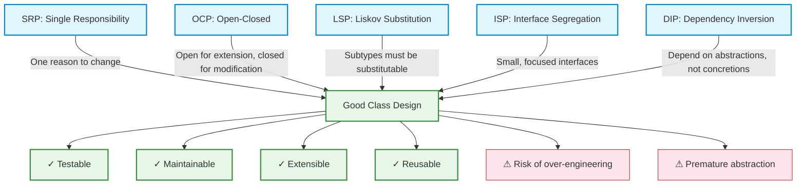
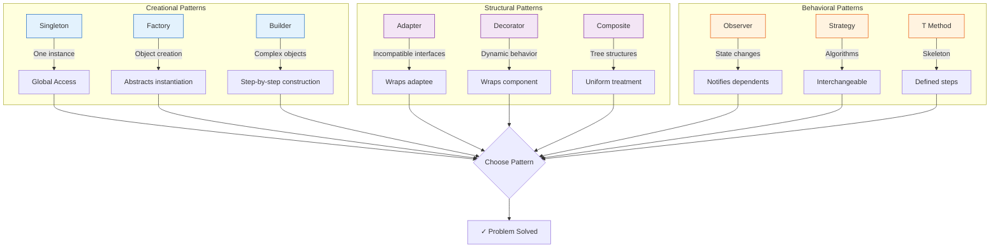
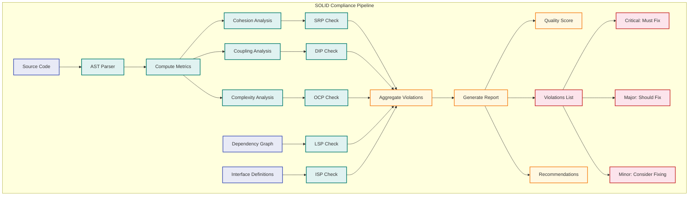

# Design and Implementation

## Learning Objectives

```
✓ Understand and apply the five SOLID principles of object-oriented design
✓ Distinguish between coupling and cohesion and their impact on design quality
✓ Implement GoF design patterns (Singleton, Factory, Observer, Strategy, Adapter, Decorator) in TypeScript
✓ Apply clean code principles: meaningful names, small functions, no side effects
✓ Detect code smells and apply refactoring patterns systematically
✓ Use design by contract with preconditions, postconditions, and invariants
✓ Conduct structured design reviews with actionable feedback
✓ Map architectural decisions to implementation-level code effectively
```

## Theory

### Design Principles

Design principles are established guidelines that, when followed, produce designs that are maintainable, understandable, and adaptable. They represent distilled experience about what characterises good software design. These principles have been validated through decades of industrial practice and form the foundation of professional software engineering.

The primary goal of design principles is to manage **complexity**. As software systems grow, the cognitive load required to understand them increases non-linearly. Principles like separation of concerns, modularity, and abstraction help keep this complexity bounded.

### The SOLID Principles

The SOLID principles, articulated by Robert C. Martin, are five principles of object-oriented class design. Together they provide a systematic approach to creating designs that are resilient to change, testable, and maintainable.



#### Single Responsibility Principle (SRP)

A class should have only one reason to change. Each class should be responsible for a single part of the functionality. When a class has multiple responsibilities, changes to one responsibility may affect the other. This principle is closely related to **cohesion** — a class with a single responsibility has maximal functional cohesion.

**Violation:**
```typescript
class Order {
  // Multiple responsibilities:
  calculateTotal(): number { /* ... */ }
  saveToDatabase(): void { /* ... */ }
  sendEmailConfirmation(): void { /* ... */ }
  generateInvoicePDF(): void { /* ... */ }
}
```

**Refactored:**
```typescript
class OrderCalculator {
  calculateTotal(order: Order): number { /* ... */ }
}
class OrderRepository {
  save(order: Order): void { /* ... */ }
}
class EmailService {
  sendConfirmation(order: Order): void { /* ... */ }
}
class InvoiceGenerator {
  generatePDF(order: Order): Buffer { /* ... */ }
}
```

The refactored design allows each class to evolve independently. If the email template changes, only `EmailService` is affected. If the database schema changes, only `OrderRepository` needs updating. This isolation dramatically reduces the risk of regression defects.

#### Open-Closed Principle (OCP)

Classes should be open for extension but closed for modification. The behaviour should be extendable without modifying the class itself. This is achieved through abstraction — typically interfaces or abstract classes.

**Violation:**
```typescript
class DiscountCalculator {
  calculate(amount: number, customerType: string): number {
    if (customerType === 'regular') return amount * 0.9;
    if (customerType === 'premium') return amount * 0.8;
    if (customerType === 'vip') return amount * 0.7;
    return amount;
  }
}
```

**Refactored:**
```typescript
interface DiscountStrategy {
  apply(amount: number): number;
}
class RegularDiscount implements DiscountStrategy {
  apply(amount: number): number { return amount * 0.9; }
}
class PremiumDiscount implements DiscountStrategy {
  apply(amount: number): number { return amount * 0.8; }
}
class VipDiscount implements DiscountStrategy {
  apply(amount: number): number { return amount * 0.7; }
}
class DiscountCalculator {
  constructor(private strategy: DiscountStrategy) {}
  calculate(amount: number): number {
    return this.strategy.apply(amount);
  }
}
```

To add a new discount type, we simply create a new class implementing `DiscountStrategy`. The `DiscountCalculator` class never needs modification — it is closed for modification but open for extension.

#### Liskov Substitution Principle (LSP)

Objects of a superclass should be replaceable with objects of a subclass without affecting correctness. This principle constrains inheritance hierarchies: subclasses must honour the contract established by the base class.

**Violation:**
```typescript
class Rectangle {
  constructor(protected width: number, protected height: number) {}
  setWidth(w: number): void { this.width = w; }
  setHeight(h: number): void { this.height = h; }
  getArea(): number { return this.width * this.height; }
}
class Square extends Rectangle {
  setWidth(w: number): void {
    this.width = w;
    this.height = w; // Violates LSP — changes height unexpectedly
  }
}
```

**Refactored:** Use a common interface instead of inheritance:
```typescript
interface Shape {
  getArea(): number;
}
class Rectangle implements Shape {
  constructor(private width: number, private height: number) {}
  getArea(): number { return this.width * this.height; }
}
class Square implements Shape {
  constructor(private side: number) {}
  getArea(): number { return this.side * this.side; }
}
```

LSP violations often manifest as runtime type checks (`instanceof`) or conditional logic based on type. These are strong indicators that the inheritance hierarchy is broken.

#### Interface Segregation Principle (ISP)

Clients should not be forced to depend on interfaces they do not use. Large, "fat" interfaces should be split into smaller, more specific ones.

**Violation:**
```typescript
interface Worker {
  work(): void;
  eat(): void;
  sleep(): void;
}
class HumanWorker implements Worker {
  work(): void { console.log('Working...'); }
  eat(): void { console.log('Eating...'); }
  sleep(): void { console.log('Sleeping...'); }
}
class RobotWorker implements Worker {
  work(): void { console.log('Working...'); }
  eat(): void { throw new Error('Robots do not eat'); }
  sleep(): void { throw new Error('Robots do not sleep'); }
}
```

**Refactored:**
```typescript
interface Workable {
  work(): void;
}
interface Eatable {
  eat(): void;
}
interface Sleepable {
  sleep(): void;
}
class HumanWorker implements Workable, Eatable, Sleepable {
  work(): void { console.log('Working...'); }
  eat(): void { console.log('Eating...'); }
  sleep(): void { console.log('Sleeping...'); }
}
class RobotWorker implements Workable {
  work(): void { console.log('Working...'); }
}
```

#### Dependency Inversion Principle (DIP)

High-level modules should not depend on low-level modules; both should depend on abstractions. Abstractions should not depend on details; details should depend on abstractions.

**Violation:**
```typescript
class UserService {
  private repository = new PostgresUserRepository(); // Direct dependency
}
```

**Refactored:**
```typescript
class UserService {
  constructor(private repository: UserRepository) {} // Abstraction
}
interface UserRepository {
  findById(id: string): User | null;
  save(user: User): void;
}
```

DIP is the foundation of dependency injection. By depending on abstractions, we can swap implementations (PostgreSQL → MongoDB, production → test) without modifying the dependent class.

### DRY, KISS, and YAGNI

| Principle | Meaning | Application |
|-----------|---------|-------------|
| **DRY** (Don't Repeat Yourself) | Every piece of knowledge has a single representation | Extract duplication into shared methods/modules |
| **KISS** (Keep It Simple, Stupid) | Simplicity over complexity | Avoid unnecessary abstractions and cleverness |
| **YAGNI** (You Ain't Gonna Need It) | Don't add functionality until needed | Resist anticipating future requirements |

These three principles complement SOLID by providing guardrails against over-engineering. While SOLID guides us toward well-structured code, DRY/KISS/YAGNI remind us to keep things pragmatic.

### Coupling and Cohesion

**Coupling** measures the degree of interdependence between modules. Low coupling is desirable because it means changes in one module are less likely to ripple to others.

| Coupling Type | Description | Rating |
|---------------|-------------|--------|
| Content | Module modifies internal data of another | Worst |
| Common | Modules share global data | Bad |
| External | Modules share external format/protocol | Bad |
| Control | One module passes control flags to another | Moderate |
| Stamp | Modules share composite data (only part used) | Moderate |
| Data | Modules share data through parameters | Good |
| Message | Modules communicate through explicit messages | Best |

**Cohesion** measures the degree to which elements within a module belong together. High cohesion is desirable because it means the module's elements are strongly related and focused on a single purpose.

| Cohesion Type | Description | Rating |
|---------------|-------------|--------|
| Coincidental | Elements arbitrarily grouped | Worst |
| Logical | Elements perform related functions, selected externally | Bad |
| Temporal | Elements grouped by timing | Bad |
| Procedural | Elements follow a sequence | Moderate |
| Communicational | Elements operate on same data | Moderate |
| Sequential | Output of one is input to next | Good |
| Functional | All elements contribute to a single function | Best |

The relationship between coupling and cohesion is inverse: as cohesion increases, coupling tends to decrease. Well-designed systems have high cohesion within modules and low coupling between them.

### Clean Code Principles

Clean code is code that is easy to read, understand, and change. Key principles include:

| Principle | Description | Example |
|-----------|-------------|---------|
| **Meaningful Names** | Names reveal intent | `calculateTotal()` not `calc()` |
| **Small Functions** | Functions do one thing | Max 20-30 lines per function |
| **No Side Effects** | Functions don't modify hidden state | Pure functions preferred |
| **Command-Query Separation** | Methods either command or query, not both | `setName()` vs `getName()` |
| **Error Handling** | Exceptions over error codes | `throw new ValidationError()` |
| **Don't Repeat Yourself** | Single source of truth | Extract repeated logic |

```typescript
// Clean code example
class UserRegistrationService {
  constructor(
    private readonly validator: RegistrationValidator,
    private readonly repository: UserRepository,
    private readonly notificationService: NotificationService
  ) {}

  async register(dto: RegisterUserDto): Promise<UserResponse> {
    const validation = this.validator.validate(dto);
    if (!validation.isValid) {
      throw new ValidationError(validation.errors);
    }
    const user = User.create(dto);
    const saved = await this.repository.save(user);
    await this.notificationService.sendWelcome(saved.email);
    return UserResponse.from(saved);
  }
}
```

### Design by Contract

Design by contract, articulated by Meyer, specifies that classes have:
- **Preconditions:** Conditions that must be true before a method executes
- **Postconditions:** Conditions that must be true after a method executes
- **Invariants:** Conditions that must always be true for the class

```typescript
class BankAccount {
  private balance: number;

  constructor(initialBalance: number) {
    // Invariant: balance must never be negative
    if (initialBalance < 0) {
      throw new Error('Initial balance cannot be negative');
    }
    this.balance = initialBalance;
  }

  public withdraw(amount: number): void {
    // Precondition: amount must be positive
    if (amount <= 0) {
      throw new Error('Withdrawal amount must be positive');
    }
    // Precondition: sufficient balance
    if (amount > this.balance) {
      throw new Error('Insufficient funds');
    }
    const previousBalance = this.balance;
    this.balance -= amount;
    // Postcondition: balance decreased by exactly amount
    if (this.balance !== previousBalance - amount) {
      throw new Error('Postcondition violation');
    }
  }
}
```

### Refactoring Catalog and Code Smells

Code smells are surface indicators that usually correspond to deeper problems in the system.

| Code Smell | Description | Refactoring |
|------------|-------------|-------------|
| **Long Method** | Method exceeds 30 lines | Extract Method |
| **Large Class** | Class exceeds 500 lines | Extract Class |
| **Feature Envy** | Method uses more features of another class | Move Method |
| **Shotgun Surgery** | One change requires many small modifications | Move + Inline |
| **Primitive Obsession** | Using primitives instead of objects | Replace with Value Object |
| **Data Clumps** | Groups of data that appear together | Extract Parameter Object |
| **Switch Statements** | Type-based conditionals | Replace with Polymorphism |
| **Speculative Generality** | Unused abstractions | Collapse Hierarchy |

| Refactoring | Description | When to Apply |
|-------------|-------------|---------------|
| **Extract Method** | Move code from long method into new method | Method too long or does multiple things |
| **Rename Variable/Method** | Improve naming clarity | Name doesn't convey intent |
| **Move Class/Method** | Relocate to more appropriate location | Class in wrong package, method in wrong class |
| **Replace Conditional with Polymorphism** | Replace switch/if-else with polymorphic dispatch | Complex conditionals based on type |
| **Extract Class** | Split class with multiple responsibilities | SRP violation |
| **Introduce Parameter Object** | Replace multiple parameters with object | Long parameter lists |
| **Replace Magic Number with Constant** | Named constant for literal values | Magic numbers in code |
| **Pull Up / Push Down** | Move methods between super/subclass | Inheritance hierarchy needs adjustment |

### Design Patterns (GoF)

Design patterns are reusable solutions to common problems in software design. The Gang of Four (GoF) catalogued 23 patterns across three categories: creational, structural, and behavioral.

#### Singleton Pattern

Ensures a class has only one instance and provides a global point of access.

```typescript
class DatabaseConnection {
  private static instance: DatabaseConnection;
  private constructor() {
    // Private constructor prevents external instantiation
  }
  public static getInstance(): DatabaseConnection {
    if (!DatabaseConnection.instance) {
      DatabaseConnection.instance = new DatabaseConnection();
    }
    return DatabaseConnection.instance;
  }
  public query(sql: string): unknown[] {
    console.log(`Executing: ${sql}`);
    return [];
  }
}
```

Use cases: Configuration managers, connection pools, logging services. However, singletons introduce global state and can make testing difficult. Consider dependency injection as an alternative.

#### Factory Pattern

Provides an interface for creating objects without specifying their concrete classes.

```typescript
interface Logger {
  log(message: string): void;
}
class ConsoleLogger implements Logger {
  log(message: string): void { console.log(message); }
}
class FileLogger implements Logger {
  log(message: string): void { /* write to file */ }
}
class DatabaseLogger implements Logger {
  log(message: string): void { /* write to database */ }
}

class LoggerFactory {
  public static createLogger(type: 'console' | 'file' | 'database'): Logger {
    switch (type) {
      case 'console': return new ConsoleLogger();
      case 'file': return new FileLogger();
      case 'database': return new DatabaseLogger();
      default: throw new Error('Unknown logger type');
    }
  }
}
```

The Factory pattern centralises creation logic, making it easy to add new product types and manage dependencies.

#### Observer Pattern

Defines a one-to-many dependency where state changes in one object notify all dependents.

```typescript
interface Observer<T> {
  update(data: T): void;
}

class Observable<T> {
  private observers: Observer<T>[] = [];

  public subscribe(observer: Observer<T>): void {
    this.observers.push(observer);
  }

  public unsubscribe(observer: Observer<T>): void {
    this.observers = this.observers.filter((o) => o !== observer);
  }

  public notify(data: T): void {
    this.observers.forEach((o) => o.update(data));
  }
}

// Concrete example
interface StockData {
  symbol: string;
  price: number;
  change: number;
}

class StockMarket extends Observable<StockData> {
  public updateStockPrice(symbol: string, price: number, change: number): void {
    this.notify({ symbol, price, change });
  }
}

class TradingBot implements Observer<StockData> {
  constructor(private readonly name: string) {}
  public update(data: StockData): void {
    console.log(`${this.name} received: ${data.symbol} at $${data.price}`);
    if (data.change > 0.05) {
      console.log(`  -> BUY signal for ${data.symbol}`);
    }
  }
}

// Usage
const market = new StockMarket();
const bot1 = new TradingBot('ArbitrageBot');
const bot2 = new TradingBot('TrendBot');
market.subscribe(bot1);
market.subscribe(bot2);
market.updateStockPrice('AAPL', 175.50, 0.03);
market.updateStockPrice('TSLA', 245.00, -0.02);
```

#### Strategy Pattern

Defines a family of algorithms, encapsulates each, and makes them interchangeable.

```typescript
interface PaymentStrategy {
  pay(amount: number): { success: boolean; transactionId: string };
}

class CreditCardPayment implements PaymentStrategy {
  constructor(private cardNumber: string, private cvv: string) {}
  pay(amount: number) {
    console.log(`Paid $${amount} via credit card ${this.cardNumber.slice(-4)}`);
    return { success: true, transactionId: `CC-${Date.now()}` };
  }
}

class PayPalPayment implements PaymentStrategy {
  constructor(private email: string) {}
  pay(amount: number) {
    console.log(`Paid $${amount} via PayPal (${this.email})`);
    return { success: true, transactionId: `PP-${Date.now()}` };
  }
}

class CryptoPayment implements PaymentStrategy {
  constructor(private walletAddress: string) {}
  pay(amount: number) {
    console.log(`Paid $${amount} equivalent in crypto to ${this.walletAddress}`);
    return { success: true, transactionId: `CR-${Date.now()}` };
  }
}

class Checkout {
  constructor(private strategy: PaymentStrategy) {}
  public setStrategy(strategy: PaymentStrategy): void {
    this.strategy = strategy;
  }
  public executePayment(amount: number): { success: boolean; transactionId: string } {
    return this.strategy.pay(amount);
  }
}
```

#### Adapter Pattern

Allows incompatible interfaces to work together.

```typescript
// Existing interface (legacy)
interface LegacyEmailSender {
  sendMail(to: string, subject: string, body: string): boolean;
}

// New interface
interface ModernNotificationService {
  sendNotification(recipient: string, title: string, content: string): Promise<boolean>;
}

// Adapter
class EmailAdapter implements ModernNotificationService {
  constructor(private legacySender: LegacyEmailSender) {}

  public async sendNotification(recipient: string, title: string, content: string): Promise<boolean> {
    return this.legacySender.sendMail(recipient, title, content);
  }
}
```

#### Decorator Pattern

Attaches additional responsibilities to an object dynamically.

```typescript
interface Coffee {
  getCost(): number;
  getDescription(): string;
}

class SimpleCoffee implements Coffee {
  getCost(): number { return 5.0; }
  getDescription(): string { return 'Simple coffee'; }
}

abstract class CoffeeDecorator implements Coffee {
  constructor(protected coffee: Coffee) {}
  abstract getCost(): number;
  abstract getDescription(): string;
}

class MilkDecorator extends CoffeeDecorator {
  getCost(): number { return this.coffee.getCost() + 1.5; }
  getDescription(): string { return `${this.coffee.getDescription()}, milk`; }
}

class SugarDecorator extends CoffeeDecorator {
  getCost(): number { return this.coffee.getCost() + 0.5; }
  getDescription(): string { return `${this.coffee.getDescription()}, sugar`; }
}

class WhippedCreamDecorator extends CoffeeDecorator {
  getCost(): number { return this.coffee.getCost() + 2.0; }
  getDescription(): string { return `${this.coffee.getDescription()}, whipped cream`; }
}

// Usage
let coffee: Coffee = new SimpleCoffee();
coffee = new MilkDecorator(coffee);
coffee = new SugarDecorator(coffee);
coffee = new WhippedCreamDecorator(coffee);
console.log(`${coffee.getDescription()} costs $${coffee.getCost()}`);
// "Simple coffee, milk, sugar, whipped cream costs $9.0"
```

### Design Pattern Comparison



## Examples

### Case Study 1: E-Commerce Platform Redesign

A growing e-commerce company had a monolithic order processing system violating all five SOLID principles. The `OrderManager` class contained 8,000 lines handling validation, pricing, inventory, shipping, notifications, and payment processing. Adding a new payment method required modifying the class and retesting the entire system — a two-week cycle.

**Solution:** The team applied systematic refactoring over three months:
1. **SRP:** Split `OrderManager` into `OrderValidator`, `PricingEngine`, `InventoryManager`, `ShippingCoordinator`, `NotificationService`, and `PaymentProcessor`.
2. **OCP:** Introduced `PaymentStrategy` interface — adding PayPal took one day instead of two weeks.
3. **DIP:** Created repository interfaces — switched from PostgreSQL to MongoDB without changing business logic.
4. **Factory:** Used a `PaymentProcessorFactory` to instantiate the correct payment handler based on configuration.

**Result:** Cycle time for new payment methods dropped from 10 days to 1 day. Bug rate decreased by 65%. The system could now be tested at the unit level (2,000+ unit tests) instead of requiring full regression.

### Case Study 2: Financial Services API Gateway

A financial institution needed to integrate with 15 third-party data providers, each with different authentication protocols, data formats, and rate limits. The initial implementation used a single class with massive switch statements.

**Solution:** The team applied the Adapter and Strategy patterns:
1. **Adapter:** Created a `DataProviderAdapter` interface with concrete adapters for each provider.
2. **Strategy:** Implemented different rate-limiting strategies (token bucket, sliding window, exponential backoff).
3. **Factory:** A `ProviderFactory` that dynamically loaded the correct adapter based on configuration.

```typescript
interface DataProviderAdapter {
  fetchData(symbol: string): Promise<MarketData>;
}

class BloombergAdapter implements DataProviderAdapter {
  async fetchData(symbol: string): Promise<MarketData> {
    // Bloomberg-specific protocol
  }
}

class ReutersAdapter implements DataProviderAdapter {
  async fetchData(symbol: string): Promise<MarketData> {
    // Reuters-specific protocol
  }
}

class DataProviderFactory {
  static create(config: ProviderConfig): DataProviderAdapter {
    switch (config.type) {
      case 'bloomberg': return new BloombergAdapter(config.apiKey);
      case 'reuters': return new ReutersAdapter(config.endpoint);
      default: throw new Error(`Unknown provider: ${config.type}`);
    }
  }
}
```

**Result:** Adding a new data provider took 2-3 days instead of 2-3 weeks. The system handled 100M+ requests daily with 99.99% uptime.

### Case Study 3: Healthcare Records System Modernization

A legacy healthcare records system used a single `PatientRecord` class containing medical data, billing information, insurance details, and appointment scheduling — a clear SRP violation with tight coupling causing frequent bugs.

**Solution:** The team refactored using clean code principles:
1. Extracted separate domain classes: `MedicalRecord`, `BillingInfo`, `InsurancePolicy`, `AppointmentSchedule`.
2. Introduced value objects for concepts like `BloodPressure`, `DiagnosisCode`, `Money`.
3. Applied design by contract with pre/post-condition validation.

**Result:** Test coverage went from 15% to 87%. Defect rate dropped 70%. The redesigned system passed HIPAA audit with zero findings.

## SOLID Principle Compliance Checker

```typescript
type ViolationSeverity = 'critical' | 'major' | 'minor';
type SolidPrinciple = 'SRP' | 'OCP' | 'LSP' | 'ISP' | 'DIP';

interface Violation {
  principle: SolidPrinciple;
  className: string;
  severity: ViolationSeverity;
  description: string;
  recommendation: string;
}

interface ClassDescriptor {
  name: string;
  methods: string[];
  fields: string[];
  dependencies: string[];
  interfaces: string[];
  superClass?: string;
  linesOfCode: number;
}

class SolidComplianceChecker {
  public checkAll(classes: ClassDescriptor[]): Violation[] {
    return [
      ...this.checkSRP(classes),
      ...this.checkOCP(classes),
      ...this.checkLSP(classes),
      ...this.checkISP(classes),
      ...this.checkDIP(classes),
    ];
  }

  private checkSRP(classes: ClassDescriptor[]): Violation[] {
    const violations: Violation[] = [];
    for (const cls of classes) {
      const responsibilityGroups = this.identifyResponsibilities(cls);
      if (responsibilityGroups.size > 4) {
        violations.push({
          principle: 'SRP',
          className: cls.name,
          severity: 'critical',
          description: `Class has ${responsibilityGroups.size} distinct responsibilities: ${Array.from(responsibilityGroups).join(', ')}`,
          recommendation: `Split ${cls.name} into ${responsibilityGroups.size} separate classes, each with one responsibility`,
        });
      } else if (responsibilityGroups.size >= 3) {
        violations.push({
          principle: 'SRP',
          className: cls.name,
          severity: 'major',
          description: `Class may have multiple responsibilities: ${Array.from(responsibilityGroups).join(', ')}`,
          recommendation: 'Consider extracting related methods into separate classes',
        });
      }
    }
    return violations;
  }

  private identifyResponsibilities(cls: ClassDescriptor): Set<string> {
    const responsibilities = new Set<string>();
    const patterns: [RegExp, string][] = [
      [/(save|persist|store|update|delete|insert|remove)/i, 'Data Persistence'],
      [/(validate|check|verify|ensure)/i, 'Validation'],
      [/(send|notify|email|push|publish)/i, 'Notification'],
      [/(render|display|format|show|present|export|generate)/i, 'Presentation'],
      [/(calculate|compute|process|aggregate|transform)/i, 'Business Logic'],
      [/(log|audit|trace|monitor)/i, 'Logging / Monitoring'],
      [/(parse|deserialize|serialize|convert|map)/i, 'Data Transformation'],
      [/(auth|login|logout|authorize|authenticate)/i, 'Authentication'],
      [/(config|configure|settings)/i, 'Configuration'],
      [/(connect|disconnect|query|execute|fetch)/i, 'Data Access'],
    ];
    for (const method of cls.methods) {
      for (const [pattern, resp] of patterns) {
        if (pattern.test(method)) {
          responsibilities.add(resp);
        }
      }
    }
    return responsibilities;
  }
}

// Usage
const checker = new SolidComplianceChecker();
const violations = checker.checkAll([
  {
    name: 'OrderService',
    methods: ['save(order)', 'sendConfirmation(order)', 'generateInvoice(order)', 'validatePayment(order)', 'logActivity(entry)', 'parseWebhook(payload)', 'renderReceipt(order)'],
    fields: ['repository', 'emailService', 'logger'],
    dependencies: ['PostgresOrderRepository'],
    interfaces: ['OrderProcessor'],
    linesOfCode: 350,
  },
]);
console.log('SOLID Violations:');
violations.forEach((v) => console.log(`  [${v.severity}] ${v.principle}: ${v.className} — ${v.description}`));
```

### Refactoring Engine — Code Smell Detector

```typescript
interface CodeSmell {
  type: string;
  location: string;
  severity: 'low' | 'medium' | 'high';
  description: string;
  suggestedRefactoring: string;
}

interface CodeUnit {
  name: string;
  linesOfCode: number;
  methodCount: number;
  averageParameterCount: number;
  cyclomaticComplexity: number;
  dependencyCount: number;
  duplicateCodeBlocks: number;
}

class RefactoringEngine {
  private thresholdConfig = {
    maxLines: 300,
    maxMethods: 15,
    maxParams: 4,
    maxComplexity: 10,
    maxDependencies: 8,
    maxDuplications: 3,
  };

  public detectSmells(units: CodeUnit[]): CodeSmell[] {
    const smells: CodeSmell[] = [];
    for (const unit of units) {
      if (unit.linesOfCode > this.thresholdConfig.maxLines) {
        smells.push({
          type: 'Long Method / Large Class',
          location: unit.name,
          severity: 'high',
          description: `File exceeds ${this.thresholdConfig.maxLines} lines (actual: ${unit.linesOfCode})`,
          suggestedRefactoring: 'Extract Module: split into multiple cohesive files',
        });
      }
      if (unit.methodCount > this.thresholdConfig.maxMethods) {
        smells.push({
          type: 'Large Class',
          location: unit.name,
          severity: 'high',
          description: `Class has ${unit.methodCount} methods (max: ${this.thresholdConfig.maxMethods})`,
          suggestedRefactoring: 'Extract Class: group related methods into separate classes',
        });
      }
      if (unit.averageParameterCount > this.thresholdConfig.maxParams) {
        smells.push({
          type: 'Long Parameter List',
          location: unit.name,
          severity: 'medium',
          description: `Average parameter count is ${unit.averageParameterCount} (max: ${this.thresholdConfig.maxParams})`,
          suggestedRefactoring: 'Introduce Parameter Object: wrap parameters in a value object',
        });
      }
      if (unit.cyclomaticComplexity > this.thresholdConfig.maxComplexity) {
        smells.push({
          type: 'High Cyclomatic Complexity',
          location: unit.name,
          severity: 'high',
          description: `Complexity score ${unit.cyclomaticComplexity} exceeds ${this.thresholdConfig.maxComplexity}`,
          suggestedRefactoring: 'Replace Conditional with Polymorphism or extract methods',
        });
      }
      if (unit.dependencyCount > this.thresholdConfig.maxDependencies) {
        smells.push({
          type: 'High Coupling',
          location: unit.name,
          severity: 'medium',
          description: `Class depends on ${unit.dependencyCount} other modules (max: ${this.thresholdConfig.maxDependencies})`,
          suggestedRefactoring: 'Apply DIP: depend on abstractions, reduce direct dependency count',
        });
      }
      if (unit.duplicateCodeBlocks > this.thresholdConfig.maxDuplications) {
        smells.push({
          type: 'Duplicate Code',
          location: unit.name,
          severity: 'medium',
          description: `Found ${unit.duplicateCodeBlocks} duplicate code blocks (max: ${this.thresholdConfig.maxDuplications})`,
          suggestedRefactoring: 'Extract Method: extract duplicate logic into shared utility functions',
        });
      }
    }
    return smells;
  }

  public generateRefactoringPlan(smells: CodeSmell[]): string[] {
    const prioritized = [...smells].sort((a, b) => {
      const rank = { high: 3, medium: 2, low: 1 };
      return rank[b.severity] - rank[a.severity];
    });
    const plan: string[] = ['=== Refactoring Plan ===', '', 'Priority Order:'];
    prioritized.forEach((smell, i) => {
      plan.push(`  ${i + 1}. [${smell.severity.toUpperCase()}] ${smell.type} at ${smell.location}`);
      plan.push(`     ${smell.description}`);
      plan.push(`     → ${smell.suggestedRefactoring}`);
    });
    plan.push('', `Total: ${smells.length} code smells detected. Estimated effort: ${smells.length * 4}h`);
    return plan;
  }
}

// Usage
const engine = new RefactoringEngine();
const smells = engine.detectSmells([
  { name: 'OrderProcessor.ts', linesOfCode: 450, methodCount: 22, averageParameterCount: 5.2, cyclomaticComplexity: 14, dependencyCount: 10, duplicateCodeBlocks: 5 },
  { name: 'PaymentGateway.ts', linesOfCode: 180, methodCount: 8, averageParameterCount: 2.1, cyclomaticComplexity: 4, dependencyCount: 3, duplicateCodeBlocks: 1 },
  { name: 'UserService.ts', linesOfCode: 320, methodCount: 18, averageParameterCount: 3.5, cyclomaticComplexity: 8, dependencyCount: 7, duplicateCodeBlocks: 2 },
]);
console.log(engine.generateRefactoringPlan(smells).join('\n'));
```

### Design Pattern Registry

```typescript
interface PatternDefinition {
  name: string;
  type: 'creational' | 'structural' | 'behavioral';
  intent: string;
  participants: string[];
  problem: string;
  solution: string;
  applicableWhen: string[];
  consequences: string[];
  exampleCode?: string;
}

class DesignPatternRegistry {
  private patterns: Map<string, PatternDefinition> = new Map();

  constructor() {
    this.registerBuiltIn();
  }

  private registerBuiltIn(): void {
    this.register({
      name: 'Singleton',
      type: 'creational',
      intent: 'Ensure a class has only one instance and provide a global point of access',
      participants: ['Singleton', 'Client'],
      problem: 'Exactly one instance of a class is needed with controlled access',
      solution: 'Make constructor private, provide static getInstance() method',
      applicableWhen: ['Shared resource access', 'Configuration manager', 'Connection pool'],
      consequences: ['Global state', 'Difficult to test', 'Violates SRP in some contexts'],
    });
    this.register({
      name: 'Factory Method',
      type: 'creational',
      intent: 'Define an interface for creating objects but let subclasses decide which class to instantiate',
      participants: ['Product', 'ConcreteProduct', 'Creator', 'ConcreteCreator'],
      problem: 'A class cannot anticipate the exact objects it needs to create',
      solution: 'Encapsulate object creation in a separate method that subclasses override',
      applicableWhen: ['Object creation logic varies', 'Reducing coupling'],
      consequences: ['Subclassing required', 'Parallel class hierarchies'],
    });
    this.register({
      name: 'Observer',
      type: 'behavioral',
      intent: 'Define a one-to-many dependency so that when one object changes state, dependents are notified',
      participants: ['Subject', 'Observer', 'ConcreteSubject', 'ConcreteObserver'],
      problem: 'Multiple objects need to stay consistent with another object\'s state',
      solution: 'Subject maintains list of observers and notifies them on state change',
      applicableWhen: ['Event handling systems', 'UI updates from model', 'Distributed event systems'],
      consequences: ['Unexpected updates', 'Memory leaks if observers not deregistered'],
    });
    this.register({
      name: 'Strategy',
      type: 'behavioral',
      intent: 'Define a family of algorithms, encapsulate each, and make them interchangeable',
      participants: ['Strategy', 'ConcreteStrategy', 'Context'],
      problem: 'Multiple algorithms exist for the same task and should be swappable at runtime',
      solution: 'Encapsulate algorithms behind a common interface; context delegates to strategy',
      applicableWhen: ['Multiple algorithm variants', 'Conditional logic proliferation'],
      consequences: ['Increased number of objects', 'Clients must understand strategy differences'],
    });
    this.register({
      name: 'Adapter',
      type: 'structural',
      intent: 'Convert the interface of a class into another interface that clients expect',
      participants: ['Target', 'Adapter', 'Adaptee', 'Client'],
      problem: 'Existing class has the right functionality but wrong interface',
      solution: 'Create adapter class that wraps the adaptee and implements the target interface',
      applicableWhen: ['Legacy system integration', 'Third-party library wrapping'],
      consequences: ['Adds indirection', 'Can be overused for every minor mismatch'],
    });
    this.register({
      name: 'Decorator',
      type: 'structural',
      intent: 'Attach additional responsibilities to an object dynamically',
      participants: ['Component', 'ConcreteComponent', 'Decorator', 'ConcreteDecorator'],
      problem: 'Responsibilities need to be added to individual objects, not to whole classes',
      solution: 'Wrap object in decorator classes that add behavior before/after delegating',
      applicableWhen: ['Layers of functionality', 'Feature flags', 'Cross-cutting concerns'],
      consequences: ['Many small classes', 'Complicates object identity'],
    });
  }

  public register(def: PatternDefinition): void {
    this.patterns.set(def.name.toLowerCase(), def);
  }

  public getPattern(name: string): PatternDefinition | undefined {
    return this.patterns.get(name.toLowerCase());
  }

  public findByProblem(keyword: string): PatternDefinition[] {
    return Array.from(this.patterns.values()).filter(
      (p) =>
        p.problem.toLowerCase().includes(keyword.toLowerCase()) ||
        p.applicableWhen.some((a) => a.toLowerCase().includes(keyword.toLowerCase()))
    );
  }

  public findByType(type: PatternDefinition['type']): PatternDefinition[] {
    return Array.from(this.patterns.values()).filter((p) => p.type === type);
  }

  public compare(nameA: string, nameB: string): { common: string[]; differences: string[] } {
    const a = this.patterns.get(nameA.toLowerCase());
    const b = this.patterns.get(nameB.toLowerCase());
    if (!a || !b) throw new Error('One or both patterns not found');
    return {
      common: [
        a.type === b.type ? `Both are ${a.type} patterns` : '',
        a.participants.some((p) => b.participants.includes(p))
          ? `Shared participant: ${a.participants.filter((p) => b.participants.includes(p)).join(', ')}`
          : '',
      ].filter(Boolean),
      differences: [
        a.type !== b.type ? `${a.name} is ${a.type}, ${b.name} is ${b.type}` : '',
        a.applicableWhen.filter((x) => !b.applicableWhen.includes(x)).length > 0
          ? `${a.name} applicable when: ${a.applicableWhen.filter((x) => !b.applicableWhen.includes(x)).join(', ')}`
          : '',
        b.applicableWhen.filter((x) => !a.applicableWhen.includes(x)).length > 0
          ? `${b.name} applicable when: ${b.applicableWhen.filter((x) => !a.applicableWhen.includes(x)).join(', ')}`
          : '',
      ].filter(Boolean),
    };
  }
}

// Usage
const registry = new DesignPatternRegistry();
console.log('\nAvailable Creational Patterns:');
registry.findByType('creational').forEach((p) => console.log(`  - ${p.name}: ${p.intent}`));
console.log('\nPatterns for "event handling":');
registry.findByProblem('event').forEach((p) => console.log(`  - ${p.name}`));
console.log('\nSingleton vs Factory:');
console.log(registry.compare('singleton', 'factory method'));
```

### Additional TypeScript Design Tools

```typescript
// === Simple Dependency Injector ===
type Token = string;
class Container {
  private registry = new Map<Token, { factory: () => unknown; singleton: boolean; instance?: unknown }>();
  register<T>(token: Token, factory: () => T, singleton = true): void {
    this.registry.set(token, { factory: factory as () => unknown, singleton });
  }
  resolve<T>(token: Token): T {
    const entry = this.registry.get(token);
    if (!entry) throw new Error(`No registration for ${token}`);
    if (entry.singleton) {
      if (!entry.instance) entry.instance = entry.factory();
      return entry.instance as T;
    }
    return entry.factory() as T;
  }
}

// === Design Pattern Detector ===
function detectPattern(codeLines: string[]): string[] {
  const patterns: string[] = [];
  const joined = codeLines.join(" ");
  if (joined.includes("private constructor")) patterns.push("Singleton");
  if (joined.includes("implements Observer")) patterns.push("Observer");
  if (joined.includes("create") && joined.includes(": ")) patterns.push("Factory Method");
  if (joined.includes("interface") && joined.includes("class") && joined.includes("implements")) patterns.push("Strategy");
  if (joined.includes("wrapper") || joined.includes("delegate")) patterns.push("Decorator");
  return patterns;
}

// === LSP Checker ===
interface Shape { area(): number }
class Rectangle implements Shape {
  constructor(public w: number, public h: number) {}
  area(): number { return this.w * this.h; }
}
class Square implements Shape {
  constructor(public side: number) {}
  area(): number { return this.side * this.side; }
}
function lspCheck(shapes: Shape[]): number {
  return shapes.reduce((sum, s) => sum + s.area(), 0);
}
console.log(lspCheck([new Rectangle(2, 3), new Square(4)])); // 6 + 16 = 22
```



## Summary

Design and implementation are the core technical activities of software engineering. Design principles — SOLID, DRY, KISS, YAGNI — provide proven guidance for creating maintainable, testable, and adaptable software. The SOLID principles address class-level design: SRP ensures each class has a single responsibility; OCP enables extension without modification; LSP guarantees substitutability; ISP prevents clients from depending on interfaces they don't use; and DIP decouples high-level modules from low-level implementations.

GoF design patterns (Singleton, Factory, Observer, Strategy, Adapter, Decorator) offer reusable solutions to recurring design problems. Patterns should be applied to solve specific problems, not as decoration. Clean code principles — meaningful names, small functions, no side effects — complement patterns by ensuring the resulting code is readable and maintainable.

Coupling and cohesion are the most practical indicators of design quality. Low coupling between modules and high cohesion within modules consistently correlate with systems that are easier to understand, test, and change. Design by contract formalises expectations through preconditions, postconditions, and invariants. Refactoring systematically improves design without changing external behaviour, and code smell detectors can automatically flag areas needing attention. Together, these principles and practices form the foundation of professional software design and implementation.

## Practical Takeaways

1. **SOLID is a toolkit, not a checklist** — apply principles where they reduce complexity, not everywhere. Over-applying SOLID leads to unnecessary abstraction.
2. **Patterns solve problems, they don't create them** — don't use a pattern just because you studied it. Let the problem drive the pattern selection.
3. **Design for the specific, not the abstract** — YAGNI and KISS prevent over-engineering. Build for what you know today.
4. **Testability is a design quality indicator** — if a design is hard to test, it's probably a bad design. Write tests first to validate your design decisions.
5. **Refactor early, refactor often** — small continuous improvements prevent structural degradation. Dedicate 20% of each sprint to refactoring.
6. **Coupling and cohesion are the most practical design metrics** — high cohesion + low coupling = good design. Use these as your primary quality gates.
7. **Design reviews catch problems early** — invest in structured design reviews before writing code. A 1-hour review can save 10 hours of rework.
8. **Clean code is a professional obligation** — readable code reduces maintenance costs. Write code for the next developer, not for the compiler.

## Chapter Quiz

| Question | Answer | Explanation |
|----------|--------|-------------|
| Q1 | B | SRP states each class should have a single responsibility and one reason to change. |
| Q2 | C | DIP requires depending on abstractions (interfaces) rather than concrete implementations. |
| Q3 | C | The Observer pattern defines a one-to-many dependency for state change notifications. |
| Q4 | C | Content coupling (directly modifying another module's internal data) is the worst form of coupling. |
| Q5 | B | The Decorator pattern dynamically adds responsibilities to objects by wrapping them. |

**Q1: Which SOLID principle states that a class should have only one reason to change?**
- A) Open-Closed Principle
- B) Single Responsibility Principle
- C) Liskov Substitution Principle
- D) Dependency Inversion Principle

**Q2: A class that depends directly on a concrete database implementation rather than an abstraction violates which principle?**
- A) ISP
- B) LSP
- C) DIP
- D) OCP

**Q3: Which design pattern would you use to notify multiple components when state changes?**
- A) Singleton
- B) Factory
- C) Observer
- D) Adapter

**Q4: The worst type of coupling is:**
- A) Data coupling
- B) Stamp coupling
- C) Content coupling
- D) Message coupling

**Q5: What is the purpose of the Decorator pattern?**
- A) Ensure a class has only one instance
- B) Attach additional responsibilities to an object dynamically
- C) Define a family of interchangeable algorithms
- D) Convert the interface of a class into another interface

## Exercises

### Review Questions

1. State the Single Responsibility Principle and provide an example of its violation.

2. How does the Liskov Substitution Principle constrain the use of inheritance?

3. What problem does the Dependency Inversion Principle solve?

4. Distinguish between stamp coupling and data coupling.

5. Arrange the coupling types from most desirable to least desirable.

6. Describe the seven levels of cohesion from worst to best.

7. Explain design by contract — what are preconditions, postconditions, and invariants?

8. When would you use the Strategy pattern instead of a switch statement?

### Application Problems

1. **SOLID Refactoring:** Identify SOLID principle violations in a Report class that retrieves data from a database, formats it as HTML, and sends it by email. Refactor the design in TypeScript.

<details>
<summary>Click for solution</summary>

```typescript
// Violation: The Report class has multiple responsibilities (data access, formatting, notification)
// Refactored:

interface ReportData {
  title: string;
  content: string;
  generatedAt: Date;
}

interface DataRepository {
  fetchReportData(reportId: string): Promise<ReportData>;
}

interface ReportFormatter {
  format(data: ReportData): string;
}

interface NotificationService {
  send(recipient: string, content: string): Promise<void>;
}

class ReportService {
  constructor(
    private repository: DataRepository,
    private formatter: ReportFormatter,
    private notifier: NotificationService
  ) {}

  async generateAndSendReport(reportId: string, recipient: string): Promise<void> {
    const data = await this.repository.fetchReportData(reportId);
    const formatted = this.formatter.format(data);
    await this.notifier.send(recipient, formatted);
  }
}
```
</details>

2. **Coupling and Cohesion Analysis:** Analyse the coupling and cohesion of a system with a single Utility class containing methods for string manipulation, date calculation, file I/O, and network connectivity. Propose a refactoring.

<details>
<summary>Click for solution</summary>

The Utility class exhibits coincidental cohesion (elements arbitrarily grouped) and high coupling (unrelated dependencies). Refactoring:

```typescript
class StringUtils {
  static capitalize(str: string): string { /* ... */ }
  static trim(str: string): string { /* ... */ }
}

class DateUtils {
  static formatDate(date: Date): string { /* ... */ }
  static isWeekend(date: Date): boolean { /* ... */ }
}

class FileService {
  readFile(path: string): Promise<string> { /* ... */ }
  writeFile(path: string, content: string): Promise<void> { /* ... */ }
}

class NetworkService {
  fetchUrl(url: string): Promise<Response> { /* ... */ }
  ping(host: string): Promise<boolean> { /* ... */ }
}
```
</details>

3. **Observer Pattern:** Implement the Observer pattern for a weather station that notifies display devices (current conditions, statistics, forecast) when temperature, humidity, and pressure change.

<details>
<summary>Click for solution</summary>

```typescript
interface WeatherObserver {
  update(temp: number, humidity: number, pressure: number): void;
}

class WeatherStation {
  private observers: WeatherObserver[] = [];
  private temperature = 0;
  private humidity = 0;
  private pressure = 0;

  subscribe(observer: WeatherObserver): void {
    this.observers.push(observer);
  }

  unsubscribe(observer: WeatherObserver): void {
    this.observers = this.observers.filter(o => o !== observer);
  }

  setMeasurements(temp: number, humidity: number, pressure: number): void {
    this.temperature = temp;
    this.humidity = humidity;
    this.pressure = pressure;
    this.notifyObservers();
  }

  private notifyObservers(): void {
    for (const observer of this.observers) {
      observer.update(this.temperature, this.humidity, this.pressure);
    }
  }
}

class CurrentConditionsDisplay implements WeatherObserver {
  update(temp: number, humidity: number, _pressure: number): void {
    console.log(`Current: ${temp}°C, ${humidity}% humidity`);
  }
}

class StatisticsDisplay implements WeatherObserver {
  private temps: number[] = [];
  update(temp: number, _humidity: number, _pressure: number): void {
    this.temps.push(temp);
    const avg = this.temps.reduce((s, t) => s + t, 0) / this.temps.length;
    console.log(`Avg temperature: ${avg.toFixed(1)}°C`);
  }
}

// Usage
const station = new WeatherStation();
station.subscribe(new CurrentConditionsDisplay());
station.subscribe(new StatisticsDisplay());
station.setMeasurements(25, 60, 1013);
station.setMeasurements(26, 55, 1012);
```
</details>

4. **Decorator Pattern:** Implement a document processing pipeline where a base Document can be decorated with SpellCheck, GrammarCheck, and PlagiarismCheck decorators.

<details>
<summary>Click for solution</summary>

```typescript
interface Document {
  getContent(): string;
  process(): string;
}

class TextDocument implements Document {
  constructor(private content: string) {}
  getContent(): string { return this.content; }
  process(): string { return this.content; }
}

abstract class DocumentDecorator implements Document {
  constructor(protected doc: Document) {}
  abstract getContent(): string;
  abstract process(): string;
}

class SpellCheckDecorator extends DocumentDecorator {
  process(): string {
    const content = this.doc.process();
    return content.replace(/\b\w+\b/g, (word) =>
      word === 'teh' ? 'the' : word === 'recieve' ? 'receive' : word
    );
  }
  getContent(): string { return this.doc.getContent(); }
}

class GrammarCheckDecorator extends DocumentDecorator {
  process(): string {
    const content = this.doc.process();
    return content.replace(/\ba\s+[aeiou]/gi, (match) =>
      'an ' + match.substring(2)
    );
  }
  getContent(): string { return this.doc.getContent(); }
}

// Usage
let doc: Document = new TextDocument('This is teh document with a error');
doc = new SpellCheckDecorator(doc);
doc = new GrammarCheckDecorator(doc);
console.log(doc.process());
// "This is the document with an error"
```
</details>

5. **Challenge Problem:** You inherit a codebase with a single class of over 10,000 lines implementing the entire business logic; all methods are public and directly access the database; global variables are used extensively; the system has no automated tests; and every change requires weeks of regression testing. Develop a systematic refactoring plan over six months.

<details>
<summary>Click for solution</summary>

**Month 1 — Establish Safety Net:**
1. Add characterization tests (record input/output of existing behavior)
2. Set up CI pipeline
3. Extract database access behind repository interfaces

**Month 2 — Decompose by Responsibility:**
1. Identify distinct responsibility groups in the monolith (e.g., orders, inventory, payments, users)
2. Extract each group into its own class (SRP)
3. Keep the original class as a facade delegating to extracted classes

**Month 3 — Introduce Abstractions:**
1. Create interfaces for all extracted classes (DIP)
2. Replace global variables with constructor-injected dependencies
3. Make methods private where possible

**Month 4 — Apply Patterns:**
1. Replace type-based conditionals with Strategy pattern (OCP)
2. Extract object creation into Factory methods
3. Add Observer for cross-cutting notifications

**Month 5 — Add Unit Tests:**
1. Write unit tests for each extracted class
2. Achieve 70%+ code coverage
3. Remove the facade class

**Month 6 — Continuous Improvement:**
1. Monitor code quality metrics
2. Address remaining code smells
3. Establish refactoring as part of Definition of Done
</details>

## Summary

Design principles guide the creation of maintainable, understandable software. The SOLID principles address class-level design; DRY, KISS, and YAGNI promote simplicity and avoid duplication. Low coupling and high cohesion are the primary indicators of design quality. GoF design patterns (Singleton, Factory, Observer, Strategy, Adapter, Decorator) provide reusable solutions to common problems. Design by contract formalises preconditions, postconditions, and invariants. Refactoring systematically improves design without changing behaviour. Design reviews provide structured evaluation of design quality. Clean code principles ensure the resulting implementation is readable, testable, and maintainable.
