# Software Testing

## Learning Objectives

```
✓ Distinguish between verification and validation in the V&V context
✓ Describe the four levels of testing: unit, integration, system, acceptance
✓ Apply white-box testing techniques: statement, branch, path, condition, MC/DC coverage
✓ Apply black-box testing techniques: equivalence partitioning, boundary value analysis, decision tables, state transition
✓ Execute the TDD red-green-refactor cycle with a worked TypeScript example
✓ Understand the test pyramid and its strategic trade-offs
✓ Create and use test doubles: dummy, fake, stub, spy, mock
✓ Understand property-based testing and mutation testing concepts
✓ Apply BDD principles with user-story-driven test scenarios
✓ Design a CI/CD test pipeline with quality gates
```

## Theory

### Verification and Validation

<a href="../../assets/images/diagrams/software-engineering/06-testing/verification-and-validation-handwritten.svg" target="_blank" rel="noopener">
  
</a>
<a href="../../assets/images/diagrams/software-engineering/06-testing/verification-and-validation-diagram.svg" target="_blank" rel="noopener">
  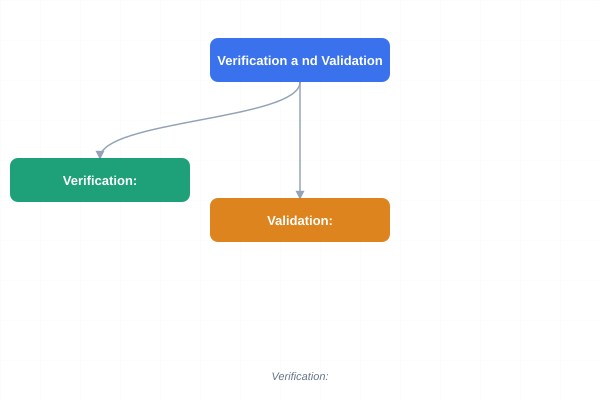
</a>
<a href="../../assets/images/diagrams/software-engineering/06-testing/verification-and-validation-sticky.svg" target="_blank" rel="noopener">
  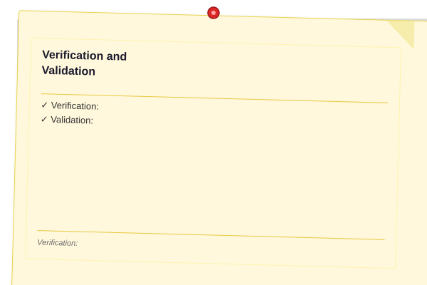
</a>


Verification and validation (V&V) are the two principal approaches to establishing that a software system meets its specification and satisfies stakeholder needs.

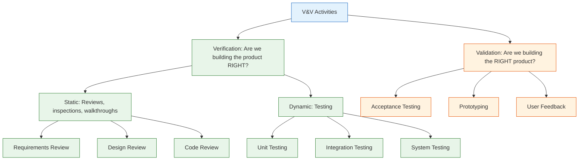

- **Verification:** "Are we building the product right?" — checks conformance to specification through static (reviews, inspections) and dynamic (testing) methods.
- **Validation:** "Are we building the right product?" — checks that the system meets actual customer needs through acceptance testing, prototyping, and user feedback.

### The Test Pyramid

<a href="../../assets/images/diagrams/software-engineering/06-testing/the-test-pyramid-handwritten.svg" target="_blank" rel="noopener">
  
</a>
<a href="../../assets/images/diagrams/software-engineering/06-testing/the-test-pyramid-diagram.svg" target="_blank" rel="noopener">
  
</a>
<a href="../../assets/images/diagrams/software-engineering/06-testing/the-test-pyramid-sticky.svg" target="_blank" rel="noopener">
  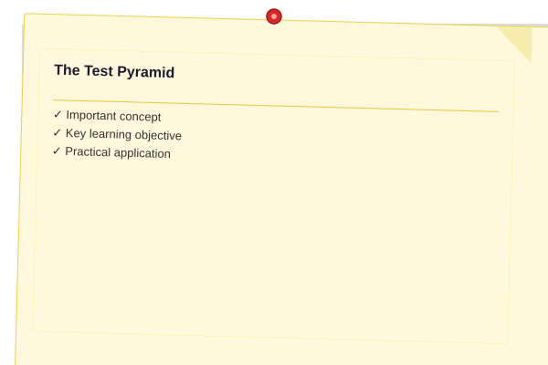
</a>


The test pyramid, proposed by Cohn, describes the ideal distribution of automated tests:

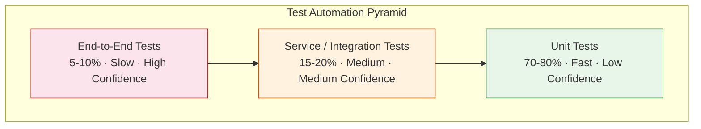

| Layer | Count | Speed | Confidence | Fragility | Cost to Maintain |
|-------|-------|-------|------------|-----------|------------------|
| Unit tests | Many (70-80%) | Fast (ms) | Low (per test) | Low | Low |
| Service/API tests | Some (15-20%) | Medium (s) | Medium | Medium | Medium |
| End-to-end tests | Few (5-10%) | Slow (min) | High (for flows) | High | High |

### Levels of Testing

<a href="../../assets/images/diagrams/software-engineering/06-testing/levels-of-testing-handwritten.svg" target="_blank" rel="noopener">
  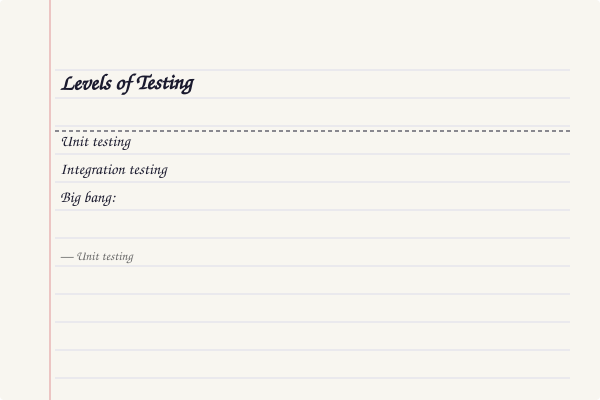
</a>
<a href="../../assets/images/diagrams/software-engineering/06-testing/levels-of-testing-diagram.svg" target="_blank" rel="noopener">
  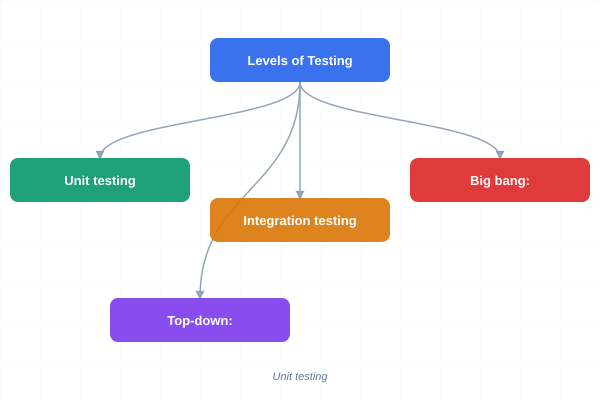
</a>
<a href="../../assets/images/diagrams/software-engineering/06-testing/levels-of-testing-sticky.svg" target="_blank" rel="noopener">
  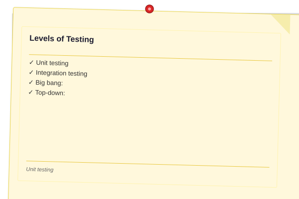
</a>


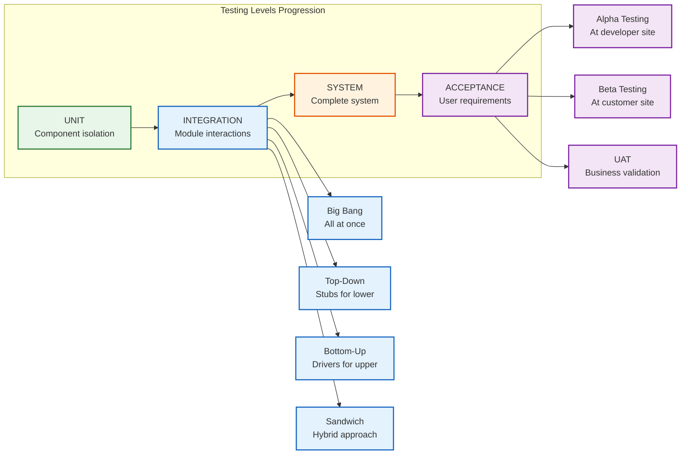

**Unit testing** verifies individual components in isolation. Tested by developers using frameworks like Bun test, Jest, or Vitest. Each test focuses on a single function, method, or class with all external dependencies replaced by test doubles.

**Integration testing** verifies that units work together. Strategies include:
- **Big bang:** All components combined at once — simple setup but hard to isolate failures
- **Top-down:** High-level components tested first, lower-level components stubbed — reveals architectural issues early
- **Bottom-up:** Low-level components tested with drivers — ensures foundation is solid
- **Sandwich:** Combination of top-down and bottom-up — balanced approach

**System testing** verifies the complete system against requirements. Includes functional, performance, security, and usability testing on the fully integrated system.

**Acceptance testing** determines whether the system satisfies acceptance criteria:
- **Alpha testing:** Customer representatives test at the developer's site in a controlled environment
- **Beta testing:** Real users test at their own site in production-like conditions
- **UAT (User Acceptance Testing):** Validates business processes and workflows

### White-Box Testing Techniques

<a href="../../assets/images/diagrams/software-engineering/06-testing/white-box-testing-techniques-handwritten.svg" target="_blank" rel="noopener">
  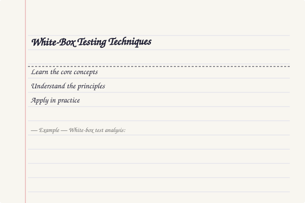
</a>
<a href="../../assets/images/diagrams/software-engineering/06-testing/white-box-testing-techniques-diagram.svg" target="_blank" rel="noopener">
  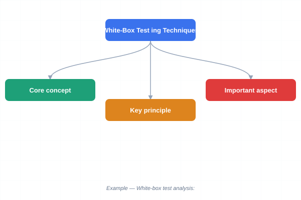
</a>
<a href="../../assets/images/diagrams/software-engineering/06-testing/white-box-testing-techniques-sticky.svg" target="_blank" rel="noopener">
  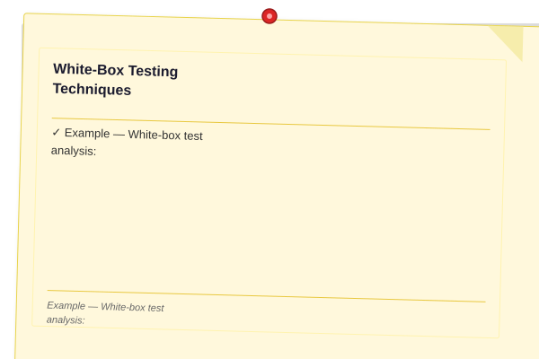
</a>


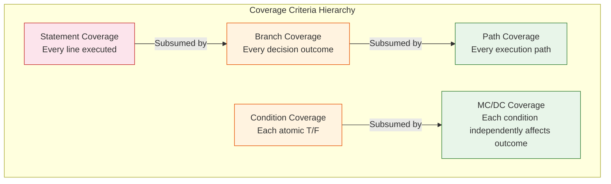

| Technique | Description | Strength | Practicality |
|-----------|-------------|----------|--------------|
| **Statement coverage** | Every executable statement executed at least once | Weakest | Easy to achieve (70-80% common) |
| **Branch coverage** | Every decision outcome (true/false) exercised | Stronger | Standard target (80-90%) |
| **Path coverage** | Every unique execution path exercised | Strongest | Often impractical (exponential paths) |
| **Condition coverage** | Each atomic condition evaluated to T and F | Moderate | Useful for complex conditions |
| **MC/DC** | Each condition independently affects outcome | Very strong | Required for DO-178C (aviation) |

**Example — White-box test analysis:**

```typescript
function calculateDiscount(price: number, isMember: boolean, couponCode?: string): number {
  let discount = 0;
  // Statement 1
  if (isMember) {
    discount += 0.1; // Branch A: true
  } else {
    discount += 0.05; // Branch A: false
  }
  // Statement 2
  if (couponCode === 'SAVE20') {
    discount += 0.2; // Branch B: true
  }
  // Statement 3
  if (price > 100) {
    discount += 0.05; // Branch C: true
  }
  // Statement 4
  return Math.min(discount, 0.5) * price;
}

// Test cases for 100% branch coverage:
// TC1: price=50, isMember=true, couponCode='SAVE20' → branches: A-T, B-T, C-F
// TC2: price=50, isMember=false, couponCode=undefined → branches: A-F, B-F, C-F
// TC3: price=200, isMember=false, couponCode=undefined → branches: A-F, B-F, C-T
```

### Black-Box Testing Techniques

<a href="../../assets/images/diagrams/software-engineering/06-testing/black-box-testing-techniques-handwritten.svg" target="_blank" rel="noopener">
  
</a>
<a href="../../assets/images/diagrams/software-engineering/06-testing/black-box-testing-techniques-diagram.svg" target="_blank" rel="noopener">
  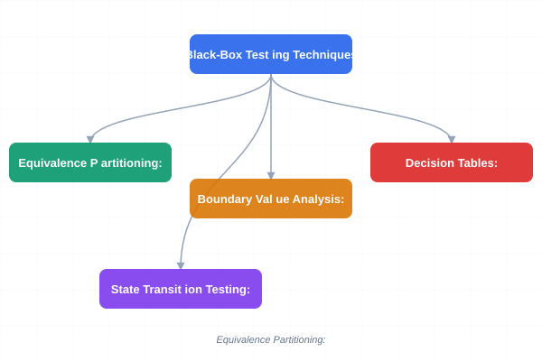
</a>
<a href="../../assets/images/diagrams/software-engineering/06-testing/black-box-testing-techniques-sticky.svg" target="_blank" rel="noopener">
  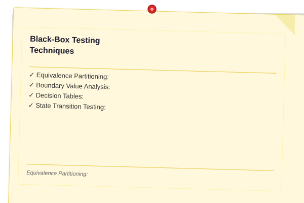
</a>


**Equivalence Partitioning:** Divides the input domain into equivalence classes where the system behaves equivalently for all values in a class. One test per class suffices.

**Boundary Value Analysis:** Selects test cases at the boundaries of equivalence classes. Defects frequently occur at boundaries (off-by-one errors, incorrect comparisons).

```typescript
// Example: testing a function that accepts ages 18-120
function validateAge(age: number): boolean {
  return age >= 18 && age <= 120;
}

// Equivalence classes:
// Valid: 18-120
// Invalid: < 18, > 120, non-numeric, null, undefined

// Boundary values:
// Low boundary: 17 (invalid), 18 (valid), 19 (valid)
// High boundary: 119 (valid), 120 (valid), 121 (invalid)
```

**Decision Tables:**

| Conditions | Rule 1 | Rule 2 | Rule 3 | Rule 4 | Rule 5 | Rule 6 |
|------------|--------|--------|--------|--------|--------|--------|
| Valid account? | T | T | T | T | F | F |
| Account locked? | F | F | T | T | — | — |
| Password correct? | T | F | T | F | — | — |
| Under max attempts? | T | T | F | F | — | — |
| **Actions** | | | | | | |
| Allow login | X | | | | | |
| Show error | | X | X | X | X | X |
| Increment attempts | | X | | X | | |
| Lock account (3 failures) | | | | X | | |

Decision tables ensure complete coverage of combinations. Each rule represents a unique combination of conditions and the resulting actions.

**State Transition Testing:**

```typescript
interface StateMachine {
  states: string[];
  transitions: { from: string; event: string; to: string }[];
  testCases: { initialState: string; events: string[]; expectedFinalState: string }[];
}

class StateTransitionTester {
  public validateTransitions(sm: StateMachine): { valid: boolean; errors: string[] } {
    const errors: string[] = [];
    for (const tc of sm.testCases) {
      let currentState = tc.initialState;
      for (const event of tc.events) {
        const transition = sm.transitions.find(
          (t) => t.from === currentState && t.event === event
        );
        if (!transition) {
          errors.push(`No transition from '${currentState}' on event '${event}'`);
          break;
        }
        currentState = transition.to;
      }
      if (currentState !== tc.expectedFinalState) {
        errors.push(`Expected final state '${tc.expectedFinalState}' but got '${currentState}'`);
      }
    }
    return { valid: errors.length === 0, errors };
  }
}
```

### Test Doubles

<a href="../../assets/images/diagrams/software-engineering/06-testing/test-doubles-handwritten.svg" target="_blank" rel="noopener">
  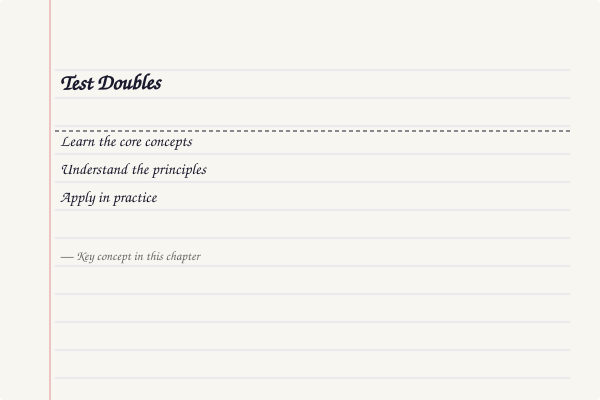
</a>
<a href="../../assets/images/diagrams/software-engineering/06-testing/test-doubles-diagram.svg" target="_blank" rel="noopener">
  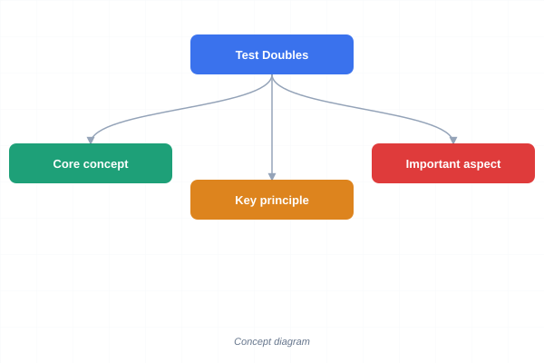
</a>
<a href="../../assets/images/diagrams/software-engineering/06-testing/test-doubles-sticky.svg" target="_blank" rel="noopener">
  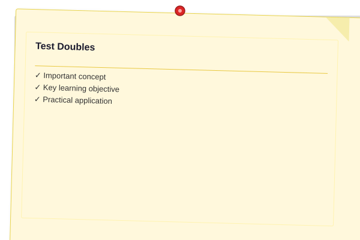
</a>


| Type | Description | Use Case |
|------|-------------|----------|
| **Dummy** | Passed but never used; fills parameter lists | When an argument is required but not exercised |
| **Fake** | Working implementation with shortcuts | In-memory database replacing real database |
| **Stub** | Returns predefined answers for specific calls | When you need controlled responses from dependencies |
| **Spy** | Records interactions for later verification | Verifying a method was called with correct arguments |
| **Mock** | Pre-programmed with expectations and verification | Behavior verification in interaction testing |

```typescript
// Example: Mock repository for testing
interface UserRepository {
  findById(id: string): Promise<User | null>;
  save(user: User): Promise<void>;
}

class MockUserRepository implements UserRepository {
  private users: Map<string, User> = new Map();
  
  public findById(id: string): Promise<User | null> {
    return Promise.resolve(this.users.get(id) ?? null);
  }
  
  public save(user: User): Promise<void> {
    this.users.set(user.id, user);
    return Promise.resolve();
  }
  
  // Spy capability
  public findByIdCalls: string[] = [];
  public saveCalls: User[] = [];
  
  public findByIdWithSpy(id: string): Promise<User | null> {
    this.findByIdCalls.push(id);
    return this.findById(id);
  }
}
```

### TDD Cycle: Red-Green-Refactor

<a href="../../assets/images/diagrams/software-engineering/06-testing/tdd-cycle-red-green-refactor-handwritten.svg" target="_blank" rel="noopener">
  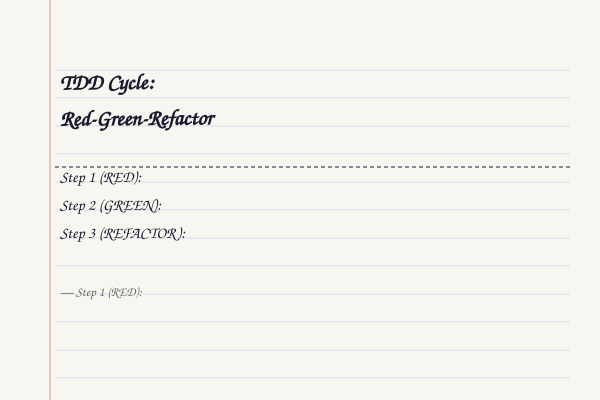
</a>
<a href="../../assets/images/diagrams/software-engineering/06-testing/tdd-cycle-red-green-refactor-diagram.svg" target="_blank" rel="noopener">
  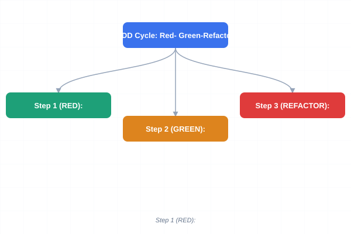
</a>
<a href="../../assets/images/diagrams/software-engineering/06-testing/tdd-cycle-red-green-refactor-sticky.svg" target="_blank" rel="noopener">
  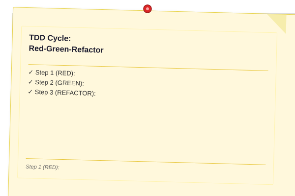
</a>


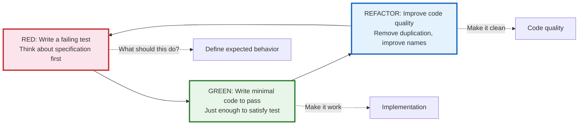

#### Worked Example: String Calculator

**Step 1 (RED):** Write a failing test.

```typescript
import { describe, expect, test } from 'bun:test';

describe('StringCalculator', () => {
  test('returns 0 for empty string', () => {
    expect(add('')).toBe(0);
  });

  test('returns the number for a single number', () => {
    expect(add('1')).toBe(1);
  });

  test('returns sum for two numbers separated by comma', () => {
    expect(add('1,2')).toBe(3);
  });

  test('returns sum for multiple numbers', () => {
    expect(add('1,2,3,4,5')).toBe(15);
  });

  test('handles newline as delimiter', () => {
    expect(add('1\n2,3')).toBe(6);
  });

  test('supports custom delimiter', () => {
    expect(add('//;\n1;2')).toBe(3);
  });

  test('throws on negative numbers', () => {
    expect(() => add('1,-2,3')).toThrow('negatives not allowed: -2');
  });

  test('ignores numbers greater than 1000', () => {
    expect(add('2,1001')).toBe(2);
  });
});
```

**Step 2 (GREEN):** Write minimal code to pass.

```typescript
function add(input: string): number {
  if (input === '') return 0;

  let delimiter = /,|\n/;
  let numbers = input;

  if (input.startsWith('//')) {
    const delimiterEnd = input.indexOf('\n');
    delimiter = new RegExp(input.substring(2, delimiterEnd));
    numbers = input.substring(delimiterEnd + 1);
  }

  const tokens = numbers.split(delimiter);
  const negatives = tokens.filter((n) => parseInt(n) < 0);

  if (negatives.length > 0) {
    throw new Error(`negatives not allowed: ${negatives.join(',')}`);
  }

  return tokens
    .map((n) => parseInt(n))
    .filter((n) => n <= 1000)
    .reduce((sum, n) => sum + n, 0);
}
```

**Step 3 (REFACTOR):** Improve the code.

```typescript
function add(input: string): number {
  if (input === '') return 0;

  const { delimiter, numberStr } = parseDelimiter(input);
  const numbers = parseNumbers(numberStr, delimiter);
  validateNoNegatives(numbers);
  return sumNumbers(numbers);
}

function parseDelimiter(input: string): { delimiter: RegExp; numberStr: string } {
  if (input.startsWith('//')) {
    const delimiterEnd = input.indexOf('\n');
    const delim = input.substring(2, delimiterEnd);
    return { delimiter: new RegExp(delim), numberStr: input.substring(delimiterEnd + 1) };
  }
  return { delimiter: /,|\n/, numberStr: input };
}

function parseNumbers(input: string, delimiter: RegExp): number[] {
  return input.split(delimiter).map((n) => parseInt(n));
}

function validateNoNegatives(numbers: number[]): void {
  const negatives = numbers.filter((n) => n < 0);
  if (negatives.length > 0) {
    throw new Error(`negatives not allowed: ${negatives.join(',')}`);
  }
}

function sumNumbers(numbers: number[]): number {
  return numbers
    .filter((n) => n <= 1000)
    .reduce((sum, n) => sum + n, 0);
}
```

### BDD (Behavior-Driven Development)

<a href="../../assets/images/diagrams/software-engineering/06-testing/bdd-behavior-driven-development-handwritten.svg" target="_blank" rel="noopener">
  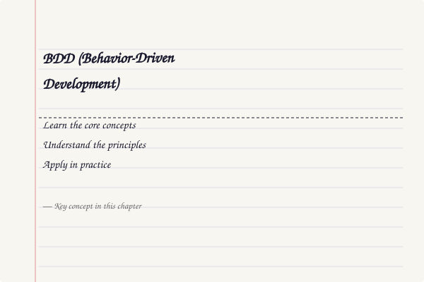
</a>
<a href="../../assets/images/diagrams/software-engineering/06-testing/bdd-behavior-driven-development-diagram.svg" target="_blank" rel="noopener">
  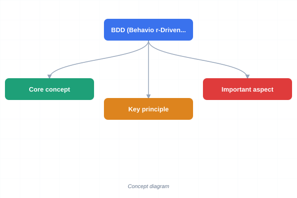
</a>
<a href="../../assets/images/diagrams/software-engineering/06-testing/bdd-behavior-driven-development-sticky.svg" target="_blank" rel="noopener">
  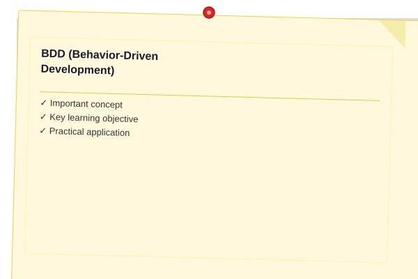
</a>


BDD extends TDD by writing tests in a natural language format that non-technical stakeholders can understand:

```typescript
// BDD-style test using Given-When-Then
describe('Shopping Cart', () => {
  test('should calculate total with tax for multiple items', () => {
    // Given
    const cart = new ShoppingCart();
    cart.addItem({ name: 'Book', price: 10, quantity: 2 });
    cart.addItem({ name: 'Pen', price: 2, quantity: 3 });
    
    // When
    const total = cart.calculateTotal({ taxRate: 0.08 });
    
    // Then
    expect(total).toBeCloseTo(27.0, 1); // (20 + 6) * 1.08 = 28.08
  });
});
```

### Property-Based Testing

<a href="../../assets/images/diagrams/software-engineering/06-testing/property-based-testing-handwritten.svg" target="_blank" rel="noopener">
  
</a>
<a href="../../assets/images/diagrams/software-engineering/06-testing/property-based-testing-diagram.svg" target="_blank" rel="noopener">
  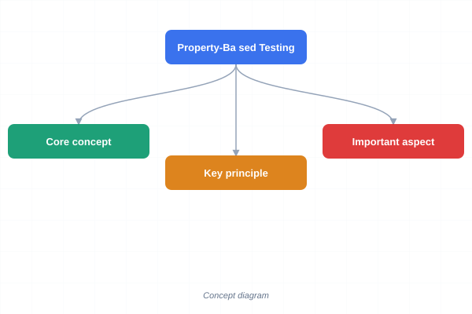
</a>
<a href="../../assets/images/diagrams/software-engineering/06-testing/property-based-testing-sticky.svg" target="_blank" rel="noopener">
  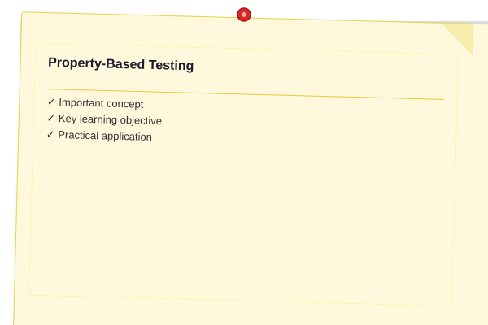
</a>


Property-based testing verifies that a function satisfies certain properties for a wide range of inputs, rather than checking specific examples.

```typescript
import { describe, expect, test } from 'bun:test';

// Property: reversing a string twice gives the original string
function reverse(str: string): string {
  return str.split('').reverse().join('');
}

// Property-based test
describe('reverse properties', () => {
  test('reversing twice gives original', () => {
    const inputs = ['hello', 'a', '', 'racecar', '12345', 'typescript'];
    for (const input of inputs) {
      expect(reverse(reverse(input))).toBe(input);
    }
  });

  test('reversing preserves length', () => {
    const inputs = ['hello', 'world', '', 'typescript', 'property-based'];
    for (const input of inputs) {
      expect(reverse(input).length).toBe(input.length);
    }
  });

  test('reversing a palindrome gives same string', () => {
    const palindromes = ['racecar', 'level', 'radar', 'madam', 'refer'];
    for (const p of palindromes) {
      expect(reverse(p)).toBe(p);
    }
  });

  test('reversing distributes over concatenation', () => {
    const inputs = [
      ['hello', 'world'],
      ['abc', 'def'],
      ['foo', 'bar'],
    ];
    for (const [a, b] of inputs) {
      // reverse(a + b) = reverse(b) + reverse(a)
      expect(reverse(a + b)).toBe(reverse(b) + reverse(a));
    }
  });
});
```

### Mutation Testing

<a href="../../assets/images/diagrams/software-engineering/06-testing/mutation-testing-handwritten.svg" target="_blank" rel="noopener">
  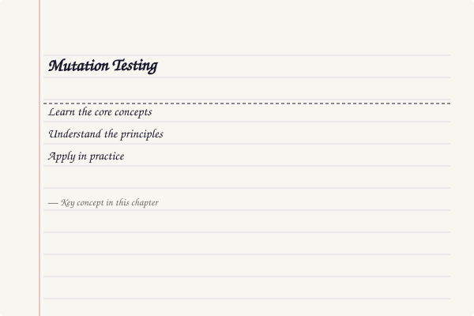
</a>
<a href="../../assets/images/diagrams/software-engineering/06-testing/mutation-testing-diagram.svg" target="_blank" rel="noopener">
  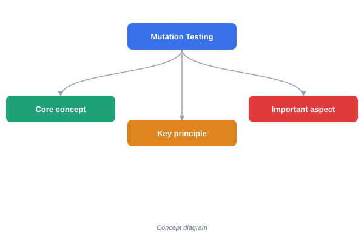
</a>
<a href="../../assets/images/diagrams/software-engineering/06-testing/mutation-testing-sticky.svg" target="_blank" rel="noopener">
  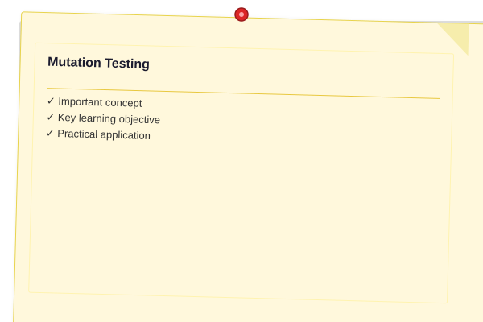
</a>


Mutation testing evaluates test quality by introducing small changes (mutations) to the source code and checking whether the tests detect them.

```typescript
interface Mutation {
  id: string;
  operator: string;
  originalCode: string;
  mutatedCode: string;
  killed: boolean;
}

class MutationTester {
  public generateMutations(sourceCode: string): Mutation[] {
    const mutations: Mutation[] = [];
    let id = 0;
    
    // Relational operator mutations
    const relOps = [
      { from: '>', to: '>=' },
      { from: '<', to: '<=' },
      { from: '>=', to: '>' },
      { from: '<=', to: '<' },
      { from: '===', to: '!==' },
      { from: '!==', to: '===' },
    ];
    
    for (const op of relOps) {
      if (sourceCode.includes(op.from)) {
        mutations.push({
          id: `M-${++id}`,
          operator: `Replace ${op.from} with ${op.to}`,
          originalCode: sourceCode,
          mutatedCode: sourceCode.replace(op.from, op.to),
          killed: false,
        });
      }
    }
    
    // Logical operator mutations
    if (sourceCode.includes('&&')) {
      mutations.push({
        id: `M-${++id}`,
        operator: 'Replace && with ||',
        originalCode: sourceCode,
        mutatedCode: sourceCode.replace('&&', '||'),
        killed: false,
      });
    }
    
    // Constant mutations
    const constMatch = sourceCode.match(/\b(\d+)\b/g);
    if (constMatch) {
      for (const c of constMatch) {
        mutations.push({
          id: `M-${++id}`,
          operator: `Replace ${c} with ${c + 1} (off-by-one)`,
          originalCode: sourceCode,
          mutatedCode: sourceCode.replace(c, String(Number(c) + 1)),
          killed: false,
        });
      }
    }
    
    return mutations;
  }

  public calculateMutationScore(mutations: Mutation[]): number {
    const killed = mutations.filter((m) => m.killed).length;
    return mutations.length > 0 ? killed / mutations.length : 0;
  }
}
```

### Non-Functional Testing

<a href="../../assets/images/diagrams/software-engineering/06-testing/non-functional-testing-handwritten.svg" target="_blank" rel="noopener">
  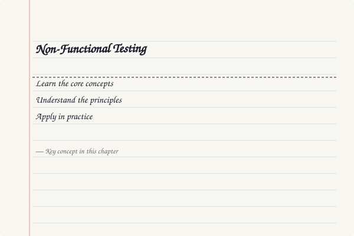
</a>
<a href="../../assets/images/diagrams/software-engineering/06-testing/non-functional-testing-diagram.svg" target="_blank" rel="noopener">
  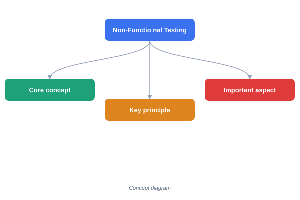
</a>
<a href="../../assets/images/diagrams/software-engineering/06-testing/non-functional-testing-sticky.svg" target="_blank" rel="noopener">
  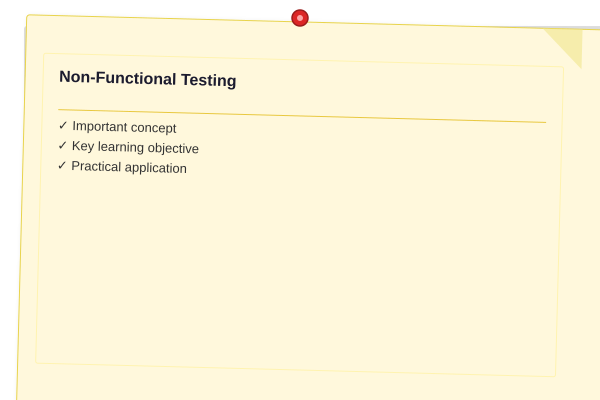
</a>


| Type | What It Tests | Techniques | Automation |
|------|---------------|------------|------------|
| **Performance** | System behaviour under load | Load testing, stress testing, endurance, spike testing | k6, Artillery, Locust |
| **Security** | Vulnerability identification | Penetration testing, SAST, DAST, dependency scanning | OWASP ZAP, SonarQube |
| **Usability** | Ease of learning and use | User observation, heuristic evaluation, A/B testing | Manual + analytics |
| **Reliability** | System uptime and fault tolerance | Chaos engineering, failover testing, soak testing | Chaos Monkey, Litmus |
| **Regression** | Existing functionality still works | Automated test suite re-execution | CI pipeline integration |

### CI/CD Test Pipeline

<a href="../../assets/images/diagrams/software-engineering/06-testing/ci-cd-test-pipeline-handwritten.svg" target="_blank" rel="noopener">
  
</a>
<a href="../../assets/images/diagrams/software-engineering/06-testing/ci-cd-test-pipeline-diagram.svg" target="_blank" rel="noopener">
  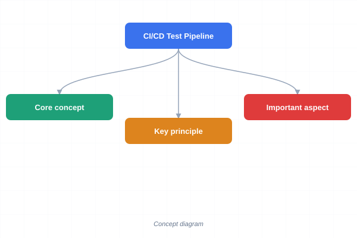
</a>
<a href="../../assets/images/diagrams/software-engineering/06-testing/ci-cd-test-pipeline-sticky.svg" target="_blank" rel="noopener">
  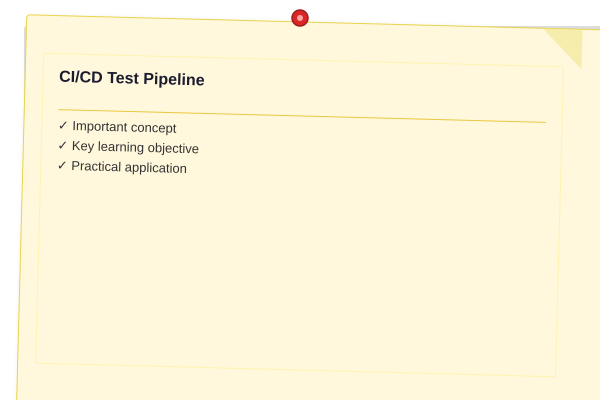
</a>


```mermaid
graph LR
    classDef commit fill:#e8eaf6,stroke:#3f51b5
    classDef fast fill:#e8f5e9,stroke:#2e7d32
    classDef slow fill:#fff3e0,stroke:#e65100
    classDef gate fill:#fce4ec,stroke:#c62828

    COMMIT[Code Commit]:::commit --> LINT[Lint & Type Check]:::fast
    LINT --> UNIT2[Unit Tests<br>< 2 min]:::fast
    UNIT2 --> GATE1{Quality Gate<br>80% coverage?}:::gate
    GATE1 -->|Pass| BUILD[Build & Package]:::fast
    GATE1 -->|Fail| REJECT[Reject Commit]:::gate
    BUILD --> INTEGRATION[Integration Tests<br>< 10 min]:::slow
    INTEGRATION --> GATE2{Quality Gate<br>All pass?}:::gate
    GATE2 -->|Pass| E2E[E2E Tests<br>< 30 min]:::slow
    GATE2 -->|Fail| REJECT2[Reject Build]:::gate
    E2E --> GATE3{Quality Gate<br>Critical flows pass?}:::gate
    GATE3 -->|Pass| DEPLOY[Deploy to Staging]:::commit
    GATE3 -->|Fail| REJECT2
    DEPLOY --> PERF[Performance Tests]:::slow
    PERF --> SEC[Security Scan]:::slow
    SEC --> GATE4{All Gates Pass?}:::gate
    GATE4 -->|Yes| PROD_DEPLOY[Deploy to Production]:::commit
```

## Case Studies

### Case Study 1: Payment Processing System — Testing Strategy

A fintech startup building a payment processing system needed to ensure 99.99% reliability. They implemented a comprehensive test strategy:

**Unit tests (1,500+):** Each validation rule, fee calculation, and currency conversion function tested in isolation with mocked external services. Achieved 92% line coverage.

**Integration tests (200+):** Tested the interaction between the payment gateway, fraud detection service, and notification system using testcontainers for database and message queue.

**E2E tests (20):** Simulated complete payment flows from checkout to settlement using a sandbox environment. Run nightly.

**Mutation testing:** Achieved 85% mutation score, identifying 40+ tests that passed but didn't actually validate the right behavior. These were rewritten to be more specific.

**Result:** Zero production incidents in 18 months. Deployment frequency increased from weekly to multiple times per day.

### Case Study 2: Medical Device Software — Regulatory Testing

A company developing an MRI machine control system needed FDA clearance (IEC 62304). The testing approach:

**MC/DC coverage:** Required for safety-critical functions. For a patient dose calculation function with 12 conditions, they generated 13 test cases achieving 100% MC/DC coverage.

**Traceability matrix:** Every requirement mapped to 3-5 test cases. A TypeScript-based traceability tool ensured no gaps.

**Risk-based testing:** High-risk functions (those affecting radiation dosage) received 3x more test cases than low-risk functions (logging, UI cosmetics).

**Result:** FDA clearance achieved in 14 months (industry average: 24+ months). Zero major findings during audit.

### Case Study 3: E-Commerce Platform — Shift-Left Testing

A large e-commerce platform with 200+ microservices adopted shift-left testing to reduce production defects:

**TDD adoption:** All new features developed using TDD. Defect rate dropped 60% in 6 months.

**Contract testing:** Each service team published consumer-driven contracts. Breaking changes detected before deployment.

**Test pyramid enforcement:** CI pipeline rejected PRs where the test ratio fell below 70% unit, 20% integration, 10% E2E.

**Result:** Deployment frequency increased from monthly to daily. Mean time to recover (MTTR) dropped from 4 hours to 15 minutes.

## Test Runner and Automation Tools

```typescript
// Test Runner — Automated Test Executor with Reporting
interface TestResult {
  name: string;
  passed: boolean;
  durationMs: number;
  error?: string;
}

interface TestSuite {
  name: string;
  tests: (() => Promise<TestResult>)[];
}

class TestRunner {
  private suites: TestSuite[] = [];
  private results: TestResult[] = [];

  public register(suite: TestSuite): void {
    this.suites.push(suite);
  }

  public async runAll(): Promise<{ passed: number; failed: number; total: number; durationMs: number }> {
    const startTime = Date.now();
    this.results = [];

    for (const suite of this.suites) {
      console.log(`\nRunning suite: ${suite.name}`);
      for (const test of suite.tests) {
        try {
          const result = await test();
          this.results.push(result);
          const icon = result.passed ? '✓' : '✗';
          console.log(`  ${icon} ${result.name} (${result.durationMs}ms)`);
          if (!result.passed) {
            console.log(`    Error: ${result.error}`);
          }
        } catch (err) {
          this.results.push({
            name: test.name,
            passed: false,
            durationMs: 0,
            error: String(err),
          });
        }
      }
    }

    const durationMs = Date.now() - startTime;
    const passed = this.results.filter((r) => r.passed).length;
    const failed = this.results.filter((r) => !r.passed).length;

    console.log(`\n=== Results: ${passed}/${this.results.length} passed (${durationMs}ms) ===`);
    if (failed > 0) {
      console.log('Failed tests:');
      this.results.filter((r) => !r.passed).forEach((r) => console.log(`  - ${r.name}: ${r.error}`));
    }

    return { passed, failed, total: this.results.length, durationMs };
  }

  public generateJUnitXml(): string {
    // Generates JUnit-compatible XML for CI integration
    const lines: string[] = ['<?xml version="1.0" encoding="UTF-8"?>'];
    lines.push(`<testsuite name="TestRunner" tests="${this.results.length}" failures="${this.results.filter(r => !r.passed).length}">`);
    for (const r of this.results) {
      lines.push(`  <testcase name="${r.name}" time="${r.durationMs / 1000}">`);
      if (!r.passed) {
        lines.push(`    <failure message="${r.error}"/>`);
      }
      lines.push('  </testcase>');
    }
    lines.push('</testsuite>');
    return lines.join('\n');
  }
}

// Usage
const runner = new TestRunner();
runner.register({
  name: 'StringCalculator',
  tests: [
    {
      name: 'empty string returns 0',
      run: async () => {
        const start = Date.now();
        const result = add('') === 0;
        return { name: 'empty string returns 0', passed: result, durationMs: Date.now() - start };
      },
    },
    {
      name: 'single number returns value',
      run: async () => {
        const start = Date.now();
        const result = add('5') === 5;
        return { name: 'single number returns value', passed: result, durationMs: Date.now() - start };
      },
    },
  ],
});

// await runner.runAll();
```

### Coverage Analyzer — Statement, Branch, Path Coverage

```typescript
interface CoverageResult {
  totalLines: number;
  coveredLines: number;
  totalBranches: number;
  coveredBranches: number;
  totalPaths: number;
  coveredPaths: number;
  lineCoverage: number;
  branchCoverage: number;
  pathCoverage: number;
  uncoveredLines: number[];
  uncoveredBranches: string[];
}

class CoverageAnalyzer {
  public analyzeLineCoverage(sourceLines: string[], executedLines: Set<number>): { total: number; covered: number; rate: number } {
    const total = sourceLines.length;
    let covered = 0;
    for (let i = 0; i < total; i++) {
      const line = sourceLines[i].trim();
      if (line === '' || line.startsWith('//') || line.startsWith('/*') || line.startsWith('*') || line.startsWith('import')) {
        continue; // skip non-executable lines
      }
      if (executedLines.has(i + 1)) covered++;
    }
    return { total, covered, rate: total > 0 ? covered / total : 0 };
  }

  public analyzeBranchCoverage(branches: { line: number; type: 'if' | 'else' | 'switch'; taken: boolean }[]): {
    total: number; covered: number; rate: number; uncoveredBranches: string[];
  } {
    const total = branches.length;
    const covered = branches.filter((b) => b.taken).length;
    const uncovered = branches.filter((b) => !b.taken).map((b) => `Line ${b.line}: ${b.type} branch`);
    return { total, covered, rate: total > 0 ? covered / total : 0, uncoveredBranches: uncovered };
  }

  public estimatePathCoverage(cyclomaticComplexity: number, testedPaths: number): { total: number; covered: number; rate: number } {
    return { total: cyclomaticComplexity, covered: testedPaths, rate: cyclomaticComplexity > 0 ? testedPaths / cyclomaticComplexity : 0 };
  }

  public generateReport(sourceLines: string[], executedLines: Set<number>, branches: { line: number; type: string; taken: boolean }[]): string {
    const lineCov = this.analyzeLineCoverage(sourceLines, executedLines);
    const branchCov = this.analyzeBranchCoverage(branches);

    const lines: string[] = [
      '=== Coverage Report ===',
      '',
      '┌──────────────────────────┬────────────┐',
      '│ Metric                   │ Value      │',
      '├──────────────────────────┼────────────┤',
      `│ Lines                    │ ${lineCov.covered}/${lineCov.total} (${(lineCov.rate * 100).toFixed(1)}%) │`,
      `│ Branches                 │ ${branchCov.covered}/${branchCov.total} (${(branchCov.rate * 100).toFixed(1)}%) │`,
      '└──────────────────────────┴────────────┘',
    ];

    if (branchCov.uncoveredBranches.length > 0) {
      lines.push('', 'Uncovered Branches:');
      for (const b of branchCov.uncoveredBranches) {
        lines.push(`  → ${b}`);
      }
    }

    lines.push('', 'Recommendations:');
    if (lineCov.rate < 0.8) lines.push('  · Add tests to reach 80% line coverage (current: ' + (lineCov.rate * 100).toFixed(1) + '%)');
    if (branchCov.rate < 0.7) lines.push('  · Add tests for uncovered branches to reach 70% branch coverage');
    if (branchCov.rate < lineCov.rate) lines.push('  · Branch coverage is lower than line coverage — focus on decision coverage');
    if (lineCov.rate > 0.95) lines.push('  · Line coverage is high — consider mutation testing to assess test quality');

    return lines.join('\n');
  }
}

// Usage
const analyzer = new CoverageAnalyzer();
const source = [
  'function calculateDiscount(price: number, isMember: boolean) {',
  '  let discount = 0;',
  '  if (isMember) {',
  '    discount = 0.1;',
  '  }',
  '  return price * (1 - discount);',
  '}',
];
const executed = new Set([1, 2, 3, 4, 6]);
const branches = [
  { line: 3, type: 'if' as const, taken: true },
  { line: 3, type: 'else' as const, taken: false },
];
console.log(analyzer.generateReport(source, executed, branches));
```

### TDD Workflow — Red-Green-Refactor Simulator

```typescript
interface TDDCycle {
  phase: 'red' | 'green' | 'refactor';
  description: string;
  testCount: number;
  passingTests: number;
  codeLines: number;
}

class TDDWorkflow {
  private cycles: TDDCycle[] = [];
  private currentPhase: TDDCycle['phase'] = 'red';
  private testCount = 0;
  private passingTests = 0;
  private codeLines = 0;

  public startCycle(description: string): void {
    this.currentPhase = 'red';
    this.cycles.push({
      phase: 'red',
      description,
      testCount: 0,
      passingTests: 0,
      codeLines: this.codeLines,
    });
  }

  public addTest(): void {
    this.testCount++;
    if (this.currentPhase === 'red') {
      // Red phase: test fails initially
      const cycle = this.cycles[this.cycles.length - 1];
      cycle.testCount = this.testCount;
      cycle.passingTests = this.passingTests;
    }
  }

  public implement(): void {
    this.currentPhase = 'green';
    this.passingTests = this.testCount; // All tests pass now
    this.codeLines += Math.floor(Math.random() * 10) + 1;
    const cycle = this.cycles[this.cycles.length - 1];
    cycle.phase = 'green';
    cycle.passingTests = this.passingTests;
    cycle.codeLines = this.codeLines;
  }

  public refactor(linesRemoved: number): void {
    this.currentPhase = 'refactor';
    this.codeLines -= linesRemoved;
    const cycle = this.cycles[this.cycles.length - 1];
    cycle.phase = 'refactor';
    cycle.codeLines = this.codeLines;
  }

  public getReport(): string {
    const lines: string[] = ['=== TDD Workflow Report ==='];
    let totalTests = 0;
    for (const cycle of this.cycles) {
      const icon = cycle.phase === 'red' ? '🔴' : cycle.phase === 'green' ? '🟢' : '🔵';
      lines.push(`  ${icon} ${cycle.phase.toUpperCase()}: ${cycle.description}`);
      lines.push(`     Tests: ${cycle.passingTests}/${cycle.testCount} passing | Code: ${cycle.codeLines} lines`);
      totalTests = cycle.testCount;
    }
    lines.push('', `Total: ${this.cycles.length} cycles, ${totalTests} tests`);
    return lines.join('\n');
  }
}

// Simulate TDD for FizzBuzz
const tdd = new TDDWorkflow();

// Cycle 1: Handle multiples of 3
tdd.startCycle('Return "Fizz" for multiples of 3');
tdd.addTest(); // Test: fizzbuzz(3) === "Fizz"
tdd.implement();
tdd.refactor(0);

// Cycle 2: Handle multiples of 5
tdd.startCycle('Return "Buzz" for multiples of 5');
tdd.addTest(); // Test: fizzbuzz(5) === "Buzz"
tdd.addTest(); // Test: fizzbuzz(10) === "Buzz"
tdd.implement();
tdd.refactor(1); // Combined condition extraction

// Cycle 3: Handle multiples of both 3 and 5
tdd.startCycle('Return "FizzBuzz" for multiples of 15');
tdd.addTest(); // Test: fizzbuzz(15) === "FizzBuzz"
tdd.addTest(); // Test: fizzbuzz(30) === "FizzBuzz"
tdd.implement();
tdd.refactor(2); // Extracted isDivisibleBy helper

console.log(tdd.getReport());
```

### Additional Testing Tools

```typescript
// === Test Case Generator ===
interface MethodUnderTest {
  name: string;
  params: { name: string; type: string; examples: unknown[] }[];
  returnType: string;
  invariants: string[];
}
function generateTestCases(method: MethodUnderTest): string[] {
  const tests: string[] = [];
  const paramCombos = method.params.length === 0 ? [[]] : method.params[0].examples.map((v) => [v]);
  for (const combo of paramCombos) {
    tests.push(`// ${method.name}(${combo.join(", ")}) should return ${method.returnType}`);
  }
  if (method.invariants.length > 0) {
    tests.push(`// Property: ${method.invariants.join(" and ")}`);
  }
  tests.push(`// Edge case: null input`, `// Edge case: empty input`, `// Edge case: boundary value`);
  return tests;
}

// === Test Pyramid Checker ===
interface TestSuite { unit: number; integration: number; e2e: number }
function checkPyramid(suite: TestSuite): { healthy: boolean; ratio: string; recommendation: string } {
  const total = suite.unit + suite.integration + suite.e2e;
  if (total === 0) return { healthy: false, ratio: "0:0:0", recommendation: "No tests defined" };
  const unitPct = (suite.unit / total * 100).toFixed(0);
  const intPct = (suite.integration / total * 100).toFixed(0);
  const e2ePct = (suite.e2e / total * 100).toFixed(0);
  const healthy = suite.unit > suite.integration && suite.integration > suite.e2e;
  let recommendation = healthy
    ? "Pyramid is healthy"
    : suite.unit < suite.integration
      ? "Too many integration tests — add more unit tests"
      : "Too many E2E tests — shift down the pyramid";
  return { healthy, ratio: `${unitPct}:${intPct}:${e2ePct}`, recommendation };
}

// === Risk-Based Testing Prioritizer ===
function prioritizeTests(tests: TestSuite['tests'], risks: Map<string, number>): TestSuite['tests'] {
  return [...tests].sort((a, b) => {
    const riskA = risks.get(a.name) ?? 1;
    const riskB = risks.get(b.name) ?? 1;
    return riskB - riskA;
  });
}
```

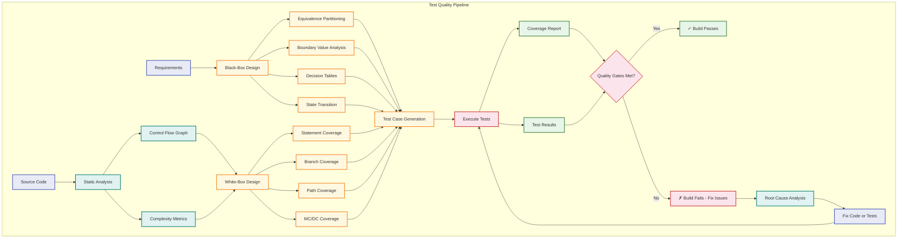

## Summary

Software testing is the primary dynamic verification and validation technique, ensuring that a system meets its specification (verification) and satisfies stakeholder needs (validation). Testing occurs at four levels: unit, integration, system, and acceptance, each with distinct goals and techniques. The test pyramid guides automation investment, recommending a broad base of fast, reliable unit tests with progressively fewer integration and E2E tests.

White-box techniques (statement, branch, path, condition, MC/DC coverage) use knowledge of internal structure to design thorough tests. Black-box techniques (equivalence partitioning, boundary value analysis, decision tables, state transition) derive test cases from specifications without reference to internal code. TDD follows the red-green-refactor cycle, producing testable designs and comprehensive test suites. Test doubles (dummy, fake, stub, spy, mock) isolate units under test from their dependencies. Property-based testing verifies behavioural properties across input ranges, and mutation testing evaluates test quality by measuring how well tests detect seeded defects. BDD extends TDD with natural-language scenarios accessible to all stakeholders. Non-functional testing addresses performance, security, and usability. A well-designed CI/CD pipeline with quality gates ensures that testing is automated, repeatable, and integrated into the development workflow.

## Practical Takeaways

1. **Write tests first (TDD)** — it forces you to think about design before implementation and ensures testable code from the start.
2. **Follow the test pyramid** — invest most in fast, reliable unit tests (70-80%), fewer integration tests (15-20%), and minimal E2E tests (5-10%).
3. **Test behaviours, not methods** — focus on what the code does from the user's perspective, not how it's structured internally.
4. **Coverage is a hint, not a goal** — 100% coverage doesn't mean 100% correctness. Use mutation testing to assess test quality.
5. **Use test doubles wisely** — mock external dependencies, but prefer real objects for core logic to avoid brittle tests.
6. **A failing test is progress** — it means you've found a spec-to-implementation gap before production. Celebrate caught defects.
7. **Boundary values find bugs** — most defects cluster at input boundaries. Always test boundaries, not just middle values.
8. **CI pipeline gates protect quality** — enforce coverage thresholds, test pass rates, and linting rules before merge.

## Chapter Quiz

| Question | Answer | Explanation |
|----------|--------|-------------|
| Q1 | B | Red = write failing test, Green = make it pass, Refactor = improve code |
| Q2 | C | Path coverage exercises every unique execution path — strongest but often impractical |
| Q3 | C | A Fake is a working implementation with shortcuts (e.g., in-memory database) |
| Q4 | C | Unit tests form the broad base (70-80%) of the automation pyramid |
| Q5 | B | Empirical studies show defects cluster at input boundaries |

**Q1: What is the correct order of the TDD cycle?**
- A) Green → Red → Refactor
- B) Red → Green → Refactor
- C) Refactor → Red → Green
- D) Red → Refactor → Green

**Q2: Which coverage criterion is strongest (finds the most defects)?**
- A) Statement coverage
- B) Branch coverage
- C) Path coverage
- D) Function coverage

**Q3: What type of test double is an in-memory database that provides a simplified but working implementation?**
- A) Stub
- B) Mock
- C) Fake
- D) Dummy

**Q4: According to the test pyramid, which layer should have the most tests?**
- A) End-to-end tests
- B) Service tests
- C) Unit tests
- D) Manual tests

**Q5: Boundary value analysis is most effective at finding defects because:**
- A) It tests random values
- B) Defects frequently occur at input boundaries
- C) It requires the least test cases
- D) It tests internal code structure

## Exercises

### Review Questions

1. Distinguish between verification and validation.

2. What are the four levels of testing, and what does each level verify?

3. Explain top-down versus bottom-up integration testing.

4. What is the difference between statement coverage and branch coverage?

5. Why is path coverage often impractical?

6. Describe equivalence partitioning with an example.

7. How does boundary value analysis complement equivalence partitioning?

8. What are the five types of test doubles, and when would you use each?

9. What does the TDD acronym stand for, and what are its three phases?

10. Describe the three layers of the test automation pyramid with recommended proportions.

### Application Problems

1. **Equivalence Partitioning and BVA:** Apply equivalence partitioning and boundary value analysis to a function that validates dates in DD/MM/YYYY format between 01/01/2000 and 31/12/2099. List all test cases.

<details>
<summary>Click for solution</summary>

```typescript
function validateDate(dateStr: string): boolean {
  const regex = /^(\d{2})\/(\d{2})\/(\d{4})$/;
  const match = dateStr.match(regex);
  if (!match) return false;
  const day = parseInt(match[1]);
  const month = parseInt(match[2]);
  const year = parseInt(match[3]);
  if (year < 2000 || year > 2099) return false;
  if (month < 1 || month > 12) return false;
  const daysInMonth = new Date(year, month, 0).getDate();
  if (day < 1 || day > daysInMonth) return false;
  return true;
}

// Equivalence Classes:
// Invalid format: 'abc', '01/01/200', '1/1/2000'
// Year < 2000: '01/01/1999'
// Year > 2099: '01/01/2100'
// Year valid 2000-2099: '15/06/2024'
// Month < 1: '01/00/2024'
// Month > 12: '01/13/2024'
// Day < 1: '00/06/2024'
// Day > daysInMonth: '31/02/2024', '31/04/2024'
// Valid dates: '01/01/2000', '31/12/2099', '29/02/2024' (leap year)

// Boundary Values:
// Year: 1999 (invalid), 2000 (valid), 2001 (valid), 2098 (valid), 2099 (valid), 2100 (invalid)
// Month: 0 (invalid), 1 (valid), 2 (valid), 11 (valid), 12 (valid), 13 (invalid)
// Day: 0 (invalid), 1 (valid), ... daysInMonth (valid), daysInMonth+1 (invalid)
```
</details>

2. **Decision Table:** Construct a decision table for a login system: valid account required; account must not be locked; password must match; after 3 failed attempts, account is locked. Cover all combinations.

<details>
<summary>Click for solution</summary>

```typescript
// Conditions:
// C1: Valid account (Y/N)
// C2: Account not locked (Y/N) — irrelevant if C1=N
// C3: Password correct (Y/N) — irrelevant if C1=N or C2=N
// C4: Failed attempts < 3 (Y/N) — irrelevant if C1=N or C2=N or C3=Y

// Actions:
// A1: Allow login
// A2: Show "invalid account"
// A3: Show "account locked"
// A4: Increment failed attempts
// A5: Lock account (after 3rd failure)

// Rules:
// 1: Y Y Y Y → A1
// 2: Y Y N Y → A2, A4
// 3: Y Y Y N → A1 (if already locked, shouldn't reach here)
// 4: Y Y N N → A2, A4, A5 (3rd failure → lock)
// 5: Y N - - → A3 (account locked)
// 6: N - - - → A2 (invalid account)
```
</details>

3. **FizzBuzz TDD:** Implement the FizzBuzz kata using TDD in TypeScript. Show each red-green-refactor cycle.

<details>
<summary>Click for solution</summary>

```typescript
// RED: Write test
describe('FizzBuzz', () => {
  test('returns 1 for input 1', () => {
    expect(fizzbuzz(1)).toBe('1');
  });
  test('returns "Fizz" for input 3', () => {
    expect(fizzbuzz(3)).toBe('Fizz');
  });
  test('returns "Buzz" for input 5', () => {
    expect(fizzbuzz(5)).toBe('Buzz');
  });
  test('returns "FizzBuzz" for input 15', () => {
    expect(fizzbuzz(15)).toBe('FizzBuzz');
  });
});

// GREEN: Minimal implementation
function fizzbuzz(n: number): string {
  if (n % 15 === 0) return 'FizzBuzz';
  if (n % 3 === 0) return 'Fizz';
  if (n % 5 === 0) return 'Buzz';
  return String(n);
}

// REFACTOR: Extract helper
function isDivisibleBy(n: number, divisor: number): boolean {
  return n % divisor === 0;
}
function fizzbuzzRefactored(n: number): string {
  if (isDivisibleBy(n, 15)) return 'FizzBuzz';
  if (isDivisibleBy(n, 3)) return 'Fizz';
  if (isDivisibleBy(n, 5)) return 'Buzz';
  return String(n);
}
```
</details>

4. **Property-Based Testing:** Write a TypeScript property-based test suite for a `sort` function, verifying properties like idempotence, order preservation, and length preservation.

<details>
<summary>Click for solution</summary>

```typescript
function sort(arr: number[]): number[] {
  return [...arr].sort((a, b) => a - b);
}

describe('sort properties', () => {
  test('idempotent: sorting an already sorted array returns same array', () => {
    const inputs = [[], [1], [1, 2, 3], [1, 1, 1]];
    for (const input of inputs) {
      expect(sort(sort(input))).toEqual(sort(input));
    }
  });

  test('length preserving: sorted array has same length', () => {
    const inputs = [[], [1], [3, 2, 1], [5, 3, 1, 4, 2]];
    for (const input of inputs) {
      expect(sort(input).length).toBe(input.length);
    }
  });

  test('order: each element <= next element', () => {
    const inputs = [[], [1], [3, 2, 1], [5, 3, 1, 4, 2]];
    for (const input of inputs) {
      const sorted = sort(input);
      for (let i = 0; i < sorted.length - 1; i++) {
        expect(sorted[i]).toBeLessThanOrEqual(sorted[i + 1]);
      }
    }
  });

  test('permutation: sorted array contains same elements', () => {
    const inputs = [[], [1], [3, 2, 1], [5, 3, 1, 4, 2]];
    for (const input of inputs) {
      const sorted = sort(input);
      expect(sorted.reduce((a, b) => a + b, 0)).toBe(input.reduce((a, b) => a + b, 0));
    }
  });
});
```
</details>

5. **Challenge Problem:** You lead the testing effort for a medical device software system that calculates radiation dosage for cancer treatment. The system must meet FDA regulatory requirements: full traceability from requirements to test cases, 100% decision coverage at unit level, and documented risk-based testing. Design a comprehensive testing strategy.

<details>
<summary>Click for solution</summary>

**Testing Strategy for Medical Device Software:**

1. **Traceability Matrix:** Map every requirement (e.g., REQ-DOSE-001: Dose calculation must use TG-51 protocol) to 3-5 test cases. Implement a TypeScript TraceabilityManager that ensures no gaps.

2. **Coverage Requirements:**
   - Safety-critical functions: 100% MC/DC coverage
   - Non-critical functions: 100% branch coverage, 90% statement coverage
   - Automated enforcement via CI pipeline

3. **Risk-Based Testing:**
   - High risk (patient safety impact): 5x test cases, mandatory peer review
   - Medium risk (data integrity): 3x test cases
   - Low risk (UI/UX): 1x test case

4. **Test Levels:**
   - Unit: Each calculation function in isolation (2,000+ tests)
   - Integration: Module interactions (200+ tests)
   - System: Full treatment planning workflow (20+ E2E tests)
   - Acceptance: Clinical validation with physicist review

```typescript
class MedicalDeviceTraceabilityManager {
  private coverage = new Map<string, string[]>(); // requirement -> testIds

  addRequirement(reqId: string): void {
    if (!this.coverage.has(reqId)) this.coverage.set(reqId, []);
  }

  linkTest(reqId: string, testId: string): void {
    const tests = this.coverage.get(reqId);
    if (tests) tests.push(testId);
  }

  getCoverageGaps(): string[] {
    const gaps: string[] = [];
    for (const [reqId, tests] of this.coverage) {
      if (tests.length < 3) {
        gaps.push(`${reqId}: only ${tests.length} test(s) (minimum 3 required)`);
      }
    }
    return gaps;
  }

  getTraceabilityReport(): string {
    let report = '=== Requirements Traceability Matrix ===\n';
    for (const [reqId, tests] of this.coverage) {
      const status = tests.length >= 3 ? '✓' : '✗';
      report += `${status} ${reqId}: ${tests.length} tests → ${tests.join(', ')}\n`;
    }
    return report;
  }
}
```
</details>

## Summary

Software testing is the primary dynamic verification and validation technique. Testing occurs at four levels: unit, integration, system, and acceptance. White-box techniques use knowledge of internal structure; black-box techniques derive test cases from specifications. The test pyramid guides automation investment. TDD follows the red-green-refactor cycle and produces testable designs. Test doubles (dummy, fake, stub, spy, mock) isolate units under test. Property-based testing verifies behavioural properties across input ranges. Non-functional testing addresses performance, security, and usability. Mutation testing evaluates test quality. Regression testing protects against regression defects.
