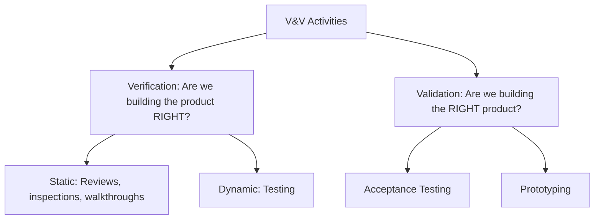
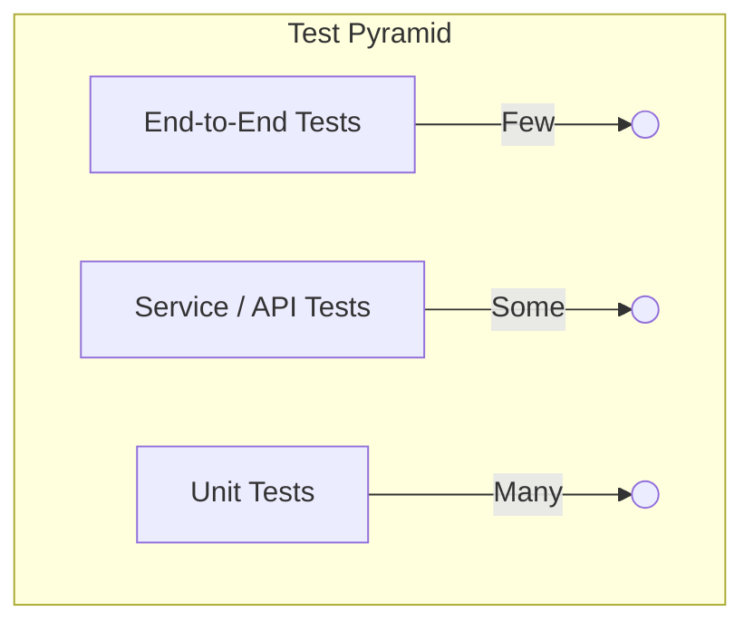
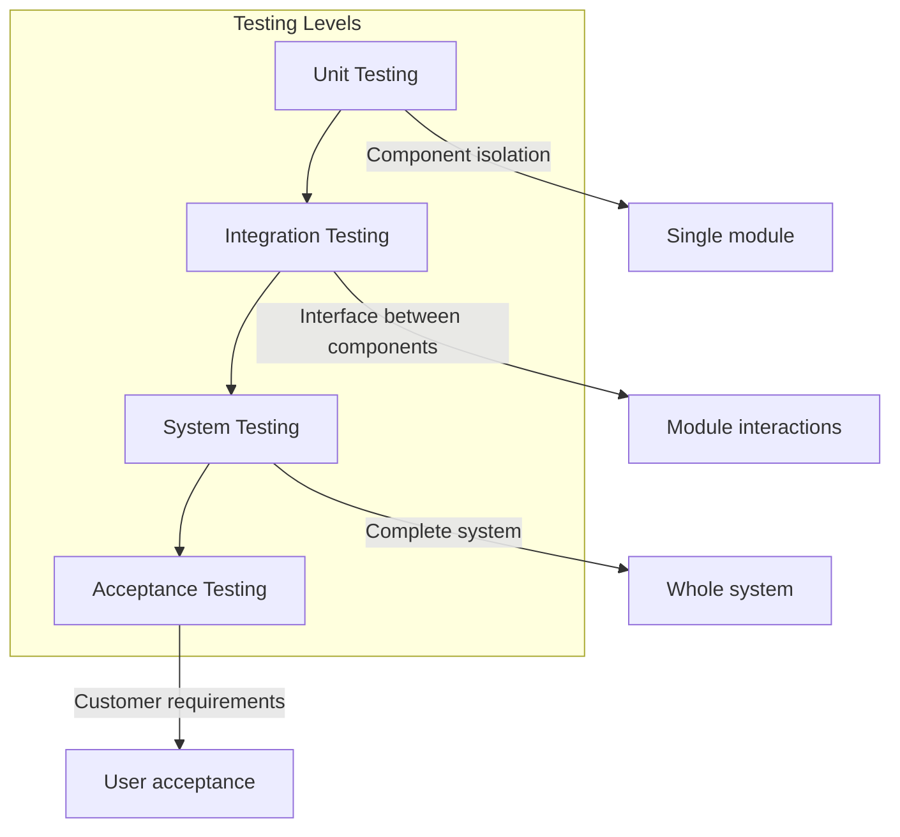
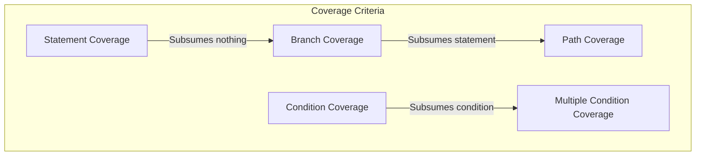
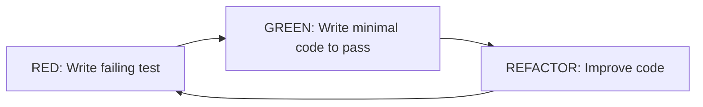

# Software Testing

## Learning Objectives

After completing this chapter, the student will be able to:
- Distinguish between verification and validation
- Describe the levels of testing from unit to acceptance
- Apply white-box testing techniques (statement, branch, path, condition coverage)
- Apply black-box testing techniques (equivalence partitioning, boundary value analysis, decision tables, state transition)
- Apply the test pyramid and understand its trade-offs
- Execute the TDD cycle (red-green-refactor) with a worked TypeScript example
- Create mock objects and test doubles
- Understand property-based testing
- Distinguish between regression, smoke, performance, security, and usability testing

## Theory

### Verification and Validation

Verification and validation (V&V) are the two principal approaches to establishing that a software system meets its specification and satisfies stakeholder needs.



- **Verification:** "Are we building the product right?" — checks conformance to specification
- **Validation:** "Are we building the right product?" — checks that the system meets actual customer needs

### The Test Pyramid

The test pyramid, proposed by Cohn, describes the ideal distribution of automated tests:



| Layer | Count | Speed | Confidence | Fragility |
|-------|-------|-------|------------|-----------|
| Unit tests | Many (70-80%) | Fast (ms) | Low | Low |
| Service/API tests | Some (15-20%) | Medium (s) | Medium | Medium |
| End-to-end tests | Few (5-10%) | Slow (min) | High | High |

### Levels of Testing



**Unit testing** verifies individual components in isolation. Tested by developers using frameworks like Bun test, JUnit.

**Integration testing** verifies that units work together. Strategies include:
- **Big bang:** All components combined at once
- **Top-down:** High-level components tested first, lower-level components stubbed
- **Bottom-up:** Low-level components tested with drivers
- **Sandwich:** Combination of top-down and bottom-up

**System testing** verifies the complete system against requirements.

**Acceptance testing** determines whether the system satisfies acceptance criteria:
- **Alpha testing:** Customer at developer's site
- **Beta testing:** Customer at their own site
- **UAT:** Validates business processes

### White-Box Testing Techniques



| Technique | Description | Strength |
|-----------|-------------|----------|
| **Statement coverage** | Every executable statement executed | Weakest |
| **Branch coverage** | Every decision outcome exercised | Stronger |
| **Path coverage** | Every unique execution path exercised | Strongest (often impractical) |
| **Condition coverage** | Each atomic condition evaluated to T/F | Moderate |
| **MC/DC** | Each condition independently affects outcome | Required for DO-178C |

### Black-Box Testing Techniques

**Equivalence Partitioning:** Divides the input domain into equivalence classes where the system behaves equivalently for all values in a class.

**Boundary Value Analysis:** Selects test cases at the boundaries of equivalence classes. Defects frequently occur at boundaries.

```typescript
// Example: testing a function that accepts ages 18-120
function validateAge(age: number): boolean {
  return age >= 18 && age <= 120;
}

// Equivalence classes:
// Valid: 18-120
// Invalid: < 18, > 120, non-numeric, null, undefined

// Boundary values:
// Low boundary: 17 (invalid), 18 (valid), 19 (valid)
// High boundary: 119 (valid), 120 (valid), 121 (invalid)
```

**Decision Tables:**

| Conditions | Rule 1 | Rule 2 | Rule 3 | Rule 4 |
|------------|--------|--------|--------|--------|
| Valid account? | T | T | T | F |
| Account locked? | F | F | T | — |
| Password correct? | T | F | — | — |
| **Actions** | | | | |
| Allow login | X | | | |
| Show error | | X | X | X |
| Increment attempts | | X | | |
| Lock account (3 failures) | (if count≥3) | | | |

**State Transition Testing:**

```typescript
interface TestState {
  currentState: string;
  transitions: { from: string; event: string; to: string }[];
  testCases: { initialState: string; events: string[]; expectedFinalState: string }[];
}
```

### Test Doubles

| Type | Description | Use Case |
|------|-------------|----------|
| **Dummy** | Passed but never used | Filling parameter lists |
| **Fake** | Working implementation with shortcuts | In-memory database |
| **Stub** | Returns predefined answers | When you need specific responses |
| **Spy** | Records interactions | Verifying method calls |
| **Mock** | Pre-programmed expectations | Behaviour verification |

```typescript
// Example: Mock repository for testing
interface UserRepository {
  findById(id: string): Promise<User | null>;
  save(user: User): Promise<void>;
}

class MockUserRepository implements UserRepository {
  private users: Map<string, User> = new Map();
  public findById(id: string): Promise<User | null> {
    return Promise.resolve(this.users.get(id) ?? null);
  }
  public save(user: User): Promise<void> {
    this.users.set(user.id, user);
    return Promise.resolve();
  }
}
```

### TDD Cycle: Red-Green-Refactor



#### Worked Example: String Calculator

**Step 1 (RED):** Write a failing test.

```typescript
import { describe, expect, test } from 'bun:test';

describe('StringCalculator', () => {
  test('returns 0 for empty string', () => {
    expect(add('')).toBe(0);
  });

  test('returns the number for a single number', () => {
    expect(add('1')).toBe(1);
  });

  test('returns sum for two numbers separated by comma', () => {
    expect(add('1,2')).toBe(3);
  });

  test('returns sum for multiple numbers', () => {
    expect(add('1,2,3,4,5')).toBe(15);
  });

  test('handles newline as delimiter', () => {
    expect(add('1\n2,3')).toBe(6);
  });

  test('supports custom delimiter', () => {
    expect(add('//;\n1;2')).toBe(3);
  });

  test('throws on negative numbers', () => {
    expect(() => add('1,-2,3')).toThrow('negatives not allowed: -2');
  });

  test('ignores numbers greater than 1000', () => {
    expect(add('2,1001')).toBe(2);
  });
});
```

**Step 2 (GREEN):** Write minimal code to pass.

```typescript
function add(input: string): number {
  if (input === '') return 0;

  let delimiter = /,|\n/;
  let numbers = input;

  if (input.startsWith('//')) {
    const delimiterEnd = input.indexOf('\n');
    delimiter = new RegExp(input.substring(2, delimiterEnd));
    numbers = input.substring(delimiterEnd + 1);
  }

  const tokens = numbers.split(delimiter);
  const negatives = tokens.filter((n) => parseInt(n) < 0);

  if (negatives.length > 0) {
    throw new Error(`negatives not allowed: ${negatives.join(',')}`);
  }

  return tokens
    .map((n) => parseInt(n))
    .filter((n) => n <= 1000)
    .reduce((sum, n) => sum + n, 0);
}
```

**Step 3 (REFACTOR):** Improve the code.

```typescript
function add(input: string): number {
  if (input === '') return 0;

  const { delimiter, numberStr } = parseDelimiter(input);
  const numbers = parseNumbers(numberStr, delimiter);
  validateNoNegatives(numbers);
  return sumNumbers(numbers);
}

function parseDelimiter(input: string): { delimiter: RegExp; numberStr: string } {
  if (input.startsWith('//')) {
    const delimiterEnd = input.indexOf('\n');
    const delim = input.substring(2, delimiterEnd);
    return { delimiter: new RegExp(delim), numberStr: input.substring(delimiterEnd + 1) };
  }
  return { delimiter: /,|\n/, numberStr: input };
}

function parseNumbers(input: string, delimiter: RegExp): number[] {
  return input.split(delimiter).map((n) => parseInt(n));
}

function validateNoNegatives(numbers: number[]): void {
  const negatives = numbers.filter((n) => n < 0);
  if (negatives.length > 0) {
    throw new Error(`negatives not allowed: ${negatives.join(',')}`);
  }
}

function sumNumbers(numbers: number[]): number {
  return numbers
    .filter((n) => n <= 1000)
    .reduce((sum, n) => sum + n, 0);
}
```

### Property-Based Testing

Property-based testing verifies that a function satisfies certain properties for a wide range of inputs, rather than checking specific examples.

```typescript
import { describe, expect, test } from 'bun:test';

// Property: reversing a string twice gives the original string
function reverse(str: string): string {
  return str.split('').reverse().join('');
}

// Property-based test
describe('reverse properties', () => {
  test('reversing twice gives original', () => {
    const inputs = ['hello', 'a', '', 'racecar', '12345'];
    for (const input of inputs) {
      expect(reverse(reverse(input))).toBe(input);
    }
  });

  test('reversing preserves length', () => {
    const inputs = ['hello', 'world', '', 'typescript'];
    for (const input of inputs) {
      expect(reverse(input).length).toBe(input.length);
    }
  });

  test('reversing a palindrome gives same string', () => {
    const palindromes = ['racecar', 'level', 'radar', 'madam'];
    for (const p of palindromes) {
      expect(reverse(p)).toBe(p);
    }
  });
});
```

### Non-Functional Testing

| Type | What It Tests | Techniques |
|------|---------------|------------|
| **Performance** | System behaviour under load | Load testing, stress testing, endurance testing, spike testing |
| **Security** | Vulnerability identification | Penetration testing, SAST, DAST, dependency scanning |
| **Usability** | Ease of learning and use | User observation, heuristic evaluation, A/B testing |
| **Reliability** | System uptime and fault tolerance | Chaos engineering, failover testing, soak testing |

### Test Automation Pyramid in Practice

```typescript
// Unit test (fast, many)
import { describe, expect, test } from 'bun:test';

class PriceCalculator {
  calculateTotal(items: { price: number; quantity: number }[]): number {
    return items.reduce((sum, item) => sum + item.price * item.quantity, 0);
  }
}

describe('PriceCalculator', () => {
  const calc = new PriceCalculator();

  test('empty cart returns 0', () => {
    expect(calc.calculateTotal([])).toBe(0);
  });

  test('single item calculates correctly', () => {
    expect(calc.calculateTotal([{ price: 10, quantity: 3 }])).toBe(30);
  });

  test('multiple items sum correctly', () => {
    const items = [
      { price: 10, quantity: 2 },
      { price: 5, quantity: 3 },
    ];
    expect(calc.calculateTotal(items)).toBe(35);
  });
});
```

## Practical Takeaways

1. **Write tests first (TDD)** — it forces you to think about design before implementation
2. **Follow the test pyramid** — invest most in fast, reliable unit tests
3. **Test behaviours, not methods** — focus on what the code does, not how it's structured
4. **Coverage is a hint, not a goal** — 100% coverage doesn't mean 100% correctness
5. **Use test doubles wisely** — mock external dependencies, but prefer real objects for core logic
6. **A failing test is progress** — it means you've found a spec-to-implementation gap before production

## Chapter Quiz

**Q1: What is the correct order of the TDD cycle?**
- A) Green → Red → Refactor
- B) Red → Green → Refactor
- C) Refactor → Red → Green
- D) Red → Refactor → Green

**Answer: B** — Write a failing test (Red), make it pass (Green), improve the code (Refactor).

**Q2: Which coverage criterion is strongest (finds the most defects)?**
- A) Statement coverage
- B) Branch coverage
- C) Path coverage
- D) Function coverage

**Answer: C** — Path coverage exercises all unique execution paths but is often impractical.

**Q3: What type of test double is an in-memory database that provides a simplified but working implementation?**
- A) Stub
- B) Mock
- C) Fake
- D) Dummy

**Answer: C** — A Fake is a working implementation with shortcuts.

**Q4: According to the test pyramid, which layer should have the most tests?**
- A) End-to-end tests
- B) Service tests
- C) Unit tests
- D) Manual tests

**Answer: C** — Unit tests form the broad base of the pyramid.

**Q5: Boundary value analysis is most effective at finding defects because:**
- A) It tests random values
- B) Defects frequently occur at input boundaries
- C) It requires the least test cases
- D) It tests internal code structure

**Answer: B** — Empirical evidence shows defects cluster at boundary conditions.

## Summary

Software testing is the primary dynamic verification and validation technique. Testing occurs at four levels: unit, integration, system, and acceptance. White-box techniques use knowledge of internal structure; black-box techniques derive test cases from specifications. The test pyramid guides automation investment. TDD follows the red-green-refactor cycle and produces testable designs. Test doubles (dummy, fake, stub, spy, mock) isolate units under test. Property-based testing verifies behavioural properties across input ranges. Non-functional testing addresses performance, security, and usability. Regression testing protects against regression defects.

## Exercises

### Review Questions

1. Distinguish between verification and validation.
2. What are the four levels of testing, and what does each level verify?
3. Explain top-down versus bottom-up integration testing.
4. What is the difference between statement coverage and branch coverage?
5. Why is path coverage often impractical?
6. Describe equivalence partitioning with an example.
7. How does boundary value analysis complement equivalence partitioning?
8. What are the five types of test doubles?
9. What does the TDD acronym stand for, and what are its three phases?
10. Describe the three layers of the test automation pyramid.

### Application Problems

1. Apply equivalence partitioning and boundary value analysis to a function that validates dates in DD/MM/YYYY format between 01/01/2000 and 31/12/2099. List all test cases.

2. Construct a decision table for a login system: valid account required; account must not be locked; password must match; after 3 failed attempts, account is locked. Cover all combinations.

3. Implement the FizzBuzz kata using TDD in TypeScript. Show each red-green-refactor cycle.

4. Write a TypeScript property-based test suite for a `sort` function, verifying properties like idempotence, order preservation, and length preservation.

### Challenge Problem

You lead the testing effort for a medical device software system that calculates radiation dosage for cancer treatment. The system must meet FDA regulatory requirements: full traceability from requirements to test cases, 100% decision coverage at unit level, and documented risk-based testing. Design a comprehensive testing strategy. Specify coverage criteria, traceability approach, risk-based testing methods, and the test automation framework. Implement a TypeScript test coverage tracker that maps requirements to test cases and calculates coverage metrics.
