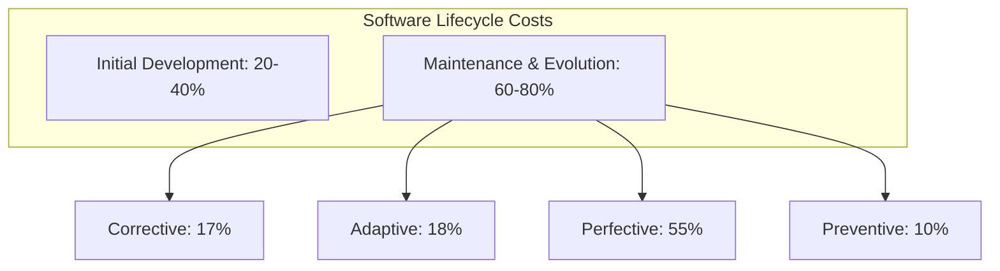
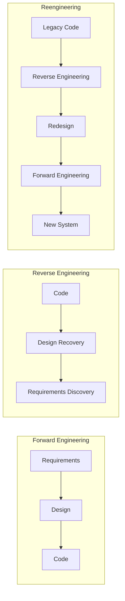
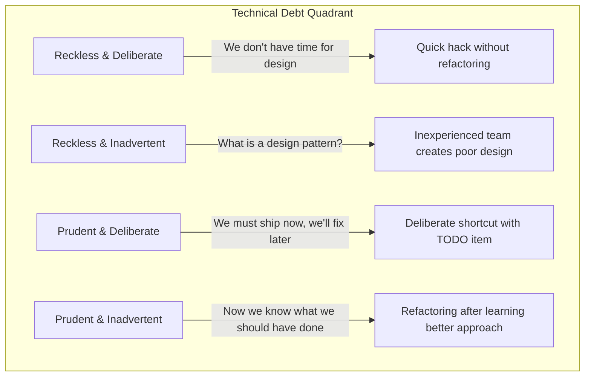
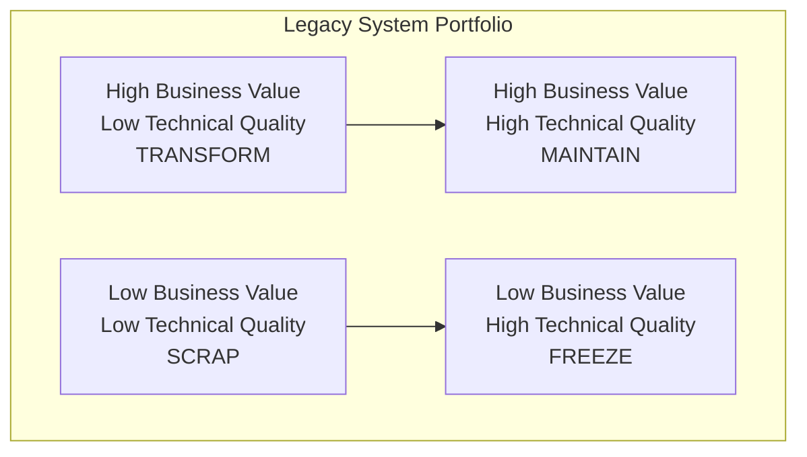

```mermaid
graph TD
    subgraph "Technical Debt Lifecycle"
        COMMIT[New Code Written] --> DEBT{Debt Incurred?}
        DEBT -->|Yes| QUADRANT[Classify Quadrant]
        QUADRANT --> RCD[Reckless Deliberate]
        QUADRANT --> RCI[Reckless Inadvertent]
        QUADRANT --> PD[Prudent Deliberate]
        QUADRANT --> PI[Prudent Inadvertent]
        
        RCD --> TRACK[Record in Debt Register]
        RCI --> TRACK
        PD --> TRACK
        PI --> TRACK
        
        TRACK --> INTEREST[Interest Accumulates]
        INTEREST --> REVIEW{Quarterly Review}
        REVIEW -->|Pay Down| REFACTOR2[Schedule Refactoring]
        REVIEW -->|Defer| INTEREST
        REVIEW -->|Principal Too High| PRIORITIZE[Prioritize in Backlog]
        
        REFACTOR2 --> FIX[Refactor & Reduce Debt]
        FIX --> VALIDATE[Validate with Tests]
        VALIDATE --> RETIRE[Retire Debt Item]
    end
    
    subgraph "Lehman's Feedback Loops"
        CHANGE[System Change] --> COMPLEXITY[Increasing Complexity]
        COMPLEXITY --> REFACTOR3[Refactoring Required]
        REFACTOR3 -->|Without Refactoring| DECLINE[Quality Decline - Law VII]
        REFACTOR3 -->|With Refactoring| STABILITY[Controlled Evolution]
    end
```

# Software Evolution

## Learning Objectives

After completing this chapter, the student will be able to:
- Distinguish between the four categories of software maintenance
- Explain Lehman's laws of software evolution
- Describe reverse engineering and reengineering
- Apply refactoring techniques with before/after TypeScript code
- Identify the characteristics of legacy systems and strategies for their management
- Quantify technical debt and analyse its quadrant
- Perform impact analysis for proposed changes

## Theory

### The Nature of Software Evolution

Software evolution is the continuous process of adapting a software system after its initial deployment. Unlike hardware, software does not wear out, but it must evolve to remain useful. Changes in the operational environment, the emergence of new user needs, and the correction of latent defects all drive software evolution.

Studies show that maintenance costs typically represent **60-80% of total lifecycle costs**. This economic reality makes software evolution a central concern of software engineering.



### Categories of Maintenance

| Category | Description | Example | Proportion |
|----------|-------------|---------|------------|
| **Corrective** | Fixing defects discovered after deployment | Logic errors, implementation deviations | ~17% |
| **Adaptive** | Modifying the system for environmental changes | New OS version, hardware upgrade, regulatory changes | ~18% |
| **Perfective** | Enhancing the system to improve performance or usability | Adding features, improving UI | ~55% |
| **Preventive** | Making changes to prevent future problems | Refactoring, updating dependencies, adding defensive checks | ~10% |

### Lehman's Laws of Software Evolution

Lehman formulated eight laws based on empirical studies of large systems:

| Law | Statement | Implication |
|-----|-----------|-------------|
| **I. Continuing Change** | A system must be continually adapted or it becomes progressively less satisfactory | Software that isn't changed becomes irrelevant |
| **II. Increasing Complexity** | As a system evolves, its complexity increases unless work is performed to reduce it | Without deliberate refactoring, entropy increases |
| **III. Self-Regulation** | The evolution process is self-regulating with statistically regular distributions | Process metrics follow predictable patterns |
| **IV. Conservation of Organisational Stability** | The average effective global activity rate is invariant over the product lifetime | Team productivity tends to stabilise |
| **V. Conservation of Familiarity** | The incremental growth of each release is statistically invariant | Release sizes tend to remain consistent |
| **VI. Continuing Growth** | Functional content must be continually increased to maintain user satisfaction | Features must grow to keep users engaged |
| **VII. Declining Quality** | Quality declines unless rigorously maintained | Without active maintenance, perceived quality drops |
| **VIII. Feedback System** | Evolution processes constitute multi-loop, multi-level feedback systems | Changes at one level affect all others |

### Reverse Engineering

Reverse engineering is the process of analysing a software system to extract design information and create representations at a higher level of abstraction.



**Reverse engineering tools:**
- **Static analysers:** Extract structure from source code
- **Dependency analysers:** Generate dependency graphs
- **Database reverse engineering:** Derive data models from schemas
- **Decompilers:** Reconstruct source from binaries

### Technical Debt Quadrant

The technical debt quadrant, proposed by Fowler, classifies debt by intent and prudence:



| Quadrant | Description | Example | Action |
|----------|-------------|---------|--------|
| Reckless & Deliberate | Team knows better but chooses not to | Skipping tests to meet deadline | Prioritise fixing |
| Reckless & Inadvertent | Team doesn't know what good design is | No design patterns applied | Training + refactoring |
| Prudent & Deliberate | Intentional short-term decision | Ship now, refactor next sprint | Track and schedule |
| Prudent & Inadvertent | Discovered better approach after implementing | Improve design on second iteration | Refactor when encountered |

### Refactoring Catalog

Refactoring is the process of restructuring existing code without changing its external behaviour.

#### Extract Method

**Before:**
```typescript
function processOrder(order: Order): void {
  // Validate order
  if (!order.customerId) throw new Error('Missing customer');
  if (!order.items || order.items.length === 0) throw new Error('No items');
  for (const item of order.items) {
    if (item.quantity <= 0) throw new Error('Invalid quantity');
  }
  // Calculate total
  let total = 0;
  for (const item of order.items) {
    total += item.price * item.quantity;
  }
  // Apply discounts
  if (order.customerType === 'premium') total *= 0.9;
  if (order.customerType === 'vip') total *= 0.85;
  // Save order
  saveOrder({ ...order, total });
}
```

**After:**
```typescript
function processOrder(order: Order): void {
  validateOrder(order);
  const total = calculateTotal(order);
  const discountedTotal = applyDiscounts(total, order.customerType);
  saveOrder({ ...order, total: discountedTotal });
}

function validateOrder(order: Order): void {
  if (!order.customerId) throw new Error('Missing customer');
  if (!order.items || order.items.length === 0) throw new Error('No items');
  for (const item of order.items) {
    if (item.quantity <= 0) throw new Error('Invalid quantity');
  }
}

function calculateTotal(order: Order): number {
  return order.items.reduce((sum, item) => sum + item.price * item.quantity, 0);
}

function applyDiscounts(total: number, customerType: string): number {
  if (customerType === 'vip') return total * 0.85;
  if (customerType === 'premium') return total * 0.9;
  return total;
}
```

#### Replace Conditional with Polymorphism

**Before:**
```typescript
class Bird {
  constructor(private type: string, private name: string) {}
  
  getSpeed(): number {
    if (this.type === 'european') return 10;
    if (this.type === 'african') return 20;
    if (this.type === 'norwegian') return 30;
    return 0;
  }
}
```

**After:**
```typescript
interface Bird {
  getSpeed(): number;
}

class EuropeanBird implements Bird {
  constructor(private name: string) {}
  getSpeed(): number { return 10; }
}

class AfricanBird implements Bird {
  constructor(private name: string) {}
  getSpeed(): number { return 20; }
}

class NorwegianBird implements Bird {
  constructor(private name: string) {}
  getSpeed(): number { return 30; }
}

class BirdFactory {
  static create(type: string, name: string): Bird {
    switch (type) {
      case 'european': return new EuropeanBird(name);
      case 'african': return new AfricanBird(name);
      case 'norwegian': return new NorwegianBird(name);
      default: throw new Error('Unknown bird type');
    }
  }
}
```

#### Extract Class

**Before:**
```typescript
class Employee {
  constructor(
    public name: string,
    public email: string,
    public salary: number,
    public bankAccount: string,
    public taxId: string,
    public department: string,
    public officePhone: string,
    public mobilePhone: string,
    public street: string,
    public city: string,
    public postalCode: string
  ) {}
}
```

**After:**
```typescript
class Employee {
  constructor(
    public name: string,
    public contact: ContactInfo,
    public compensation: CompensationInfo,
    public department: string
  ) {}
}

class ContactInfo {
  constructor(
    public email: string,
    public officePhone: string,
    public mobilePhone: string,
    public address: Address
  ) {}
}

class Address {
  constructor(
    public street: string,
    public city: string,
    public postalCode: string
  ) {}
}

class CompensationInfo {
  constructor(
    public salary: number,
    public bankAccount: string,
    public taxId: string
  ) {}
}
```

#### Rename Variable/Method

**Before:** `const d = new Date(); const r = calculate(a, b);`

**After:** `const currentDate = new Date(); const revenue = calculateRevenue(startDate, endDate);`

### Legacy Systems

**Characteristics of legacy systems:**
- Outdated technology platforms (no longer supported)
- Poor or outdated documentation
- Degraded structure from ad hoc changes
- Obsolete hardware or OS dependencies
- Shortage of developers with relevant skills

**Legacy system management strategies:**

| Strategy | Description | When to Use |
|----------|-------------|-------------|
| **Scrap & rebuild** | Replace entirely | Low business value, low technical quality |
| **Freeze** | Minimise changes to essential corrections | Low business value, high technical quality |
| **Maintain** | Continue evolution with current practices | High business value, high technical quality |
| **Transform** | Reengineer to modern platform | High business value, low technical quality |
| **Wrap** | Encapsulate with modern interface | High business value, risk of replacement too high |



### Impact Analysis

Impact analysis identifies the consequences of a proposed change. It answers: what will be affected, what is the ripple effect, and what is the estimated effort?

```typescript
interface Dependency {
  sourceFile: string;
  targetFile: string;
  dependencyType: 'import' | 'extends' | 'implements' | 'calls' | 'uses';
}

class ImpactAnalyzer {
  private dependencies: Dependency[] = [];

  public addDependency(dep: Dependency): void {
    this.dependencies.push(dep);
  }

  public analyzeImpact(changedFile: string): {
    directlyAffected: string[];
    transitivelyAffected: string[];
    estimatedEffort: number;
  } {
    const directlyAffected = this.dependencies
      .filter((d) => d.targetFile === changedFile)
      .map((d) => d.sourceFile);

    const transitivelyAffected = new Set<string>();
    const queue = [...directlyAffected];
    while (queue.length > 0) {
      const file = queue.shift()!;
      const affected = this.dependencies
        .filter((d) => d.targetFile === file)
        .map((d) => d.sourceFile);
      for (const a of affected) {
        if (!transitivelyAffected.has(a)) {
          transitivelyAffected.add(a);
          queue.push(a);
        }
      }
    }

    return {
      directlyAffected,
      transitivelyAffected: Array.from(transitivelyAffected),
      estimatedEffort: (directlyAffected.length + transitivelyAffected.size) * 4, // hours
    };
  }
}
```

### Modernization Strategies

| Strategy | Risk | Effort | Time | Result |
|----------|------|--------|------|--------|
| **Strangler Fig** | Low | High | Long | Incremental replacement |
| **Big Bang Rewrite** | High | Very high | Medium | Brand new system |
| **Incremental Migration** | Medium | Medium | Medium | Gradual transition |
| **Database First** | Medium | Medium | Medium | Modernise data layer first |
| **API Encapsulation** | Low | Low | Short | Legacy wrapped behind APIs |

## Examples

## Technical Debt Quantification Engine

```typescript
type DebtQuadrant = 'reckless-deliberate' | 'reckless-inadvertent' | 'prudent-deliberate' | 'prudent-inadvertent';

interface DebtItem {
  id: string;
  description: string;
  location: string;
  quadrant: DebtQuadrant;
  estimatedHoursToFix: number;
  estimatedHoursToPayInterest: number;
  createdAt: Date;
  tags: string[];
  severity: 'low' | 'medium' | 'high' | 'critical';
}

interface DebtReport {
  totalDebtHours: number;
  totalInterestHours: number;
  debtRatio: number; // interest / principal
  itemsByQuadrant: Record<DebtQuadrant, DebtItem[]>;
  itemsBySeverity: Record<string, DebtItem[]>;
  topPriorityItems: DebtItem[];
  principalPerModule: Map<string, number>;
}

class TechnicalDebtCalculator {
  private debtItems: DebtItem[] = [];

  public addDebt(item: DebtItem): void {
    this.debtItems.push(item);
  }

  public addDebts(items: DebtItem[]): void {
    this.debtItems.push(...items);
  }

  public calculate(): DebtReport {
    const totalDebtHours = this.debtItems.reduce((s, i) => s + i.estimatedHoursToFix, 0);
    const totalInterestHours = this.debtItems.reduce((s, i) => s + i.estimatedHoursToPayInterest, 0);

    const itemsByQuadrant: Record<DebtQuadrant, DebtItem[]> = {
      'reckless-deliberate': [],
      'reckless-inadvertent': [],
      'prudent-deliberate': [],
      'prudent-inadvertent': [],
    };
    const itemsBySeverity: Record<string, DebtItem[]> = {};
    const principalPerModule = new Map<string, number>();

    for (const item of this.debtItems) {
      itemsByQuadrant[item.quadrant].push(item);
      if (!itemsBySeverity[item.severity]) itemsBySeverity[item.severity] = [];
      itemsBySeverity[item.severity].push(item);
      const module = item.location.split('/')[0];
      principalPerModule.set(module, (principalPerModule.get(module) ?? 0) + item.estimatedHoursToFix);
    }

    const topPriorityItems = [...this.debtItems]
      .sort((a, b) => {
        const severityRank = { critical: 4, high: 3, medium: 2, low: 1 };
        const interestA = a.estimatedHoursToPayInterest - a.estimatedHoursToFix;
        const interestB = b.estimatedHoursToPayInterest - b.estimatedHoursToFix;
        return (severityRank[b.severity] - severityRank[a.severity]) || (interestB - interestA);
      })
      .slice(0, 10);

    return {
      totalDebtHours,
      totalInterestHours,
      debtRatio: totalDebtHours > 0 ? totalInterestHours / totalDebtHours : 0,
      itemsByQuadrant,
      itemsBySeverity,
      topPriorityItems,
      principalPerModule,
    };
  }

  public generateReport(): string {
    const report = this.calculate();
    const lines: string[] = [
      '=== Technical Debt Report ===',
      `Generated: ${new Date().toISOString()}`,
      '',
      '┌─────────────────────────────────┬─────────────┐',
      '│ Metric                          │ Value       │',
      '├─────────────────────────────────┼─────────────┤',
      `│ Total Items                     │ ${this.debtItems.length.toString().padStart(11)} │`,
      `│ Principal (Fix Hours)           │ ${report.totalDebtHours.toString().padStart(11)} │`,
      `│ Interest (Hours Paid)           │ ${report.totalInterestHours.toString().padStart(11)} │`,
      `│ Debt Ratio (Interest/Principal) │ ${report.debtRatio.toFixed(2).padStart(9)}    │`,
      '└─────────────────────────────────┴─────────────┘',
      '',
      '--- By Quadrant ---',
    ];
    for (const [quadrant, items] of Object.entries(report.itemsByQuadrant)) {
      const hours = items.reduce((s, i) => s + i.estimatedHoursToFix, 0);
      lines.push(`  ${quadrant.padEnd(25)} ${items.length} items, ${hours}h principal`);
    }
    lines.push('', '--- By Severity ---');
    for (const [severity, items] of Object.entries(report.itemsBySeverity)) {
      const hours = items.reduce((s, i) => s + i.estimatedHoursToFix, 0);
      lines.push(`  ${severity.padEnd(10)} ${items.length} items, ${hours}h`);
    }
    lines.push('', '--- Top Priority Items ---');
    for (const item of report.topPriorityItems) {
      const interestCost = item.estimatedHoursToPayInterest - item.estimatedHoursToFix;
      lines.push(`  [${item.severity.toUpperCase()}] ${item.description}`);
      lines.push(`    Location: ${item.location} | Fix: ${item.estimatedHoursToFix}h | Interest premium: ${interestCost > 0 ? '+' : ''}${interestCost}h`);
    }
    lines.push('', '--- Principal by Module ---');
    for (const [module, hours] of report.principalPerModule) {
      lines.push(`  ${module.padEnd(20)} ${hours}h`);
    }
    lines.push('', '--- Recommendations ---');
    if (report.debtRatio > 2) {
      lines.push('  CRITICAL: Interest exceeds principal by 2x+ — prioritize debt reduction sprint');
    }
    if (report.itemsByQuadrant['reckless-deliberate'].length > 5) {
      lines.push('  WARNING: High reckless deliberate debt — schedule dedicated refactoring');
    }
    if (report.itemsByQuadrant['reckless-inadvertent'].length > 10) {
      lines.push('  INFO: Consider team training on design principles to reduce inadvertent debt');
    }
    return lines.join('\n');
  }
}

// Dependency Graph Evolution Analyzer
interface DependencyNode {
  name: string;
  version: string;
  dependencies: string[];
  deprecationStatus?: 'active' | 'deprecated' | 'end-of-life';
  ageMonths: number;
}

class EvolutionAnalyzer {
  public analyzeDependencyGraph(nodes: DependencyNode[]): {
    health: 'healthy' | 'aging' | 'critical';
    deprecatedCount: number;
    averageAgeMonths: number;
    circularDependencies: string[][];
    recommendations: string[];
  } {
    const circularDeps = this.findCircularDependencies(nodes);
    const deprecatedCount = nodes.filter((n) => n.deprecationStatus === 'deprecated' || n.deprecationStatus === 'end-of-life').length;
    const averageAgeMonths = nodes.reduce((s, n) => s + n.ageMonths, 0) / nodes.length;
    const recommendations: string[] = [];

    if (deprecatedCount > 0) {
      recommendations.push(`Replace ${deprecatedCount} deprecated dependencies immediately`);
    }
    if (circularDeps.length > 0) {
      recommendations.push(`Resolve ${circularDeps.length} circular dependencies by extracting shared interfaces`);
    }
    if (averageAgeMonths > 24) {
      recommendations.push('Average dependency age exceeds 24 months — schedule dependency audit');
    }
    const health = deprecatedCount > 3 || circularDeps.length > 2 ? 'critical' : averageAgeMonths > 18 ? 'aging' : 'healthy';
    return { health, deprecatedCount, averageAgeMonths: Math.round(averageAgeMonths), circularDependencies: circularDeps, recommendations };
  }

  private findCircularDependencies(nodes: DependencyNode[]): string[][] {
    const cycles: string[][] = [];
    const visited = new Set<string>();
    const recursionStack = new Set<string>();
    const path: string[] = [];
    const nodeMap = new Map(nodes.map((n) => [n.name, n]));

    const dfs = (name: string): void => {
      if (recursionStack.has(name)) {
        const cycleStart = path.indexOf(name);
        if (cycleStart >= 0) cycles.push(path.slice(cycleStart));
        return;
      }
      if (visited.has(name)) return;
      visited.add(name);
      recursionStack.add(name);
      path.push(name);
      const node = nodeMap.get(name);
      if (node) {
        for (const dep of node.dependencies) {
          if (nodeMap.has(dep)) dfs(dep);
        }
      }
      path.pop();
      recursionStack.delete(name);
    };
    for (const node of nodes) dfs(node.name);
    return cycles;
  }
}

// Usage
const calculator = new TechnicalDebtCalculator();
calculator.addDebts([
  { id: 'TD-001', description: 'No input validation on user API endpoint', location: 'api/users.ts', quadrant: 'reckless-deliberate', estimatedHoursToFix: 8, estimatedHoursToPayInterest: 40, createdAt: new Date('2025-06-01'), tags: ['security', 'api'], severity: 'critical' },
  { id: 'TD-002', description: 'Unused imports and dead code in payment module', location: 'payments/processor.ts', quadrant: 'prudent-inadvertent', estimatedHoursToFix: 4, estimatedHoursToPayInterest: 12, createdAt: new Date('2025-07-15'), tags: ['maintainability'], severity: 'medium' },
  { id: 'TD-003', description: 'Hardcoded database credentials in config', location: 'config/database.ts', quadrant: 'reckless-deliberate', estimatedHoursToFix: 2, estimatedHoursToPayInterest: 30, createdAt: new Date('2025-05-10'), tags: ['security'], severity: 'critical' },
  { id: 'TD-004', description: 'Monolithic 5000-line service class without tests', location: 'services/order-service.ts', quadrant: 'prudent-deliberate', estimatedHoursToFix: 40, estimatedHoursToPayInterest: 120, createdAt: new Date('2025-03-20'), tags: ['refactoring', 'testing'], severity: 'high' },
  { id: 'TD-005', description: 'Inconsistent error handling patterns across modules', location: 'api/', quadrant: 'reckless-inadvertent', estimatedHoursToFix: 16, estimatedHoursToPayInterest: 30, createdAt: new Date('2025-08-01'), tags: ['reliability'], severity: 'medium' },
]);
console.log(calculator.generateReport());

const analyzer = new EvolutionAnalyzer();
const result = analyzer.analyzeDependencyGraph([
  { name: 'express', version: '4.18.2', dependencies: ['body-parser', 'accepts', 'type-is'], deprecationStatus: 'active', ageMonths: 18 },
  { name: 'body-parser', version: '1.20.2', dependencies: ['bytes', 'content-type'], ageMonths: 30 },
  { name: 'legacy-lib', version: '0.5.0', dependencies: ['express'], deprecationStatus: 'deprecated', ageMonths: 48 },
  { name: 'bytes', version: '3.1.2', dependencies: ['legacy-lib'], ageMonths: 36 },
]);
console.log(`\nEvolution Health: ${result.health}`);
result.recommendations.forEach((r) => console.log(`  → ${r}`));
```



### TypeScript: Software Evolution Tools

```typescript
// === Impact Analysis ===
interface DependencyGraph {
  module: string;
  dependsOn: string[];
  dependents: string[];
}
function impactAnalysis(graph: DependencyGraph[], changedModules: string[]): Set<string> {
  const affected = new Set<string>(changedModules);
  const queue = [...changedModules];
  while (queue.length > 0) {
    const current = queue.shift()!;
    const entry = graph.find((g) => g.module === current);
    if (!entry) continue;
    for (const dep of entry.dependents) {
      if (!affected.has(dep)) { affected.add(dep); queue.push(dep); }
    }
  }
  return affected;
}
const depGraph: DependencyGraph[] = [
  { module: "auth", dependsOn: ["db"], dependents: ["api", "admin"] },
  { module: "api", dependsOn: ["auth", "db"], dependents: ["frontend"] },
  { module: "admin", dependsOn: ["auth"], dependents: ["frontend"] },
  { module: "db", dependsOn: [], dependents: ["auth", "api"] },
  { module: "frontend", dependsOn: ["api", "admin"], dependents: [] },
];
console.log([...impactAnalysis(depGraph, ["auth"])]); // auth, api, admin, frontend

// === Refactoring Suggestion Engine ===
interface CodeMetrics { name: string; lines: number; methods: number; avgParams: number; complexity: number; duplications: number }
function suggestRefactoring(m: CodeMetrics): string[] {
  const suggestions: string[] = [];
  if (m.lines > 300) suggestions.push("Extract Module: file exceeds 300 lines");
  if (m.methods > 15) suggestions.push("Extract Class: more than 15 methods");
  if (m.avgParams > 4) suggestions.push("Introduce Parameter Object: average parameter count exceeds 4");
  if (m.complexity > 10) suggestions.push("Replace Conditional with Polymorphism: complexity exceeds 10");
  if (m.duplications > 3) suggestions.push("Extract Method: duplicated code blocks found in " + m.duplications + " locations");
  return suggestions;
}
const codeMetric: CodeMetrics = { name: "OrderProcessor.ts", lines: 450, methods: 22, avgParams: 5.2, complexity: 14, duplications: 5 };
console.log(suggestRefactoring(codeMetric));

// === Technical Debt Tracker ===
type DebtCategory = "code" | "design" | "test" | "documentation" | "infrastructure";
interface DebtItem {
  id: string;
  description: string;
  category: DebtCategory;
  effortHours: number;
  interestHours: number;
  dateIdentified: Date;
}
class DebtTracker {
  private items: DebtItem[] = [];
  add(item: DebtItem): void { this.items.push(item); }
  getTotalDebt(): number { return this.items.reduce((s, i) => s + i.effortHours, 0); }
  getTotalInterest(): number { return this.items.reduce((s, i) => s + i.interestHours, 0); }
  getRatio(): number { return this.getTotalInterest() / (this.getTotalDebt() || 1); }
  getByCategory(cat: DebtCategory): DebtItem[] { return this.items.filter((i) => i.category === cat); }
  prioritize(): DebtItem[] {
    return [...this.items].sort((a, b) => b.interestHours / b.effortHours - a.interestHours / a.effortHours);
  }
}
const tracker = new DebtTracker();
tracker.add({ id: "TD-1", description: "No error handling in API", category: "code", effortHours: 8, interestHours: 40, dateIdentified: new Date() });
tracker.add({ id: "TD-2", description: "Missing integration tests", category: "test", effortHours: 16, interestHours: 80, dateIdentified: new Date() });
console.log(`Total debt: ${tracker.getTotalDebt()}h, Interest: ${tracker.getTotalInterest()}h, Ratio: ${tracker.getRatio().toFixed(1)}`);

// === Lehman's Law Checker ===
function checkLehmanLaws(history: { version: string; loc: number; modules: number; defects: number }[]): string[] {
  const observations: string[] = [];
  if (history.length >= 2) {
    const first = history[0], last = history[history.length - 1];
    if (last.loc > first.loc) observations.push("Law I (Continuing Change): system is evolving");
    if (last.modules > first.modules) observations.push("Law II (Increasing Complexity): module count grew");
    if (last.defects > 0) observations.push("Law VI (Continuing Growth): defects still present");
  }
  return observations;
}
const versionHistory = [
  { version: "1.0", loc: 10000, modules: 50, defects: 20 },
  { version: "2.0", loc: 15000, modules: 75, defects: 15 },
  { version: "3.0", loc: 22000, modules: 110, defects: 8 },
];
console.log(checkLehmanLaws(versionHistory));
```

### TypeScript: Software Evolution Tools

```typescript
// === Impact Analysis Engine ===
interface CodeEntity { name: string; type: "class" | "function" | "module" | "interface"; dependencies: string[]; }
class ImpactAnalyzer {
  constructor(private entities: CodeEntity[]) {}
  
  getAffected(changed: string[], visited = new Set<string>()): string[] {
    for (const name of changed) {
      if (visited.has(name)) continue;
      visited.add(name);
      const dependents = this.entities.filter(e => e.dependencies.includes(name)).map(e => e.name);
      this.getAffected(dependents, visited);
    }
    return [...visited];
  }

  getImpactScore(changed: string[]): { entities: number; depth: number } {
    const affected = this.getAffected(changed);
    const maxDepth = Math.max(...changed.map(c => {
      const deps = this.entities.filter(e => e.dependencies.includes(c)).length;
      return deps;
    }));
    return { entities: affected.length, depth: maxDepth };
  }
}

// === Refactoring Opportunity Detector ===
interface RefactoringTarget { entity: string; issue: string; effort: "Low" | "Medium" | "High"; benefit: string; }
function detectRefactoringNeeds(entities: CodeEntity[]): RefactoringTarget[] {
  const targets: RefactoringTarget[] = [];
  const depCount = new Map<string, number>();
  for (const e of entities) for (const d of e.dependencies) depCount.set(d, (depCount.get(d) ?? 0) + 1);
  for (const [name, count] of depCount) {
    if (count > 5) targets.push({ entity: name, issue: `High coupling (${count} dependents)`, effort: "High", benefit: "Reduce ripple effects" });
  }
  const lonely = entities.filter(e => e.dependencies.length === 0 && entities.filter(x => x.dependencies.includes(e.name)).length === 0);
  for (const e of lonely) targets.push({ entity: e.name, issue: "Dead code / orphan module", effort: "Low", benefit: "Remove unused code" });
  return targets;
}

// === Technical Debt Calculator ===
function calculateTechDebt(entities: CodeEntity[], qualityMetrics: { complexity: number; duplication: number; coverage: number }): { debtRatio: number; estimatedHours: number } {
  const couplingIssues = entities.filter(e => e.dependencies.length > 5).length;
  const orphanIssues = entities.filter(e => e.dependencies.length === 0 && !entities.some(x => x.dependencies.includes(e.name))).length;
  const complexityDebt = (qualityMetrics.complexity / 100) * 20;
  const duplicationDebt = (qualityMetrics.duplication / 100) * 15;
  const coverageDebt = ((100 - qualityMetrics.coverage) / 100) * 25;
  const couplingDebt = (couplingIssues / Math.max(1, entities.length)) * 30;
  const orphanDebt = (orphanIssues / Math.max(1, entities.length)) * 10;
  const debtRatio = Math.min(100, complexityDebt + duplicationDebt + coverageDebt + couplingDebt + orphanDebt);
  const estimatedHours = Math.round(debtRatio * 0.5);
  return { debtRatio: Math.round(debtRatio), estimatedHours };
}

const entities: CodeEntity[] = [
  { name: "UserService", type: "class", dependencies: ["Database", "Logger", "EmailService", "AuthService", "Cache", "Queue"] },
  { name: "Logger", type: "module", dependencies: ["Config"] },
  { name: "Database", type: "module", dependencies: ["Config", "ConnectionPool"] },
];
console.log(new ImpactAnalyzer(entities).getImpactScore(["Database"])); // ~3 affected
console.log(detectRefactoringNeeds(entities));
console.log(calculateTechDebt(entities, { complexity: 45, duplication: 12, coverage: 78 }));
```

## Summary

Software evolution consumes the majority of lifecycle costs. Maintenance is classified as corrective, adaptive, perfective, and preventive. Lehman's eight laws describe the empirical dynamics of evolution, including the inevitable increase in complexity (Law II) and the necessity of continuing change (Law I). Reverse engineering recovers design information from existing code. Refactoring catalogues provide behaviour-preserving transformations (Extract Method, Replace Conditional with Polymorphism, Extract Class). The technical debt quadrant helps prioritise improvement work. Legacy systems require strategies from scrapping to wrapping. Impact analysis quantifies change consequences. Regression testing is essential throughout evolution.

## Practical Takeaways

1. **Refactoring is not optional** — without it, Lehman's Law of Increasing Complexity guarantees degradation
2. **Track technical debt explicitly** — quantify it, prioritise it, schedule it alongside features
3. **The strangler fig pattern is safer than big-bang rewrites** — incremental replacement preserves business continuity
4. **Automated tests are essential for evolution** — without them, refactoring is just "changing code and hoping"
5. **Document decisions, not just code** — future maintainers need to know why, not just what
6. **Legacy systems are valuable** — they represent years of business logic; treat them with respect

## Chapter Quiz

**Q1: What proportion of total lifecycle costs does maintenance typically represent?**
- A) 20-30%
- B) 40-50%
- C) 60-80%
- D) 80-90%

**Answer: C** — Maintenance typically consumes 60-80% of total software lifecycle costs.

**Q2: Lehman's Law of Increasing Complexity states that:**
- A) Systems must be continually adapted or become unsatisfactory
- B) Complexity increases unless deliberate work is performed to reduce it
- C) The growth of each release is statistically invariant
- D) Quality declines unless rigorously maintained

**Answer: B** — Without deliberate refactoring, system complexity inevitably increases.

**Q3: Which is NOT a characteristic of legacy systems?**
- A) Outdated technology platforms
- B) Modern architecture patterns
- C) Poor documentation
- D) Shortage of developers with relevant skills

**Answer: B** — Legacy systems are characterised by outdated technology and architecture, not modern patterns.

**Q4: The strangler fig pattern is:**
- A) Rewriting the entire system at once
- B) Incrementally replacing legacy functionality with new implementations
- C) Wrapping legacy systems with APIs
- D) Freezing all changes to the system

**Answer: B** — The strangler fig pattern incrementally replaces legacy components.

**Q5: In the technical debt quadrant, "we must ship now, we'll fix later" represents:**
- A) Reckless & Deliberate
- B) Prudent & Deliberate
- C) Reckless & Inadvertent
- D) Prudent & Inadvertent

**Answer: B** — Prudent & Deliberate debt is an intentional short-term decision with a plan to fix later.

## Exercises

### Review Questions

1. What proportion of total lifecycle costs is typically consumed by maintenance?
2. Distinguish between corrective and adaptive maintenance with examples.
3. List and explain Lehman's eight laws of software evolution.
4. What distinguishes reverse engineering from reengineering?
5. What is the principal constraint on refactoring — what must be preserved?
6. Describe the strangler fig pattern for legacy system replacement.
7. What are the two dimensions used in legacy system portfolio analysis?
8. What are the four quadrants of the technical debt model?

### Application Problems

1. A 500,000-LOC system has an annual change rate of 15%. The maintenance team costs $1.2M/year. If a $300K refactoring programme reduces the annual change rate to 10%, calculate the break-even period.

2. Propose a refactoring plan for a 2,000-line class handling persistence, business logic, and presentation with duplicated code in five locations. Show the before/after TypeScript code.

3. Implement a `CodeSmellDetector` TypeScript class that detects long methods, large classes, duplicate code, and excessive parameter lists.

4. Analyse a legacy system using Lehman's laws. For each law, provide an example of how it applies to the system.

### Challenge Problem

A government social security agency operates a thirty-year-old system written in an obsolete language. Documentation is incomplete, original developers have retired, and the system cannot be replaced because business rules are not fully understood. Recent legislation requires significant changes to eligibility rules, and the system must integrate with a modern citizen portal. Develop a comprehensive evolution strategy. Address knowledge recovery, legislative changes, testing approach, and transition planning. Implement a TypeScript modernization planner that tracks the migration of legacy modules through the strangler fig pattern.

