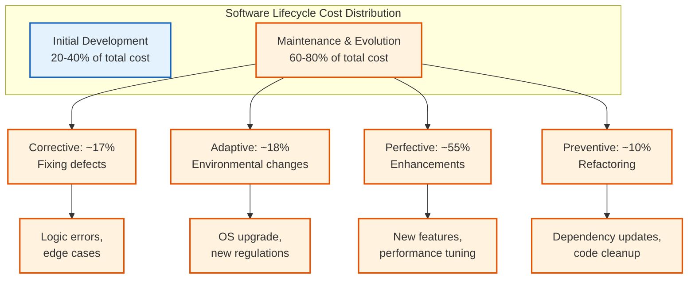
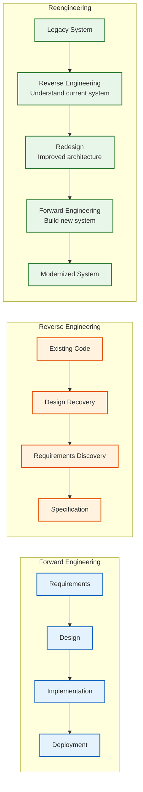
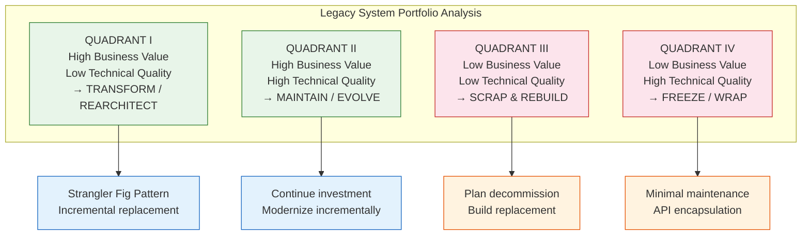

```mermaid
graph TD
    classDef commit fill:#e8eaf6,stroke:#3f51b5,stroke-width:2px
    classDef debt fill:#fce4ec,stroke:#c62828,stroke-width:2px
    classDef review fill:#fff3e0,stroke:#e65100,stroke-width:2px
    classDef fix fill:#e8f5e9,stroke:#2e7d32,stroke-width:2px

    subgraph "Technical Debt Lifecycle"
        COMMIT[Code Commit<br>New Feature or Fix]:::commit --> REVIEW2{Code Review}:::review
        REVIEW2 -->|"Quick hack approved"| DEBT[Debt Incurred]:::debt
        REVIEW2 -->|"Clean code"| NODEBT[No Debt]:::fix
        
        DEBT --> QUADRANT2[Classify Quadrant]:::debt
        QUADRANT2 --> RCD[Reckless Deliberate<br>Expedite fix]:::debt
        QUADRANT2 --> RCI[Reckless Inadvertent<br>Schedule training + fix]:::debt
        QUADRANT2 --> PD[Prudent Deliberate<br>Track in backlog]:::debt
        QUADRANT2 --> PI[Prudent Inadvertent<br>Fix when encountered]:::debt
        
        RCD --> TRACK2[Record in Debt Register]:::debt
        RCI --> TRACK2
        PD --> TRACK2
        PI --> TRACK2
        
        TRACK2 --> INTEREST[Interest Accumulates<br>Each sprint costs more]:::debt
        INTEREST --> REVIEW3{Quarterly<br>Debt Review}:::review
        REVIEW3 -->|Pay Down| REFACTOR2[Schedule Refactoring Sprint]:::fix
        REVIEW3 -->|Defer| INTEREST
        REVIEW3 -->|Critical| PRIORITIZE[Prioritize in Backlog<br>Next sprint]:::fix
        
        REFACTOR2 --> FIX2[Refactor & Reduce Debt]:::fix
        FIX2 --> VALIDATE[Validate with Tests]:::fix
        VALIDATE --> RETIRE[Retire Debt Item<br>✓ Closed]:::fix
    end
    
    subgraph "Lehman's Feedback Loops"
        CHANGE[System Change]:::commit --> COMPLEXITY[Increasing Complexity<br>Law II]:::debt
        COMPLEXITY --> REFACTOR3[Refactoring Required]:::review
        REFACTOR3 -->|Without Refactoring| DECLINE[Quality Decline<br>Law VII]:::debt
        REFACTOR3 -->|With Refactoring| STABILITY[Controlled Evolution<br>✓ Sustainable]:::fix
    end
```

# Software Evolution

## Learning Objectives

```
✓ Distinguish between the four categories of software maintenance: corrective, adaptive, perfective, preventive
✓ Explain Lehman's eight laws of software evolution and their practical implications
✓ Distinguish reverse engineering, reengineering, and forward engineering
✓ Apply refactoring techniques with before/after TypeScript code
✓ Identify characteristics of legacy systems and select appropriate management strategies
✓ Quantify technical debt and analyse it using Fowler's quadrant model
✓ Perform impact analysis for proposed changes using dependency graphs
✓ Calculate software entropy and understand its relationship to maintenance cost
✓ Implement version migration strategies with semantic versioning and breaking change detection
```

<!-- Image Gallery -->
<div style="display:flex;flex-wrap:wrap;gap:4px;margin:16px 0;padding:12px;background:#f8fafc;border-radius:8px;border:1px solid #e2e8f0;">
<a href="../../../assets/images/lessons/software-engineering/07-software-evolution/hero.svg" target="_blank" rel="noopener">
  
</a>
<a href="../../../assets/images/lessons/software-engineering/07-software-evolution/handwritten-notes.svg" target="_blank" rel="noopener">
  
</a>
<a href="../../../assets/images/lessons/software-engineering/07-software-evolution/sticky-notes.svg" target="_blank" rel="noopener">
  
</a>
<a href="../../../assets/images/lessons/software-engineering/07-software-evolution/visual-explanation.svg" target="_blank" rel="noopener">
  
</a>
<a href="../../../assets/images/lessons/software-engineering/07-software-evolution/architecture.svg" target="_blank" rel="noopener">
  
</a>
<a href="../../../assets/images/lessons/software-engineering/07-software-evolution/workflow.svg" target="_blank" rel="noopener">
  
</a>
<a href="../../../assets/images/lessons/software-engineering/07-software-evolution/mindmap.svg" target="_blank" rel="noopener">
  
</a>
<a href="../../../assets/images/lessons/software-engineering/07-software-evolution/comparison.svg" target="_blank" rel="noopener">
  
</a>
<a href="../../../assets/images/lessons/software-engineering/07-software-evolution/cheatsheet.svg" target="_blank" rel="noopener">
  
</a>
<a href="../../../assets/images/lessons/software-engineering/07-software-evolution/interview-quiz.svg" target="_blank" rel="noopener">
  
</a>
<a href="../../../assets/images/lessons/software-engineering/07-software-evolution/social-card.svg" target="_blank" rel="noopener">
  
</a>
</div>
<!-- End Image Gallery -->

## Theory

### The Nature of Software Evolution

Software evolution is the continuous process of adapting a software system after its initial deployment. Unlike hardware, software does not wear out in a physical sense, but it must evolve to remain useful. Changes in the operational environment, the emergence of new user needs, and the correction of latent defects all drive software evolution.

Studies show that maintenance costs typically represent **60-80% of total lifecycle costs**. This economic reality makes software evolution a central concern of software engineering.



### Categories of Maintenance

| Category | Description | Example | Proportion |
|----------|-------------|---------|------------|
| **Corrective** | Fixing defects discovered after deployment | Logic errors, implementation deviations, security vulnerabilities | ~17% |
| **Adaptive** | Modifying the system for environmental changes | New OS version, hardware upgrade, regulatory changes, DBMS upgrade | ~18% |
| **Perfective** | Enhancing the system to improve performance or usability | Adding features, improving UI, optimizing performance | ~55% |
| **Preventive** | Making changes to prevent future problems | Refactoring, updating dependencies, adding defensive checks, improving documentation | ~10% |

### Lehman's Laws of Software Evolution

Lehman formulated eight laws based on empirical studies of large systems over decades:

| Law | Statement | Implication | Practical Example |
|-----|-----------|-------------|-------------------|
| **I. Continuing Change** | A system must be continually adapted or it becomes progressively less satisfactory | Software that isn't changed becomes irrelevant | A 10-year-old e-commerce platform without mobile support loses market share |
| **II. Increasing Complexity** | As a system evolves, its complexity increases unless work is performed to reduce it | Without deliberate refactoring, entropy increases | A 1M LOC system grows to 2M LOC with same team — more bugs per LOC |
| **III. Self-Regulation** | The evolution process is self-regulating with statistically regular distributions | Process metrics follow predictable patterns | Defect arrival rate stabilizes at ~5 per sprint regardless of system size |
| **IV. Conservation of Organisational Stability** | The average effective global activity rate is invariant over the product lifetime | Team productivity tends to stabilise | A team of 5 delivers ~8 story points per sprint consistently |
| **V. Conservation of Familiarity** | The incremental growth of each release is statistically invariant | Release sizes tend to remain consistent | Each release adds 20-30 features, never 200 |
| **VI. Continuing Growth** | Functional content must be continually increased to maintain user satisfaction | Features must grow to keep users engaged | Adding AI recommendations to keep users on platform |
| **VII. Declining Quality** | Quality declines unless rigorously maintained | Without active maintenance, perceived quality drops | Response time degrades by 5% per quarter without optimization |
| **VIII. Feedback System** | Evolution processes constitute multi-loop, multi-level feedback systems | Changes at one level affect all others | A database schema change cascades through API, UI, and reporting |

### Software Entropy

Software entropy is a measure of the disorder or degradation in a software system. Just as the second law of thermodynamics states that entropy in an isolated system tends to increase, software entropy inevitably increases unless deliberate effort (refactoring) is applied.

**Contributors to software entropy:**
- **Accumulated quick fixes:** "We'll fix it properly later" — but later never comes
- **Inconsistent coding styles:** Different developers, different conventions
- **Dead code:** Unused functions, classes, and modules that clutter the codebase
- **Duplicated logic:** Copy-pasted code that diverges over time
- **Tight coupling:** Modules that become intertwined through ad hoc dependencies
- **Inadequate documentation:** Knowledge that exits the organization when developers leave

```typescript
// Software Entropy Calculator
class EntropyCalculator {
  public calculateEntropy(metrics: {
    totalFiles: number;
    duplicateBlocks: number;
    deadFunctions: number;
    cyclomaticComplexity: number;
    dependencyCycles: number;
    commentedOutCode: number;
  }): { entropyScore: number; level: 'low' | 'medium' | 'high' | 'critical'; recommendations: string[] } {
    const fileEntropy = Math.min(1, metrics.duplicateBlocks / metrics.totalFiles);
    const deadCodeEntropy = Math.min(1, metrics.deadFunctions / (metrics.totalFiles * 3));
    const complexityEntropy = Math.min(1, metrics.cyclomaticComplexity / 50);
    const dependencyEntropy = Math.min(1, metrics.dependencyCycles / 5);
    const commentEntropy = Math.min(1, metrics.commentedOutCode / metrics.totalFiles);

    const entropyScore = (fileEntropy + deadCodeEntropy + complexityEntropy + dependencyEntropy + commentEntropy) / 5;
    const recommendations: string[] = [];

    if (metrics.duplicateBlocks > 0) recommendations.push(`Remove ${metrics.duplicateBlocks} duplicate code blocks via Extract Method`);
    if (metrics.dependencyCycles > 0) recommendations.push(`Resolve ${metrics.dependencyCycles} dependency cycles via interface extraction`);
    if (metrics.deadFunctions > 0) recommendations.push(`Delete ${metrics.deadFunctions} unused functions after verifying callers`);
    if (metrics.commentedOutCode > 5) recommendations.push('Remove commented-out code (use version control instead)');
    if (metrics.cyclomaticComplexity > 15) recommendations.push('Reduce complexity: extract methods, apply polymorphism');

    const level = entropyScore > 0.7 ? 'critical' : entropyScore > 0.5 ? 'high' : entropyScore > 0.3 ? 'medium' : 'low';
    return { entropyScore: Math.round(entropyScore * 100) / 100, level, recommendations };
  }
}
```

### Reverse Engineering vs Reengineering vs Forward Engineering



**Forward Engineering** follows the traditional waterfall: requirements → design → implementation. It starts with abstractions and produces concrete code.

**Reverse Engineering** goes the opposite direction: code → design → requirements. It recovers design information from existing code to understand how a system works. This is essential for legacy systems where documentation is missing.

**Reengineering** combines both: reverse engineering to understand the current system, then forward engineering to produce an improved version. This is the most common approach for modernizing legacy systems.

**Reverse engineering tools:**
- **Static analysers:** Extract structure, dependencies, and metrics from source code
- **Dependency analysers:** Generate dependency graphs and detect cycles
- **Database reverse engineering:** Derive entity-relationship models from database schemas
- **Decompilers:** Reconstruct high-level source code from compiled binaries
- **Runtime monitors:** Observe system behaviour through logging and profiling

### Technical Debt Quadrant

The technical debt quadrant, proposed by Fowler, classifies debt by intent and prudence:

```mermaid
graph TD
    classDef reckless fill:#fce4ec,stroke:#c62828,stroke-width:2px
    classDef prudent fill:#e8f5e9,stroke:#2e7d32,stroke-width:2px
    classDef deliberate fill:#fff3e0,stroke:#e65100,stroke-width:2px
    classDef inadvertent fill:#e3f2fd,stroke:#1565c0,stroke-width:2px

    subgraph "Technical Debt Quadrant"
        RQ1[Reckless & Deliberate<br>"We don't have time for design"]:::reckless
        RQ2[Reckless & Inadvertent<br>"What is a design pattern?"]:::reckless
        RQ3[Prudent & Deliberate<br>"Ship now, fix next sprint"]:::prudent
        RQ4[Prudent & Inadvertent<br>"Now we know what we should have done"]:::prudent
    end
    
    RQ1 --> EX1["Quick hack without refactoring<br>Skipping tests for deadline"]:::deliberate
    RQ2 --> EX2["Inexperienced team creates poor design<br>No patterns, no SOLID"]:::inadvertent
    RQ3 --> EX3["Deliberate shortcut with TODO<br>Technical spike tracked in backlog"]:::deliberate
    RQ4 --> EX4["Discover better approach after implementing<br>Refactor on second iteration"]:::inadvertent
```

| Quadrant | Description | Example | Action |
|----------|-------------|---------|--------|
| Reckless & Deliberate | Team knows better but chooses not to | Skipping tests to meet deadline | Prioritise fixing immediately |
| Reckless & Inadvertent | Team doesn't know what good design is | No design patterns applied, no testing | Training + systematic refactoring |
| Prudent & Deliberate | Intentional short-term decision | Ship now, refactor next sprint | Track and schedule within 2 sprints |
| Prudent & Inadvertent | Discovered better approach after implementing | Improve design on second iteration | Refactor when encountered naturally |

### Technical Debt Quantification

Technical debt can be quantified in terms of **principal** (effort to fix the problem now) and **interest** (additional effort incurred over time by not fixing it).

**Key metrics:**
- **Principal:** Hours required to fix all identified debt items
- **Interest:** Cumulative extra hours spent working around the debt
- **Debt ratio:** Interest / Principal (ratio > 2 is critical)
- **Break-even point:** The time at which the cost of fixing equals the cost of not fixing

```typescript
// Technical Debt Calculator
type DebtQuadrant = 'reckless-deliberate' | 'reckless-inadvertent' | 'prudent-deliberate' | 'prudent-inadvertent';

interface DebtItem {
  id: string;
  description: string;
  location: string;
  quadrant: DebtQuadrant;
  estimatedHoursToFix: number;
  estimatedHoursToPayInterest: number;
  createdAt: Date;
  tags: string[];
  severity: 'low' | 'medium' | 'high' | 'critical';
}

interface DebtReport {
  totalDebtHours: number;
  totalInterestHours: number;
  debtRatio: number;
  itemsByQuadrant: Record<DebtQuadrant, DebtItem[]>;
  itemsBySeverity: Record<string, DebtItem[]>;
  topPriorityItems: DebtItem[];
  principalPerModule: Map<string, number>;
}

class TechnicalDebtCalculator {
  private debtItems: DebtItem[] = [];

  public addDebt(item: DebtItem): void {
    this.debtItems.push(item);
  }

  public addDebts(items: DebtItem[]): void {
    this.debtItems.push(...items);
  }

  public calculate(): DebtReport {
    const totalDebtHours = this.debtItems.reduce((s, i) => s + i.estimatedHoursToFix, 0);
    const totalInterestHours = this.debtItems.reduce((s, i) => s + i.estimatedHoursToPayInterest, 0);

    const itemsByQuadrant: Record<DebtQuadrant, DebtItem[]> = {
      'reckless-deliberate': [],
      'reckless-inadvertent': [],
      'prudent-deliberate': [],
      'prudent-inadvertent': [],
    };
    const itemsBySeverity: Record<string, DebtItem[]> = {};
    const principalPerModule = new Map<string, number>();

    for (const item of this.debtItems) {
      itemsByQuadrant[item.quadrant].push(item);
      if (!itemsBySeverity[item.severity]) itemsBySeverity[item.severity] = [];
      itemsBySeverity[item.severity].push(item);
      const module = item.location.split('/')[0];
      principalPerModule.set(module, (principalPerModule.get(module) ?? 0) + item.estimatedHoursToFix);
    }

    const topPriorityItems = [...this.debtItems]
      .sort((a, b) => {
        const severityRank = { critical: 4, high: 3, medium: 2, low: 1 };
        const interestA = a.estimatedHoursToPayInterest - a.estimatedHoursToFix;
        const interestB = b.estimatedHoursToPayInterest - b.estimatedHoursToFix;
        return (severityRank[b.severity] - severityRank[a.severity]) || (interestB - interestA);
      })
      .slice(0, 10);

    return {
      totalDebtHours,
      totalInterestHours,
      debtRatio: totalDebtHours > 0 ? totalInterestHours / totalDebtHours : 0,
      itemsByQuadrant,
      itemsBySeverity,
      topPriorityItems,
      principalPerModule,
    };
  }

  public generateReport(): string {
    const report = this.calculate();
    const lines: string[] = [
      '=== Technical Debt Report ===',
      `Generated: ${new Date().toISOString()}`,
      '',
      '┌─────────────────────────────────┬─────────────┐',
      '│ Metric                          │ Value       │',
      '├─────────────────────────────────┼─────────────┤',
      `│ Total Items                     │ ${this.debtItems.length.toString().padStart(11)} │`,
      `│ Principal (Fix Hours)           │ ${report.totalDebtHours.toString().padStart(11)} │`,
      `│ Interest (Hours Paid)           │ ${report.totalInterestHours.toString().padStart(11)} │`,
      `│ Debt Ratio (Interest/Principal) │ ${report.debtRatio.toFixed(2).padStart(9)}    │`,
      '└─────────────────────────────────┴─────────────┘',
      '',
      '--- By Quadrant ---',
    ];
    for (const [quadrant, items] of Object.entries(report.itemsByQuadrant)) {
      const hours = items.reduce((s, i) => s + i.estimatedHoursToFix, 0);
      lines.push(`  ${quadrant.padEnd(25)} ${items.length} items, ${hours}h principal`);
    }
    lines.push('', '--- By Severity ---');
    for (const [severity, items] of Object.entries(report.itemsBySeverity)) {
      const hours = items.reduce((s, i) => s + i.estimatedHoursToFix, 0);
      lines.push(`  ${severity.padEnd(10)} ${items.length} items, ${hours}h`);
    }
    lines.push('', '--- Top Priority Items ---');
    for (const item of report.topPriorityItems) {
      const interestCost = item.estimatedHoursToPayInterest - item.estimatedHoursToFix;
      lines.push(`  [${item.severity.toUpperCase()}] ${item.description}`);
      lines.push(`    Location: ${item.location} | Fix: ${item.estimatedHoursToFix}h | Interest premium: ${interestCost > 0 ? '+' : ''}${interestCost}h`);
    }

    return lines.join('\n');
  }
}
```

### Refactoring Catalog

Refactoring is the process of restructuring existing code without changing its external behaviour.

#### Extract Method

**Before:**
```typescript
function processOrder(order: Order): void {
  if (!order.customerId) throw new Error('Missing customer');
  if (!order.items || order.items.length === 0) throw new Error('No items');
  for (const item of order.items) {
    if (item.quantity <= 0) throw new Error('Invalid quantity');
  }
  let total = 0;
  for (const item of order.items) {
    total += item.price * item.quantity;
  }
  if (order.customerType === 'premium') total *= 0.9;
  if (order.customerType === 'vip') total *= 0.85;
  saveOrder({ ...order, total });
}
```

**After:**
```typescript
function processOrder(order: Order): void {
  validateOrder(order);
  const total = calculateTotal(order);
  const discountedTotal = applyDiscounts(total, order.customerType);
  saveOrder({ ...order, total: discountedTotal });
}

function validateOrder(order: Order): void {
  if (!order.customerId) throw new Error('Missing customer');
  if (!order.items || order.items.length === 0) throw new Error('No items');
  for (const item of order.items) {
    if (item.quantity <= 0) throw new Error('Invalid quantity');
  }
}

function calculateTotal(order: Order): number {
  return order.items.reduce((sum, item) => sum + item.price * item.quantity, 0);
}

function applyDiscounts(total: number, customerType: string): number {
  if (customerType === 'vip') return total * 0.85;
  if (customerType === 'premium') return total * 0.9;
  return total;
}
```

#### Replace Conditional with Polymorphism

**Before:**
```typescript
class Bird {
  constructor(private type: string, private name: string) {}
  
  getSpeed(): number {
    if (this.type === 'european') return 10;
    if (this.type === 'african') return 20;
    if (this.type === 'norwegian') return 30;
    return 0;
  }
}
```

**After:**
```typescript
interface Bird {
  getSpeed(): number;
}

class EuropeanBird implements Bird {
  constructor(private name: string) {}
  getSpeed(): number { return 10; }
}

class AfricanBird implements Bird {
  constructor(private name: string) {}
  getSpeed(): number { return 20; }
}

class NorwegianBird implements Bird {
  constructor(private name: string) {}
  getSpeed(): number { return 30; }
}

class BirdFactory {
  static create(type: string, name: string): Bird {
    switch (type) {
      case 'european': return new EuropeanBird(name);
      case 'african': return new AfricanBird(name);
      case 'norwegian': return new NorwegianBird(name);
      default: throw new Error('Unknown bird type');
    }
  }
}
```

#### Extract Class

**Before:**
```typescript
class Employee {
  constructor(
    public name: string,
    public email: string,
    public salary: number,
    public bankAccount: string,
    public taxId: string,
    public department: string,
    public officePhone: string,
    public mobilePhone: string,
    public street: string,
    public city: string,
    public postalCode: string
  ) {}
}
```

**After:**
```typescript
class Employee {
  constructor(
    public name: string,
    public contact: ContactInfo,
    public compensation: CompensationInfo,
    public department: string
  ) {}
}

class ContactInfo {
  constructor(
    public email: string,
    public officePhone: string,
    public mobilePhone: string,
    public address: Address
  ) {}
}

class Address {
  constructor(
    public street: string,
    public city: string,
    public postalCode: string
  ) {}
}

class CompensationInfo {
  constructor(
    public salary: number,
    public bankAccount: string,
    public taxId: string
  ) {}
}
```

### Legacy Systems

**Characteristics of legacy systems:**
- Outdated technology platforms (no longer supported by vendors)
- Poor or outdated documentation (or none at all)
- Degraded structure from years of ad hoc changes and quick fixes
- Obsolete hardware or OS dependencies that are costly to maintain
- Shortage of developers with relevant skills (COBOL, FORTRAN, etc.)
- High cost of maintenance relative to value delivered
- Limited integration capabilities with modern systems

**Legacy system management strategies:**

| Strategy | Description | When to Use | Risk | Cost |
|----------|-------------|-------------|------|------|
| **Scrap & rebuild** | Replace entirely with new system | Low business value, low technical quality | High (loss of business rules) | Very high |
| **Freeze** | Minimise changes to essential corrections only | Low business value, high technical quality | Low | Low |
| **Maintain** | Continue evolution with current practices | High business value, high technical quality | Low | Medium |
| **Transform** | Reengineer to modern platform | High business value, low technical quality | Medium | High |
| **Wrap** | Encapsulate with modern API interface | High business value, replacement risk too high | Low | Medium |
| **Rehost** | Move to modern infrastructure without code changes | High technical quality, platform obsolete | Low | Medium |
| **Rearchitect** | Significantly restructure core components | Strategic system needing major evolution | High | Very high |



### Impact Analysis

Impact analysis identifies the consequences of a proposed change. It answers: what will be affected, what is the ripple effect, and what is the estimated effort?

```typescript
interface Dependency {
  sourceFile: string;
  targetFile: string;
  dependencyType: 'import' | 'extends' | 'implements' | 'calls' | 'uses';
}

class ImpactAnalyzer {
  private dependencies: Dependency[] = [];

  public addDependency(dep: Dependency): void {
    this.dependencies.push(dep);
  }

  public analyzeImpact(changedFile: string): {
    directlyAffected: string[];
    transitivelyAffected: string[];
    estimatedEffort: number;
  } {
    const directlyAffected = this.dependencies
      .filter((d) => d.targetFile === changedFile)
      .map((d) => d.sourceFile);

    const transitivelyAffected = new Set<string>();
    const queue = [...directlyAffected];
    while (queue.length > 0) {
      const file = queue.shift()!;
      const affected = this.dependencies
        .filter((d) => d.targetFile === file)
        .map((d) => d.sourceFile);
      for (const a of affected) {
        if (!transitivelyAffected.has(a)) {
          transitivelyAffected.add(a);
          queue.push(a);
        }
      }
    }

    return {
      directlyAffected,
      transitivelyAffected: Array.from(transitivelyAffected),
      estimatedEffort: (directlyAffected.length + transitivelyAffected.size) * 4,
    };
  }
}
```

### Modernization Strategies

| Strategy | Risk | Effort | Time | Description |
|----------|------|--------|------|-------------|
| **Strangler Fig** | Low | High | Long | Incrementally replace legacy components with new services, routing traffic between old and new |
| **Big Bang Rewrite** | High | Very high | Medium | Build entire new system in parallel, then switch in one cutover |
| **Incremental Migration** | Medium | Medium | Medium | Gradually refactor and migrate module by module |
| **Database First** | Medium | Medium | Medium | Modernise data layer first, then application logic |
| **API Encapsulation** | Low | Low | Short | Wrap legacy system behind modern REST/gRPC APIs |

### Version Migration and Semantic Versioning

Semantic versioning (SemVer) provides a standardized way to communicate the impact of changes:

- **MAJOR:** Breaking changes (incompatible API modifications)
- **MINOR:** Backward-compatible feature additions
- **PATCH:** Backward-compatible bug fixes

```typescript
interface Version {
  major: number;
  minor: number;
  patch: number;
  preRelease?: string;
}

interface BreakingChange {
  description: string;
  affectedComponents: string[];
  migrationSteps: string[];
}

class VersionManager {
  private versionHistory: Version[] = [];
  private breakingChanges: BreakingChange[] = [];

  public parseVersion(versionStr: string): Version {
    const [core, preRelease] = versionStr.split('-');
    const [major, minor, patch] = core.split('.').map(Number);
    return { major, minor, patch, preRelease };
  }

  public toString(version: Version): string {
    return `${version.major}.${version.minor}.${version.patch}${version.preRelease ? '-' + version.preRelease : ''}`;
  }

  public bump(current: Version, type: 'major' | 'minor' | 'patch', preRelease?: string): Version {
    switch (type) {
      case 'major':
        return { major: current.major + 1, minor: 0, patch: 0, preRelease };
      case 'minor':
        return { major: current.major, minor: current.minor + 1, patch: 0, preRelease };
      case 'patch':
        return { major: current.major, minor: current.minor, patch: current.patch + 1, preRelease };
    }
  }

  public recordBreakingChange(change: BreakingChange): void {
    this.breakingChanges.push(change);
  }

  public generateMigrationGuide(from: Version, to: Version): string {
    const relevantChanges = this.breakingChanges.filter(
      (c) => c.affectedComponents.some((comp) => comp.includes('*'))
    );
    const lines: string[] = [
      `=== Migration Guide: ${this.toString(from)} → ${this.toString(to)} ===`,
      '',
      'Summary of Breaking Changes:',
    ];
    for (const change of relevantChanges) {
      lines.push(`  • ${change.description}`);
      lines.push('    Migration steps:');
      for (const step of change.migrationSteps) {
        lines.push(`    - ${step}`);
      }
    }
    return lines.join('\n');
  }
}

// Usage
const vm = new VersionManager();
const v1 = vm.parseVersion('1.0.0');
const v2 = vm.bump(v1, 'major');
console.log(vm.toString(v2)); // "2.0.0"
```

## Case Studies

### Case Study 1: Bank Core Banking System Modernization

A major retail bank operated a 35-year-old COBOL-based core banking system processing 10M+ daily transactions. The system was critical, undocumented, and maintained by a rapidly retiring workforce.

**Challenge:** Modernize without interrupting operations. The COBOL system had no test suite, and business rules were embedded in procedural code with no documentation.

**Approach — Strangler Fig Pattern:**
1. **Phase 1 (Months 1-6):** API encapsulation — wrapped COBOL transactions behind REST APIs. All new development targeted the API layer.
2. **Phase 2 (Months 7-18):** Transaction strangling — migrated high-volume transactions (account lookup, balance inquiry) to new microservices. Used feature flags to route traffic.
3. **Phase 3 (Months 19-30):** Domain strangling — migrated complex domains (loans, mortgages) to event-driven services.
4. **Phase 4 (Months 31-36):** Decommission — retired the COBOL system after verifying all traffic was routed to new services.

**Results:** Zero downtime during migration. 40% reduction in per-transaction cost. Ability to launch new products in weeks instead of months. Preservation of all business rules through automated regression testing comparing old vs. new system outputs.

### Case Study 2: Technical Debt Repayment at a SaaS Company

A SaaS company with 500K+ lines of TypeScript had accumulated significant technical debt over 7 years. Monthly releases were taking 2+ weeks due to regression testing.

**Audit Findings:**
- 1,200+ unused functions (dead code)
- 40% of files exceeded 300 lines
- 15 circular dependency cycles
- 65% test coverage (target: 85%)
- 8,000 hours estimated principal debt

**Action Plan:**
1. **Sprint 1-2:** Removed all dead code (saved 50K LOC, reduced build time by 30%)
2. **Sprint 3-4:** Resolved circular dependencies (eliminated runtime errors in dev startup)
3. **Sprint 5-8:** Refactored top 20 largest files (reduced average file size from 420 to 180 lines)
4. **Sprint 9-12:** Increased test coverage to 88% and added mutation testing

**Results:** Release cycle reduced from 2 weeks to 2 days. Developer onboarding time cut from 4 weeks to 1 week. Bug rate dropped 60%.

### Case Study 3: Healthcare SaaS — Reengineering for Compliance

A healthcare SaaS platform needed HIPAA compliance. The system had grown organically over 10 years with no architectural oversight.

**Approach — Incremental Migration:**
1. **Security layer:** Implemented encryption at rest and in transit, access controls, and audit logging without changing business logic.
2. **Data isolation:** Separated patient data from application code using repository pattern.
3. **Architecture transformation:** Migrated from monolithic PHP to TypeScript microservices, one domain at a time.
4. **Testing transformation:** Added 3,000+ integration tests comparing old vs. new behavior.

**Results:** HIPAA certification achieved in 8 months. System remained operational throughout. Performance improved 3x after migration.

## TypeScript Tools for Software Evolution

```typescript
// === Impact Analysis Engine ===
interface CodeEntity { name: string; type: "class" | "function" | "module" | "interface"; dependencies: string[]; }
class ImpactAnalyzerV2 {
  constructor(private entities: CodeEntity[]) {}
  
  getAffected(changed: string[], visited = new Set<string>()): string[] {
    for (const name of changed) {
      if (visited.has(name)) continue;
      visited.add(name);
      const dependents = this.entities.filter(e => e.dependencies.includes(name)).map(e => e.name);
      this.getAffected(dependents, visited);
    }
    return [...visited];
  }

  getImpactScore(changed: string[]): { entities: number; depth: number } {
    const affected = this.getAffected(changed);
    const maxDepth = Math.max(...changed.map(c => {
      const deps = this.entities.filter(e => e.dependencies.includes(c)).length;
      return deps;
    }));
    return { entities: affected.length, depth: maxDepth };
  }
}

// === Refactoring Opportunity Detector ===
interface RefactoringTarget { entity: string; issue: string; effort: "Low" | "Medium" | "High"; benefit: string; }
function detectRefactoringNeeds(entities: CodeEntity[]): RefactoringTarget[] {
  const targets: RefactoringTarget[] = [];
  const depCount = new Map<string, number>();
  for (const e of entities) for (const d of e.dependencies) depCount.set(d, (depCount.get(d) ?? 0) + 1);
  for (const [name, count] of depCount) {
    if (count > 5) targets.push({ entity: name, issue: `High coupling (${count} dependents)`, effort: "High", benefit: "Reduce ripple effects" });
  }
  const lonely = entities.filter(e => e.dependencies.length === 0 && entities.filter(x => x.dependencies.includes(e.name)).length === 0);
  for (const e of lonely) targets.push({ entity: e.name, issue: "Dead code / orphan module", effort: "Low", benefit: "Remove unused code" });
  return targets;
}

// === Lehman's Law Checker ===
function checkLehmanLaws(history: { version: string; loc: number; modules: number; defects: number }[]): string[] {
  const observations: string[] = [];
  if (history.length >= 2) {
    const first = history[0], last = history[history.length - 1];
    if (last.loc > first.loc) observations.push("Law I (Continuing Change): system is evolving — LOC grew");
    if (last.modules > first.modules) observations.push("Law II (Increasing Complexity): module count increased");
    if (last.defects > 0 && last.defects < first.defects) observations.push("Law III (Self-Regulation): defect rate stabilizing");
    if (last.defects > 0 && last.defects >= first.defects) observations.push("Law VII (Declining Quality): defect rate not improving");
  }
  return observations;
}

// === Dependency Graph Evolution Analyzer ===
interface DependencyNode {
  name: string;
  version: string;
  dependencies: string[];
  deprecationStatus?: 'active' | 'deprecated' | 'end-of-life';
  ageMonths: number;
}

class EvolutionAnalyzer {
  public analyzeDependencyGraph(nodes: DependencyNode[]): {
    health: 'healthy' | 'aging' | 'critical';
    deprecatedCount: number;
    averageAgeMonths: number;
    circularDependencies: string[][];
    recommendations: string[];
  } {
    const circularDeps = this.findCircularDependencies(nodes);
    const deprecatedCount = nodes.filter((n) => n.deprecationStatus === 'deprecated' || n.deprecationStatus === 'end-of-life').length;
    const averageAgeMonths = nodes.reduce((s, n) => s + n.ageMonths, 0) / nodes.length;
    const recommendations: string[] = [];

    if (deprecatedCount > 0) {
      recommendations.push(`Replace ${deprecatedCount} deprecated dependencies immediately`);
    }
    if (circularDeps.length > 0) {
      recommendations.push(`Resolve ${circularDeps.length} circular dependencies by extracting shared interfaces`);
    }
    if (averageAgeMonths > 24) {
      recommendations.push('Average dependency age exceeds 24 months — schedule dependency audit');
    }
    const health = deprecatedCount > 3 || circularDeps.length > 2 ? 'critical' : averageAgeMonths > 18 ? 'aging' : 'healthy';
    return { health, deprecatedCount, averageAgeMonths: Math.round(averageAgeMonths), circularDependencies: circularDeps, recommendations };
  }

  private findCircularDependencies(nodes: DependencyNode[]): string[][] {
    const cycles: string[][] = [];
    const visited = new Set<string>();
    const recursionStack = new Set<string>();
    const path: string[] = [];
    const nodeMap = new Map(nodes.map((n) => [n.name, n]));

    const dfs = (name: string): void => {
      if (recursionStack.has(name)) {
        const cycleStart = path.indexOf(name);
        if (cycleStart >= 0) cycles.push(path.slice(cycleStart));
        return;
      }
      if (visited.has(name)) return;
      visited.add(name);
      recursionStack.add(name);
      path.push(name);
      const node = nodeMap.get(name);
      if (node) {
        for (const dep of node.dependencies) {
          if (nodeMap.has(dep)) dfs(dep);
        }
      }
      path.pop();
      recursionStack.delete(name);
    };
    for (const node of nodes) dfs(node.name);
    return cycles;
  }
}

// === Version Migration Comparator ===
interface MigrationDiff {
  added: string[];
  removed: string[];
  modified: { name: string; from: string; to: string }[];
  breaking: boolean;
}
function compareVersions(oldApis: Record<string, string>, newApis: Record<string, string>): MigrationDiff {
  const added: string[] = [];
  const removed: string[] = [];
  const modified: { name: string; from: string; to: string }[] = [];

  for (const [name, sig] of Object.entries(newApis)) {
    if (!(name in oldApis)) added.push(name);
    else if (oldApis[name] !== sig) modified.push({ name, from: oldApis[name], to: sig });
  }
  for (const name of Object.keys(oldApis)) {
    if (!(name in newApis)) removed.push(name);
  }
  return { added, removed, modified, breaking: removed.length > 0 || modified.length > 0 };
}

// === Technical Debt Tracker ===
type DebtCategory = "code" | "design" | "test" | "documentation" | "infrastructure";
interface DebtItem2 {
  id: string;
  description: string;
  category: DebtCategory;
  effortHours: number;
  interestHours: number;
  dateIdentified: Date;
}
class DebtTracker {
  private items: DebtItem2[] = [];
  add(item: DebtItem2): void { this.items.push(item); }
  getTotalDebt(): number { return this.items.reduce((s, i) => s + i.effortHours, 0); }
  getTotalInterest(): number { return this.items.reduce((s, i) => s + i.interestHours, 0); }
  getRatio(): number { return this.getTotalInterest() / (this.getTotalDebt() || 1); }
  getByCategory(cat: DebtCategory): DebtItem2[] { return this.items.filter((i) => i.category === cat); }
  prioritize(): DebtItem2[] {
    return [...this.items].sort((a, b) => (b.interestHours / b.effortHours) - (a.interestHours / a.effortHours));
  }
}

// Usage Examples
const tracker = new DebtTracker();
tracker.add({ id: "TD-1", description: "No error handling in API", category: "code", effortHours: 8, interestHours: 40, dateIdentified: new Date() });
tracker.add({ id: "TD-2", description: "Missing integration tests", category: "test", effortHours: 16, interestHours: 80, dateIdentified: new Date() });
console.log(`Total debt: ${tracker.getTotalDebt()}h, Interest: ${tracker.getTotalInterest()}h, Ratio: ${tracker.getRatio().toFixed(1)}`);

const entities: CodeEntity[] = [
  { name: "UserService", type: "class", dependencies: ["Database", "Logger", "EmailService", "AuthService", "Cache", "Queue"] },
  { name: "Logger", type: "module", dependencies: ["Config"] },
  { name: "Database", type: "module", dependencies: ["Config", "ConnectionPool"] },
];
console.log(new ImpactAnalyzerV2(entities).getImpactScore(["Database"]));
console.log(detectRefactoringNeeds(entities));
```



## Summary

Software evolution consumes the majority of lifecycle costs (60-80%). Maintenance is classified into four categories: corrective (fixing defects), adaptive (environmental changes), perfective (enhancements), and preventive (refactoring). Perfective maintenance dominates at ~55% of all maintenance activity.

Lehman's eight laws describe the empirical dynamics of evolution. The most critical are Law I (Continuing Change — systems must constantly adapt), Law II (Increasing Complexity — entropy grows without deliberate refactoring), and Law VII (Declining Quality — quality drops without rigorous maintenance). These laws highlight that evolution is not optional but inevitable.

Reverse engineering recovers design information from existing code, while reengineering combines reverse and forward engineering to modernize systems. The technical debt quadrant (reckless/prudent × deliberate/inadvertent) helps prioritize improvement work. Legacy systems require context-appropriate strategies ranging from scrapping to wrapping, with the strangler fig pattern offering the lowest-risk modernization path. Impact analysis quantifies change consequences through dependency graph traversal. Regression testing is essential throughout evolution to preserve existing behavior. Semantic versioning provides clear communication about change impact, and systematic debt tracking ensures that improvement work is visible, measurable, and prioritized.

## Practical Takeaways

1. **Refactoring is not optional** — without it, Lehman's Law of Increasing Complexity guarantees degradation. Invest 20% of each sprint in preventive maintenance.
2. **Track technical debt explicitly** — quantify principal and interest, prioritize by debt ratio, and schedule repayment alongside features.
3. **The strangler fig pattern is safer than big-bang rewrites** — incremental replacement preserves business continuity and allows course correction.
4. **Automated tests are essential for evolution** — without them, refactoring is just "changing code and hoping." Maintain a comprehensive regression suite.
5. **Document decisions, not just code** — future maintainers need to know why things were done, not just what was done. Architecture Decision Records (ADRs) are invaluable.
6. **Legacy systems are valuable** — they represent years of accumulated business logic and domain knowledge. Treat them with respect and extract their value.
7. **Software entropy is measurable** — track complexity metrics, duplicate code, dead code, and dependency cycles. Use them to guide improvement investment.
8. **Impact analysis prevents surprises** — before making changes, trace the dependency graph to identify all affected components. Estimate effort from the ripple effect.

## Chapter Quiz

| Question | Answer | Explanation |
|----------|--------|-------------|
| Q1 | C | Maintenance typically consumes 60-80% of total software lifecycle costs |
| Q2 | B | Law II states complexity increases unless deliberate work reduces it |
| Q3 | B | Legacy systems are defined by outdated technology, not modern architecture patterns |
| Q4 | B | The strangler fig pattern incrementally replaces legacy components with new ones |
| Q5 | B | Prudent & Deliberate debt is an intentional short-term decision with a plan to fix |

**Q1: What proportion of total lifecycle costs does maintenance typically represent?**
- A) 20-30%
- B) 40-50%
- C) 60-80%
- D) 80-90%

**Q2: Lehman's Law of Increasing Complexity states that:**
- A) Systems must be continually adapted or become unsatisfactory
- B) Complexity increases unless deliberate work is performed to reduce it
- C) The growth of each release is statistically invariant
- D) Quality declines unless rigorously maintained

**Q3: Which is NOT a characteristic of legacy systems?**
- A) Outdated technology platforms
- B) Modern architecture patterns
- C) Poor documentation
- D) Shortage of developers with relevant skills

**Q4: The strangler fig pattern is:**
- A) Rewriting the entire system at once
- B) Incrementally replacing legacy functionality with new implementations
- C) Wrapping legacy systems with APIs
- D) Freezing all changes to the system

**Q5: In the technical debt quadrant, "we must ship now, we'll fix later" represents:**
- A) Reckless & Deliberate
- B) Prudent & Deliberate
- C) Reckless & Inadvertent
- D) Prudent & Inadvertent

## Exercises

### Review Questions

1. What proportion of total lifecycle costs is typically consumed by maintenance?

2. Distinguish between corrective and adaptive maintenance with examples.

3. List and explain Lehman's eight laws of software evolution.

4. What distinguishes reverse engineering from reengineering?

5. What is the principal constraint on refactoring — what must be preserved?

6. Describe the strangler fig pattern for legacy system replacement.

7. What are the two dimensions used in legacy system portfolio analysis?

8. What are the four quadrants of the technical debt model?

### Application Problems

1. **Break-Even Analysis:** A 500,000-LOC system has an annual change rate of 15%. The maintenance team costs $1.2M/year. If a $300K refactoring programme reduces the annual change rate to 10%, calculate the break-even period.

<details>
<summary>Click for solution</summary>

**Given:**
- Current maintenance cost: $1.2M/year
- Current change rate: 15% → $1.2M / 0.15 = $8M total value
- After refactoring change rate: 10%
- New maintenance cost: $8M × 0.10 = $0.8M/year
- Annual savings: $1.2M - $0.8M = $0.4M/year
- Refactoring investment: $300K
- Break-even: $300K / $400K = 0.75 years = 9 months

**Answer:** The refactoring pays for itself in 9 months.
</details>

2. **Refactoring Plan:** Propose a refactoring plan for a 2,000-line class handling persistence, business logic, and presentation with duplicated code in five locations. Show the before/after TypeScript code.

<details>
<summary>Click for solution</summary>

```typescript
// BEFORE: Monolithic class (2,000 lines, 3 responsibilities)
class OrderManager {
  // Persistence
  saveOrder(order: Order): void { /* SQL queries */ }
  loadOrder(id: string): Order { /* SQL queries */ }
  deleteOrder(id: string): void { /* SQL queries */ }
  
  // Business logic
  calculateDiscount(amount: number, type: string): number { /* ... */ }
  validateOrder(order: Order): boolean { /* ... */ }
  applyTax(amount: number): number { /* ... */ }
  
  // Presentation
  formatOrderAsHtml(order: Order): string { /* ... */ }
  generateReceipt(order: Order): string { /* ... */ }
  sendConfirmation(order: Order): void { /* email */ }
}

// AFTER: Decomposed into focused classes
class OrderRepository {
  save(order: Order): Promise<void> { /* SQL queries */ }
  load(id: string): Promise<Order> { /* SQL queries */ }
}

class OrderService {
  constructor(private repo: OrderRepository) {}
  
  calculateDiscount(amount: number, type: string): number { /* ... */ }
  validateOrder(order: Order): boolean { /* ... */ }
  applyTax(amount: number): number { /* ... */ }
}

class OrderPresenter {
  formatAsHtml(order: Order): string { /* ... */ }
  generateReceipt(order: Order): string { /* ... */ }
}

class NotificationService {
  sendConfirmation(order: Order): void { /* email */ }
}
```
</details>

3. **Code Smell Detector:** Implement a `CodeSmellDetector` TypeScript class that detects long methods, large classes, duplicate code, and excessive parameter lists.

<details>
<summary>Click for solution</summary>

```typescript
interface CodeMetrics {
  name: string;
  lines: number;
  methods: number;
  avgParams: number;
  complexity: number;
  duplications: number;
}

interface SmellReport {
  type: string;
  location: string;
  severity: 'low' | 'medium' | 'high';
  message: string;
  suggestion: string;
}

class CodeSmellDetector {
  private thresholds = {
    maxLinesPerFile: 300,
    maxMethodsPerClass: 15,
    maxParamsPerMethod: 4,
    maxComplexity: 10,
    maxDuplications: 3,
  };

  public analyze(metrics: CodeMetrics): SmellReport[] {
    const smells: SmellReport[] = [];

    if (metrics.lines > this.thresholds.maxLinesPerFile) {
      smells.push({
        type: 'Large Class',
        location: metrics.name,
        severity: 'high',
        message: `File is ${metrics.lines} lines (max: ${this.thresholds.maxLinesPerFile})`,
        suggestion: 'Extract Class: Split into smaller cohesive classes',
      });
    }

    if (metrics.methods > this.thresholds.maxMethodsPerClass) {
      smells.push({
        type: 'Too Many Methods',
        location: metrics.name,
        severity: 'medium',
        message: `Class has ${metrics.methods} methods (max: ${this.thresholds.maxMethodsPerClass})`,
        suggestion: 'Consider extracting related methods into separate classes',
      });
    }

    if (metrics.avgParams > this.thresholds.maxParamsPerMethod) {
      smells.push({
        type: 'Long Parameter List',
        location: metrics.name,
        severity: 'medium',
        message: `Average parameter count is ${metrics.avgParams}`,
        suggestion: 'Introduce Parameter Object',
      });
    }

    if (metrics.complexity > this.thresholds.maxComplexity) {
      smells.push({
        type: 'High Cyclomatic Complexity',
        location: metrics.name,
        severity: 'high',
        message: `Complexity: ${metrics.complexity} (max: ${this.thresholds.maxComplexity})`,
        suggestion: 'Replace Conditional with Polymorphism',
      });
    }

    if (metrics.duplications > this.thresholds.maxDuplications) {
      smells.push({
        type: 'Duplicate Code',
        location: metrics.name,
        severity: 'medium',
        message: `${metrics.duplications} duplicate blocks found`,
        suggestion: 'Extract Method to eliminate duplication',
      });
    }

    return smells;
  }
}
```
</details>

4. **Lehman's Law Analysis:** Analyse a legacy system using Lehman's laws. For each law, provide an example of how it applies to the system.

<details>
<summary>Click for solution</summary>

**System:** A 20-year-old enterprise resource planning (ERP) system

| Law | Application to ERP System |
|-----|--------------------------|
| I. Continuing Change | Must support new tax regulations annually or become non-compliant |
| II. Increasing Complexity | Codebase grew from 200K to 2M LOC without refactoring — bug fix time doubled |
| III. Self-Regulation | Defect rate stabilizes at ~50 per release regardless of system size |
| IV. Conservation of Stability | Team of 8 delivers consistent 30 story points per sprint |
| V. Conservation of Familiarity | Each release adds 5-8 modules, never 50 |
| VI. Continuing Growth | Must add mobile support, cloud deployment, AI features to retain users |
| VII. Declining Quality | Response time degraded 50% over 5 years without performance optimization |
| VIII. Feedback System | Database schema change cascaded through 40+ modules, causing 3-week delay |

</details>

5. **Challenge Problem:** A government social security agency operates a thirty-year-old system written in an obsolete language. Documentation is incomplete, original developers have retired, and the system cannot be replaced because business rules are not fully understood. Recent legislation requires significant changes to eligibility rules, and the system must integrate with a modern citizen portal. Develop a comprehensive evolution strategy.

<details>
<summary>Click for solution</summary>

**Strategy: Knowledge Recovery + Strangler Fig + API Encapsulation**

**Phase 1 (Months 1-4) — Knowledge Recovery:**
1. Deploy runtime monitoring to capture all business rules from production behavior
2. Create automated tests comparing old vs. new outputs (characterization tests)
3. Document discovered business rules in an Architecture Decision Record (ADR) log
4. Interview SMEs and document legacy knowledge before retirement

**Phase 2 (Months 5-8) — API Encapsulation:**
1. Wrap legacy system behind REST APIs (without modifying legacy code)
2. Build the citizen portal as a new frontend consuming these APIs
3. Add request/response logging for full traceability

**Phase 3 (Months 9-16) — Legislation Implementation:**
1. Implement new eligibility rules in a new service alongside the legacy system
2. Use feature flags to route between old and new implementations
3. Compare results from both systems in production shadow mode

**Phase 4 (Months 17-30) — Incremental Replacement:**
1. Use strangler fig pattern to replace legacy modules one by one
2. Each replacement module must pass 1,000+ regression tests comparing with legacy
3. Migrate data incrementally, preserving full audit trail

```typescript
class ModernizationPlanner {
  private modules: { name: string; status: 'legacy' | 'wrapped' | 'migrating' | 'retired' }[] = [];

  constructor(moduleNames: string[]) {
    this.modules = moduleNames.map(name => ({ name, status: 'legacy' }));
  }

  wrapModule(name: string, apiEndpoint: string): void {
    const module = this.modules.find(m => m.name === name);
    if (module) module.status = 'wrapped';
    console.log(`[API Encapsulation] ${name} → ${apiEndpoint}`);
  }

  migrateModule(name: string, shadowPercentage: number): void {
    const module = this.modules.find(m => m.name === name);
    if (module) module.status = 'migrating';
    console.log(`[Strangler Fig] ${name}: routing ${shadowPercentage}% traffic to new service`);
  }

  retireModule(name: string): void {
    const module = this.modules.find(m => m.name === name);
    if (module) module.status = 'retired';
    console.log(`[Retired] ${name} — legacy system module decommissioned`);
  }

  getProgress(): string {
    const total = this.modules.length;
    const retired = this.modules.filter(m => m.status === 'retired').length;
    return `Progress: ${retired}/${total} modules retired (${Math.round(retired / total * 100)}%)`;
  }
}
```
</details>

## Summary

Software evolution consumes the majority of lifecycle costs. Maintenance is classified as corrective, adaptive, perfective, and preventive. Lehman's eight laws describe the empirical dynamics of evolution, including the inevitable increase in complexity (Law II) and the necessity of continuing change (Law I). Reverse engineering recovers design information from existing code. Refactoring catalogues provide behaviour-preserving transformations (Extract Method, Replace Conditional with Polymorphism, Extract Class). The technical debt quadrant helps prioritise improvement work. Legacy systems require strategies from scrapping to wrapping. Impact analysis quantifies change consequences. Software entropy metrics provide early warning of degradation. Regression testing is essential throughout evolution. Semantic versioning communicates change impact clearly.
