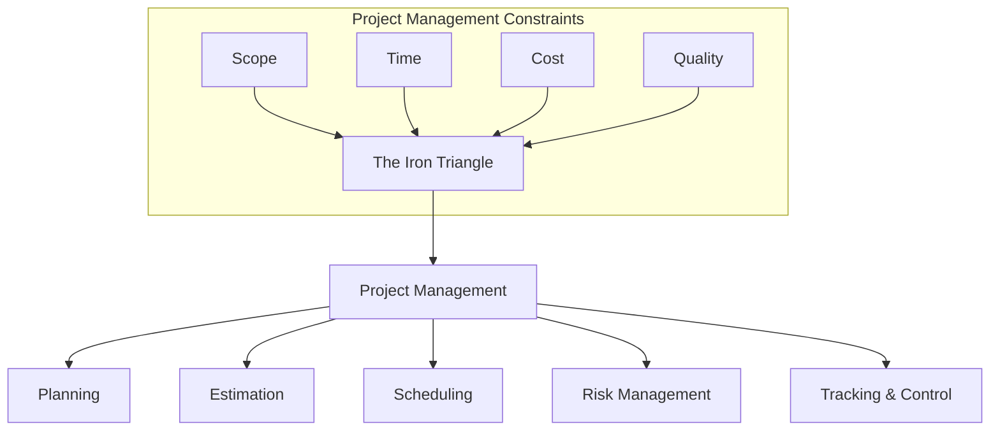
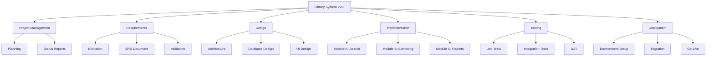
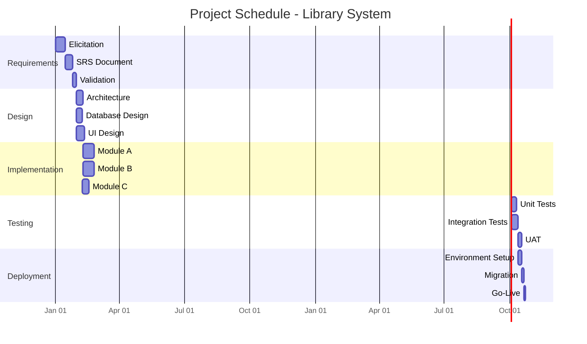
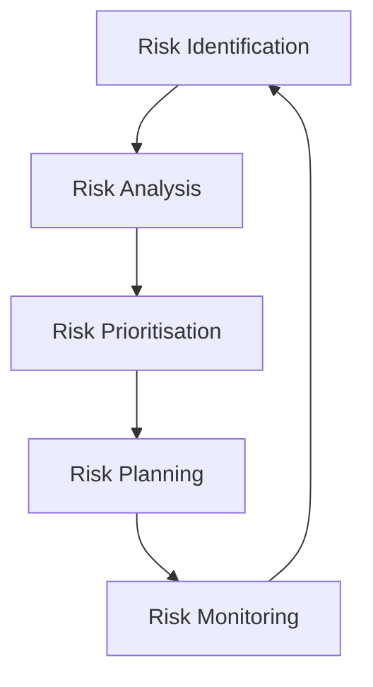

# Project Management

## Learning Objectives

After completing this chapter, the student will be able to:
- Explain the activities involved in software project planning
- Estimate software project effort using function points and COCOMO
- Construct a project schedule using PERT, CPM, and Gantt charts
- Identify and analyse project risks with a risk register
- Understand earned value management (EVM) with worked calculations
- Describe team organisation patterns for software projects
- Implement a TypeScript EVM calculator

## Theory

### The Nature of Software Project Management

Software project management is the discipline of planning, organising, monitoring, and controlling software projects. Unlike many engineering disciplines, software projects are characterised by high uncertainty, rapid technological change, and difficulty measuring progress.



### Project Planning

Project planning begins with defining the project scope — the boundary between what the project will deliver and what it will not. The scope is documented in a **project charter** or **statement of work**.

**Key planning activities:**
1. Define project objectives and success criteria
2. Identify deliverables
3. Decompose work into manageable units (WBS)
4. Estimate effort for each work unit
5. Identify dependencies
6. Allocate resources
7. Produce a schedule
8. Identify risks
9. Develop a communication plan

### Work Breakdown Structure

The WBS decomposes the project into hierarchical work packages:



### Estimation Techniques

| Technique | Description | Strengths | Weaknesses |
|-----------|-------------|-----------|------------|
| **Expert judgement** | Based on experienced individuals' knowledge | Quick, uses domain expertise | Subjective, biased by recent experience |
| **Delphi technique** | Structured rounds with anonymous estimation | Reduces bias, builds consensus | Time-consuming |
| **Planning poker** | Team-based estimation with card selection | Engages team, quick consensus | Requires trained teams |
| **Analogy** | Based on similar completed projects | Uses real data | Requires comparable historical data |
| **Parametric (COCOMO)** | Mathematical model from historical data | Objective, repeatable | Requires calibration, may miss project-specific factors |
| **Function points** | Measures functionality size | Language-independent, early estimation | Training required, subjective complexity ratings |

### Function Points

Function points measure the functional size of a system from the user's perspective:

| Function Type | Simple | Average | Complex |
|---------------|--------|---------|---------|
| External Inputs | 3 | 4 | 6 |
| External Outputs | 4 | 5 | 7 |
| External Inquiries | 3 | 4 | 6 |
| Internal Logical Files | 7 | 10 | 15 |
| External Interface Files | 5 | 7 | 10 |

**Unadjusted Function Points (UFP):** Sum of weighted counts.

**Value Adjustment Factor (VAF):** Based on 14 general system characteristics, each rated 0-5:
- VAF = 0.65 + (sum of ratings / 100)
- Range: 0.65 to 1.35

**Final FP = UFP * VAF**

### COCOMO II

COCOMO II addresses modern development practices with three submodels:

1. **Application Composition:** For projects built with integrated tools
2. **Early Design:** For architectural design stage estimation
3. **Post-Architecture:** For detailed estimation

**Effort equation:** `Effort = A * Size^B * M`

Where:
- A = constant (2.94 for post-architecture)
- Size = KSLOC (thousands of source lines) or function points
- B = scale exponent (combines 5 scale factors)
- M = product of effort multipliers (17 for post-architecture)

### PERT and Scheduling

PERT (Program Evaluation and Review Technique) uses three time estimates per activity:
- **Optimistic (O):** Best-case duration
- **Most Likely (M):** Normal duration
- **Pessimistic (P):** Worst-case duration

**Expected duration:** `(O + 4M + P) / 6`

**Critical Path:** The longest path through the network — determines project duration.



### Earned Value Management (EVM)

EVM integrates scope, schedule, and cost data.

| Metric | Formula | Meaning |
|--------|---------|---------|
| **Planned Value (PV)** | Budgeted cost of work scheduled | What we planned to have done |
| **Earned Value (EV)** | Budgeted cost of work performed | What we actually accomplished |
| **Actual Cost (AC)** | Actual cost of work performed | What we spent |
| **Schedule Variance (SV)** | `EV - PV` | Positive = ahead of schedule |
| **Cost Variance (CV)** | `EV - AC` | Positive = under budget |
| **SPI** | `EV / PV` | > 1.0 = ahead of schedule |
| **CPI** | `EV / AC` | > 1.0 = under budget |
| **EAC (Estimate at Completion)** | `BAC / CPI` | Forecast total cost |
| **ETC (Estimate to Complete)** | `EAC - AC` | Remaining cost forecast |

#### Worked EVM Example

A project has a Budget at Completion (BAC) of $500,000. At month 6, planned completion is 50%. Actual work completed is 40%. Actual costs incurred are $230,000.

```
PV = 50% × $500,000 = $250,000
EV = 40% × $500,000 = $200,000
AC = $230,000

SV = $200,000 - $250,000 = -$50,000 (behind schedule)
CV = $200,000 - $230,000 = -$30,000 (over budget)
SPI = $200,000 / $250,000 = 0.80 (20% behind schedule)
CPI = $200,000 / $230,000 = 0.87 (13% over budget)
EAC = $500,000 / 0.87 = $574,713

At current efficiency, the project will cost $574,713 and be ~25% late.
```

### Risk Management



**Risk Register Template:**

| Risk ID | Description | Probability | Impact | Exposure | Response | Owner |
|---------|-------------|-------------|--------|----------|----------|-------|
| R-001 | Key developer leaves | 0.3 | 0.8 | 0.24 | Mitigate: knowledge sharing, documentation | PM |
| R-002 | Requirements change significantly | 0.5 | 0.6 | 0.30 | Accept: incremental delivery | PO |
| R-003 | Database performance inadequate | 0.2 | 0.9 | 0.18 | Mitigate: early prototyping | Tech Lead |
| R-004 | Third-party API deprecation | 0.3 | 0.5 | 0.15 | Transfer: contract SLA | Legal |
| R-005 | Schedule overrun | 0.4 | 0.7 | 0.28 | Mitigate: buffer management | PM |

**Response Strategies:**
- **Avoidance:** Change approach to eliminate the risk
- **Mitigation:** Reduce probability or impact
- **Transfer:** Shift risk to third party (insurance, fixed-price)
- **Acceptance:** Acknowledge risk, prepare contingency plan

### Team Organisation

| Model | Description | Best For | Limitations |
|-------|-------------|----------|-------------|
| **Chief Programmer** | Centralised authority in senior developer | Projects with critical technical decisions | Single point of failure |
| **Democratic (Egoless)** | Distributed responsibility, consensus decisions | Creative, innovative projects | Slow decision-making |
| **Scrum Team** | Self-organising, cross-functional, 3-9 members | Agile product development | Requires maturity and trust |
| **Feature Team** | Cross-functional team owns a feature end-to-end | Long-lived product development | Requires broad skills |
| **Component Team** | Team owns a system component | Large systems with clear modularity | Integration challenges |

## Practical Takeaways

1. **Estimates are ranges, not commitments** — always communicate confidence levels
2. **Track EVM from the start** — you can't recover what you don't measure
3. **Risk management is proactive** — the best risks are those you mitigated before they materialised
4. **The critical path determines the project duration** — protect critical tasks with buffers
5. **Planning is more important than the plan** — the process of planning creates shared understanding
6. **Re-estimate regularly** — initial estimates are uncertain; update them as knowledge improves

## Examples

### Example 1: TypeScript EVM Calculator

```typescript
interface EVMData {
  plannedValue: number;     // PV
  earnedValue: number;      // EV
  actualCost: number;       // AC
  budgetAtCompletion: number; // BAC
}

interface EVMResults {
  scheduleVariance: number;
  costVariance: number;
  schedulePerformanceIndex: number;
  costPerformanceIndex: number;
  estimateAtCompletion: number;
  estimateToComplete: number;
  varianceAtCompletion: number;
  toCompletePerformanceIndex: number;
  status: {
    schedule: 'ahead' | 'behind' | 'on_track';
    cost: 'under_budget' | 'over_budget' | 'on_track';
  };
}

class EarnedValueAnalyzer {
  public analyze(data: EVMData): EVMResults {
    const sv = data.earnedValue - data.plannedValue;
    const cv = data.earnedValue - data.actualCost;
    const spi = data.plannedValue > 0 ? data.earnedValue / data.plannedValue : 0;
    const cpi = data.actualCost > 0 ? data.earnedValue / data.actualCost : 0;
    const eac = cpi > 0 ? data.budgetAtCompletion / cpi : Infinity;
    const etc = eac - data.actualCost;
    const vac = data.budgetAtCompletion - eac;
    const tcpi = (data.budgetAtCompletion - data.earnedValue) / 
                 (data.budgetAtCompletion - data.actualCost);

    return {
      scheduleVariance: sv,
      costVariance: cv,
      schedulePerformanceIndex: spi,
      costPerformanceIndex: cpi,
      estimateAtCompletion: eac,
      estimateToComplete: etc,
      varianceAtCompletion: vac,
      toCompletePerformanceIndex: tcpi,
      status: {
        schedule: sv > 0 ? 'ahead' : sv < 0 ? 'behind' : 'on_track',
        cost: cv > 0 ? 'under_budget' : cv < 0 ? 'over_budget' : 'on_track',
      },
    };
  }

  public forecastCompletion(
    data: EVMData,
    results: EVMResults
  ): { scheduleDaysRemaining: number; costRemaining: number } {
    const plannedDurationDays = 180; // example
    const scheduleEfficiency = results.schedulePerformanceIndex;
    const remainingWork = data.budgetAtCompletion - data.earnedValue;
    const efficientDuration = scheduleEfficiency > 0
      ? plannedDurationDays * (1 - data.earnedValue / data.budgetAtCompletion) / scheduleEfficiency
      : Infinity;
    return {
      scheduleDaysRemaining: Math.round(efficientDuration),
      costRemaining: Math.round(results.estimateToComplete),
    };
  }
}

// Usage
const analyzer = new EarnedValueAnalyzer();
const results = analyzer.analyze({
  plannedValue: 250000,
  earnedValue: 200000,
  actualCost: 230000,
  budgetAtCompletion: 500000,
});
console.log(results);
// SPI = 0.80 (behind schedule)
// CPI = 0.87 (over budget)
// EAC = $574,713
```

### Example 2: Risk Register Manager

```typescript
type RiskResponse = 'avoid' | 'mitigate' | 'transfer' | 'accept';

interface Risk {
  id: string;
  description: string;
  probability: number; // 0-1
  impact: number;      // 0-1
  exposure: number;    // probability * impact
  response: RiskResponse;
  mitigationPlan: string;
  owner: string;
  status: 'identified' | 'analyzed' | 'planned' | 'monitoring' | 'closed';
}

class RiskManager {
  private risks: Risk[] = [];

  public addRisk(
    description: string,
    probability: number,
    impact: number,
    response: RiskResponse,
    mitigationPlan: string,
    owner: string
  ): Risk {
    const risk: Risk = {
      id: `RISK-${this.risks.length + 1}`,
      description,
      probability,
      impact,
      exposure: probability * impact,
      response,
      mitigationPlan,
      owner,
      status: 'identified',
    };
    this.risks.push(risk);
    return risk;
  }

  public getRisksByExposure(minExposure: number): Risk[] {
    return this.risks
      .filter((r) => r.exposure >= minExposure)
      .sort((a, b) => b.exposure - a.exposure);
  }

  public getTopRisks(n: number): Risk[] {
    return [...this.risks]
      .sort((a, b) => b.exposure - a.exposure)
      .slice(0, n);
  }

  public generateRiskReport(): string {
    const totalExposure = this.risks.reduce((sum, r) => sum + r.exposure, 0);
    return [
      `Total Risks: ${this.risks.length}`,
      `Total Exposure: ${(totalExposure * 100).toFixed(1)}%`,
      `Top 3 Risks:`,
      ...this.getTopRisks(3).map(
        (r) => `  ${r.id}: ${r.description} (Exposure: ${(r.exposure * 100).toFixed(0)}%)`
      ),
    ].join('\n');
  }
}
```

### Example 3: Project Schedule with Critical Path

```typescript
interface Activity {
  id: string;
  description: string;
  duration: number; // days
  dependencies: string[];
}

interface CriticalPathResult {
  path: string[];
  totalDuration: number;
  float: Map<string, number>;
}

class CriticalPathAnalyzer {
  public calculateCriticalPath(activities: Activity[]): CriticalPathResult {
    // Calculate earliest start and finish times
    const es = new Map<string, number>();
    const ef = new Map<string, number>();
    
    const sorted = this.topologicalSort(activities);
    for (const act of sorted) {
      es.set(act.id, 0);
      for (const dep of act.dependencies) {
        const depEf = ef.get(dep) ?? 0;
        es.set(act.id, Math.max(es.get(act.id)!, depEf));
      }
      ef.set(act.id, es.get(act.id)! + act.duration);
    }

    // Calculate latest start and finish times
    const projectDuration = Math.max(...Array.from(ef.values()));
    const ls = new Map<string, number>();
    const lf = new Map<string, number>();
    
    const reversed = [...sorted].reverse();
    for (const act of reversed) {
      lf.set(act.id, projectDuration);
      for (const dep of act.dependencies) {
        const depLs = ls.get(dep) ?? projectDuration;
        lf.set(act.id, Math.min(lf.get(act.id)!, depLs));
      }
      ls.set(act.id, lf.get(act.id)! - act.duration);
    }

    // Calculate float and identify critical path
    const float = new Map<string, number>();
    for (const act of activities) {
      float.set(act.id, ls.get(act.id)! - es.get(act.id)!);
    }

    const criticalPath = activities
      .filter((a) => (float.get(a.id) ?? 0) === 0)
      .map((a) => a.id);

    return {
      path: criticalPath,
      totalDuration: projectDuration,
      float,
    };
  }

  private topologicalSort(activities: Activity[]): Activity[] {
    const visited = new Set<string>();
    const result: Activity[] = [];
    const actMap = new Map(activities.map((a) => [a.id, a]));

    const visit = (id: string): void => {
      if (visited.has(id)) return;
      visited.add(id);
      const act = actMap.get(id);
      if (act) {
        for (const dep of act.dependencies) {
          visit(dep);
        }
        result.push(act);
      }
    };

    for (const act of activities) {
      visit(act.id);
    }
    return result;
  }
}
```

## Chapter Quiz

**Q1: What does a Schedule Performance Index (SPI) of 0.8 indicate?**
- A) The project is 20% under budget
- B) The project is 20% behind schedule
- C) The project is 20% ahead of schedule
- D) The project has 80% cost efficiency

**Answer: B** — SPI = EV/PV; 0.8 means only 80% of planned work was completed.

**Q2: In PERT, the expected duration is calculated as:**
- A) (O + M + P) / 3
- B) (O + 4M + P) / 6
- C) (O + 2M + P) / 4
- D) (O + M + 4P) / 6

**Answer: B** — The PERT weighted average formula.

**Q3: The critical path in a project network is:**
- A) The shortest path through the network
- B) The path with the most activities
- C) The longest path determining project duration
- D) The path with the highest cost

**Answer: C** — The critical path is the longest path and determines the minimum project duration.

**Q4: The risk response strategy that eliminates a risk by changing the project approach is called:**
- A) Mitigation
- B) Transfer
- C) Avoidance
- D) Acceptance

**Answer: C** — Avoidance changes the approach to eliminate the risk entirely.

**Q5: At month 6 of a 12-month project, the EV is $200K, PV is $250K, and AC is $230K. What is the Cost Variance?**
- A) -$50K
- B) -$30K
- C) $20K
- D) $50K

**Answer: B** — CV = EV - AC = $200K - $230K = -$30K (over budget).

## Summary

Software project management addresses the challenges of planning, estimating, scheduling, and controlling software projects. The Work Breakdown Structure decomposes work into manageable units. Estimation techniques range from expert judgement to algorithmic models (function points, COCOMO II). Scheduling methods include Gantt charts for visualisation, PERT for uncertainty, and CPM for critical path analysis. Risk management identifies, analyses, and responds to potential problems. Earned Value Management integrates scope, schedule, and cost into objective performance metrics. Team organisation patterns balance authority with collaboration. Effective project management is essential for delivering quality software on time and within budget.

## Exercises

### Review Questions

1. What is a Work Breakdown Structure and why is it important?
2. What are function points, and what five function types do they count?
3. Write the COCOMO II effort equation and explain each term.
4. How is the expected duration calculated in PERT?
5. What is the critical path in a project network?
6. Distinguish between risk mitigation and risk avoidance.
7. How is cost variance calculated in earned value analysis?
8. What does a CPI of 0.85 indicate?

### Application Problems

1. Develop a three-level WBS for a mobile banking application project.

2. Calculate function points for a system with 12 external inputs (4 simple, 5 average, 3 complex), 8 external outputs (3 simple, 3 average, 2 complex), 5 external inquiries (2 simple, 2 average, 1 complex), 3 internal logical files (1 simple, 2 complex), and 2 external interface files (1 simple, 1 average). Apply VAF = 1.10.

3. Construct a PERT network with activities A(5d), B(8d, after A), C(3d, after A), D(7d, after B), E(4d, after C), F(6d, after D&E). Calculate the critical path.

4. Use the EVM calculator to analyse a project with BAC=$800K, 4 months in, 40% planned, 35% actual work done, $310K actual cost. Forecast EAC and completion date.

### Challenge Problem

You are appointed project manager for a critical software system that must be delivered in nine months for regulatory compliance. The COCOMO II estimate indicates twelve months with the current team. Stakeholders refuse to accept a later deadline and insist scope cannot be reduced. Develop a realistic project plan addressing this situation. Analyse options (staff addition, process improvement, scope negotiation, schedule compression) and propose a specific course of action. Include risk analysis and contingency plan. Implement a TypeScript project simulator that models schedule compression strategies (crashing, fast-tracking) and predicts their impact on cost and risk.
