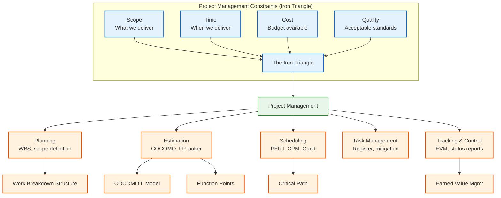
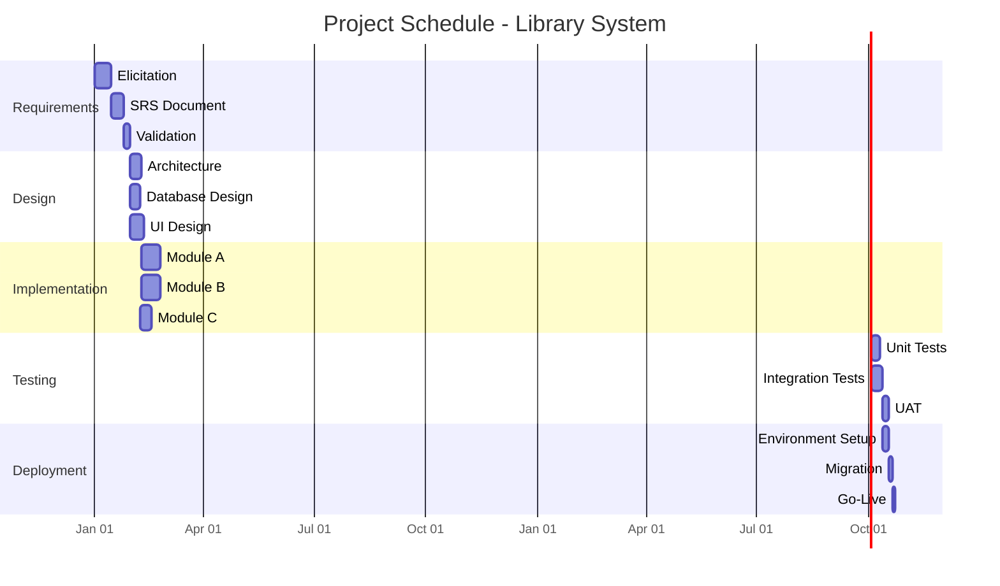
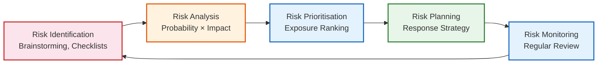

# Project Management

## Learning Objectives

```
✓ Explain the key activities involved in software project planning and their interdependencies
✓ Estimate software project effort using function points, COCOMO II, and expert judgement
✓ Construct a project schedule using PERT, CPM, and Gantt charts
✓ Identify, analyse, and respond to project risks with a structured risk register
✓ Understand and apply earned value management (EVM) with worked calculations
✓ Describe team organisation patterns and their appropriate contexts
✓ Implement TypeScript tools for EVM, risk tracking, estimation, and scheduling
✓ Apply planning poker and Delphi techniques for collaborative estimation
```
## Theory

### The Nature of Software Project Management

Software project management is the discipline of planning, organising, monitoring, and controlling software projects. Unlike many engineering disciplines, software projects are characterised by high uncertainty, rapid technological change, and difficulty measuring progress.



### Project Planning

Project planning begins with defining the project scope — the boundary between what the project will deliver and what it will not. The scope is documented in a **project charter** or **statement of work**.

**Key planning activities:**
1. Define project objectives and success criteria (SMART goals)
2. Identify deliverables and acceptance criteria
3. Decompose work into manageable units (WBS)
4. Estimate effort for each work unit
5. Identify dependencies between activities
6. Allocate resources with consideration of availability
7. Produce a schedule with milestones
8. Identify risks and plan responses
9. Develop a communication plan with stakeholder mapping
10. Establish a change control process

### Work Breakdown Structure

The WBS decomposes the project into hierarchical work packages. Each level provides increasing detail:

**Level 1:** Project (e.g., Library System V2.0)
**Level 2:** Major phases (e.g., Requirements, Design, Implementation)
**Level 3:** Work packages (e.g., Elicitation, SRS Document, Validation)
**Level 4:** Tasks (e.g., Interview stakeholders, Write user stories)

```mermaid
graph TD
    classDef l1 fill:#e3f2fd,stroke:#1565c0,stroke-width:2px
    classDef l2 fill:#e8f5e9,stroke:#2e7d32,stroke-width:2px
    classDef l3 fill:#fff3e0,stroke:#e65100,stroke-width:2px

    PROJ[Library System V2.0]:::l1 --> PM2[1. Project Management]:::l2
    PROJ --> REQ[2. Requirements]:::l2
    PROJ --> DES[3. Design]:::l2
    PROJ --> IMP[4. Implementation]:::l2
    PROJ --> TEST[5. Testing]:::l2
    PROJ --> DEP[6. Deployment]:::l2
    
    PM2 --> PM21[1.1 Planning]:::l3
    PM2 --> PM22[1.2 Status Reports]:::l3
    PM2 --> PM23[1.3 Risk Management]:::l3
    
    REQ --> REQ1[2.1 Elicitation]:::l3
    REQ --> REQ2[2.2 SRS Document]:::l3
    REQ --> REQ3[2.3 Validation]:::l3
    
    DES --> DES1[3.1 Architecture]:::l3
    DES --> DES2[3.2 Database Design]:::l3
    DES --> DES3[3.3 UI Design]:::l3
    
    IMP --> IMP1[4.1 Module A: Search]:::l3
    IMP --> IMP2[4.2 Module B: Borrowing]:::l3
    IMP --> IMP3[4.3 Module C: Reports]:::l3
    
    TEST --> TEST1[5.1 Unit Tests]:::l3
    TEST --> TEST2[5.2 Integration Tests]:::l3
    TEST --> TEST3[5.3 UAT]:::l3
    
    DEP --> DEP1[6.1 Environment Setup]:::l3
    DEP --> DEP2[6.2 Migration]:::l3
    DEP --> DEP3[6.3 Go-Live]:::l3
```



### Estimation Techniques

| Technique | Description | Strengths | Weaknesses | Best Used For |
|-----------|-------------|-----------|------------|---------------|
| **Expert judgement** | Based on experienced individuals' knowledge | Quick, uses domain expertise | Subjective, biased by recent experience | Early-stage estimates |
| **Delphi technique** | Structured rounds with anonymous estimation | Reduces bias, builds consensus | Time-consuming, requires facilitator | High-uncertainty projects |
| **Planning poker** | Team-based estimation with card selection | Engages team, quick consensus, fun | Requires trained teams, can be gamed | Agile sprint planning |
| **Analogy** | Based on similar completed projects | Uses real data, intuitive | Requires comparable historical data | Projects similar to past work |
| **Parametric (COCOMO)** | Mathematical model from historical data | Objective, repeatable, calibrated | Requires calibration data, may miss context | Large, well-understood projects |
| **Function points** | Measures functionality size | Language-independent, early estimation | Training required, subjectivity in ratings | Projects with clear requirements |

### Function Points

Function points measure the functional size of a system from the user's perspective, independent of technology choices.

| Function Type | Description | Simple | Average | Complex |
|---------------|-------------|--------|---------|---------|
| External Inputs | Screens/forms that enter data | 3 | 4 | 6 |
| External Outputs | Reports, screens that display data | 4 | 5 | 7 |
| External Inquiries | Queries with input → output | 3 | 4 | 6 |
| Internal Logical Files | Internal data stores maintained by system | 7 | 10 | 15 |
| External Interface Files | Files referenced from external systems | 5 | 7 | 10 |

**Unadjusted Function Points (UFP):** Sum of weighted counts across all five function types.

**Value Adjustment Factor (VAF):** Based on 14 general system characteristics, each rated 0-5:
- Characteristics include: data communications, distributed processing, performance, reusability, etc.
- VAF = 0.65 + (sum of ratings / 100)
- Range: 0.65 to 1.35

**Final FP = UFP × VAF**

**Example calculation:**

```typescript
interface FunctionPointCount {
  externalInputs: { simple: number; average: number; complex: number };
  externalOutputs: { simple: number; average: number; complex: number };
  externalInquiries: { simple: number; average: number; complex: number };
  internalLogicalFiles: { simple: number; average: number; complex: number };
  externalInterfaceFiles: { simple: number; average: number; complex: number };
}

class FunctionPointCalculator {
  private weights = {
    externalInputs: { simple: 3, average: 4, complex: 6 },
    externalOutputs: { simple: 4, average: 5, complex: 7 },
    externalInquiries: { simple: 3, average: 4, complex: 6 },
    internalLogicalFiles: { simple: 7, average: 10, complex: 15 },
    externalInterfaceFiles: { simple: 5, average: 7, complex: 10 },
  };

  public calculateUFP(counts: FunctionPointCount): number {
    return (
      counts.externalInputs.simple * this.weights.externalInputs.simple +
      counts.externalInputs.average * this.weights.externalInputs.average +
      counts.externalInputs.complex * this.weights.externalInputs.complex +
      counts.externalOutputs.simple * this.weights.externalOutputs.simple +
      counts.externalOutputs.average * this.weights.externalOutputs.average +
      counts.externalOutputs.complex * this.weights.externalOutputs.complex +
      counts.externalInquiries.simple * this.weights.externalInquiries.simple +
      counts.externalInquiries.average * this.weights.externalInquiries.average +
      counts.externalInquiries.complex * this.weights.externalInquiries.complex +
      counts.internalLogicalFiles.simple * this.weights.internalLogicalFiles.simple +
      counts.internalLogicalFiles.average * this.weights.internalLogicalFiles.average +
      counts.internalLogicalFiles.complex * this.weights.internalLogicalFiles.complex +
      counts.externalInterfaceFiles.simple * this.weights.externalInterfaceFiles.simple +
      counts.externalInterfaceFiles.average * this.weights.externalInterfaceFiles.average +
      counts.externalInterfaceFiles.complex * this.weights.externalInterfaceFiles.complex
    );
  }

  public calculateVAF(characteristicRatings: number[]): number {
    const sum = characteristicRatings.reduce((s, r) => s + r, 0);
    return 0.65 + sum / 100;
  }

  public calculate(counts: FunctionPointCount, characteristics: number[]): {
    ufp: number;
    vaf: number;
    finalFP: number;
  } {
    const ufp = this.calculateUFP(counts);
    const vaf = this.calculateVAF(characteristics);
    return { ufp, vaf, finalFP: ufp * vaf };
  }
}
```

### COCOMO II

COCOMO II addresses modern development practices with three submodels:

1. **Application Composition:** For projects built with integrated tools (RAD environments)
2. **Early Design:** For architectural design stage estimation (limited detail available)
3. **Post-Architecture:** For detailed estimation (full project knowledge)

**Effort equation:** `Effort = A × Size^B × M`

Where:
- A = constant (2.94 for post-architecture, 2.45 for early design)
- Size = KSLOC (thousands of source lines) or converted from function points
- B = scale exponent (combines 5 scale factors: precedentedness, flexibility, architecture/risk resolution, team cohesion, process maturity)
- M = product of 17 effort multipliers for post-architecture (e.g., required reliability, database size, product complexity, etc.)

**Schedule equation:** `Duration = C × Effort^D`

Where:
- C = 3.67 for post-architecture
- D = scale exponent (related to B)

**Staffing equation:** `Staff = Effort / Duration`

```typescript
interface COCOMOIIInput {
  sizeKSLOC: number;
  scaleFactors: {
    precedentedness: number;      // 1-6 (very low to extra high)
    developmentFlexibility: number;
    architectureRisk: number;
    teamCohesion: number;
    processMaturity: number;
  };
  effortMultipliers: number[];   // 17 values for post-architecture
  model: 'early-design' | 'post-architecture';
}

interface COCOMOIIOutput {
  effortPersonMonths: number;
  durationMonths: number;
  staffRequired: number;
  productivity: number; // SLOC/person-month
}

class COCOMOSimulator {
  public estimate(input: COCOMOIIInput): COCOMOIIOutput {
    const A = input.model === 'post-architecture' ? 2.94 : 2.45;
    const B = 0.91 + 0.01 * input.scaleFactors.precedentedness + 0.01 * input.scaleFactors.developmentFlexibility;
    const M = input.effortMultipliers.reduce((p, m) => p * m, 1);
    const effort = A * Math.pow(input.sizeKSLOC, B) * M;
    const C = input.model === 'post-architecture' ? 3.67 : 2.5;
    const D = 0.28 + 0.002 * B;
    const duration = C * Math.pow(effort, D);
    const staff = effort / duration;
    const productivity = input.sizeKSLOC / effort;

    return {
      effortPersonMonths: Math.round(effort * 100) / 100,
      durationMonths: Math.round(duration * 100) / 100,
      staffRequired: Math.ceil(staff),
      productivity: Math.round(productivity * 100) / 100,
    };
  }

  public whatIf(input: COCOMOIIInput, adjustments: Partial<COCOMOIIInput>): { baseline: COCOMOIIOutput; adjusted: COCOMOIIOutput } {
    const baseline = this.estimate(input);
    const adjustedInput = { ...input, ...adjustments };
    const adjusted = this.estimate(adjustedInput);
    return { baseline, adjusted };
  }
}
```

### PERT and Scheduling

PERT (Program Evaluation and Review Technique) uses three time estimates per activity to account for uncertainty:
- **Optimistic (O):** Best-case duration (everything goes right)
- **Most Likely (M):** Normal duration (typical conditions)
- **Pessimistic (P):** Worst-case duration (everything goes wrong)

**Expected duration:** `(O + 4M + P) / 6`

**Standard deviation:** `(P - O) / 6`

**Variance:** `((P - O) / 6)^2`

**Critical Path:** The longest path through the network — determines minimum project duration. Activities on the critical path have zero float (slack).

**Float (Slack):** The amount of time an activity can be delayed without affecting the project completion date.

- **Total float:** Time an activity can be delayed without delaying project end
- **Free float:** Time an activity can be delayed without delaying the next activity



### Earned Value Management (EVM)

EVM integrates scope, schedule, and cost data into a unified performance measurement framework.

| Metric | Formula | Meaning |
|--------|---------|---------|
| **Planned Value (PV)** | Budgeted cost of work scheduled | What we planned to have done |
| **Earned Value (EV)** | Budgeted cost of work performed | What we actually accomplished |
| **Actual Cost (AC)** | Actual cost of work performed | What we spent |
| **Budget at Completion (BAC)** | Total project budget | The full planned budget |
| **Schedule Variance (SV)** | `EV - PV` | Positive = ahead of schedule |
| **Cost Variance (CV)** | `EV - AC` | Positive = under budget |
| **Schedule Performance Index (SPI)** | `EV / PV` | > 1.0 = ahead of schedule, < 1.0 = behind |
| **Cost Performance Index (CPI)** | `EV / AC` | > 1.0 = under budget, < 1.0 = over budget |
| **Estimate at Completion (EAC)** | `BAC / CPI` | Forecast total cost at current efficiency |
| **Estimate to Complete (ETC)** | `EAC - AC` | Remaining cost forecast |
| **Variance at Completion (VAC)** | `BAC - EAC` | Forecast budget overrun/underrun |
| **To-Complete Performance Index (TCPI)** | `(BAC - EV) / (BAC - AC)` | Efficiency needed to meet budget |

#### Worked EVM Example

A project has a Budget at Completion (BAC) of $500,000. At month 6, planned completion is 50%. Actual work completed is 40%. Actual costs incurred are $230,000.

```
PV = 50% × $500,000 = $250,000
EV = 40% × $500,000 = $200,000
AC = $230,000

SV = $200,000 - $250,000 = -$50,000 (behind schedule)
CV = $200,000 - $230,000 = -$30,000 (over budget)
SPI = $200,000 / $250,000 = 0.80 (20% behind schedule)
CPI = $200,000 / $230,000 = 0.87 (13% over budget)
EAC = $500,000 / 0.87 = $574,713
ETC = $574,713 - $230,000 = $344,713
VAC = $500,000 - $574,713 = -$74,713 (projected overrun)
TCPI = ($500,000 - $200,000) / ($500,000 - $230,000) = 1.11 (must be 11% more efficient)

At current efficiency, the project will cost $574,713 and be ~25% late.
```

### Risk Management



**Risk Register Template:**

| Risk ID | Description | Probability | Impact | Exposure | Response | Owner |
|---------|-------------|-------------|--------|----------|----------|-------|
| R-001 | Key developer leaves | 0.3 | 0.8 | 0.24 | Mitigate: knowledge sharing, documentation | PM |
| R-002 | Requirements change significantly | 0.5 | 0.6 | 0.30 | Accept: incremental delivery | PO |
| R-003 | Database performance inadequate | 0.2 | 0.9 | 0.18 | Mitigate: early prototyping | Tech Lead |
| R-004 | Third-party API deprecation | 0.3 | 0.5 | 0.15 | Transfer: contract SLA | Legal |
| R-005 | Schedule overrun due to estimation error | 0.4 | 0.7 | 0.28 | Mitigate: buffer management | PM |

**Exposure = Probability × Impact**

**Response Strategies:**
- **Avoidance:** Change approach to eliminate the risk entirely (e.g., use proven technology instead of experimental)
- **Mitigation:** Reduce probability or impact (e.g., add redundancy, implement monitoring)
- **Transfer:** Shift risk to third party (e.g., insurance, fixed-price contract, SLA)
- **Acceptance:** Acknowledge risk and prepare contingency plan (e.g., budget reserve)

### Team Organisation

| Model | Description | Best For | Limitations |
|-------|-------------|----------|-------------|
| **Chief Programmer** | Centralised authority in senior developer | Projects with critical technical decisions | Single point of failure, burnout risk |
| **Democratic (Egoless)** | Distributed responsibility, consensus decisions | Creative, innovative projects | Slow decision-making, analysis paralysis |
| **Scrum Team** | Self-organising, cross-functional, 3-9 members | Agile product development | Requires maturity, trust, and training |
| **Feature Team** | Cross-functional team owns a feature end-to-end | Long-lived product development | Requires broad individual skills |
| **Component Team** | Team owns a system component | Large systems with clear modularity | Integration challenges, silo mentality |

### Planning Poker Estimation

Planning poker is a consensus-based estimation technique used in Agile teams:

1. Each estimator receives a deck of cards with values (0, 1, 2, 3, 5, 8, 13, 20, 40, 100)
2. Product Owner presents a user story and answers questions
3. Each estimator privately selects a card representing their effort estimate
4. All cards are revealed simultaneously
5. High and low estimators explain their reasoning
6. Team re-estimates until convergence (typically 2-3 rounds)

```typescript
interface PlanningPokerRound {
  story: string;
  estimates: Map<string, number>; // person -> estimate
  consensus: number;
  roundsRequired: number;
}

class PlanningPokerSimulator {
  private readonly CARD_VALUES = [0, 1, 2, 3, 5, 8, 13, 20, 40, 100];

  public simulateRound(
    story: string,
    teamMembers: string[],
    complexity: number, // 1-10
    clarity: number     // 1-10, how well understood
  ): PlanningPokerRound {
    const estimates = new Map<string, number>();
    
    for (const member of teamMembers) {
      // Simulate individual estimation with some variance
      const baseEstimate = complexity * 2 - clarity * 0.5;
      const variance = (Math.random() - 0.5) * complexity;
      const rawEstimate = Math.max(1, baseEstimate + variance);
      
      // Map to nearest card value
      const nearestCard = this.CARD_VALUES.reduce((prev, curr) =>
        Math.abs(curr - rawEstimate) < Math.abs(prev - rawEstimate) ? curr : prev
      );
      estimates.set(member, nearestCard);
    }

    // Consensus is the median or mode
    const sortedValues = Array.from(estimates.values()).sort((a, b) => a - b);
    const median = sortedValues[Math.floor(sortedValues.length / 2)];
    const roundsRequired = sortedValues.every(v => v === median) ? 1 : 2 + Math.round(Math.abs(clarity - 5) / 2);

    return { story, estimates, consensus: median, roundsRequired };
  }
}
```

## Case Studies

### Case Study 1: Large Government IT Project — Estimation and Recovery

A government agency contracted a $50M benefits management system. After 18 months, the project was 60% over budget and 12 months behind schedule.

**Analysis:**
- COCOMO II estimate assumed 150 KSLOC; actual was 280 KSLOC (underestimation of size)
- Scale factors assumed high team cohesion; actual team was newly formed
- Requirements changed 40% from baseline during development

**Recovery Plan:**
1. **Re-estimation:** Applied function points to get accurate size. UFP = 3,200, VAF = 1.12, FP = 3,584. Converted to 350 KSLOC using language factor.
2. **Scope stabilization:** Implemented change control board. All changes deferred to Phase 2.
3. **EVM tracking:** Established weekly EVM reporting with SPI and CPI targets. SPI must stay above 0.85.
4. **Risk mitigation:** Added 15% schedule buffer. Cross-trained team members.

**Result:** Project completed 8 months late (instead of forecast 18+ months). Final cost $62M (instead of forecast $85M). Delivered core functionality; Phase 2 addressed deferred scope.

### Case Study 2: Startup MVP — Planning Poker and Agile Estimation

A 5-person startup building a fintech mobile app used planning poker for all sprint estimates.

**Approach:**
- 2-week sprints with planning poker every Monday
- Team of 5: 3 developers, 1 designer, 1 product manager
- Velocity tracking: average 28 story points per sprint after 6 sprints

**Challenges:**
- Initial estimates were 3x too low (optimism bias)
- After 3 sprints, calibration factors were applied: multiply all estimates by 1.5
- Velocity stabilized at 28-32 points per sprint

**Results:** Delivered MVP in 6 months (within 10% of revised estimate). Raised $5M Series A. Used EVM-like tracking to show investors objective progress metrics.

### Case Study 3: Enterprise Migration — Risk Management

A Fortune 500 company migrating from legacy ERP to SAP. Budget: $100M. Timeline: 24 months.

**Risk Management Approach:**
1. **Risk identification:** Workshop with 30 stakeholders identified 85 risks
2. **Risk assessment:** Probability × Impact scoring. Top 5 risks had exposure > 0.5
3. **Risk response:**
   - Data migration corruption (exposure 0.72): Mitigated with parallel runs and reconciliation scripts
   - Key staff attrition (exposure 0.56): Mitigated with knowledge retention program and 3-month notice period
   - Scope creep (exposure 0.63): Mitigated with strict change control and steering committee approval for all changes
4. **Contingency reserve:** 15% of budget ($15M) held for realized risks

**Results:** Used $11M of contingency. Go-live achieved in 26 months (only 2 months late). Budget within 3% of original + contingency.

## TypeScript Project Management Tools

### Earned Value Manager

```typescript
interface EVMInput {
  plannedValue: number;     // PV
  earnedValue: number;      // EV
  actualCost: number;       // AC
  budgetAtCompletion: number; // BAC
}

interface EVMOutput {
  scheduleVariance: number;
  costVariance: number;
  schedulePerformanceIndex: number;
  costPerformanceIndex: number;
  estimateAtCompletion: number;
  estimateToComplete: number;
  varianceAtCompletion: number;
  toCompletePerformanceIndex: number;
  status: {
    schedule: 'ahead' | 'behind' | 'on_track';
    cost: 'under_budget' | 'over_budget' | 'on_track';
  };
}

class EarnedValueManager {
  public analyze(data: EVMInput): EVMOutput {
    const sv = data.earnedValue - data.plannedValue;
    const cv = data.earnedValue - data.actualCost;
    const spi = data.plannedValue > 0 ? data.earnedValue / data.plannedValue : 0;
    const cpi = data.actualCost > 0 ? data.earnedValue / data.actualCost : 0;
    const eac = cpi > 0 ? data.budgetAtCompletion / cpi : Infinity;
    const etc = eac - data.actualCost;
    const vac = data.budgetAtCompletion - eac;
    const tcpi = (data.budgetAtCompletion - data.earnedValue) / 
                 (data.budgetAtCompletion - data.actualCost);

    return {
      scheduleVariance: sv,
      costVariance: cv,
      schedulePerformanceIndex: spi,
      costPerformanceIndex: cpi,
      estimateAtCompletion: eac,
      estimateToComplete: etc,
      varianceAtCompletion: vac,
      toCompletePerformanceIndex: tcpi,
      status: {
        schedule: sv > 0 ? 'ahead' : sv < 0 ? 'behind' : 'on_track',
        cost: cv > 0 ? 'under_budget' : cv < 0 ? 'over_budget' : 'on_track',
      },
    };
  }

  public forecast(data: EVMInput, plannedDurationDays: number): {
    estimatedCompletionDays: number;
    estimatedFinalCost: number;
    varianceDays: number;
  } {
    const results = this.analyze(data);
    const scheduleEfficiency = results.schedulePerformanceIndex;
    const estimatedTotalDays = scheduleEfficiency > 0 
      ? plannedDurationDays / scheduleEfficiency 
      : Infinity;
    return {
      estimatedCompletionDays: Math.round(estimatedTotalDays),
      estimatedFinalCost: Math.round(results.estimateAtCompletion),
      varianceDays: Math.round(estimatedTotalDays - plannedDurationDays),
    };
  }

  public generateReport(data: EVMInput): string {
    const results = this.analyze(data);
    const forecast = this.forecast(data, 180);
    const lines: string[] = [
      '=== Earned Value Management Report ===',
      '',
      '┌─────────────────────────────────┬─────────────┐',
      '│ Metric                          │ Value       │',
      '├─────────────────────────────────┼─────────────┤',
      `│ Planned Value (PV)              │ $${data.plannedValue.toLocaleString().padStart(11)} │`,
      `│ Earned Value (EV)               │ $${data.earnedValue.toLocaleString().padStart(11)} │`,
      `│ Actual Cost (AC)                │ $${data.actualCost.toLocaleString().padStart(11)} │`,
      `│ Schedule Variance (SV)          │ $${results.scheduleVariance.toLocaleString().padStart(11)} │`,
      `│ Cost Variance (CV)              │ $${results.costVariance.toLocaleString().padStart(11)} │`,
      `│ SPI                             │ ${results.schedulePerformanceIndex.toFixed(2).padStart(11)} │`,
      `│ CPI                             │ ${results.costPerformanceIndex.toFixed(2).padStart(11)} │`,
      `│ EAC                             │ $${results.estimateAtCompletion.toLocaleString().padStart(11)} │`,
      `│ VAC                             │ $${results.varianceAtCompletion.toLocaleString().padStart(11)} │`,
      '└─────────────────────────────────┴─────────────┘',
      '',
      `Status: Schedule is ${results.status.schedule}, Cost is ${results.status.cost}`,
      `Forecast: ${forecast.estimatedCompletionDays} days total (${forecast.varianceDays > 0 ? '+' : ''}${forecast.varianceDays} days variance)`,
      `Final Cost Estimate: $${forecast.estimatedFinalCost.toLocaleString()}`,
    ];
    return lines.join('\n');
  }
}

// Usage
const evm = new EarnedValueManager();
const report = evm.generateReport({
  plannedValue: 250000,
  earnedValue: 200000,
  actualCost: 230000,
  budgetAtCompletion: 500000,
});
console.log(report);
```

### Risk Register — Risk Tracking with Probability/Impact

```typescript
type RiskResponse = 'avoid' | 'mitigate' | 'transfer' | 'accept';
type RiskStatus = 'identified' | 'analyzed' | 'planned' | 'monitoring' | 'closed';

interface Risk {
  id: string;
  description: string;
  category: string;
  probability: number;
  impact: number;
  exposure: number;
  response: RiskResponse;
  mitigationPlan: string;
  trigger: string;
  owner: string;
  status: RiskStatus;
  createdAt: Date;
  closedAt?: Date;
}

class RiskRegister {
  private risks: Risk[] = [];

  public addRisk(risk: Omit<Risk, 'id' | 'exposure' | 'createdAt' | 'status'>): Risk {
    const newRisk: Risk = {
      ...risk,
      id: `RISK-${(this.risks.length + 1).toString().padStart(3, '0')}`,
      exposure: risk.probability * risk.impact,
      status: 'identified',
      createdAt: new Date(),
    };
    this.risks.push(newRisk);
    return newRisk;
  }

  public getTopRisks(n: number = 5): Risk[] {
    return [...this.risks]
      .sort((a, b) => b.exposure - a.exposure)
      .slice(0, n);
  }

  public getRisksByExposure(threshold: number): Risk[] {
    return this.risks.filter(r => r.exposure >= threshold).sort((a, b) => b.exposure - a.exposure);
  }

  public getRisksByStatus(status: RiskStatus): Risk[] {
    return this.risks.filter(r => r.status === status);
  }

  public getRisksByCategory(category: string): Risk[] {
    return this.risks.filter(r => r.category === category);
  }

  public updateStatus(id: string, status: RiskStatus): void {
    const risk = this.risks.find(r => r.id === id);
    if (risk) {
      risk.status = status;
      if (status === 'closed') risk.closedAt = new Date();
    }
  }

  public generateRiskReport(): string {
    const totalExposure = this.risks.reduce((sum, r) => sum + r.exposure, 0);
    const openRisks = this.risks.filter(r => r.status !== 'closed');
    
    const lines: string[] = [
      '=== Risk Register Report ===',
      `Generated: ${new Date().toISOString()}`,
      '',
      '┌──────────────────────────────┬────────────┐',
      '│ Metric                       │ Value      │',
      '├──────────────────────────────┼────────────┤',
      `│ Total Risks                  │ ${this.risks.length.toString().padStart(10)} │`,
      `│ Open Risks                   │ ${openRisks.length.toString().padStart(10)} │`,
      `│ Total Exposure               │ ${(totalExposure * 100).toFixed(1).padStart(8)}%  │`,
      `│ High Exposure (>=0.5)        │ ${this.risks.filter(r => r.exposure >= 0.5).length.toString().padStart(10)} │`,
      '└──────────────────────────────┴────────────┘',
      '',
      '--- Top 5 Risks by Exposure ---',
    ];
    
    for (const risk of this.getTopRisks(5)) {
      lines.push(`  [${risk.id}] ${risk.description}`);
      lines.push(`    P=${risk.probability} × I=${risk.impact} = ${(risk.exposure * 100).toFixed(0)}% exposure`);
      lines.push(`    Response: ${risk.response} | Owner: ${risk.owner}`);
      lines.push(`    Status: ${risk.status} | Trigger: ${risk.trigger}`);
    }
    
    lines.push('', '--- Risk Distribution by Category ---');
    const categories = new Map<string, number>();
    for (const risk of this.risks) {
      categories.set(risk.category, (categories.get(risk.category) ?? 0) + 1);
    }
    for (const [cat, count] of categories) {
      lines.push(`  ${cat.padEnd(20)} ${count} risk(s)`);
    }
    
    return lines.join('\n');
  }
}

// Usage
const riskReg = new RiskRegister();
riskReg.addRisk({
  description: 'Key developer resigns during critical phase',
  category: 'Resource',
  probability: 0.3,
  impact: 0.8,
  response: 'mitigate',
  mitigationPlan: 'Cross-train team members, document critical knowledge',
  trigger: 'Developer gives notice',
  owner: 'Project Manager',
});
riskReg.addRisk({
  description: 'Third-party payment API changes interface',
  category: 'External',
  probability: 0.4,
  impact: 0.6,
  response: 'accept',
  mitigationPlan: 'Monitor API changelog, maintain adapter layer',
  trigger: 'Vendor announces deprecation',
  owner: 'Tech Lead',
});
console.log(riskReg.generateRiskReport());
```

### Project Estimator — COCOMO II and Function Points

```typescript
interface ProjectEstimate {
  method: 'function-points' | 'cocomo-ii' | 'planning-poker' | 'analogy';
  size: number;
  effortPersonDays: number;
  durationDays: number;
  teamSize: number;
  confidence: 'low' | 'medium' | 'high';
  range: { low: number; high: number };
}

class ProjectEstimator {
  public estimateUsingFP(
    fpCounts: FunctionPointCount,
    characteristics: number[],
    productivityFactor: number, // FP/person-day (typical: 5-20)
    languageFactor: number      // SLOC/FP (TypeScript: ~50, Java: ~60, Python: ~40)
  ): ProjectEstimate {
    const fpCalc = new FunctionPointCalculator();
    const { finalFP } = fpCalc.calculate(fpCounts, characteristics);
    const sizeKSLOC = (finalFP * languageFactor) / 1000;
    const effortPersonDays = finalFP / productivityFactor;
    const durationDays = Math.round(Math.sqrt(effortPersonDays) * 3);
    const teamSize = Math.ceil(effortPersonDays / durationDays);

    return {
      method: 'function-points',
      size: Math.round(finalFP),
      effortPersonDays: Math.round(effortPersonDays),
      durationDays,
      teamSize,
      confidence: characteristics.length === 14 ? 'high' : 'medium',
      range: {
        low: Math.round(effortPersonDays * 0.75),
        high: Math.round(effortPersonDays * 1.35),
      },
    };
  }

  public estimateUsingCOCOMO(input: COCOMOIIInput): ProjectEstimate {
    const cocomo = new COCOMOSimulator();
    const result = cocomo.estimate(input);
    const effortPersonDays = Math.round(result.effortPersonMonths * 22); // 22 working days/month

    return {
      method: 'cocomo-ii',
      size: input.sizeKSLOC,
      effortPersonDays,
      durationDays: Math.round(result.durationMonths * 22),
      teamSize: result.staffRequired,
      confidence: input.model === 'post-architecture' ? 'high' : 'medium',
      range: {
        low: Math.round(effortPersonDays * 0.8),
        high: Math.round(effortPersonDays * 1.5),
      },
    };
  }

  public compareEstimates(fp: ProjectEstimate, cocomo: ProjectEstimate): string {
    const lines: string[] = [
      '=== Estimate Comparison ===',
      '',
      '┌──────────────────┬──────────────────┬──────────────────┐',
      '│ Metric           │ Function Points  │ COCOMO II        │',
      '├──────────────────┼──────────────────┼──────────────────┤',
      `│ Size             │ ${fp.size.toString().padEnd(14)} FP │ ${cocomo.size.toString().padEnd(14)} KSLOC │`,
      `│ Effort           │ ${fp.effortPersonDays.toString().padEnd(14)} pd │ ${cocomo.effortPersonDays.toString().padEnd(14)} pd │`,
      `│ Duration         │ ${fp.durationDays.toString().padEnd(14)}d  │ ${cocomo.durationDays.toString().padEnd(14)}d  │`,
      `│ Team             │ ${fp.teamSize.toString().padEnd(14)}    │ ${cocomo.teamSize.toString().padEnd(14)}    │`,
      `│ Range            │ ${fp.range.low}-${fp.range.high} pd      │ ${cocomo.range.low}-${cocomo.range.high} pd      │`,
      '└──────────────────┴──────────────────┴──────────────────┘',
      '',
      'Recommendation: Use weighted average for final estimate',
    ];
    
    const avgEffort = Math.round((fp.effortPersonDays + cocomo.effortPersonDays) / 2);
    lines.push(`Weighted average effort: ${avgEffort} person-days`);
    return lines.join('\n');
  }
}
```

### Additional Project Management Tools

```typescript
// === Critical Path Method (CPM) ===
interface Task {
  id: string;
  name: string;
  effortDays: number;
  dependencies: string[];
}
function criticalPath(tasks: Task[]): { path: string[]; duration: number } {
  const topo: Task[] = [];
  const visited = new Set<string>();
  function dfs(id: string): void {
    if (visited.has(id)) return;
    visited.add(id);
    const task = tasks.find((t) => t.id === id)!;
    for (const dep of task.dependencies) dfs(dep);
    topo.push(task);
  }
  for (const t of tasks) dfs(t.id);
  const es = new Map<string, number>();
  const ef = new Map<string, number>();
  for (const t of topo) {
    const maxEs = Math.max(0, ...t.dependencies.map((d) => ef.get(d) ?? 0));
    es.set(t.id, maxEs);
    ef.set(t.id, maxEs + t.effortDays);
  }
  const projectEnd = Math.max(...ef.values());
  const ls = new Map<string, number>();
  const lf = new Map<string, number>();
  for (const t of [...topo].reverse()) {
    const minLf = Math.min(projectEnd, ...tasks.filter((x) => x.dependencies.includes(t.id)).map((x) => ls.get(x.id) ?? projectEnd));
    lf.set(t.id, minLf);
    ls.set(t.id, minLf - t.effortDays);
  }
  const critical = tasks.filter((t) => es.get(t.id) === ls.get(t.id));
  return { path: critical.map((t) => t.id), duration: projectEnd };
}

// === PERT Estimation ===
interface PERTInput { optimistic: number; mostLikely: number; pessimistic: number; }
function pertEstimate(input: PERTInput): { expected: number; stdDev: number; variance: number } {
  const expected = (input.optimistic + 4 * input.mostLikely + input.pessimistic) / 6;
  const stdDev = (input.pessimistic - input.optimistic) / 6;
  const variance = stdDev * stdDev;
  return { expected, stdDev, variance };
}
function pertRange(input: PERTInput, confidence: number = 0.95): { low: number; high: number } {
  const { expected, stdDev } = pertEstimate(input);
  const z = confidence === 0.95 ? 1.96 : confidence === 0.68 ? 1 : 2.58;
  return { low: expected - z * stdDev, high: expected + z * stdDev };
}

// === Resource Leveler ===
function levelResources(tasks: Task[], maxParallel: number = 3): { scheduled: Map<string, number>; duration: number } {
  const scheduled = new Map<string, number>();
  const endTimes = new Map<string, number>();
  let inProgress = 0;
  let remaining = [...tasks];
  let day = 0;
  while (remaining.length > 0) {
    const available = remaining.filter((t) => t.dependencies.every((d) => endTimes.has(d) && endTimes.get(d)! <= day));
    const toStart = available.slice(0, maxParallel - inProgress);
    for (const t of toStart) { scheduled.set(t.id, day); endTimes.set(t.id, day + t.effortDays); inProgress++; }
    remaining = remaining.filter((t) => !toStart.includes(t));
    day++;
    inProgress = 0;
    for (const [id, end] of endTimes) if (end > day) inProgress++;
  }
  return { scheduled, duration: Math.max(...endTimes.values()) };
}

// === Monte Carlo Schedule Simulator ===
function simulateDuration(tasks: Task[], iterations: number = 1000): { min: number; max: number; avg: number; p50: number; p90: number } {
  const durations: number[] = [];
  for (let i = 0; i < iterations; i++) {
    let total = 0;
    for (const task of tasks) {
      const variance = task.effortDays * 0.2;
      const randomDuration = task.effortDays + (Math.random() - 0.5) * variance * 2;
      total += randomDuration;
    }
    durations.push(total);
  }
  durations.sort((a, b) => a - b);
  return {
    min: Math.round(durations[0]),
    max: Math.round(durations[durations.length - 1]),
    avg: Math.round(durations.reduce((s, d) => s + d, 0) / durations.length),
    p50: Math.round(durations[Math.floor(iterations * 0.5)]),
    p90: Math.round(durations[Math.floor(iterations * 0.9)]),
  };
}

// Usage Examples
const projectTasks: Task[] = [
  { id: "A", name: "Requirements", effortDays: 5, dependencies: [] },
  { id: "B", name: "Design", effortDays: 4, dependencies: ["A"] },
  { id: "C", name: "Frontend", effortDays: 8, dependencies: ["B"] },
  { id: "D", name: "Backend", effortDays: 8, dependencies: ["B"] },
  { id: "E", name: "Testing", effortDays: 3, dependencies: ["C", "D"] },
];
console.log("Critical Path:", criticalPath(projectTasks));
console.log("PERT:", pertEstimate({ optimistic: 20, mostLikely: 30, pessimistic: 45 }));
console.log("Monte Carlo:", simulateDuration(projectTasks, 500));
```

## Summary

Software project management addresses the unique challenges of planning, estimating, scheduling, and controlling software projects in an environment of high uncertainty. The Work Breakdown Structure decomposes the project into manageable work packages with clear accountability. Estimation techniques range from expert judgement and planning poker to rigorous algorithmic models like function points and COCOMO II, with each technique suited to different project phases and levels of information availability.

Scheduling methods include Gantt charts for visualisation, PERT for handling estimation uncertainty through three-point estimates, and CPM for identifying the critical path that determines minimum project duration. Risk management follows a structured cycle: identification, analysis, prioritisation, planning, and monitoring. The risk register provides a living document for tracking risks and their responses. Earned Value Management integrates scope, schedule, and cost into objective performance metrics (SPI, CPI, EAC) that enable data-driven project control. Team organisation patterns balance technical authority with collaboration, and the choice of pattern should match the project's size, complexity, and organisational culture. Effective project management is not about rigid adherence to plans but about continuous planning, measurement, adaptation, and communication.

## Practical Takeaways

1. **Estimates are ranges, not commitments** — always communicate confidence levels. Use three-point estimates (optimistic, most likely, pessimistic) to convey uncertainty.
2. **Track EVM from the start** — you can't recover what you don't measure. Establish baseline PV, EV, and AC tracking in the first sprint.
3. **Risk management is proactive** — the best risks are those you mitigated before they materialised. Spend 5% of project budget on risk prevention.
4. **The critical path determines the project duration** — protect critical tasks with buffers. Monitor critical path tasks daily.
5. **Planning is more important than the plan** — the process of planning creates shared understanding. Re-plan as knowledge improves.
6. **Re-estimate regularly** — initial estimates are uncertain; update them as knowledge improves. Use actual velocity to calibrate future estimates.
7. **Combine estimation methods** — use at least two independent techniques (e.g., function points + COCOMO) and reconcile the results.
8. **Contingency reserves are essential** — hold 10-20% of budget as management reserve for unknown risks. Require formal approval to access.

## Chapter Quiz

| Question | Answer | Explanation |
|----------|--------|-------------|
| Q1 | B | SPI = EV/PV = 0.8 means only 80% of planned work completed → 20% behind schedule |
| Q2 | B | PERT expected duration = (O + 4M + P) / 6, a weighted average formula |
| Q3 | C | The critical path is the longest path through the network, determining minimum project duration |
| Q4 | C | Avoidance changes the project approach to eliminate the risk entirely |
| Q5 | B | CV = EV - AC = $200K - $230K = -$30K (negative = over budget) |

**Q1: What does a Schedule Performance Index (SPI) of 0.8 indicate?**
- A) The project is 20% under budget
- B) The project is 20% behind schedule
- C) The project is 20% ahead of schedule
- D) The project has 80% cost efficiency

**Q2: In PERT, the expected duration is calculated as:**
- A) (O + M + P) / 3
- B) (O + 4M + P) / 6
- C) (O + 2M + P) / 4
- D) (O + M + 4P) / 6

**Q3: The critical path in a project network is:**
- A) The shortest path through the network
- B) The path with the most activities
- C) The longest path determining project duration
- D) The path with the highest cost

**Q4: The risk response strategy that eliminates a risk by changing the project approach is called:**
- A) Mitigation
- B) Transfer
- C) Avoidance
- D) Acceptance

**Q5: At month 6 of a 12-month project, the EV is $200K, PV is $250K, and AC is $230K. What is the Cost Variance?**
- A) -$50K
- B) -$30K
- C) $20K
- D) $50K

## Exercises

### Review Questions

1. What is a Work Breakdown Structure and why is it important?

2. What are function points, and what five function types do they count?

3. Write the COCOMO II effort equation and explain each term.

4. How is the expected duration calculated in PERT?

5. What is the critical path in a project network?

6. Distinguish between risk mitigation and risk avoidance.

7. How is cost variance calculated in earned value analysis?

8. What does a CPI of 0.85 indicate?

### Application Problems

1. **WBS Construction:** Develop a three-level WBS for a mobile banking application project.

<details>
<summary>Click for solution</summary>

```
Level 1: Mobile Banking App V1.0
├── 1. Project Management
│   ├── 1.1 Project Planning
│   ├── 1.2 Status Reporting
│   └── 1.3 Quality Assurance
├── 2. Requirements
│   ├── 2.1 User Research
│   ├── 2.2 Feature Specification
│   └── 2.3 Security & Compliance Requirements
├── 3. Design
│   ├── 3.1 UX/UI Design
│   ├── 3.2 API Design
│   ├── 3.3 Database Design
│   └── 3.4 Security Architecture
├── 4. Development
│   ├── 4.1 Account Management Module
│   ├── 4.2 Fund Transfer Module
│   ├── 4.3 Bill Payment Module
│   ├── 4.4 Transaction History Module
│   └── 4.5 Authentication & Security
├── 5. Testing
│   ├── 5.1 Unit Testing
│   ├── 5.2 Integration Testing
│   ├── 5.3 Security Penetration Testing
│   ├── 5.4 User Acceptance Testing
│   └── 5.5 Performance Testing
└── 6. Deployment
    ├── 6.1 App Store Submission (iOS)
    ├── 6.2 Play Store Submission (Android)
    ├── 6.3 Backend Infrastructure Setup
    └── 6.4 Production Go-Live
```
</details>

2. **Function Points Calculation:** A system has 12 external inputs (4 simple, 5 average, 3 complex), 8 external outputs (3 simple, 3 average, 2 complex), 5 external inquiries (2 simple, 2 average, 1 complex), 3 internal logical files (1 simple, 2 complex), and 2 external interface files (1 simple, 1 average). Apply VAF = 1.10.

<details>
<summary>Click for solution</summary>

```typescript
const counts: FunctionPointCount = {
  externalInputs: { simple: 4, average: 5, complex: 3 },
  externalOutputs: { simple: 3, average: 3, complex: 2 },
  externalInquiries: { simple: 2, average: 2, complex: 1 },
  internalLogicalFiles: { simple: 1, average: 0, complex: 2 },
  externalInterfaceFiles: { simple: 1, average: 1, complex: 0 },
};

// UFP calculation:
// External Inputs: 4×3 + 5×4 + 3×6 = 12 + 20 + 18 = 50
// External Outputs: 3×4 + 3×5 + 2×7 = 12 + 15 + 14 = 41
// External Inquiries: 2×3 + 2×4 + 1×6 = 6 + 8 + 6 = 20
// Internal Logical Files: 1×7 + 0×10 + 2×15 = 7 + 0 + 30 = 37
// External Interface Files: 1×5 + 1×7 + 0×10 = 5 + 7 + 0 = 12
// UFP = 50 + 41 + 20 + 37 + 12 = 160

// FP = UFP × VAF = 160 × 1.10 = 176

console.log('UFP: 160');
console.log('FP: 176');
```
</details>

3. **PERT Network:** Construct a PERT network with activities A(5d), B(8d, after A), C(3d, after A), D(7d, after B), E(4d, after C), F(6d, after D&E). Calculate the critical path.

<details>
<summary>Click for solution</summary>

```typescript
// Network:
// A(5) → B(8) → D(7) → F(6)
// A(5) → C(3) → E(4) → F(6)

// Path A-B-D-F: 5 + 8 + 7 + 6 = 26 days
// Path A-C-E-F: 5 + 3 + 4 + 6 = 18 days

// Critical Path: A → B → D → F (26 days)

// Float on non-critical path:
// Path A-C-E-F has 26 - 18 = 8 days total float

const criticalPathResult = criticalPath([
  { id: "A", name: "Activity A", effortDays: 5, dependencies: [] },
  { id: "B", name: "Activity B", effortDays: 8, dependencies: ["A"] },
  { id: "C", name: "Activity C", effortDays: 3, dependencies: ["A"] },
  { id: "D", name: "Activity D", effortDays: 7, dependencies: ["B"] },
  { id: "E", name: "Activity E", effortDays: 4, dependencies: ["C"] },
  { id: "F", name: "Activity F", effortDays: 6, dependencies: ["D", "E"] },
]);
console.log(`Critical Path: ${criticalPathResult.path.join(' → ')}`);
console.log(`Duration: ${criticalPathResult.duration} days`);
```
</details>

4. **EVM Analysis:** Use the EVM calculator to analyse a project with BAC=$800K, 4 months in, 40% planned, 35% actual work done, $310K actual cost. Forecast EAC and completion date.

<details>
<summary>Click for solution</summary>

```typescript
const data = {
  plannedValue: 800000 * 0.40, // $320,000
  earnedValue: 800000 * 0.35,  // $280,000
  actualCost: 310000,
  budgetAtCompletion: 800000,
};

const evm = new EarnedValueManager();
const result = evm.analyze(data);
const forecast = evm.forecast(data, 240); // 8 months planned = 240 days

console.log(`SV: $${result.scheduleVariance.toLocaleString()} (behind schedule)`);
console.log(`CV: $${result.costVariance.toLocaleString()} (over budget)`);
console.log(`SPI: ${result.schedulePerformanceIndex.toFixed(2)}`);
console.log(`CPI: ${result.costPerformanceIndex.toFixed(2)}`);
console.log(`EAC: $${result.estimateAtCompletion.toLocaleString()}`);
console.log(`Estimated total: ${forecast.estimatedCompletionDays} days`);
console.log(`Final cost: $${forecast.estimatedFinalCost.toLocaleString()}`);
```
</details>

5. **Challenge Problem:** You are appointed project manager for a critical software system that must be delivered in nine months for regulatory compliance. The COCOMO II estimate indicates twelve months with the current team. Stakeholders refuse to accept a later deadline and insist scope cannot be reduced. Develop a realistic project plan.

<details>
<summary>Click for solution</summary>

**Analysis:**
- COCOMO II baseline: 12 months with team of 6
- Required: 9 months (25% schedule compression)
- Scope cannot be reduced, team cannot be doubled (Brooks' Law)

**Options and Trade-offs:**

1. **Crashing** (adding resources): Add 3 developers → reduces to ~10 months, increases cost 40%. Risk: Brooks' Law (communication overhead may negate gains).

2. **Fast-tracking** (parallel tasks): Run design and implementation in parallel → saves 1.5 months. Risk: Rework from incomplete design.

3. **Process improvement:** Adopt CI/CD, automated testing, and pair programming → may save 1 month. Risk: Learning curve slows initial sprints.

4. **Recommended hybrid approach:**
   - Add 2 experienced developers (not juniors)
   - Fast-track: start implementation after 60% design complete (not 100%)
   - Implement CI/CD from day 1
   - Add 1 month buffer to critical path
   - Weekly EVM tracking with SPI/CPI targets

```typescript
class ScheduleCompressionSimulator {
  public simulateCrashing(baseTeamSize: number, baseDurationMonths: number, additionalDevs: number): { newDuration: number; newCost: number } {
    const overhead = 0.1 * (baseTeamSize + additionalDevs - 1); // Brooks' law overhead
    const effectiveTeam = baseTeamSize + additionalDevs * 0.6; // new devs at 60% productivity initially
    const newDuration = (baseDurationMonths * baseTeamSize) / effectiveTeam + overhead;
    const newCost = newDuration * (baseTeamSize + additionalDevs) * 15000; // $15K/person-month
    return { newDuration: Math.round(newDuration * 10) / 10, newCost: Math.round(newCost) };
  }

  public simulateFastTracking(baseDuration: number, overlap: number): { newDuration: number; reworkRisk: number } {
    const savedTime = overlap * 0.7; // 70% of overlap saves, 30% is rework
    const reworkRisk = overlap * 0.3; // risk of rework
    return {
      newDuration: baseDuration - savedTime,
      reworkRisk: Math.round(reworkRisk * 100) / 100,
    };
  }

  public recommend(baseTeam: number, baseDur: number): string {
    const crashing = this.simulateCrashing(baseTeam, baseDur, 2);
    const fastTrack = this.simulateFastTracking(baseDur, 2);
    const combined = Math.min(crashing.newDuration, baseDur - fastTrack.reworkRisk);
    return `Recommend: Add 2 devs (${crashing.newDuration}m) + fast-track (${fastTrack.newDuration}m) = ~${Math.round(combined)}m target. Cost impact: +$${crashing.newCost.toLocaleString()}. Risk: ${fastTrack.reworkRisk}m potential rework.`;
  }
}
```
</details>

## Summary

Software project management addresses the challenges of planning, estimating, scheduling, and controlling software projects. The Work Breakdown Structure decomposes work into manageable units. Estimation techniques range from expert judgement to algorithmic models (function points, COCOMO II). Scheduling methods include Gantt charts for visualisation, PERT for uncertainty, and CPM for critical path analysis. Risk management identifies, analyses, and responds to potential problems. Earned Value Management integrates scope, schedule, and cost into objective performance metrics. Team organisation patterns balance authority with collaboration. Effective project management is essential for delivering quality software on time and within budget.
