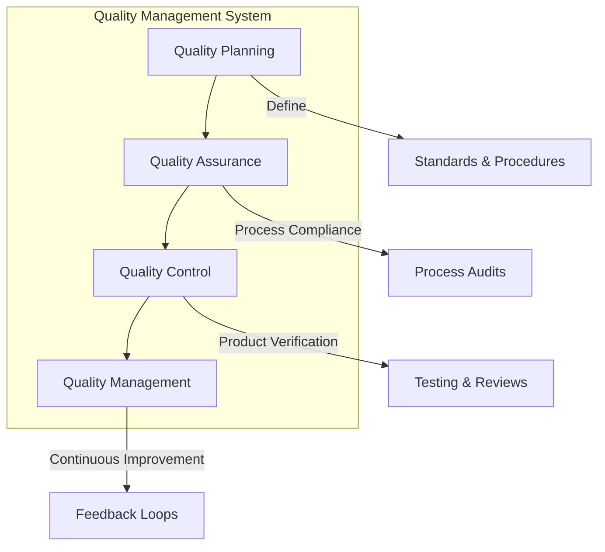
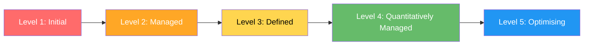
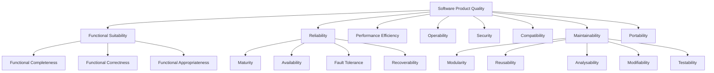
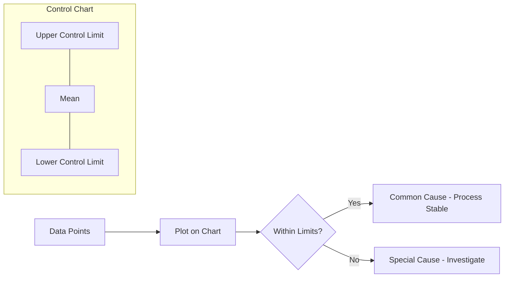
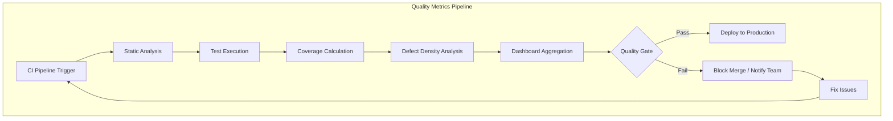

# Software Quality Management

## Learning Objectives

After completing this chapter, the student will be able to:
- Explain the three components of software quality management
- Apply quality standards (ISO 9001, CMMI, ISO 25010) to software projects
- Differentiate between software quality assurance (QA) and quality control (QC)
- Use quality review techniques including inspections and walkthroughs
- Implement static analysis metrics and tools in TypeScript
- Apply statistical process control to software quality
- Measure quality using ISO 25010 characteristics

## Theory

### What is Software Quality?

Software quality is the degree to which a software product satisfies stated and implied needs. Quality is not merely the absence of defects — it encompasses the entire user experience, maintainability, performance, and security.



### The Three Components of Quality Management

| Component | Focus | Activities | Verifies |
|-----------|-------|------------|----------|
| **Quality Planning** | Future quality activities | Define standards, set quality goals, identify processes | Plans |
| **Quality Assurance (QA)** | Process compliance | Audits, process checks, training | Processes |
| **Quality Control (QC)** | Product quality | Reviews, testing, static analysis | Products |

### Quality Standards and Models

#### ISO 9001

ISO 9001 is a general quality management standard applicable to any organisation. Key principles relevant to software:

- **Customer focus:** Understanding customer needs
- **Leadership:** Establishing quality vision
- **Engagement of people:** Involving all team members
- **Process approach:** Managing activities as processes
- **Improvement:** Continuous improvement focus
- **Evidence-based decision making:** Data-driven quality
- **Relationship management:** Managing supplier relationships

#### CMMI (Capability Maturity Model Integration)



| Level | Name | Characteristics |
|-------|------|-----------------|
| 1 | Initial | Processes unpredictable, ad hoc, reactive |
| 2 | Managed | Project-level processes, basic project management |
| 3 | Defined | Organisation-wide standard processes |
| 4 | Quantitatively Managed | Process measured and controlled statistically |
| 5 | Optimising | Continuous process improvement |

#### ISO/IEC 25010 Quality Model

ISO 25010 (replacing ISO 9126) defines eight quality characteristics:



### Quality Assurance vs Quality Control

| Aspect | Quality Assurance | Quality Control |
|--------|-------------------|-----------------|
| **Orientation** | Process-oriented | Product-oriented |
| **Timing** | Prevention (before) | Detection (during/after) |
| **Focus** | How work is done | What is produced |
| **Activities** | Audits, training, process definition | Testing, inspections, reviews |
| **Goal** | Prevent defects | Find defects |

### Quality Reviews: Inspections and Walkthroughs

#### Fagan Inspections

A structured, formal review process developed by Michael Fagan at IBM:

| Phase | Activities | Participants |
|-------|------------|--------------|
| **Planning** | Select material, schedule, assign roles | Moderator |
| **Overview** | Author introduces the material | All reviewers |
| **Preparation** | Individual review of material | All reviewers |
| **Inspection Meeting** | Systematic defect detection | All participants |
| **Rework** | Fix defects | Author |
| **Follow-up** | Verify fixes are correct | Moderator |

**Inspection Roles:**
- **Moderator:** Leads the inspection, ensures process compliance
- **Author:** Creator of the work product
- **Reviewers:** Domain experts who examine the product
- **Recorder:** Documents defects and decisions

#### Walkthroughs vs Inspections

| Aspect | Walkthrough | Inspection |
|--------|-------------|------------|
| Formality | Informal | Formal |
| Preparation time | Minimal | Significant |
| Data collection | None | Detailed defect data |
| Meeting length | Longer (presentation) | Shorter (focused) |
| Best for | Education, consensus | Defect detection |
| Defect detection rate | Low (~20%) | High (~70%) |

### Static Analysis

Static analysis examines source code without executing it. Modern tools detect bug patterns, security vulnerabilities, style violations, and maintainability issues.

**Types of static analysis:**

| Type | Checks | Example Tools |
|------|--------|---------------|
| Style | Code formatting, naming conventions | ESLint, Prettier |
| Bug patterns | Null pointers, type mismatches, dead code | TypeScript compiler, SonarQube |
| Security | Injection, XSS, hardcoded secrets | CodeQL, Semgrep |
| Complexity | Cyclomatic complexity, depth of inheritance | SonarQube, Plato |
| Duplication | Copy-paste detection | PMD-CPD, jscpd |

**Cyclomatic Complexity:** `M = E - N + 2P`

Where E = number of edges, N = number of nodes, P = number of connected components in the control flow graph.

| Cyclomatic Complexity | Risk Assessment |
|----------------------|-----------------|
| 1-10 | Simple, low risk |
| 11-20 | Moderate complexity |
| 21-50 | High risk, difficult to test |
| 50+ | Untestable, must refactor |

### Statistical Process Control (SPC)

SPC uses statistical methods to monitor and control process quality. In software, it is applied to defect rates, test pass rates, and cycle times.

**Key SPC concepts:**
- **Control limits:** Upper (UCL) and lower (LCL) boundaries for acceptable variation
- **Common cause variation:** Natural process variation (expected)
- **Special cause variation:** Unusual events requiring investigation
- **Defect density:** `Defects per KLOC` or `Defects per FP`



## Practical Takeaways

1. **Quality must be planned, not inspected in** — allocate dedicated time for quality activities
2. **Process quality drives product quality** — fix the process, and product defects decrease
3. **Inspections catch defects cheaper than testing** — the cost of fixing a bug increases exponentially through the lifecycle
4. **Static analysis is cheap insurance** — run linters and vulnerability scanning as part of CI
5. **Track quality metrics over time** — trends reveal process degradation before it becomes critical
6. **Automate quality checks** — manual quality control does not scale

## Examples

### Example 1: Quality Metric Collector

```typescript
interface QualityMetrics {
  cyclomaticComplexity: number;
  linesOfCode: number;
  commentDensity: number; // as decimal
  testCoverage: number;   // as decimal
  duplicateCodeRate: number; // as decimal
}

interface QualityGates {
  maxComplexity: number;
  minCoverage: number;
  maxDuplication: number;
}

class QualityAggregator {
  private readonly gates: QualityGates;

  constructor(gates: QualityGates) {
    this.gates = gates;
  }

  public evaluate(metrics: QualityMetrics): {
    passed: boolean;
    violations: string[];
    score: number;
  } {
    const violations: string[] = [];

    if (metrics.cyclomaticComplexity > this.gates.maxComplexity) {
      violations.push(
        `Complexity ${metrics.cyclomaticComplexity} exceeds ${this.gates.maxComplexity}`
      );
    }
    if (metrics.testCoverage < this.gates.minCoverage) {
      violations.push(
        `Coverage ${(metrics.testCoverage * 100).toFixed(1)}% below ${(this.gates.minCoverage * 100).toFixed(0)}%`
      );
    }
    if (metrics.duplicateCodeRate > this.gates.maxDuplication) {
      violations.push(
        `Duplication ${(metrics.duplicateCodeRate * 100).toFixed(1)}% exceeds ${(this.gates.maxDuplication * 100).toFixed(0)}%`
      );
    }

    // Composite score (0-100)
    const complexityScore = Math.max(
      0,
      100 - (metrics.cyclomaticComplexity / this.gates.maxComplexity) * 100
    );
    const coverageScore = metrics.testCoverage / this.gates.minCoverage * 100;
    const duplicationScore = Math.max(
      0,
      100 - (metrics.duplicateCodeRate / this.gates.maxDuplication) * 100
    );
    const score = Math.round(
      (complexityScore * 0.3 + coverageScore * 0.4 + duplicationScore * 0.3)
    );

    return {
      passed: violations.length === 0,
      violations,
      score,
    };
  }
}
```

### Example 2: Cyclomatic Complexity Calculator

```typescript
enum NodeType {
  SEQUENCE,
  DECISION,   // if, ternary, switch
  LOOP,       // for, while, do-while
  LOGICAL,    // &&, ||
  CATCH,      // exception handler
}

interface ControlFlowNode {
  id: number;
  type: NodeType;
  children: number[];
}

class ComplexityAnalyzer {
  public calculate(nodes: ControlFlowNode[]): number {
    // M = E - N + 2P
    const edges = nodes.reduce((sum, n) => sum + n.children.length, 0);
    const vertexCount = nodes.length;

    // Count decision predicates for additional precision
    const predicateCount = nodes.filter(
      (n) =>
        n.type === NodeType.DECISION ||
        n.type === NodeType.LOOP ||
        n.type === NodeType.CATCH
    ).length;

    // For a single connected component (P=1):
    const cyclomatic = edges - vertexCount + 2;
    // Alternative: 1 + predicateCount
    const alternativeFormula = 1 + predicateCount;

    return Math.max(cyclomatic, alternativeFormula);
  }

  public static async analyzeFile(
    sourceCode: string
  ): Promise<{ function: string; complexity: number; risk: string }[]> {
    // Simplified parser: counts control flow keywords
    const lines = sourceCode.split('\n');
    const functions: { function: string; complexity: number; risk: string }[] = [];
    let currentFunction = '';
    let predicates = 0;
    let inFunction = false;

    for (const line of lines) {
      const trimmed = line.trim();

      if (trimmed.startsWith('function ') || trimmed.match(/^\w+\s*\(.*\)\s*{/)) {
        if (inFunction) {
          functions.push({
            function: currentFunction,
            complexity: predicates + 1,
            risk: this.riskLevel(predicates + 1),
          });
        }
        currentFunction = trimmed.split('{')[0].trim();
        predicates = 0;
        inFunction = true;
      }

      if (inFunction) {
        if (trimmed.startsWith('if ') || trimmed.startsWith('else if ')) predicates++;
        if (trimmed.startsWith('for ') || trimmed.startsWith('while ')) predicates++;
        if (trimmed.startsWith('case ')) predicates++;
        if (trimmed.match(/\|\||&&/)) predicates++;
        if (trimmed.startsWith('catch ')) predicates++;
      }

      if (trimmed === '}' && inFunction) {
        functions.push({
          function: currentFunction,
          complexity: predicates + 1,
          risk: this.riskLevel(predicates + 1),
        });
        inFunction = false;
      }
    }

    return functions;
  }

  private static riskLevel(complexity: number): string {
    if (complexity <= 10) return 'Low';
    if (complexity <= 20) return 'Moderate';
    if (complexity <= 50) return 'High';
    return 'Untestable';
  }
}
```

### Example 3: Inspection Defect Logger

```typescript
type DefectSeverity = 'major' | 'minor' | 'cosmetic';
type DefectType =
  | 'logic_error'
  | 'interface_error'
  | 'data_error'
  | 'documentation_error'
  | 'standards_violation'
  | 'performance_issue';

interface Defect {
  id: string;
  inspectionId: string;
  location: string;
  description: string;
  severity: DefectSeverity;
  defectType: DefectType;
  finder: string;
  status: 'open' | 'rework_done' | 'verified' | 'rejected';
}

class InspectionManager {
  private defects: Defect[] = [];

  public logDefect(
    inspectionId: string,
    location: string,
    description: string,
    severity: DefectSeverity,
    defectType: DefectType,
    finder: string
  ): Defect {
    const defect: Defect = {
      id: `DEF-${this.defects.length + 1}`,
      inspectionId,
      location,
      description,
      severity,
      defectType,
      finder,
      status: 'open',
    };
    this.defects.push(defect);
    return defect;
  }

  public getInspectionStats(inspectionId: string): {
    total: number;
    bySeverity: Record<DefectSeverity, number>;
    byType: Record<DefectType, number>;
  } {
    const relevant = this.defects.filter((d) => d.inspectionId === inspectionId);

    const bySeverity = { major: 0, minor: 0, cosmetic: 0 };
    const byType = {
      logic_error: 0, interface_error: 0, data_error: 0,
      documentation_error: 0, standards_violation: 0, performance_issue: 0,
    };

    for (const d of relevant) {
      bySeverity[d.severity]++;
      byType[d.defectType]++;
    }

    return { total: relevant.length, bySeverity, byType };
  }

  public defectDensity(inspectionId: string, ksloc: number): number {
    const relevant = this.defects.filter((d) => d.inspectionId === inspectionId);
    return relevant.length / ksloc;
  }

  public generateReport(): string {
    const total = this.defects.length;
    const open = this.defects.filter((d) => d.status !== 'verified').length;
    const majorCount = this.defects.filter((d) => d.severity === 'major').length;

    return [
      '=== Inspection Report ===',
      `Total Defects Found: ${total}`,
      `Open Defects: ${open}`,
      `Critical/Major Defects: ${majorCount}`,
      `Defect Closure Rate: ${(((total - open) / total) * 100).toFixed(1)}%`,
      '---',
      this.defects.map((d) =>
        `  ${d.id} | ${d.severity.toUpperCase()} | ${d.location} | ${d.description} | ${d.status}`
      ).join('\n'),
    ].join('\n');
  }
}
```

### Example 4: Quality Dashboard Data Generator

```typescript
interface QualitySnapshot {
  timestamp: Date;
  codeCoverage: number;
  cyclomaticComplexity: number;
  technicalDebtRatio: number;
  blockerIssues: number;
  criticalIssues: number;
  testCount: number;
  testFailures: number;
}

class QualityTrendAnalyzer {
  private snapshots: QualitySnapshot[] = [];

  public recordSnapshot(data: Omit<QualitySnapshot, 'timestamp'>): void {
    this.snapshots.push({ ...data, timestamp: new Date() });
  }

  public getCoverageTrend(): { direction: 'improving' | 'declining' | 'stable'; rate: number } {
    const recent = this.snapshots.slice(-10);
    if (recent.length < 3) return { direction: 'stable', rate: 0 };

    const first = recent[0].codeCoverage;
    const last = recent[recent.length - 1].codeCoverage;
    const change = last - first;
    const rate = change / recent.length;

    return {
      direction: rate > 0.01 ? 'improving' : rate < -0.01 ? 'declining' : 'stable',
      rate,
    };
  }

  public getQualityGateStatus(thresholds: {
    minCoverage: number;
    maxComplexity: number;
    maxBlockerIssues: number;
  }): { passed: boolean; summary: string } {
    if (this.snapshots.length === 0) {
      return { passed: false, summary: 'No quality data available' };
    }

    const latest = this.snapshots[this.snapshots.length - 1];
    const failures: string[] = [];

    if (latest.codeCoverage < thresholds.minCoverage) {
      failures.push(
        `Coverage ${(latest.codeCoverage * 100).toFixed(1)}% < ${(thresholds.minCoverage * 100).toFixed(0)}%`
      );
    }
    if (latest.cyclomaticComplexity > thresholds.maxComplexity) {
      failures.push(
        `Complexity ${latest.cyclomaticComplexity} > ${thresholds.maxComplexity}`
      );
    }
    if (latest.blockerIssues > thresholds.maxBlockerIssues) {
      failures.push(
        `Blocker issues ${latest.blockerIssues} > ${thresholds.maxBlockerIssues}`
      );
    }

    return {
      passed: failures.length === 0,
      summary: failures.length > 0
        ? `Quality gate failed: ${failures.join('; ')}`
        : 'Quality gate passed',
    };
  }
}
```

## Chapter Quiz

**Q1: What is the primary difference between quality assurance and quality control?**
- A) QA is cheaper than QC
- B) QA focuses on process, QC focuses on product
- C) QA is done by testers, QC by developers
- D) QA uses automated tools, QC uses manual review

**Answer: B** — QA ensures processes are followed; QC verifies product quality.

**Q2: The CMMI level that requires organisation-wide standard processes is:**
- A) Level 2 (Managed)
- B) Level 3 (Defined)
- C) Level 4 (Quantitatively Managed)
- D) Level 5 (Optimising)

**Answer: B** — Level 3 establishes standard processes across the organisation.

**Q3: In Fagan inspections, the participant who leads the process is called the:**
- A) Author
- B) Reviewer
- C) Moderator
- D) Recorder

**Answer: C** — The moderator leads the inspection and ensures process compliance.

**Q4: What cyclomatic complexity value is considered high risk and difficult to test?**
- A) 1-10
- B) 11-20
- C) 21-50
- D) 50+

**Answer: C** — Cyclomatic complexity 21-50 is high risk.

**Q5: ISO 25010 defines how many quality characteristics?**
- A) 5
- B) 6
- C) 8
- D) 10

**Answer: C** — ISO 25010 defines eight characteristics: functional suitability, reliability, performance efficiency, operability, security, compatibility, maintainability, portability.

### Example 5: Test Coverage Calculator

The test coverage calculator measures the proportion of source code exercised by the test suite across three dimensions: **line coverage**, **branch coverage**, and **function coverage**. These metrics help teams identify untested code paths and enforce coverage thresholds in CI pipelines.

```typescript
type CoverageType = 'line' | 'branch' | 'function';

interface CoverageResult {
  type: CoverageType;
  covered: number;
  total: number;
  rate: number;
}

interface TestRun {
  file: string;
  totalLines: number;
  exercisedLines: number;
  totalBranches: number;
  exercisedBranches: number;
  totalFunctions: number;
  exercisedFunctions: number;
}

class CoverageCalculator {
  public lineCoverage(run: TestRun): CoverageResult {
    const rate = run.totalLines > 0
      ? run.exercisedLines / run.totalLines
      : 0;
    return {
      type: 'line',
      covered: run.exercisedLines,
      total: run.totalLines,
      rate,
    };
  }

  public branchCoverage(run: TestRun): CoverageResult {
    const rate = run.totalBranches > 0
      ? run.exercisedBranches / run.totalBranches
      : 0;
    return {
      type: 'branch',
      covered: run.exercisedBranches,
      total: run.totalBranches,
      rate,
    };
  }

  public functionCoverage(run: TestRun): CoverageResult {
    const rate = run.totalFunctions > 0
      ? run.exercisedFunctions / run.totalFunctions
      : 0;
    return {
      type: 'function',
      covered: run.exercisedFunctions,
      total: run.totalFunctions,
      rate,
    };
  }

  public aggregate(files: TestRun[]): {
    overall: CoverageResult[];
    thresholds: { passed: boolean; failures: string[] };
    minRate: number;
  } {
    const totals = files.reduce(
      (acc, f) => ({
        lines: acc.lines + f.totalLines,
        exercisedLines: acc.exercisedLines + f.exercisedLines,
        branches: acc.branches + f.totalBranches,
        exercisedBranches: acc.exercisedBranches + f.exercisedBranches,
        functions: acc.functions + f.totalFunctions,
        exercisedFunctions: acc.exercisedFunctions + f.exercisedFunctions,
      }),
      {
        lines: 0, exercisedLines: 0,
        branches: 0, exercisedBranches: 0,
        functions: 0, exercisedFunctions: 0,
      }
    );

    const lineRate = totals.lines > 0 ? totals.exercisedLines / totals.lines : 0;
    const branchRate = totals.branches > 0 ? totals.exercisedBranches / totals.branches : 0;
    const funcRate = totals.functions > 0 ? totals.exercisedFunctions / totals.functions : 0;

    const overall: CoverageResult[] = [
      { type: 'line', covered: totals.exercisedLines, total: totals.lines, rate: lineRate },
      { type: 'branch', covered: totals.exercisedBranches, total: totals.branches, rate: branchRate },
      { type: 'function', covered: totals.exercisedFunctions, total: totals.functions, rate: funcRate },
    ];

    const minRate = Math.min(lineRate, branchRate, funcRate);
    const failures: string[] = [];
    const threshold = 0.80;

    if (lineRate < threshold) failures.push(`Line coverage ${(lineRate * 100).toFixed(1)}% < 80%`);
    if (branchRate < threshold) failures.push(`Branch coverage ${(branchRate * 100).toFixed(1)}% < 80%`);
    if (funcRate < threshold) failures.push(`Function coverage ${(funcRate * 100).toFixed(1)}% < 80%`);

    return {
      overall,
      thresholds: { passed: failures.length === 0, failures },
      minRate,
    };
  }

  public generateReport(files: TestRun[]): string {
    const result = this.aggregate(files);
    const rows = result.overall.map(
      (r) => `  ${r.type.padEnd(12)} ${r.covered}/${r.total} (${(r.rate * 100).toFixed(1)}%)`
    );
    const status = result.thresholds.passed ? 'PASSED' : 'FAILED';
    return [
      '=== Coverage Report ===',
      ...rows,
      `  ${'─'.repeat(40)}`,
      `  Status: ${status}`,
      ...result.thresholds.failures.map((f) => `  ⚠ ${f}`),
      `  Minimum coverage rate: ${(result.minRate * 100).toFixed(1)}%`,
    ].join('\n');
  }
}

// Usage example
const calculator = new CoverageCalculator();
const runs: TestRun[] = [
  { file: 'auth.ts', totalLines: 120, exercisedLines: 115, totalBranches: 30, exercisedBranches: 28, totalFunctions: 8, exercisedFunctions: 8 },
  { file: 'api.ts', totalLines: 200, exercisedLines: 140, totalBranches: 50, exercisedBranches: 30, totalFunctions: 15, exercisedFunctions: 12 },
];
console.log(calculator.generateReport(runs));
```

### Example 6: Quality Metrics Dashboard

The quality metrics dashboard aggregates multiple quality dimensions into a single scoreboard, enabling teams to track trends and detect regressions at a glance. It normalises disparate metrics into a unified dashboard with traffic-light indicators.

```typescript
interface MetricDefinition {
  name: string;
  value: number;
  unit: string;
  threshold: { warning: number; critical: number };
  direction: 'lower_is_better' | 'higher_is_better';
}

enum DashboardStatus {
  HEALTHY = 'healthy',
  WARNING = 'warning',
  CRITICAL = 'critical',
}

interface DashboardEntry {
  metric: string;
  value: string;
  status: DashboardStatus;
  trend: 'up' | 'down' | 'flat';
}

class QualityDashboard {
  private readonly history: Map<string, number[]> = new Map();

  public evaluate(metrics: MetricDefinition[]): {
    entries: DashboardEntry[];
    overallStatus: DashboardStatus;
    score: number;
  } {
    let totalScore = 0;
    const entries: DashboardEntry[] = [];

    for (const m of metrics) {
      this.pushHistory(m.name, m.value);
      const status = this.computeStatus(m);
      const trend = this.computeTrend(m.name);
      const statusWeight = status === DashboardStatus.HEALTHY ? 1
        : status === DashboardStatus.WARNING ? 0.5 : 0;

      totalScore += statusWeight;
      entries.push({
        metric: m.name,
        value: `${m.value}${m.unit}`,
        status,
        trend,
      });
    }

    const overallScore = metrics.length > 0
      ? Math.round((totalScore / metrics.length) * 100)
      : 0;

    const overallStatus = overallScore >= 80
      ? DashboardStatus.HEALTHY
      : overallScore >= 50
        ? DashboardStatus.WARNING
        : DashboardStatus.CRITICAL;

    return { entries, overallStatus, score: overallScore };
  }

  private computeStatus(m: MetricDefinition): DashboardStatus {
    const { value, threshold, direction } = m;
    const isWorse = direction === 'lower_is_better'
      ? (v: number, t: number) => v > t
      : (v: number, t: number) => v < t;

    if (isWorse(value, threshold.critical)) return DashboardStatus.CRITICAL;
    if (isWorse(value, threshold.warning)) return DashboardStatus.WARNING;
    return DashboardStatus.HEALTHY;
  }

  private computeTrend(name: string): 'up' | 'down' | 'flat' {
    const values = this.history.get(name);
    if (!values || values.length < 3) return 'flat';

    const recent = values.slice(-5);
    const half = Math.floor(recent.length / 2);
    const firstHalfAvg = recent.slice(0, half).reduce((a, b) => a + b, 0) / half;
    const secondHalfAvg = recent.slice(half).reduce((a, b) => a + b, 0) / (recent.length - half);
    const diff = secondHalfAvg - firstHalfAvg;
    const threshold = Math.max(0.01, Math.abs(firstHalfAvg) * 0.02);

    if (Math.abs(diff) < threshold) return 'flat';
    return diff > 0 ? 'up' : 'down';
  }

  private pushHistory(name: string, value: number): void {
    if (!this.history.has(name)) this.history.set(name, []);
    this.history.get(name)!.push(value);
    if (this.history.get(name)!.length > 100) {
      this.history.get(name)!.shift();
    }
  }

  public renderDashboard(entries: DashboardEntry[], overallStatus: DashboardStatus, score: number): string {
    const statusIcon = (s: DashboardStatus) =>
      s === DashboardStatus.HEALTHY ? '🟢' : s === DashboardStatus.WARNING ? '🟡' : '🔴';
    const trendIcon = (t: 'up' | 'down' | 'flat') =>
      t === 'up' ? '▲' : t === 'down' ? '▼' : '─';

    const rows = entries.map(
      (e) => `  ${statusIcon(e.status)} ${trendIcon(e.trend)} ${e.metric.padEnd(25)} ${e.value.padEnd(12)} ${e.status}`
    ).join('\n');

    return [
      '=== Quality Dashboard ===',
      `  Overall Score: ${score}/100 ${statusIcon(overallStatus)}`,
      `  Overall Status: ${overallStatus.toUpperCase()}`,
      '  ' + '─'.repeat(55),
      rows,
    ].join('\n');
  }
}

// Usage example
const dashboard = new QualityDashboard();
const metrics: MetricDefinition[] = [
  { name: 'Code Coverage', value: 82, unit: '%', threshold: { warning: 75, critical: 60 }, direction: 'higher_is_better' },
  { name: 'Cyclomatic Complexity', value: 14, unit: '', threshold: { warning: 15, critical: 25 }, direction: 'lower_is_better' },
  { name: 'Duplicate Code', value: 6.5, unit: '%', threshold: { warning: 5, critical: 10 }, direction: 'lower_is_better' },
  { name: 'Test Failure Rate', value: 3, unit: '%', threshold: { warning: 2, critical: 5 }, direction: 'lower_is_better' },
  { name: 'Technical Debt Ratio', value: 8, unit: '%', threshold: { warning: 10, critical: 20 }, direction: 'lower_is_better' },
];
const dashboardResult = dashboard.evaluate(metrics);
console.log(dashboard.renderDashboard(dashboardResult.entries, dashboardResult.overallStatus, dashboardResult.score));
```

### Example 7: Defect Density Analyzer

Defect density measures the number of confirmed defects per unit of software size (typically per thousand lines of code — KLOC). This example implements a module-level defect density analyzer that identifies high-risk components and tracks density trends across releases.

```typescript
interface ModuleDefectData {
  moduleName: string;
  linesOfCode: number;
  defects: {
    id: string;
    severity: 'critical' | 'major' | 'minor' | 'trivial';
    introducedInRelease: string;
  }[];
}

interface DensityReportEntry {
  module: string;
  ksloc: number;
  defectCount: number;
  density: number;
  severityBreakdown: Record<string, number>;
  riskLevel: 'low' | 'moderate' | 'high' | 'critical';
}

class DefectDensityAnalyzer {
  public analyzeModules(modules: ModuleDefectData[]): DensityReportEntry[] {
    return modules.map((mod) => {
      const ksloc = mod.linesOfCode / 1000;
      const defectCount = mod.defects.length;
      const density = ksloc > 0 ? defectCount / ksloc : 0;

      const breakdown: Record<string, number> = {};
      for (const d of mod.defects) {
        breakdown[d.severity] = (breakdown[d.severity] || 0) + 1;
      }

      const riskLevel = density <= 2 ? 'low'
        : density <= 5 ? 'moderate'
          : density <= 10 ? 'high' : 'critical';

      return {
        module: mod.moduleName,
        ksloc: Math.round(ksloc * 100) / 100,
        defectCount,
        density: Math.round(density * 100) / 100,
        severityBreakdown: breakdown,
        riskLevel,
      };
    });
  }

  public identifyHotspots(entries: DensityReportEntry[], threshold: number = 5): DensityReportEntry[] {
    return entries
      .filter((e) => e.density > threshold)
      .sort((a, b) => b.density - a.density);
  }

  public releaseTrend(allModules: ModuleDefectData[], releases: string[]): {
    release: string;
    totalDefects: number;
    totalKsloc: number;
    density: number;
  }[] {
    return releases.map((release) => {
      let totalDefects = 0;
      let totalKsloc = 0;

      for (const mod of allModules) {
        const releaseDefects = mod.defects.filter(
          (d) => d.introducedInRelease === release
        );
        totalDefects += releaseDefects.length;
        totalKsloc += mod.linesOfCode / 1000;
      }

      return {
        release,
        totalDefects,
        totalKsloc: Math.round(totalKsloc * 100) / 100,
        density: totalKsloc > 0
          ? Math.round((totalDefects / totalKsloc) * 100) / 100
          : 0,
      };
    });
  }

  public generateReport(entries: DensityReportEntry[], trend: { release: string; density: number }[]): string {
    const header = '=== Defect Density Report ===\n';
    const tableHeader = `${'Module'.padEnd(20)} ${'KS LOC'.padEnd(8)} ${'Defects'.padEnd(8)} ${'Density'.padEnd(8)} ${'Risk'}`;
    const separator = '─'.repeat(60);

    const rows = entries.map((e) =>
      `${e.module.padEnd(20)} ${String(e.ksloc).padEnd(8)} ${String(e.defectCount).padEnd(8)} ${String(e.density).padEnd(8)} ${e.riskLevel.toUpperCase()}`
    ).join('\n');

    const hotspots = entries.filter((e) => e.density > 5);
    const hotspotSection = hotspots.length > 0
      ? `\n\n⚠ Hotspots (density > 5):\n${hotspots.map((h) => `  - ${h.module} (${h.density} defects/KLOC)`).join('\n')}`
      : '\n\n✓ No hotspots detected';

    const trendLines = trend.map((t) => `  ${t.release.padEnd(12)} ${t.density} defects/KLOC`).join('\n');
    const trendSection = `\n\n=== Density Trend ===\n${trendLines}`;

    return [header, tableHeader, separator, rows, hotspotSection, trendSection].join('\n');
  }
}

// Usage example
const analyzer = new DefectDensityAnalyzer();
const modules: ModuleDefectData[] = [
  {
    moduleName: 'auth-module',
    linesOfCode: 4500,
    defects: [
      { id: 'A1', severity: 'critical', introducedInRelease: 'v2.0' },
      { id: 'A2', severity: 'major', introducedInRelease: 'v2.0' },
      { id: 'A3', severity: 'minor', introducedInRelease: 'v2.1' },
    ],
  },
  {
    moduleName: 'payment-gateway',
    linesOfCode: 12000,
    defects: [
      { id: 'P1', severity: 'critical', introducedInRelease: 'v1.0' },
      { id: 'P2', severity: 'critical', introducedInRelease: 'v1.0' },
      { id: 'P3', severity: 'major', introducedInRelease: 'v2.0' },
      { id: 'P4', severity: 'major', introducedInRelease: 'v2.0' },
      { id: 'P5', severity: 'minor', introducedInRelease: 'v2.1' },
      { id: 'P6', severity: 'minor', introducedInRelease: 'v2.1' },
    ],
  },
];
const reportEntries = analyzer.analyzeModules(modules);
const trend = analyzer.releaseTrend(modules, ['v1.0', 'v2.0', 'v2.1']);
console.log(analyzer.generateReport(reportEntries, trend));
```

### Additional Mermaid Diagrams



```mermaid
graph LR
    subgraph "Coverage Types"
        LC[Line Coverage] -->|Executed lines / Total lines| LR[Rate]
        BC[Branch Coverage] -->|Taken branches / Total branches| BR[Rate]
        FC[Function Coverage] -->|Called functions / Total functions| FR[Rate]
    end
    subgraph "Defect Density Zones"
        D1[Density 0-2] -->|Low Risk| ACCEPT[Acceptable]
        D2[Density 2-5] -->|Moderate| MONITOR[Monitor]
        D3[Density 5-10] -->|High| REVIEW[Review Required]
        D4[Density 10+] -->|Critical| IMMEDIATE[Must Refactor]
    end
    subgraph "Dashboard Status"
        DS1[Score 80-100] -->|🟢| HLTH[Healthy]
        DS2[Score 50-79] -->|🟡| WARN[Warning]
        DS3[Score 0-49] -->|🔴|         CRIT[Critical]
    end
```

### TypeScript: Quality Management Tools

```typescript
// === Quality Score Calculator ===
interface QualityDimension {
  name: string;
  weight: number;
  score: number;
}
function calculateQualityIndex(dimensions: QualityDimension[]): { overall: number; breakdown: QualityDimension[] } {
  const totalWeight = dimensions.reduce((s, d) => s + d.weight, 0);
  const weightedSum = dimensions.reduce((s, d) => s + d.weight * d.score, 0);
  const breakdown = dimensions.map((d) => ({ ...d, weighted: d.weight * d.score / totalWeight }));
  return { overall: totalWeight > 0 ? weightedSum / totalWeight : 0, breakdown: dimensions };
}
const qualityDims: QualityDimension[] = [
  { name: "Reliability", weight: 30, score: 85 },
  { name: "Performance", weight: 25, score: 72 },
  { name: "Security", weight: 25, score: 90 },
  { name: "Maintainability", weight: 20, score: 78 },
];
console.log(calculateQualityIndex(qualityDims));

// === Defect Density Analyzer ===
function defectDensity(defects: number, kloc: number): { density: number; severity: "low" | "medium" | "high" } {
  const density = kloc > 0 ? defects / kloc : 0;
  const severity = density < 5 ? "low" : density < 15 ? "medium" : "high";
  return { density: Math.round(density * 100) / 100, severity };
}
console.log(defectDensity(42, 10)); // 4.2 defects/KLOC

// === Quality Gate Checker ===
interface QualityGate {
  metric: string;
  operator: ">" | ">=" | "<" | "<=" | "==";
  threshold: number;
}
function checkGates(gates: QualityGate[], measurements: Record<string, number>): { passed: boolean; failures: string[] } {
  const failures: string[] = [];
  for (const gate of gates) {
    const value = measurements[gate.metric];
    if (value === undefined) { failures.push(`${gate.metric}: not measured`); continue; }
    const pass = gate.operator === ">" ? value > gate.threshold
      : gate.operator === ">=" ? value >= gate.threshold
      : gate.operator === "<" ? value < gate.threshold
      : gate.operator === "<=" ? value <= gate.threshold
      : value === gate.threshold;
    if (!pass) failures.push(`${gate.metric}: ${value} ${gate.operator} ${gate.threshold} failed`);
  }
  return { passed: failures.length === 0, failures };
}
const gates: QualityGate[] = [
  { metric: "testCoverage", operator: ">=", threshold: 80 },
  { metric: "complexity", operator: "<=", threshold: 15 },
  { metric: "duplications", operator: "<", threshold: 5 },
];
const measurements = { testCoverage: 85, complexity: 12, duplications: 3 };
console.log(checkGates(gates, measurements)); // passed: true

// === SPC Control Chart Calculator ===
interface ControlLimits {
  mean: number;
  upper: number;
  lower: number;
}
function calculateControlLimits(values: number[]): ControlLimits {
  const mean = values.reduce((s, v) => s + v, 0) / values.length;
  const std = Math.sqrt(values.reduce((s, v) => s + (v - mean) ** 2, 0) / values.length);
  return { mean: Math.round(mean * 100) / 100, upper: Math.round((mean + 3 * std) * 100) / 100, lower: Math.round(Math.max(0, mean - 3 * std) * 100) / 100 };
}
const sprintVelocities = [30, 32, 28, 35, 29, 31, 33, 27];
console.log(calculateControlLimits(sprintVelocities));

// === Fagan Inspection Calculator ===
function faganEfficiency(defectsFound: number, totalDefects: number, preparationHours: number, meetingHours: number): { detectionRate: number; costPerDefect: number } {
  return {
    detectionRate: totalDefects > 0 ? defectsFound / totalDefects : 0,
    costPerDefect: defectsFound > 0 ? (preparationHours + meetingHours) / defectsFound : 0,
  };
}
console.log(faganEfficiency(8, 12, 4, 2));

// === CMMI Maturity Checker ===
type CMMILevel = 1 | 2 | 3 | 4 | 5;
const cmmiPractices: Record<CMMILevel, string[]> = {
  1: ["Basic project management", "Ad hoc processes"],
  2: ["Requirements management", "Project planning", "Project monitoring", "Configuration management"],
  3: ["Requirements development", "Technical solution", "Product integration", "Verification", "Validation", "Organisational process focus"],
  4: ["Organisational process performance", "Quantitative project management"],
  5: ["Organisational performance management", "Causal analysis and resolution"],
};
function checkCMMILevel(implemented: string[]): CMMILevel {
  for (let level = 5; level >= 2; level--) {
    const practices = cmmiPractices[level as CMMILevel];
    if (practices.every((p) => implemented.some((i) => i.includes(p)))) return level as CMMILevel;
  }
  return 1;
}
const orgPractices = ["Requirements management", "Project planning", "Project monitoring", "Configuration management", "Technical solution"];
console.log(`CMMI Level: ${checkCMMILevel(orgPractices)}`); // 2
```

## Summary

Software quality management encompasses three interrelated components: quality planning defines the approach, quality assurance ensures processes are followed, and quality control verifies product quality. Standards like ISO 9001 provide general quality frameworks, while CMMI offers staged maturity levels from ad hoc (Level 1) to continuously improving (Level 5). ISO 25010 defines eight quality characteristics for software products. Formal inspections such as Fagan inspections detect up to 70% of defects before testing. Static analysis tools measure code metrics like cyclomatic complexity, which predicts testability. Statistical process control distinguishes common cause variation from special cause events. Automated quality gates integrated into CI/CD pipelines prevent quality degradation. Practical tools like coverage calculators, defect density analyzers, and quality dashboards enable teams to measure, track, and improve quality systematically across the software lifecycle.

## Exercises

### Review Questions

1. What are the three components of software quality management?
2. Explain the five levels of the CMMI maturity model.
3. List the eight quality characteristics defined by ISO 25010.
4. Describe the six phases of a Fagan inspection.
5. What is the difference between a walkthrough and an inspection?
6. Write the formula for cyclomatic complexity and explain each term.
7. What is the difference between common cause and special cause variation?
8. What is defect density and how is it calculated?

### Application Problems

1. Design a quality plan for a team developing a medical device software system (IEC 62304 regulated). Include quality standards, review frequency, metrics to collect, and acceptance criteria.

2. Calculate cyclomatic complexity for a function with the following control flow: sequential entry, one if-else, two nested for loops, one switch with four cases, and one catch block. Provide the control flow graph.

3. Using the quality metric collector, evaluate a project with complexity 14, coverage 72%, and duplication 8% against gates of max complexity 12, min coverage 80%, and max duplication 5%. Report violations and overall score.

### Challenge Problem

Your organisation is at CMMI Level 1 and aims to reach CMMI Level 3 within 18 months. The 200-person engineering department is distributed across three continents with different quality cultures. Develop a staged quality improvement plan covering process area implementation (requirements management, project planning, quality assurance, configuration management, measurement and analysis). For each month, specify the process areas to implement, training required, tools to deploy, metrics to collect, and expected outcomes. Include how you will handle resistance to process adoption. Implement a TypeScript program that models the maturity progression and tracks whether milestone criteria are met each month.
