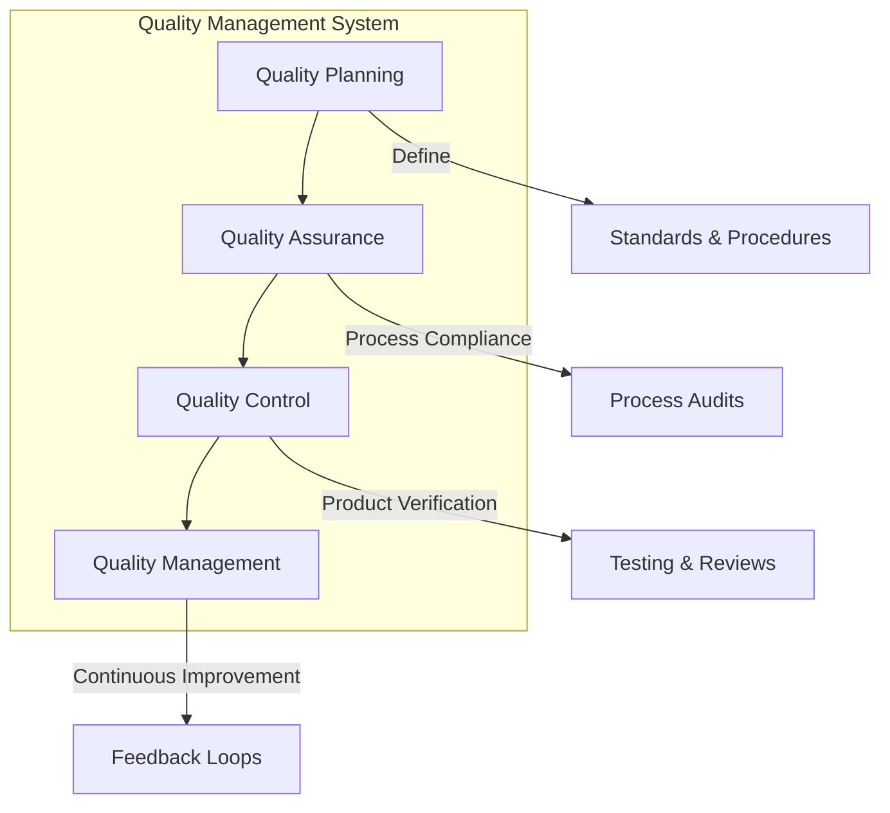
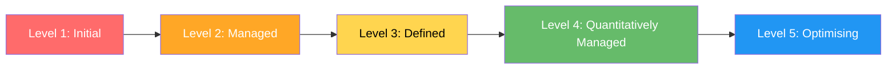
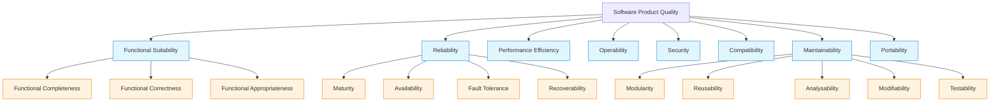
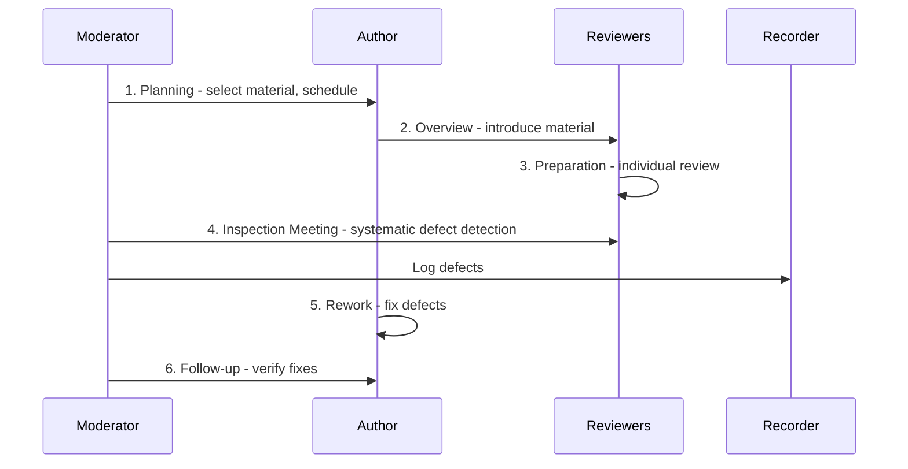
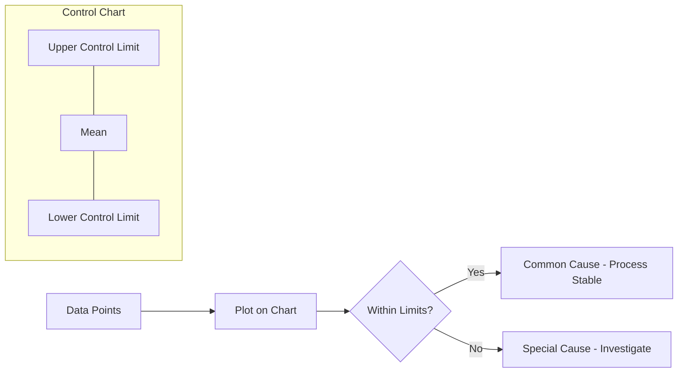
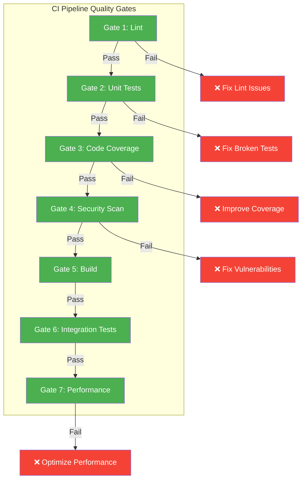
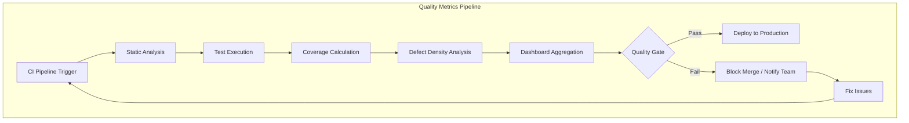
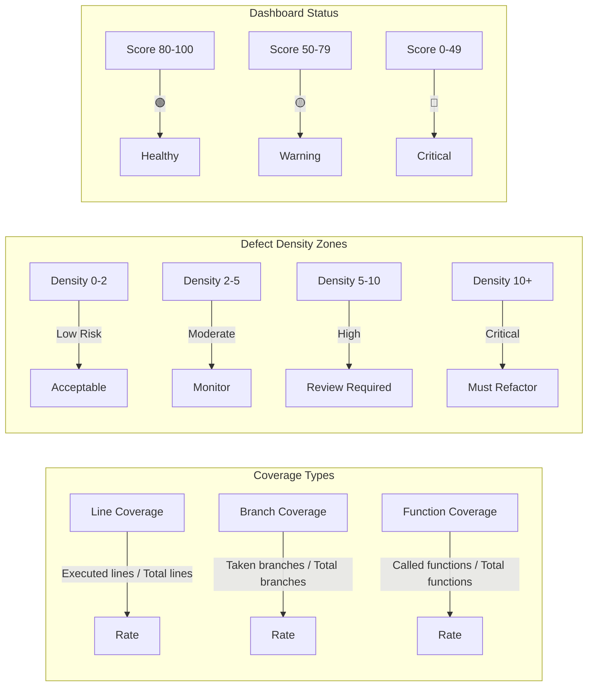
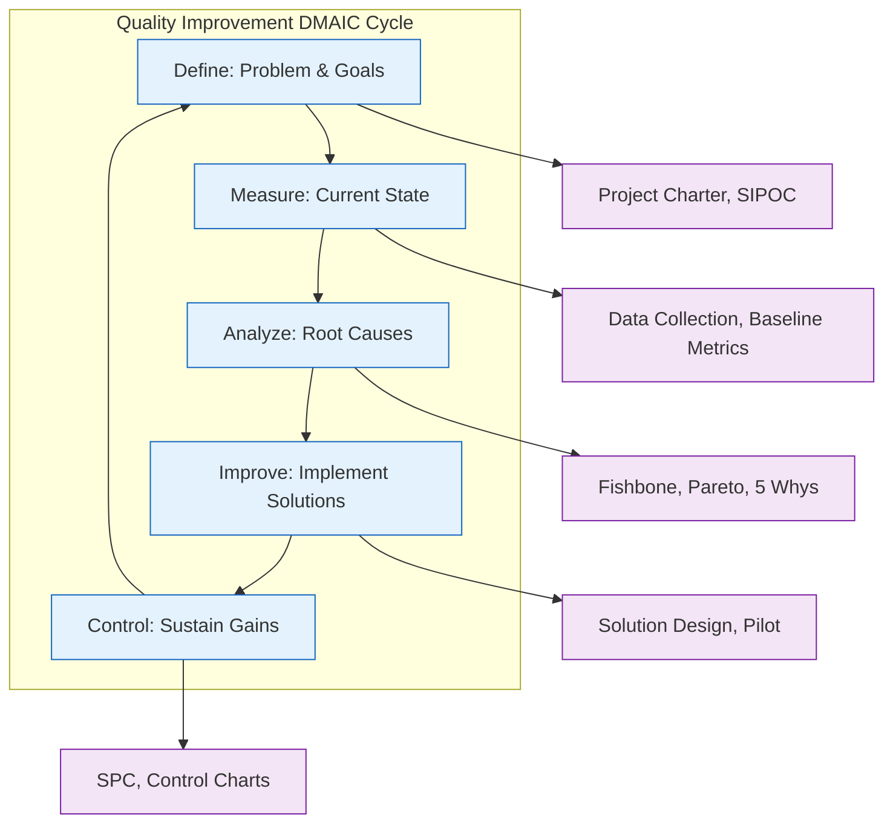

# Software Quality Management

## Learning Objectives

- [x] Explain the three components of software quality management
- [x] Apply quality standards (ISO 9001, CMMI, ISO 25010) to software projects
- [x] Differentiate between software quality assurance (QA) and quality control (QC)
- [x] Use quality review techniques including inspections and walkthroughs
- [x] Implement static analysis metrics and tools in TypeScript
- [x] Apply statistical process control to software quality
- [x] Measure quality using ISO 25010 characteristics
- [x] Build production-grade quality metric collection and evaluation tools

<!-- Image Gallery -->
<div style="display:flex;flex-wrap:wrap;gap:4px;margin:16px 0;padding:12px;background:#f8fafc;border-radius:8px;border:1px solid #e2e8f0;">
<a href="../../../assets/images/lessons/software-engineering/09-quality-management/hero.svg" target="_blank" rel="noopener">
  
</a>
<a href="../../../assets/images/lessons/software-engineering/09-quality-management/handwritten-notes.svg" target="_blank" rel="noopener">
  
</a>
<a href="../../../assets/images/lessons/software-engineering/09-quality-management/sticky-notes.svg" target="_blank" rel="noopener">
  
</a>
<a href="../../../assets/images/lessons/software-engineering/09-quality-management/visual-explanation.svg" target="_blank" rel="noopener">
  
</a>
<a href="../../../assets/images/lessons/software-engineering/09-quality-management/architecture.svg" target="_blank" rel="noopener">
  
</a>
<a href="../../../assets/images/lessons/software-engineering/09-quality-management/workflow.svg" target="_blank" rel="noopener">
  
</a>
<a href="../../../assets/images/lessons/software-engineering/09-quality-management/mindmap.svg" target="_blank" rel="noopener">
  
</a>
<a href="../../../assets/images/lessons/software-engineering/09-quality-management/comparison.svg" target="_blank" rel="noopener">
  
</a>
<a href="../../../assets/images/lessons/software-engineering/09-quality-management/cheatsheet.svg" target="_blank" rel="noopener">
  
</a>
<a href="../../../assets/images/lessons/software-engineering/09-quality-management/interview-quiz.svg" target="_blank" rel="noopener">
  
</a>
<a href="../../../assets/images/lessons/software-engineering/09-quality-management/social-card.svg" target="_blank" rel="noopener">
  
</a>
</div>
<!-- End Image Gallery -->

## Theory

### What is Software Quality?

Software quality is the degree to which a software product satisfies stated and implied needs. Quality is not merely the absence of defects — it encompasses the entire user experience, maintainability, performance, and security. Quality must be designed into the product from the start, not inspected in at the end.



### The Three Components of Quality Management

| Component | Focus | Activities | Verifies |
|-----------|-------|------------|----------|
| **Quality Planning** | Future quality activities | Define standards, set quality goals, identify processes | Plans |
| **Quality Assurance (QA)** | Process compliance | Audits, process checks, training | Processes |
| **Quality Control (QC)** | Product quality | Reviews, testing, static analysis | Products |

### Quality Models Comparison

Several quality models have been proposed over the decades. Each takes a different perspective on what constitutes software quality:

| Model | Year | Characteristics | Strengths | Weaknesses |
|-------|------|-----------------|-----------|------------|
| **McCall** | 1977 | 11 factors across 3 perspectives (product revision, transition, operations) | Pioneering, user-focused | Dated, overlaps between factors |
| **Boehm** | 1978 | 15 characteristics in hierarchical tree | Links to user needs | Complex, rarely used today |
| **ISO 9126** | 1991 | 6 characteristics, 27 sub-characteristics | International standard, broad adoption | Confusing sub-characteristic definitions |
| **ISO 25010** | 2011 | 8 characteristics, 31 sub-characteristics | Current standard, security included | Limited coverage of data quality |
| **FURPS** | 1987 | Functionality, Usability, Reliability, Performance, Supportability | Simple mnemonic | Lacks security explicitly |

**McCall's Quality Model (1977):**

McCall organized quality into three perspectives:
- **Product Revision** (ability to change): Maintainability, Flexibility, Testability
- **Product Transition** (ability to adapt to new environments): Portability, Reusability, Interoperability
- **Product Operations** (ability to run): Correctness, Reliability, Efficiency, Integrity, Usability

**Boehm's Quality Model (1978):**

Boehm presented a hierarchical model rooted in user needs:
- **As-is Utility:** Portability, Reliability, Efficiency
- **Maintainability:** Testability, Understandability, Modifiability
- **General Utility:** Clarity, Documented, Device Independence, Self-contained, Accuracy, Completeness, Consistency, Accountability

**FURPS+ Model (Rational/IBM):**

FURPS+ extends the basic FURPS categories with a `+` for design constraints:
- **F**unctionality: Feature set, security, capabilities
- **U**sability: Aesthetics, documentation, training
- **R**eliability: Frequency/severity of failure, recoverability, predictability
- **P**erformance: Speed, efficiency, resource consumption, scalability
- **S**upportability: Testability, maintainability, configurability, compatibility

### Quality Standards and Models

#### ISO 9001

ISO 9001 is a general quality management standard applicable to any organisation. Key principles relevant to software:

- **Customer focus:** Understanding customer needs
- **Leadership:** Establishing quality vision
- **Engagement of people:** Involving all team members
- **Process approach:** Managing activities as processes
- **Improvement:** Continuous improvement focus
- **Evidence-based decision making:** Data-driven quality
- **Relationship management:** Managing supplier relationships

ISO 9001:2015 uses the PDCA (Plan-Do-Check-Act) cycle and is process-based. Software organisations typically pair ISO 9001 with ISO 25010 for product quality and ISO 12207 for lifecycle processes.

#### CMMI (Capability Maturity Model Integration)



| Level | Name | Characteristics | Key Process Areas |
|-------|------|-----------------|-------------------|
| 1 | Initial | Processes unpredictable, ad hoc, reactive | None required |
| 2 | Managed | Project-level processes, basic project management | Requirements Management, Project Planning, Project Monitoring, Supplier Agreement Management, Measurement & Analysis, Process & Product Quality Assurance, Configuration Management |
| 3 | Defined | Organisation-wide standard processes | Requirements Development, Technical Solution, Product Integration, Verification, Validation, Organisational Process Focus, Organisational Process Definition, Organisational Training, Integrated Project Management, Risk Management, Decision Analysis & Resolution |
| 4 | Quantitatively Managed | Process measured and controlled statistically | Organisational Process Performance, Quantitative Project Management |
| 5 | Optimising | Continuous process improvement | Organisational Performance Management, Causal Analysis & Resolution |

#### Six Sigma for Software

Six Sigma is a data-driven methodology for eliminating defects. Applied to software:

- **DMAIC:** Define, Measure, Analyze, Improve, Control
- **Defect target:** 3.4 defects per million opportunities (DPMO)
- **Key roles:** Champions, Master Black Belts, Black Belts, Green Belts

Software adapts Six Sigma by treating KLOC, function points, or story points as "opportunities":

```
DPMO = (Number of Defects / (Opportunities per Unit × Number of Units)) × 1,000,000
Sigma Level = NORMSINV(1 - DPMO/1,000,000) + 1.5
```

| Sigma Level | DPMO | Cost of Quality (% of sales) |
|-------------|------|------------------------------|
| 2σ | 308,537 | 30-40% |
| 3σ | 66,807 | 20-30% |
| 4σ | 6,210 | 15-20% |
| 5σ | 233 | 10-15% |
| 6σ | 3.4 | <10% |

#### ISO/IEC 25010 Quality Model

ISO 25010 (replacing ISO 9126) defines eight quality characteristics:



### Quality Assurance vs Quality Control

| Aspect | Quality Assurance | Quality Control |
|--------|-------------------|-----------------|
| **Orientation** | Process-oriented | Product-oriented |
| **Timing** | Prevention (before) | Detection (during/after) |
| **Focus** | How work is done | What is produced |
| **Activities** | Audits, training, process definition | Testing, inspections, reviews |
| **Goal** | Prevent defects | Find defects |
| **Scope** | Entire development lifecycle | Specific deliverables |
| **Who** | All team members (process owners) | Testers, reviewers, QA analysts |
| **Measurement** | Process compliance % | Defect density, test pass rate |

### Quality Reviews: Inspections and Walkthroughs

#### Fagan Inspections

A structured, formal review process developed by Michael Fagan at IBM. Fagan discovered that inspections catch 60-70% of defects before testing, where the cost of fixing is 10-100x lower.



| Phase | Activities | Participants |
|-------|------------|--------------|
| **Planning** | Select material, schedule, assign roles | Moderator |
| **Overview** | Author introduces the material | All reviewers |
| **Preparation** | Individual review of material | All reviewers |
| **Inspection Meeting** | Systematic defect detection | All participants |
| **Rework** | Fix defects | Author |
| **Follow-up** | Verify fixes are correct | Moderator |

**Inspection Roles:**
- **Moderator:** Leads the inspection, ensures process compliance
- **Author:** Creator of the work product
- **Reviewers:** Domain experts who examine the product
- **Recorder:** Documents defects and decisions

**Inspection metrics:**
- **Defect detection rate:** % of total defects found during inspection
- **Preparation rate:** Pages/SLOC inspected per hour (target: 100-200 SLOC/h)
- **Defect density:** Defects per page or per KLOC
- **Inspection yield:** % of defects found before vs after inspection
- **Cost per defect:** Total inspection effort / defects found

#### Walkthroughs vs Inspections

| Aspect | Walkthrough | Inspection |
|--------|-------------|------------|
| Formality | Informal | Formal |
| Preparation time | Minimal | Significant |
| Data collection | None | Detailed defect data |
| Meeting length | Longer (presentation) | Shorter (focused) |
| Best for | Education, consensus | Defect detection |
| Defect detection rate | Low (~20%) | High (~70%) |
| Roles | Not predefined | Strictly defined |
| Documentation | Optional | Required - defect log, report |

#### Peer Review vs Code Review

| Aspect | Peer Review | Formal Code Review |
|--------|-------------|-------------------|
| When | Any time | Before merge |
| Duration | 15-30 min | 30-60 min |
| Tooling | Optional | Required (GitHub PR, Gerrit) |
| Depth | Surface level | Deep, every line |
| Checklist | Optional | Standardized |

### Static Analysis

Static analysis examines source code without executing it. Modern tools detect bug patterns, security vulnerabilities, style violations, and maintainability issues.

**Types of static analysis:**

| Type | Checks | Example Tools |
|------|--------|---------------|
| Style | Code formatting, naming conventions | ESLint, Prettier |
| Bug patterns | Null pointers, type mismatches, dead code | TypeScript compiler, SonarQube |
| Security | Injection, XSS, hardcoded secrets | CodeQL, Semgrep |
| Complexity | Cyclomatic complexity, depth of inheritance | SonarQube, Plato |
| Duplication | Copy-paste detection | PMD-CPD, jscpd |

**Cyclomatic Complexity:** `M = E - N + 2P`

Where E = number of edges, N = number of nodes, P = number of connected components in the control flow graph.

| Cyclomatic Complexity | Risk Assessment |
|----------------------|-----------------|
| 1-10 | Simple, low risk |
| 11-20 | Moderate complexity |
| 21-50 | High risk, difficult to test |
| 50+ | Untestable, must refactor |

### Statistical Process Control (SPC)

SPC uses statistical methods to monitor and control process quality. In software, it is applied to defect rates, test pass rates, and cycle times.

**Key SPC concepts:**
- **Control limits:** Upper (UCL) and lower (LCL) boundaries for acceptable variation
- **Common cause variation:** Natural process variation (expected)
- **Special cause variation:** Unusual events requiring investigation
- **Defect density:** `Defects per KLOC` or `Defects per FP`



**Control limit formulas:**
- UCL = μ + 3σ
- LCL = μ - 3σ
- Mean (μ) = average of sample means
- Sigma (σ) = standard deviation of sample means

**Control chart rules for special causes:**
1. One point beyond ±3σ
2. Two of three points beyond ±2σ (same side)
3. Four of five points beyond ±1σ (same side)
4. Eight consecutive points on one side of the mean
5. Six consecutive points trending up or down

### Process Quality Frameworks

#### CMMI Detailed Process Areas by Level

| PA ID | Process Area | Level | Category |
|-------|-------------|-------|----------|
| REQM | Requirements Management | 2 | Project Management |
| PP | Project Planning | 2 | Project Management |
| PMC | Project Monitoring & Control | 2 | Project Management |
| SAM | Supplier Agreement Management | 2 | Project Management |
| MA | Measurement & Analysis | 2 | Support |
| PPQA | Process & Product Quality Assurance | 2 | Support |
| CM | Configuration Management | 2 | Support |
| RD | Requirements Development | 3 | Engineering |
| TS | Technical Solution | 3 | Engineering |
| PI | Product Integration | 3 | Engineering |
| VER | Verification | 3 | Engineering |
| VAL | Validation | 3 | Engineering |
| OPF | Organisational Process Focus | 3 | Process Management |
| OPD | Organisational Process Definition | 3 | Process Management |
| OT | Organisational Training | 3 | Process Management |
| IPM | Integrated Project Management | 3 | Project Management |
| RSKM | Risk Management | 3 | Project Management |
| DAR | Decision Analysis & Resolution | 3 | Support |
| OPP | Organisational Process Performance | 4 | Process Management |
| QPM | Quantitative Project Management | 4 | Project Management |
| OPM | Organisational Performance Management | 5 | Process Management |
| CAR | Causal Analysis & Resolution | 5 | Support |

### Quality Metrics Framework

A comprehensive quality measurement program should span multiple dimensions:

| Dimension | Metrics | Collection Frequency | Typical Target |
|-----------|---------|---------------------|----------------|
| Defect Management | Defect density, defect arrival rate, defect closure rate | Per build | <5 defects/KLOC |
| Test Effectiveness | Code coverage, test pass rate, mutation score | Per CI run | >80% coverage |
| Code Health | Cyclomatic complexity, duplication %, maintainability index | Per commit | <15 complexity |
| Process | Velocity stability, cycle time, lead time | Per sprint | <10% variance |
| Customer | Customer satisfaction (CSAT), Net Promoter Score (NPS) | Per release | CSAT > 4.0/5.0 |
| Operational | Mean time to recover (MTTR), mean time between failures (MTBF) | Per incident | MTTR < 1h, MTBF > 30d |

### Quality Gates in CI/CD



## Examples

### Example 1: QualityMetricsCollector — Defect Density, MTBF, Reliability

This production-grade quality metrics collector computes defect density, mean time between failures (MTBF), and system reliability using exponential distribution models commonly used in reliability engineering.

```typescript
interface DefectRecord {
  id: string;
  module: string;
  severity: 'blocker' | 'critical' | 'major' | 'minor' | 'trivial';
  openedAt: Date;
  closedAt?: Date;
  introducedByRelease: string;
  foundInRelease: string;
  hoursToFix: number;
}

interface FailureEvent {
  timestamp: Date;
  service: string;
  durationMinutes: number;
  affectedUsers: number;
  rootCause: string;
}

interface QualityMetricsReport {
  defectDensity: { overall: number; perModule: Record<string, number>; perSeverity: Record<string, number> };
  reliability: { mtbf: number; mttr: number; availability: number };
  trend: { direction: 'improving' | 'declining' | 'stable'; changePercent: number };
  recommendations: string[];
}

class QualityMetricsCollector {
  private defects: DefectRecord[] = [];
  private failures: FailureEvent[] = [];

  public recordDefect(defect: DefectRecord): void {
    this.defects.push(defect);
  }

  public recordFailure(failure: FailureEvent): void {
    this.failures.push(failure);
  }

  public analyze(defects: DefectRecord[], failures: FailureEvent[], totalKsloc: number): QualityMetricsReport {
    const perModule: Record<string, number> = {};
    const perSeverity: Record<string, number> = {};

    for (const d of defects) {
      perModule[d.module] = (perModule[d.module] || 0) + 1;
      perSeverity[d.severity] = (perSeverity[d.severity] || 0) + 1;
    }

    const overallDefectDensity = totalKsloc > 0 ? defects.length / totalKsloc : 0;
    const moduleDensities: Record<string, number> = {};
    // In practice module KLOC data would come from AST analysis
    for (const [mod, count] of Object.entries(perModule)) {
      moduleDensities[mod] = count;
    }

    // MTBF: Mean Time Between Failures (in hours)
    let mtbf = 0;
    if (failures.length >= 2) {
      const sorted = [...failures].sort((a, b) => a.timestamp.getTime() - b.timestamp.getTime());
      let totalInterval = 0;
      for (let i = 1; i < sorted.length; i++) {
        totalInterval += sorted[i].timestamp.getTime() - sorted[i - 1].timestamp.getTime();
      }
      mtbf = totalInterval / (sorted.length - 1) / 3600000;
    }

    // MTTR: Mean Time To Recover (in hours)
    const mttr = failures.length > 0
      ? failures.reduce((s, f) => s + f.durationMinutes, 0) / failures.length / 60
      : 0;

    // Availability = MTBF / (MTBF + MTTR)
    const availability = mtbf + mttr > 0 ? mtbf / (mtbf + mttr) : 0;

    // Trend analysis (compare last 30 days vs previous 30 days)
    const now = Date.now();
    const recentDefects = defects.filter(d => d.openedAt.getTime() > now - 30 * 86400000);
    const olderDefects = defects.filter(d =>
      d.openedAt.getTime() <= now - 30 * 86400000 &&
      d.openedAt.getTime() > now - 60 * 86400000
    );
    const recentKsloc = totalKsloc * 0.5; // approximate
    const olderKsloc = totalKsloc * 0.5;
    const recentDensity = recentKsloc > 0 ? recentDefects.length / recentKsloc : 0;
    const olderDensity = olderKsloc > 0 ? olderDefects.length / olderKsloc : 0;
    const changePercent = olderDensity > 0 ? ((recentDensity - olderDensity) / olderDensity) * 100 : 0;
    const direction = changePercent < -10 ? 'improving' : changePercent > 10 ? 'declining' : 'stable';

    const recommendations: string[] = [];
    if (overallDefectDensity > 5) recommendations.push('Defect density exceeds 5/KLOC — invest in root cause analysis');
    if (mtbf < 24) recommendations.push('MTBF under 24 hours — critical reliability risk, implement chaos engineering');
    if (mttr > 2) recommendations.push('MTTR over 2 hours — improve runbooks and automate recovery');
    if (availability < 0.99) recommendations.push('Availability below 99% — review SLAs and implement redundancy');
    if (direction === 'declining') recommendations.push('Quality trend is declining — consider process changes and training');

    return {
      defectDensity: { overall: overallDefectDensity, perModule: moduleDensities, perSeverity },
      reliability: { mtbf: Math.round(mtbf * 100) / 100, mttr: Math.round(mttr * 100) / 100, availability: Math.round(availability * 10000) / 10000 },
      trend: { direction, changePercent: Math.round(changePercent * 100) / 100 },
      recommendations,
    };
  }

  public compareModules(moduleA: string, moduleB: string): string {
    const aDefects = this.defects.filter(d => d.module === moduleA);
    const bDefects = this.defects.filter(d => d.module === moduleB);
    const aCritical = aDefects.filter(d => d.severity === 'critical' || d.severity === 'blocker').length;
    const bCritical = bDefects.filter(d => d.severity === 'critical' || d.severity === 'blocker').length;
    return [
      `=== Module Quality Comparison: ${moduleA} vs ${moduleB} ===`,
      `${moduleA}: ${aDefects.length} defects (${aCritical} critical)`,
      `${moduleB}: ${bDefects.length} defects (${bCritical} critical)`,
      `Difference: ${Math.abs(aDefects.length - bDefects.length)} defects`,
      aDefects.length > bDefects.length
        ? `Recommendation: Focus QA efforts on ${moduleA}`
        : `Recommendation: Focus QA efforts on ${moduleB}`,
    ].join('\n');
  }
}

// Usage
const collector = new QualityMetricsCollector();
collector.recordDefect({
  id: 'DEF-001', module: 'auth', severity: 'critical',
  openedAt: new Date('2025-01-10'), introducedByRelease: 'v2.0', foundInRelease: 'v2.0', hoursToFix: 8,
});
collector.recordFailure({
  timestamp: new Date('2025-01-15'), service: 'auth-api',
  durationMinutes: 45, affectedUsers: 1200, rootCause: 'Connection pool exhaustion',
});
const report = collector.analyze(
  [/* defects */], [/* failures */], 50
);
console.log(report.reliability);
```

### Example 2: ISO25010Evaluator — Evaluate Against Each Quality Characteristic

This evaluator scores a software product against each of the eight ISO 25010 quality characteristics, aggregating sub-characteristic scores into a weighted quality index.

```typescript
type Characteristic =
  | 'functional_suitability'
  | 'reliability'
  | 'performance_efficiency'
  | 'operability'
  | 'security'
  | 'compatibility'
  | 'maintainability'
  | 'portability';

interface SubCharacteristic {
  name: string;
  score: number; // 0-100
  weight: number; // 0-1, sum of sub-weights per characteristic = 1
  evidence: string;
}

interface CharacteristicScore {
  characteristic: Characteristic;
  name: string;
  score: number;
  subCharacteristics: SubCharacteristic[];
  failsMinimum: boolean;
}

interface ISO25010Evaluation {
  scores: CharacteristicScore[];
  overallIndex: number;
  weakestAreas: string[];
  strongestAreas: string[];
  certificationReadiness: 'ready' | 'near' | 'far';
}

class ISO25010Evaluator {
  private readonly minimumThreshold = 50;
  private readonly passingThreshold = 70;

  public evaluate(data: Record<Characteristic, SubCharacteristic[]>): ISO25010Evaluation {
    const scores: CharacteristicScore[] = [];
    const allWeak: string[] = [];
    const allStrong: string[] = [];
    let weightedSum = 0;
    let totalWeight = 0;

    for (const [characteristic, subs] of Object.entries(data) as [Characteristic, SubCharacteristic[]][]) {
      const subSum = subs.reduce((s, sub) => s + sub.score * sub.weight, 0);
      const subWeight = subs.reduce((s, sub) => s + sub.weight, 0);
      const characteristicScore = subWeight > 0 ? subSum / subWeight : 0;
      const failsMinimum = subs.some(sub => sub.score < this.minimumThreshold * 0.5);

      const charName = characteristic.replace(/_/g, ' ').replace(/\b\w/g, l => l.toUpperCase());
      scores.push({
        characteristic,
        name: charName,
        score: Math.round(characteristicScore * 100) / 100,
        subCharacteristics: subs,
        failsMinimum,
      });

      if (characteristicScore < this.passingThreshold) {
        allWeak.push(charName);
      } else {
        allStrong.push(charName);
      }

      weightedSum += characteristicScore * subWeight;
      totalWeight += subWeight;
    }

    const overallIndex = totalWeight > 0 ? Math.round((weightedSum / totalWeight) * 100) / 100 : 0;

    const worst = [...scores].sort((a, b) => a.score - b.score).slice(0, 3);
    const best = [...scores].sort((a, b) => b.score - a.score).slice(0, 3);

    const readiness = overallIndex >= 85 ? 'ready' : overallIndex >= 60 ? 'near' : 'far';

    return {
      scores,
      overallIndex,
      weakestAreas: worst.map(s => s.name),
      strongestAreas: best.map(s => s.name),
      certificationReadiness: readiness,
    };
  }

  public generateCertificationReport(evaluation: ISO25010Evaluation): string {
    const scoreBar = (score: number) => {
      const filled = Math.round(score / 10);
      return '█'.repeat(filled) + '░'.repeat(10 - filled);
    };

    const lines = [
      '═══════════════════════════════════════════',
      '  ISO 25010 Quality Evaluation Report',
      '═══════════════════════════════════════════',
      '',
      `  Overall Quality Index: ${evaluation.overallIndex}/100`,
      `  Certification Readiness: ${evaluation.certificationReadiness.toUpperCase()}`,
      '',
      '  ─── Characteristic Scores ───',
      ...evaluation.scores.map(s =>
        `    ${s.name.padEnd(28)} ${scoreBar(s.score)} ${s.score.toFixed(1)}${s.failsMinimum ? ' ⚠' : ''}`
      ),
      '',
      `  ✅ Strongest: ${evaluation.strongestAreas.join(', ')}`,
      `  ⚠  Weakest: ${evaluation.weakestAreas.join(', ')}`,
      '',
      '  Recommendations:',
      ...evaluation.weakestAreas.map(a => `    - Improve ${a}`),
    ];
    return lines.join('\n');
  }
}

// Usage
const evaluator = new ISO25010Evaluator();
const data: Record<Characteristic, SubCharacteristic[]> = {
  functional_suitability: [
    { name: 'Functional Completeness', score: 85, weight: 0.4, evidence: 'All user stories implemented' },
    { name: 'Functional Correctness', score: 92, weight: 0.4, evidence: 'Zero critical bugs' },
    { name: 'Functional Appropriateness', score: 70, weight: 0.2, evidence: 'Some unused features' },
  ],
  reliability: [
    { name: 'Maturity', score: 78, weight: 0.3, evidence: 'MTBF of 720 hours' },
    { name: 'Availability', score: 95, weight: 0.3, evidence: '99.99% uptime' },
    { name: 'Fault Tolerance', score: 60, weight: 0.2, evidence: 'No redundancy on DB' },
    { name: 'Recoverability', score: 45, weight: 0.2, evidence: 'RTO > 4 hours' },
  ],
  performance_efficiency: [
    { name: 'Time Behaviour', score: 88, weight: 0.5, evidence: 'p95 < 200ms' },
    { name: 'Resource Utilisation', score: 75, weight: 0.3, evidence: 'Memory under 512MB' },
    { name: 'Capacity', score: 82, weight: 0.2, evidence: 'Supports 10K concurrent' },
  ],
  operability: [
    { name: 'Appropriateness Recognisability', score: 80, weight: 0.25, evidence: 'UX tested' },
    { name: 'Learnability', score: 85, weight: 0.25, evidence: '< 30 min to onboard' },
    { name: 'User Error Protection', score: 72, weight: 0.25, evidence: 'Input validation' },
    { name: 'Accessibility', score: 65, weight: 0.25, evidence: 'WCAG AA partial' },
  ],
  security: [
    { name: 'Confidentiality', score: 90, weight: 0.3, evidence: 'Encryption at rest/tran' },
    { name: 'Integrity', score: 88, weight: 0.3, evidence: 'Checksum verification' },
    { name: 'Non-Repudiation', score: 75, weight: 0.2, evidence: 'Audit logging' },
    { name: 'Accountability', score: 85, weight: 0.2, evidence: 'Access control' },
  ],
  compatibility: [
    { name: 'Co-existence', score: 80, weight: 0.5, evidence: 'Runs alongside v1' },
    { name: 'Interoperability', score: 85, weight: 0.5, evidence: 'REST API standard' },
  ],
  maintainability: [
    { name: 'Modularity', score: 70, weight: 0.2, evidence: 'Coupling metric moderate' },
    { name: 'Reusability', score: 65, weight: 0.2, evidence: 'Shared libs exist' },
    { name: 'Analysability', score: 60, weight: 0.2, evidence: 'Logging sparse' },
    { name: 'Modifiability', score: 75, weight: 0.2, evidence: 'Feature toggle system' },
    { name: 'Testability', score: 50, weight: 0.2, evidence: 'Coverage at 62%' },
  ],
  portability: [
    { name: 'Adaptability', score: 85, weight: 0.3, evidence: 'Config per env' },
    { name: 'Installability', score: 90, weight: 0.3, evidence: 'One-command deploy' },
    { name: 'Replaceability', score: 60, weight: 0.4, evidence: 'Tight coupling to DB' },
  ],
};
const evalResult = evaluator.evaluate(data);
console.log(evaluator.generateCertificationReport(evalResult));
```

### Example 3: FaganInspection — Inspection Process with Defect Logging and Tracking

A full Fagan inspection implementation with role management, defect logging, phase tracking, and productivity metrics.

```typescript
type InspectionPhase = 'planning' | 'overview' | 'preparation' | 'meeting' | 'rework' | 'followup';
type DefectSeverity = 'critical' | 'major' | 'minor' | 'cosmetic';
type DefectClass = 'logic' | 'interface' | 'data' | 'documentation' | 'standards' | 'performance';

interface Inspector {
  name: string;
  role: 'moderator' | 'author' | 'reviewer' | 'recorder';
  hoursSpent: number;
}

interface InspectionDefect {
  id: string;
  phaseFound: InspectionPhase;
  description: string;
  location: string;
  severity: DefectSeverity;
  defectClass: DefectClass;
  finder: string;
  status: 'open' | 'rework_complete' | 'verified' | 'deferred';
  fixVerificationDate?: Date;
  notes: string[];
}

interface InspectionMetrics {
  totalDefects: number;
  defectDensity: number;
  detectionRate: number;
  preparationRate: number;
  meetingEfficiency: number;
  costPerDefect: number;
  yield: number;
}

class FaganInspection {
  private readonly id: string;
  private readonly artifactName: string;
  private readonly artifactSize: number; // in units (pages, SLOC, etc.)
  private phase: InspectionPhase;
  private inspectors: Inspector[] = [];
  private defects: InspectionDefect[] = [];
  private phaseLog: { phase: InspectionPhase; startTime: Date; endTime?: Date }[] = [];
  private totalDefectsInArtifact = 0; // for yield calculation

  constructor(artifactName: string, artifactSize: number, moderator: string, author: string) {
    this.id = `FAGAN-${Date.now()}`;
    this.artifactName = artifactName;
    this.artifactSize = artifactSize;
    this.phase = 'planning';
    this.addInspector(moderator, 'moderator');
    this.addInspector(author, 'author');
    this.enterPhase('planning');
  }

  public addInspector(name: string, role: Inspector['role']): void {
    this.inspectors.push({ name, role, hoursSpent: 0 });
  }

  public recordHours(name: string, hours: number): void {
    const inspector = this.inspectors.find(i => i.name === name);
    if (inspector) inspector.hoursSpent += hours;
  }

  public enterPhase(phase: InspectionPhase): void {
    const previousEntry = this.phaseLog.find(p => p.phase === this.phase && !p.endTime);
    if (previousEntry) previousEntry.endTime = new Date();
    this.phase = phase;
    this.phaseLog.push({ phase, startTime: new Date() });
  }

  public logDefect(
    description: string,
    location: string,
    severity: DefectSeverity,
    defectClass: DefectClass,
    finder: string
  ): InspectionDefect {
    const defect: InspectionDefect = {
      id: `DEF-${this.defects.length + 1}`,
      phaseFound: this.phase,
      description,
      location,
      severity,
      defectClass,
      finder,
      status: 'open',
      notes: [],
    };
    this.defects.push(defect);
    return defect;
  }

  public markReworkComplete(defectId: string): void {
    const defect = this.findDefect(defectId);
    defect.status = 'rework_complete';
  }

  public verifyFix(defectId: string, verifier: string): void {
    const defect = this.findDefect(defectId);
    defect.status = 'verified';
    defect.fixVerificationDate = new Date();
    defect.notes.push(`Verified by ${verifier} on ${new Date().toISOString().split('T')[0]}`);
  }

  public setTotalDefects(total: number): void {
    this.totalDefectsInArtifact = total;
  }

  public computeMetrics(): InspectionMetrics {
    const totalEffort = this.inspectors.reduce((s, i) => s + i.hoursSpent, 0);
    const preparationHours = this.inspectors
      .filter(i => i.role === 'reviewer' || i.role === 'moderator')
      .reduce((s, i) => s + i.hoursSpent, 0);
    const meetingEntry = this.phaseLog.find(p => p.phase === 'meeting');
    const meetingHours = meetingEntry && meetingEntry.endTime
      ? (meetingEntry.endTime.getTime() - meetingEntry.startTime.getTime()) / 3600000
      : 0;

    // Detection rate
    const detectionRate = this.totalDefectsInArtifact > 0
      ? this.defects.length / this.totalDefectsInArtifact
      : 0;

    // Defect density (defects per unit)
    const defectDensity = this.artifactSize > 0 ? this.defects.length / this.artifactSize : 0;

    // Preparation rate (units per hour per reviewer)
    const reviewerCount = this.inspectors.filter(i => i.role === 'reviewer').length;
    const prepRate = preparationHours > 0
      ? (this.artifactSize * reviewerCount) / preparationHours
      : 0;

    // Meeting efficiency (defects found per meeting hour)
    const meetingEfficiency = meetingHours > 0 ? this.defects.length / meetingHours : 0;

    // Cost per defect
    const costPerDefect = this.defects.length > 0 ? totalEffort / this.defects.length : 0;

    // Yield (% of total defects found)
    const yield_ = this.totalDefectsInArtifact > 0
      ? (this.defects.length / this.totalDefectsInArtifact) * 100
      : 0;

    return {
      totalDefects: this.defects.length,
      defectDensity: Math.round(defectDensity * 100) / 100,
      detectionRate: Math.round(detectionRate * 100) / 100,
      preparationRate: Math.round(prepRate * 100) / 100,
      meetingEfficiency: Math.round(meetingEfficiency * 100) / 100,
      costPerDefect: Math.round(costPerDefect * 100) / 100,
      yield: Math.round(yield_ * 100) / 100,
    };
  }

  public generateReport(): string {
    const metrics = this.computeMetrics();
    const severityBreakdown: Record<string, number> = {};
    const classBreakdown: Record<string, number> = {};
    for (const d of this.defects) {
      severityBreakdown[d.severity] = (severityBreakdown[d.severity] || 0) + 1;
      classBreakdown[d.defectClass] = (classBreakdown[d.defectClass] || 0) + 1;
    }

    const lines = [
      '═══════════════════════════════════════════',
      `  Fagan Inspection Report: ${this.artifactName}`,
      `  ID: ${this.id}`,
      '═══════════════════════════════════════════',
      '',
      '  ─── Metrics ───',
      `  Artifact Size: ${this.artifactSize} units`,
      `  Total Defects Found: ${metrics.totalDefects}`,
      `  Defect Density: ${metrics.defectDensity}/unit`,
      `  Detection Rate: ${(metrics.detectionRate * 100).toFixed(1)}%`,
      `  Yield: ${metrics.yield.toFixed(1)}%`,
      `  Prep Rate: ${metrics.preparationRate} units/hour`,
      `  Meeting Efficiency: ${metrics.meetingEfficiency} defects/hour`,
      `  Cost Per Defect: ${metrics.costPerDefect} hours`,
      '',
      '  ─── Severity Breakdown ───',
      ...Object.entries(severityBreakdown).map(([sev, count]) =>
        `    ${sev.toUpperCase().padEnd(12)} ${count}`
      ),
      '',
      '  ─── Defect Class Breakdown ───',
      ...Object.entries(classBreakdown).map(([cls, count]) =>
        `    ${cls.padEnd(16)} ${count}`
      ),
      '',
      '  ─── All Defects ───',
      ...this.defects.map(d =>
        `    ${d.id} | ${d.severity.toUpperCase()} | ${d.location} | ${d.description} | ${d.status}`
      ),
      '',
      '  ─── Team Effort ───',
      ...this.inspectors.map(i =>
        `    ${i.role.padEnd(12)} ${i.name.padEnd(20)} ${i.hoursSpent}h`
      ),
    ];
    return lines.join('\n');
  }

  public getDefectById(id: string): InspectionDefect | undefined {
    return this.defects.find(d => d.id === id);
  }

  public getDefectsByStatus(status: InspectionDefect['status']): InspectionDefect[] {
    return this.defects.filter(d => d.status === status);
  }

  private findDefect(id: string): InspectionDefect {
    const defect = this.defects.find(d => d.id === id);
    if (!defect) throw new Error(`Defect ${id} not found`);
    return defect;
  }

  public close(): InspectionMetrics {
    this.enterPhase('followup');
    return this.computeMetrics();
  }
}

// Usage
const inspection = new FaganInspection('auth-module.ts', 450, 'Alice (Mod)', 'Bob (Author)');
inspection.addInspector('Charlie', 'reviewer');
inspection.addInspector('Diana', 'reviewer');
inspection.addInspector('Eve', 'recorder');

inspection.recordHours('Alice (Mod)', 2);
inspection.recordHours('Bob (Author)', 3);
inspection.recordHours('Charlie', 3.5);
inspection.recordHours('Diana', 4);
inspection.recordHours('Eve', 2.5);

inspection.enterPhase('overview');
inspection.enterPhase('preparation');
inspection.enterPhase('meeting');

inspection.logDefect('Null pointer on line 42 when user is unauthenticated', 'src/auth.ts:42', 'critical', 'logic', 'Charlie');
inspection.logDefect('Inconsistent naming convention (camelCase vs snake_case)', 'src/auth.ts:15-20', 'minor', 'standards', 'Diana');
inspection.logDefect('Missing error handling for token expiry', 'src/auth.ts:88', 'major', 'interface', 'Charlie');
inspection.logDefect('Typo in error message "authentication"', 'src/auth.ts:101', 'cosmetic', 'documentation', 'Eve');
inspection.logDefect('SQL injection risk in raw query', 'src/auth.ts:200', 'critical', 'logic', 'Diana');
inspection.logDefect('Dead code: unused import on line 1', 'src/auth.ts:1', 'minor', 'standards', 'Charlie');
inspection.logDefect('Session timeout not configurable', 'src/auth.ts:155', 'major', 'interface', 'Eve');
inspection.logDefect('Logging sensitive data (password hash)', 'src/auth.ts:300', 'critical', 'data', 'Diana');

inspection.setTotalDefects(12);
const metrics = inspection.close();
console.log(inspection.generateReport());
```

### Example 4: Quality Metric Collector — Cyclomatic Complexity, Coverage, Gates

```typescript
interface QualityMetrics {
  cyclomaticComplexity: number;
  linesOfCode: number;
  commentDensity: number;
  testCoverage: number;
  duplicateCodeRate: number;
}

interface QualityGates {
  maxComplexity: number;
  minCoverage: number;
  maxDuplication: number;
}

class QualityAggregator {
  private readonly gates: QualityGates;

  constructor(gates: QualityGates) {
    this.gates = gates;
  }

  public evaluate(metrics: QualityMetrics): {
    passed: boolean;
    violations: string[];
    score: number;
  } {
    const violations: string[] = [];

    if (metrics.cyclomaticComplexity > this.gates.maxComplexity) {
      violations.push(`Complexity ${metrics.cyclomaticComplexity} exceeds ${this.gates.maxComplexity}`);
    }
    if (metrics.testCoverage < this.gates.minCoverage) {
      violations.push(`Coverage ${(metrics.testCoverage * 100).toFixed(1)}% below ${(this.gates.minCoverage * 100).toFixed(0)}%`);
    }
    if (metrics.duplicateCodeRate > this.gates.maxDuplication) {
      violations.push(`Duplication ${(metrics.duplicateCodeRate * 100).toFixed(1)}% exceeds ${(this.gates.maxDuplication * 100).toFixed(0)}%`);
    }

    const complexityScore = Math.max(0, 100 - (metrics.cyclomaticComplexity / this.gates.maxComplexity) * 100);
    const coverageScore = metrics.testCoverage / this.gates.minCoverage * 100;
    const duplicationScore = Math.max(0, 100 - (metrics.duplicateCodeRate / this.gates.maxDuplication) * 100);
    const score = Math.round(complexityScore * 0.3 + coverageScore * 0.4 + duplicationScore * 0.3);

    return { passed: violations.length === 0, violations, score };
  }
}
```

### Example 5: Quality Metrics Dashboard

The quality metrics dashboard aggregates multiple quality dimensions into a single scoreboard, enabling teams to track trends and detect regressions at a glance.

```typescript
interface MetricDefinition {
  name: string;
  value: number;
  unit: string;
  threshold: { warning: number; critical: number };
  direction: 'lower_is_better' | 'higher_is_better';
}

enum DashboardStatus {
  HEALTHY = 'healthy',
  WARNING = 'warning',
  CRITICAL = 'critical',
}

interface DashboardEntry {
  metric: string;
  value: string;
  status: DashboardStatus;
  trend: 'up' | 'down' | 'flat';
}

class QualityDashboard {
  private readonly history: Map<string, number[]> = new Map();

  public evaluate(metrics: MetricDefinition[]): {
    entries: DashboardEntry[];
    overallStatus: DashboardStatus;
    score: number;
  } {
    let totalScore = 0;
    const entries: DashboardEntry[] = [];

    for (const m of metrics) {
      this.pushHistory(m.name, m.value);
      const status = this.computeStatus(m);
      const trend = this.computeTrend(m.name);
      const statusWeight = status === DashboardStatus.HEALTHY ? 1
        : status === DashboardStatus.WARNING ? 0.5 : 0;
      totalScore += statusWeight;
      entries.push({ metric: m.name, value: `${m.value}${m.unit}`, status, trend });
    }

    const overallScore = metrics.length > 0 ? Math.round((totalScore / metrics.length) * 100) : 0;
    const overallStatus = overallScore >= 80 ? DashboardStatus.HEALTHY
      : overallScore >= 50 ? DashboardStatus.WARNING : DashboardStatus.CRITICAL;

    return { entries, overallStatus, score: overallScore };
  }

  private computeStatus(m: MetricDefinition): DashboardStatus {
    const { value, threshold, direction } = m;
    const isWorse = direction === 'lower_is_better'
      ? (v: number, t: number) => v > t
      : (v: number, t: number) => v < t;
    if (isWorse(value, threshold.critical)) return DashboardStatus.CRITICAL;
    if (isWorse(value, threshold.warning)) return DashboardStatus.WARNING;
    return DashboardStatus.HEALTHY;
  }

  private computeTrend(name: string): 'up' | 'down' | 'flat' {
    const values = this.history.get(name);
    if (!values || values.length < 3) return 'flat';
    const recent = values.slice(-5);
    const half = Math.floor(recent.length / 2);
    const firstHalfAvg = recent.slice(0, half).reduce((a, b) => a + b, 0) / half;
    const secondHalfAvg = recent.slice(half).reduce((a, b) => a + b, 0) / (recent.length - half);
    const diff = secondHalfAvg - firstHalfAvg;
    const threshold = Math.max(0.01, Math.abs(firstHalfAvg) * 0.02);
    if (Math.abs(diff) < threshold) return 'flat';
    return diff > 0 ? 'up' : 'down';
  }

  private pushHistory(name: string, value: number): void {
    if (!this.history.has(name)) this.history.set(name, []);
    this.history.get(name)!.push(value);
    if (this.history.get(name)!.length > 100) this.history.get(name)!.shift();
  }

  public renderDashboard(entries: DashboardEntry[], overallStatus: DashboardStatus, score: number): string {
    const statusIcon = (s: DashboardStatus) =>
      s === DashboardStatus.HEALTHY ? '🟢' : s === DashboardStatus.WARNING ? '🟡' : '🔴';
    const trendIcon = (t: 'up' | 'down' | 'flat') =>
      t === 'up' ? '▲' : t === 'down' ? '▼' : '─';
    const rows = entries.map(e =>
      `  ${statusIcon(e.status)} ${trendIcon(e.trend)} ${e.metric.padEnd(25)} ${e.value.padEnd(12)} ${e.status}`
    ).join('\n');
    return [
      '=== Quality Dashboard ===',
      `  Overall Score: ${score}/100 ${statusIcon(overallStatus)}`,
      `  Overall Status: ${overallStatus.toUpperCase()}`,
      '  ' + '─'.repeat(55),
      rows,
    ].join('\n');
  }
}
```

### Example 6: Cyclomatic Complexity Calculator

```typescript
enum NodeType {
  SEQUENCE, DECISION, LOOP, LOGICAL, CATCH,
}

interface ControlFlowNode {
  id: number;
  type: NodeType;
  children: number[];
}

class ComplexityAnalyzer {
  public calculate(nodes: ControlFlowNode[]): number {
    const edges = nodes.reduce((sum, n) => sum + n.children.length, 0);
    const vertexCount = nodes.length;
    const predicateCount = nodes.filter(
      (n) => n.type === NodeType.DECISION || n.type === NodeType.LOOP || n.type === NodeType.CATCH
    ).length;
    const cyclomatic = edges - vertexCount + 2;
    const alternativeFormula = 1 + predicateCount;
    return Math.max(cyclomatic, alternativeFormula);
  }

  public static async analyzeFile(sourceCode: string): Promise<{ function: string; complexity: number; risk: string }[]> {
    const lines = sourceCode.split('\n');
    const functions: { function: string; complexity: number; risk: string }[] = [];
    let currentFunction = '';
    let predicates = 0;
    let inFunction = false;

    for (const line of lines) {
      const trimmed = line.trim();
      if (trimmed.startsWith('function ') || trimmed.match(/^\w+\s*\(.*\)\s*{/)) {
        if (inFunction) {
          functions.push({ function: currentFunction, complexity: predicates + 1, risk: this.riskLevel(predicates + 1) });
        }
        currentFunction = trimmed.split('{')[0].trim();
        predicates = 0;
        inFunction = true;
      }
      if (inFunction) {
        if (trimmed.startsWith('if ') || trimmed.startsWith('else if ')) predicates++;
        if (trimmed.startsWith('for ') || trimmed.startsWith('while ')) predicates++;
        if (trimmed.startsWith('case ')) predicates++;
        if (trimmed.match(/\|\||&&/)) predicates++;
        if (trimmed.startsWith('catch ')) predicates++;
      }
      if (trimmed === '}' && inFunction) {
        functions.push({ function: currentFunction, complexity: predicates + 1, risk: this.riskLevel(predicates + 1) });
        inFunction = false;
      }
    }
    return functions;
  }

  private static riskLevel(complexity: number): string {
    if (complexity <= 10) return 'Low';
    if (complexity <= 20) return 'Moderate';
    if (complexity <= 50) return 'High';
    return 'Untestable';
  }
}
```

### Example 7: Defect Density Analyzer

```typescript
interface ModuleDefectData {
  moduleName: string;
  linesOfCode: number;
  defects: { id: string; severity: 'critical' | 'major' | 'minor' | 'trivial'; introducedInRelease: string }[];
}

interface DensityReportEntry {
  module: string;
  ksloc: number;
  defectCount: number;
  density: number;
  severityBreakdown: Record<string, number>;
  riskLevel: 'low' | 'moderate' | 'high' | 'critical';
}

class DefectDensityAnalyzer {
  public analyzeModules(modules: ModuleDefectData[]): DensityReportEntry[] {
    return modules.map(mod => {
      const ksloc = mod.linesOfCode / 1000;
      const defectCount = mod.defects.length;
      const density = ksloc > 0 ? defectCount / ksloc : 0;
      const breakdown: Record<string, number> = {};
      for (const d of mod.defects) breakdown[d.severity] = (breakdown[d.severity] || 0) + 1;
      const riskLevel = density <= 2 ? 'low' : density <= 5 ? 'moderate' : density <= 10 ? 'high' : 'critical';
      return {
        module: mod.moduleName, ksloc: Math.round(ksloc * 100) / 100, defectCount,
        density: Math.round(density * 100) / 100, severityBreakdown: breakdown, riskLevel,
      };
    });
  }

  public identifyHotspots(entries: DensityReportEntry[], threshold = 5): DensityReportEntry[] {
    return entries.filter(e => e.density > threshold).sort((a, b) => b.density - a.density);
  }

  public releaseTrend(allModules: ModuleDefectData[], releases: string[]): { release: string; totalDefects: number; totalKsloc: number; density: number }[] {
    return releases.map(release => {
      let totalDefects = 0;
      let totalKsloc = 0;
      for (const mod of allModules) {
        const releaseDefects = mod.defects.filter(d => d.introducedInRelease === release);
        totalDefects += releaseDefects.length;
        totalKsloc += mod.linesOfCode / 1000;
      }
      return {
        release, totalDefects, totalKsloc: Math.round(totalKsloc * 100) / 100,
        density: totalKsloc > 0 ? Math.round((totalDefects / totalKsloc) * 100) / 100 : 0,
      };
    });
  }

  public generateReport(entries: DensityReportEntry[], trend: { release: string; density: number }[]): string {
    const header = '=== Defect Density Report ===\n';
    const tableHeader = `${'Module'.padEnd(20)} ${'KS LOC'.padEnd(8)} ${'Defects'.padEnd(8)} ${'Density'.padEnd(8)} ${'Risk'}`;
    const separator = '─'.repeat(60);
    const rows = entries.map(e =>
      `${e.module.padEnd(20)} ${String(e.ksloc).padEnd(8)} ${String(e.defectCount).padEnd(8)} ${String(e.density).padEnd(8)} ${e.riskLevel.toUpperCase()}`
    ).join('\n');
    const hotspots = entries.filter(e => e.density > 5);
    const hotspotSection = hotspots.length > 0
      ? `\n\n⚠ Hotspots (density > 5):\n${hotspots.map(h => `  - ${h.module} (${h.density} defects/KLOC)`).join('\n')}`
      : '\n\n✓ No hotspots detected';
    const trendLines = trend.map(t => `  ${t.release.padEnd(12)} ${t.density} defects/KLOC`).join('\n');
    const trendSection = `\n\n=== Density Trend ===\n${trendLines}`;
    return [header, tableHeader, separator, rows, hotspotSection, trendSection].join('\n');
  }
}
```

### Real-World Case Studies

**Case Study 1: Toyota — Quality at Scale**

Toyota's quality management system, which inspired Lean manufacturing, demonstrates quality principles at industrial scale. Their "Andon Cord" system empowers any worker to stop the production line if a defect is found — analogous to "stop the line" culture in software. Toyota's defect rate of <10 parts per million (PPM) inspired Six Sigma. For software, this translates to stopping the build when tests fail and empowering any developer to block a release.

**Case Study 2: NASA — Software Quality in Safety-Critical Systems**

NASA's Space Shuttle software (developed by IBM) had a defect rate of 0.1 defects per KLOC — 50x better than industry average. They achieved this through:
- **Formal inspections:** Every line of code was inspected by 4+ people
- **Independent V&V:** Separate team verified all requirements traceability
- **Static analysis:** Rigorous use of tools before every build
- **Zero-defect policy:** No known defects were allowed in flight software

The cost of this quality was $1,000 per line of code, but the cost of failure was unthinkable.

**Case Study 3: Microsoft — Quality Transformation with Windows**

Microsoft's Windows division underwent a major quality transformation from 2012-2015, moving from "ship when ready" to predictable quality releases. They implemented:
- **Quality gates** in build pipeline
- **Code coverage** requirements (80%+)
- **Static analysis** mandatory for check-in
- **Defect density tracking** per feature team
- **Customer-connected telemetry** for real-world quality monitoring

Result: Windows 10 had 60% fewer crashes than Windows 8, with 50% lower defect density.

### Additional Mermaid Diagrams







### TypeScript: Quality Management Tools

```typescript
// === Quality Score Calculator ===
interface QualityDimension { name: string; weight: number; score: number; }
function calculateQualityIndex(dimensions: QualityDimension[]): { overall: number; breakdown: QualityDimension[] } {
  const totalWeight = dimensions.reduce((s, d) => s + d.weight, 0);
  const weightedSum = dimensions.reduce((s, d) => s + d.weight * d.score, 0);
  const breakdown = dimensions.map(d => ({ ...d, weighted: d.weight * d.score / totalWeight }));
  return { overall: totalWeight > 0 ? weightedSum / totalWeight : 0, breakdown: dimensions };
}
const qualityDims: QualityDimension[] = [
  { name: "Reliability", weight: 30, score: 85 },
  { name: "Performance", weight: 25, score: 72 },
  { name: "Security", weight: 25, score: 90 },
  { name: "Maintainability", weight: 20, score: 78 },
];
console.log(calculateQualityIndex(qualityDims));

// === Defect Density Analyzer ===
function defectDensity(defects: number, kloc: number): { density: number; severity: "low" | "medium" | "high" } {
  const density = kloc > 0 ? defects / kloc : 0;
  const severity = density < 5 ? "low" : density < 15 ? "medium" : "high";
  return { density: Math.round(density * 100) / 100, severity };
}
console.log(defectDensity(42, 10));

// === Quality Gate Checker ===
interface QualityGate { metric: string; operator: ">" | ">=" | "<" | "<=" | "=="; threshold: number; }
function checkGates(gates: QualityGate[], measurements: Record<string, number>): { passed: boolean; failures: string[] } {
  const failures: string[] = [];
  for (const gate of gates) {
    const value = measurements[gate.metric];
    if (value === undefined) { failures.push(`${gate.metric}: not measured`); continue; }
    const pass = gate.operator === ">" ? value > gate.threshold
      : gate.operator === ">=" ? value >= gate.threshold
      : gate.operator === "<" ? value < gate.threshold
      : gate.operator === "<=" ? value <= gate.threshold
      : value === gate.threshold;
    if (!pass) failures.push(`${gate.metric}: ${value} ${gate.operator} ${gate.threshold} failed`);
  }
  return { passed: failures.length === 0, failures };
}
const gates: QualityGate[] = [
  { metric: "testCoverage", operator: ">=", threshold: 80 },
  { metric: "complexity", operator: "<=", threshold: 15 },
  { metric: "duplications", operator: "<", threshold: 5 },
];
const measurements = { testCoverage: 85, complexity: 12, duplications: 3 };
console.log(checkGates(gates, measurements));

// === SPC Control Chart Calculator ===
interface ControlLimits { mean: number; upper: number; lower: number; }
function calculateControlLimits(values: number[]): ControlLimits {
  const mean = values.reduce((s, v) => s + v, 0) / values.length;
  const std = Math.sqrt(values.reduce((s, v) => s + (v - mean) ** 2, 0) / values.length);
  return { mean: Math.round(mean * 100) / 100, upper: Math.round((mean + 3 * std) * 100) / 100, lower: Math.round(Math.max(0, mean - 3 * std) * 100) / 100 };
}
const sprintVelocities = [30, 32, 28, 35, 29, 31, 33, 27];
console.log(calculateControlLimits(sprintVelocities));

// === Fagan Inspection Calculator ===
function faganEfficiency(defectsFound: number, totalDefects: number, preparationHours: number, meetingHours: number): { detectionRate: number; costPerDefect: number } {
  return {
    detectionRate: totalDefects > 0 ? defectsFound / totalDefects : 0,
    costPerDefect: defectsFound > 0 ? (preparationHours + meetingHours) / defectsFound : 0,
  };
}
console.log(faganEfficiency(8, 12, 4, 2));

// === CMMI Maturity Checker ===
type CMMILevel = 1 | 2 | 3 | 4 | 5;
const cmmiPractices: Record<CMMILevel, string[]> = {
  1: ["Basic project management", "Ad hoc processes"],
  2: ["Requirements management", "Project planning", "Project monitoring", "Configuration management"],
  3: ["Requirements development", "Technical solution", "Product integration", "Verification", "Validation", "Organisational process focus"],
  4: ["Organisational process performance", "Quantitative project management"],
  5: ["Organisational performance management", "Causal analysis and resolution"],
};
function checkCMMILevel(implemented: string[]): CMMILevel {
  for (let level = 5; level >= 2; level--) {
    const practices = cmmiPractices[level as CMMILevel];
    if (practices.every(p => implemented.some(i => i.includes(p)))) return level as CMMILevel;
  }
  return 1;
}
const orgPractices = ["Requirements management", "Project planning", "Project monitoring", "Configuration management", "Technical solution"];
console.log(`CMMI Level: ${checkCMMILevel(orgPractices)}`);

// === Reliability Prediction (Exponential Distribution) ===
function predictReliability(mtbf: number, missionHours: number): { reliability: number; failureProbability: number } {
  const failureRate = 1 / mtbf;
  const reliability = Math.exp(-failureRate * missionHours);
  return {
    reliability: Math.round(reliability * 10000) / 10000,
    failureProbability: Math.round((1 - reliability) * 10000) / 10000,
  };
}
console.log(predictReliability(720, 24)); // Reliability over 24h with 30-day MTBF
```

## Summary

Software quality management is a multi-faceted discipline that spans planning, assurance, control, and continuous improvement. Quality models like McCall (1977), Boehm (1978), FURPS (1987), and ISO 25010 (2011) provide structured frameworks for defining and evaluating software quality across dimensions such as functional suitability, reliability, performance, security, maintainability, and portability. Process quality frameworks like CMMI (with its five maturity levels) and Six Sigma (with DMAIC) guide organisations in maturing their quality practices from ad hoc to quantitatively managed and continuously optimising.

At the tactical level, formal inspections such as Fagan inspections catch 60-70% of defects before testing at substantially lower cost. Static analysis tools enforce coding standards, detect bug patterns, and identify security vulnerabilities automatically. Statistical process control (SPC) distinguishes common cause from special cause variation, enabling data-driven quality decisions. Quality gates integrated into CI/CD pipelines (lint → test → coverage → security → build → integration → performance) prevent quality degradation from reaching production.

Practical tools like the QualityMetricsCollector (computing defect density, MTBF, and reliability), ISO25010Evaluator (scoring against all eight characteristics), and FaganInspection (managing the full inspection lifecycle with defect tracking and metrics) demonstrate how to operationalise quality management. Real-world cases from Toyota (Andon Cord culture), NASA (0.1 defects/KLOC through formal inspections and independent V&V), and Microsoft (60% crash reduction through quality gates and telemetry) show that systematic quality investment pays dividends in reliability, customer satisfaction, and reduced cost of rework.

## Practical Takeaways

1. **Quality must be planned, not inspected in** — allocate dedicated time for quality activities in every sprint
2. **Process quality drives product quality** — fix the process, and product defects decrease predictably
3. **Inspections catch defects cheaper than testing** — the cost of fixing a bug increases exponentially through the lifecycle (1:10:100 rule at requirements:development:production)
4. **Static analysis is cheap insurance** — run linters, type checkers, and vulnerability scanning as part of every CI build
5. **Track quality metrics over time** — trends reveal process degradation before it becomes critical; use control charts
6. **Automate quality checks** — manual quality control does not scale across teams or releases
7. **Use multiple quality models** — combine ISO 25010 for product quality with CMMI for process maturity
8. **Quality is everyone's responsibility** — developers, testers, product owners, and operations all contribute to quality

## Chapter Quiz

| Question | Answer | Explanation |
|----------|--------|-------------|
| Q1: What is the primary difference between quality assurance and quality control? | B | QA focuses on process compliance (prevention), QC focuses on product verification (detection) |
| Q2: The CMMI level that requires organisation-wide standard processes is: | B | Level 3 (Defined) establishes standard processes across the organisation, beyond Level 2's project-level focus |
| Q3: In Fagan inspections, the participant who leads the process is called the: | C | The moderator leads the inspection, ensures process compliance, and manages the meeting flow |
| Q4: What cyclomatic complexity value is considered high risk and difficult to test? | C | Complexity 21-50 is high risk — requires significant refactoring to achieve adequate test coverage |
| Q5: ISO 25010 defines how many quality characteristics? | C | Eight characteristics: functional suitability, reliability, performance efficiency, operability, security, compatibility, maintainability, portability |

## Exercises

<details>
<summary><b>Exercise 1:</b> Implement an SPC control chart monitor that tracks daily build failure rates across 30 days. Use the Nelson rules to detect special cause variation and generate alerts.</summary>

```typescript
interface DailyBuildData {
  day: number;
  totalBuilds: number;
  failedBuilds: number;
}
interface SPCRuleViolation {
  rule: number;
  description: string;
  severity: 'warning' | 'critical';
}
class SPCMonitor {
  public analyze(data: DailyBuildData[]): { mean: number; ucl: number; lcl: number; violations: SPCRuleViolation[] } {
    const failureRates = data.map(d => d.totalBuilds > 0 ? d.failedBuilds / d.totalBuilds : 0);
    const n = failureRates.length;
    const mean = failureRates.reduce((a, b) => a + b, 0) / n;
    const std = Math.sqrt(failureRates.reduce((sq, v) => sq + (v - mean) ** 2, 0) / n);
    const ucl = Math.min(1, mean + 3 * std);
    const lcl = Math.max(0, mean - 3 * std);
    const violations: SPCRuleViolation[] = [];
    // Rule 1: One point beyond 3σ
    failureRates.forEach((rate, i) => {
      if (rate > ucl || rate < lcl) {
        violations.push({ rule: 1, description: `Day ${i+1}: ${(rate*100).toFixed(1)}% beyond control limits`, severity: 'critical' });
      }
    });
    // Rule 2: Eight consecutive points on same side
    for (let i = 7; i < n; i++) {
      const slice = failureRates.slice(i-7, i+1);
      if (slice.every(v => v >= mean) || slice.every(v => v <= mean)) {
        violations.push({ rule: 2, description: `Days ${i-7+1}-${i+1}: 8 consecutive points on one side`, severity: 'warning' });
      }
    }
    return { mean, ucl, lcl, violations };
  }
}
const monitor = new SPCMonitor();
const days = Array.from({ length: 30 }, (_, i) => ({
  day: i+1, totalBuilds: 20, failedBuilds: Math.random() < 0.1 ? Math.floor(Math.random() * 6) : Math.floor(Math.random() * 2)
}));
console.log(monitor.analyze(days));
```
</details>

<details>
<summary><b>Exercise 2:</b> Create a quality improvement roadmap planner that takes current CMMI level and target level and generates a month-by-month improvement plan with process areas, training, and metrics.</summary>

```typescript
interface ImprovementPhase {
  month: number;
  processAreas: string[];
  training: string[];
  metrics: string[];
  tools: string[];
  expectedOutcome: string;
}
class CMMIRoadmapPlanner {
  private readonly processAreaDetails: Record<number, string[]> = {
    2: ["Requirements Management", "Project Planning", "Project Monitoring", "Supplier Agreement", "Measurement & Analysis", "Quality Assurance", "Configuration Management"],
    3: ["Requirements Development", "Technical Solution", "Product Integration", "Verification", "Validation", "Organisational Process Focus", "Organisational Training", "Risk Management", "Decision Analysis"],
    4: ["Organisational Process Performance", "Quantitative Project Management"],
    5: ["Organisational Performance Management", "Causal Analysis & Resolution"],
  };
  public generatePlan(currentLevel: number, targetLevel: number, teamSize: number): ImprovementPhase[] {
    const plan: ImprovementPhase[] = [];
    let month = 1;
    for (let level = currentLevel + 1; level <= targetLevel; level++) {
      const areas = this.processAreaDetails[level] || [];
      const chunks = this.chunkArray(areas, 3);
      for (const chunk of chunks) {
        plan.push({
          month: month++,
          processAreas: chunk,
          training: chunk.map(a => `${a} Training`),
          metrics: chunk.map(a => `${a} Compliance %`),
          tools: ["Process dashboard", "Audit tracker"],
          expectedOutcome: `${chunk.join(', ')} implemented at Level ${level}`,
        });
      }
    }
    return plan;
  }
  private chunkArray<T>(arr: T[], size: number): T[][] {
    const result: T[][] = [];
    for (let i = 0; i < arr.length; i += size) result.push(arr.slice(i, i + size));
    return result;
  }
}
const planner = new CMMIRoadmapPlanner();
console.log(planner.generatePlan(1, 3, 50).map(p => `Month ${p.month}: ${p.processAreas.join(', ')}`));
```
</details>

<details>
<summary><b>Exercise 3:</b> Design a quality gate pipeline with 5 or more stages. Each stage has a pass/fail check. Write a TypeScript class that runs the pipeline, records results, and generates a quality report with stage-level pass/fail status.</summary>

```typescript
interface GateStage { name: string; run: () => boolean; critical: boolean; }
class QualityGatePipeline {
  private stages: GateStage[] = [];
  private results: { stage: string; passed: boolean; timestamp: Date }[] = [];

  public addStage(name: string, run: () => boolean, critical = true): void {
    this.stages.push({ name, run, critical });
  }

  public execute(): { passed: boolean; failedStages: string[]; report: string } {
    const failedStages: string[] = [];
    for (const stage of this.stages) {
      const passed = stage.run();
      this.results.push({ stage: stage.name, passed, timestamp: new Date() });
      if (!passed) {
        if (stage.critical) failedStages.push(stage.name);
        else console.log(`Non-critical stage '${stage.name}' failed — continuing`);
      }
    }
    const passed = failedStages.length === 0;
    const report = this.results.map(r =>
      `  ${r.passed ? '✅' : '❌'} ${r.stage}: ${r.passed ? 'PASSED' : 'FAILED'}`
    ).join('\n');
    return { passed, failedStages, report };
  }
}
const pipeline = new QualityGatePipeline();
pipeline.addStage('Lint', () => true);
pipeline.addStage('Unit Tests', () => true);
pipeline.addStage('Coverage >= 80%', () => Math.random() > 0.2);
pipeline.addStage('Security Scan', () => true);
pipeline.addStage('Build', () => true);
const result = pipeline.execute();
console.log(result.report);
```
</details>

<details>
<summary><b>Exercise 4:</b> Create a reliability growth model that tracks MTBF across releases and predicts when the system will achieve target MTBF using the Duane model.</summary>

```typescript
interface ReleaseData { release: string; cumulativeTestHours: number; cumulativeFailures: number; }
class DuaneReliabilityModel {
  public predict(releases: ReleaseData[], targetMtbf: number): { currentMtbf: number; predictedReleasesToTarget: number; growthRate: number } {
    const latest = releases[releases.length - 1];
    const currentMtbf = latest.cumulativeFailures > 0 ? latest.cumulativeTestHours / latest.cumulativeFailures : 0;
    if (releases.length < 3) return { currentMtbf, predictedReleasesToTarget: -1, growthRate: 0 };
    const x = releases.map(r => Math.log(r.cumulativeTestHours));
    const y = releases.map(r => Math.log(r.cumulativeFailures));
    const n = releases.length;
    const sumX = x.reduce((a, b) => a + b, 0);
    const sumY = y.reduce((a, b) => a + b, 0);
    const sumXY = x.reduce((s, xi, i) => s + xi * y[i], 0);
    const sumX2 = x.reduce((s, xi) => s + xi * xi, 0);
    const slope = (n * sumXY - sumX * sumY) / (n * sumX2 - sumX * sumX);
    const growthRate = 1 - slope;
    const predictedReleaseHours = latest.cumulativeTestHours * Math.pow(targetMtbf / currentMtbf, 1 / growthRate);
    const predictedReleasesToTarget = Math.ceil(predictedReleaseHours / (latest.cumulativeTestHours / releases.length));
    return { currentMtbf: Math.round(currentMtbf), predictedReleasesToTarget: Math.max(0, predictedReleasesToTarget), growthRate: Math.round(growthRate * 100) / 100 };
  }
}
const model = new DuaneReliabilityModel();
const releases: ReleaseData[] = [
  { release: 'v1.0', cumulativeTestHours: 1000, cumulativeFailures: 50 },
  { release: 'v1.1', cumulativeTestHours: 3000, cumulativeFailures: 120 },
  { release: 'v2.0', cumulativeTestHours: 6000, cumulativeFailures: 200 },
  { release: 'v2.1', cumulativeTestHours: 10000, cumulativeFailures: 280 },
];
console.log(model.predict(releases, 500));
```
</details>

<details>
<summary><b>Exercise 5:</b> Implement a complete Fagan inspection simulator that models the full six-phase process, assigns roles, logs defects by severity and class, computes yield, preparation rate, and meeting efficiency, and generates a formatted report.</summary>

```typescript
// See Example 3 above for the full FaganInspection class implementation.
// For this exercise, extend it with:
// 1. A defect injection simulation (seeding known defects)
// 2. A preparation phase timer that tracks each reviewer's rate
// 3. A defect removal efficiency calculator per phase
// 4. A comparison against industry benchmarks (Fagan's original data)

class FaganBenchmarkComparator {
  private static benchmarks = {
    detectionRate: 0.70,
    prepRate: 150, // SLOC/hour
    meetingEfficiency: 4, // defects/hour
    costPerDefect: 1.2, // hours
    yield: 85, // percent
  };

  public compare(actual: { detectionRate: number; prepRate: number; meetingEfficiency: number; costPerDefect: number; yield: number }): string {
    const lines = ['=== Fagan Benchmark Comparison ==='];
    for (const [key, expected] of Object.entries(FaganBenchmarkComparator.benchmarks)) {
      const actualVal = actual[key as keyof typeof actual];
      const diff = ((actualVal - expected) / expected * 100).toFixed(1);
      const status = Math.abs(parseFloat(diff)) < 15 ? '✅' : parseFloat(diff) > 0 ? '⚡' : '⚠';
      lines.push(`  ${status} ${key.padEnd(20)} Expected: ${expected} | Actual: ${actualVal} | Diff: ${diff}%`);
    }
    return lines.join('\n');
  }
}
// Usage with inspection from Example 3
const comparator = new FaganBenchmarkComparator();
console.log(comparator.compare({ detectionRate: 0.67, prepRate: 160, meetingEfficiency: 4.5, costPerDefect: 1.5, yield: 75 }));
```
</details>
