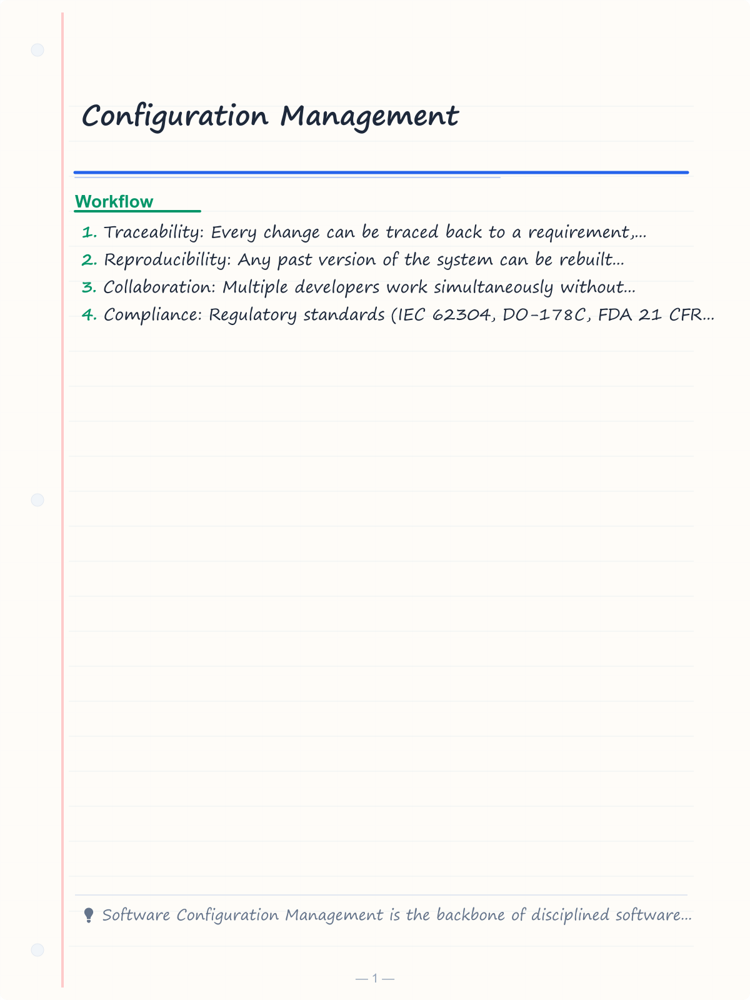
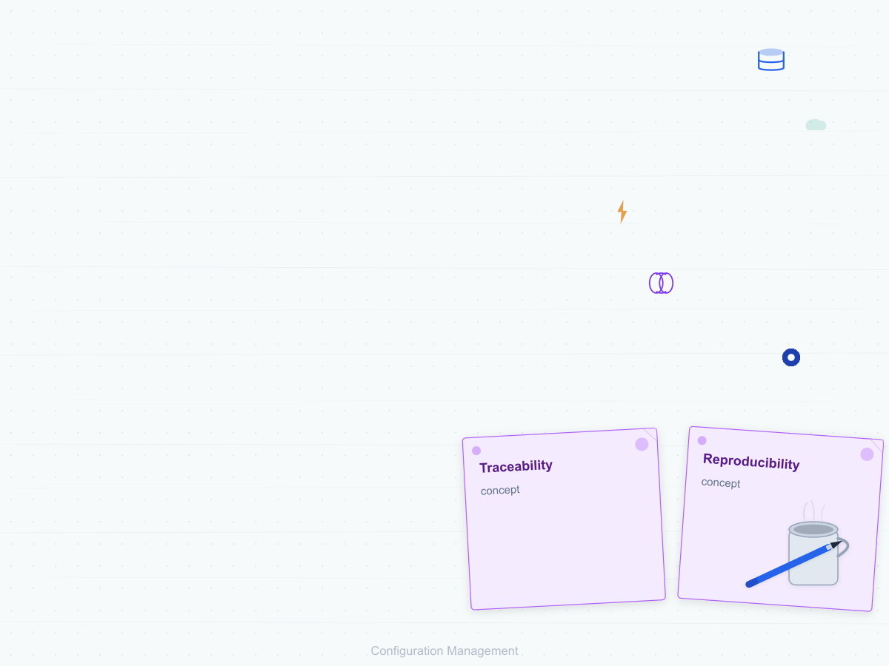
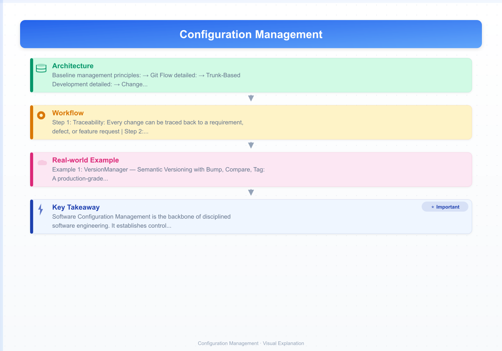
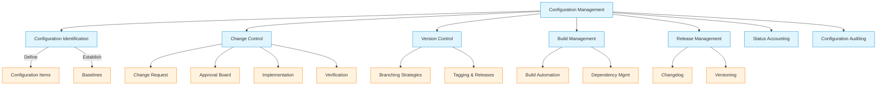
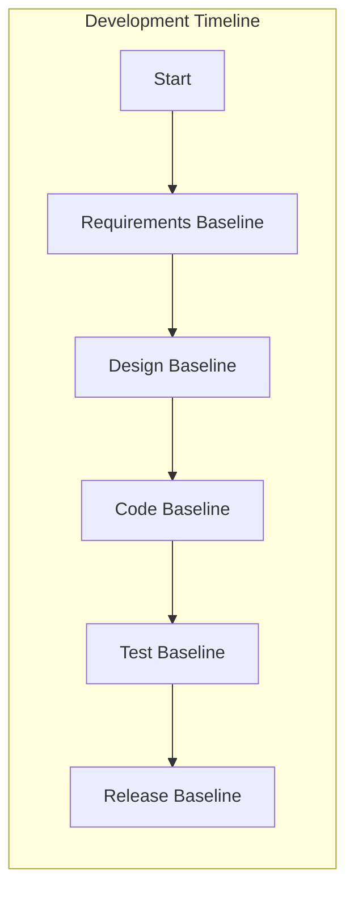
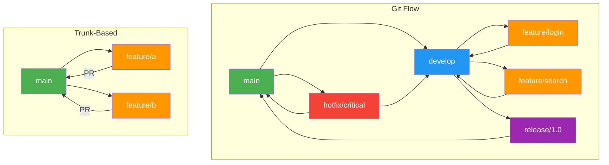
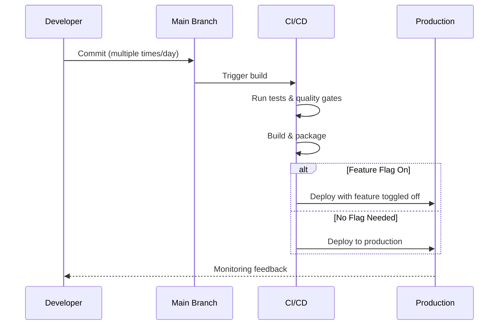
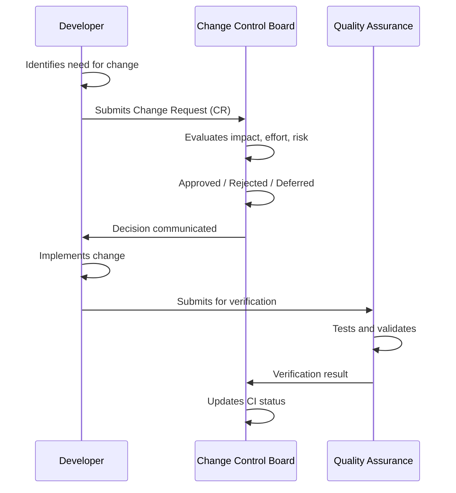
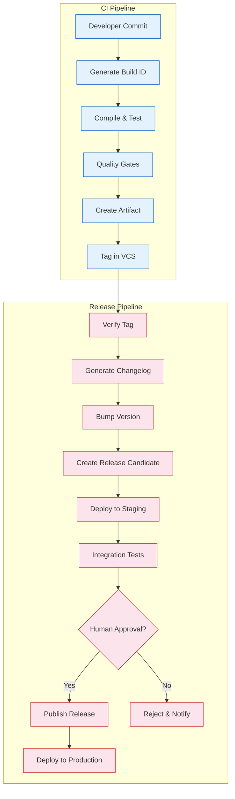

# Configuration Management

## Learning Objectives

- [x] Explain the purpose and activities of software configuration management (SCM)
- [x] Identify configuration items and establish baselines
- [x] Use version control systems effectively with branching strategies
- [x] Implement change control processes for software projects
- [x] Automate build and release management with semantic versioning
- [x] Track configuration status and perform audits
- [x] Implement production-grade TypeScript SCM tools (VersionManager, CCB, ReleaseManager)
- [x] Design CI/CD integration for configuration management workflows

<!-- Image Gallery -->
<section class="lesson-visuals" aria-label="Visual learning resources">
  <header><span>VISUAL LEARNING</span><h2>See it. Review it. Remember it.</h2></header>
  <a class="lesson-visual-card" href="../../assets/images/lessons/software-engineering/10-configuration-management/handwritten-notes.png" target="_blank" rel="noopener">
    
    <span><strong>Handwritten notes</strong>Condensed notes for deliberate review.</span>
  </a>
  <a class="lesson-visual-card" href="../../assets/images/lessons/software-engineering/10-configuration-management/sticky-notes.png" target="_blank" rel="noopener">
    
    <span><strong>Sticky-note revision</strong>Fast recall prompts for revision.</span>
  </a>
  <a class="lesson-visual-card" href="../../assets/images/lessons/software-engineering/10-configuration-management/visual-explanation.png" target="_blank" rel="noopener">
    
    <span><strong>Visual concept guide</strong>A connected explanation of the key ideas.</span>
  </a>
</section>
<!-- End Image Gallery -->

## Theory

### What is Software Configuration Management?

Software Configuration Management (SCM) is the discipline of controlling the evolution of software systems throughout their lifecycle. It answers the questions: *what changed, who changed it, when, why, and what else was affected?*

SCM is critical for:
- **Traceability:** Every change can be traced back to a requirement, defect, or feature request
- **Reproducibility:** Any past version of the system can be rebuilt exactly
- **Collaboration:** Multiple developers work simultaneously without conflicts
- **Compliance:** Regulatory standards (IEC 62304, DO-178C, FDA 21 CFR 11) mandate SCM practices
- **Recovery:** Rollback to any known-good state when failures occur



### Configuration Items

A **Configuration Item (CI)** is any software artifact that is placed under configuration control. CIs are typically versioned, reviewed, and auditable.

| CI Category | Examples | Version Strategy | Storage |
|-------------|----------|------------------|---------|
| **Source code** | `.ts`, `.java`, `.py` files | Per-file or changeset | Git, Mercurial |
| **Documents** | SRS, design docs, test plans | Sequential version number | SharePoint, Wiki |
| **Build artifacts** | JAR, EXE, Docker images | Semantic versioning | Artifactory, Docker Hub |
| **Configuration files** | `application.yml`, `.env` templates | Per-project version | Git (templated) |
| **Database schemas** | Migration scripts | Sequential (V1, V2...) | Flyway, Liquibase |
| **Test data** | Fixtures, seed data | Matches schema version | Git LFS |
| **Tooling** | Build scripts, CI configs | Matches main project | Git |
| **Infrastructure** | Terraform, CloudFormation | Module versioning | Git, module registry |

### Baselines

A **baseline** is a formally reviewed and agreed-upon version of a CI that serves as a foundation for further development. Once baselined, changes require formal change control.



| Baseline | When Established | Contents | Change Control |
|----------|-----------------|----------|----------------|
| **Functional** | Requirements approved | SRS, use cases, user stories | Formal CCB approval for changes |
| **Allocated** | Design approved | Architecture docs, interface specs | CCB approval for changes |
| **Product** | Release | Source code, executables, tests, docs | Emergency change process only |
| **Developmental** | Sprint/release end | Current state of all CIs at milestone | Normal change process |

**Baseline management principles:**
1. Baselines are immutable — once created, changes produce a new baseline version
2. Each baseline references specific versions of all CIs
3. Traceability between baselines must be maintained
4. Baseline contents are auditable at any time

### Version Control Strategies

Modern version control systems (Git) form the backbone of SCM.

| Concept | Description | Git Command |
|---------|-------------|-------------|
| **Repository** | Central store of all versions | `git init`, `git clone` |
| **Commit** | Snapshot of changes | `git commit -m "message"` |
| **Branch** | Divergent line of development | `git branch <name>` |
| **Tag** | Named reference to a specific commit | `git tag v1.0.0` |
| **Merge** | Integrate changes from one branch to another | `git merge <branch>` |
| **Rebase** | Reapply commits on top of another base | `git rebase <base>` |
| **Cherry-pick** | Apply specific commits from another branch | `git cherry-pick <hash>` |
| **Stash** | Temporarily save uncommitted changes | `git stash` |

#### Branching Strategy Comparison



| Strategy | Branches | Merge Frequency | Release Model | Best For |
|----------|----------|-----------------|---------------|----------|
| **Git Flow** | `main`, `develop`, `feature/*`, `release/*`, `hotfix/*` | Per feature | Release trains, scheduled | Enterprise with versioned releases |
| **GitHub Flow** | `main`, `feature/*` | Per feature (PR) | Continuous deployment | SaaS, web applications |
| **GitLab Flow** | `main`, `environment/*`, `feature/*` | Per environment | Environment-based | Multi-environment deployments |
| **Trunk-Based** | `main` (short-lived branches) | Multiple times daily | Continuous deployment | CI/CD, DevOps teams |

**Git Flow detailed:**
- `main` — production-ready state, only updated via release/hotfix merges
- `develop` — integration branch for features
- `feature/<name>` — branched from `develop`, merged back via PR
- `release/<version>` — branched from `develop` for release preparation
- `hotfix/<name>` — branched from `main` for emergency fixes

**Trunk-Based Development detailed:**
- Single main branch with short-lived feature branches (< 2 days)
- Feature flags to hide incomplete work
- Continuous integration with multiple daily commits
- No release branches — any commit can be released



### Change Control

Change control ensures that every change is evaluated, approved, implemented, and verified systematically.



**Change Request (CR) Lifecycle:**
```
Submitted → Under Review → Approved / Rejected → Implemented → Verified → Closed
```

**Change Control Board (CCB):**
- **Chairperson:** Senior manager with authority to approve changes
- **Members:** Development lead, QA lead, Operations lead, Product owner
- **Frequency:** Weekly or on-demand for urgent changes
- **Decision criteria:** Business value, risk, effort, impact on schedule

**Change Request Template:**

| Field | Description |
|-------|-------------|
| CR ID | Unique identifier |
| Title | Short summary |
| Submitter | Person requesting change |
| Date | Submission date |
| Priority | Critical / High / Medium / Low |
| Category | Bug fix / Enhancement / Infrastructure / Documentation |
| Description | Detailed explanation |
| Impact | Affected CIs, schedule, cost |
| Risk | Low / Medium / High |
| Decision | Approved / Rejected / Deferred |
| Target Version | Version to include the change |
| Verification Criteria | How to verify the change was correctly implemented |

**Change urgency levels:**

| Level | Criteria | Approval | Implementation |
|-------|----------|----------|----------------|
| **Emergency** | Security vulnerability, production outage | Emergency CCB (2 people) | Immediate, retrospective review |
| **Standard** | Feature, improvement | Full CCB | Next release |
| **Trivial** | Documentation, formatting | Peer review only | Deploy immediately |

### Build Management

Build management ensures that software can be built consistently and reproducibly.

**Key build management concepts:**
- **Build automation:** Make, Maven, Gradle, npm, Webpack
- **Build script:** Defined, versioned steps to produce deployable artifacts
- **Dependency management:** Maven Central, npm registry, Ivy
- **Build server:** Jenkins, GitHub Actions, GitLab CI
- **Reproducible builds:** Same source always produces identical artifacts


**Build ID Convention:**
```
<project>-<branch>-<build-number>-<commit-short>
Example: auth-service-release-1.0-45-a1b2c3d
```

**Artifact versioning:**
- **Development builds:** `1.0.0-dev.${buildNumber}`
- **Release candidates:** `1.0.0-rc.1`
- **Stable releases:** `1.0.0`
- **Hotfix releases:** `1.0.1`

### Release Management

Release management coordinates the deployment of software to production.

**Semantic Versioning (SemVer):** `MAJOR.MINOR.PATCH`

- **MAJOR:** Incompatible API changes (e.g., `2.0.0 → 3.0.0`)
- **MINOR:** Backward-compatible functionality added (e.g., `2.0.0 → 2.1.0`)
- **PATCH:** Backward-compatible bug fixes (e.g., `2.0.0 → 2.0.1`)

**Pre-release suffixes:** `-alpha`, `-beta`, `-rc.1`, `-dev.20250115`

**Release process:**
1. Code freeze on release branch
2. Regression testing
3. Release candidate creation
4. Staged deployment (dev → staging → production)
5. Smoke testing in production
6. Tag release in version control
7. Update changelog
8. Rollback plan in place

**Release trains:**
- **Weekly:** Small batches, low risk per release
- **Monthly:** Medium batches, measured rollout
- **Quarterly:** Large batches, major version bumps
- **On-demand:** Triggered by feature completion or emergency

**Changelog types:**

| Type | Description | Example |
|------|-------------|---------|
| **Added** | New features | Added OAuth 2.0 authentication |
| **Changed** | Existing functionality changes | Updated payment flow to v3 API |
| **Deprecated** | Features to be removed | Deprecated legacy `/api/v1` endpoints |
| **Removed** | Features removed | Removed support for Node 16 |
| **Fixed** | Bug fixes | Fixed race condition in session handler |
| **Security** | Vulnerability fixes | Patched XSS in search input |

### Status Accounting

Status accounting tracks the state of all CIs throughout the project lifecycle.

**Status for each CI:**
- Checked out / Checked in
- Approved
- Under change
- Verified
- Released
- Obsoleted

**Reports produced:**
- CI status report
- Baseline content report
- Change request history
- Release history
- Version tree
- Audit trail

### Configuration Auditing

A **configuration audit** verifies that the product matches its documentation and that all CIs are properly managed.

| Audit Type | Focus | Frequency | Outcomes |
|------------|-------|-----------|----------|
| **Functional Configuration Audit (FCA)** | Product meets requirements | Before release | Requirements traceability matrix validated |
| **Physical Configuration Audit (PCA)** | Product matches all documentation | Before release | All CIs match their specs |
| **SCM Process Audit** | SCM procedures are followed | Quarterly | Process compliance % |
| **In-Progress Audit** | SCM activities on active work | Per milestone | Anomalies identified and resolved |

### CI/CD Integration for Configuration Management



**Build ID and Artifact Versioning Strategy:**

The CI pipeline generates build IDs that uniquely identify every build. The CD pipeline uses these IDs for traceable releases.

```
Commit: abc1234
Build ID: build-20250115-1001-abc1234
Docker Tag: ghcr.io/myapp/service:build-20250115-1001
Release Tag: v1.2.3
```

## Examples

### Example 1: VersionManager — Semantic Versioning with Bump, Compare, Tag

A production-grade semantic versioning manager that supports parsing, bumping, comparing, tagging, and dependency compatibility checking.

```typescript
interface VersionTag {
  version: string;
  timestamp: Date;
  commitHash: string;
  message: string;
  tagType: 'release' | 'prerelease' | 'build';
}

interface DependencyConstraint {
  name: string;
  minVersion: string;
  maxVersion: string;
  compatibility: 'exact' | 'compatible' | 'any';
}

class VersionManager {
  private tags: VersionTag[] = [];

  public parse(versionString: string): { major: number; minor: number; patch: number; prerelease?: string; build?: string } {
    const regex = /^(\d+)\.(\d+)\.(\d+)(?:-([\w.]+))?(?:\+([\w.]+))?$/;
    const match = versionString.match(regex);
    if (!match) throw new Error(`Invalid SemVer: ${versionString}`);
    return {
      major: parseInt(match[1], 10),
      minor: parseInt(match[2], 10),
      patch: parseInt(match[3], 10),
      prerelease: match[4],
      build: match[5],
    };
  }

  public bump(current: string, type: 'major' | 'minor' | 'patch', prerelease?: string): string {
    const v = this.parse(current);
    let { major, minor, patch } = v;
    switch (type) {
      case 'major': major++; minor = 0; patch = 0; break;
      case 'minor': minor++; patch = 0; break;
      case 'patch': patch++; break;
    }
    let result = `${major}.${minor}.${patch}`;
    if (prerelease) result += `-${prerelease}`;
    return result;
  }

  public compare(a: string, b: string): number {
    const va = this.parse(a);
    const vb = this.parse(b);
    if (va.major !== vb.major) return va.major - vb.major;
    if (va.minor !== vb.minor) return va.minor - vb.minor;
    if (va.patch !== vb.patch) return va.patch - vb.patch;
    if (va.prerelease && !vb.prerelease) return -1;
    if (!va.prerelease && vb.prerelease) return 1;
    return (va.prerelease ?? '').localeCompare(vb.prerelease ?? '');
  }

  public satisfiesConstraint(version: string, constraint: DependencyConstraint): boolean {
    const v = this.parse(version);
    const min = this.parse(constraint.minVersion);
    const max = this.parse(constraint.maxVersion);
    const meetsMin = this.compare(version, constraint.minVersion) >= 0;
    const meetsMax = this.compare(version, constraint.maxVersion) <= 0;
    return meetsMin && meetsMax;
  }

  public createTag(version: string, commitHash: string, message: string, tagType: VersionTag['tagType'] = 'release'): VersionTag {
    const tag: VersionTag = {
      version, timestamp: new Date(), commitHash, message, tagType,
    };
    this.tags.push(tag);
    return tag;
  }

  public getReleaseHistory(): VersionTag[] {
    return [...this.tags].filter(t => t.tagType === 'release').sort((a, b) => this.compare(b.version, a.version));
  }

  public getLatestVersion(): string | null {
    const releases = this.getReleaseHistory();
    return releases.length > 0 ? releases[0].version : null;
  }

  public generateChangelog(fromVersion: string, toVersion: string, commits: { hash: string; message: string; type: string }[]): string {
    const categorized: Record<string, string[]> = { Added: [], Changed: [], Deprecated: [], Removed: [], Fixed: [], Security: [] };
    for (const commit of commits) {
      const cat = commit.type in categorized ? commit.type : 'Changed';
      categorized[cat].push(commit.message);
    }
    const lines = [
      `# Changelog [${fromVersion} → ${toVersion}]`,
      '',
      ...Object.entries(categorized).flatMap(([category, items]) =>
        items.length > 0 ? [`### ${category}`, ...items.map(i => `- ${i}`), ''] : []
      ),
    ];
    return lines.join('\n');
  }

  public checkDependencyCompatibility(version: string, dependencies: DependencyConstraint[]): { compatible: boolean; violations: string[] } {
    const violations: string[] = [];
    for (const dep of dependencies) {
      if (!this.satisfiesConstraint(version, dep)) {
        violations.push(`${dep.name}: ${version} violates ${dep.minVersion} → ${dep.maxVersion}`);
      }
    }
    return { compatible: violations.length === 0, violations };
  }
}

// Usage
const vm = new VersionManager();
console.log(vm.bump('1.2.3', 'minor'));       // 1.3.0
console.log(vm.bump('2.0.0', 'major', 'rc.1')); // 3.0.0-rc.1
console.log(vm.compare('2.0.0', '1.9.9'));    // 1
console.log(vm.satisfiesConstraint('1.5.0', { name: 'lib-x', minVersion: '1.0.0', maxVersion: '2.0.0', compatibility: 'compatible' }));

const commits = [
  { hash: 'a1b2c3', message: 'Add OAuth 2.0 login', type: 'Added' },
  { hash: 'b2c3d4', message: 'Fix memory leak in connection pool', type: 'Fixed' },
  { hash: 'c3d4e5', message: 'Update API rate limiting', type: 'Changed' },
  { hash: 'd4e5f6', message: 'Patch XSS vulnerability in search', type: 'Security' },
];
console.log(vm.generateChangelog('v1.0.0', 'v1.1.0', commits));
```

### Example 2: ChangeControlBoard — CR Lifecycle, Approvals, Tracking

A full change control board implementation with CR lifecycle management, voting, notifications, and metrics.

```typescript
type CRPriority = 'critical' | 'high' | 'medium' | 'low';
type CRStatus = 'draft' | 'submitted' | 'under_review' | 'approved' | 'rejected' | 'deferred' | 'implemented' | 'verified' | 'closed';
type CRCategory = 'bug_fix' | 'enhancement' | 'infrastructure' | 'documentation' | 'security';

interface ChangeRequest {
  id: string;
  title: string;
  submitter: string;
  dateSubmitted: Date;
  description: string;
  justification: string;
  priority: CRPriority;
  category: CRCategory;
  impact: string;
  risk: 'low' | 'medium' | 'high';
  affectedCIs: string[];
  status: CRStatus;
  approvedBy?: string;
  approvalDate?: Date;
  targetVersion?: string;
  rejectReason?: string;
  reviewNotes: string[];
  implementationDetails?: string;
  verificationResults?: string;
  verificationDate?: Date;
}

interface CCBMember {
  name: string;
  role: 'chair' | 'vice_chair' | 'member';
  votingPower: number;
  department: string;
}

interface CCBVote {
  crId: string;
  member: string;
  decision: 'approve' | 'reject' | 'abstain';
  comments: string;
  date: Date;
}

class ChangeControlBoard {
  private crs: ChangeRequest[] = [];
  private members: CCBMember[] = [];
  private votes: CCBVote[] = [];
  private sequence = 0;

  public addMember(name: string, role: CCBMember['role'], department: string, votingPower = 1): void {
    this.members.push({ name, role, votingPower, department });
  }

  public submit(
    title: string, submitter: string, description: string, justification: string,
    priority: CRPriority, category: CRCategory, impact: string, risk: 'low' | 'medium' | 'high',
    affectedCIs: string[]
  ): ChangeRequest {
    const cr: ChangeRequest = {
      id: `CR-${++this.sequence}`, title, submitter, dateSubmitted: new Date(), description,
      justification, priority, category, impact, risk, affectedCIs, status: 'submitted', reviewNotes: [],
    };
    this.crs.push(cr);
    return cr;
  }

  public submitForReview(crId: string): ChangeRequest {
    const cr = this.findCR(crId);
    cr.status = 'under_review';
    return cr;
  }

  public vote(crId: string, memberName: string, decision: CCBVote['decision'], comments: string): void {
    if (!this.members.some(m => m.name === memberName)) {
      throw new Error(`${memberName} is not a CCB member`);
    }
    this.votes.push({ crId, member: memberName, decision, comments, date: new Date() });
    this.checkVoteOutcome(crId);
  }

  private checkVoteOutcome(crId: string): void {
    const cr = this.findCR(crId);
    const relevantVotes = this.votes.filter(v => v.crId === crId);
    const totalPower = this.members.reduce((s, m) => s + m.votingPower, 0);
    const votingMembers = this.members.filter(m => relevantVotes.some(v => v.member === m.name));
    const votedPower = votingMembers.reduce((s, m) => s + m.votingPower, 0);

    // Require majority of voting power for decision
    if (votedPower < totalPower * 0.5) return; // Not enough votes yet

    const approvePower = relevantVotes
      .filter(v => v.decision === 'approve')
      .reduce((s, v) => s + (this.members.find(m => m.name === v.member)?.votingPower ?? 0), 0);

    const rejectPower = relevantVotes
      .filter(v => v.decision === 'reject')
      .reduce((s, v) => s + (this.members.find(m => m.name === v.member)?.votingPower ?? 0), 0);

    if (approvePower > votedPower * 0.5) {
      cr.status = 'approved';
      cr.approvalDate = new Date();
      cr.reviewNotes.push(`Approved by CCB on ${cr.approvalDate.toISOString().split('T')[0]}`);
    } else if (rejectPower > votedPower * 0.5) {
      cr.status = 'rejected';
      const rejectionReasons = relevantVotes.filter(v => v.decision === 'reject').map(v => v.comments);
      cr.rejectReason = rejectionReasons.join('; ');
      cr.reviewNotes.push(`Rejected by CCB: ${cr.rejectReason}`);
    }
  }

  public markImplemented(crId: string, details: string): ChangeRequest {
    const cr = this.findCR(crId);
    if (cr.status !== 'approved') throw new Error('CR must be approved before implementation');
    cr.status = 'implemented';
    cr.implementationDetails = details;
    return cr;
  }

  public verify(crId: string, results: string): ChangeRequest {
    const cr = this.findCR(crId);
    cr.status = 'verified';
    cr.verificationResults = results;
    cr.verificationDate = new Date();
    return cr;
  }

  public close(crId: string): ChangeRequest {
    const cr = this.findCR(crId);
    cr.status = 'closed';
    return cr;
  }

  public getPendingReview(): ChangeRequest[] {
    return this.crs.filter(cr => cr.status === 'submitted' || cr.status === 'under_review');
  }

  public getCRsByPriority(priority: CRPriority): ChangeRequest[] {
    return this.crs.filter(cr => cr.priority === priority).sort((a, b) => a.dateSubmitted.getTime() - b.dateSubmitted.getTime());
  }

  public generateMetrics(): { total: number; approved: number; rejected: number; avgDaysToApprove: number } {
    const approved = this.crs.filter(cr => cr.status === 'approved' || cr.status === 'implemented' || cr.status === 'verified' || cr.status === 'closed');
    const rejected = this.crs.filter(cr => cr.status === 'rejected');
    const withApprovalDate = approved.filter(cr => cr.approvalDate);
    const totalDays = withApprovalDate.reduce((s, cr) => s + (cr.approvalDate!.getTime() - cr.dateSubmitted.getTime()), 0);
    const avgDaysToApprove = withApprovalDate.length > 0 ? totalDays / withApprovalDate.length / 86400000 : 0;
    return {
      total: this.crs.length,
      approved: approved.length, rejected: rejected.length,
      avgDaysToApprove: Math.round(avgDaysToApprove * 10) / 10,
    };
  }

  public generateMonthlyReport(year: number, month: number): string {
    const relevant = this.crs.filter(cr => {
      const d = cr.dateSubmitted;
      return d.getFullYear() === year && d.getMonth() === month - 1;
    });
    const approved = relevant.filter(cr => cr.status === 'approved' || cr.status === 'implemented' || cr.status === 'verified').length;
    const rejected = relevant.filter(cr => cr.status === 'rejected').length;
    const pending = relevant.filter(cr => cr.status === 'submitted' || cr.status === 'under_review').length;
    return [
      `═══════════════════════════════════`,
      `  Monthly CCB Report: ${year}-${String(month).padStart(2, '0')}`,
      `═══════════════════════════════════`,
      `  Total CRs: ${relevant.length}`,
      `  Approved: ${approved}`,
      `  Rejected: ${rejected}`,
      `  Pending: ${pending}`,
      `  Approval Rate: ${relevant.length > 0 ? Math.round((approved / relevant.length) * 100) : 0}%`,
      '',
      `  Priority Breakdown:`,
      ...(['critical', 'high', 'medium', 'low'] as CRPriority[]).map(p => {
        const count = relevant.filter(cr => cr.priority === p).length;
        return `    ${p.padEnd(10)} ${count}`;
      }),
    ].join('\n');
  }

  private findCR(crId: string): ChangeRequest {
    const cr = this.crs.find(c => c.id === crId);
    if (!cr) throw new Error(`Change request ${crId} not found`);
    return cr;
  }
}

// Usage
const ccb = new ChangeControlBoard();
ccb.addMember('Dr. Smith', 'chair', 'Engineering', 3);
ccb.addMember('Jane Doe', 'vice_chair', 'QA', 2);
ccb.addMember('Bob Wilson', 'member', 'Operations', 1);
ccb.addMember('Alice Chen', 'member', 'Product', 1);

const cr = ccb.submit(
  'Add payment gateway integration', 'Mike Dev',
  'Integrate Stripe payment gateway to support credit card payments',
  'Customer survey shows 70% prefer credit card payments',
  'high', 'enhancement', 'Payment module, API config, test suite', 'medium',
  ['payment-service', 'api-gateway', 'payment-test-data']
);

ccb.submitForReview(cr.id);
ccb.vote(cr.id, 'Dr. Smith', 'approve', 'Well justified, moderate risk');
ccb.vote(cr.id, 'Jane Doe', 'approve', 'QA resources available');
ccb.vote(cr.id, 'Bob Wilson', 'approve', 'Ops can support');
ccb.vote(cr.id, 'Alice Chen', 'approve', 'High customer value');

console.log(cr.status); // approved
console.log(ccb.generateMonthlyReport(2025, 1));
```

### Example 3: ReleaseManager — Build Pipeline, Artifact Versioning, Changelog

A comprehensive release manager that orchestrates builds, manages artifact versioning, generates changelogs, and supports release trains.

```typescript
interface BuildConfig {
  projectName: string;
  version: string;
  commitHash: string;
  buildNumber: number;
  branch: string;
  environment: 'development' | 'staging' | 'production';
}

interface Artifact {
  name: string;
  version: string;
  buildId: string;
  type: 'docker' | 'npm' | 'jar' | 'exe';
  registry: string;
  tag: string;
}

interface ArtifactVersioningStrategy {
  version: string;
  dockerTag: string;
  npmTag: string;
  buildId: string;
}

class ReleaseManager {
  private builds: BuildConfig[] = [];
  private artifacts: Artifact[] = [];
  private changelogs: Map<string, string> = new Map();

  constructor(private versionManager: VersionManager) {}

  public generateBuildId(branch: string, buildNumber: number, commitHash: string): string {
    const cleanBranch = branch.replace(/[^a-zA-Z0-9]/g, '-');
    const shortHash = commitHash.substring(0, 7);
    const dateStr = new Date().toISOString().split('T')[0].replace(/-/g, '');
    return `build-${dateStr}-${buildNumber}-${shortHash}`;
  }

  public planVersioning(projectName: string, branch: string, buildNumber: number, commitHash: string, bumpType: 'major' | 'minor' | 'patch'): ArtifactVersioningStrategy {
    const baseVersion = this.versionManager.getLatestVersion() || '0.1.0';
    let version: string;
    let prerelease: string | undefined;

    if (branch === 'main' || branch === 'master') {
      version = this.versionManager.bump(baseVersion, bumpType);
    } else if (branch.startsWith('release/')) {
      const releaseVer = branch.replace('release/', '');
      version = `${releaseVer}-rc.${buildNumber}`;
      prerelease = `rc.${buildNumber}`;
    } else {
      version = `${baseVersion}-dev.${buildNumber}`;
      prerelease = `dev.${buildNumber}`;
    }

    return {
      version,
      dockerTag: `${projectName}:${version}`,
      npmTag: version,
      buildId: this.generateBuildId(branch, buildNumber, commitHash),
    };
  }

  public async runBuild(config: BuildConfig, stages: { name: string; run: () => Promise<boolean> }[]): Promise<{ success: boolean; failedStage?: string; duration: number }> {
    const start = Date.now();
    this.builds.push(config);

    for (const stage of stages) {
      const stageStart = Date.now();
      const passed = await stage.run();
      const stageDuration = Date.now() - stageStart;
      console.log(`Stage ${stage.name}: ${passed ? '✅ PASSED' : '❌ FAILED'} (${stageDuration}ms)`);
      if (!passed) {
        return { success: false, failedStage: stage.name, duration: Date.now() - start };
      }
    }
    return { success: true, duration: Date.now() - start };
  }

  public publishArtifact(artifact: Artifact): void {
    this.artifacts.push(artifact);
    console.log(`Published ${artifact.type} artifact: ${artifact.tag}`);
  }

  public generateReleaseNotes(version: string, commits: { hash: string; message: string; author: string; type: string }[]): string {
    const notes = this.versionManager.generateChangelog(
      this.versionManager.getLatestVersion() || '0.0.0', version, commits
    );
    this.changelogs.set(version, notes);
    return notes;
  }

  public createRelease(version: string, commitHash: string, notes: string): {
    tag: string;
    releaseUrl: string;
    artifacts: Artifact[];
  } {
    const tag = `v${version}`;
    this.versionManager.createTag(version, commitHash, notes, 'release');
    const releaseArtifacts = this.artifacts.filter(a => a.version === version);

    return {
      tag,
      releaseUrl: `https://registry.example.com/releases/${tag}`,
      artifacts: releaseArtifacts,
    };
  }

  public getBuildHistory(limit = 10): BuildConfig[] {
    return this.builds.slice(-limit);
  }

  public getArtifactsByVersion(version: string): Artifact[] {
    return this.artifacts.filter(a => a.version === version);
  }
}

// Usage
const vm = new VersionManager();
vm.createTag('1.0.0', 'abc123', 'Initial release', 'release');
vm.createTag('1.1.0', 'def456', 'Add payment feature', 'release');

const releaseMgr = new ReleaseManager(vm);
const plan = releaseMgr.planVersioning('auth-service', 'main', 45, 'a1b2c3d4e5', 'minor');
console.log(plan);
// { version: '1.2.0', dockerTag: 'auth-service:1.2.0', npmTag: '1.2.0', buildId: 'build-20250115-45-a1b2c3d' }

// Simulate build pipeline
releaseMgr.runBuild(
  { projectName: 'auth-service', version: '1.2.0', commitHash: 'a1b2c3d', buildNumber: 45, branch: 'main', environment: 'staging' },
  [
    { name: 'Install Dependencies', run: async () => { await new Promise(r => setTimeout(r, 100)); return true; } },
    { name: 'Lint', run: async () => { await new Promise(r => setTimeout(r, 50)); return true; } },
    { name: 'Unit Tests', run: async () => { await new Promise(r => setTimeout(r, 150)); return true; } },
    { name: 'Build', run: async () => { await new Promise(r => setTimeout(r, 200)); return true; } },
    { name: 'Integration Tests', run: async () => { await new Promise(r => setTimeout(r, 300)); return true; } },
  ]
).then(result => console.log(result));

const release = releaseMgr.createRelease('1.2.0', 'a1b2c3d', '### Added\n- OAuth 2.0 support\n- Rate limiting\n### Fixed\n- Session leak');
console.log(`Release tag: ${release.tag}`);
```

### Example 4: Baseline Manager

```typescript
interface BaselineRecord {
  id: string;
  name: string;
  type: 'functional' | 'allocated' | 'product' | 'developmental';
  createdAt: Date;
  approvedBy: string;
  items: string[];
}

interface CIStatus {
  id: string;
  name: string;
  version: string;
  status: 'checked_in' | 'checked_out' | 'under_review' | 'approved' | 'released';
  lastModified: Date;
  modifiedBy: string;
}

class BaselineManager {
  private baselines: BaselineRecord[] = [];
  private cis: Map<string, CIStatus> = new Map();

  public registerCI(id: string, name: string, version: string): void {
    this.cis.set(id, { id, name, version, status: 'checked_in', lastModified: new Date(), modifiedBy: 'system' });
  }

  public createBaseline(name: string, type: BaselineRecord['type'], approvedBy: string, ciIds: string[]): BaselineRecord {
    for (const ciId of ciIds) {
      if (!this.cis.has(ciId)) throw new Error(`CI ${ciId} not registered`);
    }
    const baseline: BaselineRecord = {
      id: `BL-${this.baselines.length + 1}`, name, type,
      createdAt: new Date(), approvedBy, items: [...ciIds],
    };
    this.baselines.push(baseline);
    return baseline;
  }

  public getBaselineContents(baselineId: string): CIStatus[] {
    const baseline = this.baselines.find(b => b.id === baselineId);
    if (!baseline) throw new Error(`Baseline ${baselineId} not found`);
    return baseline.items.map(ciId => {
      const ci = this.cis.get(ciId);
      if (!ci) throw new Error(`CI ${ciId} not found`);
      return ci;
    });
  }

  public checkInCI(ciId: string, user: string): void {
    const ci = this.cis.get(ciId);
    if (!ci) throw new Error(`CI ${ciId} not found`);
    ci.status = 'checked_in';
    ci.lastModified = new Date();
    ci.modifiedBy = user;
  }

  public checkOutCI(ciId: string, user: string): void {
    const ci = this.cis.get(ciId);
    if (!ci) throw new Error(`CI ${ciId} not found`);
    if (ci.status === 'approved' || ci.status === 'released') throw new Error(`Cannot check out released CI ${ciId}`);
    ci.status = 'checked_out';
    ci.lastModified = new Date();
    ci.modifiedBy = user;
  }

  public generateAuditReport(): string {
    const approvedBaselines = this.baselines.filter(b => b.type === 'functional' || b.type === 'allocated' || b.type === 'product');
    const unmatched: string[] = [];
    for (const bl of approvedBaselines) {
      for (const ciId of bl.items) {
        const ci = this.cis.get(ciId);
        if (ci && ci.status !== 'released' && ci.status !== 'approved') {
          unmatched.push(`CI ${ciId} in baseline ${bl.id} has status ${ci?.status}`);
        }
      }
    }
    return [
      '=== Configuration Audit Report ===',
      `Total Baselines: ${this.baselines.length}`,
      `Total CIs registered: ${this.cis.size}`,
      `Anomalies found: ${unmatched.length}`,
      ...unmatched.map(u => `  WARNING: ${u}`),
    ].join('\n');
  }
}
```

### Example 5: GitHub Actions CI/CD for CM

```yaml
name: Build and Deploy

on:
  push:
    branches: [main, 'release/*']
  pull_request:
    branches: [main]

jobs:
  version:
    runs-on: ubuntu-latest
    outputs:
      version: ${{ steps.semver.outputs.version }}
      build_id: ${{ steps.build_id.outputs.build_id }}
    steps:
      - uses: actions/checkout@v4
        with:
          fetch-depth: 0
      
      - name: Determine version
        id: semver
        run: |
          LATEST_TAG=$(git describe --tags --abbrev=0 2>/dev/null || echo "v0.0.0")
          VERSION=${LATEST_TAG#v}
          echo "version=$VERSION" >> $GITHUB_OUTPUT
      
      - name: Generate build ID
        id: build_id
        run: |
          BUILD_ID="build-$(date +%Y%m%d)-${{ github.run_number }}-${GITHUB_SHA:0:7}"
          echo "build_id=$BUILD_ID" >> $GITHUB_OUTPUT

  build:
    needs: version
    runs-on: ubuntu-latest
    steps:
      - uses: actions/checkout@v4
      - uses: actions/setup-node@v4
        with:
          node-version: '20'
      - run: npm ci
      - run: npm run build
      - run: npm run test
      
      - name: Package artifact
        run: |
          mkdir -p dist
          tar -czf "dist/app-${{ needs.version.outputs.build_id }}.tar.gz" dist/
      
      - uses: actions/upload-artifact@v4
        with:
          name: app-${{ needs.version.outputs.build_id }}
          path: dist/

  release:
    if: github.ref == 'refs/heads/main'
    needs: [version, build]
    runs-on: ubuntu-latest
    steps:
      - uses: actions/checkout@v4
      
      - name: Create release tag
        run: |
          VERSION="${{ needs.version.outputs.version }}"
          NEW_VERSION=$(node -e "
            const [maj, min, pat] = '$VERSION'.split('.').map(Number);
            console.log([maj, min + 1, 0].join('.'));
          ")
          git config user.name "CI Bot"
          git config user.email "ci@example.com"
          git tag -a "v$NEW_VERSION" -m "Release v$NEW_VERSION"
          git push origin "v$NEW_VERSION"
```

### Real-World Case Studies

**Case Study 1: Google — Monorepo with Trunk-Based Development**

Google operates one of the world's largest monorepos with over 2 billion lines of code and 25,000+ developers. Their SCM approach:
- **Single trunk:** All development happens on mainline trunk
- **No long-lived branches:** Feature branches last < 2 days
- **Automated code review:** Every change requires automated review and 1-2 human reviewers
- **Build system:** Blaze (internal) handles dependency graph across entire repo
- **Atomic commits:** Each commit is a single logical change

Key innovation: A single CI system that can rebuild the entire repository from source with deterministic outputs.

**Case Study 2: Netflix — Spinnaker for Continuous Delivery**

Netflix's Spinnaker is an open-source CD platform that manages releases across AWS. Key SCM practices:
- **Pipeline-as-code:** Deployment pipelines defined in version control
- **Immutable infrastructure:** AMIs are versioned artifacts, never modified in place
- **Automated canary analysis:** Kayenta automatically compares canary vs baseline metrics
- **Rollback by redeployment:** Rollback = deploying the previous immutable artifact
- **Metadata everywhere:** Every artifact tagged with build ID, commit hash, build timestamp

Result: Netflix deploys thousands of times per day with < 1% change failure rate.

**Case Study 3: NASA — Configuration Management for Mars Rovers**

NASA's Mars rover software requires absolute SCM rigor:
- **Every CI is accounted for:** Source code, FPGA bitstreams, parameter tables, calibration data
- **Four-eyes principle:** Every change requires author + reviewer
- **Digital signatures:** All artifacts cryptographically signed
- **Full traceability:** Every line of code traces to a requirement, test, and operations procedure
- **Reproducibility:** Any flight software build can be exactly reproduced years later

The SCM system for Mars 2020 Perseverance tracked over 50,000 CIs across 15 subsystems.

## Summary

Software Configuration Management is the backbone of disciplined software engineering. It establishes control over the evolution of software artifacts through seven key activities: configuration identification (defining CIs), change control (CCB with formal CR lifecycle), version control (branching strategies like Git Flow, GitHub Flow, trunk-based), build management (automated, reproducible builds), release management (semantic versioning, changelogs, release trains), status accounting (tracking CI states), and configuration auditing (FCA, PCA, process audits). The choice of branching strategy depends on the release model — Git Flow suits scheduled releases, trunk-based suits continuous deployment, and GitHub Flow suits SaaS teams.

Modern SCM integrates deeply with CI/CD pipelines. Every commit generates a unique build ID that flows through to artifact tagging, release notes, and deployment tracking. The VersionManager implements semantic versioning with bump, compare, and constraint satisfaction. The ChangeControlBoard models the complete CR lifecycle with voting, approval tracking, and metrics. The ReleaseManager orchestrates build pipelines, artifact versioning, and changelog generation. Real-world practice from Google (monorepo with trunk-based development), Netflix (Spinnaker CD with immutable artifacts), and NASA (cryptographically signed CIs with full traceability) demonstrates that SCM rigor directly correlates with release reliability and team productivity.

## Practical Takeaways

1. **Everything that changes should be a CI** — source code, database scripts, build scripts, documentation, infrastructure definitions
2. **Baselines protect against scope creep** — once baselined, changes require formal approval
3. **Branch early, branch often** — branches are cheap; isolation reduces coordination overhead
4. **Automate everything you can** — builds, tests, deployments should be single-command operations
5. **Tag every release** — you cannot inspect a bug in production if you cannot recreate the exact binary
6. **Audit traceability** — every release must trace back to specific commits and change requests
7. **Adopt a branching strategy that matches your release model** — don't force Git Flow on a continuous-deployment team
8. **Semantic versioning communicates intent** — MAJOR breaks compatibility, MINOR adds features, PATCH fixes bugs

## Chapter Quiz

| Question | Answer | Explanation |
|----------|--------|-------------|
| Q1: What is a configuration item? | B | A CI is any software artifact that is versioned, reviewed, and auditable — including source, docs, build scripts, and config files |
| Q2: A baseline is defined as: | B | A formally reviewed version of a CI that serves as a foundation for further development; changes require formal control |
| Q3: In semantic versioning 2.3.1, incrementing the MINOR version produces: | B | `bumpMinor` increments minor and resets patch to 0: 2.4.0 |
| Q4: The branching strategy where main is always deployable and feature branches are short-lived is called: | B | GitHub Flow uses short-lived feature branches merged to main via PR; trunk-based is similar but with even higher commit frequency |
| Q5: What is the purpose of a Functional Configuration Audit (FCA)? | B | FCA verifies that the product functionally meets its documented requirements through requirements traceability |

## Exercises

<details>
<summary><b>Exercise 1:</b> Implement a branch strategy validator that checks whether a given branch name and parent branch comply with Git Flow rules. Include pattern matching for feature, release, hotfix, and support branches.</summary>

```typescript
interface BranchRule {
  pattern: RegExp;
  allowedParents: string[];
  namingConvention: string;
  requiresPR: boolean;
  approvalCount: number;
}

class BranchStrategyValidator {
  private rules: BranchRule[] = [];

  public addRule(pattern: string, allowedParents: string[], namingConvention: string, requiresPR: boolean, approvalCount: number): void {
    this.rules.push({
      pattern: new RegExp(pattern),
      allowedParents, namingConvention, requiresPR, approvalCount,
    });
  }

  public validate(branchName: string, parentBranch: string): { valid: boolean; violations: string[]; matchingRule?: BranchRule } {
    const violations: string[] = [];
    const matchingRules = this.rules.filter(r => r.pattern.test(branchName));

    if (matchingRules.length === 0) {
      violations.push(`No matching rule for branch '${branchName}'`);
      return { valid: false, violations };
    }

    const rule = matchingRules[0];
    if (!rule.allowedParents.includes(parentBranch)) {
      violations.push(`Branch '${branchName}' cannot be based on '${parentBranch}'. Allowed: ${rule.allowedParents.join(', ')}`);
    }
    if (rule.requiresPR) {
      violations.push(`Branch '${branchName}' requires a pull request`);
    }

    return { valid: violations.length === 0, violations, matchingRule: rule };
  }

  public generateFlowChart(): string {
    const lines = ['```mermaid', 'graph TD'];
    for (const rule of this.rules) {
      for (const parent of rule.allowedParents) {
        const cleanName = rule.pattern.source.replace(/[^\w]/g, '_');
        const cleanParent = parent.replace(/[^\w]/g, '_');
        lines.push(`    ${cleanParent}[${parent}] --> ${cleanName}[${rule.namingConvention}]`);
      }
    }
    lines.push('```');
    return lines.join('\n');
  }
}

const validator = new BranchStrategyValidator();
validator.addRule('^main$', ['develop', 'release/.*', 'hotfix/.*'], 'Main branch', true, 2);
validator.addRule('^develop$', ['feature/.*', 'main'], 'Develop branch', true, 1);
validator.addRule('^feature/.*', ['develop'], 'Feature branches', false, 0);
validator.addRule('^release/.*', ['develop'], 'Release branches', true, 1);
validator.addRule('^hotfix/.*', ['main'], 'Hotfix branches', true, 2);
console.log(validator.validate('feature/login', 'develop'));
console.log(validator.validate('feature/login', 'main'));
```
</details>

<details>
<summary><b>Exercise 2:</b> Create a merge conflict predictor that analyzes recent changes to files and predicts which files are most likely to conflict when merging two branches.</summary>

```typescript
interface FileChange {
  file: string;
  branch: string;
  linesChanged: number[];
  author: string;
  timestamp: Date;
}

interface ConflictPrediction {
  file: string;
  risk: 'high' | 'medium' | 'low';
  probability: number;
  overlappingLines: number[];
}

class MergeConflictPredictor {
  private changes: FileChange[] = [];

  public recordChange(change: FileChange): void {
    this.changes.push(change);
  }

  public predictConflicts(sourceBranch: string, targetBranch: string): ConflictPrediction[] {
    const sourceChanges = this.changes.filter(c => c.branch === sourceBranch);
    const targetChanges = this.changes.filter(c => c.branch === targetBranch);
    const affectedFiles = new Set([...sourceChanges.map(c => c.file), ...targetChanges.map(c => c.file)]);
    const predictions: ConflictPrediction[] = [];

    for (const file of affectedFiles) {
      const srcFileChanges = sourceChanges.filter(c => c.file === file);
      const tgtFileChanges = targetChanges.filter(c => c.file === file);
      const srcLines = new Set(srcFileChanges.flatMap(c => c.linesChanged));
      const tgtLines = new Set(tgtFileChanges.flatMap(c => c.linesChanged));
      const overlap = [...srcLines].filter(l => tgtLines.has(l));
      const totalLines = new Set([...srcLines, ...tgtLines]).size;
      const overlapRatio = totalLines > 0 ? overlap.length / totalLines : 0;
      const recencyFactor = Math.min(1, Math.max(...[...srcFileChanges, ...tgtFileChanges].map(c => (Date.now() - c.timestamp.getTime()) / 86400000 / 7)));
      const probability = Math.min(1, overlapRatio * 2 + (1 - recencyFactor) * 0.3);
      const risk = probability > 0.6 ? 'high' : probability > 0.3 ? 'medium' : 'low';
      predictions.push({ file, risk, probability: Math.round(probability * 100) / 100, overlappingLines: overlap });
    }
    return predictions.sort((a, b) => b.probability - a.probability);
  }
}

const predictor = new MergeConflictPredictor();
predictor.recordChange({ file: 'auth.ts', branch: 'feature/login', linesChanged: [10, 11, 12, 13, 14], author: 'Alice', timestamp: new Date() });
predictor.recordChange({ file: 'auth.ts', branch: 'main', linesChanged: [12, 13, 15, 16, 20], author: 'Bob', timestamp: new Date(Date.now() - 86400000) });
predictor.recordChange({ file: 'config.ts', branch: 'feature/login', linesChanged: [5, 6], author: 'Alice', timestamp: new Date() });
console.log(predictor.predictConflicts('feature/login', 'main'));
```
</details>

<details>
<summary><b>Exercise 3:</b> Build a release train scheduler that manages releases across multiple tracks (weekly, monthly, quarterly) with version calculation, dependency ordering, and release window constraints.</summary>

```typescript
interface ReleaseTrain {
  name: string;
  frequencyDays: number;
  nextRelease: Date;
  versionPrefix: string;
}

interface ReleasePackage {
  id: string;
  train: string;
  version: string;
  components: string[];
  dependencies: string[];
  status: 'planned' | 'in_progress' | 'released' | 'blocked';
  releaseDate?: Date;
}

class ReleaseTrainScheduler {
  private trains: ReleaseTrain[] = [];
  private packages: ReleasePackage[] = [];

  public addTrain(name: string, frequencyDays: number, startDate: Date, versionPrefix: string): void {
    this.trains.push({ name, frequencyDays, nextRelease: startDate, versionPrefix });
  }

  public schedulePackage(trainName: string, components: string[], dependencies: string[]): ReleasePackage {
    const train = this.trains.find(t => t.name === trainName);
    if (!train) throw new Error(`Train '${trainName}' not found`);
    const count = this.packages.filter(p => p.train === trainName).length + 1;
    const pkg: ReleasePackage = {
      id: `REL-${trainName}-${count}`, train: trainName,
      version: `${train.versionPrefix}.${count}`,
      components, dependencies, status: 'planned',
    };
    this.packages.push(pkg);
    return pkg;
  }

  public computeDependencyOrder(): ReleasePackage[] {
    const sorted: ReleasePackage[] = [];
    const visited = new Set<string>();
    const visit = (pkgId: string) => {
      if (visited.has(pkgId)) return;
      visited.add(pkgId);
      const pkg = this.packages.find(p => p.id === pkgId);
      if (!pkg) return;
      for (const dep of pkg.dependencies) {
        visit(dep);
      }
      sorted.push(pkg);
    };
    for (const pkg of this.packages.filter(p => p.status === 'planned' || p.status === 'in_progress')) {
      visit(pkg.id);
    }
    return sorted;
  }

  public getUpcomingReleases(daysAhead: number): ReleasePackage[] {
    const cutoff = new Date(Date.now() + daysAhead * 86400000);
    return this.packages.filter(p =>
      p.releaseDate && p.releaseDate <= cutoff && p.status === 'planned'
    );
  }
}

const scheduler = new ReleaseTrainScheduler();
scheduler.addTrain('weekly', 7, new Date('2025-01-06'), '25.1');
scheduler.addTrain('monthly', 30, new Date('2025-02-01'), '25.2');
console.log(scheduler.schedulePackage('weekly', ['auth-service'], []));
```
</details>

<details>
<summary><b>Exercise 4:</b> Implement a configuration audit tool that compares the actual state of CIs against established baselines and generates an anomaly report with severity levels.</summary>

```typescript
interface CIRecord { id: string; name: string; version: string; status: string; hash: string; }
interface BaselineSnapshot { baselineId: string; items: CIRecord[]; }

class ConfigurationAuditor {
  private baselines: BaselineSnapshot[] = [];
  private actualState: Map<string, CIRecord> = new Map();

  public recordBaseline(baselineId: string, items: CIRecord[]): void {
    this.baselines.push({ baselineId, items });
  }

  public recordActualState(ci: CIRecord): void {
    this.actualState.set(ci.id, ci);
  }

  public audit(baselineId: string): { passed: boolean; anomalies: { ci: string; issue: string; severity: 'critical' | 'major' | 'minor' }[] } {
    const baseline = this.baselines.find(b => b.baselineId === baselineId);
    if (!baseline) return { passed: false, anomalies: [{ ci: 'baseline', issue: `Baseline ${baselineId} not found`, severity: 'critical' }] };
    const anomalies: { ci: string; issue: string; severity: 'critical' | 'major' | 'minor' }[] = [];
    for (const expected of baseline.items) {
      const actual = this.actualState.get(expected.id);
      if (!actual) {
        anomalies.push({ ci: expected.id, issue: `CI ${expected.id} is missing`, severity: 'critical' });
      } else {
        if (actual.version !== expected.version) {
          anomalies.push({ ci: expected.id, issue: `Version mismatch: expected ${expected.version}, actual ${actual.version}`, severity: 'major' });
        }
        if (actual.hash !== expected.hash) {
          anomalies.push({ ci: expected.id, issue: `Content hash mismatch`, severity: 'critical' });
        }
        if (expected.status === 'released' && actual.status !== 'released') {
          anomalies.push({ ci: expected.id, issue: `Expected released, actual ${actual.status}`, severity: 'major' });
        }
      }
    }
    for (const [id, ci] of this.actualState) {
      if (!baseline.items.find(i => i.id === id)) {
        anomalies.push({ ci: id, issue: `Unexpected CI '${ci.name}' not in baseline`, severity: 'minor' });
      }
    }
    return { passed: anomalies.length === 0, anomalies };
  }
}

const auditor = new ConfigurationAuditor();
auditor.recordBaseline('BL-REL-1.0', [
  { id: 'SRC-001', name: 'auth.ts', version: '1.0', status: 'released', hash: 'abc123' },
  { id: 'SRC-002', name: 'api.ts', version: '1.0', status: 'released', hash: 'def456' },
]);
auditor.recordActualState({ id: 'SRC-001', name: 'auth.ts', version: '1.0', status: 'released', hash: 'abc123' });
auditor.recordActualState({ id: 'SRC-002', name: 'api.ts', version: '1.1', status: 'modified', hash: 'ghi789' });
console.log(auditor.audit('BL-REL-1.0'));
```
</details>

<details>
<summary><b>Exercise 5:</b> Design and implement a complete SCM system for a safety-critical medical device project (IEC 62304 compliant). Include CI identification, baseline management, change control with electronic signatures, and audit trail generation.</summary>

```typescript
interface ElectronicSignature { user: string; role: string; timestamp: Date; meaning: 'reviewed' | 'approved' | 'verified'; }
interface ComplianceRecord { ciId: string; action: string; signature: ElectronicSignature; details: string; }

class IEC62304SCM {
  private records: ComplianceRecord[] = [];
  private baselines: Map<string, string[]> = new Map();

  public sign(ciId: string, action: string, user: string, role: string, meaning: ElectronicSignature['meaning'], details: string): ComplianceRecord {
    const record: ComplianceRecord = {
      ciId, action, signature: { user, role, timestamp: new Date(), meaning }, details,
    };
    this.records.push(record);
    return record;
  }

  public createBaseline(name: string, ciIds: string[], approver: string): { name: string; ciIds: string[]; signature: ElectronicSignature } {
    this.baselines.set(name, ciIds);
    const signature: ElectronicSignature = { user: approver, role: 'SCM Lead', timestamp: new Date(), meaning: 'approved' };
    this.records.push({ ciId: `BL-${name}`, action: 'baseline_created', signature, details: `Baseline ${name} with ${ciIds.length} CIs` });
    return { name, ciIds, signature };
  }

  public traceRequirements(requirementIds: string[], ciIds: string[]): { untracedReqs: string[]; orphanedCIs: string[] } {
    const untracedReqs = requirementIds.filter(r => !this.records.some(rec => rec.details.includes(r)));
    const orphanedCIs = ciIds.filter(c => !this.records.some(rec => rec.ciId === c));
    return { untracedReqs, orphanedCIs };
  }

  public generateAuditTrail(ciId?: string): string {
    const relevant = ciId ? this.records.filter(r => r.ciId === ciId) : this.records;
    return relevant.map(r =>
      `[${r.signature.timestamp.toISOString()}] ${r.signature.user} (${r.signature.role}) ${r.action} on ${r.ciId}: ${r.details} [${r.signature.meaning}]`
    ).join('\n');
  }
}

const scm = new IEC62304SCM();
scm.sign('SRC-001', 'check-in', 'Dr. Alice', 'Developer', 'reviewed', 'Initial implementation of cardiac monitor module');
scm.sign('SRC-001', 'code-review', 'Dr. Bob', 'Senior Reviewer', 'reviewed', 'Logic verified against requirements REQ-101, REQ-102');
scm.sign('SRC-001', 'approve', 'Dr. Smith', 'QA Lead', 'approved', 'All tests pass, coverage at 92%');
scm.createBaseline('BL-VERSION-1.0', ['SRC-001', 'SRC-002', 'DOC-001'], 'Dr. Jones');
console.log(scm.generateAuditTrail('SRC-001'));
```
</details>

### TypeScript: Configuration Management Tools

```typescript
// === Branch Strategy Validator ===
interface BranchRule {
  pattern: string;
  allowedParents: string[];
  requiresPR: boolean;
  requiresReview: boolean;
}
function validateBranchStrategy(branchName: string, rules: BranchRule[], parentBranch: string): { valid: boolean; violations: string[] } {
  const violations: string[] = [];
  const matchingRules = rules.filter(r => new RegExp(r.pattern).test(branchName));
  for (const rule of matchingRules) {
    if (!rule.allowedParents.includes(parentBranch)) violations.push(`Branch ${branchName} cannot be based on ${parentBranch}`);
    if (rule.requiresPR) violations.push(`Branch ${branchName} requires a pull request`);
    if (rule.requiresReview) violations.push(`Branch ${branchName} requires code review`);
  }
  return { valid: violations.length === 0, violations };
}
const gitFlowRules: BranchRule[] = [
  { pattern: "^main$", allowedParents: ["release/*"], requiresPR: true, requiresReview: true },
  { pattern: "^develop$", allowedParents: ["feature/*", "main"], requiresPR: true, requiresReview: true },
  { pattern: "^feature/.*", allowedParents: ["develop"], requiresPR: false, requiresReview: false },
  { pattern: "^release/.*", allowedParents: ["develop"], requiresPR: true, requiresReview: true },
  { pattern: "^hotfix/.*", allowedParents: ["main"], requiresPR: true, requiresReview: true },
];
console.log(validateBranchStrategy("feature/login", gitFlowRules, "develop"));

// === Merge Conflict Predictor ===
function predictConflicts(changedFiles: string[], recentChanges: Record<string, string[]>): { highRisk: string[]; mediumRisk: string[] } {
  const highRisk: string[] = [];
  const mediumRisk: string[] = [];
  for (const file of changedFiles) {
    const recent = recentChanges[file] ?? [];
    if (recent.length > 3) highRisk.push(file);
    else if (recent.length > 0) mediumRisk.push(file);
  }
  return { highRisk, mediumRisk };
}
console.log(predictConflicts(["auth.ts", "config.ts", "new.ts"], { "auth.ts": ["fix-login", "add-mfa", "update-session", "fix-expiry"], "config.ts": ["add-env", "update-config"] }));

// === Semantic Version Calculator ===
function nextVersion(current: string, change: "major" | "minor" | "patch"): string {
  const [major, minor, patch] = current.split(".").map(Number);
  if (change === "major") return `${major + 1}.0.0`;
  if (change === "minor") return `${major}.${minor + 1}.0`;
  return `${major}.${minor}.${patch + 1}`;
}
console.log(nextVersion("1.2.3", "minor"));

// === Baseline Differ ===
interface ConfigItem { id: string; version: string; content: string; }
function diffBaselines(a: ConfigItem[], b: ConfigItem[]): { added: string[]; removed: string[]; modified: string[] } {
  const aMap = new Map(a.map(i => [i.id, i]));
  const bMap = new Map(b.map(i => [i.id, i]));
  const added = b.filter(i => !aMap.has(i.id)).map(i => i.id);
  const removed = a.filter(i => !bMap.has(i.id)).map(i => i.id);
  const modified = a.filter(i => { const bi = bMap.get(i.id); return bi && i.version !== bi.version; }).map(i => i.id);
  return { added, removed, modified };
}
console.log(diffBaselines(
  [{ id: "config.json", version: "1.0", content: "{}" }, { id: "db.sql", version: "1.0", content: "CREATE" }],
  [{ id: "config.json", version: "1.1", content: '{"debug": true}' }, { id: "docker-compose.yml", version: "1.0", content: "version:3" }]
));

// === Version Control Simulator ===
interface Commit { id: string; message: string; timestamp: number; parent: string | null; changes: { file: string; diff: string }[]; }
class VCSimulator {
  private commits: Commit[] = [];
  private head: string | null = null;
  commit(message: string, changes: { file: string; diff: string }[]): Commit {
    const id = `c${this.commits.length + 1}`;
    const commit: Commit = { id, message, timestamp: Date.now(), parent: this.head, changes };
    this.commits.push(commit);
    this.head = id;
    return commit;
  }
  getHistory(): Commit[] {
    const history: Commit[] = [];
    let current = this.head;
    while (current) { const commit = this.commits.find(c => c.id === current)!; history.push(commit); current = commit.parent; }
    return history;
  }
}
const vcs = new VCSimulator();
vcs.commit("Initial commit", [{ file: "main.ts", diff: "+initial" }]);
vcs.commit("Add feature", [{ file: "feature.ts", diff: "+new" }]);
console.log(vcs.getHistory().length);
```
