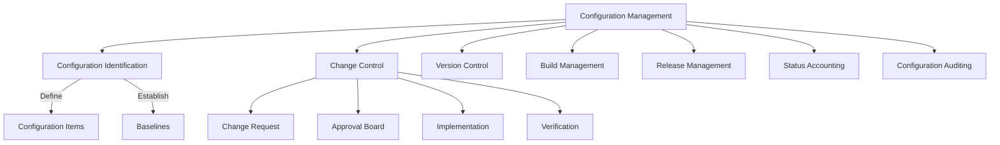
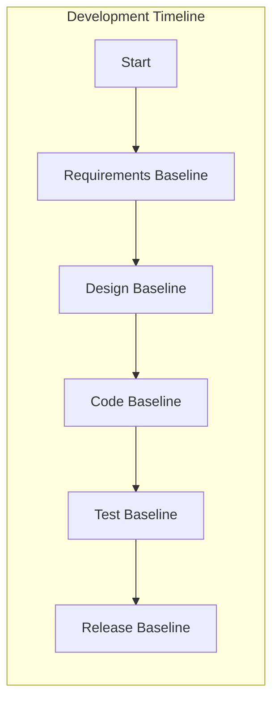
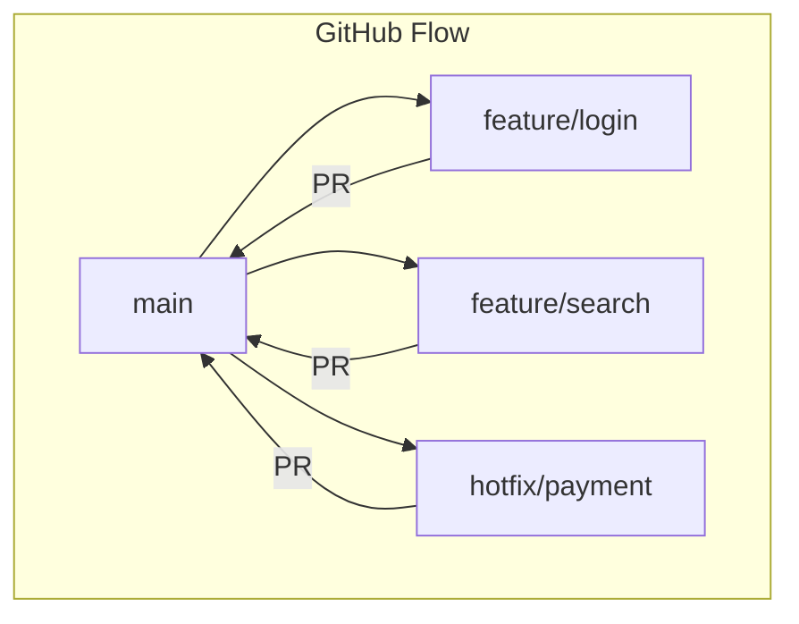
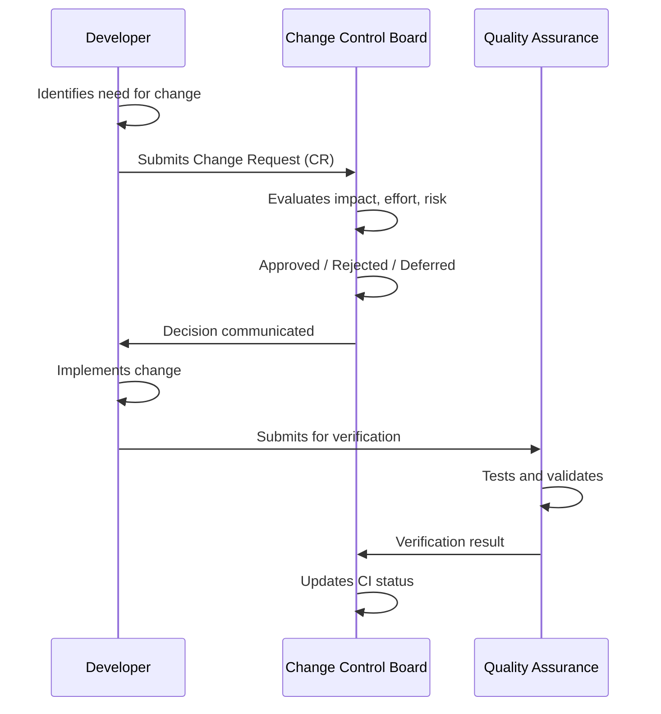
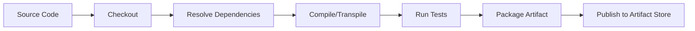

# Configuration Management

## Learning Objectives

After completing this chapter, the student will be able to:
- Explain the purpose and activities of software configuration management (SCM)
- Identify configuration items and establish baselines
- Use version control systems effectively with branching strategies
- Implement change control processes for software projects
- Automate build and release management
- Track configuration status and perform audits
- Implement a TypeScript-based configuration management tool

## Theory

### What is Software Configuration Management?

Software Configuration Management (SCM) is the discipline of controlling the evolution of software systems throughout their lifecycle. It answers the questions: *what changed, who changed it, when, why, and what else was affected?*



### Configuration Items

A **Configuration Item (CI)** is any software artifact that is placed under configuration control. CIs are typically versioned, reviewed, and auditable.

| CI Category | Examples | Version Strategy |
|-------------|----------|------------------|
| **Source code** | `.ts`, `.java`, `.py` files | Per-file or changeset |
| **Documents** | SRS, design docs, test plans | Sequential version number |
| **Build artifacts** | JAR, EXE, Docker images | Semantic versioning |
| **Configuration files** | `application.yml`, `.env` templates | Per-project version |
| **Database schemas** | Migration scripts | Sequential (V1, V2...) |
| **Test data** | Fixtures, seed data | Matches schema version |
| **Tooling** | Build scripts, CI configs | Matches main project |

### Baselines

A **baseline** is a formally reviewed and agreed-upon version of a CI that serves as a foundation for further development. Once baselined, changes require formal change control.



| Baseline | When Established | Contents |
|----------|-----------------|----------|
| **Functional** | Requirements approved | SRS, use cases, user stories |
| **Allocated** | Design approved | Architecture docs, interface specs |
| **Product** | Release | Source code, executables, tests, docs |
| **Developmental** | Sprint/release end | Current state of all CIs at milestone |

### Version Control

Modern version control systems (Git) form the backbone of SCM.

| Concept | Description | Git Command |
|---------|-------------|-------------|
| **Repository** | Central store of all versions | `git init`, `git clone` |
| **Commit** | Snapshot of changes | `git commit -m "message"` |
| **Branch** | Divergent line of development | `git branch <name>` |
| **Tag** | Named reference to a specific commit | `git tag v1.0.0` |
| **Merge** | Integrate changes from one branch to another | `git merge <branch>` |
| **Rebase** | Reapply commits on top of another base | `git rebase <base>` |

#### Branching Strategies

| Strategy | Description | Best For |
|----------|-------------|----------|
| **Git Flow** | Long-lived `main` and `develop` branches; feature, release, hotfix branches | Release-train software |
| **GitHub Flow** | Short-lived feature branches; `main` is always deployable | Continuous deployment |
| **GitLab Flow** | Environment branches (staging, production) + feature branches | Environment-based deployments |
| **Trunk-Based** | Short-lived branches merged to `main` multiple times daily | CI/CD, DevOps teams |



### Change Control

Change control ensures that every change is evaluated, approved, implemented, and verified systematically.



**Change Request (CR) Template:**

| Field | Description |
|-------|-------------|
| CR ID | Unique identifier |
| Title | Short summary |
| Submitter | Person requesting change |
| Date | Submission date |
| Priority | Critical / High / Medium / Low |
| Category | Bug fix / Enhancement / Infrastructure |
| Description | Detailed explanation |
| Impact | Affected CIs, schedule, cost |
| Risk | Low / Medium / High |
| Decision | Approved / Rejected / Deferred |
| Target Version | Version to include the change |

### Build Management

Build management ensures that software can be built consistently and reproducibly.

**Key build management concepts:**
- **Build automation:** Make, Maven, Gradle, npm, Webpack
- **Build script:** Defined, versioned steps to produce deployable artifacts
- **Dependency management:** Maven Central, npm registry, Ivy
- **Build server:** Jenkins, GitHub Actions, GitLab CI
- **Reproducible builds:** Same source always produces identical artifacts



### Release Management

Release management coordinates the deployment of software to production.

**Semantic Versioning (SemVer):** `MAJOR.MINOR.PATCH`

- **MAJOR:** Incompatible API changes
- **MINOR:** Backward-compatible functionality added
- **PATCH:** Backward-compatible bug fixes

**Pre-release suffixes:** `-alpha`, `-beta`, `-rc.1`

**Release process:**
1. Code freeze on release branch
2. Regression testing
3. Release candidate creation
4. Staged deployment (dev → staging → production)
5. Smoke testing in production
6. Tag release in version control
7. Rollback plan in place

### Status Accounting

Status accounting tracks the state of all CIs throughout the project lifecycle.

**Status for each CI:**
- Checked out / Checked in
- Approved
- Under change
- Verified
- Released
- Obsoleted

**Reports produced:**
- CI status report
- Baseline content report
- Change request history
- Release history
- Version tree

### Configuration Auditing

A **configuration audit** verifies that the product matches its documentation and that all CIs are properly managed.

| Audit Type | Focus | Frequency |
|------------|-------|-----------|
| **Functional Configuration Audit (FCA)** | Product meets requirements | Before release |
| **Physical Configuration Audit (PCA)** | Product matches all documentation | Before release |
| **SCM Process Audit** | SCM procedures are followed | Quarterly |
| **In-Progress Audit** | SCM activities on active work | Per milestone |

## Practical Takeaways

1. **Everything that changes should be a CI** — source code, database scripts, build scripts, documentation
2. **Baselines protect against scope creep** — once baselined, changes require formal approval
3. **Branch early, branch often** — branches are cheap; isolation reduces coordination overhead
4. **Automate everything you can** — builds, tests, deployments should be single-command operations
5. **Tag every release** — you cannot inspect a bug in production if you cannot recreate the exact binary
6. **Audit traceability** — every release must trace back to specific commits and change requests

## Examples

### Example 1: Version Manager (SemVer)

```typescript
class Version {
  constructor(
    public readonly major: number,
    public readonly minor: number,
    public readonly patch: number,
    public readonly prerelease?: string,
    public readonly build?: string
  ) {}

  public static parse(versionString: string): Version {
    const regex = /^(\d+)\.(\d+)\.(\d+)(?:-([\w.]+))?(?:\+([\w.]+))?$/;
    const match = versionString.match(regex);
    if (!match) throw new Error(`Invalid version string: ${versionString}`);
    return new Version(
      parseInt(match[1], 10),
      parseInt(match[2], 10),
      parseInt(match[3], 10),
      match[4],
      match[5]
    );
  }

  public bumpMajor(): Version {
    return new Version(this.major + 1, 0, 0);
  }

  public bumpMinor(): Version {
    return new Version(this.major, this.minor + 1, 0);
  }

  public bumpPatch(): Version {
    return new Version(this.major, this.minor, this.patch + 1);
  }

  public compareTo(other: Version): number {
    if (this.major !== other.major) return this.major - other.major;
    if (this.minor !== other.minor) return this.minor - other.minor;
    if (this.patch !== other.patch) return this.patch - other.patch;
    if (this.prerelease && !other.prerelease) return -1;
    if (!this.prerelease && other.prerelease) return 1;
    return (this.prerelease ?? '').localeCompare(other.prerelease ?? '');
  }

  public toString(): string {
    let base = `${this.major}.${this.minor}.${this.patch}`;
    if (this.prerelease) base += `-${this.prerelease}`;
    if (this.build) base += `+${this.build}`;
    return base;
  }
}

// Usage
const v1 = Version.parse('2.3.1');
const v2 = Version.parse('3.0.0-rc.1');
console.log(v1.bumpPatch().toString());   // 2.3.2
console.log(v1.bumpMinor().toString());   // 2.4.0
console.log(v1.bumpMajor().toString());   // 3.0.0
console.log(v2.compareTo(v1));           // 1 (v2 > v1)
```

### Example 2: Change Request Tracker

```typescript
type CRPriority = 'critical' | 'high' | 'medium' | 'low';
type CRStatus = 'submitted' | 'under_review' | 'approved' | 'rejected' | 'implemented' | 'verified';
type CRCategory = 'bug_fix' | 'enhancement' | 'infrastructure' | 'documentation';

interface ChangeRequest {
  id: string;
  title: string;
  submitter: string;
  dateSubmitted: Date;
  description: string;
  priority: CRPriority;
  category: CRCategory;
  impact: string;
  risk: 'low' | 'medium' | 'high';
  affectedCIs: string[];
  status: CRStatus;
  approvedBy?: string;
  targetVersion?: string;
  reviewNotes?: string;
}

class ChangeControlBoard {
  private crs: ChangeRequest[] = [];
  private sequence = 0;

  public submit(
    title: string,
    submitter: string,
    description: string,
    priority: CRPriority,
    category: CRCategory,
    impact: string,
    risk: 'low' | 'medium' | 'high',
    affectedCIs: string[]
  ): ChangeRequest {
    const cr: ChangeRequest = {
      id: `CR-${++this.sequence}`,
      title,
      submitter,
      dateSubmitted: new Date(),
      description,
      priority,
      category,
      impact,
      risk,
      affectedCIs,
      status: 'submitted',
    };
    this.crs.push(cr);
    return cr;
  }

  public review(crId: string, reviewer: string, notes: string): ChangeRequest {
    const cr = this.find(crId);
    cr.status = 'under_review';
    cr.reviewNotes = notes;
    return cr;
  }

  public approve(crId: string, approver: string, targetVersion: string): ChangeRequest {
    const cr = this.find(crId);
    cr.status = 'approved';
    cr.approvedBy = approver;
    cr.targetVersion = targetVersion;
    return cr;
  }

  public reject(crId: string, approver: string): ChangeRequest {
    const cr = this.find(crId);
    cr.status = 'rejected';
    cr.approvedBy = approver;
    return cr;
  }

  public markImplemented(crId: string): ChangeRequest {
    const cr = this.find(crId);
    cr.status = 'implemented';
    return cr;
  }

  public verify(crId: string): ChangeRequest {
    const cr = this.find(crId);
    cr.status = 'verified';
    return cr;
  }

  public getPendingReview(): ChangeRequest[] {
    return this.crs.filter((cr) => cr.status === 'submitted');
  }

  public getByPriority(priority: CRPriority): ChangeRequest[] {
    return this.crs
      .filter((cr) => cr.priority === priority)
      .sort((a, b) => a.dateSubmitted.getTime() - b.dateSubmitted.getTime());
  }

  private find(crId: string): ChangeRequest {
    const cr = this.crs.find((c) => c.id === crId);
    if (!cr) throw new Error(`Change request ${crId} not found`);
    return cr;
  }

  public generateMonthlyReport(year: number, month: number): string {
    const relevant = this.crs.filter((cr) => {
      const d = cr.dateSubmitted;
      return d.getFullYear() === year && d.getMonth() === month - 1;
    });
    const approved = relevant.filter((cr) => cr.status === 'approved').length;
    const rejected = relevant.filter((cr) => cr.status === 'rejected').length;
    return [
      `Monthly CR Report: ${year}-${month.toString().padStart(2, '0')}`,
      `Total CRs: ${relevant.length}`,
      `Approved: ${approved}`,
      `Rejected: ${rejected}`,
      `Pending: ${relevant.filter((cr) => cr.status === 'submitted' || cr.status === 'under_review').length}`,
    ].join('\n');
  }
}
```

### Example 3: Baseline Manager

```typescript
interface BaselineRecord {
  id: string;
  name: string;
  type: 'functional' | 'allocated' | 'product' | 'developmental';
  createdAt: Date;
  approvedBy: string;
  items: string[]; // CI identifiers
}

interface CIStatus {
  id: string;
  name: string;
  version: string;
  status: 'checked_in' | 'checked_out' | 'under_review' | 'approved' | 'released';
  lastModified: Date;
  modifiedBy: string;
}

class BaselineManager {
  private baselines: BaselineRecord[] = [];
  private cis: Map<string, CIStatus> = new Map();

  public registerCI(id: string, name: string, version: string): void {
    this.cis.set(id, {
      id,
      name,
      version,
      status: 'checked_in',
      lastModified: new Date(),
      modifiedBy: 'system',
    });
  }

  public createBaseline(
    name: string,
    type: BaselineRecord['type'],
    approvedBy: string,
    ciIds: string[]
  ): BaselineRecord {
    // All CIs must exist
    for (const ciId of ciIds) {
      if (!this.cis.has(ciId)) {
        throw new Error(`CI ${ciId} not registered`);
      }
    }

    const baseline: BaselineRecord = {
      id: `BL-${this.baselines.length + 1}`,
      name,
      type,
      createdAt: new Date(),
      approvedBy,
      items: [...ciIds],
    };
    this.baselines.push(baseline);
    return baseline;
  }

  public getBaselineContents(baselineId: string): CIStatus[] {
    const baseline = this.baselines.find((b) => b.id === baselineId);
    if (!baseline) throw new Error(`Baseline ${baselineId} not found`);
    return baseline.items.map((ciId) => {
      const ci = this.cis.get(ciId);
      if (!ci) throw new Error(`CI ${ciId} not found`);
      return ci;
    });
  }

  public isCIAffectedByBaseline(ciId: string, baselineId: string): boolean {
    const baseline = this.baselines.find((b) => b.id === baselineId);
    if (!baseline) return false;
    return baseline.items.includes(ciId);
  }

  public getBaselinesByType(type: BaselineRecord['type']): BaselineRecord[] {
    return this.baselines
      .filter((b) => b.type === type)
      .sort((a, b) => b.createdAt.getTime() - a.createdAt.getTime());
  }

  public checkInCI(ciId: string, user: string): void {
    const ci = this.cis.get(ciId);
    if (!ci) throw new Error(`CI ${ciId} not found`);
    ci.status = 'checked_in';
    ci.lastModified = new Date();
    ci.modifiedBy = user;
  }

  public checkOutCI(ciId: string, user: string): void {
    const ci = this.cis.get(ciId);
    if (!ci) throw new Error(`CI ${ciId} not found`);
    if (ci.status === 'approved' || ci.status === 'released') {
      throw new Error(`Cannot check out released CI ${ciId}`);
    }
    ci.status = 'checked_out';
    ci.lastModified = new Date();
    ci.modifiedBy = user;
  }

  public generateAuditReport(): string {
    const approvedBaselines = this.baselines.filter(
      (b) => b.type === 'functional' || b.type === 'allocated' || b.type === 'product'
    );
    const unmatched: string[] = [];
    for (const bl of approvedBaselines) {
      for (const ciId of bl.items) {
        const ci = this.cis.get(ciId);
        if (ci && ci.status !== 'released' && ci.status !== 'approved') {
          unmatched.push(`CI ${ciId} in baseline ${bl.id} has status ${ci?.status}`);
        }
      }
    }
    return [
      '=== Configuration Audit Report ===',
      `Total Baselines: ${this.baselines.length}`,
      `Total CIs registered: ${this.cis.size}`,
      `Anomalies found: ${unmatched.length}`,
      ...unmatched.map((u) => `  WARNING: ${u}`),
    ].join('\n');
  }
}
```

### Example 4: Build Pipeline Script (GitHub Actions)

```yaml
name: Build and Deploy

on:
  push:
    branches:
      - main
      - 'release/*'
  pull_request:
    branches:
      - main

jobs:
  build:
    runs-on: ubuntu-latest
    
    steps:
      - name: Checkout code
        uses: actions/checkout@v3
        with:
          fetch-depth: 0
      
      - name: Setup Node.js
        uses: actions/setup-node@v3
        with:
          node-version: '20'
          cache: 'npm'
      
      - name: Install dependencies
        run: npm ci
      
      - name: Lint
        run: npm run lint
      
      - name: Type check
        run: npx tsc --noEmit
      
      - name: Run tests
        run: npm test -- --coverage
      
      - name: Build
        run: npm run build
      
      - name: Determine version and tag
        id: version
        run: |
          if [[ "${{ github.ref }}" == refs/tags/* ]]; then
            echo "version=${GITHUB_REF#refs/tags/}" >> $GITHUB_OUTPUT
          else
            echo "version=$(node -p "require('./package.json').version")-ci.${GITHUB_RUN_NUMBER}" >> $GITHUB_OUTPUT
          fi
      
      - name: Publish artifact
        uses: actions/upload-artifact@v3
        with:
          name: build-${{ steps.version.outputs.version }}
          path: dist/
      
      - name: Deploy to staging
        if: github.ref == 'refs/heads/main'
        run: |
          echo "Deploying version ${{ steps.version.outputs.version }} to staging"
          # ./deploy.sh staging
```

### Example 5: Automation Script Template

```typescript
import { execSync } from 'child_process';
import * as fs from 'fs';
import * as path from 'path';

class ReleaseManager {
  constructor(
    private readonly workspaceDir: string,
    private readonly versionFile: string
  ) {}

  public async executeRelease(
    bumpType: 'major' | 'minor' | 'patch'
  ): Promise<void> {
    // 1. Ensure working directory is clean
    this.ensureCleanWorkspace();

    // 2. Bump version
    const newVersion = this.bumpVersion(bumpType);

    // 3. Run quality checks
    this.runQualityChecks();

    // 4. Build
    this.runBuild();

    // 5. Create git tag
    this.createGitTag(newVersion);

    // 6. Push tag
    this.pushTag(newVersion);

    console.log(`Release ${newVersion} created successfully`);
  }

  private ensureCleanWorkspace(): void {
    const status = execSync('git status --porcelain', {
      cwd: this.workspaceDir,
    }).toString().trim();
    if (status) {
      throw new Error('Working directory has uncommitted changes');
    }
  }

  private bumpVersion(type: 'major' | 'minor' | 'patch'): string {
    const oldVersion = JSON.parse(
      fs.readFileSync(
        path.join(this.workspaceDir, this.versionFile),
        'utf-8'
      )
    ).version;
    const parts = oldVersion.split('.').map(Number);
    switch (type) {
      case 'major': return `${parts[0] + 1}.0.0`;
      case 'minor': return `${parts[0]}.${parts[1] + 1}.0`;
      case 'patch': return `${parts[0]}.${parts[1]}.${parts[2] + 1}`;
    }
  }

  private runQualityChecks(): void {
    execSync('npm run lint', { cwd: this.workspaceDir, stdio: 'inherit' });
    execSync('npm test', { cwd: this.workspaceDir, stdio: 'inherit' });
    execSync('npx tsc --noEmit', { cwd: this.workspaceDir, stdio: 'inherit' });
  }

  private runBuild(): void {
    execSync('npm run build', { cwd: this.workspaceDir, stdio: 'inherit' });
  }

  private createGitTag(version: string): void {
    execSync(`git tag -a v${version} -m "Release v${version}"`, {
      cwd: this.workspaceDir,
    });
  }

  private pushTag(version: string): void {
    execSync(`git push origin v${version}`, {
      cwd: this.workspaceDir,
    });
  }
}
```

## Chapter Quiz

**Q1: What is a configuration item?**
- A) Any hardware component in the system
- B) Any software artifact placed under configuration control
- C) Only the final executable binary
- D) The project schedule

**Answer: B** — A CI is any software artifact that is versioned, reviewed, and auditable.

**Q2: A baseline is defined as:**
- A) The last version of the code
- B) A formally reviewed version of a CI that serves as a foundation
- C) The minimum hardware requirements
- D) A performance benchmark

**Answer: B** — Baselines are formally agreed-upon versions for further development.

**Q3: In semantic versioning 2.3.1, incrementing the MINOR version produces:**
- A) 2.3.2
- B) 2.4.0
- C) 3.0.0
- D) 2.4.1

**Answer: B** — `bumpMinor` increments minor and resets patch to 0.

**Q4: The branching strategy where main is always deployable and feature branches are short-lived is called:**
- A) Git Flow
- B) GitHub Flow
- C) GitLab Flow
- D) Trunk-Based Development

**Answer: B** — GitHub Flow uses short-lived feature branches merged to main.

**Q5: What is the purpose of a Functional Configuration Audit (FCA)?**
- A) Verify code style compliance
- B) Verify the product meets requirements
- C) Verify build times are acceptable
- D) Verify developer productivity

**Answer: B** — FCA verifies that the product functionally meets its requirements.

## Summary

Software Configuration Management controls the evolution of software through identification of configuration items, establishment of baselines, version control, change control, build and release management, status accounting, and configuration auditing. Git provides powerful version control with branching strategies such as Git Flow, GitHub Flow, GitLab Flow, and trunk-based development. Formal change control ensures that all changes are evaluated and approved. Semantic versioning (MAJOR.MINOR.PATCH) communicates compatibility. Automation of builds and releases reduces human error. Configuration audits verify product integrity. SCM is essential for team collaboration, regulatory compliance, and reproducible software delivery.

## Exercises

### Review Questions

1. What are the seven activities of software configuration management?
2. What distinguishes a functional baseline from a product baseline?
3. Explain the difference between Git Flow and GitHub Flow.
4. What fields does a change request typically include?
5. What do MAJOR, MINOR, and PATCH signify in semantic versioning?
6. What is the purpose of a configuration audit?

### Application Problems

1. Design a branching strategy for a team of 15 developers working on a microservices platform that releases monthly. Draw the branch structure and define rules for each branch type.

2. Create a change request for adding a new payment gateway integration to an e-commerce system. Complete all fields in the CR template and simulate the CCB review process.

3. Using the Version class, calculate the next version for releases in these scenarios:
   - Current 1.3.2, adding backward-compatible API
   - Current 2.0.0, breaking API change to authentication
   - Current 4.7.9, critical bug fix

### Challenge Problem

You are the SCM lead for a safety-critical medical device software project that must comply with IEC 62304 and FDA 21 CFR Part 820. Define a comprehensive SCM strategy including CI identification, baseline establishment at each phase, change control with traceability to requirements and tests, build reproducibility (reproducible builds), audit trails for every change, and release management with electronic signatures. Implement a TypeScript program that enforces change control workflows: all changes to released CIs must go through CCB approval, with automatic notification to QA and documentation of each step.
